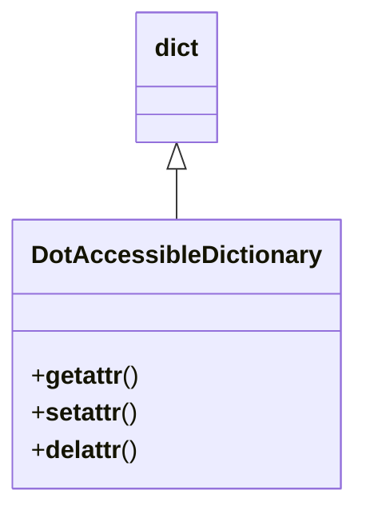

# Diagram: partview_core/partview_service/partview_service/aws/DotAccessibleDictionary.py

> Auto-generated by Obscura crawlers

## Mermaid

### SVG

<svg id="container" width="217.140625" xmlns="http://www.w3.org/2000/svg" class="classDiagram" height="324" viewBox="0 0 217.140625 324" role="graphics-document document" aria-roledescription="class"><g><defs><marker id="container_class-aggregationStart" class="marker aggregation class" refX="18" refY="7" markerWidth="190" markerHeight="240" orient="auto"><path d="M 18,7 L9,13 L1,7 L9,1 Z"></path></marker></defs><defs><marker id="container_class-aggregationEnd" class="marker aggregation class" refX="1" refY="7" markerWidth="20" markerHeight="28" orient="auto"><path d="M 18,7 L9,13 L1,7 L9,1 Z"></path></marker></defs><defs><marker id="container_class-extensionStart" class="marker extension class" refX="18" refY="7" markerWidth="190" markerHeight="240" orient="auto"><path d="M 1,7 L18,13 V 1 Z"></path></marker></defs><defs><marker id="container_class-extensionEnd" class="marker extension class" refX="1" refY="7" markerWidth="20" markerHeight="28" orient="auto"><path d="M 1,1 V 13 L18,7 Z"></path></marker></defs><defs><marker id="container_class-compositionStart" class="marker composition class" refX="18" refY="7" markerWidth="190" markerHeight="240" orient="auto"><path d="M 18,7 L9,13 L1,7 L9,1 Z"></path></marker></defs><defs><marker id="container_class-compositionEnd" class="marker composition class" refX="1" refY="7" markerWidth="20" markerHeight="28" orient="auto"><path d="M 18,7 L9,13 L1,7 L9,1 Z"></path></marker></defs><defs><marker id="container_class-dependencyStart" class="marker dependency class" refX="6" refY="7" markerWidth="190" markerHeight="240" orient="auto"><path d="M 5,7 L9,13 L1,7 L9,1 Z"></path></marker></defs><defs><marker id="container_class-dependencyEnd" class="marker dependency class" refX="13" refY="7" markerWidth="20" markerHeight="28" orient="auto"><path d="M 18,7 L9,13 L14,7 L9,1 Z"></path></marker></defs><defs><marker id="container_class-lollipopStart" class="marker lollipop class" refX="13" refY="7" markerWidth="190" markerHeight="240" orient="auto"><circle stroke="black" fill="transparent" cx="7" cy="7" r="6"></circle></marker></defs><defs><marker id="container_class-lollipopEnd" class="marker lollipop class" refX="1" refY="7" markerWidth="190" markerHeight="240" orient="auto"><circle stroke="black" fill="transparent" cx="7" cy="7" r="6"></circle></marker></defs><g class="root"><g class="clusters"></g><g class="edgePaths"><path d="M108.57,109.25L108.57,110.542C108.57,111.833,108.57,114.417,108.57,119.875C108.57,125.333,108.57,133.667,108.57,137.833L108.57,142" id="id_dict_DotAccessibleDictionary_1" class="edge-thickness-normal edge-pattern-solid relation" style=";;;" data-edge="true" data-et="edge" data-id="id_dict_DotAccessibleDictionary_1" data-points="W3sieCI6MTA4LjU3MDMxMjUsInkiOjkyfSx7IngiOjEwOC41NzAzMTI1LCJ5IjoxMTd9LHsieCI6MTA4LjU3MDMxMjUsInkiOjE0Mn1d" marker-start="url(#container_class-extensionStart)"></path></g><g class="edgeLabels"><g class="edgeLabel"><g class="label" data-id="id_dict_DotAccessibleDictionary_1" transform="translate(0, 0)"><foreignObject width="0" height="0">

</foreignObject></g></g></g><g class="nodes"><g class="node default" id="classId-dict-0" transform="translate(108.5703125, 50)"><g class="basic label-container"><path d="M-25.9765625 -42 L25.9765625 -42 L25.9765625 42 L-25.9765625 42" stroke="none" stroke-width="0" fill="#ECECFF" style=""></path><path d="M-25.9765625 -42 C-12.155852169584104 -42, 1.6648581608317912 -42, 25.9765625 -42 M-25.9765625 -42 C-11.835861962624607 -42, 2.304838574750786 -42, 25.9765625 -42 M25.9765625 -42 C25.9765625 -14.01439813715334, 25.9765625 13.971203725693321, 25.9765625 42 M25.9765625 -42 C25.9765625 -24.541321520428347, 25.9765625 -7.082643040856695, 25.9765625 42 M25.9765625 42 C10.030474197825594 42, -5.915614104348812 42, -25.9765625 42 M25.9765625 42 C7.27008207775615 42, -11.4363983444877 42, -25.9765625 42 M-25.9765625 42 C-25.9765625 18.787146869816866, -25.9765625 -4.425706260366269, -25.9765625 -42 M-25.9765625 42 C-25.9765625 22.30765093380135, -25.9765625 2.615301867602703, -25.9765625 -42" stroke="#9370DB" stroke-width="1.3" fill="none" stroke-dasharray="0 0" style=""></path></g><g class="annotation-group text" transform="translate(0, -18)"></g><g class="label-group text" transform="translate(-13.9765625, -18)"><g class="label" style="font-weight: bolder" transform="translate(0,-12)"><foreignObject width="27.953125" height="24">

dict

</foreignObject></g></g><g class="members-group text" transform="translate(-13.9765625, 30)"></g><g class="methods-group text" transform="translate(-13.9765625, 60)"></g><g class="divider" style=""><path d="M-25.9765625 6 C-7.92892402462877 6, 10.11871445074246 6, 25.9765625 6 M-25.9765625 6 C-10.870774224731468 6, 4.235014050537064 6, 25.9765625 6" stroke="#9370DB" stroke-width="1.3" fill="none" stroke-dasharray="0 0" style=""></path></g><g class="divider" style=""><path d="M-25.9765625 24 C-14.731668860778848 24, -3.4867752215576964 24, 25.9765625 24 M-25.9765625 24 C-14.576172819774945 24, -3.175783139549889 24, 25.9765625 24" stroke="#9370DB" stroke-width="1.3" fill="none" stroke-dasharray="0 0" style=""></path></g></g><g class="node default" id="classId-DotAccessibleDictionary-1" transform="translate(108.5703125, 229)"><g class="basic label-container"><path d="M-100.5703125 -87 L100.5703125 -87 L100.5703125 87 L-100.5703125 87" stroke="none" stroke-width="0" fill="#ECECFF" style=""></path><path d="M-100.5703125 -87 C-43.46585879313994 -87, 13.638594913720127 -87, 100.5703125 -87 M-100.5703125 -87 C-27.418736388332945 -87, 45.73283972333411 -87, 100.5703125 -87 M100.5703125 -87 C100.5703125 -38.09453931725799, 100.5703125 10.81092136548402, 100.5703125 87 M100.5703125 -87 C100.5703125 -41.127370757760225, 100.5703125 4.74525848447955, 100.5703125 87 M100.5703125 87 C31.567795251715722 87, -37.434721996568555 87, -100.5703125 87 M100.5703125 87 C29.22023166437387 87, -42.12984917125226 87, -100.5703125 87 M-100.5703125 87 C-100.5703125 24.74836471125562, -100.5703125 -37.50327057748876, -100.5703125 -87 M-100.5703125 87 C-100.5703125 37.58405400790299, -100.5703125 -11.831891984194016, -100.5703125 -87" stroke="#9370DB" stroke-width="1.3" fill="none" stroke-dasharray="0 0" style=""></path></g><g class="annotation-group text" transform="translate(0, -63)"></g><g class="label-group text" transform="translate(-88.5703125, -63)"><g class="label" style="font-weight: bolder" transform="translate(0,-12)"><foreignObject width="177.140625" height="24">

DotAccessibleDictionary

</foreignObject></g></g><g class="members-group text" transform="translate(-88.5703125, -15)"></g><g class="methods-group text" transform="translate(-88.5703125, 15)"><g class="label" style="" transform="translate(0,-12)"><foreignObject width="69.1875" height="24">

+<strong>getattr</strong>()

</foreignObject></g><g class="label" style="" transform="translate(0,12)"><foreignObject width="68.453125" height="24">

+<strong>setattr</strong>()

</foreignObject></g><g class="label" style="" transform="translate(0,36)"><foreignObject width="69" height="24">

+<strong>delattr</strong>()

</foreignObject></g></g><g class="divider" style=""><path d="M-100.5703125 -39 C-25.105437733522862 -39, 50.359437032954276 -39, 100.5703125 -39 M-100.5703125 -39 C-37.50806128846604 -39, 25.554189923067923 -39, 100.5703125 -39" stroke="#9370DB" stroke-width="1.3" fill="none" stroke-dasharray="0 0" style=""></path></g><g class="divider" style=""><path d="M-100.5703125 -15 C-25.405920523461177 -15, 49.75847145307765 -15, 100.5703125 -15 M-100.5703125 -15 C-37.46931635095064 -15, 25.631679798098716 -15, 100.5703125 -15" stroke="#9370DB" stroke-width="1.3" fill="none" stroke-dasharray="0 0" style=""></path></g></g></g></g></g></svg>
