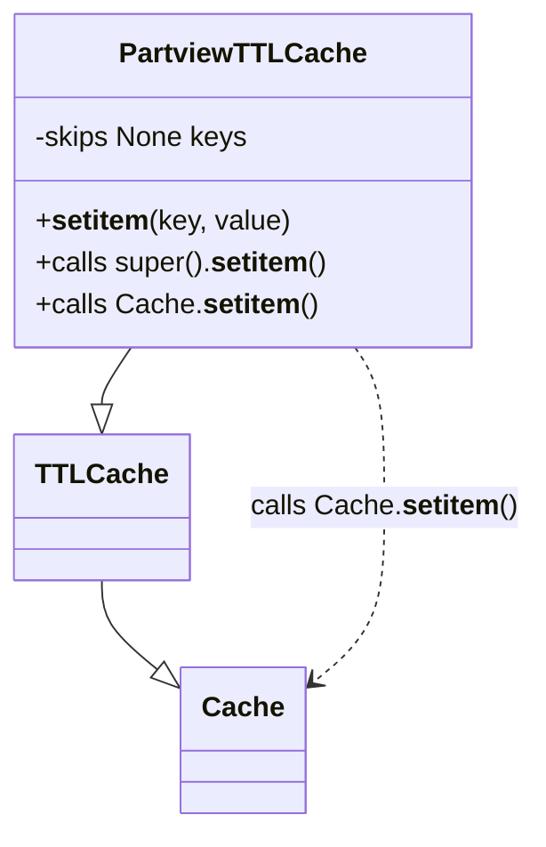

# Diagram: partview_core/partview_service/partview_service/aws/PartviewTTLCache.py

> Auto-generated by Obscura crawlers

## Mermaid

### SVG

<svg id="container" width="297.21484375" xmlns="http://www.w3.org/2000/svg" class="classDiagram" height="476" viewBox="0 0 297.21484375 476" role="graphics-document document" aria-roledescription="class"><g><defs><marker id="container_class-aggregationStart" class="marker aggregation class" refX="18" refY="7" markerWidth="190" markerHeight="240" orient="auto"><path d="M 18,7 L9,13 L1,7 L9,1 Z"></path></marker></defs><defs><marker id="container_class-aggregationEnd" class="marker aggregation class" refX="1" refY="7" markerWidth="20" markerHeight="28" orient="auto"><path d="M 18,7 L9,13 L1,7 L9,1 Z"></path></marker></defs><defs><marker id="container_class-extensionStart" class="marker extension class" refX="18" refY="7" markerWidth="190" markerHeight="240" orient="auto"><path d="M 1,7 L18,13 V 1 Z"></path></marker></defs><defs><marker id="container_class-extensionEnd" class="marker extension class" refX="1" refY="7" markerWidth="20" markerHeight="28" orient="auto"><path d="M 1,1 V 13 L18,7 Z"></path></marker></defs><defs><marker id="container_class-compositionStart" class="marker composition class" refX="18" refY="7" markerWidth="190" markerHeight="240" orient="auto"><path d="M 18,7 L9,13 L1,7 L9,1 Z"></path></marker></defs><defs><marker id="container_class-compositionEnd" class="marker composition class" refX="1" refY="7" markerWidth="20" markerHeight="28" orient="auto"><path d="M 18,7 L9,13 L1,7 L9,1 Z"></path></marker></defs><defs><marker id="container_class-dependencyStart" class="marker dependency class" refX="6" refY="7" markerWidth="190" markerHeight="240" orient="auto"><path d="M 5,7 L9,13 L1,7 L9,1 Z"></path></marker></defs><defs><marker id="container_class-dependencyEnd" class="marker dependency class" refX="13" refY="7" markerWidth="20" markerHeight="28" orient="auto"><path d="M 18,7 L9,13 L14,7 L9,1 Z"></path></marker></defs><defs><marker id="container_class-lollipopStart" class="marker lollipop class" refX="13" refY="7" markerWidth="190" markerHeight="240" orient="auto"><circle stroke="black" fill="transparent" cx="7" cy="7" r="6"></circle></marker></defs><defs><marker id="container_class-lollipopEnd" class="marker lollipop class" refX="1" refY="7" markerWidth="190" markerHeight="240" orient="auto"><circle stroke="black" fill="transparent" cx="7" cy="7" r="6"></circle></marker></defs><g class="root"><g class="clusters"></g><g class="edgePaths"><path d="M58.098,334L58.098,338.167C58.098,342.333,58.098,350.667,63.299,359.297C68.501,367.928,78.904,376.856,84.106,381.319L89.308,385.783" id="id_TTLCache_Cache_1" class="edge-thickness-normal edge-pattern-solid relation" style=";;;" data-edge="true" data-et="edge" data-id="id_TTLCache_Cache_1" data-points="W3sieCI6NTguMDk3NjU2MjUsInkiOjMzNH0seyJ4Ijo1OC4wOTc2NTYyNSwieSI6MzU5fSx7IngiOjEwMi4zOTg0Mzc1LCJ5IjozOTcuMDE3MDYxMDg5NzA4M31d" marker-end="url(#container_class-extensionEnd)"></path><path d="M74.229,200L71.54,204.167C68.852,208.333,63.475,216.667,60.786,222.125C58.098,227.583,58.098,230.167,58.098,231.458L58.098,232.75" id="id_PartviewTTLCache_TTLCache_2" class="edge-thickness-normal edge-pattern-solid relation" style=";;;" data-edge="true" data-et="edge" data-id="id_PartviewTTLCache_TTLCache_2" data-points="W3sieCI6NzQuMjI4NjkzMTgxODE4MTksInkiOjIwMH0seyJ4Ijo1OC4wOTc2NTYyNSwieSI6MjI1fSx7IngiOjU4LjA5NzY1NjI1LCJ5IjoyNTB9XQ==" marker-end="url(#container_class-extensionEnd)"></path><path d="M198.115,200L200.804,204.167C203.492,208.333,208.869,216.667,211.558,232C214.246,247.333,214.246,269.667,214.246,292C214.246,314.333,214.246,336.667,207.622,353.518C200.997,370.37,187.748,381.74,181.123,387.425L174.499,393.11" id="id_PartviewTTLCache_Cache_3" class="edge-thickness-normal edge-pattern-dashed relation" style=";;;" data-edge="true" data-et="edge" data-id="id_PartviewTTLCache_Cache_3" data-points="W3sieCI6MTk4LjExNTA1NjgxODE4MTgsInkiOjIwMH0seyJ4IjoyMTQuMjQ2MDkzNzUsInkiOjIyNX0seyJ4IjoyMTQuMjQ2MDkzNzUsInkiOjI5Mn0seyJ4IjoyMTQuMjQ2MDkzNzUsInkiOjM1OX0seyJ4IjoxNjkuOTQ1MzEyNSwieSI6Mzk3LjAxNzA2MTA4OTcwODN9XQ==" marker-end="url(#container_class-dependencyEnd)"></path></g><g class="edgeLabels"><g class="edgeLabel"><g class="label" data-id="id_TTLCache_Cache_1" transform="translate(0, 0)"><foreignObject width="0" height="0">

</foreignObject></g></g><g class="edgeLabel"><g class="label" data-id="id_PartviewTTLCache_TTLCache_2" transform="translate(0, 0)"><foreignObject width="0" height="0">

</foreignObject></g></g><g class="edgeLabel" transform="translate(214.24609375, 292)"><g class="label" data-id="id_PartviewTTLCache_Cache_3" transform="translate(-74.96875, -12)"><foreignObject width="149.9375" height="24">

calls Cache.<strong>setitem</strong>()

</foreignObject></g></g></g><g class="nodes"><g class="node default" id="classId-Cache-0" transform="translate(136.171875, 426)"><g class="basic label-container"><path d="M-33.7734375 -42 L33.7734375 -42 L33.7734375 42 L-33.7734375 42" stroke="none" stroke-width="0" fill="#ECECFF" style=""></path><path d="M-33.7734375 -42 C-9.338095074285235 -42, 15.09724735142953 -42, 33.7734375 -42 M-33.7734375 -42 C-19.871073529620112 -42, -5.968709559240228 -42, 33.7734375 -42 M33.7734375 -42 C33.7734375 -17.284317035388334, 33.7734375 7.4313659292233325, 33.7734375 42 M33.7734375 -42 C33.7734375 -20.577362769771142, 33.7734375 0.8452744604577163, 33.7734375 42 M33.7734375 42 C18.701717159023538 42, 3.629996818047079 42, -33.7734375 42 M33.7734375 42 C15.489387707462537 42, -2.7946620850749255 42, -33.7734375 42 M-33.7734375 42 C-33.7734375 21.1968709307012, -33.7734375 0.39374186140239686, -33.7734375 -42 M-33.7734375 42 C-33.7734375 22.192799086033634, -33.7734375 2.3855981720672688, -33.7734375 -42" stroke="#9370DB" stroke-width="1.3" fill="none" stroke-dasharray="0 0" style=""></path></g><g class="annotation-group text" transform="translate(0, -18)"></g><g class="label-group text" transform="translate(-21.7734375, -18)"><g class="label" style="font-weight: bolder" transform="translate(0,-12)"><foreignObject width="43.546875" height="24">

Cache

</foreignObject></g></g><g class="members-group text" transform="translate(-21.7734375, 30)"></g><g class="methods-group text" transform="translate(-21.7734375, 60)"></g><g class="divider" style=""><path d="M-33.7734375 6 C-6.8647339774460825 6, 20.043969545107835 6, 33.7734375 6 M-33.7734375 6 C-12.627022092632487 6, 8.519393314735026 6, 33.7734375 6" stroke="#9370DB" stroke-width="1.3" fill="none" stroke-dasharray="0 0" style=""></path></g><g class="divider" style=""><path d="M-33.7734375 24 C-16.41376742622087 24, 0.9459026475582633 24, 33.7734375 24 M-33.7734375 24 C-10.471707950664094 24, 12.830021598671813 24, 33.7734375 24" stroke="#9370DB" stroke-width="1.3" fill="none" stroke-dasharray="0 0" style=""></path></g></g><g class="node default" id="classId-TTLCache-1" transform="translate(58.09765625, 292)"><g class="basic label-container"><path d="M-46.1796875 -42 L46.1796875 -42 L46.1796875 42 L-46.1796875 42" stroke="none" stroke-width="0" fill="#ECECFF" style=""></path><path d="M-46.1796875 -42 C-10.47884374930436 -42, 25.22200000139128 -42, 46.1796875 -42 M-46.1796875 -42 C-23.072375975463963 -42, 0.03493554907207397 -42, 46.1796875 -42 M46.1796875 -42 C46.1796875 -11.994757911572155, 46.1796875 18.01048417685569, 46.1796875 42 M46.1796875 -42 C46.1796875 -18.902042576405908, 46.1796875 4.195914847188185, 46.1796875 42 M46.1796875 42 C25.697647864496364 42, 5.215608228992728 42, -46.1796875 42 M46.1796875 42 C24.452523532396302 42, 2.7253595647926048 42, -46.1796875 42 M-46.1796875 42 C-46.1796875 21.83537315789581, -46.1796875 1.670746315791618, -46.1796875 -42 M-46.1796875 42 C-46.1796875 14.831254149281207, -46.1796875 -12.337491701437585, -46.1796875 -42" stroke="#9370DB" stroke-width="1.3" fill="none" stroke-dasharray="0 0" style=""></path></g><g class="annotation-group text" transform="translate(0, -18)"></g><g class="label-group text" transform="translate(-34.1796875, -18)"><g class="label" style="font-weight: bolder" transform="translate(0,-12)"><foreignObject width="68.359375" height="24">

TTLCache

</foreignObject></g></g><g class="members-group text" transform="translate(-34.1796875, 30)"></g><g class="methods-group text" transform="translate(-34.1796875, 60)"></g><g class="divider" style=""><path d="M-46.1796875 6 C-27.338327515789572 6, -8.496967531579145 6, 46.1796875 6 M-46.1796875 6 C-23.437693970850656 6, -0.6957004417013124 6, 46.1796875 6" stroke="#9370DB" stroke-width="1.3" fill="none" stroke-dasharray="0 0" style=""></path></g><g class="divider" style=""><path d="M-46.1796875 24 C-19.624951877774752 24, 6.929783744450496 24, 46.1796875 24 M-46.1796875 24 C-18.68535062732631 24, 8.808986245347377 24, 46.1796875 24" stroke="#9370DB" stroke-width="1.3" fill="none" stroke-dasharray="0 0" style=""></path></g></g><g class="node default" id="classId-PartviewTTLCache-2" transform="translate(136.171875, 104)"><g class="basic label-container"><path d="M-128.171875 -96 L128.171875 -96 L128.171875 96 L-128.171875 96" stroke="none" stroke-width="0" fill="#ECECFF" style=""></path><path d="M-128.171875 -96 C-48.62336507833379 -96, 30.92514484333242 -96, 128.171875 -96 M-128.171875 -96 C-54.47264237652219 -96, 19.226590246955624 -96, 128.171875 -96 M128.171875 -96 C128.171875 -30.50301937487791, 128.171875 34.99396125024418, 128.171875 96 M128.171875 -96 C128.171875 -26.555680754572222, 128.171875 42.888638490855556, 128.171875 96 M128.171875 96 C71.44378528691031 96, 14.715695573820625 96, -128.171875 96 M128.171875 96 C66.75852989063057 96, 5.345184781261125 96, -128.171875 96 M-128.171875 96 C-128.171875 31.698048596230834, -128.171875 -32.60390280753833, -128.171875 -96 M-128.171875 96 C-128.171875 32.5571270941621, -128.171875 -30.885745811675804, -128.171875 -96" stroke="#9370DB" stroke-width="1.3" fill="none" stroke-dasharray="0 0" style=""></path></g><g class="annotation-group text" transform="translate(0, -72)"></g><g class="label-group text" transform="translate(-65.96875, -72)"><g class="label" style="font-weight: bolder" transform="translate(0,-12)"><foreignObject width="131.9375" height="24">

PartviewTTLCache

</foreignObject></g></g><g class="members-group text" transform="translate(-116.171875, -24)"><g class="label" style="" transform="translate(0,-12)"><foreignObject width="122.390625" height="24">

-skips None keys

</foreignObject></g></g><g class="methods-group text" transform="translate(-116.171875, 24)"><g class="label" style="" transform="translate(0,-12)"><foreignObject width="144.75" height="24">

+<strong>setitem</strong>(key, value)

</foreignObject></g><g class="label" style="" transform="translate(0,12)"><foreignObject width="166.375" height="24">

+calls super().<strong>setitem</strong>()

</foreignObject></g><g class="label" style="" transform="translate(0,36)"><foreignObject width="157.921875" height="24">

+calls Cache.<strong>setitem</strong>()

</foreignObject></g></g><g class="divider" style=""><path d="M-128.171875 -48 C-75.96378268360883 -48, -23.755690367217653 -48, 128.171875 -48 M-128.171875 -48 C-26.975925102701197 -48, 74.2200247945976 -48, 128.171875 -48" stroke="#9370DB" stroke-width="1.3" fill="none" stroke-dasharray="0 0" style=""></path></g><g class="divider" style=""><path d="M-128.171875 0 C-27.228142049316546 0, 73.71559090136691 0, 128.171875 0 M-128.171875 0 C-35.80785409718156 0, 56.55616680563688 0, 128.171875 0" stroke="#9370DB" stroke-width="1.3" fill="none" stroke-dasharray="0 0" style=""></path></g></g></g></g></g></svg>
