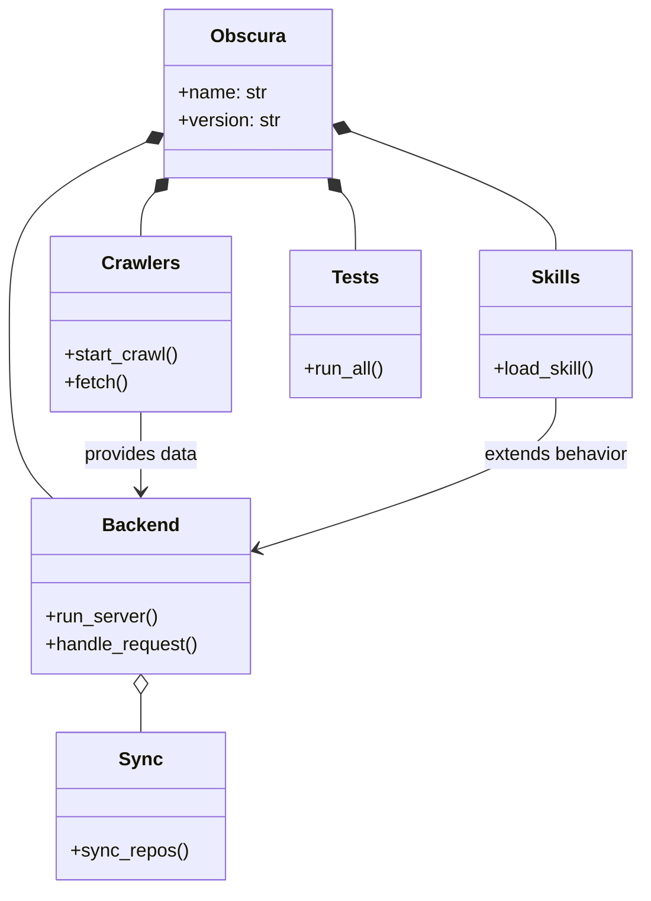
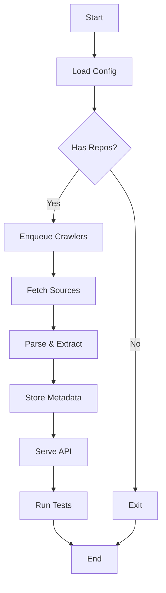

# Diagram: partview_core/partview_service/partview_service/core/__init__.py

> Auto-generated by Obscura crawlers

## Diagram 1

### SVG

<svg id="container" width="549.125244140625" xmlns="http://www.w3.org/2000/svg" class="classDiagram" height="760" viewBox="-18.2189998626709 0 549.125244140625 760" role="graphics-document document" aria-roledescription="class"><g><defs><marker id="container_class-aggregationStart" class="marker aggregation class" refX="18" refY="7" markerWidth="190" markerHeight="240" orient="auto"><path d="M 18,7 L9,13 L1,7 L9,1 Z"></path></marker></defs><defs><marker id="container_class-aggregationEnd" class="marker aggregation class" refX="1" refY="7" markerWidth="20" markerHeight="28" orient="auto"><path d="M 18,7 L9,13 L1,7 L9,1 Z"></path></marker></defs><defs><marker id="container_class-extensionStart" class="marker extension class" refX="18" refY="7" markerWidth="190" markerHeight="240" orient="auto"><path d="M 1,7 L18,13 V 1 Z"></path></marker></defs><defs><marker id="container_class-extensionEnd" class="marker extension class" refX="1" refY="7" markerWidth="20" markerHeight="28" orient="auto"><path d="M 1,1 V 13 L18,7 Z"></path></marker></defs><defs><marker id="container_class-compositionStart" class="marker composition class" refX="18" refY="7" markerWidth="190" markerHeight="240" orient="auto"><path d="M 18,7 L9,13 L1,7 L9,1 Z"></path></marker></defs><defs><marker id="container_class-compositionEnd" class="marker composition class" refX="1" refY="7" markerWidth="20" markerHeight="28" orient="auto"><path d="M 18,7 L9,13 L1,7 L9,1 Z"></path></marker></defs><defs><marker id="container_class-dependencyStart" class="marker dependency class" refX="6" refY="7" markerWidth="190" markerHeight="240" orient="auto"><path d="M 5,7 L9,13 L1,7 L9,1 Z"></path></marker></defs><defs><marker id="container_class-dependencyEnd" class="marker dependency class" refX="13" refY="7" markerWidth="20" markerHeight="28" orient="auto"><path d="M 18,7 L9,13 L14,7 L9,1 Z"></path></marker></defs><defs><marker id="container_class-lollipopStart" class="marker lollipop class" refX="13" refY="7" markerWidth="190" markerHeight="240" orient="auto"><circle stroke="black" fill="transparent" cx="7" cy="7" r="6"></circle></marker></defs><defs><marker id="container_class-lollipopEnd" class="marker lollipop class" refX="1" refY="7" markerWidth="190" markerHeight="240" orient="auto"><circle stroke="black" fill="transparent" cx="7" cy="7" r="6"></circle></marker></defs><g class="root"><g class="clusters"></g><g class="edgePaths"><path d="M106.398,121.371L86.961,130.642C67.525,139.914,28.653,158.457,9.217,184.395C-10.219,210.333,-10.219,243.667,-10.219,279C-10.219,314.333,-10.219,351.667,-4.06,376.5C2.098,401.333,14.415,413.667,20.574,419.833L26.732,426" id="id_Obscura_Backend_1" class="edge-thickness-normal edge-pattern-solid relation" style=";;;" data-edge="true" data-et="edge" data-id="id_Obscura_Backend_1" data-points="W3sieCI6MTIxLjk2Njc5Njg3NSwieSI6MTEzLjk0MzYxNzg2OTM4OTR9LHsieCI6LTEwLjIxODc1LCJ5IjoxNzd9LHsieCI6LTEwLjIxODc1LCJ5IjoyNzd9LHsieCI6LTEwLjIxODc1LCJ5IjozODl9LHsieCI6MjYuNzMyMjEyNjExNjA3MTQsInkiOjQyNn1d" marker-start="url(#container_class-compositionStart)"></path><path d="M113.377,164.549L111.419,166.624C109.462,168.699,105.547,172.85,103.59,179.091C101.633,185.333,101.633,193.667,101.633,197.833L101.633,202" id="id_Obscura_Crawlers_2" class="edge-thickness-normal edge-pattern-solid relation" style=";;;" data-edge="true" data-et="edge" data-id="id_Obscura_Crawlers_2" data-points="W3sieCI6MTI1LjIxMjc2OTgxMzE0NDMzLCJ5IjoxNTJ9LHsieCI6MTAxLjYzMjgxMjUsInkiOjE3N30seyJ4IjoxMDEuNjMyODEyNSwieSI6MjAyfV0=" marker-start="url(#container_class-compositionStart)"></path><path d="M280.469,112.129L309.861,122.941C339.254,133.753,398.039,155.376,427.432,172.355C456.824,189.333,456.824,201.667,456.824,207.833L456.824,214" id="id_Obscura_Skills_3" class="edge-thickness-normal edge-pattern-solid relation" style=";;;" data-edge="true" data-et="edge" data-id="id_Obscura_Skills_3" data-points="W3sieCI6MjY0LjI3OTI5Njg3NSwieSI6MTA2LjE3NDE1ODQyNjg0MTQ2fSx7IngiOjQ1Ni44MjQyMTg3NSwieSI6MTc3fSx7IngiOjQ1Ni44MjQyMTg3NSwieSI6MjE0fV0=" marker-start="url(#container_class-compositionStart)"></path><path d="M272.869,164.549L274.827,166.624C276.784,168.699,280.699,172.85,282.656,181.091C284.613,189.333,284.613,201.667,284.613,207.833L284.613,214" id="id_Obscura_Tests_4" class="edge-thickness-normal edge-pattern-solid relation" style=";;;" data-edge="true" data-et="edge" data-id="id_Obscura_Tests_4" data-points="W3sieCI6MjYxLjAzMzMyMzkzNjg1NTY1LCJ5IjoxNTJ9LHsieCI6Mjg0LjYxMzI4MTI1LCJ5IjoxNzd9LHsieCI6Mjg0LjYxMzI4MTI1LCJ5IjoyMTR9XQ==" marker-start="url(#container_class-compositionStart)"></path><path d="M101.633,593.25L101.633,594.542C101.633,595.833,101.633,598.417,101.633,603.875C101.633,609.333,101.633,617.667,101.633,621.833L101.633,626" id="id_Backend_Sync_5" class="edge-thickness-normal edge-pattern-solid relation" style=";;;" data-edge="true" data-et="edge" data-id="id_Backend_Sync_5" data-points="W3sieCI6MTAxLjYzMjgxMjUsInkiOjU3Nn0seyJ4IjoxMDEuNjMyODEyNSwieSI6NjAxfSx7IngiOjEwMS42MzI4MTI1LCJ5Ijo2MjZ9XQ==" marker-start="url(#container_class-aggregationStart)"></path><path d="M101.633,352L101.633,358.167C101.633,364.333,101.633,376.667,101.633,388C101.633,399.333,101.633,409.667,101.633,414.833L101.633,420" id="id_Crawlers_Backend_6" class="edge-thickness-normal edge-pattern-solid relation" style=";;;" data-edge="true" data-et="edge" data-id="id_Crawlers_Backend_6" data-points="W3sieCI6MTAxLjYzMjgxMjUsInkiOjM1Mn0seyJ4IjoxMDEuNjMyODEyNSwieSI6Mzg5fSx7IngiOjEwMS42MzI4MTI1LCJ5Ijo0MjZ9XQ==" marker-end="url(#container_class-dependencyEnd)"></path><path d="M456.824,340L456.824,348.167C456.824,356.333,456.824,372.667,414.185,394.279C371.545,415.89,286.267,442.781,243.627,456.226L200.988,469.671" id="id_Skills_Backend_7" class="edge-thickness-normal edge-pattern-solid relation" style=";;;" data-edge="true" data-et="edge" data-id="id_Skills_Backend_7" data-points="W3sieCI6NDU2LjgyNDIxODc1LCJ5IjozNDB9LHsieCI6NDU2LjgyNDIxODc1LCJ5IjozODl9LHsieCI6MTk1LjI2NTYyNSwieSI6NDcxLjQ3NTQyNTg4MTczMTl9XQ==" marker-end="url(#container_class-dependencyEnd)"></path></g><g class="edgeLabels"><g class="edgeLabel"><g class="label" data-id="id_Obscura_Backend_1" transform="translate(0, 0)"><foreignObject width="0" height="0">

</foreignObject></g></g><g class="edgeLabel"><g class="label" data-id="id_Obscura_Crawlers_2" transform="translate(0, 0)"><foreignObject width="0" height="0">

</foreignObject></g></g><g class="edgeLabel"><g class="label" data-id="id_Obscura_Skills_3" transform="translate(0, 0)"><foreignObject width="0" height="0">

</foreignObject></g></g><g class="edgeLabel"><g class="label" data-id="id_Obscura_Tests_4" transform="translate(0, 0)"><foreignObject width="0" height="0">

</foreignObject></g></g><g class="edgeLabel"><g class="label" data-id="id_Backend_Sync_5" transform="translate(0, 0)"><foreignObject width="0" height="0">

</foreignObject></g></g><g class="edgeLabel" transform="translate(101.6328125, 389)"><g class="label" data-id="id_Crawlers_Backend_6" transform="translate(-49.7578125, -12)"><foreignObject width="99.515625" height="24">

provides data

</foreignObject></g></g><g class="edgeLabel" transform="translate(456.82421875, 389)"><g class="label" data-id="id_Skills_Backend_7" transform="translate(-62.609375, -12)"><foreignObject width="125.21875" height="24">

extends behavior

</foreignObject></g></g></g><g class="nodes"><g class="node default" id="classId-Obscura-0" transform="translate(193.123046875, 80)"><g class="basic label-container"><path d="M-71.15625 -72 L71.15625 -72 L71.15625 72 L-71.15625 72" stroke="none" stroke-width="0" fill="#ECECFF" style=""></path><path d="M-71.15625 -72 C-40.26316231611191 -72, -9.370074632223819 -72, 71.15625 -72 M-71.15625 -72 C-32.801601879696406 -72, 5.553046240607188 -72, 71.15625 -72 M71.15625 -72 C71.15625 -15.13066524300313, 71.15625 41.73866951399374, 71.15625 72 M71.15625 -72 C71.15625 -18.92314392895966, 71.15625 34.15371214208068, 71.15625 72 M71.15625 72 C41.46161018834983 72, 11.76697037669966 72, -71.15625 72 M71.15625 72 C33.78406833009596 72, -3.588113339808075 72, -71.15625 72 M-71.15625 72 C-71.15625 27.87330097169677, -71.15625 -16.253398056606457, -71.15625 -72 M-71.15625 72 C-71.15625 23.841803611848192, -71.15625 -24.316392776303616, -71.15625 -72" stroke="#9370DB" stroke-width="1.3" fill="none" stroke-dasharray="0 0" style=""></path></g><g class="annotation-group text" transform="translate(0, -48)"></g><g class="label-group text" transform="translate(-29.8125, -48)"><g class="label" style="font-weight: bolder" transform="translate(0,-12)"><foreignObject width="59.625" height="24">

Obscura

</foreignObject></g></g><g class="members-group text" transform="translate(-59.15625, 0)"><g class="label" style="" transform="translate(0,-12)"><foreignObject width="76.015625" height="24">

+name: str

</foreignObject></g><g class="label" style="" transform="translate(0,12)"><foreignObject width="88.5" height="24">

+version: str

</foreignObject></g></g><g class="methods-group text" transform="translate(-59.15625, 72)"></g><g class="divider" style=""><path d="M-71.15625 -24 C-40.92467030213183 -24, -10.69309060426366 -24, 71.15625 -24 M-71.15625 -24 C-30.743135576441304 -24, 9.669978847117392 -24, 71.15625 -24" stroke="#9370DB" stroke-width="1.3" fill="none" stroke-dasharray="0 0" style=""></path></g><g class="divider" style=""><path d="M-71.15625 48 C-34.88529596837093 48, 1.3856580632581341 48, 71.15625 48 M-71.15625 48 C-37.67238101500999 48, -4.188512030019979 48, 71.15625 48" stroke="#9370DB" stroke-width="1.3" fill="none" stroke-dasharray="0 0" style=""></path></g></g><g class="node default" id="classId-Backend-1" transform="translate(101.6328125, 501)"><g class="basic label-container"><path d="M-93.6328125 -75 L93.6328125 -75 L93.6328125 75 L-93.6328125 75" stroke="none" stroke-width="0" fill="#ECECFF" style=""></path><path d="M-93.6328125 -75 C-20.266008916700258 -75, 53.100794666599484 -75, 93.6328125 -75 M-93.6328125 -75 C-38.473809114205665 -75, 16.68519427158867 -75, 93.6328125 -75 M93.6328125 -75 C93.6328125 -24.299525764757348, 93.6328125 26.400948470485304, 93.6328125 75 M93.6328125 -75 C93.6328125 -42.940451662130286, 93.6328125 -10.880903324260572, 93.6328125 75 M93.6328125 75 C30.15686737509334 75, -33.31907774981332 75, -93.6328125 75 M93.6328125 75 C37.448208199021856 75, -18.736396101956288 75, -93.6328125 75 M-93.6328125 75 C-93.6328125 21.77068564730869, -93.6328125 -31.458628705382623, -93.6328125 -75 M-93.6328125 75 C-93.6328125 29.05715512597716, -93.6328125 -16.885689748045678, -93.6328125 -75" stroke="#9370DB" stroke-width="1.3" fill="none" stroke-dasharray="0 0" style=""></path></g><g class="annotation-group text" transform="translate(0, -51)"></g><g class="label-group text" transform="translate(-31.296875, -51)"><g class="label" style="font-weight: bolder" transform="translate(0,-12)"><foreignObject width="62.59375" height="24">

Backend

</foreignObject></g></g><g class="members-group text" transform="translate(-81.6328125, -3)"></g><g class="methods-group text" transform="translate(-81.6328125, 27)"><g class="label" style="" transform="translate(0,-12)"><foreignObject width="96.609375" height="24">

+run_server()

</foreignObject></g><g class="label" style="" transform="translate(0,12)"><foreignObject width="131.96875" height="24">

+handle_request()

</foreignObject></g></g><g class="divider" style=""><path d="M-93.6328125 -27 C-32.53236041585171 -27, 28.568091668296574 -27, 93.6328125 -27 M-93.6328125 -27 C-29.09097226888622 -27, 35.45086796222756 -27, 93.6328125 -27" stroke="#9370DB" stroke-width="1.3" fill="none" stroke-dasharray="0 0" style=""></path></g><g class="divider" style=""><path d="M-93.6328125 -3 C-42.4621639199119 -3, 8.708484660176197 -3, 93.6328125 -3 M-93.6328125 -3 C-41.21687396563877 -3, 11.199064568722463 -3, 93.6328125 -3" stroke="#9370DB" stroke-width="1.3" fill="none" stroke-dasharray="0 0" style=""></path></g></g><g class="node default" id="classId-Crawlers-2" transform="translate(101.6328125, 277)"><g class="basic label-container"><path d="M-76.8515625 -75 L76.8515625 -75 L76.8515625 75 L-76.8515625 75" stroke="none" stroke-width="0" fill="#ECECFF" style=""></path><path d="M-76.8515625 -75 C-16.16368058044202 -75, 44.52420133911596 -75, 76.8515625 -75 M-76.8515625 -75 C-32.019699510729694 -75, 12.812163478540612 -75, 76.8515625 -75 M76.8515625 -75 C76.8515625 -29.312809156562068, 76.8515625 16.374381686875864, 76.8515625 75 M76.8515625 -75 C76.8515625 -40.344903501541864, 76.8515625 -5.689807003083729, 76.8515625 75 M76.8515625 75 C16.025180263335407 75, -44.801201973329185 75, -76.8515625 75 M76.8515625 75 C33.47035697727601 75, -9.910848545447976 75, -76.8515625 75 M-76.8515625 75 C-76.8515625 18.823628871254293, -76.8515625 -37.352742257491414, -76.8515625 -75 M-76.8515625 75 C-76.8515625 24.656842439477522, -76.8515625 -25.686315121044956, -76.8515625 -75" stroke="#9370DB" stroke-width="1.3" fill="none" stroke-dasharray="0 0" style=""></path></g><g class="annotation-group text" transform="translate(0, -51)"></g><g class="label-group text" transform="translate(-31.5, -51)"><g class="label" style="font-weight: bolder" transform="translate(0,-12)"><foreignObject width="63" height="24">

Crawlers

</foreignObject></g></g><g class="members-group text" transform="translate(-64.8515625, -3)"></g><g class="methods-group text" transform="translate(-64.8515625, 27)"><g class="label" style="" transform="translate(0,-12)"><foreignObject width="98.203125" height="24">

+start_crawl()

</foreignObject></g><g class="label" style="" transform="translate(0,12)"><foreignObject width="54.59375" height="24">

+fetch()

</foreignObject></g></g><g class="divider" style=""><path d="M-76.8515625 -27 C-18.967923222530857 -27, 38.91571605493829 -27, 76.8515625 -27 M-76.8515625 -27 C-17.8843215708336 -27, 41.0829193583328 -27, 76.8515625 -27" stroke="#9370DB" stroke-width="1.3" fill="none" stroke-dasharray="0 0" style=""></path></g><g class="divider" style=""><path d="M-76.8515625 -3 C-31.676441892189196 -3, 13.498678715621608 -3, 76.8515625 -3 M-76.8515625 -3 C-38.51121954651904 -3, -0.17087659303807357 -3, 76.8515625 -3" stroke="#9370DB" stroke-width="1.3" fill="none" stroke-dasharray="0 0" style=""></path></g></g><g class="node default" id="classId-Sync-3" transform="translate(101.6328125, 689)"><g class="basic label-container"><path d="M-70.3046875 -63 L70.3046875 -63 L70.3046875 63 L-70.3046875 63" stroke="none" stroke-width="0" fill="#ECECFF" style=""></path><path d="M-70.3046875 -63 C-17.335427939225625 -63, 35.63383162154875 -63, 70.3046875 -63 M-70.3046875 -63 C-23.792314623392087 -63, 22.720058253215825 -63, 70.3046875 -63 M70.3046875 -63 C70.3046875 -37.21126873211397, 70.3046875 -11.422537464227943, 70.3046875 63 M70.3046875 -63 C70.3046875 -14.019339666062706, 70.3046875 34.96132066787459, 70.3046875 63 M70.3046875 63 C29.048860007850777 63, -12.206967484298445 63, -70.3046875 63 M70.3046875 63 C20.274913783649616 63, -29.754859932700768 63, -70.3046875 63 M-70.3046875 63 C-70.3046875 29.85450868461971, -70.3046875 -3.290982630760581, -70.3046875 -63 M-70.3046875 63 C-70.3046875 34.009611747553066, -70.3046875 5.019223495106125, -70.3046875 -63" stroke="#9370DB" stroke-width="1.3" fill="none" stroke-dasharray="0 0" style=""></path></g><g class="annotation-group text" transform="translate(0, -39)"></g><g class="label-group text" transform="translate(-17.09375, -39)"><g class="label" style="font-weight: bolder" transform="translate(0,-12)"><foreignObject width="34.1875" height="24">

Sync

</foreignObject></g></g><g class="members-group text" transform="translate(-58.3046875, 9)"></g><g class="methods-group text" transform="translate(-58.3046875, 39)"><g class="label" style="" transform="translate(0,-12)"><foreignObject width="99.515625" height="24">

+sync_repos()

</foreignObject></g></g><g class="divider" style=""><path d="M-70.3046875 -15 C-30.7892938963979 -15, 8.726099707204199 -15, 70.3046875 -15 M-70.3046875 -15 C-28.851043344089945 -15, 12.60260081182011 -15, 70.3046875 -15" stroke="#9370DB" stroke-width="1.3" fill="none" stroke-dasharray="0 0" style=""></path></g><g class="divider" style=""><path d="M-70.3046875 9 C-28.343521878302425 9, 13.61764374339515 9, 70.3046875 9 M-70.3046875 9 C-34.95241150501838 9, 0.3998644899632353 9, 70.3046875 9" stroke="#9370DB" stroke-width="1.3" fill="none" stroke-dasharray="0 0" style=""></path></g></g><g class="node default" id="classId-Skills-4" transform="translate(456.82421875, 277)"><g class="basic label-container"><path d="M-66.08203125 -63 L66.08203125 -63 L66.08203125 63 L-66.08203125 63" stroke="none" stroke-width="0" fill="#ECECFF" style=""></path><path d="M-66.08203125 -63 C-29.079928774893546 -63, 7.922173700212909 -63, 66.08203125 -63 M-66.08203125 -63 C-14.389462510404073 -63, 37.303106229191854 -63, 66.08203125 -63 M66.08203125 -63 C66.08203125 -37.025798209507194, 66.08203125 -11.051596419014388, 66.08203125 63 M66.08203125 -63 C66.08203125 -18.80880534939559, 66.08203125 25.382389301208818, 66.08203125 63 M66.08203125 63 C37.4489097927403 63, 8.815788335480605 63, -66.08203125 63 M66.08203125 63 C23.254679882624842 63, -19.572671484750316 63, -66.08203125 63 M-66.08203125 63 C-66.08203125 37.57748096360295, -66.08203125 12.154961927205903, -66.08203125 -63 M-66.08203125 63 C-66.08203125 19.30520139481449, -66.08203125 -24.389597210371022, -66.08203125 -63" stroke="#9370DB" stroke-width="1.3" fill="none" stroke-dasharray="0 0" style=""></path></g><g class="annotation-group text" transform="translate(0, -39)"></g><g class="label-group text" transform="translate(-19.8671875, -39)"><g class="label" style="font-weight: bolder" transform="translate(0,-12)"><foreignObject width="39.734375" height="24">

Skills

</foreignObject></g></g><g class="members-group text" transform="translate(-54.08203125, 9)"></g><g class="methods-group text" transform="translate(-54.08203125, 39)"><g class="label" style="" transform="translate(0,-12)"><foreignObject width="88.296875" height="24">

+load_skill()

</foreignObject></g></g><g class="divider" style=""><path d="M-66.08203125 -15 C-15.732628287101718 -15, 34.61677467579656 -15, 66.08203125 -15 M-66.08203125 -15 C-23.13793214631601 -15, 19.806166957367978 -15, 66.08203125 -15" stroke="#9370DB" stroke-width="1.3" fill="none" stroke-dasharray="0 0" style=""></path></g><g class="divider" style=""><path d="M-66.08203125 9 C-13.793757419478467 9, 38.494516411043065 9, 66.08203125 9 M-66.08203125 9 C-26.29072351146634 9, 13.500584227067321 9, 66.08203125 9" stroke="#9370DB" stroke-width="1.3" fill="none" stroke-dasharray="0 0" style=""></path></g></g><g class="node default" id="classId-Tests-5" transform="translate(284.61328125, 277)"><g class="basic label-container"><path d="M-56.12890625 -63 L56.12890625 -63 L56.12890625 63 L-56.12890625 63" stroke="none" stroke-width="0" fill="#ECECFF" style=""></path><path d="M-56.12890625 -63 C-16.75671561078031 -63, 22.615475028439377 -63, 56.12890625 -63 M-56.12890625 -63 C-17.740299863357265 -63, 20.64830652328547 -63, 56.12890625 -63 M56.12890625 -63 C56.12890625 -31.050374013422744, 56.12890625 0.899251973154513, 56.12890625 63 M56.12890625 -63 C56.12890625 -20.355651485552578, 56.12890625 22.288697028894845, 56.12890625 63 M56.12890625 63 C13.24695844471762 63, -29.63498936056476 63, -56.12890625 63 M56.12890625 63 C31.148201976788393 63, 6.167497703576785 63, -56.12890625 63 M-56.12890625 63 C-56.12890625 34.164457868623415, -56.12890625 5.328915737246838, -56.12890625 -63 M-56.12890625 63 C-56.12890625 35.07375592520897, -56.12890625 7.147511850417935, -56.12890625 -63" stroke="#9370DB" stroke-width="1.3" fill="none" stroke-dasharray="0 0" style=""></path></g><g class="annotation-group text" transform="translate(0, -39)"></g><g class="label-group text" transform="translate(-19.1171875, -39)"><g class="label" style="font-weight: bolder" transform="translate(0,-12)"><foreignObject width="38.234375" height="24">

Tests

</foreignObject></g></g><g class="members-group text" transform="translate(-44.12890625, 9)"></g><g class="methods-group text" transform="translate(-44.12890625, 39)"><g class="label" style="" transform="translate(0,-12)"><foreignObject width="69.140625" height="24">

+run_all()

</foreignObject></g></g><g class="divider" style=""><path d="M-56.12890625 -15 C-31.60702740706399 -15, -7.085148564127977 -15, 56.12890625 -15 M-56.12890625 -15 C-25.013380020215735 -15, 6.102146209568531 -15, 56.12890625 -15" stroke="#9370DB" stroke-width="1.3" fill="none" stroke-dasharray="0 0" style=""></path></g><g class="divider" style=""><path d="M-56.12890625 9 C-14.006775812002708 9, 28.115354625994584 9, 56.12890625 9 M-56.12890625 9 C-26.660646160989945 9, 2.8076139280201104 9, 56.12890625 9" stroke="#9370DB" stroke-width="1.3" fill="none" stroke-dasharray="0 0" style=""></path></g></g></g></g></g></svg>

## Diagram 2

### SVG

<svg id="container" width="311.75" xmlns="http://www.w3.org/2000/svg" class="flowchart" height="1112.484375" viewBox="0 0 311.75 1112.484375" role="graphics-document document" aria-roledescription="flowchart-v2"><g><marker id="container_flowchart-v2-pointEnd" class="marker flowchart-v2" viewBox="0 0 10 10" refX="5" refY="5" markerUnits="userSpaceOnUse" markerWidth="8" markerHeight="8" orient="auto"><path d="M 0 0 L 10 5 L 0 10 z" class="arrowMarkerPath" style="stroke-width: 1; stroke-dasharray: 1, 0;"></path></marker><marker id="container_flowchart-v2-pointStart" class="marker flowchart-v2" viewBox="0 0 10 10" refX="4.5" refY="5" markerUnits="userSpaceOnUse" markerWidth="8" markerHeight="8" orient="auto"><path d="M 0 5 L 10 10 L 10 0 z" class="arrowMarkerPath" style="stroke-width: 1; stroke-dasharray: 1, 0;"></path></marker><marker id="container_flowchart-v2-circleEnd" class="marker flowchart-v2" viewBox="0 0 10 10" refX="11" refY="5" markerUnits="userSpaceOnUse" markerWidth="11" markerHeight="11" orient="auto"><circle cx="5" cy="5" r="5" class="arrowMarkerPath" style="stroke-width: 1; stroke-dasharray: 1, 0;"></circle></marker><marker id="container_flowchart-v2-circleStart" class="marker flowchart-v2" viewBox="0 0 10 10" refX="-1" refY="5" markerUnits="userSpaceOnUse" markerWidth="11" markerHeight="11" orient="auto"><circle cx="5" cy="5" r="5" class="arrowMarkerPath" style="stroke-width: 1; stroke-dasharray: 1, 0;"></circle></marker><marker id="container_flowchart-v2-crossEnd" class="marker cross flowchart-v2" viewBox="0 0 11 11" refX="12" refY="5.2" markerUnits="userSpaceOnUse" markerWidth="11" markerHeight="11" orient="auto"><path d="M 1,1 l 9,9 M 10,1 l -9,9" class="arrowMarkerPath" style="stroke-width: 2; stroke-dasharray: 1, 0;"></path></marker><marker id="container_flowchart-v2-crossStart" class="marker cross flowchart-v2" viewBox="0 0 11 11" refX="-1" refY="5.2" markerUnits="userSpaceOnUse" markerWidth="11" markerHeight="11" orient="auto"><path d="M 1,1 l 9,9 M 10,1 l -9,9" class="arrowMarkerPath" style="stroke-width: 2; stroke-dasharray: 1, 0;"></path></marker><g class="root"><g class="clusters"></g><g class="edgePaths"><path d="M181.43,62L181.43,66.167C181.43,70.333,181.43,78.667,181.43,86.333C181.43,94,181.43,101,181.43,104.5L181.43,108" id="L_A_B_0" class="edge-thickness-normal edge-pattern-solid edge-thickness-normal edge-pattern-solid flowchart-link" style=";" data-edge="true" data-et="edge" data-id="L_A_B_0" data-points="W3sieCI6MTgxLjQyOTY4NzUsInkiOjYyfSx7IngiOjE4MS40Mjk2ODc1LCJ5Ijo4N30seyJ4IjoxODEuNDI5Njg3NSwieSI6MTEyfV0=" marker-end="url(#container_flowchart-v2-pointEnd)"></path><path d="M181.43,166L181.43,170.167C181.43,174.333,181.43,182.667,181.43,190.333C181.43,198,181.43,205,181.43,208.5L181.43,212" id="L_B_C_0" class="edge-thickness-normal edge-pattern-solid edge-thickness-normal edge-pattern-solid flowchart-link" style=";" data-edge="true" data-et="edge" data-id="L_B_C_0" data-points="W3sieCI6MTgxLjQyOTY4NzUsInkiOjE2Nn0seyJ4IjoxODEuNDI5Njg3NSwieSI6MTkxfSx7IngiOjE4MS40Mjk2ODc1LCJ5IjoyMTZ9XQ==" marker-end="url(#container_flowchart-v2-pointEnd)"></path><path d="M152.165,323.22L143.873,334.264C135.582,345.308,118.998,367.396,110.706,383.94C102.414,400.484,102.414,411.484,102.414,416.984L102.414,422.484" id="L_C_D_0" class="edge-thickness-normal edge-pattern-solid edge-thickness-normal edge-pattern-solid flowchart-link" style=";" data-edge="true" data-et="edge" data-id="L_C_D_0" data-points="W3sieCI6MTUyLjE2NTI2MTYyMDIwMzUyLCJ5IjozMjMuMjE5OTQ5MTIwMjAzNX0seyJ4IjoxMDIuNDE0MDYyNSwieSI6Mzg5LjQ4NDM3NX0seyJ4IjoxMDIuNDE0MDYyNSwieSI6NDI2LjQ4NDM3NX1d" marker-end="url(#container_flowchart-v2-pointEnd)"></path><path d="M210.694,323.22L218.986,334.264C227.278,345.308,243.862,367.396,252.153,389.107C260.445,410.818,260.445,432.151,260.445,451.484C260.445,470.818,260.445,488.151,260.445,505.484C260.445,522.818,260.445,540.151,260.445,557.484C260.445,574.818,260.445,592.151,260.445,609.484C260.445,626.818,260.445,644.151,260.445,661.484C260.445,678.818,260.445,696.151,260.445,713.484C260.445,730.818,260.445,748.151,260.445,765.484C260.445,782.818,260.445,800.151,260.445,817.484C260.445,834.818,260.445,852.151,260.445,869.484C260.445,886.818,260.445,904.151,260.445,916.318C260.445,928.484,260.445,935.484,260.445,938.984L260.445,942.484" id="L_C_E_0" class="edge-thickness-normal edge-pattern-solid edge-thickness-normal edge-pattern-solid flowchart-link" style=";" data-edge="true" data-et="edge" data-id="L_C_E_0" data-points="W3sieCI6MjEwLjY5NDExMzM3OTc5NjQ4LCJ5IjozMjMuMjE5OTQ5MTIwMjAzNX0seyJ4IjoyNjAuNDQ1MzEyNSwieSI6Mzg5LjQ4NDM3NX0seyJ4IjoyNjAuNDQ1MzEyNSwieSI6NDUzLjQ4NDM3NX0seyJ4IjoyNjAuNDQ1MzEyNSwieSI6NTA1LjQ4NDM3NX0seyJ4IjoyNjAuNDQ1MzEyNSwieSI6NTU3LjQ4NDM3NX0seyJ4IjoyNjAuNDQ1MzEyNSwieSI6NjA5LjQ4NDM3NX0seyJ4IjoyNjAuNDQ1MzEyNSwieSI6NjYxLjQ4NDM3NX0seyJ4IjoyNjAuNDQ1MzEyNSwieSI6NzEzLjQ4NDM3NX0seyJ4IjoyNjAuNDQ1MzEyNSwieSI6NzY1LjQ4NDM3NX0seyJ4IjoyNjAuNDQ1MzEyNSwieSI6ODE3LjQ4NDM3NX0seyJ4IjoyNjAuNDQ1MzEyNSwieSI6ODY5LjQ4NDM3NX0seyJ4IjoyNjAuNDQ1MzEyNSwieSI6OTIxLjQ4NDM3NX0seyJ4IjoyNjAuNDQ1MzEyNSwieSI6OTQ2LjQ4NDM3NX1d" marker-end="url(#container_flowchart-v2-pointEnd)"></path><path d="M102.414,480.484L102.414,484.651C102.414,488.818,102.414,497.151,102.414,504.818C102.414,512.484,102.414,519.484,102.414,522.984L102.414,526.484" id="L_D_F_0" class="edge-thickness-normal edge-pattern-solid edge-thickness-normal edge-pattern-solid flowchart-link" style=";" data-edge="true" data-et="edge" data-id="L_D_F_0" data-points="W3sieCI6MTAyLjQxNDA2MjUsInkiOjQ4MC40ODQzNzV9LHsieCI6MTAyLjQxNDA2MjUsInkiOjUwNS40ODQzNzV9LHsieCI6MTAyLjQxNDA2MjUsInkiOjUzMC40ODQzNzV9XQ==" marker-end="url(#container_flowchart-v2-pointEnd)"></path><path d="M102.414,584.484L102.414,588.651C102.414,592.818,102.414,601.151,102.414,608.818C102.414,616.484,102.414,623.484,102.414,626.984L102.414,630.484" id="L_F_G_0" class="edge-thickness-normal edge-pattern-solid edge-thickness-normal edge-pattern-solid flowchart-link" style=";" data-edge="true" data-et="edge" data-id="L_F_G_0" data-points="W3sieCI6MTAyLjQxNDA2MjUsInkiOjU4NC40ODQzNzV9LHsieCI6MTAyLjQxNDA2MjUsInkiOjYwOS40ODQzNzV9LHsieCI6MTAyLjQxNDA2MjUsInkiOjYzNC40ODQzNzV9XQ==" marker-end="url(#container_flowchart-v2-pointEnd)"></path><path d="M102.414,688.484L102.414,692.651C102.414,696.818,102.414,705.151,102.414,712.818C102.414,720.484,102.414,727.484,102.414,730.984L102.414,734.484" id="L_G_H_0" class="edge-thickness-normal edge-pattern-solid edge-thickness-normal edge-pattern-solid flowchart-link" style=";" data-edge="true" data-et="edge" data-id="L_G_H_0" data-points="W3sieCI6MTAyLjQxNDA2MjUsInkiOjY4OC40ODQzNzV9LHsieCI6MTAyLjQxNDA2MjUsInkiOjcxMy40ODQzNzV9LHsieCI6MTAyLjQxNDA2MjUsInkiOjczOC40ODQzNzV9XQ==" marker-end="url(#container_flowchart-v2-pointEnd)"></path><path d="M102.414,792.484L102.414,796.651C102.414,800.818,102.414,809.151,102.414,816.818C102.414,824.484,102.414,831.484,102.414,834.984L102.414,838.484" id="L_H_I_0" class="edge-thickness-normal edge-pattern-solid edge-thickness-normal edge-pattern-solid flowchart-link" style=";" data-edge="true" data-et="edge" data-id="L_H_I_0" data-points="W3sieCI6MTAyLjQxNDA2MjUsInkiOjc5Mi40ODQzNzV9LHsieCI6MTAyLjQxNDA2MjUsInkiOjgxNy40ODQzNzV9LHsieCI6MTAyLjQxNDA2MjUsInkiOjg0Mi40ODQzNzV9XQ==" marker-end="url(#container_flowchart-v2-pointEnd)"></path><path d="M102.414,896.484L102.414,900.651C102.414,904.818,102.414,913.151,102.414,920.818C102.414,928.484,102.414,935.484,102.414,938.984L102.414,942.484" id="L_I_J_0" class="edge-thickness-normal edge-pattern-solid edge-thickness-normal edge-pattern-solid flowchart-link" style=";" data-edge="true" data-et="edge" data-id="L_I_J_0" data-points="W3sieCI6MTAyLjQxNDA2MjUsInkiOjg5Ni40ODQzNzV9LHsieCI6MTAyLjQxNDA2MjUsInkiOjkyMS40ODQzNzV9LHsieCI6MTAyLjQxNDA2MjUsInkiOjk0Ni40ODQzNzV9XQ==" marker-end="url(#container_flowchart-v2-pointEnd)"></path><path d="M102.414,1000.484L102.414,1004.651C102.414,1008.818,102.414,1017.151,108.189,1025.118C113.963,1033.085,125.512,1040.685,131.286,1044.485L137.061,1048.285" id="L_J_K_0" class="edge-thickness-normal edge-pattern-solid edge-thickness-normal edge-pattern-solid flowchart-link" style=";" data-edge="true" data-et="edge" data-id="L_J_K_0" data-points="W3sieCI6MTAyLjQxNDA2MjUsInkiOjEwMDAuNDg0Mzc1fSx7IngiOjEwMi40MTQwNjI1LCJ5IjoxMDI1LjQ4NDM3NX0seyJ4IjoxNDAuNDAyMzQzNzUsInkiOjEwNTAuNDg0Mzc1fV0=" marker-end="url(#container_flowchart-v2-pointEnd)"></path><path d="M260.445,1000.484L260.445,1004.651C260.445,1008.818,260.445,1017.151,254.671,1025.118C248.896,1033.085,237.347,1040.685,231.573,1044.485L225.798,1048.285" id="L_E_K_0" class="edge-thickness-normal edge-pattern-solid edge-thickness-normal edge-pattern-solid flowchart-link" style=";" data-edge="true" data-et="edge" data-id="L_E_K_0" data-points="W3sieCI6MjYwLjQ0NTMxMjUsInkiOjEwMDAuNDg0Mzc1fSx7IngiOjI2MC40NDUzMTI1LCJ5IjoxMDI1LjQ4NDM3NX0seyJ4IjoyMjIuNDU3MDMxMjUsInkiOjEwNTAuNDg0Mzc1fV0=" marker-end="url(#container_flowchart-v2-pointEnd)"></path></g><g class="edgeLabels"><g class="edgeLabel"><g class="label" data-id="L_A_B_0" transform="translate(0, 0)"><foreignObject width="0" height="0">

</foreignObject></g></g><g class="edgeLabel"><g class="label" data-id="L_B_C_0" transform="translate(0, 0)"><foreignObject width="0" height="0">

</foreignObject></g></g><g class="edgeLabel" transform="translate(102.4140625, 389.484375)"><g class="label" data-id="L_C_D_0" transform="translate(-12.03125, -12)"><foreignObject width="24.0625" height="24">

Yes

</foreignObject></g></g><g class="edgeLabel" transform="translate(260.4453125, 661.484375)"><g class="label" data-id="L_C_E_0" transform="translate(-10.140625, -12)"><foreignObject width="20.28125" height="24">

No

</foreignObject></g></g><g class="edgeLabel"><g class="label" data-id="L_D_F_0" transform="translate(0, 0)"><foreignObject width="0" height="0">

</foreignObject></g></g><g class="edgeLabel"><g class="label" data-id="L_F_G_0" transform="translate(0, 0)"><foreignObject width="0" height="0">

</foreignObject></g></g><g class="edgeLabel"><g class="label" data-id="L_G_H_0" transform="translate(0, 0)"><foreignObject width="0" height="0">

</foreignObject></g></g><g class="edgeLabel"><g class="label" data-id="L_H_I_0" transform="translate(0, 0)"><foreignObject width="0" height="0">

</foreignObject></g></g><g class="edgeLabel"><g class="label" data-id="L_I_J_0" transform="translate(0, 0)"><foreignObject width="0" height="0">

</foreignObject></g></g><g class="edgeLabel"><g class="label" data-id="L_J_K_0" transform="translate(0, 0)"><foreignObject width="0" height="0">

</foreignObject></g></g><g class="edgeLabel"><g class="label" data-id="L_E_K_0" transform="translate(0, 0)"><foreignObject width="0" height="0">

</foreignObject></g></g></g><g class="nodes"><g class="node default" id="flowchart-A-0" transform="translate(181.4296875, 35)"><rect class="basic label-container" style="" x="-47.5234375" y="-27" width="95.046875" height="54"></rect><g class="label" style="" transform="translate(-17.5234375, -12)"><rect></rect><foreignObject width="35.046875" height="24">

Start

</foreignObject></g></g><g class="node default" id="flowchart-B-1" transform="translate(181.4296875, 139)"><rect class="basic label-container" style="" x="-72.078125" y="-27" width="144.15625" height="54"></rect><g class="label" style="" transform="translate(-42.078125, -12)"><rect></rect><foreignObject width="84.15625" height="24">

Load Config

</foreignObject></g></g><g class="node default" id="flowchart-C-3" transform="translate(181.4296875, 284.2421875)"><polygon points="68.2421875,0 136.484375,-68.2421875 68.2421875,-136.484375 0,-68.2421875" class="label-container" transform="translate(-67.7421875, 68.2421875)"></polygon><g class="label" style="" transform="translate(-41.2421875, -12)"><rect></rect><foreignObject width="82.484375" height="24">

Has Repos?

</foreignObject></g></g><g class="node default" id="flowchart-D-5" transform="translate(102.4140625, 453.484375)"><rect class="basic label-container" style="" x="-94.4140625" y="-27" width="188.828125" height="54"></rect><g class="label" style="" transform="translate(-64.4140625, -12)"><rect></rect><foreignObject width="128.828125" height="24">

Enqueue Crawlers

</foreignObject></g></g><g class="node default" id="flowchart-E-7" transform="translate(260.4453125, 973.484375)"><rect class="basic label-container" style="" x="-43.3046875" y="-27" width="86.609375" height="54"></rect><g class="label" style="" transform="translate(-13.3046875, -12)"><rect></rect><foreignObject width="26.609375" height="24">

Exit

</foreignObject></g></g><g class="node default" id="flowchart-F-9" transform="translate(102.4140625, 557.484375)"><rect class="basic label-container" style="" x="-79.7109375" y="-27" width="159.421875" height="54"></rect><g class="label" style="" transform="translate(-49.7109375, -12)"><rect></rect><foreignObject width="99.421875" height="24">

Fetch Sources

</foreignObject></g></g><g class="node default" id="flowchart-G-11" transform="translate(102.4140625, 661.484375)"><rect class="basic label-container" style="" x="-84.6171875" y="-27" width="169.234375" height="54"></rect><g class="label" style="" transform="translate(-54.6171875, -12)"><rect></rect><foreignObject width="109.234375" height="24">

Parse &amp; Extract

</foreignObject></g></g><g class="node default" id="flowchart-H-13" transform="translate(102.4140625, 765.484375)"><rect class="basic label-container" style="" x="-85.21875" y="-27" width="170.4375" height="54"></rect><g class="label" style="" transform="translate(-55.21875, -12)"><rect></rect><foreignObject width="110.4375" height="24">

Store Metadata

</foreignObject></g></g><g class="node default" id="flowchart-I-15" transform="translate(102.4140625, 869.484375)"><rect class="basic label-container" style="" x="-63.7890625" y="-27" width="127.578125" height="54"></rect><g class="label" style="" transform="translate(-33.7890625, -12)"><rect></rect><foreignObject width="67.578125" height="24">

Serve API

</foreignObject></g></g><g class="node default" id="flowchart-J-17" transform="translate(102.4140625, 973.484375)"><rect class="basic label-container" style="" x="-64.7265625" y="-27" width="129.453125" height="54"></rect><g class="label" style="" transform="translate(-34.7265625, -12)"><rect></rect><foreignObject width="69.453125" height="24">

Run Tests

</foreignObject></g></g><g class="node default" id="flowchart-K-19" transform="translate(181.4296875, 1077.484375)"><rect class="basic label-container" style="" x="-43.6796875" y="-27" width="87.359375" height="54"></rect><g class="label" style="" transform="translate(-13.6796875, -12)"><rect></rect><foreignObject width="27.359375" height="24">

End

</foreignObject></g></g></g></g></g></svg>
