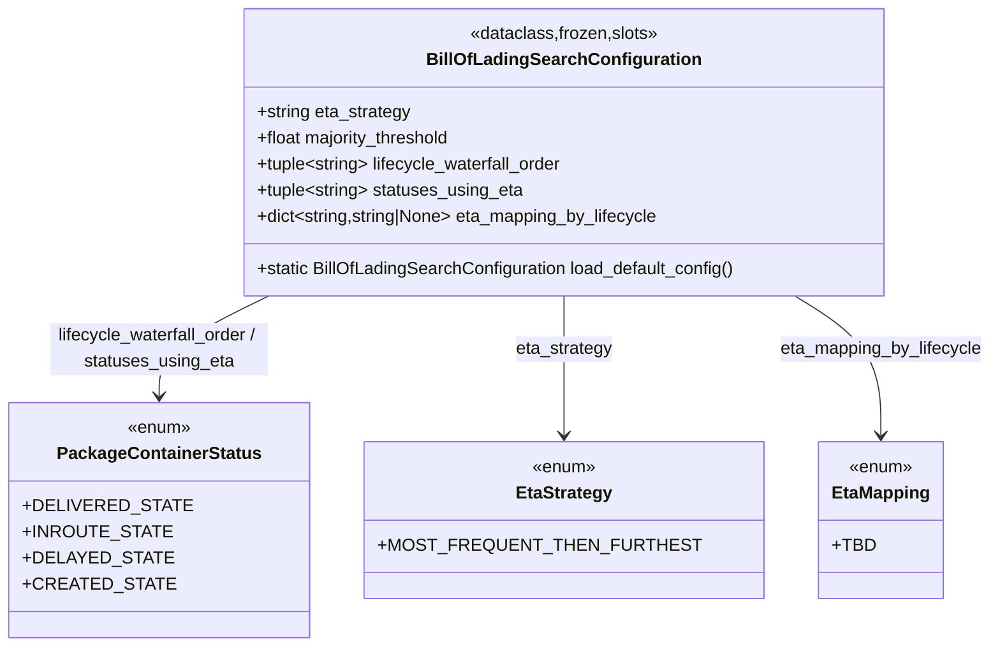

# Diagram: partview_core/partview_service/partview_service/core/business/BillOfLadingSearchConfiguration.py

> Auto-generated by Obscura crawlers

## Mermaid

### SVG

<svg id="container" width="834.625" xmlns="http://www.w3.org/2000/svg" class="classDiagram" height="594" viewBox="0 0 834.625 594" role="graphics-document document" aria-roledescription="class"><g><defs><marker id="container_class-aggregationStart" class="marker aggregation class" refX="18" refY="7" markerWidth="190" markerHeight="240" orient="auto"><path d="M 18,7 L9,13 L1,7 L9,1 Z"></path></marker></defs><defs><marker id="container_class-aggregationEnd" class="marker aggregation class" refX="1" refY="7" markerWidth="20" markerHeight="28" orient="auto"><path d="M 18,7 L9,13 L1,7 L9,1 Z"></path></marker></defs><defs><marker id="container_class-extensionStart" class="marker extension class" refX="18" refY="7" markerWidth="190" markerHeight="240" orient="auto"><path d="M 1,7 L18,13 V 1 Z"></path></marker></defs><defs><marker id="container_class-extensionEnd" class="marker extension class" refX="1" refY="7" markerWidth="20" markerHeight="28" orient="auto"><path d="M 1,1 V 13 L18,7 Z"></path></marker></defs><defs><marker id="container_class-compositionStart" class="marker composition class" refX="18" refY="7" markerWidth="190" markerHeight="240" orient="auto"><path d="M 18,7 L9,13 L1,7 L9,1 Z"></path></marker></defs><defs><marker id="container_class-compositionEnd" class="marker composition class" refX="1" refY="7" markerWidth="20" markerHeight="28" orient="auto"><path d="M 18,7 L9,13 L1,7 L9,1 Z"></path></marker></defs><defs><marker id="container_class-dependencyStart" class="marker dependency class" refX="6" refY="7" markerWidth="190" markerHeight="240" orient="auto"><path d="M 5,7 L9,13 L1,7 L9,1 Z"></path></marker></defs><defs><marker id="container_class-dependencyEnd" class="marker dependency class" refX="13" refY="7" markerWidth="20" markerHeight="28" orient="auto"><path d="M 18,7 L9,13 L14,7 L9,1 Z"></path></marker></defs><defs><marker id="container_class-lollipopStart" class="marker lollipop class" refX="13" refY="7" markerWidth="190" markerHeight="240" orient="auto"><circle stroke="black" fill="transparent" cx="7" cy="7" r="6"></circle></marker></defs><defs><marker id="container_class-lollipopEnd" class="marker lollipop class" refX="1" refY="7" markerWidth="190" markerHeight="240" orient="auto"><circle stroke="black" fill="transparent" cx="7" cy="7" r="6"></circle></marker></defs><g class="root"><g class="clusters"></g><g class="edgePaths"><path d="M222.083,272L206.975,280.167C191.867,288.333,161.65,304.667,146.542,320C131.434,335.333,131.434,349.667,131.434,356.833L131.434,364" id="id_BillOfLadingSearchConfiguration_PackageContainerStatus_1" class="edge-thickness-normal edge-pattern-solid relation" style=";;;" data-edge="true" data-et="edge" data-id="id_BillOfLadingSearchConfiguration_PackageContainerStatus_1" data-points="W3sieCI6MjIyLjA4Mjk1OTI1NDE0MzY1LCJ5IjoyNzJ9LHsieCI6MTMxLjQzMzU5Mzc1LCJ5IjozMjF9LHsieCI6MTMxLjQzMzU5Mzc1LCJ5IjozNzB9XQ==" marker-end="url(#container_class-dependencyEnd)"></path><path d="M466.281,272L466.281,280.167C466.281,288.333,466.281,304.667,466.281,326C466.281,347.333,466.281,373.667,466.281,386.833L466.281,400" id="id_BillOfLadingSearchConfiguration_EtaStrategy_2" class="edge-thickness-normal edge-pattern-solid relation" style=";;;" data-edge="true" data-et="edge" data-id="id_BillOfLadingSearchConfiguration_EtaStrategy_2" data-points="W3sieCI6NDY2LjI4MTI1LCJ5IjoyNzJ9LHsieCI6NDY2LjI4MTI1LCJ5IjozMjF9LHsieCI6NDY2LjI4MTI1LCJ5Ijo0MDZ9XQ==" marker-end="url(#container_class-dependencyEnd)"></path><path d="M660.532,272L672.55,280.167C684.568,288.333,708.605,304.667,720.623,326C732.641,347.333,732.641,373.667,732.641,386.833L732.641,400" id="id_BillOfLadingSearchConfiguration_EtaMapping_3" class="edge-thickness-normal edge-pattern-solid relation" style=";;;" data-edge="true" data-et="edge" data-id="id_BillOfLadingSearchConfiguration_EtaMapping_3" data-points="W3sieCI6NjYwLjUzMjI4NTkxMTYwMjIsInkiOjI3Mn0seyJ4Ijo3MzIuNjQwNjI1LCJ5IjozMjF9LHsieCI6NzMyLjY0MDYyNSwieSI6NDA2fV0=" marker-end="url(#container_class-dependencyEnd)"></path></g><g class="edgeLabels"><g class="edgeLabel" transform="translate(131.43359375, 321)"><g class="label" data-id="id_BillOfLadingSearchConfiguration_PackageContainerStatus_1" transform="translate(-100, -24)"><foreignObject width="200" height="48">

lifecycle_waterfall_order / statuses_using_eta

</foreignObject></g></g><g class="edgeLabel" transform="translate(466.28125, 321)"><g class="label" data-id="id_BillOfLadingSearchConfiguration_EtaStrategy_2" transform="translate(-44.71875, -12)"><foreignObject width="89.4375" height="24">

eta_strategy

</foreignObject></g></g><g class="edgeLabel" transform="translate(732.640625, 321)"><g class="label" data-id="id_BillOfLadingSearchConfiguration_EtaMapping_3" transform="translate(-93.984375, -12)"><foreignObject width="187.96875" height="24">

eta_mapping_by_lifecycle

</foreignObject></g></g></g><g class="nodes"><g class="node default" id="classId-BillOfLadingSearchConfiguration-0" transform="translate(466.28125, 140)"><g class="basic label-container"><path d="M-293.65625 -132 L293.65625 -132 L293.65625 132 L-293.65625 132" stroke="none" stroke-width="0" fill="#ECECFF" style=""></path><path d="M-293.65625 -132 C-72.9313835109084 -132, 147.7934829781832 -132, 293.65625 -132 M-293.65625 -132 C-86.55780548265577 -132, 120.54063903468847 -132, 293.65625 -132 M293.65625 -132 C293.65625 -40.96326043884626, 293.65625 50.073479122307475, 293.65625 132 M293.65625 -132 C293.65625 -27.01813480722157, 293.65625 77.96373038555686, 293.65625 132 M293.65625 132 C77.87200850979195 132, -137.9122329804161 132, -293.65625 132 M293.65625 132 C148.23237309508593 132, 2.8084961901718657 132, -293.65625 132 M-293.65625 132 C-293.65625 69.20879058626304, -293.65625 6.417581172526056, -293.65625 -132 M-293.65625 132 C-293.65625 66.48268896315474, -293.65625 0.9653779263094862, -293.65625 -132" stroke="#9370DB" stroke-width="1.3" fill="none" stroke-dasharray="0 0" style=""></path></g><g class="annotation-group text" transform="translate(-86.8125, -108)"><g class="label" style="" transform="translate(0,-12)"><foreignObject width="173.625" height="24">

«dataclass,frozen,slots»

</foreignObject></g></g><g class="label-group text" transform="translate(-118.890625, -84)"><g class="label" style="font-weight: bolder" transform="translate(0,-12)"><foreignObject width="237.78125" height="24">

BillOfLadingSearchConfiguration

</foreignObject></g></g><g class="members-group text" transform="translate(-281.65625, -36)"><g class="label" style="" transform="translate(0,-12)"><foreignObject width="143.28125" height="24">

+string eta_strategy

</foreignObject></g><g class="label" style="" transform="translate(0,12)"><foreignObject width="182.84375" height="24">

+float majority_threshold

</foreignObject></g><g class="label" style="" transform="translate(0,36)"><foreignObject width="285.78125" height="24">

+tuple&lt;string&gt; lifecycle_waterfall_order

</foreignObject></g><g class="label" style="" transform="translate(0,60)"><foreignObject width="246.125" height="24">

+tuple&lt;string&gt; statuses_using_eta

</foreignObject></g><g class="label" style="" transform="translate(0,84)"><foreignObject width="375.6875" height="24">

+dict&lt;string,string|None&gt; eta_mapping_by_lifecycle

</foreignObject></g></g><g class="methods-group text" transform="translate(-281.65625, 108)"><g class="label" style="" transform="translate(0,-12)"><foreignObject width="444.421875" height="24">

+static BillOfLadingSearchConfiguration load_default_config()

</foreignObject></g></g><g class="divider" style=""><path d="M-293.65625 -60 C-174.6412896247816 -60, -55.626329249563184 -60, 293.65625 -60 M-293.65625 -60 C-91.94920799401444 -60, 109.75783401197111 -60, 293.65625 -60" stroke="#9370DB" stroke-width="1.3" fill="none" stroke-dasharray="0 0" style=""></path></g><g class="divider" style=""><path d="M-293.65625 84 C-169.78203692408744 84, -45.90782384817484 84, 293.65625 84 M-293.65625 84 C-97.58121774677565 84, 98.4938145064487 84, 293.65625 84" stroke="#9370DB" stroke-width="1.3" fill="none" stroke-dasharray="0 0" style=""></path></g></g><g class="node default" id="classId-PackageContainerStatus-1" transform="translate(131.43359375, 478)"><g class="basic label-container"><path d="M-123.43359375 -108 L123.43359375 -108 L123.43359375 108 L-123.43359375 108" stroke="none" stroke-width="0" fill="#ECECFF" style=""></path><path d="M-123.43359375 -108 C-59.53559313784764 -108, 4.362407474304717 -108, 123.43359375 -108 M-123.43359375 -108 C-60.21255088458271 -108, 3.0084919808345774 -108, 123.43359375 -108 M123.43359375 -108 C123.43359375 -32.82737439636651, 123.43359375 42.34525120726698, 123.43359375 108 M123.43359375 -108 C123.43359375 -38.031092481936255, 123.43359375 31.93781503612749, 123.43359375 108 M123.43359375 108 C53.79607083800485 108, -15.841452073990297 108, -123.43359375 108 M123.43359375 108 C31.245376795796304 108, -60.94284015840739 108, -123.43359375 108 M-123.43359375 108 C-123.43359375 30.44417292932893, -123.43359375 -47.11165414134214, -123.43359375 -108 M-123.43359375 108 C-123.43359375 34.67146549926905, -123.43359375 -38.657069001461906, -123.43359375 -108" stroke="#9370DB" stroke-width="1.3" fill="none" stroke-dasharray="0 0" style=""></path></g><g class="annotation-group text" transform="translate(-29.53125, -84)"><g class="label" style="" transform="translate(0,-12)"><foreignObject width="59.0625" height="24">

«enum»

</foreignObject></g></g><g class="label-group text" transform="translate(-88.9296875, -60)"><g class="label" style="font-weight: bolder" transform="translate(0,-12)"><foreignObject width="177.859375" height="24">

PackageContainerStatus

</foreignObject></g></g><g class="members-group text" transform="translate(-111.43359375, -12)"><g class="label" style="" transform="translate(0,-12)"><foreignObject width="133.9375" height="24">

+DELIVERED_STATE

</foreignObject></g><g class="label" style="" transform="translate(0,12)"><foreignObject width="120.71875" height="24">

+INROUTE_STATE

</foreignObject></g><g class="label" style="" transform="translate(0,36)"><foreignObject width="119.265625" height="24">

+DELAYED_STATE

</foreignObject></g><g class="label" style="" transform="translate(0,60)"><foreignObject width="119.09375" height="24">

+CREATED_STATE

</foreignObject></g></g><g class="methods-group text" transform="translate(-111.43359375, 108)"></g><g class="divider" style=""><path d="M-123.43359375 -36 C-58.99391376434073 -36, 5.445766221318536 -36, 123.43359375 -36 M-123.43359375 -36 C-31.931387435383343 -36, 59.570818879233315 -36, 123.43359375 -36" stroke="#9370DB" stroke-width="1.3" fill="none" stroke-dasharray="0 0" style=""></path></g><g class="divider" style=""><path d="M-123.43359375 84 C-69.46981397988387 84, -15.50603420976772 84, 123.43359375 84 M-123.43359375 84 C-64.65685764014566 84, -5.880121530291333 84, 123.43359375 84" stroke="#9370DB" stroke-width="1.3" fill="none" stroke-dasharray="0 0" style=""></path></g></g><g class="node default" id="classId-EtaStrategy-2" transform="translate(466.28125, 478)"><g class="basic label-container"><path d="M-161.4140625 -72 L161.4140625 -72 L161.4140625 72 L-161.4140625 72" stroke="none" stroke-width="0" fill="#ECECFF" style=""></path><path d="M-161.4140625 -72 C-72.55327438877116 -72, 16.307513722457685 -72, 161.4140625 -72 M-161.4140625 -72 C-46.930945241925215 -72, 67.55217201614957 -72, 161.4140625 -72 M161.4140625 -72 C161.4140625 -15.039245002881543, 161.4140625 41.921509994236914, 161.4140625 72 M161.4140625 -72 C161.4140625 -25.619519033449627, 161.4140625 20.760961933100745, 161.4140625 72 M161.4140625 72 C82.51066052196308 72, 3.60725854392615 72, -161.4140625 72 M161.4140625 72 C94.07782940247539 72, 26.741596304950775 72, -161.4140625 72 M-161.4140625 72 C-161.4140625 39.72012666013014, -161.4140625 7.4402533202602825, -161.4140625 -72 M-161.4140625 72 C-161.4140625 23.50132339873514, -161.4140625 -24.997353202529723, -161.4140625 -72" stroke="#9370DB" stroke-width="1.3" fill="none" stroke-dasharray="0 0" style=""></path></g><g class="annotation-group text" transform="translate(-29.53125, -48)"><g class="label" style="" transform="translate(0,-12)"><foreignObject width="59.0625" height="24">

«enum»

</foreignObject></g></g><g class="label-group text" transform="translate(-42.328125, -24)"><g class="label" style="font-weight: bolder" transform="translate(0,-12)"><foreignObject width="84.65625" height="24">

EtaStrategy

</foreignObject></g></g><g class="members-group text" transform="translate(-149.4140625, 24)"><g class="label" style="" transform="translate(0,-12)"><foreignObject width="256.5" height="24">

+MOST_FREQUENT_THEN_FURTHEST

</foreignObject></g></g><g class="methods-group text" transform="translate(-149.4140625, 72)"></g><g class="divider" style=""><path d="M-161.4140625 0 C-57.04008914412945 0, 47.33388421174109 0, 161.4140625 0 M-161.4140625 0 C-41.59608466531162 0, 78.22189316937676 0, 161.4140625 0" stroke="#9370DB" stroke-width="1.3" fill="none" stroke-dasharray="0 0" style=""></path></g><g class="divider" style=""><path d="M-161.4140625 48 C-56.205832839616505 48, 49.00239682076699 48, 161.4140625 48 M-161.4140625 48 C-85.78893320112968 48, -10.16380390225936 48, 161.4140625 48" stroke="#9370DB" stroke-width="1.3" fill="none" stroke-dasharray="0 0" style=""></path></g></g><g class="node default" id="classId-EtaMapping-3" transform="translate(732.640625, 478)"><g class="basic label-container"><path d="M-54.9453125 -72 L54.9453125 -72 L54.9453125 72 L-54.9453125 72" stroke="none" stroke-width="0" fill="#ECECFF" style=""></path><path d="M-54.9453125 -72 C-26.67455248399956 -72, 1.5962075320008822 -72, 54.9453125 -72 M-54.9453125 -72 C-23.269430836899666 -72, 8.406450826200668 -72, 54.9453125 -72 M54.9453125 -72 C54.9453125 -39.33921006171994, 54.9453125 -6.678420123439878, 54.9453125 72 M54.9453125 -72 C54.9453125 -35.09954380223631, 54.9453125 1.8009123955273765, 54.9453125 72 M54.9453125 72 C23.622588922822782 72, -7.700134654354436 72, -54.9453125 72 M54.9453125 72 C12.632270411860759 72, -29.680771676278482 72, -54.9453125 72 M-54.9453125 72 C-54.9453125 33.69154011310933, -54.9453125 -4.6169197737813334, -54.9453125 -72 M-54.9453125 72 C-54.9453125 39.873568464464626, -54.9453125 7.747136928929251, -54.9453125 -72" stroke="#9370DB" stroke-width="1.3" fill="none" stroke-dasharray="0 0" style=""></path></g><g class="annotation-group text" transform="translate(-29.53125, -48)"><g class="label" style="" transform="translate(0,-12)"><foreignObject width="59.0625" height="24">

«enum»

</foreignObject></g></g><g class="label-group text" transform="translate(-42.9453125, -24)"><g class="label" style="font-weight: bolder" transform="translate(0,-12)"><foreignObject width="85.890625" height="24">

EtaMapping

</foreignObject></g></g><g class="members-group text" transform="translate(-42.9453125, 24)"><g class="label" style="" transform="translate(0,-12)"><foreignObject width="35.5" height="24">

+TBD

</foreignObject></g></g><g class="methods-group text" transform="translate(-42.9453125, 72)"></g><g class="divider" style=""><path d="M-54.9453125 0 C-12.689728577580489 0, 29.565855344839022 0, 54.9453125 0 M-54.9453125 0 C-18.849253504288605 0, 17.24680549142279 0, 54.9453125 0" stroke="#9370DB" stroke-width="1.3" fill="none" stroke-dasharray="0 0" style=""></path></g><g class="divider" style=""><path d="M-54.9453125 48 C-18.39500221379526 48, 18.155308072409483 48, 54.9453125 48 M-54.9453125 48 C-17.53086218269639 48, 19.883588134607223 48, 54.9453125 48" stroke="#9370DB" stroke-width="1.3" fill="none" stroke-dasharray="0 0" style=""></path></g></g></g></g></g></svg>
