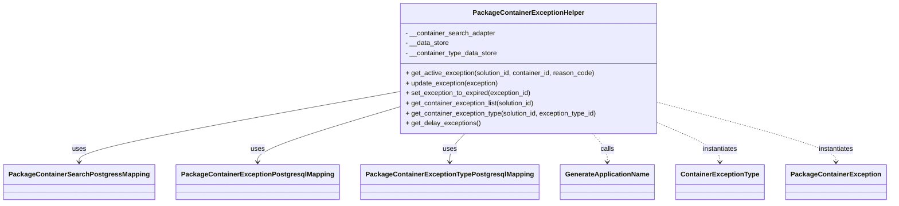

# Diagram: partview_core/partview_service/partview_service/core/business/PackageContainerExceptionHelper.py

> Auto-generated by Obscura crawlers

## Mermaid

### SVG

<svg id="container" width="2016.453125" xmlns="http://www.w3.org/2000/svg" class="classDiagram" height="486" viewBox="0 0 2016.453125 486" role="graphics-document document" aria-roledescription="class"><g><defs><marker id="container_class-aggregationStart" class="marker aggregation class" refX="18" refY="7" markerWidth="190" markerHeight="240" orient="auto"><path d="M 18,7 L9,13 L1,7 L9,1 Z"></path></marker></defs><defs><marker id="container_class-aggregationEnd" class="marker aggregation class" refX="1" refY="7" markerWidth="20" markerHeight="28" orient="auto"><path d="M 18,7 L9,13 L1,7 L9,1 Z"></path></marker></defs><defs><marker id="container_class-extensionStart" class="marker extension class" refX="18" refY="7" markerWidth="190" markerHeight="240" orient="auto"><path d="M 1,7 L18,13 V 1 Z"></path></marker></defs><defs><marker id="container_class-extensionEnd" class="marker extension class" refX="1" refY="7" markerWidth="20" markerHeight="28" orient="auto"><path d="M 1,1 V 13 L18,7 Z"></path></marker></defs><defs><marker id="container_class-compositionStart" class="marker composition class" refX="18" refY="7" markerWidth="190" markerHeight="240" orient="auto"><path d="M 18,7 L9,13 L1,7 L9,1 Z"></path></marker></defs><defs><marker id="container_class-compositionEnd" class="marker composition class" refX="1" refY="7" markerWidth="20" markerHeight="28" orient="auto"><path d="M 18,7 L9,13 L1,7 L9,1 Z"></path></marker></defs><defs><marker id="container_class-dependencyStart" class="marker dependency class" refX="6" refY="7" markerWidth="190" markerHeight="240" orient="auto"><path d="M 5,7 L9,13 L1,7 L9,1 Z"></path></marker></defs><defs><marker id="container_class-dependencyEnd" class="marker dependency class" refX="13" refY="7" markerWidth="20" markerHeight="28" orient="auto"><path d="M 18,7 L9,13 L14,7 L9,1 Z"></path></marker></defs><defs><marker id="container_class-lollipopStart" class="marker lollipop class" refX="13" refY="7" markerWidth="190" markerHeight="240" orient="auto"><circle stroke="black" fill="transparent" cx="7" cy="7" r="6"></circle></marker></defs><defs><marker id="container_class-lollipopEnd" class="marker lollipop class" refX="1" refY="7" markerWidth="190" markerHeight="240" orient="auto"><circle stroke="black" fill="transparent" cx="7" cy="7" r="6"></circle></marker></defs><g class="root"><g class="clusters"></g><g class="edgePaths"><path d="M887.609,222.119L769.207,244.599C650.805,267.079,414,312.04,295.598,339.686C177.195,367.333,177.195,377.667,177.195,382.833L177.195,388" id="id_PackageContainerExceptionHelper_PackageContainerSearchPostgressMapping_1" class="edge-thickness-normal edge-pattern-solid relation" style=";;;" data-edge="true" data-et="edge" data-id="id_PackageContainerExceptionHelper_PackageContainerSearchPostgressMapping_1" data-points="W3sieCI6ODg3LjYwOTM3NSwieSI6MjIyLjExODc4NzIyNjY4NDA4fSx7IngiOjE3Ny4xOTUzMTI1LCJ5IjozNTd9LHsieCI6MTc3LjE5NTMxMjUsInkiOjM5NH1d" marker-end="url(#container_class-dependencyEnd)"></path><path d="M887.609,260.254L836.331,276.379C785.052,292.503,682.495,324.751,631.216,346.042C579.938,367.333,579.938,377.667,579.938,382.833L579.938,388" id="id_PackageContainerExceptionHelper_PackageContainerExceptionPostgresqlMapping_2" class="edge-thickness-normal edge-pattern-solid relation" style=";;;" data-edge="true" data-et="edge" data-id="id_PackageContainerExceptionHelper_PackageContainerExceptionPostgresqlMapping_2" data-points="W3sieCI6ODg3LjYwOTM3NSwieSI6MjYwLjI1NDM0MDQxMDM2NjA3fSx7IngiOjU3OS45Mzc1LCJ5IjozNTd9LHsieCI6NTc5LjkzNzUsInkiOjM5NH1d" marker-end="url(#container_class-dependencyEnd)"></path><path d="M1048.751,320L1043.02,326.167C1037.289,332.333,1025.828,344.667,1020.098,356C1014.367,367.333,1014.367,377.667,1014.367,382.833L1014.367,388" id="id_PackageContainerExceptionHelper_PackageContainerExceptionTypePostgresqlMapping_3" class="edge-thickness-normal edge-pattern-solid relation" style=";;;" data-edge="true" data-et="edge" data-id="id_PackageContainerExceptionHelper_PackageContainerExceptionTypePostgresqlMapping_3" data-points="W3sieCI6MTA0OC43NTA2NDc2NjgzOTM5LCJ5IjozMjB9LHsieCI6MTAxNC4zNjcxODc1LCJ5IjozNTd9LHsieCI6MTAxNC4zNjcxODc1LCJ5IjozOTR9XQ==" marker-end="url(#container_class-dependencyEnd)"></path><path d="M1338.687,320L1344.417,326.167C1350.148,332.333,1361.609,344.667,1367.34,356C1373.07,367.333,1373.07,377.667,1373.07,382.833L1373.07,388" id="id_PackageContainerExceptionHelper_GenerateApplicationName_4" class="edge-thickness-normal edge-pattern-dashed relation" style=";;;" data-edge="true" data-et="edge" data-id="id_PackageContainerExceptionHelper_GenerateApplicationName_4" data-points="W3sieCI6MTMzOC42ODY4NTIzMzE2MDYxLCJ5IjozMjB9LHsieCI6MTM3My4wNzAzMTI1LCJ5IjozNTd9LHsieCI6MTM3My4wNzAzMTI1LCJ5IjozOTR9XQ==" marker-end="url(#container_class-dependencyEnd)"></path><path d="M1499.828,298.944L1521.777,308.62C1543.727,318.296,1587.625,337.648,1609.574,352.491C1631.523,367.333,1631.523,377.667,1631.523,382.833L1631.523,388" id="id_PackageContainerExceptionHelper_ContainerExceptionType_5" class="edge-thickness-normal edge-pattern-dashed relation" style=";;;" data-edge="true" data-et="edge" data-id="id_PackageContainerExceptionHelper_ContainerExceptionType_5" data-points="W3sieCI6MTQ5OS44MjgxMjUsInkiOjI5OC45NDM5ODU0Mzg3MTIzM30seyJ4IjoxNjMxLjUyMzQzNzUsInkiOjM1N30seyJ4IjoxNjMxLjUyMzQzNzUsInkiOjM5NH1d" marker-end="url(#container_class-dependencyEnd)"></path><path d="M1499.828,248.208L1565.741,266.34C1631.654,284.472,1763.479,320.736,1829.392,344.035C1895.305,367.333,1895.305,377.667,1895.305,382.833L1895.305,388" id="id_PackageContainerExceptionHelper_PackageContainerException_6" class="edge-thickness-normal edge-pattern-dashed relation" style=";;;" data-edge="true" data-et="edge" data-id="id_PackageContainerExceptionHelper_PackageContainerException_6" data-points="W3sieCI6MTQ5OS44MjgxMjUsInkiOjI0OC4yMDc5NDQwNTUzMjExfSx7IngiOjE4OTUuMzA0Njg3NSwieSI6MzU3fSx7IngiOjE4OTUuMzA0Njg3NSwieSI6Mzk0fV0=" marker-end="url(#container_class-dependencyEnd)"></path></g><g class="edgeLabels"><g class="edgeLabel" transform="translate(177.1953125, 357)"><g class="label" data-id="id_PackageContainerExceptionHelper_PackageContainerSearchPostgressMapping_1" transform="translate(-16.4921875, -12)"><foreignObject width="32.984375" height="24">

uses

</foreignObject></g></g><g class="edgeLabel" transform="translate(579.9375, 357)"><g class="label" data-id="id_PackageContainerExceptionHelper_PackageContainerExceptionPostgresqlMapping_2" transform="translate(-16.4921875, -12)"><foreignObject width="32.984375" height="24">

uses

</foreignObject></g></g><g class="edgeLabel" transform="translate(1014.3671875, 357)"><g class="label" data-id="id_PackageContainerExceptionHelper_PackageContainerExceptionTypePostgresqlMapping_3" transform="translate(-16.4921875, -12)"><foreignObject width="32.984375" height="24">

uses

</foreignObject></g></g><g class="edgeLabel" transform="translate(1373.0703125, 357)"><g class="label" data-id="id_PackageContainerExceptionHelper_GenerateApplicationName_4" transform="translate(-16.4453125, -12)"><foreignObject width="32.890625" height="24">

calls

</foreignObject></g></g><g class="edgeLabel" transform="translate(1631.5234375, 357)"><g class="label" data-id="id_PackageContainerExceptionHelper_ContainerExceptionType_5" transform="translate(-42.9140625, -12)"><foreignObject width="85.828125" height="24">

instantiates

</foreignObject></g></g><g class="edgeLabel" transform="translate(1895.3046875, 357)"><g class="label" data-id="id_PackageContainerExceptionHelper_PackageContainerException_6" transform="translate(-42.9140625, -12)"><foreignObject width="85.828125" height="24">

instantiates

</foreignObject></g></g></g><g class="nodes"><g class="node default" id="classId-PackageContainerExceptionHelper-0" transform="translate(1193.71875, 164)"><g class="basic label-container"><path d="M-306.109375 -156 L306.109375 -156 L306.109375 156 L-306.109375 156" stroke="none" stroke-width="0" fill="#ECECFF" style=""></path><path d="M-306.109375 -156 C-63.88171042009262 -156, 178.34595415981477 -156, 306.109375 -156 M-306.109375 -156 C-63.963878134132955 -156, 178.1816187317341 -156, 306.109375 -156 M306.109375 -156 C306.109375 -58.11222524592114, 306.109375 39.775549508157724, 306.109375 156 M306.109375 -156 C306.109375 -36.64922101123622, 306.109375 82.70155797752756, 306.109375 156 M306.109375 156 C117.0776274610619 156, -71.95412007787621 156, -306.109375 156 M306.109375 156 C80.98912005627113 156, -144.13113488745773 156, -306.109375 156 M-306.109375 156 C-306.109375 41.87153046885257, -306.109375 -72.25693906229486, -306.109375 -156 M-306.109375 156 C-306.109375 59.14724518692233, -306.109375 -37.70550962615533, -306.109375 -156" stroke="#9370DB" stroke-width="1.3" fill="none" stroke-dasharray="0 0" style=""></path></g><g class="annotation-group text" transform="translate(0, -132)"></g><g class="label-group text" transform="translate(-125.671875, -132)"><g class="label" style="font-weight: bolder" transform="translate(0,-12)"><foreignObject width="251.34375" height="24">

PackageContainerExceptionHelper

</foreignObject></g></g><g class="members-group text" transform="translate(-294.109375, -84)"><g class="label" style="" transform="translate(0,-12)"><foreignObject width="215.46875" height="24">

- __container_search_adapter

</foreignObject></g><g class="label" style="" transform="translate(0,12)"><foreignObject width="104.578125" height="24">

- __data_store

</foreignObject></g><g class="label" style="" transform="translate(0,36)"><foreignObject width="219.96875" height="24">

- __container_type_data_store

</foreignObject></g></g><g class="methods-group text" transform="translate(-294.109375, 12)"><g class="label" style="" transform="translate(0,-12)"><foreignObject width="455.421875" height="24">

+ get_active_exception(solution_id, container_id, reason_code)

</foreignObject></g><g class="label" style="" transform="translate(0,12)"><foreignObject width="223.125" height="24">

+ update_exception(exception)

</foreignObject></g><g class="label" style="" transform="translate(0,36)"><foreignObject width="301.375" height="24">

+ set_exception_to_expired(exception_id)

</foreignObject></g><g class="label" style="" transform="translate(0,60)"><foreignObject width="312.671875" height="24">

+ get_container_exception_list(solution_id)

</foreignObject></g><g class="label" style="" transform="translate(0,84)"><foreignObject width="462.546875" height="24">

+ get_container_exception_type(solution_id, exception_type_id)

</foreignObject></g><g class="label" style="" transform="translate(0,108)"><foreignObject width="178.140625" height="24">

+ get_delay_exceptions()

</foreignObject></g></g><g class="divider" style=""><path d="M-306.109375 -108 C-74.49670565952053 -108, 157.11596368095894 -108, 306.109375 -108 M-306.109375 -108 C-165.4808497291385 -108, -24.852324458276996 -108, 306.109375 -108" stroke="#9370DB" stroke-width="1.3" fill="none" stroke-dasharray="0 0" style=""></path></g><g class="divider" style=""><path d="M-306.109375 -12 C-147.1075416638322 -12, 11.894291672335612 -12, 306.109375 -12 M-306.109375 -12 C-122.00716745945499 -12, 62.09504008109002 -12, 306.109375 -12" stroke="#9370DB" stroke-width="1.3" fill="none" stroke-dasharray="0 0" style=""></path></g></g><g class="node default" id="classId-PackageContainerSearchPostgressMapping-1" transform="translate(177.1953125, 436)"><g class="basic label-container"><path d="M-169.1953125 -42 L169.1953125 -42 L169.1953125 42 L-169.1953125 42" stroke="none" stroke-width="0" fill="#ECECFF" style=""></path><path d="M-169.1953125 -42 C-70.81097687627283 -42, 27.573358747454336 -42, 169.1953125 -42 M-169.1953125 -42 C-82.09164277672429 -42, 5.01202694655143 -42, 169.1953125 -42 M169.1953125 -42 C169.1953125 -10.361551559669781, 169.1953125 21.276896880660438, 169.1953125 42 M169.1953125 -42 C169.1953125 -20.365112375776626, 169.1953125 1.2697752484467486, 169.1953125 42 M169.1953125 42 C92.71545873426989 42, 16.235604968539775 42, -169.1953125 42 M169.1953125 42 C68.42811032336026 42, -32.339091853279484 42, -169.1953125 42 M-169.1953125 42 C-169.1953125 19.85427713579594, -169.1953125 -2.291445728408121, -169.1953125 -42 M-169.1953125 42 C-169.1953125 24.4997328286372, -169.1953125 6.999465657274399, -169.1953125 -42" stroke="#9370DB" stroke-width="1.3" fill="none" stroke-dasharray="0 0" style=""></path></g><g class="annotation-group text" transform="translate(0, -18)"></g><g class="label-group text" transform="translate(-157.1953125, -18)"><g class="label" style="font-weight: bolder" transform="translate(0,-12)"><foreignObject width="314.390625" height="24">

PackageContainerSearchPostgressMapping

</foreignObject></g></g><g class="members-group text" transform="translate(-157.1953125, 30)"></g><g class="methods-group text" transform="translate(-157.1953125, 60)"></g><g class="divider" style=""><path d="M-169.1953125 6 C-67.83588966051083 6, 33.52353317897834 6, 169.1953125 6 M-169.1953125 6 C-48.64680598510709 6, 71.90170052978581 6, 169.1953125 6" stroke="#9370DB" stroke-width="1.3" fill="none" stroke-dasharray="0 0" style=""></path></g><g class="divider" style=""><path d="M-169.1953125 24 C-38.784626801953635 24, 91.62605889609273 24, 169.1953125 24 M-169.1953125 24 C-62.67619137884516 24, 43.84292974230968 24, 169.1953125 24" stroke="#9370DB" stroke-width="1.3" fill="none" stroke-dasharray="0 0" style=""></path></g></g><g class="node default" id="classId-PackageContainerExceptionPostgresqlMapping-2" transform="translate(579.9375, 436)"><g class="basic label-container"><path d="M-183.546875 -42 L183.546875 -42 L183.546875 42 L-183.546875 42" stroke="none" stroke-width="0" fill="#ECECFF" style=""></path><path d="M-183.546875 -42 C-71.95839576926267 -42, 39.63008346147467 -42, 183.546875 -42 M-183.546875 -42 C-42.44743638211878 -42, 98.65200223576244 -42, 183.546875 -42 M183.546875 -42 C183.546875 -21.2990439616471, 183.546875 -0.5980879232942016, 183.546875 42 M183.546875 -42 C183.546875 -16.143471815480805, 183.546875 9.71305636903839, 183.546875 42 M183.546875 42 C109.4639409199508 42, 35.3810068399016 42, -183.546875 42 M183.546875 42 C90.42721835732652 42, -2.6924382853469524 42, -183.546875 42 M-183.546875 42 C-183.546875 23.440105094564778, -183.546875 4.880210189129556, -183.546875 -42 M-183.546875 42 C-183.546875 24.799152510299926, -183.546875 7.598305020599852, -183.546875 -42" stroke="#9370DB" stroke-width="1.3" fill="none" stroke-dasharray="0 0" style=""></path></g><g class="annotation-group text" transform="translate(0, -18)"></g><g class="label-group text" transform="translate(-171.546875, -18)"><g class="label" style="font-weight: bolder" transform="translate(0,-12)"><foreignObject width="343.09375" height="24">

PackageContainerExceptionPostgresqlMapping

</foreignObject></g></g><g class="members-group text" transform="translate(-171.546875, 30)"></g><g class="methods-group text" transform="translate(-171.546875, 60)"></g><g class="divider" style=""><path d="M-183.546875 6 C-60.222777935883485 6, 63.10131912823303 6, 183.546875 6 M-183.546875 6 C-40.24468052847544 6, 103.05751394304912 6, 183.546875 6" stroke="#9370DB" stroke-width="1.3" fill="none" stroke-dasharray="0 0" style=""></path></g><g class="divider" style=""><path d="M-183.546875 24 C-105.66464032835238 24, -27.782405656704753 24, 183.546875 24 M-183.546875 24 C-46.24338542150602 24, 91.06010415698796 24, 183.546875 24" stroke="#9370DB" stroke-width="1.3" fill="none" stroke-dasharray="0 0" style=""></path></g></g><g class="node default" id="classId-PackageContainerExceptionTypePostgresqlMapping-3" transform="translate(1014.3671875, 436)"><g class="basic label-container"><path d="M-200.8828125 -42 L200.8828125 -42 L200.8828125 42 L-200.8828125 42" stroke="none" stroke-width="0" fill="#ECECFF" style=""></path><path d="M-200.8828125 -42 C-55.15053548321035 -42, 90.5817415335793 -42, 200.8828125 -42 M-200.8828125 -42 C-78.39026648243427 -42, 44.10227953513146 -42, 200.8828125 -42 M200.8828125 -42 C200.8828125 -12.923690670060026, 200.8828125 16.15261865987995, 200.8828125 42 M200.8828125 -42 C200.8828125 -17.727321677272464, 200.8828125 6.5453566454550725, 200.8828125 42 M200.8828125 42 C108.02438105837481 42, 15.165949616749629 42, -200.8828125 42 M200.8828125 42 C60.81653634600943 42, -79.24973980798114 42, -200.8828125 42 M-200.8828125 42 C-200.8828125 21.783644602813116, -200.8828125 1.5672892056262313, -200.8828125 -42 M-200.8828125 42 C-200.8828125 16.42740297329991, -200.8828125 -9.145194053400182, -200.8828125 -42" stroke="#9370DB" stroke-width="1.3" fill="none" stroke-dasharray="0 0" style=""></path></g><g class="annotation-group text" transform="translate(0, -18)"></g><g class="label-group text" transform="translate(-188.8828125, -18)"><g class="label" style="font-weight: bolder" transform="translate(0,-12)"><foreignObject width="377.765625" height="24">

PackageContainerExceptionTypePostgresqlMapping

</foreignObject></g></g><g class="members-group text" transform="translate(-188.8828125, 30)"></g><g class="methods-group text" transform="translate(-188.8828125, 60)"></g><g class="divider" style=""><path d="M-200.8828125 6 C-99.31484841914953 6, 2.253115661700946 6, 200.8828125 6 M-200.8828125 6 C-81.8824818074167 6, 37.11784888516661 6, 200.8828125 6" stroke="#9370DB" stroke-width="1.3" fill="none" stroke-dasharray="0 0" style=""></path></g><g class="divider" style=""><path d="M-200.8828125 24 C-100.79845387654022 24, -0.7140952530804441 24, 200.8828125 24 M-200.8828125 24 C-102.41825677217936 24, -3.9537010443587235 24, 200.8828125 24" stroke="#9370DB" stroke-width="1.3" fill="none" stroke-dasharray="0 0" style=""></path></g></g><g class="node default" id="classId-ContainerExceptionType-4" transform="translate(1631.5234375, 436)"><g class="basic label-container"><path d="M-100.6328125 -42 L100.6328125 -42 L100.6328125 42 L-100.6328125 42" stroke="none" stroke-width="0" fill="#ECECFF" style=""></path><path d="M-100.6328125 -42 C-35.442112200368385 -42, 29.74858809926323 -42, 100.6328125 -42 M-100.6328125 -42 C-60.337538272702716 -42, -20.04226404540543 -42, 100.6328125 -42 M100.6328125 -42 C100.6328125 -15.667950980099402, 100.6328125 10.664098039801196, 100.6328125 42 M100.6328125 -42 C100.6328125 -11.296782850092391, 100.6328125 19.406434299815217, 100.6328125 42 M100.6328125 42 C48.720545176476925 42, -3.19172214704615 42, -100.6328125 42 M100.6328125 42 C34.607590108687845 42, -31.41763228262431 42, -100.6328125 42 M-100.6328125 42 C-100.6328125 21.300498413418968, -100.6328125 0.6009968268379353, -100.6328125 -42 M-100.6328125 42 C-100.6328125 13.198017411235853, -100.6328125 -15.603965177528295, -100.6328125 -42" stroke="#9370DB" stroke-width="1.3" fill="none" stroke-dasharray="0 0" style=""></path></g><g class="annotation-group text" transform="translate(0, -18)"></g><g class="label-group text" transform="translate(-88.6328125, -18)"><g class="label" style="font-weight: bolder" transform="translate(0,-12)"><foreignObject width="177.265625" height="24">

ContainerExceptionType

</foreignObject></g></g><g class="members-group text" transform="translate(-88.6328125, 30)"></g><g class="methods-group text" transform="translate(-88.6328125, 60)"></g><g class="divider" style=""><path d="M-100.6328125 6 C-46.52637306916363 6, 7.580066361672735 6, 100.6328125 6 M-100.6328125 6 C-28.30598943502403 6, 44.02083362995194 6, 100.6328125 6" stroke="#9370DB" stroke-width="1.3" fill="none" stroke-dasharray="0 0" style=""></path></g><g class="divider" style=""><path d="M-100.6328125 24 C-54.4500684233119 24, -8.267324346623795 24, 100.6328125 24 M-100.6328125 24 C-56.18403988507563 24, -11.735267270151255 24, 100.6328125 24" stroke="#9370DB" stroke-width="1.3" fill="none" stroke-dasharray="0 0" style=""></path></g></g><g class="node default" id="classId-PackageContainerException-5" transform="translate(1895.3046875, 436)"><g class="basic label-container"><path d="M-113.1484375 -42 L113.1484375 -42 L113.1484375 42 L-113.1484375 42" stroke="none" stroke-width="0" fill="#ECECFF" style=""></path><path d="M-113.1484375 -42 C-58.49719337841629 -42, -3.845949256832583 -42, 113.1484375 -42 M-113.1484375 -42 C-53.54438227508634 -42, 6.059672949827316 -42, 113.1484375 -42 M113.1484375 -42 C113.1484375 -13.759381321364735, 113.1484375 14.48123735727053, 113.1484375 42 M113.1484375 -42 C113.1484375 -10.855555545794822, 113.1484375 20.288888908410357, 113.1484375 42 M113.1484375 42 C61.289399417457716 42, 9.430361334915432 42, -113.1484375 42 M113.1484375 42 C65.11239036449928 42, 17.07634322899854 42, -113.1484375 42 M-113.1484375 42 C-113.1484375 14.332603069071428, -113.1484375 -13.334793861857143, -113.1484375 -42 M-113.1484375 42 C-113.1484375 21.41000589974114, -113.1484375 0.8200117994822804, -113.1484375 -42" stroke="#9370DB" stroke-width="1.3" fill="none" stroke-dasharray="0 0" style=""></path></g><g class="annotation-group text" transform="translate(0, -18)"></g><g class="label-group text" transform="translate(-101.1484375, -18)"><g class="label" style="font-weight: bolder" transform="translate(0,-12)"><foreignObject width="202.296875" height="24">

PackageContainerException

</foreignObject></g></g><g class="members-group text" transform="translate(-101.1484375, 30)"></g><g class="methods-group text" transform="translate(-101.1484375, 60)"></g><g class="divider" style=""><path d="M-113.1484375 6 C-58.1536557841057 6, -3.1588740682114036 6, 113.1484375 6 M-113.1484375 6 C-50.381017477532474 6, 12.386402544935052 6, 113.1484375 6" stroke="#9370DB" stroke-width="1.3" fill="none" stroke-dasharray="0 0" style=""></path></g><g class="divider" style=""><path d="M-113.1484375 24 C-45.71748486375351 24, 21.713467772492976 24, 113.1484375 24 M-113.1484375 24 C-25.983624725602795 24, 61.18118804879441 24, 113.1484375 24" stroke="#9370DB" stroke-width="1.3" fill="none" stroke-dasharray="0 0" style=""></path></g></g><g class="node default" id="classId-GenerateApplicationName-6" transform="translate(1373.0703125, 436)"><g class="basic label-container"><path d="M-107.8203125 -42 L107.8203125 -42 L107.8203125 42 L-107.8203125 42" stroke="none" stroke-width="0" fill="#ECECFF" style=""></path><path d="M-107.8203125 -42 C-46.24800140967956 -42, 15.32430968064088 -42, 107.8203125 -42 M-107.8203125 -42 C-51.93579320226447 -42, 3.9487260954710592 -42, 107.8203125 -42 M107.8203125 -42 C107.8203125 -21.727168632003785, 107.8203125 -1.4543372640075702, 107.8203125 42 M107.8203125 -42 C107.8203125 -14.74153025633214, 107.8203125 12.51693948733572, 107.8203125 42 M107.8203125 42 C53.228702145142236 42, -1.3629082097155276 42, -107.8203125 42 M107.8203125 42 C35.87952819040592 42, -36.06125611918816 42, -107.8203125 42 M-107.8203125 42 C-107.8203125 23.907682759352202, -107.8203125 5.815365518704404, -107.8203125 -42 M-107.8203125 42 C-107.8203125 24.144928909670494, -107.8203125 6.2898578193409875, -107.8203125 -42" stroke="#9370DB" stroke-width="1.3" fill="none" stroke-dasharray="0 0" style=""></path></g><g class="annotation-group text" transform="translate(0, -18)"></g><g class="label-group text" transform="translate(-95.8203125, -18)"><g class="label" style="font-weight: bolder" transform="translate(0,-12)"><foreignObject width="191.640625" height="24">

GenerateApplicationName

</foreignObject></g></g><g class="members-group text" transform="translate(-95.8203125, 30)"></g><g class="methods-group text" transform="translate(-95.8203125, 60)"></g><g class="divider" style=""><path d="M-107.8203125 6 C-27.70313344320256 6, 52.41404561359488 6, 107.8203125 6 M-107.8203125 6 C-45.857740821763485 6, 16.10483085647303 6, 107.8203125 6" stroke="#9370DB" stroke-width="1.3" fill="none" stroke-dasharray="0 0" style=""></path></g><g class="divider" style=""><path d="M-107.8203125 24 C-43.51517023412812 24, 20.78997203174376 24, 107.8203125 24 M-107.8203125 24 C-34.12428896774402 24, 39.57173456451196 24, 107.8203125 24" stroke="#9370DB" stroke-width="1.3" fill="none" stroke-dasharray="0 0" style=""></path></g></g></g></g></g></svg>
