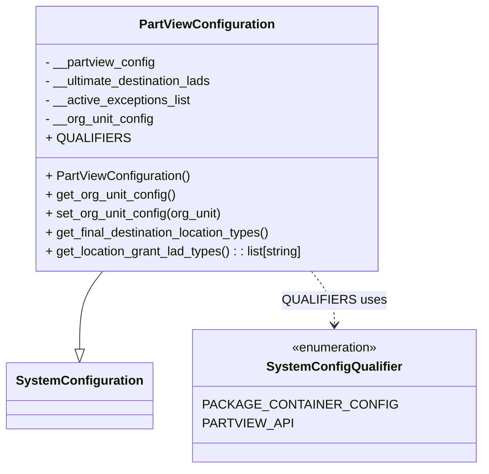

# Diagram: partview_core/partview_service/partview_service/core/business/PartViewConfiguration.py

> Auto-generated by Obscura crawlers

## Mermaid

### SVG

<svg id="container" width="560.0078125" xmlns="http://www.w3.org/2000/svg" class="classDiagram" height="594" viewBox="0 0 560.0078125 594" role="graphics-document document" aria-roledescription="class"><g><defs><marker id="container_class-aggregationStart" class="marker aggregation class" refX="18" refY="7" markerWidth="190" markerHeight="240" orient="auto"><path d="M 18,7 L9,13 L1,7 L9,1 Z"></path></marker></defs><defs><marker id="container_class-aggregationEnd" class="marker aggregation class" refX="1" refY="7" markerWidth="20" markerHeight="28" orient="auto"><path d="M 18,7 L9,13 L1,7 L9,1 Z"></path></marker></defs><defs><marker id="container_class-extensionStart" class="marker extension class" refX="18" refY="7" markerWidth="190" markerHeight="240" orient="auto"><path d="M 1,7 L18,13 V 1 Z"></path></marker></defs><defs><marker id="container_class-extensionEnd" class="marker extension class" refX="1" refY="7" markerWidth="20" markerHeight="28" orient="auto"><path d="M 1,1 V 13 L18,7 Z"></path></marker></defs><defs><marker id="container_class-compositionStart" class="marker composition class" refX="18" refY="7" markerWidth="190" markerHeight="240" orient="auto"><path d="M 18,7 L9,13 L1,7 L9,1 Z"></path></marker></defs><defs><marker id="container_class-compositionEnd" class="marker composition class" refX="1" refY="7" markerWidth="20" markerHeight="28" orient="auto"><path d="M 18,7 L9,13 L1,7 L9,1 Z"></path></marker></defs><defs><marker id="container_class-dependencyStart" class="marker dependency class" refX="6" refY="7" markerWidth="190" markerHeight="240" orient="auto"><path d="M 5,7 L9,13 L1,7 L9,1 Z"></path></marker></defs><defs><marker id="container_class-dependencyEnd" class="marker dependency class" refX="13" refY="7" markerWidth="20" markerHeight="28" orient="auto"><path d="M 18,7 L9,13 L14,7 L9,1 Z"></path></marker></defs><defs><marker id="container_class-lollipopStart" class="marker lollipop class" refX="13" refY="7" markerWidth="190" markerHeight="240" orient="auto"><circle stroke="black" fill="transparent" cx="7" cy="7" r="6"></circle></marker></defs><defs><marker id="container_class-lollipopEnd" class="marker lollipop class" refX="1" refY="7" markerWidth="190" markerHeight="240" orient="auto"><circle stroke="black" fill="transparent" cx="7" cy="7" r="6"></circle></marker></defs><g class="root"><g class="clusters"></g><g class="edgePaths"><path d="M122.725,344L118.258,350.167C113.79,356.333,104.856,368.667,100.389,385.125C95.922,401.583,95.922,422.167,95.922,432.458L95.922,442.75" id="id_PartViewConfiguration_SystemConfiguration_1" class="edge-thickness-normal edge-pattern-solid relation" style=";;;" data-edge="true" data-et="edge" data-id="id_PartViewConfiguration_SystemConfiguration_1" data-points="W3sieCI6MTIyLjcyNDY2NjUzOTYzNDE0LCJ5IjozNDR9LHsieCI6OTUuOTIxODc1LCJ5IjozODF9LHsieCI6OTUuOTIxODc1LCJ5Ijo0NjB9XQ==" marker-end="url(#container_class-extensionEnd)"></path><path d="M366.123,344L370.59,350.167C375.057,356.333,383.992,368.667,388.459,380C392.926,391.333,392.926,401.667,392.926,406.833L392.926,412" id="id_PartViewConfiguration_SystemConfigQualifier_2" class="edge-thickness-normal edge-pattern-dashed relation" style=";;;" data-edge="true" data-et="edge" data-id="id_PartViewConfiguration_SystemConfigQualifier_2" data-points="W3sieCI6MzY2LjEyMjk4OTcxMDM2NTg2LCJ5IjozNDR9LHsieCI6MzkyLjkyNTc4MTI1LCJ5IjozODF9LHsieCI6MzkyLjkyNTc4MTI1LCJ5Ijo0MTh9XQ==" marker-end="url(#container_class-dependencyEnd)"></path></g><g class="edgeLabels"><g class="edgeLabel"><g class="label" data-id="id_PartViewConfiguration_SystemConfiguration_1" transform="translate(0, 0)"><foreignObject width="0" height="0">

</foreignObject></g></g><g class="edgeLabel" transform="translate(392.92578125, 381)"><g class="label" data-id="id_PartViewConfiguration_SystemConfigQualifier_2" transform="translate(-59.9921875, -12)"><foreignObject width="119.984375" height="24">

QUALIFIERS uses

</foreignObject></g></g></g><g class="nodes"><g class="node default" id="classId-SystemConfiguration-0" transform="translate(95.921875, 502)"><g class="basic label-container"><path d="M-87.921875 -42 L87.921875 -42 L87.921875 42 L-87.921875 42" stroke="none" stroke-width="0" fill="#ECECFF" style=""></path><path d="M-87.921875 -42 C-32.86361061470645 -42, 22.194653770587095 -42, 87.921875 -42 M-87.921875 -42 C-18.42623958742402 -42, 51.06939582515196 -42, 87.921875 -42 M87.921875 -42 C87.921875 -17.682142776630098, 87.921875 6.635714446739804, 87.921875 42 M87.921875 -42 C87.921875 -16.57022099277133, 87.921875 8.859558014457342, 87.921875 42 M87.921875 42 C23.605025962303642 42, -40.711823075392715 42, -87.921875 42 M87.921875 42 C35.573308884300516 42, -16.775257231398967 42, -87.921875 42 M-87.921875 42 C-87.921875 14.116979915744803, -87.921875 -13.766040168510393, -87.921875 -42 M-87.921875 42 C-87.921875 13.820476178904919, -87.921875 -14.359047642190163, -87.921875 -42" stroke="#9370DB" stroke-width="1.3" fill="none" stroke-dasharray="0 0" style=""></path></g><g class="annotation-group text" transform="translate(0, -18)"></g><g class="label-group text" transform="translate(-75.921875, -18)"><g class="label" style="font-weight: bolder" transform="translate(0,-12)"><foreignObject width="151.84375" height="24">

SystemConfiguration

</foreignObject></g></g><g class="members-group text" transform="translate(-75.921875, 30)"></g><g class="methods-group text" transform="translate(-75.921875, 60)"></g><g class="divider" style=""><path d="M-87.921875 6 C-39.02292761925317 6, 9.876019761493666 6, 87.921875 6 M-87.921875 6 C-52.01622427137082 6, -16.110573542741633 6, 87.921875 6" stroke="#9370DB" stroke-width="1.3" fill="none" stroke-dasharray="0 0" style=""></path></g><g class="divider" style=""><path d="M-87.921875 24 C-51.01889422322212 24, -14.115913446444239 24, 87.921875 24 M-87.921875 24 C-52.13524679987367 24, -16.34861859974734 24, 87.921875 24" stroke="#9370DB" stroke-width="1.3" fill="none" stroke-dasharray="0 0" style=""></path></g></g><g class="node default" id="classId-SystemConfigQualifier-1" transform="translate(392.92578125, 502)"><g class="basic label-container"><path d="M-159.08203125 -84 L159.08203125 -84 L159.08203125 84 L-159.08203125 84" stroke="none" stroke-width="0" fill="#ECECFF" style=""></path><path d="M-159.08203125 -84 C-32.51119824007337 -84, 94.05963476985326 -84, 159.08203125 -84 M-159.08203125 -84 C-43.498427442370186 -84, 72.08517636525963 -84, 159.08203125 -84 M159.08203125 -84 C159.08203125 -21.66760344161363, 159.08203125 40.66479311677274, 159.08203125 84 M159.08203125 -84 C159.08203125 -20.138072133781776, 159.08203125 43.72385573243645, 159.08203125 84 M159.08203125 84 C84.43705437075847 84, 9.792077491516949 84, -159.08203125 84 M159.08203125 84 C62.97531720083512 84, -33.13139684832976 84, -159.08203125 84 M-159.08203125 84 C-159.08203125 29.832947738119444, -159.08203125 -24.334104523761113, -159.08203125 -84 M-159.08203125 84 C-159.08203125 22.743884601525444, -159.08203125 -38.51223079694911, -159.08203125 -84" stroke="#9370DB" stroke-width="1.3" fill="none" stroke-dasharray="0 0" style=""></path></g><g class="annotation-group text" transform="translate(-55.5546875, -60)"><g class="label" style="" transform="translate(0,-12)"><foreignObject width="111.109375" height="24">

«enumeration»

</foreignObject></g></g><g class="label-group text" transform="translate(-80.9296875, -36)"><g class="label" style="font-weight: bolder" transform="translate(0,-12)"><foreignObject width="161.859375" height="24">

SystemConfigQualifier

</foreignObject></g></g><g class="members-group text" transform="translate(-147.08203125, 12)"><g class="label" style="" transform="translate(0,-12)"><foreignObject width="213.234375" height="24">

PACKAGE_CONTAINER_CONFIG

</foreignObject></g><g class="label" style="" transform="translate(0,12)"><foreignObject width="101.078125" height="24">

PARTVIEW_API

</foreignObject></g></g><g class="methods-group text" transform="translate(-147.08203125, 84)"></g><g class="divider" style=""><path d="M-159.08203125 -12 C-50.55390664535551 -12, 57.97421795928898 -12, 159.08203125 -12 M-159.08203125 -12 C-87.91947465054056 -12, -16.75691805108113 -12, 159.08203125 -12" stroke="#9370DB" stroke-width="1.3" fill="none" stroke-dasharray="0 0" style=""></path></g><g class="divider" style=""><path d="M-159.08203125 60 C-44.1178765149118 60, 70.8462782201764 60, 159.08203125 60 M-159.08203125 60 C-52.90214009441986 60, 53.277751061160274 60, 159.08203125 60" stroke="#9370DB" stroke-width="1.3" fill="none" stroke-dasharray="0 0" style=""></path></g></g><g class="node default" id="classId-PartViewConfiguration-2" transform="translate(244.423828125, 176)"><g class="basic label-container"><path d="M-218.734375 -168 L218.734375 -168 L218.734375 168 L-218.734375 168" stroke="none" stroke-width="0" fill="#ECECFF" style=""></path><path d="M-218.734375 -168 C-97.21992801282 -168, 24.29451897435999 -168, 218.734375 -168 M-218.734375 -168 C-56.74256452095497 -168, 105.24924595809006 -168, 218.734375 -168 M218.734375 -168 C218.734375 -51.237875844222074, 218.734375 65.52424831155585, 218.734375 168 M218.734375 -168 C218.734375 -48.39104411798141, 218.734375 71.21791176403718, 218.734375 168 M218.734375 168 C44.99305545627956 168, -128.74826408744087 168, -218.734375 168 M218.734375 168 C100.02066620430541 168, -18.693042591389172 168, -218.734375 168 M-218.734375 168 C-218.734375 70.15361709858828, -218.734375 -27.69276580282343, -218.734375 -168 M-218.734375 168 C-218.734375 53.5115984354276, -218.734375 -60.9768031291448, -218.734375 -168" stroke="#9370DB" stroke-width="1.3" fill="none" stroke-dasharray="0 0" style=""></path></g><g class="annotation-group text" transform="translate(0, -144)"></g><g class="label-group text" transform="translate(-81.65625, -144)"><g class="label" style="font-weight: bolder" transform="translate(0,-12)"><foreignObject width="163.3125" height="24">

PartViewConfiguration

</foreignObject></g></g><g class="members-group text" transform="translate(-206.734375, -96)"><g class="label" style="" transform="translate(0,-12)"><foreignObject width="140.921875" height="24">

- __partview_config

</foreignObject></g><g class="label" style="" transform="translate(0,12)"><foreignObject width="217.140625" height="24">

- __ultimate_destination_lads

</foreignObject></g><g class="label" style="" transform="translate(0,36)"><foreignObject width="186.21875" height="24">

- __active_exceptions_list

</foreignObject></g><g class="label" style="" transform="translate(0,60)"><foreignObject width="139.0625" height="24">

- __org_unit_config

</foreignObject></g><g class="label" style="" transform="translate(0,84)"><foreignObject width="95" height="24">

+ QUALIFIERS

</foreignObject></g></g><g class="methods-group text" transform="translate(-206.734375, 48)"><g class="label" style="" transform="translate(0,-12)"><foreignObject width="182.625" height="24">

+ PartViewConfiguration()

</foreignObject></g><g class="label" style="" transform="translate(0,12)"><foreignObject width="165.375" height="24">

+ get_org_unit_config()

</foreignObject></g><g class="label" style="" transform="translate(0,36)"><foreignObject width="225.421875" height="24">

+ set_org_unit_config(org_unit)

</foreignObject></g><g class="label" style="" transform="translate(0,60)"><foreignObject width="290.6875" height="24">

+ get_final_destination_location_types()

</foreignObject></g><g class="label" style="" transform="translate(0,84)"><foreignObject width="331.8125" height="24">

+ get_location_grant_lad_types() : : list[string]

</foreignObject></g></g><g class="divider" style=""><path d="M-218.734375 -120 C-100.94604443320647 -120, 16.842286133587066 -120, 218.734375 -120 M-218.734375 -120 C-60.44875792499107 -120, 97.83685915001786 -120, 218.734375 -120" stroke="#9370DB" stroke-width="1.3" fill="none" stroke-dasharray="0 0" style=""></path></g><g class="divider" style=""><path d="M-218.734375 24 C-59.240263576961695 24, 100.25384784607661 24, 218.734375 24 M-218.734375 24 C-52.620610037837935 24, 113.49315492432413 24, 218.734375 24" stroke="#9370DB" stroke-width="1.3" fill="none" stroke-dasharray="0 0" style=""></path></g></g></g></g></g></svg>
