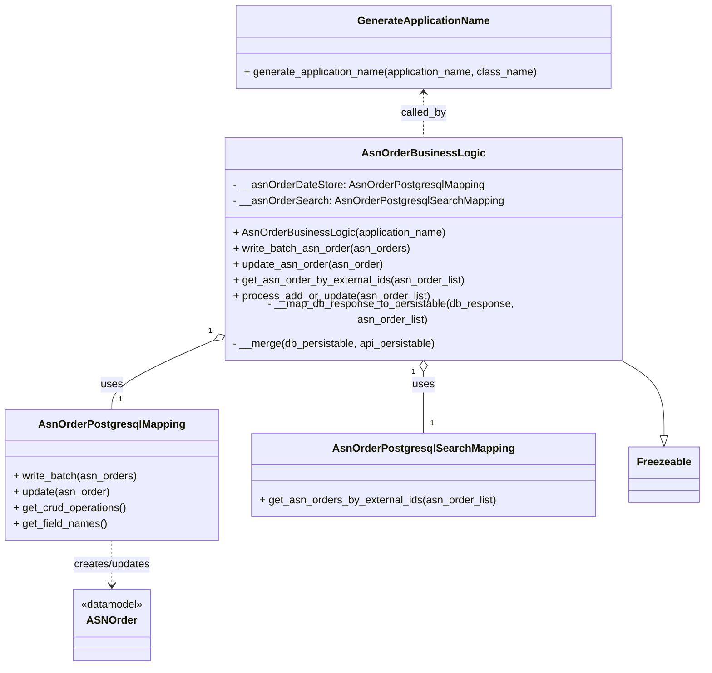
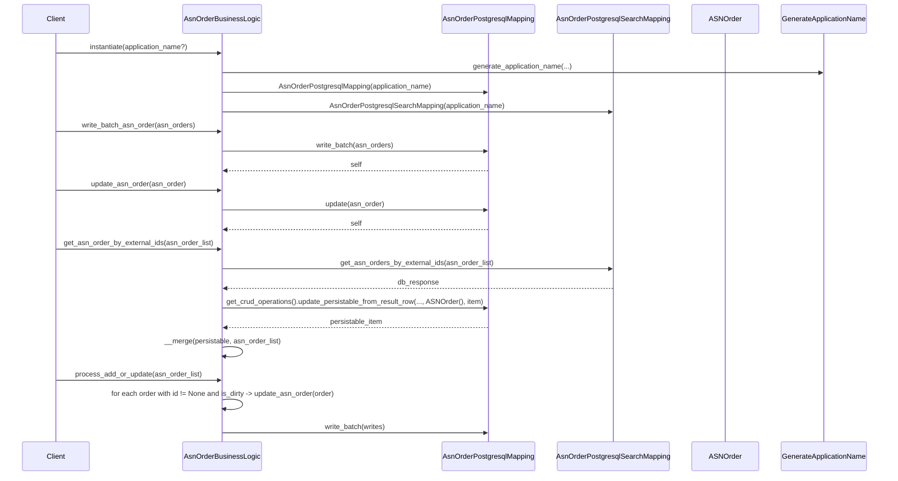

# Diagram: partview_core/partview_service/partview_service/core/business/asn_order/ASNorderBusinessLogic.py

> Auto-generated by Obscura crawlers

## Diagram 1

### SVG

<svg id="container" width="1045.4921875" xmlns="http://www.w3.org/2000/svg" class="classDiagram" height="982" viewBox="0 0 1045.4921875 982" role="graphics-document document" aria-roledescription="class"><g><defs><marker id="container_class-aggregationStart" class="marker aggregation class" refX="18" refY="7" markerWidth="190" markerHeight="240" orient="auto"><path d="M 18,7 L9,13 L1,7 L9,1 Z"></path></marker></defs><defs><marker id="container_class-aggregationEnd" class="marker aggregation class" refX="1" refY="7" markerWidth="20" markerHeight="28" orient="auto"><path d="M 18,7 L9,13 L1,7 L9,1 Z"></path></marker></defs><defs><marker id="container_class-extensionStart" class="marker extension class" refX="18" refY="7" markerWidth="190" markerHeight="240" orient="auto"><path d="M 1,7 L18,13 V 1 Z"></path></marker></defs><defs><marker id="container_class-extensionEnd" class="marker extension class" refX="1" refY="7" markerWidth="20" markerHeight="28" orient="auto"><path d="M 1,1 V 13 L18,7 Z"></path></marker></defs><defs><marker id="container_class-compositionStart" class="marker composition class" refX="18" refY="7" markerWidth="190" markerHeight="240" orient="auto"><path d="M 18,7 L9,13 L1,7 L9,1 Z"></path></marker></defs><defs><marker id="container_class-compositionEnd" class="marker composition class" refX="1" refY="7" markerWidth="20" markerHeight="28" orient="auto"><path d="M 18,7 L9,13 L1,7 L9,1 Z"></path></marker></defs><defs><marker id="container_class-dependencyStart" class="marker dependency class" refX="6" refY="7" markerWidth="190" markerHeight="240" orient="auto"><path d="M 5,7 L9,13 L1,7 L9,1 Z"></path></marker></defs><defs><marker id="container_class-dependencyEnd" class="marker dependency class" refX="13" refY="7" markerWidth="20" markerHeight="28" orient="auto"><path d="M 18,7 L9,13 L14,7 L9,1 Z"></path></marker></defs><defs><marker id="container_class-lollipopStart" class="marker lollipop class" refX="13" refY="7" markerWidth="190" markerHeight="240" orient="auto"><circle stroke="black" fill="transparent" cx="7" cy="7" r="6"></circle></marker></defs><defs><marker id="container_class-lollipopEnd" class="marker lollipop class" refX="1" refY="7" markerWidth="190" markerHeight="240" orient="auto"><circle stroke="black" fill="transparent" cx="7" cy="7" r="6"></circle></marker></defs><g class="root"><g class="clusters"></g><g class="edgePaths"><path d="M917.931,520L929.326,526.167C940.72,532.333,963.508,544.667,974.903,563.625C986.297,582.583,986.297,608.167,986.297,620.958L986.297,633.75" id="id_AsnOrderBusinessLogic_Freezeable_1" class="edge-thickness-normal edge-pattern-solid relation" style=";;;" data-edge="true" data-et="edge" data-id="id_AsnOrderBusinessLogic_Freezeable_1" data-points="W3sieCI6OTE3LjkzMTM0NzE1MDI1OTEsInkiOjUyMH0seyJ4Ijo5ODYuMjk2ODc1LCJ5Ijo1NTd9LHsieCI6OTg2LjI5Njg3NSwieSI6NjUxfV0=" marker-end="url(#container_class-extensionEnd)"></path><path d="M316.286,494.485L291.261,504.904C266.236,515.323,216.187,536.162,191.162,552.748C166.137,569.333,166.137,581.667,166.137,587.833L166.137,594" id="id_AsnOrderBusinessLogic_AsnOrderPostgresqlMapping_2" class="edge-thickness-normal edge-pattern-solid relation" style=";;;" data-edge="true" data-et="edge" data-id="id_AsnOrderBusinessLogic_AsnOrderPostgresqlMapping_2" data-points="W3sieCI6MzMyLjIxMDkzNzUsInkiOjQ4Ny44NTQ3NzI1MTg1MTc5fSx7IngiOjE2Ni4xMzY3MTg3NSwieSI6NTU3fSx7IngiOjE2Ni4xMzY3MTg3NSwieSI6NTk0fV0=" marker-start="url(#container_class-aggregationStart)"></path><path d="M629.688,537.25L629.688,540.542C629.688,543.833,629.688,550.417,629.688,565.875C629.688,581.333,629.688,605.667,629.688,617.833L629.688,630" id="id_AsnOrderBusinessLogic_AsnOrderPostgresqlSearchMapping_3" class="edge-thickness-normal edge-pattern-solid relation" style=";;;" data-edge="true" data-et="edge" data-id="id_AsnOrderBusinessLogic_AsnOrderPostgresqlSearchMapping_3" data-points="W3sieCI6NjI5LjY4NzUsInkiOjUyMH0seyJ4Ijo2MjkuNjg3NSwieSI6NTU3fSx7IngiOjYyOS42ODc1LCJ5Ijo2MzB9XQ==" marker-start="url(#container_class-aggregationStart)"></path><path d="M166.137,792L166.137,798.167C166.137,804.333,166.137,816.667,166.137,828C166.137,839.333,166.137,849.667,166.137,854.833L166.137,860" id="id_AsnOrderPostgresqlMapping_ASNOrder_4" class="edge-thickness-normal edge-pattern-dashed relation" style=";;;" data-edge="true" data-et="edge" data-id="id_AsnOrderPostgresqlMapping_ASNOrder_4" data-points="W3sieCI6MTY2LjEzNjcxODc1LCJ5Ijo3OTJ9LHsieCI6MTY2LjEzNjcxODc1LCJ5Ijo4Mjl9LHsieCI6MTY2LjEzNjcxODc1LCJ5Ijo4NjZ9XQ==" marker-end="url(#container_class-dependencyEnd)"></path><path d="M629.688,140L629.688,145.167C629.688,150.333,629.688,160.667,629.688,172C629.688,183.333,629.688,195.667,629.688,201.833L629.688,208" id="id_GenerateApplicationName_AsnOrderBusinessLogic_5" class="edge-thickness-normal edge-pattern-dashed relation" style=";;;" data-edge="true" data-et="edge" data-id="id_GenerateApplicationName_AsnOrderBusinessLogic_5" data-points="W3sieCI6NjI5LjY4NzUsInkiOjEzNH0seyJ4Ijo2MjkuNjg3NSwieSI6MTcxfSx7IngiOjYyOS42ODc1LCJ5IjoyMDh9XQ==" marker-start="url(#container_class-dependencyStart)"></path></g><g class="edgeLabels"><g class="edgeLabel"><g class="label" data-id="id_AsnOrderBusinessLogic_Freezeable_1" transform="translate(0, 0)"><foreignObject width="0" height="0">

</foreignObject></g></g><g class="edgeLabel" transform="translate(166.13671875, 557)"><g class="label" data-id="id_AsnOrderBusinessLogic_AsnOrderPostgresqlMapping_2" transform="translate(-16.4921875, -12)"><foreignObject width="32.984375" height="24">

uses

</foreignObject></g></g><g class="edgeLabel" transform="translate(629.6875, 557)"><g class="label" data-id="id_AsnOrderBusinessLogic_AsnOrderPostgresqlSearchMapping_3" transform="translate(-16.4921875, -12)"><foreignObject width="32.984375" height="24">

uses

</foreignObject></g></g><g class="edgeLabel" transform="translate(166.13671875, 829)"><g class="label" data-id="id_AsnOrderPostgresqlMapping_ASNOrder_4" transform="translate(-59.5, -12)"><foreignObject width="119" height="24">

creates/updates

</foreignObject></g></g><g class="edgeLabel" transform="translate(629.6875, 171)"><g class="label" data-id="id_GenerateApplicationName_AsnOrderBusinessLogic_5" transform="translate(-34.625, -12)"><foreignObject width="69.25" height="24">

called_by

</foreignObject></g></g><g class="edgeTerminals" transform="translate(310.28977332260985, 480.73349785719057)"><g class="inner" transform="translate(0, 0)"><foreignObject style="width: 9px; height: 12px;">
1
</foreignObject></g></g><g class="edgeTerminals" transform="translate(614.6875, 537.5)"><g class="inner" transform="translate(0, 0)"><foreignObject style="width: 9px; height: 12px;">
1
</foreignObject></g></g><g class="edgeTerminals" transform="translate(176.13671937499998, 571.5000005357143)"><g class="inner" transform="translate(0, 0)"></g><foreignObject style="width: 9px; height: 12px;">
1
</foreignObject></g><g class="edgeTerminals" transform="translate(639.6875, 607.5)"><g class="inner" transform="translate(0, 0)"></g><foreignObject style="width: 9px; height: 12px;">
1
</foreignObject></g></g><g class="nodes"><g class="node default" id="classId-AsnOrderBusinessLogic-0" transform="translate(629.6875, 364)"><g class="basic label-container"><path d="M-297.4765625 -156 L297.4765625 -156 L297.4765625 156 L-297.4765625 156" stroke="none" stroke-width="0" fill="#ECECFF" style=""></path><path d="M-297.4765625 -156 C-123.81001357303361 -156, 49.85653535393277 -156, 297.4765625 -156 M-297.4765625 -156 C-121.38397385199909 -156, 54.708614796001825 -156, 297.4765625 -156 M297.4765625 -156 C297.4765625 -53.000667496311735, 297.4765625 49.99866500737653, 297.4765625 156 M297.4765625 -156 C297.4765625 -71.92276256262492, 297.4765625 12.15447487475015, 297.4765625 156 M297.4765625 156 C154.90276882501567 156, 12.32897515003134 156, -297.4765625 156 M297.4765625 156 C63.72791150851603 156, -170.02073948296794 156, -297.4765625 156 M-297.4765625 156 C-297.4765625 59.94238430821349, -297.4765625 -36.11523138357302, -297.4765625 -156 M-297.4765625 156 C-297.4765625 54.128515246256015, -297.4765625 -47.74296950748797, -297.4765625 -156" stroke="#9370DB" stroke-width="1.3" fill="none" stroke-dasharray="0 0" style=""></path></g><g class="annotation-group text" transform="translate(0, -132)"></g><g class="label-group text" transform="translate(-85.53125, -132)"><g class="label" style="font-weight: bolder" transform="translate(0,-12)"><foreignObject width="171.0625" height="24">

AsnOrderBusinessLogic

</foreignObject></g></g><g class="members-group text" transform="translate(-285.4765625, -84)"><g class="label" style="" transform="translate(0,-12)"><foreignObject width="377.921875" height="24">

- __asnOrderDateStore: AsnOrderPostgresqlMapping

</foreignObject></g><g class="label" style="" transform="translate(0,12)"><foreignObject width="404.21875" height="24">

- __asnOrderSearch: AsnOrderPostgresqlSearchMapping

</foreignObject></g></g><g class="methods-group text" transform="translate(-285.4765625, -12)"><g class="label" style="" transform="translate(0,-12)"><foreignObject width="322.09375" height="24">

+ AsnOrderBusinessLogic(application_name)

</foreignObject></g><g class="label" style="" transform="translate(0,12)"><foreignObject width="268.640625" height="24">

+ write_batch_asn_order(asn_orders)

</foreignObject></g><g class="label" style="" transform="translate(0,36)"><foreignObject width="227.421875" height="24">

+ update_asn_order(asn_order)

</foreignObject></g><g class="label" style="" transform="translate(0,60)"><foreignObject width="349.40625" height="24">

+ get_asn_order_by_external_ids(asn_order_list)

</foreignObject></g><g class="label" style="" transform="translate(0,84)"><foreignObject width="297.296875" height="24">

+ process_add_or_update(asn_order_list)

</foreignObject></g><g class="label" style="" transform="translate(0,108)"><foreignObject width="485.421875" height="24">

- __map_db_response_to_persistable(db_response, asn_order_list)

</foreignObject></g><g class="label" style="" transform="translate(0,132)"><foreignObject width="310.359375" height="24">

- __merge(db_persistable, api_persistable)

</foreignObject></g></g><g class="divider" style=""><path d="M-297.4765625 -108 C-65.04618722218498 -108, 167.38418805563003 -108, 297.4765625 -108 M-297.4765625 -108 C-171.69170486425594 -108, -45.90684722851191 -108, 297.4765625 -108" stroke="#9370DB" stroke-width="1.3" fill="none" stroke-dasharray="0 0" style=""></path></g><g class="divider" style=""><path d="M-297.4765625 -36 C-152.60143004601053 -36, -7.726297592021069 -36, 297.4765625 -36 M-297.4765625 -36 C-73.93539518742577 -36, 149.60577212514846 -36, 297.4765625 -36" stroke="#9370DB" stroke-width="1.3" fill="none" stroke-dasharray="0 0" style=""></path></g></g><g class="node default" id="classId-AsnOrderPostgresqlMapping-1" transform="translate(166.13671875, 693)"><g class="basic label-container"><path d="M-158.13671875 -99 L158.13671875 -99 L158.13671875 99 L-158.13671875 99" stroke="none" stroke-width="0" fill="#ECECFF" style=""></path><path d="M-158.13671875 -99 C-39.193897396307406 -99, 79.74892395738519 -99, 158.13671875 -99 M-158.13671875 -99 C-56.670628481975086 -99, 44.79546178604983 -99, 158.13671875 -99 M158.13671875 -99 C158.13671875 -37.4687935269105, 158.13671875 24.062412946178995, 158.13671875 99 M158.13671875 -99 C158.13671875 -28.584382223202496, 158.13671875 41.83123555359501, 158.13671875 99 M158.13671875 99 C61.25752747048962 99, -35.62166380902076 99, -158.13671875 99 M158.13671875 99 C56.1085616965659 99, -45.9195953568682 99, -158.13671875 99 M-158.13671875 99 C-158.13671875 21.58814106529921, -158.13671875 -55.82371786940158, -158.13671875 -99 M-158.13671875 99 C-158.13671875 49.64113166734377, -158.13671875 0.28226333468754206, -158.13671875 -99" stroke="#9370DB" stroke-width="1.3" fill="none" stroke-dasharray="0 0" style=""></path></g><g class="annotation-group text" transform="translate(0, -75)"></g><g class="label-group text" transform="translate(-104.5234375, -75)"><g class="label" style="font-weight: bolder" transform="translate(0,-12)"><foreignObject width="209.046875" height="24">

AsnOrderPostgresqlMapping

</foreignObject></g></g><g class="members-group text" transform="translate(-146.13671875, -27)"></g><g class="methods-group text" transform="translate(-146.13671875, 3)"><g class="label" style="" transform="translate(0,-12)"><foreignObject width="187.75" height="24">

+ write_batch(asn_orders)

</foreignObject></g><g class="label" style="" transform="translate(0,12)"><foreignObject width="146.84375" height="24">

+ update(asn_order)

</foreignObject></g><g class="label" style="" transform="translate(0,36)"><foreignObject width="172.234375" height="24">

+ get_crud_operations()

</foreignObject></g><g class="label" style="" transform="translate(0,60)"><foreignObject width="141.5625" height="24">

+ get_field_names()

</foreignObject></g></g><g class="divider" style=""><path d="M-158.13671875 -51 C-77.6343200179257 -51, 2.868078714148595 -51, 158.13671875 -51 M-158.13671875 -51 C-42.27569399431614 -51, 73.58533076136771 -51, 158.13671875 -51" stroke="#9370DB" stroke-width="1.3" fill="none" stroke-dasharray="0 0" style=""></path></g><g class="divider" style=""><path d="M-158.13671875 -27 C-78.77996764285312 -27, 0.5767834642937544 -27, 158.13671875 -27 M-158.13671875 -27 C-73.7199940254691 -27, 10.696730699061789 -27, 158.13671875 -27" stroke="#9370DB" stroke-width="1.3" fill="none" stroke-dasharray="0 0" style=""></path></g></g><g class="node default" id="classId-AsnOrderPostgresqlSearchMapping-2" transform="translate(629.6875, 693)"><g class="basic label-container"><path d="M-255.4140625 -63 L255.4140625 -63 L255.4140625 63 L-255.4140625 63" stroke="none" stroke-width="0" fill="#ECECFF" style=""></path><path d="M-255.4140625 -63 C-83.84262443346088 -63, 87.72881363307823 -63, 255.4140625 -63 M-255.4140625 -63 C-151.2746865523776 -63, -47.135310604755176 -63, 255.4140625 -63 M255.4140625 -63 C255.4140625 -34.537469564912215, 255.4140625 -6.074939129824429, 255.4140625 63 M255.4140625 -63 C255.4140625 -34.336088051592355, 255.4140625 -5.672176103184704, 255.4140625 63 M255.4140625 63 C51.384744195857735 63, -152.64457410828453 63, -255.4140625 63 M255.4140625 63 C116.54305024054025 63, -22.327962018919493 63, -255.4140625 63 M-255.4140625 63 C-255.4140625 22.229509717390428, -255.4140625 -18.540980565219144, -255.4140625 -63 M-255.4140625 63 C-255.4140625 36.17813528178786, -255.4140625 9.356270563575727, -255.4140625 -63" stroke="#9370DB" stroke-width="1.3" fill="none" stroke-dasharray="0 0" style=""></path></g><g class="annotation-group text" transform="translate(0, -39)"></g><g class="label-group text" transform="translate(-129.234375, -39)"><g class="label" style="font-weight: bolder" transform="translate(0,-12)"><foreignObject width="258.46875" height="24">

AsnOrderPostgresqlSearchMapping

</foreignObject></g></g><g class="members-group text" transform="translate(-243.4140625, 9)"></g><g class="methods-group text" transform="translate(-243.4140625, 39)"><g class="label" style="" transform="translate(0,-12)"><foreignObject width="357.59375" height="24">

+ get_asn_orders_by_external_ids(asn_order_list)

</foreignObject></g></g><g class="divider" style=""><path d="M-255.4140625 -15 C-108.08720860401587 -15, 39.23964529196826 -15, 255.4140625 -15 M-255.4140625 -15 C-66.36751827924095 -15, 122.67902594151809 -15, 255.4140625 -15" stroke="#9370DB" stroke-width="1.3" fill="none" stroke-dasharray="0 0" style=""></path></g><g class="divider" style=""><path d="M-255.4140625 9 C-91.20899570371384 9, 72.99607109257232 9, 255.4140625 9 M-255.4140625 9 C-137.47145392773047 9, -19.52884535546096 9, 255.4140625 9" stroke="#9370DB" stroke-width="1.3" fill="none" stroke-dasharray="0 0" style=""></path></g></g><g class="node default" id="classId-ASNOrder-3" transform="translate(166.13671875, 920)"><g class="basic label-container"><path d="M-60.3046875 -54 L60.3046875 -54 L60.3046875 54 L-60.3046875 54" stroke="none" stroke-width="0" fill="#ECECFF" style=""></path><path d="M-60.3046875 -54 C-21.256634607865543 -54, 17.791418284268914 -54, 60.3046875 -54 M-60.3046875 -54 C-18.869078422022 -54, 22.566530655956 -54, 60.3046875 -54 M60.3046875 -54 C60.3046875 -11.900704618324248, 60.3046875 30.198590763351504, 60.3046875 54 M60.3046875 -54 C60.3046875 -16.232123990860828, 60.3046875 21.535752018278345, 60.3046875 54 M60.3046875 54 C29.681579928415108 54, -0.9415276431697848 54, -60.3046875 54 M60.3046875 54 C18.63769009345912 54, -23.02930731308176 54, -60.3046875 54 M-60.3046875 54 C-60.3046875 23.752667164100195, -60.3046875 -6.494665671799609, -60.3046875 -54 M-60.3046875 54 C-60.3046875 29.958883618396218, -60.3046875 5.917767236792436, -60.3046875 -54" stroke="#9370DB" stroke-width="1.3" fill="none" stroke-dasharray="0 0" style=""></path></g><g class="annotation-group text" transform="translate(-48.3046875, -30)"><g class="label" style="" transform="translate(0,-12)"><foreignObject width="96.609375" height="24">

«datamodel»

</foreignObject></g></g><g class="label-group text" transform="translate(-35.5234375, -6)"><g class="label" style="font-weight: bolder" transform="translate(0,-12)"><foreignObject width="71.046875" height="24">

ASNOrder

</foreignObject></g></g><g class="members-group text" transform="translate(-48.3046875, 42)"></g><g class="methods-group text" transform="translate(-48.3046875, 72)"></g><g class="divider" style=""><path d="M-60.3046875 18 C-16.883466236235435 18, 26.53775502752913 18, 60.3046875 18 M-60.3046875 18 C-20.008022625598343 18, 20.288642248803313 18, 60.3046875 18" stroke="#9370DB" stroke-width="1.3" fill="none" stroke-dasharray="0 0" style=""></path></g><g class="divider" style=""><path d="M-60.3046875 36 C-22.281212812891795 36, 15.74226187421641 36, 60.3046875 36 M-60.3046875 36 C-34.66604040738349 36, -9.027393314766975 36, 60.3046875 36" stroke="#9370DB" stroke-width="1.3" fill="none" stroke-dasharray="0 0" style=""></path></g></g><g class="node default" id="classId-Freezeable-4" transform="translate(986.296875, 693)"><g class="basic label-container"><path d="M-51.1953125 -42 L51.1953125 -42 L51.1953125 42 L-51.1953125 42" stroke="none" stroke-width="0" fill="#ECECFF" style=""></path><path d="M-51.1953125 -42 C-20.770434318802206 -42, 9.654443862395588 -42, 51.1953125 -42 M-51.1953125 -42 C-12.098590327852335 -42, 26.99813184429533 -42, 51.1953125 -42 M51.1953125 -42 C51.1953125 -8.792363069117037, 51.1953125 24.415273861765925, 51.1953125 42 M51.1953125 -42 C51.1953125 -15.320645015182606, 51.1953125 11.358709969634788, 51.1953125 42 M51.1953125 42 C17.638594757700716 42, -15.918122984598568 42, -51.1953125 42 M51.1953125 42 C21.016839768441393 42, -9.161632963117214 42, -51.1953125 42 M-51.1953125 42 C-51.1953125 10.385096221423435, -51.1953125 -21.22980755715313, -51.1953125 -42 M-51.1953125 42 C-51.1953125 17.51227595065057, -51.1953125 -6.9754480986988625, -51.1953125 -42" stroke="#9370DB" stroke-width="1.3" fill="none" stroke-dasharray="0 0" style=""></path></g><g class="annotation-group text" transform="translate(0, -18)"></g><g class="label-group text" transform="translate(-39.1953125, -18)"><g class="label" style="font-weight: bolder" transform="translate(0,-12)"><foreignObject width="78.390625" height="24">

Freezeable

</foreignObject></g></g><g class="members-group text" transform="translate(-39.1953125, 30)"></g><g class="methods-group text" transform="translate(-39.1953125, 60)"></g><g class="divider" style=""><path d="M-51.1953125 6 C-16.25362054055372 6, 18.688071418892562 6, 51.1953125 6 M-51.1953125 6 C-20.303895865111972 6, 10.587520769776056 6, 51.1953125 6" stroke="#9370DB" stroke-width="1.3" fill="none" stroke-dasharray="0 0" style=""></path></g><g class="divider" style=""><path d="M-51.1953125 24 C-16.471072053656165 24, 18.25316839268767 24, 51.1953125 24 M-51.1953125 24 C-24.781510385855423 24, 1.6322917282891538 24, 51.1953125 24" stroke="#9370DB" stroke-width="1.3" fill="none" stroke-dasharray="0 0" style=""></path></g></g><g class="node default" id="classId-GenerateApplicationName-5" transform="translate(629.6875, 71)"><g class="basic label-container"><path d="M-283.73046875 -63 L283.73046875 -63 L283.73046875 63 L-283.73046875 63" stroke="none" stroke-width="0" fill="#ECECFF" style=""></path><path d="M-283.73046875 -63 C-165.76204450853348 -63, -47.793620267066956 -63, 283.73046875 -63 M-283.73046875 -63 C-150.85753418884795 -63, -17.9845996276959 -63, 283.73046875 -63 M283.73046875 -63 C283.73046875 -14.374649441169367, 283.73046875 34.250701117661265, 283.73046875 63 M283.73046875 -63 C283.73046875 -22.568657270677434, 283.73046875 17.86268545864513, 283.73046875 63 M283.73046875 63 C148.48246273744468 63, 13.234456724889355 63, -283.73046875 63 M283.73046875 63 C83.85795925764992 63, -116.01455023470015 63, -283.73046875 63 M-283.73046875 63 C-283.73046875 33.63246464766807, -283.73046875 4.264929295336145, -283.73046875 -63 M-283.73046875 63 C-283.73046875 20.15660642109018, -283.73046875 -22.686787157819637, -283.73046875 -63" stroke="#9370DB" stroke-width="1.3" fill="none" stroke-dasharray="0 0" style=""></path></g><g class="annotation-group text" transform="translate(0, -39)"></g><g class="label-group text" transform="translate(-95.8203125, -39)"><g class="label" style="font-weight: bolder" transform="translate(0,-12)"><foreignObject width="191.640625" height="24">

GenerateApplicationName

</foreignObject></g></g><g class="members-group text" transform="translate(-271.73046875, 9)"></g><g class="methods-group text" transform="translate(-271.73046875, 39)"><g class="label" style="" transform="translate(0,-12)"><foreignObject width="447.640625" height="24">

+ generate_application_name(application_name, class_name)

</foreignObject></g></g><g class="divider" style=""><path d="M-283.73046875 -15 C-63.9352695377531 -15, 155.8599296744938 -15, 283.73046875 -15 M-283.73046875 -15 C-83.35067226824907 -15, 117.02912421350186 -15, 283.73046875 -15" stroke="#9370DB" stroke-width="1.3" fill="none" stroke-dasharray="0 0" style=""></path></g><g class="divider" style=""><path d="M-283.73046875 9 C-152.67216163204716 9, -21.613854514094328 9, 283.73046875 9 M-283.73046875 9 C-145.87745837553845 9, -8.024448001076905 9, 283.73046875 9" stroke="#9370DB" stroke-width="1.3" fill="none" stroke-dasharray="0 0" style=""></path></g></g></g></g></g></svg>

## Diagram 2

### SVG

<svg id="container" width="2131" xmlns="http://www.w3.org/2000/svg" height="1143" viewBox="-50 -10 2131 1143" role="graphics-document document" aria-roledescription="sequence"><g><rect x="1821" y="1057" fill="#eaeaea" stroke="#666" width="210" height="65" name="GenerateApplicationName" rx="3" ry="3" class="actor actor-bottom"></rect><text x="1926" y="1089.5" dominant-baseline="central" alignment-baseline="central" class="actor actor-box" style="text-anchor: middle; font-size: 16px; font-weight: 400;"><tspan x="1926" dy="0">GenerateApplicationName</tspan></text></g><g><rect x="1621" y="1057" fill="#eaeaea" stroke="#666" width="150" height="65" name="Model" rx="3" ry="3" class="actor actor-bottom"></rect><text x="1696" y="1089.5" dominant-baseline="central" alignment-baseline="central" class="actor actor-box" style="text-anchor: middle; font-size: 16px; font-weight: 400;"><tspan x="1696" dy="0">ASNOrder</tspan></text></g><g><rect x="1296" y="1057" fill="#eaeaea" stroke="#666" width="275" height="65" name="Search" rx="3" ry="3" class="actor actor-bottom"></rect><text x="1433.5" y="1089.5" dominant-baseline="central" alignment-baseline="central" class="actor actor-box" style="text-anchor: middle; font-size: 16px; font-weight: 400;"><tspan x="1433.5" dy="0">AsnOrderPostgresqlSearchMapping</tspan></text></g><g><rect x="1020" y="1057" fill="#eaeaea" stroke="#666" width="226" height="65" name="Store" rx="3" ry="3" class="actor actor-bottom"></rect><text x="1133" y="1089.5" dominant-baseline="central" alignment-baseline="central" class="actor actor-box" style="text-anchor: middle; font-size: 16px; font-weight: 400;"><tspan x="1133" dy="0">AsnOrderPostgresqlMapping</tspan></text></g><g><rect x="387.5" y="1057" fill="#eaeaea" stroke="#666" width="189" height="65" name="Logic" rx="3" ry="3" class="actor actor-bottom"></rect><text x="482" y="1089.5" dominant-baseline="central" alignment-baseline="central" class="actor actor-box" style="text-anchor: middle; font-size: 16px; font-weight: 400;"><tspan x="482" dy="0">AsnOrderBusinessLogic</tspan></text></g><g><rect x="0" y="1057" fill="#eaeaea" stroke="#666" width="150" height="65" name="Client" rx="3" ry="3" class="actor actor-bottom"></rect><text x="75" y="1089.5" dominant-baseline="central" alignment-baseline="central" class="actor actor-box" style="text-anchor: middle; font-size: 16px; font-weight: 400;"><tspan x="75" dy="0">Client</tspan></text></g><g><line id="actor5" x1="1926" y1="65" x2="1926" y2="1057" class="actor-line 200" stroke-width="0.5px" stroke="#999" name="GenerateApplicationName"></line><g id="root-5"><rect x="1821" y="0" fill="#eaeaea" stroke="#666" width="210" height="65" name="GenerateApplicationName" rx="3" ry="3" class="actor actor-top"></rect><text x="1926" y="32.5" dominant-baseline="central" alignment-baseline="central" class="actor actor-box" style="text-anchor: middle; font-size: 16px; font-weight: 400;"><tspan x="1926" dy="0">GenerateApplicationName</tspan></text></g></g><g><line id="actor4" x1="1696" y1="65" x2="1696" y2="1057" class="actor-line 200" stroke-width="0.5px" stroke="#999" name="Model"></line><g id="root-4"><rect x="1621" y="0" fill="#eaeaea" stroke="#666" width="150" height="65" name="Model" rx="3" ry="3" class="actor actor-top"></rect><text x="1696" y="32.5" dominant-baseline="central" alignment-baseline="central" class="actor actor-box" style="text-anchor: middle; font-size: 16px; font-weight: 400;"><tspan x="1696" dy="0">ASNOrder</tspan></text></g></g><g><line id="actor3" x1="1433.5" y1="65" x2="1433.5" y2="1057" class="actor-line 200" stroke-width="0.5px" stroke="#999" name="Search"></line><g id="root-3"><rect x="1296" y="0" fill="#eaeaea" stroke="#666" width="275" height="65" name="Search" rx="3" ry="3" class="actor actor-top"></rect><text x="1433.5" y="32.5" dominant-baseline="central" alignment-baseline="central" class="actor actor-box" style="text-anchor: middle; font-size: 16px; font-weight: 400;"><tspan x="1433.5" dy="0">AsnOrderPostgresqlSearchMapping</tspan></text></g></g><g><line id="actor2" x1="1133" y1="65" x2="1133" y2="1057" class="actor-line 200" stroke-width="0.5px" stroke="#999" name="Store"></line><g id="root-2"><rect x="1020" y="0" fill="#eaeaea" stroke="#666" width="226" height="65" name="Store" rx="3" ry="3" class="actor actor-top"></rect><text x="1133" y="32.5" dominant-baseline="central" alignment-baseline="central" class="actor actor-box" style="text-anchor: middle; font-size: 16px; font-weight: 400;"><tspan x="1133" dy="0">AsnOrderPostgresqlMapping</tspan></text></g></g><g><line id="actor1" x1="482" y1="65" x2="482" y2="1057" class="actor-line 200" stroke-width="0.5px" stroke="#999" name="Logic"></line><g id="root-1"><rect x="387.5" y="0" fill="#eaeaea" stroke="#666" width="189" height="65" name="Logic" rx="3" ry="3" class="actor actor-top"></rect><text x="482" y="32.5" dominant-baseline="central" alignment-baseline="central" class="actor actor-box" style="text-anchor: middle; font-size: 16px; font-weight: 400;"><tspan x="482" dy="0">AsnOrderBusinessLogic</tspan></text></g></g><g><line id="actor0" x1="75" y1="65" x2="75" y2="1057" class="actor-line 200" stroke-width="0.5px" stroke="#999" name="Client"></line><g id="root-0"><rect x="0" y="0" fill="#eaeaea" stroke="#666" width="150" height="65" name="Client" rx="3" ry="3" class="actor actor-top"></rect><text x="75" y="32.5" dominant-baseline="central" alignment-baseline="central" class="actor actor-box" style="text-anchor: middle; font-size: 16px; font-weight: 400;"><tspan x="75" dy="0">Client</tspan></text></g></g><g></g><defs><symbol id="computer" width="24" height="24"><path transform="scale(.5)" d="M2 2v13h20v-13h-20zm18 11h-16v-9h16v9zm-10.228 6l.466-1h3.524l.467 1h-4.457zm14.228 3h-24l2-6h2.104l-1.33 4h18.45l-1.297-4h2.073l2 6zm-5-10h-14v-7h14v7z"></path></symbol></defs><defs><symbol id="database" fill-rule="evenodd" clip-rule="evenodd"><path transform="scale(.5)" d="M12.258.001l.256.004.255.005.253.008.251.01.249.012.247.015.246.016.242.019.241.02.239.023.236.024.233.027.231.028.229.031.225.032.223.034.22.036.217.038.214.04.211.041.208.043.205.045.201.046.198.048.194.05.191.051.187.053.183.054.18.056.175.057.172.059.168.06.163.061.16.063.155.064.15.066.074.033.073.033.071.034.07.034.069.035.068.035.067.035.066.035.064.036.064.036.062.036.06.036.06.037.058.037.058.037.055.038.055.038.053.038.052.038.051.039.05.039.048.039.047.039.045.04.044.04.043.04.041.04.04.041.039.041.037.041.036.041.034.041.033.042.032.042.03.042.029.042.027.042.026.043.024.043.023.043.021.043.02.043.018.044.017.043.015.044.013.044.012.044.011.045.009.044.007.045.006.045.004.045.002.045.001.045v17l-.001.045-.002.045-.004.045-.006.045-.007.045-.009.044-.011.045-.012.044-.013.044-.015.044-.017.043-.018.044-.02.043-.021.043-.023.043-.024.043-.026.043-.027.042-.029.042-.03.042-.032.042-.033.042-.034.041-.036.041-.037.041-.039.041-.04.041-.041.04-.043.04-.044.04-.045.04-.047.039-.048.039-.05.039-.051.039-.052.038-.053.038-.055.038-.055.038-.058.037-.058.037-.06.037-.06.036-.062.036-.064.036-.064.036-.066.035-.067.035-.068.035-.069.035-.07.034-.071.034-.073.033-.074.033-.15.066-.155.064-.16.063-.163.061-.168.06-.172.059-.175.057-.18.056-.183.054-.187.053-.191.051-.194.05-.198.048-.201.046-.205.045-.208.043-.211.041-.214.04-.217.038-.22.036-.223.034-.225.032-.229.031-.231.028-.233.027-.236.024-.239.023-.241.02-.242.019-.246.016-.247.015-.249.012-.251.01-.253.008-.255.005-.256.004-.258.001-.258-.001-.256-.004-.255-.005-.253-.008-.251-.01-.249-.012-.247-.015-.245-.016-.243-.019-.241-.02-.238-.023-.236-.024-.234-.027-.231-.028-.228-.031-.226-.032-.223-.034-.22-.036-.217-.038-.214-.04-.211-.041-.208-.043-.204-.045-.201-.046-.198-.048-.195-.05-.19-.051-.187-.053-.184-.054-.179-.056-.176-.057-.172-.059-.167-.06-.164-.061-.159-.063-.155-.064-.151-.066-.074-.033-.072-.033-.072-.034-.07-.034-.069-.035-.068-.035-.067-.035-.066-.035-.064-.036-.063-.036-.062-.036-.061-.036-.06-.037-.058-.037-.057-.037-.056-.038-.055-.038-.053-.038-.052-.038-.051-.039-.049-.039-.049-.039-.046-.039-.046-.04-.044-.04-.043-.04-.041-.04-.04-.041-.039-.041-.037-.041-.036-.041-.034-.041-.033-.042-.032-.042-.03-.042-.029-.042-.027-.042-.026-.043-.024-.043-.023-.043-.021-.043-.02-.043-.018-.044-.017-.043-.015-.044-.013-.044-.012-.044-.011-.045-.009-.044-.007-.045-.006-.045-.004-.045-.002-.045-.001-.045v-17l.001-.045.002-.045.004-.045.006-.045.007-.045.009-.044.011-.045.012-.044.013-.044.015-.044.017-.043.018-.044.02-.043.021-.043.023-.043.024-.043.026-.043.027-.042.029-.042.03-.042.032-.042.033-.042.034-.041.036-.041.037-.041.039-.041.04-.041.041-.04.043-.04.044-.04.046-.04.046-.039.049-.039.049-.039.051-.039.052-.038.053-.038.055-.038.056-.038.057-.037.058-.037.06-.037.061-.036.062-.036.063-.036.064-.036.066-.035.067-.035.068-.035.069-.035.07-.034.072-.034.072-.033.074-.033.151-.066.155-.064.159-.063.164-.061.167-.06.172-.059.176-.057.179-.056.184-.054.187-.053.19-.051.195-.05.198-.048.201-.046.204-.045.208-.043.211-.041.214-.04.217-.038.22-.036.223-.034.226-.032.228-.031.231-.028.234-.027.236-.024.238-.023.241-.02.243-.019.245-.016.247-.015.249-.012.251-.01.253-.008.255-.005.256-.004.258-.001.258.001zm-9.258 20.499v.01l.001.021.003.021.004.022.005.021.006.022.007.022.009.023.01.022.011.023.012.023.013.023.015.023.016.024.017.023.018.024.019.024.021.024.022.025.023.024.024.025.052.049.056.05.061.051.066.051.07.051.075.051.079.052.084.052.088.052.092.052.097.052.102.051.105.052.11.052.114.051.119.051.123.051.127.05.131.05.135.05.139.048.144.049.147.047.152.047.155.047.16.045.163.045.167.043.171.043.176.041.178.041.183.039.187.039.19.037.194.035.197.035.202.033.204.031.209.03.212.029.216.027.219.025.222.024.226.021.23.02.233.018.236.016.24.015.243.012.246.01.249.008.253.005.256.004.259.001.26-.001.257-.004.254-.005.25-.008.247-.011.244-.012.241-.014.237-.016.233-.018.231-.021.226-.021.224-.024.22-.026.216-.027.212-.028.21-.031.205-.031.202-.034.198-.034.194-.036.191-.037.187-.039.183-.04.179-.04.175-.042.172-.043.168-.044.163-.045.16-.046.155-.046.152-.047.148-.048.143-.049.139-.049.136-.05.131-.05.126-.05.123-.051.118-.052.114-.051.11-.052.106-.052.101-.052.096-.052.092-.052.088-.053.083-.051.079-.052.074-.052.07-.051.065-.051.06-.051.056-.05.051-.05.023-.024.023-.025.021-.024.02-.024.019-.024.018-.024.017-.024.015-.023.014-.024.013-.023.012-.023.01-.023.01-.022.008-.022.006-.022.006-.022.004-.022.004-.021.001-.021.001-.021v-4.127l-.077.055-.08.053-.083.054-.085.053-.087.052-.09.052-.093.051-.095.05-.097.05-.1.049-.102.049-.105.048-.106.047-.109.047-.111.046-.114.045-.115.045-.118.044-.12.043-.122.042-.124.042-.126.041-.128.04-.13.04-.132.038-.134.038-.135.037-.138.037-.139.035-.142.035-.143.034-.144.033-.147.032-.148.031-.15.03-.151.03-.153.029-.154.027-.156.027-.158.026-.159.025-.161.024-.162.023-.163.022-.165.021-.166.02-.167.019-.169.018-.169.017-.171.016-.173.015-.173.014-.175.013-.175.012-.177.011-.178.01-.179.008-.179.008-.181.006-.182.005-.182.004-.184.003-.184.002h-.37l-.184-.002-.184-.003-.182-.004-.182-.005-.181-.006-.179-.008-.179-.008-.178-.01-.176-.011-.176-.012-.175-.013-.173-.014-.172-.015-.171-.016-.17-.017-.169-.018-.167-.019-.166-.02-.165-.021-.163-.022-.162-.023-.161-.024-.159-.025-.157-.026-.156-.027-.155-.027-.153-.029-.151-.03-.15-.03-.148-.031-.146-.032-.145-.033-.143-.034-.141-.035-.14-.035-.137-.037-.136-.037-.134-.038-.132-.038-.13-.04-.128-.04-.126-.041-.124-.042-.122-.042-.12-.044-.117-.043-.116-.045-.113-.045-.112-.046-.109-.047-.106-.047-.105-.048-.102-.049-.1-.049-.097-.05-.095-.05-.093-.052-.09-.051-.087-.052-.085-.053-.083-.054-.08-.054-.077-.054v4.127zm0-5.654v.011l.001.021.003.021.004.021.005.022.006.022.007.022.009.022.01.022.011.023.012.023.013.023.015.024.016.023.017.024.018.024.019.024.021.024.022.024.023.025.024.024.052.05.056.05.061.05.066.051.07.051.075.052.079.051.084.052.088.052.092.052.097.052.102.052.105.052.11.051.114.051.119.052.123.05.127.051.131.05.135.049.139.049.144.048.147.048.152.047.155.046.16.045.163.045.167.044.171.042.176.042.178.04.183.04.187.038.19.037.194.036.197.034.202.033.204.032.209.03.212.028.216.027.219.025.222.024.226.022.23.02.233.018.236.016.24.014.243.012.246.01.249.008.253.006.256.003.259.001.26-.001.257-.003.254-.006.25-.008.247-.01.244-.012.241-.015.237-.016.233-.018.231-.02.226-.022.224-.024.22-.025.216-.027.212-.029.21-.03.205-.032.202-.033.198-.035.194-.036.191-.037.187-.039.183-.039.179-.041.175-.042.172-.043.168-.044.163-.045.16-.045.155-.047.152-.047.148-.048.143-.048.139-.05.136-.049.131-.05.126-.051.123-.051.118-.051.114-.052.11-.052.106-.052.101-.052.096-.052.092-.052.088-.052.083-.052.079-.052.074-.051.07-.052.065-.051.06-.05.056-.051.051-.049.023-.025.023-.024.021-.025.02-.024.019-.024.018-.024.017-.024.015-.023.014-.023.013-.024.012-.022.01-.023.01-.023.008-.022.006-.022.006-.022.004-.021.004-.022.001-.021.001-.021v-4.139l-.077.054-.08.054-.083.054-.085.052-.087.053-.09.051-.093.051-.095.051-.097.05-.1.049-.102.049-.105.048-.106.047-.109.047-.111.046-.114.045-.115.044-.118.044-.12.044-.122.042-.124.042-.126.041-.128.04-.13.039-.132.039-.134.038-.135.037-.138.036-.139.036-.142.035-.143.033-.144.033-.147.033-.148.031-.15.03-.151.03-.153.028-.154.028-.156.027-.158.026-.159.025-.161.024-.162.023-.163.022-.165.021-.166.02-.167.019-.169.018-.169.017-.171.016-.173.015-.173.014-.175.013-.175.012-.177.011-.178.009-.179.009-.179.007-.181.007-.182.005-.182.004-.184.003-.184.002h-.37l-.184-.002-.184-.003-.182-.004-.182-.005-.181-.007-.179-.007-.179-.009-.178-.009-.176-.011-.176-.012-.175-.013-.173-.014-.172-.015-.171-.016-.17-.017-.169-.018-.167-.019-.166-.02-.165-.021-.163-.022-.162-.023-.161-.024-.159-.025-.157-.026-.156-.027-.155-.028-.153-.028-.151-.03-.15-.03-.148-.031-.146-.033-.145-.033-.143-.033-.141-.035-.14-.036-.137-.036-.136-.037-.134-.038-.132-.039-.13-.039-.128-.04-.126-.041-.124-.042-.122-.043-.12-.043-.117-.044-.116-.044-.113-.046-.112-.046-.109-.046-.106-.047-.105-.048-.102-.049-.1-.049-.097-.05-.095-.051-.093-.051-.09-.051-.087-.053-.085-.052-.083-.054-.08-.054-.077-.054v4.139zm0-5.666v.011l.001.02.003.022.004.021.005.022.006.021.007.022.009.023.01.022.011.023.012.023.013.023.015.023.016.024.017.024.018.023.019.024.021.025.022.024.023.024.024.025.052.05.056.05.061.05.066.051.07.051.075.052.079.051.084.052.088.052.092.052.097.052.102.052.105.051.11.052.114.051.119.051.123.051.127.05.131.05.135.05.139.049.144.048.147.048.152.047.155.046.16.045.163.045.167.043.171.043.176.042.178.04.183.04.187.038.19.037.194.036.197.034.202.033.204.032.209.03.212.028.216.027.219.025.222.024.226.021.23.02.233.018.236.017.24.014.243.012.246.01.249.008.253.006.256.003.259.001.26-.001.257-.003.254-.006.25-.008.247-.01.244-.013.241-.014.237-.016.233-.018.231-.02.226-.022.224-.024.22-.025.216-.027.212-.029.21-.03.205-.032.202-.033.198-.035.194-.036.191-.037.187-.039.183-.039.179-.041.175-.042.172-.043.168-.044.163-.045.16-.045.155-.047.152-.047.148-.048.143-.049.139-.049.136-.049.131-.051.126-.05.123-.051.118-.052.114-.051.11-.052.106-.052.101-.052.096-.052.092-.052.088-.052.083-.052.079-.052.074-.052.07-.051.065-.051.06-.051.056-.05.051-.049.023-.025.023-.025.021-.024.02-.024.019-.024.018-.024.017-.024.015-.023.014-.024.013-.023.012-.023.01-.022.01-.023.008-.022.006-.022.006-.022.004-.022.004-.021.001-.021.001-.021v-4.153l-.077.054-.08.054-.083.053-.085.053-.087.053-.09.051-.093.051-.095.051-.097.05-.1.049-.102.048-.105.048-.106.048-.109.046-.111.046-.114.046-.115.044-.118.044-.12.043-.122.043-.124.042-.126.041-.128.04-.13.039-.132.039-.134.038-.135.037-.138.036-.139.036-.142.034-.143.034-.144.033-.147.032-.148.032-.15.03-.151.03-.153.028-.154.028-.156.027-.158.026-.159.024-.161.024-.162.023-.163.023-.165.021-.166.02-.167.019-.169.018-.169.017-.171.016-.173.015-.173.014-.175.013-.175.012-.177.01-.178.01-.179.009-.179.007-.181.006-.182.006-.182.004-.184.003-.184.001-.185.001-.185-.001-.184-.001-.184-.003-.182-.004-.182-.006-.181-.006-.179-.007-.179-.009-.178-.01-.176-.01-.176-.012-.175-.013-.173-.014-.172-.015-.171-.016-.17-.017-.169-.018-.167-.019-.166-.02-.165-.021-.163-.023-.162-.023-.161-.024-.159-.024-.157-.026-.156-.027-.155-.028-.153-.028-.151-.03-.15-.03-.148-.032-.146-.032-.145-.033-.143-.034-.141-.034-.14-.036-.137-.036-.136-.037-.134-.038-.132-.039-.13-.039-.128-.041-.126-.041-.124-.041-.122-.043-.12-.043-.117-.044-.116-.044-.113-.046-.112-.046-.109-.046-.106-.048-.105-.048-.102-.048-.1-.05-.097-.049-.095-.051-.093-.051-.09-.052-.087-.052-.085-.053-.083-.053-.08-.054-.077-.054v4.153zm8.74-8.179l-.257.004-.254.005-.25.008-.247.011-.244.012-.241.014-.237.016-.233.018-.231.021-.226.022-.224.023-.22.026-.216.027-.212.028-.21.031-.205.032-.202.033-.198.034-.194.036-.191.038-.187.038-.183.04-.179.041-.175.042-.172.043-.168.043-.163.045-.16.046-.155.046-.152.048-.148.048-.143.048-.139.049-.136.05-.131.05-.126.051-.123.051-.118.051-.114.052-.11.052-.106.052-.101.052-.096.052-.092.052-.088.052-.083.052-.079.052-.074.051-.07.052-.065.051-.06.05-.056.05-.051.05-.023.025-.023.024-.021.024-.02.025-.019.024-.018.024-.017.023-.015.024-.014.023-.013.023-.012.023-.01.023-.01.022-.008.022-.006.023-.006.021-.004.022-.004.021-.001.021-.001.021.001.021.001.021.004.021.004.022.006.021.006.023.008.022.01.022.01.023.012.023.013.023.014.023.015.024.017.023.018.024.019.024.02.025.021.024.023.024.023.025.051.05.056.05.06.05.065.051.07.052.074.051.079.052.083.052.088.052.092.052.096.052.101.052.106.052.11.052.114.052.118.051.123.051.126.051.131.05.136.05.139.049.143.048.148.048.152.048.155.046.16.046.163.045.168.043.172.043.175.042.179.041.183.04.187.038.191.038.194.036.198.034.202.033.205.032.21.031.212.028.216.027.22.026.224.023.226.022.231.021.233.018.237.016.241.014.244.012.247.011.25.008.254.005.257.004.26.001.26-.001.257-.004.254-.005.25-.008.247-.011.244-.012.241-.014.237-.016.233-.018.231-.021.226-.022.224-.023.22-.026.216-.027.212-.028.21-.031.205-.032.202-.033.198-.034.194-.036.191-.038.187-.038.183-.04.179-.041.175-.042.172-.043.168-.043.163-.045.16-.046.155-.046.152-.048.148-.048.143-.048.139-.049.136-.05.131-.05.126-.051.123-.051.118-.051.114-.052.11-.052.106-.052.101-.052.096-.052.092-.052.088-.052.083-.052.079-.052.074-.051.07-.052.065-.051.06-.05.056-.05.051-.05.023-.025.023-.024.021-.024.02-.025.019-.024.018-.024.017-.023.015-.024.014-.023.013-.023.012-.023.01-.023.01-.022.008-.022.006-.023.006-.021.004-.022.004-.021.001-.021.001-.021-.001-.021-.001-.021-.004-.021-.004-.022-.006-.021-.006-.023-.008-.022-.01-.022-.01-.023-.012-.023-.013-.023-.014-.023-.015-.024-.017-.023-.018-.024-.019-.024-.02-.025-.021-.024-.023-.024-.023-.025-.051-.05-.056-.05-.06-.05-.065-.051-.07-.052-.074-.051-.079-.052-.083-.052-.088-.052-.092-.052-.096-.052-.101-.052-.106-.052-.11-.052-.114-.052-.118-.051-.123-.051-.126-.051-.131-.05-.136-.05-.139-.049-.143-.048-.148-.048-.152-.048-.155-.046-.16-.046-.163-.045-.168-.043-.172-.043-.175-.042-.179-.041-.183-.04-.187-.038-.191-.038-.194-.036-.198-.034-.202-.033-.205-.032-.21-.031-.212-.028-.216-.027-.22-.026-.224-.023-.226-.022-.231-.021-.233-.018-.237-.016-.241-.014-.244-.012-.247-.011-.25-.008-.254-.005-.257-.004-.26-.001-.26.001z"></path></symbol></defs><defs><symbol id="clock" width="24" height="24"><path transform="scale(.5)" d="M12 2c5.514 0 10 4.486 10 10s-4.486 10-10 10-10-4.486-10-10 4.486-10 10-10zm0-2c-6.627 0-12 5.373-12 12s5.373 12 12 12 12-5.373 12-12-5.373-12-12-12zm5.848 12.459c.202.038.202.333.001.372-1.907.361-6.045 1.111-6.547 1.111-.719 0-1.301-.582-1.301-1.301 0-.512.77-5.447 1.125-7.445.034-.192.312-.181.343.014l.985 6.238 5.394 1.011z"></path></symbol></defs><defs><marker id="arrowhead" refX="7.9" refY="5" markerUnits="userSpaceOnUse" markerWidth="12" markerHeight="12" orient="auto-start-reverse"><path d="M -1 0 L 10 5 L 0 10 z"></path></marker></defs><defs><marker id="crosshead" markerWidth="15" markerHeight="8" orient="auto" refX="4" refY="4.5"><path fill="none" stroke="#000000" stroke-width="1pt" d="M 1,2 L 6,7 M 6,2 L 1,7" style="stroke-dasharray: 0, 0;"></path></marker></defs><defs><marker id="filled-head" refX="15.5" refY="7" markerWidth="20" markerHeight="28" orient="auto"><path d="M 18,7 L9,13 L14,7 L9,1 Z"></path></marker></defs><defs><marker id="sequencenumber" refX="15" refY="15" markerWidth="60" markerHeight="40" orient="auto"><circle cx="15" cy="15" r="6"></circle></marker></defs><text x="277" y="80" text-anchor="middle" dominant-baseline="middle" alignment-baseline="middle" class="messageText" dy="1em" style="font-size: 16px; font-weight: 400;">instantiate(application_name?)</text><line x1="76" y1="113" x2="478" y2="113" class="messageLine0" stroke-width="2" stroke="none" marker-end="url(#arrowhead)" style="fill: none;"></line><text x="1203" y="128" text-anchor="middle" dominant-baseline="middle" alignment-baseline="middle" class="messageText" dy="1em" style="font-size: 16px; font-weight: 400;">generate_application_name(...)</text><line x1="483" y1="161" x2="1922" y2="161" class="messageLine0" stroke-width="2" stroke="none" marker-end="url(#arrowhead)" style="fill: none;"></line><text x="806" y="176" text-anchor="middle" dominant-baseline="middle" alignment-baseline="middle" class="messageText" dy="1em" style="font-size: 16px; font-weight: 400;">AsnOrderPostgresqlMapping(application_name)</text><line x1="483" y1="209" x2="1129" y2="209" class="messageLine0" stroke-width="2" stroke="none" marker-end="url(#arrowhead)" style="fill: none;"></line><text x="956" y="224" text-anchor="middle" dominant-baseline="middle" alignment-baseline="middle" class="messageText" dy="1em" style="font-size: 16px; font-weight: 400;">AsnOrderPostgresqlSearchMapping(application_name)</text><line x1="483" y1="257" x2="1429.5" y2="257" class="messageLine0" stroke-width="2" stroke="none" marker-end="url(#arrowhead)" style="fill: none;"></line><text x="277" y="272" text-anchor="middle" dominant-baseline="middle" alignment-baseline="middle" class="messageText" dy="1em" style="font-size: 16px; font-weight: 400;">write_batch_asn_order(asn_orders)</text><line x1="76" y1="305" x2="478" y2="305" class="messageLine0" stroke-width="2" stroke="none" marker-end="url(#arrowhead)" style="fill: none;"></line><text x="806" y="320" text-anchor="middle" dominant-baseline="middle" alignment-baseline="middle" class="messageText" dy="1em" style="font-size: 16px; font-weight: 400;">write_batch(asn_orders)</text><line x1="483" y1="353" x2="1129" y2="353" class="messageLine0" stroke-width="2" stroke="none" marker-end="url(#arrowhead)" style="fill: none;"></line><text x="809" y="368" text-anchor="middle" dominant-baseline="middle" alignment-baseline="middle" class="messageText" dy="1em" style="font-size: 16px; font-weight: 400;">self</text><line x1="1132" y1="401" x2="486" y2="401" class="messageLine1" stroke-width="2" stroke="none" marker-end="url(#arrowhead)" style="stroke-dasharray: 3, 3; fill: none;"></line><text x="277" y="416" text-anchor="middle" dominant-baseline="middle" alignment-baseline="middle" class="messageText" dy="1em" style="font-size: 16px; font-weight: 400;">update_asn_order(asn_order)</text><line x1="76" y1="449" x2="478" y2="449" class="messageLine0" stroke-width="2" stroke="none" marker-end="url(#arrowhead)" style="fill: none;"></line><text x="806" y="464" text-anchor="middle" dominant-baseline="middle" alignment-baseline="middle" class="messageText" dy="1em" style="font-size: 16px; font-weight: 400;">update(asn_order)</text><line x1="483" y1="497" x2="1129" y2="497" class="messageLine0" stroke-width="2" stroke="none" marker-end="url(#arrowhead)" style="fill: none;"></line><text x="809" y="512" text-anchor="middle" dominant-baseline="middle" alignment-baseline="middle" class="messageText" dy="1em" style="font-size: 16px; font-weight: 400;">self</text><line x1="1132" y1="545" x2="486" y2="545" class="messageLine1" stroke-width="2" stroke="none" marker-end="url(#arrowhead)" style="stroke-dasharray: 3, 3; fill: none;"></line><text x="277" y="560" text-anchor="middle" dominant-baseline="middle" alignment-baseline="middle" class="messageText" dy="1em" style="font-size: 16px; font-weight: 400;">get_asn_order_by_external_ids(asn_order_list)</text><line x1="76" y1="593" x2="478" y2="593" class="messageLine0" stroke-width="2" stroke="none" marker-end="url(#arrowhead)" style="fill: none;"></line><text x="956" y="608" text-anchor="middle" dominant-baseline="middle" alignment-baseline="middle" class="messageText" dy="1em" style="font-size: 16px; font-weight: 400;">get_asn_orders_by_external_ids(asn_order_list)</text><line x1="483" y1="641" x2="1429.5" y2="641" class="messageLine0" stroke-width="2" stroke="none" marker-end="url(#arrowhead)" style="fill: none;"></line><text x="959" y="656" text-anchor="middle" dominant-baseline="middle" alignment-baseline="middle" class="messageText" dy="1em" style="font-size: 16px; font-weight: 400;">db_response</text><line x1="1432.5" y1="689" x2="486" y2="689" class="messageLine1" stroke-width="2" stroke="none" marker-end="url(#arrowhead)" style="stroke-dasharray: 3, 3; fill: none;"></line><text x="806" y="704" text-anchor="middle" dominant-baseline="middle" alignment-baseline="middle" class="messageText" dy="1em" style="font-size: 16px; font-weight: 400;">get_crud_operations().update_persistable_from_result_row(..., ASNOrder(), item)</text><line x1="483" y1="737" x2="1129" y2="737" class="messageLine0" stroke-width="2" stroke="none" marker-end="url(#arrowhead)" style="fill: none;"></line><text x="809" y="752" text-anchor="middle" dominant-baseline="middle" alignment-baseline="middle" class="messageText" dy="1em" style="font-size: 16px; font-weight: 400;">persistable_item</text><line x1="1132" y1="785" x2="486" y2="785" class="messageLine1" stroke-width="2" stroke="none" marker-end="url(#arrowhead)" style="stroke-dasharray: 3, 3; fill: none;"></line><text x="483" y="800" text-anchor="middle" dominant-baseline="middle" alignment-baseline="middle" class="messageText" dy="1em" style="font-size: 16px; font-weight: 400;">__merge(persistable, asn_order_list)</text><path d="M 483,833 C 543,823 543,863 483,853" class="messageLine0" stroke-width="2" stroke="none" marker-end="url(#arrowhead)" style="fill: none;"></path><text x="277" y="878" text-anchor="middle" dominant-baseline="middle" alignment-baseline="middle" class="messageText" dy="1em" style="font-size: 16px; font-weight: 400;">process_add_or_update(asn_order_list)</text><line x1="76" y1="911" x2="478" y2="911" class="messageLine0" stroke-width="2" stroke="none" marker-end="url(#arrowhead)" style="fill: none;"></line><text x="483" y="926" text-anchor="middle" dominant-baseline="middle" alignment-baseline="middle" class="messageText" dy="1em" style="font-size: 16px; font-weight: 400;">for each order with id != None and is_dirty -&gt; update_asn_order(order)</text><path d="M 483,959 C 543,949 543,989 483,979" class="messageLine0" stroke-width="2" stroke="none" marker-end="url(#arrowhead)" style="fill: none;"></path><text x="806" y="1004" text-anchor="middle" dominant-baseline="middle" alignment-baseline="middle" class="messageText" dy="1em" style="font-size: 16px; font-weight: 400;">write_batch(writes)</text><line x1="483" y1="1037" x2="1129" y2="1037" class="messageLine0" stroke-width="2" stroke="none" marker-end="url(#arrowhead)" style="fill: none;"></line></svg>
