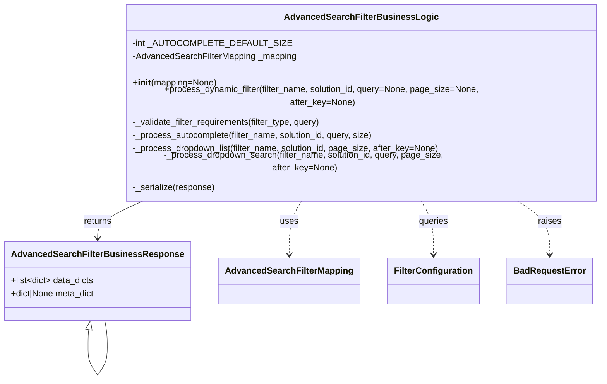

# Diagram: partview_core/partview_service/partview_service/core/business/open_search/AdvancedSearchFilterBusinessLogic.py


> Auto-generated by Obscura crawlers

## Diagram 1



### SVG

<svg id="container" width="1068.55859375" xmlns="http://www.w3.org/2000/svg" class="classDiagram" height="646.25" viewBox="0 0 1068.55859375 646.25" role="graphics-document document" aria-roledescription="class"><style>#container{font-family:"trebuchet ms",verdana,arial,sans-serif;font-size:16px;fill:#333;}@keyframes edge-animation-frame{from{stroke-dashoffset:0;}}@keyframes dash{to{stroke-dashoffset:0;}}#container .edge-animation-slow{stroke-dasharray:9,5!important;stroke-dashoffset:900;animation:dash 50s linear infinite;stroke-linecap:round;}#container .edge-animation-fast{stroke-dasharray:9,5!important;stroke-dashoffset:900;animation:dash 20s linear infinite;stroke-linecap:round;}#container .error-icon{fill:#552222;}#container .error-text{fill:#552222;stroke:#552222;}#container .edge-thickness-normal{stroke-width:1px;}#container .edge-thickness-thick{stroke-width:3.5px;}#container .edge-pattern-solid{stroke-dasharray:0;}#container .edge-thickness-invisible{stroke-width:0;fill:none;}#container .edge-pattern-dashed{stroke-dasharray:3;}#container .edge-pattern-dotted{stroke-dasharray:2;}#container .marker{fill:#333333;stroke:#333333;}#container .marker.cross{stroke:#333333;}#container svg{font-family:"trebuchet ms",verdana,arial,sans-serif;font-size:16px;}#container p{margin:0;}#container g.classGroup text{fill:#9370DB;stroke:none;font-family:"trebuchet ms",verdana,arial,sans-serif;font-size:10px;}#container g.classGroup text .title{font-weight:bolder;}#container .nodeLabel,#container .edgeLabel{color:#131300;}#container .edgeLabel .label rect{fill:#ECECFF;}#container .label text{fill:#131300;}#container .labelBkg{background:#ECECFF;}#container .edgeLabel .label span{background:#ECECFF;}#container .classTitle{font-weight:bolder;}#container .node rect,#container .node circle,#container .node ellipse,#container .node polygon,#container .node path{fill:#ECECFF;stroke:#9370DB;stroke-width:1px;}#container .divider{stroke:#9370DB;stroke-width:1;}#container g.clickable{cursor:pointer;}#container g.classGroup rect{fill:#ECECFF;stroke:#9370DB;}#container g.classGroup line{stroke:#9370DB;stroke-width:1;}#container .classLabel .box{stroke:none;stroke-width:0;fill:#ECECFF;opacity:0.5;}#container .classLabel .label{fill:#9370DB;font-size:10px;}#container .relation{stroke:#333333;stroke-width:1;fill:none;}#container .dashed-line{stroke-dasharray:3;}#container .dotted-line{stroke-dasharray:1 2;}#container #compositionStart,#container .composition{fill:#333333!important;stroke:#333333!important;stroke-width:1;}#container #compositionEnd,#container .composition{fill:#333333!important;stroke:#333333!important;stroke-width:1;}#container #dependencyStart,#container .dependency{fill:#333333!important;stroke:#333333!important;stroke-width:1;}#container #dependencyStart,#container .dependency{fill:#333333!important;stroke:#333333!important;stroke-width:1;}#container #extensionStart,#container .extension{fill:transparent!important;stroke:#333333!important;stroke-width:1;}#container #extensionEnd,#container .extension{fill:transparent!important;stroke:#333333!important;stroke-width:1;}#container #aggregationStart,#container .aggregation{fill:transparent!important;stroke:#333333!important;stroke-width:1;}#container #aggregationEnd,#container .aggregation{fill:transparent!important;stroke:#333333!important;stroke-width:1;}#container #lollipopStart,#container .lollipop{fill:#ECECFF!important;stroke:#333333!important;stroke-width:1;}#container #lollipopEnd,#container .lollipop{fill:#ECECFF!important;stroke:#333333!important;stroke-width:1;}#container .edgeTerminals{font-size:11px;line-height:initial;}#container .classTitleText{text-anchor:middle;font-size:18px;fill:#333;}#container .label-icon{display:inline-block;height:1em;overflow:visible;vertical-align:-0.125em;}#container .node .label-icon path{fill:currentColor;stroke:revert;stroke-width:revert;}#container :root{--mermaid-font-family:"trebuchet ms",verdana,arial,sans-serif;}</style><g><defs><marker id="container_class-aggregationStart" class="marker aggregation class" refX="18" refY="7" markerWidth="190" markerHeight="240" orient="auto"><path d="M 18,7 L9,13 L1,7 L9,1 Z"></path></marker></defs><defs><marker id="container_class-aggregationEnd" class="marker aggregation class" refX="1" refY="7" markerWidth="20" markerHeight="28" orient="auto"><path d="M 18,7 L9,13 L1,7 L9,1 Z"></path></marker></defs><defs><marker id="container_class-extensionStart" class="marker extension class" refX="18" refY="7" markerWidth="190" markerHeight="240" orient="auto"><path d="M 1,7 L18,13 V 1 Z"></path></marker></defs><defs><marker id="container_class-extensionEnd" class="marker extension class" refX="1" refY="7" markerWidth="20" markerHeight="28" orient="auto"><path d="M 1,1 V 13 L18,7 Z"></path></marker></defs><defs><marker id="container_class-compositionStart" class="marker composition class" refX="18" refY="7" markerWidth="190" markerHeight="240" orient="auto"><path d="M 18,7 L9,13 L1,7 L9,1 Z"></path></marker></defs><defs><marker id="container_class-compositionEnd" class="marker composition class" refX="1" refY="7" markerWidth="20" markerHeight="28" orient="auto"><path d="M 18,7 L9,13 L1,7 L9,1 Z"></path></marker></defs><defs><marker id="container_class-dependencyStart" class="marker dependency class" refX="6" refY="7" markerWidth="190" markerHeight="240" orient="auto"><path d="M 5,7 L9,13 L1,7 L9,1 Z"></path></marker></defs><defs><marker id="container_class-dependencyEnd" class="marker dependency class" refX="13" refY="7" markerWidth="20" markerHeight="28" orient="auto"><path d="M 18,7 L9,13 L14,7 L9,1 Z"></path></marker></defs><defs><marker id="container_class-lollipopStart" class="marker lollipop class" refX="13" refY="7" markerWidth="190" markerHeight="240" orient="auto"><circle stroke="black" fill="transparent" cx="7" cy="7" r="6"></circle></marker></defs><defs><marker id="container_class-lollipopEnd" class="marker lollipop class" refX="1" refY="7" markerWidth="190" markerHeight="240" orient="auto"><circle stroke="black" fill="transparent" cx="7" cy="7" r="6"></circle></marker></defs><g class="root"><g class="clusters"></g><g class="edgePaths"><path d="M260.448,320L245.67,326.167C230.891,332.333,201.334,344.667,186.556,356C171.777,367.333,171.777,377.667,171.777,382.833L171.777,388" id="id_AdvancedSearchFilterBusinessLogic_AdvancedSearchFilterBusinessResponse_1" class="edge-thickness-normal edge-pattern-solid relation" style=";;;" data-edge="true" data-et="edge" data-id="id_AdvancedSearchFilterBusinessLogic_AdvancedSearchFilterBusinessResponse_1" data-points="W3sieCI6MjYwLjQ0ODM4ODkyNDg3MDQ3LCJ5IjozMjB9LHsieCI6MTcxLjc3NzM0Mzc1LCJ5IjozNTd9LHsieCI6MTcxLjc3NzM0Mzc1LCJ5IjozOTR9XQ==" marker-end="url(#container_class-dependencyEnd)"></path><path d="M532.195,320L528.159,326.167C524.122,332.333,516.049,344.667,512.013,361C507.977,377.333,507.977,397.667,507.977,407.833L507.977,418" id="id_AdvancedSearchFilterBusinessLogic_AdvancedSearchFilterMapping_2" class="edge-thickness-normal edge-pattern-dashed relation" style=";;;" data-edge="true" data-et="edge" data-id="id_AdvancedSearchFilterBusinessLogic_AdvancedSearchFilterMapping_2" data-points="W3sieCI6NTMyLjE5NDkwNzcwNzI1MzgsInkiOjMyMH0seyJ4Ijo1MDcuOTc2NTYyNSwieSI6MzU3fSx7IngiOjUwNy45NzY1NjI1LCJ5Ijo0MjR9XQ==" marker-end="url(#container_class-dependencyEnd)"></path><path d="M736.414,320L740.451,326.167C744.487,332.333,752.56,344.667,756.596,361C760.633,377.333,760.633,397.667,760.633,407.833L760.633,418" id="id_AdvancedSearchFilterBusinessLogic_FilterConfiguration_3" class="edge-thickness-normal edge-pattern-dashed relation" style=";;;" data-edge="true" data-et="edge" data-id="id_AdvancedSearchFilterBusinessLogic_FilterConfiguration_3" data-points="W3sieCI6NzM2LjQxNDQ2NzI5Mjc0NjIsInkiOjMyMH0seyJ4Ijo3NjAuNjMyODEyNSwieSI6MzU3fSx7IngiOjc2MC42MzI4MTI1LCJ5Ijo0MjR9XQ==" marker-end="url(#container_class-dependencyEnd)"></path><path d="M901.722,320L912.293,326.167C922.864,332.333,944.006,344.667,954.577,361C965.148,377.333,965.148,397.667,965.148,407.833L965.148,418" id="id_AdvancedSearchFilterBusinessLogic_BadRequestError_4" class="edge-thickness-normal edge-pattern-dashed relation" style=";;;" data-edge="true" data-et="edge" data-id="id_AdvancedSearchFilterBusinessLogic_BadRequestError_4" data-points="W3sieCI6OTAxLjcyMjQzMzYxMzk4OTcsInkiOjMyMH0seyJ4Ijo5NjUuMTQ4NDM3NSwieSI6MzU3fSx7IngiOjk2NS4xNDg0Mzc1LCJ5Ijo0MjR9XQ==" marker-end="url(#container_class-dependencyEnd)"></path><path d="M155.702,554.975L155.461,556.313C155.219,557.65,154.736,560.325,154.494,565.829C154.252,571.333,154.252,579.667,154.252,583.833L154.252,588" id="AdvancedSearchFilterBusinessResponse-cyclic-special-1" class="edge-thickness-normal edge-pattern-solid relation" style=";;;" data-edge="true" data-et="edge" data-id="AdvancedSearchFilterBusinessResponse-cyclic-special-1" data-points="W3sieCI6MTU4Ljc2OTA5NjMyNzA0MzA2LCJ5Ijo1Mzh9LHsieCI6MTU0LjI1MjM0Mzc0OTYyNzQ3LCJ5Ijo1NjN9LHsieCI6MTU0LjI1MjM0Mzc0OTYyNzQ3LCJ5Ijo1ODh9XQ==" marker-start="url(#container_class-extensionStart)"></path><path d="M154.252,588.1L154.252,592.267C154.252,596.433,154.252,604.767,157.167,613.1C160.082,621.433,165.912,629.767,168.827,633.933L171.742,638.1" id="AdvancedSearchFilterBusinessResponse-cyclic-special-mid" class="edge-thickness-normal edge-pattern-solid relation" style=";;;" data-edge="true" data-et="edge" data-id="AdvancedSearchFilterBusinessResponse-cyclic-special-mid" data-points="W3sieCI6MTU0LjI1MjM0Mzc0OTYyNzQ3LCJ5Ijo1ODguMTAwMDAwMDAxNDkwMX0seyJ4IjoxNTQuMjUyMzQzNzQ5NjI3NDcsInkiOjYxMy4xMDAwMDAwMDE0OTAxfSx7IngiOjE3MS43NDIzNjM3MDk1NTg5LCJ5Ijo2MzguMTAwMDAwMDAxNDkwMX1d"></path><path d="M171.812,638.1L174.727,633.933C177.642,629.767,183.472,621.433,186.387,613.092C189.302,604.75,189.302,596.4,189.302,588.05C189.302,579.7,189.302,571.35,188.55,563.008C187.797,554.667,186.291,546.333,185.538,542.167L184.786,538" id="AdvancedSearchFilterBusinessResponse-cyclic-special-2" class="edge-thickness-normal edge-pattern-solid relation" style=";;;" data-edge="true" data-et="edge" data-id="AdvancedSearchFilterBusinessResponse-cyclic-special-2" data-points="W3sieCI6MTcxLjgxMjMyMzc5MDQ0MTEsInkiOjYzOC4xMDAwMDAwMDE0OTAxfSx7IngiOjE4OS4zMDIzNDM3NTAzNzI1MywieSI6NjEzLjEwMDAwMDAwMTQ5MDF9LHsieCI6MTg5LjMwMjM0Mzc1MDM3MjUzLCJ5Ijo1ODguMDUwMDAwMDAwNzQ1MX0seyJ4IjoxODkuMzAyMzQzNzUwMzcyNTMsInkiOjU2M30seyJ4IjoxODQuNzg1NTkxMTcyOTU2OTQsInkiOjUzOH1d"></path></g><g class="edgeLabels"><g class="edgeLabel" transform="translate(171.77734375, 357)"><g class="label" data-id="id_AdvancedSearchFilterBusinessLogic_AdvancedSearchFilterBusinessResponse_1" transform="translate(-26.265625, -12)"><foreignObject width="52.53125" height="24"><div xmlns="http://www.w3.org/1999/xhtml" class="labelBkg" style="display: table-cell; white-space: nowrap; line-height: 1.5; max-width: 200px; text-align: center;"><span class="edgeLabel"><p>returns</p></span></div></foreignObject></g></g><g class="edgeLabel" transform="translate(507.9765625, 357)"><g class="label" data-id="id_AdvancedSearchFilterBusinessLogic_AdvancedSearchFilterMapping_2" transform="translate(-16.4921875, -12)"><foreignObject width="32.984375" height="24"><div xmlns="http://www.w3.org/1999/xhtml" class="labelBkg" style="display: table-cell; white-space: nowrap; line-height: 1.5; max-width: 200px; text-align: center;"><span class="edgeLabel"><p>uses</p></span></div></foreignObject></g></g><g class="edgeLabel" transform="translate(760.6328125, 357)"><g class="label" data-id="id_AdvancedSearchFilterBusinessLogic_FilterConfiguration_3" transform="translate(-27.2421875, -12)"><foreignObject width="54.484375" height="24"><div xmlns="http://www.w3.org/1999/xhtml" class="labelBkg" style="display: table-cell; white-space: nowrap; line-height: 1.5; max-width: 200px; text-align: center;"><span class="edgeLabel"><p>queries</p></span></div></foreignObject></g></g><g class="edgeLabel" transform="translate(965.1484375, 357)"><g class="label" data-id="id_AdvancedSearchFilterBusinessLogic_BadRequestError_4" transform="translate(-21.25, -12)"><foreignObject width="42.5" height="24"><div xmlns="http://www.w3.org/1999/xhtml" class="labelBkg" style="display: table-cell; white-space: nowrap; line-height: 1.5; max-width: 200px; text-align: center;"><span class="edgeLabel"><p>raises</p></span></div></foreignObject></g></g><g class="edgeLabel"><g class="label" data-id="AdvancedSearchFilterBusinessResponse-cyclic-special-1" transform="translate(0, 0)"><foreignObject width="0" height="0"><div xmlns="http://www.w3.org/1999/xhtml" class="labelBkg" style="display: table-cell; white-space: nowrap; line-height: 1.5; max-width: 200px; text-align: center;"><span class="edgeLabel"></span></div></foreignObject></g></g><g class="edgeLabel"><g class="label" data-id="AdvancedSearchFilterBusinessResponse-cyclic-special-mid" transform="translate(0, 0)"><foreignObject width="0" height="0"><div xmlns="http://www.w3.org/1999/xhtml" class="labelBkg" style="display: table-cell; white-space: nowrap; line-height: 1.5; max-width: 200px; text-align: center;"><span class="edgeLabel"></span></div></foreignObject></g></g><g class="edgeLabel"><g class="label" data-id="AdvancedSearchFilterBusinessResponse-cyclic-special-2" transform="translate(0, 0)"><foreignObject width="0" height="0"><div xmlns="http://www.w3.org/1999/xhtml" class="labelBkg" style="display: table-cell; white-space: nowrap; line-height: 1.5; max-width: 200px; text-align: center;"><span class="edgeLabel"></span></div></foreignObject></g></g></g><g class="nodes"><g class="node default" id="classId-AdvancedSearchFilterBusinessResponse-0" transform="translate(171.77734375, 466)"><g class="basic label-container"><path d="M-163.77734375 -72 L163.77734375 -72 L163.77734375 72 L-163.77734375 72" stroke="none" stroke-width="0" fill="#ECECFF" style=""></path><path d="M-163.77734375 -72 C-74.66321880961524 -72, 14.45090613076951 -72, 163.77734375 -72 M-163.77734375 -72 C-60.897035909808764 -72, 41.98327193038247 -72, 163.77734375 -72 M163.77734375 -72 C163.77734375 -37.40854801230392, 163.77734375 -2.817096024607835, 163.77734375 72 M163.77734375 -72 C163.77734375 -19.88681085403168, 163.77734375 32.22637829193664, 163.77734375 72 M163.77734375 72 C89.49915532133556 72, 15.220966892671129 72, -163.77734375 72 M163.77734375 72 C71.51979913234126 72, -20.737745485317475 72, -163.77734375 72 M-163.77734375 72 C-163.77734375 33.34131200681181, -163.77734375 -5.317375986376376, -163.77734375 -72 M-163.77734375 72 C-163.77734375 41.017895205178505, -163.77734375 10.035790410357002, -163.77734375 -72" stroke="#9370DB" stroke-width="1.3" fill="none" stroke-dasharray="0 0" style=""></path></g><g class="annotation-group text" transform="translate(0, -48)"></g><g class="label-group text" transform="translate(-146.6953125, -48)"><g class="label" style="font-weight: bolder" transform="translate(0,-12)"><foreignObject width="293.390625" height="24"><div xmlns="http://www.w3.org/1999/xhtml" style="display: table-cell; white-space: nowrap; line-height: 1.5; max-width: 340px; text-align: center;"><span class="nodeLabel markdown-node-label" style=""><p>AdvancedSearchFilterBusinessResponse</p></span></div></foreignObject></g></g><g class="members-group text" transform="translate(-151.77734375, 0)"><g class="label" style="" transform="translate(0,-12)"><foreignObject width="153.796875" height="24"><div xmlns="http://www.w3.org/1999/xhtml" style="display: table-cell; white-space: nowrap; line-height: 1.5; max-width: 251px; text-align: center;"><span class="nodeLabel markdown-node-label" style=""><p>+list&lt;dict&gt; data_dicts</p></span></div></foreignObject></g><g class="label" style="" transform="translate(0,12)"><foreignObject width="156.859375" height="24"><div xmlns="http://www.w3.org/1999/xhtml" style="display: table-cell; white-space: nowrap; line-height: 1.5; max-width: 214px; text-align: center;"><span class="nodeLabel markdown-node-label" style=""><p>+dict|None meta_dict</p></span></div></foreignObject></g></g><g class="methods-group text" transform="translate(-151.77734375, 72)"></g><g class="divider" style=""><path d="M-163.77734375 -24 C-82.84459243490616 -24, -1.9118411198123226 -24, 163.77734375 -24 M-163.77734375 -24 C-38.5226649218196 -24, 86.7320139063608 -24, 163.77734375 -24" stroke="#9370DB" stroke-width="1.3" fill="none" stroke-dasharray="0 0" style=""></path></g><g class="divider" style=""><path d="M-163.77734375 48 C-75.47308233787493 48, 12.831179074250144 48, 163.77734375 48 M-163.77734375 48 C-51.91108097675419 48, 59.955181796491615 48, 163.77734375 48" stroke="#9370DB" stroke-width="1.3" fill="none" stroke-dasharray="0 0" style=""></path></g></g><g class="node default" id="classId-AdvancedSearchFilterBusinessLogic-1" transform="translate(634.3046875, 164)"><g class="basic label-container"><path d="M-426.25390625 -156 L426.25390625 -156 L426.25390625 156 L-426.25390625 156" stroke="none" stroke-width="0" fill="#ECECFF" style=""></path><path d="M-426.25390625 -156 C-118.2560959135892 -156, 189.7417144228216 -156, 426.25390625 -156 M-426.25390625 -156 C-153.95758053035104 -156, 118.33874518929792 -156, 426.25390625 -156 M426.25390625 -156 C426.25390625 -72.65606736004415, 426.25390625 10.687865279911705, 426.25390625 156 M426.25390625 -156 C426.25390625 -42.66348505379179, 426.25390625 70.67302989241642, 426.25390625 156 M426.25390625 156 C140.22649342466627 156, -145.80091940066745 156, -426.25390625 156 M426.25390625 156 C86.73742253522596 156, -252.77906117954808 156, -426.25390625 156 M-426.25390625 156 C-426.25390625 87.32246981417882, -426.25390625 18.644939628357633, -426.25390625 -156 M-426.25390625 156 C-426.25390625 45.72925733114343, -426.25390625 -64.54148533771314, -426.25390625 -156" stroke="#9370DB" stroke-width="1.3" fill="none" stroke-dasharray="0 0" style=""></path></g><g class="annotation-group text" transform="translate(0, -132)"></g><g class="label-group text" transform="translate(-130.3203125, -132)"><g class="label" style="font-weight: bolder" transform="translate(0,-12)"><foreignObject width="260.640625" height="24"><div xmlns="http://www.w3.org/1999/xhtml" style="display: table-cell; white-space: nowrap; line-height: 1.5; max-width: 307px; text-align: center;"><span class="nodeLabel markdown-node-label" style=""><p>AdvancedSearchFilterBusinessLogic</p></span></div></foreignObject></g></g><g class="members-group text" transform="translate(-414.25390625, -84)"><g class="label" style="" transform="translate(0,-12)"><foreignObject width="258.078125" height="24"><div xmlns="http://www.w3.org/1999/xhtml" style="display: table-cell; white-space: nowrap; line-height: 1.5; max-width: 315px; text-align: center;"><span class="nodeLabel markdown-node-label" style=""><p>-int _AUTOCOMPLETE_DEFAULT_SIZE</p></span></div></foreignObject></g><g class="label" style="" transform="translate(0,12)"><foreignObject width="300.53125" height="24"><div xmlns="http://www.w3.org/1999/xhtml" style="display: table-cell; white-space: nowrap; line-height: 1.5; max-width: 359px; text-align: center;"><span class="nodeLabel markdown-node-label" style=""><p>-AdvancedSearchFilterMapping _mapping</p></span></div></foreignObject></g></g><g class="methods-group text" transform="translate(-414.25390625, -12)"><g class="label" style="" transform="translate(0,-12)"><foreignObject width="152.796875" height="24"><div xmlns="http://www.w3.org/1999/xhtml" style="display: table-cell; white-space: nowrap; line-height: 1.5; max-width: 242px; text-align: center;"><span class="nodeLabel markdown-node-label" style=""><p>+<strong>init</strong>(mapping=None)</p></span></div></foreignObject></g><g class="label" style="" transform="translate(0,12)"><foreignObject width="698.1875" height="24"><div xmlns="http://www.w3.org/1999/xhtml" style="display: table-cell; white-space: nowrap; line-height: 1.5; max-width: 756px; text-align: center;"><span class="nodeLabel markdown-node-label" style=""><p>+process_dynamic_filter(filter_name, solution_id, query=None, page_size=None, after_key=None)</p></span></div></foreignObject></g><g class="label" style="" transform="translate(0,36)"><foreignObject width="350" height="24"><div xmlns="http://www.w3.org/1999/xhtml" style="display: table-cell; white-space: nowrap; line-height: 1.5; max-width: 407px; text-align: center;"><span class="nodeLabel markdown-node-label" style=""><p>-_validate_filter_requirements(filter_type, query)</p></span></div></foreignObject></g><g class="label" style="" transform="translate(0,60)"><foreignObject width="444.0625" height="24"><div xmlns="http://www.w3.org/1999/xhtml" style="display: table-cell; white-space: nowrap; line-height: 1.5; max-width: 501px; text-align: center;"><span class="nodeLabel markdown-node-label" style=""><p>-_process_autocomplete(filter_name, solution_id, query, size)</p></span></div></foreignObject></g><g class="label" style="" transform="translate(0,84)"><foreignObject width="562.15625" height="24"><div xmlns="http://www.w3.org/1999/xhtml" style="display: table-cell; white-space: nowrap; line-height: 1.5; max-width: 620px; text-align: center;"><span class="nodeLabel markdown-node-label" style=""><p>-_process_dropdown_list(filter_name, solution_id, page_size, after_key=None)</p></span></div></foreignObject></g><g class="label" style="" transform="translate(0,108)"><foreignObject width="636.40625" height="24"><div xmlns="http://www.w3.org/1999/xhtml" style="display: table-cell; white-space: nowrap; line-height: 1.5; max-width: 694px; text-align: center;"><span class="nodeLabel markdown-node-label" style=""><p>-_process_dropdown_search(filter_name, solution_id, query, page_size, after_key=None)</p></span></div></foreignObject></g><g class="label" style="" transform="translate(0,132)"><foreignObject width="150.390625" height="24"><div xmlns="http://www.w3.org/1999/xhtml" style="display: table-cell; white-space: nowrap; line-height: 1.5; max-width: 208px; text-align: center;"><span class="nodeLabel markdown-node-label" style=""><p>-_serialize(response)</p></span></div></foreignObject></g></g><g class="divider" style=""><path d="M-426.25390625 -108 C-115.83249658271205 -108, 194.5889130845759 -108, 426.25390625 -108 M-426.25390625 -108 C-234.68930716784652 -108, -43.124708085693044 -108, 426.25390625 -108" stroke="#9370DB" stroke-width="1.3" fill="none" stroke-dasharray="0 0" style=""></path></g><g class="divider" style=""><path d="M-426.25390625 -36 C-145.05835416686205 -36, 136.1371979162759 -36, 426.25390625 -36 M-426.25390625 -36 C-129.0039764792225 -36, 168.245953291555 -36, 426.25390625 -36" stroke="#9370DB" stroke-width="1.3" fill="none" stroke-dasharray="0 0" style=""></path></g></g><g class="node default" id="classId-AdvancedSearchFilterMapping-2" transform="translate(507.9765625, 466)"><g class="basic label-container"><path d="M-122.421875 -42 L122.421875 -42 L122.421875 42 L-122.421875 42" stroke="none" stroke-width="0" fill="#ECECFF" style=""></path><path d="M-122.421875 -42 C-35.15351865082677 -42, 52.11483769834646 -42, 122.421875 -42 M-122.421875 -42 C-48.38708081367791 -42, 25.647713372644176 -42, 122.421875 -42 M122.421875 -42 C122.421875 -24.15255835024854, 122.421875 -6.305116700497081, 122.421875 42 M122.421875 -42 C122.421875 -23.82380951381114, 122.421875 -5.647619027622277, 122.421875 42 M122.421875 42 C44.573946507352105 42, -33.27398198529579 42, -122.421875 42 M122.421875 42 C48.429758815377355 42, -25.56235736924529 42, -122.421875 42 M-122.421875 42 C-122.421875 21.750373984415482, -122.421875 1.5007479688309644, -122.421875 -42 M-122.421875 42 C-122.421875 11.357641606872221, -122.421875 -19.284716786255558, -122.421875 -42" stroke="#9370DB" stroke-width="1.3" fill="none" stroke-dasharray="0 0" style=""></path></g><g class="annotation-group text" transform="translate(0, -18)"></g><g class="label-group text" transform="translate(-110.421875, -18)"><g class="label" style="font-weight: bolder" transform="translate(0,-12)"><foreignObject width="220.84375" height="24"><div xmlns="http://www.w3.org/1999/xhtml" style="display: table-cell; white-space: nowrap; line-height: 1.5; max-width: 269px; text-align: center;"><span class="nodeLabel markdown-node-label" style=""><p>AdvancedSearchFilterMapping</p></span></div></foreignObject></g></g><g class="members-group text" transform="translate(-110.421875, 30)"></g><g class="methods-group text" transform="translate(-110.421875, 60)"></g><g class="divider" style=""><path d="M-122.421875 6 C-61.258849018837374 6, -0.09582303767474798 6, 122.421875 6 M-122.421875 6 C-67.09336801938383 6, -11.764861038767677 6, 122.421875 6" stroke="#9370DB" stroke-width="1.3" fill="none" stroke-dasharray="0 0" style=""></path></g><g class="divider" style=""><path d="M-122.421875 24 C-66.79188770476159 24, -11.161900409523184 24, 122.421875 24 M-122.421875 24 C-53.48926371147019 24, 15.443347577059626 24, 122.421875 24" stroke="#9370DB" stroke-width="1.3" fill="none" stroke-dasharray="0 0" style=""></path></g></g><g class="node default" id="classId-FilterConfiguration-3" transform="translate(760.6328125, 466)"><g class="basic label-container"><path d="M-80.234375 -42 L80.234375 -42 L80.234375 42 L-80.234375 42" stroke="none" stroke-width="0" fill="#ECECFF" style=""></path><path d="M-80.234375 -42 C-34.510435864527466 -42, 11.213503270945068 -42, 80.234375 -42 M-80.234375 -42 C-37.46107329559786 -42, 5.312228408804273 -42, 80.234375 -42 M80.234375 -42 C80.234375 -9.085971767081986, 80.234375 23.828056465836028, 80.234375 42 M80.234375 -42 C80.234375 -22.605255342954386, 80.234375 -3.2105106859087726, 80.234375 42 M80.234375 42 C18.651845580435584 42, -42.93068383912883 42, -80.234375 42 M80.234375 42 C18.320208402787763 42, -43.593958194424474 42, -80.234375 42 M-80.234375 42 C-80.234375 12.314576301866232, -80.234375 -17.370847396267536, -80.234375 -42 M-80.234375 42 C-80.234375 19.767499053312307, -80.234375 -2.465001893375387, -80.234375 -42" stroke="#9370DB" stroke-width="1.3" fill="none" stroke-dasharray="0 0" style=""></path></g><g class="annotation-group text" transform="translate(0, -18)"></g><g class="label-group text" transform="translate(-68.234375, -18)"><g class="label" style="font-weight: bolder" transform="translate(0,-12)"><foreignObject width="136.46875" height="24"><div xmlns="http://www.w3.org/1999/xhtml" style="display: table-cell; white-space: nowrap; line-height: 1.5; max-width: 184px; text-align: center;"><span class="nodeLabel markdown-node-label" style=""><p>FilterConfiguration</p></span></div></foreignObject></g></g><g class="members-group text" transform="translate(-68.234375, 30)"></g><g class="methods-group text" transform="translate(-68.234375, 60)"></g><g class="divider" style=""><path d="M-80.234375 6 C-38.55194764790676 6, 3.1304797041864845 6, 80.234375 6 M-80.234375 6 C-32.08624030275898 6, 16.06189439448204 6, 80.234375 6" stroke="#9370DB" stroke-width="1.3" fill="none" stroke-dasharray="0 0" style=""></path></g><g class="divider" style=""><path d="M-80.234375 24 C-25.02980948913087 24, 30.17475602173826 24, 80.234375 24 M-80.234375 24 C-36.17245651165108 24, 7.889461976697845 24, 80.234375 24" stroke="#9370DB" stroke-width="1.3" fill="none" stroke-dasharray="0 0" style=""></path></g></g><g class="node default" id="classId-BadRequestError-4" transform="translate(965.1484375, 466)"><g class="basic label-container"><path d="M-74.28125 -42 L74.28125 -42 L74.28125 42 L-74.28125 42" stroke="none" stroke-width="0" fill="#ECECFF" style=""></path><path d="M-74.28125 -42 C-24.96836020580937 -42, 24.344529588381263 -42, 74.28125 -42 M-74.28125 -42 C-43.26200947564848 -42, -12.24276895129696 -42, 74.28125 -42 M74.28125 -42 C74.28125 -15.126502973007057, 74.28125 11.746994053985887, 74.28125 42 M74.28125 -42 C74.28125 -19.41606434112769, 74.28125 3.16787131774462, 74.28125 42 M74.28125 42 C20.089090064552913 42, -34.103069870894174 42, -74.28125 42 M74.28125 42 C23.80817489490959 42, -26.664900210180818 42, -74.28125 42 M-74.28125 42 C-74.28125 12.936185108159794, -74.28125 -16.127629783680412, -74.28125 -42 M-74.28125 42 C-74.28125 9.901933902555108, -74.28125 -22.196132194889785, -74.28125 -42" stroke="#9370DB" stroke-width="1.3" fill="none" stroke-dasharray="0 0" style=""></path></g><g class="annotation-group text" transform="translate(0, -18)"></g><g class="label-group text" transform="translate(-62.28125, -18)"><g class="label" style="font-weight: bolder" transform="translate(0,-12)"><foreignObject width="124.5625" height="24"><div xmlns="http://www.w3.org/1999/xhtml" style="display: table-cell; white-space: nowrap; line-height: 1.5; max-width: 174px; text-align: center;"><span class="nodeLabel markdown-node-label" style=""><p>BadRequestError</p></span></div></foreignObject></g></g><g class="members-group text" transform="translate(-62.28125, 30)"></g><g class="methods-group text" transform="translate(-62.28125, 60)"></g><g class="divider" style=""><path d="M-74.28125 6 C-16.015880623743733 6, 42.24948875251253 6, 74.28125 6 M-74.28125 6 C-22.477487363703503 6, 29.326275272592994 6, 74.28125 6" stroke="#9370DB" stroke-width="1.3" fill="none" stroke-dasharray="0 0" style=""></path></g><g class="divider" style=""><path d="M-74.28125 24 C-15.979113224530465 24, 42.32302355093907 24, 74.28125 24 M-74.28125 24 C-39.72023277644797 24, -5.159215552895944 24, 74.28125 24" stroke="#9370DB" stroke-width="1.3" fill="none" stroke-dasharray="0 0" style=""></path></g></g><g class="label edgeLabel" id="AdvancedSearchFilterBusinessResponse---AdvancedSearchFilterBusinessResponse---1" transform="translate(154.25234374962747, 588.0500000007451)"><rect width="0.1" height="0.1"></rect><g class="label" style="" transform="translate(0, 0)"><rect></rect><foreignObject width="0" height="0"><div xmlns="http://www.w3.org/1999/xhtml" style="display: table-cell; white-space: nowrap; line-height: 1.5; max-width: 10px; text-align: center;"><span class="nodeLabel"></span></div></foreignObject></g></g><g class="label edgeLabel" id="AdvancedSearchFilterBusinessResponse---AdvancedSearchFilterBusinessResponse---2" transform="translate(171.77734375, 638.1500000022352)"><rect width="0.1" height="0.1"></rect><g class="label" style="" transform="translate(0, 0)"><rect></rect><foreignObject width="0" height="0"><div xmlns="http://www.w3.org/1999/xhtml" style="display: table-cell; white-space: nowrap; line-height: 1.5; max-width: 10px; text-align: center;"><span class="nodeLabel"></span></div></foreignObject></g></g></g></g></g></svg>

## Diagram 2

```mermaid
flowchart TD
    A[Start: process_dynamic_filter(filter_name, solution_id, query, page_size, after_key)] --> B{FilterConfiguration.get_filter_type(filter_name, query)}
    B -- no type --> Z[Return empty AdvancedSearchFilterBusinessResponse]
    B -- has type --> C[raw_query = query or ""]
    C --> D[_validate_filter_requirements(filter_type, raw_query)]
    D --> E{validation_error?}
    E -- yes --> EX[raise BadRequestError(validation_error)]
    E -- no --> F[match filter_type]
    F -->|AUTOCOMPLETE| G[_process_autocomplete(filter_name, solution_id, raw_query, size)]
    F -->|DROPDOWN_LIST| H[_process_dropdown_list(filter_name, solution_id, page_size, after_key)]
    F -->|DROPDOWN_SEARCH| I[_process_dropdown_search(filter_name, solution_id, raw_query, page_size, after_key)]
    G --> S[_serialize(response)] --> R[Return AdvancedSearchFilterBusinessResponse]
    H --> S
    I --> S
    EX --> R
    Z --> R
```

> SVG rendering failed for this diagram.
