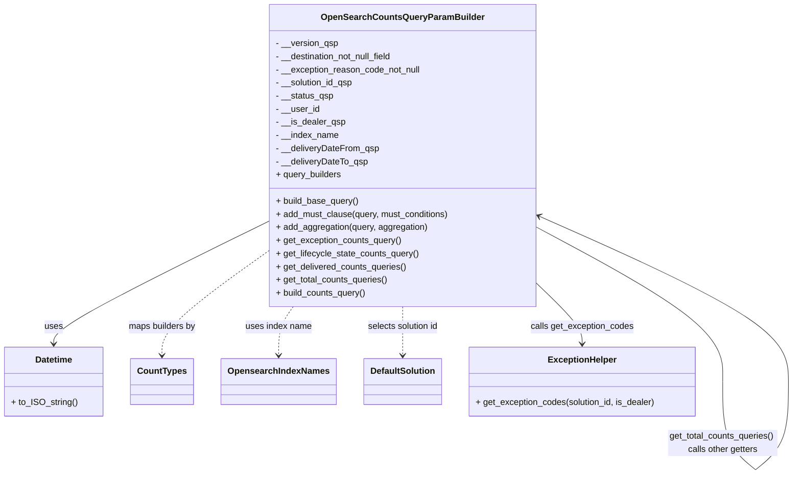

# Diagram: partview_core/partview_service/partview_service/core/business/open_search/OpenSearchCountsQueryParamBuilder.py

> Auto-generated by Obscura crawlers

## Mermaid

### SVG

<svg id="container" width="1426.1829833984375" xmlns="http://www.w3.org/2000/svg" class="classDiagram" height="866.1499633789062" viewBox="0 0 1426.1829833984375 866.1499633789062" role="graphics-document document" aria-roledescription="class"><g><defs><marker id="container_class-aggregationStart" class="marker aggregation class" refX="18" refY="7" markerWidth="190" markerHeight="240" orient="auto"><path d="M 18,7 L9,13 L1,7 L9,1 Z"></path></marker></defs><defs><marker id="container_class-aggregationEnd" class="marker aggregation class" refX="1" refY="7" markerWidth="20" markerHeight="28" orient="auto"><path d="M 18,7 L9,13 L1,7 L9,1 Z"></path></marker></defs><defs><marker id="container_class-extensionStart" class="marker extension class" refX="18" refY="7" markerWidth="190" markerHeight="240" orient="auto"><path d="M 1,7 L18,13 V 1 Z"></path></marker></defs><defs><marker id="container_class-extensionEnd" class="marker extension class" refX="1" refY="7" markerWidth="20" markerHeight="28" orient="auto"><path d="M 1,1 V 13 L18,7 Z"></path></marker></defs><defs><marker id="container_class-compositionStart" class="marker composition class" refX="18" refY="7" markerWidth="190" markerHeight="240" orient="auto"><path d="M 18,7 L9,13 L1,7 L9,1 Z"></path></marker></defs><defs><marker id="container_class-compositionEnd" class="marker composition class" refX="1" refY="7" markerWidth="20" markerHeight="28" orient="auto"><path d="M 18,7 L9,13 L1,7 L9,1 Z"></path></marker></defs><defs><marker id="container_class-dependencyStart" class="marker dependency class" refX="6" refY="7" markerWidth="190" markerHeight="240" orient="auto"><path d="M 5,7 L9,13 L1,7 L9,1 Z"></path></marker></defs><defs><marker id="container_class-dependencyEnd" class="marker dependency class" refX="13" refY="7" markerWidth="20" markerHeight="28" orient="auto"><path d="M 18,7 L9,13 L14,7 L9,1 Z"></path></marker></defs><defs><marker id="container_class-lollipopStart" class="marker lollipop class" refX="13" refY="7" markerWidth="190" markerHeight="240" orient="auto"><circle stroke="black" fill="transparent" cx="7" cy="7" r="6"></circle></marker></defs><defs><marker id="container_class-lollipopEnd" class="marker lollipop class" refX="1" refY="7" markerWidth="190" markerHeight="240" orient="auto"><circle stroke="black" fill="transparent" cx="7" cy="7" r="6"></circle></marker></defs><g class="root"><g class="clusters"></g><g class="edgePaths"><path d="M471.887,406.659L409.297,438.383C346.707,470.106,221.527,533.553,158.938,570.443C96.348,607.333,96.348,617.667,96.348,622.833L96.348,628" id="id_OpenSearchCountsQueryParamBuilder_Datetime_1" class="edge-thickness-normal edge-pattern-solid relation" style=";;;" data-edge="true" data-et="edge" data-id="id_OpenSearchCountsQueryParamBuilder_Datetime_1" data-points="W3sieCI6NDcxLjg4NjcxODc1LCJ5Ijo0MDYuNjU5MDMxODIzNDQzNDZ9LHsieCI6OTYuMzQ3NjU2MjUsInkiOjU5N30seyJ4Ijo5Ni4zNDc2NTYyNSwieSI6NjM0fV0=" marker-end="url(#container_class-dependencyEnd)"></path><path d="M471.887,462.396L441.454,484.83C411.021,507.264,350.155,552.132,319.722,583.233C289.289,614.333,289.289,631.667,289.289,640.333L289.289,649" id="id_OpenSearchCountsQueryParamBuilder_CountTypes_2" class="edge-thickness-normal edge-pattern-dashed relation" style=";;;" data-edge="true" data-et="edge" data-id="id_OpenSearchCountsQueryParamBuilder_CountTypes_2" data-points="W3sieCI6NDcxLjg4NjcxODc1LCJ5Ijo0NjIuMzk2MDA1NDQ2MjgyNH0seyJ4IjoyODkuMjg5MDYyNSwieSI6NTk3fSx7IngiOjI4OS4yODkwNjI1LCJ5Ijo2NTV9XQ==" marker-end="url(#container_class-dependencyEnd)"></path><path d="M520.097,560L515.767,566.167C511.437,572.333,502.777,584.667,498.447,599.5C494.117,614.333,494.117,631.667,494.117,640.333L494.117,649" id="id_OpenSearchCountsQueryParamBuilder_OpensearchIndexNames_3" class="edge-thickness-normal edge-pattern-dashed relation" style=";;;" data-edge="true" data-et="edge" data-id="id_OpenSearchCountsQueryParamBuilder_OpensearchIndexNames_3" data-points="W3sieCI6NTIwLjA5Njc5NTEyNzc5NTUsInkiOjU2MH0seyJ4Ijo0OTQuMTE3MTg3NSwieSI6NTk3fSx7IngiOjQ5NC4xMTcxODc1LCJ5Ijo2NTV9XQ==" marker-end="url(#container_class-dependencyEnd)"></path><path d="M713.891,560L713.891,566.167C713.891,572.333,713.891,584.667,713.891,599.5C713.891,614.333,713.891,631.667,713.891,640.333L713.891,649" id="id_OpenSearchCountsQueryParamBuilder_DefaultSolution_4" class="edge-thickness-normal edge-pattern-dashed relation" style=";;;" data-edge="true" data-et="edge" data-id="id_OpenSearchCountsQueryParamBuilder_DefaultSolution_4" data-points="W3sieCI6NzEzLjg5MDYyNSwieSI6NTYwfSx7IngiOjcxMy44OTA2MjUsInkiOjU5N30seyJ4Ijo3MTMuODkwNjI1LCJ5Ijo2NTV9XQ==" marker-end="url(#container_class-dependencyEnd)"></path><path d="M955.895,515.72L970.042,529.267C984.19,542.814,1012.486,569.907,1026.633,588.62C1040.781,607.333,1040.781,617.667,1040.781,622.833L1040.781,628" id="id_OpenSearchCountsQueryParamBuilder_ExceptionHelper_5" class="edge-thickness-normal edge-pattern-solid relation" style=";;;" data-edge="true" data-et="edge" data-id="id_OpenSearchCountsQueryParamBuilder_ExceptionHelper_5" data-points="W3sieCI6OTU1Ljg5NDUzMTI1LCJ5Ijo1MTUuNzIwMzg4NjA0NzUxMn0seyJ4IjoxMDQwLjc4MTI1LCJ5Ijo1OTd9LHsieCI6MTA0MC43ODEyNSwieSI6NjM0fV0=" marker-end="url(#container_class-dependencyEnd)"></path><path d="M955.895,413.639L1012.943,444.199C1069.991,474.76,1184.087,535.88,1241.135,583.098C1298.183,630.317,1298.183,663.633,1298.183,680.292L1298.183,696.95" id="OpenSearchCountsQueryParamBuilder-cyclic-special-1" class="edge-thickness-normal edge-pattern-solid relation" style=";;;" data-edge="true" data-et="edge" data-id="OpenSearchCountsQueryParamBuilder-cyclic-special-1" data-points="W3sieCI6OTU1Ljg5NDUzMTI1LCJ5Ijo0MTMuNjM5Mjg3MTE4MDYyNjd9LHsieCI6MTI5OC4xODI4MTI1MDA3NDUsInkiOjU5N30seyJ4IjoxMjk4LjE4MjgxMjUwMDc0NSwieSI6Njk2Ljk0OTk5OTk5OTI1NDl9XQ=="></path><path d="M1298.183,697.05L1298.183,715.708C1298.183,734.367,1298.183,771.683,1308.174,798.51C1318.166,825.336,1338.149,841.673,1348.141,849.841L1358.133,858.009" id="OpenSearchCountsQueryParamBuilder-cyclic-special-mid" class="edge-thickness-normal edge-pattern-solid relation" style=";;;" data-edge="true" data-et="edge" data-id="OpenSearchCountsQueryParamBuilder-cyclic-special-mid" data-points="W3sieCI6MTI5OC4xODI4MTI1MDA3NDUsInkiOjY5Ny4wNTAwMDAwMDA3NDUxfSx7IngiOjEyOTguMTgyODEyNTAwNzQ1LCJ5Ijo4MDl9LHsieCI6MTM1OC4xMzI4MTI1LCJ5Ijo4NTguMDA5MTI1MDAwMTM1M31d"></path><path d="M1358.233,858.009L1368.224,849.841C1378.216,841.673,1398.199,825.336,1408.191,798.502C1418.183,771.667,1418.183,734.333,1418.183,699C1418.183,663.667,1418.183,630.333,1342.049,579.831C1265.914,529.329,1113.646,461.658,1037.512,427.823L961.377,393.988" id="OpenSearchCountsQueryParamBuilder-cyclic-special-2" class="edge-thickness-normal edge-pattern-solid relation" style=";;;" data-edge="true" data-et="edge" data-id="OpenSearchCountsQueryParamBuilder-cyclic-special-2" data-points="W3sieCI6MTM1OC4yMzI4MTI1MDE0OTAxLCJ5Ijo4NTguMDA5MTI1MDAwMTM1M30seyJ4IjoxNDE4LjE4MjgxMjUwMDc0NSwieSI6ODA5fSx7IngiOjE0MTguMTgyODEyNTAwNzQ1LCJ5Ijo2OTd9LHsieCI6MTQxOC4xODI4MTI1MDA3NDUsInkiOjU5N30seyJ4Ijo5NTUuODk0NTMxMjUsInkiOjM5MS41NTA4NDg5MjQwMDU1NX1d" marker-end="url(#container_class-dependencyEnd)"></path></g><g class="edgeLabels"><g class="edgeLabel" transform="translate(96.34765625, 597)"><g class="label" data-id="id_OpenSearchCountsQueryParamBuilder_Datetime_1" transform="translate(-16.4921875, -12)"><foreignObject width="32.984375" height="24">

uses

</foreignObject></g></g><g class="edgeLabel" transform="translate(289.2890625, 597)"><g class="label" data-id="id_OpenSearchCountsQueryParamBuilder_CountTypes_2" transform="translate(-62.4140625, -12)"><foreignObject width="124.828125" height="24">

maps builders by

</foreignObject></g></g><g class="edgeLabel" transform="translate(494.1171875, 597)"><g class="label" data-id="id_OpenSearchCountsQueryParamBuilder_OpensearchIndexNames_3" transform="translate(-60.8828125, -12)"><foreignObject width="121.765625" height="24">

uses index name

</foreignObject></g></g><g class="edgeLabel" transform="translate(713.890625, 597)"><g class="label" data-id="id_OpenSearchCountsQueryParamBuilder_DefaultSolution_4" transform="translate(-66.40625, -12)"><foreignObject width="132.8125" height="24">

selects solution id

</foreignObject></g></g><g class="edgeLabel" transform="translate(1040.78125, 597)"><g class="label" data-id="id_OpenSearchCountsQueryParamBuilder_ExceptionHelper_5" transform="translate(-94.4375, -12)"><foreignObject width="188.875" height="24">

calls get_exception_codes

</foreignObject></g></g><g class="edgeLabel"><g class="label" data-id="OpenSearchCountsQueryParamBuilder-cyclic-special-1" transform="translate(0, 0)"><foreignObject width="0" height="0">

</foreignObject></g></g><g class="edgeLabel" transform="translate(1298.182812500745, 809)"><g class="label" data-id="OpenSearchCountsQueryParamBuilder-cyclic-special-mid" transform="translate(-100, -24)"><foreignObject width="200" height="48">

get_total_counts_queries() calls other getters

</foreignObject></g></g><g class="edgeLabel"><g class="label" data-id="OpenSearchCountsQueryParamBuilder-cyclic-special-2" transform="translate(0, 0)"><foreignObject width="0" height="0">

</foreignObject></g></g></g><g class="nodes"><g class="node default" id="classId-OpenSearchCountsQueryParamBuilder-0" transform="translate(713.890625, 284)"><g class="basic label-container"><path d="M-242.00390625 -276 L242.00390625 -276 L242.00390625 276 L-242.00390625 276" stroke="none" stroke-width="0" fill="#ECECFF" style=""></path><path d="M-242.00390625 -276 C-60.99229600346624 -276, 120.01931424306753 -276, 242.00390625 -276 M-242.00390625 -276 C-114.88396377156242 -276, 12.235978706875159 -276, 242.00390625 -276 M242.00390625 -276 C242.00390625 -151.5316909505264, 242.00390625 -27.06338190105285, 242.00390625 276 M242.00390625 -276 C242.00390625 -69.91318515125076, 242.00390625 136.17362969749848, 242.00390625 276 M242.00390625 276 C125.87420540336612 276, 9.744504556732238 276, -242.00390625 276 M242.00390625 276 C64.58662064510972 276, -112.83066495978056 276, -242.00390625 276 M-242.00390625 276 C-242.00390625 66.65237875728909, -242.00390625 -142.69524248542183, -242.00390625 -276 M-242.00390625 276 C-242.00390625 70.53351015253367, -242.00390625 -134.93297969493267, -242.00390625 -276" stroke="#9370DB" stroke-width="1.3" fill="none" stroke-dasharray="0 0" style=""></path></g><g class="annotation-group text" transform="translate(0, -252)"></g><g class="label-group text" transform="translate(-140.5390625, -252)"><g class="label" style="font-weight: bolder" transform="translate(0,-12)"><foreignObject width="281.078125" height="24">

OpenSearchCountsQueryParamBuilder

</foreignObject></g></g><g class="members-group text" transform="translate(-230.00390625, -204)"><g class="label" style="" transform="translate(0,-12)"><foreignObject width="114.40625" height="24">

- __version_qsp

</foreignObject></g><g class="label" style="" transform="translate(0,12)"><foreignObject width="219.28125" height="24">

- __destination_not_null_field

</foreignObject></g><g class="label" style="" transform="translate(0,36)"><foreignObject width="266.765625" height="24">

- __exception_reason_code_not_null

</foreignObject></g><g class="label" style="" transform="translate(0,60)"><foreignObject width="143.9375" height="24">

- __solution_id_qsp

</foreignObject></g><g class="label" style="" transform="translate(0,84)"><foreignObject width="105.796875" height="24">

- __status_qsp

</foreignObject></g><g class="label" style="" transform="translate(0,108)"><foreignObject width="79.65625" height="24">

- __user_id

</foreignObject></g><g class="label" style="" transform="translate(0,132)"><foreignObject width="126.28125" height="24">

- __is_dealer_qsp

</foreignObject></g><g class="label" style="" transform="translate(0,156)"><foreignObject width="115.796875" height="24">

- __index_name

</foreignObject></g><g class="label" style="" transform="translate(0,180)"><foreignObject width="188.609375" height="24">

- __deliveryDateFrom_qsp

</foreignObject></g><g class="label" style="" transform="translate(0,204)"><foreignObject width="168.984375" height="24">

- __deliveryDateTo_qsp

</foreignObject></g><g class="label" style="" transform="translate(0,228)"><foreignObject width="121.359375" height="24">

+ query_builders

</foreignObject></g></g><g class="methods-group text" transform="translate(-230.00390625, 84)"><g class="label" style="" transform="translate(0,-12)"><foreignObject width="151.828125" height="24">

+ build_base_query()

</foreignObject></g><g class="label" style="" transform="translate(0,12)"><foreignObject width="319.46875" height="24">

+ add_must_clause(query, must_conditions)

</foreignObject></g><g class="label" style="" transform="translate(0,36)"><foreignObject width="278.1875" height="24">

+ add_aggregation(query, aggregation)

</foreignObject></g><g class="label" style="" transform="translate(0,60)"><foreignObject width="229.84375" height="24">

+ get_exception_counts_query()

</foreignObject></g><g class="label" style="" transform="translate(0,84)"><foreignObject width="262.578125" height="24">

+ get_lifecycle_state_counts_query()

</foreignObject></g><g class="label" style="" transform="translate(0,108)"><foreignObject width="239.921875" height="24">

+ get_delivered_counts_queries()

</foreignObject></g><g class="label" style="" transform="translate(0,132)"><foreignObject width="205.703125" height="24">

+ get_total_counts_queries()

</foreignObject></g><g class="label" style="" transform="translate(0,156)"><foreignObject width="166.046875" height="24">

+ build_counts_query()

</foreignObject></g></g><g class="divider" style=""><path d="M-242.00390625 -228 C-82.28137091350948 -228, 77.44116442298105 -228, 242.00390625 -228 M-242.00390625 -228 C-134.76422642660788 -228, -27.524546603215782 -228, 242.00390625 -228" stroke="#9370DB" stroke-width="1.3" fill="none" stroke-dasharray="0 0" style=""></path></g><g class="divider" style=""><path d="M-242.00390625 60 C-59.581881425134696 60, 122.84014339973061 60, 242.00390625 60 M-242.00390625 60 C-132.85799598845264 60, -23.712085726905286 60, 242.00390625 60" stroke="#9370DB" stroke-width="1.3" fill="none" stroke-dasharray="0 0" style=""></path></g></g><g class="node default" id="classId-Datetime-1" transform="translate(96.34765625, 697)"><g class="basic label-container"><path d="M-88.34765625 -63 L88.34765625 -63 L88.34765625 63 L-88.34765625 63" stroke="none" stroke-width="0" fill="#ECECFF" style=""></path><path d="M-88.34765625 -63 C-41.76136120355888 -63, 4.8249338428822455 -63, 88.34765625 -63 M-88.34765625 -63 C-18.884787730392247 -63, 50.578080789215505 -63, 88.34765625 -63 M88.34765625 -63 C88.34765625 -22.096715244029824, 88.34765625 18.806569511940353, 88.34765625 63 M88.34765625 -63 C88.34765625 -35.724986340113475, 88.34765625 -8.449972680226942, 88.34765625 63 M88.34765625 63 C36.64425974516015 63, -15.059136759679703 63, -88.34765625 63 M88.34765625 63 C46.52157141829821 63, 4.695486586596417 63, -88.34765625 63 M-88.34765625 63 C-88.34765625 13.1753572374881, -88.34765625 -36.6492855250238, -88.34765625 -63 M-88.34765625 63 C-88.34765625 27.42061104101974, -88.34765625 -8.15877791796052, -88.34765625 -63" stroke="#9370DB" stroke-width="1.3" fill="none" stroke-dasharray="0 0" style=""></path></g><g class="annotation-group text" transform="translate(0, -39)"></g><g class="label-group text" transform="translate(-33.3984375, -39)"><g class="label" style="font-weight: bolder" transform="translate(0,-12)"><foreignObject width="66.796875" height="24">

Datetime

</foreignObject></g></g><g class="members-group text" transform="translate(-76.34765625, 9)"></g><g class="methods-group text" transform="translate(-76.34765625, 39)"><g class="label" style="" transform="translate(0,-12)"><foreignObject width="119.296875" height="24">

+ to_ISO_string()

</foreignObject></g></g><g class="divider" style=""><path d="M-88.34765625 -15 C-20.60775001927152 -15, 47.13215621145696 -15, 88.34765625 -15 M-88.34765625 -15 C-32.89542812045595 -15, 22.556800009088093 -15, 88.34765625 -15" stroke="#9370DB" stroke-width="1.3" fill="none" stroke-dasharray="0 0" style=""></path></g><g class="divider" style=""><path d="M-88.34765625 9 C-28.834842518741375 9, 30.67797121251725 9, 88.34765625 9 M-88.34765625 9 C-35.45456579803779 9, 17.438524653924418 9, 88.34765625 9" stroke="#9370DB" stroke-width="1.3" fill="none" stroke-dasharray="0 0" style=""></path></g></g><g class="node default" id="classId-CountTypes-2" transform="translate(289.2890625, 697)"><g class="basic label-container"><path d="M-54.59375 -42 L54.59375 -42 L54.59375 42 L-54.59375 42" stroke="none" stroke-width="0" fill="#ECECFF" style=""></path><path d="M-54.59375 -42 C-27.849816302918438 -42, -1.1058826058368751 -42, 54.59375 -42 M-54.59375 -42 C-16.563206391931033 -42, 21.467337216137935 -42, 54.59375 -42 M54.59375 -42 C54.59375 -18.84546220363857, 54.59375 4.309075592722863, 54.59375 42 M54.59375 -42 C54.59375 -18.33672036595912, 54.59375 5.326559268081759, 54.59375 42 M54.59375 42 C21.624405424593512 42, -11.344939150812976 42, -54.59375 42 M54.59375 42 C12.572544475369355 42, -29.44866104926129 42, -54.59375 42 M-54.59375 42 C-54.59375 13.955312384582893, -54.59375 -14.089375230834214, -54.59375 -42 M-54.59375 42 C-54.59375 22.827555092646012, -54.59375 3.655110185292024, -54.59375 -42" stroke="#9370DB" stroke-width="1.3" fill="none" stroke-dasharray="0 0" style=""></path></g><g class="annotation-group text" transform="translate(0, -18)"></g><g class="label-group text" transform="translate(-42.59375, -18)"><g class="label" style="font-weight: bolder" transform="translate(0,-12)"><foreignObject width="85.1875" height="24">

CountTypes

</foreignObject></g></g><g class="members-group text" transform="translate(-42.59375, 30)"></g><g class="methods-group text" transform="translate(-42.59375, 60)"></g><g class="divider" style=""><path d="M-54.59375 6 C-15.68411867703994 6, 23.22551264592012 6, 54.59375 6 M-54.59375 6 C-12.600377205337026 6, 29.39299558932595 6, 54.59375 6" stroke="#9370DB" stroke-width="1.3" fill="none" stroke-dasharray="0 0" style=""></path></g><g class="divider" style=""><path d="M-54.59375 24 C-22.503994472397963 24, 9.585761055204074 24, 54.59375 24 M-54.59375 24 C-23.11467756895509 24, 8.364394862089817 24, 54.59375 24" stroke="#9370DB" stroke-width="1.3" fill="none" stroke-dasharray="0 0" style=""></path></g></g><g class="node default" id="classId-OpensearchIndexNames-3" transform="translate(494.1171875, 697)"><g class="basic label-container"><path d="M-100.234375 -42 L100.234375 -42 L100.234375 42 L-100.234375 42" stroke="none" stroke-width="0" fill="#ECECFF" style=""></path><path d="M-100.234375 -42 C-44.88794759178466 -42, 10.458479816430682 -42, 100.234375 -42 M-100.234375 -42 C-38.31324366261424 -42, 23.60788767477152 -42, 100.234375 -42 M100.234375 -42 C100.234375 -15.951509598844112, 100.234375 10.096980802311776, 100.234375 42 M100.234375 -42 C100.234375 -23.192294655740117, 100.234375 -4.384589311480234, 100.234375 42 M100.234375 42 C35.94132273833054 42, -28.351729523338918 42, -100.234375 42 M100.234375 42 C23.884323151346806 42, -52.46572869730639 42, -100.234375 42 M-100.234375 42 C-100.234375 9.54514364281291, -100.234375 -22.90971271437418, -100.234375 -42 M-100.234375 42 C-100.234375 25.025679617626878, -100.234375 8.051359235253756, -100.234375 -42" stroke="#9370DB" stroke-width="1.3" fill="none" stroke-dasharray="0 0" style=""></path></g><g class="annotation-group text" transform="translate(0, -18)"></g><g class="label-group text" transform="translate(-88.234375, -18)"><g class="label" style="font-weight: bolder" transform="translate(0,-12)"><foreignObject width="176.46875" height="24">

OpensearchIndexNames

</foreignObject></g></g><g class="members-group text" transform="translate(-88.234375, 30)"></g><g class="methods-group text" transform="translate(-88.234375, 60)"></g><g class="divider" style=""><path d="M-100.234375 6 C-53.24969312133145 6, -6.265011242662894 6, 100.234375 6 M-100.234375 6 C-30.628451534257238 6, 38.977471931485525 6, 100.234375 6" stroke="#9370DB" stroke-width="1.3" fill="none" stroke-dasharray="0 0" style=""></path></g><g class="divider" style=""><path d="M-100.234375 24 C-41.82666349734976 24, 16.581048005300474 24, 100.234375 24 M-100.234375 24 C-42.98956336729078 24, 14.255248265418444 24, 100.234375 24" stroke="#9370DB" stroke-width="1.3" fill="none" stroke-dasharray="0 0" style=""></path></g></g><g class="node default" id="classId-DefaultSolution-4" transform="translate(713.890625, 697)"><g class="basic label-container"><path d="M-69.5390625 -42 L69.5390625 -42 L69.5390625 42 L-69.5390625 42" stroke="none" stroke-width="0" fill="#ECECFF" style=""></path><path d="M-69.5390625 -42 C-23.0715665978596 -42, 23.3959293042808 -42, 69.5390625 -42 M-69.5390625 -42 C-18.36877955638576 -42, 32.80150338722848 -42, 69.5390625 -42 M69.5390625 -42 C69.5390625 -10.261829419193518, 69.5390625 21.476341161612964, 69.5390625 42 M69.5390625 -42 C69.5390625 -18.099270130215466, 69.5390625 5.801459739569069, 69.5390625 42 M69.5390625 42 C16.189848219116257 42, -37.159366061767486 42, -69.5390625 42 M69.5390625 42 C29.37056088158348 42, -10.797940736833041 42, -69.5390625 42 M-69.5390625 42 C-69.5390625 20.32846900085937, -69.5390625 -1.3430619982812573, -69.5390625 -42 M-69.5390625 42 C-69.5390625 23.013104629175206, -69.5390625 4.026209258350413, -69.5390625 -42" stroke="#9370DB" stroke-width="1.3" fill="none" stroke-dasharray="0 0" style=""></path></g><g class="annotation-group text" transform="translate(0, -18)"></g><g class="label-group text" transform="translate(-57.5390625, -18)"><g class="label" style="font-weight: bolder" transform="translate(0,-12)"><foreignObject width="115.078125" height="24">

DefaultSolution

</foreignObject></g></g><g class="members-group text" transform="translate(-57.5390625, 30)"></g><g class="methods-group text" transform="translate(-57.5390625, 60)"></g><g class="divider" style=""><path d="M-69.5390625 6 C-23.79401948350374 6, 21.951023532992522 6, 69.5390625 6 M-69.5390625 6 C-36.570325145706164 6, -3.601587791412328 6, 69.5390625 6" stroke="#9370DB" stroke-width="1.3" fill="none" stroke-dasharray="0 0" style=""></path></g><g class="divider" style=""><path d="M-69.5390625 24 C-23.576649758613776 24, 22.385762982772448 24, 69.5390625 24 M-69.5390625 24 C-21.402905858068678 24, 26.733250783862644 24, 69.5390625 24" stroke="#9370DB" stroke-width="1.3" fill="none" stroke-dasharray="0 0" style=""></path></g></g><g class="node default" id="classId-ExceptionHelper-5" transform="translate(1040.78125, 697)"><g class="basic label-container"><path d="M-207.3515625 -63 L207.3515625 -63 L207.3515625 63 L-207.3515625 63" stroke="none" stroke-width="0" fill="#ECECFF" style=""></path><path d="M-207.3515625 -63 C-123.27825772254559 -63, -39.20495294509118 -63, 207.3515625 -63 M-207.3515625 -63 C-78.06986541070103 -63, 51.211831678597946 -63, 207.3515625 -63 M207.3515625 -63 C207.3515625 -27.170680441478964, 207.3515625 8.658639117042071, 207.3515625 63 M207.3515625 -63 C207.3515625 -30.35758226662343, 207.3515625 2.2848354667531368, 207.3515625 63 M207.3515625 63 C64.96804599821138 63, -77.41547050357724 63, -207.3515625 63 M207.3515625 63 C98.66276543973939 63, -10.026031620521223 63, -207.3515625 63 M-207.3515625 63 C-207.3515625 13.988272015341707, -207.3515625 -35.023455969316586, -207.3515625 -63 M-207.3515625 63 C-207.3515625 14.967417639094478, -207.3515625 -33.065164721811044, -207.3515625 -63" stroke="#9370DB" stroke-width="1.3" fill="none" stroke-dasharray="0 0" style=""></path></g><g class="annotation-group text" transform="translate(0, -39)"></g><g class="label-group text" transform="translate(-60.21875, -39)"><g class="label" style="font-weight: bolder" transform="translate(0,-12)"><foreignObject width="120.4375" height="24">

ExceptionHelper

</foreignObject></g></g><g class="members-group text" transform="translate(-195.3515625, 9)"></g><g class="methods-group text" transform="translate(-195.3515625, 39)"><g class="label" style="" transform="translate(0,-12)"><foreignObject width="330.484375" height="24">

+ get_exception_codes(solution_id, is_dealer)

</foreignObject></g></g><g class="divider" style=""><path d="M-207.3515625 -15 C-77.91774302283852 -15, 51.516076454322956 -15, 207.3515625 -15 M-207.3515625 -15 C-96.32847333611153 -15, 14.694615827776943 -15, 207.3515625 -15" stroke="#9370DB" stroke-width="1.3" fill="none" stroke-dasharray="0 0" style=""></path></g><g class="divider" style=""><path d="M-207.3515625 9 C-115.74615961009502 9, -24.14075672019004 9, 207.3515625 9 M-207.3515625 9 C-68.98274479801123 9, 69.38607290397755 9, 207.3515625 9" stroke="#9370DB" stroke-width="1.3" fill="none" stroke-dasharray="0 0" style=""></path></g></g><g class="label edgeLabel" id="OpenSearchCountsQueryParamBuilder---OpenSearchCountsQueryParamBuilder---1" transform="translate(1298.182812500745, 697)"><rect width="0.1" height="0.1"></rect><g class="label" style="" transform="translate(0, 0)"><rect></rect><foreignObject width="0" height="0">

</foreignObject></g></g><g class="label edgeLabel" id="OpenSearchCountsQueryParamBuilder---OpenSearchCountsQueryParamBuilder---2" transform="translate(1358.182812500745, 858.0500000007451)"><rect width="0.1" height="0.1"></rect><g class="label" style="" transform="translate(0, 0)"><rect></rect><foreignObject width="0" height="0">

</foreignObject></g></g></g></g></g></svg>
