# Diagram: partview_core/partview_service/partview_service/core/business/open_search/OpenSearchQueryParamBuilder.py

> Auto-generated by Obscura crawlers

## Mermaid

```mermaid
classDiagram
class OpenSearchQueryParamBuilder {
  -__everything_qsp
  -__page_number_qsp
  -__page_size_qsp
  -__destination_not_null_field
  -__version_qsp
  -__is_async_qsp
  -__has_async_key
  -__batch_type_qsp
  -__batch_list_qsp
  -__is_part_seller_qsp
  -__search_after_qsp
  -__solution_id_qsp
  -__status_qsp
  -__trackingNumber_contains_qsp
  -__partNumber_contains_qsp
  -__orderNumber_contains_qsp
  -__shipmentId_contains_qsp
  -__billOfLading_contains_qsp
  -__trailerEquipmentNumber_contains_qsp
  -__sort_column_qsp
  -__reverse_sort_qsp
  -__user_id
  -__originCode_qsp
  -__originCode_contains_qsp
  -__originCode_is_null_qsp
  -__originCode_is_not_null_qsp
  -__destinationCode_qsp
  -__destinationCode_contains_qsp
  -__destinationCode_is_null_qsp
  -__destinationCode_is_not_null_qsp
  -__carrier_qsp
  -__carrier_contains_qsp
  -__carrier_is_null_qsp
  -__carrier_is_not_null_qsp
  -__partNumber_qsp
  -__partNumber_is_null_qsp
  -__partNumber_is_not_null_qsp
  -__trailerEquipmentNumber_qsp
  -__trailerEquipmentNumber_is_null_qsp
  -__trailerEquipmentNumber_is_not_null_qsp
  -__lifecycleState_qsp
  -__lifecycleState_contains_qsp
  -__lifecycleState_is_null_qsp
  -__lifecycleState_is_not_null_qsp
  -__exception_qsp
  -__exception_contains_qsp
  -__exception_is_null_qsp
  -__exception_is_not_null_qsp
  -__orderPriority_qsp
  -__orderPriority_contains_qsp
  -__orderPriority_is_null_qsp
  -__orderPriority_is_not_null_qsp
  -__orderDateFrom_qsp
  -__orderDateTo_qsp
  -__deliveryDateFrom_qsp
  -__deliveryDateTo_qsp
  -__deliveryDateType_qsp
  -__last_milestone_code_qsp
  -__last_milestone_code_contains_qsp
  -__last_milestone_code_is_null_qsp
  -__last_milestone_code_is_not_null_qsp
  -__current_location_code_qsp
  -__current_location_code_contains_qsp
  -__current_location_code_is_null_qsp
  -__current_location_code_is_not_null_qsp
  -__final_mile_origin_location_code_qsp
  -__final_mile_origin_location_code_contains_qsp
  -__final_mile_origin_location_code_is_null_qsp
  -__final_mile_origin_location_code_is_not_null_qsp
  -default_sort_mapping
  +__init__(search_params)
  +get_generic_filter_query(values, contains, is_null, is_not_null, col_name, query_type="must")
  +get_fuzzy_clause(value, col_name)
  +build_search_clause(field_value, field_name, partial_match_max_len=25)
  +get_batch_search_clause()
  +wrap_nested(path, inner_clause)
  +get_search_clause(value, col_name)
  +get_search_by_tracking_number_clause()
  +get_search_by_part_number_clause()
  +get_search_by_order_number_clause()
  +get_search_by_shipment_id_clause()
  +get_search_by_bill_of_lading_clause()
  +get_search_by_trailer_equipment_number_clause()
  +get_solution_id_clause()
  +get_destination_not_null_clause()
  +get_status_clause()
  +solution_id_search_clause()
  +destination_not_null_clause()
  +status_search_clause()
  +get_search_clauses()
  +get_origin_code_filter_clause()
  +get_destination_code_filter_clause()
  +get_carrier_filter_clause()
  +get_part_number_clause()
  +get_trailer_equipment_number_clause()
  +get_lifecycle_state_clause()
  +get_exception_clause()
  +get_order_priority_clause()
  +get_order_date_clause()
  +get_delivery_date_clause()
  +get_last_milestone_code_filter_clause()
  +get_current_location_code_filter_clause()
  +get_final_mile_origin_location_code_filter_clause()
  +generate_where_clause()
  +get_sort_column()
  +get_order_direction()
  +get_order_by_clause()
  +generate_search_after_clause()
  +build_query_params()
}
```

### SVG

<svg id="container" width="833.9375" xmlns="http://www.w3.org/2000/svg" class="classDiagram" height="2728" viewBox="0 0 833.9375 2728" role="graphics-document document" aria-roledescription="class"><g><defs><marker id="container_class-aggregationStart" class="marker aggregation class" refX="18" refY="7" markerWidth="190" markerHeight="240" orient="auto"><path d="M 18,7 L9,13 L1,7 L9,1 Z"></path></marker></defs><defs><marker id="container_class-aggregationEnd" class="marker aggregation class" refX="1" refY="7" markerWidth="20" markerHeight="28" orient="auto"><path d="M 18,7 L9,13 L1,7 L9,1 Z"></path></marker></defs><defs><marker id="container_class-extensionStart" class="marker extension class" refX="18" refY="7" markerWidth="190" markerHeight="240" orient="auto"><path d="M 1,7 L18,13 V 1 Z"></path></marker></defs><defs><marker id="container_class-extensionEnd" class="marker extension class" refX="1" refY="7" markerWidth="20" markerHeight="28" orient="auto"><path d="M 1,1 V 13 L18,7 Z"></path></marker></defs><defs><marker id="container_class-compositionStart" class="marker composition class" refX="18" refY="7" markerWidth="190" markerHeight="240" orient="auto"><path d="M 18,7 L9,13 L1,7 L9,1 Z"></path></marker></defs><defs><marker id="container_class-compositionEnd" class="marker composition class" refX="1" refY="7" markerWidth="20" markerHeight="28" orient="auto"><path d="M 18,7 L9,13 L1,7 L9,1 Z"></path></marker></defs><defs><marker id="container_class-dependencyStart" class="marker dependency class" refX="6" refY="7" markerWidth="190" markerHeight="240" orient="auto"><path d="M 5,7 L9,13 L1,7 L9,1 Z"></path></marker></defs><defs><marker id="container_class-dependencyEnd" class="marker dependency class" refX="13" refY="7" markerWidth="20" markerHeight="28" orient="auto"><path d="M 18,7 L9,13 L14,7 L9,1 Z"></path></marker></defs><defs><marker id="container_class-lollipopStart" class="marker lollipop class" refX="13" refY="7" markerWidth="190" markerHeight="240" orient="auto"><circle stroke="black" fill="transparent" cx="7" cy="7" r="6"></circle></marker></defs><defs><marker id="container_class-lollipopEnd" class="marker lollipop class" refX="1" refY="7" markerWidth="190" markerHeight="240" orient="auto"><circle stroke="black" fill="transparent" cx="7" cy="7" r="6"></circle></marker></defs><g class="root"><g class="clusters"></g><g class="edgePaths"></g><g class="edgeLabels"></g><g class="nodes"><g class="node default" id="classId-OpenSearchQueryParamBuilder-0" transform="translate(416.96875, 1364)"><g class="basic label-container"><path d="M-408.96875 -1356 L408.96875 -1356 L408.96875 1356 L-408.96875 1356" stroke="none" stroke-width="0" fill="#ECECFF" style=""></path><path d="M-408.96875 -1356 C-116.96027120771976 -1356, 175.0482075845605 -1356, 408.96875 -1356 M-408.96875 -1356 C-145.443949504797 -1356, 118.08085099040602 -1356, 408.96875 -1356 M408.96875 -1356 C408.96875 -517.5981929955216, 408.96875 320.80361400895686, 408.96875 1356 M408.96875 -1356 C408.96875 -379.31345876920443, 408.96875 597.3730824615911, 408.96875 1356 M408.96875 1356 C83.00442729090139 1356, -242.95989541819722 1356, -408.96875 1356 M408.96875 1356 C93.95564023213547 1356, -221.05746953572907 1356, -408.96875 1356 M-408.96875 1356 C-408.96875 506.07748276408586, -408.96875 -343.8450344718283, -408.96875 -1356 M-408.96875 1356 C-408.96875 557.0110205313719, -408.96875 -241.9779589372563, -408.96875 -1356" stroke="#9370DB" stroke-width="1.3" fill="none" stroke-dasharray="0 0" style=""></path></g><g class="annotation-group text" transform="translate(0, -1332)"></g><g class="label-group text" transform="translate(-115.28125, -1332)"><g class="label" style="font-weight: bolder" transform="translate(0,-12)"><foreignObject width="230.5625" height="24">

OpenSearchQueryParamBuilder

</foreignObject></g></g><g class="members-group text" transform="translate(-396.96875, -1284)"><g class="label" style="" transform="translate(0,-12)"><foreignObject width="132.53125" height="24">

-__everything_qsp

</foreignObject></g><g class="label" style="" transform="translate(0,12)"><foreignObject width="154.390625" height="24">

-__page_number_qsp

</foreignObject></g><g class="label" style="" transform="translate(0,36)"><foreignObject width="126.140625" height="24">

-__page_size_qsp

</foreignObject></g><g class="label" style="" transform="translate(0,60)"><foreignObject width="213.765625" height="24">

-__destination_not_null_field

</foreignObject></g><g class="label" style="" transform="translate(0,84)"><foreignObject width="108.890625" height="24">

-__version_qsp

</foreignObject></g><g class="label" style="" transform="translate(0,108)"><foreignObject width="116.5" height="24">

-__is_async_qsp

</foreignObject></g><g class="label" style="" transform="translate(0,132)"><foreignObject width="128.265625" height="24">

-__has_async_key

</foreignObject></g><g class="label" style="" transform="translate(0,156)"><foreignObject width="136.28125" height="24">

-__batch_type_qsp

</foreignObject></g><g class="label" style="" transform="translate(0,180)"><foreignObject width="127.421875" height="24">

-__batch_list_qsp

</foreignObject></g><g class="label" style="" transform="translate(0,204)"><foreignObject width="153.609375" height="24">

-__is_part_seller_qsp

</foreignObject></g><g class="label" style="" transform="translate(0,228)"><foreignObject width="144.875" height="24">

-__search_after_qsp

</foreignObject></g><g class="label" style="" transform="translate(0,252)"><foreignObject width="138.421875" height="24">

-__solution_id_qsp

</foreignObject></g><g class="label" style="" transform="translate(0,276)"><foreignObject width="100.28125" height="24">

-__status_qsp

</foreignObject></g><g class="label" style="" transform="translate(0,300)"><foreignObject width="240.546875" height="24">

-__trackingNumber_contains_qsp

</foreignObject></g><g class="label" style="" transform="translate(0,324)"><foreignObject width="212.734375" height="24">

-__partNumber_contains_qsp

</foreignObject></g><g class="label" style="" transform="translate(0,348)"><foreignObject width="221.90625" height="24">

-__orderNumber_contains_qsp

</foreignObject></g><g class="label" style="" transform="translate(0,372)"><foreignObject width="208.390625" height="24">

-__shipmentId_contains_qsp

</foreignObject></g><g class="label" style="" transform="translate(0,396)"><foreignObject width="213.828125" height="24">

-__billOfLading_contains_qsp

</foreignObject></g><g class="label" style="" transform="translate(0,420)"><foreignObject width="305.234375" height="24">

-__trailerEquipmentNumber_contains_qsp

</foreignObject></g><g class="label" style="" transform="translate(0,444)"><foreignObject width="146.734375" height="24">

-__sort_column_qsp

</foreignObject></g><g class="label" style="" transform="translate(0,468)"><foreignObject width="145.96875" height="24">

-__reverse_sort_qsp

</foreignObject></g><g class="label" style="" transform="translate(0,492)"><foreignObject width="74.140625" height="24">

-__user_id

</foreignObject></g><g class="label" style="" transform="translate(0,516)"><foreignObject width="134.078125" height="24">

-__originCode_qsp

</foreignObject></g><g class="label" style="" transform="translate(0,540)"><foreignObject width="203.53125" height="24">

-__originCode_contains_qsp

</foreignObject></g><g class="label" style="" transform="translate(0,564)"><foreignObject width="190.4375" height="24">

-__originCode_is_null_qsp

</foreignObject></g><g class="label" style="" transform="translate(0,588)"><foreignObject width="223.25" height="24">

-__originCode_is_not_null_qsp

</foreignObject></g><g class="label" style="" transform="translate(0,612)"><foreignObject width="174.96875" height="24">

-__destinationCode_qsp

</foreignObject></g><g class="label" style="" transform="translate(0,636)"><foreignObject width="244.421875" height="24">

-__destinationCode_contains_qsp

</foreignObject></g><g class="label" style="" transform="translate(0,660)"><foreignObject width="231.34375" height="24">

-__destinationCode_is_null_qsp

</foreignObject></g><g class="label" style="" transform="translate(0,684)"><foreignObject width="264.15625" height="24">

-__destinationCode_is_not_null_qsp

</foreignObject></g><g class="label" style="" transform="translate(0,708)"><foreignObject width="102.546875" height="24">

-__carrier_qsp

</foreignObject></g><g class="label" style="" transform="translate(0,732)"><foreignObject width="172.015625" height="24">

-__carrier_contains_qsp

</foreignObject></g><g class="label" style="" transform="translate(0,756)"><foreignObject width="158.921875" height="24">

-__carrier_is_null_qsp

</foreignObject></g><g class="label" style="" transform="translate(0,780)"><foreignObject width="191.734375" height="24">

-__carrier_is_not_null_qsp

</foreignObject></g><g class="label" style="" transform="translate(0,804)"><foreignObject width="143.265625" height="24">

-__partNumber_qsp

</foreignObject></g><g class="label" style="" transform="translate(0,828)"><foreignObject width="199.640625" height="24">

-__partNumber_is_null_qsp

</foreignObject></g><g class="label" style="" transform="translate(0,852)"><foreignObject width="232.453125" height="24">

-__partNumber_is_not_null_qsp

</foreignObject></g><g class="label" style="" transform="translate(0,876)"><foreignObject width="235.78125" height="24">

-__trailerEquipmentNumber_qsp

</foreignObject></g><g class="label" style="" transform="translate(0,900)"><foreignObject width="292.15625" height="24">

-__trailerEquipmentNumber_is_null_qsp

</foreignObject></g><g class="label" style="" transform="translate(0,924)"><foreignObject width="324.96875" height="24">

-__trailerEquipmentNumber_is_not_null_qsp

</foreignObject></g><g class="label" style="" transform="translate(0,948)"><foreignObject width="152.609375" height="24">

-__lifecycleState_qsp

</foreignObject></g><g class="label" style="" transform="translate(0,972)"><foreignObject width="222.078125" height="24">

-__lifecycleState_contains_qsp

</foreignObject></g><g class="label" style="" transform="translate(0,996)"><foreignObject width="208.984375" height="24">

-__lifecycleState_is_null_qsp

</foreignObject></g><g class="label" style="" transform="translate(0,1020)"><foreignObject width="241.796875" height="24">

-__lifecycleState_is_not_null_qsp

</foreignObject></g><g class="label" style="" transform="translate(0,1044)"><foreignObject width="126.625" height="24">

-__exception_qsp

</foreignObject></g><g class="label" style="" transform="translate(0,1068)"><foreignObject width="196.09375" height="24">

-__exception_contains_qsp

</foreignObject></g><g class="label" style="" transform="translate(0,1092)"><foreignObject width="183" height="24">

-__exception_is_null_qsp

</foreignObject></g><g class="label" style="" transform="translate(0,1116)"><foreignObject width="215.8125" height="24">

-__exception_is_not_null_qsp

</foreignObject></g><g class="label" style="" transform="translate(0,1140)"><foreignObject width="148.171875" height="24">

-__orderPriority_qsp

</foreignObject></g><g class="label" style="" transform="translate(0,1164)"><foreignObject width="217.625" height="24">

-__orderPriority_contains_qsp

</foreignObject></g><g class="label" style="" transform="translate(0,1188)"><foreignObject width="204.53125" height="24">

-__orderPriority_is_null_qsp

</foreignObject></g><g class="label" style="" transform="translate(0,1212)"><foreignObject width="237.359375" height="24">

-__orderPriority_is_not_null_qsp

</foreignObject></g><g class="label" style="" transform="translate(0,1236)"><foreignObject width="164.53125" height="24">

-__orderDateFrom_qsp

</foreignObject></g><g class="label" style="" transform="translate(0,1260)"><foreignObject width="144.90625" height="24">

-__orderDateTo_qsp

</foreignObject></g><g class="label" style="" transform="translate(0,1284)"><foreignObject width="183.09375" height="24">

-__deliveryDateFrom_qsp

</foreignObject></g><g class="label" style="" transform="translate(0,1308)"><foreignObject width="163.46875" height="24">

-__deliveryDateTo_qsp

</foreignObject></g><g class="label" style="" transform="translate(0,1332)"><foreignObject width="180.453125" height="24">

-__deliveryDateType_qsp

</foreignObject></g><g class="label" style="" transform="translate(0,1356)"><foreignObject width="205.078125" height="24">

-__last_milestone_code_qsp

</foreignObject></g><g class="label" style="" transform="translate(0,1380)"><foreignObject width="274.53125" height="24">

-__last_milestone_code_contains_qsp

</foreignObject></g><g class="label" style="" transform="translate(0,1404)"><foreignObject width="261.453125" height="24">

-__last_milestone_code_is_null_qsp

</foreignObject></g><g class="label" style="" transform="translate(0,1428)"><foreignObject width="294.265625" height="24">

-__last_milestone_code_is_not_null_qsp

</foreignObject></g><g class="label" style="" transform="translate(0,1452)"><foreignObject width="218.375" height="24">

-__current_location_code_qsp

</foreignObject></g><g class="label" style="" transform="translate(0,1476)"><foreignObject width="287.828125" height="24">

-__current_location_code_contains_qsp

</foreignObject></g><g class="label" style="" transform="translate(0,1500)"><foreignObject width="274.75" height="24">

-__current_location_code_is_null_qsp

</foreignObject></g><g class="label" style="" transform="translate(0,1524)"><foreignObject width="307.5625" height="24">

-__current_location_code_is_not_null_qsp

</foreignObject></g><g class="label" style="" transform="translate(0,1548)"><foreignObject width="287.4375" height="24">

-__final_mile_origin_location_code_qsp

</foreignObject></g><g class="label" style="" transform="translate(0,1572)"><foreignObject width="356.890625" height="24">

-__final_mile_origin_location_code_contains_qsp

</foreignObject></g><g class="label" style="" transform="translate(0,1596)"><foreignObject width="343.796875" height="24">

-__final_mile_origin_location_code_is_null_qsp

</foreignObject></g><g class="label" style="" transform="translate(0,1620)"><foreignObject width="376.609375" height="24">

-__final_mile_origin_location_code_is_not_null_qsp

</foreignObject></g><g class="label" style="" transform="translate(0,1644)"><foreignObject width="167.265625" height="24">

-default_sort_mapping

</foreignObject></g></g><g class="methods-group text" transform="translate(-396.96875, 420)"><g class="label" style="" transform="translate(0,-12)"><foreignObject width="152.125" height="24">

+<strong>init</strong>(search_params)

</foreignObject></g><g class="label" style="" transform="translate(0,12)"><foreignObject width="678.65625" height="24">

+get_generic_filter_query(values, contains, is_null, is_not_null, col_name, query_type="must")

</foreignObject></g><g class="label" style="" transform="translate(0,36)"><foreignObject width="256.421875" height="24">

+get_fuzzy_clause(value, col_name)

</foreignObject></g><g class="label" style="" transform="translate(0,60)"><foreignObject width="536.03125" height="24">

+build_search_clause(field_value, field_name, partial_match_max_len=25)

</foreignObject></g><g class="label" style="" transform="translate(0,84)"><foreignObject width="200.09375" height="24">

+get_batch_search_clause()

</foreignObject></g><g class="label" style="" transform="translate(0,108)"><foreignObject width="243.671875" height="24">

+wrap_nested(path, inner_clause)

</foreignObject></g><g class="label" style="" transform="translate(0,132)"><foreignObject width="268.15625" height="24">

+get_search_clause(value, col_name)

</foreignObject></g><g class="label" style="" transform="translate(0,156)"><foreignObject width="306.359375" height="24">

+get_search_by_tracking_number_clause()

</foreignObject></g><g class="label" style="" transform="translate(0,180)"><foreignObject width="278.46875" height="24">

+get_search_by_part_number_clause()

</foreignObject></g><g class="label" style="" transform="translate(0,204)"><foreignObject width="286.375" height="24">

+get_search_by_order_number_clause()

</foreignObject></g><g class="label" style="" transform="translate(0,228)"><foreignObject width="275.484375" height="24">

+get_search_by_shipment_id_clause()

</foreignObject></g><g class="label" style="" transform="translate(0,252)"><foreignObject width="283.5625" height="24">

+get_search_by_bill_of_lading_clause()

</foreignObject></g><g class="label" style="" transform="translate(0,276)"><foreignObject width="378.1875" height="24">

+get_search_by_trailer_equipment_number_clause()

</foreignObject></g><g class="label" style="" transform="translate(0,300)"><foreignObject width="185.921875" height="24">

+get_solution_id_clause()

</foreignObject></g><g class="label" style="" transform="translate(0,324)"><foreignObject width="255.71875" height="24">

+get_destination_not_null_clause()

</foreignObject></g><g class="label" style="" transform="translate(0,348)"><foreignObject width="147.78125" height="24">

+get_status_clause()

</foreignObject></g><g class="label" style="" transform="translate(0,372)"><foreignObject width="210.828125" height="24">

+solution_id_search_clause()

</foreignObject></g><g class="label" style="" transform="translate(0,396)"><foreignObject width="225.15625" height="24">

+destination_not_null_clause()

</foreignObject></g><g class="label" style="" transform="translate(0,420)"><foreignObject width="172.6875" height="24">

+status_search_clause()

</foreignObject></g><g class="label" style="" transform="translate(0,444)"><foreignObject width="158.625" height="24">

+get_search_clauses()

</foreignObject></g><g class="label" style="" transform="translate(0,468)"><foreignObject width="229.296875" height="24">

+get_origin_code_filter_clause()

</foreignObject></g><g class="label" style="" transform="translate(0,492)"><foreignObject width="270.203125" height="24">

+get_destination_code_filter_clause()

</foreignObject></g><g class="label" style="" transform="translate(0,516)"><foreignObject width="191.09375" height="24">

+get_carrier_filter_clause()

</foreignObject></g><g class="label" style="" transform="translate(0,540)"><foreignObject width="197.546875" height="24">

+get_part_number_clause()

</foreignObject></g><g class="label" style="" transform="translate(0,564)"><foreignObject width="297.25" height="24">

+get_trailer_equipment_number_clause()

</foreignObject></g><g class="label" style="" transform="translate(0,588)"><foreignObject width="206.875" height="24">

+get_lifecycle_state_clause()

</foreignObject></g><g class="label" style="" transform="translate(0,612)"><foreignObject width="174.140625" height="24">

+get_exception_clause()

</foreignObject></g><g class="label" style="" transform="translate(0,636)"><foreignObject width="203.234375" height="24">

+get_order_priority_clause()

</foreignObject></g><g class="label" style="" transform="translate(0,660)"><foreignObject width="181.8125" height="24">

+get_order_date_clause()

</foreignObject></g><g class="label" style="" transform="translate(0,684)"><foreignObject width="201.171875" height="24">

+get_delivery_date_clause()

</foreignObject></g><g class="label" style="" transform="translate(0,708)"><foreignObject width="293.625" height="24">

+get_last_milestone_code_filter_clause()

</foreignObject></g><g class="label" style="" transform="translate(0,732)"><foreignObject width="306.921875" height="24">

+get_current_location_code_filter_clause()

</foreignObject></g><g class="label" style="" transform="translate(0,756)"><foreignObject width="375.96875" height="24">

+get_final_mile_origin_location_code_filter_clause()

</foreignObject></g><g class="label" style="" transform="translate(0,780)"><foreignObject width="187.625" height="24">

+generate_where_clause()

</foreignObject></g><g class="label" style="" transform="translate(0,804)"><foreignObject width="139.765625" height="24">

+get_sort_column()

</foreignObject></g><g class="label" style="" transform="translate(0,828)"><foreignObject width="160.296875" height="24">

+get_order_direction()

</foreignObject></g><g class="label" style="" transform="translate(0,852)"><foreignObject width="166.765625" height="24">

+get_order_by_clause()

</foreignObject></g><g class="label" style="" transform="translate(0,876)"><foreignObject width="232.953125" height="24">

+generate_search_after_clause()

</foreignObject></g><g class="label" style="" transform="translate(0,900)"><foreignObject width="166.90625" height="24">

+build_query_params()

</foreignObject></g></g><g class="divider" style=""><path d="M-408.96875 -1308 C-244.84920065293326 -1308, -80.72965130586653 -1308, 408.96875 -1308 M-408.96875 -1308 C-149.36072744161828 -1308, 110.24729511676344 -1308, 408.96875 -1308" stroke="#9370DB" stroke-width="1.3" fill="none" stroke-dasharray="0 0" style=""></path></g><g class="divider" style=""><path d="M-408.96875 396 C-108.16995460456229 396, 192.62884079087542 396, 408.96875 396 M-408.96875 396 C-210.11956895682013 396, -11.270387913640263 396, 408.96875 396" stroke="#9370DB" stroke-width="1.3" fill="none" stroke-dasharray="0 0" style=""></path></g></g></g></g></g></svg>
