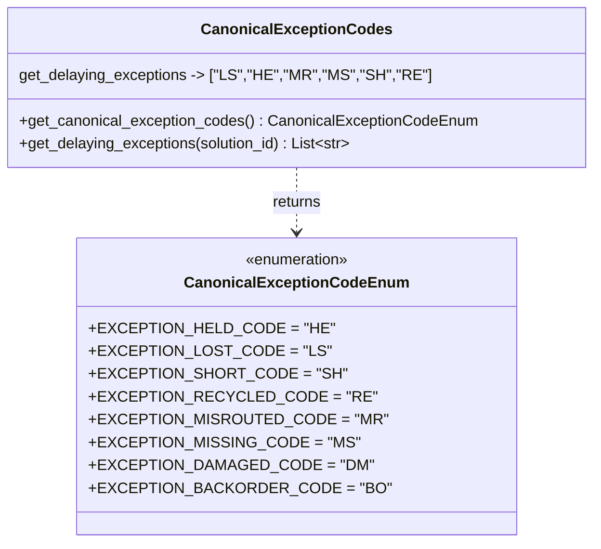

# Diagram: partview_core/partview_service/partview_service/core/business/package_container/CanonicalExceptionCodes.py

> Auto-generated by Obscura crawlers

## Mermaid

> SVG rendering failed for this diagram.
