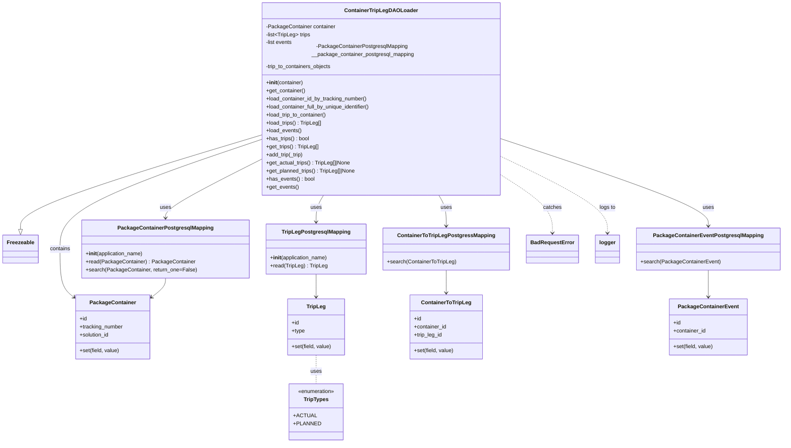

# Diagram: partview_core/partview_service/partview_service/core/business/package_container/ContainerTripLegDAOLoader.py

> Auto-generated by Obscura crawlers

## Mermaid

### SVG

<svg id="container" width="2282.5703125" xmlns="http://www.w3.org/2000/svg" class="classDiagram" height="1300" viewBox="0 0 2282.5703125 1300" role="graphics-document document" aria-roledescription="class"><g><defs><marker id="container_class-aggregationStart" class="marker aggregation class" refX="18" refY="7" markerWidth="190" markerHeight="240" orient="auto"><path d="M 18,7 L9,13 L1,7 L9,1 Z"></path></marker></defs><defs><marker id="container_class-aggregationEnd" class="marker aggregation class" refX="1" refY="7" markerWidth="20" markerHeight="28" orient="auto"><path d="M 18,7 L9,13 L1,7 L9,1 Z"></path></marker></defs><defs><marker id="container_class-extensionStart" class="marker extension class" refX="18" refY="7" markerWidth="190" markerHeight="240" orient="auto"><path d="M 1,7 L18,13 V 1 Z"></path></marker></defs><defs><marker id="container_class-extensionEnd" class="marker extension class" refX="1" refY="7" markerWidth="20" markerHeight="28" orient="auto"><path d="M 1,1 V 13 L18,7 Z"></path></marker></defs><defs><marker id="container_class-compositionStart" class="marker composition class" refX="18" refY="7" markerWidth="190" markerHeight="240" orient="auto"><path d="M 18,7 L9,13 L1,7 L9,1 Z"></path></marker></defs><defs><marker id="container_class-compositionEnd" class="marker composition class" refX="1" refY="7" markerWidth="20" markerHeight="28" orient="auto"><path d="M 18,7 L9,13 L1,7 L9,1 Z"></path></marker></defs><defs><marker id="container_class-dependencyStart" class="marker dependency class" refX="6" refY="7" markerWidth="190" markerHeight="240" orient="auto"><path d="M 5,7 L9,13 L1,7 L9,1 Z"></path></marker></defs><defs><marker id="container_class-dependencyEnd" class="marker dependency class" refX="13" refY="7" markerWidth="20" markerHeight="28" orient="auto"><path d="M 18,7 L9,13 L14,7 L9,1 Z"></path></marker></defs><defs><marker id="container_class-lollipopStart" class="marker lollipop class" refX="13" refY="7" markerWidth="190" markerHeight="240" orient="auto"><circle stroke="black" fill="transparent" cx="7" cy="7" r="6"></circle></marker></defs><defs><marker id="container_class-lollipopEnd" class="marker lollipop class" refX="1" refY="7" markerWidth="190" markerHeight="240" orient="auto"><circle stroke="black" fill="transparent" cx="7" cy="7" r="6"></circle></marker></defs><g class="root"><g class="clusters"></g><g class="edgePaths"><path d="M760.309,389.423L643.456,424.019C526.604,458.615,292.9,527.808,176.048,573.196C59.195,618.583,59.195,640.167,59.195,650.958L59.195,661.75" id="id_ContainerTripLegDAOLoader_Freezeable_1" class="edge-thickness-normal edge-pattern-solid relation" style=";;;" data-edge="true" data-et="edge" data-id="id_ContainerTripLegDAOLoader_Freezeable_1" data-points="W3sieCI6NzYwLjMwODU5Mzc1LCJ5IjozODkuNDIzMTU0NjU4NzU0Nn0seyJ4Ijo1OS4xOTUzMTI1LCJ5Ijo1OTd9LHsieCI6NTkuMTk1MzEyNSwieSI6Njc5fV0=" marker-end="url(#container_class-extensionEnd)"></path><path d="M760.309,402.553L662.971,434.961C565.633,467.369,370.957,532.184,273.619,585.259C176.281,638.333,176.281,679.667,176.281,719C176.281,758.333,176.281,795.667,182.838,819.472C189.395,843.277,202.509,853.553,209.066,858.691L215.623,863.83" id="id_ContainerTripLegDAOLoader_PackageContainer_2" class="edge-thickness-normal edge-pattern-solid relation" style=";;;" data-edge="true" data-et="edge" data-id="id_ContainerTripLegDAOLoader_PackageContainer_2" data-points="W3sieCI6NzYwLjMwODU5Mzc1LCJ5Ijo0MDIuNTUzMTM3NzM4MDM2MzZ9LHsieCI6MTc2LjI4MTI1LCJ5Ijo1OTd9LHsieCI6MTc2LjI4MTI1LCJ5Ijo3MjF9LHsieCI6MTc2LjI4MTI1LCJ5Ijo4MzN9LHsieCI6MjIwLjM0NTcwMzEyNSwieSI6ODY3LjUzMDU0MTI1NTA0Mzh9XQ==" marker-end="url(#container_class-dependencyEnd)"></path><path d="M760.309,460.547L714.44,483.29C668.572,506.032,576.835,551.516,530.966,579.425C485.098,607.333,485.098,617.667,485.098,622.833L485.098,628" id="id_ContainerTripLegDAOLoader_PackageContainerPostgresqlMapping_3" class="edge-thickness-normal edge-pattern-solid relation" style=";;;" data-edge="true" data-et="edge" data-id="id_ContainerTripLegDAOLoader_PackageContainerPostgresqlMapping_3" data-points="W3sieCI6NzYwLjMwODU5Mzc1LCJ5Ijo0NjAuNTQ3NDE2NjIwMjU4N30seyJ4Ijo0ODUuMDk3NjU2MjUsInkiOjU5N30seyJ4Ijo0ODUuMDk3NjU2MjUsInkiOjYzNH1d" marker-end="url(#container_class-dependencyEnd)"></path><path d="M1284.605,560L1288.364,566.167C1292.122,572.333,1299.639,584.667,1303.398,600C1307.156,615.333,1307.156,633.667,1307.156,642.833L1307.156,652" id="id_ContainerTripLegDAOLoader_ContainerToTripLegPostgressMapping_4" class="edge-thickness-normal edge-pattern-solid relation" style=";;;" data-edge="true" data-et="edge" data-id="id_ContainerTripLegDAOLoader_ContainerToTripLegPostgressMapping_4" data-points="W3sieCI6MTI4NC42MDUyMTkxNDkzNjExLCJ5Ijo1NjB9LHsieCI6MTMwNy4xNTYyNSwieSI6NTk3fSx7IngiOjEzMDcuMTU2MjUsInkiOjY1OH1d" marker-end="url(#container_class-dependencyEnd)"></path><path d="M948.168,560L944.41,566.167C940.651,572.333,933.134,584.667,929.376,598C925.617,611.333,925.617,625.667,925.617,632.833L925.617,640" id="id_ContainerTripLegDAOLoader_TripLegPostgresqlMapping_5" class="edge-thickness-normal edge-pattern-solid relation" style=";;;" data-edge="true" data-et="edge" data-id="id_ContainerTripLegDAOLoader_TripLegPostgresqlMapping_5" data-points="W3sieCI6OTQ4LjE2ODIxODM1MDYzOSwieSI6NTYwfSx7IngiOjkyNS42MTcxODc1LCJ5Ijo1OTd9LHsieCI6OTI1LjYxNzE4NzUsInkiOjY0Nn1d" marker-end="url(#container_class-dependencyEnd)"></path><path d="M1472.465,401.195L1571.619,433.829C1670.773,466.463,1869.082,531.732,1968.236,573.532C2067.391,615.333,2067.391,633.667,2067.391,642.833L2067.391,652" id="id_ContainerTripLegDAOLoader_PackageContainerEventPostgresqlMapping_6" class="edge-thickness-normal edge-pattern-solid relation" style=";;;" data-edge="true" data-et="edge" data-id="id_ContainerTripLegDAOLoader_PackageContainerEventPostgresqlMapping_6" data-points="W3sieCI6MTQ3Mi40NjQ4NDM3NSwieSI6NDAxLjE5NDUyNzE2NDk2MTM2fSx7IngiOjIwNjcuMzkwNjI1LCJ5Ijo1OTd9LHsieCI6MjA2Ny4zOTA2MjUsInkiOjY1OH1d" marker-end="url(#container_class-dependencyEnd)"></path><path d="M1472.465,507.353L1496.285,522.294C1520.104,537.236,1567.743,567.118,1591.563,594.726C1615.383,622.333,1615.383,647.667,1615.383,660.333L1615.383,673" id="id_ContainerTripLegDAOLoader_BadRequestError_7" class="edge-thickness-normal edge-pattern-dashed relation" style=";;;" data-edge="true" data-et="edge" data-id="id_ContainerTripLegDAOLoader_BadRequestError_7" data-points="W3sieCI6MTQ3Mi40NjQ4NDM3NSwieSI6NTA3LjM1MzM1NzkxMzkzNjZ9LHsieCI6MTYxNS4zODI4MTI1LCJ5Ijo1OTd9LHsieCI6MTYxNS4zODI4MTI1LCJ5Ijo2Nzl9XQ==" marker-end="url(#container_class-dependencyEnd)"></path><path d="M1472.465,453.239L1522.877,477.199C1573.289,501.159,1674.113,549.08,1724.525,585.706C1774.938,622.333,1774.938,647.667,1774.938,660.333L1774.938,673" id="id_ContainerTripLegDAOLoader_logger_8" class="edge-thickness-normal edge-pattern-dashed relation" style=";;;" data-edge="true" data-et="edge" data-id="id_ContainerTripLegDAOLoader_logger_8" data-points="W3sieCI6MTQ3Mi40NjQ4NDM3NSwieSI6NDUzLjIzODk2NTc2ODgyMjM3fSx7IngiOjE3NzQuOTM3NSwieSI6NTk3fSx7IngiOjE3NzQuOTM3NSwieSI6Njc5fV0=" marker-end="url(#container_class-dependencyEnd)"></path><path d="M485.098,808L485.098,812.167C485.098,816.333,485.098,824.667,478.541,833.972C471.984,843.277,458.87,853.553,452.313,858.691L445.756,863.83" id="id_PackageContainerPostgresqlMapping_PackageContainer_9" class="edge-thickness-normal edge-pattern-solid relation" style=";;;" data-edge="true" data-et="edge" data-id="id_PackageContainerPostgresqlMapping_PackageContainer_9" data-points="W3sieCI6NDg1LjA5NzY1NjI1LCJ5Ijo4MDh9LHsieCI6NDg1LjA5NzY1NjI1LCJ5Ijo4MzN9LHsieCI6NDQxLjAzMzIwMzEyNSwieSI6ODY3LjUzMDU0MTI1NTA0Mzh9XQ==" marker-end="url(#container_class-dependencyEnd)"></path><path d="M1307.156,784L1307.156,792.167C1307.156,800.333,1307.156,816.667,1307.156,828C1307.156,839.333,1307.156,845.667,1307.156,848.833L1307.156,852" id="id_ContainerToTripLegPostgressMapping_ContainerToTripLeg_10" class="edge-thickness-normal edge-pattern-solid relation" style=";;;" data-edge="true" data-et="edge" data-id="id_ContainerToTripLegPostgressMapping_ContainerToTripLeg_10" data-points="W3sieCI6MTMwNy4xNTYyNSwieSI6Nzg0fSx7IngiOjEzMDcuMTU2MjUsInkiOjgzM30seyJ4IjoxMzA3LjE1NjI1LCJ5Ijo4NTh9XQ==" marker-end="url(#container_class-dependencyEnd)"></path><path d="M925.617,796L925.617,802.167C925.617,808.333,925.617,820.667,925.617,832C925.617,843.333,925.617,853.667,925.617,858.833L925.617,864" id="id_TripLegPostgresqlMapping_TripLeg_11" class="edge-thickness-normal edge-pattern-solid relation" style=";;;" data-edge="true" data-et="edge" data-id="id_TripLegPostgresqlMapping_TripLeg_11" data-points="W3sieCI6OTI1LjYxNzE4NzUsInkiOjc5Nn0seyJ4Ijo5MjUuNjE3MTg3NSwieSI6ODMzfSx7IngiOjkyNS42MTcxODc1LCJ5Ijo4NzB9XQ==" marker-end="url(#container_class-dependencyEnd)"></path><path d="M2067.391,784L2067.391,792.167C2067.391,800.333,2067.391,816.667,2067.391,830C2067.391,843.333,2067.391,853.667,2067.391,858.833L2067.391,864" id="id_PackageContainerEventPostgresqlMapping_PackageContainerEvent_12" class="edge-thickness-normal edge-pattern-solid relation" style=";;;" data-edge="true" data-et="edge" data-id="id_PackageContainerEventPostgresqlMapping_PackageContainerEvent_12" data-points="W3sieCI6MjA2Ny4zOTA2MjUsInkiOjc4NH0seyJ4IjoyMDY3LjM5MDYyNSwieSI6ODMzfSx7IngiOjIwNjcuMzkwNjI1LCJ5Ijo4NzB9XQ==" marker-end="url(#container_class-dependencyEnd)"></path><path d="M925.617,1038L925.617,1046.167C925.617,1054.333,925.617,1070.667,925.617,1085C925.617,1099.333,925.617,1111.667,925.617,1117.833L925.617,1124" id="id_TripLeg_TripTypes_13" class="edge-thickness-normal edge-pattern-dashed relation" style=";;;" data-edge="true" data-et="edge" data-id="id_TripLeg_TripTypes_13" data-points="W3sieCI6OTI1LjYxNzE4NzUsInkiOjEwMzh9LHsieCI6OTI1LjYxNzE4NzUsInkiOjEwODd9LHsieCI6OTI1LjYxNzE4NzUsInkiOjExMjR9XQ=="></path></g><g class="edgeLabels"><g class="edgeLabel"><g class="label" data-id="id_ContainerTripLegDAOLoader_Freezeable_1" transform="translate(0, 0)"><foreignObject width="0" height="0">

</foreignObject></g></g><g class="edgeLabel" transform="translate(176.28125, 721)"><g class="label" data-id="id_ContainerTripLegDAOLoader_PackageContainer_2" transform="translate(-30.890625, -12)"><foreignObject width="61.78125" height="24">

contains

</foreignObject></g></g><g class="edgeLabel" transform="translate(485.09765625, 597)"><g class="label" data-id="id_ContainerTripLegDAOLoader_PackageContainerPostgresqlMapping_3" transform="translate(-16.4921875, -12)"><foreignObject width="32.984375" height="24">

uses

</foreignObject></g></g><g class="edgeLabel" transform="translate(1307.15625, 597)"><g class="label" data-id="id_ContainerTripLegDAOLoader_ContainerToTripLegPostgressMapping_4" transform="translate(-16.4921875, -12)"><foreignObject width="32.984375" height="24">

uses

</foreignObject></g></g><g class="edgeLabel" transform="translate(925.6171875, 597)"><g class="label" data-id="id_ContainerTripLegDAOLoader_TripLegPostgresqlMapping_5" transform="translate(-16.4921875, -12)"><foreignObject width="32.984375" height="24">

uses

</foreignObject></g></g><g class="edgeLabel" transform="translate(2067.390625, 597)"><g class="label" data-id="id_ContainerTripLegDAOLoader_PackageContainerEventPostgresqlMapping_6" transform="translate(-16.4921875, -12)"><foreignObject width="32.984375" height="24">

uses

</foreignObject></g></g><g class="edgeLabel" transform="translate(1615.3828125, 597)"><g class="label" data-id="id_ContainerTripLegDAOLoader_BadRequestError_7" transform="translate(-27.4765625, -12)"><foreignObject width="54.953125" height="24">

catches

</foreignObject></g></g><g class="edgeLabel" transform="translate(1774.9375, 597)"><g class="label" data-id="id_ContainerTripLegDAOLoader_logger_8" transform="translate(-24.3828125, -12)"><foreignObject width="48.765625" height="24">

logs to

</foreignObject></g></g><g class="edgeLabel"><g class="label" data-id="id_PackageContainerPostgresqlMapping_PackageContainer_9" transform="translate(0, 0)"><foreignObject width="0" height="0">

</foreignObject></g></g><g class="edgeLabel"><g class="label" data-id="id_ContainerToTripLegPostgressMapping_ContainerToTripLeg_10" transform="translate(0, 0)"><foreignObject width="0" height="0">

</foreignObject></g></g><g class="edgeLabel"><g class="label" data-id="id_TripLegPostgresqlMapping_TripLeg_11" transform="translate(0, 0)"><foreignObject width="0" height="0">

</foreignObject></g></g><g class="edgeLabel"><g class="label" data-id="id_PackageContainerEventPostgresqlMapping_PackageContainerEvent_12" transform="translate(0, 0)"><foreignObject width="0" height="0">

</foreignObject></g></g><g class="edgeLabel" transform="translate(925.6171875, 1087)"><g class="label" data-id="id_TripLeg_TripTypes_13" transform="translate(-16.4921875, -12)"><foreignObject width="32.984375" height="24">

uses

</foreignObject></g></g></g><g class="nodes"><g class="node default" id="classId-ContainerTripLegDAOLoader-0" transform="translate(1116.38671875, 284)"><g class="basic label-container"><path d="M-356.078125 -276 L356.078125 -276 L356.078125 276 L-356.078125 276" stroke="none" stroke-width="0" fill="#ECECFF" style=""></path><path d="M-356.078125 -276 C-133.38365915518935 -276, 89.3108066896213 -276, 356.078125 -276 M-356.078125 -276 C-122.13839986606939 -276, 111.80132526786122 -276, 356.078125 -276 M356.078125 -276 C356.078125 -63.867149511618976, 356.078125 148.26570097676205, 356.078125 276 M356.078125 -276 C356.078125 -164.73543962945237, 356.078125 -53.470879258904745, 356.078125 276 M356.078125 276 C136.01759216800212 276, -84.04294066399575 276, -356.078125 276 M356.078125 276 C117.24729509592666 276, -121.58353480814668 276, -356.078125 276 M-356.078125 276 C-356.078125 85.92904953279265, -356.078125 -104.1419009344147, -356.078125 -276 M-356.078125 276 C-356.078125 71.2544793410635, -356.078125 -133.491041317873, -356.078125 -276" stroke="#9370DB" stroke-width="1.3" fill="none" stroke-dasharray="0 0" style=""></path></g><g class="annotation-group text" transform="translate(0, -252)"></g><g class="label-group text" transform="translate(-103.25, -252)"><g class="label" style="font-weight: bolder" transform="translate(0,-12)"><foreignObject width="206.5" height="24">

ContainerTripLegDAOLoader

</foreignObject></g></g><g class="members-group text" transform="translate(-344.078125, -204)"><g class="label" style="" transform="translate(0,-12)"><foreignObject width="208.453125" height="24">

-PackageContainer container

</foreignObject></g><g class="label" style="" transform="translate(0,12)"><foreignObject width="135.171875" height="24">

-list&lt;TripLeg&gt; trips

</foreignObject></g><g class="label" style="" transform="translate(0,36)"><foreignObject width="80.953125" height="24">

-list events

</foreignObject></g><g class="label" style="" transform="translate(0,60)"><foreignObject width="584.90625" height="24">

-PackageContainerPostgresqlMapping __package_container_postgresql_mapping

</foreignObject></g><g class="label" style="" transform="translate(0,84)"><foreignObject width="199.640625" height="24">

-trip_to_containers_objects

</foreignObject></g></g><g class="methods-group text" transform="translate(-344.078125, -60)"><g class="label" style="" transform="translate(0,-12)"><foreignObject width="112" height="24">

+<strong>init</strong>(container)

</foreignObject></g><g class="label" style="" transform="translate(0,12)"><foreignObject width="118.125" height="24">

+get_container()

</foreignObject></g><g class="label" style="" transform="translate(0,36)"><foreignObject width="305.21875" height="24">

+load_container_id_by_tracking_number()

</foreignObject></g><g class="label" style="" transform="translate(0,60)"><foreignObject width="316.90625" height="24">

+load_container_full_by_unique_identifier()

</foreignObject></g><g class="label" style="" transform="translate(0,84)"><foreignObject width="183.828125" height="24">

+load_trip_to_container()

</foreignObject></g><g class="label" style="" transform="translate(0,108)"><foreignObject width="167.078125" height="24">

+load_trips() : TripLeg[]

</foreignObject></g><g class="label" style="" transform="translate(0,132)"><foreignObject width="106.234375" height="24">

+load_events()

</foreignObject></g><g class="label" style="" transform="translate(0,156)"><foreignObject width="130.078125" height="24">

+has_trips() : bool

</foreignObject></g><g class="label" style="" transform="translate(0,180)"><foreignObject width="157.578125" height="24">

+get_trips() : TripLeg[]

</foreignObject></g><g class="label" style="" transform="translate(0,204)"><foreignObject width="114.046875" height="24">

+add_trip(_trip)

</foreignObject></g><g class="label" style="" transform="translate(0,228)"><foreignObject width="255.0625" height="24">

+get_actual_trips() : TripLeg[]|None

</foreignObject></g><g class="label" style="" transform="translate(0,252)"><foreignObject width="270.5625" height="24">

+get_planned_trips() : TripLeg[]|None

</foreignObject></g><g class="label" style="" transform="translate(0,276)"><foreignObject width="144.4375" height="24">

+has_events() : bool

</foreignObject></g><g class="label" style="" transform="translate(0,300)"><foreignObject width="96.734375" height="24">

+get_events()

</foreignObject></g></g><g class="divider" style=""><path d="M-356.078125 -228 C-73.55449813589075 -228, 208.9691287282185 -228, 356.078125 -228 M-356.078125 -228 C-205.2531781117934 -228, -54.428231223586806 -228, 356.078125 -228" stroke="#9370DB" stroke-width="1.3" fill="none" stroke-dasharray="0 0" style=""></path></g><g class="divider" style=""><path d="M-356.078125 -84 C-162.58231408549645 -84, 30.9134968290071 -84, 356.078125 -84 M-356.078125 -84 C-154.82294071966894 -84, 46.43224356066213 -84, 356.078125 -84" stroke="#9370DB" stroke-width="1.3" fill="none" stroke-dasharray="0 0" style=""></path></g></g><g class="node default" id="classId-Freezeable-1" transform="translate(59.1953125, 721)"><g class="basic label-container"><path d="M-51.1953125 -42 L51.1953125 -42 L51.1953125 42 L-51.1953125 42" stroke="none" stroke-width="0" fill="#ECECFF" style=""></path><path d="M-51.1953125 -42 C-11.594065244579319 -42, 28.007182010841362 -42, 51.1953125 -42 M-51.1953125 -42 C-27.648352182949615 -42, -4.101391865899231 -42, 51.1953125 -42 M51.1953125 -42 C51.1953125 -24.900101469743742, 51.1953125 -7.800202939487484, 51.1953125 42 M51.1953125 -42 C51.1953125 -12.250080311437323, 51.1953125 17.499839377125355, 51.1953125 42 M51.1953125 42 C27.01371394160581 42, 2.8321153832116224 42, -51.1953125 42 M51.1953125 42 C19.018366909369128 42, -13.158578681261744 42, -51.1953125 42 M-51.1953125 42 C-51.1953125 22.7626695744522, -51.1953125 3.5253391489044006, -51.1953125 -42 M-51.1953125 42 C-51.1953125 12.120992970884451, -51.1953125 -17.758014058231097, -51.1953125 -42" stroke="#9370DB" stroke-width="1.3" fill="none" stroke-dasharray="0 0" style=""></path></g><g class="annotation-group text" transform="translate(0, -18)"></g><g class="label-group text" transform="translate(-39.1953125, -18)"><g class="label" style="font-weight: bolder" transform="translate(0,-12)"><foreignObject width="78.390625" height="24">

Freezeable

</foreignObject></g></g><g class="members-group text" transform="translate(-39.1953125, 30)"></g><g class="methods-group text" transform="translate(-39.1953125, 60)"></g><g class="divider" style=""><path d="M-51.1953125 6 C-19.597166030333327 6, 12.000980439333347 6, 51.1953125 6 M-51.1953125 6 C-17.573176763027305 6, 16.04895897394539 6, 51.1953125 6" stroke="#9370DB" stroke-width="1.3" fill="none" stroke-dasharray="0 0" style=""></path></g><g class="divider" style=""><path d="M-51.1953125 24 C-15.623833086016361 24, 19.947646327967277 24, 51.1953125 24 M-51.1953125 24 C-12.45529171542347 24, 26.28472906915306 24, 51.1953125 24" stroke="#9370DB" stroke-width="1.3" fill="none" stroke-dasharray="0 0" style=""></path></g></g><g class="node default" id="classId-PackageContainer-2" transform="translate(330.689453125, 954)"><g class="basic label-container"><path d="M-110.34375 -96 L110.34375 -96 L110.34375 96 L-110.34375 96" stroke="none" stroke-width="0" fill="#ECECFF" style=""></path><path d="M-110.34375 -96 C-49.961583905178514 -96, 10.420582189642971 -96, 110.34375 -96 M-110.34375 -96 C-56.83076333074367 -96, -3.3177766614873434 -96, 110.34375 -96 M110.34375 -96 C110.34375 -56.080000057324284, 110.34375 -16.160000114648568, 110.34375 96 M110.34375 -96 C110.34375 -53.52670177374792, 110.34375 -11.053403547495833, 110.34375 96 M110.34375 96 C66.11299491693202 96, 21.88223983386405 96, -110.34375 96 M110.34375 96 C44.49184490030568 96, -21.36006019938864 96, -110.34375 96 M-110.34375 96 C-110.34375 34.47858328827242, -110.34375 -27.042833423455164, -110.34375 -96 M-110.34375 96 C-110.34375 26.26950940328898, -110.34375 -43.46098119342204, -110.34375 -96" stroke="#9370DB" stroke-width="1.3" fill="none" stroke-dasharray="0 0" style=""></path></g><g class="annotation-group text" transform="translate(0, -72)"></g><g class="label-group text" transform="translate(-65.453125, -72)"><g class="label" style="font-weight: bolder" transform="translate(0,-12)"><foreignObject width="130.90625" height="24">

PackageContainer

</foreignObject></g></g><g class="members-group text" transform="translate(-98.34375, -24)"><g class="label" style="" transform="translate(0,-12)"><foreignObject width="22.078125" height="24">

+id

</foreignObject></g><g class="label" style="" transform="translate(0,12)"><foreignObject width="131.234375" height="24">

+tracking_number

</foreignObject></g><g class="label" style="" transform="translate(0,36)"><foreignObject width="90.21875" height="24">

+solution_id

</foreignObject></g></g><g class="methods-group text" transform="translate(-98.34375, 72)"><g class="label" style="" transform="translate(0,-12)"><foreignObject width="119.390625" height="24">

+set(field, value)

</foreignObject></g></g><g class="divider" style=""><path d="M-110.34375 -48 C-40.95156602880667 -48, 28.440617942386666 -48, 110.34375 -48 M-110.34375 -48 C-26.886334567655496 -48, 56.57108086468901 -48, 110.34375 -48" stroke="#9370DB" stroke-width="1.3" fill="none" stroke-dasharray="0 0" style=""></path></g><g class="divider" style=""><path d="M-110.34375 48 C-63.46620506929169 48, -16.58866013858338 48, 110.34375 48 M-110.34375 48 C-32.211782837158296 48, 45.92018432568341 48, 110.34375 48" stroke="#9370DB" stroke-width="1.3" fill="none" stroke-dasharray="0 0" style=""></path></g></g><g class="node default" id="classId-TripLeg-3" transform="translate(925.6171875, 954)"><g class="basic label-container"><path d="M-85.22265625 -84 L85.22265625 -84 L85.22265625 84 L-85.22265625 84" stroke="none" stroke-width="0" fill="#ECECFF" style=""></path><path d="M-85.22265625 -84 C-38.593959340122424 -84, 8.034737569755151 -84, 85.22265625 -84 M-85.22265625 -84 C-48.3547816550045 -84, -11.486907060009003 -84, 85.22265625 -84 M85.22265625 -84 C85.22265625 -48.45153282544975, 85.22265625 -12.903065650899507, 85.22265625 84 M85.22265625 -84 C85.22265625 -42.8247858200054, 85.22265625 -1.6495716400108051, 85.22265625 84 M85.22265625 84 C41.3156041456544 84, -2.591447958691205 84, -85.22265625 84 M85.22265625 84 C47.03254842496701 84, 8.842440599934022 84, -85.22265625 84 M-85.22265625 84 C-85.22265625 45.667722226893396, -85.22265625 7.335444453786792, -85.22265625 -84 M-85.22265625 84 C-85.22265625 48.200153745414134, -85.22265625 12.400307490828268, -85.22265625 -84" stroke="#9370DB" stroke-width="1.3" fill="none" stroke-dasharray="0 0" style=""></path></g><g class="annotation-group text" transform="translate(0, -60)"></g><g class="label-group text" transform="translate(-27.0546875, -60)"><g class="label" style="font-weight: bolder" transform="translate(0,-12)"><foreignObject width="54.109375" height="24">

TripLeg

</foreignObject></g></g><g class="members-group text" transform="translate(-73.22265625, -12)"><g class="label" style="" transform="translate(0,-12)"><foreignObject width="22.078125" height="24">

+id

</foreignObject></g><g class="label" style="" transform="translate(0,12)"><foreignObject width="39.703125" height="24">

+type

</foreignObject></g></g><g class="methods-group text" transform="translate(-73.22265625, 60)"><g class="label" style="" transform="translate(0,-12)"><foreignObject width="119.390625" height="24">

+set(field, value)

</foreignObject></g></g><g class="divider" style=""><path d="M-85.22265625 -36 C-18.959956458042313 -36, 47.30274333391537 -36, 85.22265625 -36 M-85.22265625 -36 C-20.53132465384043 -36, 44.16000694231914 -36, 85.22265625 -36" stroke="#9370DB" stroke-width="1.3" fill="none" stroke-dasharray="0 0" style=""></path></g><g class="divider" style=""><path d="M-85.22265625 36 C-42.643820736438876 36, -0.06498522287775188 36, 85.22265625 36 M-85.22265625 36 C-24.322639576582475 36, 36.57737709683505 36, 85.22265625 36" stroke="#9370DB" stroke-width="1.3" fill="none" stroke-dasharray="0 0" style=""></path></g></g><g class="node default" id="classId-ContainerToTripLeg-4" transform="translate(1307.15625, 954)"><g class="basic label-container"><path d="M-107.296875 -96 L107.296875 -96 L107.296875 96 L-107.296875 96" stroke="none" stroke-width="0" fill="#ECECFF" style=""></path><path d="M-107.296875 -96 C-48.301900758827266 -96, 10.693073482345469 -96, 107.296875 -96 M-107.296875 -96 C-22.366234975271198 -96, 62.564405049457605 -96, 107.296875 -96 M107.296875 -96 C107.296875 -28.21462923761071, 107.296875 39.57074152477858, 107.296875 96 M107.296875 -96 C107.296875 -30.388534601548827, 107.296875 35.22293079690235, 107.296875 96 M107.296875 96 C38.81178880607817 96, -29.67329738784366 96, -107.296875 96 M107.296875 96 C30.158434219525404 96, -46.98000656094919 96, -107.296875 96 M-107.296875 96 C-107.296875 46.628381109982556, -107.296875 -2.743237780034889, -107.296875 -96 M-107.296875 96 C-107.296875 43.67830833975076, -107.296875 -8.643383320498486, -107.296875 -96" stroke="#9370DB" stroke-width="1.3" fill="none" stroke-dasharray="0 0" style=""></path></g><g class="annotation-group text" transform="translate(0, -72)"></g><g class="label-group text" transform="translate(-71.203125, -72)"><g class="label" style="font-weight: bolder" transform="translate(0,-12)"><foreignObject width="142.40625" height="24">

ContainerToTripLeg

</foreignObject></g></g><g class="members-group text" transform="translate(-95.296875, -24)"><g class="label" style="" transform="translate(0,-12)"><foreignObject width="22.078125" height="24">

+id

</foreignObject></g><g class="label" style="" transform="translate(0,12)"><foreignObject width="98.3125" height="24">

+container_id

</foreignObject></g><g class="label" style="" transform="translate(0,36)"><foreignObject width="85.828125" height="24">

+trip_leg_id

</foreignObject></g></g><g class="methods-group text" transform="translate(-95.296875, 72)"><g class="label" style="" transform="translate(0,-12)"><foreignObject width="119.390625" height="24">

+set(field, value)

</foreignObject></g></g><g class="divider" style=""><path d="M-107.296875 -48 C-31.910394019561338 -48, 43.476086960877325 -48, 107.296875 -48 M-107.296875 -48 C-57.36851924469678 -48, -7.440163489393555 -48, 107.296875 -48" stroke="#9370DB" stroke-width="1.3" fill="none" stroke-dasharray="0 0" style=""></path></g><g class="divider" style=""><path d="M-107.296875 48 C-50.59052198806282 48, 6.115831023874364 48, 107.296875 48 M-107.296875 48 C-53.845122851655944 48, -0.39337070331188784 48, 107.296875 48" stroke="#9370DB" stroke-width="1.3" fill="none" stroke-dasharray="0 0" style=""></path></g></g><g class="node default" id="classId-PackageContainerEvent-5" transform="translate(2067.390625, 954)"><g class="basic label-container"><path d="M-114.5234375 -84 L114.5234375 -84 L114.5234375 84 L-114.5234375 84" stroke="none" stroke-width="0" fill="#ECECFF" style=""></path><path d="M-114.5234375 -84 C-45.52884163091602 -84, 23.46575423816796 -84, 114.5234375 -84 M-114.5234375 -84 C-38.24261097893367 -84, 38.03821554213266 -84, 114.5234375 -84 M114.5234375 -84 C114.5234375 -35.69950197288184, 114.5234375 12.600996054236319, 114.5234375 84 M114.5234375 -84 C114.5234375 -40.976544778304884, 114.5234375 2.0469104433902316, 114.5234375 84 M114.5234375 84 C66.36020676144109 84, 18.196976022882183 84, -114.5234375 84 M114.5234375 84 C27.36176533160311 84, -59.79990683679378 84, -114.5234375 84 M-114.5234375 84 C-114.5234375 21.052641861600925, -114.5234375 -41.89471627679815, -114.5234375 -84 M-114.5234375 84 C-114.5234375 31.729700188414768, -114.5234375 -20.540599623170465, -114.5234375 -84" stroke="#9370DB" stroke-width="1.3" fill="none" stroke-dasharray="0 0" style=""></path></g><g class="annotation-group text" transform="translate(0, -60)"></g><g class="label-group text" transform="translate(-85.65625, -60)"><g class="label" style="font-weight: bolder" transform="translate(0,-12)"><foreignObject width="171.3125" height="24">

PackageContainerEvent

</foreignObject></g></g><g class="members-group text" transform="translate(-102.5234375, -12)"><g class="label" style="" transform="translate(0,-12)"><foreignObject width="22.078125" height="24">

+id

</foreignObject></g><g class="label" style="" transform="translate(0,12)"><foreignObject width="98.3125" height="24">

+container_id

</foreignObject></g></g><g class="methods-group text" transform="translate(-102.5234375, 60)"><g class="label" style="" transform="translate(0,-12)"><foreignObject width="119.390625" height="24">

+set(field, value)

</foreignObject></g></g><g class="divider" style=""><path d="M-114.5234375 -36 C-62.03463497201665 -36, -9.545832444033294 -36, 114.5234375 -36 M-114.5234375 -36 C-52.718251090021994 -36, 9.086935319956012 -36, 114.5234375 -36" stroke="#9370DB" stroke-width="1.3" fill="none" stroke-dasharray="0 0" style=""></path></g><g class="divider" style=""><path d="M-114.5234375 36 C-66.1339818631396 36, -17.74452622627919 36, 114.5234375 36 M-114.5234375 36 C-30.28776175153064 36, 53.94791399693872 36, 114.5234375 36" stroke="#9370DB" stroke-width="1.3" fill="none" stroke-dasharray="0 0" style=""></path></g></g><g class="node default" id="classId-PackageContainerPostgresqlMapping-6" transform="translate(485.09765625, 721)"><g class="basic label-container"><path d="M-242.92578125 -87 L242.92578125 -87 L242.92578125 87 L-242.92578125 87" stroke="none" stroke-width="0" fill="#ECECFF" style=""></path><path d="M-242.92578125 -87 C-66.47411109320589 -87, 109.97755906358822 -87, 242.92578125 -87 M-242.92578125 -87 C-69.48798285886127 -87, 103.94981553227746 -87, 242.92578125 -87 M242.92578125 -87 C242.92578125 -39.263494475654085, 242.92578125 8.47301104869183, 242.92578125 87 M242.92578125 -87 C242.92578125 -22.36672311627511, 242.92578125 42.26655376744978, 242.92578125 87 M242.92578125 87 C120.05230179309144 87, -2.82117766381711 87, -242.92578125 87 M242.92578125 87 C132.62751185331018 87, 22.329242456620335 87, -242.92578125 87 M-242.92578125 87 C-242.92578125 40.96836801688279, -242.92578125 -5.063263966234416, -242.92578125 -87 M-242.92578125 87 C-242.92578125 41.32489614216767, -242.92578125 -4.350207715664666, -242.92578125 -87" stroke="#9370DB" stroke-width="1.3" fill="none" stroke-dasharray="0 0" style=""></path></g><g class="annotation-group text" transform="translate(0, -63)"></g><g class="label-group text" transform="translate(-135.8515625, -63)"><g class="label" style="font-weight: bolder" transform="translate(0,-12)"><foreignObject width="271.703125" height="24">

PackageContainerPostgresqlMapping

</foreignObject></g></g><g class="members-group text" transform="translate(-230.92578125, -15)"></g><g class="methods-group text" transform="translate(-230.92578125, 15)"><g class="label" style="" transform="translate(0,-12)"><foreignObject width="173.734375" height="24">

+<strong>init</strong>(application_name)

</foreignObject></g><g class="label" style="" transform="translate(0,12)"><foreignObject width="320.328125" height="24">

+read(PackageContainer) : PackageContainer

</foreignObject></g><g class="label" style="" transform="translate(0,36)"><foreignObject width="326" height="24">

+search(PackageContainer, return_one=False)

</foreignObject></g></g><g class="divider" style=""><path d="M-242.92578125 -39 C-115.31307217394166 -39, 12.299636902116674 -39, 242.92578125 -39 M-242.92578125 -39 C-102.63420098063878 -39, 37.65737928872244 -39, 242.92578125 -39" stroke="#9370DB" stroke-width="1.3" fill="none" stroke-dasharray="0 0" style=""></path></g><g class="divider" style=""><path d="M-242.92578125 -15 C-95.84585528230116 -15, 51.23407068539768 -15, 242.92578125 -15 M-242.92578125 -15 C-114.21590189491403 -15, 14.493977460171948 -15, 242.92578125 -15" stroke="#9370DB" stroke-width="1.3" fill="none" stroke-dasharray="0 0" style=""></path></g></g><g class="node default" id="classId-ContainerToTripLegPostgressMapping-7" transform="translate(1307.15625, 721)"><g class="basic label-container"><path d="M-183.9453125 -63 L183.9453125 -63 L183.9453125 63 L-183.9453125 63" stroke="none" stroke-width="0" fill="#ECECFF" style=""></path><path d="M-183.9453125 -63 C-72.43298958873555 -63, 39.079333322528896 -63, 183.9453125 -63 M-183.9453125 -63 C-69.2715096841537 -63, 45.4022931316926 -63, 183.9453125 -63 M183.9453125 -63 C183.9453125 -13.397307993288763, 183.9453125 36.205384013422474, 183.9453125 63 M183.9453125 -63 C183.9453125 -36.08200434066075, 183.9453125 -9.164008681321505, 183.9453125 63 M183.9453125 63 C65.83950256921555 63, -52.26630736156889 63, -183.9453125 63 M183.9453125 63 C95.38233224220053 63, 6.819351984401067 63, -183.9453125 63 M-183.9453125 63 C-183.9453125 37.33079648908286, -183.9453125 11.661592978165714, -183.9453125 -63 M-183.9453125 63 C-183.9453125 26.251264464240585, -183.9453125 -10.49747107151883, -183.9453125 -63" stroke="#9370DB" stroke-width="1.3" fill="none" stroke-dasharray="0 0" style=""></path></g><g class="annotation-group text" transform="translate(0, -39)"></g><g class="label-group text" transform="translate(-138.234375, -39)"><g class="label" style="font-weight: bolder" transform="translate(0,-12)"><foreignObject width="276.46875" height="24">

ContainerToTripLegPostgressMapping

</foreignObject></g></g><g class="members-group text" transform="translate(-171.9453125, 9)"></g><g class="methods-group text" transform="translate(-171.9453125, 39)"><g class="label" style="" transform="translate(0,-12)"><foreignObject width="205.65625" height="24">

+search(ContainerToTripLeg)

</foreignObject></g></g><g class="divider" style=""><path d="M-183.9453125 -15 C-47.26778205416545 -15, 89.4097483916691 -15, 183.9453125 -15 M-183.9453125 -15 C-42.912791203534965 -15, 98.11973009293007 -15, 183.9453125 -15" stroke="#9370DB" stroke-width="1.3" fill="none" stroke-dasharray="0 0" style=""></path></g><g class="divider" style=""><path d="M-183.9453125 9 C-81.71274938303624 9, 20.51981373392752 9, 183.9453125 9 M-183.9453125 9 C-45.130057982655416 9, 93.68519653468917 9, 183.9453125 9" stroke="#9370DB" stroke-width="1.3" fill="none" stroke-dasharray="0 0" style=""></path></g></g><g class="node default" id="classId-TripLegPostgresqlMapping-8" transform="translate(925.6171875, 721)"><g class="basic label-container"><path d="M-147.59375 -75 L147.59375 -75 L147.59375 75 L-147.59375 75" stroke="none" stroke-width="0" fill="#ECECFF" style=""></path><path d="M-147.59375 -75 C-72.7640473045392 -75, 2.0656553909215916 -75, 147.59375 -75 M-147.59375 -75 C-60.44772371318919 -75, 26.698302573621618 -75, 147.59375 -75 M147.59375 -75 C147.59375 -40.247651732368865, 147.59375 -5.495303464737731, 147.59375 75 M147.59375 -75 C147.59375 -43.58316674398262, 147.59375 -12.166333487965247, 147.59375 75 M147.59375 75 C45.01228051594748 75, -57.56918896810504 75, -147.59375 75 M147.59375 75 C57.94023070602154 75, -31.713288587956924 75, -147.59375 75 M-147.59375 75 C-147.59375 40.63159492869842, -147.59375 6.2631898573968385, -147.59375 -75 M-147.59375 75 C-147.59375 35.06756863548605, -147.59375 -4.864862729027905, -147.59375 -75" stroke="#9370DB" stroke-width="1.3" fill="none" stroke-dasharray="0 0" style=""></path></g><g class="annotation-group text" transform="translate(0, -51)"></g><g class="label-group text" transform="translate(-97.453125, -51)"><g class="label" style="font-weight: bolder" transform="translate(0,-12)"><foreignObject width="194.90625" height="24">

TripLegPostgresqlMapping

</foreignObject></g></g><g class="members-group text" transform="translate(-135.59375, -3)"></g><g class="methods-group text" transform="translate(-135.59375, 27)"><g class="label" style="" transform="translate(0,-12)"><foreignObject width="173.734375" height="24">

+<strong>init</strong>(application_name)

</foreignObject></g><g class="label" style="" transform="translate(0,12)"><foreignObject width="168.390625" height="24">

+read(TripLeg) : TripLeg

</foreignObject></g></g><g class="divider" style=""><path d="M-147.59375 -27 C-63.35684405174855 -27, 20.880061896502895 -27, 147.59375 -27 M-147.59375 -27 C-64.17879512150164 -27, 19.236159756996727 -27, 147.59375 -27" stroke="#9370DB" stroke-width="1.3" fill="none" stroke-dasharray="0 0" style=""></path></g><g class="divider" style=""><path d="M-147.59375 -3 C-57.12967615335968 -3, 33.334397693280636 -3, 147.59375 -3 M-147.59375 -3 C-41.43556192890209 -3, 64.72262614219582 -3, 147.59375 -3" stroke="#9370DB" stroke-width="1.3" fill="none" stroke-dasharray="0 0" style=""></path></g></g><g class="node default" id="classId-PackageContainerEventPostgresqlMapping-9" transform="translate(2067.390625, 721)"><g class="basic label-container"><path d="M-207.1796875 -63 L207.1796875 -63 L207.1796875 63 L-207.1796875 63" stroke="none" stroke-width="0" fill="#ECECFF" style=""></path><path d="M-207.1796875 -63 C-73.84099135142617 -63, 59.49770479714766 -63, 207.1796875 -63 M-207.1796875 -63 C-70.4540462261186 -63, 66.27159504776279 -63, 207.1796875 -63 M207.1796875 -63 C207.1796875 -14.496671416543528, 207.1796875 34.006657166912944, 207.1796875 63 M207.1796875 -63 C207.1796875 -34.319411582519635, 207.1796875 -5.638823165039277, 207.1796875 63 M207.1796875 63 C124.05363865003861 63, 40.927589800077214 63, -207.1796875 63 M207.1796875 63 C111.81114619611272 63, 16.442604892225432 63, -207.1796875 63 M-207.1796875 63 C-207.1796875 23.143564151865675, -207.1796875 -16.71287169626865, -207.1796875 -63 M-207.1796875 63 C-207.1796875 31.74455596683826, -207.1796875 0.4891119336765186, -207.1796875 -63" stroke="#9370DB" stroke-width="1.3" fill="none" stroke-dasharray="0 0" style=""></path></g><g class="annotation-group text" transform="translate(0, -39)"></g><g class="label-group text" transform="translate(-156.0625, -39)"><g class="label" style="font-weight: bolder" transform="translate(0,-12)"><foreignObject width="312.125" height="24">

PackageContainerEventPostgresqlMapping

</foreignObject></g></g><g class="members-group text" transform="translate(-195.1796875, 9)"></g><g class="methods-group text" transform="translate(-195.1796875, 39)"><g class="label" style="" transform="translate(0,-12)"><foreignObject width="234.296875" height="24">

+search(PackageContainerEvent)

</foreignObject></g></g><g class="divider" style=""><path d="M-207.1796875 -15 C-69.74130996425055 -15, 67.6970675714989 -15, 207.1796875 -15 M-207.1796875 -15 C-81.04810529550714 -15, 45.083476908985716 -15, 207.1796875 -15" stroke="#9370DB" stroke-width="1.3" fill="none" stroke-dasharray="0 0" style=""></path></g><g class="divider" style=""><path d="M-207.1796875 9 C-98.87948359602738 9, 9.420720307945231 9, 207.1796875 9 M-207.1796875 9 C-87.42970797571186 9, 32.32027154857627 9, 207.1796875 9" stroke="#9370DB" stroke-width="1.3" fill="none" stroke-dasharray="0 0" style=""></path></g></g><g class="node default" id="classId-BadRequestError-10" transform="translate(1615.3828125, 721)"><g class="basic label-container"><path d="M-74.28125 -42 L74.28125 -42 L74.28125 42 L-74.28125 42" stroke="none" stroke-width="0" fill="#ECECFF" style=""></path><path d="M-74.28125 -42 C-19.72572026231545 -42, 34.8298094753691 -42, 74.28125 -42 M-74.28125 -42 C-27.886422566594852 -42, 18.508404866810295 -42, 74.28125 -42 M74.28125 -42 C74.28125 -21.30677247013108, 74.28125 -0.6135449402621589, 74.28125 42 M74.28125 -42 C74.28125 -18.126698137975968, 74.28125 5.7466037240480645, 74.28125 42 M74.28125 42 C33.802768419131034 42, -6.6757131617379315 42, -74.28125 42 M74.28125 42 C39.791887847303215 42, 5.30252569460643 42, -74.28125 42 M-74.28125 42 C-74.28125 22.144399498668392, -74.28125 2.2887989973367837, -74.28125 -42 M-74.28125 42 C-74.28125 9.760152340003906, -74.28125 -22.47969531999219, -74.28125 -42" stroke="#9370DB" stroke-width="1.3" fill="none" stroke-dasharray="0 0" style=""></path></g><g class="annotation-group text" transform="translate(0, -18)"></g><g class="label-group text" transform="translate(-62.28125, -18)"><g class="label" style="font-weight: bolder" transform="translate(0,-12)"><foreignObject width="124.5625" height="24">

BadRequestError

</foreignObject></g></g><g class="members-group text" transform="translate(-62.28125, 30)"></g><g class="methods-group text" transform="translate(-62.28125, 60)"></g><g class="divider" style=""><path d="M-74.28125 6 C-16.770227979650592 6, 40.740794040698816 6, 74.28125 6 M-74.28125 6 C-32.464537816163514 6, 9.352174367672973 6, 74.28125 6" stroke="#9370DB" stroke-width="1.3" fill="none" stroke-dasharray="0 0" style=""></path></g><g class="divider" style=""><path d="M-74.28125 24 C-42.65465839298552 24, -11.028066785971035 24, 74.28125 24 M-74.28125 24 C-31.7520814289378 24, 10.777087142124401 24, 74.28125 24" stroke="#9370DB" stroke-width="1.3" fill="none" stroke-dasharray="0 0" style=""></path></g></g><g class="node default" id="classId-logger-11" transform="translate(1774.9375, 721)"><g class="basic label-container"><path d="M-35.2734375 -42 L35.2734375 -42 L35.2734375 42 L-35.2734375 42" stroke="none" stroke-width="0" fill="#ECECFF" style=""></path><path d="M-35.2734375 -42 C-8.650844810434954 -42, 17.971747879130092 -42, 35.2734375 -42 M-35.2734375 -42 C-10.720863394235337 -42, 13.831710711529325 -42, 35.2734375 -42 M35.2734375 -42 C35.2734375 -21.441173286483973, 35.2734375 -0.8823465729679469, 35.2734375 42 M35.2734375 -42 C35.2734375 -9.674252504503968, 35.2734375 22.651494990992063, 35.2734375 42 M35.2734375 42 C9.01928132809416 42, -17.23487484381168 42, -35.2734375 42 M35.2734375 42 C19.529945371006548 42, 3.786453242013099 42, -35.2734375 42 M-35.2734375 42 C-35.2734375 24.401154938387176, -35.2734375 6.802309876774352, -35.2734375 -42 M-35.2734375 42 C-35.2734375 14.438965270495707, -35.2734375 -13.122069459008586, -35.2734375 -42" stroke="#9370DB" stroke-width="1.3" fill="none" stroke-dasharray="0 0" style=""></path></g><g class="annotation-group text" transform="translate(0, -18)"></g><g class="label-group text" transform="translate(-23.2734375, -18)"><g class="label" style="font-weight: bolder" transform="translate(0,-12)"><foreignObject width="46.546875" height="24">

logger

</foreignObject></g></g><g class="members-group text" transform="translate(-23.2734375, 30)"></g><g class="methods-group text" transform="translate(-23.2734375, 60)"></g><g class="divider" style=""><path d="M-35.2734375 6 C-11.97977404435569 6, 11.31388941128862 6, 35.2734375 6 M-35.2734375 6 C-7.52488554884539 6, 20.22366640230922 6, 35.2734375 6" stroke="#9370DB" stroke-width="1.3" fill="none" stroke-dasharray="0 0" style=""></path></g><g class="divider" style=""><path d="M-35.2734375 24 C-8.156046328683 24, 18.961344842634 24, 35.2734375 24 M-35.2734375 24 C-8.785728668620468 24, 17.701980162759064 24, 35.2734375 24" stroke="#9370DB" stroke-width="1.3" fill="none" stroke-dasharray="0 0" style=""></path></g></g><g class="node default" id="classId-TripTypes-12" transform="translate(925.6171875, 1208)"><g class="basic label-container"><path d="M-77.34765625 -84 L77.34765625 -84 L77.34765625 84 L-77.34765625 84" stroke="none" stroke-width="0" fill="#ECECFF" style=""></path><path d="M-77.34765625 -84 C-42.442148350507196 -84, -7.536640451014392 -84, 77.34765625 -84 M-77.34765625 -84 C-26.468440723113154 -84, 24.41077480377369 -84, 77.34765625 -84 M77.34765625 -84 C77.34765625 -17.718419695062508, 77.34765625 48.563160609874984, 77.34765625 84 M77.34765625 -84 C77.34765625 -36.1537881012742, 77.34765625 11.692423797451596, 77.34765625 84 M77.34765625 84 C28.277310385605894 84, -20.793035478788212 84, -77.34765625 84 M77.34765625 84 C43.25217912180922 84, 9.15670199361844 84, -77.34765625 84 M-77.34765625 84 C-77.34765625 32.866908420940604, -77.34765625 -18.266183158118793, -77.34765625 -84 M-77.34765625 84 C-77.34765625 17.009490358366264, -77.34765625 -49.98101928326747, -77.34765625 -84" stroke="#9370DB" stroke-width="1.3" fill="none" stroke-dasharray="0 0" style=""></path></g><g class="annotation-group text" transform="translate(-55.5546875, -60)"><g class="label" style="" transform="translate(0,-12)"><foreignObject width="111.109375" height="24">

«enumeration»

</foreignObject></g></g><g class="label-group text" transform="translate(-35.5234375, -36)"><g class="label" style="font-weight: bolder" transform="translate(0,-12)"><foreignObject width="71.046875" height="24">

TripTypes

</foreignObject></g></g><g class="members-group text" transform="translate(-65.34765625, 12)"><g class="label" style="" transform="translate(0,-12)"><foreignObject width="61.484375" height="24">

+ACTUAL

</foreignObject></g><g class="label" style="" transform="translate(0,12)"><foreignObject width="75.140625" height="24">

+PLANNED

</foreignObject></g></g><g class="methods-group text" transform="translate(-65.34765625, 84)"></g><g class="divider" style=""><path d="M-77.34765625 -12 C-25.966249389367178 -12, 25.415157471265644 -12, 77.34765625 -12 M-77.34765625 -12 C-35.17060662464348 -12, 7.006443000713034 -12, 77.34765625 -12" stroke="#9370DB" stroke-width="1.3" fill="none" stroke-dasharray="0 0" style=""></path></g><g class="divider" style=""><path d="M-77.34765625 60 C-18.7465688935012 60, 39.8545184629976 60, 77.34765625 60 M-77.34765625 60 C-26.679244558483603 60, 23.989167133032794 60, 77.34765625 60" stroke="#9370DB" stroke-width="1.3" fill="none" stroke-dasharray="0 0" style=""></path></g></g></g></g></g></svg>
