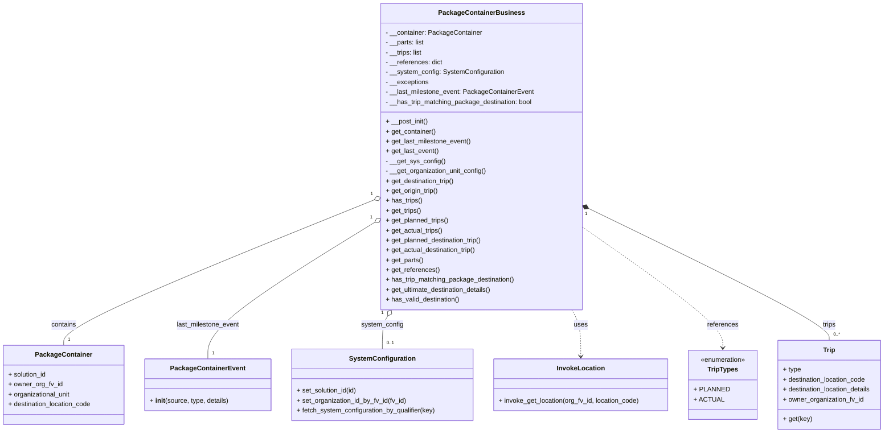

# Diagram: partview_core/partview_service/partview_service/core/business/package_container/PackageContainerBusiness.py

> Auto-generated by Obscura crawlers

## Mermaid

### SVG

<svg id="container" width="2145.15625" xmlns="http://www.w3.org/2000/svg" class="classDiagram" height="1050" viewBox="0 0 2145.15625 1050" role="graphics-document document" aria-roledescription="class"><g><defs><marker id="container_class-aggregationStart" class="marker aggregation class" refX="18" refY="7" markerWidth="190" markerHeight="240" orient="auto"><path d="M 18,7 L9,13 L1,7 L9,1 Z"></path></marker></defs><defs><marker id="container_class-aggregationEnd" class="marker aggregation class" refX="1" refY="7" markerWidth="20" markerHeight="28" orient="auto"><path d="M 18,7 L9,13 L1,7 L9,1 Z"></path></marker></defs><defs><marker id="container_class-extensionStart" class="marker extension class" refX="18" refY="7" markerWidth="190" markerHeight="240" orient="auto"><path d="M 1,7 L18,13 V 1 Z"></path></marker></defs><defs><marker id="container_class-extensionEnd" class="marker extension class" refX="1" refY="7" markerWidth="20" markerHeight="28" orient="auto"><path d="M 1,1 V 13 L18,7 Z"></path></marker></defs><defs><marker id="container_class-compositionStart" class="marker composition class" refX="18" refY="7" markerWidth="190" markerHeight="240" orient="auto"><path d="M 18,7 L9,13 L1,7 L9,1 Z"></path></marker></defs><defs><marker id="container_class-compositionEnd" class="marker composition class" refX="1" refY="7" markerWidth="20" markerHeight="28" orient="auto"><path d="M 18,7 L9,13 L1,7 L9,1 Z"></path></marker></defs><defs><marker id="container_class-dependencyStart" class="marker dependency class" refX="6" refY="7" markerWidth="190" markerHeight="240" orient="auto"><path d="M 5,7 L9,13 L1,7 L9,1 Z"></path></marker></defs><defs><marker id="container_class-dependencyEnd" class="marker dependency class" refX="13" refY="7" markerWidth="20" markerHeight="28" orient="auto"><path d="M 18,7 L9,13 L14,7 L9,1 Z"></path></marker></defs><defs><marker id="container_class-lollipopStart" class="marker lollipop class" refX="13" refY="7" markerWidth="190" markerHeight="240" orient="auto"><circle stroke="black" fill="transparent" cx="7" cy="7" r="6"></circle></marker></defs><defs><marker id="container_class-lollipopEnd" class="marker lollipop class" refX="1" refY="7" markerWidth="190" markerHeight="240" orient="auto"><circle stroke="black" fill="transparent" cx="7" cy="7" r="6"></circle></marker></defs><g class="root"><g class="clusters"></g><g class="edgePaths"><path d="M908.897,484.082L783.338,534.901C657.78,585.721,406.664,687.361,281.105,746.347C155.547,805.333,155.547,821.667,155.547,829.833L155.547,838" id="id_PackageContainerBusiness_PackageContainer_1" class="edge-thickness-normal edge-pattern-solid relation" style=";;;" data-edge="true" data-et="edge" data-id="id_PackageContainerBusiness_PackageContainer_1" data-points="W3sieCI6OTI0Ljg4NjcxODc1LCJ5Ijo0NzcuNjA5NjAzMDczOTczM30seyJ4IjoxNTUuNTQ2ODc1LCJ5Ijo3ODl9LHsieCI6MTU1LjU0Njg3NSwieSI6ODM4fV0=" marker-start="url(#container_class-aggregationStart)"></path><path d="M910.21,538.017L842.485,579.848C774.76,621.678,639.31,705.339,571.585,760.836C503.859,816.333,503.859,843.667,503.859,857.333L503.859,871" id="id_PackageContainerBusiness_PackageContainerEvent_2" class="edge-thickness-normal edge-pattern-solid relation" style=";;;" data-edge="true" data-et="edge" data-id="id_PackageContainerBusiness_PackageContainerEvent_2" data-points="W3sieCI6OTI0Ljg4NjcxODc1LCJ5Ijo1MjguOTUyNTMwNjc0ODQ2N30seyJ4Ijo1MDMuODU5Mzc1LCJ5Ijo3ODl9LHsieCI6NTAzLjg1OTM3NSwieSI6ODcxfV0=" marker-start="url(#container_class-aggregationStart)"></path><path d="M937.799,766.857L935.622,770.547C933.444,774.238,929.089,781.619,926.912,794.976C924.734,808.333,924.734,827.667,924.734,837.333L924.734,847" id="id_PackageContainerBusiness_SystemConfiguration_3" class="edge-thickness-normal edge-pattern-solid relation" style=";;;" data-edge="true" data-et="edge" data-id="id_PackageContainerBusiness_SystemConfiguration_3" data-points="W3sieCI6OTQ2LjU2NDYwMTE2MTM2OTIsInkiOjc1Mn0seyJ4Ijo5MjQuNzM0Mzc1LCJ5Ijo3ODl9LHsieCI6OTI0LjczNDM3NSwieSI6ODQ3fV0=" marker-start="url(#container_class-aggregationStart)"></path><path d="M1385.529,752L1389.168,758.167C1392.806,764.333,1400.083,776.667,1403.721,795.5C1407.359,814.333,1407.359,839.667,1407.359,852.333L1407.359,865" id="id_PackageContainerBusiness_InvokeLocation_4" class="edge-thickness-normal edge-pattern-dashed relation" style=";;;" data-edge="true" data-et="edge" data-id="id_PackageContainerBusiness_InvokeLocation_4" data-points="W3sieCI6MTM4NS41MjkxNDg4Mzg2MzA4LCJ5Ijo3NTJ9LHsieCI6MTQwNy4zNTkzNzUsInkiOjc4OX0seyJ4IjoxNDA3LjM1OTM3NSwieSI6ODcxfV0=" marker-end="url(#container_class-dependencyEnd)"></path><path d="M1407.207,549.097L1464.23,589.081C1521.254,629.065,1635.301,709.032,1692.324,758.183C1749.348,807.333,1749.348,825.667,1749.348,834.833L1749.348,844" id="id_PackageContainerBusiness_TripTypes_5" class="edge-thickness-normal edge-pattern-dashed relation" style=";;;" data-edge="true" data-et="edge" data-id="id_PackageContainerBusiness_TripTypes_5" data-points="W3sieCI6MTQwNy4yMDcwMzEyNSwieSI6NTQ5LjA5NzE1NzIwNzQzMzR9LHsieCI6MTc0OS4zNDc2NTYyNSwieSI6Nzg5fSx7IngiOjE3NDkuMzQ3NjU2MjUsInkiOjg1MH1d" marker-end="url(#container_class-dependencyEnd)"></path><path d="M1422.723,504.689L1520.267,552.074C1617.812,599.459,1812.9,694.23,1910.444,747.781C2007.988,801.333,2007.988,813.667,2007.988,819.833L2007.988,826" id="id_PackageContainerBusiness_Trip_6" class="edge-thickness-normal edge-pattern-solid relation" style=";;;" data-edge="true" data-et="edge" data-id="id_PackageContainerBusiness_Trip_6" data-points="W3sieCI6MTQwNy4yMDcwMzEyNSwieSI6NDk3LjE1MTI2ODY5MTY4NjM3fSx7IngiOjIwMDcuOTg4MjgxMjUsInkiOjc4OX0seyJ4IjoyMDA3Ljk4ODI4MTI1LCJ5Ijo4MjZ9XQ==" marker-start="url(#container_class-compositionStart)"></path></g><g class="edgeLabels"><g class="edgeLabel" transform="translate(155.546875, 789)"><g class="label" data-id="id_PackageContainerBusiness_PackageContainer_1" transform="translate(-30.890625, -12)"><foreignObject width="61.78125" height="24">

contains

</foreignObject></g></g><g class="edgeLabel" transform="translate(503.859375, 789)"><g class="label" data-id="id_PackageContainerBusiness_PackageContainerEvent_2" transform="translate(-77.375, -12)"><foreignObject width="154.75" height="24">

last_milestone_event

</foreignObject></g></g><g class="edgeLabel" transform="translate(924.734375, 789)"><g class="label" data-id="id_PackageContainerBusiness_SystemConfiguration_3" transform="translate(-50.984375, -12)"><foreignObject width="101.96875" height="24">

system_config

</foreignObject></g></g><g class="edgeLabel" transform="translate(1407.359375, 789)"><g class="label" data-id="id_PackageContainerBusiness_InvokeLocation_4" transform="translate(-16.4921875, -12)"><foreignObject width="32.984375" height="24">

uses

</foreignObject></g></g><g class="edgeLabel" transform="translate(1749.34765625, 789)"><g class="label" data-id="id_PackageContainerBusiness_TripTypes_5" transform="translate(-37.828125, -12)"><foreignObject width="75.65625" height="24">

references

</foreignObject></g></g><g class="edgeLabel" transform="translate(2007.98828125, 789)"><g class="label" data-id="id_PackageContainerBusiness_Trip_6" transform="translate(-16.7265625, -12)"><foreignObject width="33.453125" height="24">

trips

</foreignObject></g></g><g class="edgeTerminals" transform="translate(903.0373337990851, 470.2710523530068)"><g class="inner" transform="translate(0, 0)"><foreignObject style="width: 9px; height: 12px;">
1
</foreignObject></g></g><g class="edgeTerminals" transform="translate(902.1153551299121, 525.3867314570542)"><g class="inner" transform="translate(0, 0)"><foreignObject style="width: 9px; height: 12px;">
1
</foreignObject></g></g><g class="edgeTerminals" transform="translate(924.7529224597242, 759.4498764894735)"><g class="inner" transform="translate(0, 0)"><foreignObject style="width: 9px; height: 12px;">
1
</foreignObject></g></g><g class="edgeTerminals" transform="translate(1416.3937079139578, 518.2902131112395)"><g class="inner" transform="translate(0, 0)"><foreignObject style="width: 9px; height: 12px;">
1
</foreignObject></g></g><g class="edgeTerminals" transform="translate(165.54687749999985, 815.5000021428572)"><g class="inner" transform="translate(0, 0)"></g><foreignObject style="width: 9px; height: 12px;">
1
</foreignObject></g><g class="edgeTerminals" transform="translate(513.8593774999998, 848.5000021428572)"><g class="inner" transform="translate(0, 0)"></g><foreignObject style="width: 9px; height: 12px;">
1
</foreignObject></g><g class="edgeTerminals" transform="translate(934.7343774999998, 824.5000021428572)"><g class="inner" transform="translate(0, 0)"></g><foreignObject style="width: 36px; height: 12px;">
0..1
</foreignObject></g><g class="edgeTerminals" transform="translate(2017.988280625, 803.4999994642857)"><g class="inner" transform="translate(0, 0)"></g><foreignObject style="width: 36px; height: 12px;">
0..*
</foreignObject></g></g><g class="nodes"><g class="node default" id="classId-PackageContainerBusiness-0" transform="translate(1166.046875, 380)"><g class="basic label-container"><path d="M-241.16015625 -372 L241.16015625 -372 L241.16015625 372 L-241.16015625 372" stroke="none" stroke-width="0" fill="#ECECFF" style=""></path><path d="M-241.16015625 -372 C-120.76032247192457 -372, -0.36048869384913473 -372, 241.16015625 -372 M-241.16015625 -372 C-100.51958550081284 -372, 40.120985248374325 -372, 241.16015625 -372 M241.16015625 -372 C241.16015625 -125.13620592062657, 241.16015625 121.72758815874687, 241.16015625 372 M241.16015625 -372 C241.16015625 -133.06860997787285, 241.16015625 105.8627800442543, 241.16015625 372 M241.16015625 372 C85.5207469043562 372, -70.1186624412876 372, -241.16015625 372 M241.16015625 372 C50.03263300241926 372, -141.09489024516148 372, -241.16015625 372 M-241.16015625 372 C-241.16015625 186.20500982776818, -241.16015625 0.41001965553635955, -241.16015625 -372 M-241.16015625 372 C-241.16015625 158.29672790057353, -241.16015625 -55.40654419885294, -241.16015625 -372" stroke="#9370DB" stroke-width="1.3" fill="none" stroke-dasharray="0 0" style=""></path></g><g class="annotation-group text" transform="translate(0, -348)"></g><g class="label-group text" transform="translate(-97.7890625, -348)"><g class="label" style="font-weight: bolder" transform="translate(0,-12)"><foreignObject width="195.578125" height="24">

PackageContainerBusiness

</foreignObject></g></g><g class="members-group text" transform="translate(-229.16015625, -300)"><g class="label" style="" transform="translate(0,-12)"><foreignObject width="232.859375" height="24">

- __container: PackageContainer

</foreignObject></g><g class="label" style="" transform="translate(0,12)"><foreignObject width="95.171875" height="24">

- __parts: list

</foreignObject></g><g class="label" style="" transform="translate(0,36)"><foreignObject width="90.828125" height="24">

- __trips: list

</foreignObject></g><g class="label" style="" transform="translate(0,60)"><foreignObject width="138.40625" height="24">

- __references: dict

</foreignObject></g><g class="label" style="" transform="translate(0,84)"><foreignObject width="286.34375" height="24">

- __system_config: SystemConfiguration

</foreignObject></g><g class="label" style="" transform="translate(0,108)"><foreignObject width="105.078125" height="24">

- __exceptions

</foreignObject></g><g class="label" style="" transform="translate(0,132)"><foreignObject width="358.375" height="24">

- __last_milestone_event: PackageContainerEvent

</foreignObject></g><g class="label" style="" transform="translate(0,156)"><foreignObject width="360.53125" height="24">

- __has_trip_matching_package_destination: bool

</foreignObject></g></g><g class="methods-group text" transform="translate(-229.16015625, -84)"><g class="label" style="" transform="translate(0,-12)"><foreignObject width="103.671875" height="24">

+ __post_init()

</foreignObject></g><g class="label" style="" transform="translate(0,12)"><foreignObject width="122.359375" height="24">

+ get_container()

</foreignObject></g><g class="label" style="" transform="translate(0,36)"><foreignObject width="208.0625" height="24">

+ get_last_milestone_event()

</foreignObject></g><g class="label" style="" transform="translate(0,60)"><foreignObject width="128.0625" height="24">

+ get_last_event()

</foreignObject></g><g class="label" style="" transform="translate(0,84)"><foreignObject width="142.25" height="24">

- __get_sys_config()

</foreignObject></g><g class="label" style="" transform="translate(0,108)"><foreignObject width="247.140625" height="24">

- __get_organization_unit_config()

</foreignObject></g><g class="label" style="" transform="translate(0,132)"><foreignObject width="170.265625" height="24">

+ get_destination_trip()

</foreignObject></g><g class="label" style="" transform="translate(0,156)"><foreignObject width="129.375" height="24">

+ get_origin_trip()

</foreignObject></g><g class="label" style="" transform="translate(0,180)"><foreignObject width="89.109375" height="24">

+ has_trips()

</foreignObject></g><g class="label" style="" transform="translate(0,204)"><foreignObject width="86.59375" height="24">

+ get_trips()

</foreignObject></g><g class="label" style="" transform="translate(0,228)"><foreignObject width="154.78125" height="24">

+ get_planned_trips()

</foreignObject></g><g class="label" style="" transform="translate(0,252)"><foreignObject width="139.265625" height="24">

+ get_actual_trips()

</foreignObject></g><g class="label" style="" transform="translate(0,276)"><foreignObject width="238.4375" height="24">

+ get_planned_destination_trip()

</foreignObject></g><g class="label" style="" transform="translate(0,300)"><foreignObject width="222.9375" height="24">

+ get_actual_destination_trip()

</foreignObject></g><g class="label" style="" transform="translate(0,324)"><foreignObject width="90.953125" height="24">

+ get_parts()

</foreignObject></g><g class="label" style="" transform="translate(0,348)"><foreignObject width="129.125" height="24">

+ get_references()

</foreignObject></g><g class="label" style="" transform="translate(0,372)"><foreignObject width="315" height="24">

+ has_trip_matching_package_destination()

</foreignObject></g><g class="label" style="" transform="translate(0,396)"><foreignObject width="262.265625" height="24">

+ get_ultimate_destination_details()

</foreignObject></g><g class="label" style="" transform="translate(0,420)"><foreignObject width="181.578125" height="24">

+ has_valid_destination()

</foreignObject></g></g><g class="divider" style=""><path d="M-241.16015625 -324 C-118.38101300002323 -324, 4.398130249953539 -324, 241.16015625 -324 M-241.16015625 -324 C-132.02750554434726 -324, -22.8948548386945 -324, 241.16015625 -324" stroke="#9370DB" stroke-width="1.3" fill="none" stroke-dasharray="0 0" style=""></path></g><g class="divider" style=""><path d="M-241.16015625 -108 C-110.37305698954745 -108, 20.4140422709051 -108, 241.16015625 -108 M-241.16015625 -108 C-61.467969480742454 -108, 118.22421728851509 -108, 241.16015625 -108" stroke="#9370DB" stroke-width="1.3" fill="none" stroke-dasharray="0 0" style=""></path></g></g><g class="node default" id="classId-PackageContainer-1" transform="translate(155.546875, 934)"><g class="basic label-container"><path d="M-147.546875 -96 L147.546875 -96 L147.546875 96 L-147.546875 96" stroke="none" stroke-width="0" fill="#ECECFF" style=""></path><path d="M-147.546875 -96 C-38.39467721796868 -96, 70.75752056406265 -96, 147.546875 -96 M-147.546875 -96 C-58.92314980610293 -96, 29.700575387794146 -96, 147.546875 -96 M147.546875 -96 C147.546875 -43.34993012374152, 147.546875 9.300139752516955, 147.546875 96 M147.546875 -96 C147.546875 -43.240143952732154, 147.546875 9.519712094535691, 147.546875 96 M147.546875 96 C71.06893704629215 96, -5.409000907415702 96, -147.546875 96 M147.546875 96 C49.76972130098548 96, -48.00743239802904 96, -147.546875 96 M-147.546875 96 C-147.546875 54.220120159419885, -147.546875 12.44024031883977, -147.546875 -96 M-147.546875 96 C-147.546875 43.569990672883264, -147.546875 -8.860018654233471, -147.546875 -96" stroke="#9370DB" stroke-width="1.3" fill="none" stroke-dasharray="0 0" style=""></path></g><g class="annotation-group text" transform="translate(0, -72)"></g><g class="label-group text" transform="translate(-65.453125, -72)"><g class="label" style="font-weight: bolder" transform="translate(0,-12)"><foreignObject width="130.90625" height="24">

PackageContainer

</foreignObject></g></g><g class="members-group text" transform="translate(-135.546875, -24)"><g class="label" style="" transform="translate(0,-12)"><foreignObject width="94.453125" height="24">

+ solution_id

</foreignObject></g><g class="label" style="" transform="translate(0,12)"><foreignObject width="130.859375" height="24">

+ owner_org_fv_id

</foreignObject></g><g class="label" style="" transform="translate(0,36)"><foreignObject width="152.796875" height="24">

+ organizational_unit

</foreignObject></g><g class="label" style="" transform="translate(0,60)"><foreignObject width="205.640625" height="24">

+ destination_location_code

</foreignObject></g></g><g class="methods-group text" transform="translate(-135.546875, 96)"></g><g class="divider" style=""><path d="M-147.546875 -48 C-63.82229579967904 -48, 19.90228340064192 -48, 147.546875 -48 M-147.546875 -48 C-56.654211370398755 -48, 34.23845225920249 -48, 147.546875 -48" stroke="#9370DB" stroke-width="1.3" fill="none" stroke-dasharray="0 0" style=""></path></g><g class="divider" style=""><path d="M-147.546875 72 C-37.01531676586589 72, 73.51624146826822 72, 147.546875 72 M-147.546875 72 C-86.97851447357569 72, -26.41015394715137 72, 147.546875 72" stroke="#9370DB" stroke-width="1.3" fill="none" stroke-dasharray="0 0" style=""></path></g></g><g class="node default" id="classId-PackageContainerEvent-2" transform="translate(503.859375, 934)"><g class="basic label-container"><path d="M-150.765625 -63 L150.765625 -63 L150.765625 63 L-150.765625 63" stroke="none" stroke-width="0" fill="#ECECFF" style=""></path><path d="M-150.765625 -63 C-78.90293391103383 -63, -7.040242822067654 -63, 150.765625 -63 M-150.765625 -63 C-72.45714320855397 -63, 5.851338582892055 -63, 150.765625 -63 M150.765625 -63 C150.765625 -21.868615829841296, 150.765625 19.262768340317407, 150.765625 63 M150.765625 -63 C150.765625 -13.283649284433324, 150.765625 36.43270143113335, 150.765625 63 M150.765625 63 C65.24691720449418 63, -20.271790591011637 63, -150.765625 63 M150.765625 63 C61.72653215711573 63, -27.312560685768545 63, -150.765625 63 M-150.765625 63 C-150.765625 25.754050235085913, -150.765625 -11.491899529828174, -150.765625 -63 M-150.765625 63 C-150.765625 18.18530221382707, -150.765625 -26.629395572345857, -150.765625 -63" stroke="#9370DB" stroke-width="1.3" fill="none" stroke-dasharray="0 0" style=""></path></g><g class="annotation-group text" transform="translate(0, -39)"></g><g class="label-group text" transform="translate(-85.65625, -39)"><g class="label" style="font-weight: bolder" transform="translate(0,-12)"><foreignObject width="171.3125" height="24">

PackageContainerEvent

</foreignObject></g></g><g class="members-group text" transform="translate(-138.765625, 9)"></g><g class="methods-group text" transform="translate(-138.765625, 39)"><g class="label" style="" transform="translate(0,-12)"><foreignObject width="191.875" height="24">

+ <strong>init</strong>(source, type, details)

</foreignObject></g></g><g class="divider" style=""><path d="M-150.765625 -15 C-30.780683456308722 -15, 89.20425808738256 -15, 150.765625 -15 M-150.765625 -15 C-37.33514532618541 -15, 76.09533434762918 -15, 150.765625 -15" stroke="#9370DB" stroke-width="1.3" fill="none" stroke-dasharray="0 0" style=""></path></g><g class="divider" style=""><path d="M-150.765625 9 C-68.81916799494077 9, 13.12728901011846 9, 150.765625 9 M-150.765625 9 C-65.9629115764953 9, 18.839801847009397 9, 150.765625 9" stroke="#9370DB" stroke-width="1.3" fill="none" stroke-dasharray="0 0" style=""></path></g></g><g class="node default" id="classId-SystemConfiguration-3" transform="translate(924.734375, 934)"><g class="basic label-container"><path d="M-220.109375 -87 L220.109375 -87 L220.109375 87 L-220.109375 87" stroke="none" stroke-width="0" fill="#ECECFF" style=""></path><path d="M-220.109375 -87 C-101.29033916547881 -87, 17.528696669042375 -87, 220.109375 -87 M-220.109375 -87 C-118.794199039633 -87, -17.479023079266 -87, 220.109375 -87 M220.109375 -87 C220.109375 -33.76262273735894, 220.109375 19.474754525282123, 220.109375 87 M220.109375 -87 C220.109375 -24.976418423019894, 220.109375 37.04716315396021, 220.109375 87 M220.109375 87 C96.65940152178895 87, -26.7905719564221 87, -220.109375 87 M220.109375 87 C128.32848162487068 87, 36.547588249741324 87, -220.109375 87 M-220.109375 87 C-220.109375 32.743880100024406, -220.109375 -21.51223979995119, -220.109375 -87 M-220.109375 87 C-220.109375 18.11988080325817, -220.109375 -50.76023839348366, -220.109375 -87" stroke="#9370DB" stroke-width="1.3" fill="none" stroke-dasharray="0 0" style=""></path></g><g class="annotation-group text" transform="translate(0, -63)"></g><g class="label-group text" transform="translate(-75.921875, -63)"><g class="label" style="font-weight: bolder" transform="translate(0,-12)"><foreignObject width="151.84375" height="24">

SystemConfiguration

</foreignObject></g></g><g class="members-group text" transform="translate(-208.109375, -15)"></g><g class="methods-group text" transform="translate(-208.109375, 15)"><g class="label" style="" transform="translate(0,-12)"><foreignObject width="149.1875" height="24">

+ set_solution_id(id)

</foreignObject></g><g class="label" style="" transform="translate(0,12)"><foreignObject width="268.78125" height="24">

+ set_organization_id_by_fv_id(fv_id)

</foreignObject></g><g class="label" style="" transform="translate(0,36)"><foreignObject width="340.296875" height="24">

+ fetch_system_configuration_by_qualifier(key)

</foreignObject></g></g><g class="divider" style=""><path d="M-220.109375 -39 C-116.1518774825032 -39, -12.19437996500639 -39, 220.109375 -39 M-220.109375 -39 C-112.86245827680679 -39, -5.615541553613582 -39, 220.109375 -39" stroke="#9370DB" stroke-width="1.3" fill="none" stroke-dasharray="0 0" style=""></path></g><g class="divider" style=""><path d="M-220.109375 -15 C-112.4779008568653 -15, -4.846426713730608 -15, 220.109375 -15 M-220.109375 -15 C-81.20073073957462 -15, 57.70791352085075 -15, 220.109375 -15" stroke="#9370DB" stroke-width="1.3" fill="none" stroke-dasharray="0 0" style=""></path></g></g><g class="node default" id="classId-InvokeLocation-4" transform="translate(1407.359375, 934)"><g class="basic label-container"><path d="M-212.515625 -63 L212.515625 -63 L212.515625 63 L-212.515625 63" stroke="none" stroke-width="0" fill="#ECECFF" style=""></path><path d="M-212.515625 -63 C-60.020478137694084 -63, 92.47466872461183 -63, 212.515625 -63 M-212.515625 -63 C-77.73065689955078 -63, 57.05431120089844 -63, 212.515625 -63 M212.515625 -63 C212.515625 -26.44731203428119, 212.515625 10.10537593143762, 212.515625 63 M212.515625 -63 C212.515625 -23.05332555687209, 212.515625 16.893348886255822, 212.515625 63 M212.515625 63 C84.0224461818122 63, -44.4707326363756 63, -212.515625 63 M212.515625 63 C57.591034955320794 63, -97.33355508935841 63, -212.515625 63 M-212.515625 63 C-212.515625 36.12857373551111, -212.515625 9.257147471022229, -212.515625 -63 M-212.515625 63 C-212.515625 22.276133636720687, -212.515625 -18.447732726558627, -212.515625 -63" stroke="#9370DB" stroke-width="1.3" fill="none" stroke-dasharray="0 0" style=""></path></g><g class="annotation-group text" transform="translate(0, -39)"></g><g class="label-group text" transform="translate(-55.703125, -39)"><g class="label" style="font-weight: bolder" transform="translate(0,-12)"><foreignObject width="111.40625" height="24">

InvokeLocation

</foreignObject></g></g><g class="members-group text" transform="translate(-200.515625, 9)"></g><g class="methods-group text" transform="translate(-200.515625, 39)"><g class="label" style="" transform="translate(0,-12)"><foreignObject width="345.328125" height="24">

+ invoke_get_location(org_fv_id, location_code)

</foreignObject></g></g><g class="divider" style=""><path d="M-212.515625 -15 C-99.77736754622926 -15, 12.960889907541485 -15, 212.515625 -15 M-212.515625 -15 C-121.86342602036925 -15, -31.211227040738493 -15, 212.515625 -15" stroke="#9370DB" stroke-width="1.3" fill="none" stroke-dasharray="0 0" style=""></path></g><g class="divider" style=""><path d="M-212.515625 9 C-119.85296816907059 9, -27.190311338141186 9, 212.515625 9 M-212.515625 9 C-111.61793066929587 9, -10.720236338591747 9, 212.515625 9" stroke="#9370DB" stroke-width="1.3" fill="none" stroke-dasharray="0 0" style=""></path></g></g><g class="node default" id="classId-TripTypes-5" transform="translate(1749.34765625, 934)"><g class="basic label-container"><path d="M-79.47265625 -84 L79.47265625 -84 L79.47265625 84 L-79.47265625 84" stroke="none" stroke-width="0" fill="#ECECFF" style=""></path><path d="M-79.47265625 -84 C-39.343841081874196 -84, 0.7849740862516086 -84, 79.47265625 -84 M-79.47265625 -84 C-33.94981439112493 -84, 11.573027467750137 -84, 79.47265625 -84 M79.47265625 -84 C79.47265625 -40.72762943202643, 79.47265625 2.5447411359471346, 79.47265625 84 M79.47265625 -84 C79.47265625 -21.68215754332909, 79.47265625 40.63568491334182, 79.47265625 84 M79.47265625 84 C17.85326584169824 84, -43.76612456660352 84, -79.47265625 84 M79.47265625 84 C40.11797521668383 84, 0.7632941833676625 84, -79.47265625 84 M-79.47265625 84 C-79.47265625 23.628558313021273, -79.47265625 -36.742883373957454, -79.47265625 -84 M-79.47265625 84 C-79.47265625 40.82234188913244, -79.47265625 -2.355316221735123, -79.47265625 -84" stroke="#9370DB" stroke-width="1.3" fill="none" stroke-dasharray="0 0" style=""></path></g><g class="annotation-group text" transform="translate(-55.5546875, -60)"><g class="label" style="" transform="translate(0,-12)"><foreignObject width="111.109375" height="24">

«enumeration»

</foreignObject></g></g><g class="label-group text" transform="translate(-35.5234375, -36)"><g class="label" style="font-weight: bolder" transform="translate(0,-12)"><foreignObject width="71.046875" height="24">

TripTypes

</foreignObject></g></g><g class="members-group text" transform="translate(-67.47265625, 12)"><g class="label" style="" transform="translate(0,-12)"><foreignObject width="79.390625" height="24">

+ PLANNED

</foreignObject></g><g class="label" style="" transform="translate(0,12)"><foreignObject width="65.875" height="24">

+ ACTUAL

</foreignObject></g></g><g class="methods-group text" transform="translate(-67.47265625, 84)"></g><g class="divider" style=""><path d="M-79.47265625 -12 C-40.94939118462187 -12, -2.426126119243733 -12, 79.47265625 -12 M-79.47265625 -12 C-27.327670982968485 -12, 24.81731428406303 -12, 79.47265625 -12" stroke="#9370DB" stroke-width="1.3" fill="none" stroke-dasharray="0 0" style=""></path></g><g class="divider" style=""><path d="M-79.47265625 60 C-25.814485647934042 60, 27.843684954131916 60, 79.47265625 60 M-79.47265625 60 C-36.03764962806904 60, 7.397356993861919 60, 79.47265625 60" stroke="#9370DB" stroke-width="1.3" fill="none" stroke-dasharray="0 0" style=""></path></g></g><g class="node default" id="classId-Trip-6" transform="translate(2007.98828125, 934)"><g class="basic label-container"><path d="M-129.16796875 -108 L129.16796875 -108 L129.16796875 108 L-129.16796875 108" stroke="none" stroke-width="0" fill="#ECECFF" style=""></path><path d="M-129.16796875 -108 C-37.25556399896824 -108, 54.656840752063516 -108, 129.16796875 -108 M-129.16796875 -108 C-39.60238690072477 -108, 49.963194948550466 -108, 129.16796875 -108 M129.16796875 -108 C129.16796875 -39.032925680319806, 129.16796875 29.934148639360387, 129.16796875 108 M129.16796875 -108 C129.16796875 -39.77584015059317, 129.16796875 28.448319698813663, 129.16796875 108 M129.16796875 108 C73.72550770138193 108, 18.283046652763844 108, -129.16796875 108 M129.16796875 108 C68.88411890587335 108, 8.600269061746701 108, -129.16796875 108 M-129.16796875 108 C-129.16796875 48.684978138513394, -129.16796875 -10.630043722973213, -129.16796875 -108 M-129.16796875 108 C-129.16796875 25.944154563654052, -129.16796875 -56.111690872691895, -129.16796875 -108" stroke="#9370DB" stroke-width="1.3" fill="none" stroke-dasharray="0 0" style=""></path></g><g class="annotation-group text" transform="translate(0, -84)"></g><g class="label-group text" transform="translate(-14.3203125, -84)"><g class="label" style="font-weight: bolder" transform="translate(0,-12)"><foreignObject width="28.640625" height="24">

Trip

</foreignObject></g></g><g class="members-group text" transform="translate(-117.16796875, -36)"><g class="label" style="" transform="translate(0,-12)"><foreignObject width="44.03125" height="24">

+ type

</foreignObject></g><g class="label" style="" transform="translate(0,12)"><foreignObject width="205.640625" height="24">

+ destination_location_code

</foreignObject></g><g class="label" style="" transform="translate(0,36)"><foreignObject width="220.015625" height="24">

+ destination_location_details

</foreignObject></g><g class="label" style="" transform="translate(0,60)"><foreignObject width="197.546875" height="24">

+ owner_organization_fv_id

</foreignObject></g></g><g class="methods-group text" transform="translate(-117.16796875, 84)"><g class="label" style="" transform="translate(0,-12)"><foreignObject width="69.734375" height="24">

+ get(key)

</foreignObject></g></g><g class="divider" style=""><path d="M-129.16796875 -60 C-61.28193106946931 -60, 6.604106611061383 -60, 129.16796875 -60 M-129.16796875 -60 C-37.66701135198467 -60, 53.83394604603066 -60, 129.16796875 -60" stroke="#9370DB" stroke-width="1.3" fill="none" stroke-dasharray="0 0" style=""></path></g><g class="divider" style=""><path d="M-129.16796875 60 C-35.93062256708619 60, 57.30672361582762 60, 129.16796875 60 M-129.16796875 60 C-54.34518527439583 60, 20.477598201208338 60, 129.16796875 60" stroke="#9370DB" stroke-width="1.3" fill="none" stroke-dasharray="0 0" style=""></path></g></g></g></g></g></svg>
