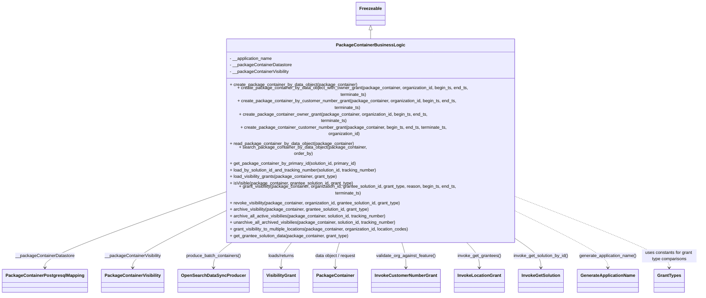

# Diagram: partview_core/partview_service/partview_service/core/business/package_container/PackageContainerBusinessLogic.py

> Auto-generated by Obscura crawlers

## Mermaid

### SVG

<svg id="container" width="2469.453125" xmlns="http://www.w3.org/2000/svg" class="classDiagram" height="932" viewBox="0 0 2469.453125 932" role="graphics-document document" aria-roledescription="class"><g><defs><marker id="container_class-aggregationStart" class="marker aggregation class" refX="18" refY="7" markerWidth="190" markerHeight="240" orient="auto"><path d="M 18,7 L9,13 L1,7 L9,1 Z"></path></marker></defs><defs><marker id="container_class-aggregationEnd" class="marker aggregation class" refX="1" refY="7" markerWidth="20" markerHeight="28" orient="auto"><path d="M 18,7 L9,13 L1,7 L9,1 Z"></path></marker></defs><defs><marker id="container_class-extensionStart" class="marker extension class" refX="18" refY="7" markerWidth="190" markerHeight="240" orient="auto"><path d="M 1,7 L18,13 V 1 Z"></path></marker></defs><defs><marker id="container_class-extensionEnd" class="marker extension class" refX="1" refY="7" markerWidth="20" markerHeight="28" orient="auto"><path d="M 1,1 V 13 L18,7 Z"></path></marker></defs><defs><marker id="container_class-compositionStart" class="marker composition class" refX="18" refY="7" markerWidth="190" markerHeight="240" orient="auto"><path d="M 18,7 L9,13 L1,7 L9,1 Z"></path></marker></defs><defs><marker id="container_class-compositionEnd" class="marker composition class" refX="1" refY="7" markerWidth="20" markerHeight="28" orient="auto"><path d="M 18,7 L9,13 L1,7 L9,1 Z"></path></marker></defs><defs><marker id="container_class-dependencyStart" class="marker dependency class" refX="6" refY="7" markerWidth="190" markerHeight="240" orient="auto"><path d="M 5,7 L9,13 L1,7 L9,1 Z"></path></marker></defs><defs><marker id="container_class-dependencyEnd" class="marker dependency class" refX="13" refY="7" markerWidth="20" markerHeight="28" orient="auto"><path d="M 18,7 L9,13 L14,7 L9,1 Z"></path></marker></defs><defs><marker id="container_class-lollipopStart" class="marker lollipop class" refX="13" refY="7" markerWidth="190" markerHeight="240" orient="auto"><circle stroke="black" fill="transparent" cx="7" cy="7" r="6"></circle></marker></defs><defs><marker id="container_class-lollipopEnd" class="marker lollipop class" refX="1" refY="7" markerWidth="190" markerHeight="240" orient="auto"><circle stroke="black" fill="transparent" cx="7" cy="7" r="6"></circle></marker></defs><g class="root"><g class="clusters"></g><g class="edgePaths"><path d="M1297.5,109.25L1297.5,110.542C1297.5,111.833,1297.5,114.417,1297.5,119.875C1297.5,125.333,1297.5,133.667,1297.5,137.833L1297.5,142" id="id_Freezeable_PackageContainerBusinessLogic_1" class="edge-thickness-normal edge-pattern-solid relation" style=";;;" data-edge="true" data-et="edge" data-id="id_Freezeable_PackageContainerBusinessLogic_1" data-points="W3sieCI6MTI5Ny41LCJ5Ijo5Mn0seyJ4IjoxMjk3LjUsInkiOjExN30seyJ4IjoxMjk3LjUsInkiOjE0Mn1d" marker-start="url(#container_class-extensionStart)"></path><path d="M752.734,608.534L653.254,638.945C553.773,669.356,354.813,730.178,255.332,767.756C155.852,805.333,155.852,819.667,155.852,826.833L155.852,834" id="id_PackageContainerBusinessLogic_PackageContainerPostgresqlMapping_2" class="edge-thickness-normal edge-pattern-solid relation" style=";;;" data-edge="true" data-et="edge" data-id="id_PackageContainerBusinessLogic_PackageContainerPostgresqlMapping_2" data-points="W3sieCI6NzUyLjczNDM3NSwieSI6NjA4LjUzMzkzMTg4MzAzNjR9LHsieCI6MTU1Ljg1MTU2MjUsInkiOjc5MX0seyJ4IjoxNTUuODUxNTYyNSwieSI6ODQwfV0=" marker-end="url(#container_class-dependencyEnd)"></path><path d="M752.734,669.814L704.436,690.012C656.138,710.209,559.542,750.605,511.243,777.969C462.945,805.333,462.945,819.667,462.945,826.833L462.945,834" id="id_PackageContainerBusinessLogic_PackageContainerVisibility_3" class="edge-thickness-normal edge-pattern-solid relation" style=";;;" data-edge="true" data-et="edge" data-id="id_PackageContainerBusinessLogic_PackageContainerVisibility_3" data-points="W3sieCI6NzUyLjczNDM3NSwieSI6NjY5LjgxMzk1MzkyMzc4MDR9LHsieCI6NDYyLjk0NTMxMjUsInkiOjc5MX0seyJ4Ijo0NjIuOTQ1MzEyNSwieSI6ODQwfV0=" marker-end="url(#container_class-dependencyEnd)"></path><path d="M822.713,742L809.788,750.167C796.863,758.333,771.014,774.667,758.089,790C745.164,805.333,745.164,819.667,745.164,826.833L745.164,834" id="id_PackageContainerBusinessLogic_OpenSearchDataSyncProducer_4" class="edge-thickness-normal edge-pattern-solid relation" style=";;;" data-edge="true" data-et="edge" data-id="id_PackageContainerBusinessLogic_OpenSearchDataSyncProducer_4" data-points="W3sieCI6ODIyLjcxMjY2MTE3NDc4NTEsInkiOjc0Mn0seyJ4Ijo3NDUuMTY0MDYyNSwieSI6NzkxfSx7IngiOjc0NS4xNjQwNjI1LCJ5Ijo4NDB9XQ==" marker-end="url(#container_class-dependencyEnd)"></path><path d="M1026.391,742L1019.01,750.167C1011.63,758.333,996.87,774.667,989.49,790C982.109,805.333,982.109,819.667,982.109,826.833L982.109,834" id="id_PackageContainerBusinessLogic_VisibilityGrant_5" class="edge-thickness-normal edge-pattern-solid relation" style=";;;" data-edge="true" data-et="edge" data-id="id_PackageContainerBusinessLogic_VisibilityGrant_5" data-points="W3sieCI6MTAyNi4zOTA1ODAyMjkyMjYzLCJ5Ijo3NDJ9LHsieCI6OTgyLjEwOTM3NSwieSI6NzkxfSx7IngiOjk4Mi4xMDkzNzUsInkiOjg0MH1d" marker-end="url(#container_class-dependencyEnd)"></path><path d="M1190.937,742L1188.036,750.167C1185.135,758.333,1179.333,774.667,1176.432,790C1173.531,805.333,1173.531,819.667,1173.531,826.833L1173.531,834" id="id_PackageContainerBusinessLogic_PackageContainer_6" class="edge-thickness-normal edge-pattern-solid relation" style=";;;" data-edge="true" data-et="edge" data-id="id_PackageContainerBusinessLogic_PackageContainer_6" data-points="W3sieCI6MTE5MC45MzY2MDQ1ODQ1MjcyLCJ5Ijo3NDJ9LHsieCI6MTE3My41MzEyNSwieSI6NzkxfSx7IngiOjExNzMuNTMxMjUsInkiOjg0MH1d" marker-end="url(#container_class-dependencyEnd)"></path><path d="M1404.063,742L1406.964,750.167C1409.865,758.333,1415.667,774.667,1418.568,790C1421.469,805.333,1421.469,819.667,1421.469,826.833L1421.469,834" id="id_PackageContainerBusinessLogic_InvokeCustomerNumberGrant_7" class="edge-thickness-normal edge-pattern-solid relation" style=";;;" data-edge="true" data-et="edge" data-id="id_PackageContainerBusinessLogic_InvokeCustomerNumberGrant_7" data-points="W3sieCI6MTQwNC4wNjMzOTU0MTU0NzI4LCJ5Ijo3NDJ9LHsieCI6MTQyMS40Njg3NSwieSI6NzkxfSx7IngiOjE0MjEuNDY4NzUsInkiOjg0MH1d" marker-end="url(#container_class-dependencyEnd)"></path><path d="M1626.149,742L1635.095,750.167C1644.042,758.333,1661.935,774.667,1670.882,790C1679.828,805.333,1679.828,819.667,1679.828,826.833L1679.828,834" id="id_PackageContainerBusinessLogic_InvokeLocationGrant_8" class="edge-thickness-normal edge-pattern-solid relation" style=";;;" data-edge="true" data-et="edge" data-id="id_PackageContainerBusinessLogic_InvokeLocationGrant_8" data-points="W3sieCI6MTYyNi4xNDg4MTgwNTE1NzYsInkiOjc0Mn0seyJ4IjoxNjc5LjgyODEyNSwieSI6NzkxfSx7IngiOjE2NzkuODI4MTI1LCJ5Ijo4NDB9XQ==" marker-end="url(#container_class-dependencyEnd)"></path><path d="M1813.306,742L1827.348,750.167C1841.389,758.333,1869.472,774.667,1883.513,790C1897.555,805.333,1897.555,819.667,1897.555,826.833L1897.555,834" id="id_PackageContainerBusinessLogic_InvokeGetSolution_9" class="edge-thickness-normal edge-pattern-solid relation" style=";;;" data-edge="true" data-et="edge" data-id="id_PackageContainerBusinessLogic_InvokeGetSolution_9" data-points="W3sieCI6MTgxMy4zMDYzMjE2MzMyMzgsInkiOjc0Mn0seyJ4IjoxODk3LjU1NDY4NzUsInkiOjc5MX0seyJ4IjoxODk3LjU1NDY4NzUsInkiOjg0MH1d" marker-end="url(#container_class-dependencyEnd)"></path><path d="M1842.266,668.951L1891.092,689.293C1939.919,709.634,2037.573,750.317,2086.4,777.825C2135.227,805.333,2135.227,819.667,2135.227,826.833L2135.227,834" id="id_PackageContainerBusinessLogic_GenerateApplicationName_10" class="edge-thickness-normal edge-pattern-dashed relation" style=";;;" data-edge="true" data-et="edge" data-id="id_PackageContainerBusinessLogic_GenerateApplicationName_10" data-points="W3sieCI6MTg0Mi4yNjU2MjUsInkiOjY2OC45NTEzODQ0MjAyNTk1fSx7IngiOjIxMzUuMjI2NTYyNSwieSI6NzkxfSx7IngiOjIxMzUuMjI2NTYyNSwieSI6ODQwfV0=" marker-end="url(#container_class-dependencyEnd)"></path><path d="M1842.266,620.695L1928.797,649.079C2015.328,677.463,2188.391,734.232,2274.922,769.783C2361.453,805.333,2361.453,819.667,2361.453,826.833L2361.453,834" id="id_PackageContainerBusinessLogic_GrantTypes_11" class="edge-thickness-normal edge-pattern-dashed relation" style=";;;" data-edge="true" data-et="edge" data-id="id_PackageContainerBusinessLogic_GrantTypes_11" data-points="W3sieCI6MTg0Mi4yNjU2MjUsInkiOjYyMC42OTUwOTM0NzUxMDAzfSx7IngiOjIzNjEuNDUzMTI1LCJ5Ijo3OTF9LHsieCI6MjM2MS40NTMxMjUsInkiOjg0MH1d" marker-end="url(#container_class-dependencyEnd)"></path></g><g class="edgeLabels"><g class="edgeLabel"><g class="label" data-id="id_Freezeable_PackageContainerBusinessLogic_1" transform="translate(0, 0)"><foreignObject width="0" height="0">

</foreignObject></g></g><g class="edgeLabel" transform="translate(155.8515625, 791)"><g class="label" data-id="id_PackageContainerBusinessLogic_PackageContainerPostgresqlMapping_2" transform="translate(-107.8984375, -12)"><foreignObject width="215.796875" height="24">

__packageContainerDatastore

</foreignObject></g></g><g class="edgeLabel" transform="translate(462.9453125, 791)"><g class="label" data-id="id_PackageContainerBusinessLogic_PackageContainerVisibility_3" transform="translate(-104.078125, -12)"><foreignObject width="208.15625" height="24">

__packageContainerVisibility

</foreignObject></g></g><g class="edgeLabel" transform="translate(745.1640625, 791)"><g class="label" data-id="id_PackageContainerBusinessLogic_OpenSearchDataSyncProducer_4" transform="translate(-101.4453125, -12)"><foreignObject width="202.890625" height="24">

produce_batch_containers()

</foreignObject></g></g><g class="edgeLabel" transform="translate(982.109375, 791)"><g class="label" data-id="id_PackageContainerBusinessLogic_VisibilityGrant_5" transform="translate(-49.953125, -12)"><foreignObject width="99.90625" height="24">

loads/returns

</foreignObject></g></g><g class="edgeLabel" transform="translate(1173.53125, 791)"><g class="label" data-id="id_PackageContainerBusinessLogic_PackageContainer_6" transform="translate(-77.2109375, -12)"><foreignObject width="154.421875" height="24">

data object / request

</foreignObject></g></g><g class="edgeLabel" transform="translate(1421.46875, 791)"><g class="label" data-id="id_PackageContainerBusinessLogic_InvokeCustomerNumberGrant_7" transform="translate(-109.984375, -12)"><foreignObject width="219.96875" height="24">

validate_org_against_feature()

</foreignObject></g></g><g class="edgeLabel" transform="translate(1679.828125, 791)"><g class="label" data-id="id_PackageContainerBusinessLogic_InvokeLocationGrant_8" transform="translate(-79.8515625, -12)"><foreignObject width="159.703125" height="24">

invoke_get_grantees()

</foreignObject></g></g><g class="edgeLabel" transform="translate(1897.5546875, 791)"><g class="label" data-id="id_PackageContainerBusinessLogic_InvokeGetSolution_9" transform="translate(-102.234375, -12)"><foreignObject width="204.46875" height="24">

invoke_get_solution_by_id()

</foreignObject></g></g><g class="edgeLabel" transform="translate(2135.2265625, 791)"><g class="label" data-id="id_PackageContainerBusinessLogic_GenerateApplicationName_10" transform="translate(-106.2265625, -12)"><foreignObject width="212.453125" height="24">

generate_application_name()

</foreignObject></g></g><g class="edgeLabel" transform="translate(2361.453125, 791)"><g class="label" data-id="id_PackageContainerBusinessLogic_GrantTypes_11" transform="translate(-100, -24)"><foreignObject width="200" height="48">

uses constants for grant type comparisons

</foreignObject></g></g></g><g class="nodes"><g class="node default" id="classId-Freezeable-0" transform="translate(1297.5, 50)"><g class="basic label-container"><path d="M-51.1953125 -42 L51.1953125 -42 L51.1953125 42 L-51.1953125 42" stroke="none" stroke-width="0" fill="#ECECFF" style=""></path><path d="M-51.1953125 -42 C-28.954045271629557 -42, -6.712778043259114 -42, 51.1953125 -42 M-51.1953125 -42 C-29.33230430990836 -42, -7.469296119816718 -42, 51.1953125 -42 M51.1953125 -42 C51.1953125 -21.250451870279992, 51.1953125 -0.5009037405599841, 51.1953125 42 M51.1953125 -42 C51.1953125 -14.876829316478915, 51.1953125 12.24634136704217, 51.1953125 42 M51.1953125 42 C20.814670877282918 42, -9.565970745434164 42, -51.1953125 42 M51.1953125 42 C23.864375314848353 42, -3.4665618703032948 42, -51.1953125 42 M-51.1953125 42 C-51.1953125 16.119940500247562, -51.1953125 -9.760118999504876, -51.1953125 -42 M-51.1953125 42 C-51.1953125 23.696242334559777, -51.1953125 5.392484669119554, -51.1953125 -42" stroke="#9370DB" stroke-width="1.3" fill="none" stroke-dasharray="0 0" style=""></path></g><g class="annotation-group text" transform="translate(0, -18)"></g><g class="label-group text" transform="translate(-39.1953125, -18)"><g class="label" style="font-weight: bolder" transform="translate(0,-12)"><foreignObject width="78.390625" height="24">

Freezeable

</foreignObject></g></g><g class="members-group text" transform="translate(-39.1953125, 30)"></g><g class="methods-group text" transform="translate(-39.1953125, 60)"></g><g class="divider" style=""><path d="M-51.1953125 6 C-22.543518168457737 6, 6.1082761630845255 6, 51.1953125 6 M-51.1953125 6 C-17.87052372528896 6, 15.454265049422077 6, 51.1953125 6" stroke="#9370DB" stroke-width="1.3" fill="none" stroke-dasharray="0 0" style=""></path></g><g class="divider" style=""><path d="M-51.1953125 24 C-30.245741452856 24, -9.296170405711997 24, 51.1953125 24 M-51.1953125 24 C-29.772660513647825 24, -8.35000852729565 24, 51.1953125 24" stroke="#9370DB" stroke-width="1.3" fill="none" stroke-dasharray="0 0" style=""></path></g></g><g class="node default" id="classId-PackageContainerBusinessLogic-1" transform="translate(1297.5, 442)"><g class="basic label-container"><path d="M-544.765625 -300 L544.765625 -300 L544.765625 300 L-544.765625 300" stroke="none" stroke-width="0" fill="#ECECFF" style=""></path><path d="M-544.765625 -300 C-257.7672104674307 -300, 29.231204065138627 -300, 544.765625 -300 M-544.765625 -300 C-124.41447318983938 -300, 295.93667862032123 -300, 544.765625 -300 M544.765625 -300 C544.765625 -156.39059762816973, 544.765625 -12.781195256339458, 544.765625 300 M544.765625 -300 C544.765625 -135.89669961463008, 544.765625 28.20660077073984, 544.765625 300 M544.765625 300 C311.02382258108 300, 77.28202016216005 300, -544.765625 300 M544.765625 300 C123.19689425095578 300, -298.37183649808844 300, -544.765625 300 M-544.765625 300 C-544.765625 74.06122145927753, -544.765625 -151.87755708144493, -544.765625 -300 M-544.765625 300 C-544.765625 149.04282204144423, -544.765625 -1.9143559171115498, -544.765625 -300" stroke="#9370DB" stroke-width="1.3" fill="none" stroke-dasharray="0 0" style=""></path></g><g class="annotation-group text" transform="translate(0, -276)"></g><g class="label-group text" transform="translate(-116.859375, -276)"><g class="label" style="font-weight: bolder" transform="translate(0,-12)"><foreignObject width="233.71875" height="24">

PackageContainerBusinessLogic

</foreignObject></g></g><g class="members-group text" transform="translate(-532.765625, -228)"><g class="label" style="" transform="translate(0,-12)"><foreignObject width="157.796875" height="24">

- __application_name

</foreignObject></g><g class="label" style="" transform="translate(0,12)"><foreignObject width="226.484375" height="24">

- __packageContainerDatastore

</foreignObject></g><g class="label" style="" transform="translate(0,36)"><foreignObject width="218.84375" height="24">

- __packageContainerVisibility

</foreignObject></g></g><g class="methods-group text" transform="translate(-532.765625, -132)"><g class="label" style="" transform="translate(0,-12)"><foreignObject width="465.15625" height="24">

+ create_package_container_by_data_object(package_container)

</foreignObject></g><g class="label" style="" transform="translate(0,12)"><foreignObject width="948.671875" height="24">

+ create_package_container_by_data_object_with_owner_grant(package_container, organization_id, begin_ts, end_ts, terminate_ts)

</foreignObject></g><g class="label" style="" transform="translate(0,36)"><foreignObject width="901.921875" height="24">

+ create_package_container_by_customer_number_grant(package_container, organization_id, begin_ts, end_ts, terminate_ts)

</foreignObject></g><g class="label" style="" transform="translate(0,60)"><foreignObject width="790.265625" height="24">

+ create_package_container_owner_grant(package_container, organization_id, begin_ts, end_ts, terminate_ts)

</foreignObject></g><g class="label" style="" transform="translate(0,84)"><foreignObject width="876.78125" height="24">

+ create_package_container_customer_number_grant(package_container, begin_ts, end_ts, terminate_ts, organization_id)

</foreignObject></g><g class="label" style="" transform="translate(0,108)"><foreignObject width="453.140625" height="24">

+ read_package_container_by_data_object(package_container)

</foreignObject></g><g class="label" style="" transform="translate(0,132)"><foreignObject width="538.734375" height="24">

+ search_package_container_by_data_object(package_container, order_by)

</foreignObject></g><g class="label" style="" transform="translate(0,156)"><foreignObject width="468.984375" height="24">

+ get_package_container_by_primary_id(solution_id, primary_id)

</foreignObject></g><g class="label" style="" transform="translate(0,180)"><foreignObject width="550.96875" height="24">

+ load_by_solution_id_and_tracking_number(solution_id, tracking_number)

</foreignObject></g><g class="label" style="" transform="translate(0,204)"><foreignObject width="397.140625" height="24">

+ load_visibility_grants(package_container, grant_type)

</foreignObject></g><g class="label" style="" transform="translate(0,228)"><foreignObject width="456.34375" height="24">

+ isVisible(package_container, grantee_solution_id, grant_type)

</foreignObject></g><g class="label" style="" transform="translate(0,252)"><foreignObject width="907.421875" height="24">

+ grant_visibility(package_container, organization_id, grantee_solution_id, grant_type, reason, begin_ts, end_ts, terminate_ts)

</foreignObject></g><g class="label" style="" transform="translate(0,276)"><foreignObject width="633.90625" height="24">

+ revoke_visibility(package_container, organization_id, grantee_solution_id, grant_type)

</foreignObject></g><g class="label" style="" transform="translate(0,300)"><foreignObject width="517.265625" height="24">

+ archive_visibility(package_container, grantee_solution_id, grant_type)

</foreignObject></g><g class="label" style="" transform="translate(0,324)"><foreignObject width="579.421875" height="24">

+ archive_all_active_visibilies(package_container, solution_id, tracking_number)

</foreignObject></g><g class="label" style="" transform="translate(0,348)"><foreignObject width="617.28125" height="24">

+ unarchive_all_archived_visibilies(package_container, solution_id, tracking_number)

</foreignObject></g><g class="label" style="" transform="translate(0,372)"><foreignObject width="668.15625" height="24">

+ grant_visibility_to_multiple_locations(package_container, organization_id, location_codes)

</foreignObject></g><g class="label" style="" transform="translate(0,396)"><foreignObject width="437.328125" height="24">

+ get_grantee_solution_data(package_container, grant_type)

</foreignObject></g></g><g class="divider" style=""><path d="M-544.765625 -252 C-206.3835721145765 -252, 131.99848077084698 -252, 544.765625 -252 M-544.765625 -252 C-271.79517969042786 -252, 1.1752656191442838 -252, 544.765625 -252" stroke="#9370DB" stroke-width="1.3" fill="none" stroke-dasharray="0 0" style=""></path></g><g class="divider" style=""><path d="M-544.765625 -156 C-270.96788452053704 -156, 2.8298559589259185 -156, 544.765625 -156 M-544.765625 -156 C-120.80604214281493 -156, 303.15354071437014 -156, 544.765625 -156" stroke="#9370DB" stroke-width="1.3" fill="none" stroke-dasharray="0 0" style=""></path></g></g><g class="node default" id="classId-PackageContainerPostgresqlMapping-2" transform="translate(155.8515625, 882)"><g class="basic label-container"><path d="M-147.8515625 -42 L147.8515625 -42 L147.8515625 42 L-147.8515625 42" stroke="none" stroke-width="0" fill="#ECECFF" style=""></path><path d="M-147.8515625 -42 C-30.15169673695212 -42, 87.54816902609576 -42, 147.8515625 -42 M-147.8515625 -42 C-39.256631971252915 -42, 69.33829855749417 -42, 147.8515625 -42 M147.8515625 -42 C147.8515625 -12.74508461419758, 147.8515625 16.50983077160484, 147.8515625 42 M147.8515625 -42 C147.8515625 -25.18139791341894, 147.8515625 -8.362795826837882, 147.8515625 42 M147.8515625 42 C46.37844356052064 42, -55.094675378958726 42, -147.8515625 42 M147.8515625 42 C46.535693428170205 42, -54.78017564365959 42, -147.8515625 42 M-147.8515625 42 C-147.8515625 24.021440115424145, -147.8515625 6.04288023084829, -147.8515625 -42 M-147.8515625 42 C-147.8515625 11.501547035050336, -147.8515625 -18.996905929899327, -147.8515625 -42" stroke="#9370DB" stroke-width="1.3" fill="none" stroke-dasharray="0 0" style=""></path></g><g class="annotation-group text" transform="translate(0, -18)"></g><g class="label-group text" transform="translate(-135.8515625, -18)"><g class="label" style="font-weight: bolder" transform="translate(0,-12)"><foreignObject width="271.703125" height="24">

PackageContainerPostgresqlMapping

</foreignObject></g></g><g class="members-group text" transform="translate(-135.8515625, 30)"></g><g class="methods-group text" transform="translate(-135.8515625, 60)"></g><g class="divider" style=""><path d="M-147.8515625 6 C-37.21854405529565 6, 73.4144743894087 6, 147.8515625 6 M-147.8515625 6 C-76.46791848156096 6, -5.084274463121915 6, 147.8515625 6" stroke="#9370DB" stroke-width="1.3" fill="none" stroke-dasharray="0 0" style=""></path></g><g class="divider" style=""><path d="M-147.8515625 24 C-54.26327930418479 24, 39.325003891630416 24, 147.8515625 24 M-147.8515625 24 C-51.043656528287926 24, 45.76424944342415 24, 147.8515625 24" stroke="#9370DB" stroke-width="1.3" fill="none" stroke-dasharray="0 0" style=""></path></g></g><g class="node default" id="classId-PackageContainerVisibility-3" transform="translate(462.9453125, 882)"><g class="basic label-container"><path d="M-109.2421875 -42 L109.2421875 -42 L109.2421875 42 L-109.2421875 42" stroke="none" stroke-width="0" fill="#ECECFF" style=""></path><path d="M-109.2421875 -42 C-60.2215225254462 -42, -11.200857550892394 -42, 109.2421875 -42 M-109.2421875 -42 C-23.728977221827265 -42, 61.78423305634547 -42, 109.2421875 -42 M109.2421875 -42 C109.2421875 -15.413405300473105, 109.2421875 11.17318939905379, 109.2421875 42 M109.2421875 -42 C109.2421875 -24.84014190694706, 109.2421875 -7.680283813894121, 109.2421875 42 M109.2421875 42 C35.322037998606035 42, -38.59811150278793 42, -109.2421875 42 M109.2421875 42 C41.832766059839116 42, -25.576655380321768 42, -109.2421875 42 M-109.2421875 42 C-109.2421875 15.365861711352451, -109.2421875 -11.268276577295097, -109.2421875 -42 M-109.2421875 42 C-109.2421875 22.496681887480218, -109.2421875 2.993363774960436, -109.2421875 -42" stroke="#9370DB" stroke-width="1.3" fill="none" stroke-dasharray="0 0" style=""></path></g><g class="annotation-group text" transform="translate(0, -18)"></g><g class="label-group text" transform="translate(-97.2421875, -18)"><g class="label" style="font-weight: bolder" transform="translate(0,-12)"><foreignObject width="194.484375" height="24">

PackageContainerVisibility

</foreignObject></g></g><g class="members-group text" transform="translate(-97.2421875, 30)"></g><g class="methods-group text" transform="translate(-97.2421875, 60)"></g><g class="divider" style=""><path d="M-109.2421875 6 C-35.22292609049681 6, 38.796335319006374 6, 109.2421875 6 M-109.2421875 6 C-40.70651777836184 6, 27.829151943276315 6, 109.2421875 6" stroke="#9370DB" stroke-width="1.3" fill="none" stroke-dasharray="0 0" style=""></path></g><g class="divider" style=""><path d="M-109.2421875 24 C-35.61835685302283 24, 38.00547379395434 24, 109.2421875 24 M-109.2421875 24 C-59.73075518558875 24, -10.219322871177496 24, 109.2421875 24" stroke="#9370DB" stroke-width="1.3" fill="none" stroke-dasharray="0 0" style=""></path></g></g><g class="node default" id="classId-OpenSearchDataSyncProducer-4" transform="translate(745.1640625, 882)"><g class="basic label-container"><path d="M-122.9765625 -42 L122.9765625 -42 L122.9765625 42 L-122.9765625 42" stroke="none" stroke-width="0" fill="#ECECFF" style=""></path><path d="M-122.9765625 -42 C-31.174515892056007 -42, 60.627530715887985 -42, 122.9765625 -42 M-122.9765625 -42 C-52.54510486951655 -42, 17.8863527609669 -42, 122.9765625 -42 M122.9765625 -42 C122.9765625 -14.707718366764702, 122.9765625 12.584563266470596, 122.9765625 42 M122.9765625 -42 C122.9765625 -13.480477456540562, 122.9765625 15.039045086918875, 122.9765625 42 M122.9765625 42 C55.47986275792202 42, -12.016836984155958 42, -122.9765625 42 M122.9765625 42 C70.51656517517642 42, 18.05656785035285 42, -122.9765625 42 M-122.9765625 42 C-122.9765625 14.777893457555116, -122.9765625 -12.444213084889768, -122.9765625 -42 M-122.9765625 42 C-122.9765625 20.145743412351454, -122.9765625 -1.7085131752970923, -122.9765625 -42" stroke="#9370DB" stroke-width="1.3" fill="none" stroke-dasharray="0 0" style=""></path></g><g class="annotation-group text" transform="translate(0, -18)"></g><g class="label-group text" transform="translate(-110.9765625, -18)"><g class="label" style="font-weight: bolder" transform="translate(0,-12)"><foreignObject width="221.953125" height="24">

OpenSearchDataSyncProducer

</foreignObject></g></g><g class="members-group text" transform="translate(-110.9765625, 30)"></g><g class="methods-group text" transform="translate(-110.9765625, 60)"></g><g class="divider" style=""><path d="M-122.9765625 6 C-32.178457920601005 6, 58.61964665879799 6, 122.9765625 6 M-122.9765625 6 C-55.42835567595418 6, 12.11985114809164 6, 122.9765625 6" stroke="#9370DB" stroke-width="1.3" fill="none" stroke-dasharray="0 0" style=""></path></g><g class="divider" style=""><path d="M-122.9765625 24 C-53.9074109630067 24, 15.161740573986606 24, 122.9765625 24 M-122.9765625 24 C-65.48096364450126 24, -7.985364789002517 24, 122.9765625 24" stroke="#9370DB" stroke-width="1.3" fill="none" stroke-dasharray="0 0" style=""></path></g></g><g class="node default" id="classId-VisibilityGrant-5" transform="translate(982.109375, 882)"><g class="basic label-container"><path d="M-63.96875 -42 L63.96875 -42 L63.96875 42 L-63.96875 42" stroke="none" stroke-width="0" fill="#ECECFF" style=""></path><path d="M-63.96875 -42 C-23.35186470130099 -42, 17.26502059739802 -42, 63.96875 -42 M-63.96875 -42 C-37.1966980945985 -42, -10.424646189196999 -42, 63.96875 -42 M63.96875 -42 C63.96875 -22.519010726575765, 63.96875 -3.0380214531515293, 63.96875 42 M63.96875 -42 C63.96875 -15.019960512661715, 63.96875 11.96007897467657, 63.96875 42 M63.96875 42 C25.92144697050024 42, -12.125856058999517 42, -63.96875 42 M63.96875 42 C13.46981702744327 42, -37.02911594511346 42, -63.96875 42 M-63.96875 42 C-63.96875 13.443447864724064, -63.96875 -15.113104270551872, -63.96875 -42 M-63.96875 42 C-63.96875 22.30206000903572, -63.96875 2.6041200180714412, -63.96875 -42" stroke="#9370DB" stroke-width="1.3" fill="none" stroke-dasharray="0 0" style=""></path></g><g class="annotation-group text" transform="translate(0, -18)"></g><g class="label-group text" transform="translate(-51.96875, -18)"><g class="label" style="font-weight: bolder" transform="translate(0,-12)"><foreignObject width="103.9375" height="24">

VisibilityGrant

</foreignObject></g></g><g class="members-group text" transform="translate(-51.96875, 30)"></g><g class="methods-group text" transform="translate(-51.96875, 60)"></g><g class="divider" style=""><path d="M-63.96875 6 C-34.631838596948555 6, -5.294927193897102 6, 63.96875 6 M-63.96875 6 C-25.504258139633947 6, 12.960233720732106 6, 63.96875 6" stroke="#9370DB" stroke-width="1.3" fill="none" stroke-dasharray="0 0" style=""></path></g><g class="divider" style=""><path d="M-63.96875 24 C-23.465850735027686 24, 17.037048529944627 24, 63.96875 24 M-63.96875 24 C-17.563065786981106 24, 28.842618426037788 24, 63.96875 24" stroke="#9370DB" stroke-width="1.3" fill="none" stroke-dasharray="0 0" style=""></path></g></g><g class="node default" id="classId-PackageContainer-6" transform="translate(1173.53125, 882)"><g class="basic label-container"><path d="M-77.453125 -42 L77.453125 -42 L77.453125 42 L-77.453125 42" stroke="none" stroke-width="0" fill="#ECECFF" style=""></path><path d="M-77.453125 -42 C-40.024234634096686 -42, -2.5953442681933723 -42, 77.453125 -42 M-77.453125 -42 C-17.52338035487537 -42, 42.40636429024926 -42, 77.453125 -42 M77.453125 -42 C77.453125 -10.03283508605081, 77.453125 21.93432982789838, 77.453125 42 M77.453125 -42 C77.453125 -24.64871788039624, 77.453125 -7.297435760792482, 77.453125 42 M77.453125 42 C40.55111806604299 42, 3.6491111320859773 42, -77.453125 42 M77.453125 42 C37.80029951900665 42, -1.8525259619867 42, -77.453125 42 M-77.453125 42 C-77.453125 19.2268685652475, -77.453125 -3.546262869505, -77.453125 -42 M-77.453125 42 C-77.453125 9.416645462094529, -77.453125 -23.166709075810942, -77.453125 -42" stroke="#9370DB" stroke-width="1.3" fill="none" stroke-dasharray="0 0" style=""></path></g><g class="annotation-group text" transform="translate(0, -18)"></g><g class="label-group text" transform="translate(-65.453125, -18)"><g class="label" style="font-weight: bolder" transform="translate(0,-12)"><foreignObject width="130.90625" height="24">

PackageContainer

</foreignObject></g></g><g class="members-group text" transform="translate(-65.453125, 30)"></g><g class="methods-group text" transform="translate(-65.453125, 60)"></g><g class="divider" style=""><path d="M-77.453125 6 C-42.40417910623634 6, -7.355233212472683 6, 77.453125 6 M-77.453125 6 C-19.893609146345177 6, 37.665906707309645 6, 77.453125 6" stroke="#9370DB" stroke-width="1.3" fill="none" stroke-dasharray="0 0" style=""></path></g><g class="divider" style=""><path d="M-77.453125 24 C-20.293106854253118 24, 36.866911291493764 24, 77.453125 24 M-77.453125 24 C-26.59556290954832 24, 24.26199918090336 24, 77.453125 24" stroke="#9370DB" stroke-width="1.3" fill="none" stroke-dasharray="0 0" style=""></path></g></g><g class="node default" id="classId-InvokeCustomerNumberGrant-7" transform="translate(1421.46875, 882)"><g class="basic label-container"><path d="M-120.484375 -42 L120.484375 -42 L120.484375 42 L-120.484375 42" stroke="none" stroke-width="0" fill="#ECECFF" style=""></path><path d="M-120.484375 -42 C-57.41201266719643 -42, 5.660349665607143 -42, 120.484375 -42 M-120.484375 -42 C-43.00051857803457 -42, 34.483337843930855 -42, 120.484375 -42 M120.484375 -42 C120.484375 -15.201786619339586, 120.484375 11.596426761320828, 120.484375 42 M120.484375 -42 C120.484375 -23.920025876079812, 120.484375 -5.840051752159624, 120.484375 42 M120.484375 42 C38.06416152812581 42, -44.35605194374838 42, -120.484375 42 M120.484375 42 C58.02336611100068 42, -4.437642777998633 42, -120.484375 42 M-120.484375 42 C-120.484375 10.350661165071635, -120.484375 -21.29867766985673, -120.484375 -42 M-120.484375 42 C-120.484375 20.841794272300632, -120.484375 -0.31641145539873605, -120.484375 -42" stroke="#9370DB" stroke-width="1.3" fill="none" stroke-dasharray="0 0" style=""></path></g><g class="annotation-group text" transform="translate(0, -18)"></g><g class="label-group text" transform="translate(-108.484375, -18)"><g class="label" style="font-weight: bolder" transform="translate(0,-12)"><foreignObject width="216.96875" height="24">

InvokeCustomerNumberGrant

</foreignObject></g></g><g class="members-group text" transform="translate(-108.484375, 30)"></g><g class="methods-group text" transform="translate(-108.484375, 60)"></g><g class="divider" style=""><path d="M-120.484375 6 C-69.59102942430508 6, -18.69768384861014 6, 120.484375 6 M-120.484375 6 C-52.68966012393453 6, 15.10505475213094 6, 120.484375 6" stroke="#9370DB" stroke-width="1.3" fill="none" stroke-dasharray="0 0" style=""></path></g><g class="divider" style=""><path d="M-120.484375 24 C-35.81552350417199 24, 48.853327991656016 24, 120.484375 24 M-120.484375 24 C-40.03488871977379 24, 40.41459756045242 24, 120.484375 24" stroke="#9370DB" stroke-width="1.3" fill="none" stroke-dasharray="0 0" style=""></path></g></g><g class="node default" id="classId-InvokeLocationGrant-8" transform="translate(1679.828125, 882)"><g class="basic label-container"><path d="M-87.875 -42 L87.875 -42 L87.875 42 L-87.875 42" stroke="none" stroke-width="0" fill="#ECECFF" style=""></path><path d="M-87.875 -42 C-45.020278443594535 -42, -2.1655568871890694 -42, 87.875 -42 M-87.875 -42 C-44.80552717938906 -42, -1.7360543587781194 -42, 87.875 -42 M87.875 -42 C87.875 -9.846413115414961, 87.875 22.307173769170078, 87.875 42 M87.875 -42 C87.875 -9.90466393254674, 87.875 22.19067213490652, 87.875 42 M87.875 42 C42.70693842073177 42, -2.4611231585364663 42, -87.875 42 M87.875 42 C33.29234176759947 42, -21.290316464801066 42, -87.875 42 M-87.875 42 C-87.875 24.23777062975526, -87.875 6.475541259510521, -87.875 -42 M-87.875 42 C-87.875 10.247136217595035, -87.875 -21.50572756480993, -87.875 -42" stroke="#9370DB" stroke-width="1.3" fill="none" stroke-dasharray="0 0" style=""></path></g><g class="annotation-group text" transform="translate(0, -18)"></g><g class="label-group text" transform="translate(-75.875, -18)"><g class="label" style="font-weight: bolder" transform="translate(0,-12)"><foreignObject width="151.75" height="24">

InvokeLocationGrant

</foreignObject></g></g><g class="members-group text" transform="translate(-75.875, 30)"></g><g class="methods-group text" transform="translate(-75.875, 60)"></g><g class="divider" style=""><path d="M-87.875 6 C-47.56996369616676 6, -7.264927392333519 6, 87.875 6 M-87.875 6 C-34.4876388741166 6, 18.899722251766804 6, 87.875 6" stroke="#9370DB" stroke-width="1.3" fill="none" stroke-dasharray="0 0" style=""></path></g><g class="divider" style=""><path d="M-87.875 24 C-17.60956721542118 24, 52.65586556915764 24, 87.875 24 M-87.875 24 C-45.57151679153616 24, -3.2680335830723237 24, 87.875 24" stroke="#9370DB" stroke-width="1.3" fill="none" stroke-dasharray="0 0" style=""></path></g></g><g class="node default" id="classId-InvokeGetSolution-9" transform="translate(1897.5546875, 882)"><g class="basic label-container"><path d="M-79.8515625 -42 L79.8515625 -42 L79.8515625 42 L-79.8515625 42" stroke="none" stroke-width="0" fill="#ECECFF" style=""></path><path d="M-79.8515625 -42 C-20.156653682833223 -42, 39.53825513433355 -42, 79.8515625 -42 M-79.8515625 -42 C-23.912670803370702 -42, 32.026220893258596 -42, 79.8515625 -42 M79.8515625 -42 C79.8515625 -12.694816188278782, 79.8515625 16.610367623442436, 79.8515625 42 M79.8515625 -42 C79.8515625 -18.91911676244087, 79.8515625 4.161766475118263, 79.8515625 42 M79.8515625 42 C42.90075702505935 42, 5.949951550118698 42, -79.8515625 42 M79.8515625 42 C40.45812096178269 42, 1.06467942356538 42, -79.8515625 42 M-79.8515625 42 C-79.8515625 19.24668709942885, -79.8515625 -3.506625801142299, -79.8515625 -42 M-79.8515625 42 C-79.8515625 19.33927843966667, -79.8515625 -3.3214431206666575, -79.8515625 -42" stroke="#9370DB" stroke-width="1.3" fill="none" stroke-dasharray="0 0" style=""></path></g><g class="annotation-group text" transform="translate(0, -18)"></g><g class="label-group text" transform="translate(-67.8515625, -18)"><g class="label" style="font-weight: bolder" transform="translate(0,-12)"><foreignObject width="135.703125" height="24">

InvokeGetSolution

</foreignObject></g></g><g class="members-group text" transform="translate(-67.8515625, 30)"></g><g class="methods-group text" transform="translate(-67.8515625, 60)"></g><g class="divider" style=""><path d="M-79.8515625 6 C-16.550768461221317 6, 46.750025577557366 6, 79.8515625 6 M-79.8515625 6 C-30.229247614036254 6, 19.393067271927492 6, 79.8515625 6" stroke="#9370DB" stroke-width="1.3" fill="none" stroke-dasharray="0 0" style=""></path></g><g class="divider" style=""><path d="M-79.8515625 24 C-27.630625204483415 24, 24.59031209103317 24, 79.8515625 24 M-79.8515625 24 C-31.68439400195909 24, 16.482774496081817 24, 79.8515625 24" stroke="#9370DB" stroke-width="1.3" fill="none" stroke-dasharray="0 0" style=""></path></g></g><g class="node default" id="classId-GenerateApplicationName-10" transform="translate(2135.2265625, 882)"><g class="basic label-container"><path d="M-107.8203125 -42 L107.8203125 -42 L107.8203125 42 L-107.8203125 42" stroke="none" stroke-width="0" fill="#ECECFF" style=""></path><path d="M-107.8203125 -42 C-58.95791060068299 -42, -10.095508701365986 -42, 107.8203125 -42 M-107.8203125 -42 C-53.185434954377605 -42, 1.4494425912447895 -42, 107.8203125 -42 M107.8203125 -42 C107.8203125 -18.184725188039607, 107.8203125 5.6305496239207855, 107.8203125 42 M107.8203125 -42 C107.8203125 -17.89590197850298, 107.8203125 6.2081960429940395, 107.8203125 42 M107.8203125 42 C29.01279074001971 42, -49.79473101996058 42, -107.8203125 42 M107.8203125 42 C43.530335734888354 42, -20.759641030223293 42, -107.8203125 42 M-107.8203125 42 C-107.8203125 25.040142930261904, -107.8203125 8.080285860523809, -107.8203125 -42 M-107.8203125 42 C-107.8203125 17.226438552822643, -107.8203125 -7.547122894354715, -107.8203125 -42" stroke="#9370DB" stroke-width="1.3" fill="none" stroke-dasharray="0 0" style=""></path></g><g class="annotation-group text" transform="translate(0, -18)"></g><g class="label-group text" transform="translate(-95.8203125, -18)"><g class="label" style="font-weight: bolder" transform="translate(0,-12)"><foreignObject width="191.640625" height="24">

GenerateApplicationName

</foreignObject></g></g><g class="members-group text" transform="translate(-95.8203125, 30)"></g><g class="methods-group text" transform="translate(-95.8203125, 60)"></g><g class="divider" style=""><path d="M-107.8203125 6 C-53.33536029804084 6, 1.1495919039183207 6, 107.8203125 6 M-107.8203125 6 C-22.36383400933569 6, 63.09264448132862 6, 107.8203125 6" stroke="#9370DB" stroke-width="1.3" fill="none" stroke-dasharray="0 0" style=""></path></g><g class="divider" style=""><path d="M-107.8203125 24 C-57.85193211562943 24, -7.883551731258862 24, 107.8203125 24 M-107.8203125 24 C-47.13415672444473 24, 13.551999051110542 24, 107.8203125 24" stroke="#9370DB" stroke-width="1.3" fill="none" stroke-dasharray="0 0" style=""></path></g></g><g class="node default" id="classId-GrantTypes-11" transform="translate(2361.453125, 882)"><g class="basic label-container"><path d="M-53.3828125 -42 L53.3828125 -42 L53.3828125 42 L-53.3828125 42" stroke="none" stroke-width="0" fill="#ECECFF" style=""></path><path d="M-53.3828125 -42 C-19.356375818149715 -42, 14.67006086370057 -42, 53.3828125 -42 M-53.3828125 -42 C-31.249415353509562 -42, -9.116018207019124 -42, 53.3828125 -42 M53.3828125 -42 C53.3828125 -19.845888866128053, 53.3828125 2.3082222677438935, 53.3828125 42 M53.3828125 -42 C53.3828125 -10.95156945470502, 53.3828125 20.09686109058996, 53.3828125 42 M53.3828125 42 C13.85004999550155 42, -25.6827125089969 42, -53.3828125 42 M53.3828125 42 C15.9592972435033 42, -21.4642180129934 42, -53.3828125 42 M-53.3828125 42 C-53.3828125 21.219905851917773, -53.3828125 0.43981170383554513, -53.3828125 -42 M-53.3828125 42 C-53.3828125 20.280118025414218, -53.3828125 -1.4397639491715637, -53.3828125 -42" stroke="#9370DB" stroke-width="1.3" fill="none" stroke-dasharray="0 0" style=""></path></g><g class="annotation-group text" transform="translate(0, -18)"></g><g class="label-group text" transform="translate(-41.3828125, -18)"><g class="label" style="font-weight: bolder" transform="translate(0,-12)"><foreignObject width="82.765625" height="24">

GrantTypes

</foreignObject></g></g><g class="members-group text" transform="translate(-41.3828125, 30)"></g><g class="methods-group text" transform="translate(-41.3828125, 60)"></g><g class="divider" style=""><path d="M-53.3828125 6 C-17.70993258198289 6, 17.96294733603422 6, 53.3828125 6 M-53.3828125 6 C-20.870219127970508 6, 11.642374244058985 6, 53.3828125 6" stroke="#9370DB" stroke-width="1.3" fill="none" stroke-dasharray="0 0" style=""></path></g><g class="divider" style=""><path d="M-53.3828125 24 C-25.697775519625 24, 1.9872614607499983 24, 53.3828125 24 M-53.3828125 24 C-12.523594183630756 24, 28.335624132738488 24, 53.3828125 24" stroke="#9370DB" stroke-width="1.3" fill="none" stroke-dasharray="0 0" style=""></path></g></g></g></g></g></svg>
