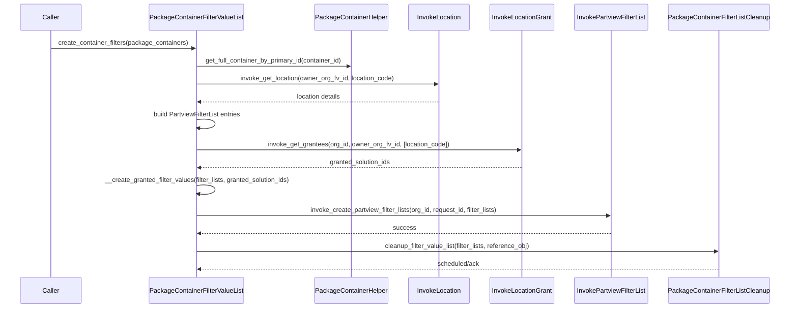

# Diagram: partview_core/partview_service/partview_service/core/business/package_container/PackageContainerFilterValueList.py

> Auto-generated by Obscura crawlers

## Diagram 1

```mermaid
classDiagram
    class PackageContainerFilterValueList {
        - __solution_id
        - __organization_id
        - __request_id
        - __partview_config
        - __container_helper
        - __package_container_filter_cleanup
        + create_asn_order_filters(asn_orders, trip_leg)
        + create_package_container_event_filters(package_container_event)
        + create_container_filters(package_containers)
        + set_package_filter_values(package_container, location_code, filter_lists, loc_value)
        + create_container_parts_filters(parts, container_id=None)
        + create_container_trip_leg_filters(trip_legs)
        - __create_filter_values(filter_lists, reference_obj, granted_solution_ids=None)
        - __create_granted_filter_values(filter_lists, granted_solutions_ids)
        - __get_granted_solution_ids_by_container_id(container_id)
        - __get_granted_solution_ids_by_trip_leg(trip_leg)
        - __get_granted_solution_ids(owner_org_fv_id, destination_location_code)
        - __get_carrier_label(carrier_organization_fv_id=None)
    }

    Freezeable <|-- PackageContainerFilterValueList
    PartviewFilterList <.. PackageContainerFilterValueList : uses
    PackageContainerHelper <.. PackageContainerFilterValueList : uses
    PackageContainerFilterListCleanup <.. PackageContainerFilterValueList : uses
    PartViewConfiguration <.. PackageContainerFilterValueList : uses
    InvokeLocation --> PackageContainerFilterValueList : invokes
    InvokeLocationGrant --> PackageContainerFilterValueList : invokes
    InvokePartviewFilterList --> PackageContainerFilterValueList : invokes
    InvokeOrganization --> PackageContainerFilterValueList : invokes
    ASNOrder <.. PackageContainerFilterValueList : data
    TripLeg <.. PackageContainerFilterValueList : data
    PackageContainerEvent <.. PackageContainerFilterValueList : data
    PackageContainer <.. PackageContainerFilterValueList : data
    Part <.. PackageContainerFilterValueList : data
    PackageContainerFilterNames <.. PackageContainerFilterValueList : uses
    FvUuid <.. PackageContainerFilterValueList : utility
```

### SVG

<svg id="container" width="3260.546875" xmlns="http://www.w3.org/2000/svg" class="classDiagram" height="702" viewBox="0 0 3260.546875 702" role="graphics-document document" aria-roledescription="class"><g><defs><marker id="container_class-aggregationStart" class="marker aggregation class" refX="18" refY="7" markerWidth="190" markerHeight="240" orient="auto"><path d="M 18,7 L9,13 L1,7 L9,1 Z"></path></marker></defs><defs><marker id="container_class-aggregationEnd" class="marker aggregation class" refX="1" refY="7" markerWidth="20" markerHeight="28" orient="auto"><path d="M 18,7 L9,13 L1,7 L9,1 Z"></path></marker></defs><defs><marker id="container_class-extensionStart" class="marker extension class" refX="18" refY="7" markerWidth="190" markerHeight="240" orient="auto"><path d="M 1,7 L18,13 V 1 Z"></path></marker></defs><defs><marker id="container_class-extensionEnd" class="marker extension class" refX="1" refY="7" markerWidth="20" markerHeight="28" orient="auto"><path d="M 1,1 V 13 L18,7 Z"></path></marker></defs><defs><marker id="container_class-compositionStart" class="marker composition class" refX="18" refY="7" markerWidth="190" markerHeight="240" orient="auto"><path d="M 18,7 L9,13 L1,7 L9,1 Z"></path></marker></defs><defs><marker id="container_class-compositionEnd" class="marker composition class" refX="1" refY="7" markerWidth="20" markerHeight="28" orient="auto"><path d="M 18,7 L9,13 L1,7 L9,1 Z"></path></marker></defs><defs><marker id="container_class-dependencyStart" class="marker dependency class" refX="6" refY="7" markerWidth="190" markerHeight="240" orient="auto"><path d="M 5,7 L9,13 L1,7 L9,1 Z"></path></marker></defs><defs><marker id="container_class-dependencyEnd" class="marker dependency class" refX="13" refY="7" markerWidth="20" markerHeight="28" orient="auto"><path d="M 18,7 L9,13 L14,7 L9,1 Z"></path></marker></defs><defs><marker id="container_class-lollipopStart" class="marker lollipop class" refX="13" refY="7" markerWidth="190" markerHeight="240" orient="auto"><circle stroke="black" fill="transparent" cx="7" cy="7" r="6"></circle></marker></defs><defs><marker id="container_class-lollipopEnd" class="marker lollipop class" refX="1" refY="7" markerWidth="190" markerHeight="240" orient="auto"><circle stroke="black" fill="transparent" cx="7" cy="7" r="6"></circle></marker></defs><g class="root"><g class="clusters"></g><g class="edgePaths"><path d="M59.195,109.25L59.195,112.542C59.195,115.833,59.195,122.417,288.633,165.152C518.07,207.887,976.945,286.773,1206.383,326.216L1435.82,365.66" id="id_Freezeable_PackageContainerFilterValueList_1" class="edge-thickness-normal edge-pattern-solid relation" style=";;;" data-edge="true" data-et="edge" data-id="id_Freezeable_PackageContainerFilterValueList_1" data-points="W3sieCI6NTkuMTk1MzEyNSwieSI6OTJ9LHsieCI6NTkuMTk1MzEyNSwieSI6MTI5fSx7IngiOjE0MzUuODIwMzEyNSwieSI6MzY1LjY1OTU4NTQzMzI3Mzh9XQ==" marker-start="url(#container_class-extensionStart)"></path><path d="M236.359,98L236.359,103.167C236.359,108.333,236.359,118.667,436.27,162.069C636.18,205.472,1036,281.944,1235.91,320.18L1435.82,358.416" id="id_PartviewFilterList_PackageContainerFilterValueList_2" class="edge-thickness-normal edge-pattern-dashed relation" style=";;;" data-edge="true" data-et="edge" data-id="id_PartviewFilterList_PackageContainerFilterValueList_2" data-points="W3sieCI6MjM2LjM1OTM3NSwieSI6OTJ9LHsieCI6MjM2LjM1OTM3NSwieSI6MTI5fSx7IngiOjE0MzUuODIwMzEyNSwieSI6MzU4LjQxNjM3MTkwODc2NTN9XQ==" marker-start="url(#container_class-dependencyStart)"></path><path d="M464.297,98L464.297,103.167C464.297,108.333,464.297,118.667,626.217,160.049C788.138,201.431,1111.979,273.861,1273.9,310.077L1435.82,346.292" id="id_PackageContainerHelper_PackageContainerFilterValueList_3" class="edge-thickness-normal edge-pattern-dashed relation" style=";;;" data-edge="true" data-et="edge" data-id="id_PackageContainerHelper_PackageContainerFilterValueList_3" data-points="W3sieCI6NDY0LjI5Njg3NSwieSI6OTJ9LHsieCI6NDY0LjI5Njg3NSwieSI6MTI5fSx7IngiOjE0MzUuODIwMzEyNSwieSI6MzQ2LjI5MjE1MzQ1MzYzNTZ9XQ==" marker-start="url(#container_class-dependencyStart)"></path><path d="M755.438,98L755.438,103.167C755.438,108.333,755.438,118.667,868.835,156.197C982.232,193.728,1209.026,258.456,1322.423,290.82L1435.82,323.184" id="id_PackageContainerFilterListCleanup_PackageContainerFilterValueList_4" class="edge-thickness-normal edge-pattern-dashed relation" style=";;;" data-edge="true" data-et="edge" data-id="id_PackageContainerFilterListCleanup_PackageContainerFilterValueList_4" data-points="W3sieCI6NzU1LjQzNzUsInkiOjkyfSx7IngiOjc1NS40Mzc1LCJ5IjoxMjl9LHsieCI6MTQzNS44MjAzMTI1LCJ5IjozMjMuMTg0MTI2MDE5OTQ4OTZ9XQ==" marker-start="url(#container_class-dependencyStart)"></path><path d="M1038.266,98L1038.266,103.167C1038.266,108.333,1038.266,118.667,1104.525,149.674C1170.784,180.681,1303.302,232.361,1369.561,258.202L1435.82,284.042" id="id_PartViewConfiguration_PackageContainerFilterValueList_5" class="edge-thickness-normal edge-pattern-dashed relation" style=";;;" data-edge="true" data-et="edge" data-id="id_PartViewConfiguration_PackageContainerFilterValueList_5" data-points="W3sieCI6MTAzOC4yNjU2MjUsInkiOjkyfSx7IngiOjEwMzguMjY1NjI1LCJ5IjoxMjl9LHsieCI6MTQzNS44MjAzMTI1LCJ5IjoyODQuMDQyMDAyMTc2Mjc4Nn1d" marker-start="url(#container_class-dependencyStart)"></path><path d="M1249.625,92L1249.625,98.167C1249.625,104.333,1249.625,116.667,1279.777,139.027C1309.928,161.387,1370.231,193.773,1400.383,209.966L1430.534,226.16" id="id_InvokeLocation_PackageContainerFilterValueList_6" class="edge-thickness-normal edge-pattern-solid relation" style=";;;" data-edge="true" data-et="edge" data-id="id_InvokeLocation_PackageContainerFilterValueList_6" data-points="W3sieCI6MTI0OS42MjUsInkiOjkyfSx7IngiOjEyNDkuNjI1LCJ5IjoxMjl9LHsieCI6MTQzNS44MjAzMTI1LCJ5IjoyMjguOTk4MzY5MDc2NTc2NzJ9XQ==" marker-end="url(#container_class-dependencyEnd)"></path><path d="M1455.203,92L1455.203,98.167C1455.203,104.333,1455.203,116.667,1461.711,128.353C1468.219,140.04,1481.235,151.079,1487.742,156.599L1494.25,162.119" id="id_InvokeLocationGrant_PackageContainerFilterValueList_7" class="edge-thickness-normal edge-pattern-solid relation" style=";;;" data-edge="true" data-et="edge" data-id="id_InvokeLocationGrant_PackageContainerFilterValueList_7" data-points="W3sieCI6MTQ1NS4yMDMxMjUsInkiOjkyfSx7IngiOjE0NTUuMjAzMTI1LCJ5IjoxMjl9LHsieCI6MTQ5OC44MjYxMTM0NzU5MTM2LCJ5IjoxNjZ9XQ==" marker-end="url(#container_class-dependencyEnd)"></path><path d="M1693.398,92L1693.398,98.167C1693.398,104.333,1693.398,116.667,1695.428,128.068C1697.457,139.469,1701.515,149.937,1703.544,155.171L1705.573,160.406" id="id_InvokePartviewFilterList_PackageContainerFilterValueList_8" class="edge-thickness-normal edge-pattern-solid relation" style=";;;" data-edge="true" data-et="edge" data-id="id_InvokePartviewFilterList_PackageContainerFilterValueList_8" data-points="W3sieCI6MTY5My4zOTg0Mzc1LCJ5Ijo5Mn0seyJ4IjoxNjkzLjM5ODQzNzUsInkiOjEyOX0seyJ4IjoxNzA3Ljc0MTYwMzUwOTEzNjIsInkiOjE2Nn1d" marker-end="url(#container_class-dependencyEnd)"></path><path d="M1926.766,92L1926.766,98.167C1926.766,104.333,1926.766,116.667,1924.737,128.068C1922.707,139.469,1918.649,149.937,1916.62,155.171L1914.591,160.406" id="id_InvokeOrganization_PackageContainerFilterValueList_9" class="edge-thickness-normal edge-pattern-solid relation" style=";;;" data-edge="true" data-et="edge" data-id="id_InvokeOrganization_PackageContainerFilterValueList_9" data-points="W3sieCI6MTkyNi43NjU2MjUsInkiOjkyfSx7IngiOjE5MjYuNzY1NjI1LCJ5IjoxMjl9LHsieCI6MTkxMi40MjI0NTg5OTA4NjM4LCJ5IjoxNjZ9XQ==" marker-end="url(#container_class-dependencyEnd)"></path><path d="M2107.336,98L2107.336,103.167C2107.336,108.333,2107.336,118.667,2101.246,130C2095.156,141.333,2082.976,153.667,2076.886,159.833L2070.796,166" id="id_ASNOrder_PackageContainerFilterValueList_10" class="edge-thickness-normal edge-pattern-dashed relation" style=";;;" data-edge="true" data-et="edge" data-id="id_ASNOrder_PackageContainerFilterValueList_10" data-points="W3sieCI6MjEwNy4zMzU5Mzc1LCJ5Ijo5Mn0seyJ4IjoyMTA3LjMzNTkzNzUsInkiOjEyOX0seyJ4IjoyMDcwLjc5NjQyMDc4NDg4MzYsInkiOjE2Nn1d" marker-start="url(#container_class-dependencyStart)"></path><path d="M2243.914,98L2243.914,103.167C2243.914,108.333,2243.914,118.667,2233.986,130.722C2224.057,142.777,2204.201,156.554,2194.272,163.442L2184.344,170.331" id="id_TripLeg_PackageContainerFilterValueList_11" class="edge-thickness-normal edge-pattern-dashed relation" style=";;;" data-edge="true" data-et="edge" data-id="id_TripLeg_PackageContainerFilterValueList_11" data-points="W3sieCI6MjI0My45MTQwNjI1LCJ5Ijo5Mn0seyJ4IjoyMjQzLjkxNDA2MjUsInkiOjEyOX0seyJ4IjoyMTg0LjM0Mzc1LCJ5IjoxNzAuMzMwODkwMjMxNDk0Mzh9XQ==" marker-start="url(#container_class-dependencyStart)"></path><path d="M2430.625,98L2430.625,103.167C2430.625,108.333,2430.625,118.667,2389.578,143.743C2348.531,168.82,2266.438,208.641,2225.391,228.551L2184.344,248.461" id="id_PackageContainerEvent_PackageContainerFilterValueList_12" class="edge-thickness-normal edge-pattern-dashed relation" style=";;;" data-edge="true" data-et="edge" data-id="id_PackageContainerEvent_PackageContainerFilterValueList_12" data-points="W3sieCI6MjQzMC42MjUsInkiOjkyfSx7IngiOjI0MzAuNjI1LCJ5IjoxMjl9LHsieCI6MjE4NC4zNDM3NSwieSI6MjQ4LjQ2MDk1NTk0MjA2MTgyfV0=" marker-start="url(#container_class-dependencyStart)"></path><path d="M2655.734,98L2655.734,103.167C2655.734,108.333,2655.734,118.667,2577.169,151.798C2498.604,184.929,2341.474,240.857,2262.909,268.822L2184.344,296.786" id="id_PackageContainer_PackageContainerFilterValueList_13" class="edge-thickness-normal edge-pattern-dashed relation" style=";;;" data-edge="true" data-et="edge" data-id="id_PackageContainer_PackageContainerFilterValueList_13" data-points="W3sieCI6MjY1NS43MzQzNzUsInkiOjkyfSx7IngiOjI2NTUuNzM0Mzc1LCJ5IjoxMjl9LHsieCI6MjE4NC4zNDM3NSwieSI6Mjk2Ljc4NTk0NTU3NjQwODd9XQ==" marker-start="url(#container_class-dependencyStart)"></path><path d="M2810.258,98L2810.258,103.167C2810.258,108.333,2810.258,118.667,2705.939,155.228C2601.62,191.789,2392.982,254.578,2288.663,285.973L2184.344,317.367" id="id_Part_PackageContainerFilterValueList_14" class="edge-thickness-normal edge-pattern-dashed relation" style=";;;" data-edge="true" data-et="edge" data-id="id_Part_PackageContainerFilterValueList_14" data-points="W3sieCI6MjgxMC4yNTc4MTI1LCJ5Ijo5Mn0seyJ4IjoyODEwLjI1NzgxMjUsInkiOjEyOX0seyJ4IjoyMTg0LjM0Mzc1LCJ5IjozMTcuMzY3MDIxNDIyMDE1N31d" marker-start="url(#container_class-dependencyStart)"></path><path d="M3008.375,98L3008.375,103.167C3008.375,108.333,3008.375,118.667,2871.036,158.331C2733.698,197.996,2459.021,266.993,2321.682,301.491L2184.344,335.989" id="id_PackageContainerFilterNames_PackageContainerFilterValueList_15" class="edge-thickness-normal edge-pattern-dashed relation" style=";;;" data-edge="true" data-et="edge" data-id="id_PackageContainerFilterNames_PackageContainerFilterValueList_15" data-points="W3sieCI6MzAwOC4zNzUsInkiOjkyfSx7IngiOjMwMDguMzc1LCJ5IjoxMjl9LHsieCI6MjE4NC4zNDM3NSwieSI6MzM1Ljk4ODk1MjM4MzQzNjF9XQ==" marker-start="url(#container_class-dependencyStart)"></path><path d="M3215.984,98L3215.984,103.167C3215.984,108.333,3215.984,118.667,3044.044,160.645C2872.104,202.624,2528.224,276.248,2356.284,313.06L2184.344,349.872" id="id_FvUuid_PackageContainerFilterValueList_16" class="edge-thickness-normal edge-pattern-dashed relation" style=";;;" data-edge="true" data-et="edge" data-id="id_FvUuid_PackageContainerFilterValueList_16" data-points="W3sieCI6MzIxNS45ODQzNzUsInkiOjkyfSx7IngiOjMyMTUuOTg0Mzc1LCJ5IjoxMjl9LHsieCI6MjE4NC4zNDM3NSwieSI6MzQ5Ljg3MTU0ODc5OTU2NDN9XQ==" marker-start="url(#container_class-dependencyStart)"></path></g><g class="edgeLabels"><g class="edgeLabel"><g class="label" data-id="id_Freezeable_PackageContainerFilterValueList_1" transform="translate(0, 0)"><foreignObject width="0" height="0">

</foreignObject></g></g><g class="edgeLabel" transform="translate(236.359375, 129)"><g class="label" data-id="id_PartviewFilterList_PackageContainerFilterValueList_2" transform="translate(-16.4921875, -12)"><foreignObject width="32.984375" height="24">

uses

</foreignObject></g></g><g class="edgeLabel" transform="translate(464.296875, 129)"><g class="label" data-id="id_PackageContainerHelper_PackageContainerFilterValueList_3" transform="translate(-16.4921875, -12)"><foreignObject width="32.984375" height="24">

uses

</foreignObject></g></g><g class="edgeLabel" transform="translate(755.4375, 129)"><g class="label" data-id="id_PackageContainerFilterListCleanup_PackageContainerFilterValueList_4" transform="translate(-16.4921875, -12)"><foreignObject width="32.984375" height="24">

uses

</foreignObject></g></g><g class="edgeLabel" transform="translate(1038.265625, 129)"><g class="label" data-id="id_PartViewConfiguration_PackageContainerFilterValueList_5" transform="translate(-16.4921875, -12)"><foreignObject width="32.984375" height="24">

uses

</foreignObject></g></g><g class="edgeLabel" transform="translate(1249.625, 129)"><g class="label" data-id="id_InvokeLocation_PackageContainerFilterValueList_6" transform="translate(-27.5859375, -12)"><foreignObject width="55.171875" height="24">

invokes

</foreignObject></g></g><g class="edgeLabel" transform="translate(1455.203125, 129)"><g class="label" data-id="id_InvokeLocationGrant_PackageContainerFilterValueList_7" transform="translate(-27.5859375, -12)"><foreignObject width="55.171875" height="24">

invokes

</foreignObject></g></g><g class="edgeLabel" transform="translate(1693.3984375, 129)"><g class="label" data-id="id_InvokePartviewFilterList_PackageContainerFilterValueList_8" transform="translate(-27.5859375, -12)"><foreignObject width="55.171875" height="24">

invokes

</foreignObject></g></g><g class="edgeLabel" transform="translate(1926.765625, 129)"><g class="label" data-id="id_InvokeOrganization_PackageContainerFilterValueList_9" transform="translate(-27.5859375, -12)"><foreignObject width="55.171875" height="24">

invokes

</foreignObject></g></g><g class="edgeLabel" transform="translate(2107.3359375, 129)"><g class="label" data-id="id_ASNOrder_PackageContainerFilterValueList_10" transform="translate(-16.3203125, -12)"><foreignObject width="32.640625" height="24">

data

</foreignObject></g></g><g class="edgeLabel" transform="translate(2243.9140625, 129)"><g class="label" data-id="id_TripLeg_PackageContainerFilterValueList_11" transform="translate(-16.3203125, -12)"><foreignObject width="32.640625" height="24">

data

</foreignObject></g></g><g class="edgeLabel" transform="translate(2430.625, 129)"><g class="label" data-id="id_PackageContainerEvent_PackageContainerFilterValueList_12" transform="translate(-16.3203125, -12)"><foreignObject width="32.640625" height="24">

data

</foreignObject></g></g><g class="edgeLabel" transform="translate(2655.734375, 129)"><g class="label" data-id="id_PackageContainer_PackageContainerFilterValueList_13" transform="translate(-16.3203125, -12)"><foreignObject width="32.640625" height="24">

data

</foreignObject></g></g><g class="edgeLabel" transform="translate(2810.2578125, 129)"><g class="label" data-id="id_Part_PackageContainerFilterValueList_14" transform="translate(-16.3203125, -12)"><foreignObject width="32.640625" height="24">

data

</foreignObject></g></g><g class="edgeLabel" transform="translate(3008.375, 129)"><g class="label" data-id="id_PackageContainerFilterNames_PackageContainerFilterValueList_15" transform="translate(-16.4921875, -12)"><foreignObject width="32.984375" height="24">

uses

</foreignObject></g></g><g class="edgeLabel" transform="translate(3215.984375, 129)"><g class="label" data-id="id_FvUuid_PackageContainerFilterValueList_16" transform="translate(-21.1875, -12)"><foreignObject width="42.375" height="24">

utility

</foreignObject></g></g></g><g class="nodes"><g class="node default" id="classId-PackageContainerFilterValueList-0" transform="translate(1810.08203125, 430)"><g class="basic label-container"><path d="M-374.26171875 -264 L374.26171875 -264 L374.26171875 264 L-374.26171875 264" stroke="none" stroke-width="0" fill="#ECECFF" style=""></path><path d="M-374.26171875 -264 C-174.98704832788658 -264, 24.287622094226833 -264, 374.26171875 -264 M-374.26171875 -264 C-220.81561052877495 -264, -67.36950230754991 -264, 374.26171875 -264 M374.26171875 -264 C374.26171875 -68.23299880021284, 374.26171875 127.53400239957432, 374.26171875 264 M374.26171875 -264 C374.26171875 -104.13484553433466, 374.26171875 55.73030893133068, 374.26171875 264 M374.26171875 264 C139.3075260061015 264, -95.64666673779698 264, -374.26171875 264 M374.26171875 264 C149.4814424553833 264, -75.2988338392334 264, -374.26171875 264 M-374.26171875 264 C-374.26171875 115.13133708678438, -374.26171875 -33.73732582643123, -374.26171875 -264 M-374.26171875 264 C-374.26171875 153.95449621216972, -374.26171875 43.9089924243394, -374.26171875 -264" stroke="#9370DB" stroke-width="1.3" fill="none" stroke-dasharray="0 0" style=""></path></g><g class="annotation-group text" transform="translate(0, -240)"></g><g class="label-group text" transform="translate(-117.5390625, -240)"><g class="label" style="font-weight: bolder" transform="translate(0,-12)"><foreignObject width="235.078125" height="24">

PackageContainerFilterValueList

</foreignObject></g></g><g class="members-group text" transform="translate(-362.26171875, -192)"><g class="label" style="" transform="translate(0,-12)"><foreignObject width="109.40625" height="24">

- __solution_id

</foreignObject></g><g class="label" style="" transform="translate(0,12)"><foreignObject width="139.609375" height="24">

- __organization_id

</foreignObject></g><g class="label" style="" transform="translate(0,36)"><foreignObject width="104.84375" height="24">

- __request_id

</foreignObject></g><g class="label" style="" transform="translate(0,60)"><foreignObject width="140.921875" height="24">

- __partview_config

</foreignObject></g><g class="label" style="" transform="translate(0,84)"><foreignObject width="150.28125" height="24">

- __container_helper

</foreignObject></g><g class="label" style="" transform="translate(0,108)"><foreignObject width="268.5" height="24">

- __package_container_filter_cleanup

</foreignObject></g></g><g class="methods-group text" transform="translate(-362.26171875, -24)"><g class="label" style="" transform="translate(0,-12)"><foreignObject width="339.96875" height="24">

+ create_asn_order_filters(asn_orders, trip_leg)

</foreignObject></g><g class="label" style="" transform="translate(0,12)"><foreignObject width="490.84375" height="24">

+ create_package_container_event_filters(package_container_event)

</foreignObject></g><g class="label" style="" transform="translate(0,36)"><foreignObject width="335.703125" height="24">

+ create_container_filters(package_containers)

</foreignObject></g><g class="label" style="" transform="translate(0,60)"><foreignObject width="606.984375" height="24">

+ set_package_filter_values(package_container, location_code, filter_lists, loc_value)

</foreignObject></g><g class="label" style="" transform="translate(0,84)"><foreignObject width="420.328125" height="24">

+ create_container_parts_filters(parts, container_id=None)

</foreignObject></g><g class="label" style="" transform="translate(0,108)"><foreignObject width="318.953125" height="24">

+ create_container_trip_leg_filters(trip_legs)

</foreignObject></g><g class="label" style="" transform="translate(0,132)"><foreignObject width="563.6875" height="24">

- __create_filter_values(filter_lists, reference_obj, granted_solution_ids=None)

</foreignObject></g><g class="label" style="" transform="translate(0,156)"><foreignObject width="481.515625" height="24">

- __create_granted_filter_values(filter_lists, granted_solutions_ids)

</foreignObject></g><g class="label" style="" transform="translate(0,180)"><foreignObject width="436.046875" height="24">

- __get_granted_solution_ids_by_container_id(container_id)

</foreignObject></g><g class="label" style="" transform="translate(0,204)"><foreignObject width="366.3125" height="24">

- __get_granted_solution_ids_by_trip_leg(trip_leg)

</foreignObject></g><g class="label" style="" transform="translate(0,228)"><foreignObject width="542.6875" height="24">

- __get_granted_solution_ids(owner_org_fv_id, destination_location_code)

</foreignObject></g><g class="label" style="" transform="translate(0,252)"><foreignObject width="393.84375" height="24">

- __get_carrier_label(carrier_organization_fv_id=None)

</foreignObject></g></g><g class="divider" style=""><path d="M-374.26171875 -216 C-194.2331136191434 -216, -14.20450848828682 -216, 374.26171875 -216 M-374.26171875 -216 C-76.99607071738632 -216, 220.26957731522737 -216, 374.26171875 -216" stroke="#9370DB" stroke-width="1.3" fill="none" stroke-dasharray="0 0" style=""></path></g><g class="divider" style=""><path d="M-374.26171875 -48 C-100.13505980384826 -48, 173.99159914230347 -48, 374.26171875 -48 M-374.26171875 -48 C-194.43924930772909 -48, -14.61677986545817 -48, 374.26171875 -48" stroke="#9370DB" stroke-width="1.3" fill="none" stroke-dasharray="0 0" style=""></path></g></g><g class="node default" id="classId-Freezeable-1" transform="translate(59.1953125, 50)"><g class="basic label-container"><path d="M-51.1953125 -42 L51.1953125 -42 L51.1953125 42 L-51.1953125 42" stroke="none" stroke-width="0" fill="#ECECFF" style=""></path><path d="M-51.1953125 -42 C-14.502644404620689 -42, 22.190023690758622 -42, 51.1953125 -42 M-51.1953125 -42 C-15.7286509884377 -42, 19.7380105231246 -42, 51.1953125 -42 M51.1953125 -42 C51.1953125 -17.942061280342188, 51.1953125 6.115877439315625, 51.1953125 42 M51.1953125 -42 C51.1953125 -22.98096624090332, 51.1953125 -3.9619324818066417, 51.1953125 42 M51.1953125 42 C17.68084068939195 42, -15.8336311212161 42, -51.1953125 42 M51.1953125 42 C20.756388336344962 42, -9.682535827310076 42, -51.1953125 42 M-51.1953125 42 C-51.1953125 13.06534781753383, -51.1953125 -15.86930436493234, -51.1953125 -42 M-51.1953125 42 C-51.1953125 10.826700885063893, -51.1953125 -20.346598229872214, -51.1953125 -42" stroke="#9370DB" stroke-width="1.3" fill="none" stroke-dasharray="0 0" style=""></path></g><g class="annotation-group text" transform="translate(0, -18)"></g><g class="label-group text" transform="translate(-39.1953125, -18)"><g class="label" style="font-weight: bolder" transform="translate(0,-12)"><foreignObject width="78.390625" height="24">

Freezeable

</foreignObject></g></g><g class="members-group text" transform="translate(-39.1953125, 30)"></g><g class="methods-group text" transform="translate(-39.1953125, 60)"></g><g class="divider" style=""><path d="M-51.1953125 6 C-17.714089423365756 6, 15.767133653268488 6, 51.1953125 6 M-51.1953125 6 C-28.438468329457866 6, -5.6816241589157315 6, 51.1953125 6" stroke="#9370DB" stroke-width="1.3" fill="none" stroke-dasharray="0 0" style=""></path></g><g class="divider" style=""><path d="M-51.1953125 24 C-28.08954101393943 24, -4.983769527878863 24, 51.1953125 24 M-51.1953125 24 C-22.426084244263098 24, 6.343144011473804 24, 51.1953125 24" stroke="#9370DB" stroke-width="1.3" fill="none" stroke-dasharray="0 0" style=""></path></g></g><g class="node default" id="classId-PartviewFilterList-2" transform="translate(236.359375, 50)"><g class="basic label-container"><path d="M-75.96875 -42 L75.96875 -42 L75.96875 42 L-75.96875 42" stroke="none" stroke-width="0" fill="#ECECFF" style=""></path><path d="M-75.96875 -42 C-43.47828111515193 -42, -10.98781223030386 -42, 75.96875 -42 M-75.96875 -42 C-19.17685961288911 -42, 37.61503077422178 -42, 75.96875 -42 M75.96875 -42 C75.96875 -9.231051173786149, 75.96875 23.537897652427702, 75.96875 42 M75.96875 -42 C75.96875 -24.20617485322605, 75.96875 -6.412349706452098, 75.96875 42 M75.96875 42 C43.67428084922023 42, 11.379811698440463 42, -75.96875 42 M75.96875 42 C40.422238801367214 42, 4.875727602734429 42, -75.96875 42 M-75.96875 42 C-75.96875 11.57316810551199, -75.96875 -18.85366378897602, -75.96875 -42 M-75.96875 42 C-75.96875 18.327571712541243, -75.96875 -5.3448565749175145, -75.96875 -42" stroke="#9370DB" stroke-width="1.3" fill="none" stroke-dasharray="0 0" style=""></path></g><g class="annotation-group text" transform="translate(0, -18)"></g><g class="label-group text" transform="translate(-63.96875, -18)"><g class="label" style="font-weight: bolder" transform="translate(0,-12)"><foreignObject width="127.9375" height="24">

PartviewFilterList

</foreignObject></g></g><g class="members-group text" transform="translate(-63.96875, 30)"></g><g class="methods-group text" transform="translate(-63.96875, 60)"></g><g class="divider" style=""><path d="M-75.96875 6 C-38.52217853621818 6, -1.0756070724363553 6, 75.96875 6 M-75.96875 6 C-41.81505386372465 6, -7.6613577274493 6, 75.96875 6" stroke="#9370DB" stroke-width="1.3" fill="none" stroke-dasharray="0 0" style=""></path></g><g class="divider" style=""><path d="M-75.96875 24 C-40.1409009076476 24, -4.313051815295196 24, 75.96875 24 M-75.96875 24 C-32.5535570699735 24, 10.861635860053 24, 75.96875 24" stroke="#9370DB" stroke-width="1.3" fill="none" stroke-dasharray="0 0" style=""></path></g></g><g class="node default" id="classId-PackageContainerHelper-3" transform="translate(464.296875, 50)"><g class="basic label-container"><path d="M-101.96875 -42 L101.96875 -42 L101.96875 42 L-101.96875 42" stroke="none" stroke-width="0" fill="#ECECFF" style=""></path><path d="M-101.96875 -42 C-52.7676727194591 -42, -3.566595438918199 -42, 101.96875 -42 M-101.96875 -42 C-51.950474788791475 -42, -1.9321995775829492 -42, 101.96875 -42 M101.96875 -42 C101.96875 -20.562776477606402, 101.96875 0.8744470447871961, 101.96875 42 M101.96875 -42 C101.96875 -23.679388352554003, 101.96875 -5.358776705108006, 101.96875 42 M101.96875 42 C23.580533956457003 42, -54.80768208708599 42, -101.96875 42 M101.96875 42 C58.331706562423776 42, 14.694663124847551 42, -101.96875 42 M-101.96875 42 C-101.96875 8.917412878242544, -101.96875 -24.16517424351491, -101.96875 -42 M-101.96875 42 C-101.96875 20.396670765442025, -101.96875 -1.2066584691159505, -101.96875 -42" stroke="#9370DB" stroke-width="1.3" fill="none" stroke-dasharray="0 0" style=""></path></g><g class="annotation-group text" transform="translate(0, -18)"></g><g class="label-group text" transform="translate(-89.96875, -18)"><g class="label" style="font-weight: bolder" transform="translate(0,-12)"><foreignObject width="179.9375" height="24">

PackageContainerHelper

</foreignObject></g></g><g class="members-group text" transform="translate(-89.96875, 30)"></g><g class="methods-group text" transform="translate(-89.96875, 60)"></g><g class="divider" style=""><path d="M-101.96875 6 C-28.002207790031207 6, 45.964334419937586 6, 101.96875 6 M-101.96875 6 C-52.07732473869968 6, -2.18589947739936 6, 101.96875 6" stroke="#9370DB" stroke-width="1.3" fill="none" stroke-dasharray="0 0" style=""></path></g><g class="divider" style=""><path d="M-101.96875 24 C-41.43209458760982 24, 19.104560824780364 24, 101.96875 24 M-101.96875 24 C-30.539165392760523 24, 40.89041921447895 24, 101.96875 24" stroke="#9370DB" stroke-width="1.3" fill="none" stroke-dasharray="0 0" style=""></path></g></g><g class="node default" id="classId-PackageContainerFilterListCleanup-4" transform="translate(755.4375, 50)"><g class="basic label-container"><path d="M-139.171875 -42 L139.171875 -42 L139.171875 42 L-139.171875 42" stroke="none" stroke-width="0" fill="#ECECFF" style=""></path><path d="M-139.171875 -42 C-63.673960444915636 -42, 11.823954110168728 -42, 139.171875 -42 M-139.171875 -42 C-70.0602446356662 -42, -0.9486142713323886 -42, 139.171875 -42 M139.171875 -42 C139.171875 -15.103355944739842, 139.171875 11.793288110520315, 139.171875 42 M139.171875 -42 C139.171875 -16.378153049092557, 139.171875 9.243693901814886, 139.171875 42 M139.171875 42 C80.26985297385966 42, 21.367830947719327 42, -139.171875 42 M139.171875 42 C78.58301863132664 42, 17.994162262653276 42, -139.171875 42 M-139.171875 42 C-139.171875 20.461913153121287, -139.171875 -1.0761736937574256, -139.171875 -42 M-139.171875 42 C-139.171875 9.43043918302729, -139.171875 -23.13912163394542, -139.171875 -42" stroke="#9370DB" stroke-width="1.3" fill="none" stroke-dasharray="0 0" style=""></path></g><g class="annotation-group text" transform="translate(0, -18)"></g><g class="label-group text" transform="translate(-127.171875, -18)"><g class="label" style="font-weight: bolder" transform="translate(0,-12)"><foreignObject width="254.34375" height="24">

PackageContainerFilterListCleanup

</foreignObject></g></g><g class="members-group text" transform="translate(-127.171875, 30)"></g><g class="methods-group text" transform="translate(-127.171875, 60)"></g><g class="divider" style=""><path d="M-139.171875 6 C-44.67703068914467 6, 49.817813621710656 6, 139.171875 6 M-139.171875 6 C-66.34798794502507 6, 6.475899109949864 6, 139.171875 6" stroke="#9370DB" stroke-width="1.3" fill="none" stroke-dasharray="0 0" style=""></path></g><g class="divider" style=""><path d="M-139.171875 24 C-77.1548386195961 24, -15.137802239192212 24, 139.171875 24 M-139.171875 24 C-48.90790402694182 24, 41.35606694611636 24, 139.171875 24" stroke="#9370DB" stroke-width="1.3" fill="none" stroke-dasharray="0 0" style=""></path></g></g><g class="node default" id="classId-PartViewConfiguration-5" transform="translate(1038.265625, 50)"><g class="basic label-container"><path d="M-93.65625 -42 L93.65625 -42 L93.65625 42 L-93.65625 42" stroke="none" stroke-width="0" fill="#ECECFF" style=""></path><path d="M-93.65625 -42 C-43.35972166728412 -42, 6.93680666543176 -42, 93.65625 -42 M-93.65625 -42 C-25.02347563469563 -42, 43.60929873060874 -42, 93.65625 -42 M93.65625 -42 C93.65625 -11.602626180680922, 93.65625 18.794747638638157, 93.65625 42 M93.65625 -42 C93.65625 -17.56191490862832, 93.65625 6.876170182743358, 93.65625 42 M93.65625 42 C55.349884368639614 42, 17.04351873727923 42, -93.65625 42 M93.65625 42 C36.06349319624069 42, -21.529263607518615 42, -93.65625 42 M-93.65625 42 C-93.65625 12.025371336210632, -93.65625 -17.949257327578735, -93.65625 -42 M-93.65625 42 C-93.65625 20.212372039965835, -93.65625 -1.5752559200683294, -93.65625 -42" stroke="#9370DB" stroke-width="1.3" fill="none" stroke-dasharray="0 0" style=""></path></g><g class="annotation-group text" transform="translate(0, -18)"></g><g class="label-group text" transform="translate(-81.65625, -18)"><g class="label" style="font-weight: bolder" transform="translate(0,-12)"><foreignObject width="163.3125" height="24">

PartViewConfiguration

</foreignObject></g></g><g class="members-group text" transform="translate(-81.65625, 30)"></g><g class="methods-group text" transform="translate(-81.65625, 60)"></g><g class="divider" style=""><path d="M-93.65625 6 C-34.016841960159205 6, 25.62256607968159 6, 93.65625 6 M-93.65625 6 C-22.487982392079644 6, 48.68028521584071 6, 93.65625 6" stroke="#9370DB" stroke-width="1.3" fill="none" stroke-dasharray="0 0" style=""></path></g><g class="divider" style=""><path d="M-93.65625 24 C-52.83852008831864 24, -12.020790176637277 24, 93.65625 24 M-93.65625 24 C-21.670237251235065 24, 50.31577549752987 24, 93.65625 24" stroke="#9370DB" stroke-width="1.3" fill="none" stroke-dasharray="0 0" style=""></path></g></g><g class="node default" id="classId-InvokeLocation-6" transform="translate(1249.625, 50)"><g class="basic label-container"><path d="M-67.703125 -42 L67.703125 -42 L67.703125 42 L-67.703125 42" stroke="none" stroke-width="0" fill="#ECECFF" style=""></path><path d="M-67.703125 -42 C-24.45017234274099 -42, 18.802780314518017 -42, 67.703125 -42 M-67.703125 -42 C-22.13270689141735 -42, 23.4377112171653 -42, 67.703125 -42 M67.703125 -42 C67.703125 -20.052462864038464, 67.703125 1.8950742719230718, 67.703125 42 M67.703125 -42 C67.703125 -14.476258688988107, 67.703125 13.047482622023786, 67.703125 42 M67.703125 42 C28.13477277718811 42, -11.433579445623778 42, -67.703125 42 M67.703125 42 C35.09424158932596 42, 2.4853581786519214 42, -67.703125 42 M-67.703125 42 C-67.703125 23.231121071674057, -67.703125 4.462242143348114, -67.703125 -42 M-67.703125 42 C-67.703125 20.80752938866888, -67.703125 -0.38494122266224196, -67.703125 -42" stroke="#9370DB" stroke-width="1.3" fill="none" stroke-dasharray="0 0" style=""></path></g><g class="annotation-group text" transform="translate(0, -18)"></g><g class="label-group text" transform="translate(-55.703125, -18)"><g class="label" style="font-weight: bolder" transform="translate(0,-12)"><foreignObject width="111.40625" height="24">

InvokeLocation

</foreignObject></g></g><g class="members-group text" transform="translate(-55.703125, 30)"></g><g class="methods-group text" transform="translate(-55.703125, 60)"></g><g class="divider" style=""><path d="M-67.703125 6 C-20.42918273454722 6, 26.844759530905563 6, 67.703125 6 M-67.703125 6 C-39.31126354999148 6, -10.919402099982968 6, 67.703125 6" stroke="#9370DB" stroke-width="1.3" fill="none" stroke-dasharray="0 0" style=""></path></g><g class="divider" style=""><path d="M-67.703125 24 C-33.217067100037816 24, 1.2689907999243673 24, 67.703125 24 M-67.703125 24 C-34.98347021838448 24, -2.263815436768965 24, 67.703125 24" stroke="#9370DB" stroke-width="1.3" fill="none" stroke-dasharray="0 0" style=""></path></g></g><g class="node default" id="classId-InvokeLocationGrant-7" transform="translate(1455.203125, 50)"><g class="basic label-container"><path d="M-87.875 -42 L87.875 -42 L87.875 42 L-87.875 42" stroke="none" stroke-width="0" fill="#ECECFF" style=""></path><path d="M-87.875 -42 C-30.949962483189736 -42, 25.975075033620527 -42, 87.875 -42 M-87.875 -42 C-37.48494253538338 -42, 12.905114929233235 -42, 87.875 -42 M87.875 -42 C87.875 -19.179923491735728, 87.875 3.6401530165285436, 87.875 42 M87.875 -42 C87.875 -13.052325615124783, 87.875 15.895348769750434, 87.875 42 M87.875 42 C52.3852371305098 42, 16.8954742610196 42, -87.875 42 M87.875 42 C31.354838644493192 42, -25.165322711013616 42, -87.875 42 M-87.875 42 C-87.875 21.397301402226603, -87.875 0.7946028044532056, -87.875 -42 M-87.875 42 C-87.875 21.967928005074825, -87.875 1.9358560101496494, -87.875 -42" stroke="#9370DB" stroke-width="1.3" fill="none" stroke-dasharray="0 0" style=""></path></g><g class="annotation-group text" transform="translate(0, -18)"></g><g class="label-group text" transform="translate(-75.875, -18)"><g class="label" style="font-weight: bolder" transform="translate(0,-12)"><foreignObject width="151.75" height="24">

InvokeLocationGrant

</foreignObject></g></g><g class="members-group text" transform="translate(-75.875, 30)"></g><g class="methods-group text" transform="translate(-75.875, 60)"></g><g class="divider" style=""><path d="M-87.875 6 C-19.745769464354083 6, 48.38346107129183 6, 87.875 6 M-87.875 6 C-36.99844620617214 6, 13.87810758765572 6, 87.875 6" stroke="#9370DB" stroke-width="1.3" fill="none" stroke-dasharray="0 0" style=""></path></g><g class="divider" style=""><path d="M-87.875 24 C-47.00056105750593 24, -6.126122115011853 24, 87.875 24 M-87.875 24 C-35.10296314138499 24, 17.66907371723002 24, 87.875 24" stroke="#9370DB" stroke-width="1.3" fill="none" stroke-dasharray="0 0" style=""></path></g></g><g class="node default" id="classId-InvokePartviewFilterList-8" transform="translate(1693.3984375, 50)"><g class="basic label-container"><path d="M-100.3203125 -42 L100.3203125 -42 L100.3203125 42 L-100.3203125 42" stroke="none" stroke-width="0" fill="#ECECFF" style=""></path><path d="M-100.3203125 -42 C-23.27889036555898 -42, 53.76253176888204 -42, 100.3203125 -42 M-100.3203125 -42 C-29.467820412429163 -42, 41.384671675141675 -42, 100.3203125 -42 M100.3203125 -42 C100.3203125 -16.82628853629093, 100.3203125 8.347422927418137, 100.3203125 42 M100.3203125 -42 C100.3203125 -12.083857537139131, 100.3203125 17.832284925721737, 100.3203125 42 M100.3203125 42 C48.03519020912594 42, -4.249932081748113 42, -100.3203125 42 M100.3203125 42 C28.355835519363623 42, -43.608641461272754 42, -100.3203125 42 M-100.3203125 42 C-100.3203125 25.119650421346993, -100.3203125 8.239300842693986, -100.3203125 -42 M-100.3203125 42 C-100.3203125 14.42184496989261, -100.3203125 -13.156310060214778, -100.3203125 -42" stroke="#9370DB" stroke-width="1.3" fill="none" stroke-dasharray="0 0" style=""></path></g><g class="annotation-group text" transform="translate(0, -18)"></g><g class="label-group text" transform="translate(-88.3203125, -18)"><g class="label" style="font-weight: bolder" transform="translate(0,-12)"><foreignObject width="176.640625" height="24">

InvokePartviewFilterList

</foreignObject></g></g><g class="members-group text" transform="translate(-88.3203125, 30)"></g><g class="methods-group text" transform="translate(-88.3203125, 60)"></g><g class="divider" style=""><path d="M-100.3203125 6 C-27.79538246927487 6, 44.72954756145026 6, 100.3203125 6 M-100.3203125 6 C-24.132081846205267 6, 52.056148807589466 6, 100.3203125 6" stroke="#9370DB" stroke-width="1.3" fill="none" stroke-dasharray="0 0" style=""></path></g><g class="divider" style=""><path d="M-100.3203125 24 C-30.217261274835394 24, 39.88578995032921 24, 100.3203125 24 M-100.3203125 24 C-21.23488498119889 24, 57.85054253760222 24, 100.3203125 24" stroke="#9370DB" stroke-width="1.3" fill="none" stroke-dasharray="0 0" style=""></path></g></g><g class="node default" id="classId-InvokeOrganization-9" transform="translate(1926.765625, 50)"><g class="basic label-container"><path d="M-83.046875 -42 L83.046875 -42 L83.046875 42 L-83.046875 42" stroke="none" stroke-width="0" fill="#ECECFF" style=""></path><path d="M-83.046875 -42 C-27.759628856274034 -42, 27.527617287451932 -42, 83.046875 -42 M-83.046875 -42 C-24.319808753951506 -42, 34.40725749209699 -42, 83.046875 -42 M83.046875 -42 C83.046875 -13.111474345725874, 83.046875 15.777051308548252, 83.046875 42 M83.046875 -42 C83.046875 -11.088507887495027, 83.046875 19.822984225009947, 83.046875 42 M83.046875 42 C25.27515292472946 42, -32.49656915054108 42, -83.046875 42 M83.046875 42 C24.437872306866453 42, -34.171130386267095 42, -83.046875 42 M-83.046875 42 C-83.046875 19.61775570447173, -83.046875 -2.7644885910565407, -83.046875 -42 M-83.046875 42 C-83.046875 21.7252075925215, -83.046875 1.4504151850429992, -83.046875 -42" stroke="#9370DB" stroke-width="1.3" fill="none" stroke-dasharray="0 0" style=""></path></g><g class="annotation-group text" transform="translate(0, -18)"></g><g class="label-group text" transform="translate(-71.046875, -18)"><g class="label" style="font-weight: bolder" transform="translate(0,-12)"><foreignObject width="142.09375" height="24">

InvokeOrganization

</foreignObject></g></g><g class="members-group text" transform="translate(-71.046875, 30)"></g><g class="methods-group text" transform="translate(-71.046875, 60)"></g><g class="divider" style=""><path d="M-83.046875 6 C-22.995613487187185 6, 37.05564802562563 6, 83.046875 6 M-83.046875 6 C-20.723980919061006 6, 41.59891316187799 6, 83.046875 6" stroke="#9370DB" stroke-width="1.3" fill="none" stroke-dasharray="0 0" style=""></path></g><g class="divider" style=""><path d="M-83.046875 24 C-39.95230155103832 24, 3.142271897923365 24, 83.046875 24 M-83.046875 24 C-42.38611464400422 24, -1.7253542880084467 24, 83.046875 24" stroke="#9370DB" stroke-width="1.3" fill="none" stroke-dasharray="0 0" style=""></path></g></g><g class="node default" id="classId-ASNOrder-10" transform="translate(2107.3359375, 50)"><g class="basic label-container"><path d="M-47.5234375 -42 L47.5234375 -42 L47.5234375 42 L-47.5234375 42" stroke="none" stroke-width="0" fill="#ECECFF" style=""></path><path d="M-47.5234375 -42 C-25.37100735040621 -42, -3.218577200812419 -42, 47.5234375 -42 M-47.5234375 -42 C-14.167021959422442 -42, 19.189393581155116 -42, 47.5234375 -42 M47.5234375 -42 C47.5234375 -23.827899369952185, 47.5234375 -5.65579873990437, 47.5234375 42 M47.5234375 -42 C47.5234375 -18.58899144040583, 47.5234375 4.822017119188338, 47.5234375 42 M47.5234375 42 C22.334679805426234 42, -2.8540778891475327 42, -47.5234375 42 M47.5234375 42 C28.044050557407047 42, 8.564663614814094 42, -47.5234375 42 M-47.5234375 42 C-47.5234375 22.123042755911783, -47.5234375 2.2460855118235656, -47.5234375 -42 M-47.5234375 42 C-47.5234375 14.286426143556607, -47.5234375 -13.427147712886786, -47.5234375 -42" stroke="#9370DB" stroke-width="1.3" fill="none" stroke-dasharray="0 0" style=""></path></g><g class="annotation-group text" transform="translate(0, -18)"></g><g class="label-group text" transform="translate(-35.5234375, -18)"><g class="label" style="font-weight: bolder" transform="translate(0,-12)"><foreignObject width="71.046875" height="24">

ASNOrder

</foreignObject></g></g><g class="members-group text" transform="translate(-35.5234375, 30)"></g><g class="methods-group text" transform="translate(-35.5234375, 60)"></g><g class="divider" style=""><path d="M-47.5234375 6 C-13.726930656038384 6, 20.069576187923232 6, 47.5234375 6 M-47.5234375 6 C-17.267097997757237 6, 12.989241504485527 6, 47.5234375 6" stroke="#9370DB" stroke-width="1.3" fill="none" stroke-dasharray="0 0" style=""></path></g><g class="divider" style=""><path d="M-47.5234375 24 C-15.380017525572327 24, 16.763402448855345 24, 47.5234375 24 M-47.5234375 24 C-26.598262285621093 24, -5.673087071242186 24, 47.5234375 24" stroke="#9370DB" stroke-width="1.3" fill="none" stroke-dasharray="0 0" style=""></path></g></g><g class="node default" id="classId-TripLeg-11" transform="translate(2243.9140625, 50)"><g class="basic label-container"><path d="M-39.0546875 -42 L39.0546875 -42 L39.0546875 42 L-39.0546875 42" stroke="none" stroke-width="0" fill="#ECECFF" style=""></path><path d="M-39.0546875 -42 C-20.392756819258008 -42, -1.730826138516015 -42, 39.0546875 -42 M-39.0546875 -42 C-11.464552166363895 -42, 16.12558316727221 -42, 39.0546875 -42 M39.0546875 -42 C39.0546875 -15.641657352351729, 39.0546875 10.716685295296543, 39.0546875 42 M39.0546875 -42 C39.0546875 -11.957204818605451, 39.0546875 18.085590362789098, 39.0546875 42 M39.0546875 42 C12.03836124012635 42, -14.977965019747302 42, -39.0546875 42 M39.0546875 42 C15.628611181241595 42, -7.797465137516809 42, -39.0546875 42 M-39.0546875 42 C-39.0546875 21.244017843764777, -39.0546875 0.4880356875295533, -39.0546875 -42 M-39.0546875 42 C-39.0546875 22.00339472521552, -39.0546875 2.006789450431043, -39.0546875 -42" stroke="#9370DB" stroke-width="1.3" fill="none" stroke-dasharray="0 0" style=""></path></g><g class="annotation-group text" transform="translate(0, -18)"></g><g class="label-group text" transform="translate(-27.0546875, -18)"><g class="label" style="font-weight: bolder" transform="translate(0,-12)"><foreignObject width="54.109375" height="24">

TripLeg

</foreignObject></g></g><g class="members-group text" transform="translate(-27.0546875, 30)"></g><g class="methods-group text" transform="translate(-27.0546875, 60)"></g><g class="divider" style=""><path d="M-39.0546875 6 C-18.428640911501326 6, 2.1974056769973487 6, 39.0546875 6 M-39.0546875 6 C-12.918267478474544 6, 13.218152543050913 6, 39.0546875 6" stroke="#9370DB" stroke-width="1.3" fill="none" stroke-dasharray="0 0" style=""></path></g><g class="divider" style=""><path d="M-39.0546875 24 C-18.111431518058094 24, 2.8318244638838124 24, 39.0546875 24 M-39.0546875 24 C-14.145263949752422 24, 10.764159600495155 24, 39.0546875 24" stroke="#9370DB" stroke-width="1.3" fill="none" stroke-dasharray="0 0" style=""></path></g></g><g class="node default" id="classId-PackageContainerEvent-12" transform="translate(2430.625, 50)"><g class="basic label-container"><path d="M-97.65625 -42 L97.65625 -42 L97.65625 42 L-97.65625 42" stroke="none" stroke-width="0" fill="#ECECFF" style=""></path><path d="M-97.65625 -42 C-47.49395722620473 -42, 2.6683355475905444 -42, 97.65625 -42 M-97.65625 -42 C-52.99849231464439 -42, -8.340734629288775 -42, 97.65625 -42 M97.65625 -42 C97.65625 -23.33974372251622, 97.65625 -4.679487445032443, 97.65625 42 M97.65625 -42 C97.65625 -23.25330124760786, 97.65625 -4.5066024952157235, 97.65625 42 M97.65625 42 C44.63821653568519 42, -8.379816928629623 42, -97.65625 42 M97.65625 42 C37.083640563747004 42, -23.488968872505993 42, -97.65625 42 M-97.65625 42 C-97.65625 15.638377150335455, -97.65625 -10.723245699329091, -97.65625 -42 M-97.65625 42 C-97.65625 13.387522227248006, -97.65625 -15.224955545503988, -97.65625 -42" stroke="#9370DB" stroke-width="1.3" fill="none" stroke-dasharray="0 0" style=""></path></g><g class="annotation-group text" transform="translate(0, -18)"></g><g class="label-group text" transform="translate(-85.65625, -18)"><g class="label" style="font-weight: bolder" transform="translate(0,-12)"><foreignObject width="171.3125" height="24">

PackageContainerEvent

</foreignObject></g></g><g class="members-group text" transform="translate(-85.65625, 30)"></g><g class="methods-group text" transform="translate(-85.65625, 60)"></g><g class="divider" style=""><path d="M-97.65625 6 C-52.793344838520696 6, -7.930439677041392 6, 97.65625 6 M-97.65625 6 C-40.08467461216129 6, 17.486900775677427 6, 97.65625 6" stroke="#9370DB" stroke-width="1.3" fill="none" stroke-dasharray="0 0" style=""></path></g><g class="divider" style=""><path d="M-97.65625 24 C-51.2164170506835 24, -4.776584101367007 24, 97.65625 24 M-97.65625 24 C-20.098727819056393 24, 57.458794361887215 24, 97.65625 24" stroke="#9370DB" stroke-width="1.3" fill="none" stroke-dasharray="0 0" style=""></path></g></g><g class="node default" id="classId-PackageContainer-13" transform="translate(2655.734375, 50)"><g class="basic label-container"><path d="M-77.453125 -42 L77.453125 -42 L77.453125 42 L-77.453125 42" stroke="none" stroke-width="0" fill="#ECECFF" style=""></path><path d="M-77.453125 -42 C-46.04721850770714 -42, -14.641312015414293 -42, 77.453125 -42 M-77.453125 -42 C-34.353565077168035 -42, 8.74599484566393 -42, 77.453125 -42 M77.453125 -42 C77.453125 -9.339767506298578, 77.453125 23.320464987402843, 77.453125 42 M77.453125 -42 C77.453125 -15.724335465735834, 77.453125 10.551329068528332, 77.453125 42 M77.453125 42 C26.74732253705352 42, -23.95847992589296 42, -77.453125 42 M77.453125 42 C37.849088094362244 42, -1.7549488112755114 42, -77.453125 42 M-77.453125 42 C-77.453125 10.14649515949089, -77.453125 -21.70700968101822, -77.453125 -42 M-77.453125 42 C-77.453125 23.788496876299135, -77.453125 5.57699375259827, -77.453125 -42" stroke="#9370DB" stroke-width="1.3" fill="none" stroke-dasharray="0 0" style=""></path></g><g class="annotation-group text" transform="translate(0, -18)"></g><g class="label-group text" transform="translate(-65.453125, -18)"><g class="label" style="font-weight: bolder" transform="translate(0,-12)"><foreignObject width="130.90625" height="24">

PackageContainer

</foreignObject></g></g><g class="members-group text" transform="translate(-65.453125, 30)"></g><g class="methods-group text" transform="translate(-65.453125, 60)"></g><g class="divider" style=""><path d="M-77.453125 6 C-25.052738587549243 6, 27.347647824901514 6, 77.453125 6 M-77.453125 6 C-19.7392461636623 6, 37.9746326726754 6, 77.453125 6" stroke="#9370DB" stroke-width="1.3" fill="none" stroke-dasharray="0 0" style=""></path></g><g class="divider" style=""><path d="M-77.453125 24 C-45.14305888260856 24, -12.832992765217114 24, 77.453125 24 M-77.453125 24 C-15.98197301843998 24, 45.48917896312004 24, 77.453125 24" stroke="#9370DB" stroke-width="1.3" fill="none" stroke-dasharray="0 0" style=""></path></g></g><g class="node default" id="classId-Part-14" transform="translate(2810.2578125, 50)"><g class="basic label-container"><path d="M-27.0703125 -42 L27.0703125 -42 L27.0703125 42 L-27.0703125 42" stroke="none" stroke-width="0" fill="#ECECFF" style=""></path><path d="M-27.0703125 -42 C-13.7523279927404 -42, -0.4343434854807988 -42, 27.0703125 -42 M-27.0703125 -42 C-12.829237228750662 -42, 1.411838042498676 -42, 27.0703125 -42 M27.0703125 -42 C27.0703125 -12.997813279183365, 27.0703125 16.00437344163327, 27.0703125 42 M27.0703125 -42 C27.0703125 -12.435803734646253, 27.0703125 17.128392530707494, 27.0703125 42 M27.0703125 42 C12.76341043917134 42, -1.5434916216573207 42, -27.0703125 42 M27.0703125 42 C13.64340960614001 42, 0.21650671228001883 42, -27.0703125 42 M-27.0703125 42 C-27.0703125 11.44943960838032, -27.0703125 -19.10112078323936, -27.0703125 -42 M-27.0703125 42 C-27.0703125 22.102254231323144, -27.0703125 2.204508462646288, -27.0703125 -42" stroke="#9370DB" stroke-width="1.3" fill="none" stroke-dasharray="0 0" style=""></path></g><g class="annotation-group text" transform="translate(0, -18)"></g><g class="label-group text" transform="translate(-15.0703125, -18)"><g class="label" style="font-weight: bolder" transform="translate(0,-12)"><foreignObject width="30.140625" height="24">

Part

</foreignObject></g></g><g class="members-group text" transform="translate(-15.0703125, 30)"></g><g class="methods-group text" transform="translate(-15.0703125, 60)"></g><g class="divider" style=""><path d="M-27.0703125 6 C-12.670325116493302 6, 1.7296622670133956 6, 27.0703125 6 M-27.0703125 6 C-15.13436513822585 6, -3.1984177764516986 6, 27.0703125 6" stroke="#9370DB" stroke-width="1.3" fill="none" stroke-dasharray="0 0" style=""></path></g><g class="divider" style=""><path d="M-27.0703125 24 C-10.216514666009651 24, 6.637283167980698 24, 27.0703125 24 M-27.0703125 24 C-5.94392774307066 24, 15.18245701385868 24, 27.0703125 24" stroke="#9370DB" stroke-width="1.3" fill="none" stroke-dasharray="0 0" style=""></path></g></g><g class="node default" id="classId-PackageContainerFilterNames-15" transform="translate(3008.375, 50)"><g class="basic label-container"><path d="M-121.046875 -42 L121.046875 -42 L121.046875 42 L-121.046875 42" stroke="none" stroke-width="0" fill="#ECECFF" style=""></path><path d="M-121.046875 -42 C-38.72205799885016 -42, 43.60275900229968 -42, 121.046875 -42 M-121.046875 -42 C-61.57949065601561 -42, -2.112106312031216 -42, 121.046875 -42 M121.046875 -42 C121.046875 -14.90092082890013, 121.046875 12.19815834219974, 121.046875 42 M121.046875 -42 C121.046875 -15.57246773015747, 121.046875 10.85506453968506, 121.046875 42 M121.046875 42 C28.629358808636766 42, -63.78815738272647 42, -121.046875 42 M121.046875 42 C44.46217123731434 42, -32.12253252537133 42, -121.046875 42 M-121.046875 42 C-121.046875 19.31583059904593, -121.046875 -3.3683388019081377, -121.046875 -42 M-121.046875 42 C-121.046875 12.058347280910699, -121.046875 -17.883305438178603, -121.046875 -42" stroke="#9370DB" stroke-width="1.3" fill="none" stroke-dasharray="0 0" style=""></path></g><g class="annotation-group text" transform="translate(0, -18)"></g><g class="label-group text" transform="translate(-109.046875, -18)"><g class="label" style="font-weight: bolder" transform="translate(0,-12)"><foreignObject width="218.09375" height="24">

PackageContainerFilterNames

</foreignObject></g></g><g class="members-group text" transform="translate(-109.046875, 30)"></g><g class="methods-group text" transform="translate(-109.046875, 60)"></g><g class="divider" style=""><path d="M-121.046875 6 C-54.74516099586816 6, 11.556553008263677 6, 121.046875 6 M-121.046875 6 C-25.167045841630028 6, 70.71278331673994 6, 121.046875 6" stroke="#9370DB" stroke-width="1.3" fill="none" stroke-dasharray="0 0" style=""></path></g><g class="divider" style=""><path d="M-121.046875 24 C-65.5642682240969 24, -10.081661448193827 24, 121.046875 24 M-121.046875 24 C-57.03378295143193 24, 6.979309097136138 24, 121.046875 24" stroke="#9370DB" stroke-width="1.3" fill="none" stroke-dasharray="0 0" style=""></path></g></g><g class="node default" id="classId-FvUuid-16" transform="translate(3215.984375, 50)"><g class="basic label-container"><path d="M-36.5625 -42 L36.5625 -42 L36.5625 42 L-36.5625 42" stroke="none" stroke-width="0" fill="#ECECFF" style=""></path><path d="M-36.5625 -42 C-9.452392939930647 -42, 17.657714120138706 -42, 36.5625 -42 M-36.5625 -42 C-11.412373957782954 -42, 13.737752084434092 -42, 36.5625 -42 M36.5625 -42 C36.5625 -14.309895741349386, 36.5625 13.380208517301227, 36.5625 42 M36.5625 -42 C36.5625 -16.5534353812854, 36.5625 8.8931292374292, 36.5625 42 M36.5625 42 C8.218686469837749 42, -20.125127060324502 42, -36.5625 42 M36.5625 42 C20.98971440525469 42, 5.416928810509383 42, -36.5625 42 M-36.5625 42 C-36.5625 21.226097212093194, -36.5625 0.4521944241863878, -36.5625 -42 M-36.5625 42 C-36.5625 12.305437438529438, -36.5625 -17.389125122941124, -36.5625 -42" stroke="#9370DB" stroke-width="1.3" fill="none" stroke-dasharray="0 0" style=""></path></g><g class="annotation-group text" transform="translate(0, -18)"></g><g class="label-group text" transform="translate(-24.5625, -18)"><g class="label" style="font-weight: bolder" transform="translate(0,-12)"><foreignObject width="49.125" height="24">

FvUuid

</foreignObject></g></g><g class="members-group text" transform="translate(-24.5625, 30)"></g><g class="methods-group text" transform="translate(-24.5625, 60)"></g><g class="divider" style=""><path d="M-36.5625 6 C-18.926062673096315 6, -1.2896253461926293 6, 36.5625 6 M-36.5625 6 C-7.506952176969946 6, 21.548595646060107 6, 36.5625 6" stroke="#9370DB" stroke-width="1.3" fill="none" stroke-dasharray="0 0" style=""></path></g><g class="divider" style=""><path d="M-36.5625 24 C-21.245747060746368 24, -5.928994121492732 24, 36.5625 24 M-36.5625 24 C-7.468721050148815 24, 21.62505789970237 24, 36.5625 24" stroke="#9370DB" stroke-width="1.3" fill="none" stroke-dasharray="0 0" style=""></path></g></g></g></g></g></svg>

## Diagram 2

### SVG

<svg id="container" width="2062" xmlns="http://www.w3.org/2000/svg" height="807" viewBox="-50 -10 2062 807" role="graphics-document document" aria-roledescription="sequence"><g><rect x="1692" y="721" fill="#eaeaea" stroke="#666" width="270" height="65" name="Cleanup" rx="3" ry="3" class="actor actor-bottom"></rect><text x="1827" y="753.5" dominant-baseline="central" alignment-baseline="central" class="actor actor-box" style="text-anchor: middle; font-size: 16px; font-weight: 400;"><tspan x="1827" dy="0">PackageContainerFilterListCleanup</tspan></text></g><g><rect x="1450" y="721" fill="#eaeaea" stroke="#666" width="192" height="65" name="PVList" rx="3" ry="3" class="actor actor-bottom"></rect><text x="1546" y="753.5" dominant-baseline="central" alignment-baseline="central" class="actor actor-box" style="text-anchor: middle; font-size: 16px; font-weight: 400;"><tspan x="1546" dy="0">InvokePartviewFilterList</tspan></text></g><g><rect x="1230" y="721" fill="#eaeaea" stroke="#666" width="170" height="65" name="Grants" rx="3" ry="3" class="actor actor-bottom"></rect><text x="1315" y="753.5" dominant-baseline="central" alignment-baseline="central" class="actor actor-box" style="text-anchor: middle; font-size: 16px; font-weight: 400;"><tspan x="1315" dy="0">InvokeLocationGrant</tspan></text></g><g><rect x="1030" y="721" fill="#eaeaea" stroke="#666" width="150" height="65" name="Location" rx="3" ry="3" class="actor actor-bottom"></rect><text x="1105" y="753.5" dominant-baseline="central" alignment-baseline="central" class="actor actor-box" style="text-anchor: middle; font-size: 16px; font-weight: 400;"><tspan x="1105" dy="0">InvokeLocation</tspan></text></g><g><rect x="782" y="721" fill="#eaeaea" stroke="#666" width="198" height="65" name="Helper" rx="3" ry="3" class="actor actor-bottom"></rect><text x="881" y="753.5" dominant-baseline="central" alignment-baseline="central" class="actor actor-box" style="text-anchor: middle; font-size: 16px; font-weight: 400;"><tspan x="881" dy="0">PackageContainerHelper</tspan></text></g><g><rect x="342.5" y="721" fill="#eaeaea" stroke="#666" width="251" height="65" name="PCFVL" rx="3" ry="3" class="actor actor-bottom"></rect><text x="468" y="753.5" dominant-baseline="central" alignment-baseline="central" class="actor actor-box" style="text-anchor: middle; font-size: 16px; font-weight: 400;"><tspan x="468" dy="0">PackageContainerFilterValueList</tspan></text></g><g><rect x="0" y="721" fill="#eaeaea" stroke="#666" width="150" height="65" name="Caller" rx="3" ry="3" class="actor actor-bottom"></rect><text x="75" y="753.5" dominant-baseline="central" alignment-baseline="central" class="actor actor-box" style="text-anchor: middle; font-size: 16px; font-weight: 400;"><tspan x="75" dy="0">Caller</tspan></text></g><g><line id="actor6" x1="1827" y1="65" x2="1827" y2="721" class="actor-line 200" stroke-width="0.5px" stroke="#999" name="Cleanup"></line><g id="root-6"><rect x="1692" y="0" fill="#eaeaea" stroke="#666" width="270" height="65" name="Cleanup" rx="3" ry="3" class="actor actor-top"></rect><text x="1827" y="32.5" dominant-baseline="central" alignment-baseline="central" class="actor actor-box" style="text-anchor: middle; font-size: 16px; font-weight: 400;"><tspan x="1827" dy="0">PackageContainerFilterListCleanup</tspan></text></g></g><g><line id="actor5" x1="1546" y1="65" x2="1546" y2="721" class="actor-line 200" stroke-width="0.5px" stroke="#999" name="PVList"></line><g id="root-5"><rect x="1450" y="0" fill="#eaeaea" stroke="#666" width="192" height="65" name="PVList" rx="3" ry="3" class="actor actor-top"></rect><text x="1546" y="32.5" dominant-baseline="central" alignment-baseline="central" class="actor actor-box" style="text-anchor: middle; font-size: 16px; font-weight: 400;"><tspan x="1546" dy="0">InvokePartviewFilterList</tspan></text></g></g><g><line id="actor4" x1="1315" y1="65" x2="1315" y2="721" class="actor-line 200" stroke-width="0.5px" stroke="#999" name="Grants"></line><g id="root-4"><rect x="1230" y="0" fill="#eaeaea" stroke="#666" width="170" height="65" name="Grants" rx="3" ry="3" class="actor actor-top"></rect><text x="1315" y="32.5" dominant-baseline="central" alignment-baseline="central" class="actor actor-box" style="text-anchor: middle; font-size: 16px; font-weight: 400;"><tspan x="1315" dy="0">InvokeLocationGrant</tspan></text></g></g><g><line id="actor3" x1="1105" y1="65" x2="1105" y2="721" class="actor-line 200" stroke-width="0.5px" stroke="#999" name="Location"></line><g id="root-3"><rect x="1030" y="0" fill="#eaeaea" stroke="#666" width="150" height="65" name="Location" rx="3" ry="3" class="actor actor-top"></rect><text x="1105" y="32.5" dominant-baseline="central" alignment-baseline="central" class="actor actor-box" style="text-anchor: middle; font-size: 16px; font-weight: 400;"><tspan x="1105" dy="0">InvokeLocation</tspan></text></g></g><g><line id="actor2" x1="881" y1="65" x2="881" y2="721" class="actor-line 200" stroke-width="0.5px" stroke="#999" name="Helper"></line><g id="root-2"><rect x="782" y="0" fill="#eaeaea" stroke="#666" width="198" height="65" name="Helper" rx="3" ry="3" class="actor actor-top"></rect><text x="881" y="32.5" dominant-baseline="central" alignment-baseline="central" class="actor actor-box" style="text-anchor: middle; font-size: 16px; font-weight: 400;"><tspan x="881" dy="0">PackageContainerHelper</tspan></text></g></g><g><line id="actor1" x1="468" y1="65" x2="468" y2="721" class="actor-line 200" stroke-width="0.5px" stroke="#999" name="PCFVL"></line><g id="root-1"><rect x="342.5" y="0" fill="#eaeaea" stroke="#666" width="251" height="65" name="PCFVL" rx="3" ry="3" class="actor actor-top"></rect><text x="468" y="32.5" dominant-baseline="central" alignment-baseline="central" class="actor actor-box" style="text-anchor: middle; font-size: 16px; font-weight: 400;"><tspan x="468" dy="0">PackageContainerFilterValueList</tspan></text></g></g><g><line id="actor0" x1="75" y1="65" x2="75" y2="721" class="actor-line 200" stroke-width="0.5px" stroke="#999" name="Caller"></line><g id="root-0"><rect x="0" y="0" fill="#eaeaea" stroke="#666" width="150" height="65" name="Caller" rx="3" ry="3" class="actor actor-top"></rect><text x="75" y="32.5" dominant-baseline="central" alignment-baseline="central" class="actor actor-box" style="text-anchor: middle; font-size: 16px; font-weight: 400;"><tspan x="75" dy="0">Caller</tspan></text></g></g><g></g><defs><symbol id="computer" width="24" height="24"><path transform="scale(.5)" d="M2 2v13h20v-13h-20zm18 11h-16v-9h16v9zm-10.228 6l.466-1h3.524l.467 1h-4.457zm14.228 3h-24l2-6h2.104l-1.33 4h18.45l-1.297-4h2.073l2 6zm-5-10h-14v-7h14v7z"></path></symbol></defs><defs><symbol id="database" fill-rule="evenodd" clip-rule="evenodd"><path transform="scale(.5)" d="M12.258.001l.256.004.255.005.253.008.251.01.249.012.247.015.246.016.242.019.241.02.239.023.236.024.233.027.231.028.229.031.225.032.223.034.22.036.217.038.214.04.211.041.208.043.205.045.201.046.198.048.194.05.191.051.187.053.183.054.18.056.175.057.172.059.168.06.163.061.16.063.155.064.15.066.074.033.073.033.071.034.07.034.069.035.068.035.067.035.066.035.064.036.064.036.062.036.06.036.06.037.058.037.058.037.055.038.055.038.053.038.052.038.051.039.05.039.048.039.047.039.045.04.044.04.043.04.041.04.04.041.039.041.037.041.036.041.034.041.033.042.032.042.03.042.029.042.027.042.026.043.024.043.023.043.021.043.02.043.018.044.017.043.015.044.013.044.012.044.011.045.009.044.007.045.006.045.004.045.002.045.001.045v17l-.001.045-.002.045-.004.045-.006.045-.007.045-.009.044-.011.045-.012.044-.013.044-.015.044-.017.043-.018.044-.02.043-.021.043-.023.043-.024.043-.026.043-.027.042-.029.042-.03.042-.032.042-.033.042-.034.041-.036.041-.037.041-.039.041-.04.041-.041.04-.043.04-.044.04-.045.04-.047.039-.048.039-.05.039-.051.039-.052.038-.053.038-.055.038-.055.038-.058.037-.058.037-.06.037-.06.036-.062.036-.064.036-.064.036-.066.035-.067.035-.068.035-.069.035-.07.034-.071.034-.073.033-.074.033-.15.066-.155.064-.16.063-.163.061-.168.06-.172.059-.175.057-.18.056-.183.054-.187.053-.191.051-.194.05-.198.048-.201.046-.205.045-.208.043-.211.041-.214.04-.217.038-.22.036-.223.034-.225.032-.229.031-.231.028-.233.027-.236.024-.239.023-.241.02-.242.019-.246.016-.247.015-.249.012-.251.01-.253.008-.255.005-.256.004-.258.001-.258-.001-.256-.004-.255-.005-.253-.008-.251-.01-.249-.012-.247-.015-.245-.016-.243-.019-.241-.02-.238-.023-.236-.024-.234-.027-.231-.028-.228-.031-.226-.032-.223-.034-.22-.036-.217-.038-.214-.04-.211-.041-.208-.043-.204-.045-.201-.046-.198-.048-.195-.05-.19-.051-.187-.053-.184-.054-.179-.056-.176-.057-.172-.059-.167-.06-.164-.061-.159-.063-.155-.064-.151-.066-.074-.033-.072-.033-.072-.034-.07-.034-.069-.035-.068-.035-.067-.035-.066-.035-.064-.036-.063-.036-.062-.036-.061-.036-.06-.037-.058-.037-.057-.037-.056-.038-.055-.038-.053-.038-.052-.038-.051-.039-.049-.039-.049-.039-.046-.039-.046-.04-.044-.04-.043-.04-.041-.04-.04-.041-.039-.041-.037-.041-.036-.041-.034-.041-.033-.042-.032-.042-.03-.042-.029-.042-.027-.042-.026-.043-.024-.043-.023-.043-.021-.043-.02-.043-.018-.044-.017-.043-.015-.044-.013-.044-.012-.044-.011-.045-.009-.044-.007-.045-.006-.045-.004-.045-.002-.045-.001-.045v-17l.001-.045.002-.045.004-.045.006-.045.007-.045.009-.044.011-.045.012-.044.013-.044.015-.044.017-.043.018-.044.02-.043.021-.043.023-.043.024-.043.026-.043.027-.042.029-.042.03-.042.032-.042.033-.042.034-.041.036-.041.037-.041.039-.041.04-.041.041-.04.043-.04.044-.04.046-.04.046-.039.049-.039.049-.039.051-.039.052-.038.053-.038.055-.038.056-.038.057-.037.058-.037.06-.037.061-.036.062-.036.063-.036.064-.036.066-.035.067-.035.068-.035.069-.035.07-.034.072-.034.072-.033.074-.033.151-.066.155-.064.159-.063.164-.061.167-.06.172-.059.176-.057.179-.056.184-.054.187-.053.19-.051.195-.05.198-.048.201-.046.204-.045.208-.043.211-.041.214-.04.217-.038.22-.036.223-.034.226-.032.228-.031.231-.028.234-.027.236-.024.238-.023.241-.02.243-.019.245-.016.247-.015.249-.012.251-.01.253-.008.255-.005.256-.004.258-.001.258.001zm-9.258 20.499v.01l.001.021.003.021.004.022.005.021.006.022.007.022.009.023.01.022.011.023.012.023.013.023.015.023.016.024.017.023.018.024.019.024.021.024.022.025.023.024.024.025.052.049.056.05.061.051.066.051.07.051.075.051.079.052.084.052.088.052.092.052.097.052.102.051.105.052.11.052.114.051.119.051.123.051.127.05.131.05.135.05.139.048.144.049.147.047.152.047.155.047.16.045.163.045.167.043.171.043.176.041.178.041.183.039.187.039.19.037.194.035.197.035.202.033.204.031.209.03.212.029.216.027.219.025.222.024.226.021.23.02.233.018.236.016.24.015.243.012.246.01.249.008.253.005.256.004.259.001.26-.001.257-.004.254-.005.25-.008.247-.011.244-.012.241-.014.237-.016.233-.018.231-.021.226-.021.224-.024.22-.026.216-.027.212-.028.21-.031.205-.031.202-.034.198-.034.194-.036.191-.037.187-.039.183-.04.179-.04.175-.042.172-.043.168-.044.163-.045.16-.046.155-.046.152-.047.148-.048.143-.049.139-.049.136-.05.131-.05.126-.05.123-.051.118-.052.114-.051.11-.052.106-.052.101-.052.096-.052.092-.052.088-.053.083-.051.079-.052.074-.052.07-.051.065-.051.06-.051.056-.05.051-.05.023-.024.023-.025.021-.024.02-.024.019-.024.018-.024.017-.024.015-.023.014-.024.013-.023.012-.023.01-.023.01-.022.008-.022.006-.022.006-.022.004-.022.004-.021.001-.021.001-.021v-4.127l-.077.055-.08.053-.083.054-.085.053-.087.052-.09.052-.093.051-.095.05-.097.05-.1.049-.102.049-.105.048-.106.047-.109.047-.111.046-.114.045-.115.045-.118.044-.12.043-.122.042-.124.042-.126.041-.128.04-.13.04-.132.038-.134.038-.135.037-.138.037-.139.035-.142.035-.143.034-.144.033-.147.032-.148.031-.15.03-.151.03-.153.029-.154.027-.156.027-.158.026-.159.025-.161.024-.162.023-.163.022-.165.021-.166.02-.167.019-.169.018-.169.017-.171.016-.173.015-.173.014-.175.013-.175.012-.177.011-.178.01-.179.008-.179.008-.181.006-.182.005-.182.004-.184.003-.184.002h-.37l-.184-.002-.184-.003-.182-.004-.182-.005-.181-.006-.179-.008-.179-.008-.178-.01-.176-.011-.176-.012-.175-.013-.173-.014-.172-.015-.171-.016-.17-.017-.169-.018-.167-.019-.166-.02-.165-.021-.163-.022-.162-.023-.161-.024-.159-.025-.157-.026-.156-.027-.155-.027-.153-.029-.151-.03-.15-.03-.148-.031-.146-.032-.145-.033-.143-.034-.141-.035-.14-.035-.137-.037-.136-.037-.134-.038-.132-.038-.13-.04-.128-.04-.126-.041-.124-.042-.122-.042-.12-.044-.117-.043-.116-.045-.113-.045-.112-.046-.109-.047-.106-.047-.105-.048-.102-.049-.1-.049-.097-.05-.095-.05-.093-.052-.09-.051-.087-.052-.085-.053-.083-.054-.08-.054-.077-.054v4.127zm0-5.654v.011l.001.021.003.021.004.021.005.022.006.022.007.022.009.022.01.022.011.023.012.023.013.023.015.024.016.023.017.024.018.024.019.024.021.024.022.024.023.025.024.024.052.05.056.05.061.05.066.051.07.051.075.052.079.051.084.052.088.052.092.052.097.052.102.052.105.052.11.051.114.051.119.052.123.05.127.051.131.05.135.049.139.049.144.048.147.048.152.047.155.046.16.045.163.045.167.044.171.042.176.042.178.04.183.04.187.038.19.037.194.036.197.034.202.033.204.032.209.03.212.028.216.027.219.025.222.024.226.022.23.02.233.018.236.016.24.014.243.012.246.01.249.008.253.006.256.003.259.001.26-.001.257-.003.254-.006.25-.008.247-.01.244-.012.241-.015.237-.016.233-.018.231-.02.226-.022.224-.024.22-.025.216-.027.212-.029.21-.03.205-.032.202-.033.198-.035.194-.036.191-.037.187-.039.183-.039.179-.041.175-.042.172-.043.168-.044.163-.045.16-.045.155-.047.152-.047.148-.048.143-.048.139-.05.136-.049.131-.05.126-.051.123-.051.118-.051.114-.052.11-.052.106-.052.101-.052.096-.052.092-.052.088-.052.083-.052.079-.052.074-.051.07-.052.065-.051.06-.05.056-.051.051-.049.023-.025.023-.024.021-.025.02-.024.019-.024.018-.024.017-.024.015-.023.014-.023.013-.024.012-.022.01-.023.01-.023.008-.022.006-.022.006-.022.004-.021.004-.022.001-.021.001-.021v-4.139l-.077.054-.08.054-.083.054-.085.052-.087.053-.09.051-.093.051-.095.051-.097.05-.1.049-.102.049-.105.048-.106.047-.109.047-.111.046-.114.045-.115.044-.118.044-.12.044-.122.042-.124.042-.126.041-.128.04-.13.039-.132.039-.134.038-.135.037-.138.036-.139.036-.142.035-.143.033-.144.033-.147.033-.148.031-.15.03-.151.03-.153.028-.154.028-.156.027-.158.026-.159.025-.161.024-.162.023-.163.022-.165.021-.166.02-.167.019-.169.018-.169.017-.171.016-.173.015-.173.014-.175.013-.175.012-.177.011-.178.009-.179.009-.179.007-.181.007-.182.005-.182.004-.184.003-.184.002h-.37l-.184-.002-.184-.003-.182-.004-.182-.005-.181-.007-.179-.007-.179-.009-.178-.009-.176-.011-.176-.012-.175-.013-.173-.014-.172-.015-.171-.016-.17-.017-.169-.018-.167-.019-.166-.02-.165-.021-.163-.022-.162-.023-.161-.024-.159-.025-.157-.026-.156-.027-.155-.028-.153-.028-.151-.03-.15-.03-.148-.031-.146-.033-.145-.033-.143-.033-.141-.035-.14-.036-.137-.036-.136-.037-.134-.038-.132-.039-.13-.039-.128-.04-.126-.041-.124-.042-.122-.043-.12-.043-.117-.044-.116-.044-.113-.046-.112-.046-.109-.046-.106-.047-.105-.048-.102-.049-.1-.049-.097-.05-.095-.051-.093-.051-.09-.051-.087-.053-.085-.052-.083-.054-.08-.054-.077-.054v4.139zm0-5.666v.011l.001.02.003.022.004.021.005.022.006.021.007.022.009.023.01.022.011.023.012.023.013.023.015.023.016.024.017.024.018.023.019.024.021.025.022.024.023.024.024.025.052.05.056.05.061.05.066.051.07.051.075.052.079.051.084.052.088.052.092.052.097.052.102.052.105.051.11.052.114.051.119.051.123.051.127.05.131.05.135.05.139.049.144.048.147.048.152.047.155.046.16.045.163.045.167.043.171.043.176.042.178.04.183.04.187.038.19.037.194.036.197.034.202.033.204.032.209.03.212.028.216.027.219.025.222.024.226.021.23.02.233.018.236.017.24.014.243.012.246.01.249.008.253.006.256.003.259.001.26-.001.257-.003.254-.006.25-.008.247-.01.244-.013.241-.014.237-.016.233-.018.231-.02.226-.022.224-.024.22-.025.216-.027.212-.029.21-.03.205-.032.202-.033.198-.035.194-.036.191-.037.187-.039.183-.039.179-.041.175-.042.172-.043.168-.044.163-.045.16-.045.155-.047.152-.047.148-.048.143-.049.139-.049.136-.049.131-.051.126-.05.123-.051.118-.052.114-.051.11-.052.106-.052.101-.052.096-.052.092-.052.088-.052.083-.052.079-.052.074-.052.07-.051.065-.051.06-.051.056-.05.051-.049.023-.025.023-.025.021-.024.02-.024.019-.024.018-.024.017-.024.015-.023.014-.024.013-.023.012-.023.01-.022.01-.023.008-.022.006-.022.006-.022.004-.022.004-.021.001-.021.001-.021v-4.153l-.077.054-.08.054-.083.053-.085.053-.087.053-.09.051-.093.051-.095.051-.097.05-.1.049-.102.048-.105.048-.106.048-.109.046-.111.046-.114.046-.115.044-.118.044-.12.043-.122.043-.124.042-.126.041-.128.04-.13.039-.132.039-.134.038-.135.037-.138.036-.139.036-.142.034-.143.034-.144.033-.147.032-.148.032-.15.03-.151.03-.153.028-.154.028-.156.027-.158.026-.159.024-.161.024-.162.023-.163.023-.165.021-.166.02-.167.019-.169.018-.169.017-.171.016-.173.015-.173.014-.175.013-.175.012-.177.01-.178.01-.179.009-.179.007-.181.006-.182.006-.182.004-.184.003-.184.001-.185.001-.185-.001-.184-.001-.184-.003-.182-.004-.182-.006-.181-.006-.179-.007-.179-.009-.178-.01-.176-.01-.176-.012-.175-.013-.173-.014-.172-.015-.171-.016-.17-.017-.169-.018-.167-.019-.166-.02-.165-.021-.163-.023-.162-.023-.161-.024-.159-.024-.157-.026-.156-.027-.155-.028-.153-.028-.151-.03-.15-.03-.148-.032-.146-.032-.145-.033-.143-.034-.141-.034-.14-.036-.137-.036-.136-.037-.134-.038-.132-.039-.13-.039-.128-.041-.126-.041-.124-.041-.122-.043-.12-.043-.117-.044-.116-.044-.113-.046-.112-.046-.109-.046-.106-.048-.105-.048-.102-.048-.1-.05-.097-.049-.095-.051-.093-.051-.09-.052-.087-.052-.085-.053-.083-.053-.08-.054-.077-.054v4.153zm8.74-8.179l-.257.004-.254.005-.25.008-.247.011-.244.012-.241.014-.237.016-.233.018-.231.021-.226.022-.224.023-.22.026-.216.027-.212.028-.21.031-.205.032-.202.033-.198.034-.194.036-.191.038-.187.038-.183.04-.179.041-.175.042-.172.043-.168.043-.163.045-.16.046-.155.046-.152.048-.148.048-.143.048-.139.049-.136.05-.131.05-.126.051-.123.051-.118.051-.114.052-.11.052-.106.052-.101.052-.096.052-.092.052-.088.052-.083.052-.079.052-.074.051-.07.052-.065.051-.06.05-.056.05-.051.05-.023.025-.023.024-.021.024-.02.025-.019.024-.018.024-.017.023-.015.024-.014.023-.013.023-.012.023-.01.023-.01.022-.008.022-.006.023-.006.021-.004.022-.004.021-.001.021-.001.021.001.021.001.021.004.021.004.022.006.021.006.023.008.022.01.022.01.023.012.023.013.023.014.023.015.024.017.023.018.024.019.024.02.025.021.024.023.024.023.025.051.05.056.05.06.05.065.051.07.052.074.051.079.052.083.052.088.052.092.052.096.052.101.052.106.052.11.052.114.052.118.051.123.051.126.051.131.05.136.05.139.049.143.048.148.048.152.048.155.046.16.046.163.045.168.043.172.043.175.042.179.041.183.04.187.038.191.038.194.036.198.034.202.033.205.032.21.031.212.028.216.027.22.026.224.023.226.022.231.021.233.018.237.016.241.014.244.012.247.011.25.008.254.005.257.004.26.001.26-.001.257-.004.254-.005.25-.008.247-.011.244-.012.241-.014.237-.016.233-.018.231-.021.226-.022.224-.023.22-.026.216-.027.212-.028.21-.031.205-.032.202-.033.198-.034.194-.036.191-.038.187-.038.183-.04.179-.041.175-.042.172-.043.168-.043.163-.045.16-.046.155-.046.152-.048.148-.048.143-.048.139-.049.136-.05.131-.05.126-.051.123-.051.118-.051.114-.052.11-.052.106-.052.101-.052.096-.052.092-.052.088-.052.083-.052.079-.052.074-.051.07-.052.065-.051.06-.05.056-.05.051-.05.023-.025.023-.024.021-.024.02-.025.019-.024.018-.024.017-.023.015-.024.014-.023.013-.023.012-.023.01-.023.01-.022.008-.022.006-.023.006-.021.004-.022.004-.021.001-.021.001-.021-.001-.021-.001-.021-.004-.021-.004-.022-.006-.021-.006-.023-.008-.022-.01-.022-.01-.023-.012-.023-.013-.023-.014-.023-.015-.024-.017-.023-.018-.024-.019-.024-.02-.025-.021-.024-.023-.024-.023-.025-.051-.05-.056-.05-.06-.05-.065-.051-.07-.052-.074-.051-.079-.052-.083-.052-.088-.052-.092-.052-.096-.052-.101-.052-.106-.052-.11-.052-.114-.052-.118-.051-.123-.051-.126-.051-.131-.05-.136-.05-.139-.049-.143-.048-.148-.048-.152-.048-.155-.046-.16-.046-.163-.045-.168-.043-.172-.043-.175-.042-.179-.041-.183-.04-.187-.038-.191-.038-.194-.036-.198-.034-.202-.033-.205-.032-.21-.031-.212-.028-.216-.027-.22-.026-.224-.023-.226-.022-.231-.021-.233-.018-.237-.016-.241-.014-.244-.012-.247-.011-.25-.008-.254-.005-.257-.004-.26-.001-.26.001z"></path></symbol></defs><defs><symbol id="clock" width="24" height="24"><path transform="scale(.5)" d="M12 2c5.514 0 10 4.486 10 10s-4.486 10-10 10-10-4.486-10-10 4.486-10 10-10zm0-2c-6.627 0-12 5.373-12 12s5.373 12 12 12 12-5.373 12-12-5.373-12-12-12zm5.848 12.459c.202.038.202.333.001.372-1.907.361-6.045 1.111-6.547 1.111-.719 0-1.301-.582-1.301-1.301 0-.512.77-5.447 1.125-7.445.034-.192.312-.181.343.014l.985 6.238 5.394 1.011z"></path></symbol></defs><defs><marker id="arrowhead" refX="7.9" refY="5" markerUnits="userSpaceOnUse" markerWidth="12" markerHeight="12" orient="auto-start-reverse"><path d="M -1 0 L 10 5 L 0 10 z"></path></marker></defs><defs><marker id="crosshead" markerWidth="15" markerHeight="8" orient="auto" refX="4" refY="4.5"><path fill="none" stroke="#000000" stroke-width="1pt" d="M 1,2 L 6,7 M 6,2 L 1,7" style="stroke-dasharray: 0, 0;"></path></marker></defs><defs><marker id="filled-head" refX="15.5" refY="7" markerWidth="20" markerHeight="28" orient="auto"><path d="M 18,7 L9,13 L14,7 L9,1 Z"></path></marker></defs><defs><marker id="sequencenumber" refX="15" refY="15" markerWidth="60" markerHeight="40" orient="auto"><circle cx="15" cy="15" r="6"></circle></marker></defs><text x="270" y="80" text-anchor="middle" dominant-baseline="middle" alignment-baseline="middle" class="messageText" dy="1em" style="font-size: 16px; font-weight: 400;">create_container_filters(package_containers)</text><line x1="76" y1="113" x2="464" y2="113" class="messageLine0" stroke-width="2" stroke="none" marker-end="url(#arrowhead)" style="fill: none;"></line><text x="673" y="128" text-anchor="middle" dominant-baseline="middle" alignment-baseline="middle" class="messageText" dy="1em" style="font-size: 16px; font-weight: 400;">get_full_container_by_primary_id(container_id)</text><line x1="469" y1="161" x2="877" y2="161" class="messageLine0" stroke-width="2" stroke="none" marker-end="url(#arrowhead)" style="fill: none;"></line><text x="785" y="176" text-anchor="middle" dominant-baseline="middle" alignment-baseline="middle" class="messageText" dy="1em" style="font-size: 16px; font-weight: 400;">invoke_get_location(owner_org_fv_id, location_code)</text><line x1="469" y1="209" x2="1101" y2="209" class="messageLine0" stroke-width="2" stroke="none" marker-end="url(#arrowhead)" style="fill: none;"></line><text x="788" y="224" text-anchor="middle" dominant-baseline="middle" alignment-baseline="middle" class="messageText" dy="1em" style="font-size: 16px; font-weight: 400;">location details</text><line x1="1104" y1="257" x2="472" y2="257" class="messageLine1" stroke-width="2" stroke="none" marker-end="url(#arrowhead)" style="stroke-dasharray: 3, 3; fill: none;"></line><text x="469" y="272" text-anchor="middle" dominant-baseline="middle" alignment-baseline="middle" class="messageText" dy="1em" style="font-size: 16px; font-weight: 400;">build PartviewFilterList entries</text><path d="M 469,305 C 529,295 529,335 469,325" class="messageLine0" stroke-width="2" stroke="none" marker-end="url(#arrowhead)" style="fill: none;"></path><text x="890" y="350" text-anchor="middle" dominant-baseline="middle" alignment-baseline="middle" class="messageText" dy="1em" style="font-size: 16px; font-weight: 400;">invoke_get_grantees(org_id, owner_org_fv_id, [location_code])</text><line x1="469" y1="383" x2="1311" y2="383" class="messageLine0" stroke-width="2" stroke="none" marker-end="url(#arrowhead)" style="fill: none;"></line><text x="893" y="398" text-anchor="middle" dominant-baseline="middle" alignment-baseline="middle" class="messageText" dy="1em" style="font-size: 16px; font-weight: 400;">granted_solution_ids</text><line x1="1314" y1="431" x2="472" y2="431" class="messageLine1" stroke-width="2" stroke="none" marker-end="url(#arrowhead)" style="stroke-dasharray: 3, 3; fill: none;"></line><text x="469" y="446" text-anchor="middle" dominant-baseline="middle" alignment-baseline="middle" class="messageText" dy="1em" style="font-size: 16px; font-weight: 400;">__create_granted_filter_values(filter_lists, granted_solution_ids)</text><path d="M 469,479 C 529,469 529,509 469,499" class="messageLine0" stroke-width="2" stroke="none" marker-end="url(#arrowhead)" style="fill: none;"></path><text x="1006" y="524" text-anchor="middle" dominant-baseline="middle" alignment-baseline="middle" class="messageText" dy="1em" style="font-size: 16px; font-weight: 400;">invoke_create_partview_filter_lists(org_id, request_id, filter_lists)</text><line x1="469" y1="557" x2="1542" y2="557" class="messageLine0" stroke-width="2" stroke="none" marker-end="url(#arrowhead)" style="fill: none;"></line><text x="1009" y="572" text-anchor="middle" dominant-baseline="middle" alignment-baseline="middle" class="messageText" dy="1em" style="font-size: 16px; font-weight: 400;">success</text><line x1="1545" y1="605" x2="472" y2="605" class="messageLine1" stroke-width="2" stroke="none" marker-end="url(#arrowhead)" style="stroke-dasharray: 3, 3; fill: none;"></line><text x="1146" y="620" text-anchor="middle" dominant-baseline="middle" alignment-baseline="middle" class="messageText" dy="1em" style="font-size: 16px; font-weight: 400;">cleanup_filter_value_list(filter_lists, reference_obj)</text><line x1="469" y1="653" x2="1823" y2="653" class="messageLine0" stroke-width="2" stroke="none" marker-end="url(#arrowhead)" style="fill: none;"></line><text x="1149" y="668" text-anchor="middle" dominant-baseline="middle" alignment-baseline="middle" class="messageText" dy="1em" style="font-size: 16px; font-weight: 400;">scheduled/ack</text><line x1="1826" y1="701" x2="472" y2="701" class="messageLine1" stroke-width="2" stroke="none" marker-end="url(#arrowhead)" style="stroke-dasharray: 3, 3; fill: none;"></line></svg>
