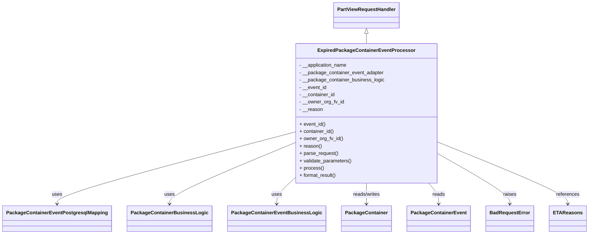

# Diagram: partview_core/partview_service/partview_service/core/business/package_container/event/ExpiredPackageContainerEventProcessor.py


> Auto-generated by Obscura crawlers

## Diagram 1



### SVG

<svg id="container" width="1817.40625" xmlns="http://www.w3.org/2000/svg" class="classDiagram" height="764" viewBox="0 0 1817.40625 764" role="graphics-document document" aria-roledescription="class"><style>#container{font-family:"trebuchet ms",verdana,arial,sans-serif;font-size:16px;fill:#333;}@keyframes edge-animation-frame{from{stroke-dashoffset:0;}}@keyframes dash{to{stroke-dashoffset:0;}}#container .edge-animation-slow{stroke-dasharray:9,5!important;stroke-dashoffset:900;animation:dash 50s linear infinite;stroke-linecap:round;}#container .edge-animation-fast{stroke-dasharray:9,5!important;stroke-dashoffset:900;animation:dash 20s linear infinite;stroke-linecap:round;}#container .error-icon{fill:#552222;}#container .error-text{fill:#552222;stroke:#552222;}#container .edge-thickness-normal{stroke-width:1px;}#container .edge-thickness-thick{stroke-width:3.5px;}#container .edge-pattern-solid{stroke-dasharray:0;}#container .edge-thickness-invisible{stroke-width:0;fill:none;}#container .edge-pattern-dashed{stroke-dasharray:3;}#container .edge-pattern-dotted{stroke-dasharray:2;}#container .marker{fill:#333333;stroke:#333333;}#container .marker.cross{stroke:#333333;}#container svg{font-family:"trebuchet ms",verdana,arial,sans-serif;font-size:16px;}#container p{margin:0;}#container g.classGroup text{fill:#9370DB;stroke:none;font-family:"trebuchet ms",verdana,arial,sans-serif;font-size:10px;}#container g.classGroup text .title{font-weight:bolder;}#container .nodeLabel,#container .edgeLabel{color:#131300;}#container .edgeLabel .label rect{fill:#ECECFF;}#container .label text{fill:#131300;}#container .labelBkg{background:#ECECFF;}#container .edgeLabel .label span{background:#ECECFF;}#container .classTitle{font-weight:bolder;}#container .node rect,#container .node circle,#container .node ellipse,#container .node polygon,#container .node path{fill:#ECECFF;stroke:#9370DB;stroke-width:1px;}#container .divider{stroke:#9370DB;stroke-width:1;}#container g.clickable{cursor:pointer;}#container g.classGroup rect{fill:#ECECFF;stroke:#9370DB;}#container g.classGroup line{stroke:#9370DB;stroke-width:1;}#container .classLabel .box{stroke:none;stroke-width:0;fill:#ECECFF;opacity:0.5;}#container .classLabel .label{fill:#9370DB;font-size:10px;}#container .relation{stroke:#333333;stroke-width:1;fill:none;}#container .dashed-line{stroke-dasharray:3;}#container .dotted-line{stroke-dasharray:1 2;}#container #compositionStart,#container .composition{fill:#333333!important;stroke:#333333!important;stroke-width:1;}#container #compositionEnd,#container .composition{fill:#333333!important;stroke:#333333!important;stroke-width:1;}#container #dependencyStart,#container .dependency{fill:#333333!important;stroke:#333333!important;stroke-width:1;}#container #dependencyStart,#container .dependency{fill:#333333!important;stroke:#333333!important;stroke-width:1;}#container #extensionStart,#container .extension{fill:transparent!important;stroke:#333333!important;stroke-width:1;}#container #extensionEnd,#container .extension{fill:transparent!important;stroke:#333333!important;stroke-width:1;}#container #aggregationStart,#container .aggregation{fill:transparent!important;stroke:#333333!important;stroke-width:1;}#container #aggregationEnd,#container .aggregation{fill:transparent!important;stroke:#333333!important;stroke-width:1;}#container #lollipopStart,#container .lollipop{fill:#ECECFF!important;stroke:#333333!important;stroke-width:1;}#container #lollipopEnd,#container .lollipop{fill:#ECECFF!important;stroke:#333333!important;stroke-width:1;}#container .edgeTerminals{font-size:11px;line-height:initial;}#container .classTitleText{text-anchor:middle;font-size:18px;fill:#333;}#container .label-icon{display:inline-block;height:1em;overflow:visible;vertical-align:-0.125em;}#container .node .label-icon path{fill:currentColor;stroke:revert;stroke-width:revert;}#container :root{--mermaid-font-family:"trebuchet ms",verdana,arial,sans-serif;}</style><g><defs><marker id="container_class-aggregationStart" class="marker aggregation class" refX="18" refY="7" markerWidth="190" markerHeight="240" orient="auto"><path d="M 18,7 L9,13 L1,7 L9,1 Z"></path></marker></defs><defs><marker id="container_class-aggregationEnd" class="marker aggregation class" refX="1" refY="7" markerWidth="20" markerHeight="28" orient="auto"><path d="M 18,7 L9,13 L1,7 L9,1 Z"></path></marker></defs><defs><marker id="container_class-extensionStart" class="marker extension class" refX="18" refY="7" markerWidth="190" markerHeight="240" orient="auto"><path d="M 1,7 L18,13 V 1 Z"></path></marker></defs><defs><marker id="container_class-extensionEnd" class="marker extension class" refX="1" refY="7" markerWidth="20" markerHeight="28" orient="auto"><path d="M 1,1 V 13 L18,7 Z"></path></marker></defs><defs><marker id="container_class-compositionStart" class="marker composition class" refX="18" refY="7" markerWidth="190" markerHeight="240" orient="auto"><path d="M 18,7 L9,13 L1,7 L9,1 Z"></path></marker></defs><defs><marker id="container_class-compositionEnd" class="marker composition class" refX="1" refY="7" markerWidth="20" markerHeight="28" orient="auto"><path d="M 18,7 L9,13 L1,7 L9,1 Z"></path></marker></defs><defs><marker id="container_class-dependencyStart" class="marker dependency class" refX="6" refY="7" markerWidth="190" markerHeight="240" orient="auto"><path d="M 5,7 L9,13 L1,7 L9,1 Z"></path></marker></defs><defs><marker id="container_class-dependencyEnd" class="marker dependency class" refX="13" refY="7" markerWidth="20" markerHeight="28" orient="auto"><path d="M 18,7 L9,13 L14,7 L9,1 Z"></path></marker></defs><defs><marker id="container_class-lollipopStart" class="marker lollipop class" refX="13" refY="7" markerWidth="190" markerHeight="240" orient="auto"><circle stroke="black" fill="transparent" cx="7" cy="7" r="6"></circle></marker></defs><defs><marker id="container_class-lollipopEnd" class="marker lollipop class" refX="1" refY="7" markerWidth="190" markerHeight="240" orient="auto"><circle stroke="black" fill="transparent" cx="7" cy="7" r="6"></circle></marker></defs><g class="root"><g class="clusters"></g><g class="edgePaths"><path d="M1127.438,109.25L1127.438,110.542C1127.438,111.833,1127.438,114.417,1127.438,119.875C1127.438,125.333,1127.438,133.667,1127.438,137.833L1127.438,142" id="id_PartViewRequestHandler_ExpiredPackageContainerEventProcessor_1" class="edge-thickness-normal edge-pattern-solid relation" style=";;;" data-edge="true" data-et="edge" data-id="id_PartViewRequestHandler_ExpiredPackageContainerEventProcessor_1" data-points="W3sieCI6MTEyNy40Mzc1LCJ5Ijo5Mn0seyJ4IjoxMTI3LjQzNzUsInkiOjExN30seyJ4IjoxMTI3LjQzNzUsInkiOjE0Mn1d" marker-start="url(#container_class-extensionStart)"></path><path d="M902.871,432.552L781.736,466.293C660.602,500.034,418.332,567.517,297.197,606.425C176.063,645.333,176.063,655.667,176.063,660.833L176.063,666" id="id_ExpiredPackageContainerEventProcessor_PackageContainerEventPostgresqlMapping_2" class="edge-thickness-normal edge-pattern-solid relation" style=";;;" data-edge="true" data-et="edge" data-id="id_ExpiredPackageContainerEventProcessor_PackageContainerEventPostgresqlMapping_2" data-points="W3sieCI6OTAyLjg3MTA5Mzc1LCJ5Ijo0MzIuNTUxNjcyNzQzMzk3N30seyJ4IjoxNzYuMDYyNSwieSI6NjM1fSx7IngiOjE3Ni4wNjI1LCJ5Ijo2NzJ9XQ==" marker-end="url(#container_class-dependencyEnd)"></path><path d="M902.871,468.453L839.557,496.211C776.242,523.969,649.613,579.484,586.299,612.409C522.984,645.333,522.984,655.667,522.984,660.833L522.984,666" id="id_ExpiredPackageContainerEventProcessor_PackageContainerBusinessLogic_3" class="edge-thickness-normal edge-pattern-solid relation" style=";;;" data-edge="true" data-et="edge" data-id="id_ExpiredPackageContainerEventProcessor_PackageContainerBusinessLogic_3" data-points="W3sieCI6OTAyLjg3MTA5Mzc1LCJ5Ijo0NjguNDUyNzkxNzc5NzU5Nn0seyJ4Ijo1MjIuOTg0Mzc1LCJ5Ijo2MzV9LHsieCI6NTIyLjk4NDM3NSwieSI6NjcyfV0=" marker-end="url(#container_class-dependencyEnd)"></path><path d="M902.871,585.208L894.212,593.507C885.552,601.805,868.233,618.403,859.574,631.868C850.914,645.333,850.914,655.667,850.914,660.833L850.914,666" id="id_ExpiredPackageContainerEventProcessor_PackageContainerEventBusinessLogic_4" class="edge-thickness-normal edge-pattern-solid relation" style=";;;" data-edge="true" data-et="edge" data-id="id_ExpiredPackageContainerEventProcessor_PackageContainerEventBusinessLogic_4" data-points="W3sieCI6OTAyLjg3MTA5Mzc1LCJ5Ijo1ODUuMjA4MTUwODY4NzY2OH0seyJ4Ijo4NTAuOTE0MDYyNSwieSI6NjM1fSx7IngiOjg1MC45MTQwNjI1LCJ5Ijo2NzJ9XQ==" marker-end="url(#container_class-dependencyEnd)"></path><path d="M1127.438,598L1127.438,604.167C1127.438,610.333,1127.438,622.667,1127.438,634C1127.438,645.333,1127.438,655.667,1127.438,660.833L1127.438,666" id="id_ExpiredPackageContainerEventProcessor_PackageContainer_5" class="edge-thickness-normal edge-pattern-solid relation" style=";;;" data-edge="true" data-et="edge" data-id="id_ExpiredPackageContainerEventProcessor_PackageContainer_5" data-points="W3sieCI6MTEyNy40Mzc1LCJ5Ijo1OTh9LHsieCI6MTEyNy40Mzc1LCJ5Ijo2MzV9LHsieCI6MTEyNy40Mzc1LCJ5Ijo2NzJ9XQ==" marker-end="url(#container_class-dependencyEnd)"></path><path d="M1321.117,598L1326.355,604.167C1331.593,610.333,1342.07,622.667,1347.308,634C1352.547,645.333,1352.547,655.667,1352.547,660.833L1352.547,666" id="id_ExpiredPackageContainerEventProcessor_PackageContainerEvent_6" class="edge-thickness-normal edge-pattern-solid relation" style=";;;" data-edge="true" data-et="edge" data-id="id_ExpiredPackageContainerEventProcessor_PackageContainerEvent_6" data-points="W3sieCI6MTMyMS4xMTY1MDk0MzM5NjIyLCJ5Ijo1OTh9LHsieCI6MTM1Mi41NDY4NzUsInkiOjYzNX0seyJ4IjoxMzUyLjU0Njg3NSwieSI6NjcyfV0=" marker-end="url(#container_class-dependencyEnd)"></path><path d="M1352.004,503.118L1389.084,525.099C1426.164,547.079,1500.324,591.039,1537.404,618.186C1574.484,645.333,1574.484,655.667,1574.484,660.833L1574.484,666" id="id_ExpiredPackageContainerEventProcessor_BadRequestError_7" class="edge-thickness-normal edge-pattern-solid relation" style=";;;" data-edge="true" data-et="edge" data-id="id_ExpiredPackageContainerEventProcessor_BadRequestError_7" data-points="W3sieCI6MTM1Mi4wMDM5MDYyNSwieSI6NTAzLjExODI0OTk3Mzc4NjN9LHsieCI6MTU3NC40ODQzNzUsInkiOjYzNX0seyJ4IjoxNTc0LjQ4NDM3NSwieSI6NjcyfV0=" marker-end="url(#container_class-dependencyEnd)"></path><path d="M1352.004,464.966L1419.018,493.305C1486.031,521.644,1620.059,578.322,1687.072,611.828C1754.086,645.333,1754.086,655.667,1754.086,660.833L1754.086,666" id="id_ExpiredPackageContainerEventProcessor_ETAReasons_8" class="edge-thickness-normal edge-pattern-solid relation" style=";;;" data-edge="true" data-et="edge" data-id="id_ExpiredPackageContainerEventProcessor_ETAReasons_8" data-points="W3sieCI6MTM1Mi4wMDM5MDYyNSwieSI6NDY0Ljk2NTY4NDI1Nzc3MDE0fSx7IngiOjE3NTQuMDg1OTM3NSwieSI6NjM1fSx7IngiOjE3NTQuMDg1OTM3NSwieSI6NjcyfV0=" marker-end="url(#container_class-dependencyEnd)"></path></g><g class="edgeLabels"><g class="edgeLabel"><g class="label" data-id="id_PartViewRequestHandler_ExpiredPackageContainerEventProcessor_1" transform="translate(0, 0)"><foreignObject width="0" height="0"><div xmlns="http://www.w3.org/1999/xhtml" class="labelBkg" style="display: table-cell; white-space: nowrap; line-height: 1.5; max-width: 200px; text-align: center;"><span class="edgeLabel"></span></div></foreignObject></g></g><g class="edgeLabel" transform="translate(176.0625, 635)"><g class="label" data-id="id_ExpiredPackageContainerEventProcessor_PackageContainerEventPostgresqlMapping_2" transform="translate(-16.4921875, -12)"><foreignObject width="32.984375" height="24"><div xmlns="http://www.w3.org/1999/xhtml" class="labelBkg" style="display: table-cell; white-space: nowrap; line-height: 1.5; max-width: 200px; text-align: center;"><span class="edgeLabel"><p>uses</p></span></div></foreignObject></g></g><g class="edgeLabel" transform="translate(522.984375, 635)"><g class="label" data-id="id_ExpiredPackageContainerEventProcessor_PackageContainerBusinessLogic_3" transform="translate(-16.4921875, -12)"><foreignObject width="32.984375" height="24"><div xmlns="http://www.w3.org/1999/xhtml" class="labelBkg" style="display: table-cell; white-space: nowrap; line-height: 1.5; max-width: 200px; text-align: center;"><span class="edgeLabel"><p>uses</p></span></div></foreignObject></g></g><g class="edgeLabel" transform="translate(850.9140625, 635)"><g class="label" data-id="id_ExpiredPackageContainerEventProcessor_PackageContainerEventBusinessLogic_4" transform="translate(-16.4921875, -12)"><foreignObject width="32.984375" height="24"><div xmlns="http://www.w3.org/1999/xhtml" class="labelBkg" style="display: table-cell; white-space: nowrap; line-height: 1.5; max-width: 200px; text-align: center;"><span class="edgeLabel"><p>uses</p></span></div></foreignObject></g></g><g class="edgeLabel" transform="translate(1127.4375, 635)"><g class="label" data-id="id_ExpiredPackageContainerEventProcessor_PackageContainer_5" transform="translate(-45.9453125, -12)"><foreignObject width="91.890625" height="24"><div xmlns="http://www.w3.org/1999/xhtml" class="labelBkg" style="display: table-cell; white-space: nowrap; line-height: 1.5; max-width: 200px; text-align: center;"><span class="edgeLabel"><p>reads/writes</p></span></div></foreignObject></g></g><g class="edgeLabel" transform="translate(1352.546875, 635)"><g class="label" data-id="id_ExpiredPackageContainerEventProcessor_PackageContainerEvent_6" transform="translate(-20.0078125, -12)"><foreignObject width="40.015625" height="24"><div xmlns="http://www.w3.org/1999/xhtml" class="labelBkg" style="display: table-cell; white-space: nowrap; line-height: 1.5; max-width: 200px; text-align: center;"><span class="edgeLabel"><p>reads</p></span></div></foreignObject></g></g><g class="edgeLabel" transform="translate(1574.484375, 635)"><g class="label" data-id="id_ExpiredPackageContainerEventProcessor_BadRequestError_7" transform="translate(-21.25, -12)"><foreignObject width="42.5" height="24"><div xmlns="http://www.w3.org/1999/xhtml" class="labelBkg" style="display: table-cell; white-space: nowrap; line-height: 1.5; max-width: 200px; text-align: center;"><span class="edgeLabel"><p>raises</p></span></div></foreignObject></g></g><g class="edgeLabel" transform="translate(1754.0859375, 635)"><g class="label" data-id="id_ExpiredPackageContainerEventProcessor_ETAReasons_8" transform="translate(-37.828125, -12)"><foreignObject width="75.65625" height="24"><div xmlns="http://www.w3.org/1999/xhtml" class="labelBkg" style="display: table-cell; white-space: nowrap; line-height: 1.5; max-width: 200px; text-align: center;"><span class="edgeLabel"><p>references</p></span></div></foreignObject></g></g></g><g class="nodes"><g class="node default" id="classId-ExpiredPackageContainerEventProcessor-0" transform="translate(1127.4375, 370)"><g class="basic label-container"><path d="M-224.56640625 -228 L224.56640625 -228 L224.56640625 228 L-224.56640625 228" stroke="none" stroke-width="0" fill="#ECECFF" style=""></path><path d="M-224.56640625 -228 C-98.68469607928104 -228, 27.19701409143792 -228, 224.56640625 -228 M-224.56640625 -228 C-116.28274224446405 -228, -7.999078238928092 -228, 224.56640625 -228 M224.56640625 -228 C224.56640625 -107.80495505912943, 224.56640625 12.390089881741147, 224.56640625 228 M224.56640625 -228 C224.56640625 -57.73764636502273, 224.56640625 112.52470726995455, 224.56640625 228 M224.56640625 228 C79.27807195467824 228, -66.01026234064352 228, -224.56640625 228 M224.56640625 228 C59.25955804362383 228, -106.04729016275235 228, -224.56640625 228 M-224.56640625 228 C-224.56640625 83.89253583908226, -224.56640625 -60.21492832183549, -224.56640625 -228 M-224.56640625 228 C-224.56640625 77.49696449981786, -224.56640625 -73.00607100036427, -224.56640625 -228" stroke="#9370DB" stroke-width="1.3" fill="none" stroke-dasharray="0 0" style=""></path></g><g class="annotation-group text" transform="translate(0, -204)"></g><g class="label-group text" transform="translate(-149.1015625, -204)"><g class="label" style="font-weight: bolder" transform="translate(0,-12)"><foreignObject width="298.203125" height="24"><div xmlns="http://www.w3.org/1999/xhtml" style="display: table-cell; white-space: nowrap; line-height: 1.5; max-width: 344px; text-align: center;"><span class="nodeLabel markdown-node-label" style=""><p>ExpiredPackageContainerEventProcessor</p></span></div></foreignObject></g></g><g class="members-group text" transform="translate(-212.56640625, -156)"><g class="label" style="" transform="translate(0,-12)"><foreignObject width="157.796875" height="24"><div xmlns="http://www.w3.org/1999/xhtml" style="display: table-cell; white-space: nowrap; line-height: 1.5; max-width: 215px; text-align: center;"><span class="nodeLabel markdown-node-label" style=""><p>- __application_name</p></span></div></foreignObject></g><g class="label" style="" transform="translate(0,12)"><foreignObject width="275" height="24"><div xmlns="http://www.w3.org/1999/xhtml" style="display: table-cell; white-space: nowrap; line-height: 1.5; max-width: 333px; text-align: center;"><span class="nodeLabel markdown-node-label" style=""><p>- __package_container_event_adapter</p></span></div></foreignObject></g><g class="label" style="" transform="translate(0,36)"><foreignObject width="276.03125" height="24"><div xmlns="http://www.w3.org/1999/xhtml" style="display: table-cell; white-space: nowrap; line-height: 1.5; max-width: 334px; text-align: center;"><span class="nodeLabel markdown-node-label" style=""><p>- __package_container_business_logic</p></span></div></foreignObject></g><g class="label" style="" transform="translate(0,60)"><foreignObject width="89.59375" height="24"><div xmlns="http://www.w3.org/1999/xhtml" style="display: table-cell; white-space: nowrap; line-height: 1.5; max-width: 147px; text-align: center;"><span class="nodeLabel markdown-node-label" style=""><p>- __event_id</p></span></div></foreignObject></g><g class="label" style="" transform="translate(0,84)"><foreignObject width="117.171875" height="24"><div xmlns="http://www.w3.org/1999/xhtml" style="display: table-cell; white-space: nowrap; line-height: 1.5; max-width: 175px; text-align: center;"><span class="nodeLabel markdown-node-label" style=""><p>- __container_id</p></span></div></foreignObject></g><g class="label" style="" transform="translate(0,108)"><foreignObject width="145.484375" height="24"><div xmlns="http://www.w3.org/1999/xhtml" style="display: table-cell; white-space: nowrap; line-height: 1.5; max-width: 203px; text-align: center;"><span class="nodeLabel markdown-node-label" style=""><p>- __owner_org_fv_id</p></span></div></foreignObject></g><g class="label" style="" transform="translate(0,132)"><foreignObject width="76.171875" height="24"><div xmlns="http://www.w3.org/1999/xhtml" style="display: table-cell; white-space: nowrap; line-height: 1.5; max-width: 134px; text-align: center;"><span class="nodeLabel markdown-node-label" style=""><p>- __reason</p></span></div></foreignObject></g></g><g class="methods-group text" transform="translate(-212.56640625, 36)"><g class="label" style="" transform="translate(0,-12)"><foreignObject width="85.34375" height="24"><div xmlns="http://www.w3.org/1999/xhtml" style="display: table-cell; white-space: nowrap; line-height: 1.5; max-width: 143px; text-align: center;"><span class="nodeLabel markdown-node-label" style=""><p>+ event_id()</p></span></div></foreignObject></g><g class="label" style="" transform="translate(0,12)"><foreignObject width="112.921875" height="24"><div xmlns="http://www.w3.org/1999/xhtml" style="display: table-cell; white-space: nowrap; line-height: 1.5; max-width: 170px; text-align: center;"><span class="nodeLabel markdown-node-label" style=""><p>+ container_id()</p></span></div></foreignObject></g><g class="label" style="" transform="translate(0,36)"><foreignObject width="141.21875" height="24"><div xmlns="http://www.w3.org/1999/xhtml" style="display: table-cell; white-space: nowrap; line-height: 1.5; max-width: 199px; text-align: center;"><span class="nodeLabel markdown-node-label" style=""><p>+ owner_org_fv_id()</p></span></div></foreignObject></g><g class="label" style="" transform="translate(0,60)"><foreignObject width="71.59375" height="24"><div xmlns="http://www.w3.org/1999/xhtml" style="display: table-cell; white-space: nowrap; line-height: 1.5; max-width: 129px; text-align: center;"><span class="nodeLabel markdown-node-label" style=""><p>+ reason()</p></span></div></foreignObject></g><g class="label" style="" transform="translate(0,84)"><foreignObject width="126.046875" height="24"><div xmlns="http://www.w3.org/1999/xhtml" style="display: table-cell; white-space: nowrap; line-height: 1.5; max-width: 183px; text-align: center;"><span class="nodeLabel markdown-node-label" style=""><p>+ parse_request()</p></span></div></foreignObject></g><g class="label" style="" transform="translate(0,108)"><foreignObject width="170.953125" height="24"><div xmlns="http://www.w3.org/1999/xhtml" style="display: table-cell; white-space: nowrap; line-height: 1.5; max-width: 228px; text-align: center;"><span class="nodeLabel markdown-node-label" style=""><p>+ validate_parameters()</p></span></div></foreignObject></g><g class="label" style="" transform="translate(0,132)"><foreignObject width="77.96875" height="24"><div xmlns="http://www.w3.org/1999/xhtml" style="display: table-cell; white-space: nowrap; line-height: 1.5; max-width: 135px; text-align: center;"><span class="nodeLabel markdown-node-label" style=""><p>+ process()</p></span></div></foreignObject></g><g class="label" style="" transform="translate(0,156)"><foreignObject width="121.5" height="24"><div xmlns="http://www.w3.org/1999/xhtml" style="display: table-cell; white-space: nowrap; line-height: 1.5; max-width: 179px; text-align: center;"><span class="nodeLabel markdown-node-label" style=""><p>+ format_result()</p></span></div></foreignObject></g></g><g class="divider" style=""><path d="M-224.56640625 -180 C-117.35035597647632 -180, -10.134305702952645 -180, 224.56640625 -180 M-224.56640625 -180 C-48.63647327414267 -180, 127.29345970171465 -180, 224.56640625 -180" stroke="#9370DB" stroke-width="1.3" fill="none" stroke-dasharray="0 0" style=""></path></g><g class="divider" style=""><path d="M-224.56640625 12 C-125.43594949080816 12, -26.30549273161631 12, 224.56640625 12 M-224.56640625 12 C-128.35584239637228 12, -32.14527854274456 12, 224.56640625 12" stroke="#9370DB" stroke-width="1.3" fill="none" stroke-dasharray="0 0" style=""></path></g></g><g class="node default" id="classId-PartViewRequestHandler-1" transform="translate(1127.4375, 50)"><g class="basic label-container"><path d="M-103.359375 -42 L103.359375 -42 L103.359375 42 L-103.359375 42" stroke="none" stroke-width="0" fill="#ECECFF" style=""></path><path d="M-103.359375 -42 C-23.649746203477477 -42, 56.059882593045046 -42, 103.359375 -42 M-103.359375 -42 C-41.53310816444199 -42, 20.293158671116018 -42, 103.359375 -42 M103.359375 -42 C103.359375 -10.090270305415661, 103.359375 21.819459389168678, 103.359375 42 M103.359375 -42 C103.359375 -21.80765624950086, 103.359375 -1.6153124990017176, 103.359375 42 M103.359375 42 C60.55582960322007 42, 17.752284206440137 42, -103.359375 42 M103.359375 42 C52.224716562174116 42, 1.0900581243482321 42, -103.359375 42 M-103.359375 42 C-103.359375 10.233031824934564, -103.359375 -21.533936350130872, -103.359375 -42 M-103.359375 42 C-103.359375 18.443627462492717, -103.359375 -5.1127450750145655, -103.359375 -42" stroke="#9370DB" stroke-width="1.3" fill="none" stroke-dasharray="0 0" style=""></path></g><g class="annotation-group text" transform="translate(0, -18)"></g><g class="label-group text" transform="translate(-91.359375, -18)"><g class="label" style="font-weight: bolder" transform="translate(0,-12)"><foreignObject width="182.71875" height="24"><div xmlns="http://www.w3.org/1999/xhtml" style="display: table-cell; white-space: nowrap; line-height: 1.5; max-width: 231px; text-align: center;"><span class="nodeLabel markdown-node-label" style=""><p>PartViewRequestHandler</p></span></div></foreignObject></g></g><g class="members-group text" transform="translate(-91.359375, 30)"></g><g class="methods-group text" transform="translate(-91.359375, 60)"></g><g class="divider" style=""><path d="M-103.359375 6 C-44.94547172452512 6, 13.46843155094976 6, 103.359375 6 M-103.359375 6 C-58.96546012041591 6, -14.571545240831824 6, 103.359375 6" stroke="#9370DB" stroke-width="1.3" fill="none" stroke-dasharray="0 0" style=""></path></g><g class="divider" style=""><path d="M-103.359375 24 C-60.347079303438484 24, -17.334783606876968 24, 103.359375 24 M-103.359375 24 C-52.19951014426516 24, -1.0396452885303233 24, 103.359375 24" stroke="#9370DB" stroke-width="1.3" fill="none" stroke-dasharray="0 0" style=""></path></g></g><g class="node default" id="classId-PackageContainerEventPostgresqlMapping-2" transform="translate(176.0625, 714)"><g class="basic label-container"><path d="M-168.0625 -42 L168.0625 -42 L168.0625 42 L-168.0625 42" stroke="none" stroke-width="0" fill="#ECECFF" style=""></path><path d="M-168.0625 -42 C-53.26092321695053 -42, 61.54065356609894 -42, 168.0625 -42 M-168.0625 -42 C-36.96457384613362 -42, 94.13335230773276 -42, 168.0625 -42 M168.0625 -42 C168.0625 -14.93252970528933, 168.0625 12.13494058942134, 168.0625 42 M168.0625 -42 C168.0625 -23.35605727799555, 168.0625 -4.7121145559911, 168.0625 42 M168.0625 42 C87.19241809153792 42, 6.322336183075834 42, -168.0625 42 M168.0625 42 C84.36282046501472 42, 0.6631409300294422 42, -168.0625 42 M-168.0625 42 C-168.0625 10.188676893042217, -168.0625 -21.622646213915566, -168.0625 -42 M-168.0625 42 C-168.0625 16.75728496429351, -168.0625 -8.485430071412978, -168.0625 -42" stroke="#9370DB" stroke-width="1.3" fill="none" stroke-dasharray="0 0" style=""></path></g><g class="annotation-group text" transform="translate(0, -18)"></g><g class="label-group text" transform="translate(-156.0625, -18)"><g class="label" style="font-weight: bolder" transform="translate(0,-12)"><foreignObject width="312.125" height="24"><div xmlns="http://www.w3.org/1999/xhtml" style="display: table-cell; white-space: nowrap; line-height: 1.5; max-width: 357px; text-align: center;"><span class="nodeLabel markdown-node-label" style=""><p>PackageContainerEventPostgresqlMapping</p></span></div></foreignObject></g></g><g class="members-group text" transform="translate(-156.0625, 30)"></g><g class="methods-group text" transform="translate(-156.0625, 60)"></g><g class="divider" style=""><path d="M-168.0625 6 C-60.93575188074574 6, 46.19099623850852 6, 168.0625 6 M-168.0625 6 C-98.96435813390225 6, -29.866216267804504 6, 168.0625 6" stroke="#9370DB" stroke-width="1.3" fill="none" stroke-dasharray="0 0" style=""></path></g><g class="divider" style=""><path d="M-168.0625 24 C-51.487871980273354 24, 65.08675603945329 24, 168.0625 24 M-168.0625 24 C-68.67660395252877 24, 30.70929209494247 24, 168.0625 24" stroke="#9370DB" stroke-width="1.3" fill="none" stroke-dasharray="0 0" style=""></path></g></g><g class="node default" id="classId-PackageContainerBusinessLogic-3" transform="translate(522.984375, 714)"><g class="basic label-container"><path d="M-128.859375 -42 L128.859375 -42 L128.859375 42 L-128.859375 42" stroke="none" stroke-width="0" fill="#ECECFF" style=""></path><path d="M-128.859375 -42 C-57.350127083114984 -42, 14.159120833770032 -42, 128.859375 -42 M-128.859375 -42 C-44.958911463208764 -42, 38.94155207358247 -42, 128.859375 -42 M128.859375 -42 C128.859375 -9.581178588476902, 128.859375 22.837642823046195, 128.859375 42 M128.859375 -42 C128.859375 -13.850802657946346, 128.859375 14.298394684107308, 128.859375 42 M128.859375 42 C56.77170706112594 42, -15.315960877748125 42, -128.859375 42 M128.859375 42 C43.70280926468999 42, -41.45375647062002 42, -128.859375 42 M-128.859375 42 C-128.859375 24.085213180836416, -128.859375 6.170426361672831, -128.859375 -42 M-128.859375 42 C-128.859375 24.072709894573915, -128.859375 6.14541978914783, -128.859375 -42" stroke="#9370DB" stroke-width="1.3" fill="none" stroke-dasharray="0 0" style=""></path></g><g class="annotation-group text" transform="translate(0, -18)"></g><g class="label-group text" transform="translate(-116.859375, -18)"><g class="label" style="font-weight: bolder" transform="translate(0,-12)"><foreignObject width="233.71875" height="24"><div xmlns="http://www.w3.org/1999/xhtml" style="display: table-cell; white-space: nowrap; line-height: 1.5; max-width: 280px; text-align: center;"><span class="nodeLabel markdown-node-label" style=""><p>PackageContainerBusinessLogic</p></span></div></foreignObject></g></g><g class="members-group text" transform="translate(-116.859375, 30)"></g><g class="methods-group text" transform="translate(-116.859375, 60)"></g><g class="divider" style=""><path d="M-128.859375 6 C-63.84932008348191 6, 1.160734833036173 6, 128.859375 6 M-128.859375 6 C-73.76740890091304 6, -18.67544280182608 6, 128.859375 6" stroke="#9370DB" stroke-width="1.3" fill="none" stroke-dasharray="0 0" style=""></path></g><g class="divider" style=""><path d="M-128.859375 24 C-43.816915414821466 24, 41.22554417035707 24, 128.859375 24 M-128.859375 24 C-61.99873190871374 24, 4.861911182572527 24, 128.859375 24" stroke="#9370DB" stroke-width="1.3" fill="none" stroke-dasharray="0 0" style=""></path></g></g><g class="node default" id="classId-PackageContainerEventBusinessLogic-4" transform="translate(850.9140625, 714)"><g class="basic label-container"><path d="M-149.0703125 -42 L149.0703125 -42 L149.0703125 42 L-149.0703125 42" stroke="none" stroke-width="0" fill="#ECECFF" style=""></path><path d="M-149.0703125 -42 C-58.83374063652748 -42, 31.40283122694504 -42, 149.0703125 -42 M-149.0703125 -42 C-52.890324456736735 -42, 43.28966358652653 -42, 149.0703125 -42 M149.0703125 -42 C149.0703125 -10.711394877462634, 149.0703125 20.57721024507473, 149.0703125 42 M149.0703125 -42 C149.0703125 -23.261468093403128, 149.0703125 -4.522936186806255, 149.0703125 42 M149.0703125 42 C43.04158411045782 42, -62.98714427908436 42, -149.0703125 42 M149.0703125 42 C64.97623803398218 42, -19.11783643203563 42, -149.0703125 42 M-149.0703125 42 C-149.0703125 16.886188885326817, -149.0703125 -8.227622229346366, -149.0703125 -42 M-149.0703125 42 C-149.0703125 20.909101771806725, -149.0703125 -0.18179645638655018, -149.0703125 -42" stroke="#9370DB" stroke-width="1.3" fill="none" stroke-dasharray="0 0" style=""></path></g><g class="annotation-group text" transform="translate(0, -18)"></g><g class="label-group text" transform="translate(-137.0703125, -18)"><g class="label" style="font-weight: bolder" transform="translate(0,-12)"><foreignObject width="274.140625" height="24"><div xmlns="http://www.w3.org/1999/xhtml" style="display: table-cell; white-space: nowrap; line-height: 1.5; max-width: 320px; text-align: center;"><span class="nodeLabel markdown-node-label" style=""><p>PackageContainerEventBusinessLogic</p></span></div></foreignObject></g></g><g class="members-group text" transform="translate(-137.0703125, 30)"></g><g class="methods-group text" transform="translate(-137.0703125, 60)"></g><g class="divider" style=""><path d="M-149.0703125 6 C-81.22462259389992 6, -13.378932687799846 6, 149.0703125 6 M-149.0703125 6 C-59.98516633533829 6, 29.099979829323416 6, 149.0703125 6" stroke="#9370DB" stroke-width="1.3" fill="none" stroke-dasharray="0 0" style=""></path></g><g class="divider" style=""><path d="M-149.0703125 24 C-85.58011471009841 24, -22.089916920196828 24, 149.0703125 24 M-149.0703125 24 C-33.235894073344966 24, 82.59852435331007 24, 149.0703125 24" stroke="#9370DB" stroke-width="1.3" fill="none" stroke-dasharray="0 0" style=""></path></g></g><g class="node default" id="classId-PackageContainer-5" transform="translate(1127.4375, 714)"><g class="basic label-container"><path d="M-77.453125 -42 L77.453125 -42 L77.453125 42 L-77.453125 42" stroke="none" stroke-width="0" fill="#ECECFF" style=""></path><path d="M-77.453125 -42 C-23.121086117505172 -42, 31.210952764989656 -42, 77.453125 -42 M-77.453125 -42 C-44.57485611837428 -42, -11.696587236748556 -42, 77.453125 -42 M77.453125 -42 C77.453125 -12.06310493482679, 77.453125 17.87379013034642, 77.453125 42 M77.453125 -42 C77.453125 -22.038139417161513, 77.453125 -2.076278834323027, 77.453125 42 M77.453125 42 C43.206492014844514 42, 8.959859029689028 42, -77.453125 42 M77.453125 42 C36.39243920833408 42, -4.668246583331836 42, -77.453125 42 M-77.453125 42 C-77.453125 14.745699339930564, -77.453125 -12.508601320138872, -77.453125 -42 M-77.453125 42 C-77.453125 19.425155244465017, -77.453125 -3.1496895110699654, -77.453125 -42" stroke="#9370DB" stroke-width="1.3" fill="none" stroke-dasharray="0 0" style=""></path></g><g class="annotation-group text" transform="translate(0, -18)"></g><g class="label-group text" transform="translate(-65.453125, -18)"><g class="label" style="font-weight: bolder" transform="translate(0,-12)"><foreignObject width="130.90625" height="24"><div xmlns="http://www.w3.org/1999/xhtml" style="display: table-cell; white-space: nowrap; line-height: 1.5; max-width: 179px; text-align: center;"><span class="nodeLabel markdown-node-label" style=""><p>PackageContainer</p></span></div></foreignObject></g></g><g class="members-group text" transform="translate(-65.453125, 30)"></g><g class="methods-group text" transform="translate(-65.453125, 60)"></g><g class="divider" style=""><path d="M-77.453125 6 C-42.610863561649985 6, -7.768602123299971 6, 77.453125 6 M-77.453125 6 C-31.492332955567186 6, 14.468459088865629 6, 77.453125 6" stroke="#9370DB" stroke-width="1.3" fill="none" stroke-dasharray="0 0" style=""></path></g><g class="divider" style=""><path d="M-77.453125 24 C-38.85215348148504 24, -0.25118196297007955 24, 77.453125 24 M-77.453125 24 C-39.383264683285915 24, -1.313404366571831 24, 77.453125 24" stroke="#9370DB" stroke-width="1.3" fill="none" stroke-dasharray="0 0" style=""></path></g></g><g class="node default" id="classId-PackageContainerEvent-6" transform="translate(1352.546875, 714)"><g class="basic label-container"><path d="M-97.65625 -42 L97.65625 -42 L97.65625 42 L-97.65625 42" stroke="none" stroke-width="0" fill="#ECECFF" style=""></path><path d="M-97.65625 -42 C-48.393078943824506 -42, 0.8700921123509886 -42, 97.65625 -42 M-97.65625 -42 C-36.275448378196245 -42, 25.10535324360751 -42, 97.65625 -42 M97.65625 -42 C97.65625 -12.43430386000178, 97.65625 17.13139227999644, 97.65625 42 M97.65625 -42 C97.65625 -11.903873153387483, 97.65625 18.192253693225034, 97.65625 42 M97.65625 42 C41.68664713840315 42, -14.282955723193695 42, -97.65625 42 M97.65625 42 C22.9815473285787 42, -51.6931553428426 42, -97.65625 42 M-97.65625 42 C-97.65625 20.082562367710516, -97.65625 -1.8348752645789688, -97.65625 -42 M-97.65625 42 C-97.65625 15.922420872558046, -97.65625 -10.155158254883908, -97.65625 -42" stroke="#9370DB" stroke-width="1.3" fill="none" stroke-dasharray="0 0" style=""></path></g><g class="annotation-group text" transform="translate(0, -18)"></g><g class="label-group text" transform="translate(-85.65625, -18)"><g class="label" style="font-weight: bolder" transform="translate(0,-12)"><foreignObject width="171.3125" height="24"><div xmlns="http://www.w3.org/1999/xhtml" style="display: table-cell; white-space: nowrap; line-height: 1.5; max-width: 219px; text-align: center;"><span class="nodeLabel markdown-node-label" style=""><p>PackageContainerEvent</p></span></div></foreignObject></g></g><g class="members-group text" transform="translate(-85.65625, 30)"></g><g class="methods-group text" transform="translate(-85.65625, 60)"></g><g class="divider" style=""><path d="M-97.65625 6 C-22.456266366107428 6, 52.743717267785144 6, 97.65625 6 M-97.65625 6 C-24.219021729946164 6, 49.21820654010767 6, 97.65625 6" stroke="#9370DB" stroke-width="1.3" fill="none" stroke-dasharray="0 0" style=""></path></g><g class="divider" style=""><path d="M-97.65625 24 C-21.95929621660956 24, 53.73765756678088 24, 97.65625 24 M-97.65625 24 C-29.61417743497327 24, 38.42789513005346 24, 97.65625 24" stroke="#9370DB" stroke-width="1.3" fill="none" stroke-dasharray="0 0" style=""></path></g></g><g class="node default" id="classId-BadRequestError-7" transform="translate(1574.484375, 714)"><g class="basic label-container"><path d="M-74.28125 -42 L74.28125 -42 L74.28125 42 L-74.28125 42" stroke="none" stroke-width="0" fill="#ECECFF" style=""></path><path d="M-74.28125 -42 C-37.1821072717781 -42, -0.08296454355620142 -42, 74.28125 -42 M-74.28125 -42 C-31.749750751507683 -42, 10.781748496984633 -42, 74.28125 -42 M74.28125 -42 C74.28125 -20.874437895174037, 74.28125 0.25112420965192683, 74.28125 42 M74.28125 -42 C74.28125 -19.283363940343563, 74.28125 3.433272119312875, 74.28125 42 M74.28125 42 C15.025617795248287 42, -44.230014409503426 42, -74.28125 42 M74.28125 42 C21.682786867748206 42, -30.91567626450359 42, -74.28125 42 M-74.28125 42 C-74.28125 10.168176497778525, -74.28125 -21.66364700444295, -74.28125 -42 M-74.28125 42 C-74.28125 9.44848630731616, -74.28125 -23.10302738536768, -74.28125 -42" stroke="#9370DB" stroke-width="1.3" fill="none" stroke-dasharray="0 0" style=""></path></g><g class="annotation-group text" transform="translate(0, -18)"></g><g class="label-group text" transform="translate(-62.28125, -18)"><g class="label" style="font-weight: bolder" transform="translate(0,-12)"><foreignObject width="124.5625" height="24"><div xmlns="http://www.w3.org/1999/xhtml" style="display: table-cell; white-space: nowrap; line-height: 1.5; max-width: 174px; text-align: center;"><span class="nodeLabel markdown-node-label" style=""><p>BadRequestError</p></span></div></foreignObject></g></g><g class="members-group text" transform="translate(-62.28125, 30)"></g><g class="methods-group text" transform="translate(-62.28125, 60)"></g><g class="divider" style=""><path d="M-74.28125 6 C-35.99453835234309 6, 2.292173295313816 6, 74.28125 6 M-74.28125 6 C-31.210824709357887 6, 11.859600581284226 6, 74.28125 6" stroke="#9370DB" stroke-width="1.3" fill="none" stroke-dasharray="0 0" style=""></path></g><g class="divider" style=""><path d="M-74.28125 24 C-21.85865093853608 24, 30.56394812292784 24, 74.28125 24 M-74.28125 24 C-27.905783634781933 24, 18.469682730436134 24, 74.28125 24" stroke="#9370DB" stroke-width="1.3" fill="none" stroke-dasharray="0 0" style=""></path></g></g><g class="node default" id="classId-ETAReasons-8" transform="translate(1754.0859375, 714)"><g class="basic label-container"><path d="M-55.3203125 -42 L55.3203125 -42 L55.3203125 42 L-55.3203125 42" stroke="none" stroke-width="0" fill="#ECECFF" style=""></path><path d="M-55.3203125 -42 C-23.39673876162374 -42, 8.526834976752518 -42, 55.3203125 -42 M-55.3203125 -42 C-29.418274753707124 -42, -3.5162370074142473 -42, 55.3203125 -42 M55.3203125 -42 C55.3203125 -17.878678634816186, 55.3203125 6.242642730367628, 55.3203125 42 M55.3203125 -42 C55.3203125 -24.6212602845503, 55.3203125 -7.2425205691005985, 55.3203125 42 M55.3203125 42 C12.034850882221953 42, -31.250610735556094 42, -55.3203125 42 M55.3203125 42 C26.961305640034123 42, -1.3977012199317542 42, -55.3203125 42 M-55.3203125 42 C-55.3203125 19.513684424235503, -55.3203125 -2.9726311515289936, -55.3203125 -42 M-55.3203125 42 C-55.3203125 15.334863033386199, -55.3203125 -11.330273933227602, -55.3203125 -42" stroke="#9370DB" stroke-width="1.3" fill="none" stroke-dasharray="0 0" style=""></path></g><g class="annotation-group text" transform="translate(0, -18)"></g><g class="label-group text" transform="translate(-43.3203125, -18)"><g class="label" style="font-weight: bolder" transform="translate(0,-12)"><foreignObject width="86.640625" height="24"><div xmlns="http://www.w3.org/1999/xhtml" style="display: table-cell; white-space: nowrap; line-height: 1.5; max-width: 135px; text-align: center;"><span class="nodeLabel markdown-node-label" style=""><p>ETAReasons</p></span></div></foreignObject></g></g><g class="members-group text" transform="translate(-43.3203125, 30)"></g><g class="methods-group text" transform="translate(-43.3203125, 60)"></g><g class="divider" style=""><path d="M-55.3203125 6 C-14.737777042703556 6, 25.84475841459289 6, 55.3203125 6 M-55.3203125 6 C-25.87525142633346 6, 3.5698096473330807 6, 55.3203125 6" stroke="#9370DB" stroke-width="1.3" fill="none" stroke-dasharray="0 0" style=""></path></g><g class="divider" style=""><path d="M-55.3203125 24 C-25.4695688911123 24, 4.3811747177754015 24, 55.3203125 24 M-55.3203125 24 C-21.24984372379116 24, 12.820625052417682 24, 55.3203125 24" stroke="#9370DB" stroke-width="1.3" fill="none" stroke-dasharray="0 0" style=""></path></g></g></g></g></g></svg>

## Diagram 2

```mermaid
flowchart LR
    A[Start: Incoming Event] --> B{Body is dict?}
    B -- No --> C[Raise BadRequestError: Invalid Request Body] --> Z[End]
    B -- Yes --> D[Extract OrganizationFvId/owner_org_fv_id, ContainerId/container_id, EventId/event_id, Reason]
    D --> E{OwnerOrgFvId and ContainerId present?}
    E -- No --> F[Raise BadRequestError: Missing required parameters] --> Z
    E -- Yes --> G[Instantiate PackageContainerEventBusinessLogic]
    G --> H{Reason in [ETA_EXPIRED, NEXT_ETA]?}
    H -- Yes --> I[set_is_reprocessing()]
    H -- No --> J[skip reprocessing flag]
    I --> K[Read package_container by container_id]
    J --> K
    K --> L{package_container found?}
    L -- No --> M[Return formatted result: empty dict + status code] --> Z
    L -- Yes --> N{event_id present?}
    N -- Yes --> O[Read package_container_event by event_id]
    N -- No --> O2[package_container_event = None]
    O --> P{package_container_event matches last_milestone_id or last_event_id?}
    O2 --> P
    P -- Yes --> Q[generate_eta(package_container, package_container_event, reason, is_eta_refresh=True)]
    P -- No --> R[skip generate_eta]
    Q --> S[set_delayed_or_in_route(package_container, package_container_event)]
    R --> S
    S --> T[persist_container(package_container)]
    T --> M
```

> SVG rendering failed for this diagram.
