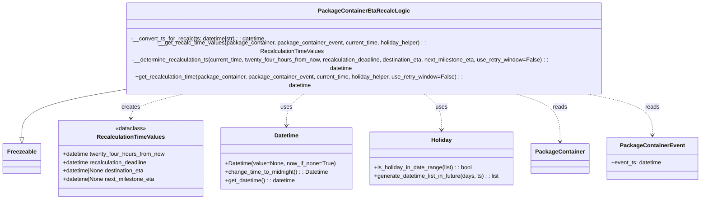
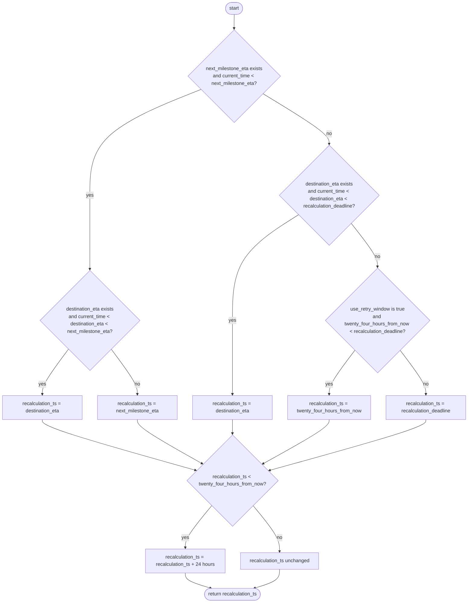

# Diagram: partview_core/partview_service/partview_service/core/business/package_container/event/PackageContainerEtaRecalcLogic.py

> Auto-generated by Obscura crawlers

## Diagram 1

> SVG rendering failed for this diagram.

## Diagram 2

### SVG

<svg id="container" width="1531.25" xmlns="http://www.w3.org/2000/svg" class="flowchart" height="1969.765625" viewBox="0 0 1531.25 1969.765625" role="graphics-document document" aria-roledescription="flowchart-v2"><g><marker id="container_flowchart-v2-pointEnd" class="marker flowchart-v2" viewBox="0 0 10 10" refX="5" refY="5" markerUnits="userSpaceOnUse" markerWidth="8" markerHeight="8" orient="auto"><path d="M 0 0 L 10 5 L 0 10 z" class="arrowMarkerPath" style="stroke-width: 1; stroke-dasharray: 1, 0;"></path></marker><marker id="container_flowchart-v2-pointStart" class="marker flowchart-v2" viewBox="0 0 10 10" refX="4.5" refY="5" markerUnits="userSpaceOnUse" markerWidth="8" markerHeight="8" orient="auto"><path d="M 0 5 L 10 10 L 10 0 z" class="arrowMarkerPath" style="stroke-width: 1; stroke-dasharray: 1, 0;"></path></marker><marker id="container_flowchart-v2-circleEnd" class="marker flowchart-v2" viewBox="0 0 10 10" refX="11" refY="5" markerUnits="userSpaceOnUse" markerWidth="11" markerHeight="11" orient="auto"><circle cx="5" cy="5" r="5" class="arrowMarkerPath" style="stroke-width: 1; stroke-dasharray: 1, 0;"></circle></marker><marker id="container_flowchart-v2-circleStart" class="marker flowchart-v2" viewBox="0 0 10 10" refX="-1" refY="5" markerUnits="userSpaceOnUse" markerWidth="11" markerHeight="11" orient="auto"><circle cx="5" cy="5" r="5" class="arrowMarkerPath" style="stroke-width: 1; stroke-dasharray: 1, 0;"></circle></marker><marker id="container_flowchart-v2-crossEnd" class="marker cross flowchart-v2" viewBox="0 0 11 11" refX="12" refY="5.2" markerUnits="userSpaceOnUse" markerWidth="11" markerHeight="11" orient="auto"><path d="M 1,1 l 9,9 M 10,1 l -9,9" class="arrowMarkerPath" style="stroke-width: 2; stroke-dasharray: 1, 0;"></path></marker><marker id="container_flowchart-v2-crossStart" class="marker cross flowchart-v2" viewBox="0 0 11 11" refX="-1" refY="5.2" markerUnits="userSpaceOnUse" markerWidth="11" markerHeight="11" orient="auto"><path d="M 1,1 l 9,9 M 10,1 l -9,9" class="arrowMarkerPath" style="stroke-width: 2; stroke-dasharray: 1, 0;"></path></marker><g class="root"><g class="clusters"></g><g class="edgePaths"><path d="M766.125,47.5L766.042,51.583C765.958,55.667,765.792,63.833,765.708,71.417C765.625,79,765.625,86,765.625,89.5L765.625,93" id="L_Start_C1_0" class="edge-thickness-normal edge-pattern-solid edge-thickness-normal edge-pattern-solid flowchart-link" style=";" data-edge="true" data-et="edge" data-id="L_Start_C1_0" data-points="W3sieCI6NzY2LjEyNSwieSI6NDcuNX0seyJ4Ijo3NjUuNjI1LCJ5Ijo3Mn0seyJ4Ijo3NjUuNjI1LCJ5Ijo5N31d" marker-end="url(#container_flowchart-v2-pointEnd)"></path><path d="M657.596,290.971L596.83,315.143C536.064,339.314,414.532,387.657,353.766,445.162C293,502.667,293,569.333,293,636C293,702.667,293,769.333,293,809.79C293,850.247,293,864.495,293,871.618L293,878.742" id="L_C1_C2_0" class="edge-thickness-normal edge-pattern-solid edge-thickness-normal edge-pattern-solid flowchart-link" style=";" data-edge="true" data-et="edge" data-id="L_C1_C2_0" data-points="W3sieCI6NjU3LjU5NjQyODU3MTQyODUsInkiOjI5MC45NzE0Mjg1NzE0Mjg2fSx7IngiOjI5MywieSI6NDM2fSx7IngiOjI5MywieSI6NjM2fSx7IngiOjI5MywieSI6ODM2fSx7IngiOjI5MywieSI6ODgyLjc0MjE4NzV9XQ==" marker-end="url(#container_flowchart-v2-pointEnd)"></path><path d="M223.732,1139.474L209.443,1158.809C195.155,1178.144,166.577,1216.814,152.289,1241.649C138,1266.484,138,1277.484,138,1282.984L138,1288.484" id="L_C2_A_0" class="edge-thickness-normal edge-pattern-solid edge-thickness-normal edge-pattern-solid flowchart-link" style=";" data-edge="true" data-et="edge" data-id="L_C2_A_0" data-points="W3sieCI6MjIzLjczMTg5NTM4ODQzNzksInkiOjExMzkuNDc0MDgyODg4NDM3OH0seyJ4IjoxMzgsInkiOjEyNTUuNDg0Mzc1fSx7IngiOjEzOCwieSI6MTI5Mi40ODQzNzV9XQ==" marker-end="url(#container_flowchart-v2-pointEnd)"></path><path d="M362.268,1139.474L376.557,1158.809C390.845,1178.144,419.423,1216.814,433.711,1241.649C448,1266.484,448,1277.484,448,1282.984L448,1288.484" id="L_C2_B_0" class="edge-thickness-normal edge-pattern-solid edge-thickness-normal edge-pattern-solid flowchart-link" style=";" data-edge="true" data-et="edge" data-id="L_C2_B_0" data-points="W3sieCI6MzYyLjI2ODEwNDYxMTU2MjEsInkiOjExMzkuNDc0MDgyODg4NDM3OH0seyJ4Ijo0NDgsInkiOjEyNTUuNDg0Mzc1fSx7IngiOjQ0OCwieSI6MTI5Mi40ODQzNzV9XQ==" marker-end="url(#container_flowchart-v2-pointEnd)"></path><path d="M859.621,305.004L895.622,326.837C931.622,348.669,1003.624,392.335,1039.624,419.667C1075.625,447,1075.625,458,1075.625,463.5L1075.625,469" id="L_C1_C3_0" class="edge-thickness-normal edge-pattern-solid edge-thickness-normal edge-pattern-solid flowchart-link" style=";" data-edge="true" data-et="edge" data-id="L_C1_C3_0" data-points="W3sieCI6ODU5LjYyMDk4MzkzNTc0MywieSI6MzA1LjAwNDAxNjA2NDI1NzAzfSx7IngiOjEwNzUuNjI1LCJ5Ijo0MzZ9LHsieCI6MTA3NS42MjUsInkiOjQ3M31d" marker-end="url(#container_flowchart-v2-pointEnd)"></path><path d="M975.605,698.98L939.337,721.817C903.07,744.653,830.535,790.327,794.267,848.12C758,905.914,758,975.828,758,1045.742C758,1115.656,758,1185.57,758,1226.027C758,1266.484,758,1277.484,758,1282.984L758,1288.484" id="L_C3_D_0" class="edge-thickness-normal edge-pattern-solid edge-thickness-normal edge-pattern-solid flowchart-link" style=";" data-edge="true" data-et="edge" data-id="L_C3_D_0" data-points="W3sieCI6OTc1LjYwNDk1NjUzMjIzODYsInkiOjY5OC45Nzk5NTY1MzIyMzg2fSx7IngiOjc1OCwieSI6ODM2fSx7IngiOjc1OCwieSI6MTA0NS43NDIxODc1fSx7IngiOjc1OCwieSI6MTI1NS40ODQzNzV9LHsieCI6NzU4LCJ5IjoxMjkyLjQ4NDM3NX1d" marker-end="url(#container_flowchart-v2-pointEnd)"></path><path d="M1147.77,726.855L1162.214,745.046C1176.659,763.237,1205.548,799.618,1219.993,823.309C1234.438,847,1234.438,858,1234.438,863.5L1234.438,869" id="L_C3_C4_0" class="edge-thickness-normal edge-pattern-solid edge-thickness-normal edge-pattern-solid flowchart-link" style=";" data-edge="true" data-et="edge" data-id="L_C3_C4_0" data-points="W3sieCI6MTE0Ny43Njk3NDgzMDE2ODk2LCJ5Ijo3MjYuODU1MjUxNjk4MzEwNH0seyJ4IjoxMjM0LjQzNzUsInkiOjgzNn0seyJ4IjoxMjM0LjQzNzUsInkiOjg3M31d" marker-end="url(#container_flowchart-v2-pointEnd)"></path><path d="M1160.002,1144.049L1145.939,1162.621C1131.876,1181.194,1103.751,1218.339,1089.688,1242.412C1075.625,1266.484,1075.625,1277.484,1075.625,1282.984L1075.625,1288.484" id="L_C4_E_0" class="edge-thickness-normal edge-pattern-solid edge-thickness-normal edge-pattern-solid flowchart-link" style=";" data-edge="true" data-et="edge" data-id="L_C4_E_0" data-points="W3sieCI6MTE2MC4wMDE4MjAzNDk3NjE2LCJ5IjoxMTQ0LjA0ODY5NTM0OTc2MTZ9LHsieCI6MTA3NS42MjUsInkiOjEyNTUuNDg0Mzc1fSx7IngiOjEwNzUuNjI1LCJ5IjoxMjkyLjQ4NDM3NX1d" marker-end="url(#container_flowchart-v2-pointEnd)"></path><path d="M1308.873,1144.049L1322.936,1162.621C1336.999,1181.194,1365.124,1218.339,1379.187,1242.412C1393.25,1266.484,1393.25,1277.484,1393.25,1282.984L1393.25,1288.484" id="L_C4_F_0" class="edge-thickness-normal edge-pattern-solid edge-thickness-normal edge-pattern-solid flowchart-link" style=";" data-edge="true" data-et="edge" data-id="L_C4_F_0" data-points="W3sieCI6MTMwOC44NzMxNzk2NTAyMzg0LCJ5IjoxMTQ0LjA0ODY5NTM0OTc2MTZ9LHsieCI6MTM5My4yNSwieSI6MTI1NS40ODQzNzV9LHsieCI6MTM5My4yNSwieSI6MTI5Mi40ODQzNzV9XQ==" marker-end="url(#container_flowchart-v2-pointEnd)"></path><path d="M138,1370.484L138,1374.651C138,1378.818,138,1387.151,221.18,1414.815C304.36,1442.479,470.72,1489.473,553.9,1512.97L637.081,1536.467" id="L_A_Adjust_0" class="edge-thickness-normal edge-pattern-solid edge-thickness-normal edge-pattern-solid flowchart-link" style=";" data-edge="true" data-et="edge" data-id="L_A_Adjust_0" data-points="W3sieCI6MTM4LCJ5IjoxMzcwLjQ4NDM3NX0seyJ4IjoxMzgsInkiOjEzOTUuNDg0Mzc1fSx7IngiOjY0MC45Mjk5MDYyNjY1ODAyLCJ5IjoxNTM3LjU1NDQ2ODczMzQxOTh9XQ==" marker-end="url(#container_flowchart-v2-pointEnd)"></path><path d="M448,1370.484L448,1374.651C448,1378.818,448,1387.151,483.097,1411.146C518.193,1435.141,588.386,1474.798,623.483,1494.627L658.579,1514.455" id="L_B_Adjust_0" class="edge-thickness-normal edge-pattern-solid edge-thickness-normal edge-pattern-solid flowchart-link" style=";" data-edge="true" data-et="edge" data-id="L_B_Adjust_0" data-points="W3sieCI6NDQ4LCJ5IjoxMzcwLjQ4NDM3NX0seyJ4Ijo0NDgsInkiOjEzOTUuNDg0Mzc1fSx7IngiOjY2Mi4wNjE2NDQ0OTc0MDczLCJ5IjoxNTE2LjQyMjczMDUwMjU5Mjd9XQ==" marker-end="url(#container_flowchart-v2-pointEnd)"></path><path d="M758,1370.484L758,1374.651C758,1378.818,758,1387.151,758,1394.818C758,1402.484,758,1409.484,758,1412.984L758,1416.484" id="L_D_Adjust_0" class="edge-thickness-normal edge-pattern-solid edge-thickness-normal edge-pattern-solid flowchart-link" style=";" data-edge="true" data-et="edge" data-id="L_D_Adjust_0" data-points="W3sieCI6NzU4LCJ5IjoxMzcwLjQ4NDM3NX0seyJ4Ijo3NTgsInkiOjEzOTUuNDg0Mzc1fSx7IngiOjc1OCwieSI6MTQyMC40ODQzNzV9XQ==" marker-end="url(#container_flowchart-v2-pointEnd)"></path><path d="M1075.625,1370.484L1075.625,1374.651C1075.625,1378.818,1075.625,1387.151,1039.401,1411.292C1003.177,1435.433,930.728,1475.381,894.504,1495.356L858.28,1515.33" id="L_E_Adjust_0" class="edge-thickness-normal edge-pattern-solid edge-thickness-normal edge-pattern-solid flowchart-link" style=";" data-edge="true" data-et="edge" data-id="L_E_Adjust_0" data-points="W3sieCI6MTA3NS42MjUsInkiOjEzNzAuNDg0Mzc1fSx7IngiOjEwNzUuNjI1LCJ5IjoxMzk1LjQ4NDM3NX0seyJ4Ijo4NTQuNzc3MDc1MzQwMDc2NywieSI6MTUxNy4yNjE0NTAzNDAwNzY2fV0=" marker-end="url(#container_flowchart-v2-pointEnd)"></path><path d="M1393.25,1370.484L1393.25,1374.651C1393.25,1378.818,1393.25,1387.151,1307.633,1414.923C1222.016,1442.694,1050.782,1489.904,965.165,1513.509L879.549,1537.114" id="L_F_Adjust_0" class="edge-thickness-normal edge-pattern-solid edge-thickness-normal edge-pattern-solid flowchart-link" style=";" data-edge="true" data-et="edge" data-id="L_F_Adjust_0" data-points="W3sieCI6MTM5My4yNSwieSI6MTM3MC40ODQzNzV9LHsieCI6MTM5My4yNSwieSI6MTM5NS40ODQzNzV9LHsieCI6ODc1LjY5MjQxNzgxNTQ4MjUsInkiOjE1MzguMTc2NzkyODE1NDgyNX1d" marker-end="url(#container_flowchart-v2-pointEnd)"></path><path d="M689.993,1652.759L675.502,1670.26C661.011,1687.761,632.029,1722.763,617.538,1745.764C603.047,1768.766,603.047,1779.766,603.047,1785.266L603.047,1790.766" id="L_Adjust_G_0" class="edge-thickness-normal edge-pattern-solid edge-thickness-normal edge-pattern-solid flowchart-link" style=";" data-edge="true" data-et="edge" data-id="L_Adjust_G_0" data-points="W3sieCI6Njg5Ljk5MzAzMTA1MzAyODIsInkiOjE2NTIuNzU4NjU2MDUzMDI4M30seyJ4Ijo2MDMuMDQ2ODc1LCJ5IjoxNzU3Ljc2NTYyNX0seyJ4Ijo2MDMuMDQ2ODc1LCJ5IjoxNzk0Ljc2NTYyNX1d" marker-end="url(#container_flowchart-v2-pointEnd)"></path><path d="M826.007,1652.759L840.498,1670.26C854.989,1687.761,883.971,1722.763,898.462,1747.764C912.953,1772.766,912.953,1787.766,912.953,1795.266L912.953,1802.766" id="L_Adjust_H_0" class="edge-thickness-normal edge-pattern-solid edge-thickness-normal edge-pattern-solid flowchart-link" style=";" data-edge="true" data-et="edge" data-id="L_Adjust_H_0" data-points="W3sieCI6ODI2LjAwNjk2ODk0Njk3MTgsInkiOjE2NTIuNzU4NjU2MDUzMDI4M30seyJ4Ijo5MTIuOTUzMTI1LCJ5IjoxNzU3Ljc2NTYyNX0seyJ4Ijo5MTIuOTUzMTI1LCJ5IjoxODA2Ljc2NTYyNX1d" marker-end="url(#container_flowchart-v2-pointEnd)"></path><path d="M603.047,1872.766L603.047,1876.932C603.047,1881.099,603.047,1889.432,616.999,1897.663C630.951,1905.893,658.855,1914.02,672.807,1918.084L686.759,1922.147" id="L_G_End_0" class="edge-thickness-normal edge-pattern-solid edge-thickness-normal edge-pattern-solid flowchart-link" style=";" data-edge="true" data-et="edge" data-id="L_G_End_0" data-points="W3sieCI6NjAzLjA0Njg3NSwieSI6MTg3Mi43NjU2MjV9LHsieCI6NjAzLjA0Njg3NSwieSI6MTg5Ny43NjU2MjV9LHsieCI6NjkwLjU5OTE5MjQxNTczMDQsInkiOjE5MjMuMjY1NjI1fV0=" marker-end="url(#container_flowchart-v2-pointEnd)"></path><path d="M912.953,1860.766L912.953,1866.932C912.953,1873.099,912.953,1885.432,899.167,1895.661C885.381,1905.889,857.81,1914.012,844.024,1918.074L830.238,1922.135" id="L_H_End_0" class="edge-thickness-normal edge-pattern-solid edge-thickness-normal edge-pattern-solid flowchart-link" style=";" data-edge="true" data-et="edge" data-id="L_H_End_0" data-points="W3sieCI6OTEyLjk1MzEyNSwieSI6MTg2MC43NjU2MjV9LHsieCI6OTEyLjk1MzEyNSwieSI6MTg5Ny43NjU2MjV9LHsieCI6ODI2LjQwMDgwNzU4NDI2OTYsInkiOjE5MjMuMjY1NjI1fV0=" marker-end="url(#container_flowchart-v2-pointEnd)"></path></g><g class="edgeLabels"><g class="edgeLabel"><g class="label" data-id="L_Start_C1_0" transform="translate(0, 0)"><foreignObject width="0" height="0">

</foreignObject></g></g><g class="edgeLabel" transform="translate(293, 636)"><g class="label" data-id="L_C1_C2_0" transform="translate(-12.0078125, -12)"><foreignObject width="24.015625" height="24">

yes

</foreignObject></g></g><g class="edgeLabel" transform="translate(138, 1255.484375)"><g class="label" data-id="L_C2_A_0" transform="translate(-12.0078125, -12)"><foreignObject width="24.015625" height="24">

yes

</foreignObject></g></g><g class="edgeLabel" transform="translate(448, 1255.484375)"><g class="label" data-id="L_C2_B_0" transform="translate(-9.3671875, -12)"><foreignObject width="18.734375" height="24">

no

</foreignObject></g></g><g class="edgeLabel" transform="translate(1075.625, 436)"><g class="label" data-id="L_C1_C3_0" transform="translate(-9.3671875, -12)"><foreignObject width="18.734375" height="24">

no

</foreignObject></g></g><g class="edgeLabel" transform="translate(758, 1045.7421875)"><g class="label" data-id="L_C3_D_0" transform="translate(-12.0078125, -12)"><foreignObject width="24.015625" height="24">

yes

</foreignObject></g></g><g class="edgeLabel" transform="translate(1234.4375, 836)"><g class="label" data-id="L_C3_C4_0" transform="translate(-9.3671875, -12)"><foreignObject width="18.734375" height="24">

no

</foreignObject></g></g><g class="edgeLabel" transform="translate(1075.625, 1255.484375)"><g class="label" data-id="L_C4_E_0" transform="translate(-12.0078125, -12)"><foreignObject width="24.015625" height="24">

yes

</foreignObject></g></g><g class="edgeLabel" transform="translate(1393.25, 1255.484375)"><g class="label" data-id="L_C4_F_0" transform="translate(-9.3671875, -12)"><foreignObject width="18.734375" height="24">

no

</foreignObject></g></g><g class="edgeLabel"><g class="label" data-id="L_A_Adjust_0" transform="translate(0, 0)"><foreignObject width="0" height="0">

</foreignObject></g></g><g class="edgeLabel"><g class="label" data-id="L_B_Adjust_0" transform="translate(0, 0)"><foreignObject width="0" height="0">

</foreignObject></g></g><g class="edgeLabel"><g class="label" data-id="L_D_Adjust_0" transform="translate(0, 0)"><foreignObject width="0" height="0">

</foreignObject></g></g><g class="edgeLabel"><g class="label" data-id="L_E_Adjust_0" transform="translate(0, 0)"><foreignObject width="0" height="0">

</foreignObject></g></g><g class="edgeLabel"><g class="label" data-id="L_F_Adjust_0" transform="translate(0, 0)"><foreignObject width="0" height="0">

</foreignObject></g></g><g class="edgeLabel" transform="translate(603.046875, 1757.765625)"><g class="label" data-id="L_Adjust_G_0" transform="translate(-12.0078125, -12)"><foreignObject width="24.015625" height="24">

yes

</foreignObject></g></g><g class="edgeLabel" transform="translate(912.953125, 1757.765625)"><g class="label" data-id="L_Adjust_H_0" transform="translate(-9.3671875, -12)"><foreignObject width="18.734375" height="24">

no

</foreignObject></g></g><g class="edgeLabel"><g class="label" data-id="L_G_End_0" transform="translate(0, 0)"><foreignObject width="0" height="0">

</foreignObject></g></g><g class="edgeLabel"><g class="label" data-id="L_H_End_0" transform="translate(0, 0)"><foreignObject width="0" height="0">

</foreignObject></g></g></g><g class="nodes"><g class="node default" id="flowchart-Start-0" transform="translate(765.625, 27.5)"><g class="basic label-container outer-path"><path d="M-9.7734375 -19.5 C-2.5467686683557007 -19.5, 4.679900163288599 -19.5, 9.7734375 -19.5 C9.7734375 -19.5, 9.773437499999998 -19.5, 9.773437499999998 -19.5 C10.069842296951409 -19.490494875078706, 10.36624709390282 -19.480989750157413, 11.0228067896239 -19.45993515863156 C11.37353996780264 -19.426100350751017, 11.724273145981382 -19.392265542870472, 12.267042152847864 -19.3399052695533 C12.758192123076427 -19.260499951291653, 13.24934209330499 -19.181094633030003, 13.501030759676757 -19.140403561325776 C13.959602916418595 -19.035737459012434, 14.418175073160432 -18.931071356699093, 14.71970188623539 -18.862249829261074 C14.995577700056856 -18.78037133582056, 15.27145351387832 -18.69849284238005, 15.918047751460602 -18.50658706670804 C16.26124013914403 -18.380289095604883, 16.60443252682746 -18.253991124501727, 17.091144095147794 -18.074876768247425 C17.405070158320793 -17.935911012366535, 17.71899622149379 -17.79694525648565, 18.23417041279238 -17.568892924097174 C18.531638250128925 -17.41370414389594, 18.829106087465465 -17.258515363694713, 19.342429764076783 -16.990714730406097 C19.673132112294837 -16.790241023493596, 20.00383446051289 -16.589767316581096, 20.411368073605697 -16.342718045390892 C20.797671673979906 -16.07324937658318, 21.18397527435411 -15.803780707775472, 21.436592844578712 -15.627565626425154 C21.684418205892854 -15.429931495686958, 21.932243567207 -15.232297364948762, 22.41389120850187 -14.848196188198123 C22.783600549085744 -14.512435947052966, 23.153309889669618 -14.176675705907806, 23.339247236767985 -14.007812326905688 C23.615170098980748 -13.722899317982721, 23.89109296119351 -13.437986309059754, 24.208858442968648 -13.10986736009568 C24.398231178565638 -12.88741936924954, 24.58760391416263 -12.6649713784034, 25.019151408126582 -12.158051136245305 C25.252195968367825 -11.845792656318235, 25.48524052860907 -11.533534176391166, 25.766796464640635 -11.156274872382312 C26.03450820016278 -10.744997755953667, 26.302219935684924 -10.333720639525023, 26.448721378604247 -10.108655082055241 C26.639849950652476 -9.769286948517028, 26.830978522700708 -9.429918814978814, 27.0621239742735 -9.019496659696287 C27.18102472089214 -8.772596715274256, 27.29992546751078 -8.525696770852226, 27.60448364880834 -7.893275190886684 C27.789931432788197 -7.435215579067448, 27.975379216768054 -6.977155967248211, 28.073571729970325 -6.734618561215508 C28.17055340992318 -6.442525193129793, 28.267535089876038 -6.150431825044078, 28.46746063421488 -5.548287939305138 C28.56968317463844 -5.158469089140841, 28.671905715062 -4.768650238976543, 28.78453178754556 -4.339158212148133 C28.857772385968396 -3.9630832186528417, 28.931012984391227 -3.5870082251575504, 29.023482276581777 -3.1121979531509023 C29.077004255987244 -2.697092049992382, 29.13052623539271 -2.2819861468338614, 29.183330202509367 -1.872449005199798 C29.208791579056218 -1.4758675134293637, 29.23425295560307 -1.0792860216589295, 29.263418715913414 -0.6250057626472757 C29.263418715913414 -0.2047214210062822, 29.263418715913414 0.21556292063471127, 29.263418715913414 0.625005762647271 C29.235912652531738 1.053434902311631, 29.208406589150062 1.481864041975991, 29.183330202509367 1.8724490051997846 C29.11940478421522 2.368241925987527, 29.055479365921073 2.8640348467752696, 29.023482276581777 3.1121979531508885 C28.930701225147573 3.5886090429833626, 28.83792017371337 4.065020132815836, 28.78453178754556 4.339158212148129 C28.69951320929167 4.663370898315115, 28.61449463103778 4.987583584482103, 28.467460634214884 5.548287939305125 C28.323660810472873 5.981390097025573, 28.179860986730866 6.414492254746021, 28.07357172997033 6.734618561215495 C27.92890940115203 7.0919373102525505, 27.784247072333734 7.449256059289607, 27.604483648808344 7.893275190886679 C27.48788806633374 8.135388412641015, 27.37129248385913 8.377501634395351, 27.062123974273504 9.019496659696284 C26.903693889940733 9.30080531721478, 26.74526380560796 9.582113974733275, 26.44872137860425 10.108655082055236 C26.19902762672551 10.49225173710155, 25.94933387484677 10.875848392147862, 25.76679646464064 11.156274872382301 C25.552302546348308 11.443677182096081, 25.337808628055974 11.731079491809862, 25.019151408126582 12.158051136245302 C24.728667850160132 12.499269652415387, 24.438184292193682 12.840488168585473, 24.20885844296866 13.10986736009567 C23.869451253744568 13.460333148818012, 23.530044064520478 13.810798937540355, 23.33924723676799 14.007812326905684 C23.145641245217675 14.183640165897847, 22.952035253667365 14.359468004890012, 22.413891208501887 14.848196188198111 C22.15306241685763 15.056200208588761, 21.892233625213372 15.26420422897941, 21.436592844578715 15.627565626425152 C21.194343500667106 15.796548281932811, 20.952094156755496 15.96553093744047, 20.411368073605708 16.34271804539089 C20.11658654605415 16.521416339721185, 19.82180501850259 16.70011463405148, 19.342429764076787 16.990714730406093 C19.093825560121154 17.120411384371153, 18.845221356165524 17.250108038336215, 18.234170412792388 17.56889292409717 C17.829273864207813 17.748128615326195, 17.424377315623236 17.927364306555216, 17.091144095147804 18.07487676824742 C16.764273956943274 18.195168000661123, 16.437403818738744 18.315459233074822, 15.918047751460616 18.506587066708033 C15.580547238593685 18.606755447350597, 15.243046725726751 18.70692382799316, 14.719701886235413 18.86224982926107 C14.352711674931866 18.946012950156167, 13.985721463628318 19.029776071051263, 13.501030759676766 19.140403561325773 C13.144003557751347 19.198124950545772, 12.78697635582593 19.25584633976577, 12.267042152847878 19.3399052695533 C11.926736893567611 19.37273410863911, 11.586431634287342 19.405562947724928, 11.0228067896239 19.45993515863156 C10.716500737527173 19.469757797533738, 10.410194685430447 19.47958043643592, 9.773437500000004 19.5 C9.773437500000002 19.5, 9.773437500000002 19.5, 9.7734375 19.5 C3.8375891634544903 19.5, -2.0982591730910194 19.5, -9.773437499999996 19.5 C-10.04666224426694 19.491238214251062, -10.319886988533886 19.482476428502125, -11.022806789623893 19.45993515863156 C-11.366363330057734 19.4267926723631, -11.709919870491573 19.393650186094636, -12.267042152847871 19.3399052695533 C-12.690572538611256 19.27143216131027, -13.114102924374642 19.202959053067243, -13.501030759676759 19.140403561325773 C-13.75647399607971 19.082100309539697, -14.011917232482661 19.023797057753626, -14.719701886235388 18.862249829261074 C-15.037727067937082 18.767861624680258, -15.355752249638776 18.673473420099437, -15.918047751460593 18.506587066708043 C-16.244326093755273 18.386513620659667, -16.57060443604995 18.266440174611294, -17.091144095147797 18.074876768247425 C-17.374323522627087 17.9495216359216, -17.657502950106377 17.824166503595773, -18.23417041279238 17.568892924097174 C-18.655219994278443 17.349231627131022, -19.076269575764506 17.12957033016487, -19.34242976407678 16.990714730406097 C-19.759135980342137 16.73810497326849, -20.175842196607498 16.48549521613089, -20.411368073605686 16.3427180453909 C-20.674858912712615 16.158918242364493, -20.938349751819548 15.975118439338088, -21.436592844578712 15.627565626425156 C-21.71844036479427 15.402799729330754, -22.000287885009826 15.178033832236352, -22.41389120850187 14.848196188198125 C-22.685472452370416 14.60155328816266, -22.957053696238965 14.354910388127198, -23.339247236767974 14.007812326905697 C-23.668280709811654 13.668058251837568, -23.997314182855334 13.32830417676944, -24.208858442968655 13.109867360095677 C-24.47763527107519 12.794146803966964, -24.74641209918173 12.47842624783825, -25.01915140812658 12.158051136245307 C-25.233845706249255 11.870380335813849, -25.44854000437193 11.582709535382389, -25.766796464640635 11.156274872382316 C-25.991992692533195 10.810312992685045, -26.21718892042575 10.464351112987776, -26.448721378604244 10.108655082055249 C-26.592721127617974 9.852968946125612, -26.736720876631704 9.597282810195978, -27.0621239742735 9.019496659696289 C-27.2457158832671 8.638264132433523, -27.429307792260694 8.257031605170758, -27.60448364880834 7.893275190886686 C-27.709010227012158 7.63509252183935, -27.813536805215975 7.3769098527920125, -28.073571729970325 6.73461856121551 C-28.203893892792067 6.342108970813255, -28.334216055613812 5.9495993804110014, -28.46746063421488 5.5482879393051325 C-28.548605146646285 5.238848745150043, -28.629749659077685 4.929409550994954, -28.784531787545557 4.339158212148136 C-28.85273788588806 3.9889343125233667, -28.92094398423057 3.638710412898598, -29.023482276581777 3.112197953150904 C-29.077565750963444 2.6927372058367007, -29.13164922534511 2.2732764585224974, -29.183330202509364 1.872449005199809 C-29.202275793096867 1.577356139194007, -29.221221383684366 1.2822632731882049, -29.263418715913414 0.6250057626472781 C-29.263418715913414 0.27725942703743944, -29.263418715913414 -0.07048690857239925, -29.263418715913414 -0.6250057626472687 C-29.240345582154397 -0.9843884452423324, -29.217272448395377 -1.343771127837396, -29.183330202509367 -1.8724490051997822 C-29.133212946787967 -2.26114854380343, -29.083095691066564 -2.649848082407078, -29.023482276581777 -3.112197953150895 C-28.969355176806456 -3.3901291707305905, -28.91522807703113 -3.668060388310286, -28.78453178754556 -4.339158212148126 C-28.668519610896137 -4.781562921707798, -28.55250743424671 -5.22396763126747, -28.467460634214884 -5.548287939305123 C-28.324902192177905 -5.977651253117336, -28.182343750140927 -6.407014566929549, -28.073571729970332 -6.734618561215485 C-27.96282171902642 -7.008173229452748, -27.852071708082505 -7.2817278976900095, -27.604483648808344 -7.893275190886676 C-27.43880469157679 -8.23731109053979, -27.273125734345236 -8.581346990192907, -27.062123974273504 -9.019496659696282 C-26.866441211738145 -9.366951219606188, -26.670758449202786 -9.714405779516094, -26.448721378604247 -10.108655082055243 C-26.228576332376168 -10.44685699028368, -26.008431286148085 -10.785058898512116, -25.76679646464064 -11.156274872382308 C-25.58558890744119 -11.399076490681509, -25.40438135024173 -11.641878108980707, -25.019151408126586 -12.158051136245302 C-24.786149297975783 -12.431748673024089, -24.553147187824983 -12.705446209802878, -24.208858442968662 -13.10986736009567 C-24.02937677026231 -13.295196922884356, -23.849895097555954 -13.48052648567304, -23.339247236767996 -14.007812326905677 C-23.014962806199016 -14.302318866652568, -22.690678375630032 -14.596825406399459, -22.413891208501887 -14.848196188198107 C-22.097119854866236 -15.100812913082798, -21.780348501230584 -15.353429637967489, -21.43659284457872 -15.627565626425149 C-21.183359892183464 -15.804209971738251, -20.930126939788206 -15.980854317051353, -20.41136807360571 -16.342718045390885 C-20.018544281105566 -16.580850136893318, -19.625720488605417 -16.818982228395747, -19.34242976407679 -16.99071473040609 C-18.92036241485915 -17.210906996145894, -18.498295065641507 -17.4310992618857, -18.234170412792388 -17.56889292409717 C-18.002423631845108 -17.671480349498527, -17.77067685089783 -17.774067774899883, -17.091144095147804 -18.07487676824742 C-16.83292214853014 -18.16990483158023, -16.57470020191248 -18.264932894913034, -15.918047751460618 -18.506587066708033 C-15.633827143206647 -18.590942251333395, -15.349606534952676 -18.675297435958758, -14.719701886235413 -18.862249829261067 C-14.241185391240041 -18.97146809663181, -13.762668896244671 -19.08068636400255, -13.501030759676768 -19.140403561325773 C-13.168044409810575 -19.194238212024427, -12.835058059944382 -19.248072862723085, -12.26704215284788 -19.3399052695533 C-11.875676984338703 -19.3776597966739, -11.484311815829527 -19.4154143237945, -11.022806789623903 -19.45993515863156 C-10.61645452774781 -19.472966084753228, -10.210102265871717 -19.4859970108749, -9.773437500000005 -19.5 C-9.773437500000004 -19.5, -9.773437500000002 -19.5, -9.7734375 -19.5" stroke="none" stroke-width="0" fill="#ECECFF" style=""></path><path d="M-9.7734375 -19.5 C-2.6114549947869223 -19.5, 4.550527510426155 -19.5, 9.7734375 -19.5 M-9.7734375 -19.5 C-4.275602003919919 -19.5, 1.2222334921601625 -19.5, 9.7734375 -19.5 M9.7734375 -19.5 C9.7734375 -19.5, 9.773437499999998 -19.5, 9.773437499999998 -19.5 M9.7734375 -19.5 C9.7734375 -19.5, 9.7734375 -19.5, 9.773437499999998 -19.5 M9.773437499999998 -19.5 C10.086335016862325 -19.489965985652294, 10.39923253372465 -19.47993197130459, 11.0228067896239 -19.45993515863156 M9.773437499999998 -19.5 C10.229079229385816 -19.485388456591423, 10.684720958771635 -19.470776913182842, 11.0228067896239 -19.45993515863156 M11.0228067896239 -19.45993515863156 C11.331102644433978 -19.430194228298042, 11.639398499244054 -19.40045329796453, 12.267042152847864 -19.3399052695533 M11.0228067896239 -19.45993515863156 C11.411344870051192 -19.422453357298146, 11.799882950478485 -19.384971555964732, 12.267042152847864 -19.3399052695533 M12.267042152847864 -19.3399052695533 C12.574447771462637 -19.29020631310184, 12.88185339007741 -19.24050735665038, 13.501030759676757 -19.140403561325776 M12.267042152847864 -19.3399052695533 C12.625461736697932 -19.281958770821806, 12.983881320547999 -19.224012272090313, 13.501030759676757 -19.140403561325776 M13.501030759676757 -19.140403561325776 C13.814098226095037 -19.068947955071945, 14.127165692513316 -18.997492348818117, 14.71970188623539 -18.862249829261074 M13.501030759676757 -19.140403561325776 C13.927387958409314 -19.043090312955805, 14.35374515714187 -18.945777064585833, 14.71970188623539 -18.862249829261074 M14.71970188623539 -18.862249829261074 C15.144718742912001 -18.736107057158463, 15.569735599588611 -18.609964285055852, 15.918047751460602 -18.50658706670804 M14.71970188623539 -18.862249829261074 C15.155386663971587 -18.732940874185037, 15.591071441707786 -18.603631919109002, 15.918047751460602 -18.50658706670804 M15.918047751460602 -18.50658706670804 C16.218553476942553 -18.395998181886206, 16.519059202424504 -18.285409297064373, 17.091144095147794 -18.074876768247425 M15.918047751460602 -18.50658706670804 C16.260814747648855 -18.380445643607384, 16.603581743837104 -18.25430422050673, 17.091144095147794 -18.074876768247425 M17.091144095147794 -18.074876768247425 C17.374102042354448 -17.949619678668316, 17.657059989561105 -17.82436258908921, 18.23417041279238 -17.568892924097174 M17.091144095147794 -18.074876768247425 C17.396858898454983 -17.93954589353076, 17.702573701762173 -17.804215018814098, 18.23417041279238 -17.568892924097174 M18.23417041279238 -17.568892924097174 C18.521891441940433 -17.41878904748475, 18.80961247108849 -17.268685170872324, 19.342429764076783 -16.990714730406097 M18.23417041279238 -17.568892924097174 C18.60416308002252 -17.375867986594823, 18.974155747252663 -17.182843049092472, 19.342429764076783 -16.990714730406097 M19.342429764076783 -16.990714730406097 C19.718378849239357 -16.76281218565849, 20.09432793440193 -16.53490964091088, 20.411368073605697 -16.342718045390892 M19.342429764076783 -16.990714730406097 C19.68534019434624 -16.78284041241138, 20.028250624615698 -16.57496609441667, 20.411368073605697 -16.342718045390892 M20.411368073605697 -16.342718045390892 C20.799000208241058 -16.07232264859392, 21.18663234287642 -15.801927251796954, 21.436592844578712 -15.627565626425154 M20.411368073605697 -16.342718045390892 C20.675875043679557 -16.15820943338956, 20.940382013753414 -15.97370082138822, 21.436592844578712 -15.627565626425154 M21.436592844578712 -15.627565626425154 C21.778859234868783 -15.354617288259984, 22.121125625158854 -15.081668950094812, 22.41389120850187 -14.848196188198123 M21.436592844578712 -15.627565626425154 C21.671960582462862 -15.439866118861094, 21.907328320347013 -15.252166611297035, 22.41389120850187 -14.848196188198123 M22.41389120850187 -14.848196188198123 C22.679646143449013 -14.606844587769393, 22.945401078396156 -14.365492987340664, 23.339247236767985 -14.007812326905688 M22.41389120850187 -14.848196188198123 C22.63984155787684 -14.642994059214418, 22.865791907251808 -14.437791930230714, 23.339247236767985 -14.007812326905688 M23.339247236767985 -14.007812326905688 C23.61161634106822 -13.726568864796356, 23.883985445368456 -13.445325402687024, 24.208858442968648 -13.10986736009568 M23.339247236767985 -14.007812326905688 C23.62775926925358 -13.709899966085919, 23.916271301739176 -13.41198760526615, 24.208858442968648 -13.10986736009568 M24.208858442968648 -13.10986736009568 C24.49097413926204 -12.778478210391588, 24.77308983555543 -12.447089060687498, 25.019151408126582 -12.158051136245305 M24.208858442968648 -13.10986736009568 C24.446993988316898 -12.830139798233237, 24.685129533665144 -12.550412236370793, 25.019151408126582 -12.158051136245305 M25.019151408126582 -12.158051136245305 C25.300811720929556 -11.780651976871685, 25.582472033732532 -11.403252817498064, 25.766796464640635 -11.156274872382312 M25.019151408126582 -12.158051136245305 C25.20232460915488 -11.912615734289293, 25.385497810183175 -11.667180332333281, 25.766796464640635 -11.156274872382312 M25.766796464640635 -11.156274872382312 C25.906519997443127 -10.941622004975692, 26.046243530245615 -10.72696913756907, 26.448721378604247 -10.108655082055241 M25.766796464640635 -11.156274872382312 C25.95372735305796 -10.86909882980138, 26.140658241475286 -10.581922787220451, 26.448721378604247 -10.108655082055241 M26.448721378604247 -10.108655082055241 C26.658688195459764 -9.735837737282553, 26.86865501231528 -9.363020392509865, 27.0621239742735 -9.019496659696287 M26.448721378604247 -10.108655082055241 C26.687984360885466 -9.68381942901079, 26.927247343166684 -9.258983775966337, 27.0621239742735 -9.019496659696287 M27.0621239742735 -9.019496659696287 C27.208852640972705 -8.714811443804862, 27.355581307671905 -8.410126227913437, 27.60448364880834 -7.893275190886684 M27.0621239742735 -9.019496659696287 C27.203423418922508 -8.726085339558832, 27.34472286357152 -8.432674019421377, 27.60448364880834 -7.893275190886684 M27.60448364880834 -7.893275190886684 C27.743257699121433 -7.550500603599605, 27.882031749434528 -7.2077260163125265, 28.073571729970325 -6.734618561215508 M27.60448364880834 -7.893275190886684 C27.727251922962783 -7.590035180162103, 27.850020197117225 -7.286795169437522, 28.073571729970325 -6.734618561215508 M28.073571729970325 -6.734618561215508 C28.20711956027653 -6.332393774290372, 28.340667390582738 -5.930168987365237, 28.46746063421488 -5.548287939305138 M28.073571729970325 -6.734618561215508 C28.16655175333177 -6.45457754520573, 28.259531776693215 -6.174536529195952, 28.46746063421488 -5.548287939305138 M28.46746063421488 -5.548287939305138 C28.572001055236512 -5.149630005844582, 28.676541476258144 -4.750972072384026, 28.78453178754556 -4.339158212148133 M28.46746063421488 -5.548287939305138 C28.540936909821095 -5.268091055599352, 28.61441318542731 -4.987894171893567, 28.78453178754556 -4.339158212148133 M28.78453178754556 -4.339158212148133 C28.84980701362247 -4.003983722167116, 28.91508223969938 -3.668809232186099, 29.023482276581777 -3.1121979531509023 M28.78453178754556 -4.339158212148133 C28.856006874372962 -3.972148747554378, 28.927481961200364 -3.6051392829606237, 29.023482276581777 -3.1121979531509023 M29.023482276581777 -3.1121979531509023 C29.056480219213682 -2.856272426278664, 29.089478161845584 -2.6003468994064263, 29.183330202509367 -1.872449005199798 M29.023482276581777 -3.1121979531509023 C29.057815268674165 -2.8459180462984803, 29.092148260766553 -2.5796381394460584, 29.183330202509367 -1.872449005199798 M29.183330202509367 -1.872449005199798 C29.212501526995734 -1.4180820796552966, 29.241672851482104 -0.9637151541107956, 29.263418715913414 -0.6250057626472757 M29.183330202509367 -1.872449005199798 C29.209007124155082 -1.4725102245296826, 29.234684045800794 -1.0725714438595675, 29.263418715913414 -0.6250057626472757 M29.263418715913414 -0.6250057626472757 C29.263418715913414 -0.16436205888973043, 29.263418715913414 0.29628164486781483, 29.263418715913414 0.625005762647271 M29.263418715913414 -0.6250057626472757 C29.263418715913414 -0.3378833755029852, 29.263418715913414 -0.05076098835869469, 29.263418715913414 0.625005762647271 M29.263418715913414 0.625005762647271 C29.24477474843105 0.9154006053248052, 29.226130780948683 1.2057954480023392, 29.183330202509367 1.8724490051997846 M29.263418715913414 0.625005762647271 C29.23664355638535 1.0420504848166456, 29.209868396857285 1.4590952069860204, 29.183330202509367 1.8724490051997846 M29.183330202509367 1.8724490051997846 C29.14252425890818 2.1889318457256115, 29.10171831530699 2.505414686251438, 29.023482276581777 3.1121979531508885 M29.183330202509367 1.8724490051997846 C29.134255320386373 2.253064100014133, 29.08518043826338 2.6336791948284812, 29.023482276581777 3.1121979531508885 M29.023482276581777 3.1121979531508885 C28.931479674945514 3.584611867796363, 28.83947707330925 4.057025782441837, 28.78453178754556 4.339158212148129 M29.023482276581777 3.1121979531508885 C28.966968427791045 3.4023846224851395, 28.91045457900031 3.6925712918193905, 28.78453178754556 4.339158212148129 M28.78453178754556 4.339158212148129 C28.65907043306114 4.8175967320922295, 28.533609078576713 5.296035252036329, 28.467460634214884 5.548287939305125 M28.78453178754556 4.339158212148129 C28.66855311759199 4.781435146154612, 28.55257444763842 5.223712080161096, 28.467460634214884 5.548287939305125 M28.467460634214884 5.548287939305125 C28.31812621945672 5.998059403348913, 28.16879180469855 6.4478308673927, 28.07357172997033 6.734618561215495 M28.467460634214884 5.548287939305125 C28.310594613881147 6.020743399344144, 28.15372859354741 6.493198859383162, 28.07357172997033 6.734618561215495 M28.07357172997033 6.734618561215495 C27.894814460308794 7.176152473316182, 27.716057190647263 7.61768638541687, 27.604483648808344 7.893275190886679 M28.07357172997033 6.734618561215495 C27.945128769179387 7.051875157644836, 27.816685808388442 7.369131754074177, 27.604483648808344 7.893275190886679 M27.604483648808344 7.893275190886679 C27.401608329897858 8.314550131440738, 27.198733010987375 8.735825071994796, 27.062123974273504 9.019496659696284 M27.604483648808344 7.893275190886679 C27.425636160360245 8.26465582737238, 27.246788671912146 8.63603646385808, 27.062123974273504 9.019496659696284 M27.062123974273504 9.019496659696284 C26.910549442536883 9.288632589380336, 26.758974910800262 9.55776851906439, 26.44872137860425 10.108655082055236 M27.062123974273504 9.019496659696284 C26.843536958714996 9.407620040155905, 26.624949943156487 9.795743420615528, 26.44872137860425 10.108655082055236 M26.44872137860425 10.108655082055236 C26.22595786848787 10.450879653972105, 26.00319435837149 10.793104225888973, 25.76679646464064 11.156274872382301 M26.44872137860425 10.108655082055236 C26.221417851450052 10.457854339307465, 25.994114324295857 10.807053596559694, 25.76679646464064 11.156274872382301 M25.76679646464064 11.156274872382301 C25.539562154925786 11.460748145928726, 25.31232784521093 11.765221419475148, 25.019151408126582 12.158051136245302 M25.76679646464064 11.156274872382301 C25.474158590216284 11.548382964252134, 25.18152071579193 11.940491056121967, 25.019151408126582 12.158051136245302 M25.019151408126582 12.158051136245302 C24.83664389112115 12.372434850691794, 24.654136374115716 12.586818565138287, 24.20885844296866 13.10986736009567 M25.019151408126582 12.158051136245302 C24.768291764340667 12.452725148154343, 24.51743212055475 12.747399160063384, 24.20885844296866 13.10986736009567 M24.20885844296866 13.10986736009567 C24.029737293526185 13.294824653014889, 23.850616144083716 13.479781945934107, 23.33924723676799 14.007812326905684 M24.20885844296866 13.10986736009567 C23.938328720370166 13.389211509581909, 23.66779899777167 13.668555659068145, 23.33924723676799 14.007812326905684 M23.33924723676799 14.007812326905684 C23.113569012441893 14.212767319120038, 22.887890788115794 14.417722311334392, 22.413891208501887 14.848196188198111 M23.33924723676799 14.007812326905684 C23.008404609332985 14.308274847525919, 22.677561981897977 14.608737368146151, 22.413891208501887 14.848196188198111 M22.413891208501887 14.848196188198111 C22.194696086449117 15.022998465008026, 21.97550096439635 15.19780074181794, 21.436592844578715 15.627565626425152 M22.413891208501887 14.848196188198111 C22.101741149607868 15.097127553504167, 21.789591090713845 15.346058918810225, 21.436592844578715 15.627565626425152 M21.436592844578715 15.627565626425152 C21.176798827391075 15.808786686513505, 20.917004810203434 15.990007746601858, 20.411368073605708 16.34271804539089 M21.436592844578715 15.627565626425152 C21.121993906170307 15.847016227090311, 20.807394967761898 16.06646682775547, 20.411368073605708 16.34271804539089 M20.411368073605708 16.34271804539089 C20.090678016182544 16.537122242784772, 19.76998795875938 16.73152644017866, 19.342429764076787 16.990714730406093 M20.411368073605708 16.34271804539089 C20.164971550069673 16.49208506594513, 19.918575026533635 16.64145208649937, 19.342429764076787 16.990714730406093 M19.342429764076787 16.990714730406093 C19.07146114417301 17.13207888584621, 18.800492524269238 17.273443041286324, 18.234170412792388 17.56889292409717 M19.342429764076787 16.990714730406093 C19.05256564735054 17.141936654435348, 18.762701530624295 17.293158578464602, 18.234170412792388 17.56889292409717 M18.234170412792388 17.56889292409717 C17.96667502001225 17.68730519951204, 17.699179627232116 17.805717474926908, 17.091144095147804 18.07487676824742 M18.234170412792388 17.56889292409717 C17.949783839721263 17.6947824239678, 17.665397266650135 17.82067192383843, 17.091144095147804 18.07487676824742 M17.091144095147804 18.07487676824742 C16.789362080878742 18.185935339140794, 16.487580066609684 18.296993910034168, 15.918047751460616 18.506587066708033 M17.091144095147804 18.07487676824742 C16.630668730801332 18.24433595891453, 16.17019336645486 18.413795149581635, 15.918047751460616 18.506587066708033 M15.918047751460616 18.506587066708033 C15.580420063051763 18.60679319238388, 15.24279237464291 18.70699931805973, 14.719701886235413 18.86224982926107 M15.918047751460616 18.506587066708033 C15.561273665192603 18.612475742766986, 15.204499578924592 18.71836441882594, 14.719701886235413 18.86224982926107 M14.719701886235413 18.86224982926107 C14.336085995573821 18.949807652976943, 13.95247010491223 19.037365476692816, 13.501030759676766 19.140403561325773 M14.719701886235413 18.86224982926107 C14.46761434859047 18.91978716470361, 14.215526810945526 18.97732450014615, 13.501030759676766 19.140403561325773 M13.501030759676766 19.140403561325773 C13.068315338764528 19.210361634820657, 12.635599917852291 19.280319708315538, 12.267042152847878 19.3399052695533 M13.501030759676766 19.140403561325773 C13.237802427246228 19.182960276746936, 12.97457409481569 19.2255169921681, 12.267042152847878 19.3399052695533 M12.267042152847878 19.3399052695533 C11.996343518575523 19.366019241238813, 11.725644884303168 19.39213321292433, 11.0228067896239 19.45993515863156 M12.267042152847878 19.3399052695533 C11.821644994213225 19.38287219777833, 11.37624783557857 19.42583912600336, 11.0228067896239 19.45993515863156 M11.0228067896239 19.45993515863156 C10.682785887575585 19.470838967149714, 10.34276498552727 19.481742775667865, 9.773437500000004 19.5 M11.0228067896239 19.45993515863156 C10.534624941038372 19.475590200327375, 10.046443092452844 19.491245242023187, 9.773437500000004 19.5 M9.773437500000004 19.5 C9.773437500000002 19.5, 9.773437500000002 19.5, 9.7734375 19.5 M9.773437500000004 19.5 C9.773437500000002 19.5, 9.773437500000002 19.5, 9.7734375 19.5 M9.7734375 19.5 C2.733858153851469 19.5, -4.305721192297062 19.5, -9.773437499999996 19.5 M9.7734375 19.5 C3.0614152742252134 19.5, -3.650606951549573 19.5, -9.773437499999996 19.5 M-9.773437499999996 19.5 C-10.142772625649009 19.48815614138765, -10.51210775129802 19.476312282775297, -11.022806789623893 19.45993515863156 M-9.773437499999996 19.5 C-10.050436946537522 19.491117166896256, -10.327436393075047 19.482234333792512, -11.022806789623893 19.45993515863156 M-11.022806789623893 19.45993515863156 C-11.433214421013254 19.42034362801882, -11.843622052402614 19.380752097406077, -12.267042152847871 19.3399052695533 M-11.022806789623893 19.45993515863156 C-11.475502716491949 19.416264127013104, -11.928198643360005 19.372593095394652, -12.267042152847871 19.3399052695533 M-12.267042152847871 19.3399052695533 C-12.752104816835846 19.261484099756863, -13.237167480823823 19.18306292996043, -13.501030759676759 19.140403561325773 M-12.267042152847871 19.3399052695533 C-12.654891432968508 19.27720080575948, -13.042740713089145 19.214496341965667, -13.501030759676759 19.140403561325773 M-13.501030759676759 19.140403561325773 C-13.80827935598324 19.070276074203285, -14.115527952289721 19.000148587080798, -14.719701886235388 18.862249829261074 M-13.501030759676759 19.140403561325773 C-13.79307420212009 19.073746551349647, -14.085117644563423 19.00708954137352, -14.719701886235388 18.862249829261074 M-14.719701886235388 18.862249829261074 C-15.050726042066197 18.764003597391742, -15.381750197897006 18.66575736552241, -15.918047751460593 18.506587066708043 M-14.719701886235388 18.862249829261074 C-15.024953176201672 18.7716528486958, -15.330204466167956 18.681055868130525, -15.918047751460593 18.506587066708043 M-15.918047751460593 18.506587066708043 C-16.28996812364914 18.369716931748425, -16.661888495837687 18.232846796788806, -17.091144095147797 18.074876768247425 M-15.918047751460593 18.506587066708043 C-16.32774106561031 18.355816139937467, -16.73743437976003 18.20504521316689, -17.091144095147797 18.074876768247425 M-17.091144095147797 18.074876768247425 C-17.38472687921836 17.94491637856325, -17.678309663288925 17.814955988879078, -18.23417041279238 17.568892924097174 M-17.091144095147797 18.074876768247425 C-17.340197492016383 17.96462821736023, -17.589250888884965 17.85437966647303, -18.23417041279238 17.568892924097174 M-18.23417041279238 17.568892924097174 C-18.643765618761186 17.3552073675015, -19.053360824729992 17.141521810905825, -19.34242976407678 16.990714730406097 M-18.23417041279238 17.568892924097174 C-18.658573556864912 17.34748207567772, -19.082976700937447 17.12607122725827, -19.34242976407678 16.990714730406097 M-19.34242976407678 16.990714730406097 C-19.73868908209966 16.750500003142395, -20.134948400122543 16.51028527587869, -20.411368073605686 16.3427180453909 M-19.34242976407678 16.990714730406097 C-19.624531182117614 16.819703192977798, -19.906632600158446 16.6486916555495, -20.411368073605686 16.3427180453909 M-20.411368073605686 16.3427180453909 C-20.81977522230093 16.057830898121622, -21.228182370996173 15.772943750852342, -21.436592844578712 15.627565626425156 M-20.411368073605686 16.3427180453909 C-20.74515071351531 16.109885725007548, -21.078933353424933 15.877053404624197, -21.436592844578712 15.627565626425156 M-21.436592844578712 15.627565626425156 C-21.810954359376908 15.329022280551888, -22.185315874175103 15.03047893467862, -22.41389120850187 14.848196188198125 M-21.436592844578712 15.627565626425156 C-21.80257415127918 15.335705273503121, -22.16855545797965 15.043844920581087, -22.41389120850187 14.848196188198125 M-22.41389120850187 14.848196188198125 C-22.73768542420775 14.554134848619526, -23.061479639913635 14.260073509040925, -23.339247236767974 14.007812326905697 M-22.41389120850187 14.848196188198125 C-22.7024111347552 14.586170024993779, -22.99093106100853 14.324143861789432, -23.339247236767974 14.007812326905697 M-23.339247236767974 14.007812326905697 C-23.580643135567723 13.758551242423085, -23.822039034367467 13.509290157940475, -24.208858442968655 13.109867360095677 M-23.339247236767974 14.007812326905697 C-23.672625969011523 13.66357141496129, -24.00600470125507 13.31933050301688, -24.208858442968655 13.109867360095677 M-24.208858442968655 13.109867360095677 C-24.49057679741911 12.778944950729688, -24.772295151869564 12.448022541363697, -25.01915140812658 12.158051136245307 M-24.208858442968655 13.109867360095677 C-24.437322491512116 12.841500488703891, -24.665786540055578 12.573133617312106, -25.01915140812658 12.158051136245307 M-25.01915140812658 12.158051136245307 C-25.198191358819756 11.918153913191505, -25.377231309512933 11.678256690137705, -25.766796464640635 11.156274872382316 M-25.01915140812658 12.158051136245307 C-25.255071179222707 11.84194013570979, -25.490990950318835 11.52582913517427, -25.766796464640635 11.156274872382316 M-25.766796464640635 11.156274872382316 C-25.935633248143933 10.896896233896815, -26.104470031647235 10.637517595411314, -26.448721378604244 10.108655082055249 M-25.766796464640635 11.156274872382316 C-25.907402413761805 10.940266376548244, -26.048008362882975 10.724257880714173, -26.448721378604244 10.108655082055249 M-26.448721378604244 10.108655082055249 C-26.671239183522683 9.713552187051484, -26.893756988441126 9.318449292047717, -27.0621239742735 9.019496659696289 M-26.448721378604244 10.108655082055249 C-26.64691116504237 9.756749047342286, -26.845100951480493 9.404843012629321, -27.0621239742735 9.019496659696289 M-27.0621239742735 9.019496659696289 C-27.269895399208693 8.588054850222042, -27.477666824143885 8.156613040747793, -27.60448364880834 7.893275190886686 M-27.0621239742735 9.019496659696289 C-27.2610845870053 8.606350690283566, -27.4600451997371 8.193204720870845, -27.60448364880834 7.893275190886686 M-27.60448364880834 7.893275190886686 C-27.731442261963373 7.579684961815952, -27.85840087511841 7.266094732745217, -28.073571729970325 6.73461856121551 M-27.60448364880834 7.893275190886686 C-27.709394989738346 7.634142150466779, -27.814306330668355 7.375009110046873, -28.073571729970325 6.73461856121551 M-28.073571729970325 6.73461856121551 C-28.22909099992218 6.266219298751173, -28.38461026987404 5.797820036286835, -28.46746063421488 5.5482879393051325 M-28.073571729970325 6.73461856121551 C-28.162141082873983 6.467861781879685, -28.250710435777638 6.20110500254386, -28.46746063421488 5.5482879393051325 M-28.46746063421488 5.5482879393051325 C-28.561942399017944 5.187988021455162, -28.656424163821004 4.827688103605192, -28.784531787545557 4.339158212148136 M-28.46746063421488 5.5482879393051325 C-28.547025519272456 5.2448725489412835, -28.62659040433003 4.941457158577434, -28.784531787545557 4.339158212148136 M-28.784531787545557 4.339158212148136 C-28.864862095242263 3.9266790599421064, -28.945192402938968 3.514199907736077, -29.023482276581777 3.112197953150904 M-28.784531787545557 4.339158212148136 C-28.872277742597777 3.8886012780691517, -28.96002369765 3.4380443439901676, -29.023482276581777 3.112197953150904 M-29.023482276581777 3.112197953150904 C-29.081756541095967 2.6602342651339757, -29.140030805610152 2.2082705771170468, -29.183330202509364 1.872449005199809 M-29.023482276581777 3.112197953150904 C-29.08324555074759 2.648685800314185, -29.143008824913405 2.1851736474774657, -29.183330202509364 1.872449005199809 M-29.183330202509364 1.872449005199809 C-29.21306747405599 1.409266997367565, -29.242804745602616 0.9460849895353209, -29.263418715913414 0.6250057626472781 M-29.183330202509364 1.872449005199809 C-29.20913678676374 1.470490624738027, -29.234943371018115 1.0685322442762446, -29.263418715913414 0.6250057626472781 M-29.263418715913414 0.6250057626472781 C-29.263418715913414 0.17207936467026147, -29.263418715913414 -0.2808470333067552, -29.263418715913414 -0.6250057626472687 M-29.263418715913414 0.6250057626472781 C-29.263418715913414 0.16720179159865606, -29.263418715913414 -0.290602179449966, -29.263418715913414 -0.6250057626472687 M-29.263418715913414 -0.6250057626472687 C-29.238302527503567 -1.0162106705530363, -29.21318633909372 -1.4074155784588038, -29.183330202509367 -1.8724490051997822 M-29.263418715913414 -0.6250057626472687 C-29.246364722664985 -0.8906354732271085, -29.22931072941656 -1.1562651838069482, -29.183330202509367 -1.8724490051997822 M-29.183330202509367 -1.8724490051997822 C-29.134822150938103 -2.2486678741882633, -29.08631409936684 -2.6248867431767446, -29.023482276581777 -3.112197953150895 M-29.183330202509367 -1.8724490051997822 C-29.147551919904405 -2.149938299862843, -29.111773637299443 -2.427427594525904, -29.023482276581777 -3.112197953150895 M-29.023482276581777 -3.112197953150895 C-28.974553452539777 -3.3634371234959506, -28.925624628497776 -3.614676293841006, -28.78453178754556 -4.339158212148126 M-29.023482276581777 -3.112197953150895 C-28.931424729124192 -3.5848940029760596, -28.839367181666603 -4.057590052801224, -28.78453178754556 -4.339158212148126 M-28.78453178754556 -4.339158212148126 C-28.666411285003463 -4.789602882090779, -28.54829078246137 -5.240047552033431, -28.467460634214884 -5.548287939305123 M-28.78453178754556 -4.339158212148126 C-28.677934288048924 -4.745660677377333, -28.571336788552284 -5.15216314260654, -28.467460634214884 -5.548287939305123 M-28.467460634214884 -5.548287939305123 C-28.334631993885868 -5.948346640606326, -28.20180335355685 -6.34840534190753, -28.073571729970332 -6.734618561215485 M-28.467460634214884 -5.548287939305123 C-28.32090947482319 -5.9896766816366185, -28.174358315431494 -6.431065423968113, -28.073571729970332 -6.734618561215485 M-28.073571729970332 -6.734618561215485 C-27.949420308837944 -7.041274971716927, -27.82526888770555 -7.347931382218368, -27.604483648808344 -7.893275190886676 M-28.073571729970332 -6.734618561215485 C-27.95082627057151 -7.037802219052588, -27.82808081117269 -7.3409858768896905, -27.604483648808344 -7.893275190886676 M-27.604483648808344 -7.893275190886676 C-27.395581178249387 -8.327065640799175, -27.18667870769043 -8.760856090711675, -27.062123974273504 -9.019496659696282 M-27.604483648808344 -7.893275190886676 C-27.462377667221343 -8.188361302233002, -27.32027168563434 -8.483447413579329, -27.062123974273504 -9.019496659696282 M-27.062123974273504 -9.019496659696282 C-26.85005929875798 -9.396038964951039, -26.637994623242456 -9.772581270205796, -26.448721378604247 -10.108655082055243 M-27.062123974273504 -9.019496659696282 C-26.832204159440998 -9.427742572837253, -26.60228434460849 -9.835988485978227, -26.448721378604247 -10.108655082055243 M-26.448721378604247 -10.108655082055243 C-26.201058429640927 -10.489131878476533, -25.953395480677607 -10.869608674897824, -25.76679646464064 -11.156274872382308 M-26.448721378604247 -10.108655082055243 C-26.298508850720037 -10.33942186259694, -26.148296322835826 -10.570188643138637, -25.76679646464064 -11.156274872382308 M-25.76679646464064 -11.156274872382308 C-25.47482345127149 -11.547492111008255, -25.18285043790234 -11.938709349634202, -25.019151408126586 -12.158051136245302 M-25.76679646464064 -11.156274872382308 C-25.51478892615387 -11.49394201559553, -25.262781387667093 -11.831609158808755, -25.019151408126586 -12.158051136245302 M-25.019151408126586 -12.158051136245302 C-24.848787278763854 -12.358170536588345, -24.678423149401127 -12.558289936931386, -24.208858442968662 -13.10986736009567 M-25.019151408126586 -12.158051136245302 C-24.71863342203381 -12.511056662667702, -24.41811543594104 -12.864062189090104, -24.208858442968662 -13.10986736009567 M-24.208858442968662 -13.10986736009567 C-23.920274628281046 -13.407853841932452, -23.631690813593426 -13.705840323769236, -23.339247236767996 -14.007812326905677 M-24.208858442968662 -13.10986736009567 C-23.87078714233404 -13.45895373417089, -23.53271584169942 -13.80804010824611, -23.339247236767996 -14.007812326905677 M-23.339247236767996 -14.007812326905677 C-23.048859687134897 -14.271534616248921, -22.7584721375018 -14.535256905592165, -22.413891208501887 -14.848196188198107 M-23.339247236767996 -14.007812326905677 C-23.058976353988516 -14.262346927084803, -22.778705471209037 -14.516881527263926, -22.413891208501887 -14.848196188198107 M-22.413891208501887 -14.848196188198107 C-22.08612324749642 -15.109582414828214, -21.75835528649095 -15.370968641458322, -21.43659284457872 -15.627565626425149 M-22.413891208501887 -14.848196188198107 C-22.065679261771667 -15.125885949406397, -21.717467315041446 -15.403575710614687, -21.43659284457872 -15.627565626425149 M-21.43659284457872 -15.627565626425149 C-21.14531190979962 -15.830750597178609, -20.85403097502052 -16.03393556793207, -20.41136807360571 -16.342718045390885 M-21.43659284457872 -15.627565626425149 C-21.211258515269805 -15.784749099985149, -20.98592418596089 -15.941932573545149, -20.41136807360571 -16.342718045390885 M-20.41136807360571 -16.342718045390885 C-20.124645860812326 -16.516530735752987, -19.83792364801894 -16.69034342611509, -19.34242976407679 -16.99071473040609 M-20.41136807360571 -16.342718045390885 C-20.171702339706343 -16.488004821712867, -19.932036605806974 -16.63329159803485, -19.34242976407679 -16.99071473040609 M-19.34242976407679 -16.99071473040609 C-18.93301470965716 -17.204306302053954, -18.523599655237533 -17.417897873701815, -18.234170412792388 -17.56889292409717 M-19.34242976407679 -16.99071473040609 C-19.04465038338509 -17.146066042576155, -18.74687100269339 -17.301417354746217, -18.234170412792388 -17.56889292409717 M-18.234170412792388 -17.56889292409717 C-17.944862188739215 -17.69696109286196, -17.655553964686042 -17.825029261626756, -17.091144095147804 -18.07487676824742 M-18.234170412792388 -17.56889292409717 C-17.989028304777822 -17.677410063432955, -17.74388619676326 -17.785927202768736, -17.091144095147804 -18.07487676824742 M-17.091144095147804 -18.07487676824742 C-16.7197707517546 -18.211545591553676, -16.34839740836139 -18.348214414859928, -15.918047751460618 -18.506587066708033 M-17.091144095147804 -18.07487676824742 C-16.6433151031411 -18.23968197699171, -16.195486111134393 -18.404487185736, -15.918047751460618 -18.506587066708033 M-15.918047751460618 -18.506587066708033 C-15.609329285685527 -18.598213086853786, -15.300610819910439 -18.689839106999536, -14.719701886235413 -18.862249829261067 M-15.918047751460618 -18.506587066708033 C-15.560302753082713 -18.612763904384778, -15.202557754704808 -18.718940742061523, -14.719701886235413 -18.862249829261067 M-14.719701886235413 -18.862249829261067 C-14.340218180180182 -18.948864508805563, -13.96073447412495 -19.03547918835006, -13.501030759676768 -19.140403561325773 M-14.719701886235413 -18.862249829261067 C-14.278147601612778 -18.963031713315196, -13.836593316990143 -19.06381359736932, -13.501030759676768 -19.140403561325773 M-13.501030759676768 -19.140403561325773 C-13.051405227887393 -19.213095530407404, -12.601779696098019 -19.285787499489032, -12.26704215284788 -19.3399052695533 M-13.501030759676768 -19.140403561325773 C-13.14802072953551 -19.19747548536534, -12.795010699394254 -19.25454740940491, -12.26704215284788 -19.3399052695533 M-12.26704215284788 -19.3399052695533 C-11.81258923468897 -19.38374579600849, -11.358136316530057 -19.427586322463682, -11.022806789623903 -19.45993515863156 M-12.26704215284788 -19.3399052695533 C-11.839811699206194 -19.381119677596317, -11.412581245564509 -19.422334085639335, -11.022806789623903 -19.45993515863156 M-11.022806789623903 -19.45993515863156 C-10.634315193056988 -19.47239332798044, -10.245823596490073 -19.48485149732932, -9.773437500000005 -19.5 M-11.022806789623903 -19.45993515863156 C-10.643390811776124 -19.472102290552737, -10.263974833928344 -19.484269422473915, -9.773437500000005 -19.5 M-9.773437500000005 -19.5 C-9.773437500000004 -19.5, -9.773437500000002 -19.5, -9.7734375 -19.5 M-9.773437500000005 -19.5 C-9.773437500000004 -19.5, -9.773437500000002 -19.5, -9.7734375 -19.5" stroke="#9370DB" stroke-width="1.3" fill="none" stroke-dasharray="0 0" style=""></path></g><g class="label" style="" transform="translate(-16.8984375, -12)"><rect></rect><foreignObject width="33.796875" height="24">

start

</foreignObject></g></g><g class="node default" id="flowchart-C1-1" transform="translate(765.625, 248)"><polygon points="151,0 302,-151 151,-302 0,-151" class="label-container" transform="translate(-150.5, 151)"></polygon><g class="label" style="" transform="translate(-100, -36)"><rect></rect><foreignObject width="200" height="72">

next_milestone_eta exists\nand current_time &lt; next_milestone_eta?

</foreignObject></g></g><g class="node default" id="flowchart-C2-3" transform="translate(293, 1045.7421875)"><polygon points="163,0 326,-163 163,-326 0,-163" class="label-container" transform="translate(-162.5, 163)"></polygon><g class="label" style="" transform="translate(-100, -48)"><rect></rect><foreignObject width="200" height="96">

destination_eta exists\nand current_time &lt; destination_eta &lt; next_milestone_eta?

</foreignObject></g></g><g class="node default" id="flowchart-A-5" transform="translate(138, 1331.484375)"><rect class="basic label-container" style="" x="-130" y="-39" width="260" height="78"></rect><g class="label" style="" transform="translate(-100, -24)"><rect></rect><foreignObject width="200" height="48">

recalculation_ts = destination_eta

</foreignObject></g></g><g class="node default" id="flowchart-B-7" transform="translate(448, 1331.484375)"><rect class="basic label-container" style="" x="-130" y="-39" width="260" height="78"></rect><g class="label" style="" transform="translate(-100, -24)"><rect></rect><foreignObject width="200" height="48">

recalculation_ts = next_milestone_eta

</foreignObject></g></g><g class="node default" id="flowchart-C3-9" transform="translate(1075.625, 636)"><polygon points="163,0 326,-163 163,-326 0,-163" class="label-container" transform="translate(-162.5, 163)"></polygon><g class="label" style="" transform="translate(-100, -48)"><rect></rect><foreignObject width="200" height="96">

destination_eta exists\nand current_time &lt; destination_eta &lt; recalculation_deadline?

</foreignObject></g></g><g class="node default" id="flowchart-D-11" transform="translate(758, 1331.484375)"><rect class="basic label-container" style="" x="-130" y="-39" width="260" height="78"></rect><g class="label" style="" transform="translate(-100, -24)"><rect></rect><foreignObject width="200" height="48">

recalculation_ts = destination_eta

</foreignObject></g></g><g class="node default" id="flowchart-C4-13" transform="translate(1234.4375, 1045.7421875)"><polygon points="172.7421875,0 345.484375,-172.7421875 172.7421875,-345.484375 0,-172.7421875" class="label-container" transform="translate(-172.2421875, 172.7421875)"></polygon><g class="label" style="" transform="translate(-109.7421875, -48)"><rect></rect><foreignObject width="219.484375" height="96">

use_retry_window is true\nand twenty_four_hours_from_now &lt; recalculation_deadline?

</foreignObject></g></g><g class="node default" id="flowchart-E-15" transform="translate(1075.625, 1331.484375)"><rect class="basic label-container" style="" x="-137.625" y="-39" width="275.25" height="78"></rect><g class="label" style="" transform="translate(-107.625, -24)"><rect></rect><foreignObject width="215.25" height="48">

recalculation_ts = twenty_four_hours_from_now

</foreignObject></g></g><g class="node default" id="flowchart-F-17" transform="translate(1393.25, 1331.484375)"><rect class="basic label-container" style="" x="-130" y="-39" width="260" height="78"></rect><g class="label" style="" transform="translate(-100, -24)"><rect></rect><foreignObject width="200" height="48">

recalculation_ts = recalculation_deadline

</foreignObject></g></g><g class="node default" id="flowchart-Adjust-19" transform="translate(758, 1570.625)"><polygon points="150.140625,0 300.28125,-150.140625 150.140625,-300.28125 0,-150.140625" class="label-container" transform="translate(-149.640625, 150.140625)"></polygon><g class="label" style="" transform="translate(-111.140625, -24)"><rect></rect><foreignObject width="222.28125" height="48">

recalculation_ts &lt; twenty_four_hours_from_now?

</foreignObject></g></g><g class="node default" id="flowchart-G-29" transform="translate(603.046875, 1833.765625)"><rect class="basic label-container" style="" x="-130" y="-39" width="260" height="78"></rect><g class="label" style="" transform="translate(-100, -24)"><rect></rect><foreignObject width="200" height="48">

recalculation_ts = recalculation_ts + 24 hours

</foreignObject></g></g><g class="node default" id="flowchart-H-31" transform="translate(912.953125, 1833.765625)"><rect class="basic label-container" style="" x="-129.90625" y="-27" width="259.8125" height="54"></rect><g class="label" style="" transform="translate(-99.90625, -12)"><rect></rect><foreignObject width="199.8125" height="24">

recalculation_ts unchanged

</foreignObject></g></g><g class="node default" id="flowchart-End-33" transform="translate(758, 1942.265625)"><g class="basic label-container outer-path"><path d="M-75.2421875 -19.5 C-43.73129792055126 -19.5, -12.220408341102527 -19.5, 75.2421875 -19.5 C75.2421875 -19.5, 75.2421875 -19.5, 75.2421875 -19.5 C75.50613969383915 -19.491535566895358, 75.77009188767829 -19.483071133790713, 76.4915567896239 -19.45993515863156 C76.98457762777076 -19.41237403131984, 77.47759846591762 -19.36481290400812, 77.73579215284786 -19.3399052695533 C78.08816844699989 -19.282935803033773, 78.44054474115191 -19.22596633651425, 78.96978075967675 -19.140403561325776 C79.23547330272528 -19.079760972180825, 79.5011658457738 -19.019118383035874, 80.18845188623538 -18.862249829261074 C80.57825780022831 -18.74655748012097, 80.96806371422124 -18.630865130980865, 81.3867977514606 -18.50658706670804 C81.69731214514606 -18.392314899468204, 82.00782653883151 -18.278042732228368, 82.5598940951478 -18.074876768247425 C82.9417446314694 -17.90584286301155, 83.32359516779101 -17.73680895777568, 83.70292041279238 -17.568892924097174 C84.05480312089679 -17.385315940670733, 84.4066858290012 -17.20173895724429, 84.81117976407678 -16.990714730406097 C85.03569420174239 -16.854612758899922, 85.26020863940799 -16.71851078739375, 85.8801180736057 -16.342718045390892 C86.19119663357947 -16.125723108327012, 86.50227519355323 -15.908728171263135, 86.90534284457871 -15.627565626425154 C87.12298677418981 -15.454000384308507, 87.34063070380091 -15.280435142191859, 87.88264120850187 -14.848196188198123 C88.15628599457203 -14.599679233733488, 88.4299307806422 -14.351162279268854, 88.80799723676799 -14.007812326905688 C89.00908922507817 -13.800168339016146, 89.21018121338834 -13.592524351126606, 89.67760844296865 -13.10986736009568 C89.89752374589175 -12.851542331746971, 90.11743904881486 -12.593217303398262, 90.48790140812658 -12.158051136245305 C90.68897192749073 -11.888634958198498, 90.89004244685486 -11.619218780151693, 91.23554646464063 -11.156274872382312 C91.40093970672395 -10.902186438238251, 91.56633294880727 -10.64809800409419, 91.91747137860425 -10.108655082055241 C92.06334643006451 -9.849639156736819, 92.20922148152478 -9.590623231418398, 92.5308739742735 -9.019496659696287 C92.66013939332163 -8.75107425120597, 92.78940481236975 -8.482651842715654, 93.07323364880834 -7.893275190886684 C93.19229801378499 -7.599183907441474, 93.31136237876163 -7.305092623996264, 93.54232172997033 -6.734618561215508 C93.65187626724253 -6.404657750096703, 93.76143080451473 -6.074696938977898, 93.93621063421489 -5.548287939305138 C93.99974509116561 -5.306003518944237, 94.06327954811631 -5.063719098583336, 94.25328178754556 -4.339158212148133 C94.31573636512121 -4.018467156076831, 94.37819094269685 -3.6977761000055294, 94.49223227658177 -3.1121979531509023 C94.55524536554766 -2.623480878473383, 94.61825845451354 -2.1347638037958645, 94.65208020250937 -1.872449005199798 C94.67338613713244 -1.540591875604587, 94.69469207175551 -1.2087347460093762, 94.73216871591342 -0.6250057626472757 C94.73216871591342 -0.3462024863904335, 94.73216871591342 -0.06739921013359129, 94.73216871591342 0.625005762647271 C94.70152574535791 1.1022947636098606, 94.67088277480241 1.5795837645724502, 94.65208020250937 1.8724490051997846 C94.60611967116235 2.228909810393769, 94.56015913981533 2.5853706155877525, 94.49223227658177 3.1121979531508885 C94.41654079976078 3.500857689227372, 94.3408493229398 3.8895174253038554, 94.25328178754556 4.339158212148129 C94.1883837302085 4.586642631770298, 94.12348567287145 4.834127051392467, 93.93621063421489 5.548287939305125 C93.79027157201547 5.987833142417921, 93.64433250981605 6.427378345530717, 93.54232172997033 6.734618561215495 C93.38935951890024 7.112438179881782, 93.23639730783015 7.49025779854807, 93.07323364880834 7.893275190886679 C92.92779825875736 8.195274890146369, 92.7823628687064 8.497274589406057, 92.5308739742735 9.019496659696284 C92.3872486657442 9.274517938629625, 92.24362335721487 9.529539217562967, 91.91747137860425 10.108655082055236 C91.70369474793401 10.437073393827802, 91.48991811726378 10.765491705600368, 91.23554646464065 11.156274872382301 C90.95791863651019 11.528270869661666, 90.68029080837972 11.900266866941031, 90.48790140812659 12.158051136245302 C90.31962410327799 12.355719233770376, 90.15134679842937 12.55338733129545, 89.67760844296866 13.10986736009567 C89.47889079233164 13.315059649400935, 89.2801731416946 13.520251938706197, 88.80799723676799 14.007812326905684 C88.43967824176259 14.342309892982998, 88.0713592467572 14.676807459060312, 87.8826412085019 14.848196188198111 C87.59392214482703 15.078441958341854, 87.30520308115217 15.308687728485594, 86.90534284457871 15.627565626425152 C86.53041603032005 15.889098341731792, 86.15548921606138 16.15063105703843, 85.8801180736057 16.34271804539089 C85.54639563334 16.545022549850703, 85.2126731930743 16.747327054310517, 84.81117976407678 16.990714730406093 C84.54655455585184 17.12876953203651, 84.28192934762689 17.266824333666932, 83.70292041279238 17.56889292409717 C83.43389121273773 17.68798417049369, 83.16486201268309 17.807075416890207, 82.5598940951478 18.07487676824742 C82.09608523599206 18.245562715818824, 81.63227637683634 18.41624866339023, 81.38679775146062 18.506587066708033 C81.03147056759919 18.61204630972766, 80.67614338373774 18.717505552747287, 80.18845188623541 18.86224982926107 C79.8608339105965 18.937026494293562, 79.5332159349576 19.011803159326053, 78.96978075967677 19.140403561325773 C78.53670275632484 19.210420254337635, 78.10362475297292 19.280436947349497, 77.73579215284788 19.3399052695533 C77.40264986767394 19.37204310514181, 77.06950758250002 19.404180940730324, 76.4915567896239 19.45993515863156 C76.21970806480519 19.468652818115054, 75.9478593399865 19.477370477598544, 75.2421875 19.5 C75.2421875 19.5, 75.2421875 19.5, 75.2421875 19.5 C21.99741013452519 19.5, -31.24736723094962 19.5, -75.2421875 19.5 C-75.73126770201824 19.484316149858138, -76.22034790403649 19.468632299716276, -76.4915567896239 19.45993515863156 C-76.92291231599457 19.4183228097835, -77.35426784236523 19.376710460935442, -77.73579215284786 19.3399052695533 C-78.19395402080335 19.265833211840608, -78.65211588875881 19.191761154127917, -78.96978075967675 19.140403561325773 C-79.40340105282587 19.041432559051344, -79.83702134597497 18.942461556776916, -80.18845188623538 18.862249829261074 C-80.47897035618158 18.776025472343616, -80.76948882612776 18.689801115426153, -81.38679775146059 18.506587066708043 C-81.72138961968122 18.383454166269527, -82.05598148790186 18.26032126583101, -82.5598940951478 18.074876768247425 C-82.83021382494928 17.955214242614183, -83.10053355475077 17.835551716980945, -83.70292041279238 17.568892924097174 C-84.06002495700258 17.382591712119094, -84.41712950121277 17.19629050014101, -84.81117976407678 16.990714730406097 C-85.04738936676985 16.847523081131857, -85.28359896946291 16.704331431857614, -85.88011807360569 16.3427180453909 C-86.27456945857975 16.06756583475824, -86.66902084355381 15.792413624125581, -86.90534284457871 15.627565626425156 C-87.11056853252893 15.46390360156977, -87.31579422047915 15.300241576714384, -87.88264120850187 14.848196188198125 C-88.11835944468403 14.634123122860244, -88.35407768086621 14.420050057522362, -88.80799723676797 14.007812326905697 C-89.02954888114436 13.77904206435878, -89.25110052552077 13.550271801811864, -89.67760844296865 13.109867360095677 C-89.84737457095476 12.910450406196851, -90.01714069894088 12.711033452298027, -90.48790140812658 12.158051136245307 C-90.74827401014852 11.80917556996792, -91.00864661217047 11.460300003690532, -91.23554646464063 11.156274872382316 C-91.40418488595385 10.897200971488491, -91.57282330726707 10.638127070594667, -91.91747137860425 10.108655082055249 C-92.13820460351239 9.71672088956808, -92.35893782842054 9.324786697080912, -92.5308739742735 9.019496659696289 C-92.6935813829646 8.681631244168395, -92.85628879165569 8.343765828640501, -93.07323364880834 7.893275190886686 C-93.2557598364155 7.442431978593228, -93.43828602402266 6.9915887662997696, -93.54232172997033 6.73461856121551 C-93.63726165425791 6.448674635883991, -93.7322015785455 6.162730710552473, -93.93621063421489 5.5482879393051325 C-94.04684246873724 5.12640080613101, -94.15747430325959 4.704513672956888, -94.25328178754556 4.339158212148136 C-94.31386880947838 4.028056659594718, -94.3744558314112 3.7169551070413007, -94.49223227658177 3.112197953150904 C-94.52986537635603 2.8203230627979363, -94.56749847613027 2.5284481724449686, -94.65208020250937 1.872449005199809 C-94.67653173816855 1.4915966003836987, -94.70098327382773 1.1107441955675883, -94.73216871591342 0.6250057626472781 C-94.73216871591342 0.3469266445720118, -94.73216871591342 0.06884752649674541, -94.73216871591342 -0.6250057626472687 C-94.70845683367025 -0.9943374684714272, -94.68474495142708 -1.3636691742955858, -94.65208020250937 -1.8724490051997822 C-94.59440011849321 -2.3198043466081937, -94.53672003447704 -2.767159688016605, -94.49223227658177 -3.112197953150895 C-94.42572204046505 -3.4537139586668943, -94.35921180434833 -3.795229964182893, -94.25328178754556 -4.339158212148126 C-94.18873381240256 -4.585307616637803, -94.12418583725955 -4.8314570211274805, -93.93621063421489 -5.548287939305123 C-93.81932555374517 -5.9003271785713896, -93.70244047327546 -6.2523664178376555, -93.54232172997033 -6.734618561215485 C-93.44234788642991 -6.98155588762309, -93.34237404288949 -7.228493214030694, -93.07323364880834 -7.893275190886676 C-92.90344165429757 -8.245851900454985, -92.7336496597868 -8.598428610023294, -92.5308739742735 -9.019496659696282 C-92.37701393373305 -9.292690741694404, -92.22315389319259 -9.565884823692526, -91.91747137860425 -10.108655082055243 C-91.68964437440707 -10.458658540618773, -91.46181737020987 -10.8086619991823, -91.23554646464063 -11.156274872382308 C-91.06962756807789 -11.378591078253962, -90.90370867151513 -11.600907284125615, -90.48790140812659 -12.158051136245302 C-90.26584194788992 -12.418894813780522, -90.04378248765326 -12.679738491315744, -89.67760844296866 -13.10986736009567 C-89.41239446355449 -13.383722568313457, -89.14718048414032 -13.657577776531246, -88.80799723676799 -14.007812326905677 C-88.53540695846765 -14.255371605314517, -88.26281668016729 -14.502930883723357, -87.8826412085019 -14.848196188198107 C-87.57783656887 -15.091269777112428, -87.27303192923812 -15.334343366026749, -86.90534284457871 -15.627565626425149 C-86.53423057388093 -15.886437481272647, -86.16311830318315 -16.145309336120146, -85.88011807360571 -16.342718045390885 C-85.62353123793703 -16.498262493044855, -85.36694440226836 -16.653806940698825, -84.81117976407678 -16.99071473040609 C-84.55586248610982 -17.123913590782934, -84.30054520814286 -17.25711245115978, -83.7029204127924 -17.56889292409717 C-83.42137974451839 -17.69352262633488, -83.1398390762444 -17.818152328572587, -82.55989409514781 -18.07487676824742 C-82.27531440166568 -18.179604726074693, -81.99073470818355 -18.284332683901965, -81.38679775146062 -18.506587066708033 C-80.96005384021021 -18.633242419542654, -80.53330992895981 -18.759897772377272, -80.18845188623541 -18.862249829261067 C-79.88661816422668 -18.931141406660455, -79.58478444221794 -19.00003298405984, -78.96978075967677 -19.140403561325773 C-78.6457924391428 -19.192783480422754, -78.32180411860882 -19.245163399519736, -77.73579215284788 -19.3399052695533 C-77.24769959355464 -19.38699097173113, -76.7596070342614 -19.43407667390896, -76.4915567896239 -19.45993515863156 C-76.07197491277711 -19.473390332755457, -75.65239303593033 -19.48684550687935, -75.2421875 -19.5 C-75.2421875 -19.5, -75.2421875 -19.5, -75.2421875 -19.5" stroke="none" stroke-width="0" fill="#ECECFF" style=""></path><path d="M-75.2421875 -19.5 C-16.950743155618305 -19.5, 41.34070118876339 -19.5, 75.2421875 -19.5 M-75.2421875 -19.5 C-17.908430113672637 -19.5, 39.42532727265473 -19.5, 75.2421875 -19.5 M75.2421875 -19.5 C75.2421875 -19.5, 75.2421875 -19.5, 75.2421875 -19.5 M75.2421875 -19.5 C75.2421875 -19.5, 75.2421875 -19.5, 75.2421875 -19.5 M75.2421875 -19.5 C75.57616907669241 -19.489289860891176, 75.91015065338482 -19.478579721782353, 76.4915567896239 -19.45993515863156 M75.2421875 -19.5 C75.59948668457781 -19.48854211059126, 75.95678586915562 -19.477084221182526, 76.4915567896239 -19.45993515863156 M76.4915567896239 -19.45993515863156 C76.89015778960237 -19.421482599551474, 77.28875878958085 -19.38303004047139, 77.73579215284786 -19.3399052695533 M76.4915567896239 -19.45993515863156 C76.87798743440521 -19.422656659080353, 77.26441807918653 -19.385378159529143, 77.73579215284786 -19.3399052695533 M77.73579215284786 -19.3399052695533 C78.17867743768745 -19.268303011327117, 78.62156272252705 -19.19670075310093, 78.96978075967675 -19.140403561325776 M77.73579215284786 -19.3399052695533 C78.17789601358818 -19.26842934591545, 78.6199998743285 -19.196953422277602, 78.96978075967675 -19.140403561325776 M78.96978075967675 -19.140403561325776 C79.38043894175449 -19.04667351106161, 79.79109712383223 -18.952943460797442, 80.18845188623538 -18.862249829261074 M78.96978075967675 -19.140403561325776 C79.34481524113558 -19.054804388261505, 79.7198497225944 -18.969205215197235, 80.18845188623538 -18.862249829261074 M80.18845188623538 -18.862249829261074 C80.62356293424317 -18.733111154156866, 81.05867398225094 -18.603972479052658, 81.3867977514606 -18.50658706670804 M80.18845188623538 -18.862249829261074 C80.55734424297772 -18.752764514135446, 80.92623659972006 -18.643279199009815, 81.3867977514606 -18.50658706670804 M81.3867977514606 -18.50658706670804 C81.63071211610344 -18.41682432579981, 81.87462648074627 -18.327061584891577, 82.5598940951478 -18.074876768247425 M81.3867977514606 -18.50658706670804 C81.63324126247977 -18.415893576554144, 81.87968477349894 -18.325200086400248, 82.5598940951478 -18.074876768247425 M82.5598940951478 -18.074876768247425 C83.00724826004635 -17.87684634973664, 83.45460242494491 -17.678815931225856, 83.70292041279238 -17.568892924097174 M82.5598940951478 -18.074876768247425 C82.87894486287064 -17.933642457681284, 83.19799563059347 -17.79240814711514, 83.70292041279238 -17.568892924097174 M83.70292041279238 -17.568892924097174 C83.97134898266341 -17.428853911132162, 84.23977755253445 -17.28881489816715, 84.81117976407678 -16.990714730406097 M83.70292041279238 -17.568892924097174 C84.06178742884434 -17.38167223168816, 84.4206544448963 -17.19445153927915, 84.81117976407678 -16.990714730406097 M84.81117976407678 -16.990714730406097 C85.143840720752 -16.789053703536812, 85.4765016774272 -16.587392676667523, 85.8801180736057 -16.342718045390892 M84.81117976407678 -16.990714730406097 C85.13865638148678 -16.792196480465936, 85.4661329988968 -16.593678230525775, 85.8801180736057 -16.342718045390892 M85.8801180736057 -16.342718045390892 C86.26413270925853 -16.07484605928513, 86.64814734491137 -15.806974073179365, 86.90534284457871 -15.627565626425154 M85.8801180736057 -16.342718045390892 C86.14925138006579 -16.154982301397393, 86.4183846865259 -15.96724655740389, 86.90534284457871 -15.627565626425154 M86.90534284457871 -15.627565626425154 C87.24188101386136 -15.359185392079036, 87.57841918314402 -15.090805157732918, 87.88264120850187 -14.848196188198123 M86.90534284457871 -15.627565626425154 C87.16961649858702 -15.416814419970814, 87.43389015259532 -15.206063213516474, 87.88264120850187 -14.848196188198123 M87.88264120850187 -14.848196188198123 C88.18465451174083 -14.57391569703062, 88.4866678149798 -14.299635205863117, 88.80799723676799 -14.007812326905688 M87.88264120850187 -14.848196188198123 C88.11842309868511 -14.634065313980656, 88.35420498886836 -14.419934439763189, 88.80799723676799 -14.007812326905688 M88.80799723676799 -14.007812326905688 C89.13364906630335 -13.671550076397985, 89.45930089583872 -13.335287825890282, 89.67760844296865 -13.10986736009568 M88.80799723676799 -14.007812326905688 C89.00593727373081 -13.803422987562316, 89.20387731069361 -13.599033648218944, 89.67760844296865 -13.10986736009568 M89.67760844296865 -13.10986736009568 C89.87808615621114 -12.874374830616004, 90.07856386945363 -12.638882301136325, 90.48790140812658 -12.158051136245305 M89.67760844296865 -13.10986736009568 C89.94534530556791 -12.795368406627528, 90.21308216816716 -12.480869453159375, 90.48790140812658 -12.158051136245305 M90.48790140812658 -12.158051136245305 C90.75560450658482 -11.799353372565243, 91.02330760504306 -11.440655608885178, 91.23554646464063 -11.156274872382312 M90.48790140812658 -12.158051136245305 C90.66965182058361 -11.914522141356088, 90.85140223304063 -11.67099314646687, 91.23554646464063 -11.156274872382312 M91.23554646464063 -11.156274872382312 C91.43936435381534 -10.843155861843416, 91.64318224299004 -10.53003685130452, 91.91747137860425 -10.108655082055241 M91.23554646464063 -11.156274872382312 C91.41841283391781 -10.875343022676855, 91.60127920319499 -10.5944111729714, 91.91747137860425 -10.108655082055241 M91.91747137860425 -10.108655082055241 C92.11863954490292 -9.751460632306209, 92.31980771120159 -9.394266182557175, 92.5308739742735 -9.019496659696287 M91.91747137860425 -10.108655082055241 C92.0523088231825 -9.869237545434727, 92.18714626776075 -9.629820008814214, 92.5308739742735 -9.019496659696287 M92.5308739742735 -9.019496659696287 C92.71363226099326 -8.639995166921802, 92.89639054771303 -8.260493674147316, 93.07323364880834 -7.893275190886684 M92.5308739742735 -9.019496659696287 C92.68561211851669 -8.698179592309412, 92.84035026275987 -8.376862524922538, 93.07323364880834 -7.893275190886684 M93.07323364880834 -7.893275190886684 C93.25007466068291 -7.456474472568135, 93.42691567255747 -7.0196737542495855, 93.54232172997033 -6.734618561215508 M93.07323364880834 -7.893275190886684 C93.21913719943659 -7.5328905999816715, 93.36504075006484 -7.172506009076658, 93.54232172997033 -6.734618561215508 M93.54232172997033 -6.734618561215508 C93.63260322809884 -6.462705073255713, 93.72288472622735 -6.190791585295918, 93.93621063421489 -5.548287939305138 M93.54232172997033 -6.734618561215508 C93.69639625708149 -6.2705706339988465, 93.85047078419265 -5.806522706782185, 93.93621063421489 -5.548287939305138 M93.93621063421489 -5.548287939305138 C94.03446669915125 -5.173594979254863, 94.13272276408762 -4.798902019204587, 94.25328178754556 -4.339158212148133 M93.93621063421489 -5.548287939305138 C94.00262237461703 -5.295031190121403, 94.06903411501918 -5.041774440937668, 94.25328178754556 -4.339158212148133 M94.25328178754556 -4.339158212148133 C94.34424697507943 -3.8720711996609145, 94.4352121626133 -3.404984187173696, 94.49223227658177 -3.1121979531509023 M94.25328178754556 -4.339158212148133 C94.33049284295302 -3.9426957611931366, 94.4077038983605 -3.5462333102381396, 94.49223227658177 -3.1121979531509023 M94.49223227658177 -3.1121979531509023 C94.5294760629944 -2.8233425003520223, 94.56671984940704 -2.5344870475531422, 94.65208020250937 -1.872449005199798 M94.49223227658177 -3.1121979531509023 C94.52757869350368 -2.8380581234440765, 94.5629251104256 -2.5639182937372507, 94.65208020250937 -1.872449005199798 M94.65208020250937 -1.872449005199798 C94.68180503745104 -1.4094607075283498, 94.71152987239272 -0.9464724098569018, 94.73216871591342 -0.6250057626472757 M94.65208020250937 -1.872449005199798 C94.67882753250481 -1.4558377504646762, 94.70557486250024 -1.0392264957295545, 94.73216871591342 -0.6250057626472757 M94.73216871591342 -0.6250057626472757 C94.73216871591342 -0.28338132542313205, 94.73216871591342 0.058243111801011604, 94.73216871591342 0.625005762647271 M94.73216871591342 -0.6250057626472757 C94.73216871591342 -0.26853677789535196, 94.73216871591342 0.08793220685657177, 94.73216871591342 0.625005762647271 M94.73216871591342 0.625005762647271 C94.71159933951273 0.9453904033896663, 94.69102996311206 1.2657750441320614, 94.65208020250937 1.8724490051997846 M94.73216871591342 0.625005762647271 C94.71607536603909 0.8756726772579828, 94.69998201616478 1.1263395918686947, 94.65208020250937 1.8724490051997846 M94.65208020250937 1.8724490051997846 C94.61202425776396 2.183115002704172, 94.57196831301856 2.493781000208559, 94.49223227658177 3.1121979531508885 M94.65208020250937 1.8724490051997846 C94.60412702158585 2.244364407015893, 94.55617384066234 2.6162798088320014, 94.49223227658177 3.1121979531508885 M94.49223227658177 3.1121979531508885 C94.41444259997304 3.5116315016827344, 94.33665292336433 3.9110650502145803, 94.25328178754556 4.339158212148129 M94.49223227658177 3.1121979531508885 C94.4143855829433 3.5119242720799506, 94.33653888930482 3.9116505910090122, 94.25328178754556 4.339158212148129 M94.25328178754556 4.339158212148129 C94.13218938648181 4.800936019182796, 94.01109698541808 5.262713826217463, 93.93621063421489 5.548287939305125 M94.25328178754556 4.339158212148129 C94.1808990579371 4.615184931018635, 94.10851632832865 4.891211649889141, 93.93621063421489 5.548287939305125 M93.93621063421489 5.548287939305125 C93.80047466015739 5.957103066575792, 93.66473868609988 6.3659181938464595, 93.54232172997033 6.734618561215495 M93.93621063421489 5.548287939305125 C93.85244585067828 5.800574121211587, 93.76868106714166 6.052860303118047, 93.54232172997033 6.734618561215495 M93.54232172997033 6.734618561215495 C93.43326069418202 7.004001428164296, 93.32419965839371 7.273384295113098, 93.07323364880834 7.893275190886679 M93.54232172997033 6.734618561215495 C93.40863785188488 7.064820324688517, 93.27495397379943 7.3950220881615385, 93.07323364880834 7.893275190886679 M93.07323364880834 7.893275190886679 C92.87608002640589 8.30266890621711, 92.67892640400345 8.712062621547544, 92.5308739742735 9.019496659696284 M93.07323364880834 7.893275190886679 C92.96391788266561 8.120271718264755, 92.85460211652288 8.34726824564283, 92.5308739742735 9.019496659696284 M92.5308739742735 9.019496659696284 C92.39502266408255 9.260714417377171, 92.2591713538916 9.501932175058059, 91.91747137860425 10.108655082055236 M92.5308739742735 9.019496659696284 C92.36627446083803 9.311759763309064, 92.20167494740255 9.604022866921847, 91.91747137860425 10.108655082055236 M91.91747137860425 10.108655082055236 C91.69218561354955 10.45475451487765, 91.46689984849485 10.800853947700062, 91.23554646464065 11.156274872382301 M91.91747137860425 10.108655082055236 C91.76926546518355 10.336339163929551, 91.62105955176285 10.564023245803867, 91.23554646464065 11.156274872382301 M91.23554646464065 11.156274872382301 C90.9519341345108 11.536289557141503, 90.66832180438094 11.916304241900704, 90.48790140812659 12.158051136245302 M91.23554646464065 11.156274872382301 C90.93658560776852 11.556855184696603, 90.63762475089638 11.957435497010907, 90.48790140812659 12.158051136245302 M90.48790140812659 12.158051136245302 C90.23030317008669 12.460640684401953, 89.97270493204678 12.763230232558604, 89.67760844296866 13.10986736009567 M90.48790140812659 12.158051136245302 C90.25511999980627 12.431489424095723, 90.02233859148593 12.704927711946144, 89.67760844296866 13.10986736009567 M89.67760844296866 13.10986736009567 C89.42287360012456 13.372901999451756, 89.16813875728045 13.635936638807843, 88.80799723676799 14.007812326905684 M89.67760844296866 13.10986736009567 C89.47529799388994 13.31876950876623, 89.2729875448112 13.527671657436791, 88.80799723676799 14.007812326905684 M88.80799723676799 14.007812326905684 C88.60616160876923 14.191114103976084, 88.40432598077047 14.374415881046481, 87.8826412085019 14.848196188198111 M88.80799723676799 14.007812326905684 C88.4547938229587 14.328582322077056, 88.10159040914942 14.649352317248427, 87.8826412085019 14.848196188198111 M87.8826412085019 14.848196188198111 C87.51646288554635 15.140213656340746, 87.1502845625908 15.432231124483383, 86.90534284457871 15.627565626425152 M87.8826412085019 14.848196188198111 C87.51615241270997 15.140461250165723, 87.14966361691805 15.432726312133333, 86.90534284457871 15.627565626425152 M86.90534284457871 15.627565626425152 C86.66953324417555 15.792056195633315, 86.43372364377241 15.956546764841477, 85.8801180736057 16.34271804539089 M86.90534284457871 15.627565626425152 C86.69780208407556 15.772337076657427, 86.49026132357241 15.917108526889704, 85.8801180736057 16.34271804539089 M85.8801180736057 16.34271804539089 C85.65787758996831 16.477441532601926, 85.43563710633092 16.612165019812963, 84.81117976407678 16.990714730406093 M85.8801180736057 16.34271804539089 C85.5191632267442 16.561530994764464, 85.1582083798827 16.78034394413804, 84.81117976407678 16.990714730406093 M84.81117976407678 16.990714730406093 C84.38072320075099 17.21528364377257, 83.95026663742522 17.43985255713904, 83.70292041279238 17.56889292409717 M84.81117976407678 16.990714730406093 C84.56779362265651 17.117689124488788, 84.32440748123624 17.244663518571482, 83.70292041279238 17.56889292409717 M83.70292041279238 17.56889292409717 C83.46426905811359 17.674536799472566, 83.22561770343479 17.78018067484796, 82.5598940951478 18.07487676824742 M83.70292041279238 17.56889292409717 C83.37887031021728 17.71234029190241, 83.05482020764218 17.855787659707648, 82.5598940951478 18.07487676824742 M82.5598940951478 18.07487676824742 C82.29165977126682 18.173589478966527, 82.02342544738586 18.272302189685636, 81.38679775146062 18.506587066708033 M82.5598940951478 18.07487676824742 C82.27394600111231 18.180108310127686, 81.98799790707682 18.285339852007954, 81.38679775146062 18.506587066708033 M81.38679775146062 18.506587066708033 C80.98591448566636 18.625567115716567, 80.5850312198721 18.744547164725102, 80.18845188623541 18.86224982926107 M81.38679775146062 18.506587066708033 C81.03856028130134 18.609942119915523, 80.69032281114208 18.713297173123014, 80.18845188623541 18.86224982926107 M80.18845188623541 18.86224982926107 C79.92371423774043 18.922674469955446, 79.65897658924543 18.98309911064982, 78.96978075967677 19.140403561325773 M80.18845188623541 18.86224982926107 C79.70319686919252 18.97300612031619, 79.21794185214964 19.08376241137131, 78.96978075967677 19.140403561325773 M78.96978075967677 19.140403561325773 C78.49115392091244 19.21778423681062, 78.01252708214813 19.295164912295466, 77.73579215284788 19.3399052695533 M78.96978075967677 19.140403561325773 C78.68364805649479 19.186663277783982, 78.39751535331281 19.23292299424219, 77.73579215284788 19.3399052695533 M77.73579215284788 19.3399052695533 C77.28219269623776 19.383663463599316, 76.82859323962762 19.427421657645336, 76.4915567896239 19.45993515863156 M77.73579215284788 19.3399052695533 C77.26693835099363 19.385135031938983, 76.79808454913939 19.430364794324667, 76.4915567896239 19.45993515863156 M76.4915567896239 19.45993515863156 C76.1180252967036 19.47191358657457, 75.74449380378333 19.483892014517576, 75.2421875 19.5 M76.4915567896239 19.45993515863156 C76.10407638991558 19.47236090086536, 75.71659599020727 19.484786643099163, 75.2421875 19.5 M75.2421875 19.5 C75.2421875 19.5, 75.2421875 19.5, 75.2421875 19.5 M75.2421875 19.5 C75.2421875 19.5, 75.2421875 19.5, 75.2421875 19.5 M75.2421875 19.5 C27.641344941801165 19.5, -19.95949761639767 19.5, -75.2421875 19.5 M75.2421875 19.5 C40.0526566138031 19.5, 4.863125727606203 19.5, -75.2421875 19.5 M-75.2421875 19.5 C-75.71900908494433 19.484709259847747, -76.19583066988865 19.469418519695495, -76.4915567896239 19.45993515863156 M-75.2421875 19.5 C-75.71189705858167 19.484937328690478, -76.18160661716335 19.469874657380956, -76.4915567896239 19.45993515863156 M-76.4915567896239 19.45993515863156 C-76.78185834976179 19.431930116263764, -77.07215990989967 19.40392507389597, -77.73579215284786 19.3399052695533 M-76.4915567896239 19.45993515863156 C-76.79428457587167 19.430731373175668, -77.09701236211943 19.401527587719773, -77.73579215284786 19.3399052695533 M-77.73579215284786 19.3399052695533 C-78.13156384643969 19.275919971388696, -78.5273355400315 19.211934673224093, -78.96978075967675 19.140403561325773 M-77.73579215284786 19.3399052695533 C-78.01017305519858 19.29554549311691, -78.28455395754929 19.251185716680528, -78.96978075967675 19.140403561325773 M-78.96978075967675 19.140403561325773 C-79.21981206233019 19.083335548101857, -79.46984336498365 19.026267534877938, -80.18845188623538 18.862249829261074 M-78.96978075967675 19.140403561325773 C-79.39978763603087 19.042257297855055, -79.82979451238498 18.944111034384335, -80.18845188623538 18.862249829261074 M-80.18845188623538 18.862249829261074 C-80.629671651968 18.731298118801448, -81.07089141770061 18.60034640834182, -81.38679775146059 18.506587066708043 M-80.18845188623538 18.862249829261074 C-80.55735555385513 18.7527611571264, -80.9262592214749 18.643272484991723, -81.38679775146059 18.506587066708043 M-81.38679775146059 18.506587066708043 C-81.62566555482097 18.418681507001654, -81.86453335818135 18.33077594729527, -82.5598940951478 18.074876768247425 M-81.38679775146059 18.506587066708043 C-81.78147765409723 18.361341214156734, -82.17615755673386 18.21609536160543, -82.5598940951478 18.074876768247425 M-82.5598940951478 18.074876768247425 C-83.00491238598103 17.877880371894115, -83.44993067681426 17.68088397554081, -83.70292041279238 17.568892924097174 M-82.5598940951478 18.074876768247425 C-82.93823841897326 17.9073949592755, -83.3165827427987 17.73991315030358, -83.70292041279238 17.568892924097174 M-83.70292041279238 17.568892924097174 C-83.98126668528495 17.423679852027096, -84.25961295777752 17.27846677995702, -84.81117976407678 16.990714730406097 M-83.70292041279238 17.568892924097174 C-84.02143776678065 17.402722624541596, -84.33995512076892 17.236552324986018, -84.81117976407678 16.990714730406097 M-84.81117976407678 16.990714730406097 C-85.04282662046856 16.850289044753367, -85.27447347686035 16.709863359100638, -85.88011807360569 16.3427180453909 M-84.81117976407678 16.990714730406097 C-85.15833476745246 16.780267327250513, -85.50548977082813 16.56981992409493, -85.88011807360569 16.3427180453909 M-85.88011807360569 16.3427180453909 C-86.2375968488265 16.093356326803626, -86.59507562404733 15.843994608216349, -86.90534284457871 15.627565626425156 M-85.88011807360569 16.3427180453909 C-86.22135626243374 16.104685056827556, -86.56259445126182 15.866652068264214, -86.90534284457871 15.627565626425156 M-86.90534284457871 15.627565626425156 C-87.20001146604946 15.392575242263568, -87.49468008752022 15.157584858101979, -87.88264120850187 14.848196188198125 M-86.90534284457871 15.627565626425156 C-87.16695859547137 15.418934026975768, -87.42857434636404 15.21030242752638, -87.88264120850187 14.848196188198125 M-87.88264120850187 14.848196188198125 C-88.21527647537957 14.54610563986668, -88.54791174225727 14.244015091535232, -88.80799723676797 14.007812326905697 M-87.88264120850187 14.848196188198125 C-88.10792786451618 14.643596807964204, -88.33321452053049 14.438997427730284, -88.80799723676797 14.007812326905697 M-88.80799723676797 14.007812326905697 C-89.03528113636128 13.773123040220415, -89.26256503595458 13.538433753535136, -89.67760844296865 13.109867360095677 M-88.80799723676797 14.007812326905697 C-89.03166738108249 13.776854539240597, -89.255337525397 13.5458967515755, -89.67760844296865 13.109867360095677 M-89.67760844296865 13.109867360095677 C-89.88336170928541 12.86817786578749, -90.08911497560217 12.626488371479303, -90.48790140812658 12.158051136245307 M-89.67760844296865 13.109867360095677 C-89.8568856596893 12.89927814017298, -90.03616287640996 12.68868892025028, -90.48790140812658 12.158051136245307 M-90.48790140812658 12.158051136245307 C-90.66639722503379 11.91888300289308, -90.84489304194102 11.679714869540854, -91.23554646464063 11.156274872382316 M-90.48790140812658 12.158051136245307 C-90.7064561020101 11.865207757183613, -90.92501079589361 11.572364378121918, -91.23554646464063 11.156274872382316 M-91.23554646464063 11.156274872382316 C-91.50726334102683 10.738844784055592, -91.77898021741301 10.321414695728869, -91.91747137860425 10.108655082055249 M-91.23554646464063 11.156274872382316 C-91.41649623253623 10.87828743707851, -91.59744600043182 10.600300001774706, -91.91747137860425 10.108655082055249 M-91.91747137860425 10.108655082055249 C-92.05958355716513 9.856320518601889, -92.201695735726 9.603985955148527, -92.5308739742735 9.019496659696289 M-91.91747137860425 10.108655082055249 C-92.06977724980061 9.838220585104269, -92.22208312099698 9.567786088153287, -92.5308739742735 9.019496659696289 M-92.5308739742735 9.019496659696289 C-92.67834216313311 8.713275810215531, -92.82581035199273 8.407054960734776, -93.07323364880834 7.893275190886686 M-92.5308739742735 9.019496659696289 C-92.73545849558295 8.594672523789727, -92.94004301689239 8.169848387883164, -93.07323364880834 7.893275190886686 M-93.07323364880834 7.893275190886686 C-93.22833170972868 7.510179981796448, -93.383429770649 7.127084772706209, -93.54232172997033 6.73461856121551 M-93.07323364880834 7.893275190886686 C-93.23429485040607 7.4954509090338, -93.3953560520038 7.097626627180915, -93.54232172997033 6.73461856121551 M-93.54232172997033 6.73461856121551 C-93.68862256286089 6.293983762421318, -93.83492339575145 5.853348963627126, -93.93621063421489 5.5482879393051325 M-93.54232172997033 6.73461856121551 C-93.65162198041881 6.405423621494656, -93.76092223086728 6.0762286817738005, -93.93621063421489 5.5482879393051325 M-93.93621063421489 5.5482879393051325 C-94.02943149970746 5.192796377003267, -94.12265236520004 4.837304814701403, -94.25328178754556 4.339158212148136 M-93.93621063421489 5.5482879393051325 C-94.01555644309158 5.245707981367173, -94.09490225196829 4.943128023429213, -94.25328178754556 4.339158212148136 M-94.25328178754556 4.339158212148136 C-94.3211928693367 3.9904491601628846, -94.38910395112782 3.6417401081776335, -94.49223227658177 3.112197953150904 M-94.25328178754556 4.339158212148136 C-94.33800341277872 3.904130572497703, -94.42272503801188 3.4691029328472704, -94.49223227658177 3.112197953150904 M-94.49223227658177 3.112197953150904 C-94.54317135700603 2.717124504439525, -94.5941104374303 2.3220510557281457, -94.65208020250937 1.872449005199809 M-94.49223227658177 3.112197953150904 C-94.54749773403738 2.6835699785242317, -94.60276319149298 2.2549420038975594, -94.65208020250937 1.872449005199809 M-94.65208020250937 1.872449005199809 C-94.68346332771372 1.383631498139188, -94.71484645291808 0.8948139910785669, -94.73216871591342 0.6250057626472781 M-94.65208020250937 1.872449005199809 C-94.6750040989193 1.5153908147788946, -94.69792799532924 1.1583326243579801, -94.73216871591342 0.6250057626472781 M-94.73216871591342 0.6250057626472781 C-94.73216871591342 0.1972289892520548, -94.73216871591342 -0.23054778414316857, -94.73216871591342 -0.6250057626472687 M-94.73216871591342 0.6250057626472781 C-94.73216871591342 0.23204849962012059, -94.73216871591342 -0.16090876340703697, -94.73216871591342 -0.6250057626472687 M-94.73216871591342 -0.6250057626472687 C-94.7144931127064 -0.9003175500865503, -94.6968175094994 -1.175629337525832, -94.65208020250937 -1.8724490051997822 M-94.73216871591342 -0.6250057626472687 C-94.70633464960886 -1.027392198223709, -94.68050058330431 -1.4297786338001495, -94.65208020250937 -1.8724490051997822 M-94.65208020250937 -1.8724490051997822 C-94.59872403590794 -2.2862688969936973, -94.54536786930649 -2.7000887887876126, -94.49223227658177 -3.112197953150895 M-94.65208020250937 -1.8724490051997822 C-94.59118722208669 -2.344722936679015, -94.53029424166401 -2.816996868158249, -94.49223227658177 -3.112197953150895 M-94.49223227658177 -3.112197953150895 C-94.41888877508815 -3.488801332166135, -94.34554527359452 -3.8654047111813754, -94.25328178754556 -4.339158212148126 M-94.49223227658177 -3.112197953150895 C-94.39928183491809 -3.589478826011176, -94.30633139325438 -4.066759698871457, -94.25328178754556 -4.339158212148126 M-94.25328178754556 -4.339158212148126 C-94.18440798811272 -4.601803859479005, -94.1155341886799 -4.864449506809883, -93.93621063421489 -5.548287939305123 M-94.25328178754556 -4.339158212148126 C-94.14134826745358 -4.7660092365533275, -94.0294147473616 -5.192860260958529, -93.93621063421489 -5.548287939305123 M-93.93621063421489 -5.548287939305123 C-93.84675492553667 -5.817714281012291, -93.75729921685846 -6.087140622719459, -93.54232172997033 -6.734618561215485 M-93.93621063421489 -5.548287939305123 C-93.79338311528763 -5.9784616698392865, -93.65055559636036 -6.40863540037345, -93.54232172997033 -6.734618561215485 M-93.54232172997033 -6.734618561215485 C-93.4358979039391 -6.99748746907733, -93.32947407790786 -7.260356376939175, -93.07323364880834 -7.893275190886676 M-93.54232172997033 -6.734618561215485 C-93.44198347301284 -6.982455995808711, -93.34164521605535 -7.230293430401938, -93.07323364880834 -7.893275190886676 M-93.07323364880834 -7.893275190886676 C-92.91852202531565 -8.21453718736769, -92.76381040182297 -8.5357991838487, -92.5308739742735 -9.019496659696282 M-93.07323364880834 -7.893275190886676 C-92.92625737559649 -8.198474566999534, -92.77928110238466 -8.503673943112393, -92.5308739742735 -9.019496659696282 M-92.5308739742735 -9.019496659696282 C-92.28594183198021 -9.454398480406873, -92.04100968968692 -9.889300301117466, -91.91747137860425 -10.108655082055243 M-92.5308739742735 -9.019496659696282 C-92.29124206649612 -9.444987377316929, -92.05161015871874 -9.870478094937576, -91.91747137860425 -10.108655082055243 M-91.91747137860425 -10.108655082055243 C-91.77442643600202 -10.328410526837665, -91.6313814933998 -10.548165971620087, -91.23554646464063 -11.156274872382308 M-91.91747137860425 -10.108655082055243 C-91.71125867722408 -10.42545316723885, -91.50504597584391 -10.742251252422458, -91.23554646464063 -11.156274872382308 M-91.23554646464063 -11.156274872382308 C-91.03760574876418 -11.42149739888657, -90.83966503288774 -11.686719925390832, -90.48790140812659 -12.158051136245302 M-91.23554646464063 -11.156274872382308 C-91.0232348529223 -11.440753090099152, -90.81092324120397 -11.725231307815994, -90.48790140812659 -12.158051136245302 M-90.48790140812659 -12.158051136245302 C-90.30404501545868 -12.374019316798133, -90.12018862279078 -12.589987497350966, -89.67760844296866 -13.10986736009567 M-90.48790140812659 -12.158051136245302 C-90.21883884360012 -12.474107334631723, -89.94977627907366 -12.790163533018145, -89.67760844296866 -13.10986736009567 M-89.67760844296866 -13.10986736009567 C-89.48272393283173 -13.311101617127893, -89.2878394226948 -13.512335874160117, -88.80799723676799 -14.007812326905677 M-89.67760844296866 -13.10986736009567 C-89.44384151965117 -13.351250901042317, -89.21007459633367 -13.592634441988965, -88.80799723676799 -14.007812326905677 M-88.80799723676799 -14.007812326905677 C-88.4750785591035 -14.310160261415056, -88.142159881439 -14.612508195924434, -87.8826412085019 -14.848196188198107 M-88.80799723676799 -14.007812326905677 C-88.5106503261594 -14.277854923752262, -88.21330341555083 -14.547897520598847, -87.8826412085019 -14.848196188198107 M-87.8826412085019 -14.848196188198107 C-87.50888805922008 -15.146254378761341, -87.13513490993827 -15.444312569324577, -86.90534284457871 -15.627565626425149 M-87.8826412085019 -14.848196188198107 C-87.59052212316335 -15.081153385140254, -87.29840303782483 -15.314110582082401, -86.90534284457871 -15.627565626425149 M-86.90534284457871 -15.627565626425149 C-86.61096773158168 -15.832908961958621, -86.31659261858466 -16.038252297492093, -85.88011807360571 -16.342718045390885 M-86.90534284457871 -15.627565626425149 C-86.68453970507234 -15.781588338130945, -86.46373656556595 -15.93561104983674, -85.88011807360571 -16.342718045390885 M-85.88011807360571 -16.342718045390885 C-85.64441139575541 -16.485604818669923, -85.40870471790512 -16.628491591948965, -84.81117976407678 -16.99071473040609 M-85.88011807360571 -16.342718045390885 C-85.47495494237386 -16.588330316546482, -85.069791811142 -16.833942587702083, -84.81117976407678 -16.99071473040609 M-84.81117976407678 -16.99071473040609 C-84.5198034226033 -17.142725581117354, -84.22842708112982 -17.294736431828618, -83.7029204127924 -17.56889292409717 M-84.81117976407678 -16.99071473040609 C-84.4891236272635 -17.158731210694786, -84.16706749045021 -17.32674769098348, -83.7029204127924 -17.56889292409717 M-83.7029204127924 -17.56889292409717 C-83.27636983106719 -17.757714213453482, -82.84981924934198 -17.946535502809795, -82.55989409514781 -18.07487676824742 M-83.7029204127924 -17.56889292409717 C-83.37490613239528 -17.71409511583106, -83.04689185199815 -17.85929730756495, -82.55989409514781 -18.07487676824742 M-82.55989409514781 -18.07487676824742 C-82.15994254060055 -18.22206263743245, -81.75999098605331 -18.36924850661748, -81.38679775146062 -18.506587066708033 M-82.55989409514781 -18.07487676824742 C-82.20853602561081 -18.204179785755425, -81.85717795607383 -18.33348280326343, -81.38679775146062 -18.506587066708033 M-81.38679775146062 -18.506587066708033 C-80.96968403640699 -18.63038422786138, -80.55257032135336 -18.75418138901473, -80.18845188623541 -18.862249829261067 M-81.38679775146062 -18.506587066708033 C-80.92836553903385 -18.64264734099651, -80.46993332660708 -18.778707615284986, -80.18845188623541 -18.862249829261067 M-80.18845188623541 -18.862249829261067 C-79.74203613243053 -18.964141311931993, -79.29562037862564 -19.06603279460292, -78.96978075967677 -19.140403561325773 M-80.18845188623541 -18.862249829261067 C-79.77474574932603 -18.95667555532579, -79.36103961241665 -19.05110128139052, -78.96978075967677 -19.140403561325773 M-78.96978075967677 -19.140403561325773 C-78.5237640532819 -19.21251208350448, -78.07774734688704 -19.284620605683184, -77.73579215284788 -19.3399052695533 M-78.96978075967677 -19.140403561325773 C-78.69674498975641 -19.18454586718248, -78.42370921983604 -19.22868817303918, -77.73579215284788 -19.3399052695533 M-77.73579215284788 -19.3399052695533 C-77.40003507459573 -19.372295351085317, -77.06427799634359 -19.404685432617338, -76.4915567896239 -19.45993515863156 M-77.73579215284788 -19.3399052695533 C-77.47307867171105 -19.36524892311938, -77.21036519057421 -19.390592576685464, -76.4915567896239 -19.45993515863156 M-76.4915567896239 -19.45993515863156 C-76.0610920366301 -19.47373932541126, -75.63062728363631 -19.487543492190955, -75.2421875 -19.5 M-76.4915567896239 -19.45993515863156 C-76.06831950679471 -19.473507554510494, -75.64508222396553 -19.487079950389433, -75.2421875 -19.5 M-75.2421875 -19.5 C-75.2421875 -19.5, -75.2421875 -19.5, -75.2421875 -19.5 M-75.2421875 -19.5 C-75.2421875 -19.5, -75.2421875 -19.5, -75.2421875 -19.5" stroke="#9370DB" stroke-width="1.3" fill="none" stroke-dasharray="0 0" style=""></path></g><g class="label" style="" transform="translate(-82.3671875, -12)"><rect></rect><foreignObject width="164.734375" height="24">

return recalculation_ts

</foreignObject></g></g></g></g></g></svg>
