# Diagram: partview_core/partview_service/partview_service/core/business/package_container/event/PackageContainerEventBusinessLogic.py

> Auto-generated by Obscura crawlers

## Mermaid

```mermaid
classDiagram
    class PackageContainerEventBusinessLogic {
        +__application_name
        +__feature_name
        +__event_data_store
        +__package_container_helper
        +__package_container_exception_business_logic
        +get_processing_time()
        +handle_event(container, current_event)
        +generate_eta(container, event)
        +set_eta(package_container, package_container_event, eta)
    }
    class Freezeable
    class DateHelper
    class Datetime
    class PackageContainerEventPostgresqlMapping
    class PackageContainerLifecycleHistoryPostgresMapping
    class OpenSearchDataSyncProducer
    class PackageContainerEventCodeLookupPostgresqlMapping
    class PackageContainerPostgresqlMapping
    class PackageContainerHelper
    class PackageContainerExceptionHelper
    class PackageContainerEtaHistoryPostgresqlMapping
    class PackageContainerExceptionBusinessLogic
    class PackageContainerReopenBusinessLogic
    class PartViewConfiguration
    class PackageContainer
    class PackageContainerEtaHistory
    class PackageContainerEvent
    class PackageContainerEventCodeLookup
    class TripLeg
    class PackageContainerEtaTripInfo
    class InvokeEta
    class InvokeLocation
    class InvokeEventScheduler
    class InvokeOrganization
    class InvokeLocationGrant
    class InvokePackageContainerParts
    class InvokeSubscription
    class PackageContainerProgressLogic
    class PackageContainerTrailerNumberLogic
    class PackageContainerEtaRecalcLogic
    class PackageContainerArchiveHelper
    class SubscriptionHelper
    class OceanConstants

    PackageContainerEventBusinessLogic --|> Freezeable : extends
    PackageContainerEventBusinessLogic --> DateHelper : uses
    PackageContainerEventBusinessLogic --> Datetime : uses
    PackageContainerEventBusinessLogic --> PackageContainerEventPostgresqlMapping : composes
    PackageContainerEventBusinessLogic --> PackageContainerLifecycleHistoryPostgresMapping : composes
    PackageContainerEventBusinessLogic --> OpenSearchDataSyncProducer : composes
    PackageContainerEventBusinessLogic --> PackageContainerEventCodeLookupPostgresqlMapping : composes
    PackageContainerEventBusinessLogic --> PackageContainerPostgresqlMapping : composes
    PackageContainerEventBusinessLogic --> PackageContainerHelper : composes
    PackageContainerEventBusinessLogic --> PackageContainerExceptionHelper : composes
    PackageContainerEventBusinessLogic --> PackageContainerEtaHistoryPostgresqlMapping : composes
    PackageContainerEventBusinessLogic --> PackageContainerExceptionBusinessLogic : composes
    PackageContainerEventBusinessLogic --> PackageContainerReopenBusinessLogic : collaborates
    PackageContainerEventBusinessLogic --> PartViewConfiguration : uses
    PackageContainerEventBusinessLogic --> PackageContainer : manipulates
    PackageContainerEventBusinessLogic --> PackageContainerEtaHistory : manipulates
    PackageContainerEventBusinessLogic --> PackageContainerEvent : manipulates
    PackageContainerEventBusinessLogic --> PackageContainerEventCodeLookup : queries
    PackageContainerEventBusinessLogic --> TripLeg : reads
    PackageContainerEventBusinessLogic --> PackageContainerEtaTripInfo : builds
    PackageContainerEventBusinessLogic --> InvokeEta : calls
    PackageContainerEventBusinessLogic --> InvokeLocation : calls
    PackageContainerEventBusinessLogic --> InvokeEventScheduler : schedules
    PackageContainerEventBusinessLogic --> InvokeOrganization : queries
    PackageContainerEventBusinessLogic --> InvokeLocationGrant : queries
    PackageContainerEventBusinessLogic --> InvokePackageContainerParts : queries
    PackageContainerEventBusinessLogic --> InvokeSubscription : publishes
    PackageContainerEventBusinessLogic --> PackageContainerProgressLogic : queries
    PackageContainerEventBusinessLogic --> PackageContainerTrailerNumberLogic : queries
    PackageContainerEventBusinessLogic --> PackageContainerEtaRecalcLogic : uses
    PackageContainerEventBusinessLogic --> PackageContainerArchiveHelper : uses
    PackageContainerEventBusinessLogic --> SubscriptionHelper : uses
    PackageContainerEventBusinessLogic --> OceanConstants : checks

    PackageContainerPostgresqlMapping --> PackageContainer : persists
    PackageContainerEventPostgresqlMapping --> PackageContainerEvent : persists
    PackageContainerEtaHistoryPostgresqlMapping --> PackageContainerEtaHistory : persists
    PackageContainerLifecycleHistoryPostgresMapping --> PackageContainerEvent : queries
    PackageContainerExceptionBusinessLogic --> PackageContainerExceptionHelper : uses
    PackageContainerReopenBusinessLogic --> PackageContainer : modifies
    InvokeSubscription --> SubscriptionHelper : uses
    InvokeEventScheduler --> SQStopic : references
    class SQStopic
    SQStopic <|-- PackageContainerEventBusinessLogic : references
```

### SVG

<svg id="container" width="8329.09375" xmlns="http://www.w3.org/2000/svg" class="classDiagram" height="644" viewBox="0 0 8329.09375 644" role="graphics-document document" aria-roledescription="class"><g><defs><marker id="container_class-aggregationStart" class="marker aggregation class" refX="18" refY="7" markerWidth="190" markerHeight="240" orient="auto"><path d="M 18,7 L9,13 L1,7 L9,1 Z"></path></marker></defs><defs><marker id="container_class-aggregationEnd" class="marker aggregation class" refX="1" refY="7" markerWidth="20" markerHeight="28" orient="auto"><path d="M 18,7 L9,13 L1,7 L9,1 Z"></path></marker></defs><defs><marker id="container_class-extensionStart" class="marker extension class" refX="18" refY="7" markerWidth="190" markerHeight="240" orient="auto"><path d="M 1,7 L18,13 V 1 Z"></path></marker></defs><defs><marker id="container_class-extensionEnd" class="marker extension class" refX="1" refY="7" markerWidth="20" markerHeight="28" orient="auto"><path d="M 1,1 V 13 L18,7 Z"></path></marker></defs><defs><marker id="container_class-compositionStart" class="marker composition class" refX="18" refY="7" markerWidth="190" markerHeight="240" orient="auto"><path d="M 18,7 L9,13 L1,7 L9,1 Z"></path></marker></defs><defs><marker id="container_class-compositionEnd" class="marker composition class" refX="1" refY="7" markerWidth="20" markerHeight="28" orient="auto"><path d="M 18,7 L9,13 L1,7 L9,1 Z"></path></marker></defs><defs><marker id="container_class-dependencyStart" class="marker dependency class" refX="6" refY="7" markerWidth="190" markerHeight="240" orient="auto"><path d="M 5,7 L9,13 L1,7 L9,1 Z"></path></marker></defs><defs><marker id="container_class-dependencyEnd" class="marker dependency class" refX="13" refY="7" markerWidth="20" markerHeight="28" orient="auto"><path d="M 18,7 L9,13 L14,7 L9,1 Z"></path></marker></defs><defs><marker id="container_class-lollipopStart" class="marker lollipop class" refX="13" refY="7" markerWidth="190" markerHeight="240" orient="auto"><circle stroke="black" fill="transparent" cx="7" cy="7" r="6"></circle></marker></defs><defs><marker id="container_class-lollipopEnd" class="marker lollipop class" refX="1" refY="7" markerWidth="190" markerHeight="240" orient="auto"><circle stroke="black" fill="transparent" cx="7" cy="7" r="6"></circle></marker></defs><g class="root"><g class="clusters"></g><g class="edgePaths"><path d="M4070.527,177.206L3401.972,207.172C2733.417,237.138,1396.306,297.069,727.751,330.326C59.195,363.583,59.195,370.167,59.195,373.458L59.195,376.75" id="id_PackageContainerEventBusinessLogic_Freezeable_1" class="edge-thickness-normal edge-pattern-solid relation" style=";;;" data-edge="true" data-et="edge" data-id="id_PackageContainerEventBusinessLogic_Freezeable_1" data-points="W3sieCI6NDA3MC41MjczNDM3NSwieSI6MTc3LjIwNjM4NzM3OTQ1OTg3fSx7IngiOjU5LjE5NTMxMjUsInkiOjM1N30seyJ4Ijo1OS4xOTUzMTI1LCJ5IjozOTR9XQ==" marker-end="url(#container_class-extensionEnd)"></path><path d="M4070.527,177.698L3427.738,207.582C2784.948,237.465,1499.368,297.233,856.579,332.283C213.789,367.333,213.789,377.667,213.789,382.833L213.789,388" id="id_PackageContainerEventBusinessLogic_DateHelper_2" class="edge-thickness-normal edge-pattern-solid relation" style=";;;" data-edge="true" data-et="edge" data-id="id_PackageContainerEventBusinessLogic_DateHelper_2" data-points="W3sieCI6NDA3MC41MjczNDM3NSwieSI6MTc3LjY5ODE4MTMyODg4NzAyfSx7IngiOjIxMy43ODkwNjI1LCJ5IjozNTd9LHsieCI6MjEzLjc4OTA2MjUsInkiOjM5NH1d" marker-end="url(#container_class-dependencyEnd)"></path><path d="M4070.527,178.207L3452.537,208.006C2834.547,237.805,1598.566,297.402,980.576,332.368C362.586,367.333,362.586,377.667,362.586,382.833L362.586,388" id="id_PackageContainerEventBusinessLogic_Datetime_3" class="edge-thickness-normal edge-pattern-solid relation" style=";;;" data-edge="true" data-et="edge" data-id="id_PackageContainerEventBusinessLogic_Datetime_3" data-points="W3sieCI6NDA3MC41MjczNDM3NSwieSI6MTc4LjIwNzQxMzc2MTgwNjMyfSx7IngiOjM2Mi41ODU5Mzc1LCJ5IjozNTd9LHsieCI6MzYyLjU4NTkzNzUsInkiOjM5NH1d" marker-end="url(#container_class-dependencyEnd)"></path><path d="M4070.527,179.67L3514.809,209.225C2959.091,238.78,1847.655,297.89,1291.937,332.612C736.219,367.333,736.219,377.667,736.219,382.833L736.219,388" id="id_PackageContainerEventBusinessLogic_PackageContainerEventPostgresqlMapping_4" class="edge-thickness-normal edge-pattern-solid relation" style=";;;" data-edge="true" data-et="edge" data-id="id_PackageContainerEventBusinessLogic_PackageContainerEventPostgresqlMapping_4" data-points="W3sieCI6NDA3MC41MjczNDM3NSwieSI6MTc5LjY3MDE5MjYzNDc1NjA2fSx7IngiOjczNi4yMTg3NSwieSI6MzU3fSx7IngiOjczNi4yMTg3NSwieSI6Mzk0fV0=" marker-end="url(#container_class-dependencyEnd)"></path><path d="M4070.527,187.314L3713.113,215.595C3355.698,243.876,2640.868,300.438,2283.454,333.886C1926.039,367.333,1926.039,377.667,1926.039,382.833L1926.039,388" id="id_PackageContainerEventBusinessLogic_PackageContainerLifecycleHistoryPostgresMapping_5" class="edge-thickness-normal edge-pattern-solid relation" style=";;;" data-edge="true" data-et="edge" data-id="id_PackageContainerEventBusinessLogic_PackageContainerLifecycleHistoryPostgresMapping_5" data-points="W3sieCI6NDA3MC41MjczNDM3NSwieSI6MTg3LjMxNDE4NTM2OTQxNn0seyJ4IjoxOTI2LjAzOTA2MjUsInkiOjM1N30seyJ4IjoxOTI2LjAzOTA2MjUsInkiOjM5NH1d" marker-end="url(#container_class-dependencyEnd)"></path><path d="M4070.527,181.296L3571.649,210.58C3072.771,239.864,2075.014,298.432,1576.136,332.883C1077.258,367.333,1077.258,377.667,1077.258,382.833L1077.258,388" id="id_PackageContainerEventBusinessLogic_OpenSearchDataSyncProducer_6" class="edge-thickness-normal edge-pattern-solid relation" style=";;;" data-edge="true" data-et="edge" data-id="id_PackageContainerEventBusinessLogic_OpenSearchDataSyncProducer_6" data-points="W3sieCI6NDA3MC41MjczNDM3NSwieSI6MTgxLjI5NTU4NDIwNjM2MTg0fSx7IngiOjEwNzcuMjU3ODEyNSwieSI6MzU3fSx7IngiOjEwNzcuMjU3ODEyNSwieSI6Mzk0fV0=" marker-end="url(#container_class-dependencyEnd)"></path><path d="M4070.527,183.598L3636.035,212.499C3201.542,241.399,2332.556,299.199,1898.063,333.266C1463.57,367.333,1463.57,377.667,1463.57,382.833L1463.57,388" id="id_PackageContainerEventBusinessLogic_PackageContainerEventCodeLookupPostgresqlMapping_7" class="edge-thickness-normal edge-pattern-solid relation" style=";;;" data-edge="true" data-et="edge" data-id="id_PackageContainerEventBusinessLogic_PackageContainerEventCodeLookupPostgresqlMapping_7" data-points="W3sieCI6NDA3MC41MjczNDM3NSwieSI6MTgzLjU5ODI3ODE1OTk2MDE2fSx7IngiOjE0NjMuNTcwMzEyNSwieSI6MzU3fSx7IngiOjE0NjMuNTcwMzEyNSwieSI6Mzk0fV0=" marker-end="url(#container_class-dependencyEnd)"></path><path d="M4070.527,197.889L3839.962,224.407C3609.396,250.926,3148.264,303.963,2917.699,335.648C2687.133,367.333,2687.133,377.667,2687.133,382.833L2687.133,388" id="id_PackageContainerEventBusinessLogic_PackageContainerPostgresqlMapping_8" class="edge-thickness-normal edge-pattern-solid relation" style=";;;" data-edge="true" data-et="edge" data-id="id_PackageContainerEventBusinessLogic_PackageContainerPostgresqlMapping_8" data-points="W3sieCI6NDA3MC41MjczNDM3NSwieSI6MTk3Ljg4ODU5OTk3NDg1OTA2fSx7IngiOjI2ODcuMTMyODEyNSwieSI6MzU3fSx7IngiOjI2ODcuMTMyODEyNSwieSI6Mzk0fV0=" marker-end="url(#container_class-dependencyEnd)"></path><path d="M4070.527,191.234L3771.63,218.862C3472.732,246.49,2874.936,301.745,2576.038,334.539C2277.141,367.333,2277.141,377.667,2277.141,382.833L2277.141,388" id="id_PackageContainerEventBusinessLogic_PackageContainerHelper_9" class="edge-thickness-normal edge-pattern-solid relation" style=";;;" data-edge="true" data-et="edge" data-id="id_PackageContainerEventBusinessLogic_PackageContainerHelper_9" data-points="W3sieCI6NDA3MC41MjczNDM3NSwieSI6MTkxLjIzNDQ1NTY3NzQ0NzM2fSx7IngiOjIyNzcuMTQwNjI1LCJ5IjozNTd9LHsieCI6MjI3Ny4xNDA2MjUsInkiOjM5NH1d" marker-end="url(#container_class-dependencyEnd)"></path><path d="M4544.537,320L4551.627,326.167C4558.717,332.333,4572.898,344.667,4579.988,364C4587.078,383.333,4587.078,409.667,4587.078,436C4587.078,462.333,4587.078,488.667,4643.923,511.099C4700.767,533.531,4814.456,552.063,4871.3,561.328L4928.145,570.594" id="id_PackageContainerEventBusinessLogic_PackageContainerExceptionHelper_10" class="edge-thickness-normal edge-pattern-solid relation" style=";;;" data-edge="true" data-et="edge" data-id="id_PackageContainerEventBusinessLogic_PackageContainerExceptionHelper_10" data-points="W3sieCI6NDU0NC41MzY1MTIzMDU3LCJ5IjozMjB9LHsieCI6NDU4Ny4wNzgxMjUsInkiOjM1N30seyJ4Ijo0NTg3LjA3ODEyNSwieSI6NDM2fSx7IngiOjQ1ODcuMDc4MTI1LCJ5Ijo1MTV9LHsieCI6NDkzNC4wNjY0MDYyNSwieSI6NTcxLjU1OTM3MjMwNTAxNH1d" marker-end="url(#container_class-dependencyEnd)"></path><path d="M4659.816,181.944L5138.906,211.12C5617.995,240.296,6576.173,298.648,7055.262,332.991C7534.352,367.333,7534.352,377.667,7534.352,382.833L7534.352,388" id="id_PackageContainerEventBusinessLogic_PackageContainerEtaHistoryPostgresqlMapping_11" class="edge-thickness-normal edge-pattern-solid relation" style=";;;" data-edge="true" data-et="edge" data-id="id_PackageContainerEventBusinessLogic_PackageContainerEtaHistoryPostgresqlMapping_11" data-points="W3sieCI6NDY1OS44MTY0MDYyNSwieSI6MTgxLjk0MzU2OTA0MjY1OTR9LHsieCI6NzUzNC4zNTE1NjI1LCJ5IjozNTd9LHsieCI6NzUzNC4zNTE1NjI1LCJ5IjozOTR9XQ==" marker-end="url(#container_class-dependencyEnd)"></path><path d="M4659.816,211.738L4809.247,235.948C4958.677,260.158,5257.538,308.579,5406.968,337.956C5556.398,367.333,5556.398,377.667,5556.398,382.833L5556.398,388" id="id_PackageContainerEventBusinessLogic_PackageContainerExceptionBusinessLogic_12" class="edge-thickness-normal edge-pattern-solid relation" style=";;;" data-edge="true" data-et="edge" data-id="id_PackageContainerEventBusinessLogic_PackageContainerExceptionBusinessLogic_12" data-points="W3sieCI6NDY1OS44MTY0MDYyNSwieSI6MjExLjczNzY4MTc0ODcyMjc2fSx7IngiOjU1NTYuMzk4NDM3NSwieSI6MzU3fSx7IngiOjU1NTYuMzk4NDM3NSwieSI6Mzk0fV0=" marker-end="url(#container_class-dependencyEnd)"></path><path d="M4070.527,206.963L3899.032,231.969C3727.536,256.975,3384.546,306.988,3213.05,337.16C3041.555,367.333,3041.555,377.667,3041.555,382.833L3041.555,388" id="id_PackageContainerEventBusinessLogic_PackageContainerReopenBusinessLogic_13" class="edge-thickness-normal edge-pattern-solid relation" style=";;;" data-edge="true" data-et="edge" data-id="id_PackageContainerEventBusinessLogic_PackageContainerReopenBusinessLogic_13" data-points="W3sieCI6NDA3MC41MjczNDM3NSwieSI6MjA2Ljk2Mjg3MTAzODc2MDk3fSx7IngiOjMwNDEuNTU0Njg3NSwieSI6MzU3fSx7IngiOjMwNDEuNTU0Njg3NSwieSI6Mzk0fV0=" marker-end="url(#container_class-dependencyEnd)"></path><path d="M4070.527,219.567L3949.07,242.472C3827.612,265.378,3584.697,311.189,3463.239,339.261C3341.781,367.333,3341.781,377.667,3341.781,382.833L3341.781,388" id="id_PackageContainerEventBusinessLogic_PartViewConfiguration_14" class="edge-thickness-normal edge-pattern-solid relation" style=";;;" data-edge="true" data-et="edge" data-id="id_PackageContainerEventBusinessLogic_PartViewConfiguration_14" data-points="W3sieCI6NDA3MC41MjczNDM3NSwieSI6MjE5LjU2NjY1NTcyNDY4OTY3fSx7IngiOjMzNDEuNzgxMjUsInkiOjM1N30seyJ4IjozMzQxLjc4MTI1LCJ5IjozOTR9XQ==" marker-end="url(#container_class-dependencyEnd)"></path><path d="M4070.527,193.836L3801.972,221.03C3533.417,248.224,2996.306,302.612,2727.751,342.973C2459.195,383.333,2459.195,409.667,2459.195,436C2459.195,462.333,2459.195,488.667,2483.331,510.198C2507.467,531.73,2555.739,548.461,2579.875,556.826L2604.011,565.191" id="id_PackageContainerEventBusinessLogic_PackageContainer_15" class="edge-thickness-normal edge-pattern-solid relation" style=";;;" data-edge="true" data-et="edge" data-id="id_PackageContainerEventBusinessLogic_PackageContainer_15" data-points="W3sieCI6NDA3MC41MjczNDM3NSwieSI6MTkzLjgzNTgzMDk1OTM1ODkzfSx7IngiOjI0NTkuMTk1MzEyNSwieSI6MzU3fSx7IngiOjI0NTkuMTk1MzEyNSwieSI6NDM2fSx7IngiOjI0NTkuMTk1MzEyNSwieSI6NTE1fSx7IngiOjI2MDkuNjc5Njg3NSwieSI6NTY3LjE1NTgxMjk5Njk4Mzl9XQ==" marker-end="url(#container_class-dependencyEnd)"></path><path d="M4659.816,183.586L5094.606,212.489C5529.396,241.391,6398.975,299.195,6833.765,341.264C7268.555,383.333,7268.555,409.667,7268.555,436C7268.555,462.333,7268.555,488.667,7278.069,507.489C7287.583,526.311,7306.612,537.623,7316.126,543.278L7325.641,548.934" id="id_PackageContainerEventBusinessLogic_PackageContainerEtaHistory_16" class="edge-thickness-normal edge-pattern-solid relation" style=";;;" data-edge="true" data-et="edge" data-id="id_PackageContainerEventBusinessLogic_PackageContainerEtaHistory_16" data-points="W3sieCI6NDY1OS44MTY0MDYyNSwieSI6MTgzLjU4NjI1NDQ0OTk1NDY1fSx7IngiOjcyNjguNTU0Njg3NSwieSI6MzU3fSx7IngiOjcyNjguNTU0Njg3NSwieSI6NDM2fSx7IngiOjcyNjguNTU0Njg3NSwieSI6NTE1fSx7IngiOjczMzAuNzk4MjU5NDkzNjcxLCJ5Ijo1NTJ9XQ==" marker-end="url(#container_class-dependencyEnd)"></path><path d="M4070.527,178.667L3473.451,208.389C2876.375,238.111,1682.223,297.556,1085.146,340.445C488.07,383.333,488.07,409.667,488.07,436C488.07,462.333,488.07,488.667,512.199,509.515C536.329,530.363,584.587,545.727,608.716,553.409L632.845,561.09" id="id_PackageContainerEventBusinessLogic_PackageContainerEvent_17" class="edge-thickness-normal edge-pattern-solid relation" style=";;;" data-edge="true" data-et="edge" data-id="id_PackageContainerEventBusinessLogic_PackageContainerEvent_17" data-points="W3sieCI6NDA3MC41MjczNDM3NSwieSI6MTc4LjY2NzI0Mzk3NDUzOH0seyJ4Ijo0ODguMDcwMzEyNSwieSI6MzU3fSx7IngiOjQ4OC4wNzAzMTI1LCJ5Ijo0MzZ9LHsieCI6NDg4LjA3MDMxMjUsInkiOjUxNX0seyJ4Ijo2MzguNTYyNSwieSI6NTYyLjkxMDM2NzQwODYyMDF9XQ==" marker-end="url(#container_class-dependencyEnd)"></path><path d="M4070.527,241.18L3996.834,260.483C3923.141,279.786,3775.754,318.393,3702.061,342.863C3628.367,367.333,3628.367,377.667,3628.367,382.833L3628.367,388" id="id_PackageContainerEventBusinessLogic_PackageContainerEventCodeLookup_18" class="edge-thickness-normal edge-pattern-solid relation" style=";;;" data-edge="true" data-et="edge" data-id="id_PackageContainerEventBusinessLogic_PackageContainerEventCodeLookup_18" data-points="W3sieCI6NDA3MC41MjczNDM3NSwieSI6MjQxLjE3OTc0MDQzMzI0NzQ1fSx7IngiOjM2MjguMzY3MTg3NSwieSI6MzU3fSx7IngiOjM2MjguMzY3MTg3NSwieSI6Mzk0fV0=" marker-end="url(#container_class-dependencyEnd)"></path><path d="M4070.527,276.647L4035.498,290.039C4000.469,303.431,3930.41,330.216,3895.381,348.774C3860.352,367.333,3860.352,377.667,3860.352,382.833L3860.352,388" id="id_PackageContainerEventBusinessLogic_TripLeg_19" class="edge-thickness-normal edge-pattern-solid relation" style=";;;" data-edge="true" data-et="edge" data-id="id_PackageContainerEventBusinessLogic_TripLeg_19" data-points="W3sieCI6NDA3MC41MjczNDM3NSwieSI6Mjc2LjY0NjgwMzQ3Mjc3MDMzfSx7IngiOjM4NjAuMzUxNTYyNSwieSI6MzU3fSx7IngiOjM4NjAuMzUxNTYyNSwieSI6Mzk0fV0=" marker-end="url(#container_class-dependencyEnd)"></path><path d="M4124.175,320L4114.649,326.167C4105.122,332.333,4086.069,344.667,4076.542,356C4067.016,367.333,4067.016,377.667,4067.016,382.833L4067.016,388" id="id_PackageContainerEventBusinessLogic_PackageContainerEtaTripInfo_20" class="edge-thickness-normal edge-pattern-solid relation" style=";;;" data-edge="true" data-et="edge" data-id="id_PackageContainerEventBusinessLogic_PackageContainerEtaTripInfo_20" data-points="W3sieCI6NDEyNC4xNzUxMTMzNDE5NjksInkiOjMyMH0seyJ4Ijo0MDY3LjAxNTYyNSwieSI6MzU3fSx7IngiOjQwNjcuMDE1NjI1LCJ5IjozOTR9XQ==" marker-end="url(#container_class-dependencyEnd)"></path><path d="M4298.286,320L4295.642,326.167C4292.998,332.333,4287.71,344.667,4285.066,356C4282.422,367.333,4282.422,377.667,4282.422,382.833L4282.422,388" id="id_PackageContainerEventBusinessLogic_InvokeEta_21" class="edge-thickness-normal edge-pattern-solid relation" style=";;;" data-edge="true" data-et="edge" data-id="id_PackageContainerEventBusinessLogic_InvokeEta_21" data-points="W3sieCI6NDI5OC4yODU4NjQ2MzczMDYsInkiOjMyMH0seyJ4Ijo0MjgyLjQyMTg3NSwieSI6MzU3fSx7IngiOjQyODIuNDIxODc1LCJ5IjozOTR9XQ==" marker-end="url(#container_class-dependencyEnd)"></path><path d="M4432.058,320L4434.702,326.167C4437.346,332.333,4442.634,344.667,4445.278,356C4447.922,367.333,4447.922,377.667,4447.922,382.833L4447.922,388" id="id_PackageContainerEventBusinessLogic_InvokeLocation_22" class="edge-thickness-normal edge-pattern-solid relation" style=";;;" data-edge="true" data-et="edge" data-id="id_PackageContainerEventBusinessLogic_InvokeLocation_22" data-points="W3sieCI6NDQzMi4wNTc4ODUzNjI2OTQsInkiOjMyMH0seyJ4Ijo0NDQ3LjkyMTg3NSwieSI6MzU3fSx7IngiOjQ0NDcuOTIxODc1LCJ5IjozOTR9XQ==" marker-end="url(#container_class-dependencyEnd)"></path><path d="M4659.816,180.256L5193.748,209.713C5727.68,239.17,6795.543,298.085,7329.475,332.709C7863.406,367.333,7863.406,377.667,7863.406,382.833L7863.406,388" id="id_PackageContainerEventBusinessLogic_InvokeEventScheduler_23" class="edge-thickness-normal edge-pattern-solid relation" style=";;;" data-edge="true" data-et="edge" data-id="id_PackageContainerEventBusinessLogic_InvokeEventScheduler_23" data-points="W3sieCI6NDY1OS44MTY0MDYyNSwieSI6MTgwLjI1NTc0MTczNTc4NjM2fSx7IngiOjc4NjMuNDA2MjUsInkiOjM1N30seyJ4Ijo3ODYzLjQwNjI1LCJ5IjozOTR9XQ==" marker-end="url(#container_class-dependencyEnd)"></path><path d="M4659.816,315.077L4673.443,322.064C4687.07,329.051,4714.324,343.026,4727.951,355.18C4741.578,367.333,4741.578,377.667,4741.578,382.833L4741.578,388" id="id_PackageContainerEventBusinessLogic_InvokeOrganization_24" class="edge-thickness-normal edge-pattern-solid relation" style=";;;" data-edge="true" data-et="edge" data-id="id_PackageContainerEventBusinessLogic_InvokeOrganization_24" data-points="W3sieCI6NDY1OS44MTY0MDYyNSwieSI6MzE1LjA3NzE3OTMyNzUyMTh9LHsieCI6NDc0MS41NzgxMjUsInkiOjM1N30seyJ4Ijo0NzQxLjU3ODEyNSwieSI6Mzk0fV0=" marker-end="url(#container_class-dependencyEnd)"></path><path d="M4659.816,259.201L4710.264,275.501C4760.711,291.801,4861.605,324.4,4912.053,345.867C4962.5,367.333,4962.5,377.667,4962.5,382.833L4962.5,388" id="id_PackageContainerEventBusinessLogic_InvokeLocationGrant_25" class="edge-thickness-normal edge-pattern-solid relation" style=";;;" data-edge="true" data-et="edge" data-id="id_PackageContainerEventBusinessLogic_InvokeLocationGrant_25" data-points="W3sieCI6NDY1OS44MTY0MDYyNSwieSI6MjU5LjIwMTI2NzM2MjQ3MzV9LHsieCI6NDk2Mi41LCJ5IjozNTd9LHsieCI6NDk2Mi41LCJ5IjozOTR9XQ==" marker-end="url(#container_class-dependencyEnd)"></path><path d="M4659.816,230.438L4753.365,251.531C4846.914,272.625,5034.012,314.813,5127.561,341.073C5221.109,367.333,5221.109,377.667,5221.109,382.833L5221.109,388" id="id_PackageContainerEventBusinessLogic_InvokePackageContainerParts_26" class="edge-thickness-normal edge-pattern-solid relation" style=";;;" data-edge="true" data-et="edge" data-id="id_PackageContainerEventBusinessLogic_InvokePackageContainerParts_26" data-points="W3sieCI6NDY1OS44MTY0MDYyNSwieSI6MjMwLjQzNzU1NDc2NDUxMjU4fSx7IngiOjUyMjEuMTA5Mzc1LCJ5IjozNTd9LHsieCI6NTIyMS4xMDkzNzUsInkiOjM5NH1d" marker-end="url(#container_class-dependencyEnd)"></path><path d="M4659.816,178.683L5256.221,208.402C5852.625,238.122,7045.434,297.561,7641.838,332.447C8238.242,367.333,8238.242,377.667,8238.242,382.833L8238.242,388" id="id_PackageContainerEventBusinessLogic_InvokeSubscription_27" class="edge-thickness-normal edge-pattern-solid relation" style=";;;" data-edge="true" data-et="edge" data-id="id_PackageContainerEventBusinessLogic_InvokeSubscription_27" data-points="W3sieCI6NDY1OS44MTY0MDYyNSwieSI6MTc4LjY4MjUxMDI0MTk5NTUyfSx7IngiOjgyMzguMjQyMTg3NSwieSI6MzU3fSx7IngiOjgyMzguMjQyMTg3NSwieSI6Mzk0fV0=" marker-end="url(#container_class-dependencyEnd)"></path><path d="M4659.816,201.07L4866.383,227.058C5072.951,253.046,5486.085,305.023,5692.652,336.178C5899.219,367.333,5899.219,377.667,5899.219,382.833L5899.219,388" id="id_PackageContainerEventBusinessLogic_PackageContainerProgressLogic_28" class="edge-thickness-normal edge-pattern-solid relation" style=";;;" data-edge="true" data-et="edge" data-id="id_PackageContainerEventBusinessLogic_PackageContainerProgressLogic_28" data-points="W3sieCI6NDY1OS44MTY0MDYyNSwieSI6MjAxLjA2OTUyODYxNjA5OTE1fSx7IngiOjU4OTkuMjE4NzUsInkiOjM1N30seyJ4Ijo1ODk5LjIxODc1LCJ5IjozOTR9XQ==" marker-end="url(#container_class-dependencyEnd)"></path><path d="M4659.816,194.549L4920.956,221.624C5182.096,248.699,5704.376,302.85,5965.516,335.091C6226.656,367.333,6226.656,377.667,6226.656,382.833L6226.656,388" id="id_PackageContainerEventBusinessLogic_PackageContainerTrailerNumberLogic_29" class="edge-thickness-normal edge-pattern-solid relation" style=";;;" data-edge="true" data-et="edge" data-id="id_PackageContainerEventBusinessLogic_PackageContainerTrailerNumberLogic_29" data-points="W3sieCI6NDY1OS44MTY0MDYyNSwieSI6MTk0LjU0ODk1MDc3MDEzNDcyfSx7IngiOjYyMjYuNjU2MjUsInkiOjM1N30seyJ4Ijo2MjI2LjY1NjI1LCJ5IjozOTR9XQ==" marker-end="url(#container_class-dependencyEnd)"></path><path d="M4659.816,189.942L4976.055,217.785C5292.294,245.628,5924.772,301.314,6241.011,334.324C6557.25,367.333,6557.25,377.667,6557.25,382.833L6557.25,388" id="id_PackageContainerEventBusinessLogic_PackageContainerEtaRecalcLogic_30" class="edge-thickness-normal edge-pattern-solid relation" style=";;;" data-edge="true" data-et="edge" data-id="id_PackageContainerEventBusinessLogic_PackageContainerEtaRecalcLogic_30" data-points="W3sieCI6NDY1OS44MTY0MDYyNSwieSI6MTg5Ljk0MTc3MzY0NTE1NjkzfSx7IngiOjY1NTcuMjUsInkiOjM1N30seyJ4Ijo2NTU3LjI1LCJ5IjozOTR9XQ==" marker-end="url(#container_class-dependencyEnd)"></path><path d="M4659.816,186.725L5027.762,215.105C5395.708,243.484,6131.6,300.242,6499.546,333.788C6867.492,367.333,6867.492,377.667,6867.492,382.833L6867.492,388" id="id_PackageContainerEventBusinessLogic_PackageContainerArchiveHelper_31" class="edge-thickness-normal edge-pattern-solid relation" style=";;;" data-edge="true" data-et="edge" data-id="id_PackageContainerEventBusinessLogic_PackageContainerArchiveHelper_31" data-points="W3sieCI6NDY1OS44MTY0MDYyNSwieSI6MTg2LjcyNTQ2NTczOTYxMDQzfSx7IngiOjY4NjcuNDkyMTg3NSwieSI6MzU3fSx7IngiOjY4NjcuNDkyMTg3NSwieSI6Mzk0fV0=" marker-end="url(#container_class-dependencyEnd)"></path><path d="M4659.816,179.21L5233.83,208.842C5807.844,238.473,6955.871,297.737,7529.885,340.535C8103.898,383.333,8103.898,409.667,8103.898,436C8103.898,462.333,8103.898,488.667,8108.494,507.238C8113.09,525.81,8122.281,536.619,8126.876,542.024L8131.472,547.429" id="id_PackageContainerEventBusinessLogic_SubscriptionHelper_32" class="edge-thickness-normal edge-pattern-solid relation" style=";;;" data-edge="true" data-et="edge" data-id="id_PackageContainerEventBusinessLogic_SubscriptionHelper_32" data-points="W3sieCI6NDY1OS44MTY0MDYyNSwieSI6MTc5LjIxMDA5NzIyOTc5NzA3fSx7IngiOjgxMDMuODk4NDM3NSwieSI6MzU3fSx7IngiOjgxMDMuODk4NDM3NSwieSI6NDM2fSx7IngiOjgxMDMuODk4NDM3NSwieSI6NTE1fSx7IngiOjgxMzUuMzU4NjgyNzUzMTY0LCJ5Ijo1NTJ9XQ==" marker-end="url(#container_class-dependencyEnd)"></path><path d="M4659.816,184.662L5069.412,213.385C5479.008,242.108,6298.199,299.554,6707.795,333.444C7117.391,367.333,7117.391,377.667,7117.391,382.833L7117.391,388" id="id_PackageContainerEventBusinessLogic_OceanConstants_33" class="edge-thickness-normal edge-pattern-solid relation" style=";;;" data-edge="true" data-et="edge" data-id="id_PackageContainerEventBusinessLogic_OceanConstants_33" data-points="W3sieCI6NDY1OS44MTY0MDYyNSwieSI6MTg0LjY2MjAxODQyODMxMzUzfSx7IngiOjcxMTcuMzkwNjI1LCJ5IjozNTd9LHsieCI6NzExNy4zOTA2MjUsInkiOjM5NH1d" marker-end="url(#container_class-dependencyEnd)"></path><path d="M2687.133,478L2687.133,484.167C2687.133,490.333,2687.133,502.667,2687.133,514C2687.133,525.333,2687.133,535.667,2687.133,540.833L2687.133,546" id="id_PackageContainerPostgresqlMapping_PackageContainer_34" class="edge-thickness-normal edge-pattern-solid relation" style=";;;" data-edge="true" data-et="edge" data-id="id_PackageContainerPostgresqlMapping_PackageContainer_34" data-points="W3sieCI6MjY4Ny4xMzI4MTI1LCJ5Ijo0Nzh9LHsieCI6MjY4Ny4xMzI4MTI1LCJ5Ijo1MTV9LHsieCI6MjY4Ny4xMzI4MTI1LCJ5Ijo1NTJ9XQ==" marker-end="url(#container_class-dependencyEnd)"></path><path d="M736.219,478L736.219,484.167C736.219,490.333,736.219,502.667,736.219,514C736.219,525.333,736.219,535.667,736.219,540.833L736.219,546" id="id_PackageContainerEventPostgresqlMapping_PackageContainerEvent_35" class="edge-thickness-normal edge-pattern-solid relation" style=";;;" data-edge="true" data-et="edge" data-id="id_PackageContainerEventPostgresqlMapping_PackageContainerEvent_35" data-points="W3sieCI6NzM2LjIxODc1LCJ5Ijo0Nzh9LHsieCI6NzM2LjIxODc1LCJ5Ijo1MTV9LHsieCI6NzM2LjIxODc1LCJ5Ijo1NTJ9XQ==" marker-end="url(#container_class-dependencyEnd)"></path><path d="M7534.352,478L7534.352,484.167C7534.352,490.333,7534.352,502.667,7524.837,514.489C7515.323,526.311,7496.294,537.623,7486.78,543.278L7477.266,548.934" id="id_PackageContainerEtaHistoryPostgresqlMapping_PackageContainerEtaHistory_36" class="edge-thickness-normal edge-pattern-solid relation" style=";;;" data-edge="true" data-et="edge" data-id="id_PackageContainerEtaHistoryPostgresqlMapping_PackageContainerEtaHistory_36" data-points="W3sieCI6NzUzNC4zNTE1NjI1LCJ5Ijo0Nzh9LHsieCI6NzUzNC4zNTE1NjI1LCJ5Ijo1MTV9LHsieCI6NzQ3Mi4xMDc5OTA1MDYzMjksInkiOjU1Mn1d" marker-end="url(#container_class-dependencyEnd)"></path><path d="M1926.039,478L1926.039,484.167C1926.039,490.333,1926.039,502.667,1745.01,520.853C1563.98,539.039,1201.921,563.079,1020.891,575.099L839.862,587.118" id="id_PackageContainerLifecycleHistoryPostgresMapping_PackageContainerEvent_37" class="edge-thickness-normal edge-pattern-solid relation" style=";;;" data-edge="true" data-et="edge" data-id="id_PackageContainerLifecycleHistoryPostgresMapping_PackageContainerEvent_37" data-points="W3sieCI6MTkyNi4wMzkwNjI1LCJ5Ijo0Nzh9LHsieCI6MTkyNi4wMzkwNjI1LCJ5Ijo1MTV9LHsieCI6ODMzLjg3NSwieSI6NTg3LjUxNTk1ODk0ODYzMzN9XQ==" marker-end="url(#container_class-dependencyEnd)"></path><path d="M5556.398,478L5556.398,484.167C5556.398,490.333,5556.398,502.667,5499.554,518.099C5442.71,533.531,5329.021,552.063,5272.176,561.328L5215.332,570.594" id="id_PackageContainerExceptionBusinessLogic_PackageContainerExceptionHelper_38" class="edge-thickness-normal edge-pattern-solid relation" style=";;;" data-edge="true" data-et="edge" data-id="id_PackageContainerExceptionBusinessLogic_PackageContainerExceptionHelper_38" data-points="W3sieCI6NTU1Ni4zOTg0Mzc1LCJ5Ijo0Nzh9LHsieCI6NTU1Ni4zOTg0Mzc1LCJ5Ijo1MTV9LHsieCI6NTIwOS40MTAxNTYyNSwieSI6NTcxLjU1OTM3MjMwNTAxNH1d" marker-end="url(#container_class-dependencyEnd)"></path><path d="M3041.555,478L3041.555,484.167C3041.555,490.333,3041.555,502.667,2996.369,518.905C2951.184,535.143,2860.813,555.287,2815.628,565.359L2770.442,575.43" id="id_PackageContainerReopenBusinessLogic_PackageContainer_39" class="edge-thickness-normal edge-pattern-solid relation" style=";;;" data-edge="true" data-et="edge" data-id="id_PackageContainerReopenBusinessLogic_PackageContainer_39" data-points="W3sieCI6MzA0MS41NTQ2ODc1LCJ5Ijo0Nzh9LHsieCI6MzA0MS41NTQ2ODc1LCJ5Ijo1MTV9LHsieCI6Mjc2NC41ODU5Mzc1LCJ5Ijo1NzYuNzM1ODM3NDExMjc3Mn1d" marker-end="url(#container_class-dependencyEnd)"></path><path d="M8238.242,478L8238.242,484.167C8238.242,490.333,8238.242,502.667,8233.647,514.238C8229.051,525.81,8219.86,536.619,8215.264,542.024L8210.669,547.429" id="id_InvokeSubscription_SubscriptionHelper_40" class="edge-thickness-normal edge-pattern-solid relation" style=";;;" data-edge="true" data-et="edge" data-id="id_InvokeSubscription_SubscriptionHelper_40" data-points="W3sieCI6ODIzOC4yNDIxODc1LCJ5Ijo0Nzh9LHsieCI6ODIzOC4yNDIxODc1LCJ5Ijo1MTV9LHsieCI6ODIwNi43ODE5NDIyNDY4MzUsInkiOjU1Mn1d" marker-end="url(#container_class-dependencyEnd)"></path><path d="M7863.406,478L7863.406,484.167C7863.406,490.333,7863.406,502.667,7869.167,514.311C7874.928,525.955,7886.45,536.91,7892.211,542.388L7897.972,547.866" id="id_InvokeEventScheduler_SQStopic_41" class="edge-thickness-normal edge-pattern-solid relation" style=";;;" data-edge="true" data-et="edge" data-id="id_InvokeEventScheduler_SQStopic_41" data-points="W3sieCI6Nzg2My40MDYyNSwieSI6NDc4fSx7IngiOjc4NjMuNDA2MjUsInkiOjUxNX0seyJ4Ijo3OTAyLjMxOTkxNjkzMDM4LCJ5Ijo1NTJ9XQ==" marker-end="url(#container_class-dependencyEnd)"></path><path d="M8003.166,540.114L8007.568,535.928C8011.97,531.742,8020.774,523.371,8025.176,506.019C8029.578,488.667,8029.578,462.333,8029.578,436C8029.578,409.667,8029.578,383.333,7467.951,340.586C6906.324,297.84,5783.07,238.679,5221.443,209.099L4659.816,179.519" id="id_SQStopic_PackageContainerEventBusinessLogic_42" class="edge-thickness-normal edge-pattern-solid relation" style=";;;" data-edge="true" data-et="edge" data-id="id_SQStopic_PackageContainerEventBusinessLogic_42" data-points="W3sieCI6Nzk5MC42NjQ0NTgwNjk2MiwieSI6NTUyfSx7IngiOjgwMjkuNTc4MTI1LCJ5Ijo1MTV9LHsieCI6ODAyOS41NzgxMjUsInkiOjQzNn0seyJ4Ijo4MDI5LjU3ODEyNSwieSI6MzU3fSx7IngiOjQ2NTkuODE2NDA2MjUsInkiOjE3OS41MTg1ODM1NDQ0MDA5NH1d" marker-start="url(#container_class-extensionStart)"></path></g><g class="edgeLabels"><g class="edgeLabel" transform="translate(59.1953125, 357)"><g class="label" data-id="id_PackageContainerEventBusinessLogic_Freezeable_1" transform="translate(-28.5078125, -12)"><foreignObject width="57.015625" height="24">

extends

</foreignObject></g></g><g class="edgeLabel" transform="translate(213.7890625, 357)"><g class="label" data-id="id_PackageContainerEventBusinessLogic_DateHelper_2" transform="translate(-16.4921875, -12)"><foreignObject width="32.984375" height="24">

uses

</foreignObject></g></g><g class="edgeLabel" transform="translate(362.5859375, 357)"><g class="label" data-id="id_PackageContainerEventBusinessLogic_Datetime_3" transform="translate(-16.4921875, -12)"><foreignObject width="32.984375" height="24">

uses

</foreignObject></g></g><g class="edgeLabel" transform="translate(736.21875, 357)"><g class="label" data-id="id_PackageContainerEventBusinessLogic_PackageContainerEventPostgresqlMapping_4" transform="translate(-36.453125, -12)"><foreignObject width="72.90625" height="24">

composes

</foreignObject></g></g><g class="edgeLabel" transform="translate(1926.0390625, 357)"><g class="label" data-id="id_PackageContainerEventBusinessLogic_PackageContainerLifecycleHistoryPostgresMapping_5" transform="translate(-36.453125, -12)"><foreignObject width="72.90625" height="24">

composes

</foreignObject></g></g><g class="edgeLabel" transform="translate(1077.2578125, 357)"><g class="label" data-id="id_PackageContainerEventBusinessLogic_OpenSearchDataSyncProducer_6" transform="translate(-36.453125, -12)"><foreignObject width="72.90625" height="24">

composes

</foreignObject></g></g><g class="edgeLabel" transform="translate(1463.5703125, 357)"><g class="label" data-id="id_PackageContainerEventBusinessLogic_PackageContainerEventCodeLookupPostgresqlMapping_7" transform="translate(-36.453125, -12)"><foreignObject width="72.90625" height="24">

composes

</foreignObject></g></g><g class="edgeLabel" transform="translate(2687.1328125, 357)"><g class="label" data-id="id_PackageContainerEventBusinessLogic_PackageContainerPostgresqlMapping_8" transform="translate(-36.453125, -12)"><foreignObject width="72.90625" height="24">

composes

</foreignObject></g></g><g class="edgeLabel" transform="translate(2277.140625, 357)"><g class="label" data-id="id_PackageContainerEventBusinessLogic_PackageContainerHelper_9" transform="translate(-36.453125, -12)"><foreignObject width="72.90625" height="24">

composes

</foreignObject></g></g><g class="edgeLabel" transform="translate(4587.078125, 436)"><g class="label" data-id="id_PackageContainerEventBusinessLogic_PackageContainerExceptionHelper_10" transform="translate(-36.453125, -12)"><foreignObject width="72.90625" height="24">

composes

</foreignObject></g></g><g class="edgeLabel" transform="translate(7534.3515625, 357)"><g class="label" data-id="id_PackageContainerEventBusinessLogic_PackageContainerEtaHistoryPostgresqlMapping_11" transform="translate(-36.453125, -12)"><foreignObject width="72.90625" height="24">

composes

</foreignObject></g></g><g class="edgeLabel" transform="translate(5556.3984375, 357)"><g class="label" data-id="id_PackageContainerEventBusinessLogic_PackageContainerExceptionBusinessLogic_12" transform="translate(-36.453125, -12)"><foreignObject width="72.90625" height="24">

composes

</foreignObject></g></g><g class="edgeLabel" transform="translate(3041.5546875, 357)"><g class="label" data-id="id_PackageContainerEventBusinessLogic_PackageContainerReopenBusinessLogic_13" transform="translate(-44.7890625, -12)"><foreignObject width="89.578125" height="24">

collaborates

</foreignObject></g></g><g class="edgeLabel" transform="translate(3341.78125, 357)"><g class="label" data-id="id_PackageContainerEventBusinessLogic_PartViewConfiguration_14" transform="translate(-16.4921875, -12)"><foreignObject width="32.984375" height="24">

uses

</foreignObject></g></g><g class="edgeLabel" transform="translate(2459.1953125, 436)"><g class="label" data-id="id_PackageContainerEventBusinessLogic_PackageContainer_15" transform="translate(-45.0859375, -12)"><foreignObject width="90.171875" height="24">

manipulates

</foreignObject></g></g><g class="edgeLabel" transform="translate(7268.5546875, 436)"><g class="label" data-id="id_PackageContainerEventBusinessLogic_PackageContainerEtaHistory_16" transform="translate(-45.0859375, -12)"><foreignObject width="90.171875" height="24">

manipulates

</foreignObject></g></g><g class="edgeLabel" transform="translate(488.0703125, 436)"><g class="label" data-id="id_PackageContainerEventBusinessLogic_PackageContainerEvent_17" transform="translate(-45.0859375, -12)"><foreignObject width="90.171875" height="24">

manipulates

</foreignObject></g></g><g class="edgeLabel" transform="translate(3628.3671875, 357)"><g class="label" data-id="id_PackageContainerEventBusinessLogic_PackageContainerEventCodeLookup_18" transform="translate(-27.2421875, -12)"><foreignObject width="54.484375" height="24">

queries

</foreignObject></g></g><g class="edgeLabel" transform="translate(3860.3515625, 357)"><g class="label" data-id="id_PackageContainerEventBusinessLogic_TripLeg_19" transform="translate(-20.0078125, -12)"><foreignObject width="40.015625" height="24">

reads

</foreignObject></g></g><g class="edgeLabel" transform="translate(4067.015625, 357)"><g class="label" data-id="id_PackageContainerEventBusinessLogic_PackageContainerEtaTripInfo_20" transform="translate(-22.4921875, -12)"><foreignObject width="44.984375" height="24">

builds

</foreignObject></g></g><g class="edgeLabel" transform="translate(4282.421875, 357)"><g class="label" data-id="id_PackageContainerEventBusinessLogic_InvokeEta_21" transform="translate(-16.4453125, -12)"><foreignObject width="32.890625" height="24">

calls

</foreignObject></g></g><g class="edgeLabel" transform="translate(4447.921875, 357)"><g class="label" data-id="id_PackageContainerEventBusinessLogic_InvokeLocation_22" transform="translate(-16.4453125, -12)"><foreignObject width="32.890625" height="24">

calls

</foreignObject></g></g><g class="edgeLabel" transform="translate(7863.40625, 357)"><g class="label" data-id="id_PackageContainerEventBusinessLogic_InvokeEventScheduler_23" transform="translate(-36.453125, -12)"><foreignObject width="72.90625" height="24">

schedules

</foreignObject></g></g><g class="edgeLabel" transform="translate(4741.578125, 357)"><g class="label" data-id="id_PackageContainerEventBusinessLogic_InvokeOrganization_24" transform="translate(-27.2421875, -12)"><foreignObject width="54.484375" height="24">

queries

</foreignObject></g></g><g class="edgeLabel" transform="translate(4962.5, 357)"><g class="label" data-id="id_PackageContainerEventBusinessLogic_InvokeLocationGrant_25" transform="translate(-27.2421875, -12)"><foreignObject width="54.484375" height="24">

queries

</foreignObject></g></g><g class="edgeLabel" transform="translate(5221.109375, 357)"><g class="label" data-id="id_PackageContainerEventBusinessLogic_InvokePackageContainerParts_26" transform="translate(-27.2421875, -12)"><foreignObject width="54.484375" height="24">

queries

</foreignObject></g></g><g class="edgeLabel" transform="translate(8238.2421875, 357)"><g class="label" data-id="id_PackageContainerEventBusinessLogic_InvokeSubscription_27" transform="translate(-35.28125, -12)"><foreignObject width="70.5625" height="24">

publishes

</foreignObject></g></g><g class="edgeLabel" transform="translate(5899.21875, 357)"><g class="label" data-id="id_PackageContainerEventBusinessLogic_PackageContainerProgressLogic_28" transform="translate(-27.2421875, -12)"><foreignObject width="54.484375" height="24">

queries

</foreignObject></g></g><g class="edgeLabel" transform="translate(6226.65625, 357)"><g class="label" data-id="id_PackageContainerEventBusinessLogic_PackageContainerTrailerNumberLogic_29" transform="translate(-27.2421875, -12)"><foreignObject width="54.484375" height="24">

queries

</foreignObject></g></g><g class="edgeLabel" transform="translate(6557.25, 357)"><g class="label" data-id="id_PackageContainerEventBusinessLogic_PackageContainerEtaRecalcLogic_30" transform="translate(-16.4921875, -12)"><foreignObject width="32.984375" height="24">

uses

</foreignObject></g></g><g class="edgeLabel" transform="translate(6867.4921875, 357)"><g class="label" data-id="id_PackageContainerEventBusinessLogic_PackageContainerArchiveHelper_31" transform="translate(-16.4921875, -12)"><foreignObject width="32.984375" height="24">

uses

</foreignObject></g></g><g class="edgeLabel" transform="translate(8103.8984375, 436)"><g class="label" data-id="id_PackageContainerEventBusinessLogic_SubscriptionHelper_32" transform="translate(-16.4921875, -12)"><foreignObject width="32.984375" height="24">

uses

</foreignObject></g></g><g class="edgeLabel" transform="translate(7117.390625, 357)"><g class="label" data-id="id_PackageContainerEventBusinessLogic_OceanConstants_33" transform="translate(-24.4921875, -12)"><foreignObject width="48.984375" height="24">

checks

</foreignObject></g></g><g class="edgeLabel" transform="translate(2687.1328125, 515)"><g class="label" data-id="id_PackageContainerPostgresqlMapping_PackageContainer_34" transform="translate(-28.4375, -12)"><foreignObject width="56.875" height="24">

persists

</foreignObject></g></g><g class="edgeLabel" transform="translate(736.21875, 515)"><g class="label" data-id="id_PackageContainerEventPostgresqlMapping_PackageContainerEvent_35" transform="translate(-28.4375, -12)"><foreignObject width="56.875" height="24">

persists

</foreignObject></g></g><g class="edgeLabel" transform="translate(7534.3515625, 515)"><g class="label" data-id="id_PackageContainerEtaHistoryPostgresqlMapping_PackageContainerEtaHistory_36" transform="translate(-28.4375, -12)"><foreignObject width="56.875" height="24">

persists

</foreignObject></g></g><g class="edgeLabel" transform="translate(1926.0390625, 515)"><g class="label" data-id="id_PackageContainerLifecycleHistoryPostgresMapping_PackageContainerEvent_37" transform="translate(-27.2421875, -12)"><foreignObject width="54.484375" height="24">

queries

</foreignObject></g></g><g class="edgeLabel" transform="translate(5556.3984375, 515)"><g class="label" data-id="id_PackageContainerExceptionBusinessLogic_PackageContainerExceptionHelper_38" transform="translate(-16.4921875, -12)"><foreignObject width="32.984375" height="24">

uses

</foreignObject></g></g><g class="edgeLabel" transform="translate(3041.5546875, 515)"><g class="label" data-id="id_PackageContainerReopenBusinessLogic_PackageContainer_39" transform="translate(-31.265625, -12)"><foreignObject width="62.53125" height="24">

modifies

</foreignObject></g></g><g class="edgeLabel" transform="translate(8238.2421875, 515)"><g class="label" data-id="id_InvokeSubscription_SubscriptionHelper_40" transform="translate(-16.4921875, -12)"><foreignObject width="32.984375" height="24">

uses

</foreignObject></g></g><g class="edgeLabel" transform="translate(7863.40625, 515)"><g class="label" data-id="id_InvokeEventScheduler_SQStopic_41" transform="translate(-37.828125, -12)"><foreignObject width="75.65625" height="24">

references

</foreignObject></g></g><g class="edgeLabel" transform="translate(8029.578125, 436)"><g class="label" data-id="id_SQStopic_PackageContainerEventBusinessLogic_42" transform="translate(-37.828125, -12)"><foreignObject width="75.65625" height="24">

references

</foreignObject></g></g></g><g class="nodes"><g class="node default" id="classId-PackageContainerEventBusinessLogic-0" transform="translate(4365.171875, 164)"><g class="basic label-container"><path d="M-294.64453125 -156 L294.64453125 -156 L294.64453125 156 L-294.64453125 156" stroke="none" stroke-width="0" fill="#ECECFF" style=""></path><path d="M-294.64453125 -156 C-130.16862061625082 -156, 34.30729001749836 -156, 294.64453125 -156 M-294.64453125 -156 C-61.26128942039122 -156, 172.12195240921756 -156, 294.64453125 -156 M294.64453125 -156 C294.64453125 -55.81786067515928, 294.64453125 44.36427864968144, 294.64453125 156 M294.64453125 -156 C294.64453125 -39.409149472265284, 294.64453125 77.18170105546943, 294.64453125 156 M294.64453125 156 C80.79710057373961 156, -133.05033010252077 156, -294.64453125 156 M294.64453125 156 C137.0231800085884 156, -20.598171232823177 156, -294.64453125 156 M-294.64453125 156 C-294.64453125 48.945835569804814, -294.64453125 -58.10832886039037, -294.64453125 -156 M-294.64453125 156 C-294.64453125 89.60479538401977, -294.64453125 23.209590768039533, -294.64453125 -156" stroke="#9370DB" stroke-width="1.3" fill="none" stroke-dasharray="0 0" style=""></path></g><g class="annotation-group text" transform="translate(0, -132)"></g><g class="label-group text" transform="translate(-137.0703125, -132)"><g class="label" style="font-weight: bolder" transform="translate(0,-12)"><foreignObject width="274.140625" height="24">

PackageContainerEventBusinessLogic

</foreignObject></g></g><g class="members-group text" transform="translate(-282.64453125, -84)"><g class="label" style="" transform="translate(0,-12)"><foreignObject width="153.8125" height="24">

+__application_name

</foreignObject></g><g class="label" style="" transform="translate(0,12)"><foreignObject width="123.359375" height="24">

+__feature_name

</foreignObject></g><g class="label" style="" transform="translate(0,36)"><foreignObject width="148.9375" height="24">

+__event_data_store

</foreignObject></g><g class="label" style="" transform="translate(0,60)"><foreignObject width="213.265625" height="24">

+__package_container_helper

</foreignObject></g><g class="label" style="" transform="translate(0,84)"><foreignObject width="350.796875" height="24">

+__package_container_exception_business_logic

</foreignObject></g></g><g class="methods-group text" transform="translate(-282.64453125, 60)"><g class="label" style="" transform="translate(0,-12)"><foreignObject width="167.609375" height="24">

+get_processing_time()

</foreignObject></g><g class="label" style="" transform="translate(0,12)"><foreignObject width="293.609375" height="24">

+handle_event(container, current_event)

</foreignObject></g><g class="label" style="" transform="translate(0,36)"><foreignObject width="228.921875" height="24">

+generate_eta(container, event)

</foreignObject></g><g class="label" style="" transform="translate(0,60)"><foreignObject width="428.21875" height="24">

+set_eta(package_container, package_container_event, eta)

</foreignObject></g></g><g class="divider" style=""><path d="M-294.64453125 -108 C-148.73555182631034 -108, -2.826572402620684 -108, 294.64453125 -108 M-294.64453125 -108 C-96.85144724037636 -108, 100.94163676924728 -108, 294.64453125 -108" stroke="#9370DB" stroke-width="1.3" fill="none" stroke-dasharray="0 0" style=""></path></g><g class="divider" style=""><path d="M-294.64453125 36 C-163.38360163111932 36, -32.12267201223864 36, 294.64453125 36 M-294.64453125 36 C-92.77637531323236 36, 109.09178062353527 36, 294.64453125 36" stroke="#9370DB" stroke-width="1.3" fill="none" stroke-dasharray="0 0" style=""></path></g></g><g class="node default" id="classId-Freezeable-1" transform="translate(59.1953125, 436)"><g class="basic label-container"><path d="M-51.1953125 -42 L51.1953125 -42 L51.1953125 42 L-51.1953125 42" stroke="none" stroke-width="0" fill="#ECECFF" style=""></path><path d="M-51.1953125 -42 C-19.69597721556898 -42, 11.803358068862039 -42, 51.1953125 -42 M-51.1953125 -42 C-16.903898902697584 -42, 17.387514694604832 -42, 51.1953125 -42 M51.1953125 -42 C51.1953125 -21.390146461213327, 51.1953125 -0.7802929224266535, 51.1953125 42 M51.1953125 -42 C51.1953125 -14.898765766253451, 51.1953125 12.202468467493098, 51.1953125 42 M51.1953125 42 C11.62911405906 42, -27.93708438188 42, -51.1953125 42 M51.1953125 42 C21.406942365425433 42, -8.381427769149134 42, -51.1953125 42 M-51.1953125 42 C-51.1953125 16.141884633517495, -51.1953125 -9.716230732965009, -51.1953125 -42 M-51.1953125 42 C-51.1953125 8.753493952468368, -51.1953125 -24.493012095063264, -51.1953125 -42" stroke="#9370DB" stroke-width="1.3" fill="none" stroke-dasharray="0 0" style=""></path></g><g class="annotation-group text" transform="translate(0, -18)"></g><g class="label-group text" transform="translate(-39.1953125, -18)"><g class="label" style="font-weight: bolder" transform="translate(0,-12)"><foreignObject width="78.390625" height="24">

Freezeable

</foreignObject></g></g><g class="members-group text" transform="translate(-39.1953125, 30)"></g><g class="methods-group text" transform="translate(-39.1953125, 60)"></g><g class="divider" style=""><path d="M-51.1953125 6 C-11.124357921751553 6, 28.946596656496894 6, 51.1953125 6 M-51.1953125 6 C-13.390231577239248 6, 24.414849345521503 6, 51.1953125 6" stroke="#9370DB" stroke-width="1.3" fill="none" stroke-dasharray="0 0" style=""></path></g><g class="divider" style=""><path d="M-51.1953125 24 C-25.934068236634673 24, -0.6728239732693453 24, 51.1953125 24 M-51.1953125 24 C-13.641313716016931 24, 23.912685067966137 24, 51.1953125 24" stroke="#9370DB" stroke-width="1.3" fill="none" stroke-dasharray="0 0" style=""></path></g></g><g class="node default" id="classId-DateHelper-2" transform="translate(213.7890625, 436)"><g class="basic label-container"><path d="M-53.3984375 -42 L53.3984375 -42 L53.3984375 42 L-53.3984375 42" stroke="none" stroke-width="0" fill="#ECECFF" style=""></path><path d="M-53.3984375 -42 C-27.692010493541844 -42, -1.9855834870836873 -42, 53.3984375 -42 M-53.3984375 -42 C-27.37408643152078 -42, -1.3497353630415603 -42, 53.3984375 -42 M53.3984375 -42 C53.3984375 -10.894257737014946, 53.3984375 20.211484525970107, 53.3984375 42 M53.3984375 -42 C53.3984375 -23.416882040894563, 53.3984375 -4.833764081789127, 53.3984375 42 M53.3984375 42 C11.074233931151817 42, -31.249969637696367 42, -53.3984375 42 M53.3984375 42 C18.435449315962373 42, -16.527538868075254 42, -53.3984375 42 M-53.3984375 42 C-53.3984375 14.635104054463437, -53.3984375 -12.729791891073127, -53.3984375 -42 M-53.3984375 42 C-53.3984375 11.910455303791807, -53.3984375 -18.179089392416387, -53.3984375 -42" stroke="#9370DB" stroke-width="1.3" fill="none" stroke-dasharray="0 0" style=""></path></g><g class="annotation-group text" transform="translate(0, -18)"></g><g class="label-group text" transform="translate(-41.3984375, -18)"><g class="label" style="font-weight: bolder" transform="translate(0,-12)"><foreignObject width="82.796875" height="24">

DateHelper

</foreignObject></g></g><g class="members-group text" transform="translate(-41.3984375, 30)"></g><g class="methods-group text" transform="translate(-41.3984375, 60)"></g><g class="divider" style=""><path d="M-53.3984375 6 C-21.690761323032696 6, 10.016914853934608 6, 53.3984375 6 M-53.3984375 6 C-27.476335265857717 6, -1.5542330317154338 6, 53.3984375 6" stroke="#9370DB" stroke-width="1.3" fill="none" stroke-dasharray="0 0" style=""></path></g><g class="divider" style=""><path d="M-53.3984375 24 C-27.277324246433714 24, -1.156210992867429 24, 53.3984375 24 M-53.3984375 24 C-15.496961397685027 24, 22.404514704629946 24, 53.3984375 24" stroke="#9370DB" stroke-width="1.3" fill="none" stroke-dasharray="0 0" style=""></path></g></g><g class="node default" id="classId-Datetime-3" transform="translate(362.5859375, 436)"><g class="basic label-container"><path d="M-45.3984375 -42 L45.3984375 -42 L45.3984375 42 L-45.3984375 42" stroke="none" stroke-width="0" fill="#ECECFF" style=""></path><path d="M-45.3984375 -42 C-23.376312206110317 -42, -1.3541869122206336 -42, 45.3984375 -42 M-45.3984375 -42 C-22.583511857914488 -42, 0.23141378417102487 -42, 45.3984375 -42 M45.3984375 -42 C45.3984375 -18.814051705944298, 45.3984375 4.3718965881114045, 45.3984375 42 M45.3984375 -42 C45.3984375 -10.784122440000882, 45.3984375 20.431755119998236, 45.3984375 42 M45.3984375 42 C17.144979990490295 42, -11.10847751901941 42, -45.3984375 42 M45.3984375 42 C11.730585601091143 42, -21.937266297817715 42, -45.3984375 42 M-45.3984375 42 C-45.3984375 9.454101436928426, -45.3984375 -23.09179712614315, -45.3984375 -42 M-45.3984375 42 C-45.3984375 18.625465391677505, -45.3984375 -4.74906921664499, -45.3984375 -42" stroke="#9370DB" stroke-width="1.3" fill="none" stroke-dasharray="0 0" style=""></path></g><g class="annotation-group text" transform="translate(0, -18)"></g><g class="label-group text" transform="translate(-33.3984375, -18)"><g class="label" style="font-weight: bolder" transform="translate(0,-12)"><foreignObject width="66.796875" height="24">

Datetime

</foreignObject></g></g><g class="members-group text" transform="translate(-33.3984375, 30)"></g><g class="methods-group text" transform="translate(-33.3984375, 60)"></g><g class="divider" style=""><path d="M-45.3984375 6 C-21.049193403975842 6, 3.300050692048316 6, 45.3984375 6 M-45.3984375 6 C-9.521508307178095 6, 26.35542088564381 6, 45.3984375 6" stroke="#9370DB" stroke-width="1.3" fill="none" stroke-dasharray="0 0" style=""></path></g><g class="divider" style=""><path d="M-45.3984375 24 C-17.440593490290453 24, 10.517250519419093 24, 45.3984375 24 M-45.3984375 24 C-24.529287490547524 24, -3.660137481095049 24, 45.3984375 24" stroke="#9370DB" stroke-width="1.3" fill="none" stroke-dasharray="0 0" style=""></path></g></g><g class="node default" id="classId-PackageContainerEventPostgresqlMapping-4" transform="translate(736.21875, 436)"><g class="basic label-container"><path d="M-168.0625 -42 L168.0625 -42 L168.0625 42 L-168.0625 42" stroke="none" stroke-width="0" fill="#ECECFF" style=""></path><path d="M-168.0625 -42 C-61.55288134739796 -42, 44.956737305204086 -42, 168.0625 -42 M-168.0625 -42 C-33.68624762268442 -42, 100.69000475463116 -42, 168.0625 -42 M168.0625 -42 C168.0625 -18.600362465853358, 168.0625 4.799275068293284, 168.0625 42 M168.0625 -42 C168.0625 -15.11611396846014, 168.0625 11.767772063079718, 168.0625 42 M168.0625 42 C43.91571057806435 42, -80.2310788438713 42, -168.0625 42 M168.0625 42 C41.95801373082844 42, -84.14647253834312 42, -168.0625 42 M-168.0625 42 C-168.0625 24.684598544685656, -168.0625 7.369197089371312, -168.0625 -42 M-168.0625 42 C-168.0625 11.546654667121079, -168.0625 -18.906690665757843, -168.0625 -42" stroke="#9370DB" stroke-width="1.3" fill="none" stroke-dasharray="0 0" style=""></path></g><g class="annotation-group text" transform="translate(0, -18)"></g><g class="label-group text" transform="translate(-156.0625, -18)"><g class="label" style="font-weight: bolder" transform="translate(0,-12)"><foreignObject width="312.125" height="24">

PackageContainerEventPostgresqlMapping

</foreignObject></g></g><g class="members-group text" transform="translate(-156.0625, 30)"></g><g class="methods-group text" transform="translate(-156.0625, 60)"></g><g class="divider" style=""><path d="M-168.0625 6 C-74.69328745434792 6, 18.67592509130415 6, 168.0625 6 M-168.0625 6 C-75.10529182461163 6, 17.851916350776747 6, 168.0625 6" stroke="#9370DB" stroke-width="1.3" fill="none" stroke-dasharray="0 0" style=""></path></g><g class="divider" style=""><path d="M-168.0625 24 C-59.17762313740057 24, 49.70725372519885 24, 168.0625 24 M-168.0625 24 C-87.6871232370068 24, -7.311746474013603 24, 168.0625 24" stroke="#9370DB" stroke-width="1.3" fill="none" stroke-dasharray="0 0" style=""></path></g></g><g class="node default" id="classId-PackageContainerLifecycleHistoryPostgresMapping-5" transform="translate(1926.0390625, 436)"><g class="basic label-container"><path d="M-199.1328125 -42 L199.1328125 -42 L199.1328125 42 L-199.1328125 42" stroke="none" stroke-width="0" fill="#ECECFF" style=""></path><path d="M-199.1328125 -42 C-75.58450033221544 -42, 47.96381183556912 -42, 199.1328125 -42 M-199.1328125 -42 C-82.23759365095991 -42, 34.65762519808018 -42, 199.1328125 -42 M199.1328125 -42 C199.1328125 -14.6905078105964, 199.1328125 12.618984378807198, 199.1328125 42 M199.1328125 -42 C199.1328125 -9.048518792554617, 199.1328125 23.902962414890766, 199.1328125 42 M199.1328125 42 C67.91116015643223 42, -63.31049218713554 42, -199.1328125 42 M199.1328125 42 C107.13268848354984 42, 15.132564467099684 42, -199.1328125 42 M-199.1328125 42 C-199.1328125 24.557928798758383, -199.1328125 7.115857597516765, -199.1328125 -42 M-199.1328125 42 C-199.1328125 12.393818666756502, -199.1328125 -17.212362666486996, -199.1328125 -42" stroke="#9370DB" stroke-width="1.3" fill="none" stroke-dasharray="0 0" style=""></path></g><g class="annotation-group text" transform="translate(0, -18)"></g><g class="label-group text" transform="translate(-187.1328125, -18)"><g class="label" style="font-weight: bolder" transform="translate(0,-12)"><foreignObject width="374.265625" height="24">

PackageContainerLifecycleHistoryPostgresMapping

</foreignObject></g></g><g class="members-group text" transform="translate(-187.1328125, 30)"></g><g class="methods-group text" transform="translate(-187.1328125, 60)"></g><g class="divider" style=""><path d="M-199.1328125 6 C-100.72592271531063 6, -2.319032930621262 6, 199.1328125 6 M-199.1328125 6 C-82.1337433544935 6, 34.86532579101299 6, 199.1328125 6" stroke="#9370DB" stroke-width="1.3" fill="none" stroke-dasharray="0 0" style=""></path></g><g class="divider" style=""><path d="M-199.1328125 24 C-86.69709250352227 24, 25.73862749295546 24, 199.1328125 24 M-199.1328125 24 C-95.89504535461991 24, 7.34272179076018 24, 199.1328125 24" stroke="#9370DB" stroke-width="1.3" fill="none" stroke-dasharray="0 0" style=""></path></g></g><g class="node default" id="classId-OpenSearchDataSyncProducer-6" transform="translate(1077.2578125, 436)"><g class="basic label-container"><path d="M-122.9765625 -42 L122.9765625 -42 L122.9765625 42 L-122.9765625 42" stroke="none" stroke-width="0" fill="#ECECFF" style=""></path><path d="M-122.9765625 -42 C-53.58250171281159 -42, 15.811559074376817 -42, 122.9765625 -42 M-122.9765625 -42 C-35.93733703696938 -42, 51.10188842606124 -42, 122.9765625 -42 M122.9765625 -42 C122.9765625 -20.946675477534026, 122.9765625 0.10664904493194882, 122.9765625 42 M122.9765625 -42 C122.9765625 -16.58272781653502, 122.9765625 8.834544366929961, 122.9765625 42 M122.9765625 42 C29.411676382665647 42, -64.1532097346687 42, -122.9765625 42 M122.9765625 42 C27.135676095140795 42, -68.70521030971841 42, -122.9765625 42 M-122.9765625 42 C-122.9765625 16.106203903254833, -122.9765625 -9.787592193490333, -122.9765625 -42 M-122.9765625 42 C-122.9765625 21.507109241628214, -122.9765625 1.0142184832564283, -122.9765625 -42" stroke="#9370DB" stroke-width="1.3" fill="none" stroke-dasharray="0 0" style=""></path></g><g class="annotation-group text" transform="translate(0, -18)"></g><g class="label-group text" transform="translate(-110.9765625, -18)"><g class="label" style="font-weight: bolder" transform="translate(0,-12)"><foreignObject width="221.953125" height="24">

OpenSearchDataSyncProducer

</foreignObject></g></g><g class="members-group text" transform="translate(-110.9765625, 30)"></g><g class="methods-group text" transform="translate(-110.9765625, 60)"></g><g class="divider" style=""><path d="M-122.9765625 6 C-70.49474490462974 6, -18.01292730925948 6, 122.9765625 6 M-122.9765625 6 C-69.5742984800369 6, -16.172034460073817 6, 122.9765625 6" stroke="#9370DB" stroke-width="1.3" fill="none" stroke-dasharray="0 0" style=""></path></g><g class="divider" style=""><path d="M-122.9765625 24 C-52.477991778798255 24, 18.02057894240349 24, 122.9765625 24 M-122.9765625 24 C-56.68501438212458 24, 9.606533735750844 24, 122.9765625 24" stroke="#9370DB" stroke-width="1.3" fill="none" stroke-dasharray="0 0" style=""></path></g></g><g class="node default" id="classId-PackageContainerEventCodeLookupPostgresqlMapping-7" transform="translate(1463.5703125, 436)"><g class="basic label-container"><path d="M-213.3359375 -42 L213.3359375 -42 L213.3359375 42 L-213.3359375 42" stroke="none" stroke-width="0" fill="#ECECFF" style=""></path><path d="M-213.3359375 -42 C-114.6669071488007 -42, -15.997876797601407 -42, 213.3359375 -42 M-213.3359375 -42 C-47.20930061187852 -42, 118.91733627624296 -42, 213.3359375 -42 M213.3359375 -42 C213.3359375 -22.870196818246534, 213.3359375 -3.740393636493067, 213.3359375 42 M213.3359375 -42 C213.3359375 -18.428876155068025, 213.3359375 5.14224768986395, 213.3359375 42 M213.3359375 42 C126.03009608872337 42, 38.72425467744674 42, -213.3359375 42 M213.3359375 42 C47.589387913379085 42, -118.15716167324183 42, -213.3359375 42 M-213.3359375 42 C-213.3359375 11.353817311593417, -213.3359375 -19.292365376813166, -213.3359375 -42 M-213.3359375 42 C-213.3359375 9.314147238080459, -213.3359375 -23.371705523839083, -213.3359375 -42" stroke="#9370DB" stroke-width="1.3" fill="none" stroke-dasharray="0 0" style=""></path></g><g class="annotation-group text" transform="translate(0, -18)"></g><g class="label-group text" transform="translate(-201.3359375, -18)"><g class="label" style="font-weight: bolder" transform="translate(0,-12)"><foreignObject width="402.671875" height="24">

PackageContainerEventCodeLookupPostgresqlMapping

</foreignObject></g></g><g class="members-group text" transform="translate(-201.3359375, 30)"></g><g class="methods-group text" transform="translate(-201.3359375, 60)"></g><g class="divider" style=""><path d="M-213.3359375 6 C-64.02662742399866 6, 85.28268265200268 6, 213.3359375 6 M-213.3359375 6 C-65.14673048017238 6, 83.04247653965524 6, 213.3359375 6" stroke="#9370DB" stroke-width="1.3" fill="none" stroke-dasharray="0 0" style=""></path></g><g class="divider" style=""><path d="M-213.3359375 24 C-54.26988433993296 24, 104.79616882013408 24, 213.3359375 24 M-213.3359375 24 C-125.80979287394511 24, -38.28364824789023 24, 213.3359375 24" stroke="#9370DB" stroke-width="1.3" fill="none" stroke-dasharray="0 0" style=""></path></g></g><g class="node default" id="classId-PackageContainerPostgresqlMapping-8" transform="translate(2687.1328125, 436)"><g class="basic label-container"><path d="M-147.8515625 -42 L147.8515625 -42 L147.8515625 42 L-147.8515625 42" stroke="none" stroke-width="0" fill="#ECECFF" style=""></path><path d="M-147.8515625 -42 C-33.94202592519632 -42, 79.96751064960736 -42, 147.8515625 -42 M-147.8515625 -42 C-56.014093478457724 -42, 35.82337554308455 -42, 147.8515625 -42 M147.8515625 -42 C147.8515625 -9.818333114563721, 147.8515625 22.363333770872558, 147.8515625 42 M147.8515625 -42 C147.8515625 -14.264566200369135, 147.8515625 13.47086759926173, 147.8515625 42 M147.8515625 42 C86.22069400541264 42, 24.589825510825293 42, -147.8515625 42 M147.8515625 42 C56.39391779162494 42, -35.06372691675011 42, -147.8515625 42 M-147.8515625 42 C-147.8515625 25.05549125879567, -147.8515625 8.110982517591339, -147.8515625 -42 M-147.8515625 42 C-147.8515625 19.882956317036232, -147.8515625 -2.234087365927536, -147.8515625 -42" stroke="#9370DB" stroke-width="1.3" fill="none" stroke-dasharray="0 0" style=""></path></g><g class="annotation-group text" transform="translate(0, -18)"></g><g class="label-group text" transform="translate(-135.8515625, -18)"><g class="label" style="font-weight: bolder" transform="translate(0,-12)"><foreignObject width="271.703125" height="24">

PackageContainerPostgresqlMapping

</foreignObject></g></g><g class="members-group text" transform="translate(-135.8515625, 30)"></g><g class="methods-group text" transform="translate(-135.8515625, 60)"></g><g class="divider" style=""><path d="M-147.8515625 6 C-53.54993352408424 6, 40.75169545183152 6, 147.8515625 6 M-147.8515625 6 C-36.63584882505039 6, 74.57986484989922 6, 147.8515625 6" stroke="#9370DB" stroke-width="1.3" fill="none" stroke-dasharray="0 0" style=""></path></g><g class="divider" style=""><path d="M-147.8515625 24 C-85.58493168482332 24, -23.31830086964665 24, 147.8515625 24 M-147.8515625 24 C-84.8530279912686 24, -21.854493482537208 24, 147.8515625 24" stroke="#9370DB" stroke-width="1.3" fill="none" stroke-dasharray="0 0" style=""></path></g></g><g class="node default" id="classId-PackageContainerHelper-9" transform="translate(2277.140625, 436)"><g class="basic label-container"><path d="M-101.96875 -42 L101.96875 -42 L101.96875 42 L-101.96875 42" stroke="none" stroke-width="0" fill="#ECECFF" style=""></path><path d="M-101.96875 -42 C-34.680614828115495 -42, 32.60752034376901 -42, 101.96875 -42 M-101.96875 -42 C-35.13916961434764 -42, 31.690410771304727 -42, 101.96875 -42 M101.96875 -42 C101.96875 -21.531213009823155, 101.96875 -1.0624260196463098, 101.96875 42 M101.96875 -42 C101.96875 -10.35265206761472, 101.96875 21.29469586477056, 101.96875 42 M101.96875 42 C30.49851335519918 42, -40.97172328960164 42, -101.96875 42 M101.96875 42 C59.93163758948872 42, 17.894525178977446 42, -101.96875 42 M-101.96875 42 C-101.96875 18.80002704086055, -101.96875 -4.3999459182789025, -101.96875 -42 M-101.96875 42 C-101.96875 20.996321263909987, -101.96875 -0.0073574721800255816, -101.96875 -42" stroke="#9370DB" stroke-width="1.3" fill="none" stroke-dasharray="0 0" style=""></path></g><g class="annotation-group text" transform="translate(0, -18)"></g><g class="label-group text" transform="translate(-89.96875, -18)"><g class="label" style="font-weight: bolder" transform="translate(0,-12)"><foreignObject width="179.9375" height="24">

PackageContainerHelper

</foreignObject></g></g><g class="members-group text" transform="translate(-89.96875, 30)"></g><g class="methods-group text" transform="translate(-89.96875, 60)"></g><g class="divider" style=""><path d="M-101.96875 6 C-33.22318030875317 6, 35.52238938249366 6, 101.96875 6 M-101.96875 6 C-49.59302465554919 6, 2.7827006889016133 6, 101.96875 6" stroke="#9370DB" stroke-width="1.3" fill="none" stroke-dasharray="0 0" style=""></path></g><g class="divider" style=""><path d="M-101.96875 24 C-24.63964879286131 24, 52.68945241427738 24, 101.96875 24 M-101.96875 24 C-31.259472557865678 24, 39.449804884268644 24, 101.96875 24" stroke="#9370DB" stroke-width="1.3" fill="none" stroke-dasharray="0 0" style=""></path></g></g><g class="node default" id="classId-PackageContainerExceptionHelper-10" transform="translate(5071.73828125, 594)"><g class="basic label-container"><path d="M-137.671875 -42 L137.671875 -42 L137.671875 42 L-137.671875 42" stroke="none" stroke-width="0" fill="#ECECFF" style=""></path><path d="M-137.671875 -42 C-28.12641853045365 -42, 81.4190379390927 -42, 137.671875 -42 M-137.671875 -42 C-56.09583176270816 -42, 25.480211474583683 -42, 137.671875 -42 M137.671875 -42 C137.671875 -19.5771580226927, 137.671875 2.8456839546146, 137.671875 42 M137.671875 -42 C137.671875 -17.96259407681006, 137.671875 6.07481184637988, 137.671875 42 M137.671875 42 C71.53190205642098 42, 5.39192911284195 42, -137.671875 42 M137.671875 42 C75.0242725769792 42, 12.376670153958415 42, -137.671875 42 M-137.671875 42 C-137.671875 19.815399095090328, -137.671875 -2.3692018098193444, -137.671875 -42 M-137.671875 42 C-137.671875 8.442167275054103, -137.671875 -25.115665449891793, -137.671875 -42" stroke="#9370DB" stroke-width="1.3" fill="none" stroke-dasharray="0 0" style=""></path></g><g class="annotation-group text" transform="translate(0, -18)"></g><g class="label-group text" transform="translate(-125.671875, -18)"><g class="label" style="font-weight: bolder" transform="translate(0,-12)"><foreignObject width="251.34375" height="24">

PackageContainerExceptionHelper

</foreignObject></g></g><g class="members-group text" transform="translate(-125.671875, 30)"></g><g class="methods-group text" transform="translate(-125.671875, 60)"></g><g class="divider" style=""><path d="M-137.671875 6 C-50.14663757562893 6, 37.37859984874214 6, 137.671875 6 M-137.671875 6 C-40.60047313007924 6, 56.470928739841526 6, 137.671875 6" stroke="#9370DB" stroke-width="1.3" fill="none" stroke-dasharray="0 0" style=""></path></g><g class="divider" style=""><path d="M-137.671875 24 C-60.74988527473009 24, 16.17210445053982 24, 137.671875 24 M-137.671875 24 C-33.07264704316532 24, 71.52658091366936 24, 137.671875 24" stroke="#9370DB" stroke-width="1.3" fill="none" stroke-dasharray="0 0" style=""></path></g></g><g class="node default" id="classId-PackageContainerEtaHistoryPostgresqlMapping-11" transform="translate(7534.3515625, 436)"><g class="basic label-container"><path d="M-185.7109375 -42 L185.7109375 -42 L185.7109375 42 L-185.7109375 42" stroke="none" stroke-width="0" fill="#ECECFF" style=""></path><path d="M-185.7109375 -42 C-87.09094996168639 -42, 11.529037576627218 -42, 185.7109375 -42 M-185.7109375 -42 C-97.58237814204537 -42, -9.453818784090743 -42, 185.7109375 -42 M185.7109375 -42 C185.7109375 -23.969328908351045, 185.7109375 -5.93865781670209, 185.7109375 42 M185.7109375 -42 C185.7109375 -11.972109125876038, 185.7109375 18.055781748247924, 185.7109375 42 M185.7109375 42 C106.54455250274168 42, 27.37816750548336 42, -185.7109375 42 M185.7109375 42 C110.81444291886875 42, 35.9179483377375 42, -185.7109375 42 M-185.7109375 42 C-185.7109375 16.95545146653988, -185.7109375 -8.089097066920239, -185.7109375 -42 M-185.7109375 42 C-185.7109375 23.321485682906324, -185.7109375 4.642971365812649, -185.7109375 -42" stroke="#9370DB" stroke-width="1.3" fill="none" stroke-dasharray="0 0" style=""></path></g><g class="annotation-group text" transform="translate(0, -18)"></g><g class="label-group text" transform="translate(-173.7109375, -18)"><g class="label" style="font-weight: bolder" transform="translate(0,-12)"><foreignObject width="347.421875" height="24">

PackageContainerEtaHistoryPostgresqlMapping

</foreignObject></g></g><g class="members-group text" transform="translate(-173.7109375, 30)"></g><g class="methods-group text" transform="translate(-173.7109375, 60)"></g><g class="divider" style=""><path d="M-185.7109375 6 C-62.7578382879134 6, 60.1952609241732 6, 185.7109375 6 M-185.7109375 6 C-81.19427211734352 6, 23.322393265312968 6, 185.7109375 6" stroke="#9370DB" stroke-width="1.3" fill="none" stroke-dasharray="0 0" style=""></path></g><g class="divider" style=""><path d="M-185.7109375 24 C-66.32576542198585 24, 53.0594066560283 24, 185.7109375 24 M-185.7109375 24 C-58.45547834401884 24, 68.79998081196231 24, 185.7109375 24" stroke="#9370DB" stroke-width="1.3" fill="none" stroke-dasharray="0 0" style=""></path></g></g><g class="node default" id="classId-PackageContainerExceptionBusinessLogic-12" transform="translate(5556.3984375, 436)"><g class="basic label-container"><path d="M-164.5546875 -42 L164.5546875 -42 L164.5546875 42 L-164.5546875 42" stroke="none" stroke-width="0" fill="#ECECFF" style=""></path><path d="M-164.5546875 -42 C-44.61571342149847 -42, 75.32326065700306 -42, 164.5546875 -42 M-164.5546875 -42 C-44.53882755618466 -42, 75.47703238763069 -42, 164.5546875 -42 M164.5546875 -42 C164.5546875 -19.382310596215635, 164.5546875 3.235378807568729, 164.5546875 42 M164.5546875 -42 C164.5546875 -18.22578375671316, 164.5546875 5.548432486573681, 164.5546875 42 M164.5546875 42 C94.62141058269587 42, 24.688133665391746 42, -164.5546875 42 M164.5546875 42 C42.38258319335155 42, -79.7895211132969 42, -164.5546875 42 M-164.5546875 42 C-164.5546875 15.555730797086184, -164.5546875 -10.888538405827632, -164.5546875 -42 M-164.5546875 42 C-164.5546875 18.147859980003552, -164.5546875 -5.704280039992895, -164.5546875 -42" stroke="#9370DB" stroke-width="1.3" fill="none" stroke-dasharray="0 0" style=""></path></g><g class="annotation-group text" transform="translate(0, -18)"></g><g class="label-group text" transform="translate(-152.5546875, -18)"><g class="label" style="font-weight: bolder" transform="translate(0,-12)"><foreignObject width="305.109375" height="24">

PackageContainerExceptionBusinessLogic

</foreignObject></g></g><g class="members-group text" transform="translate(-152.5546875, 30)"></g><g class="methods-group text" transform="translate(-152.5546875, 60)"></g><g class="divider" style=""><path d="M-164.5546875 6 C-51.313270125406916 6, 61.92814724918617 6, 164.5546875 6 M-164.5546875 6 C-49.87159157402451 6, 64.81150435195099 6, 164.5546875 6" stroke="#9370DB" stroke-width="1.3" fill="none" stroke-dasharray="0 0" style=""></path></g><g class="divider" style=""><path d="M-164.5546875 24 C-94.6763838185975 24, -24.798080137195 24, 164.5546875 24 M-164.5546875 24 C-74.53348144119991 24, 15.487724617600179 24, 164.5546875 24" stroke="#9370DB" stroke-width="1.3" fill="none" stroke-dasharray="0 0" style=""></path></g></g><g class="node default" id="classId-PackageContainerReopenBusinessLogic-13" transform="translate(3041.5546875, 436)"><g class="basic label-container"><path d="M-156.5703125 -42 L156.5703125 -42 L156.5703125 42 L-156.5703125 42" stroke="none" stroke-width="0" fill="#ECECFF" style=""></path><path d="M-156.5703125 -42 C-65.6802624405804 -42, 25.209787618839187 -42, 156.5703125 -42 M-156.5703125 -42 C-90.65483412529404 -42, -24.73935575058809 -42, 156.5703125 -42 M156.5703125 -42 C156.5703125 -24.97490451047827, 156.5703125 -7.949809020956543, 156.5703125 42 M156.5703125 -42 C156.5703125 -23.284354111163225, 156.5703125 -4.56870822232645, 156.5703125 42 M156.5703125 42 C36.28026865545591 42, -84.00977518908817 42, -156.5703125 42 M156.5703125 42 C88.50642966726139 42, 20.442546834522773 42, -156.5703125 42 M-156.5703125 42 C-156.5703125 20.155539313065184, -156.5703125 -1.6889213738696327, -156.5703125 -42 M-156.5703125 42 C-156.5703125 17.497657232869525, -156.5703125 -7.00468553426095, -156.5703125 -42" stroke="#9370DB" stroke-width="1.3" fill="none" stroke-dasharray="0 0" style=""></path></g><g class="annotation-group text" transform="translate(0, -18)"></g><g class="label-group text" transform="translate(-144.5703125, -18)"><g class="label" style="font-weight: bolder" transform="translate(0,-12)"><foreignObject width="289.140625" height="24">

PackageContainerReopenBusinessLogic

</foreignObject></g></g><g class="members-group text" transform="translate(-144.5703125, 30)"></g><g class="methods-group text" transform="translate(-144.5703125, 60)"></g><g class="divider" style=""><path d="M-156.5703125 6 C-63.98689454811287 6, 28.596523403774256 6, 156.5703125 6 M-156.5703125 6 C-44.616283762265695 6, 67.33774497546861 6, 156.5703125 6" stroke="#9370DB" stroke-width="1.3" fill="none" stroke-dasharray="0 0" style=""></path></g><g class="divider" style=""><path d="M-156.5703125 24 C-67.69052349784994 24, 21.189265504300124 24, 156.5703125 24 M-156.5703125 24 C-81.60441990925932 24, -6.638527318518641 24, 156.5703125 24" stroke="#9370DB" stroke-width="1.3" fill="none" stroke-dasharray="0 0" style=""></path></g></g><g class="node default" id="classId-PartViewConfiguration-14" transform="translate(3341.78125, 436)"><g class="basic label-container"><path d="M-93.65625 -42 L93.65625 -42 L93.65625 42 L-93.65625 42" stroke="none" stroke-width="0" fill="#ECECFF" style=""></path><path d="M-93.65625 -42 C-30.149881243614075 -42, 33.35648751277185 -42, 93.65625 -42 M-93.65625 -42 C-34.65301768669915 -42, 24.350214626601698 -42, 93.65625 -42 M93.65625 -42 C93.65625 -12.761384993296609, 93.65625 16.477230013406782, 93.65625 42 M93.65625 -42 C93.65625 -9.271496541856948, 93.65625 23.457006916286105, 93.65625 42 M93.65625 42 C30.401517733306505 42, -32.85321453338699 42, -93.65625 42 M93.65625 42 C21.39297953470185 42, -50.8702909305963 42, -93.65625 42 M-93.65625 42 C-93.65625 21.089070278325746, -93.65625 0.17814055665149198, -93.65625 -42 M-93.65625 42 C-93.65625 23.91801621717848, -93.65625 5.836032434356959, -93.65625 -42" stroke="#9370DB" stroke-width="1.3" fill="none" stroke-dasharray="0 0" style=""></path></g><g class="annotation-group text" transform="translate(0, -18)"></g><g class="label-group text" transform="translate(-81.65625, -18)"><g class="label" style="font-weight: bolder" transform="translate(0,-12)"><foreignObject width="163.3125" height="24">

PartViewConfiguration

</foreignObject></g></g><g class="members-group text" transform="translate(-81.65625, 30)"></g><g class="methods-group text" transform="translate(-81.65625, 60)"></g><g class="divider" style=""><path d="M-93.65625 6 C-42.38839893016285 6, 8.8794521396743 6, 93.65625 6 M-93.65625 6 C-26.854825275794482 6, 39.946599448411035 6, 93.65625 6" stroke="#9370DB" stroke-width="1.3" fill="none" stroke-dasharray="0 0" style=""></path></g><g class="divider" style=""><path d="M-93.65625 24 C-22.046750887161437 24, 49.562748225677126 24, 93.65625 24 M-93.65625 24 C-34.45099960537608 24, 24.754250789247834 24, 93.65625 24" stroke="#9370DB" stroke-width="1.3" fill="none" stroke-dasharray="0 0" style=""></path></g></g><g class="node default" id="classId-PackageContainer-15" transform="translate(2687.1328125, 594)"><g class="basic label-container"><path d="M-77.453125 -42 L77.453125 -42 L77.453125 42 L-77.453125 42" stroke="none" stroke-width="0" fill="#ECECFF" style=""></path><path d="M-77.453125 -42 C-38.10708645869343 -42, 1.2389520826131388 -42, 77.453125 -42 M-77.453125 -42 C-43.346559769972814 -42, -9.239994539945627 -42, 77.453125 -42 M77.453125 -42 C77.453125 -21.03454717538271, 77.453125 -0.06909435076541826, 77.453125 42 M77.453125 -42 C77.453125 -14.535129536268727, 77.453125 12.929740927462547, 77.453125 42 M77.453125 42 C41.842880527643175 42, 6.232636055286349 42, -77.453125 42 M77.453125 42 C39.96376596083514 42, 2.4744069216702798 42, -77.453125 42 M-77.453125 42 C-77.453125 9.790344317133595, -77.453125 -22.41931136573281, -77.453125 -42 M-77.453125 42 C-77.453125 23.445657000139, -77.453125 4.891314000278001, -77.453125 -42" stroke="#9370DB" stroke-width="1.3" fill="none" stroke-dasharray="0 0" style=""></path></g><g class="annotation-group text" transform="translate(0, -18)"></g><g class="label-group text" transform="translate(-65.453125, -18)"><g class="label" style="font-weight: bolder" transform="translate(0,-12)"><foreignObject width="130.90625" height="24">

PackageContainer

</foreignObject></g></g><g class="members-group text" transform="translate(-65.453125, 30)"></g><g class="methods-group text" transform="translate(-65.453125, 60)"></g><g class="divider" style=""><path d="M-77.453125 6 C-35.38852420213951 6, 6.6760765957209856 6, 77.453125 6 M-77.453125 6 C-36.14890309470641 6, 5.1553188105871754 6, 77.453125 6" stroke="#9370DB" stroke-width="1.3" fill="none" stroke-dasharray="0 0" style=""></path></g><g class="divider" style=""><path d="M-77.453125 24 C-41.96602695539935 24, -6.4789289107987 24, 77.453125 24 M-77.453125 24 C-16.820661109999506 24, 43.81180278000099 24, 77.453125 24" stroke="#9370DB" stroke-width="1.3" fill="none" stroke-dasharray="0 0" style=""></path></g></g><g class="node default" id="classId-PackageContainerEtaHistory-16" transform="translate(7401.453125, 594)"><g class="basic label-container"><path d="M-115.3046875 -42 L115.3046875 -42 L115.3046875 42 L-115.3046875 42" stroke="none" stroke-width="0" fill="#ECECFF" style=""></path><path d="M-115.3046875 -42 C-46.49044968600727 -42, 22.323788127985466 -42, 115.3046875 -42 M-115.3046875 -42 C-36.905933835990524 -42, 41.49281982801895 -42, 115.3046875 -42 M115.3046875 -42 C115.3046875 -17.562723947836282, 115.3046875 6.874552104327435, 115.3046875 42 M115.3046875 -42 C115.3046875 -16.129499388090434, 115.3046875 9.741001223819133, 115.3046875 42 M115.3046875 42 C37.788337374327966 42, -39.72801275134407 42, -115.3046875 42 M115.3046875 42 C26.089279150292157 42, -63.126129199415686 42, -115.3046875 42 M-115.3046875 42 C-115.3046875 9.561705570751478, -115.3046875 -22.876588858497044, -115.3046875 -42 M-115.3046875 42 C-115.3046875 13.555808863870435, -115.3046875 -14.888382272259129, -115.3046875 -42" stroke="#9370DB" stroke-width="1.3" fill="none" stroke-dasharray="0 0" style=""></path></g><g class="annotation-group text" transform="translate(0, -18)"></g><g class="label-group text" transform="translate(-103.3046875, -18)"><g class="label" style="font-weight: bolder" transform="translate(0,-12)"><foreignObject width="206.609375" height="24">

PackageContainerEtaHistory

</foreignObject></g></g><g class="members-group text" transform="translate(-103.3046875, 30)"></g><g class="methods-group text" transform="translate(-103.3046875, 60)"></g><g class="divider" style=""><path d="M-115.3046875 6 C-52.23585058527146 6, 10.832986329457086 6, 115.3046875 6 M-115.3046875 6 C-51.32462361177643 6, 12.655440276447138 6, 115.3046875 6" stroke="#9370DB" stroke-width="1.3" fill="none" stroke-dasharray="0 0" style=""></path></g><g class="divider" style=""><path d="M-115.3046875 24 C-34.64941133482341 24, 46.005864830353175 24, 115.3046875 24 M-115.3046875 24 C-27.87275300895702 24, 59.55918148208596 24, 115.3046875 24" stroke="#9370DB" stroke-width="1.3" fill="none" stroke-dasharray="0 0" style=""></path></g></g><g class="node default" id="classId-PackageContainerEvent-17" transform="translate(736.21875, 594)"><g class="basic label-container"><path d="M-97.65625 -42 L97.65625 -42 L97.65625 42 L-97.65625 42" stroke="none" stroke-width="0" fill="#ECECFF" style=""></path><path d="M-97.65625 -42 C-51.87452881191245 -42, -6.092807623824896 -42, 97.65625 -42 M-97.65625 -42 C-54.88325088137304 -42, -12.110251762746074 -42, 97.65625 -42 M97.65625 -42 C97.65625 -17.588880399825232, 97.65625 6.822239200349536, 97.65625 42 M97.65625 -42 C97.65625 -11.847158712065504, 97.65625 18.305682575868993, 97.65625 42 M97.65625 42 C54.193653784502736 42, 10.731057569005472 42, -97.65625 42 M97.65625 42 C50.38069942437504 42, 3.1051488487500762 42, -97.65625 42 M-97.65625 42 C-97.65625 20.355338321370077, -97.65625 -1.2893233572598461, -97.65625 -42 M-97.65625 42 C-97.65625 19.22294406795764, -97.65625 -3.5541118640847174, -97.65625 -42" stroke="#9370DB" stroke-width="1.3" fill="none" stroke-dasharray="0 0" style=""></path></g><g class="annotation-group text" transform="translate(0, -18)"></g><g class="label-group text" transform="translate(-85.65625, -18)"><g class="label" style="font-weight: bolder" transform="translate(0,-12)"><foreignObject width="171.3125" height="24">

PackageContainerEvent

</foreignObject></g></g><g class="members-group text" transform="translate(-85.65625, 30)"></g><g class="methods-group text" transform="translate(-85.65625, 60)"></g><g class="divider" style=""><path d="M-97.65625 6 C-50.92455127956932 6, -4.192852559138643 6, 97.65625 6 M-97.65625 6 C-51.51045615179763 6, -5.364662303595253 6, 97.65625 6" stroke="#9370DB" stroke-width="1.3" fill="none" stroke-dasharray="0 0" style=""></path></g><g class="divider" style=""><path d="M-97.65625 24 C-33.45443743902233 24, 30.747375121955344 24, 97.65625 24 M-97.65625 24 C-23.222067633166773 24, 51.21211473366645 24, 97.65625 24" stroke="#9370DB" stroke-width="1.3" fill="none" stroke-dasharray="0 0" style=""></path></g></g><g class="node default" id="classId-PackageContainerEventCodeLookup-18" transform="translate(3628.3671875, 436)"><g class="basic label-container"><path d="M-142.9296875 -42 L142.9296875 -42 L142.9296875 42 L-142.9296875 42" stroke="none" stroke-width="0" fill="#ECECFF" style=""></path><path d="M-142.9296875 -42 C-35.46291669142569 -42, 72.00385411714862 -42, 142.9296875 -42 M-142.9296875 -42 C-85.50134528692122 -42, -28.073003073842443 -42, 142.9296875 -42 M142.9296875 -42 C142.9296875 -17.056158789225986, 142.9296875 7.887682421548028, 142.9296875 42 M142.9296875 -42 C142.9296875 -9.465437874591196, 142.9296875 23.06912425081761, 142.9296875 42 M142.9296875 42 C69.15973049013999 42, -4.610226519720015 42, -142.9296875 42 M142.9296875 42 C77.36664415024649 42, 11.803600800492973 42, -142.9296875 42 M-142.9296875 42 C-142.9296875 23.385957912473224, -142.9296875 4.771915824946447, -142.9296875 -42 M-142.9296875 42 C-142.9296875 12.48108386108559, -142.9296875 -17.03783227782882, -142.9296875 -42" stroke="#9370DB" stroke-width="1.3" fill="none" stroke-dasharray="0 0" style=""></path></g><g class="annotation-group text" transform="translate(0, -18)"></g><g class="label-group text" transform="translate(-130.9296875, -18)"><g class="label" style="font-weight: bolder" transform="translate(0,-12)"><foreignObject width="261.859375" height="24">

PackageContainerEventCodeLookup

</foreignObject></g></g><g class="members-group text" transform="translate(-130.9296875, 30)"></g><g class="methods-group text" transform="translate(-130.9296875, 60)"></g><g class="divider" style=""><path d="M-142.9296875 6 C-37.211534124594436 6, 68.50661925081113 6, 142.9296875 6 M-142.9296875 6 C-82.20500036221358 6, -21.480313224427178 6, 142.9296875 6" stroke="#9370DB" stroke-width="1.3" fill="none" stroke-dasharray="0 0" style=""></path></g><g class="divider" style=""><path d="M-142.9296875 24 C-36.99355753809556 24, 68.94257242380888 24, 142.9296875 24 M-142.9296875 24 C-44.09968720396907 24, 54.73031309206186 24, 142.9296875 24" stroke="#9370DB" stroke-width="1.3" fill="none" stroke-dasharray="0 0" style=""></path></g></g><g class="node default" id="classId-TripLeg-19" transform="translate(3860.3515625, 436)"><g class="basic label-container"><path d="M-39.0546875 -42 L39.0546875 -42 L39.0546875 42 L-39.0546875 42" stroke="none" stroke-width="0" fill="#ECECFF" style=""></path><path d="M-39.0546875 -42 C-9.799664377750933 -42, 19.455358744498135 -42, 39.0546875 -42 M-39.0546875 -42 C-11.65108534698237 -42, 15.75251680603526 -42, 39.0546875 -42 M39.0546875 -42 C39.0546875 -16.933983926047226, 39.0546875 8.132032147905548, 39.0546875 42 M39.0546875 -42 C39.0546875 -18.57388488792368, 39.0546875 4.852230224152642, 39.0546875 42 M39.0546875 42 C7.842517708677981 42, -23.369652082644038 42, -39.0546875 42 M39.0546875 42 C13.903647518153768 42, -11.247392463692464 42, -39.0546875 42 M-39.0546875 42 C-39.0546875 14.58966374546311, -39.0546875 -12.82067250907378, -39.0546875 -42 M-39.0546875 42 C-39.0546875 19.625533255525717, -39.0546875 -2.748933488948566, -39.0546875 -42" stroke="#9370DB" stroke-width="1.3" fill="none" stroke-dasharray="0 0" style=""></path></g><g class="annotation-group text" transform="translate(0, -18)"></g><g class="label-group text" transform="translate(-27.0546875, -18)"><g class="label" style="font-weight: bolder" transform="translate(0,-12)"><foreignObject width="54.109375" height="24">

TripLeg

</foreignObject></g></g><g class="members-group text" transform="translate(-27.0546875, 30)"></g><g class="methods-group text" transform="translate(-27.0546875, 60)"></g><g class="divider" style=""><path d="M-39.0546875 6 C-14.342632906095307 6, 10.369421687809385 6, 39.0546875 6 M-39.0546875 6 C-17.763066862369385 6, 3.52855377526123 6, 39.0546875 6" stroke="#9370DB" stroke-width="1.3" fill="none" stroke-dasharray="0 0" style=""></path></g><g class="divider" style=""><path d="M-39.0546875 24 C-18.99586114637545 24, 1.0629652072490998 24, 39.0546875 24 M-39.0546875 24 C-12.605181593326854 24, 13.844324313346291 24, 39.0546875 24" stroke="#9370DB" stroke-width="1.3" fill="none" stroke-dasharray="0 0" style=""></path></g></g><g class="node default" id="classId-PackageContainerEtaTripInfo-20" transform="translate(4067.015625, 436)"><g class="basic label-container"><path d="M-117.609375 -42 L117.609375 -42 L117.609375 42 L-117.609375 42" stroke="none" stroke-width="0" fill="#ECECFF" style=""></path><path d="M-117.609375 -42 C-61.36567870508001 -42, -5.121982410160015 -42, 117.609375 -42 M-117.609375 -42 C-61.782360081199435 -42, -5.955345162398871 -42, 117.609375 -42 M117.609375 -42 C117.609375 -24.30842312659, 117.609375 -6.61684625318, 117.609375 42 M117.609375 -42 C117.609375 -16.477478998045715, 117.609375 9.04504200390857, 117.609375 42 M117.609375 42 C27.254427586852202 42, -63.100519826295596 42, -117.609375 42 M117.609375 42 C64.64080609400045 42, 11.672237188000892 42, -117.609375 42 M-117.609375 42 C-117.609375 20.96109595374967, -117.609375 -0.07780809250066056, -117.609375 -42 M-117.609375 42 C-117.609375 23.093483009155534, -117.609375 4.186966018311068, -117.609375 -42" stroke="#9370DB" stroke-width="1.3" fill="none" stroke-dasharray="0 0" style=""></path></g><g class="annotation-group text" transform="translate(0, -18)"></g><g class="label-group text" transform="translate(-105.609375, -18)"><g class="label" style="font-weight: bolder" transform="translate(0,-12)"><foreignObject width="211.21875" height="24">

PackageContainerEtaTripInfo

</foreignObject></g></g><g class="members-group text" transform="translate(-105.609375, 30)"></g><g class="methods-group text" transform="translate(-105.609375, 60)"></g><g class="divider" style=""><path d="M-117.609375 6 C-52.251424223126136 6, 13.106526553747727 6, 117.609375 6 M-117.609375 6 C-41.35342642072426 6, 34.90252215855148 6, 117.609375 6" stroke="#9370DB" stroke-width="1.3" fill="none" stroke-dasharray="0 0" style=""></path></g><g class="divider" style=""><path d="M-117.609375 24 C-36.22856583914273 24, 45.152243321714536 24, 117.609375 24 M-117.609375 24 C-64.00967108696251 24, -10.409967173925025 24, 117.609375 24" stroke="#9370DB" stroke-width="1.3" fill="none" stroke-dasharray="0 0" style=""></path></g></g><g class="node default" id="classId-InvokeEta-21" transform="translate(4282.421875, 436)"><g class="basic label-container"><path d="M-47.796875 -42 L47.796875 -42 L47.796875 42 L-47.796875 42" stroke="none" stroke-width="0" fill="#ECECFF" style=""></path><path d="M-47.796875 -42 C-16.673287298135666 -42, 14.450300403728669 -42, 47.796875 -42 M-47.796875 -42 C-11.370457672184862 -42, 25.055959655630275 -42, 47.796875 -42 M47.796875 -42 C47.796875 -18.02044842144603, 47.796875 5.95910315710794, 47.796875 42 M47.796875 -42 C47.796875 -23.592372347013953, 47.796875 -5.184744694027906, 47.796875 42 M47.796875 42 C25.55627441360151 42, 3.315673827203021 42, -47.796875 42 M47.796875 42 C11.747139005067524 42, -24.302596989864952 42, -47.796875 42 M-47.796875 42 C-47.796875 15.226397511167981, -47.796875 -11.547204977664038, -47.796875 -42 M-47.796875 42 C-47.796875 22.149906594038942, -47.796875 2.2998131880778843, -47.796875 -42" stroke="#9370DB" stroke-width="1.3" fill="none" stroke-dasharray="0 0" style=""></path></g><g class="annotation-group text" transform="translate(0, -18)"></g><g class="label-group text" transform="translate(-35.796875, -18)"><g class="label" style="font-weight: bolder" transform="translate(0,-12)"><foreignObject width="71.59375" height="24">

InvokeEta

</foreignObject></g></g><g class="members-group text" transform="translate(-35.796875, 30)"></g><g class="methods-group text" transform="translate(-35.796875, 60)"></g><g class="divider" style=""><path d="M-47.796875 6 C-23.046664416697062 6, 1.703546166605875 6, 47.796875 6 M-47.796875 6 C-26.86382051878201 6, -5.93076603756402 6, 47.796875 6" stroke="#9370DB" stroke-width="1.3" fill="none" stroke-dasharray="0 0" style=""></path></g><g class="divider" style=""><path d="M-47.796875 24 C-11.444724456785984 24, 24.907426086428032 24, 47.796875 24 M-47.796875 24 C-23.95059381636749 24, -0.10431263273498104 24, 47.796875 24" stroke="#9370DB" stroke-width="1.3" fill="none" stroke-dasharray="0 0" style=""></path></g></g><g class="node default" id="classId-InvokeLocation-22" transform="translate(4447.921875, 436)"><g class="basic label-container"><path d="M-67.703125 -42 L67.703125 -42 L67.703125 42 L-67.703125 42" stroke="none" stroke-width="0" fill="#ECECFF" style=""></path><path d="M-67.703125 -42 C-19.932590547680213 -42, 27.837943904639573 -42, 67.703125 -42 M-67.703125 -42 C-20.1539179410616 -42, 27.3952891178768 -42, 67.703125 -42 M67.703125 -42 C67.703125 -19.83580439477544, 67.703125 2.3283912104491193, 67.703125 42 M67.703125 -42 C67.703125 -8.863783783765356, 67.703125 24.272432432469287, 67.703125 42 M67.703125 42 C27.76025517479537 42, -12.182614650409263 42, -67.703125 42 M67.703125 42 C32.50521616787891 42, -2.6926926642421734 42, -67.703125 42 M-67.703125 42 C-67.703125 16.361779678875088, -67.703125 -9.276440642249824, -67.703125 -42 M-67.703125 42 C-67.703125 11.284409522733363, -67.703125 -19.431180954533275, -67.703125 -42" stroke="#9370DB" stroke-width="1.3" fill="none" stroke-dasharray="0 0" style=""></path></g><g class="annotation-group text" transform="translate(0, -18)"></g><g class="label-group text" transform="translate(-55.703125, -18)"><g class="label" style="font-weight: bolder" transform="translate(0,-12)"><foreignObject width="111.40625" height="24">

InvokeLocation

</foreignObject></g></g><g class="members-group text" transform="translate(-55.703125, 30)"></g><g class="methods-group text" transform="translate(-55.703125, 60)"></g><g class="divider" style=""><path d="M-67.703125 6 C-19.684634529699053 6, 28.333855940601893 6, 67.703125 6 M-67.703125 6 C-34.987702113649604 6, -2.272279227299208 6, 67.703125 6" stroke="#9370DB" stroke-width="1.3" fill="none" stroke-dasharray="0 0" style=""></path></g><g class="divider" style=""><path d="M-67.703125 24 C-20.808123307068527 24, 26.086878385862946 24, 67.703125 24 M-67.703125 24 C-18.063199422974172 24, 31.576726154051656 24, 67.703125 24" stroke="#9370DB" stroke-width="1.3" fill="none" stroke-dasharray="0 0" style=""></path></g></g><g class="node default" id="classId-InvokeEventScheduler-23" transform="translate(7863.40625, 436)"><g class="basic label-container"><path d="M-93.34375 -42 L93.34375 -42 L93.34375 42 L-93.34375 42" stroke="none" stroke-width="0" fill="#ECECFF" style=""></path><path d="M-93.34375 -42 C-38.586383786564454 -42, 16.17098242687109 -42, 93.34375 -42 M-93.34375 -42 C-36.24555231638532 -42, 20.852645367229357 -42, 93.34375 -42 M93.34375 -42 C93.34375 -13.733461683815122, 93.34375 14.533076632369756, 93.34375 42 M93.34375 -42 C93.34375 -10.523998932093129, 93.34375 20.952002135813743, 93.34375 42 M93.34375 42 C20.10786939659465 42, -53.1280112068107 42, -93.34375 42 M93.34375 42 C41.17877678380722 42, -10.986196432385555 42, -93.34375 42 M-93.34375 42 C-93.34375 20.88102295116022, -93.34375 -0.23795409767956244, -93.34375 -42 M-93.34375 42 C-93.34375 14.076046698958102, -93.34375 -13.847906602083796, -93.34375 -42" stroke="#9370DB" stroke-width="1.3" fill="none" stroke-dasharray="0 0" style=""></path></g><g class="annotation-group text" transform="translate(0, -18)"></g><g class="label-group text" transform="translate(-81.34375, -18)"><g class="label" style="font-weight: bolder" transform="translate(0,-12)"><foreignObject width="162.6875" height="24">

InvokeEventScheduler

</foreignObject></g></g><g class="members-group text" transform="translate(-81.34375, 30)"></g><g class="methods-group text" transform="translate(-81.34375, 60)"></g><g class="divider" style=""><path d="M-93.34375 6 C-36.7057205846562 6, 19.932308830687603 6, 93.34375 6 M-93.34375 6 C-53.529375952966575 6, -13.71500190593315 6, 93.34375 6" stroke="#9370DB" stroke-width="1.3" fill="none" stroke-dasharray="0 0" style=""></path></g><g class="divider" style=""><path d="M-93.34375 24 C-28.067319683419328 24, 37.209110633161345 24, 93.34375 24 M-93.34375 24 C-25.58041147069116 24, 42.18292705861768 24, 93.34375 24" stroke="#9370DB" stroke-width="1.3" fill="none" stroke-dasharray="0 0" style=""></path></g></g><g class="node default" id="classId-InvokeOrganization-24" transform="translate(4741.578125, 436)"><g class="basic label-container"><path d="M-83.046875 -42 L83.046875 -42 L83.046875 42 L-83.046875 42" stroke="none" stroke-width="0" fill="#ECECFF" style=""></path><path d="M-83.046875 -42 C-47.066562894811256 -42, -11.086250789622511 -42, 83.046875 -42 M-83.046875 -42 C-17.81490280000969 -42, 47.41706939998062 -42, 83.046875 -42 M83.046875 -42 C83.046875 -24.492606069161653, 83.046875 -6.9852121383233055, 83.046875 42 M83.046875 -42 C83.046875 -18.20795929198802, 83.046875 5.584081416023963, 83.046875 42 M83.046875 42 C19.488469983600908 42, -44.069935032798185 42, -83.046875 42 M83.046875 42 C44.22974508558106 42, 5.412615171162116 42, -83.046875 42 M-83.046875 42 C-83.046875 21.634034077610902, -83.046875 1.2680681552218047, -83.046875 -42 M-83.046875 42 C-83.046875 16.24917045914524, -83.046875 -9.50165908170952, -83.046875 -42" stroke="#9370DB" stroke-width="1.3" fill="none" stroke-dasharray="0 0" style=""></path></g><g class="annotation-group text" transform="translate(0, -18)"></g><g class="label-group text" transform="translate(-71.046875, -18)"><g class="label" style="font-weight: bolder" transform="translate(0,-12)"><foreignObject width="142.09375" height="24">

InvokeOrganization

</foreignObject></g></g><g class="members-group text" transform="translate(-71.046875, 30)"></g><g class="methods-group text" transform="translate(-71.046875, 60)"></g><g class="divider" style=""><path d="M-83.046875 6 C-35.00204473913778 6, 13.04278552172444 6, 83.046875 6 M-83.046875 6 C-23.80053307052365 6, 35.4458088589527 6, 83.046875 6" stroke="#9370DB" stroke-width="1.3" fill="none" stroke-dasharray="0 0" style=""></path></g><g class="divider" style=""><path d="M-83.046875 24 C-24.09248467025484 24, 34.86190565949032 24, 83.046875 24 M-83.046875 24 C-46.343951442350665 24, -9.64102788470133 24, 83.046875 24" stroke="#9370DB" stroke-width="1.3" fill="none" stroke-dasharray="0 0" style=""></path></g></g><g class="node default" id="classId-InvokeLocationGrant-25" transform="translate(4962.5, 436)"><g class="basic label-container"><path d="M-87.875 -42 L87.875 -42 L87.875 42 L-87.875 42" stroke="none" stroke-width="0" fill="#ECECFF" style=""></path><path d="M-87.875 -42 C-26.929582576667414 -42, 34.01583484666517 -42, 87.875 -42 M-87.875 -42 C-38.00450437690401 -42, 11.865991246191982 -42, 87.875 -42 M87.875 -42 C87.875 -20.005224509577218, 87.875 1.9895509808455643, 87.875 42 M87.875 -42 C87.875 -11.75689364392872, 87.875 18.48621271214256, 87.875 42 M87.875 42 C52.705982695900985 42, 17.53696539180197 42, -87.875 42 M87.875 42 C49.643458972540294 42, 11.411917945080589 42, -87.875 42 M-87.875 42 C-87.875 12.777347832460745, -87.875 -16.44530433507851, -87.875 -42 M-87.875 42 C-87.875 8.960265632866012, -87.875 -24.079468734267977, -87.875 -42" stroke="#9370DB" stroke-width="1.3" fill="none" stroke-dasharray="0 0" style=""></path></g><g class="annotation-group text" transform="translate(0, -18)"></g><g class="label-group text" transform="translate(-75.875, -18)"><g class="label" style="font-weight: bolder" transform="translate(0,-12)"><foreignObject width="151.75" height="24">

InvokeLocationGrant

</foreignObject></g></g><g class="members-group text" transform="translate(-75.875, 30)"></g><g class="methods-group text" transform="translate(-75.875, 60)"></g><g class="divider" style=""><path d="M-87.875 6 C-42.8293818443649 6, 2.216236311270194 6, 87.875 6 M-87.875 6 C-26.745856046425942 6, 34.383287907148116 6, 87.875 6" stroke="#9370DB" stroke-width="1.3" fill="none" stroke-dasharray="0 0" style=""></path></g><g class="divider" style=""><path d="M-87.875 24 C-41.943014818227 24, 3.9889703635460023 24, 87.875 24 M-87.875 24 C-19.985581776353328 24, 47.903836447293344 24, 87.875 24" stroke="#9370DB" stroke-width="1.3" fill="none" stroke-dasharray="0 0" style=""></path></g></g><g class="node default" id="classId-InvokePackageContainerParts-26" transform="translate(5221.109375, 436)"><g class="basic label-container"><path d="M-120.734375 -42 L120.734375 -42 L120.734375 42 L-120.734375 42" stroke="none" stroke-width="0" fill="#ECECFF" style=""></path><path d="M-120.734375 -42 C-52.144511599993166 -42, 16.44535180001367 -42, 120.734375 -42 M-120.734375 -42 C-53.752799514433946 -42, 13.228775971132109 -42, 120.734375 -42 M120.734375 -42 C120.734375 -19.10486035921759, 120.734375 3.790279281564821, 120.734375 42 M120.734375 -42 C120.734375 -18.594757597588746, 120.734375 4.810484804822508, 120.734375 42 M120.734375 42 C45.46081459771422 42, -29.812745804571563 42, -120.734375 42 M120.734375 42 C67.7295498580024 42, 14.724724716004815 42, -120.734375 42 M-120.734375 42 C-120.734375 10.915215180699779, -120.734375 -20.169569638600443, -120.734375 -42 M-120.734375 42 C-120.734375 16.172046798978677, -120.734375 -9.655906402042646, -120.734375 -42" stroke="#9370DB" stroke-width="1.3" fill="none" stroke-dasharray="0 0" style=""></path></g><g class="annotation-group text" transform="translate(0, -18)"></g><g class="label-group text" transform="translate(-108.734375, -18)"><g class="label" style="font-weight: bolder" transform="translate(0,-12)"><foreignObject width="217.46875" height="24">

InvokePackageContainerParts

</foreignObject></g></g><g class="members-group text" transform="translate(-108.734375, 30)"></g><g class="methods-group text" transform="translate(-108.734375, 60)"></g><g class="divider" style=""><path d="M-120.734375 6 C-61.8092217831925 6, -2.8840685663849968 6, 120.734375 6 M-120.734375 6 C-56.445819944093685 6, 7.84273511181263 6, 120.734375 6" stroke="#9370DB" stroke-width="1.3" fill="none" stroke-dasharray="0 0" style=""></path></g><g class="divider" style=""><path d="M-120.734375 24 C-61.256832963419185 24, -1.779290926838371 24, 120.734375 24 M-120.734375 24 C-72.28700292163724 24, -23.839630843274477 24, 120.734375 24" stroke="#9370DB" stroke-width="1.3" fill="none" stroke-dasharray="0 0" style=""></path></g></g><g class="node default" id="classId-InvokeSubscription-27" transform="translate(8238.2421875, 436)"><g class="basic label-container"><path d="M-82.8515625 -42 L82.8515625 -42 L82.8515625 42 L-82.8515625 42" stroke="none" stroke-width="0" fill="#ECECFF" style=""></path><path d="M-82.8515625 -42 C-17.76899222463679 -42, 47.31357805072642 -42, 82.8515625 -42 M-82.8515625 -42 C-18.93599100285776 -42, 44.97958049428448 -42, 82.8515625 -42 M82.8515625 -42 C82.8515625 -13.046876930850562, 82.8515625 15.906246138298876, 82.8515625 42 M82.8515625 -42 C82.8515625 -22.96003402383561, 82.8515625 -3.920068047671222, 82.8515625 42 M82.8515625 42 C24.722553132404883 42, -33.406456235190234 42, -82.8515625 42 M82.8515625 42 C20.46018962092944 42, -41.93118325814112 42, -82.8515625 42 M-82.8515625 42 C-82.8515625 23.47559122046943, -82.8515625 4.951182440938858, -82.8515625 -42 M-82.8515625 42 C-82.8515625 12.514289156718498, -82.8515625 -16.971421686563005, -82.8515625 -42" stroke="#9370DB" stroke-width="1.3" fill="none" stroke-dasharray="0 0" style=""></path></g><g class="annotation-group text" transform="translate(0, -18)"></g><g class="label-group text" transform="translate(-70.8515625, -18)"><g class="label" style="font-weight: bolder" transform="translate(0,-12)"><foreignObject width="141.703125" height="24">

InvokeSubscription

</foreignObject></g></g><g class="members-group text" transform="translate(-70.8515625, 30)"></g><g class="methods-group text" transform="translate(-70.8515625, 60)"></g><g class="divider" style=""><path d="M-82.8515625 6 C-34.024099814962305 6, 14.80336287007539 6, 82.8515625 6 M-82.8515625 6 C-40.166553643203805 6, 2.5184552135923894 6, 82.8515625 6" stroke="#9370DB" stroke-width="1.3" fill="none" stroke-dasharray="0 0" style=""></path></g><g class="divider" style=""><path d="M-82.8515625 24 C-36.698660733927746 24, 9.454241032144509 24, 82.8515625 24 M-82.8515625 24 C-43.562831043204845 24, -4.27409958640969 24, 82.8515625 24" stroke="#9370DB" stroke-width="1.3" fill="none" stroke-dasharray="0 0" style=""></path></g></g><g class="node default" id="classId-PackageContainerProgressLogic-28" transform="translate(5899.21875, 436)"><g class="basic label-container"><path d="M-128.265625 -42 L128.265625 -42 L128.265625 42 L-128.265625 42" stroke="none" stroke-width="0" fill="#ECECFF" style=""></path><path d="M-128.265625 -42 C-55.701670190268615 -42, 16.86228461946277 -42, 128.265625 -42 M-128.265625 -42 C-61.82494283072137 -42, 4.615739338557262 -42, 128.265625 -42 M128.265625 -42 C128.265625 -17.03638211886337, 128.265625 7.927235762273263, 128.265625 42 M128.265625 -42 C128.265625 -18.45342219125048, 128.265625 5.093155617499043, 128.265625 42 M128.265625 42 C51.703981616848566 42, -24.85766176630287 42, -128.265625 42 M128.265625 42 C26.101574102311204 42, -76.06247679537759 42, -128.265625 42 M-128.265625 42 C-128.265625 13.286734460594534, -128.265625 -15.426531078810932, -128.265625 -42 M-128.265625 42 C-128.265625 17.405712670953857, -128.265625 -7.188574658092286, -128.265625 -42" stroke="#9370DB" stroke-width="1.3" fill="none" stroke-dasharray="0 0" style=""></path></g><g class="annotation-group text" transform="translate(0, -18)"></g><g class="label-group text" transform="translate(-116.265625, -18)"><g class="label" style="font-weight: bolder" transform="translate(0,-12)"><foreignObject width="232.53125" height="24">

PackageContainerProgressLogic

</foreignObject></g></g><g class="members-group text" transform="translate(-116.265625, 30)"></g><g class="methods-group text" transform="translate(-116.265625, 60)"></g><g class="divider" style=""><path d="M-128.265625 6 C-61.38617451304026 6, 5.493275973919481 6, 128.265625 6 M-128.265625 6 C-33.749955753156186 6, 60.76571349368763 6, 128.265625 6" stroke="#9370DB" stroke-width="1.3" fill="none" stroke-dasharray="0 0" style=""></path></g><g class="divider" style=""><path d="M-128.265625 24 C-75.3277395301059 24, -22.38985406021179 24, 128.265625 24 M-128.265625 24 C-71.89184459266988 24, -15.518064185339767 24, 128.265625 24" stroke="#9370DB" stroke-width="1.3" fill="none" stroke-dasharray="0 0" style=""></path></g></g><g class="node default" id="classId-PackageContainerTrailerNumberLogic-29" transform="translate(6226.65625, 436)"><g class="basic label-container"><path d="M-149.171875 -42 L149.171875 -42 L149.171875 42 L-149.171875 42" stroke="none" stroke-width="0" fill="#ECECFF" style=""></path><path d="M-149.171875 -42 C-82.14860331930394 -42, -15.12533163860789 -42, 149.171875 -42 M-149.171875 -42 C-46.882543242846154 -42, 55.40678851430769 -42, 149.171875 -42 M149.171875 -42 C149.171875 -17.105436131154633, 149.171875 7.789127737690734, 149.171875 42 M149.171875 -42 C149.171875 -20.959866168017214, 149.171875 0.0802676639655715, 149.171875 42 M149.171875 42 C37.6717335113391 42, -73.8284079773218 42, -149.171875 42 M149.171875 42 C68.76511852826034 42, -11.64163794347931 42, -149.171875 42 M-149.171875 42 C-149.171875 16.766294132669408, -149.171875 -8.467411734661184, -149.171875 -42 M-149.171875 42 C-149.171875 11.242107927547114, -149.171875 -19.515784144905773, -149.171875 -42" stroke="#9370DB" stroke-width="1.3" fill="none" stroke-dasharray="0 0" style=""></path></g><g class="annotation-group text" transform="translate(0, -18)"></g><g class="label-group text" transform="translate(-137.171875, -18)"><g class="label" style="font-weight: bolder" transform="translate(0,-12)"><foreignObject width="274.34375" height="24">

PackageContainerTrailerNumberLogic

</foreignObject></g></g><g class="members-group text" transform="translate(-137.171875, 30)"></g><g class="methods-group text" transform="translate(-137.171875, 60)"></g><g class="divider" style=""><path d="M-149.171875 6 C-80.08512425967264 6, -10.998373519345279 6, 149.171875 6 M-149.171875 6 C-77.91216713678223 6, -6.65245927356446 6, 149.171875 6" stroke="#9370DB" stroke-width="1.3" fill="none" stroke-dasharray="0 0" style=""></path></g><g class="divider" style=""><path d="M-149.171875 24 C-58.55078466500619 24, 32.07030566998762 24, 149.171875 24 M-149.171875 24 C-36.2206970824992 24, 76.7304808350016 24, 149.171875 24" stroke="#9370DB" stroke-width="1.3" fill="none" stroke-dasharray="0 0" style=""></path></g></g><g class="node default" id="classId-PackageContainerEtaRecalcLogic-30" transform="translate(6557.25, 436)"><g class="basic label-container"><path d="M-131.421875 -42 L131.421875 -42 L131.421875 42 L-131.421875 42" stroke="none" stroke-width="0" fill="#ECECFF" style=""></path><path d="M-131.421875 -42 C-53.097440409942024 -42, 25.226994180115952 -42, 131.421875 -42 M-131.421875 -42 C-57.18132165032456 -42, 17.059231699350875 -42, 131.421875 -42 M131.421875 -42 C131.421875 -22.32181827775017, 131.421875 -2.6436365555003434, 131.421875 42 M131.421875 -42 C131.421875 -13.935275601258411, 131.421875 14.129448797483178, 131.421875 42 M131.421875 42 C55.27285708744377 42, -20.876160825112464 42, -131.421875 42 M131.421875 42 C74.94148913140552 42, 18.461103262811037 42, -131.421875 42 M-131.421875 42 C-131.421875 14.95998555074145, -131.421875 -12.0800288985171, -131.421875 -42 M-131.421875 42 C-131.421875 17.24441663548332, -131.421875 -7.511166729033363, -131.421875 -42" stroke="#9370DB" stroke-width="1.3" fill="none" stroke-dasharray="0 0" style=""></path></g><g class="annotation-group text" transform="translate(0, -18)"></g><g class="label-group text" transform="translate(-119.421875, -18)"><g class="label" style="font-weight: bolder" transform="translate(0,-12)"><foreignObject width="238.84375" height="24">

PackageContainerEtaRecalcLogic

</foreignObject></g></g><g class="members-group text" transform="translate(-119.421875, 30)"></g><g class="methods-group text" transform="translate(-119.421875, 60)"></g><g class="divider" style=""><path d="M-131.421875 6 C-63.00461188033732 6, 5.412651239325356 6, 131.421875 6 M-131.421875 6 C-42.72540905010753 6, 45.97105689978494 6, 131.421875 6" stroke="#9370DB" stroke-width="1.3" fill="none" stroke-dasharray="0 0" style=""></path></g><g class="divider" style=""><path d="M-131.421875 24 C-54.096655132087136 24, 23.228564735825728 24, 131.421875 24 M-131.421875 24 C-37.94244335761192 24, 55.53698828477616 24, 131.421875 24" stroke="#9370DB" stroke-width="1.3" fill="none" stroke-dasharray="0 0" style=""></path></g></g><g class="node default" id="classId-PackageContainerArchiveHelper-31" transform="translate(6867.4921875, 436)"><g class="basic label-container"><path d="M-128.8203125 -42 L128.8203125 -42 L128.8203125 42 L-128.8203125 42" stroke="none" stroke-width="0" fill="#ECECFF" style=""></path><path d="M-128.8203125 -42 C-62.65475414512866 -42, 3.5108042097426733 -42, 128.8203125 -42 M-128.8203125 -42 C-74.31032231334099 -42, -19.80033212668198 -42, 128.8203125 -42 M128.8203125 -42 C128.8203125 -24.50824530459565, 128.8203125 -7.016490609191301, 128.8203125 42 M128.8203125 -42 C128.8203125 -21.521567085616237, 128.8203125 -1.0431341712324738, 128.8203125 42 M128.8203125 42 C34.91398656677217 42, -58.99233936645567 42, -128.8203125 42 M128.8203125 42 C51.60295470541243 42, -25.61440308917514 42, -128.8203125 42 M-128.8203125 42 C-128.8203125 12.447171806886931, -128.8203125 -17.105656386226137, -128.8203125 -42 M-128.8203125 42 C-128.8203125 19.227282932029173, -128.8203125 -3.5454341359416546, -128.8203125 -42" stroke="#9370DB" stroke-width="1.3" fill="none" stroke-dasharray="0 0" style=""></path></g><g class="annotation-group text" transform="translate(0, -18)"></g><g class="label-group text" transform="translate(-116.8203125, -18)"><g class="label" style="font-weight: bolder" transform="translate(0,-12)"><foreignObject width="233.640625" height="24">

PackageContainerArchiveHelper

</foreignObject></g></g><g class="members-group text" transform="translate(-116.8203125, 30)"></g><g class="methods-group text" transform="translate(-116.8203125, 60)"></g><g class="divider" style=""><path d="M-128.8203125 6 C-55.84402539610552 6, 17.132261707788956 6, 128.8203125 6 M-128.8203125 6 C-31.629391761095775 6, 65.56152897780845 6, 128.8203125 6" stroke="#9370DB" stroke-width="1.3" fill="none" stroke-dasharray="0 0" style=""></path></g><g class="divider" style=""><path d="M-128.8203125 24 C-31.758846232085403 24, 65.3026200358292 24, 128.8203125 24 M-128.8203125 24 C-63.14861017083014 24, 2.523092158339722 24, 128.8203125 24" stroke="#9370DB" stroke-width="1.3" fill="none" stroke-dasharray="0 0" style=""></path></g></g><g class="node default" id="classId-SubscriptionHelper-32" transform="translate(8171.0703125, 594)"><g class="basic label-container"><path d="M-83.0234375 -42 L83.0234375 -42 L83.0234375 42 L-83.0234375 42" stroke="none" stroke-width="0" fill="#ECECFF" style=""></path><path d="M-83.0234375 -42 C-33.7843389375094 -42, 15.454759624981193 -42, 83.0234375 -42 M-83.0234375 -42 C-45.195804457884485 -42, -7.36817141576897 -42, 83.0234375 -42 M83.0234375 -42 C83.0234375 -21.392853907321165, 83.0234375 -0.7857078146423291, 83.0234375 42 M83.0234375 -42 C83.0234375 -20.234762678841133, 83.0234375 1.530474642317735, 83.0234375 42 M83.0234375 42 C31.94706459939043 42, -19.12930830121914 42, -83.0234375 42 M83.0234375 42 C21.996245886371774 42, -39.03094572725645 42, -83.0234375 42 M-83.0234375 42 C-83.0234375 13.150762609890783, -83.0234375 -15.698474780218433, -83.0234375 -42 M-83.0234375 42 C-83.0234375 9.343594573661093, -83.0234375 -23.312810852677814, -83.0234375 -42" stroke="#9370DB" stroke-width="1.3" fill="none" stroke-dasharray="0 0" style=""></path></g><g class="annotation-group text" transform="translate(0, -18)"></g><g class="label-group text" transform="translate(-71.0234375, -18)"><g class="label" style="font-weight: bolder" transform="translate(0,-12)"><foreignObject width="142.046875" height="24">

SubscriptionHelper

</foreignObject></g></g><g class="members-group text" transform="translate(-71.0234375, 30)"></g><g class="methods-group text" transform="translate(-71.0234375, 60)"></g><g class="divider" style=""><path d="M-83.0234375 6 C-36.97399378849012 6, 9.075449923019761 6, 83.0234375 6 M-83.0234375 6 C-46.96726156015775 6, -10.911085620315504 6, 83.0234375 6" stroke="#9370DB" stroke-width="1.3" fill="none" stroke-dasharray="0 0" style=""></path></g><g class="divider" style=""><path d="M-83.0234375 24 C-39.869107626731626 24, 3.2852222465367475 24, 83.0234375 24 M-83.0234375 24 C-32.65009546417263 24, 17.72324657165474 24, 83.0234375 24" stroke="#9370DB" stroke-width="1.3" fill="none" stroke-dasharray="0 0" style=""></path></g></g><g class="node default" id="classId-OceanConstants-33" transform="translate(7117.390625, 436)"><g class="basic label-container"><path d="M-71.078125 -42 L71.078125 -42 L71.078125 42 L-71.078125 42" stroke="none" stroke-width="0" fill="#ECECFF" style=""></path><path d="M-71.078125 -42 C-35.945094083914285 -42, -0.812063167828569 -42, 71.078125 -42 M-71.078125 -42 C-23.832190805325418 -42, 23.413743389349165 -42, 71.078125 -42 M71.078125 -42 C71.078125 -24.796306845622333, 71.078125 -7.592613691244665, 71.078125 42 M71.078125 -42 C71.078125 -8.988963582479535, 71.078125 24.02207283504093, 71.078125 42 M71.078125 42 C39.14195111436045 42, 7.205777228720898 42, -71.078125 42 M71.078125 42 C39.45048259891325 42, 7.822840197826494 42, -71.078125 42 M-71.078125 42 C-71.078125 15.928426493425338, -71.078125 -10.143147013149324, -71.078125 -42 M-71.078125 42 C-71.078125 17.809110641456403, -71.078125 -6.381778717087194, -71.078125 -42" stroke="#9370DB" stroke-width="1.3" fill="none" stroke-dasharray="0 0" style=""></path></g><g class="annotation-group text" transform="translate(0, -18)"></g><g class="label-group text" transform="translate(-59.078125, -18)"><g class="label" style="font-weight: bolder" transform="translate(0,-12)"><foreignObject width="118.15625" height="24">

OceanConstants

</foreignObject></g></g><g class="members-group text" transform="translate(-59.078125, 30)"></g><g class="methods-group text" transform="translate(-59.078125, 60)"></g><g class="divider" style=""><path d="M-71.078125 6 C-37.44227827842123 6, -3.8064315568424547 6, 71.078125 6 M-71.078125 6 C-31.362070705025666 6, 8.353983589948669 6, 71.078125 6" stroke="#9370DB" stroke-width="1.3" fill="none" stroke-dasharray="0 0" style=""></path></g><g class="divider" style=""><path d="M-71.078125 24 C-34.345110155194966 24, 2.3879046896100675 24, 71.078125 24 M-71.078125 24 C-19.855204081822194 24, 31.367716836355612 24, 71.078125 24" stroke="#9370DB" stroke-width="1.3" fill="none" stroke-dasharray="0 0" style=""></path></g></g><g class="node default" id="classId-SQStopic-34" transform="translate(7946.4921875, 594)"><g class="basic label-container"><path d="M-45.15625 -42 L45.15625 -42 L45.15625 42 L-45.15625 42" stroke="none" stroke-width="0" fill="#ECECFF" style=""></path><path d="M-45.15625 -42 C-26.21638879741615 -42, -7.276527594832302 -42, 45.15625 -42 M-45.15625 -42 C-21.947812270311204 -42, 1.260625459377593 -42, 45.15625 -42 M45.15625 -42 C45.15625 -23.574739002050325, 45.15625 -5.149478004100651, 45.15625 42 M45.15625 -42 C45.15625 -10.937775517296021, 45.15625 20.124448965407957, 45.15625 42 M45.15625 42 C21.13194807833565 42, -2.8923538433286993 42, -45.15625 42 M45.15625 42 C19.896620050888217 42, -5.3630098982235666 42, -45.15625 42 M-45.15625 42 C-45.15625 8.530715949574954, -45.15625 -24.93856810085009, -45.15625 -42 M-45.15625 42 C-45.15625 8.963734962427687, -45.15625 -24.072530075144627, -45.15625 -42" stroke="#9370DB" stroke-width="1.3" fill="none" stroke-dasharray="0 0" style=""></path></g><g class="annotation-group text" transform="translate(0, -18)"></g><g class="label-group text" transform="translate(-33.15625, -18)"><g class="label" style="font-weight: bolder" transform="translate(0,-12)"><foreignObject width="66.3125" height="24">

SQStopic

</foreignObject></g></g><g class="members-group text" transform="translate(-33.15625, 30)"></g><g class="methods-group text" transform="translate(-33.15625, 60)"></g><g class="divider" style=""><path d="M-45.15625 6 C-18.159270448923262 6, 8.837709102153475 6, 45.15625 6 M-45.15625 6 C-16.923002036290665 6, 11.31024592741867 6, 45.15625 6" stroke="#9370DB" stroke-width="1.3" fill="none" stroke-dasharray="0 0" style=""></path></g><g class="divider" style=""><path d="M-45.15625 24 C-11.82790950914783 24, 21.50043098170434 24, 45.15625 24 M-45.15625 24 C-21.012564406862033 24, 3.1311211862759336 24, 45.15625 24" stroke="#9370DB" stroke-width="1.3" fill="none" stroke-dasharray="0 0" style=""></path></g></g></g></g></g></svg>
