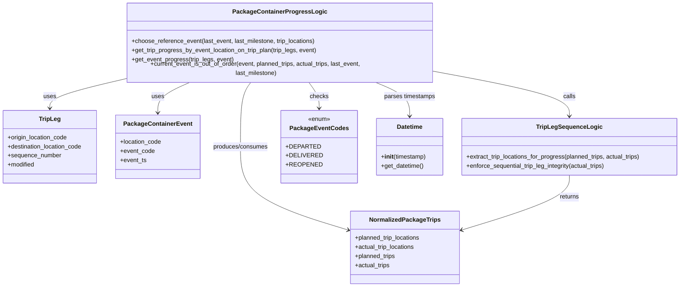
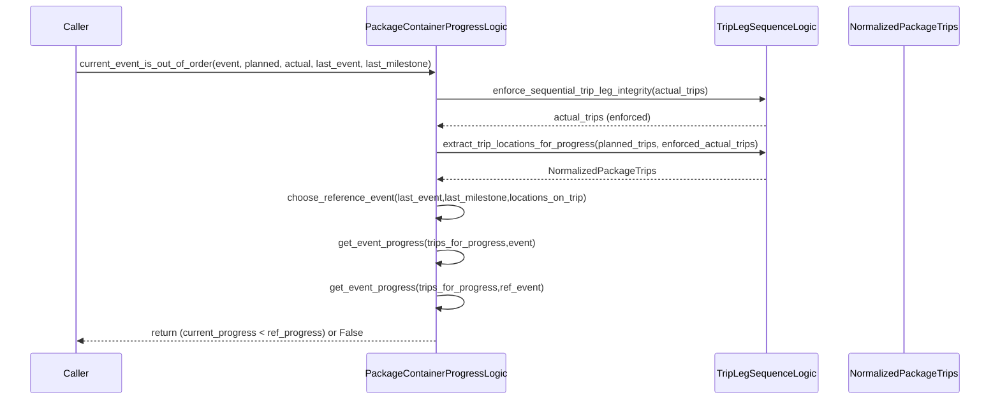

# Diagram: partview_core/partview_service/partview_service/core/business/package_container/event/PackageContainerProgressLogic.py


> Auto-generated by Obscura crawlers

## Diagram 1



### SVG

<svg id="container" width="1790.453125" xmlns="http://www.w3.org/2000/svg" class="classDiagram" height="746" viewBox="0 0 1790.453125 746" role="graphics-document document" aria-roledescription="class"><style>#container{font-family:"trebuchet ms",verdana,arial,sans-serif;font-size:16px;fill:#333;}@keyframes edge-animation-frame{from{stroke-dashoffset:0;}}@keyframes dash{to{stroke-dashoffset:0;}}#container .edge-animation-slow{stroke-dasharray:9,5!important;stroke-dashoffset:900;animation:dash 50s linear infinite;stroke-linecap:round;}#container .edge-animation-fast{stroke-dasharray:9,5!important;stroke-dashoffset:900;animation:dash 20s linear infinite;stroke-linecap:round;}#container .error-icon{fill:#552222;}#container .error-text{fill:#552222;stroke:#552222;}#container .edge-thickness-normal{stroke-width:1px;}#container .edge-thickness-thick{stroke-width:3.5px;}#container .edge-pattern-solid{stroke-dasharray:0;}#container .edge-thickness-invisible{stroke-width:0;fill:none;}#container .edge-pattern-dashed{stroke-dasharray:3;}#container .edge-pattern-dotted{stroke-dasharray:2;}#container .marker{fill:#333333;stroke:#333333;}#container .marker.cross{stroke:#333333;}#container svg{font-family:"trebuchet ms",verdana,arial,sans-serif;font-size:16px;}#container p{margin:0;}#container g.classGroup text{fill:#9370DB;stroke:none;font-family:"trebuchet ms",verdana,arial,sans-serif;font-size:10px;}#container g.classGroup text .title{font-weight:bolder;}#container .nodeLabel,#container .edgeLabel{color:#131300;}#container .edgeLabel .label rect{fill:#ECECFF;}#container .label text{fill:#131300;}#container .labelBkg{background:#ECECFF;}#container .edgeLabel .label span{background:#ECECFF;}#container .classTitle{font-weight:bolder;}#container .node rect,#container .node circle,#container .node ellipse,#container .node polygon,#container .node path{fill:#ECECFF;stroke:#9370DB;stroke-width:1px;}#container .divider{stroke:#9370DB;stroke-width:1;}#container g.clickable{cursor:pointer;}#container g.classGroup rect{fill:#ECECFF;stroke:#9370DB;}#container g.classGroup line{stroke:#9370DB;stroke-width:1;}#container .classLabel .box{stroke:none;stroke-width:0;fill:#ECECFF;opacity:0.5;}#container .classLabel .label{fill:#9370DB;font-size:10px;}#container .relation{stroke:#333333;stroke-width:1;fill:none;}#container .dashed-line{stroke-dasharray:3;}#container .dotted-line{stroke-dasharray:1 2;}#container #compositionStart,#container .composition{fill:#333333!important;stroke:#333333!important;stroke-width:1;}#container #compositionEnd,#container .composition{fill:#333333!important;stroke:#333333!important;stroke-width:1;}#container #dependencyStart,#container .dependency{fill:#333333!important;stroke:#333333!important;stroke-width:1;}#container #dependencyStart,#container .dependency{fill:#333333!important;stroke:#333333!important;stroke-width:1;}#container #extensionStart,#container .extension{fill:transparent!important;stroke:#333333!important;stroke-width:1;}#container #extensionEnd,#container .extension{fill:transparent!important;stroke:#333333!important;stroke-width:1;}#container #aggregationStart,#container .aggregation{fill:transparent!important;stroke:#333333!important;stroke-width:1;}#container #aggregationEnd,#container .aggregation{fill:transparent!important;stroke:#333333!important;stroke-width:1;}#container #lollipopStart,#container .lollipop{fill:#ECECFF!important;stroke:#333333!important;stroke-width:1;}#container #lollipopEnd,#container .lollipop{fill:#ECECFF!important;stroke:#333333!important;stroke-width:1;}#container .edgeTerminals{font-size:11px;line-height:initial;}#container .classTitleText{text-anchor:middle;font-size:18px;fill:#333;}#container .label-icon{display:inline-block;height:1em;overflow:visible;vertical-align:-0.125em;}#container .node .label-icon path{fill:currentColor;stroke:revert;stroke-width:revert;}#container :root{--mermaid-font-family:"trebuchet ms",verdana,arial,sans-serif;}</style><g><defs><marker id="container_class-aggregationStart" class="marker aggregation class" refX="18" refY="7" markerWidth="190" markerHeight="240" orient="auto"><path d="M 18,7 L9,13 L1,7 L9,1 Z"></path></marker></defs><defs><marker id="container_class-aggregationEnd" class="marker aggregation class" refX="1" refY="7" markerWidth="20" markerHeight="28" orient="auto"><path d="M 18,7 L9,13 L1,7 L9,1 Z"></path></marker></defs><defs><marker id="container_class-extensionStart" class="marker extension class" refX="18" refY="7" markerWidth="190" markerHeight="240" orient="auto"><path d="M 1,7 L18,13 V 1 Z"></path></marker></defs><defs><marker id="container_class-extensionEnd" class="marker extension class" refX="1" refY="7" markerWidth="20" markerHeight="28" orient="auto"><path d="M 1,1 V 13 L18,7 Z"></path></marker></defs><defs><marker id="container_class-compositionStart" class="marker composition class" refX="18" refY="7" markerWidth="190" markerHeight="240" orient="auto"><path d="M 18,7 L9,13 L1,7 L9,1 Z"></path></marker></defs><defs><marker id="container_class-compositionEnd" class="marker composition class" refX="1" refY="7" markerWidth="20" markerHeight="28" orient="auto"><path d="M 18,7 L9,13 L1,7 L9,1 Z"></path></marker></defs><defs><marker id="container_class-dependencyStart" class="marker dependency class" refX="6" refY="7" markerWidth="190" markerHeight="240" orient="auto"><path d="M 5,7 L9,13 L1,7 L9,1 Z"></path></marker></defs><defs><marker id="container_class-dependencyEnd" class="marker dependency class" refX="13" refY="7" markerWidth="20" markerHeight="28" orient="auto"><path d="M 18,7 L9,13 L14,7 L9,1 Z"></path></marker></defs><defs><marker id="container_class-lollipopStart" class="marker lollipop class" refX="13" refY="7" markerWidth="190" markerHeight="240" orient="auto"><circle stroke="black" fill="transparent" cx="7" cy="7" r="6"></circle></marker></defs><defs><marker id="container_class-lollipopEnd" class="marker lollipop class" refX="1" refY="7" markerWidth="190" markerHeight="240" orient="auto"><circle stroke="black" fill="transparent" cx="7" cy="7" r="6"></circle></marker></defs><g class="root"><g class="clusters"></g><g class="edgePaths"><path d="M326.93,199.636L294.813,206.863C262.697,214.09,198.464,228.545,166.347,240.939C134.23,253.333,134.23,263.667,134.23,268.833L134.23,274" id="id_PackageContainerProgressLogic_TripLeg_1" class="edge-thickness-normal edge-pattern-solid relation" style=";;;" data-edge="true" data-et="edge" data-id="id_PackageContainerProgressLogic_TripLeg_1" data-points="W3sieCI6MzI2LjkyOTY4NzUsInkiOjE5OS42MzU3MzE5NjgyMjUwM30seyJ4IjoxMzQuMjMwNDY4NzUsInkiOjI0M30seyJ4IjoxMzQuMjMwNDY4NzUsInkiOjI4MH1d" marker-end="url(#container_class-dependencyEnd)"></path><path d="M506.922,206L492.492,212.167C478.063,218.333,449.203,230.667,434.773,244C420.344,257.333,420.344,271.667,420.344,278.833L420.344,286" id="id_PackageContainerProgressLogic_PackageContainerEvent_2" class="edge-thickness-normal edge-pattern-solid relation" style=";;;" data-edge="true" data-et="edge" data-id="id_PackageContainerProgressLogic_PackageContainerEvent_2" data-points="W3sieCI6NTA2LjkyMjIxOTY2OTExNzcsInkiOjIwNn0seyJ4Ijo0MjAuMzQzNzUsInkiOjI0M30seyJ4Ijo0MjAuMzQzNzUsInkiOjI5Mn1d" marker-end="url(#container_class-dependencyEnd)"></path><path d="M1150.227,181.029L1207.66,191.357C1265.094,201.686,1379.961,222.343,1437.395,241.338C1494.828,260.333,1494.828,277.667,1494.828,286.333L1494.828,295" id="id_PackageContainerProgressLogic_TripLegSequenceLogic_3" class="edge-thickness-normal edge-pattern-solid relation" style=";;;" data-edge="true" data-et="edge" data-id="id_PackageContainerProgressLogic_TripLegSequenceLogic_3" data-points="W3sieCI6MTE1MC4yMjY1NjI1LCJ5IjoxODEuMDI4Njc3Njg1OTUwNH0seyJ4IjoxNDk0LjgyODEyNSwieSI6MjQzfSx7IngiOjE0OTQuODI4MTI1LCJ5IjozMDF9XQ==" marker-end="url(#container_class-dependencyEnd)"></path><path d="M665.966,206L661.443,212.167C656.92,218.333,647.874,230.667,643.351,259C638.828,287.333,638.828,331.667,638.828,376C638.828,420.333,638.828,464.667,685.039,501.193C731.249,537.72,823.67,566.439,869.88,580.799L916.091,595.159" id="id_PackageContainerProgressLogic_NormalizedPackageTrips_4" class="edge-thickness-normal edge-pattern-solid relation" style=";;;" data-edge="true" data-et="edge" data-id="id_PackageContainerProgressLogic_NormalizedPackageTrips_4" data-points="W3sieCI6NjY1Ljk2NTk5MjY0NzA1ODgsInkiOjIwNn0seyJ4Ijo2MzguODI4MTI1LCJ5IjoyNDN9LHsieCI6NjM4LjgyODEyNSwieSI6Mzc2fSx7IngiOjYzOC44MjgxMjUsInkiOjUwOX0seyJ4Ijo5MjEuODIwMzEyNSwieSI6NTk2LjkzOTE2MTA2ODkyNTN9XQ==" marker-end="url(#container_class-dependencyEnd)"></path><path d="M811.19,206L815.713,212.167C820.236,218.333,829.282,230.667,833.805,242C838.328,253.333,838.328,263.667,838.328,268.833L838.328,274" id="id_PackageContainerProgressLogic_PackageEventCodes_5" class="edge-thickness-normal edge-pattern-solid relation" style=";;;" data-edge="true" data-et="edge" data-id="id_PackageContainerProgressLogic_PackageEventCodes_5" data-points="W3sieCI6ODExLjE5MDI1NzM1Mjk0MTIsInkiOjIwNn0seyJ4Ijo4MzguMzI4MTI1LCJ5IjoyNDN9LHsieCI6ODM4LjMyODEyNSwieSI6MjgwfV0=" marker-end="url(#container_class-dependencyEnd)"></path><path d="M978.534,206L993.481,212.167C1008.428,218.333,1038.321,230.667,1053.268,245.5C1068.215,260.333,1068.215,277.667,1068.215,286.333L1068.215,295" id="id_PackageContainerProgressLogic_Datetime_6" class="edge-thickness-normal edge-pattern-solid relation" style=";;;" data-edge="true" data-et="edge" data-id="id_PackageContainerProgressLogic_Datetime_6" data-points="W3sieCI6OTc4LjUzNDI2NTg1NDc3OTQsInkiOjIwNn0seyJ4IjoxMDY4LjIxNDg0Mzc1LCJ5IjoyNDN9LHsieCI6MTA2OC4yMTQ4NDM3NSwieSI6MzAxfV0=" marker-end="url(#container_class-dependencyEnd)"></path><path d="M1494.828,451L1494.828,460.667C1494.828,470.333,1494.828,489.667,1448.618,513.693C1402.407,537.72,1309.986,566.439,1263.776,580.799L1217.566,595.159" id="id_TripLegSequenceLogic_NormalizedPackageTrips_7" class="edge-thickness-normal edge-pattern-solid relation" style=";;;" data-edge="true" data-et="edge" data-id="id_TripLegSequenceLogic_NormalizedPackageTrips_7" data-points="W3sieCI6MTQ5NC44MjgxMjUsInkiOjQ1MX0seyJ4IjoxNDk0LjgyODEyNSwieSI6NTA5fSx7IngiOjEyMTEuODM1OTM3NSwieSI6NTk2LjkzOTE2MTA2ODkyNTN9XQ==" marker-end="url(#container_class-dependencyEnd)"></path></g><g class="edgeLabels"><g class="edgeLabel" transform="translate(134.23046875, 243)"><g class="label" data-id="id_PackageContainerProgressLogic_TripLeg_1" transform="translate(-16.4921875, -12)"><foreignObject width="32.984375" height="24"><div xmlns="http://www.w3.org/1999/xhtml" class="labelBkg" style="display: table-cell; white-space: nowrap; line-height: 1.5; max-width: 200px; text-align: center;"><span class="edgeLabel"><p>uses</p></span></div></foreignObject></g></g><g class="edgeLabel" transform="translate(420.34375, 243)"><g class="label" data-id="id_PackageContainerProgressLogic_PackageContainerEvent_2" transform="translate(-16.4921875, -12)"><foreignObject width="32.984375" height="24"><div xmlns="http://www.w3.org/1999/xhtml" class="labelBkg" style="display: table-cell; white-space: nowrap; line-height: 1.5; max-width: 200px; text-align: center;"><span class="edgeLabel"><p>uses</p></span></div></foreignObject></g></g><g class="edgeLabel" transform="translate(1494.828125, 243)"><g class="label" data-id="id_PackageContainerProgressLogic_TripLegSequenceLogic_3" transform="translate(-16.4453125, -12)"><foreignObject width="32.890625" height="24"><div xmlns="http://www.w3.org/1999/xhtml" class="labelBkg" style="display: table-cell; white-space: nowrap; line-height: 1.5; max-width: 200px; text-align: center;"><span class="edgeLabel"><p>calls</p></span></div></foreignObject></g></g><g class="edgeLabel" transform="translate(638.828125, 376)"><g class="label" data-id="id_PackageContainerProgressLogic_NormalizedPackageTrips_4" transform="translate(-73.6015625, -12)"><foreignObject width="147.203125" height="24"><div xmlns="http://www.w3.org/1999/xhtml" class="labelBkg" style="display: table-cell; white-space: nowrap; line-height: 1.5; max-width: 200px; text-align: center;"><span class="edgeLabel"><p>produces/consumes</p></span></div></foreignObject></g></g><g class="edgeLabel" transform="translate(838.328125, 243)"><g class="label" data-id="id_PackageContainerProgressLogic_PackageEventCodes_5" transform="translate(-24.4921875, -12)"><foreignObject width="48.984375" height="24"><div xmlns="http://www.w3.org/1999/xhtml" class="labelBkg" style="display: table-cell; white-space: nowrap; line-height: 1.5; max-width: 200px; text-align: center;"><span class="edgeLabel"><p>checks</p></span></div></foreignObject></g></g><g class="edgeLabel" transform="translate(1068.21484375, 243)"><g class="label" data-id="id_PackageContainerProgressLogic_Datetime_6" transform="translate(-68.5703125, -12)"><foreignObject width="137.140625" height="24"><div xmlns="http://www.w3.org/1999/xhtml" class="labelBkg" style="display: table-cell; white-space: nowrap; line-height: 1.5; max-width: 200px; text-align: center;"><span class="edgeLabel"><p>parses timestamps</p></span></div></foreignObject></g></g><g class="edgeLabel" transform="translate(1494.828125, 509)"><g class="label" data-id="id_TripLegSequenceLogic_NormalizedPackageTrips_7" transform="translate(-26.265625, -12)"><foreignObject width="52.53125" height="24"><div xmlns="http://www.w3.org/1999/xhtml" class="labelBkg" style="display: table-cell; white-space: nowrap; line-height: 1.5; max-width: 200px; text-align: center;"><span class="edgeLabel"><p>returns</p></span></div></foreignObject></g></g></g><g class="nodes"><g class="node default" id="classId-PackageContainerProgressLogic-0" transform="translate(738.578125, 107)"><g class="basic label-container"><path d="M-411.6484375 -99 L411.6484375 -99 L411.6484375 99 L-411.6484375 99" stroke="none" stroke-width="0" fill="#ECECFF" style=""></path><path d="M-411.6484375 -99 C-136.0628656553497 -99, 139.5227061893006 -99, 411.6484375 -99 M-411.6484375 -99 C-157.0031133532141 -99, 97.64221079357179 -99, 411.6484375 -99 M411.6484375 -99 C411.6484375 -22.695556316220333, 411.6484375 53.60888736755933, 411.6484375 99 M411.6484375 -99 C411.6484375 -56.30909281631028, 411.6484375 -13.618185632620566, 411.6484375 99 M411.6484375 99 C168.4743636255848 99, -74.6997102488304 99, -411.6484375 99 M411.6484375 99 C191.61452542556097 99, -28.41938664887806 99, -411.6484375 99 M-411.6484375 99 C-411.6484375 47.42887389538147, -411.6484375 -4.142252209237057, -411.6484375 -99 M-411.6484375 99 C-411.6484375 33.89497341176451, -411.6484375 -31.21005317647098, -411.6484375 -99" stroke="#9370DB" stroke-width="1.3" fill="none" stroke-dasharray="0 0" style=""></path></g><g class="annotation-group text" transform="translate(0, -75)"></g><g class="label-group text" transform="translate(-116.265625, -75)"><g class="label" style="font-weight: bolder" transform="translate(0,-12)"><foreignObject width="232.53125" height="24"><div xmlns="http://www.w3.org/1999/xhtml" style="display: table-cell; white-space: nowrap; line-height: 1.5; max-width: 278px; text-align: center;"><span class="nodeLabel markdown-node-label" style=""><p>PackageContainerProgressLogic</p></span></div></foreignObject></g></g><g class="members-group text" transform="translate(-399.6484375, -27)"></g><g class="methods-group text" transform="translate(-399.6484375, 3)"><g class="label" style="" transform="translate(0,-12)"><foreignObject width="492.40625" height="24"><div xmlns="http://www.w3.org/1999/xhtml" style="display: table-cell; white-space: nowrap; line-height: 1.5; max-width: 550px; text-align: center;"><span class="nodeLabel markdown-node-label" style=""><p>+choose_reference_event(last_event, last_milestone, trip_locations)</p></span></div></foreignObject></g><g class="label" style="" transform="translate(0,12)"><foreignObject width="497.546875" height="24"><div xmlns="http://www.w3.org/1999/xhtml" style="display: table-cell; white-space: nowrap; line-height: 1.5; max-width: 555px; text-align: center;"><span class="nodeLabel markdown-node-label" style=""><p>+get_trip_progress_by_event_location_on_trip_plan(trip_legs, event)</p></span></div></foreignObject></g><g class="label" style="" transform="translate(0,36)"><foreignObject width="270.875" height="24"><div xmlns="http://www.w3.org/1999/xhtml" style="display: table-cell; white-space: nowrap; line-height: 1.5; max-width: 328px; text-align: center;"><span class="nodeLabel markdown-node-label" style=""><p>+get_event_progress(trip_legs, event)</p></span></div></foreignObject></g><g class="label" style="" transform="translate(0,60)"><foreignObject width="683.03125" height="24"><div xmlns="http://www.w3.org/1999/xhtml" style="display: table-cell; white-space: nowrap; line-height: 1.5; max-width: 740px; text-align: center;"><span class="nodeLabel markdown-node-label" style=""><p>+current_event_is_out_of_order(event, planned_trips, actual_trips, last_event, last_milestone)</p></span></div></foreignObject></g></g><g class="divider" style=""><path d="M-411.6484375 -51 C-122.16458509716944 -51, 167.31926730566113 -51, 411.6484375 -51 M-411.6484375 -51 C-93.5621365071064 -51, 224.5241644857872 -51, 411.6484375 -51" stroke="#9370DB" stroke-width="1.3" fill="none" stroke-dasharray="0 0" style=""></path></g><g class="divider" style=""><path d="M-411.6484375 -27 C-89.98220427123937 -27, 231.68402895752126 -27, 411.6484375 -27 M-411.6484375 -27 C-245.1502920079745 -27, -78.65214651594903 -27, 411.6484375 -27" stroke="#9370DB" stroke-width="1.3" fill="none" stroke-dasharray="0 0" style=""></path></g></g><g class="node default" id="classId-TripLeg-1" transform="translate(134.23046875, 376)"><g class="basic label-container"><path d="M-126.23046875 -96 L126.23046875 -96 L126.23046875 96 L-126.23046875 96" stroke="none" stroke-width="0" fill="#ECECFF" style=""></path><path d="M-126.23046875 -96 C-74.04416283353149 -96, -21.85785691706296 -96, 126.23046875 -96 M-126.23046875 -96 C-71.77651356751304 -96, -17.322558385026085 -96, 126.23046875 -96 M126.23046875 -96 C126.23046875 -19.871109149190147, 126.23046875 56.257781701619706, 126.23046875 96 M126.23046875 -96 C126.23046875 -27.61498983820462, 126.23046875 40.77002032359076, 126.23046875 96 M126.23046875 96 C56.57656412096378 96, -13.077340508072439 96, -126.23046875 96 M126.23046875 96 C67.1030850471861 96, 7.975701344372197 96, -126.23046875 96 M-126.23046875 96 C-126.23046875 36.762566052664084, -126.23046875 -22.47486789467183, -126.23046875 -96 M-126.23046875 96 C-126.23046875 41.12005924199481, -126.23046875 -13.759881516010381, -126.23046875 -96" stroke="#9370DB" stroke-width="1.3" fill="none" stroke-dasharray="0 0" style=""></path></g><g class="annotation-group text" transform="translate(0, -72)"></g><g class="label-group text" transform="translate(-27.0546875, -72)"><g class="label" style="font-weight: bolder" transform="translate(0,-12)"><foreignObject width="54.109375" height="24"><div xmlns="http://www.w3.org/1999/xhtml" style="display: table-cell; white-space: nowrap; line-height: 1.5; max-width: 103px; text-align: center;"><span class="nodeLabel markdown-node-label" style=""><p>TripLeg</p></span></div></foreignObject></g></g><g class="members-group text" transform="translate(-114.23046875, -24)"><g class="label" style="" transform="translate(0,-12)"><foreignObject width="160.5" height="24"><div xmlns="http://www.w3.org/1999/xhtml" style="display: table-cell; white-space: nowrap; line-height: 1.5; max-width: 218px; text-align: center;"><span class="nodeLabel markdown-node-label" style=""><p>+origin_location_code</p></span></div></foreignObject></g><g class="label" style="" transform="translate(0,12)"><foreignObject width="201.40625" height="24"><div xmlns="http://www.w3.org/1999/xhtml" style="display: table-cell; white-space: nowrap; line-height: 1.5; max-width: 259px; text-align: center;"><span class="nodeLabel markdown-node-label" style=""><p>+destination_location_code</p></span></div></foreignObject></g><g class="label" style="" transform="translate(0,36)"><foreignObject width="142.015625" height="24"><div xmlns="http://www.w3.org/1999/xhtml" style="display: table-cell; white-space: nowrap; line-height: 1.5; max-width: 200px; text-align: center;"><span class="nodeLabel markdown-node-label" style=""><p>+sequence_number</p></span></div></foreignObject></g><g class="label" style="" transform="translate(0,60)"><foreignObject width="72.609375" height="24"><div xmlns="http://www.w3.org/1999/xhtml" style="display: table-cell; white-space: nowrap; line-height: 1.5; max-width: 130px; text-align: center;"><span class="nodeLabel markdown-node-label" style=""><p>+modified</p></span></div></foreignObject></g></g><g class="methods-group text" transform="translate(-114.23046875, 96)"></g><g class="divider" style=""><path d="M-126.23046875 -48 C-34.69924649286929 -48, 56.831975764261415 -48, 126.23046875 -48 M-126.23046875 -48 C-73.95617944831645 -48, -21.681890146632895 -48, 126.23046875 -48" stroke="#9370DB" stroke-width="1.3" fill="none" stroke-dasharray="0 0" style=""></path></g><g class="divider" style=""><path d="M-126.23046875 72 C-44.25862395177083 72, 37.71322084645834 72, 126.23046875 72 M-126.23046875 72 C-40.52862693679184 72, 45.173214876416324 72, 126.23046875 72" stroke="#9370DB" stroke-width="1.3" fill="none" stroke-dasharray="0 0" style=""></path></g></g><g class="node default" id="classId-PackageContainerEvent-2" transform="translate(420.34375, 376)"><g class="basic label-container"><path d="M-109.8828125 -84 L109.8828125 -84 L109.8828125 84 L-109.8828125 84" stroke="none" stroke-width="0" fill="#ECECFF" style=""></path><path d="M-109.8828125 -84 C-57.421140414935905 -84, -4.959468329871811 -84, 109.8828125 -84 M-109.8828125 -84 C-23.65204332456669 -84, 62.57872585086662 -84, 109.8828125 -84 M109.8828125 -84 C109.8828125 -47.486285077712196, 109.8828125 -10.972570155424393, 109.8828125 84 M109.8828125 -84 C109.8828125 -33.990693667694245, 109.8828125 16.01861266461151, 109.8828125 84 M109.8828125 84 C60.080172604142064 84, 10.277532708284127 84, -109.8828125 84 M109.8828125 84 C50.59347617058335 84, -8.695860158833298 84, -109.8828125 84 M-109.8828125 84 C-109.8828125 43.719074197099864, -109.8828125 3.438148394199729, -109.8828125 -84 M-109.8828125 84 C-109.8828125 35.45745436386591, -109.8828125 -13.085091272268187, -109.8828125 -84" stroke="#9370DB" stroke-width="1.3" fill="none" stroke-dasharray="0 0" style=""></path></g><g class="annotation-group text" transform="translate(0, -60)"></g><g class="label-group text" transform="translate(-85.65625, -60)"><g class="label" style="font-weight: bolder" transform="translate(0,-12)"><foreignObject width="171.3125" height="24"><div xmlns="http://www.w3.org/1999/xhtml" style="display: table-cell; white-space: nowrap; line-height: 1.5; max-width: 219px; text-align: center;"><span class="nodeLabel markdown-node-label" style=""><p>PackageContainerEvent</p></span></div></foreignObject></g></g><g class="members-group text" transform="translate(-97.8828125, -12)"><g class="label" style="" transform="translate(0,-12)"><foreignObject width="110.109375" height="24"><div xmlns="http://www.w3.org/1999/xhtml" style="display: table-cell; white-space: nowrap; line-height: 1.5; max-width: 167px; text-align: center;"><span class="nodeLabel markdown-node-label" style=""><p>+location_code</p></span></div></foreignObject></g><g class="label" style="" transform="translate(0,12)"><foreignObject width="91.28125" height="24"><div xmlns="http://www.w3.org/1999/xhtml" style="display: table-cell; white-space: nowrap; line-height: 1.5; max-width: 149px; text-align: center;"><span class="nodeLabel markdown-node-label" style=""><p>+event_code</p></span></div></foreignObject></g><g class="label" style="" transform="translate(0,36)"><foreignObject width="69.578125" height="24"><div xmlns="http://www.w3.org/1999/xhtml" style="display: table-cell; white-space: nowrap; line-height: 1.5; max-width: 127px; text-align: center;"><span class="nodeLabel markdown-node-label" style=""><p>+event_ts</p></span></div></foreignObject></g></g><g class="methods-group text" transform="translate(-97.8828125, 84)"></g><g class="divider" style=""><path d="M-109.8828125 -36 C-22.825720223126396 -36, 64.23137205374721 -36, 109.8828125 -36 M-109.8828125 -36 C-33.08889864337857 -36, 43.70501521324286 -36, 109.8828125 -36" stroke="#9370DB" stroke-width="1.3" fill="none" stroke-dasharray="0 0" style=""></path></g><g class="divider" style=""><path d="M-109.8828125 60 C-38.86521160166416 60, 32.152389296671686 60, 109.8828125 60 M-109.8828125 60 C-29.358587927650234 60, 51.16563664469953 60, 109.8828125 60" stroke="#9370DB" stroke-width="1.3" fill="none" stroke-dasharray="0 0" style=""></path></g></g><g class="node default" id="classId-TripLegSequenceLogic-3" transform="translate(1494.828125, 376)"><g class="basic label-container"><path d="M-287.625 -75 L287.625 -75 L287.625 75 L-287.625 75" stroke="none" stroke-width="0" fill="#ECECFF" style=""></path><path d="M-287.625 -75 C-129.6527514185955 -75, 28.319497162809 -75, 287.625 -75 M-287.625 -75 C-91.20966966791471 -75, 105.20566066417058 -75, 287.625 -75 M287.625 -75 C287.625 -20.300608946296443, 287.625 34.398782107407115, 287.625 75 M287.625 -75 C287.625 -22.631909911146842, 287.625 29.736180177706316, 287.625 75 M287.625 75 C90.730389156721 75, -106.164221686558 75, -287.625 75 M287.625 75 C71.65977791115225 75, -144.3054441776955 75, -287.625 75 M-287.625 75 C-287.625 23.485654041083734, -287.625 -28.028691917832532, -287.625 -75 M-287.625 75 C-287.625 38.432477690492725, -287.625 1.8649553809854496, -287.625 -75" stroke="#9370DB" stroke-width="1.3" fill="none" stroke-dasharray="0 0" style=""></path></g><g class="annotation-group text" transform="translate(0, -51)"></g><g class="label-group text" transform="translate(-81.609375, -51)"><g class="label" style="font-weight: bolder" transform="translate(0,-12)"><foreignObject width="163.21875" height="24"><div xmlns="http://www.w3.org/1999/xhtml" style="display: table-cell; white-space: nowrap; line-height: 1.5; max-width: 211px; text-align: center;"><span class="nodeLabel markdown-node-label" style=""><p>TripLegSequenceLogic</p></span></div></foreignObject></g></g><g class="members-group text" transform="translate(-275.625, -3)"></g><g class="methods-group text" transform="translate(-275.625, 27)"><g class="label" style="" transform="translate(0,-12)"><foreignObject width="469.640625" height="24"><div xmlns="http://www.w3.org/1999/xhtml" style="display: table-cell; white-space: nowrap; line-height: 1.5; max-width: 527px; text-align: center;"><span class="nodeLabel markdown-node-label" style=""><p>+extract_trip_locations_for_progress(planned_trips, actual_trips)</p></span></div></foreignObject></g><g class="label" style="" transform="translate(0,12)"><foreignObject width="376.109375" height="24"><div xmlns="http://www.w3.org/1999/xhtml" style="display: table-cell; white-space: nowrap; line-height: 1.5; max-width: 433px; text-align: center;"><span class="nodeLabel markdown-node-label" style=""><p>+enforce_sequential_trip_leg_integrity(actual_trips)</p></span></div></foreignObject></g></g><g class="divider" style=""><path d="M-287.625 -27 C-165.03060748371715 -27, -42.436214967434296 -27, 287.625 -27 M-287.625 -27 C-132.8904860059469 -27, 21.844027988106177 -27, 287.625 -27" stroke="#9370DB" stroke-width="1.3" fill="none" stroke-dasharray="0 0" style=""></path></g><g class="divider" style=""><path d="M-287.625 -3 C-130.9271428210583 -3, 25.770714357883378 -3, 287.625 -3 M-287.625 -3 C-163.12936334223713 -3, -38.63372668447428 -3, 287.625 -3" stroke="#9370DB" stroke-width="1.3" fill="none" stroke-dasharray="0 0" style=""></path></g></g><g class="node default" id="classId-NormalizedPackageTrips-4" transform="translate(1066.828125, 642)"><g class="basic label-container"><path d="M-145.0078125 -96 L145.0078125 -96 L145.0078125 96 L-145.0078125 96" stroke="none" stroke-width="0" fill="#ECECFF" style=""></path><path d="M-145.0078125 -96 C-49.757916739739514 -96, 45.49197902052097 -96, 145.0078125 -96 M-145.0078125 -96 C-51.674336586075654 -96, 41.65913932784869 -96, 145.0078125 -96 M145.0078125 -96 C145.0078125 -50.77353361455972, 145.0078125 -5.547067229119435, 145.0078125 96 M145.0078125 -96 C145.0078125 -27.684310600915524, 145.0078125 40.63137879816895, 145.0078125 96 M145.0078125 96 C65.292051467645 96, -14.423709564710009 96, -145.0078125 96 M145.0078125 96 C46.79840028688294 96, -51.411011926234124 96, -145.0078125 96 M-145.0078125 96 C-145.0078125 47.00268011743225, -145.0078125 -1.9946397651355028, -145.0078125 -96 M-145.0078125 96 C-145.0078125 36.70008756468214, -145.0078125 -22.599824870635715, -145.0078125 -96" stroke="#9370DB" stroke-width="1.3" fill="none" stroke-dasharray="0 0" style=""></path></g><g class="annotation-group text" transform="translate(0, -72)"></g><g class="label-group text" transform="translate(-89.734375, -72)"><g class="label" style="font-weight: bolder" transform="translate(0,-12)"><foreignObject width="179.46875" height="24"><div xmlns="http://www.w3.org/1999/xhtml" style="display: table-cell; white-space: nowrap; line-height: 1.5; max-width: 227px; text-align: center;"><span class="nodeLabel markdown-node-label" style=""><p>NormalizedPackageTrips</p></span></div></foreignObject></g></g><g class="members-group text" transform="translate(-133.0078125, -24)"><g class="label" style="" transform="translate(0,-12)"><foreignObject width="176.28125" height="24"><div xmlns="http://www.w3.org/1999/xhtml" style="display: table-cell; white-space: nowrap; line-height: 1.5; max-width: 234px; text-align: center;"><span class="nodeLabel markdown-node-label" style=""><p>+planned_trip_locations</p></span></div></foreignObject></g><g class="label" style="" transform="translate(0,12)"><foreignObject width="160.859375" height="24"><div xmlns="http://www.w3.org/1999/xhtml" style="display: table-cell; white-space: nowrap; line-height: 1.5; max-width: 218px; text-align: center;"><span class="nodeLabel markdown-node-label" style=""><p>+actual_trip_locations</p></span></div></foreignObject></g><g class="label" style="" transform="translate(0,36)"><foreignObject width="109.28125" height="24"><div xmlns="http://www.w3.org/1999/xhtml" style="display: table-cell; white-space: nowrap; line-height: 1.5; max-width: 167px; text-align: center;"><span class="nodeLabel markdown-node-label" style=""><p>+planned_trips</p></span></div></foreignObject></g><g class="label" style="" transform="translate(0,60)"><foreignObject width="93.859375" height="24"><div xmlns="http://www.w3.org/1999/xhtml" style="display: table-cell; white-space: nowrap; line-height: 1.5; max-width: 151px; text-align: center;"><span class="nodeLabel markdown-node-label" style=""><p>+actual_trips</p></span></div></foreignObject></g></g><g class="methods-group text" transform="translate(-133.0078125, 96)"></g><g class="divider" style=""><path d="M-145.0078125 -48 C-85.23661429324946 -48, -25.465416086498934 -48, 145.0078125 -48 M-145.0078125 -48 C-37.90021627440788 -48, 69.20737995118424 -48, 145.0078125 -48" stroke="#9370DB" stroke-width="1.3" fill="none" stroke-dasharray="0 0" style=""></path></g><g class="divider" style=""><path d="M-145.0078125 72 C-51.07050759619041 72, 42.86679730761918 72, 145.0078125 72 M-145.0078125 72 C-52.93230890166957 72, 39.143194696660856 72, 145.0078125 72" stroke="#9370DB" stroke-width="1.3" fill="none" stroke-dasharray="0 0" style=""></path></g></g><g class="node default" id="classId-PackageEventCodes-5" transform="translate(838.328125, 376)"><g class="basic label-container"><path d="M-90.8984375 -96 L90.8984375 -96 L90.8984375 96 L-90.8984375 96" stroke="none" stroke-width="0" fill="#ECECFF" style=""></path><path d="M-90.8984375 -96 C-44.623916183947436 -96, 1.6506051321051274 -96, 90.8984375 -96 M-90.8984375 -96 C-24.44791255373201 -96, 42.00261239253598 -96, 90.8984375 -96 M90.8984375 -96 C90.8984375 -46.74069312220121, 90.8984375 2.5186137555975847, 90.8984375 96 M90.8984375 -96 C90.8984375 -20.94075951914246, 90.8984375 54.11848096171508, 90.8984375 96 M90.8984375 96 C50.20011799621355 96, 9.501798492427099 96, -90.8984375 96 M90.8984375 96 C49.3399851845648 96, 7.781532869129606 96, -90.8984375 96 M-90.8984375 96 C-90.8984375 53.11095410249726, -90.8984375 10.22190820499452, -90.8984375 -96 M-90.8984375 96 C-90.8984375 55.43474008552987, -90.8984375 14.869480171059735, -90.8984375 -96" stroke="#9370DB" stroke-width="1.3" fill="none" stroke-dasharray="0 0" style=""></path></g><g class="annotation-group text" transform="translate(-29.53125, -72)"><g class="label" style="" transform="translate(0,-12)"><foreignObject width="59.0625" height="24"><div xmlns="http://www.w3.org/1999/xhtml" style="display: table-cell; white-space: nowrap; line-height: 1.5; max-width: 109px; text-align: center;"><span class="nodeLabel markdown-node-label" style=""><p>«enum»</p></span></div></foreignObject></g></g><g class="label-group text" transform="translate(-72.25, -48)"><g class="label" style="font-weight: bolder" transform="translate(0,-12)"><foreignObject width="144.5" height="24"><div xmlns="http://www.w3.org/1999/xhtml" style="display: table-cell; white-space: nowrap; line-height: 1.5; max-width: 192px; text-align: center;"><span class="nodeLabel markdown-node-label" style=""><p>PackageEventCodes</p></span></div></foreignObject></g></g><g class="members-group text" transform="translate(-78.8984375, 0)"><g class="label" style="" transform="translate(0,-12)"><foreignObject width="80.859375" height="24"><div xmlns="http://www.w3.org/1999/xhtml" style="display: table-cell; white-space: nowrap; line-height: 1.5; max-width: 138px; text-align: center;"><span class="nodeLabel markdown-node-label" style=""><p>+DEPARTED</p></span></div></foreignObject></g><g class="label" style="" transform="translate(0,12)"><foreignObject width="85.546875" height="24"><div xmlns="http://www.w3.org/1999/xhtml" style="display: table-cell; white-space: nowrap; line-height: 1.5; max-width: 143px; text-align: center;"><span class="nodeLabel markdown-node-label" style=""><p>+DELIVERED</p></span></div></foreignObject></g><g class="label" style="" transform="translate(0,36)"><foreignObject width="84.765625" height="24"><div xmlns="http://www.w3.org/1999/xhtml" style="display: table-cell; white-space: nowrap; line-height: 1.5; max-width: 142px; text-align: center;"><span class="nodeLabel markdown-node-label" style=""><p>+REOPENED</p></span></div></foreignObject></g></g><g class="methods-group text" transform="translate(-78.8984375, 96)"></g><g class="divider" style=""><path d="M-90.8984375 -24 C-31.726783608095246 -24, 27.444870283809507 -24, 90.8984375 -24 M-90.8984375 -24 C-37.27196131740877 -24, 16.354514865182466 -24, 90.8984375 -24" stroke="#9370DB" stroke-width="1.3" fill="none" stroke-dasharray="0 0" style=""></path></g><g class="divider" style=""><path d="M-90.8984375 72 C-34.35286675663004 72, 22.192703986739915 72, 90.8984375 72 M-90.8984375 72 C-34.57460130044722 72, 21.74923489910556 72, 90.8984375 72" stroke="#9370DB" stroke-width="1.3" fill="none" stroke-dasharray="0 0" style=""></path></g></g><g class="node default" id="classId-Datetime-6" transform="translate(1068.21484375, 376)"><g class="basic label-container"><path d="M-88.98828125 -75 L88.98828125 -75 L88.98828125 75 L-88.98828125 75" stroke="none" stroke-width="0" fill="#ECECFF" style=""></path><path d="M-88.98828125 -75 C-37.81646781140791 -75, 13.355345627184178 -75, 88.98828125 -75 M-88.98828125 -75 C-34.810193415136034 -75, 19.367894419727932 -75, 88.98828125 -75 M88.98828125 -75 C88.98828125 -28.388337637877648, 88.98828125 18.223324724244705, 88.98828125 75 M88.98828125 -75 C88.98828125 -19.28651491281441, 88.98828125 36.42697017437118, 88.98828125 75 M88.98828125 75 C35.31410433592948 75, -18.360072578141043 75, -88.98828125 75 M88.98828125 75 C52.234222905890164 75, 15.480164561780327 75, -88.98828125 75 M-88.98828125 75 C-88.98828125 17.141557511310687, -88.98828125 -40.716884977378626, -88.98828125 -75 M-88.98828125 75 C-88.98828125 31.192249755475338, -88.98828125 -12.615500489049325, -88.98828125 -75" stroke="#9370DB" stroke-width="1.3" fill="none" stroke-dasharray="0 0" style=""></path></g><g class="annotation-group text" transform="translate(0, -51)"></g><g class="label-group text" transform="translate(-33.3984375, -51)"><g class="label" style="font-weight: bolder" transform="translate(0,-12)"><foreignObject width="66.796875" height="24"><div xmlns="http://www.w3.org/1999/xhtml" style="display: table-cell; white-space: nowrap; line-height: 1.5; max-width: 116px; text-align: center;"><span class="nodeLabel markdown-node-label" style=""><p>Datetime</p></span></div></foreignObject></g></g><g class="members-group text" transform="translate(-76.98828125, -3)"></g><g class="methods-group text" transform="translate(-76.98828125, 27)"><g class="label" style="" transform="translate(0,-12)"><foreignObject width="120.578125" height="24"><div xmlns="http://www.w3.org/1999/xhtml" style="display: table-cell; white-space: nowrap; line-height: 1.5; max-width: 209px; text-align: center;"><span class="nodeLabel markdown-node-label" style=""><p>+<strong>init</strong>(timestamp)</p></span></div></foreignObject></g><g class="label" style="" transform="translate(0,12)"><foreignObject width="114.171875" height="24"><div xmlns="http://www.w3.org/1999/xhtml" style="display: table-cell; white-space: nowrap; line-height: 1.5; max-width: 172px; text-align: center;"><span class="nodeLabel markdown-node-label" style=""><p>+get_datetime()</p></span></div></foreignObject></g></g><g class="divider" style=""><path d="M-88.98828125 -27 C-29.209897712384446 -27, 30.568485825231107 -27, 88.98828125 -27 M-88.98828125 -27 C-19.190018386763853 -27, 50.608244476472294 -27, 88.98828125 -27" stroke="#9370DB" stroke-width="1.3" fill="none" stroke-dasharray="0 0" style=""></path></g><g class="divider" style=""><path d="M-88.98828125 -3 C-33.216652668253374 -3, 22.55497591349325 -3, 88.98828125 -3 M-88.98828125 -3 C-48.84599990001129 -3, -8.703718550022586 -3, 88.98828125 -3" stroke="#9370DB" stroke-width="1.3" fill="none" stroke-dasharray="0 0" style=""></path></g></g></g></g></g></svg>

## Diagram 2

```mermaid
flowchart TD
    A[Event arrives] --> B{Is event a PackageContainerEvent?}
    B -- No --> Z[Progress = 0]
    B -- Yes --> C{event_code == DELIVERED?}
    C -- Yes --> D[Progress = 100]
    C -- No --> E{event_code == REOPENED?}
    E -- Yes --> Z
    E -- No --> F{Are trip_legs present?}
    F -- No --> Z
    F -- Yes --> G[Match event to trip leg origin/destination]
    G --> H{Match found?}
    H -- No --> Z
    H -- Yes --> I[Sort trip legs by sequence_number]
    I --> J[Compute sequential_stop_number]
    J --> K{event_code == DEPARTED?}
    K -- Yes --> L[sequential_stop_number += 0.5]
    K -- No --> L
    L --> M[progress = (sequential_stop_number / total_legs) * 100]
    M --> N[Return progress]
```

> SVG rendering failed for this diagram.

## Diagram 3



### SVG

<svg id="container" width="1778.5" xmlns="http://www.w3.org/2000/svg" height="693" viewBox="-50 -10 1778.5 693" role="graphics-document document" aria-roledescription="sequence"><g><rect x="1481.5" y="607" fill="#eaeaea" stroke="#666" width="197" height="65" name="Normalized" rx="3" ry="3" class="actor actor-bottom"></rect><text x="1580" y="639.5" dominant-baseline="central" alignment-baseline="central" class="actor actor-box" style="text-anchor: middle; font-size: 16px; font-weight: 400;"><tspan x="1580" dy="0">NormalizedPackageTrips</tspan></text></g><g><rect x="1250.5" y="607" fill="#eaeaea" stroke="#666" width="181" height="65" name="TripLogic" rx="3" ry="3" class="actor actor-bottom"></rect><text x="1341" y="639.5" dominant-baseline="central" alignment-baseline="central" class="actor actor-box" style="text-anchor: middle; font-size: 16px; font-weight: 400;"><tspan x="1341" dy="0">TripLegSequenceLogic</tspan></text></g><g><rect x="613" y="607" fill="#eaeaea" stroke="#666" width="248" height="65" name="PackageLogic" rx="3" ry="3" class="actor actor-bottom"></rect><text x="737" y="639.5" dominant-baseline="central" alignment-baseline="central" class="actor actor-box" style="text-anchor: middle; font-size: 16px; font-weight: 400;"><tspan x="737" dy="0">PackageContainerProgressLogic</tspan></text></g><g><rect x="0" y="607" fill="#eaeaea" stroke="#666" width="150" height="65" name="Caller" rx="3" ry="3" class="actor actor-bottom"></rect><text x="75" y="639.5" dominant-baseline="central" alignment-baseline="central" class="actor actor-box" style="text-anchor: middle; font-size: 16px; font-weight: 400;"><tspan x="75" dy="0">Caller</tspan></text></g><g><line id="actor3" x1="1580" y1="65" x2="1580" y2="607" class="actor-line 200" stroke-width="0.5px" stroke="#999" name="Normalized"></line><g id="root-3"><rect x="1481.5" y="0" fill="#eaeaea" stroke="#666" width="197" height="65" name="Normalized" rx="3" ry="3" class="actor actor-top"></rect><text x="1580" y="32.5" dominant-baseline="central" alignment-baseline="central" class="actor actor-box" style="text-anchor: middle; font-size: 16px; font-weight: 400;"><tspan x="1580" dy="0">NormalizedPackageTrips</tspan></text></g></g><g><line id="actor2" x1="1341" y1="65" x2="1341" y2="607" class="actor-line 200" stroke-width="0.5px" stroke="#999" name="TripLogic"></line><g id="root-2"><rect x="1250.5" y="0" fill="#eaeaea" stroke="#666" width="181" height="65" name="TripLogic" rx="3" ry="3" class="actor actor-top"></rect><text x="1341" y="32.5" dominant-baseline="central" alignment-baseline="central" class="actor actor-box" style="text-anchor: middle; font-size: 16px; font-weight: 400;"><tspan x="1341" dy="0">TripLegSequenceLogic</tspan></text></g></g><g><line id="actor1" x1="737" y1="65" x2="737" y2="607" class="actor-line 200" stroke-width="0.5px" stroke="#999" name="PackageLogic"></line><g id="root-1"><rect x="613" y="0" fill="#eaeaea" stroke="#666" width="248" height="65" name="PackageLogic" rx="3" ry="3" class="actor actor-top"></rect><text x="737" y="32.5" dominant-baseline="central" alignment-baseline="central" class="actor actor-box" style="text-anchor: middle; font-size: 16px; font-weight: 400;"><tspan x="737" dy="0">PackageContainerProgressLogic</tspan></text></g></g><g><line id="actor0" x1="75" y1="65" x2="75" y2="607" class="actor-line 200" stroke-width="0.5px" stroke="#999" name="Caller"></line><g id="root-0"><rect x="0" y="0" fill="#eaeaea" stroke="#666" width="150" height="65" name="Caller" rx="3" ry="3" class="actor actor-top"></rect><text x="75" y="32.5" dominant-baseline="central" alignment-baseline="central" class="actor actor-box" style="text-anchor: middle; font-size: 16px; font-weight: 400;"><tspan x="75" dy="0">Caller</tspan></text></g></g><style>#container{font-family:"trebuchet ms",verdana,arial,sans-serif;font-size:16px;fill:#333;}@keyframes edge-animation-frame{from{stroke-dashoffset:0;}}@keyframes dash{to{stroke-dashoffset:0;}}#container .edge-animation-slow{stroke-dasharray:9,5!important;stroke-dashoffset:900;animation:dash 50s linear infinite;stroke-linecap:round;}#container .edge-animation-fast{stroke-dasharray:9,5!important;stroke-dashoffset:900;animation:dash 20s linear infinite;stroke-linecap:round;}#container .error-icon{fill:#552222;}#container .error-text{fill:#552222;stroke:#552222;}#container .edge-thickness-normal{stroke-width:1px;}#container .edge-thickness-thick{stroke-width:3.5px;}#container .edge-pattern-solid{stroke-dasharray:0;}#container .edge-thickness-invisible{stroke-width:0;fill:none;}#container .edge-pattern-dashed{stroke-dasharray:3;}#container .edge-pattern-dotted{stroke-dasharray:2;}#container .marker{fill:#333333;stroke:#333333;}#container .marker.cross{stroke:#333333;}#container svg{font-family:"trebuchet ms",verdana,arial,sans-serif;font-size:16px;}#container p{margin:0;}#container .actor{stroke:hsl(259.6261682243, 59.7765363128%, 87.9019607843%);fill:#ECECFF;}#container text.actor&gt;tspan{fill:black;stroke:none;}#container .actor-line{stroke:hsl(259.6261682243, 59.7765363128%, 87.9019607843%);}#container .innerArc{stroke-width:1.5;stroke-dasharray:none;}#container .messageLine0{stroke-width:1.5;stroke-dasharray:none;stroke:#333;}#container .messageLine1{stroke-width:1.5;stroke-dasharray:2,2;stroke:#333;}#container #arrowhead path{fill:#333;stroke:#333;}#container .sequenceNumber{fill:white;}#container #sequencenumber{fill:#333;}#container #crosshead path{fill:#333;stroke:#333;}#container .messageText{fill:#333;stroke:none;}#container .labelBox{stroke:hsl(259.6261682243, 59.7765363128%, 87.9019607843%);fill:#ECECFF;}#container .labelText,#container .labelText&gt;tspan{fill:black;stroke:none;}#container .loopText,#container .loopText&gt;tspan{fill:black;stroke:none;}#container .loopLine{stroke-width:2px;stroke-dasharray:2,2;stroke:hsl(259.6261682243, 59.7765363128%, 87.9019607843%);fill:hsl(259.6261682243, 59.7765363128%, 87.9019607843%);}#container .note{stroke:#aaaa33;fill:#fff5ad;}#container .noteText,#container .noteText&gt;tspan{fill:black;stroke:none;}#container .activation0{fill:#f4f4f4;stroke:#666;}#container .activation1{fill:#f4f4f4;stroke:#666;}#container .activation2{fill:#f4f4f4;stroke:#666;}#container .actorPopupMenu{position:absolute;}#container .actorPopupMenuPanel{position:absolute;fill:#ECECFF;box-shadow:0px 8px 16px 0px rgba(0,0,0,0.2);filter:drop-shadow(3px 5px 2px rgb(0 0 0 / 0.4));}#container .actor-man line{stroke:hsl(259.6261682243, 59.7765363128%, 87.9019607843%);fill:#ECECFF;}#container .actor-man circle,#container line{stroke:hsl(259.6261682243, 59.7765363128%, 87.9019607843%);fill:#ECECFF;stroke-width:2px;}#container :root{--mermaid-font-family:"trebuchet ms",verdana,arial,sans-serif;}</style><g></g><defs><symbol id="computer" width="24" height="24"><path transform="scale(.5)" d="M2 2v13h20v-13h-20zm18 11h-16v-9h16v9zm-10.228 6l.466-1h3.524l.467 1h-4.457zm14.228 3h-24l2-6h2.104l-1.33 4h18.45l-1.297-4h2.073l2 6zm-5-10h-14v-7h14v7z"></path></symbol></defs><defs><symbol id="database" fill-rule="evenodd" clip-rule="evenodd"><path transform="scale(.5)" d="M12.258.001l.256.004.255.005.253.008.251.01.249.012.247.015.246.016.242.019.241.02.239.023.236.024.233.027.231.028.229.031.225.032.223.034.22.036.217.038.214.04.211.041.208.043.205.045.201.046.198.048.194.05.191.051.187.053.183.054.18.056.175.057.172.059.168.06.163.061.16.063.155.064.15.066.074.033.073.033.071.034.07.034.069.035.068.035.067.035.066.035.064.036.064.036.062.036.06.036.06.037.058.037.058.037.055.038.055.038.053.038.052.038.051.039.05.039.048.039.047.039.045.04.044.04.043.04.041.04.04.041.039.041.037.041.036.041.034.041.033.042.032.042.03.042.029.042.027.042.026.043.024.043.023.043.021.043.02.043.018.044.017.043.015.044.013.044.012.044.011.045.009.044.007.045.006.045.004.045.002.045.001.045v17l-.001.045-.002.045-.004.045-.006.045-.007.045-.009.044-.011.045-.012.044-.013.044-.015.044-.017.043-.018.044-.02.043-.021.043-.023.043-.024.043-.026.043-.027.042-.029.042-.03.042-.032.042-.033.042-.034.041-.036.041-.037.041-.039.041-.04.041-.041.04-.043.04-.044.04-.045.04-.047.039-.048.039-.05.039-.051.039-.052.038-.053.038-.055.038-.055.038-.058.037-.058.037-.06.037-.06.036-.062.036-.064.036-.064.036-.066.035-.067.035-.068.035-.069.035-.07.034-.071.034-.073.033-.074.033-.15.066-.155.064-.16.063-.163.061-.168.06-.172.059-.175.057-.18.056-.183.054-.187.053-.191.051-.194.05-.198.048-.201.046-.205.045-.208.043-.211.041-.214.04-.217.038-.22.036-.223.034-.225.032-.229.031-.231.028-.233.027-.236.024-.239.023-.241.02-.242.019-.246.016-.247.015-.249.012-.251.01-.253.008-.255.005-.256.004-.258.001-.258-.001-.256-.004-.255-.005-.253-.008-.251-.01-.249-.012-.247-.015-.245-.016-.243-.019-.241-.02-.238-.023-.236-.024-.234-.027-.231-.028-.228-.031-.226-.032-.223-.034-.22-.036-.217-.038-.214-.04-.211-.041-.208-.043-.204-.045-.201-.046-.198-.048-.195-.05-.19-.051-.187-.053-.184-.054-.179-.056-.176-.057-.172-.059-.167-.06-.164-.061-.159-.063-.155-.064-.151-.066-.074-.033-.072-.033-.072-.034-.07-.034-.069-.035-.068-.035-.067-.035-.066-.035-.064-.036-.063-.036-.062-.036-.061-.036-.06-.037-.058-.037-.057-.037-.056-.038-.055-.038-.053-.038-.052-.038-.051-.039-.049-.039-.049-.039-.046-.039-.046-.04-.044-.04-.043-.04-.041-.04-.04-.041-.039-.041-.037-.041-.036-.041-.034-.041-.033-.042-.032-.042-.03-.042-.029-.042-.027-.042-.026-.043-.024-.043-.023-.043-.021-.043-.02-.043-.018-.044-.017-.043-.015-.044-.013-.044-.012-.044-.011-.045-.009-.044-.007-.045-.006-.045-.004-.045-.002-.045-.001-.045v-17l.001-.045.002-.045.004-.045.006-.045.007-.045.009-.044.011-.045.012-.044.013-.044.015-.044.017-.043.018-.044.02-.043.021-.043.023-.043.024-.043.026-.043.027-.042.029-.042.03-.042.032-.042.033-.042.034-.041.036-.041.037-.041.039-.041.04-.041.041-.04.043-.04.044-.04.046-.04.046-.039.049-.039.049-.039.051-.039.052-.038.053-.038.055-.038.056-.038.057-.037.058-.037.06-.037.061-.036.062-.036.063-.036.064-.036.066-.035.067-.035.068-.035.069-.035.07-.034.072-.034.072-.033.074-.033.151-.066.155-.064.159-.063.164-.061.167-.06.172-.059.176-.057.179-.056.184-.054.187-.053.19-.051.195-.05.198-.048.201-.046.204-.045.208-.043.211-.041.214-.04.217-.038.22-.036.223-.034.226-.032.228-.031.231-.028.234-.027.236-.024.238-.023.241-.02.243-.019.245-.016.247-.015.249-.012.251-.01.253-.008.255-.005.256-.004.258-.001.258.001zm-9.258 20.499v.01l.001.021.003.021.004.022.005.021.006.022.007.022.009.023.01.022.011.023.012.023.013.023.015.023.016.024.017.023.018.024.019.024.021.024.022.025.023.024.024.025.052.049.056.05.061.051.066.051.07.051.075.051.079.052.084.052.088.052.092.052.097.052.102.051.105.052.11.052.114.051.119.051.123.051.127.05.131.05.135.05.139.048.144.049.147.047.152.047.155.047.16.045.163.045.167.043.171.043.176.041.178.041.183.039.187.039.19.037.194.035.197.035.202.033.204.031.209.03.212.029.216.027.219.025.222.024.226.021.23.02.233.018.236.016.24.015.243.012.246.01.249.008.253.005.256.004.259.001.26-.001.257-.004.254-.005.25-.008.247-.011.244-.012.241-.014.237-.016.233-.018.231-.021.226-.021.224-.024.22-.026.216-.027.212-.028.21-.031.205-.031.202-.034.198-.034.194-.036.191-.037.187-.039.183-.04.179-.04.175-.042.172-.043.168-.044.163-.045.16-.046.155-.046.152-.047.148-.048.143-.049.139-.049.136-.05.131-.05.126-.05.123-.051.118-.052.114-.051.11-.052.106-.052.101-.052.096-.052.092-.052.088-.053.083-.051.079-.052.074-.052.07-.051.065-.051.06-.051.056-.05.051-.05.023-.024.023-.025.021-.024.02-.024.019-.024.018-.024.017-.024.015-.023.014-.024.013-.023.012-.023.01-.023.01-.022.008-.022.006-.022.006-.022.004-.022.004-.021.001-.021.001-.021v-4.127l-.077.055-.08.053-.083.054-.085.053-.087.052-.09.052-.093.051-.095.05-.097.05-.1.049-.102.049-.105.048-.106.047-.109.047-.111.046-.114.045-.115.045-.118.044-.12.043-.122.042-.124.042-.126.041-.128.04-.13.04-.132.038-.134.038-.135.037-.138.037-.139.035-.142.035-.143.034-.144.033-.147.032-.148.031-.15.03-.151.03-.153.029-.154.027-.156.027-.158.026-.159.025-.161.024-.162.023-.163.022-.165.021-.166.02-.167.019-.169.018-.169.017-.171.016-.173.015-.173.014-.175.013-.175.012-.177.011-.178.01-.179.008-.179.008-.181.006-.182.005-.182.004-.184.003-.184.002h-.37l-.184-.002-.184-.003-.182-.004-.182-.005-.181-.006-.179-.008-.179-.008-.178-.01-.176-.011-.176-.012-.175-.013-.173-.014-.172-.015-.171-.016-.17-.017-.169-.018-.167-.019-.166-.02-.165-.021-.163-.022-.162-.023-.161-.024-.159-.025-.157-.026-.156-.027-.155-.027-.153-.029-.151-.03-.15-.03-.148-.031-.146-.032-.145-.033-.143-.034-.141-.035-.14-.035-.137-.037-.136-.037-.134-.038-.132-.038-.13-.04-.128-.04-.126-.041-.124-.042-.122-.042-.12-.044-.117-.043-.116-.045-.113-.045-.112-.046-.109-.047-.106-.047-.105-.048-.102-.049-.1-.049-.097-.05-.095-.05-.093-.052-.09-.051-.087-.052-.085-.053-.083-.054-.08-.054-.077-.054v4.127zm0-5.654v.011l.001.021.003.021.004.021.005.022.006.022.007.022.009.022.01.022.011.023.012.023.013.023.015.024.016.023.017.024.018.024.019.024.021.024.022.024.023.025.024.024.052.05.056.05.061.05.066.051.07.051.075.052.079.051.084.052.088.052.092.052.097.052.102.052.105.052.11.051.114.051.119.052.123.05.127.051.131.05.135.049.139.049.144.048.147.048.152.047.155.046.16.045.163.045.167.044.171.042.176.042.178.04.183.04.187.038.19.037.194.036.197.034.202.033.204.032.209.03.212.028.216.027.219.025.222.024.226.022.23.02.233.018.236.016.24.014.243.012.246.01.249.008.253.006.256.003.259.001.26-.001.257-.003.254-.006.25-.008.247-.01.244-.012.241-.015.237-.016.233-.018.231-.02.226-.022.224-.024.22-.025.216-.027.212-.029.21-.03.205-.032.202-.033.198-.035.194-.036.191-.037.187-.039.183-.039.179-.041.175-.042.172-.043.168-.044.163-.045.16-.045.155-.047.152-.047.148-.048.143-.048.139-.05.136-.049.131-.05.126-.051.123-.051.118-.051.114-.052.11-.052.106-.052.101-.052.096-.052.092-.052.088-.052.083-.052.079-.052.074-.051.07-.052.065-.051.06-.05.056-.051.051-.049.023-.025.023-.024.021-.025.02-.024.019-.024.018-.024.017-.024.015-.023.014-.023.013-.024.012-.022.01-.023.01-.023.008-.022.006-.022.006-.022.004-.021.004-.022.001-.021.001-.021v-4.139l-.077.054-.08.054-.083.054-.085.052-.087.053-.09.051-.093.051-.095.051-.097.05-.1.049-.102.049-.105.048-.106.047-.109.047-.111.046-.114.045-.115.044-.118.044-.12.044-.122.042-.124.042-.126.041-.128.04-.13.039-.132.039-.134.038-.135.037-.138.036-.139.036-.142.035-.143.033-.144.033-.147.033-.148.031-.15.03-.151.03-.153.028-.154.028-.156.027-.158.026-.159.025-.161.024-.162.023-.163.022-.165.021-.166.02-.167.019-.169.018-.169.017-.171.016-.173.015-.173.014-.175.013-.175.012-.177.011-.178.009-.179.009-.179.007-.181.007-.182.005-.182.004-.184.003-.184.002h-.37l-.184-.002-.184-.003-.182-.004-.182-.005-.181-.007-.179-.007-.179-.009-.178-.009-.176-.011-.176-.012-.175-.013-.173-.014-.172-.015-.171-.016-.17-.017-.169-.018-.167-.019-.166-.02-.165-.021-.163-.022-.162-.023-.161-.024-.159-.025-.157-.026-.156-.027-.155-.028-.153-.028-.151-.03-.15-.03-.148-.031-.146-.033-.145-.033-.143-.033-.141-.035-.14-.036-.137-.036-.136-.037-.134-.038-.132-.039-.13-.039-.128-.04-.126-.041-.124-.042-.122-.043-.12-.043-.117-.044-.116-.044-.113-.046-.112-.046-.109-.046-.106-.047-.105-.048-.102-.049-.1-.049-.097-.05-.095-.051-.093-.051-.09-.051-.087-.053-.085-.052-.083-.054-.08-.054-.077-.054v4.139zm0-5.666v.011l.001.02.003.022.004.021.005.022.006.021.007.022.009.023.01.022.011.023.012.023.013.023.015.023.016.024.017.024.018.023.019.024.021.025.022.024.023.024.024.025.052.05.056.05.061.05.066.051.07.051.075.052.079.051.084.052.088.052.092.052.097.052.102.052.105.051.11.052.114.051.119.051.123.051.127.05.131.05.135.05.139.049.144.048.147.048.152.047.155.046.16.045.163.045.167.043.171.043.176.042.178.04.183.04.187.038.19.037.194.036.197.034.202.033.204.032.209.03.212.028.216.027.219.025.222.024.226.021.23.02.233.018.236.017.24.014.243.012.246.01.249.008.253.006.256.003.259.001.26-.001.257-.003.254-.006.25-.008.247-.01.244-.013.241-.014.237-.016.233-.018.231-.02.226-.022.224-.024.22-.025.216-.027.212-.029.21-.03.205-.032.202-.033.198-.035.194-.036.191-.037.187-.039.183-.039.179-.041.175-.042.172-.043.168-.044.163-.045.16-.045.155-.047.152-.047.148-.048.143-.049.139-.049.136-.049.131-.051.126-.05.123-.051.118-.052.114-.051.11-.052.106-.052.101-.052.096-.052.092-.052.088-.052.083-.052.079-.052.074-.052.07-.051.065-.051.06-.051.056-.05.051-.049.023-.025.023-.025.021-.024.02-.024.019-.024.018-.024.017-.024.015-.023.014-.024.013-.023.012-.023.01-.022.01-.023.008-.022.006-.022.006-.022.004-.022.004-.021.001-.021.001-.021v-4.153l-.077.054-.08.054-.083.053-.085.053-.087.053-.09.051-.093.051-.095.051-.097.05-.1.049-.102.048-.105.048-.106.048-.109.046-.111.046-.114.046-.115.044-.118.044-.12.043-.122.043-.124.042-.126.041-.128.04-.13.039-.132.039-.134.038-.135.037-.138.036-.139.036-.142.034-.143.034-.144.033-.147.032-.148.032-.15.03-.151.03-.153.028-.154.028-.156.027-.158.026-.159.024-.161.024-.162.023-.163.023-.165.021-.166.02-.167.019-.169.018-.169.017-.171.016-.173.015-.173.014-.175.013-.175.012-.177.01-.178.01-.179.009-.179.007-.181.006-.182.006-.182.004-.184.003-.184.001-.185.001-.185-.001-.184-.001-.184-.003-.182-.004-.182-.006-.181-.006-.179-.007-.179-.009-.178-.01-.176-.01-.176-.012-.175-.013-.173-.014-.172-.015-.171-.016-.17-.017-.169-.018-.167-.019-.166-.02-.165-.021-.163-.023-.162-.023-.161-.024-.159-.024-.157-.026-.156-.027-.155-.028-.153-.028-.151-.03-.15-.03-.148-.032-.146-.032-.145-.033-.143-.034-.141-.034-.14-.036-.137-.036-.136-.037-.134-.038-.132-.039-.13-.039-.128-.041-.126-.041-.124-.041-.122-.043-.12-.043-.117-.044-.116-.044-.113-.046-.112-.046-.109-.046-.106-.048-.105-.048-.102-.048-.1-.05-.097-.049-.095-.051-.093-.051-.09-.052-.087-.052-.085-.053-.083-.053-.08-.054-.077-.054v4.153zm8.74-8.179l-.257.004-.254.005-.25.008-.247.011-.244.012-.241.014-.237.016-.233.018-.231.021-.226.022-.224.023-.22.026-.216.027-.212.028-.21.031-.205.032-.202.033-.198.034-.194.036-.191.038-.187.038-.183.04-.179.041-.175.042-.172.043-.168.043-.163.045-.16.046-.155.046-.152.048-.148.048-.143.048-.139.049-.136.05-.131.05-.126.051-.123.051-.118.051-.114.052-.11.052-.106.052-.101.052-.096.052-.092.052-.088.052-.083.052-.079.052-.074.051-.07.052-.065.051-.06.05-.056.05-.051.05-.023.025-.023.024-.021.024-.02.025-.019.024-.018.024-.017.023-.015.024-.014.023-.013.023-.012.023-.01.023-.01.022-.008.022-.006.023-.006.021-.004.022-.004.021-.001.021-.001.021.001.021.001.021.004.021.004.022.006.021.006.023.008.022.01.022.01.023.012.023.013.023.014.023.015.024.017.023.018.024.019.024.02.025.021.024.023.024.023.025.051.05.056.05.06.05.065.051.07.052.074.051.079.052.083.052.088.052.092.052.096.052.101.052.106.052.11.052.114.052.118.051.123.051.126.051.131.05.136.05.139.049.143.048.148.048.152.048.155.046.16.046.163.045.168.043.172.043.175.042.179.041.183.04.187.038.191.038.194.036.198.034.202.033.205.032.21.031.212.028.216.027.22.026.224.023.226.022.231.021.233.018.237.016.241.014.244.012.247.011.25.008.254.005.257.004.26.001.26-.001.257-.004.254-.005.25-.008.247-.011.244-.012.241-.014.237-.016.233-.018.231-.021.226-.022.224-.023.22-.026.216-.027.212-.028.21-.031.205-.032.202-.033.198-.034.194-.036.191-.038.187-.038.183-.04.179-.041.175-.042.172-.043.168-.043.163-.045.16-.046.155-.046.152-.048.148-.048.143-.048.139-.049.136-.05.131-.05.126-.051.123-.051.118-.051.114-.052.11-.052.106-.052.101-.052.096-.052.092-.052.088-.052.083-.052.079-.052.074-.051.07-.052.065-.051.06-.05.056-.05.051-.05.023-.025.023-.024.021-.024.02-.025.019-.024.018-.024.017-.023.015-.024.014-.023.013-.023.012-.023.01-.023.01-.022.008-.022.006-.023.006-.021.004-.022.004-.021.001-.021.001-.021-.001-.021-.001-.021-.004-.021-.004-.022-.006-.021-.006-.023-.008-.022-.01-.022-.01-.023-.012-.023-.013-.023-.014-.023-.015-.024-.017-.023-.018-.024-.019-.024-.02-.025-.021-.024-.023-.024-.023-.025-.051-.05-.056-.05-.06-.05-.065-.051-.07-.052-.074-.051-.079-.052-.083-.052-.088-.052-.092-.052-.096-.052-.101-.052-.106-.052-.11-.052-.114-.052-.118-.051-.123-.051-.126-.051-.131-.05-.136-.05-.139-.049-.143-.048-.148-.048-.152-.048-.155-.046-.16-.046-.163-.045-.168-.043-.172-.043-.175-.042-.179-.041-.183-.04-.187-.038-.191-.038-.194-.036-.198-.034-.202-.033-.205-.032-.21-.031-.212-.028-.216-.027-.22-.026-.224-.023-.226-.022-.231-.021-.233-.018-.237-.016-.241-.014-.244-.012-.247-.011-.25-.008-.254-.005-.257-.004-.26-.001-.26.001z"></path></symbol></defs><defs><symbol id="clock" width="24" height="24"><path transform="scale(.5)" d="M12 2c5.514 0 10 4.486 10 10s-4.486 10-10 10-10-4.486-10-10 4.486-10 10-10zm0-2c-6.627 0-12 5.373-12 12s5.373 12 12 12 12-5.373 12-12-5.373-12-12-12zm5.848 12.459c.202.038.202.333.001.372-1.907.361-6.045 1.111-6.547 1.111-.719 0-1.301-.582-1.301-1.301 0-.512.77-5.447 1.125-7.445.034-.192.312-.181.343.014l.985 6.238 5.394 1.011z"></path></symbol></defs><defs><marker id="arrowhead" refX="7.9" refY="5" markerUnits="userSpaceOnUse" markerWidth="12" markerHeight="12" orient="auto-start-reverse"><path d="M -1 0 L 10 5 L 0 10 z"></path></marker></defs><defs><marker id="crosshead" markerWidth="15" markerHeight="8" orient="auto" refX="4" refY="4.5"><path fill="none" stroke="#000000" stroke-width="1pt" d="M 1,2 L 6,7 M 6,2 L 1,7" style="stroke-dasharray: 0, 0;"></path></marker></defs><defs><marker id="filled-head" refX="15.5" refY="7" markerWidth="20" markerHeight="28" orient="auto"><path d="M 18,7 L9,13 L14,7 L9,1 Z"></path></marker></defs><defs><marker id="sequencenumber" refX="15" refY="15" markerWidth="60" markerHeight="40" orient="auto"><circle cx="15" cy="15" r="6"></circle></marker></defs><text x="405" y="80" text-anchor="middle" dominant-baseline="middle" alignment-baseline="middle" class="messageText" dy="1em" style="font-size: 16px; font-weight: 400;">current_event_is_out_of_order(event, planned, actual, last_event, last_milestone)</text><line x1="76" y1="113" x2="733" y2="113" class="messageLine0" stroke-width="2" stroke="none" marker-end="url(#arrowhead)" style="fill: none;"></line><text x="1038" y="128" text-anchor="middle" dominant-baseline="middle" alignment-baseline="middle" class="messageText" dy="1em" style="font-size: 16px; font-weight: 400;">enforce_sequential_trip_leg_integrity(actual_trips)</text><line x1="738" y1="161" x2="1337" y2="161" class="messageLine0" stroke-width="2" stroke="none" marker-end="url(#arrowhead)" style="fill: none;"></line><text x="1041" y="176" text-anchor="middle" dominant-baseline="middle" alignment-baseline="middle" class="messageText" dy="1em" style="font-size: 16px; font-weight: 400;">actual_trips (enforced)</text><line x1="1340" y1="209" x2="741" y2="209" class="messageLine1" stroke-width="2" stroke="none" marker-end="url(#arrowhead)" style="stroke-dasharray: 3, 3; fill: none;"></line><text x="1038" y="224" text-anchor="middle" dominant-baseline="middle" alignment-baseline="middle" class="messageText" dy="1em" style="font-size: 16px; font-weight: 400;">extract_trip_locations_for_progress(planned_trips, enforced_actual_trips)</text><line x1="738" y1="257" x2="1337" y2="257" class="messageLine0" stroke-width="2" stroke="none" marker-end="url(#arrowhead)" style="fill: none;"></line><text x="1041" y="272" text-anchor="middle" dominant-baseline="middle" alignment-baseline="middle" class="messageText" dy="1em" style="font-size: 16px; font-weight: 400;">NormalizedPackageTrips</text><line x1="1340" y1="305" x2="741" y2="305" class="messageLine1" stroke-width="2" stroke="none" marker-end="url(#arrowhead)" style="stroke-dasharray: 3, 3; fill: none;"></line><text x="738" y="320" text-anchor="middle" dominant-baseline="middle" alignment-baseline="middle" class="messageText" dy="1em" style="font-size: 16px; font-weight: 400;">choose_reference_event(last_event,last_milestone,locations_on_trip)</text><path d="M 738,353 C 798,343 798,383 738,373" class="messageLine0" stroke-width="2" stroke="none" marker-end="url(#arrowhead)" style="fill: none;"></path><text x="738" y="398" text-anchor="middle" dominant-baseline="middle" alignment-baseline="middle" class="messageText" dy="1em" style="font-size: 16px; font-weight: 400;">get_event_progress(trips_for_progress,event)</text><path d="M 738,431 C 798,421 798,461 738,451" class="messageLine0" stroke-width="2" stroke="none" marker-end="url(#arrowhead)" style="fill: none;"></path><text x="738" y="476" text-anchor="middle" dominant-baseline="middle" alignment-baseline="middle" class="messageText" dy="1em" style="font-size: 16px; font-weight: 400;">get_event_progress(trips_for_progress,ref_event)</text><path d="M 738,509 C 798,499 798,539 738,529" class="messageLine0" stroke-width="2" stroke="none" marker-end="url(#arrowhead)" style="fill: none;"></path><text x="408" y="554" text-anchor="middle" dominant-baseline="middle" alignment-baseline="middle" class="messageText" dy="1em" style="font-size: 16px; font-weight: 400;">return (current_progress &lt; ref_progress) or False</text><line x1="736" y1="587" x2="79" y2="587" class="messageLine1" stroke-width="2" stroke="none" marker-end="url(#arrowhead)" style="stroke-dasharray: 3, 3; fill: none;"></line></svg>
