# Diagram: partview_core/partview_service/partview_service/core/business/package_container/exception/package_container_exception_business_logic.py


> Auto-generated by Obscura crawlers

## Diagram 1

```mermaid
classDiagram
    class PackageContainerExceptionBusinessLogic {
        -__application_name: str
        -__event_data_store: PackageContainerEventPostgresqlMapping
        -__package_container_exception_data_store: PackageContainerExceptionPostgresqlMapping
        -__package_container_exception_helper: PackageContainerExceptionHelper
        -__trip_leg_data_store: TripLegPostgresqlMapping
        -__dateHelper: DateHelper
        +process_back_order_exception(current_event, package_container): Self
        +clear_exceptions(event, package_container): Self
        +get_active_exceptions(container): list
        +container_has_delaying_exception(container): bool
        +ocean_check_and_set_behind_schedule_exception(package_container, package_container_event)
        +ocean_off_schedule_exception_by_event(event, package_container): Self
        +ocean_off_schedule_exception_by_schedule_change(trip_leg): Self
        +_load_containers_for_trip_leg(trip_leg_id): list
        +ocean_missed_pickup_exception_by_trip_leg(trip_leg): Self
        +ocean_missed_pickup_exception(package_container): Self
        +ocean_missed_pickup_exception_cancel_or_clear(event, package_container): None
        +ocean_planned_transship_exception(package_container, references): Self
        +ocean_unplanned_transship_exception_by_trip_leg(trip_leg): Self
        +ocean_unplanned_transship_exception(package_container): Self
        +_count_port_to_port_trips(trips): int
        +_is_port_to_port_trip(trip): bool
    }

    class PackageContainerEventPostgresqlMapping
    class PackageContainerExceptionPostgresqlMapping
    class PackageContainerExceptionHelper
    class TripLegPostgresqlMapping
    class DateHelper
    class InvokeContainerException
    class PackageContainer
    class PackageContainerEvent
    class TripLeg
    class ContainerToTripLegPostgressMapping
    class PackageContainerPostgresqlMapping
    class PackageContainerException
    class Datetime

    PackageContainerExceptionBusinessLogic --> PackageContainerEventPostgresqlMapping : uses
    PackageContainerExceptionBusinessLogic --> PackageContainerExceptionPostgresqlMapping : uses
    PackageContainerExceptionBusinessLogic --> PackageContainerExceptionHelper : uses
    PackageContainerExceptionBusinessLogic --> TripLegPostgresqlMapping : uses
    PackageContainerExceptionBusinessLogic --> DateHelper : uses
    PackageContainerExceptionBusinessLogic --> InvokeContainerException : invokes
    PackageContainerExceptionBusinessLogic ..> PackageContainer : processes
    PackageContainerExceptionBusinessLogic ..> PackageContainerEvent : processes
    PackageContainerExceptionBusinessLogic ..> TripLeg : queries
    PackageContainerExceptionBusinessLogic --> ContainerToTripLegPostgressMapping : uses
    PackageContainerExceptionBusinessLogic --> PackageContainerPostgresqlMapping : uses
    PackageContainerExceptionBusinessLogic --> PackageContainerException : creates/filters
    PackageContainerExceptionBusinessLogic --> Datetime : uses
```



### SVG

<svg id="container" width="3477.15625" xmlns="http://www.w3.org/2000/svg" class="classDiagram" height="798" viewBox="0 0 3477.15625 798" role="graphics-document document" aria-roledescription="class"><style>#container{font-family:"trebuchet ms",verdana,arial,sans-serif;font-size:16px;fill:#333;}@keyframes edge-animation-frame{from{stroke-dashoffset:0;}}@keyframes dash{to{stroke-dashoffset:0;}}#container .edge-animation-slow{stroke-dasharray:9,5!important;stroke-dashoffset:900;animation:dash 50s linear infinite;stroke-linecap:round;}#container .edge-animation-fast{stroke-dasharray:9,5!important;stroke-dashoffset:900;animation:dash 20s linear infinite;stroke-linecap:round;}#container .error-icon{fill:#552222;}#container .error-text{fill:#552222;stroke:#552222;}#container .edge-thickness-normal{stroke-width:1px;}#container .edge-thickness-thick{stroke-width:3.5px;}#container .edge-pattern-solid{stroke-dasharray:0;}#container .edge-thickness-invisible{stroke-width:0;fill:none;}#container .edge-pattern-dashed{stroke-dasharray:3;}#container .edge-pattern-dotted{stroke-dasharray:2;}#container .marker{fill:#333333;stroke:#333333;}#container .marker.cross{stroke:#333333;}#container svg{font-family:"trebuchet ms",verdana,arial,sans-serif;font-size:16px;}#container p{margin:0;}#container g.classGroup text{fill:#9370DB;stroke:none;font-family:"trebuchet ms",verdana,arial,sans-serif;font-size:10px;}#container g.classGroup text .title{font-weight:bolder;}#container .nodeLabel,#container .edgeLabel{color:#131300;}#container .edgeLabel .label rect{fill:#ECECFF;}#container .label text{fill:#131300;}#container .labelBkg{background:#ECECFF;}#container .edgeLabel .label span{background:#ECECFF;}#container .classTitle{font-weight:bolder;}#container .node rect,#container .node circle,#container .node ellipse,#container .node polygon,#container .node path{fill:#ECECFF;stroke:#9370DB;stroke-width:1px;}#container .divider{stroke:#9370DB;stroke-width:1;}#container g.clickable{cursor:pointer;}#container g.classGroup rect{fill:#ECECFF;stroke:#9370DB;}#container g.classGroup line{stroke:#9370DB;stroke-width:1;}#container .classLabel .box{stroke:none;stroke-width:0;fill:#ECECFF;opacity:0.5;}#container .classLabel .label{fill:#9370DB;font-size:10px;}#container .relation{stroke:#333333;stroke-width:1;fill:none;}#container .dashed-line{stroke-dasharray:3;}#container .dotted-line{stroke-dasharray:1 2;}#container #compositionStart,#container .composition{fill:#333333!important;stroke:#333333!important;stroke-width:1;}#container #compositionEnd,#container .composition{fill:#333333!important;stroke:#333333!important;stroke-width:1;}#container #dependencyStart,#container .dependency{fill:#333333!important;stroke:#333333!important;stroke-width:1;}#container #dependencyStart,#container .dependency{fill:#333333!important;stroke:#333333!important;stroke-width:1;}#container #extensionStart,#container .extension{fill:transparent!important;stroke:#333333!important;stroke-width:1;}#container #extensionEnd,#container .extension{fill:transparent!important;stroke:#333333!important;stroke-width:1;}#container #aggregationStart,#container .aggregation{fill:transparent!important;stroke:#333333!important;stroke-width:1;}#container #aggregationEnd,#container .aggregation{fill:transparent!important;stroke:#333333!important;stroke-width:1;}#container #lollipopStart,#container .lollipop{fill:#ECECFF!important;stroke:#333333!important;stroke-width:1;}#container #lollipopEnd,#container .lollipop{fill:#ECECFF!important;stroke:#333333!important;stroke-width:1;}#container .edgeTerminals{font-size:11px;line-height:initial;}#container .classTitleText{text-anchor:middle;font-size:18px;fill:#333;}#container .label-icon{display:inline-block;height:1em;overflow:visible;vertical-align:-0.125em;}#container .node .label-icon path{fill:currentColor;stroke:revert;stroke-width:revert;}#container :root{--mermaid-font-family:"trebuchet ms",verdana,arial,sans-serif;}</style><g><defs><marker id="container_class-aggregationStart" class="marker aggregation class" refX="18" refY="7" markerWidth="190" markerHeight="240" orient="auto"><path d="M 18,7 L9,13 L1,7 L9,1 Z"></path></marker></defs><defs><marker id="container_class-aggregationEnd" class="marker aggregation class" refX="1" refY="7" markerWidth="20" markerHeight="28" orient="auto"><path d="M 18,7 L9,13 L1,7 L9,1 Z"></path></marker></defs><defs><marker id="container_class-extensionStart" class="marker extension class" refX="18" refY="7" markerWidth="190" markerHeight="240" orient="auto"><path d="M 1,7 L18,13 V 1 Z"></path></marker></defs><defs><marker id="container_class-extensionEnd" class="marker extension class" refX="1" refY="7" markerWidth="20" markerHeight="28" orient="auto"><path d="M 1,1 V 13 L18,7 Z"></path></marker></defs><defs><marker id="container_class-compositionStart" class="marker composition class" refX="18" refY="7" markerWidth="190" markerHeight="240" orient="auto"><path d="M 18,7 L9,13 L1,7 L9,1 Z"></path></marker></defs><defs><marker id="container_class-compositionEnd" class="marker composition class" refX="1" refY="7" markerWidth="20" markerHeight="28" orient="auto"><path d="M 18,7 L9,13 L1,7 L9,1 Z"></path></marker></defs><defs><marker id="container_class-dependencyStart" class="marker dependency class" refX="6" refY="7" markerWidth="190" markerHeight="240" orient="auto"><path d="M 5,7 L9,13 L1,7 L9,1 Z"></path></marker></defs><defs><marker id="container_class-dependencyEnd" class="marker dependency class" refX="13" refY="7" markerWidth="20" markerHeight="28" orient="auto"><path d="M 18,7 L9,13 L14,7 L9,1 Z"></path></marker></defs><defs><marker id="container_class-lollipopStart" class="marker lollipop class" refX="13" refY="7" markerWidth="190" markerHeight="240" orient="auto"><circle stroke="black" fill="transparent" cx="7" cy="7" r="6"></circle></marker></defs><defs><marker id="container_class-lollipopEnd" class="marker lollipop class" refX="1" refY="7" markerWidth="190" markerHeight="240" orient="auto"><circle stroke="black" fill="transparent" cx="7" cy="7" r="6"></circle></marker></defs><g class="root"><g class="clusters"></g><g class="edgePaths"><path d="M1459.582,409.914L1245.662,453.095C1031.742,496.276,603.902,582.638,389.982,630.986C176.063,679.333,176.063,689.667,176.063,694.833L176.063,700" id="id_PackageContainerExceptionBusinessLogic_PackageContainerEventPostgresqlMapping_1" class="edge-thickness-normal edge-pattern-solid relation" style=";;;" data-edge="true" data-et="edge" data-id="id_PackageContainerExceptionBusinessLogic_PackageContainerEventPostgresqlMapping_1" data-points="W3sieCI6MTQ1OS41ODIwMzEyNSwieSI6NDA5LjkxMzU1NjM0MjgwMTM3fSx7IngiOjE3Ni4wNjI1LCJ5Ijo2Njl9LHsieCI6MTc2LjA2MjUsInkiOjcwNn1d" marker-end="url(#container_class-dependencyEnd)"></path><path d="M1459.582,437.118L1312.597,475.765C1165.612,514.412,871.642,591.706,724.657,635.52C577.672,679.333,577.672,689.667,577.672,694.833L577.672,700" id="id_PackageContainerExceptionBusinessLogic_PackageContainerExceptionPostgresqlMapping_2" class="edge-thickness-normal edge-pattern-solid relation" style=";;;" data-edge="true" data-et="edge" data-id="id_PackageContainerExceptionBusinessLogic_PackageContainerExceptionPostgresqlMapping_2" data-points="W3sieCI6MTQ1OS41ODIwMzEyNSwieSI6NDM3LjExODM2MDgwMDQ3MDl9LHsieCI6NTc3LjY3MTg3NSwieSI6NjY5fSx7IngiOjU3Ny42NzE4NzUsInkiOjcwNn1d" marker-end="url(#container_class-dependencyEnd)"></path><path d="M1459.582,482.59L1374.467,513.658C1289.352,544.727,1119.121,606.863,1034.006,643.098C948.891,679.333,948.891,689.667,948.891,694.833L948.891,700" id="id_PackageContainerExceptionBusinessLogic_PackageContainerExceptionHelper_3" class="edge-thickness-normal edge-pattern-solid relation" style=";;;" data-edge="true" data-et="edge" data-id="id_PackageContainerExceptionBusinessLogic_PackageContainerExceptionHelper_3" data-points="W3sieCI6MTQ1OS41ODIwMzEyNSwieSI6NDgyLjU4OTk1ODY1NDcyNjF9LHsieCI6OTQ4Ljg5MDYyNSwieSI6NjY5fSx7IngiOjk0OC44OTA2MjUsInkiOjcwNn1d" marker-end="url(#container_class-dependencyEnd)"></path><path d="M1459.582,555.897L1423.988,574.748C1388.393,593.598,1317.204,631.299,1281.61,655.316C1246.016,679.333,1246.016,689.667,1246.016,694.833L1246.016,700" id="id_PackageContainerExceptionBusinessLogic_TripLegPostgresqlMapping_4" class="edge-thickness-normal edge-pattern-solid relation" style=";;;" data-edge="true" data-et="edge" data-id="id_PackageContainerExceptionBusinessLogic_TripLegPostgresqlMapping_4" data-points="W3sieCI6MTQ1OS41ODIwMzEyNSwieSI6NTU1Ljg5NzMwNTMzOTUyOTZ9LHsieCI6MTI0Ni4wMTU2MjUsInkiOjY2OX0seyJ4IjoxMjQ2LjAxNTYyNSwieSI6NzA2fV0=" marker-end="url(#container_class-dependencyEnd)"></path><path d="M1506.167,632L1498.283,638.167C1490.4,644.333,1474.634,656.667,1466.75,668C1458.867,679.333,1458.867,689.667,1458.867,694.833L1458.867,700" id="id_PackageContainerExceptionBusinessLogic_DateHelper_5" class="edge-thickness-normal edge-pattern-solid relation" style=";;;" data-edge="true" data-et="edge" data-id="id_PackageContainerExceptionBusinessLogic_DateHelper_5" data-points="W3sieCI6MTUwNi4xNjY1OTIwNDg3MTA1LCJ5Ijo2MzJ9LHsieCI6MTQ1OC44NjcxODc1LCJ5Ijo2Njl9LHsieCI6MTQ1OC44NjcxODc1LCJ5Ijo3MDZ9XQ==" marker-end="url(#container_class-dependencyEnd)"></path><path d="M1694.839,632L1690.685,638.167C1686.531,644.333,1678.222,656.667,1674.068,668C1669.914,679.333,1669.914,689.667,1669.914,694.833L1669.914,700" id="id_PackageContainerExceptionBusinessLogic_InvokeContainerException_6" class="edge-thickness-normal edge-pattern-solid relation" style=";;;" data-edge="true" data-et="edge" data-id="id_PackageContainerExceptionBusinessLogic_InvokeContainerException_6" data-points="W3sieCI6MTY5NC44Mzg4Njk5ODU2NzMyLCJ5Ijo2MzJ9LHsieCI6MTY2OS45MTQwNjI1LCJ5Ijo2Njl9LHsieCI6MTY2OS45MTQwNjI1LCJ5Ijo3MDZ9XQ==" marker-end="url(#container_class-dependencyEnd)"></path><path d="M1905.016,632L1905.016,638.167C1905.016,644.333,1905.016,656.667,1905.016,668C1905.016,679.333,1905.016,689.667,1905.016,694.833L1905.016,700" id="id_PackageContainerExceptionBusinessLogic_PackageContainer_7" class="edge-thickness-normal edge-pattern-dashed relation" style=";;;" data-edge="true" data-et="edge" data-id="id_PackageContainerExceptionBusinessLogic_PackageContainer_7" data-points="W3sieCI6MTkwNS4wMTU2MjUsInkiOjYzMn0seyJ4IjoxOTA1LjAxNTYyNSwieSI6NjY5fSx7IngiOjE5MDUuMDE1NjI1LCJ5Ijo3MDZ9XQ==" marker-end="url(#container_class-dependencyEnd)"></path><path d="M2106.26,632L2110.237,638.167C2114.215,644.333,2122.17,656.667,2126.147,668C2130.125,679.333,2130.125,689.667,2130.125,694.833L2130.125,700" id="id_PackageContainerExceptionBusinessLogic_PackageContainerEvent_8" class="edge-thickness-normal edge-pattern-dashed relation" style=";;;" data-edge="true" data-et="edge" data-id="id_PackageContainerExceptionBusinessLogic_PackageContainerEvent_8" data-points="W3sieCI6MjEwNi4yNTk1MzYxNzQ3ODUsInkiOjYzMn0seyJ4IjoyMTMwLjEyNSwieSI6NjY5fSx7IngiOjIxMzAuMTI1LCJ5Ijo3MDZ9XQ==" marker-end="url(#container_class-dependencyEnd)"></path><path d="M2273.176,632L2280.453,638.167C2287.729,644.333,2302.283,656.667,2309.559,668C2316.836,679.333,2316.836,689.667,2316.836,694.833L2316.836,700" id="id_PackageContainerExceptionBusinessLogic_TripLeg_9" class="edge-thickness-normal edge-pattern-dashed relation" style=";;;" data-edge="true" data-et="edge" data-id="id_PackageContainerExceptionBusinessLogic_TripLeg_9" data-points="W3sieCI6MjI3My4xNzU5MDQzNjk2Mjc1LCJ5Ijo2MzJ9LHsieCI6MjMxNi44MzU5Mzc1LCJ5Ijo2Njl9LHsieCI6MjMxNi44MzU5Mzc1LCJ5Ijo3MDZ9XQ==" marker-end="url(#container_class-dependencyEnd)"></path><path d="M2350.449,558.756L2384.729,577.13C2419.008,595.504,2487.566,632.252,2521.846,655.793C2556.125,679.333,2556.125,689.667,2556.125,694.833L2556.125,700" id="id_PackageContainerExceptionBusinessLogic_ContainerToTripLegPostgressMapping_10" class="edge-thickness-normal edge-pattern-solid relation" style=";;;" data-edge="true" data-et="edge" data-id="id_PackageContainerExceptionBusinessLogic_ContainerToTripLegPostgressMapping_10" data-points="W3sieCI6MjM1MC40NDkyMTg3NSwieSI6NTU4Ljc1NjA4MzM2NzMyOTh9LHsieCI6MjU1Ni4xMjUsInkiOjY2OX0seyJ4IjoyNTU2LjEyNSwieSI6NzA2fV0=" marker-end="url(#container_class-dependencyEnd)"></path><path d="M2350.449,475.582L2442.743,507.818C2535.036,540.054,2719.624,604.527,2811.917,641.93C2904.211,679.333,2904.211,689.667,2904.211,694.833L2904.211,700" id="id_PackageContainerExceptionBusinessLogic_PackageContainerPostgresqlMapping_11" class="edge-thickness-normal edge-pattern-solid relation" style=";;;" data-edge="true" data-et="edge" data-id="id_PackageContainerExceptionBusinessLogic_PackageContainerPostgresqlMapping_11" data-points="W3sieCI6MjM1MC40NDkyMTg3NSwieSI6NDc1LjU4MTUxODcyMjA5Njd9LHsieCI6MjkwNC4yMTA5Mzc1LCJ5Ijo2Njl9LHsieCI6MjkwNC4yMTA5Mzc1LCJ5Ijo3MDZ9XQ==" marker-end="url(#container_class-dependencyEnd)"></path><path d="M2350.449,438.651L2494.576,477.043C2638.703,515.434,2926.957,592.217,3071.084,635.775C3215.211,679.333,3215.211,689.667,3215.211,694.833L3215.211,700" id="id_PackageContainerExceptionBusinessLogic_PackageContainerException_12" class="edge-thickness-normal edge-pattern-solid relation" style=";;;" data-edge="true" data-et="edge" data-id="id_PackageContainerExceptionBusinessLogic_PackageContainerException_12" data-points="W3sieCI6MjM1MC40NDkyMTg3NSwieSI6NDM4LjY1MTI1OTY1MjM2NTc1fSx7IngiOjMyMTUuMjEwOTM3NSwieSI6NjY5fSx7IngiOjMyMTUuMjEwOTM3NSwieSI6NzA2fV0=" marker-end="url(#container_class-dependencyEnd)"></path><path d="M2350.449,422.359L2529.334,463.466C2708.219,504.572,3065.988,586.786,3244.873,633.06C3423.758,679.333,3423.758,689.667,3423.758,694.833L3423.758,700" id="id_PackageContainerExceptionBusinessLogic_Datetime_13" class="edge-thickness-normal edge-pattern-solid relation" style=";;;" data-edge="true" data-et="edge" data-id="id_PackageContainerExceptionBusinessLogic_Datetime_13" data-points="W3sieCI6MjM1MC40NDkyMTg3NSwieSI6NDIyLjM1ODYwMDA5NTY3OTV9LHsieCI6MzQyMy43NTc4MTI1LCJ5Ijo2Njl9LHsieCI6MzQyMy43NTc4MTI1LCJ5Ijo3MDZ9XQ==" marker-end="url(#container_class-dependencyEnd)"></path></g><g class="edgeLabels"><g class="edgeLabel" transform="translate(176.0625, 669)"><g class="label" data-id="id_PackageContainerExceptionBusinessLogic_PackageContainerEventPostgresqlMapping_1" transform="translate(-16.4921875, -12)"><foreignObject width="32.984375" height="24"><div xmlns="http://www.w3.org/1999/xhtml" class="labelBkg" style="display: table-cell; white-space: nowrap; line-height: 1.5; max-width: 200px; text-align: center;"><span class="edgeLabel"><p>uses</p></span></div></foreignObject></g></g><g class="edgeLabel" transform="translate(577.671875, 669)"><g class="label" data-id="id_PackageContainerExceptionBusinessLogic_PackageContainerExceptionPostgresqlMapping_2" transform="translate(-16.4921875, -12)"><foreignObject width="32.984375" height="24"><div xmlns="http://www.w3.org/1999/xhtml" class="labelBkg" style="display: table-cell; white-space: nowrap; line-height: 1.5; max-width: 200px; text-align: center;"><span class="edgeLabel"><p>uses</p></span></div></foreignObject></g></g><g class="edgeLabel" transform="translate(948.890625, 669)"><g class="label" data-id="id_PackageContainerExceptionBusinessLogic_PackageContainerExceptionHelper_3" transform="translate(-16.4921875, -12)"><foreignObject width="32.984375" height="24"><div xmlns="http://www.w3.org/1999/xhtml" class="labelBkg" style="display: table-cell; white-space: nowrap; line-height: 1.5; max-width: 200px; text-align: center;"><span class="edgeLabel"><p>uses</p></span></div></foreignObject></g></g><g class="edgeLabel" transform="translate(1246.015625, 669)"><g class="label" data-id="id_PackageContainerExceptionBusinessLogic_TripLegPostgresqlMapping_4" transform="translate(-16.4921875, -12)"><foreignObject width="32.984375" height="24"><div xmlns="http://www.w3.org/1999/xhtml" class="labelBkg" style="display: table-cell; white-space: nowrap; line-height: 1.5; max-width: 200px; text-align: center;"><span class="edgeLabel"><p>uses</p></span></div></foreignObject></g></g><g class="edgeLabel" transform="translate(1458.8671875, 669)"><g class="label" data-id="id_PackageContainerExceptionBusinessLogic_DateHelper_5" transform="translate(-16.4921875, -12)"><foreignObject width="32.984375" height="24"><div xmlns="http://www.w3.org/1999/xhtml" class="labelBkg" style="display: table-cell; white-space: nowrap; line-height: 1.5; max-width: 200px; text-align: center;"><span class="edgeLabel"><p>uses</p></span></div></foreignObject></g></g><g class="edgeLabel" transform="translate(1669.9140625, 669)"><g class="label" data-id="id_PackageContainerExceptionBusinessLogic_InvokeContainerException_6" transform="translate(-27.5859375, -12)"><foreignObject width="55.171875" height="24"><div xmlns="http://www.w3.org/1999/xhtml" class="labelBkg" style="display: table-cell; white-space: nowrap; line-height: 1.5; max-width: 200px; text-align: center;"><span class="edgeLabel"><p>invokes</p></span></div></foreignObject></g></g><g class="edgeLabel" transform="translate(1905.015625, 669)"><g class="label" data-id="id_PackageContainerExceptionBusinessLogic_PackageContainer_7" transform="translate(-35.7890625, -12)"><foreignObject width="71.578125" height="24"><div xmlns="http://www.w3.org/1999/xhtml" class="labelBkg" style="display: table-cell; white-space: nowrap; line-height: 1.5; max-width: 200px; text-align: center;"><span class="edgeLabel"><p>processes</p></span></div></foreignObject></g></g><g class="edgeLabel" transform="translate(2130.125, 669)"><g class="label" data-id="id_PackageContainerExceptionBusinessLogic_PackageContainerEvent_8" transform="translate(-35.7890625, -12)"><foreignObject width="71.578125" height="24"><div xmlns="http://www.w3.org/1999/xhtml" class="labelBkg" style="display: table-cell; white-space: nowrap; line-height: 1.5; max-width: 200px; text-align: center;"><span class="edgeLabel"><p>processes</p></span></div></foreignObject></g></g><g class="edgeLabel" transform="translate(2316.8359375, 669)"><g class="label" data-id="id_PackageContainerExceptionBusinessLogic_TripLeg_9" transform="translate(-27.2421875, -12)"><foreignObject width="54.484375" height="24"><div xmlns="http://www.w3.org/1999/xhtml" class="labelBkg" style="display: table-cell; white-space: nowrap; line-height: 1.5; max-width: 200px; text-align: center;"><span class="edgeLabel"><p>queries</p></span></div></foreignObject></g></g><g class="edgeLabel" transform="translate(2556.125, 669)"><g class="label" data-id="id_PackageContainerExceptionBusinessLogic_ContainerToTripLegPostgressMapping_10" transform="translate(-16.4921875, -12)"><foreignObject width="32.984375" height="24"><div xmlns="http://www.w3.org/1999/xhtml" class="labelBkg" style="display: table-cell; white-space: nowrap; line-height: 1.5; max-width: 200px; text-align: center;"><span class="edgeLabel"><p>uses</p></span></div></foreignObject></g></g><g class="edgeLabel" transform="translate(2904.2109375, 669)"><g class="label" data-id="id_PackageContainerExceptionBusinessLogic_PackageContainerPostgresqlMapping_11" transform="translate(-16.4921875, -12)"><foreignObject width="32.984375" height="24"><div xmlns="http://www.w3.org/1999/xhtml" class="labelBkg" style="display: table-cell; white-space: nowrap; line-height: 1.5; max-width: 200px; text-align: center;"><span class="edgeLabel"><p>uses</p></span></div></foreignObject></g></g><g class="edgeLabel" transform="translate(3215.2109375, 669)"><g class="label" data-id="id_PackageContainerExceptionBusinessLogic_PackageContainerException_12" transform="translate(-50.8671875, -12)"><foreignObject width="101.734375" height="24"><div xmlns="http://www.w3.org/1999/xhtml" class="labelBkg" style="display: table-cell; white-space: nowrap; line-height: 1.5; max-width: 200px; text-align: center;"><span class="edgeLabel"><p>creates/filters</p></span></div></foreignObject></g></g><g class="edgeLabel" transform="translate(3423.7578125, 669)"><g class="label" data-id="id_PackageContainerExceptionBusinessLogic_Datetime_13" transform="translate(-16.4921875, -12)"><foreignObject width="32.984375" height="24"><div xmlns="http://www.w3.org/1999/xhtml" class="labelBkg" style="display: table-cell; white-space: nowrap; line-height: 1.5; max-width: 200px; text-align: center;"><span class="edgeLabel"><p>uses</p></span></div></foreignObject></g></g></g><g class="nodes"><g class="node default" id="classId-PackageContainerExceptionBusinessLogic-0" transform="translate(1905.015625, 320)"><g class="basic label-container"><path d="M-445.43359375 -312 L445.43359375 -312 L445.43359375 312 L-445.43359375 312" stroke="none" stroke-width="0" fill="#ECECFF" style=""></path><path d="M-445.43359375 -312 C-225.1915007418873 -312, -4.949407733774592 -312, 445.43359375 -312 M-445.43359375 -312 C-102.61266493831528 -312, 240.20826387336945 -312, 445.43359375 -312 M445.43359375 -312 C445.43359375 -94.19553508995085, 445.43359375 123.6089298200983, 445.43359375 312 M445.43359375 -312 C445.43359375 -148.01700297239694, 445.43359375 15.965994055206124, 445.43359375 312 M445.43359375 312 C174.64932716454337 312, -96.13493942091327 312, -445.43359375 312 M445.43359375 312 C230.7155473349889 312, 15.997500919977824 312, -445.43359375 312 M-445.43359375 312 C-445.43359375 106.36273362098501, -445.43359375 -99.27453275802998, -445.43359375 -312 M-445.43359375 312 C-445.43359375 128.65230612254135, -445.43359375 -54.695387754917306, -445.43359375 -312" stroke="#9370DB" stroke-width="1.3" fill="none" stroke-dasharray="0 0" style=""></path></g><g class="annotation-group text" transform="translate(0, -288)"></g><g class="label-group text" transform="translate(-152.5546875, -288)"><g class="label" style="font-weight: bolder" transform="translate(0,-12)"><foreignObject width="305.109375" height="24"><div xmlns="http://www.w3.org/1999/xhtml" style="display: table-cell; white-space: nowrap; line-height: 1.5; max-width: 351px; text-align: center;"><span class="nodeLabel markdown-node-label" style=""><p>PackageContainerExceptionBusinessLogic</p></span></div></foreignObject></g></g><g class="members-group text" transform="translate(-433.43359375, -240)"><g class="label" style="" transform="translate(0,-12)"><foreignObject width="179.78125" height="24"><div xmlns="http://www.w3.org/1999/xhtml" style="display: table-cell; white-space: nowrap; line-height: 1.5; max-width: 238px; text-align: center;"><span class="nodeLabel markdown-node-label" style=""><p>-__application_name: str</p></span></div></foreignObject></g><g class="label" style="" transform="translate(0,12)"><foreignObject width="461.953125" height="24"><div xmlns="http://www.w3.org/1999/xhtml" style="display: table-cell; white-space: nowrap; line-height: 1.5; max-width: 520px; text-align: center;"><span class="nodeLabel markdown-node-label" style=""><p>-__event_data_store: PackageContainerEventPostgresqlMapping</p></span></div></foreignObject></g><g class="label" style="" transform="translate(0,36)"><foreignObject width="666.09375" height="24"><div xmlns="http://www.w3.org/1999/xhtml" style="display: table-cell; white-space: nowrap; line-height: 1.5; max-width: 724px; text-align: center;"><span class="nodeLabel markdown-node-label" style=""><p>-__package_container_exception_data_store: PackageContainerExceptionPostgresqlMapping</p></span></div></foreignObject></g><g class="label" style="" transform="translate(0,60)"><foreignObject width="546.71875" height="24"><div xmlns="http://www.w3.org/1999/xhtml" style="display: table-cell; white-space: nowrap; line-height: 1.5; max-width: 605px; text-align: center;"><span class="nodeLabel markdown-node-label" style=""><p>-__package_container_exception_helper: PackageContainerExceptionHelper</p></span></div></foreignObject></g><g class="label" style="" transform="translate(0,84)"><foreignObject width="361.25" height="24"><div xmlns="http://www.w3.org/1999/xhtml" style="display: table-cell; white-space: nowrap; line-height: 1.5; max-width: 419px; text-align: center;"><span class="nodeLabel markdown-node-label" style=""><p>-__trip_leg_data_store: TripLegPostgresqlMapping</p></span></div></foreignObject></g><g class="label" style="" transform="translate(0,108)"><foreignObject width="192.578125" height="24"><div xmlns="http://www.w3.org/1999/xhtml" style="display: table-cell; white-space: nowrap; line-height: 1.5; max-width: 251px; text-align: center;"><span class="nodeLabel markdown-node-label" style=""><p>-__dateHelper: DateHelper</p></span></div></foreignObject></g></g><g class="methods-group text" transform="translate(-433.43359375, -72)"><g class="label" style="" transform="translate(0,-12)"><foreignObject width="533.375" height="24"><div xmlns="http://www.w3.org/1999/xhtml" style="display: table-cell; white-space: nowrap; line-height: 1.5; max-width: 592px; text-align: center;"><span class="nodeLabel markdown-node-label" style=""><p>+process_back_order_exception(current_event, package_container) : : Self</p></span></div></foreignObject></g><g class="label" style="" transform="translate(0,12)"><foreignObject width="371.21875" height="24"><div xmlns="http://www.w3.org/1999/xhtml" style="display: table-cell; white-space: nowrap; line-height: 1.5; max-width: 430px; text-align: center;"><span class="nodeLabel markdown-node-label" style=""><p>+clear_exceptions(event, package_container) : : Self</p></span></div></foreignObject></g><g class="label" style="" transform="translate(0,36)"><foreignObject width="290.046875" height="24"><div xmlns="http://www.w3.org/1999/xhtml" style="display: table-cell; white-space: nowrap; line-height: 1.5; max-width: 348px; text-align: center;"><span class="nodeLabel markdown-node-label" style=""><p>+get_active_exceptions(container) : : list</p></span></div></foreignObject></g><g class="label" style="" transform="translate(0,60)"><foreignObject width="390.40625" height="24"><div xmlns="http://www.w3.org/1999/xhtml" style="display: table-cell; white-space: nowrap; line-height: 1.5; max-width: 448px; text-align: center;"><span class="nodeLabel markdown-node-label" style=""><p>+container_has_delaying_exception(container) : : bool</p></span></div></foreignObject></g><g class="label" style="" transform="translate(0,84)"><foreignObject width="714.3125" height="24"><div xmlns="http://www.w3.org/1999/xhtml" style="display: table-cell; white-space: nowrap; line-height: 1.5; max-width: 772px; text-align: center;"><span class="nodeLabel markdown-node-label" style=""><p>+ocean_check_and_set_behind_schedule_exception(package_container, package_container_event)</p></span></div></foreignObject></g><g class="label" style="" transform="translate(0,108)"><foreignObject width="547.140625" height="24"><div xmlns="http://www.w3.org/1999/xhtml" style="display: table-cell; white-space: nowrap; line-height: 1.5; max-width: 606px; text-align: center;"><span class="nodeLabel markdown-node-label" style=""><p>+ocean_off_schedule_exception_by_event(event, package_container) : : Self</p></span></div></foreignObject></g><g class="label" style="" transform="translate(0,132)"><foreignObject width="503.234375" height="24"><div xmlns="http://www.w3.org/1999/xhtml" style="display: table-cell; white-space: nowrap; line-height: 1.5; max-width: 562px; text-align: center;"><span class="nodeLabel markdown-node-label" style=""><p>+ocean_off_schedule_exception_by_schedule_change(trip_leg) : : Self</p></span></div></foreignObject></g><g class="label" style="" transform="translate(0,156)"><foreignObject width="353.078125" height="24"><div xmlns="http://www.w3.org/1999/xhtml" style="display: table-cell; white-space: nowrap; line-height: 1.5; max-width: 411px; text-align: center;"><span class="nodeLabel markdown-node-label" style=""><p>+_load_containers_for_trip_leg(trip_leg_id) : : list</p></span></div></foreignObject></g><g class="label" style="" transform="translate(0,180)"><foreignObject width="448.546875" height="24"><div xmlns="http://www.w3.org/1999/xhtml" style="display: table-cell; white-space: nowrap; line-height: 1.5; max-width: 508px; text-align: center;"><span class="nodeLabel markdown-node-label" style=""><p>+ocean_missed_pickup_exception_by_trip_leg(trip_leg) : : Self</p></span></div></foreignObject></g><g class="label" style="" transform="translate(0,204)"><foreignObject width="440.34375" height="24"><div xmlns="http://www.w3.org/1999/xhtml" style="display: table-cell; white-space: nowrap; line-height: 1.5; max-width: 499px; text-align: center;"><span class="nodeLabel markdown-node-label" style=""><p>+ocean_missed_pickup_exception(package_container) : : Self</p></span></div></foreignObject></g><g class="label" style="" transform="translate(0,228)"><foreignObject width="619.9375" height="24"><div xmlns="http://www.w3.org/1999/xhtml" style="display: table-cell; white-space: nowrap; line-height: 1.5; max-width: 677px; text-align: center;"><span class="nodeLabel markdown-node-label" style=""><p>+ocean_missed_pickup_exception_cancel_or_clear(event, package_container) : : None</p></span></div></foreignObject></g><g class="label" style="" transform="translate(0,252)"><foreignObject width="550.125" height="24"><div xmlns="http://www.w3.org/1999/xhtml" style="display: table-cell; white-space: nowrap; line-height: 1.5; max-width: 609px; text-align: center;"><span class="nodeLabel markdown-node-label" style=""><p>+ocean_planned_transship_exception(package_container, references) : : Self</p></span></div></foreignObject></g><g class="label" style="" transform="translate(0,276)"><foreignObject width="494.25" height="24"><div xmlns="http://www.w3.org/1999/xhtml" style="display: table-cell; white-space: nowrap; line-height: 1.5; max-width: 553px; text-align: center;"><span class="nodeLabel markdown-node-label" style=""><p>+ocean_unplanned_transship_exception_by_trip_leg(trip_leg) : : Self</p></span></div></foreignObject></g><g class="label" style="" transform="translate(0,300)"><foreignObject width="486.046875" height="24"><div xmlns="http://www.w3.org/1999/xhtml" style="display: table-cell; white-space: nowrap; line-height: 1.5; max-width: 545px; text-align: center;"><span class="nodeLabel markdown-node-label" style=""><p>+ocean_unplanned_transship_exception(package_container) : : Self</p></span></div></foreignObject></g><g class="label" style="" transform="translate(0,324)"><foreignObject width="281.953125" height="24"><div xmlns="http://www.w3.org/1999/xhtml" style="display: table-cell; white-space: nowrap; line-height: 1.5; max-width: 340px; text-align: center;"><span class="nodeLabel markdown-node-label" style=""><p>+_count_port_to_port_trips(trips) : : int</p></span></div></foreignObject></g><g class="label" style="" transform="translate(0,348)"><foreignObject width="251.078125" height="24"><div xmlns="http://www.w3.org/1999/xhtml" style="display: table-cell; white-space: nowrap; line-height: 1.5; max-width: 309px; text-align: center;"><span class="nodeLabel markdown-node-label" style=""><p>+_is_port_to_port_trip(trip) : : bool</p></span></div></foreignObject></g></g><g class="divider" style=""><path d="M-445.43359375 -264 C-178.86386716526653 -264, 87.70585941946695 -264, 445.43359375 -264 M-445.43359375 -264 C-238.7050381411115 -264, -31.976482532222974 -264, 445.43359375 -264" stroke="#9370DB" stroke-width="1.3" fill="none" stroke-dasharray="0 0" style=""></path></g><g class="divider" style=""><path d="M-445.43359375 -96 C-190.36041146154037 -96, 64.71277082691927 -96, 445.43359375 -96 M-445.43359375 -96 C-254.23371639813047 -96, -63.03383904626094 -96, 445.43359375 -96" stroke="#9370DB" stroke-width="1.3" fill="none" stroke-dasharray="0 0" style=""></path></g></g><g class="node default" id="classId-PackageContainerEventPostgresqlMapping-1" transform="translate(176.0625, 748)"><g class="basic label-container"><path d="M-168.0625 -42 L168.0625 -42 L168.0625 42 L-168.0625 42" stroke="none" stroke-width="0" fill="#ECECFF" style=""></path><path d="M-168.0625 -42 C-46.13619682655734 -42, 75.79010634688532 -42, 168.0625 -42 M-168.0625 -42 C-79.75806541609315 -42, 8.546369167813708 -42, 168.0625 -42 M168.0625 -42 C168.0625 -16.04053135189735, 168.0625 9.9189372962053, 168.0625 42 M168.0625 -42 C168.0625 -10.522424894215916, 168.0625 20.955150211568167, 168.0625 42 M168.0625 42 C71.41245396746541 42, -25.23759206506918 42, -168.0625 42 M168.0625 42 C60.18578805054601 42, -47.69092389890798 42, -168.0625 42 M-168.0625 42 C-168.0625 9.503206965408637, -168.0625 -22.993586069182726, -168.0625 -42 M-168.0625 42 C-168.0625 11.609623576635357, -168.0625 -18.780752846729285, -168.0625 -42" stroke="#9370DB" stroke-width="1.3" fill="none" stroke-dasharray="0 0" style=""></path></g><g class="annotation-group text" transform="translate(0, -18)"></g><g class="label-group text" transform="translate(-156.0625, -18)"><g class="label" style="font-weight: bolder" transform="translate(0,-12)"><foreignObject width="312.125" height="24"><div xmlns="http://www.w3.org/1999/xhtml" style="display: table-cell; white-space: nowrap; line-height: 1.5; max-width: 357px; text-align: center;"><span class="nodeLabel markdown-node-label" style=""><p>PackageContainerEventPostgresqlMapping</p></span></div></foreignObject></g></g><g class="members-group text" transform="translate(-156.0625, 30)"></g><g class="methods-group text" transform="translate(-156.0625, 60)"></g><g class="divider" style=""><path d="M-168.0625 6 C-88.7561951884823 6, -9.44989037696459 6, 168.0625 6 M-168.0625 6 C-38.71512399301062 6, 90.63225201397876 6, 168.0625 6" stroke="#9370DB" stroke-width="1.3" fill="none" stroke-dasharray="0 0" style=""></path></g><g class="divider" style=""><path d="M-168.0625 24 C-33.88941183099854 24, 100.28367633800292 24, 168.0625 24 M-168.0625 24 C-44.02751290514195 24, 80.0074741897161 24, 168.0625 24" stroke="#9370DB" stroke-width="1.3" fill="none" stroke-dasharray="0 0" style=""></path></g></g><g class="node default" id="classId-PackageContainerExceptionPostgresqlMapping-2" transform="translate(577.671875, 748)"><g class="basic label-container"><path d="M-183.546875 -42 L183.546875 -42 L183.546875 42 L-183.546875 42" stroke="none" stroke-width="0" fill="#ECECFF" style=""></path><path d="M-183.546875 -42 C-91.55261246950886 -42, 0.4416500609822833 -42, 183.546875 -42 M-183.546875 -42 C-59.46212232509609 -42, 64.62263034980782 -42, 183.546875 -42 M183.546875 -42 C183.546875 -24.494122165560853, 183.546875 -6.988244331121706, 183.546875 42 M183.546875 -42 C183.546875 -13.15957049534562, 183.546875 15.680859009308762, 183.546875 42 M183.546875 42 C98.9138614600823 42, 14.280847920164604 42, -183.546875 42 M183.546875 42 C68.24661221007266 42, -47.05365057985469 42, -183.546875 42 M-183.546875 42 C-183.546875 16.995409227033605, -183.546875 -8.00918154593279, -183.546875 -42 M-183.546875 42 C-183.546875 13.30566130055767, -183.546875 -15.38867739888466, -183.546875 -42" stroke="#9370DB" stroke-width="1.3" fill="none" stroke-dasharray="0 0" style=""></path></g><g class="annotation-group text" transform="translate(0, -18)"></g><g class="label-group text" transform="translate(-171.546875, -18)"><g class="label" style="font-weight: bolder" transform="translate(0,-12)"><foreignObject width="343.09375" height="24"><div xmlns="http://www.w3.org/1999/xhtml" style="display: table-cell; white-space: nowrap; line-height: 1.5; max-width: 388px; text-align: center;"><span class="nodeLabel markdown-node-label" style=""><p>PackageContainerExceptionPostgresqlMapping</p></span></div></foreignObject></g></g><g class="members-group text" transform="translate(-171.546875, 30)"></g><g class="methods-group text" transform="translate(-171.546875, 60)"></g><g class="divider" style=""><path d="M-183.546875 6 C-79.76731695200407 6, 24.012241095991868 6, 183.546875 6 M-183.546875 6 C-98.04254751542709 6, -12.538220030854177 6, 183.546875 6" stroke="#9370DB" stroke-width="1.3" fill="none" stroke-dasharray="0 0" style=""></path></g><g class="divider" style=""><path d="M-183.546875 24 C-67.36274632536689 24, 48.82138234926623 24, 183.546875 24 M-183.546875 24 C-108.84281192484158 24, -34.13874884968317 24, 183.546875 24" stroke="#9370DB" stroke-width="1.3" fill="none" stroke-dasharray="0 0" style=""></path></g></g><g class="node default" id="classId-PackageContainerExceptionHelper-3" transform="translate(948.890625, 748)"><g class="basic label-container"><path d="M-137.671875 -42 L137.671875 -42 L137.671875 42 L-137.671875 42" stroke="none" stroke-width="0" fill="#ECECFF" style=""></path><path d="M-137.671875 -42 C-80.02440230396724 -42, -22.37692960793447 -42, 137.671875 -42 M-137.671875 -42 C-38.25563291359198 -42, 61.16060917281604 -42, 137.671875 -42 M137.671875 -42 C137.671875 -13.368257858784897, 137.671875 15.263484282430205, 137.671875 42 M137.671875 -42 C137.671875 -18.549975786317887, 137.671875 4.900048427364226, 137.671875 42 M137.671875 42 C47.533038255745524 42, -42.60579848850895 42, -137.671875 42 M137.671875 42 C42.482287339173425 42, -52.70730032165315 42, -137.671875 42 M-137.671875 42 C-137.671875 24.379610335523704, -137.671875 6.759220671047409, -137.671875 -42 M-137.671875 42 C-137.671875 24.9702251257968, -137.671875 7.940450251593603, -137.671875 -42" stroke="#9370DB" stroke-width="1.3" fill="none" stroke-dasharray="0 0" style=""></path></g><g class="annotation-group text" transform="translate(0, -18)"></g><g class="label-group text" transform="translate(-125.671875, -18)"><g class="label" style="font-weight: bolder" transform="translate(0,-12)"><foreignObject width="251.34375" height="24"><div xmlns="http://www.w3.org/1999/xhtml" style="display: table-cell; white-space: nowrap; line-height: 1.5; max-width: 299px; text-align: center;"><span class="nodeLabel markdown-node-label" style=""><p>PackageContainerExceptionHelper</p></span></div></foreignObject></g></g><g class="members-group text" transform="translate(-125.671875, 30)"></g><g class="methods-group text" transform="translate(-125.671875, 60)"></g><g class="divider" style=""><path d="M-137.671875 6 C-55.684464989601125 6, 26.30294502079775 6, 137.671875 6 M-137.671875 6 C-77.85892903808532 6, -18.045983076170643 6, 137.671875 6" stroke="#9370DB" stroke-width="1.3" fill="none" stroke-dasharray="0 0" style=""></path></g><g class="divider" style=""><path d="M-137.671875 24 C-44.33693423433492 24, 48.99800653133016 24, 137.671875 24 M-137.671875 24 C-76.21715166580468 24, -14.762428331609357 24, 137.671875 24" stroke="#9370DB" stroke-width="1.3" fill="none" stroke-dasharray="0 0" style=""></path></g></g><g class="node default" id="classId-TripLegPostgresqlMapping-4" transform="translate(1246.015625, 748)"><g class="basic label-container"><path d="M-109.453125 -42 L109.453125 -42 L109.453125 42 L-109.453125 42" stroke="none" stroke-width="0" fill="#ECECFF" style=""></path><path d="M-109.453125 -42 C-50.25130389582075 -42, 8.950517208358505 -42, 109.453125 -42 M-109.453125 -42 C-49.46720919555415 -42, 10.518706608891705 -42, 109.453125 -42 M109.453125 -42 C109.453125 -24.695384417427448, 109.453125 -7.390768834854896, 109.453125 42 M109.453125 -42 C109.453125 -15.5314745574262, 109.453125 10.937050885147599, 109.453125 42 M109.453125 42 C32.800720845782465 42, -43.85168330843507 42, -109.453125 42 M109.453125 42 C44.196756971353906 42, -21.059611057292187 42, -109.453125 42 M-109.453125 42 C-109.453125 14.978158832108559, -109.453125 -12.043682335782883, -109.453125 -42 M-109.453125 42 C-109.453125 9.904356610264145, -109.453125 -22.19128677947171, -109.453125 -42" stroke="#9370DB" stroke-width="1.3" fill="none" stroke-dasharray="0 0" style=""></path></g><g class="annotation-group text" transform="translate(0, -18)"></g><g class="label-group text" transform="translate(-97.453125, -18)"><g class="label" style="font-weight: bolder" transform="translate(0,-12)"><foreignObject width="194.90625" height="24"><div xmlns="http://www.w3.org/1999/xhtml" style="display: table-cell; white-space: nowrap; line-height: 1.5; max-width: 241px; text-align: center;"><span class="nodeLabel markdown-node-label" style=""><p>TripLegPostgresqlMapping</p></span></div></foreignObject></g></g><g class="members-group text" transform="translate(-97.453125, 30)"></g><g class="methods-group text" transform="translate(-97.453125, 60)"></g><g class="divider" style=""><path d="M-109.453125 6 C-28.091759289559846 6, 53.26960642088031 6, 109.453125 6 M-109.453125 6 C-64.50709542281486 6, -19.561065845629713 6, 109.453125 6" stroke="#9370DB" stroke-width="1.3" fill="none" stroke-dasharray="0 0" style=""></path></g><g class="divider" style=""><path d="M-109.453125 24 C-24.71363283948621 24, 60.02585932102758 24, 109.453125 24 M-109.453125 24 C-25.970498740314454 24, 57.51212751937109 24, 109.453125 24" stroke="#9370DB" stroke-width="1.3" fill="none" stroke-dasharray="0 0" style=""></path></g></g><g class="node default" id="classId-DateHelper-5" transform="translate(1458.8671875, 748)"><g class="basic label-container"><path d="M-53.3984375 -42 L53.3984375 -42 L53.3984375 42 L-53.3984375 42" stroke="none" stroke-width="0" fill="#ECECFF" style=""></path><path d="M-53.3984375 -42 C-26.235931046448766 -42, 0.9265754071024688 -42, 53.3984375 -42 M-53.3984375 -42 C-23.593793005153422 -42, 6.210851489693155 -42, 53.3984375 -42 M53.3984375 -42 C53.3984375 -21.15738180548601, 53.3984375 -0.31476361097202243, 53.3984375 42 M53.3984375 -42 C53.3984375 -25.017952440016607, 53.3984375 -8.035904880033215, 53.3984375 42 M53.3984375 42 C26.186299857185837 42, -1.025837785628326 42, -53.3984375 42 M53.3984375 42 C18.231127034650314 42, -16.936183430699373 42, -53.3984375 42 M-53.3984375 42 C-53.3984375 14.212199987133548, -53.3984375 -13.575600025732903, -53.3984375 -42 M-53.3984375 42 C-53.3984375 19.01309514627035, -53.3984375 -3.973809707459303, -53.3984375 -42" stroke="#9370DB" stroke-width="1.3" fill="none" stroke-dasharray="0 0" style=""></path></g><g class="annotation-group text" transform="translate(0, -18)"></g><g class="label-group text" transform="translate(-41.3984375, -18)"><g class="label" style="font-weight: bolder" transform="translate(0,-12)"><foreignObject width="82.796875" height="24"><div xmlns="http://www.w3.org/1999/xhtml" style="display: table-cell; white-space: nowrap; line-height: 1.5; max-width: 133px; text-align: center;"><span class="nodeLabel markdown-node-label" style=""><p>DateHelper</p></span></div></foreignObject></g></g><g class="members-group text" transform="translate(-41.3984375, 30)"></g><g class="methods-group text" transform="translate(-41.3984375, 60)"></g><g class="divider" style=""><path d="M-53.3984375 6 C-31.526718551418003 6, -9.654999602836007 6, 53.3984375 6 M-53.3984375 6 C-12.72059846716661 6, 27.95724056566678 6, 53.3984375 6" stroke="#9370DB" stroke-width="1.3" fill="none" stroke-dasharray="0 0" style=""></path></g><g class="divider" style=""><path d="M-53.3984375 24 C-27.87527341725519 24, -2.3521093345103807 24, 53.3984375 24 M-53.3984375 24 C-25.84719298313664 24, 1.7040515337267195 24, 53.3984375 24" stroke="#9370DB" stroke-width="1.3" fill="none" stroke-dasharray="0 0" style=""></path></g></g><g class="node default" id="classId-InvokeContainerException-6" transform="translate(1669.9140625, 748)"><g class="basic label-container"><path d="M-107.6484375 -42 L107.6484375 -42 L107.6484375 42 L-107.6484375 42" stroke="none" stroke-width="0" fill="#ECECFF" style=""></path><path d="M-107.6484375 -42 C-25.682845809872816 -42, 56.28274588025437 -42, 107.6484375 -42 M-107.6484375 -42 C-29.823849196736248 -42, 48.000739106527504 -42, 107.6484375 -42 M107.6484375 -42 C107.6484375 -20.720016825647704, 107.6484375 0.5599663487045916, 107.6484375 42 M107.6484375 -42 C107.6484375 -16.446364016679492, 107.6484375 9.107271966641015, 107.6484375 42 M107.6484375 42 C37.789169541889876 42, -32.07009841622025 42, -107.6484375 42 M107.6484375 42 C60.84512707489767 42, 14.041816649795337 42, -107.6484375 42 M-107.6484375 42 C-107.6484375 10.201315955771573, -107.6484375 -21.597368088456854, -107.6484375 -42 M-107.6484375 42 C-107.6484375 20.22365772732601, -107.6484375 -1.5526845453479794, -107.6484375 -42" stroke="#9370DB" stroke-width="1.3" fill="none" stroke-dasharray="0 0" style=""></path></g><g class="annotation-group text" transform="translate(0, -18)"></g><g class="label-group text" transform="translate(-95.6484375, -18)"><g class="label" style="font-weight: bolder" transform="translate(0,-12)"><foreignObject width="191.296875" height="24"><div xmlns="http://www.w3.org/1999/xhtml" style="display: table-cell; white-space: nowrap; line-height: 1.5; max-width: 239px; text-align: center;"><span class="nodeLabel markdown-node-label" style=""><p>InvokeContainerException</p></span></div></foreignObject></g></g><g class="members-group text" transform="translate(-95.6484375, 30)"></g><g class="methods-group text" transform="translate(-95.6484375, 60)"></g><g class="divider" style=""><path d="M-107.6484375 6 C-32.9648366369197 6, 41.7187642261606 6, 107.6484375 6 M-107.6484375 6 C-55.99599423960501 6, -4.343550979210022 6, 107.6484375 6" stroke="#9370DB" stroke-width="1.3" fill="none" stroke-dasharray="0 0" style=""></path></g><g class="divider" style=""><path d="M-107.6484375 24 C-60.81523189717646 24, -13.98202629435292 24, 107.6484375 24 M-107.6484375 24 C-60.66947755211625 24, -13.690517604232497 24, 107.6484375 24" stroke="#9370DB" stroke-width="1.3" fill="none" stroke-dasharray="0 0" style=""></path></g></g><g class="node default" id="classId-PackageContainer-7" transform="translate(1905.015625, 748)"><g class="basic label-container"><path d="M-77.453125 -42 L77.453125 -42 L77.453125 42 L-77.453125 42" stroke="none" stroke-width="0" fill="#ECECFF" style=""></path><path d="M-77.453125 -42 C-22.653001486525397 -42, 32.147122026949205 -42, 77.453125 -42 M-77.453125 -42 C-42.12844948413844 -42, -6.803773968276886 -42, 77.453125 -42 M77.453125 -42 C77.453125 -12.283125562496526, 77.453125 17.43374887500695, 77.453125 42 M77.453125 -42 C77.453125 -13.707297955899612, 77.453125 14.585404088200775, 77.453125 42 M77.453125 42 C31.29725632052189 42, -14.858612358956222 42, -77.453125 42 M77.453125 42 C17.3134240006447 42, -42.8262769987106 42, -77.453125 42 M-77.453125 42 C-77.453125 21.951363881292245, -77.453125 1.9027277625844903, -77.453125 -42 M-77.453125 42 C-77.453125 21.332285854565278, -77.453125 0.6645717091305556, -77.453125 -42" stroke="#9370DB" stroke-width="1.3" fill="none" stroke-dasharray="0 0" style=""></path></g><g class="annotation-group text" transform="translate(0, -18)"></g><g class="label-group text" transform="translate(-65.453125, -18)"><g class="label" style="font-weight: bolder" transform="translate(0,-12)"><foreignObject width="130.90625" height="24"><div xmlns="http://www.w3.org/1999/xhtml" style="display: table-cell; white-space: nowrap; line-height: 1.5; max-width: 179px; text-align: center;"><span class="nodeLabel markdown-node-label" style=""><p>PackageContainer</p></span></div></foreignObject></g></g><g class="members-group text" transform="translate(-65.453125, 30)"></g><g class="methods-group text" transform="translate(-65.453125, 60)"></g><g class="divider" style=""><path d="M-77.453125 6 C-33.46522794715737 6, 10.522669105685253 6, 77.453125 6 M-77.453125 6 C-17.2064236364606 6, 43.0402777270788 6, 77.453125 6" stroke="#9370DB" stroke-width="1.3" fill="none" stroke-dasharray="0 0" style=""></path></g><g class="divider" style=""><path d="M-77.453125 24 C-29.636123016136274 24, 18.180878967727452 24, 77.453125 24 M-77.453125 24 C-42.08657799168793 24, -6.720030983375864 24, 77.453125 24" stroke="#9370DB" stroke-width="1.3" fill="none" stroke-dasharray="0 0" style=""></path></g></g><g class="node default" id="classId-PackageContainerEvent-8" transform="translate(2130.125, 748)"><g class="basic label-container"><path d="M-97.65625 -42 L97.65625 -42 L97.65625 42 L-97.65625 42" stroke="none" stroke-width="0" fill="#ECECFF" style=""></path><path d="M-97.65625 -42 C-45.862383369786805 -42, 5.93148326042639 -42, 97.65625 -42 M-97.65625 -42 C-39.07350940140855 -42, 19.5092311971829 -42, 97.65625 -42 M97.65625 -42 C97.65625 -8.85395024382565, 97.65625 24.2920995123487, 97.65625 42 M97.65625 -42 C97.65625 -15.859576426381917, 97.65625 10.280847147236166, 97.65625 42 M97.65625 42 C23.84249496848342 42, -49.97126006303316 42, -97.65625 42 M97.65625 42 C50.35170695134502 42, 3.047163902690045 42, -97.65625 42 M-97.65625 42 C-97.65625 22.032328086319552, -97.65625 2.064656172639104, -97.65625 -42 M-97.65625 42 C-97.65625 20.526904450241755, -97.65625 -0.9461910995164899, -97.65625 -42" stroke="#9370DB" stroke-width="1.3" fill="none" stroke-dasharray="0 0" style=""></path></g><g class="annotation-group text" transform="translate(0, -18)"></g><g class="label-group text" transform="translate(-85.65625, -18)"><g class="label" style="font-weight: bolder" transform="translate(0,-12)"><foreignObject width="171.3125" height="24"><div xmlns="http://www.w3.org/1999/xhtml" style="display: table-cell; white-space: nowrap; line-height: 1.5; max-width: 219px; text-align: center;"><span class="nodeLabel markdown-node-label" style=""><p>PackageContainerEvent</p></span></div></foreignObject></g></g><g class="members-group text" transform="translate(-85.65625, 30)"></g><g class="methods-group text" transform="translate(-85.65625, 60)"></g><g class="divider" style=""><path d="M-97.65625 6 C-42.974647289293536 6, 11.706955421412928 6, 97.65625 6 M-97.65625 6 C-35.15196782943277 6, 27.35231434113446 6, 97.65625 6" stroke="#9370DB" stroke-width="1.3" fill="none" stroke-dasharray="0 0" style=""></path></g><g class="divider" style=""><path d="M-97.65625 24 C-28.133247940554654 24, 41.38975411889069 24, 97.65625 24 M-97.65625 24 C-27.002351501173038 24, 43.651546997653924 24, 97.65625 24" stroke="#9370DB" stroke-width="1.3" fill="none" stroke-dasharray="0 0" style=""></path></g></g><g class="node default" id="classId-TripLeg-9" transform="translate(2316.8359375, 748)"><g class="basic label-container"><path d="M-39.0546875 -42 L39.0546875 -42 L39.0546875 42 L-39.0546875 42" stroke="none" stroke-width="0" fill="#ECECFF" style=""></path><path d="M-39.0546875 -42 C-21.87385665088566 -42, -4.69302580177132 -42, 39.0546875 -42 M-39.0546875 -42 C-13.350602572018175 -42, 12.35348235596365 -42, 39.0546875 -42 M39.0546875 -42 C39.0546875 -12.65267519544284, 39.0546875 16.69464960911432, 39.0546875 42 M39.0546875 -42 C39.0546875 -21.635730141640558, 39.0546875 -1.2714602832811153, 39.0546875 42 M39.0546875 42 C8.55847854286333 42, -21.93773041427334 42, -39.0546875 42 M39.0546875 42 C11.960746672428023 42, -15.133194155143954 42, -39.0546875 42 M-39.0546875 42 C-39.0546875 21.09990871631212, -39.0546875 0.19981743262424345, -39.0546875 -42 M-39.0546875 42 C-39.0546875 15.79507292275881, -39.0546875 -10.409854154482382, -39.0546875 -42" stroke="#9370DB" stroke-width="1.3" fill="none" stroke-dasharray="0 0" style=""></path></g><g class="annotation-group text" transform="translate(0, -18)"></g><g class="label-group text" transform="translate(-27.0546875, -18)"><g class="label" style="font-weight: bolder" transform="translate(0,-12)"><foreignObject width="54.109375" height="24"><div xmlns="http://www.w3.org/1999/xhtml" style="display: table-cell; white-space: nowrap; line-height: 1.5; max-width: 103px; text-align: center;"><span class="nodeLabel markdown-node-label" style=""><p>TripLeg</p></span></div></foreignObject></g></g><g class="members-group text" transform="translate(-27.0546875, 30)"></g><g class="methods-group text" transform="translate(-27.0546875, 60)"></g><g class="divider" style=""><path d="M-39.0546875 6 C-22.43360295301485 6, -5.812518406029703 6, 39.0546875 6 M-39.0546875 6 C-21.62133766946943 6, -4.187987838938859 6, 39.0546875 6" stroke="#9370DB" stroke-width="1.3" fill="none" stroke-dasharray="0 0" style=""></path></g><g class="divider" style=""><path d="M-39.0546875 24 C-22.447168479099417 24, -5.839649458198835 24, 39.0546875 24 M-39.0546875 24 C-16.325900665060008 24, 6.402886169879984 24, 39.0546875 24" stroke="#9370DB" stroke-width="1.3" fill="none" stroke-dasharray="0 0" style=""></path></g></g><g class="node default" id="classId-ContainerToTripLegPostgressMapping-10" transform="translate(2556.125, 748)"><g class="basic label-container"><path d="M-150.234375 -42 L150.234375 -42 L150.234375 42 L-150.234375 42" stroke="none" stroke-width="0" fill="#ECECFF" style=""></path><path d="M-150.234375 -42 C-75.36553038407381 -42, -0.4966857681476142 -42, 150.234375 -42 M-150.234375 -42 C-48.62919800559324 -42, 52.97597898881352 -42, 150.234375 -42 M150.234375 -42 C150.234375 -15.068180776318666, 150.234375 11.863638447362668, 150.234375 42 M150.234375 -42 C150.234375 -9.308852999893006, 150.234375 23.38229400021399, 150.234375 42 M150.234375 42 C48.03583055740462 42, -54.162713885190755 42, -150.234375 42 M150.234375 42 C73.28360851921053 42, -3.667157961578937 42, -150.234375 42 M-150.234375 42 C-150.234375 9.004234875993731, -150.234375 -23.991530248012538, -150.234375 -42 M-150.234375 42 C-150.234375 24.71775806137187, -150.234375 7.435516122743742, -150.234375 -42" stroke="#9370DB" stroke-width="1.3" fill="none" stroke-dasharray="0 0" style=""></path></g><g class="annotation-group text" transform="translate(0, -18)"></g><g class="label-group text" transform="translate(-138.234375, -18)"><g class="label" style="font-weight: bolder" transform="translate(0,-12)"><foreignObject width="276.46875" height="24"><div xmlns="http://www.w3.org/1999/xhtml" style="display: table-cell; white-space: nowrap; line-height: 1.5; max-width: 322px; text-align: center;"><span class="nodeLabel markdown-node-label" style=""><p>ContainerToTripLegPostgressMapping</p></span></div></foreignObject></g></g><g class="members-group text" transform="translate(-138.234375, 30)"></g><g class="methods-group text" transform="translate(-138.234375, 60)"></g><g class="divider" style=""><path d="M-150.234375 6 C-80.51961469224447 6, -10.804854384488948 6, 150.234375 6 M-150.234375 6 C-51.637712467615486 6, 46.95895006476903 6, 150.234375 6" stroke="#9370DB" stroke-width="1.3" fill="none" stroke-dasharray="0 0" style=""></path></g><g class="divider" style=""><path d="M-150.234375 24 C-33.3146175254616 24, 83.6051399490768 24, 150.234375 24 M-150.234375 24 C-52.392120218329325 24, 45.45013456334135 24, 150.234375 24" stroke="#9370DB" stroke-width="1.3" fill="none" stroke-dasharray="0 0" style=""></path></g></g><g class="node default" id="classId-PackageContainerPostgresqlMapping-11" transform="translate(2904.2109375, 748)"><g class="basic label-container"><path d="M-147.8515625 -42 L147.8515625 -42 L147.8515625 42 L-147.8515625 42" stroke="none" stroke-width="0" fill="#ECECFF" style=""></path><path d="M-147.8515625 -42 C-81.34607517424281 -42, -14.840587848485626 -42, 147.8515625 -42 M-147.8515625 -42 C-68.49496939835753 -42, 10.861623703284948 -42, 147.8515625 -42 M147.8515625 -42 C147.8515625 -23.968899965613495, 147.8515625 -5.937799931226991, 147.8515625 42 M147.8515625 -42 C147.8515625 -18.067022753756255, 147.8515625 5.865954492487489, 147.8515625 42 M147.8515625 42 C59.42153302796348 42, -29.008496444073046 42, -147.8515625 42 M147.8515625 42 C32.878352080523584 42, -82.09485833895283 42, -147.8515625 42 M-147.8515625 42 C-147.8515625 10.91533352146384, -147.8515625 -20.16933295707232, -147.8515625 -42 M-147.8515625 42 C-147.8515625 9.65392005771968, -147.8515625 -22.69215988456064, -147.8515625 -42" stroke="#9370DB" stroke-width="1.3" fill="none" stroke-dasharray="0 0" style=""></path></g><g class="annotation-group text" transform="translate(0, -18)"></g><g class="label-group text" transform="translate(-135.8515625, -18)"><g class="label" style="font-weight: bolder" transform="translate(0,-12)"><foreignObject width="271.703125" height="24"><div xmlns="http://www.w3.org/1999/xhtml" style="display: table-cell; white-space: nowrap; line-height: 1.5; max-width: 317px; text-align: center;"><span class="nodeLabel markdown-node-label" style=""><p>PackageContainerPostgresqlMapping</p></span></div></foreignObject></g></g><g class="members-group text" transform="translate(-135.8515625, 30)"></g><g class="methods-group text" transform="translate(-135.8515625, 60)"></g><g class="divider" style=""><path d="M-147.8515625 6 C-51.22957442752022 6, 45.39241364495956 6, 147.8515625 6 M-147.8515625 6 C-73.21084279825139 6, 1.4298769034972167 6, 147.8515625 6" stroke="#9370DB" stroke-width="1.3" fill="none" stroke-dasharray="0 0" style=""></path></g><g class="divider" style=""><path d="M-147.8515625 24 C-60.05353931234049 24, 27.74448387531902 24, 147.8515625 24 M-147.8515625 24 C-53.151178889001585 24, 41.54920472199683 24, 147.8515625 24" stroke="#9370DB" stroke-width="1.3" fill="none" stroke-dasharray="0 0" style=""></path></g></g><g class="node default" id="classId-PackageContainerException-12" transform="translate(3215.2109375, 748)"><g class="basic label-container"><path d="M-113.1484375 -42 L113.1484375 -42 L113.1484375 42 L-113.1484375 42" stroke="none" stroke-width="0" fill="#ECECFF" style=""></path><path d="M-113.1484375 -42 C-52.32202163642761 -42, 8.504394227144786 -42, 113.1484375 -42 M-113.1484375 -42 C-24.873632433042374 -42, 63.40117263391525 -42, 113.1484375 -42 M113.1484375 -42 C113.1484375 -11.123747689474452, 113.1484375 19.752504621051095, 113.1484375 42 M113.1484375 -42 C113.1484375 -18.31733133622899, 113.1484375 5.365337327542022, 113.1484375 42 M113.1484375 42 C26.963369351377878 42, -59.221698797244244 42, -113.1484375 42 M113.1484375 42 C55.07677724981389 42, -2.9948830003722264 42, -113.1484375 42 M-113.1484375 42 C-113.1484375 9.375544307661968, -113.1484375 -23.248911384676063, -113.1484375 -42 M-113.1484375 42 C-113.1484375 11.316220592546046, -113.1484375 -19.36755881490791, -113.1484375 -42" stroke="#9370DB" stroke-width="1.3" fill="none" stroke-dasharray="0 0" style=""></path></g><g class="annotation-group text" transform="translate(0, -18)"></g><g class="label-group text" transform="translate(-101.1484375, -18)"><g class="label" style="font-weight: bolder" transform="translate(0,-12)"><foreignObject width="202.296875" height="24"><div xmlns="http://www.w3.org/1999/xhtml" style="display: table-cell; white-space: nowrap; line-height: 1.5; max-width: 249px; text-align: center;"><span class="nodeLabel markdown-node-label" style=""><p>PackageContainerException</p></span></div></foreignObject></g></g><g class="members-group text" transform="translate(-101.1484375, 30)"></g><g class="methods-group text" transform="translate(-101.1484375, 60)"></g><g class="divider" style=""><path d="M-113.1484375 6 C-37.968310694286856 6, 37.21181611142629 6, 113.1484375 6 M-113.1484375 6 C-36.556033453077504 6, 40.03637059384499 6, 113.1484375 6" stroke="#9370DB" stroke-width="1.3" fill="none" stroke-dasharray="0 0" style=""></path></g><g class="divider" style=""><path d="M-113.1484375 24 C-50.35798114922976 24, 12.432475201540484 24, 113.1484375 24 M-113.1484375 24 C-56.19732709902758 24, 0.7537833019448357 24, 113.1484375 24" stroke="#9370DB" stroke-width="1.3" fill="none" stroke-dasharray="0 0" style=""></path></g></g><g class="node default" id="classId-Datetime-13" transform="translate(3423.7578125, 748)"><g class="basic label-container"><path d="M-45.3984375 -42 L45.3984375 -42 L45.3984375 42 L-45.3984375 42" stroke="none" stroke-width="0" fill="#ECECFF" style=""></path><path d="M-45.3984375 -42 C-20.052995999096854 -42, 5.2924455018062915 -42, 45.3984375 -42 M-45.3984375 -42 C-22.338524156648308 -42, 0.7213891867033837 -42, 45.3984375 -42 M45.3984375 -42 C45.3984375 -11.356687496186556, 45.3984375 19.28662500762689, 45.3984375 42 M45.3984375 -42 C45.3984375 -25.11480796249775, 45.3984375 -8.2296159249955, 45.3984375 42 M45.3984375 42 C15.213584220125632 42, -14.971269059748735 42, -45.3984375 42 M45.3984375 42 C15.123726142429792 42, -15.150985215140416 42, -45.3984375 42 M-45.3984375 42 C-45.3984375 18.356532113862475, -45.3984375 -5.286935772275051, -45.3984375 -42 M-45.3984375 42 C-45.3984375 20.991388297726417, -45.3984375 -0.017223404547166865, -45.3984375 -42" stroke="#9370DB" stroke-width="1.3" fill="none" stroke-dasharray="0 0" style=""></path></g><g class="annotation-group text" transform="translate(0, -18)"></g><g class="label-group text" transform="translate(-33.3984375, -18)"><g class="label" style="font-weight: bolder" transform="translate(0,-12)"><foreignObject width="66.796875" height="24"><div xmlns="http://www.w3.org/1999/xhtml" style="display: table-cell; white-space: nowrap; line-height: 1.5; max-width: 116px; text-align: center;"><span class="nodeLabel markdown-node-label" style=""><p>Datetime</p></span></div></foreignObject></g></g><g class="members-group text" transform="translate(-33.3984375, 30)"></g><g class="methods-group text" transform="translate(-33.3984375, 60)"></g><g class="divider" style=""><path d="M-45.3984375 6 C-22.729297621379317 6, -0.0601577427586335 6, 45.3984375 6 M-45.3984375 6 C-13.172515605820536 6, 19.05340628835893 6, 45.3984375 6" stroke="#9370DB" stroke-width="1.3" fill="none" stroke-dasharray="0 0" style=""></path></g><g class="divider" style=""><path d="M-45.3984375 24 C-17.749164050509552 24, 9.900109398980895 24, 45.3984375 24 M-45.3984375 24 C-21.486315254283028 24, 2.4258069914339444 24, 45.3984375 24" stroke="#9370DB" stroke-width="1.3" fill="none" stroke-dasharray="0 0" style=""></path></g></g></g></g></g></svg>

## Diagram 2

```mermaid
flowchart TD
    A[Event Received] --> B{event_code}
    B -->|BACKORDER_RECEIVED| C[has_expected_state DELIVERED?]
    C -- No --> D[Invoke.post_put_container_exception(EXCEPTION_BACKORDER_CODE)]
    B -->|BACKORDER_CLEARED| E[clear_exceptions]
    B -->|ARRIVED/DEPARTED| F[clear_exceptions specific types]
    B -->|DELIVERED| G[clear_exceptions many types]
    B -->|OTHER| H[continue processing]

    H --> I{ocean checks applicable?}
    I -->|Behind schedule applicable| J[ocean_check_and_set_behind_schedule_exception]
    I -->|Off schedule by event| K[ocean_off_schedule_exception_by_event]
    I -->|Off schedule by schedule change| L[ocean_off_schedule_exception_by_schedule_change]
    I -->|Missed pickup| M[ocean_missed_pickup_exception / by_trip_leg]
    I -->|Planned transship| N[ocean_planned_transship_exception]
    I -->|Unplanned transship| O[ocean_unplanned_transship_exception]

    J --> P{ETA > delivery window?}
    P -- Yes --> Q[Invoke.post_ocean_container_exception(EXCEPTION_BEHIND_SCHEDULE_CODE)]
    P -- No --> R[clear EXCEPTION_BEHIND_SCHEDULE_CODE]

    K --> S{trip found and off schedule?}
    S -- Yes --> T[Invoke.post_ocean_container_exception(EXCEPTION_OFF_SCHEDULE_CODE)]
    S -- No --> U[No action]

    M --> V{origin arrival/departure present?}
    V -- No --> W[Invoke.post_ocean_container_exception(EXCEPTION_MISSED_PICKUP_CODE at window end)]
    V -- Yes --> X[ocean_missed_pickup_exception_cancel_or_clear -> clear exceptions]

    N --> Y{references contain transship key?}
    Y -- Yes --> Z[Invoke.post_ocean_container_exception(EXCEPTION_TRANSSHIP_CODE)]
    Y -- No --> AA[No action]
```

> SVG rendering failed for this diagram.
