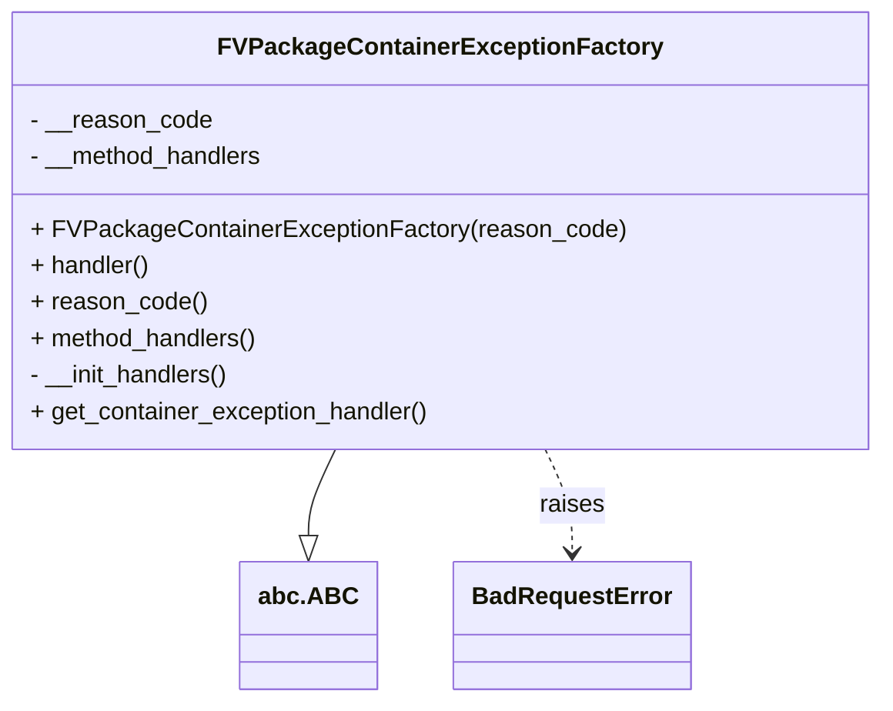

# Diagram: partview_core/partview_service/partview_service/core/business/package_container_exception_status/FVPackageContainerExceptionFactory.py

> Auto-generated by Obscura crawlers

## Mermaid

### SVG

<svg id="container" width="558.984375" xmlns="http://www.w3.org/2000/svg" class="classDiagram" height="462" viewBox="0 0 558.984375 462" role="graphics-document document" aria-roledescription="class"><g><defs><marker id="container_class-aggregationStart" class="marker aggregation class" refX="18" refY="7" markerWidth="190" markerHeight="240" orient="auto"><path d="M 18,7 L9,13 L1,7 L9,1 Z"></path></marker></defs><defs><marker id="container_class-aggregationEnd" class="marker aggregation class" refX="1" refY="7" markerWidth="20" markerHeight="28" orient="auto"><path d="M 18,7 L9,13 L1,7 L9,1 Z"></path></marker></defs><defs><marker id="container_class-extensionStart" class="marker extension class" refX="18" refY="7" markerWidth="190" markerHeight="240" orient="auto"><path d="M 1,7 L18,13 V 1 Z"></path></marker></defs><defs><marker id="container_class-extensionEnd" class="marker extension class" refX="1" refY="7" markerWidth="20" markerHeight="28" orient="auto"><path d="M 1,1 V 13 L18,7 Z"></path></marker></defs><defs><marker id="container_class-compositionStart" class="marker composition class" refX="18" refY="7" markerWidth="190" markerHeight="240" orient="auto"><path d="M 18,7 L9,13 L1,7 L9,1 Z"></path></marker></defs><defs><marker id="container_class-compositionEnd" class="marker composition class" refX="1" refY="7" markerWidth="20" markerHeight="28" orient="auto"><path d="M 18,7 L9,13 L1,7 L9,1 Z"></path></marker></defs><defs><marker id="container_class-dependencyStart" class="marker dependency class" refX="6" refY="7" markerWidth="190" markerHeight="240" orient="auto"><path d="M 5,7 L9,13 L1,7 L9,1 Z"></path></marker></defs><defs><marker id="container_class-dependencyEnd" class="marker dependency class" refX="13" refY="7" markerWidth="20" markerHeight="28" orient="auto"><path d="M 18,7 L9,13 L14,7 L9,1 Z"></path></marker></defs><defs><marker id="container_class-lollipopStart" class="marker lollipop class" refX="13" refY="7" markerWidth="190" markerHeight="240" orient="auto"><circle stroke="black" fill="transparent" cx="7" cy="7" r="6"></circle></marker></defs><defs><marker id="container_class-lollipopEnd" class="marker lollipop class" refX="1" refY="7" markerWidth="190" markerHeight="240" orient="auto"><circle stroke="black" fill="transparent" cx="7" cy="7" r="6"></circle></marker></defs><g class="root"><g class="clusters"></g><g class="edgePaths"><path d="M213.621,296L210.8,302.167C207.979,308.333,202.337,320.667,199.516,330.125C196.695,339.583,196.695,346.167,196.695,349.458L196.695,352.75" id="id_FVPackageContainerExceptionFactory_abc.ABC_1" class="edge-thickness-normal edge-pattern-solid relation" style=";;;" data-edge="true" data-et="edge" data-id="id_FVPackageContainerExceptionFactory_abc.ABC_1" data-points="W3sieCI6MjEzLjYyMDY0MDUzODY3NDAyLCJ5IjoyOTZ9LHsieCI6MTk2LjY5NTMxMjUsInkiOjMzM30seyJ4IjoxOTYuNjk1MzEyNSwieSI6MzcwfV0=" marker-end="url(#container_class-extensionEnd)"></path><path d="M345.364,296L348.185,302.167C351.006,308.333,356.647,320.667,359.468,332C362.289,343.333,362.289,353.667,362.289,358.833L362.289,364" id="id_FVPackageContainerExceptionFactory_BadRequestError_2" class="edge-thickness-normal edge-pattern-dashed relation" style=";;;" data-edge="true" data-et="edge" data-id="id_FVPackageContainerExceptionFactory_BadRequestError_2" data-points="W3sieCI6MzQ1LjM2MzczNDQ2MTMyNiwieSI6Mjk2fSx7IngiOjM2Mi4yODkwNjI1LCJ5IjozMzN9LHsieCI6MzYyLjI4OTA2MjUsInkiOjM3MH1d" marker-end="url(#container_class-dependencyEnd)"></path></g><g class="edgeLabels"><g class="edgeLabel"><g class="label" data-id="id_FVPackageContainerExceptionFactory_abc.ABC_1" transform="translate(0, 0)"><foreignObject width="0" height="0">

</foreignObject></g></g><g class="edgeLabel" transform="translate(362.2890625, 333)"><g class="label" data-id="id_FVPackageContainerExceptionFactory_BadRequestError_2" transform="translate(-21.25, -12)"><foreignObject width="42.5" height="24">

raises

</foreignObject></g></g></g><g class="nodes"><g class="node default" id="classId-abc.ABC-0" transform="translate(196.6953125, 412)"><g class="basic label-container"><path d="M-41.3125 -42 L41.3125 -42 L41.3125 42 L-41.3125 42" stroke="none" stroke-width="0" fill="#ECECFF" style=""></path><path d="M-41.3125 -42 C-15.931062745070477 -42, 9.450374509859046 -42, 41.3125 -42 M-41.3125 -42 C-19.11369663736757 -42, 3.0851067252648576 -42, 41.3125 -42 M41.3125 -42 C41.3125 -20.930254009885765, 41.3125 0.13949198022847042, 41.3125 42 M41.3125 -42 C41.3125 -23.292177752205326, 41.3125 -4.584355504410652, 41.3125 42 M41.3125 42 C17.429968216531844 42, -6.452563566936313 42, -41.3125 42 M41.3125 42 C19.45909917839441 42, -2.394301643211179 42, -41.3125 42 M-41.3125 42 C-41.3125 24.84532772476678, -41.3125 7.690655449533558, -41.3125 -42 M-41.3125 42 C-41.3125 21.7222516968213, -41.3125 1.4445033936425986, -41.3125 -42" stroke="#9370DB" stroke-width="1.3" fill="none" stroke-dasharray="0 0" style=""></path></g><g class="annotation-group text" transform="translate(0, -18)"></g><g class="label-group text" transform="translate(-29.3125, -18)"><g class="label" style="font-weight: bolder" transform="translate(0,-12)"><foreignObject width="58.625" height="24">

abc.ABC

</foreignObject></g></g><g class="members-group text" transform="translate(-29.3125, 30)"></g><g class="methods-group text" transform="translate(-29.3125, 60)"></g><g class="divider" style=""><path d="M-41.3125 6 C-22.873351075262327 6, -4.434202150524655 6, 41.3125 6 M-41.3125 6 C-9.939466858250743 6, 21.433566283498514 6, 41.3125 6" stroke="#9370DB" stroke-width="1.3" fill="none" stroke-dasharray="0 0" style=""></path></g><g class="divider" style=""><path d="M-41.3125 24 C-20.818517653490197 24, -0.324535306980394 24, 41.3125 24 M-41.3125 24 C-14.937300882660356 24, 11.437898234679288 24, 41.3125 24" stroke="#9370DB" stroke-width="1.3" fill="none" stroke-dasharray="0 0" style=""></path></g></g><g class="node default" id="classId-BadRequestError-1" transform="translate(362.2890625, 412)"><g class="basic label-container"><path d="M-74.28125 -42 L74.28125 -42 L74.28125 42 L-74.28125 42" stroke="none" stroke-width="0" fill="#ECECFF" style=""></path><path d="M-74.28125 -42 C-35.91821593596052 -42, 2.444818128078964 -42, 74.28125 -42 M-74.28125 -42 C-35.38506309714313 -42, 3.511123805713737 -42, 74.28125 -42 M74.28125 -42 C74.28125 -9.836814885881843, 74.28125 22.326370228236314, 74.28125 42 M74.28125 -42 C74.28125 -13.864504651504618, 74.28125 14.270990696990765, 74.28125 42 M74.28125 42 C39.527457654024104 42, 4.7736653080482085 42, -74.28125 42 M74.28125 42 C18.913758925393495 42, -36.45373214921301 42, -74.28125 42 M-74.28125 42 C-74.28125 15.645646253970384, -74.28125 -10.708707492059233, -74.28125 -42 M-74.28125 42 C-74.28125 18.793483709155478, -74.28125 -4.413032581689045, -74.28125 -42" stroke="#9370DB" stroke-width="1.3" fill="none" stroke-dasharray="0 0" style=""></path></g><g class="annotation-group text" transform="translate(0, -18)"></g><g class="label-group text" transform="translate(-62.28125, -18)"><g class="label" style="font-weight: bolder" transform="translate(0,-12)"><foreignObject width="124.5625" height="24">

BadRequestError

</foreignObject></g></g><g class="members-group text" transform="translate(-62.28125, 30)"></g><g class="methods-group text" transform="translate(-62.28125, 60)"></g><g class="divider" style=""><path d="M-74.28125 6 C-23.85765428275979 6, 26.565941434480422 6, 74.28125 6 M-74.28125 6 C-42.68504505635646 6, -11.088840112712923 6, 74.28125 6" stroke="#9370DB" stroke-width="1.3" fill="none" stroke-dasharray="0 0" style=""></path></g><g class="divider" style=""><path d="M-74.28125 24 C-41.92736090558491 24, -9.573471811169824 24, 74.28125 24 M-74.28125 24 C-39.463363793770554 24, -4.645477587541109 24, 74.28125 24" stroke="#9370DB" stroke-width="1.3" fill="none" stroke-dasharray="0 0" style=""></path></g></g><g class="node default" id="classId-FVPackageContainerExceptionFactory-2" transform="translate(279.4921875, 152)"><g class="basic label-container"><path d="M-271.4921875 -144 L271.4921875 -144 L271.4921875 144 L-271.4921875 144" stroke="none" stroke-width="0" fill="#ECECFF" style=""></path><path d="M-271.4921875 -144 C-106.56695369427968 -144, 58.35828011144065 -144, 271.4921875 -144 M-271.4921875 -144 C-142.146039549405 -144, -12.799891598810007 -144, 271.4921875 -144 M271.4921875 -144 C271.4921875 -83.12975995090507, 271.4921875 -22.259519901810137, 271.4921875 144 M271.4921875 -144 C271.4921875 -85.42076668665092, 271.4921875 -26.84153337330183, 271.4921875 144 M271.4921875 144 C105.64046419897804 144, -60.211259102043925 144, -271.4921875 144 M271.4921875 144 C122.52723341291417 144, -26.437720674171658 144, -271.4921875 144 M-271.4921875 144 C-271.4921875 85.73174345417029, -271.4921875 27.46348690834057, -271.4921875 -144 M-271.4921875 144 C-271.4921875 80.90199326210504, -271.4921875 17.80398652421006, -271.4921875 -144" stroke="#9370DB" stroke-width="1.3" fill="none" stroke-dasharray="0 0" style=""></path></g><g class="annotation-group text" transform="translate(0, -120)"></g><g class="label-group text" transform="translate(-136.203125, -120)"><g class="label" style="font-weight: bolder" transform="translate(0,-12)"><foreignObject width="272.40625" height="24">

FVPackageContainerExceptionFactory

</foreignObject></g></g><g class="members-group text" transform="translate(-259.4921875, -72)"><g class="label" style="" transform="translate(0,-12)"><foreignObject width="119.125" height="24">

- __reason_code

</foreignObject></g><g class="label" style="" transform="translate(0,12)"><foreignObject width="155.75" height="24">

- __method_handlers

</foreignObject></g></g><g class="methods-group text" transform="translate(-259.4921875, 0)"><g class="label" style="" transform="translate(0,-12)"><foreignObject width="382.78125" height="24">

+ FVPackageContainerExceptionFactory(reason_code)

</foreignObject></g><g class="label" style="" transform="translate(0,12)"><foreignObject width="79.125" height="24">

+ handler()

</foreignObject></g><g class="label" style="" transform="translate(0,36)"><foreignObject width="114.546875" height="24">

+ reason_code()

</foreignObject></g><g class="label" style="" transform="translate(0,60)"><foreignObject width="151.171875" height="24">

+ method_handlers()

</foreignObject></g><g class="label" style="" transform="translate(0,84)"><foreignObject width="133.796875" height="24">

- __init_handlers()

</foreignObject></g><g class="label" style="" transform="translate(0,108)"><foreignObject width="264.6875" height="24">

+ get_container_exception_handler()

</foreignObject></g></g><g class="divider" style=""><path d="M-271.4921875 -96 C-110.7438085368342 -96, 50.00457042633161 -96, 271.4921875 -96 M-271.4921875 -96 C-79.17514348079024 -96, 113.14190053841952 -96, 271.4921875 -96" stroke="#9370DB" stroke-width="1.3" fill="none" stroke-dasharray="0 0" style=""></path></g><g class="divider" style=""><path d="M-271.4921875 -24 C-115.4272200094216 -24, 40.637747481156794 -24, 271.4921875 -24 M-271.4921875 -24 C-59.84589934152174 -24, 151.8003888169565 -24, 271.4921875 -24" stroke="#9370DB" stroke-width="1.3" fill="none" stroke-dasharray="0 0" style=""></path></g></g></g></g></g></svg>
