# Diagram: partview_core/partview_service/partview_service/core/business/package_container_exception_status/FVPackageContainerExceptionStatus.py

> Auto-generated by Obscura crawlers

## Mermaid

```mermaid
classDiagram
class PackageContainerExceptionHandlerFactory {
  - handlers: dict
  + __init__(reason_code)
}
class FVPackageContainerExceptionStatus {
  - milestone_codes_to_reason_codes: dict
  - reason_codes_to_reason_codes: dict
  - __package_container_helper: PackageContainerExceptionHelper
  + __init__(application_name)
  + handle_new_package_container_event(container, event)
  + handle_new_package_container_exception(container, container_business, exception, attributes)
}
class PackageContainerExceptionHelper {
  + get_container_exception_type(solution_id, exception_type_id)
}
class PackageContainerArchiveHelper {
  + upsert_container_orchestrator_with_new_active_until_ts(container, active_until, soft_archive_until, reason, event_type)
  + set_container_status_based_on_archive_dates(container, active_until, soft_archive_until)
}
class PackageContainerEventBusinessLogic
class FVPackageContainerExceptionFactory {
  + __init__(reason_code)
}
class ShortException
class MissingException
class LostException
class HeldException
class MisroutedException
class RecycledException
class BackorderException
class PackageContainer
class PackageContainerEvent {
  + event_code
}
class PackageContainerException {
  + solution_id
  + exception_type_id
  + activation_ts
  + resolved_ts
  + exception_type_id
}
PackageContainerExceptionHandlerFactory --|> FVPackageContainerExceptionFactory : extends
FVPackageContainerExceptionStatus o-- PackageContainerExceptionHelper : uses
FVPackageContainerExceptionStatus ..> PackageContainerExceptionHandlerFactory : creates
FVPackageContainerExceptionStatus ..> PackageContainerArchiveHelper : calls
FVPackageContainerExceptionStatus ..> PackageContainerEventBusinessLogic : interacts with
PackageContainerExceptionHelper ..> PackageContainerException : inspects
PackageContainerArchiveHelper ..> PackageContainer : updates
PackageContainerEventBusinessLogic ..> PackageContainer : operates on
PackageContainerEventBusinessLogic ..> PackageContainerEvent : consumes
PackageContainerExceptionHandlerFactory "1" o-- "many" ShortException : maps to
PackageContainerExceptionHandlerFactory "1" o-- "many" MissingException
PackageContainerExceptionHandlerFactory "1" o-- "many" LostException
PackageContainerExceptionHandlerFactory "1" o-- "many" HeldException
PackageContainerExceptionHandlerFactory "1" o-- "many" MisroutedException
PackageContainerExceptionHandlerFactory "1" o-- "many" RecycledException
PackageContainerExceptionHandlerFactory "1" o-- "many" BackorderException
PackageContainerEvent "1" --> "many" FVPackageContainerExceptionStatus : triggers
PackageContainerException --> FVPackageContainerExceptionStatus : evaluated by
```

### SVG

<svg id="container" width="3534.0546875" xmlns="http://www.w3.org/2000/svg" class="classDiagram" height="770" viewBox="0 0 3534.0546875 770" role="graphics-document document" aria-roledescription="class"><g><defs><marker id="container_class-aggregationStart" class="marker aggregation class" refX="18" refY="7" markerWidth="190" markerHeight="240" orient="auto"><path d="M 18,7 L9,13 L1,7 L9,1 Z"></path></marker></defs><defs><marker id="container_class-aggregationEnd" class="marker aggregation class" refX="1" refY="7" markerWidth="20" markerHeight="28" orient="auto"><path d="M 18,7 L9,13 L1,7 L9,1 Z"></path></marker></defs><defs><marker id="container_class-extensionStart" class="marker extension class" refX="18" refY="7" markerWidth="190" markerHeight="240" orient="auto"><path d="M 1,7 L18,13 V 1 Z"></path></marker></defs><defs><marker id="container_class-extensionEnd" class="marker extension class" refX="1" refY="7" markerWidth="20" markerHeight="28" orient="auto"><path d="M 1,1 V 13 L18,7 Z"></path></marker></defs><defs><marker id="container_class-compositionStart" class="marker composition class" refX="18" refY="7" markerWidth="190" markerHeight="240" orient="auto"><path d="M 18,7 L9,13 L1,7 L9,1 Z"></path></marker></defs><defs><marker id="container_class-compositionEnd" class="marker composition class" refX="1" refY="7" markerWidth="20" markerHeight="28" orient="auto"><path d="M 18,7 L9,13 L1,7 L9,1 Z"></path></marker></defs><defs><marker id="container_class-dependencyStart" class="marker dependency class" refX="6" refY="7" markerWidth="190" markerHeight="240" orient="auto"><path d="M 5,7 L9,13 L1,7 L9,1 Z"></path></marker></defs><defs><marker id="container_class-dependencyEnd" class="marker dependency class" refX="13" refY="7" markerWidth="20" markerHeight="28" orient="auto"><path d="M 18,7 L9,13 L14,7 L9,1 Z"></path></marker></defs><defs><marker id="container_class-lollipopStart" class="marker lollipop class" refX="13" refY="7" markerWidth="190" markerHeight="240" orient="auto"><circle stroke="black" fill="transparent" cx="7" cy="7" r="6"></circle></marker></defs><defs><marker id="container_class-lollipopEnd" class="marker lollipop class" refX="1" refY="7" markerWidth="190" markerHeight="240" orient="auto"><circle stroke="black" fill="transparent" cx="7" cy="7" r="6"></circle></marker></defs><g class="root"><g class="clusters"></g><g class="edgePaths"><path d="M1462.232,422.628L1367.398,437.024C1272.564,451.419,1082.896,480.209,988.063,505.396C893.229,530.583,893.229,552.167,893.229,562.958L893.229,573.75" id="id_PackageContainerExceptionHandlerFactory_FVPackageContainerExceptionFactory_1" class="edge-thickness-normal edge-pattern-solid relation" style=";;;" data-edge="true" data-et="edge" data-id="id_PackageContainerExceptionHandlerFactory_FVPackageContainerExceptionFactory_1" data-points="W3sieCI6MTQ2Mi4yMzI0MjE4NzUsInkiOjQyMi42MjgzNTk4MTMwMDk4N30seyJ4Ijo4OTMuMjI4NTE1NjI1LCJ5Ijo1MDl9LHsieCI6ODkzLjIyODUxNTYyNSwieSI6NTkxfV0=" marker-end="url(#container_class-extensionEnd)"></path><path d="M1545.844,169.928L1340.555,189.107C1135.266,208.286,724.688,246.643,519.399,273.988C314.109,301.333,314.109,317.667,314.109,325.833L314.109,334" id="id_FVPackageContainerExceptionStatus_PackageContainerExceptionHelper_2" class="edge-thickness-normal edge-pattern-solid relation" style=";;;" data-edge="true" data-et="edge" data-id="id_FVPackageContainerExceptionStatus_PackageContainerExceptionHelper_2" data-points="W3sieCI6MTU2My4wMTk1MzEyNSwieSI6MTY4LjMyMzgxMDI1NDMzNjE3fSx7IngiOjMxNC4xMDkzNzUsInkiOjI4NX0seyJ4IjozMTQuMTA5Mzc1LCJ5IjozMzR9XQ==" marker-start="url(#container_class-aggregationStart)"></path><path d="M1716.753,248L1702.472,254.167C1688.191,260.333,1659.63,272.667,1645.349,284.5C1631.068,296.333,1631.068,307.667,1631.068,313.333L1631.068,319" id="id_FVPackageContainerExceptionStatus_PackageContainerExceptionHandlerFactory_3" class="edge-thickness-normal edge-pattern-dashed relation" style=";;;" data-edge="true" data-et="edge" data-id="id_FVPackageContainerExceptionStatus_PackageContainerExceptionHandlerFactory_3" data-points="W3sieCI6MTcxNi43NTI4MzYzODUzNTAzLCJ5IjoyNDh9LHsieCI6MTYzMS4wNjgzNTkzNzUsInkiOjI4NX0seyJ4IjoxNjMxLjA2ODM1OTM3NSwieSI6MzI1fV0=" marker-end="url(#container_class-dependencyEnd)"></path><path d="M2384.347,248L2404.373,254.167C2424.399,260.333,2464.452,272.667,2484.478,284C2504.504,295.333,2504.504,305.667,2504.504,310.833L2504.504,316" id="id_FVPackageContainerExceptionStatus_PackageContainerArchiveHelper_4" class="edge-thickness-normal edge-pattern-dashed relation" style=";;;" data-edge="true" data-et="edge" data-id="id_FVPackageContainerExceptionStatus_PackageContainerArchiveHelper_4" data-points="W3sieCI6MjM4NC4zNDY4ODQ5NTIyMjksInkiOjI0OH0seyJ4IjoyNTA0LjUwMzkwNjI1LCJ5IjoyODV9LHsieCI6MjUwNC41MDM5MDYyNSwieSI6MzIyfV0=" marker-end="url(#container_class-dependencyEnd)"></path><path d="M2426.277,183.671L2557.214,200.559C2688.151,217.447,2950.025,251.224,3080.962,278.779C3211.898,306.333,3211.898,327.667,3211.898,338.333L3211.898,349" id="id_FVPackageContainerExceptionStatus_PackageContainerEventBusinessLogic_5" class="edge-thickness-normal edge-pattern-dashed relation" style=";;;" data-edge="true" data-et="edge" data-id="id_FVPackageContainerExceptionStatus_PackageContainerEventBusinessLogic_5" data-points="W3sieCI6MjQyNi4yNzczNDM3NSwieSI6MTgzLjY3MTE3NTQyMTAzMTAyfSx7IngiOjMyMTEuODk4NDM3NSwieSI6Mjg1fSx7IngiOjMyMTEuODk4NDM3NSwieSI6MzU1fV0=" marker-end="url(#container_class-dependencyEnd)"></path><path d="M314.109,460L314.109,468.167C314.109,476.333,314.109,492.667,317.244,506.139C320.379,519.611,326.649,530.223,329.784,535.529L332.919,540.834" id="id_PackageContainerExceptionHelper_PackageContainerException_6" class="edge-thickness-normal edge-pattern-dashed relation" style=";;;" data-edge="true" data-et="edge" data-id="id_PackageContainerExceptionHelper_PackageContainerException_6" data-points="W3sieCI6MzE0LjEwOTM3NSwieSI6NDYwfSx7IngiOjMxNC4xMDkzNzUsInkiOjUwOX0seyJ4IjozMzUuOTcxNDcwOTA1MTcyNCwieSI6NTQ2fV0=" marker-end="url(#container_class-dependencyEnd)"></path><path d="M2504.504,472L2504.504,478.167C2504.504,484.333,2504.504,496.667,2516.202,519.187C2527.9,541.707,2551.297,574.413,2562.995,590.767L2574.693,607.12" id="id_PackageContainerArchiveHelper_PackageContainer_7" class="edge-thickness-normal edge-pattern-dashed relation" style=";;;" data-edge="true" data-et="edge" data-id="id_PackageContainerArchiveHelper_PackageContainer_7" data-points="W3sieCI6MjUwNC41MDM5MDYyNSwieSI6NDcyfSx7IngiOjI1MDQuNTAzOTA2MjUsInkiOjUwOX0seyJ4IjoyNTc4LjE4NDE0NjAxMjkzMTMsInkiOjYxMn1d" marker-end="url(#container_class-dependencyEnd)"></path><path d="M3100.777,439L3069.91,450.667C3039.043,462.333,2977.308,485.667,2909.03,514.983C2840.752,544.3,2765.93,579.599,2728.519,597.249L2691.108,614.899" id="id_PackageContainerEventBusinessLogic_PackageContainer_8" class="edge-thickness-normal edge-pattern-dashed relation" style=";;;" data-edge="true" data-et="edge" data-id="id_PackageContainerEventBusinessLogic_PackageContainer_8" data-points="W3sieCI6MzEwMC43NzY4NTU0Njg3NSwieSI6NDM5fSx7IngiOjI5MTUuNTc0MjE4NzUsInkiOjUwOX0seyJ4IjoyNjg1LjY4MTY0MDYyNSwieSI6NjE3LjQ1OTA1Mjc1MTMxN31d" marker-end="url(#container_class-dependencyEnd)"></path><path d="M3240.996,439L3249.079,450.667C3257.161,462.333,3273.327,485.667,3293.82,510.766C3314.313,535.864,3339.133,562.729,3351.544,576.161L3363.954,589.593" id="id_PackageContainerEventBusinessLogic_PackageContainerEvent_9" class="edge-thickness-normal edge-pattern-dashed relation" style=";;;" data-edge="true" data-et="edge" data-id="id_PackageContainerEventBusinessLogic_PackageContainerEvent_9" data-points="W3sieCI6MzI0MC45OTYwOTM3NSwieSI6NDM5fSx7IngiOjMyODkuNDkyMTg3NSwieSI6NTA5fSx7IngiOjMzNjguMDI1NTkyNjcyNDE0LCJ5Ijo1OTR9XQ==" marker-end="url(#container_class-dependencyEnd)"></path><path d="M1445.452,441.196L1397.991,452.497C1350.531,463.798,1255.61,486.399,1208.15,514.866C1160.689,543.333,1160.689,577.667,1160.689,594.833L1160.689,612" id="id_PackageContainerExceptionHandlerFactory_ShortException_10" class="edge-thickness-normal edge-pattern-solid relation" style=";;;" data-edge="true" data-et="edge" data-id="id_PackageContainerExceptionHandlerFactory_ShortException_10" data-points="W3sieCI6MTQ2Mi4yMzI0MjE4NzUsInkiOjQzNy4yMDA4MzU0MzAyMTM0fSx7IngiOjExNjAuNjg5NDUzMTI1LCJ5Ijo1MDl9LHsieCI6MTE2MC42ODk0NTMxMjUsInkiOjYxMn1d" marker-start="url(#container_class-aggregationStart)"></path><path d="M1446.238,471.646L1430.822,477.871C1415.406,484.097,1384.575,496.549,1369.16,519.941C1353.744,543.333,1353.744,577.667,1353.744,594.833L1353.744,612" id="id_PackageContainerExceptionHandlerFactory_MissingException_11" class="edge-thickness-normal edge-pattern-solid relation" style=";;;" data-edge="true" data-et="edge" data-id="id_PackageContainerExceptionHandlerFactory_MissingException_11" data-points="W3sieCI6MTQ2Mi4yMzI0MjE4NzUsInkiOjQ2NS4xODU5ODQ5Mjg1MTYwNn0seyJ4IjoxMzUzLjc0NDE0MDYyNSwieSI6NTA5fSx7IngiOjEzNTMuNzQ0MTQwNjI1LCJ5Ijo2MTJ9XQ==" marker-start="url(#container_class-aggregationStart)"></path><path d="M1563.192,482.511L1559.688,486.926C1556.184,491.341,1549.175,500.17,1545.67,521.752C1542.166,543.333,1542.166,577.667,1542.166,594.833L1542.166,612" id="id_PackageContainerExceptionHandlerFactory_LostException_12" class="edge-thickness-normal edge-pattern-solid relation" style=";;;" data-edge="true" data-et="edge" data-id="id_PackageContainerExceptionHandlerFactory_LostException_12" data-points="W3sieCI6MTU3My45MTY4NTI2Nzg1NzEzLCJ5Ijo0Njl9LHsieCI6MTU0Mi4xNjYwMTU2MjUsInkiOjUwOX0seyJ4IjoxNTQyLjE2NjAxNTYyNSwieSI6NjEyfV0=" marker-start="url(#container_class-aggregationStart)"></path><path d="M1698.944,482.511L1702.449,486.926C1705.953,491.341,1712.962,500.17,1716.466,521.752C1719.971,543.333,1719.971,577.667,1719.971,594.833L1719.971,612" id="id_PackageContainerExceptionHandlerFactory_HeldException_13" class="edge-thickness-normal edge-pattern-solid relation" style=";;;" data-edge="true" data-et="edge" data-id="id_PackageContainerExceptionHandlerFactory_HeldException_13" data-points="W3sieCI6MTY4OC4yMTk4NjYwNzE0Mjg3LCJ5Ijo0Njl9LHsieCI6MTcxOS45NzA3MDMxMjUsInkiOjUwOX0seyJ4IjoxNzE5Ljk3MDcwMzEyNSwieSI6NjEyfV0=" marker-start="url(#container_class-aggregationStart)"></path><path d="M1815.981,468.919L1833.156,475.599C1850.332,482.28,1884.683,495.64,1901.858,519.487C1919.033,543.333,1919.033,577.667,1919.033,594.833L1919.033,612" id="id_PackageContainerExceptionHandlerFactory_MisroutedException_14" class="edge-thickness-normal edge-pattern-solid relation" style=";;;" data-edge="true" data-et="edge" data-id="id_PackageContainerExceptionHandlerFactory_MisroutedException_14" data-points="W3sieCI6MTc5OS45MDQyOTY4NzUsInkiOjQ2Mi42NjY0MzYwNjEyNTk3fSx7IngiOjE5MTkuMDMzMjAzMTI1LCJ5Ijo1MDl9LHsieCI6MTkxOS4wMzMyMDMxMjUsInkiOjYxMn1d" marker-start="url(#container_class-aggregationStart)"></path><path d="M1816.741,438.369L1869.575,450.141C1922.409,461.913,2028.077,485.456,2080.91,514.395C2133.744,543.333,2133.744,577.667,2133.744,594.833L2133.744,612" id="id_PackageContainerExceptionHandlerFactory_RecycledException_15" class="edge-thickness-normal edge-pattern-solid relation" style=";;;" data-edge="true" data-et="edge" data-id="id_PackageContainerExceptionHandlerFactory_RecycledException_15" data-points="W3sieCI6MTc5OS45MDQyOTY4NzUsInkiOjQzNC42MTc5MzUyNjgyOTA4fSx7IngiOjIxMzMuNzQ0MTQwNjI1LCJ5Ijo1MDl9LHsieCI6MjEzMy43NDQxNDA2MjUsInkiOjYxMn1d" marker-start="url(#container_class-aggregationStart)"></path><path d="M1816.948,425.99L1905.656,439.825C1994.365,453.66,2171.781,481.33,2260.489,512.332C2349.197,543.333,2349.197,577.667,2349.197,594.833L2349.197,612" id="id_PackageContainerExceptionHandlerFactory_BackorderException_16" class="edge-thickness-normal edge-pattern-solid relation" style=";;;" data-edge="true" data-et="edge" data-id="id_PackageContainerExceptionHandlerFactory_BackorderException_16" data-points="W3sieCI6MTc5OS45MDQyOTY4NzUsInkiOjQyMy4zMzE3OTc1ODU5NTc0fSx7IngiOjIzNDkuMTk3MjY1NjI1LCJ5Ijo1MDl9LHsieCI6MjM0OS4xOTcyNjU2MjUsInkiOjYxMn1d" marker-start="url(#container_class-aggregationStart)"></path><path d="M3423.461,594L3423.461,579.833C3423.461,565.667,3423.461,537.333,3423.461,504.5C3423.461,471.667,3423.461,434.333,3423.461,397C3423.461,359.667,3423.461,322.333,3258.258,285.514C3093.054,248.694,2762.648,212.389,2597.445,194.236L2432.241,176.083" id="id_PackageContainerEvent_FVPackageContainerExceptionStatus_17" class="edge-thickness-normal edge-pattern-solid relation" style=";;;" data-edge="true" data-et="edge" data-id="id_PackageContainerEvent_FVPackageContainerExceptionStatus_17" data-points="W3sieCI6MzQyMy40NjA5Mzc1LCJ5Ijo1OTR9LHsieCI6MzQyMy40NjA5Mzc1LCJ5Ijo1MDl9LHsieCI6MzQyMy40NjA5Mzc1LCJ5IjozOTd9LHsieCI6MzQyMy40NjA5Mzc1LCJ5IjoyODV9LHsieCI6MjQyNi4yNzczNDM3NSwieSI6MTc1LjQyODAxMzMxOTYyNzMzfV0=" marker-end="url(#container_class-dependencyEnd)"></path><path d="M534.789,589.156L562.603,575.797C590.417,562.437,646.044,535.719,673.858,503.693C701.672,471.667,701.672,434.333,701.672,397C701.672,359.667,701.672,322.333,844.237,286.356C986.802,250.378,1271.933,215.756,1414.498,198.445L1557.063,181.134" id="id_PackageContainerException_FVPackageContainerExceptionStatus_18" class="edge-thickness-normal edge-pattern-solid relation" style=";;;" data-edge="true" data-et="edge" data-id="id_PackageContainerException_FVPackageContainerExceptionStatus_18" data-points="W3sieCI6NTM0Ljc4OTA2MjUsInkiOjU4OS4xNTU5MjA0NDgyMjI4fSx7IngiOjcwMS42NzE4NzUsInkiOjUwOX0seyJ4Ijo3MDEuNjcxODc1LCJ5IjozOTd9LHsieCI6NzAxLjY3MTg3NSwieSI6Mjg1fSx7IngiOjE1NjMuMDE5NTMxMjUsInkiOjE4MC40MTA2NDcwNjU1NzY2NX1d" marker-end="url(#container_class-dependencyEnd)"></path></g><g class="edgeLabels"><g class="edgeLabel" transform="translate(893.228515625, 509)"><g class="label" data-id="id_PackageContainerExceptionHandlerFactory_FVPackageContainerExceptionFactory_1" transform="translate(-28.5078125, -12)"><foreignObject width="57.015625" height="24">

extends

</foreignObject></g></g><g class="edgeLabel" transform="translate(314.109375, 285)"><g class="label" data-id="id_FVPackageContainerExceptionStatus_PackageContainerExceptionHelper_2" transform="translate(-16.4921875, -12)"><foreignObject width="32.984375" height="24">

uses

</foreignObject></g></g><g class="edgeLabel" transform="translate(1631.068359375, 285)"><g class="label" data-id="id_FVPackageContainerExceptionStatus_PackageContainerExceptionHandlerFactory_3" transform="translate(-26.171875, -12)"><foreignObject width="52.34375" height="24">

creates

</foreignObject></g></g><g class="edgeLabel" transform="translate(2504.50390625, 285)"><g class="label" data-id="id_FVPackageContainerExceptionStatus_PackageContainerArchiveHelper_4" transform="translate(-16.4453125, -12)"><foreignObject width="32.890625" height="24">

calls

</foreignObject></g></g><g class="edgeLabel" transform="translate(3211.8984375, 285)"><g class="label" data-id="id_FVPackageContainerExceptionStatus_PackageContainerEventBusinessLogic_5" transform="translate(-49.375, -12)"><foreignObject width="98.75" height="24">

interacts with

</foreignObject></g></g><g class="edgeLabel" transform="translate(314.109375, 509)"><g class="label" data-id="id_PackageContainerExceptionHelper_PackageContainerException_6" transform="translate(-30.2421875, -12)"><foreignObject width="60.484375" height="24">

inspects

</foreignObject></g></g><g class="edgeLabel" transform="translate(2504.50390625, 509)"><g class="label" data-id="id_PackageContainerArchiveHelper_PackageContainer_7" transform="translate(-29.4140625, -12)"><foreignObject width="58.828125" height="24">

updates

</foreignObject></g></g><g class="edgeLabel" transform="translate(2890.15923, 520.99032)"><g class="label" data-id="id_PackageContainerEventBusinessLogic_PackageContainer_8" transform="translate(-43.2890625, -12)"><foreignObject width="86.578125" height="24">

operates on

</foreignObject></g></g><g class="edgeLabel" transform="translate(3299.86416, 520.22602)"><g class="label" data-id="id_PackageContainerEventBusinessLogic_PackageContainerEvent_9" transform="translate(-36.375, -12)"><foreignObject width="72.75" height="24">

consumes

</foreignObject></g></g><g class="edgeLabel" transform="translate(1160.689453125, 509)"><g class="label" data-id="id_PackageContainerExceptionHandlerFactory_ShortException_10" transform="translate(-29.2578125, -12)"><foreignObject width="58.515625" height="24">

maps to

</foreignObject></g></g><g class="edgeLabel"><g class="label" data-id="id_PackageContainerExceptionHandlerFactory_MissingException_11" transform="translate(0, 0)"><foreignObject width="0" height="0">

</foreignObject></g></g><g class="edgeLabel"><g class="label" data-id="id_PackageContainerExceptionHandlerFactory_LostException_12" transform="translate(0, 0)"><foreignObject width="0" height="0">

</foreignObject></g></g><g class="edgeLabel"><g class="label" data-id="id_PackageContainerExceptionHandlerFactory_HeldException_13" transform="translate(0, 0)"><foreignObject width="0" height="0">

</foreignObject></g></g><g class="edgeLabel"><g class="label" data-id="id_PackageContainerExceptionHandlerFactory_MisroutedException_14" transform="translate(0, 0)"><foreignObject width="0" height="0">

</foreignObject></g></g><g class="edgeLabel"><g class="label" data-id="id_PackageContainerExceptionHandlerFactory_RecycledException_15" transform="translate(0, 0)"><foreignObject width="0" height="0">

</foreignObject></g></g><g class="edgeLabel"><g class="label" data-id="id_PackageContainerExceptionHandlerFactory_BackorderException_16" transform="translate(0, 0)"><foreignObject width="0" height="0">

</foreignObject></g></g><g class="edgeLabel" transform="translate(3423.4609375, 397)"><g class="label" data-id="id_PackageContainerEvent_FVPackageContainerExceptionStatus_17" transform="translate(-27.4921875, -12)"><foreignObject width="54.984375" height="24">

triggers

</foreignObject></g></g><g class="edgeLabel" transform="translate(701.671875, 397)"><g class="label" data-id="id_PackageContainerException_FVPackageContainerExceptionStatus_18" transform="translate(-46.453125, -12)"><foreignObject width="92.90625" height="24">

evaluated by

</foreignObject></g></g><g class="edgeTerminals" transform="translate(1441.7338993814783, 426.6623098876336)"><g class="inner" transform="translate(0, 0)"><foreignObject style="width: 9px; height: 12px;">
1
</foreignObject></g></g><g class="edgeTerminals" transform="translate(1440.3886617892247, 457.83070887963765)"><g class="inner" transform="translate(0, 0)"><foreignObject style="width: 9px; height: 12px;">
1
</foreignObject></g></g><g class="edgeTerminals" transform="translate(1551.2881841383726, 473.3810223773864)"><g class="inner" transform="translate(0, 0)"><foreignObject style="width: 9px; height: 12px;">
1
</foreignObject></g></g><g class="edgeTerminals" transform="translate(1687.3512410956696, 492.03248795125813)"><g class="inner" transform="translate(0, 0)"><foreignObject style="width: 9px; height: 12px;">
1
</foreignObject></g></g><g class="edgeTerminals" transform="translate(1810.7768485588379, 482.9897641051256)"><g class="inner" transform="translate(0, 0)"><foreignObject style="width: 9px; height: 12px;">
1
</foreignObject></g></g><g class="edgeTerminals" transform="translate(1813.7233232673598, 453.06473596739454)"><g class="inner" transform="translate(0, 0)"><foreignObject style="width: 9px; height: 12px;">
1
</foreignObject></g></g><g class="edgeTerminals" transform="translate(1814.883797311872, 440.8493471445615)"><g class="inner" transform="translate(0, 0)"><foreignObject style="width: 9px; height: 12px;">
1
</foreignObject></g></g><g class="edgeTerminals" transform="translate(3438.46093875, 576.5000010714285)"><g class="inner" transform="translate(0, 0)"><foreignObject style="width: 9px; height: 12px;">
1
</foreignObject></g></g><g class="edgeTerminals" transform="translate(1170.6894515625, 589.4999986607144)"><g class="inner" transform="translate(0, 0)"></g><foreignObject style="width: 36px; height: 12px;">
many
</foreignObject></g><g class="edgeTerminals" transform="translate(1363.7441403125, 589.4999997321429)"><g class="inner" transform="translate(0, 0)"></g><foreignObject style="width: 36px; height: 12px;">
many
</foreignObject></g><g class="edgeTerminals" transform="translate(1552.1660178124996, 589.500001875)"><g class="inner" transform="translate(0, 0)"></g><foreignObject style="width: 36px; height: 12px;">
many
</foreignObject></g><g class="edgeTerminals" transform="translate(1729.9707015625, 589.4999986607144)"><g class="inner" transform="translate(0, 0)"></g><foreignObject style="width: 36px; height: 12px;">
many
</foreignObject></g><g class="edgeTerminals" transform="translate(1929.0332015625, 589.4999986607144)"><g class="inner" transform="translate(0, 0)"></g><foreignObject style="width: 36px; height: 12px;">
many
</foreignObject></g><g class="edgeTerminals" transform="translate(2143.7441403125, 589.4999997321428)"><g class="inner" transform="translate(0, 0)"></g><foreignObject style="width: 36px; height: 12px;">
many
</foreignObject></g><g class="edgeTerminals" transform="translate(2359.1972678125003, 589.5000018750001)"><g class="inner" transform="translate(0, 0)"></g><foreignObject style="width: 36px; height: 12px;">
many
</foreignObject></g><g class="edgeTerminals" transform="translate(2437.034278840906, 187.24969375245007)"><g class="inner" transform="translate(0, 0)"></g><foreignObject style="width: 36px; height: 12px;">
many
</foreignObject></g></g><g class="nodes"><g class="node default" id="classId-PackageContainerExceptionHandlerFactory-0" transform="translate(1631.068359375, 397)"><g class="basic label-container"><path d="M-168.8359375 -72 L168.8359375 -72 L168.8359375 72 L-168.8359375 72" stroke="none" stroke-width="0" fill="#ECECFF" style=""></path><path d="M-168.8359375 -72 C-96.0509737989715 -72, -23.266010097942996 -72, 168.8359375 -72 M-168.8359375 -72 C-71.23603558111813 -72, 26.36386633776374 -72, 168.8359375 -72 M168.8359375 -72 C168.8359375 -29.780324714927062, 168.8359375 12.439350570145876, 168.8359375 72 M168.8359375 -72 C168.8359375 -34.89759649083443, 168.8359375 2.204807018331138, 168.8359375 72 M168.8359375 72 C89.28467459987546 72, 9.733411699750917 72, -168.8359375 72 M168.8359375 72 C56.23758314191514 72, -56.360771216169724 72, -168.8359375 72 M-168.8359375 72 C-168.8359375 20.8449495071439, -168.8359375 -30.310100985712197, -168.8359375 -72 M-168.8359375 72 C-168.8359375 25.678558553102206, -168.8359375 -20.642882893795587, -168.8359375 -72" stroke="#9370DB" stroke-width="1.3" fill="none" stroke-dasharray="0 0" style=""></path></g><g class="annotation-group text" transform="translate(0, -48)"></g><g class="label-group text" transform="translate(-156.8359375, -48)"><g class="label" style="font-weight: bolder" transform="translate(0,-12)"><foreignObject width="313.671875" height="24">

PackageContainerExceptionHandlerFactory

</foreignObject></g></g><g class="members-group text" transform="translate(-156.8359375, 0)"><g class="label" style="" transform="translate(0,-12)"><foreignObject width="110.046875" height="24">

- handlers: dict

</foreignObject></g></g><g class="methods-group text" transform="translate(-156.8359375, 48)"><g class="label" style="" transform="translate(0,-12)"><foreignObject width="139" height="24">

+ <strong>init</strong>(reason_code)

</foreignObject></g></g><g class="divider" style=""><path d="M-168.8359375 -24 C-58.5790398687365 -24, 51.677857762527 -24, 168.8359375 -24 M-168.8359375 -24 C-59.25903710323924 -24, 50.317863293521526 -24, 168.8359375 -24" stroke="#9370DB" stroke-width="1.3" fill="none" stroke-dasharray="0 0" style=""></path></g><g class="divider" style=""><path d="M-168.8359375 24 C-94.63922736192283 24, -20.44251722384567 24, 168.8359375 24 M-168.8359375 24 C-52.024165399203184 24, 64.78760670159363 24, 168.8359375 24" stroke="#9370DB" stroke-width="1.3" fill="none" stroke-dasharray="0 0" style=""></path></g></g><g class="node default" id="classId-FVPackageContainerExceptionStatus-1" transform="translate(1994.6484375, 128)"><g class="basic label-container"><path d="M-431.62890625 -120 L431.62890625 -120 L431.62890625 120 L-431.62890625 120" stroke="none" stroke-width="0" fill="#ECECFF" style=""></path><path d="M-431.62890625 -120 C-188.18323569978278 -120, 55.26243485043443 -120, 431.62890625 -120 M-431.62890625 -120 C-92.98642005041404 -120, 245.65606614917192 -120, 431.62890625 -120 M431.62890625 -120 C431.62890625 -45.456623944196124, 431.62890625 29.08675211160775, 431.62890625 120 M431.62890625 -120 C431.62890625 -62.721219513012635, 431.62890625 -5.442439026025269, 431.62890625 120 M431.62890625 120 C118.5682797541599 120, -194.4923467416802 120, -431.62890625 120 M431.62890625 120 C130.9282268191941 120, -169.7724526116118 120, -431.62890625 120 M-431.62890625 120 C-431.62890625 53.84503600025634, -431.62890625 -12.309927999487314, -431.62890625 -120 M-431.62890625 120 C-431.62890625 65.94005437409481, -431.62890625 11.880108748189627, -431.62890625 -120" stroke="#9370DB" stroke-width="1.3" fill="none" stroke-dasharray="0 0" style=""></path></g><g class="annotation-group text" transform="translate(0, -96)"></g><g class="label-group text" transform="translate(-133.0859375, -96)"><g class="label" style="font-weight: bolder" transform="translate(0,-12)"><foreignObject width="266.171875" height="24">

FVPackageContainerExceptionStatus

</foreignObject></g></g><g class="members-group text" transform="translate(-419.62890625, -48)"><g class="label" style="" transform="translate(0,-12)"><foreignObject width="298.375" height="24">

- milestone_codes_to_reason_codes: dict

</foreignObject></g><g class="label" style="" transform="translate(0,12)"><foreignObject width="275.6875" height="24">

- reason_codes_to_reason_codes: dict

</foreignObject></g><g class="label" style="" transform="translate(0,36)"><foreignObject width="473.484375" height="24">

- __package_container_helper: PackageContainerExceptionHelper

</foreignObject></g></g><g class="methods-group text" transform="translate(-419.62890625, 48)"><g class="label" style="" transform="translate(0,-12)"><foreignObject width="177.984375" height="24">

+ <strong>init</strong>(application_name)

</foreignObject></g><g class="label" style="" transform="translate(0,12)"><foreignObject width="417.765625" height="24">

+ handle_new_package_container_event(container, event)

</foreignObject></g><g class="label" style="" transform="translate(0,36)"><foreignObject width="706.171875" height="24">

+ handle_new_package_container_exception(container, container_business, exception, attributes)

</foreignObject></g></g><g class="divider" style=""><path d="M-431.62890625 -72 C-258.29641126596084 -72, -84.96391628192163 -72, 431.62890625 -72 M-431.62890625 -72 C-110.67463888083546 -72, 210.27962848832908 -72, 431.62890625 -72" stroke="#9370DB" stroke-width="1.3" fill="none" stroke-dasharray="0 0" style=""></path></g><g class="divider" style=""><path d="M-431.62890625 24 C-216.97046414368307 24, -2.312022037366148 24, 431.62890625 24 M-431.62890625 24 C-204.2256199167057 24, 23.17766641658858 24, 431.62890625 24" stroke="#9370DB" stroke-width="1.3" fill="none" stroke-dasharray="0 0" style=""></path></g></g><g class="node default" id="classId-PackageContainerExceptionHelper-2" transform="translate(314.109375, 397)"><g class="basic label-container"><path d="M-306.109375 -63 L306.109375 -63 L306.109375 63 L-306.109375 63" stroke="none" stroke-width="0" fill="#ECECFF" style=""></path><path d="M-306.109375 -63 C-90.1227357117478 -63, 125.86390357650441 -63, 306.109375 -63 M-306.109375 -63 C-168.84623883324514 -63, -31.583102666490277 -63, 306.109375 -63 M306.109375 -63 C306.109375 -26.250844150702882, 306.109375 10.498311698594236, 306.109375 63 M306.109375 -63 C306.109375 -30.147546273132406, 306.109375 2.7049074537351885, 306.109375 63 M306.109375 63 C178.6067628870444 63, 51.104150774088794 63, -306.109375 63 M306.109375 63 C135.54280274185928 63, -35.02376951628145 63, -306.109375 63 M-306.109375 63 C-306.109375 35.11617359588506, -306.109375 7.232347191770124, -306.109375 -63 M-306.109375 63 C-306.109375 16.544155252066275, -306.109375 -29.91168949586745, -306.109375 -63" stroke="#9370DB" stroke-width="1.3" fill="none" stroke-dasharray="0 0" style=""></path></g><g class="annotation-group text" transform="translate(0, -39)"></g><g class="label-group text" transform="translate(-125.671875, -39)"><g class="label" style="font-weight: bolder" transform="translate(0,-12)"><foreignObject width="251.34375" height="24">

PackageContainerExceptionHelper

</foreignObject></g></g><g class="members-group text" transform="translate(-294.109375, 9)"></g><g class="methods-group text" transform="translate(-294.109375, 39)"><g class="label" style="" transform="translate(0,-12)"><foreignObject width="462.546875" height="24">

+ get_container_exception_type(solution_id, exception_type_id)

</foreignObject></g></g><g class="divider" style=""><path d="M-306.109375 -15 C-152.80008320732455 -15, 0.5092085853509047 -15, 306.109375 -15 M-306.109375 -15 C-131.6479149948976 -15, 42.81354501020479 -15, 306.109375 -15" stroke="#9370DB" stroke-width="1.3" fill="none" stroke-dasharray="0 0" style=""></path></g><g class="divider" style=""><path d="M-306.109375 9 C-123.4143052125327 9, 59.28076457493461 9, 306.109375 9 M-306.109375 9 C-141.59753393100146 9, 22.91430713799707 9, 306.109375 9" stroke="#9370DB" stroke-width="1.3" fill="none" stroke-dasharray="0 0" style=""></path></g></g><g class="node default" id="classId-PackageContainerArchiveHelper-3" transform="translate(2504.50390625, 397)"><g class="basic label-container"><path d="M-508.32421875 -75 L508.32421875 -75 L508.32421875 75 L-508.32421875 75" stroke="none" stroke-width="0" fill="#ECECFF" style=""></path><path d="M-508.32421875 -75 C-293.53656610448905 -75, -78.74891345897811 -75, 508.32421875 -75 M-508.32421875 -75 C-203.98862997095364 -75, 100.34695880809272 -75, 508.32421875 -75 M508.32421875 -75 C508.32421875 -15.766720356528097, 508.32421875 43.466559286943806, 508.32421875 75 M508.32421875 -75 C508.32421875 -25.3695925800384, 508.32421875 24.2608148399232, 508.32421875 75 M508.32421875 75 C116.43007547494346 75, -275.46406780011307 75, -508.32421875 75 M508.32421875 75 C115.99224559063288 75, -276.33972756873425 75, -508.32421875 75 M-508.32421875 75 C-508.32421875 39.38586798005052, -508.32421875 3.77173596010104, -508.32421875 -75 M-508.32421875 75 C-508.32421875 27.513233193236374, -508.32421875 -19.973533613527252, -508.32421875 -75" stroke="#9370DB" stroke-width="1.3" fill="none" stroke-dasharray="0 0" style=""></path></g><g class="annotation-group text" transform="translate(0, -51)"></g><g class="label-group text" transform="translate(-116.8203125, -51)"><g class="label" style="font-weight: bolder" transform="translate(0,-12)"><foreignObject width="233.640625" height="24">

PackageContainerArchiveHelper

</foreignObject></g></g><g class="members-group text" transform="translate(-496.32421875, -3)"></g><g class="methods-group text" transform="translate(-496.32421875, 27)"><g class="label" style="" transform="translate(0,-12)"><foreignObject width="875.828125" height="24">

+ upsert_container_orchestrator_with_new_active_until_ts(container, active_until, soft_archive_until, reason, event_type)

</foreignObject></g><g class="label" style="" transform="translate(0,12)"><foreignObject width="658.140625" height="24">

+ set_container_status_based_on_archive_dates(container, active_until, soft_archive_until)

</foreignObject></g></g><g class="divider" style=""><path d="M-508.32421875 -27 C-256.3294768727144 -27, -4.334734995428732 -27, 508.32421875 -27 M-508.32421875 -27 C-120.2204110988385 -27, 267.883396552323 -27, 508.32421875 -27" stroke="#9370DB" stroke-width="1.3" fill="none" stroke-dasharray="0 0" style=""></path></g><g class="divider" style=""><path d="M-508.32421875 -3 C-122.81884616347133 -3, 262.68652642305733 -3, 508.32421875 -3 M-508.32421875 -3 C-156.6374078767425 -3, 195.04940299651503 -3, 508.32421875 -3" stroke="#9370DB" stroke-width="1.3" fill="none" stroke-dasharray="0 0" style=""></path></g></g><g class="node default" id="classId-PackageContainerEventBusinessLogic-4" transform="translate(3211.8984375, 397)"><g class="basic label-container"><path d="M-149.0703125 -42 L149.0703125 -42 L149.0703125 42 L-149.0703125 42" stroke="none" stroke-width="0" fill="#ECECFF" style=""></path><path d="M-149.0703125 -42 C-52.01681241269307 -42, 45.03668767461386 -42, 149.0703125 -42 M-149.0703125 -42 C-55.21813550645693 -42, 38.63404148708614 -42, 149.0703125 -42 M149.0703125 -42 C149.0703125 -24.301958323025186, 149.0703125 -6.603916646050372, 149.0703125 42 M149.0703125 -42 C149.0703125 -14.967837523840974, 149.0703125 12.064324952318053, 149.0703125 42 M149.0703125 42 C30.594903882824482 42, -87.88050473435104 42, -149.0703125 42 M149.0703125 42 C86.23093488416237 42, 23.391557268324746 42, -149.0703125 42 M-149.0703125 42 C-149.0703125 23.4244482230684, -149.0703125 4.8488964461367985, -149.0703125 -42 M-149.0703125 42 C-149.0703125 13.809193573732067, -149.0703125 -14.381612852535866, -149.0703125 -42" stroke="#9370DB" stroke-width="1.3" fill="none" stroke-dasharray="0 0" style=""></path></g><g class="annotation-group text" transform="translate(0, -18)"></g><g class="label-group text" transform="translate(-137.0703125, -18)"><g class="label" style="font-weight: bolder" transform="translate(0,-12)"><foreignObject width="274.140625" height="24">

PackageContainerEventBusinessLogic

</foreignObject></g></g><g class="members-group text" transform="translate(-137.0703125, 30)"></g><g class="methods-group text" transform="translate(-137.0703125, 60)"></g><g class="divider" style=""><path d="M-149.0703125 6 C-81.52368872872633 6, -13.977064957452654 6, 149.0703125 6 M-149.0703125 6 C-75.3156382454272 6, -1.5609639908543897 6, 149.0703125 6" stroke="#9370DB" stroke-width="1.3" fill="none" stroke-dasharray="0 0" style=""></path></g><g class="divider" style=""><path d="M-149.0703125 24 C-83.07738354854924 24, -17.08445459709847 24, 149.0703125 24 M-149.0703125 24 C-74.0646554793841 24, 0.9410015412317989 24, 149.0703125 24" stroke="#9370DB" stroke-width="1.3" fill="none" stroke-dasharray="0 0" style=""></path></g></g><g class="node default" id="classId-FVPackageContainerExceptionFactory-5" transform="translate(893.228515625, 654)"><g class="basic label-container"><path d="M-149.6015625 -63 L149.6015625 -63 L149.6015625 63 L-149.6015625 63" stroke="none" stroke-width="0" fill="#ECECFF" style=""></path><path d="M-149.6015625 -63 C-81.4798068668694 -63, -13.358051233738792 -63, 149.6015625 -63 M-149.6015625 -63 C-33.2504752358234 -63, 83.1006120283532 -63, 149.6015625 -63 M149.6015625 -63 C149.6015625 -37.70153888875785, 149.6015625 -12.403077777515712, 149.6015625 63 M149.6015625 -63 C149.6015625 -22.96458229533321, 149.6015625 17.070835409333583, 149.6015625 63 M149.6015625 63 C54.596770377475195 63, -40.40802174504961 63, -149.6015625 63 M149.6015625 63 C84.80729823536738 63, 20.013033970734767 63, -149.6015625 63 M-149.6015625 63 C-149.6015625 13.603801974551423, -149.6015625 -35.79239605089715, -149.6015625 -63 M-149.6015625 63 C-149.6015625 21.742048485016724, -149.6015625 -19.51590302996655, -149.6015625 -63" stroke="#9370DB" stroke-width="1.3" fill="none" stroke-dasharray="0 0" style=""></path></g><g class="annotation-group text" transform="translate(0, -39)"></g><g class="label-group text" transform="translate(-136.203125, -39)"><g class="label" style="font-weight: bolder" transform="translate(0,-12)"><foreignObject width="272.40625" height="24">

FVPackageContainerExceptionFactory

</foreignObject></g></g><g class="members-group text" transform="translate(-137.6015625, 9)"></g><g class="methods-group text" transform="translate(-137.6015625, 39)"><g class="label" style="" transform="translate(0,-12)"><foreignObject width="139" height="24">

+ <strong>init</strong>(reason_code)

</foreignObject></g></g><g class="divider" style=""><path d="M-149.6015625 -15 C-58.158460547920825 -15, 33.28464140415835 -15, 149.6015625 -15 M-149.6015625 -15 C-81.4772188341784 -15, -13.352875168356803 -15, 149.6015625 -15" stroke="#9370DB" stroke-width="1.3" fill="none" stroke-dasharray="0 0" style=""></path></g><g class="divider" style=""><path d="M-149.6015625 9 C-30.3200494279766 9, 88.9614636440468 9, 149.6015625 9 M-149.6015625 9 C-60.60325305661735 9, 28.395056386765305 9, 149.6015625 9" stroke="#9370DB" stroke-width="1.3" fill="none" stroke-dasharray="0 0" style=""></path></g></g><g class="node default" id="classId-ShortException-6" transform="translate(1160.689453125, 654)"><g class="basic label-container"><path d="M-67.859375 -42 L67.859375 -42 L67.859375 42 L-67.859375 42" stroke="none" stroke-width="0" fill="#ECECFF" style=""></path><path d="M-67.859375 -42 C-29.00272312779257 -42, 9.853928744414858 -42, 67.859375 -42 M-67.859375 -42 C-28.902037734437222 -42, 10.055299531125556 -42, 67.859375 -42 M67.859375 -42 C67.859375 -24.12928087760988, 67.859375 -6.258561755219759, 67.859375 42 M67.859375 -42 C67.859375 -17.268996997324315, 67.859375 7.46200600535137, 67.859375 42 M67.859375 42 C34.9930863031354 42, 2.1267976062707987 42, -67.859375 42 M67.859375 42 C20.654706363610075 42, -26.54996227277985 42, -67.859375 42 M-67.859375 42 C-67.859375 21.54228554128252, -67.859375 1.0845710825650414, -67.859375 -42 M-67.859375 42 C-67.859375 14.833802907572853, -67.859375 -12.332394184854294, -67.859375 -42" stroke="#9370DB" stroke-width="1.3" fill="none" stroke-dasharray="0 0" style=""></path></g><g class="annotation-group text" transform="translate(0, -18)"></g><g class="label-group text" transform="translate(-55.859375, -18)"><g class="label" style="font-weight: bolder" transform="translate(0,-12)"><foreignObject width="111.71875" height="24">

ShortException

</foreignObject></g></g><g class="members-group text" transform="translate(-55.859375, 30)"></g><g class="methods-group text" transform="translate(-55.859375, 60)"></g><g class="divider" style=""><path d="M-67.859375 6 C-33.23768389295997 6, 1.3840072140800572 6, 67.859375 6 M-67.859375 6 C-36.60623266176685 6, -5.3530903235337135 6, 67.859375 6" stroke="#9370DB" stroke-width="1.3" fill="none" stroke-dasharray="0 0" style=""></path></g><g class="divider" style=""><path d="M-67.859375 24 C-29.8021225768305 24, 8.255129846339003 24, 67.859375 24 M-67.859375 24 C-34.69171981706904 24, -1.5240646341380852 24, 67.859375 24" stroke="#9370DB" stroke-width="1.3" fill="none" stroke-dasharray="0 0" style=""></path></g></g><g class="node default" id="classId-MissingException-7" transform="translate(1353.744140625, 654)"><g class="basic label-container"><path d="M-75.1953125 -42 L75.1953125 -42 L75.1953125 42 L-75.1953125 42" stroke="none" stroke-width="0" fill="#ECECFF" style=""></path><path d="M-75.1953125 -42 C-33.333723394937756 -42, 8.527865710124487 -42, 75.1953125 -42 M-75.1953125 -42 C-40.25509581171323 -42, -5.314879123426465 -42, 75.1953125 -42 M75.1953125 -42 C75.1953125 -12.481628747353529, 75.1953125 17.036742505292942, 75.1953125 42 M75.1953125 -42 C75.1953125 -19.49535953004514, 75.1953125 3.009280939909722, 75.1953125 42 M75.1953125 42 C25.611794623739954 42, -23.971723252520093 42, -75.1953125 42 M75.1953125 42 C32.53572276582145 42, -10.123866968357106 42, -75.1953125 42 M-75.1953125 42 C-75.1953125 12.566659349599952, -75.1953125 -16.866681300800096, -75.1953125 -42 M-75.1953125 42 C-75.1953125 13.455862635337699, -75.1953125 -15.088274729324603, -75.1953125 -42" stroke="#9370DB" stroke-width="1.3" fill="none" stroke-dasharray="0 0" style=""></path></g><g class="annotation-group text" transform="translate(0, -18)"></g><g class="label-group text" transform="translate(-63.1953125, -18)"><g class="label" style="font-weight: bolder" transform="translate(0,-12)"><foreignObject width="126.390625" height="24">

MissingException

</foreignObject></g></g><g class="members-group text" transform="translate(-63.1953125, 30)"></g><g class="methods-group text" transform="translate(-63.1953125, 60)"></g><g class="divider" style=""><path d="M-75.1953125 6 C-39.91843620363111 6, -4.64155990726222 6, 75.1953125 6 M-75.1953125 6 C-39.93549570727101 6, -4.675678914542019 6, 75.1953125 6" stroke="#9370DB" stroke-width="1.3" fill="none" stroke-dasharray="0 0" style=""></path></g><g class="divider" style=""><path d="M-75.1953125 24 C-22.689511042077243 24, 29.816290415845515 24, 75.1953125 24 M-75.1953125 24 C-24.64775728693801 24, 25.89979792612398 24, 75.1953125 24" stroke="#9370DB" stroke-width="1.3" fill="none" stroke-dasharray="0 0" style=""></path></g></g><g class="node default" id="classId-LostException-8" transform="translate(1542.166015625, 654)"><g class="basic label-container"><path d="M-63.2265625 -42 L63.2265625 -42 L63.2265625 42 L-63.2265625 42" stroke="none" stroke-width="0" fill="#ECECFF" style=""></path><path d="M-63.2265625 -42 C-29.90832190590217 -42, 3.40991868819566 -42, 63.2265625 -42 M-63.2265625 -42 C-25.620946755721242 -42, 11.984668988557516 -42, 63.2265625 -42 M63.2265625 -42 C63.2265625 -18.74455570086774, 63.2265625 4.510888598264522, 63.2265625 42 M63.2265625 -42 C63.2265625 -15.825141453101256, 63.2265625 10.349717093797487, 63.2265625 42 M63.2265625 42 C34.571754973916 42, 5.916947447831994 42, -63.2265625 42 M63.2265625 42 C24.349263107401868 42, -14.528036285196265 42, -63.2265625 42 M-63.2265625 42 C-63.2265625 14.925728217428162, -63.2265625 -12.148543565143676, -63.2265625 -42 M-63.2265625 42 C-63.2265625 16.513946471345278, -63.2265625 -8.972107057309444, -63.2265625 -42" stroke="#9370DB" stroke-width="1.3" fill="none" stroke-dasharray="0 0" style=""></path></g><g class="annotation-group text" transform="translate(0, -18)"></g><g class="label-group text" transform="translate(-51.2265625, -18)"><g class="label" style="font-weight: bolder" transform="translate(0,-12)"><foreignObject width="102.453125" height="24">

LostException

</foreignObject></g></g><g class="members-group text" transform="translate(-51.2265625, 30)"></g><g class="methods-group text" transform="translate(-51.2265625, 60)"></g><g class="divider" style=""><path d="M-63.2265625 6 C-24.14728859554917 6, 14.931985308901659 6, 63.2265625 6 M-63.2265625 6 C-26.6147641971612 6, 9.9970341056776 6, 63.2265625 6" stroke="#9370DB" stroke-width="1.3" fill="none" stroke-dasharray="0 0" style=""></path></g><g class="divider" style=""><path d="M-63.2265625 24 C-33.5393604630291 24, -3.852158426058189 24, 63.2265625 24 M-63.2265625 24 C-13.047368706441837 24, 37.131825087116326 24, 63.2265625 24" stroke="#9370DB" stroke-width="1.3" fill="none" stroke-dasharray="0 0" style=""></path></g></g><g class="node default" id="classId-HeldException-9" transform="translate(1719.970703125, 654)"><g class="basic label-container"><path d="M-64.578125 -42 L64.578125 -42 L64.578125 42 L-64.578125 42" stroke="none" stroke-width="0" fill="#ECECFF" style=""></path><path d="M-64.578125 -42 C-28.872158760542632 -42, 6.833807478914736 -42, 64.578125 -42 M-64.578125 -42 C-21.808940062796296 -42, 20.960244874407408 -42, 64.578125 -42 M64.578125 -42 C64.578125 -22.816713500125314, 64.578125 -3.6334270002506273, 64.578125 42 M64.578125 -42 C64.578125 -15.860130410674447, 64.578125 10.279739178651106, 64.578125 42 M64.578125 42 C32.099922131150564 42, -0.3782807376988728 42, -64.578125 42 M64.578125 42 C36.71758407138951 42, 8.857043142779027 42, -64.578125 42 M-64.578125 42 C-64.578125 13.913947171427104, -64.578125 -14.172105657145792, -64.578125 -42 M-64.578125 42 C-64.578125 9.308996041845205, -64.578125 -23.38200791630959, -64.578125 -42" stroke="#9370DB" stroke-width="1.3" fill="none" stroke-dasharray="0 0" style=""></path></g><g class="annotation-group text" transform="translate(0, -18)"></g><g class="label-group text" transform="translate(-52.578125, -18)"><g class="label" style="font-weight: bolder" transform="translate(0,-12)"><foreignObject width="105.15625" height="24">

HeldException

</foreignObject></g></g><g class="members-group text" transform="translate(-52.578125, 30)"></g><g class="methods-group text" transform="translate(-52.578125, 60)"></g><g class="divider" style=""><path d="M-64.578125 6 C-20.36356427694986 6, 23.850996446100282 6, 64.578125 6 M-64.578125 6 C-24.309886583069606 6, 15.958351833860789 6, 64.578125 6" stroke="#9370DB" stroke-width="1.3" fill="none" stroke-dasharray="0 0" style=""></path></g><g class="divider" style=""><path d="M-64.578125 24 C-15.991475038210005 24, 32.59517492357999 24, 64.578125 24 M-64.578125 24 C-29.882246358055376 24, 4.813632283889248 24, 64.578125 24" stroke="#9370DB" stroke-width="1.3" fill="none" stroke-dasharray="0 0" style=""></path></g></g><g class="node default" id="classId-MisroutedException-10" transform="translate(1919.033203125, 654)"><g class="basic label-container"><path d="M-84.484375 -42 L84.484375 -42 L84.484375 42 L-84.484375 42" stroke="none" stroke-width="0" fill="#ECECFF" style=""></path><path d="M-84.484375 -42 C-37.66931200464872 -42, 9.145750990702567 -42, 84.484375 -42 M-84.484375 -42 C-39.94234121263291 -42, 4.599692574734178 -42, 84.484375 -42 M84.484375 -42 C84.484375 -9.17591637042996, 84.484375 23.64816725914008, 84.484375 42 M84.484375 -42 C84.484375 -11.002178550641915, 84.484375 19.99564289871617, 84.484375 42 M84.484375 42 C18.729569230322497 42, -47.02523653935501 42, -84.484375 42 M84.484375 42 C46.26888173150146 42, 8.053388463002918 42, -84.484375 42 M-84.484375 42 C-84.484375 14.438332522592095, -84.484375 -13.12333495481581, -84.484375 -42 M-84.484375 42 C-84.484375 19.543964518715494, -84.484375 -2.912070962569011, -84.484375 -42" stroke="#9370DB" stroke-width="1.3" fill="none" stroke-dasharray="0 0" style=""></path></g><g class="annotation-group text" transform="translate(0, -18)"></g><g class="label-group text" transform="translate(-72.484375, -18)"><g class="label" style="font-weight: bolder" transform="translate(0,-12)"><foreignObject width="144.96875" height="24">

MisroutedException

</foreignObject></g></g><g class="members-group text" transform="translate(-72.484375, 30)"></g><g class="methods-group text" transform="translate(-72.484375, 60)"></g><g class="divider" style=""><path d="M-84.484375 6 C-26.218262264917257 6, 32.047850470165486 6, 84.484375 6 M-84.484375 6 C-24.57745252469745 6, 35.3294699506051 6, 84.484375 6" stroke="#9370DB" stroke-width="1.3" fill="none" stroke-dasharray="0 0" style=""></path></g><g class="divider" style=""><path d="M-84.484375 24 C-32.029660677814114 24, 20.425053644371772 24, 84.484375 24 M-84.484375 24 C-46.81159370980328 24, -9.138812419606566 24, 84.484375 24" stroke="#9370DB" stroke-width="1.3" fill="none" stroke-dasharray="0 0" style=""></path></g></g><g class="node default" id="classId-RecycledException-11" transform="translate(2133.744140625, 654)"><g class="basic label-container"><path d="M-80.2265625 -42 L80.2265625 -42 L80.2265625 42 L-80.2265625 42" stroke="none" stroke-width="0" fill="#ECECFF" style=""></path><path d="M-80.2265625 -42 C-40.876190365774264 -42, -1.5258182315485271 -42, 80.2265625 -42 M-80.2265625 -42 C-41.170657235492016 -42, -2.114751970984031 -42, 80.2265625 -42 M80.2265625 -42 C80.2265625 -12.851497805656134, 80.2265625 16.297004388687732, 80.2265625 42 M80.2265625 -42 C80.2265625 -10.381339374436632, 80.2265625 21.237321251126737, 80.2265625 42 M80.2265625 42 C34.48345536614585 42, -11.259651767708306 42, -80.2265625 42 M80.2265625 42 C41.65461431209234 42, 3.0826661241846836 42, -80.2265625 42 M-80.2265625 42 C-80.2265625 11.282896909116253, -80.2265625 -19.434206181767493, -80.2265625 -42 M-80.2265625 42 C-80.2265625 13.401796495641229, -80.2265625 -15.196407008717543, -80.2265625 -42" stroke="#9370DB" stroke-width="1.3" fill="none" stroke-dasharray="0 0" style=""></path></g><g class="annotation-group text" transform="translate(0, -18)"></g><g class="label-group text" transform="translate(-68.2265625, -18)"><g class="label" style="font-weight: bolder" transform="translate(0,-12)"><foreignObject width="136.453125" height="24">

RecycledException

</foreignObject></g></g><g class="members-group text" transform="translate(-68.2265625, 30)"></g><g class="methods-group text" transform="translate(-68.2265625, 60)"></g><g class="divider" style=""><path d="M-80.2265625 6 C-37.08578197829137 6, 6.0549985434172555 6, 80.2265625 6 M-80.2265625 6 C-46.52099329459854 6, -12.81542408919708 6, 80.2265625 6" stroke="#9370DB" stroke-width="1.3" fill="none" stroke-dasharray="0 0" style=""></path></g><g class="divider" style=""><path d="M-80.2265625 24 C-45.39711840540087 24, -10.567674310801735 24, 80.2265625 24 M-80.2265625 24 C-22.4859443419312 24, 35.2546738161376 24, 80.2265625 24" stroke="#9370DB" stroke-width="1.3" fill="none" stroke-dasharray="0 0" style=""></path></g></g><g class="node default" id="classId-BackorderException-12" transform="translate(2349.197265625, 654)"><g class="basic label-container"><path d="M-85.2265625 -42 L85.2265625 -42 L85.2265625 42 L-85.2265625 42" stroke="none" stroke-width="0" fill="#ECECFF" style=""></path><path d="M-85.2265625 -42 C-40.23587343268838 -42, 4.754815634623242 -42, 85.2265625 -42 M-85.2265625 -42 C-28.828906073847442 -42, 27.568750352305116 -42, 85.2265625 -42 M85.2265625 -42 C85.2265625 -21.38927976176723, 85.2265625 -0.7785595235344616, 85.2265625 42 M85.2265625 -42 C85.2265625 -24.542818222732162, 85.2265625 -7.085636445464324, 85.2265625 42 M85.2265625 42 C42.3840093454307 42, -0.4585438091386038 42, -85.2265625 42 M85.2265625 42 C44.89919753569902 42, 4.5718325713980335 42, -85.2265625 42 M-85.2265625 42 C-85.2265625 16.373422527899233, -85.2265625 -9.253154944201533, -85.2265625 -42 M-85.2265625 42 C-85.2265625 18.63716935061753, -85.2265625 -4.7256612987649405, -85.2265625 -42" stroke="#9370DB" stroke-width="1.3" fill="none" stroke-dasharray="0 0" style=""></path></g><g class="annotation-group text" transform="translate(0, -18)"></g><g class="label-group text" transform="translate(-73.2265625, -18)"><g class="label" style="font-weight: bolder" transform="translate(0,-12)"><foreignObject width="146.453125" height="24">

BackorderException

</foreignObject></g></g><g class="members-group text" transform="translate(-73.2265625, 30)"></g><g class="methods-group text" transform="translate(-73.2265625, 60)"></g><g class="divider" style=""><path d="M-85.2265625 6 C-33.768131722368985 6, 17.69029905526203 6, 85.2265625 6 M-85.2265625 6 C-37.63214896775094 6, 9.962264564498113 6, 85.2265625 6" stroke="#9370DB" stroke-width="1.3" fill="none" stroke-dasharray="0 0" style=""></path></g><g class="divider" style=""><path d="M-85.2265625 24 C-49.80600351294959 24, -14.385444525899175 24, 85.2265625 24 M-85.2265625 24 C-49.67385816521633 24, -14.121153830432661 24, 85.2265625 24" stroke="#9370DB" stroke-width="1.3" fill="none" stroke-dasharray="0 0" style=""></path></g></g><g class="node default" id="classId-PackageContainer-13" transform="translate(2608.228515625, 654)"><g class="basic label-container"><path d="M-77.453125 -42 L77.453125 -42 L77.453125 42 L-77.453125 42" stroke="none" stroke-width="0" fill="#ECECFF" style=""></path><path d="M-77.453125 -42 C-31.812068888801768 -42, 13.828987222396464 -42, 77.453125 -42 M-77.453125 -42 C-18.308859124178397 -42, 40.835406751643205 -42, 77.453125 -42 M77.453125 -42 C77.453125 -13.315933924745337, 77.453125 15.368132150509325, 77.453125 42 M77.453125 -42 C77.453125 -19.281899983040503, 77.453125 3.4362000339189933, 77.453125 42 M77.453125 42 C35.142909825580006 42, -7.167305348839989 42, -77.453125 42 M77.453125 42 C17.89575943235122 42, -41.66160613529756 42, -77.453125 42 M-77.453125 42 C-77.453125 14.083527069131154, -77.453125 -13.832945861737691, -77.453125 -42 M-77.453125 42 C-77.453125 17.413974863427686, -77.453125 -7.172050273144627, -77.453125 -42" stroke="#9370DB" stroke-width="1.3" fill="none" stroke-dasharray="0 0" style=""></path></g><g class="annotation-group text" transform="translate(0, -18)"></g><g class="label-group text" transform="translate(-65.453125, -18)"><g class="label" style="font-weight: bolder" transform="translate(0,-12)"><foreignObject width="130.90625" height="24">

PackageContainer

</foreignObject></g></g><g class="members-group text" transform="translate(-65.453125, 30)"></g><g class="methods-group text" transform="translate(-65.453125, 60)"></g><g class="divider" style=""><path d="M-77.453125 6 C-35.06807238939792 6, 7.316980221204162 6, 77.453125 6 M-77.453125 6 C-46.03821337540583 6, -14.623301750811656 6, 77.453125 6" stroke="#9370DB" stroke-width="1.3" fill="none" stroke-dasharray="0 0" style=""></path></g><g class="divider" style=""><path d="M-77.453125 24 C-28.368236415158634 24, 20.71665216968273 24, 77.453125 24 M-77.453125 24 C-26.463126634400012 24, 24.526871731199975 24, 77.453125 24" stroke="#9370DB" stroke-width="1.3" fill="none" stroke-dasharray="0 0" style=""></path></g></g><g class="node default" id="classId-PackageContainerEvent-14" transform="translate(3423.4609375, 654)"><g class="basic label-container"><path d="M-102.59375 -60 L102.59375 -60 L102.59375 60 L-102.59375 60" stroke="none" stroke-width="0" fill="#ECECFF" style=""></path><path d="M-102.59375 -60 C-50.868596849115264 -60, 0.8565563017694728 -60, 102.59375 -60 M-102.59375 -60 C-21.464820673082656 -60, 59.66410865383469 -60, 102.59375 -60 M102.59375 -60 C102.59375 -25.330883655117688, 102.59375 9.338232689764624, 102.59375 60 M102.59375 -60 C102.59375 -32.67464636590031, 102.59375 -5.349292731800617, 102.59375 60 M102.59375 60 C38.25662870474409 60, -26.080492590511824 60, -102.59375 60 M102.59375 60 C54.450432201077625 60, 6.30711440215525 60, -102.59375 60 M-102.59375 60 C-102.59375 14.344117481332844, -102.59375 -31.31176503733431, -102.59375 -60 M-102.59375 60 C-102.59375 16.620759169887272, -102.59375 -26.758481660225456, -102.59375 -60" stroke="#9370DB" stroke-width="1.3" fill="none" stroke-dasharray="0 0" style=""></path></g><g class="annotation-group text" transform="translate(0, -36)"></g><g class="label-group text" transform="translate(-85.65625, -36)"><g class="label" style="font-weight: bolder" transform="translate(0,-12)"><foreignObject width="171.3125" height="24">

PackageContainerEvent

</foreignObject></g></g><g class="members-group text" transform="translate(-90.59375, 12)"><g class="label" style="" transform="translate(0,-12)"><foreignObject width="95.53125" height="24">

+ event_code

</foreignObject></g></g><g class="methods-group text" transform="translate(-90.59375, 60)"></g><g class="divider" style=""><path d="M-102.59375 -12 C-52.20333170101193 -12, -1.8129134020238666 -12, 102.59375 -12 M-102.59375 -12 C-22.99024963534606 -12, 56.61325072930788 -12, 102.59375 -12" stroke="#9370DB" stroke-width="1.3" fill="none" stroke-dasharray="0 0" style=""></path></g><g class="divider" style=""><path d="M-102.59375 36 C-54.480233212818064 36, -6.3667164256361275 36, 102.59375 36 M-102.59375 36 C-40.73979672725023 36, 21.11415654549954 36, 102.59375 36" stroke="#9370DB" stroke-width="1.3" fill="none" stroke-dasharray="0 0" style=""></path></g></g><g class="node default" id="classId-PackageContainerException-15" transform="translate(399.78515625, 654)"><g class="basic label-container"><path d="M-135.00390625 -108 L135.00390625 -108 L135.00390625 108 L-135.00390625 108" stroke="none" stroke-width="0" fill="#ECECFF" style=""></path><path d="M-135.00390625 -108 C-32.70723125774349 -108, 69.58944373451303 -108, 135.00390625 -108 M-135.00390625 -108 C-62.381096353935476 -108, 10.241713542129048 -108, 135.00390625 -108 M135.00390625 -108 C135.00390625 -25.096241250200364, 135.00390625 57.80751749959927, 135.00390625 108 M135.00390625 -108 C135.00390625 -26.007999803931, 135.00390625 55.984000392138, 135.00390625 108 M135.00390625 108 C75.27620538025265 108, 15.548504510505296 108, -135.00390625 108 M135.00390625 108 C71.50289948045261 108, 8.001892710905238 108, -135.00390625 108 M-135.00390625 108 C-135.00390625 23.95688049183144, -135.00390625 -60.08623901633712, -135.00390625 -108 M-135.00390625 108 C-135.00390625 28.528118100553826, -135.00390625 -50.94376379889235, -135.00390625 -108" stroke="#9370DB" stroke-width="1.3" fill="none" stroke-dasharray="0 0" style=""></path></g><g class="annotation-group text" transform="translate(0, -84)"></g><g class="label-group text" transform="translate(-101.1484375, -84)"><g class="label" style="font-weight: bolder" transform="translate(0,-12)"><foreignObject width="202.296875" height="24">

PackageContainerException

</foreignObject></g></g><g class="members-group text" transform="translate(-123.00390625, -36)"><g class="label" style="" transform="translate(0,-12)"><foreignObject width="94.453125" height="24">

+ solution_id

</foreignObject></g><g class="label" style="" transform="translate(0,12)"><foreignObject width="144.859375" height="24">

+ exception_type_id

</foreignObject></g><g class="label" style="" transform="translate(0,36)"><foreignObject width="105.453125" height="24">

+ activation_ts

</foreignObject></g><g class="label" style="" transform="translate(0,60)"><foreignObject width="95.34375" height="24">

+ resolved_ts

</foreignObject></g><g class="label" style="" transform="translate(0,84)"><foreignObject width="144.859375" height="24">

+ exception_type_id

</foreignObject></g></g><g class="methods-group text" transform="translate(-123.00390625, 108)"></g><g class="divider" style=""><path d="M-135.00390625 -60 C-56.01240014007361 -60, 22.97910596985278 -60, 135.00390625 -60 M-135.00390625 -60 C-68.3424816046119 -60, -1.6810569592238096 -60, 135.00390625 -60" stroke="#9370DB" stroke-width="1.3" fill="none" stroke-dasharray="0 0" style=""></path></g><g class="divider" style=""><path d="M-135.00390625 84 C-34.65563852036577 84, 65.69262920926846 84, 135.00390625 84 M-135.00390625 84 C-57.51891493910507 84, 19.966076371789853 84, 135.00390625 84" stroke="#9370DB" stroke-width="1.3" fill="none" stroke-dasharray="0 0" style=""></path></g></g></g></g></g></svg>
