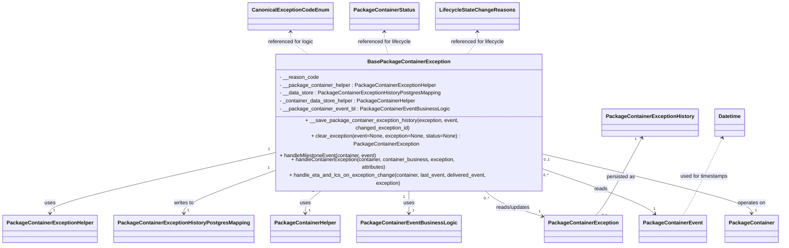

# Diagram: partview_core/partview_service/partview_service/core/business/package_container_exception_status/package_container_exceptions/BasePackageContainerException.py


> Auto-generated by Obscura crawlers

## Diagram 1



### SVG

<svg id="container" width="2310.94921875" xmlns="http://www.w3.org/2000/svg" class="classDiagram" height="668" viewBox="0 0 2310.94921875 668" role="graphics-document document" aria-roledescription="class"><style>#container{font-family:"trebuchet ms",verdana,arial,sans-serif;font-size:16px;fill:#333;}@keyframes edge-animation-frame{from{stroke-dashoffset:0;}}@keyframes dash{to{stroke-dashoffset:0;}}#container .edge-animation-slow{stroke-dasharray:9,5!important;stroke-dashoffset:900;animation:dash 50s linear infinite;stroke-linecap:round;}#container .edge-animation-fast{stroke-dasharray:9,5!important;stroke-dashoffset:900;animation:dash 20s linear infinite;stroke-linecap:round;}#container .error-icon{fill:#552222;}#container .error-text{fill:#552222;stroke:#552222;}#container .edge-thickness-normal{stroke-width:1px;}#container .edge-thickness-thick{stroke-width:3.5px;}#container .edge-pattern-solid{stroke-dasharray:0;}#container .edge-thickness-invisible{stroke-width:0;fill:none;}#container .edge-pattern-dashed{stroke-dasharray:3;}#container .edge-pattern-dotted{stroke-dasharray:2;}#container .marker{fill:#333333;stroke:#333333;}#container .marker.cross{stroke:#333333;}#container svg{font-family:"trebuchet ms",verdana,arial,sans-serif;font-size:16px;}#container p{margin:0;}#container g.classGroup text{fill:#9370DB;stroke:none;font-family:"trebuchet ms",verdana,arial,sans-serif;font-size:10px;}#container g.classGroup text .title{font-weight:bolder;}#container .nodeLabel,#container .edgeLabel{color:#131300;}#container .edgeLabel .label rect{fill:#ECECFF;}#container .label text{fill:#131300;}#container .labelBkg{background:#ECECFF;}#container .edgeLabel .label span{background:#ECECFF;}#container .classTitle{font-weight:bolder;}#container .node rect,#container .node circle,#container .node ellipse,#container .node polygon,#container .node path{fill:#ECECFF;stroke:#9370DB;stroke-width:1px;}#container .divider{stroke:#9370DB;stroke-width:1;}#container g.clickable{cursor:pointer;}#container g.classGroup rect{fill:#ECECFF;stroke:#9370DB;}#container g.classGroup line{stroke:#9370DB;stroke-width:1;}#container .classLabel .box{stroke:none;stroke-width:0;fill:#ECECFF;opacity:0.5;}#container .classLabel .label{fill:#9370DB;font-size:10px;}#container .relation{stroke:#333333;stroke-width:1;fill:none;}#container .dashed-line{stroke-dasharray:3;}#container .dotted-line{stroke-dasharray:1 2;}#container #compositionStart,#container .composition{fill:#333333!important;stroke:#333333!important;stroke-width:1;}#container #compositionEnd,#container .composition{fill:#333333!important;stroke:#333333!important;stroke-width:1;}#container #dependencyStart,#container .dependency{fill:#333333!important;stroke:#333333!important;stroke-width:1;}#container #dependencyStart,#container .dependency{fill:#333333!important;stroke:#333333!important;stroke-width:1;}#container #extensionStart,#container .extension{fill:transparent!important;stroke:#333333!important;stroke-width:1;}#container #extensionEnd,#container .extension{fill:transparent!important;stroke:#333333!important;stroke-width:1;}#container #aggregationStart,#container .aggregation{fill:transparent!important;stroke:#333333!important;stroke-width:1;}#container #aggregationEnd,#container .aggregation{fill:transparent!important;stroke:#333333!important;stroke-width:1;}#container #lollipopStart,#container .lollipop{fill:#ECECFF!important;stroke:#333333!important;stroke-width:1;}#container #lollipopEnd,#container .lollipop{fill:#ECECFF!important;stroke:#333333!important;stroke-width:1;}#container .edgeTerminals{font-size:11px;line-height:initial;}#container .classTitleText{text-anchor:middle;font-size:18px;fill:#333;}#container .label-icon{display:inline-block;height:1em;overflow:visible;vertical-align:-0.125em;}#container .node .label-icon path{fill:currentColor;stroke:revert;stroke-width:revert;}#container :root{--mermaid-font-family:"trebuchet ms",verdana,arial,sans-serif;}</style><g><defs><marker id="container_class-aggregationStart" class="marker aggregation class" refX="18" refY="7" markerWidth="190" markerHeight="240" orient="auto"><path d="M 18,7 L9,13 L1,7 L9,1 Z"></path></marker></defs><defs><marker id="container_class-aggregationEnd" class="marker aggregation class" refX="1" refY="7" markerWidth="20" markerHeight="28" orient="auto"><path d="M 18,7 L9,13 L1,7 L9,1 Z"></path></marker></defs><defs><marker id="container_class-extensionStart" class="marker extension class" refX="18" refY="7" markerWidth="190" markerHeight="240" orient="auto"><path d="M 1,7 L18,13 V 1 Z"></path></marker></defs><defs><marker id="container_class-extensionEnd" class="marker extension class" refX="1" refY="7" markerWidth="20" markerHeight="28" orient="auto"><path d="M 1,1 V 13 L18,7 Z"></path></marker></defs><defs><marker id="container_class-compositionStart" class="marker composition class" refX="18" refY="7" markerWidth="190" markerHeight="240" orient="auto"><path d="M 18,7 L9,13 L1,7 L9,1 Z"></path></marker></defs><defs><marker id="container_class-compositionEnd" class="marker composition class" refX="1" refY="7" markerWidth="20" markerHeight="28" orient="auto"><path d="M 18,7 L9,13 L1,7 L9,1 Z"></path></marker></defs><defs><marker id="container_class-dependencyStart" class="marker dependency class" refX="6" refY="7" markerWidth="190" markerHeight="240" orient="auto"><path d="M 5,7 L9,13 L1,7 L9,1 Z"></path></marker></defs><defs><marker id="container_class-dependencyEnd" class="marker dependency class" refX="13" refY="7" markerWidth="20" markerHeight="28" orient="auto"><path d="M 18,7 L9,13 L14,7 L9,1 Z"></path></marker></defs><defs><marker id="container_class-lollipopStart" class="marker lollipop class" refX="13" refY="7" markerWidth="190" markerHeight="240" orient="auto"><circle stroke="black" fill="transparent" cx="7" cy="7" r="6"></circle></marker></defs><defs><marker id="container_class-lollipopEnd" class="marker lollipop class" refX="1" refY="7" markerWidth="190" markerHeight="240" orient="auto"><circle stroke="black" fill="transparent" cx="7" cy="7" r="6"></circle></marker></defs><g class="root"><g class="clusters"></g><g class="edgePaths"><path d="M777.391,415.223L672.104,435.853C566.818,456.482,356.245,497.741,250.958,523.537C145.672,549.333,145.672,559.667,145.672,564.833L145.672,570" id="id_BasePackageContainerException_PackageContainerExceptionHelper_1" class="edge-thickness-normal edge-pattern-solid relation" style=";;;" data-edge="true" data-et="edge" data-id="id_BasePackageContainerException_PackageContainerExceptionHelper_1" data-points="W3sieCI6Nzc3LjM5MDYyNSwieSI6NDE1LjIyMzI5NTgyMzY1NzJ9LHsieCI6MTQ1LjY3MTg3NSwieSI6NTM5fSx7IngiOjE0NS42NzE4NzUsInkiOjU3Nn1d" marker-end="url(#container_class-dependencyEnd)"></path><path d="M777.391,463.584L737.181,476.153C696.971,488.722,616.552,513.861,576.342,531.597C536.133,549.333,536.133,559.667,536.133,564.833L536.133,570" id="id_BasePackageContainerException_PackageContainerExceptionHistoryPostgresMapping_2" class="edge-thickness-normal edge-pattern-solid relation" style=";;;" data-edge="true" data-et="edge" data-id="id_BasePackageContainerException_PackageContainerExceptionHistoryPostgresMapping_2" data-points="W3sieCI6Nzc3LjM5MDYyNSwieSI6NDYzLjU4MzU4MTUyMDU3Mzd9LHsieCI6NTM2LjEzMjgxMjUsInkiOjUzOX0seyJ4Ijo1MzYuMTMyODEyNSwieSI6NTc2fV0=" marker-end="url(#container_class-dependencyEnd)"></path><path d="M945.225,502L936.169,508.167C927.113,514.333,909.002,526.667,899.946,538C890.891,549.333,890.891,559.667,890.891,564.833L890.891,570" id="id_BasePackageContainerException_PackageContainerHelper_3" class="edge-thickness-normal edge-pattern-solid relation" style=";;;" data-edge="true" data-et="edge" data-id="id_BasePackageContainerException_PackageContainerHelper_3" data-points="W3sieCI6OTQ1LjIyNDUwNDU3MzE3MDcsInkiOjUwMn0seyJ4Ijo4OTAuODkwNjI1LCJ5Ijo1Mzl9LHsieCI6ODkwLjg5MDYyNSwieSI6NTc2fV0=" marker-end="url(#container_class-dependencyEnd)"></path><path d="M1191.93,502L1191.93,508.167C1191.93,514.333,1191.93,526.667,1191.93,538C1191.93,549.333,1191.93,559.667,1191.93,564.833L1191.93,570" id="id_BasePackageContainerException_PackageContainerEventBusinessLogic_4" class="edge-thickness-normal edge-pattern-solid relation" style=";;;" data-edge="true" data-et="edge" data-id="id_BasePackageContainerException_PackageContainerEventBusinessLogic_4" data-points="W3sieCI6MTE5MS45Mjk2ODc1LCJ5Ijo1MDJ9LHsieCI6MTE5MS45Mjk2ODc1LCJ5Ijo1Mzl9LHsieCI6MTE5MS45Mjk2ODc1LCJ5Ijo1NzZ9XQ==" marker-end="url(#container_class-dependencyEnd)"></path><path d="M1418.65,502L1426.972,508.167C1435.294,514.333,1451.938,526.667,1483.303,539.913C1514.668,553.159,1560.753,567.317,1583.796,574.397L1606.839,581.476" id="id_BasePackageContainerException_PackageContainerException_5" class="edge-thickness-normal edge-pattern-solid relation" style=";;;" data-edge="true" data-et="edge" data-id="id_BasePackageContainerException_PackageContainerException_5" data-points="W3sieCI6MTQxOC42NDk2NTcwMTIxOTUxLCJ5Ijo1MDJ9LHsieCI6MTQ2OC41ODIwMzEyNSwieSI6NTM5fSx7IngiOjE2MTIuNTc0MjE4NzUsInkiOjU4My4yMzc5ODM4MzY2NjUzfV0=" marker-end="url(#container_class-dependencyEnd)"></path><path d="M1606.469,454.348L1655.066,468.456C1703.664,482.565,1800.859,510.783,1855.617,530.392C1910.375,550.001,1922.695,561.002,1928.856,566.503L1935.016,572.004" id="id_BasePackageContainerException_PackageContainerEvent_6" class="edge-thickness-normal edge-pattern-solid relation" style=";;;" data-edge="true" data-et="edge" data-id="id_BasePackageContainerException_PackageContainerEvent_6" data-points="W3sieCI6MTYwNi40Njg3NSwieSI6NDU0LjM0NzY4MzIxODI2ODd9LHsieCI6MTg5OC4wNTQ2ODc1LCJ5Ijo1Mzl9LHsieCI6MTkzOS40OTEyNDgwMjIxNTIsInkiOjU3Nn1d" marker-end="url(#container_class-dependencyEnd)"></path><path d="M1606.469,416.221L1709.64,436.684C1812.811,457.147,2019.154,498.074,2122.325,523.703C2225.496,549.333,2225.496,559.667,2225.496,564.833L2225.496,570" id="id_BasePackageContainerException_PackageContainer_7" class="edge-thickness-normal edge-pattern-solid relation" style=";;;" data-edge="true" data-et="edge" data-id="id_BasePackageContainerException_PackageContainer_7" data-points="W3sieCI6MTYwNi40Njg3NSwieSI6NDE2LjIyMDY1NTg3NTI0OTl9LHsieCI6MjIyNS40OTYwOTM3NSwieSI6NTM5fSx7IngiOjIyMjUuNDk2MDkzNzUsInkiOjU3Nn1d" marker-end="url(#container_class-dependencyEnd)"></path><path d="M1886.15,381.21L1871.13,407.508C1856.11,433.807,1826.071,486.403,1805.563,518.868C1785.055,551.333,1774.078,563.667,1768.59,569.833L1763.102,576" id="id_PackageContainerExceptionHistory_PackageContainerException_8" class="edge-thickness-normal edge-pattern-solid relation" style=";;;" data-edge="true" data-et="edge" data-id="id_PackageContainerExceptionHistory_PackageContainerException_8" data-points="W3sieCI6MTg4OS4xMjU3NDMxNDAyNDQsInkiOjM3Nn0seyJ4IjoxNzk2LjAzMTI1LCJ5Ijo1Mzl9LHsieCI6MTc2My4xMDE5MDg2MjM0MTc4LCJ5Ijo1NzZ9XQ==" marker-start="url(#container_class-dependencyStart)"></path><path d="M2124.016,381.349L2110.666,407.624C2097.315,433.899,2070.615,486.45,2052.785,518.892C2034.955,551.333,2025.996,563.667,2021.516,569.833L2017.037,576" id="id_Datetime_PackageContainerEvent_9" class="edge-thickness-normal edge-pattern-dashed relation" style=";;;" data-edge="true" data-et="edge" data-id="id_Datetime_PackageContainerEvent_9" data-points="W3sieCI6MjEyNi43MzQwODkxNzY4Mjk1LCJ5IjozNzZ9LHsieCI6MjA0My45MTQwNjI1LCJ5Ijo1Mzl9LHsieCI6MjAxNy4wMzY3Mzg1Mjg0ODEsInkiOjU3Nn1d" marker-start="url(#container_class-dependencyStart)"></path><path d="M852.656,98L852.656,103.167C852.656,108.333,852.656,118.667,862.862,130C873.068,141.333,893.479,153.667,903.685,159.833L913.891,166" id="id_CanonicalExceptionCodeEnum_BasePackageContainerException_10" class="edge-thickness-normal edge-pattern-dashed relation" style=";;;" data-edge="true" data-et="edge" data-id="id_CanonicalExceptionCodeEnum_BasePackageContainerException_10" data-points="W3sieCI6ODUyLjY1NjI1LCJ5Ijo5Mn0seyJ4Ijo4NTIuNjU2MjUsInkiOjEyOX0seyJ4Ijo5MTMuODkwOTY3OTg3ODA0OSwieSI6MTY2fV0=" marker-start="url(#container_class-dependencyStart)"></path><path d="M1125.188,98L1125.188,103.167C1125.188,108.333,1125.188,118.667,1127.195,130C1129.203,141.333,1133.218,153.667,1135.226,159.833L1137.234,166" id="id_PackageContainerStatus_BasePackageContainerException_11" class="edge-thickness-normal edge-pattern-dashed relation" style=";;;" data-edge="true" data-et="edge" data-id="id_PackageContainerStatus_BasePackageContainerException_11" data-points="W3sieCI6MTEyNS4xODc1LCJ5Ijo5Mn0seyJ4IjoxMTI1LjE4NzUsInkiOjEyOX0seyJ4IjoxMTM3LjIzMzY1MDkxNDYzNDIsInkiOjE2Nn1d" marker-start="url(#container_class-dependencyStart)"></path><path d="M1396.727,98L1396.727,103.167C1396.727,108.333,1396.727,118.667,1390.566,130C1384.405,141.333,1372.084,153.667,1365.924,159.833L1359.763,166" id="id_LifecycleStateChangeReasons_BasePackageContainerException_12" class="edge-thickness-normal edge-pattern-dashed relation" style=";;;" data-edge="true" data-et="edge" data-id="id_LifecycleStateChangeReasons_BasePackageContainerException_12" data-points="W3sieCI6MTM5Ni43MjY1NjI1LCJ5Ijo5Mn0seyJ4IjoxMzk2LjcyNjU2MjUsInkiOjEyOX0seyJ4IjoxMzU5Ljc2MzIyNDA4NTM2NiwieSI6MTY2fV0=" marker-start="url(#container_class-dependencyStart)"></path></g><g class="edgeLabels"><g class="edgeLabel" transform="translate(145.671875, 539)"><g class="label" data-id="id_BasePackageContainerException_PackageContainerExceptionHelper_1" transform="translate(-16.4921875, -12)"><foreignObject width="32.984375" height="24"><div xmlns="http://www.w3.org/1999/xhtml" class="labelBkg" style="display: table-cell; white-space: nowrap; line-height: 1.5; max-width: 200px; text-align: center;"><span class="edgeLabel"><p>uses</p></span></div></foreignObject></g></g><g class="edgeLabel" transform="translate(536.1328125, 539)"><g class="label" data-id="id_BasePackageContainerException_PackageContainerExceptionHistoryPostgresMapping_2" transform="translate(-31.5078125, -12)"><foreignObject width="63.015625" height="24"><div xmlns="http://www.w3.org/1999/xhtml" class="labelBkg" style="display: table-cell; white-space: nowrap; line-height: 1.5; max-width: 200px; text-align: center;"><span class="edgeLabel"><p>writes to</p></span></div></foreignObject></g></g><g class="edgeLabel" transform="translate(890.890625, 539)"><g class="label" data-id="id_BasePackageContainerException_PackageContainerHelper_3" transform="translate(-16.4921875, -12)"><foreignObject width="32.984375" height="24"><div xmlns="http://www.w3.org/1999/xhtml" class="labelBkg" style="display: table-cell; white-space: nowrap; line-height: 1.5; max-width: 200px; text-align: center;"><span class="edgeLabel"><p>uses</p></span></div></foreignObject></g></g><g class="edgeLabel" transform="translate(1191.9296875, 539)"><g class="label" data-id="id_BasePackageContainerException_PackageContainerEventBusinessLogic_4" transform="translate(-16.4921875, -12)"><foreignObject width="32.984375" height="24"><div xmlns="http://www.w3.org/1999/xhtml" class="labelBkg" style="display: table-cell; white-space: nowrap; line-height: 1.5; max-width: 200px; text-align: center;"><span class="edgeLabel"><p>uses</p></span></div></foreignObject></g></g><g class="edgeLabel" transform="translate(1510.87486, 551.99341)"><g class="label" data-id="id_BasePackageContainerException_PackageContainerException_5" transform="translate(-53.328125, -12)"><foreignObject width="106.65625" height="24"><div xmlns="http://www.w3.org/1999/xhtml" class="labelBkg" style="display: table-cell; white-space: nowrap; line-height: 1.5; max-width: 200px; text-align: center;"><span class="edgeLabel"><p>reads/updates</p></span></div></foreignObject></g></g><g class="edgeLabel" transform="translate(1778.93618, 504.41789)"><g class="label" data-id="id_BasePackageContainerException_PackageContainerEvent_6" transform="translate(-20.0078125, -12)"><foreignObject width="40.015625" height="24"><div xmlns="http://www.w3.org/1999/xhtml" class="labelBkg" style="display: table-cell; white-space: nowrap; line-height: 1.5; max-width: 200px; text-align: center;"><span class="edgeLabel"><p>reads</p></span></div></foreignObject></g></g><g class="edgeLabel" transform="translate(2225.49609375, 539)"><g class="label" data-id="id_BasePackageContainerException_PackageContainer_7" transform="translate(-43.2890625, -12)"><foreignObject width="86.578125" height="24"><div xmlns="http://www.w3.org/1999/xhtml" class="labelBkg" style="display: table-cell; white-space: nowrap; line-height: 1.5; max-width: 200px; text-align: center;"><span class="edgeLabel"><p>operates on</p></span></div></foreignObject></g></g><g class="edgeLabel" transform="translate(1830.29612, 479.00532)"><g class="label" data-id="id_PackageContainerExceptionHistory_PackageContainerException_8" transform="translate(-43.8515625, -12)"><foreignObject width="87.703125" height="24"><div xmlns="http://www.w3.org/1999/xhtml" class="labelBkg" style="display: table-cell; white-space: nowrap; line-height: 1.5; max-width: 200px; text-align: center;"><span class="edgeLabel"><p>persisted as</p></span></div></foreignObject></g></g><g class="edgeLabel" transform="translate(2074.96629, 477.88539)"><g class="label" data-id="id_Datetime_PackageContainerEvent_9" transform="translate(-74.765625, -12)"><foreignObject width="149.53125" height="24"><div xmlns="http://www.w3.org/1999/xhtml" class="labelBkg" style="display: table-cell; white-space: nowrap; line-height: 1.5; max-width: 200px; text-align: center;"><span class="edgeLabel"><p>used for timestamps</p></span></div></foreignObject></g></g><g class="edgeLabel" transform="translate(852.65625, 129)"><g class="label" data-id="id_CanonicalExceptionCodeEnum_BasePackageContainerException_10" transform="translate(-70.6953125, -12)"><foreignObject width="141.390625" height="24"><div xmlns="http://www.w3.org/1999/xhtml" class="labelBkg" style="display: table-cell; white-space: nowrap; line-height: 1.5; max-width: 200px; text-align: center;"><span class="edgeLabel"><p>referenced for logic</p></span></div></foreignObject></g></g><g class="edgeLabel" transform="translate(1125.1875, 129)"><g class="label" data-id="id_PackageContainerStatus_BasePackageContainerException_11" transform="translate(-83.25, -12)"><foreignObject width="166.5" height="24"><div xmlns="http://www.w3.org/1999/xhtml" class="labelBkg" style="display: table-cell; white-space: nowrap; line-height: 1.5; max-width: 200px; text-align: center;"><span class="edgeLabel"><p>referenced for lifecycle</p></span></div></foreignObject></g></g><g class="edgeLabel" transform="translate(1396.7265625, 129)"><g class="label" data-id="id_LifecycleStateChangeReasons_BasePackageContainerException_12" transform="translate(-83.25, -12)"><foreignObject width="166.5" height="24"><div xmlns="http://www.w3.org/1999/xhtml" class="labelBkg" style="display: table-cell; white-space: nowrap; line-height: 1.5; max-width: 200px; text-align: center;"><span class="edgeLabel"><p>referenced for lifecycle</p></span></div></foreignObject></g></g><g class="edgeTerminals" transform="translate(757.3329708835805, 403.8680966541659)"><g class="inner" transform="translate(0, 0)"><foreignObject style="width: 9px; height: 12px;"><div xmlns="http://www.w3.org/1999/xhtml" style="display: inline-block; padding-right: 1px; white-space: nowrap;"><span class="edgeLabel">1</span></div></foreignObject></g></g><g class="edgeTerminals" transform="translate(756.2123004991039, 454.48806055828)"><g class="inner" transform="translate(0, 0)"><foreignObject style="width: 9px; height: 12px;"><div xmlns="http://www.w3.org/1999/xhtml" style="display: inline-block; padding-right: 1px; white-space: nowrap;"><span class="edgeLabel">1</span></div></foreignObject></g></g><g class="edgeTerminals" transform="translate(922.3169386888927, 499.4517905240135)"><g class="inner" transform="translate(0, 0)"><foreignObject style="width: 9px; height: 12px;"><div xmlns="http://www.w3.org/1999/xhtml" style="display: inline-block; padding-right: 1px; white-space: nowrap;"><span class="edgeLabel">1</span></div></foreignObject></g></g><g class="edgeTerminals" transform="translate(1176.92968875, 519.5000010714285)"><g class="inner" transform="translate(0, 0)"><foreignObject style="width: 9px; height: 12px;"><div xmlns="http://www.w3.org/1999/xhtml" style="display: inline-block; padding-right: 1px; white-space: nowrap;"><span class="edgeLabel">1</span></div></foreignObject></g></g><g class="edgeTerminals" transform="translate(1423.7797007882089, 524.470705627935)"><g class="inner" transform="translate(0, 0)"><foreignObject style="width: 36px; height: 12px;"><div xmlns="http://www.w3.org/1999/xhtml" style="display: inline-block; padding-right: 1px; white-space: nowrap;"><span class="edgeLabel">0..*</span></div></foreignObject></g></g><g class="edgeTerminals" transform="translate(1619.092759212866, 473.6319874044866)"><g class="inner" transform="translate(0, 0)"><foreignObject style="width: 36px; height: 12px;"><div xmlns="http://www.w3.org/1999/xhtml" style="display: inline-block; padding-right: 1px; white-space: nowrap;"><span class="edgeLabel">0..*</span></div></foreignObject></g></g><g class="edgeTerminals" transform="translate(1620.716073586706, 434.33870475180976)"><g class="inner" transform="translate(0, 0)"><foreignObject style="width: 36px; height: 12px;"><div xmlns="http://www.w3.org/1999/xhtml" style="display: inline-block; padding-right: 1px; white-space: nowrap;"><span class="edgeLabel">0..1</span></div></foreignObject></g></g><g class="edgeTerminals" transform="translate(1867.4214001128435, 383.75702425045444)"><g class="inner" transform="translate(0, 0)"><foreignObject style="width: 9px; height: 12px;"><div xmlns="http://www.w3.org/1999/xhtml" style="display: inline-block; padding-right: 1px; white-space: nowrap;"><span class="edgeLabel">1</span></div></foreignObject></g></g><g class="edgeTerminals" transform="translate(155.67187749999985, 553.5000021428572)"><g class="inner" transform="translate(0, 0)"></g><foreignObject style="width: 9px; height: 12px;"><div xmlns="http://www.w3.org/1999/xhtml" style="display: inline-block; padding-right: 1px; white-space: nowrap;"><span class="edgeLabel">1</span></div></foreignObject></g><g class="edgeTerminals" transform="translate(546.13281125, 553.4999989285714)"><g class="inner" transform="translate(0, 0)"></g><foreignObject style="width: 9px; height: 12px;"><div xmlns="http://www.w3.org/1999/xhtml" style="display: inline-block; padding-right: 1px; white-space: nowrap;"><span class="edgeLabel">1</span></div></foreignObject></g><g class="edgeTerminals" transform="translate(900.8906274999998, 553.5000021428572)"><g class="inner" transform="translate(0, 0)"></g><foreignObject style="width: 9px; height: 12px;"><div xmlns="http://www.w3.org/1999/xhtml" style="display: inline-block; padding-right: 1px; white-space: nowrap;"><span class="edgeLabel">1</span></div></foreignObject></g><g class="edgeTerminals" transform="translate(1201.92968875, 553.5000010714285)"><g class="inner" transform="translate(0, 0)"></g><foreignObject style="width: 9px; height: 12px;"><div xmlns="http://www.w3.org/1999/xhtml" style="display: inline-block; padding-right: 1px; white-space: nowrap;"><span class="edgeLabel">1</span></div></foreignObject></g><g class="edgeTerminals" transform="translate(1595.2510524966729, 558.7600587237237)"><g class="inner" transform="translate(0, 0)"></g><foreignObject style="width: 9px; height: 12px;"><div xmlns="http://www.w3.org/1999/xhtml" style="display: inline-block; padding-right: 1px; white-space: nowrap;"><span class="edgeLabel">1</span></div></foreignObject></g><g class="edgeTerminals" transform="translate(1931.4285170562775, 548.1555321512603)"><g class="inner" transform="translate(0, 0)"></g><foreignObject style="width: 9px; height: 12px;"><div xmlns="http://www.w3.org/1999/xhtml" style="display: inline-block; padding-right: 1px; white-space: nowrap;"><span class="edgeLabel">1</span></div></foreignObject></g><g class="edgeTerminals" transform="translate(2235.4960918750003, 553.4999983928572)"><g class="inner" transform="translate(0, 0)"></g><foreignObject style="width: 9px; height: 12px;"><div xmlns="http://www.w3.org/1999/xhtml" style="display: inline-block; padding-right: 1px; white-space: nowrap;"><span class="edgeLabel">1</span></div></foreignObject></g><g class="edgeTerminals" transform="translate(1780.941313715829, 567.8997344239398)"><g class="inner" transform="translate(0, 0)"></g><foreignObject style="width: 36px; height: 12px;"><div xmlns="http://www.w3.org/1999/xhtml" style="display: inline-block; padding-right: 1px; white-space: nowrap;"><span class="edgeLabel">0..*</span></div></foreignObject></g></g><g class="nodes"><g class="node default" id="classId-BasePackageContainerException-0" transform="translate(1191.9296875, 334)"><g class="basic label-container"><path d="M-414.5390625 -168 L414.5390625 -168 L414.5390625 168 L-414.5390625 168" stroke="none" stroke-width="0" fill="#ECECFF" style=""></path><path d="M-414.5390625 -168 C-126.39722806891513 -168, 161.74460636216975 -168, 414.5390625 -168 M-414.5390625 -168 C-84.26417449764705 -168, 246.0107135047059 -168, 414.5390625 -168 M414.5390625 -168 C414.5390625 -74.79531337980856, 414.5390625 18.409373240382877, 414.5390625 168 M414.5390625 -168 C414.5390625 -50.90369476771012, 414.5390625 66.19261046457976, 414.5390625 168 M414.5390625 168 C211.93058664060067 168, 9.322110781201332 168, -414.5390625 168 M414.5390625 168 C216.1292631319517 168, 17.719463763903377 168, -414.5390625 168 M-414.5390625 168 C-414.5390625 99.7076428364507, -414.5390625 31.415285672901405, -414.5390625 -168 M-414.5390625 168 C-414.5390625 35.44723100454948, -414.5390625 -97.10553799090104, -414.5390625 -168" stroke="#9370DB" stroke-width="1.3" fill="none" stroke-dasharray="0 0" style=""></path></g><g class="annotation-group text" transform="translate(0, -144)"></g><g class="label-group text" transform="translate(-118.671875, -144)"><g class="label" style="font-weight: bolder" transform="translate(0,-12)"><foreignObject width="237.34375" height="24"><div xmlns="http://www.w3.org/1999/xhtml" style="display: table-cell; white-space: nowrap; line-height: 1.5; max-width: 284px; text-align: center;"><span class="nodeLabel markdown-node-label" style=""><p>BasePackageContainerException</p></span></div></foreignObject></g></g><g class="members-group text" transform="translate(-402.5390625, -96)"><g class="label" style="" transform="translate(0,-12)"><foreignObject width="119.125" height="24"><div xmlns="http://www.w3.org/1999/xhtml" style="display: table-cell; white-space: nowrap; line-height: 1.5; max-width: 176px; text-align: center;"><span class="nodeLabel markdown-node-label" style=""><p>- __reason_code</p></span></div></foreignObject></g><g class="label" style="" transform="translate(0,12)"><foreignObject width="477.5625" height="24"><div xmlns="http://www.w3.org/1999/xhtml" style="display: table-cell; white-space: nowrap; line-height: 1.5; max-width: 536px; text-align: center;"><span class="nodeLabel markdown-node-label" style=""><p>- __package_container_helper : PackageContainerExceptionHelper</p></span></div></foreignObject></g><g class="label" style="" transform="translate(0,36)"><foreignObject width="491.734375" height="24"><div xmlns="http://www.w3.org/1999/xhtml" style="display: table-cell; white-space: nowrap; line-height: 1.5; max-width: 550px; text-align: center;"><span class="nodeLabel markdown-node-label" style=""><p>- __data_store : PackageContainerExceptionHistoryPostgresMapping</p></span></div></foreignObject></g><g class="label" style="" transform="translate(0,60)"><foreignObject width="417.09375" height="24"><div xmlns="http://www.w3.org/1999/xhtml" style="display: table-cell; white-space: nowrap; line-height: 1.5; max-width: 475px; text-align: center;"><span class="nodeLabel markdown-node-label" style=""><p>- _container_data_store_helper : PackageContainerHelper</p></span></div></foreignObject></g><g class="label" style="" transform="translate(0,84)"><foreignObject width="514.703125" height="24"><div xmlns="http://www.w3.org/1999/xhtml" style="display: table-cell; white-space: nowrap; line-height: 1.5; max-width: 572px; text-align: center;"><span class="nodeLabel markdown-node-label" style=""><p>- __package_container_event_bl : PackageContainerEventBusinessLogic</p></span></div></foreignObject></g></g><g class="methods-group text" transform="translate(-402.5390625, 48)"><g class="label" style="" transform="translate(0,-12)"><foreignObject width="641.234375" height="24"><div xmlns="http://www.w3.org/1999/xhtml" style="display: table-cell; white-space: nowrap; line-height: 1.5; max-width: 699px; text-align: center;"><span class="nodeLabel markdown-node-label" style=""><p>+ __save_package_container_exception_history(exception, event, changed_exception_id)</p></span></div></foreignObject></g><g class="label" style="" transform="translate(0,12)"><foreignObject width="657.8125" height="24"><div xmlns="http://www.w3.org/1999/xhtml" style="display: table-cell; white-space: nowrap; line-height: 1.5; max-width: 715px; text-align: center;"><span class="nodeLabel markdown-node-label" style=""><p>+ clear_exception(event=None, exception=None, status=None) : PackageContainerException</p></span></div></foreignObject></g><g class="label" style="" transform="translate(0,36)"><foreignObject width="299.9375" height="24"><div xmlns="http://www.w3.org/1999/xhtml" style="display: table-cell; white-space: nowrap; line-height: 1.5; max-width: 357px; text-align: center;"><span class="nodeLabel markdown-node-label" style=""><p>+ handleMilestoneEvent(container, event)</p></span></div></foreignObject></g><g class="label" style="" transform="translate(0,60)"><foreignObject width="588.515625" height="24"><div xmlns="http://www.w3.org/1999/xhtml" style="display: table-cell; white-space: nowrap; line-height: 1.5; max-width: 646px; text-align: center;"><span class="nodeLabel markdown-node-label" style=""><p>+ handleContainerException(container, container_business, exception, attributes)</p></span></div></foreignObject></g><g class="label" style="" transform="translate(0,84)"><foreignObject width="686.40625" height="24"><div xmlns="http://www.w3.org/1999/xhtml" style="display: table-cell; white-space: nowrap; line-height: 1.5; max-width: 744px; text-align: center;"><span class="nodeLabel markdown-node-label" style=""><p>+ handle_eta_and_lcs_on_exception_change(container, last_event, delivered_event, exception)</p></span></div></foreignObject></g></g><g class="divider" style=""><path d="M-414.5390625 -120 C-194.04291869993656 -120, 26.453225100126872 -120, 414.5390625 -120 M-414.5390625 -120 C-164.58565967545476 -120, 85.36774314909047 -120, 414.5390625 -120" stroke="#9370DB" stroke-width="1.3" fill="none" stroke-dasharray="0 0" style=""></path></g><g class="divider" style=""><path d="M-414.5390625 24 C-145.25401608070518 24, 124.03103033858963 24, 414.5390625 24 M-414.5390625 24 C-125.0434666104398 24, 164.4521292791204 24, 414.5390625 24" stroke="#9370DB" stroke-width="1.3" fill="none" stroke-dasharray="0 0" style=""></path></g></g><g class="node default" id="classId-PackageContainerExceptionHelper-1" transform="translate(145.671875, 618)"><g class="basic label-container"><path d="M-137.671875 -42 L137.671875 -42 L137.671875 42 L-137.671875 42" stroke="none" stroke-width="0" fill="#ECECFF" style=""></path><path d="M-137.671875 -42 C-78.84169056559927 -42, -20.011506131198544 -42, 137.671875 -42 M-137.671875 -42 C-32.167385278504554 -42, 73.33710444299089 -42, 137.671875 -42 M137.671875 -42 C137.671875 -10.592100843176745, 137.671875 20.81579831364651, 137.671875 42 M137.671875 -42 C137.671875 -21.684356721358487, 137.671875 -1.3687134427169738, 137.671875 42 M137.671875 42 C59.31874811888237 42, -19.034378762235264 42, -137.671875 42 M137.671875 42 C40.62227416044054 42, -56.42732667911892 42, -137.671875 42 M-137.671875 42 C-137.671875 12.052717790395203, -137.671875 -17.894564419209594, -137.671875 -42 M-137.671875 42 C-137.671875 15.156820140130979, -137.671875 -11.686359719738043, -137.671875 -42" stroke="#9370DB" stroke-width="1.3" fill="none" stroke-dasharray="0 0" style=""></path></g><g class="annotation-group text" transform="translate(0, -18)"></g><g class="label-group text" transform="translate(-125.671875, -18)"><g class="label" style="font-weight: bolder" transform="translate(0,-12)"><foreignObject width="251.34375" height="24"><div xmlns="http://www.w3.org/1999/xhtml" style="display: table-cell; white-space: nowrap; line-height: 1.5; max-width: 299px; text-align: center;"><span class="nodeLabel markdown-node-label" style=""><p>PackageContainerExceptionHelper</p></span></div></foreignObject></g></g><g class="members-group text" transform="translate(-125.671875, 30)"></g><g class="methods-group text" transform="translate(-125.671875, 60)"></g><g class="divider" style=""><path d="M-137.671875 6 C-63.768230057929344 6, 10.135414884141312 6, 137.671875 6 M-137.671875 6 C-35.81216116598864 6, 66.04755266802272 6, 137.671875 6" stroke="#9370DB" stroke-width="1.3" fill="none" stroke-dasharray="0 0" style=""></path></g><g class="divider" style=""><path d="M-137.671875 24 C-72.10725993549663 24, -6.542644870993257 24, 137.671875 24 M-137.671875 24 C-59.123800123818285 24, 19.42427475236343 24, 137.671875 24" stroke="#9370DB" stroke-width="1.3" fill="none" stroke-dasharray="0 0" style=""></path></g></g><g class="node default" id="classId-PackageContainerExceptionHistoryPostgresMapping-2" transform="translate(536.1328125, 618)"><g class="basic label-container"><path d="M-202.7890625 -42 L202.7890625 -42 L202.7890625 42 L-202.7890625 42" stroke="none" stroke-width="0" fill="#ECECFF" style=""></path><path d="M-202.7890625 -42 C-90.8106727768794 -42, 21.1677169462412 -42, 202.7890625 -42 M-202.7890625 -42 C-101.59261452162518 -42, -0.3961665432503594 -42, 202.7890625 -42 M202.7890625 -42 C202.7890625 -24.947026758055955, 202.7890625 -7.89405351611191, 202.7890625 42 M202.7890625 -42 C202.7890625 -8.61494406132767, 202.7890625 24.77011187734466, 202.7890625 42 M202.7890625 42 C63.33313501346399 42, -76.12279247307202 42, -202.7890625 42 M202.7890625 42 C49.3749018655586 42, -104.0392587688828 42, -202.7890625 42 M-202.7890625 42 C-202.7890625 9.724841272913558, -202.7890625 -22.550317454172884, -202.7890625 -42 M-202.7890625 42 C-202.7890625 23.325742425821073, -202.7890625 4.651484851642145, -202.7890625 -42" stroke="#9370DB" stroke-width="1.3" fill="none" stroke-dasharray="0 0" style=""></path></g><g class="annotation-group text" transform="translate(0, -18)"></g><g class="label-group text" transform="translate(-190.7890625, -18)"><g class="label" style="font-weight: bolder" transform="translate(0,-12)"><foreignObject width="381.578125" height="24"><div xmlns="http://www.w3.org/1999/xhtml" style="display: table-cell; white-space: nowrap; line-height: 1.5; max-width: 426px; text-align: center;"><span class="nodeLabel markdown-node-label" style=""><p>PackageContainerExceptionHistoryPostgresMapping</p></span></div></foreignObject></g></g><g class="members-group text" transform="translate(-190.7890625, 30)"></g><g class="methods-group text" transform="translate(-190.7890625, 60)"></g><g class="divider" style=""><path d="M-202.7890625 6 C-97.60707340891204 6, 7.574915682175913 6, 202.7890625 6 M-202.7890625 6 C-67.20476971837297 6, 68.37952306325406 6, 202.7890625 6" stroke="#9370DB" stroke-width="1.3" fill="none" stroke-dasharray="0 0" style=""></path></g><g class="divider" style=""><path d="M-202.7890625 24 C-66.70203473693354 24, 69.38499302613292 24, 202.7890625 24 M-202.7890625 24 C-91.26209862965071 24, 20.264865240698583 24, 202.7890625 24" stroke="#9370DB" stroke-width="1.3" fill="none" stroke-dasharray="0 0" style=""></path></g></g><g class="node default" id="classId-PackageContainerHelper-3" transform="translate(890.890625, 618)"><g class="basic label-container"><path d="M-101.96875 -42 L101.96875 -42 L101.96875 42 L-101.96875 42" stroke="none" stroke-width="0" fill="#ECECFF" style=""></path><path d="M-101.96875 -42 C-61.06346909560122 -42, -20.15818819120244 -42, 101.96875 -42 M-101.96875 -42 C-45.006766881435645 -42, 11.95521623712871 -42, 101.96875 -42 M101.96875 -42 C101.96875 -11.333664210352179, 101.96875 19.332671579295642, 101.96875 42 M101.96875 -42 C101.96875 -16.5440605055246, 101.96875 8.911878988950797, 101.96875 42 M101.96875 42 C45.952360509630005 42, -10.064028980739991 42, -101.96875 42 M101.96875 42 C49.23621567370122 42, -3.496318652597566 42, -101.96875 42 M-101.96875 42 C-101.96875 24.22622233339804, -101.96875 6.452444666796083, -101.96875 -42 M-101.96875 42 C-101.96875 24.87440196568828, -101.96875 7.748803931376557, -101.96875 -42" stroke="#9370DB" stroke-width="1.3" fill="none" stroke-dasharray="0 0" style=""></path></g><g class="annotation-group text" transform="translate(0, -18)"></g><g class="label-group text" transform="translate(-89.96875, -18)"><g class="label" style="font-weight: bolder" transform="translate(0,-12)"><foreignObject width="179.9375" height="24"><div xmlns="http://www.w3.org/1999/xhtml" style="display: table-cell; white-space: nowrap; line-height: 1.5; max-width: 228px; text-align: center;"><span class="nodeLabel markdown-node-label" style=""><p>PackageContainerHelper</p></span></div></foreignObject></g></g><g class="members-group text" transform="translate(-89.96875, 30)"></g><g class="methods-group text" transform="translate(-89.96875, 60)"></g><g class="divider" style=""><path d="M-101.96875 6 C-40.84494385388997 6, 20.278862292220055 6, 101.96875 6 M-101.96875 6 C-33.81484640853266 6, 34.33905718293468 6, 101.96875 6" stroke="#9370DB" stroke-width="1.3" fill="none" stroke-dasharray="0 0" style=""></path></g><g class="divider" style=""><path d="M-101.96875 24 C-38.31042851608133 24, 25.34789296783734 24, 101.96875 24 M-101.96875 24 C-26.695862586613814 24, 48.57702482677237 24, 101.96875 24" stroke="#9370DB" stroke-width="1.3" fill="none" stroke-dasharray="0 0" style=""></path></g></g><g class="node default" id="classId-PackageContainerEventBusinessLogic-4" transform="translate(1191.9296875, 618)"><g class="basic label-container"><path d="M-149.0703125 -42 L149.0703125 -42 L149.0703125 42 L-149.0703125 42" stroke="none" stroke-width="0" fill="#ECECFF" style=""></path><path d="M-149.0703125 -42 C-45.16958767306379 -42, 58.731137153872425 -42, 149.0703125 -42 M-149.0703125 -42 C-60.48191549971159 -42, 28.10648150057682 -42, 149.0703125 -42 M149.0703125 -42 C149.0703125 -10.47771695035707, 149.0703125 21.04456609928586, 149.0703125 42 M149.0703125 -42 C149.0703125 -16.839512351979945, 149.0703125 8.32097529604011, 149.0703125 42 M149.0703125 42 C49.82282649387845 42, -49.424659512243096 42, -149.0703125 42 M149.0703125 42 C30.124858852594713 42, -88.82059479481057 42, -149.0703125 42 M-149.0703125 42 C-149.0703125 16.631752740525496, -149.0703125 -8.736494518949009, -149.0703125 -42 M-149.0703125 42 C-149.0703125 9.846584724994074, -149.0703125 -22.306830550011853, -149.0703125 -42" stroke="#9370DB" stroke-width="1.3" fill="none" stroke-dasharray="0 0" style=""></path></g><g class="annotation-group text" transform="translate(0, -18)"></g><g class="label-group text" transform="translate(-137.0703125, -18)"><g class="label" style="font-weight: bolder" transform="translate(0,-12)"><foreignObject width="274.140625" height="24"><div xmlns="http://www.w3.org/1999/xhtml" style="display: table-cell; white-space: nowrap; line-height: 1.5; max-width: 320px; text-align: center;"><span class="nodeLabel markdown-node-label" style=""><p>PackageContainerEventBusinessLogic</p></span></div></foreignObject></g></g><g class="members-group text" transform="translate(-137.0703125, 30)"></g><g class="methods-group text" transform="translate(-137.0703125, 60)"></g><g class="divider" style=""><path d="M-149.0703125 6 C-44.01558251123531 6, 61.03914747752938 6, 149.0703125 6 M-149.0703125 6 C-60.25733606025622 6, 28.555640379487556 6, 149.0703125 6" stroke="#9370DB" stroke-width="1.3" fill="none" stroke-dasharray="0 0" style=""></path></g><g class="divider" style=""><path d="M-149.0703125 24 C-31.542777733083042 24, 85.98475703383392 24, 149.0703125 24 M-149.0703125 24 C-54.84319519863814 24, 39.383922102723716 24, 149.0703125 24" stroke="#9370DB" stroke-width="1.3" fill="none" stroke-dasharray="0 0" style=""></path></g></g><g class="node default" id="classId-PackageContainerException-5" transform="translate(1725.72265625, 618)"><g class="basic label-container"><path d="M-113.1484375 -42 L113.1484375 -42 L113.1484375 42 L-113.1484375 42" stroke="none" stroke-width="0" fill="#ECECFF" style=""></path><path d="M-113.1484375 -42 C-36.433592053703634 -42, 40.28125339259273 -42, 113.1484375 -42 M-113.1484375 -42 C-52.624703623750435 -42, 7.899030252499131 -42, 113.1484375 -42 M113.1484375 -42 C113.1484375 -19.270777533597467, 113.1484375 3.4584449328050653, 113.1484375 42 M113.1484375 -42 C113.1484375 -13.837959752801034, 113.1484375 14.324080494397933, 113.1484375 42 M113.1484375 42 C66.9257525665808 42, 20.703067633161595 42, -113.1484375 42 M113.1484375 42 C26.876841421470303 42, -59.394754657059394 42, -113.1484375 42 M-113.1484375 42 C-113.1484375 14.069675562088442, -113.1484375 -13.860648875823117, -113.1484375 -42 M-113.1484375 42 C-113.1484375 13.75137771042176, -113.1484375 -14.49724457915648, -113.1484375 -42" stroke="#9370DB" stroke-width="1.3" fill="none" stroke-dasharray="0 0" style=""></path></g><g class="annotation-group text" transform="translate(0, -18)"></g><g class="label-group text" transform="translate(-101.1484375, -18)"><g class="label" style="font-weight: bolder" transform="translate(0,-12)"><foreignObject width="202.296875" height="24"><div xmlns="http://www.w3.org/1999/xhtml" style="display: table-cell; white-space: nowrap; line-height: 1.5; max-width: 249px; text-align: center;"><span class="nodeLabel markdown-node-label" style=""><p>PackageContainerException</p></span></div></foreignObject></g></g><g class="members-group text" transform="translate(-101.1484375, 30)"></g><g class="methods-group text" transform="translate(-101.1484375, 60)"></g><g class="divider" style=""><path d="M-113.1484375 6 C-57.7148210574275 6, -2.2812046148549996 6, 113.1484375 6 M-113.1484375 6 C-55.306893206120115 6, 2.5346510877597694 6, 113.1484375 6" stroke="#9370DB" stroke-width="1.3" fill="none" stroke-dasharray="0 0" style=""></path></g><g class="divider" style=""><path d="M-113.1484375 24 C-64.81823971315296 24, -16.48804192630591 24, 113.1484375 24 M-113.1484375 24 C-29.793845606731935 24, 53.56074628653613 24, 113.1484375 24" stroke="#9370DB" stroke-width="1.3" fill="none" stroke-dasharray="0 0" style=""></path></g></g><g class="node default" id="classId-PackageContainerEvent-6" transform="translate(1986.52734375, 618)"><g class="basic label-container"><path d="M-97.65625 -42 L97.65625 -42 L97.65625 42 L-97.65625 42" stroke="none" stroke-width="0" fill="#ECECFF" style=""></path><path d="M-97.65625 -42 C-36.243089478780654 -42, 25.170071042438693 -42, 97.65625 -42 M-97.65625 -42 C-47.857124075548825 -42, 1.9420018489023505 -42, 97.65625 -42 M97.65625 -42 C97.65625 -17.52937953751505, 97.65625 6.941240924969897, 97.65625 42 M97.65625 -42 C97.65625 -16.798802480311842, 97.65625 8.402395039376316, 97.65625 42 M97.65625 42 C23.79226013283467 42, -50.07172973433066 42, -97.65625 42 M97.65625 42 C56.57508180408546 42, 15.493913608170914 42, -97.65625 42 M-97.65625 42 C-97.65625 20.14429284404916, -97.65625 -1.7114143119016774, -97.65625 -42 M-97.65625 42 C-97.65625 20.27557987881704, -97.65625 -1.4488402423659181, -97.65625 -42" stroke="#9370DB" stroke-width="1.3" fill="none" stroke-dasharray="0 0" style=""></path></g><g class="annotation-group text" transform="translate(0, -18)"></g><g class="label-group text" transform="translate(-85.65625, -18)"><g class="label" style="font-weight: bolder" transform="translate(0,-12)"><foreignObject width="171.3125" height="24"><div xmlns="http://www.w3.org/1999/xhtml" style="display: table-cell; white-space: nowrap; line-height: 1.5; max-width: 219px; text-align: center;"><span class="nodeLabel markdown-node-label" style=""><p>PackageContainerEvent</p></span></div></foreignObject></g></g><g class="members-group text" transform="translate(-85.65625, 30)"></g><g class="methods-group text" transform="translate(-85.65625, 60)"></g><g class="divider" style=""><path d="M-97.65625 6 C-44.13358291050207 6, 9.389084178995859 6, 97.65625 6 M-97.65625 6 C-26.672842562457305 6, 44.31056487508539 6, 97.65625 6" stroke="#9370DB" stroke-width="1.3" fill="none" stroke-dasharray="0 0" style=""></path></g><g class="divider" style=""><path d="M-97.65625 24 C-25.691769472214276 24, 46.27271105557145 24, 97.65625 24 M-97.65625 24 C-21.205672335791036 24, 55.24490532841793 24, 97.65625 24" stroke="#9370DB" stroke-width="1.3" fill="none" stroke-dasharray="0 0" style=""></path></g></g><g class="node default" id="classId-PackageContainer-7" transform="translate(2225.49609375, 618)"><g class="basic label-container"><path d="M-77.453125 -42 L77.453125 -42 L77.453125 42 L-77.453125 42" stroke="none" stroke-width="0" fill="#ECECFF" style=""></path><path d="M-77.453125 -42 C-21.029785056981495 -42, 35.39355488603701 -42, 77.453125 -42 M-77.453125 -42 C-38.41057921346364 -42, 0.6319665730727166 -42, 77.453125 -42 M77.453125 -42 C77.453125 -18.53636392070658, 77.453125 4.927272158586838, 77.453125 42 M77.453125 -42 C77.453125 -24.278385011938656, 77.453125 -6.556770023877313, 77.453125 42 M77.453125 42 C34.646165964221524 42, -8.160793071556952 42, -77.453125 42 M77.453125 42 C41.10977532218656 42, 4.766425644373115 42, -77.453125 42 M-77.453125 42 C-77.453125 23.23644186224199, -77.453125 4.472883724483978, -77.453125 -42 M-77.453125 42 C-77.453125 11.136825564266218, -77.453125 -19.726348871467565, -77.453125 -42" stroke="#9370DB" stroke-width="1.3" fill="none" stroke-dasharray="0 0" style=""></path></g><g class="annotation-group text" transform="translate(0, -18)"></g><g class="label-group text" transform="translate(-65.453125, -18)"><g class="label" style="font-weight: bolder" transform="translate(0,-12)"><foreignObject width="130.90625" height="24"><div xmlns="http://www.w3.org/1999/xhtml" style="display: table-cell; white-space: nowrap; line-height: 1.5; max-width: 179px; text-align: center;"><span class="nodeLabel markdown-node-label" style=""><p>PackageContainer</p></span></div></foreignObject></g></g><g class="members-group text" transform="translate(-65.453125, 30)"></g><g class="methods-group text" transform="translate(-65.453125, 60)"></g><g class="divider" style=""><path d="M-77.453125 6 C-45.72870927846655 6, -14.004293556933114 6, 77.453125 6 M-77.453125 6 C-42.7536710494248 6, -8.054217098849605 6, 77.453125 6" stroke="#9370DB" stroke-width="1.3" fill="none" stroke-dasharray="0 0" style=""></path></g><g class="divider" style=""><path d="M-77.453125 24 C-19.91318724855875 24, 37.6267505028825 24, 77.453125 24 M-77.453125 24 C-17.558242420105167 24, 42.33664015978967 24, 77.453125 24" stroke="#9370DB" stroke-width="1.3" fill="none" stroke-dasharray="0 0" style=""></path></g></g><g class="node default" id="classId-PackageContainerExceptionHistory-8" transform="translate(1913.11328125, 334)"><g class="basic label-container"><path d="M-139.5625 -42 L139.5625 -42 L139.5625 42 L-139.5625 42" stroke="none" stroke-width="0" fill="#ECECFF" style=""></path><path d="M-139.5625 -42 C-73.48757832587444 -42, -7.4126566517488754 -42, 139.5625 -42 M-139.5625 -42 C-69.31008610385621 -42, 0.9423277922875855 -42, 139.5625 -42 M139.5625 -42 C139.5625 -10.712523319243711, 139.5625 20.574953361512577, 139.5625 42 M139.5625 -42 C139.5625 -13.093656329565214, 139.5625 15.812687340869573, 139.5625 42 M139.5625 42 C27.957443767569075 42, -83.64761246486185 42, -139.5625 42 M139.5625 42 C48.30543398375815 42, -42.9516320324837 42, -139.5625 42 M-139.5625 42 C-139.5625 8.885181743976538, -139.5625 -24.229636512046923, -139.5625 -42 M-139.5625 42 C-139.5625 9.100065659809601, -139.5625 -23.799868680380797, -139.5625 -42" stroke="#9370DB" stroke-width="1.3" fill="none" stroke-dasharray="0 0" style=""></path></g><g class="annotation-group text" transform="translate(0, -18)"></g><g class="label-group text" transform="translate(-127.5625, -18)"><g class="label" style="font-weight: bolder" transform="translate(0,-12)"><foreignObject width="255.125" height="24"><div xmlns="http://www.w3.org/1999/xhtml" style="display: table-cell; white-space: nowrap; line-height: 1.5; max-width: 301px; text-align: center;"><span class="nodeLabel markdown-node-label" style=""><p>PackageContainerExceptionHistory</p></span></div></foreignObject></g></g><g class="members-group text" transform="translate(-127.5625, 30)"></g><g class="methods-group text" transform="translate(-127.5625, 60)"></g><g class="divider" style=""><path d="M-139.5625 6 C-34.80184058800785 6, 69.9588188239843 6, 139.5625 6 M-139.5625 6 C-80.51705957381401 6, -21.47161914762802 6, 139.5625 6" stroke="#9370DB" stroke-width="1.3" fill="none" stroke-dasharray="0 0" style=""></path></g><g class="divider" style=""><path d="M-139.5625 24 C-74.63594745470601 24, -9.709394909412026 24, 139.5625 24 M-139.5625 24 C-32.02977068535945 24, 75.5029586292811 24, 139.5625 24" stroke="#9370DB" stroke-width="1.3" fill="none" stroke-dasharray="0 0" style=""></path></g></g><g class="node default" id="classId-Datetime-9" transform="translate(2148.07421875, 334)"><g class="basic label-container"><path d="M-45.3984375 -42 L45.3984375 -42 L45.3984375 42 L-45.3984375 42" stroke="none" stroke-width="0" fill="#ECECFF" style=""></path><path d="M-45.3984375 -42 C-14.61153104738472 -42, 16.17537540523056 -42, 45.3984375 -42 M-45.3984375 -42 C-27.202586009077493 -42, -9.006734518154985 -42, 45.3984375 -42 M45.3984375 -42 C45.3984375 -19.173294328385563, 45.3984375 3.653411343228875, 45.3984375 42 M45.3984375 -42 C45.3984375 -18.618671320534013, 45.3984375 4.762657358931975, 45.3984375 42 M45.3984375 42 C16.700608937967857 42, -11.997219624064286 42, -45.3984375 42 M45.3984375 42 C15.653596690681752 42, -14.091244118636496 42, -45.3984375 42 M-45.3984375 42 C-45.3984375 12.565047977740107, -45.3984375 -16.869904044519785, -45.3984375 -42 M-45.3984375 42 C-45.3984375 9.195860273582191, -45.3984375 -23.608279452835617, -45.3984375 -42" stroke="#9370DB" stroke-width="1.3" fill="none" stroke-dasharray="0 0" style=""></path></g><g class="annotation-group text" transform="translate(0, -18)"></g><g class="label-group text" transform="translate(-33.3984375, -18)"><g class="label" style="font-weight: bolder" transform="translate(0,-12)"><foreignObject width="66.796875" height="24"><div xmlns="http://www.w3.org/1999/xhtml" style="display: table-cell; white-space: nowrap; line-height: 1.5; max-width: 116px; text-align: center;"><span class="nodeLabel markdown-node-label" style=""><p>Datetime</p></span></div></foreignObject></g></g><g class="members-group text" transform="translate(-33.3984375, 30)"></g><g class="methods-group text" transform="translate(-33.3984375, 60)"></g><g class="divider" style=""><path d="M-45.3984375 6 C-11.220650183210076 6, 22.95713713357985 6, 45.3984375 6 M-45.3984375 6 C-17.292475867269168 6, 10.813485765461664 6, 45.3984375 6" stroke="#9370DB" stroke-width="1.3" fill="none" stroke-dasharray="0 0" style=""></path></g><g class="divider" style=""><path d="M-45.3984375 24 C-21.0253239151582 24, 3.3477896696836 24, 45.3984375 24 M-45.3984375 24 C-13.63328175130684 24, 18.13187399738632 24, 45.3984375 24" stroke="#9370DB" stroke-width="1.3" fill="none" stroke-dasharray="0 0" style=""></path></g></g><g class="node default" id="classId-CanonicalExceptionCodeEnum-10" transform="translate(852.65625, 50)"><g class="basic label-container"><path d="M-121.6015625 -42 L121.6015625 -42 L121.6015625 42 L-121.6015625 42" stroke="none" stroke-width="0" fill="#ECECFF" style=""></path><path d="M-121.6015625 -42 C-58.5949607277743 -42, 4.4116410444514 -42, 121.6015625 -42 M-121.6015625 -42 C-38.79307041237492 -42, 44.01542167525017 -42, 121.6015625 -42 M121.6015625 -42 C121.6015625 -21.794815335766895, 121.6015625 -1.58963067153379, 121.6015625 42 M121.6015625 -42 C121.6015625 -16.610770907939127, 121.6015625 8.778458184121746, 121.6015625 42 M121.6015625 42 C54.58452302916825 42, -12.432516441663495 42, -121.6015625 42 M121.6015625 42 C61.66377258001459 42, 1.7259826600291746 42, -121.6015625 42 M-121.6015625 42 C-121.6015625 12.231612465454056, -121.6015625 -17.536775069091888, -121.6015625 -42 M-121.6015625 42 C-121.6015625 15.140432697818973, -121.6015625 -11.719134604362054, -121.6015625 -42" stroke="#9370DB" stroke-width="1.3" fill="none" stroke-dasharray="0 0" style=""></path></g><g class="annotation-group text" transform="translate(0, -18)"></g><g class="label-group text" transform="translate(-109.6015625, -18)"><g class="label" style="font-weight: bolder" transform="translate(0,-12)"><foreignObject width="219.203125" height="24"><div xmlns="http://www.w3.org/1999/xhtml" style="display: table-cell; white-space: nowrap; line-height: 1.5; max-width: 269px; text-align: center;"><span class="nodeLabel markdown-node-label" style=""><p>CanonicalExceptionCodeEnum</p></span></div></foreignObject></g></g><g class="members-group text" transform="translate(-109.6015625, 30)"></g><g class="methods-group text" transform="translate(-109.6015625, 60)"></g><g class="divider" style=""><path d="M-121.6015625 6 C-54.063738835407705 6, 13.47408482918459 6, 121.6015625 6 M-121.6015625 6 C-30.14397570359816 6, 61.31361109280368 6, 121.6015625 6" stroke="#9370DB" stroke-width="1.3" fill="none" stroke-dasharray="0 0" style=""></path></g><g class="divider" style=""><path d="M-121.6015625 24 C-29.142895430829768 24, 63.315771638340465 24, 121.6015625 24 M-121.6015625 24 C-59.51409778935776 24, 2.5733669212844745 24, 121.6015625 24" stroke="#9370DB" stroke-width="1.3" fill="none" stroke-dasharray="0 0" style=""></path></g></g><g class="node default" id="classId-PackageContainerStatus-11" transform="translate(1125.1875, 50)"><g class="basic label-container"><path d="M-100.9296875 -42 L100.9296875 -42 L100.9296875 42 L-100.9296875 42" stroke="none" stroke-width="0" fill="#ECECFF" style=""></path><path d="M-100.9296875 -42 C-42.299425068846446 -42, 16.330837362307108 -42, 100.9296875 -42 M-100.9296875 -42 C-42.08399119111032 -42, 16.761705117779357 -42, 100.9296875 -42 M100.9296875 -42 C100.9296875 -22.17576587955095, 100.9296875 -2.3515317591019027, 100.9296875 42 M100.9296875 -42 C100.9296875 -23.834640091538702, 100.9296875 -5.6692801830774044, 100.9296875 42 M100.9296875 42 C45.81243839556289 42, -9.304810708874214 42, -100.9296875 42 M100.9296875 42 C48.071995986678424 42, -4.785695526643153 42, -100.9296875 42 M-100.9296875 42 C-100.9296875 14.708733394806625, -100.9296875 -12.58253321038675, -100.9296875 -42 M-100.9296875 42 C-100.9296875 22.888276746116897, -100.9296875 3.776553492233795, -100.9296875 -42" stroke="#9370DB" stroke-width="1.3" fill="none" stroke-dasharray="0 0" style=""></path></g><g class="annotation-group text" transform="translate(0, -18)"></g><g class="label-group text" transform="translate(-88.9296875, -18)"><g class="label" style="font-weight: bolder" transform="translate(0,-12)"><foreignObject width="177.859375" height="24"><div xmlns="http://www.w3.org/1999/xhtml" style="display: table-cell; white-space: nowrap; line-height: 1.5; max-width: 224px; text-align: center;"><span class="nodeLabel markdown-node-label" style=""><p>PackageContainerStatus</p></span></div></foreignObject></g></g><g class="members-group text" transform="translate(-88.9296875, 30)"></g><g class="methods-group text" transform="translate(-88.9296875, 60)"></g><g class="divider" style=""><path d="M-100.9296875 6 C-25.854599366484905 6, 49.22048876703019 6, 100.9296875 6 M-100.9296875 6 C-31.346249206856882 6, 38.237189086286236 6, 100.9296875 6" stroke="#9370DB" stroke-width="1.3" fill="none" stroke-dasharray="0 0" style=""></path></g><g class="divider" style=""><path d="M-100.9296875 24 C-47.50361270910529 24, 5.922462081789419 24, 100.9296875 24 M-100.9296875 24 C-48.72709306267826 24, 3.4755013746434855 24, 100.9296875 24" stroke="#9370DB" stroke-width="1.3" fill="none" stroke-dasharray="0 0" style=""></path></g></g><g class="node default" id="classId-LifecycleStateChangeReasons-12" transform="translate(1396.7265625, 50)"><g class="basic label-container"><path d="M-120.609375 -42 L120.609375 -42 L120.609375 42 L-120.609375 42" stroke="none" stroke-width="0" fill="#ECECFF" style=""></path><path d="M-120.609375 -42 C-52.208712266688224 -42, 16.191950466623553 -42, 120.609375 -42 M-120.609375 -42 C-47.60827268163004 -42, 25.39282963673992 -42, 120.609375 -42 M120.609375 -42 C120.609375 -11.897767066301391, 120.609375 18.204465867397218, 120.609375 42 M120.609375 -42 C120.609375 -24.025034046746452, 120.609375 -6.050068093492904, 120.609375 42 M120.609375 42 C45.29475664387121 42, -30.01986171225758 42, -120.609375 42 M120.609375 42 C40.518849577790704 42, -39.57167584441859 42, -120.609375 42 M-120.609375 42 C-120.609375 19.934137531388664, -120.609375 -2.131724937222671, -120.609375 -42 M-120.609375 42 C-120.609375 18.2818426260767, -120.609375 -5.436314747846602, -120.609375 -42" stroke="#9370DB" stroke-width="1.3" fill="none" stroke-dasharray="0 0" style=""></path></g><g class="annotation-group text" transform="translate(0, -18)"></g><g class="label-group text" transform="translate(-108.609375, -18)"><g class="label" style="font-weight: bolder" transform="translate(0,-12)"><foreignObject width="217.21875" height="24"><div xmlns="http://www.w3.org/1999/xhtml" style="display: table-cell; white-space: nowrap; line-height: 1.5; max-width: 263px; text-align: center;"><span class="nodeLabel markdown-node-label" style=""><p>LifecycleStateChangeReasons</p></span></div></foreignObject></g></g><g class="members-group text" transform="translate(-108.609375, 30)"></g><g class="methods-group text" transform="translate(-108.609375, 60)"></g><g class="divider" style=""><path d="M-120.609375 6 C-58.38085923629188 6, 3.847656527416234 6, 120.609375 6 M-120.609375 6 C-68.8444284735114 6, -17.0794819470228 6, 120.609375 6" stroke="#9370DB" stroke-width="1.3" fill="none" stroke-dasharray="0 0" style=""></path></g><g class="divider" style=""><path d="M-120.609375 24 C-49.907109456443735 24, 20.79515608711253 24, 120.609375 24 M-120.609375 24 C-36.901120374754086 24, 46.80713425049183 24, 120.609375 24" stroke="#9370DB" stroke-width="1.3" fill="none" stroke-dasharray="0 0" style=""></path></g></g></g></g></g></svg>

## Diagram 2

```mermaid
flowchart TD
    A[clear_exception called] --> B{has reason_code and status and (event or exception)?}
    B -- No --> Z[Return None]
    B -- Yes --> C[determine changed_exception_id, container_id, solution_id]
    C --> D[get_active_exception(solution_id, container_id, reason_code)]
    D --> E{exception found?}
    E -- No --> F[Return exception (None)]
    E -- Yes --> G[resolved_ts = exception.resolved_ts or event.event_ts or now]
    G --> H[build PackageContainerException with id, status, solution_id, container_id, resolved_ts]
    H --> I[update_exception(package_container_exception)]
    I --> J[__save_package_container_exception_history(updated_exception, event, changed_exception_id)]
    J --> K[Return exception]
```

> SVG rendering failed for this diagram.
