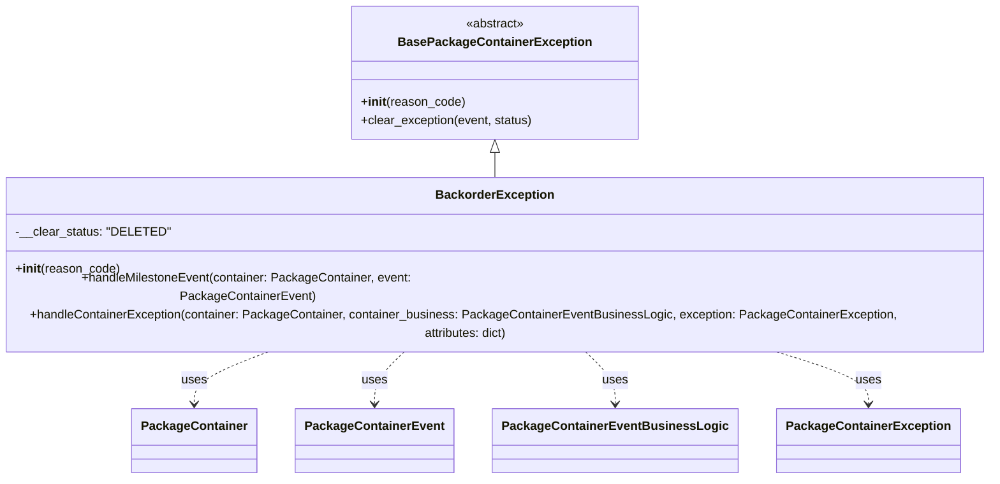

# Diagram: partview_core/partview_service/partview_service/core/business/package_container_exception_status/package_container_exceptions/PackageContainerBackorderException.py

> Auto-generated by Obscura crawlers

## Mermaid

### SVG

<svg id="container" width="1355.2890625" xmlns="http://www.w3.org/2000/svg" class="classDiagram" height="590" viewBox="0 0 1355.2890625 590" role="graphics-document document" aria-roledescription="class"><g><defs><marker id="container_class-aggregationStart" class="marker aggregation class" refX="18" refY="7" markerWidth="190" markerHeight="240" orient="auto"><path d="M 18,7 L9,13 L1,7 L9,1 Z"></path></marker></defs><defs><marker id="container_class-aggregationEnd" class="marker aggregation class" refX="1" refY="7" markerWidth="20" markerHeight="28" orient="auto"><path d="M 18,7 L9,13 L1,7 L9,1 Z"></path></marker></defs><defs><marker id="container_class-extensionStart" class="marker extension class" refX="18" refY="7" markerWidth="190" markerHeight="240" orient="auto"><path d="M 1,7 L18,13 V 1 Z"></path></marker></defs><defs><marker id="container_class-extensionEnd" class="marker extension class" refX="1" refY="7" markerWidth="20" markerHeight="28" orient="auto"><path d="M 1,1 V 13 L18,7 Z"></path></marker></defs><defs><marker id="container_class-compositionStart" class="marker composition class" refX="18" refY="7" markerWidth="190" markerHeight="240" orient="auto"><path d="M 18,7 L9,13 L1,7 L9,1 Z"></path></marker></defs><defs><marker id="container_class-compositionEnd" class="marker composition class" refX="1" refY="7" markerWidth="20" markerHeight="28" orient="auto"><path d="M 18,7 L9,13 L1,7 L9,1 Z"></path></marker></defs><defs><marker id="container_class-dependencyStart" class="marker dependency class" refX="6" refY="7" markerWidth="190" markerHeight="240" orient="auto"><path d="M 5,7 L9,13 L1,7 L9,1 Z"></path></marker></defs><defs><marker id="container_class-dependencyEnd" class="marker dependency class" refX="13" refY="7" markerWidth="20" markerHeight="28" orient="auto"><path d="M 18,7 L9,13 L14,7 L9,1 Z"></path></marker></defs><defs><marker id="container_class-lollipopStart" class="marker lollipop class" refX="13" refY="7" markerWidth="190" markerHeight="240" orient="auto"><circle stroke="black" fill="transparent" cx="7" cy="7" r="6"></circle></marker></defs><defs><marker id="container_class-lollipopEnd" class="marker lollipop class" refX="1" refY="7" markerWidth="190" markerHeight="240" orient="auto"><circle stroke="black" fill="transparent" cx="7" cy="7" r="6"></circle></marker></defs><g class="root"><g class="clusters"></g><g class="edgePaths"><path d="M677.645,199.25L677.645,200.542C677.645,201.833,677.645,204.417,677.645,209.875C677.645,215.333,677.645,223.667,677.645,227.833L677.645,232" id="id_BasePackageContainerException_BackorderException_1" class="edge-thickness-normal edge-pattern-solid relation" style=";;;" data-edge="true" data-et="edge" data-id="id_BasePackageContainerException_BackorderException_1" data-points="W3sieCI6Njc3LjY0NDUzMTI1LCJ5IjoxODJ9LHsieCI6Njc3LjY0NDUzMTI1LCJ5IjoyMDd9LHsieCI6Njc3LjY0NDUzMTI1LCJ5IjoyMzJ9XQ==" marker-start="url(#container_class-extensionStart)"></path><path d="M408.07,424L390.754,430.167C373.437,436.333,338.805,448.667,321.488,460C304.172,471.333,304.172,481.667,304.172,486.833L304.172,492" id="id_BackorderException_PackageContainer_2" class="edge-thickness-normal edge-pattern-dashed relation" style=";;;" data-edge="true" data-et="edge" data-id="id_BackorderException_PackageContainer_2" data-points="W3sieCI6NDA4LjA3MDI4MzEyOTY5OTI1LCJ5Ijo0MjR9LHsieCI6MzA0LjE3MTg3NSwieSI6NDYxfSx7IngiOjMwNC4xNzE4NzUsInkiOjQ5OH1d" marker-end="url(#container_class-dependencyEnd)"></path><path d="M570.555,424L563.676,430.167C556.797,436.333,543.039,448.667,536.16,460C529.281,471.333,529.281,481.667,529.281,486.833L529.281,492" id="id_BackorderException_PackageContainerEvent_3" class="edge-thickness-normal edge-pattern-dashed relation" style=";;;" data-edge="true" data-et="edge" data-id="id_BackorderException_PackageContainerEvent_3" data-points="W3sieCI6NTcwLjU1NTI0NTUzNTcxNDMsInkiOjQyNH0seyJ4Ijo1MjkuMjgxMjUsInkiOjQ2MX0seyJ4Ijo1MjkuMjgxMjUsInkiOjQ5OH1d" marker-end="url(#container_class-dependencyEnd)"></path><path d="M784.734,424L791.613,430.167C798.492,436.333,812.25,448.667,819.129,460C826.008,471.333,826.008,481.667,826.008,486.833L826.008,492" id="id_BackorderException_PackageContainerEventBusinessLogic_4" class="edge-thickness-normal edge-pattern-dashed relation" style=";;;" data-edge="true" data-et="edge" data-id="id_BackorderException_PackageContainerEventBusinessLogic_4" data-points="W3sieCI6Nzg0LjczMzgxNjk2NDI4NTcsInkiOjQyNH0seyJ4Ijo4MjYuMDA3ODEyNSwieSI6NDYxfSx7IngiOjgyNi4wMDc4MTI1LCJ5Ijo0OTh9XQ==" marker-end="url(#container_class-dependencyEnd)"></path><path d="M1010.095,424L1031.45,430.167C1052.805,436.333,1095.516,448.667,1116.871,460C1138.227,471.333,1138.227,481.667,1138.227,486.833L1138.227,492" id="id_BackorderException_PackageContainerException_5" class="edge-thickness-normal edge-pattern-dashed relation" style=";;;" data-edge="true" data-et="edge" data-id="id_BackorderException_PackageContainerException_5" data-points="W3sieCI6MTAxMC4wOTQ3MTkyMTk5MjQ5LCJ5Ijo0MjR9LHsieCI6MTEzOC4yMjY1NjI1LCJ5Ijo0NjF9LHsieCI6MTEzOC4yMjY1NjI1LCJ5Ijo0OTh9XQ==" marker-end="url(#container_class-dependencyEnd)"></path></g><g class="edgeLabels"><g class="edgeLabel"><g class="label" data-id="id_BasePackageContainerException_BackorderException_1" transform="translate(0, 0)"><foreignObject width="0" height="0">

</foreignObject></g></g><g class="edgeLabel" transform="translate(304.171875, 461)"><g class="label" data-id="id_BackorderException_PackageContainer_2" transform="translate(-16.4921875, -12)"><foreignObject width="32.984375" height="24">

uses

</foreignObject></g></g><g class="edgeLabel" transform="translate(529.28125, 461)"><g class="label" data-id="id_BackorderException_PackageContainerEvent_3" transform="translate(-16.4921875, -12)"><foreignObject width="32.984375" height="24">

uses

</foreignObject></g></g><g class="edgeLabel" transform="translate(826.0078125, 461)"><g class="label" data-id="id_BackorderException_PackageContainerEventBusinessLogic_4" transform="translate(-16.4921875, -12)"><foreignObject width="32.984375" height="24">

uses

</foreignObject></g></g><g class="edgeLabel" transform="translate(1138.2265625, 461)"><g class="label" data-id="id_BackorderException_PackageContainerException_5" transform="translate(-16.4921875, -12)"><foreignObject width="32.984375" height="24">

uses

</foreignObject></g></g></g><g class="nodes"><g class="node default" id="classId-BasePackageContainerException-0" transform="translate(677.64453125, 95)"><g class="basic label-container"><path d="M-183.5390625 -87 L183.5390625 -87 L183.5390625 87 L-183.5390625 87" stroke="none" stroke-width="0" fill="#ECECFF" style=""></path><path d="M-183.5390625 -87 C-106.7743993712536 -87, -30.009736242507188 -87, 183.5390625 -87 M-183.5390625 -87 C-97.27237040408178 -87, -11.005678308163567 -87, 183.5390625 -87 M183.5390625 -87 C183.5390625 -35.76543397691379, 183.5390625 15.469132046172419, 183.5390625 87 M183.5390625 -87 C183.5390625 -22.650255714961972, 183.5390625 41.699488570076056, 183.5390625 87 M183.5390625 87 C73.33421064563103 87, -36.870641208737936 87, -183.5390625 87 M183.5390625 87 C40.27880743299599 87, -102.98144763400802 87, -183.5390625 87 M-183.5390625 87 C-183.5390625 21.672214349496656, -183.5390625 -43.65557130100669, -183.5390625 -87 M-183.5390625 87 C-183.5390625 33.48930517927425, -183.5390625 -20.021389641451506, -183.5390625 -87" stroke="#9370DB" stroke-width="1.3" fill="none" stroke-dasharray="0 0" style=""></path></g><g class="annotation-group text" transform="translate(-38.609375, -63)"><g class="label" style="" transform="translate(0,-12)"><foreignObject width="77.21875" height="24">

«abstract»

</foreignObject></g></g><g class="label-group text" transform="translate(-118.671875, -39)"><g class="label" style="font-weight: bolder" transform="translate(0,-12)"><foreignObject width="237.34375" height="24">

BasePackageContainerException

</foreignObject></g></g><g class="members-group text" transform="translate(-171.5390625, 9)"></g><g class="methods-group text" transform="translate(-171.5390625, 39)"><g class="label" style="" transform="translate(0,-12)"><foreignObject width="134.75" height="24">

+<strong>init</strong>(reason_code)

</foreignObject></g><g class="label" style="" transform="translate(0,12)"><foreignObject width="224.40625" height="24">

+clear_exception(event, status)

</foreignObject></g></g><g class="divider" style=""><path d="M-183.5390625 -15 C-94.84194858528002 -15, -6.144834670560044 -15, 183.5390625 -15 M-183.5390625 -15 C-58.64942824824584 -15, 66.24020600350832 -15, 183.5390625 -15" stroke="#9370DB" stroke-width="1.3" fill="none" stroke-dasharray="0 0" style=""></path></g><g class="divider" style=""><path d="M-183.5390625 9 C-69.02865065289517 9, 45.48176119420967 9, 183.5390625 9 M-183.5390625 9 C-101.3318008640659 9, -19.124539228131795 9, 183.5390625 9" stroke="#9370DB" stroke-width="1.3" fill="none" stroke-dasharray="0 0" style=""></path></g></g><g class="node default" id="classId-BackorderException-1" transform="translate(677.64453125, 328)"><g class="basic label-container"><path d="M-669.64453125 -96 L669.64453125 -96 L669.64453125 96 L-669.64453125 96" stroke="none" stroke-width="0" fill="#ECECFF" style=""></path><path d="M-669.64453125 -96 C-312.82732350219675 -96, 43.989884245606504 -96, 669.64453125 -96 M-669.64453125 -96 C-219.3818396068118 -96, 230.88085203637638 -96, 669.64453125 -96 M669.64453125 -96 C669.64453125 -57.03318747888511, 669.64453125 -18.066374957770222, 669.64453125 96 M669.64453125 -96 C669.64453125 -28.649604583800823, 669.64453125 38.700790832398354, 669.64453125 96 M669.64453125 96 C177.82882230291176 96, -313.9868866441765 96, -669.64453125 96 M669.64453125 96 C160.29510409451166 96, -349.0543230609767 96, -669.64453125 96 M-669.64453125 96 C-669.64453125 47.6775224045364, -669.64453125 -0.644955190927206, -669.64453125 -96 M-669.64453125 96 C-669.64453125 55.90351953237573, -669.64453125 15.807039064751464, -669.64453125 -96" stroke="#9370DB" stroke-width="1.3" fill="none" stroke-dasharray="0 0" style=""></path></g><g class="annotation-group text" transform="translate(0, -72)"></g><g class="label-group text" transform="translate(-73.2265625, -72)"><g class="label" style="font-weight: bolder" transform="translate(0,-12)"><foreignObject width="146.453125" height="24">

BackorderException

</foreignObject></g></g><g class="members-group text" transform="translate(-657.64453125, -24)"><g class="label" style="" transform="translate(0,-12)"><foreignObject width="191.84375" height="24">

-__clear_status: "DELETED"

</foreignObject></g></g><g class="methods-group text" transform="translate(-657.64453125, 24)"><g class="label" style="" transform="translate(0,-12)"><foreignObject width="134.75" height="24">

+<strong>init</strong>(reason_code)

</foreignObject></g><g class="label" style="" transform="translate(0,12)"><foreignObject width="609.125" height="24">

+handleMilestoneEvent(container: PackageContainer, event: PackageContainerEvent)

</foreignObject></g><g class="label" style="" transform="translate(0,36)"><foreignObject width="1242.0625" height="24">

+handleContainerException(container: PackageContainer, container_business: PackageContainerEventBusinessLogic, exception: PackageContainerException, attributes: dict)

</foreignObject></g></g><g class="divider" style=""><path d="M-669.64453125 -48 C-378.7202961915395 -48, -87.79606113307898 -48, 669.64453125 -48 M-669.64453125 -48 C-196.94892445984505 -48, 275.7466823303099 -48, 669.64453125 -48" stroke="#9370DB" stroke-width="1.3" fill="none" stroke-dasharray="0 0" style=""></path></g><g class="divider" style=""><path d="M-669.64453125 0 C-333.09247091887545 0, 3.4595894122491018 0, 669.64453125 0 M-669.64453125 0 C-260.59783594915797 0, 148.44885935168406 0, 669.64453125 0" stroke="#9370DB" stroke-width="1.3" fill="none" stroke-dasharray="0 0" style=""></path></g></g><g class="node default" id="classId-PackageContainer-2" transform="translate(304.171875, 540)"><g class="basic label-container"><path d="M-77.453125 -42 L77.453125 -42 L77.453125 42 L-77.453125 42" stroke="none" stroke-width="0" fill="#ECECFF" style=""></path><path d="M-77.453125 -42 C-34.76159759379661 -42, 7.929929812406783 -42, 77.453125 -42 M-77.453125 -42 C-31.261977218685928 -42, 14.929170562628144 -42, 77.453125 -42 M77.453125 -42 C77.453125 -20.243236766105923, 77.453125 1.5135264677881537, 77.453125 42 M77.453125 -42 C77.453125 -25.16511604812534, 77.453125 -8.330232096250683, 77.453125 42 M77.453125 42 C44.93117988533065 42, 12.4092347706613 42, -77.453125 42 M77.453125 42 C16.904834258173196 42, -43.64345648365361 42, -77.453125 42 M-77.453125 42 C-77.453125 23.708321798160874, -77.453125 5.416643596321748, -77.453125 -42 M-77.453125 42 C-77.453125 8.864728773949864, -77.453125 -24.270542452100273, -77.453125 -42" stroke="#9370DB" stroke-width="1.3" fill="none" stroke-dasharray="0 0" style=""></path></g><g class="annotation-group text" transform="translate(0, -18)"></g><g class="label-group text" transform="translate(-65.453125, -18)"><g class="label" style="font-weight: bolder" transform="translate(0,-12)"><foreignObject width="130.90625" height="24">

PackageContainer

</foreignObject></g></g><g class="members-group text" transform="translate(-65.453125, 30)"></g><g class="methods-group text" transform="translate(-65.453125, 60)"></g><g class="divider" style=""><path d="M-77.453125 6 C-34.18548997318331 6, 9.082145053633383 6, 77.453125 6 M-77.453125 6 C-29.62461452012203 6, 18.20389595975594 6, 77.453125 6" stroke="#9370DB" stroke-width="1.3" fill="none" stroke-dasharray="0 0" style=""></path></g><g class="divider" style=""><path d="M-77.453125 24 C-38.16683376295206 24, 1.1194574740958814 24, 77.453125 24 M-77.453125 24 C-17.97870591333028 24, 41.49571317333944 24, 77.453125 24" stroke="#9370DB" stroke-width="1.3" fill="none" stroke-dasharray="0 0" style=""></path></g></g><g class="node default" id="classId-PackageContainerEvent-3" transform="translate(529.28125, 540)"><g class="basic label-container"><path d="M-97.65625 -42 L97.65625 -42 L97.65625 42 L-97.65625 42" stroke="none" stroke-width="0" fill="#ECECFF" style=""></path><path d="M-97.65625 -42 C-44.4228921039387 -42, 8.8104657921226 -42, 97.65625 -42 M-97.65625 -42 C-50.09655403812379 -42, -2.536858076247583 -42, 97.65625 -42 M97.65625 -42 C97.65625 -21.605967710964954, 97.65625 -1.2119354219299083, 97.65625 42 M97.65625 -42 C97.65625 -18.26678163808098, 97.65625 5.4664367238380365, 97.65625 42 M97.65625 42 C26.691870441186325 42, -44.27250911762735 42, -97.65625 42 M97.65625 42 C21.345077071059023 42, -54.96609585788195 42, -97.65625 42 M-97.65625 42 C-97.65625 19.02549560528745, -97.65625 -3.9490087894251005, -97.65625 -42 M-97.65625 42 C-97.65625 21.930643366182803, -97.65625 1.8612867323656062, -97.65625 -42" stroke="#9370DB" stroke-width="1.3" fill="none" stroke-dasharray="0 0" style=""></path></g><g class="annotation-group text" transform="translate(0, -18)"></g><g class="label-group text" transform="translate(-85.65625, -18)"><g class="label" style="font-weight: bolder" transform="translate(0,-12)"><foreignObject width="171.3125" height="24">

PackageContainerEvent

</foreignObject></g></g><g class="members-group text" transform="translate(-85.65625, 30)"></g><g class="methods-group text" transform="translate(-85.65625, 60)"></g><g class="divider" style=""><path d="M-97.65625 6 C-33.24630096525355 6, 31.163648069492893 6, 97.65625 6 M-97.65625 6 C-26.43781400367118 6, 44.78062199265764 6, 97.65625 6" stroke="#9370DB" stroke-width="1.3" fill="none" stroke-dasharray="0 0" style=""></path></g><g class="divider" style=""><path d="M-97.65625 24 C-37.058325394137356 24, 23.53959921172529 24, 97.65625 24 M-97.65625 24 C-45.940242720579626 24, 5.7757645588407485 24, 97.65625 24" stroke="#9370DB" stroke-width="1.3" fill="none" stroke-dasharray="0 0" style=""></path></g></g><g class="node default" id="classId-PackageContainerEventBusinessLogic-4" transform="translate(826.0078125, 540)"><g class="basic label-container"><path d="M-149.0703125 -42 L149.0703125 -42 L149.0703125 42 L-149.0703125 42" stroke="none" stroke-width="0" fill="#ECECFF" style=""></path><path d="M-149.0703125 -42 C-65.64609692247738 -42, 17.778118655045233 -42, 149.0703125 -42 M-149.0703125 -42 C-54.92452090532288 -42, 39.22127068935424 -42, 149.0703125 -42 M149.0703125 -42 C149.0703125 -17.274828476857788, 149.0703125 7.450343046284424, 149.0703125 42 M149.0703125 -42 C149.0703125 -19.162406992837084, 149.0703125 3.6751860143258313, 149.0703125 42 M149.0703125 42 C56.67184625258079 42, -35.726619994838416 42, -149.0703125 42 M149.0703125 42 C51.28587130847801 42, -46.498569883043984 42, -149.0703125 42 M-149.0703125 42 C-149.0703125 15.110949588384898, -149.0703125 -11.778100823230204, -149.0703125 -42 M-149.0703125 42 C-149.0703125 11.228572169667789, -149.0703125 -19.542855660664422, -149.0703125 -42" stroke="#9370DB" stroke-width="1.3" fill="none" stroke-dasharray="0 0" style=""></path></g><g class="annotation-group text" transform="translate(0, -18)"></g><g class="label-group text" transform="translate(-137.0703125, -18)"><g class="label" style="font-weight: bolder" transform="translate(0,-12)"><foreignObject width="274.140625" height="24">

PackageContainerEventBusinessLogic

</foreignObject></g></g><g class="members-group text" transform="translate(-137.0703125, 30)"></g><g class="methods-group text" transform="translate(-137.0703125, 60)"></g><g class="divider" style=""><path d="M-149.0703125 6 C-49.69000228593562 6, 49.69030792812876 6, 149.0703125 6 M-149.0703125 6 C-59.48067237083352 6, 30.108967758332966 6, 149.0703125 6" stroke="#9370DB" stroke-width="1.3" fill="none" stroke-dasharray="0 0" style=""></path></g><g class="divider" style=""><path d="M-149.0703125 24 C-73.6575961648879 24, 1.7551201702241883 24, 149.0703125 24 M-149.0703125 24 C-50.067498080838234 24, 48.93531633832353 24, 149.0703125 24" stroke="#9370DB" stroke-width="1.3" fill="none" stroke-dasharray="0 0" style=""></path></g></g><g class="node default" id="classId-PackageContainerException-5" transform="translate(1138.2265625, 540)"><g class="basic label-container"><path d="M-113.1484375 -42 L113.1484375 -42 L113.1484375 42 L-113.1484375 42" stroke="none" stroke-width="0" fill="#ECECFF" style=""></path><path d="M-113.1484375 -42 C-59.01153396059054 -42, -4.874630421181081 -42, 113.1484375 -42 M-113.1484375 -42 C-37.65433983325609 -42, 37.83975783348782 -42, 113.1484375 -42 M113.1484375 -42 C113.1484375 -9.604614892374606, 113.1484375 22.790770215250788, 113.1484375 42 M113.1484375 -42 C113.1484375 -15.51898872085264, 113.1484375 10.96202255829472, 113.1484375 42 M113.1484375 42 C59.630185205749775 42, 6.111932911499551 42, -113.1484375 42 M113.1484375 42 C39.35276228592481 42, -34.44291292815038 42, -113.1484375 42 M-113.1484375 42 C-113.1484375 8.607465428628352, -113.1484375 -24.785069142743296, -113.1484375 -42 M-113.1484375 42 C-113.1484375 8.46726436681331, -113.1484375 -25.06547126637338, -113.1484375 -42" stroke="#9370DB" stroke-width="1.3" fill="none" stroke-dasharray="0 0" style=""></path></g><g class="annotation-group text" transform="translate(0, -18)"></g><g class="label-group text" transform="translate(-101.1484375, -18)"><g class="label" style="font-weight: bolder" transform="translate(0,-12)"><foreignObject width="202.296875" height="24">

PackageContainerException

</foreignObject></g></g><g class="members-group text" transform="translate(-101.1484375, 30)"></g><g class="methods-group text" transform="translate(-101.1484375, 60)"></g><g class="divider" style=""><path d="M-113.1484375 6 C-22.87038553959988 6, 67.40766642080024 6, 113.1484375 6 M-113.1484375 6 C-56.55719028412994 6, 0.034056931740124696 6, 113.1484375 6" stroke="#9370DB" stroke-width="1.3" fill="none" stroke-dasharray="0 0" style=""></path></g><g class="divider" style=""><path d="M-113.1484375 24 C-63.63252550491449 24, -14.11661350982898 24, 113.1484375 24 M-113.1484375 24 C-43.59301125900859 24, 25.962414981982818 24, 113.1484375 24" stroke="#9370DB" stroke-width="1.3" fill="none" stroke-dasharray="0 0" style=""></path></g></g></g></g></g></svg>
