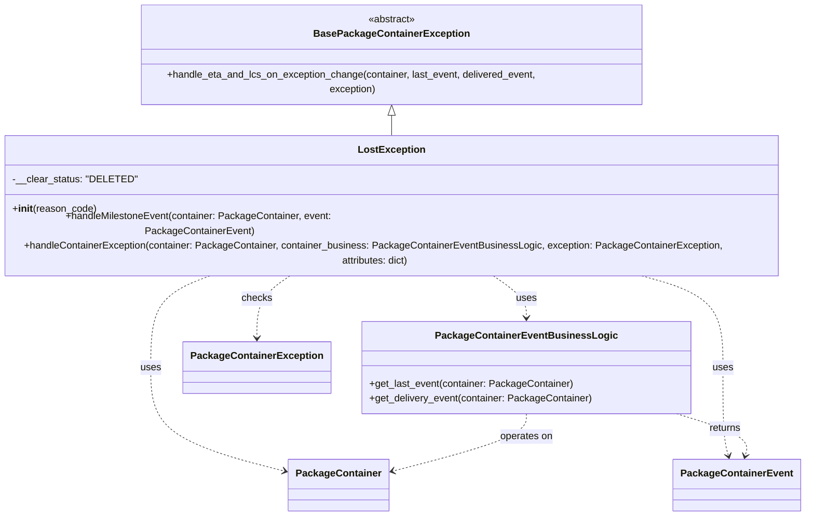

# Diagram: partview_core/partview_service/partview_service/core/business/package_container_exception_status/package_container_exceptions/PackageContainerLostException.py

> Auto-generated by Obscura crawlers

## Mermaid

### SVG

<svg id="container" width="1333.2890625" xmlns="http://www.w3.org/2000/svg" class="classDiagram" height="790" viewBox="0 0 1333.2890625 790" role="graphics-document document" aria-roledescription="class"><g><defs><marker id="container_class-aggregationStart" class="marker aggregation class" refX="18" refY="7" markerWidth="190" markerHeight="240" orient="auto"><path d="M 18,7 L9,13 L1,7 L9,1 Z"></path></marker></defs><defs><marker id="container_class-aggregationEnd" class="marker aggregation class" refX="1" refY="7" markerWidth="20" markerHeight="28" orient="auto"><path d="M 18,7 L9,13 L1,7 L9,1 Z"></path></marker></defs><defs><marker id="container_class-extensionStart" class="marker extension class" refX="18" refY="7" markerWidth="190" markerHeight="240" orient="auto"><path d="M 1,7 L18,13 V 1 Z"></path></marker></defs><defs><marker id="container_class-extensionEnd" class="marker extension class" refX="1" refY="7" markerWidth="20" markerHeight="28" orient="auto"><path d="M 1,1 V 13 L18,7 Z"></path></marker></defs><defs><marker id="container_class-compositionStart" class="marker composition class" refX="18" refY="7" markerWidth="190" markerHeight="240" orient="auto"><path d="M 18,7 L9,13 L1,7 L9,1 Z"></path></marker></defs><defs><marker id="container_class-compositionEnd" class="marker composition class" refX="1" refY="7" markerWidth="20" markerHeight="28" orient="auto"><path d="M 18,7 L9,13 L1,7 L9,1 Z"></path></marker></defs><defs><marker id="container_class-dependencyStart" class="marker dependency class" refX="6" refY="7" markerWidth="190" markerHeight="240" orient="auto"><path d="M 5,7 L9,13 L1,7 L9,1 Z"></path></marker></defs><defs><marker id="container_class-dependencyEnd" class="marker dependency class" refX="13" refY="7" markerWidth="20" markerHeight="28" orient="auto"><path d="M 18,7 L9,13 L14,7 L9,1 Z"></path></marker></defs><defs><marker id="container_class-lollipopStart" class="marker lollipop class" refX="13" refY="7" markerWidth="190" markerHeight="240" orient="auto"><circle stroke="black" fill="transparent" cx="7" cy="7" r="6"></circle></marker></defs><defs><marker id="container_class-lollipopEnd" class="marker lollipop class" refX="1" refY="7" markerWidth="190" markerHeight="240" orient="auto"><circle stroke="black" fill="transparent" cx="7" cy="7" r="6"></circle></marker></defs><g class="root"><g class="clusters"></g><g class="edgePaths"><path d="M666.645,175.25L666.645,176.542C666.645,177.833,666.645,180.417,666.645,185.875C666.645,191.333,666.645,199.667,666.645,203.833L666.645,208" id="id_BasePackageContainerException_LostException_1" class="edge-thickness-normal edge-pattern-solid relation" style=";;;" data-edge="true" data-et="edge" data-id="id_BasePackageContainerException_LostException_1" data-points="W3sieCI6NjY2LjY0NDUzMTI1LCJ5IjoxNTh9LHsieCI6NjY2LjY0NDUzMTI1LCJ5IjoxODN9LHsieCI6NjY2LjY0NDUzMTI1LCJ5IjoyMDh9XQ==" marker-start="url(#container_class-extensionStart)"></path><path d="M394.746,400L377.28,406.167C359.814,412.333,324.883,424.667,307.417,449.5C289.951,474.333,289.951,511.667,289.951,549C289.951,586.333,289.951,623.667,325.139,651.776C360.326,679.886,430.701,698.773,465.889,708.216L501.076,717.659" id="id_LostException_PackageContainer_2" class="edge-thickness-normal edge-pattern-dashed relation" style=";;;" data-edge="true" data-et="edge" data-id="id_LostException_PackageContainer_2" data-points="W3sieCI6Mzk0Ljc0NTU2NTA4NDU4NjUsInkiOjQwMH0seyJ4IjoyODkuOTUxMTcxODc1LCJ5Ijo0Mzd9LHsieCI6Mjg5Ljk1MTE3MTg3NSwieSI6NTQ5fSx7IngiOjI4OS45NTExNzE4NzUsInkiOjY2MX0seyJ4Ijo1MDYuODcxMDkzNzUsInkiOjcxOS4yMTQxNDAyMjEyMDYzfV0=" marker-end="url(#container_class-dependencyEnd)"></path><path d="M1045.232,400L1069.551,406.167C1093.87,412.333,1142.508,424.667,1166.827,449.5C1191.146,474.333,1191.146,511.667,1191.146,549C1191.146,586.333,1191.146,623.667,1192.671,647.54C1194.196,671.414,1197.245,681.828,1198.77,687.035L1200.295,692.242" id="id_LostException_PackageContainerEvent_3" class="edge-thickness-normal edge-pattern-dashed relation" style=";;;" data-edge="true" data-et="edge" data-id="id_LostException_PackageContainerEvent_3" data-points="W3sieCI6MTA0NS4yMzI0MDcxODk4NDk3LCJ5Ijo0MDB9LHsieCI6MTE5MS4xNDY0ODQzNzUsInkiOjQzN30seyJ4IjoxMTkxLjE0NjQ4NDM3NSwieSI6NTQ5fSx7IngiOjExOTEuMTQ2NDg0Mzc1LCJ5Ijo2NjF9LHsieCI6MTIwMS45ODA4Mzk1OTY1MTksInkiOjY5OH1d" marker-end="url(#container_class-dependencyEnd)"></path><path d="M819.705,400L829.537,406.167C839.369,412.333,859.033,424.667,868.865,436C878.697,447.333,878.697,457.667,878.697,462.833L878.697,468" id="id_LostException_PackageContainerEventBusinessLogic_4" class="edge-thickness-normal edge-pattern-dashed relation" style=";;;" data-edge="true" data-et="edge" data-id="id_LostException_PackageContainerEventBusinessLogic_4" data-points="W3sieCI6ODE5LjcwNTE1MTU1MDc1MTksInkiOjQwMH0seyJ4Ijo4NzguNjk3MjY1NjI1LCJ5Ijo0Mzd9LHsieCI6ODc4LjY5NzI2NTYyNSwieSI6NDc0fV0=" marker-end="url(#container_class-dependencyEnd)"></path><path d="M513.584,400L503.752,406.167C493.92,412.333,474.256,424.667,464.424,441.5C454.592,458.333,454.592,479.667,454.592,490.333L454.592,501" id="id_LostException_PackageContainerException_5" class="edge-thickness-normal edge-pattern-dashed relation" style=";;;" data-edge="true" data-et="edge" data-id="id_LostException_PackageContainerException_5" data-points="W3sieCI6NTEzLjU4MzkxMDk0OTI0ODEsInkiOjQwMH0seyJ4Ijo0NTQuNTkxNzk2ODc1LCJ5Ijo0Mzd9LHsieCI6NDU0LjU5MTc5Njg3NSwieSI6NTA3fV0=" marker-end="url(#container_class-dependencyEnd)"></path><path d="M878.697,624L878.697,630.167C878.697,636.333,878.697,648.667,843.51,664.276C808.322,679.886,737.947,698.773,702.76,708.216L667.572,717.659" id="id_PackageContainerEventBusinessLogic_PackageContainer_6" class="edge-thickness-normal edge-pattern-dashed relation" style=";;;" data-edge="true" data-et="edge" data-id="id_PackageContainerEventBusinessLogic_PackageContainer_6" data-points="W3sieCI6ODc4LjY5NzI2NTYyNSwieSI6NjI0fSx7IngiOjg3OC42OTcyNjU2MjUsInkiOjY2MX0seyJ4Ijo2NjEuNzc3MzQzNzUsInkiOjcxOS4yMTQxNDAyMjEyMDYzfV0=" marker-end="url(#container_class-dependencyEnd)"></path><path d="M1118.908,624L1138.659,630.167C1158.409,636.333,1197.911,648.667,1216.137,660.04C1234.363,671.414,1231.313,681.828,1229.789,687.035L1228.264,692.242" id="id_PackageContainerEventBusinessLogic_PackageContainerEvent_7" class="edge-thickness-normal edge-pattern-dashed relation" style=";;;" data-edge="true" data-et="edge" data-id="id_PackageContainerEventBusinessLogic_PackageContainerEvent_7" data-points="W3sieCI6MTExOC45MDgwOTg0OTMzMDM3LCJ5Ijo2MjR9LHsieCI6MTIzNy40MTIxMDkzNzUsInkiOjY2MX0seyJ4IjoxMjI2LjU3Nzc1NDE1MzQ4MSwieSI6Njk4fV0=" marker-end="url(#container_class-dependencyEnd)"></path></g><g class="edgeLabels"><g class="edgeLabel"><g class="label" data-id="id_BasePackageContainerException_LostException_1" transform="translate(0, 0)"><foreignObject width="0" height="0">

</foreignObject></g></g><g class="edgeLabel" transform="translate(289.951171875, 549)"><g class="label" data-id="id_LostException_PackageContainer_2" transform="translate(-16.4921875, -12)"><foreignObject width="32.984375" height="24">

uses

</foreignObject></g></g><g class="edgeLabel" transform="translate(1191.146484375, 549)"><g class="label" data-id="id_LostException_PackageContainerEvent_3" transform="translate(-16.4921875, -12)"><foreignObject width="32.984375" height="24">

uses

</foreignObject></g></g><g class="edgeLabel" transform="translate(878.697265625, 437)"><g class="label" data-id="id_LostException_PackageContainerEventBusinessLogic_4" transform="translate(-16.4921875, -12)"><foreignObject width="32.984375" height="24">

uses

</foreignObject></g></g><g class="edgeLabel" transform="translate(454.591796875, 437)"><g class="label" data-id="id_LostException_PackageContainerException_5" transform="translate(-24.4921875, -12)"><foreignObject width="48.984375" height="24">

checks

</foreignObject></g></g><g class="edgeLabel" transform="translate(878.697265625, 661)"><g class="label" data-id="id_PackageContainerEventBusinessLogic_PackageContainer_6" transform="translate(-43.2890625, -12)"><foreignObject width="86.578125" height="24">

operates on

</foreignObject></g></g><g class="edgeLabel" transform="translate(1196.56088, 648.2452)"><g class="label" data-id="id_PackageContainerEventBusinessLogic_PackageContainerEvent_7" transform="translate(-26.265625, -12)"><foreignObject width="52.53125" height="24">

returns

</foreignObject></g></g></g><g class="nodes"><g class="node default" id="classId-BasePackageContainerException-0" transform="translate(666.64453125, 83)"><g class="basic label-container"><path d="M-412.421875 -75 L412.421875 -75 L412.421875 75 L-412.421875 75" stroke="none" stroke-width="0" fill="#ECECFF" style=""></path><path d="M-412.421875 -75 C-205.58926657993177 -75, 1.243341840136452 -75, 412.421875 -75 M-412.421875 -75 C-176.0138822422832 -75, 60.394110515433624 -75, 412.421875 -75 M412.421875 -75 C412.421875 -23.043426218101295, 412.421875 28.91314756379741, 412.421875 75 M412.421875 -75 C412.421875 -16.661348899698943, 412.421875 41.677302200602114, 412.421875 75 M412.421875 75 C115.73391050228798 75, -180.95405399542403 75, -412.421875 75 M412.421875 75 C193.7759881925614 75, -24.869898614877172 75, -412.421875 75 M-412.421875 75 C-412.421875 32.85068996046401, -412.421875 -9.29862007907198, -412.421875 -75 M-412.421875 75 C-412.421875 35.581149741968495, -412.421875 -3.837700516063009, -412.421875 -75" stroke="#9370DB" stroke-width="1.3" fill="none" stroke-dasharray="0 0" style=""></path></g><g class="annotation-group text" transform="translate(-38.609375, -51)"><g class="label" style="" transform="translate(0,-12)"><foreignObject width="77.21875" height="24">

«abstract»

</foreignObject></g></g><g class="label-group text" transform="translate(-118.671875, -27)"><g class="label" style="font-weight: bolder" transform="translate(0,-12)"><foreignObject width="237.34375" height="24">

BasePackageContainerException

</foreignObject></g></g><g class="members-group text" transform="translate(-400.421875, 21)"></g><g class="methods-group text" transform="translate(-400.421875, 51)"><g class="label" style="" transform="translate(0,-12)"><foreignObject width="682.171875" height="24">

+handle_eta_and_lcs_on_exception_change(container, last_event, delivered_event, exception)

</foreignObject></g></g><g class="divider" style=""><path d="M-412.421875 -3 C-131.95155297654424 -3, 148.51876904691153 -3, 412.421875 -3 M-412.421875 -3 C-154.60753912912367 -3, 103.20679674175267 -3, 412.421875 -3" stroke="#9370DB" stroke-width="1.3" fill="none" stroke-dasharray="0 0" style=""></path></g><g class="divider" style=""><path d="M-412.421875 21 C-180.1351148545283 21, 52.15164529094341 21, 412.421875 21 M-412.421875 21 C-245.0358031103043 21, -77.6497312206086 21, 412.421875 21" stroke="#9370DB" stroke-width="1.3" fill="none" stroke-dasharray="0 0" style=""></path></g></g><g class="node default" id="classId-LostException-1" transform="translate(666.64453125, 304)"><g class="basic label-container"><path d="M-658.64453125 -96 L658.64453125 -96 L658.64453125 96 L-658.64453125 96" stroke="none" stroke-width="0" fill="#ECECFF" style=""></path><path d="M-658.64453125 -96 C-210.39872121274624 -96, 237.84708882450752 -96, 658.64453125 -96 M-658.64453125 -96 C-281.4907747742974 -96, 95.66298170140522 -96, 658.64453125 -96 M658.64453125 -96 C658.64453125 -38.35980174458775, 658.64453125 19.280396510824502, 658.64453125 96 M658.64453125 -96 C658.64453125 -35.78013086537409, 658.64453125 24.43973826925182, 658.64453125 96 M658.64453125 96 C369.51101699232805 96, 80.3775027346561 96, -658.64453125 96 M658.64453125 96 C244.6040400003884 96, -169.43645124922318 96, -658.64453125 96 M-658.64453125 96 C-658.64453125 47.67016684086603, -658.64453125 -0.6596663182679379, -658.64453125 -96 M-658.64453125 96 C-658.64453125 44.2169015230801, -658.64453125 -7.566196953839807, -658.64453125 -96" stroke="#9370DB" stroke-width="1.3" fill="none" stroke-dasharray="0 0" style=""></path></g><g class="annotation-group text" transform="translate(0, -72)"></g><g class="label-group text" transform="translate(-51.2265625, -72)"><g class="label" style="font-weight: bolder" transform="translate(0,-12)"><foreignObject width="102.453125" height="24">

LostException

</foreignObject></g></g><g class="members-group text" transform="translate(-646.64453125, -24)"><g class="label" style="" transform="translate(0,-12)"><foreignObject width="191.84375" height="24">

-__clear_status: "DELETED"

</foreignObject></g></g><g class="methods-group text" transform="translate(-646.64453125, 24)"><g class="label" style="" transform="translate(0,-12)"><foreignObject width="134.75" height="24">

+<strong>init</strong>(reason_code)

</foreignObject></g><g class="label" style="" transform="translate(0,12)"><foreignObject width="609.125" height="24">

+handleMilestoneEvent(container: PackageContainer, event: PackageContainerEvent)

</foreignObject></g><g class="label" style="" transform="translate(0,36)"><foreignObject width="1242.0625" height="24">

+handleContainerException(container: PackageContainer, container_business: PackageContainerEventBusinessLogic, exception: PackageContainerException, attributes: dict)

</foreignObject></g></g><g class="divider" style=""><path d="M-658.64453125 -48 C-333.42296798041144 -48, -8.201404710822885 -48, 658.64453125 -48 M-658.64453125 -48 C-202.1609064302944 -48, 254.3227183894112 -48, 658.64453125 -48" stroke="#9370DB" stroke-width="1.3" fill="none" stroke-dasharray="0 0" style=""></path></g><g class="divider" style=""><path d="M-658.64453125 0 C-186.0183288892701 0, 286.6078734714598 0, 658.64453125 0 M-658.64453125 0 C-193.29702996664707 0, 272.05047131670585 0, 658.64453125 0" stroke="#9370DB" stroke-width="1.3" fill="none" stroke-dasharray="0 0" style=""></path></g></g><g class="node default" id="classId-PackageContainer-2" transform="translate(584.32421875, 740)"><g class="basic label-container"><path d="M-77.453125 -42 L77.453125 -42 L77.453125 42 L-77.453125 42" stroke="none" stroke-width="0" fill="#ECECFF" style=""></path><path d="M-77.453125 -42 C-34.78541198022939 -42, 7.882301039541218 -42, 77.453125 -42 M-77.453125 -42 C-36.34880608134975 -42, 4.7555128373005005 -42, 77.453125 -42 M77.453125 -42 C77.453125 -20.543916561624627, 77.453125 0.9121668767507458, 77.453125 42 M77.453125 -42 C77.453125 -18.612580019484163, 77.453125 4.774839961031674, 77.453125 42 M77.453125 42 C16.595886099270203 42, -44.261352801459594 42, -77.453125 42 M77.453125 42 C26.669378762674704 42, -24.114367474650592 42, -77.453125 42 M-77.453125 42 C-77.453125 23.853180128798726, -77.453125 5.706360257597453, -77.453125 -42 M-77.453125 42 C-77.453125 20.007179844281502, -77.453125 -1.9856403114369954, -77.453125 -42" stroke="#9370DB" stroke-width="1.3" fill="none" stroke-dasharray="0 0" style=""></path></g><g class="annotation-group text" transform="translate(0, -18)"></g><g class="label-group text" transform="translate(-65.453125, -18)"><g class="label" style="font-weight: bolder" transform="translate(0,-12)"><foreignObject width="130.90625" height="24">

PackageContainer

</foreignObject></g></g><g class="members-group text" transform="translate(-65.453125, 30)"></g><g class="methods-group text" transform="translate(-65.453125, 60)"></g><g class="divider" style=""><path d="M-77.453125 6 C-17.530689271973962 6, 42.391746456052076 6, 77.453125 6 M-77.453125 6 C-18.82612866451519 6, 39.80086767096962 6, 77.453125 6" stroke="#9370DB" stroke-width="1.3" fill="none" stroke-dasharray="0 0" style=""></path></g><g class="divider" style=""><path d="M-77.453125 24 C-28.741062385672357 24, 19.971000228655285 24, 77.453125 24 M-77.453125 24 C-24.866341182005613 24, 27.720442635988775 24, 77.453125 24" stroke="#9370DB" stroke-width="1.3" fill="none" stroke-dasharray="0 0" style=""></path></g></g><g class="node default" id="classId-PackageContainerEvent-3" transform="translate(1214.279296875, 740)"><g class="basic label-container"><path d="M-97.65625 -42 L97.65625 -42 L97.65625 42 L-97.65625 42" stroke="none" stroke-width="0" fill="#ECECFF" style=""></path><path d="M-97.65625 -42 C-23.730784296729325 -42, 50.19468140654135 -42, 97.65625 -42 M-97.65625 -42 C-49.1634961360023 -42, -0.6707422720046026 -42, 97.65625 -42 M97.65625 -42 C97.65625 -14.544285860081395, 97.65625 12.91142827983721, 97.65625 42 M97.65625 -42 C97.65625 -10.783355252022773, 97.65625 20.433289495954455, 97.65625 42 M97.65625 42 C26.46788262928547 42, -44.72048474142906 42, -97.65625 42 M97.65625 42 C30.190601862700376 42, -37.27504627459925 42, -97.65625 42 M-97.65625 42 C-97.65625 20.472407291592564, -97.65625 -1.0551854168148722, -97.65625 -42 M-97.65625 42 C-97.65625 9.934080415093575, -97.65625 -22.13183916981285, -97.65625 -42" stroke="#9370DB" stroke-width="1.3" fill="none" stroke-dasharray="0 0" style=""></path></g><g class="annotation-group text" transform="translate(0, -18)"></g><g class="label-group text" transform="translate(-85.65625, -18)"><g class="label" style="font-weight: bolder" transform="translate(0,-12)"><foreignObject width="171.3125" height="24">

PackageContainerEvent

</foreignObject></g></g><g class="members-group text" transform="translate(-85.65625, 30)"></g><g class="methods-group text" transform="translate(-85.65625, 60)"></g><g class="divider" style=""><path d="M-97.65625 6 C-29.55941476213556 6, 38.53742047572888 6, 97.65625 6 M-97.65625 6 C-21.905200444067503 6, 53.84584911186499 6, 97.65625 6" stroke="#9370DB" stroke-width="1.3" fill="none" stroke-dasharray="0 0" style=""></path></g><g class="divider" style=""><path d="M-97.65625 24 C-46.71276391800779 24, 4.230722163984424 24, 97.65625 24 M-97.65625 24 C-24.45376056781474 24, 48.74872886437052 24, 97.65625 24" stroke="#9370DB" stroke-width="1.3" fill="none" stroke-dasharray="0 0" style=""></path></g></g><g class="node default" id="classId-PackageContainerEventBusinessLogic-4" transform="translate(878.697265625, 549)"><g class="basic label-container"><path d="M-260.95703125 -75 L260.95703125 -75 L260.95703125 75 L-260.95703125 75" stroke="none" stroke-width="0" fill="#ECECFF" style=""></path><path d="M-260.95703125 -75 C-104.18623008569165 -75, 52.584571078616705 -75, 260.95703125 -75 M-260.95703125 -75 C-128.86626670720153 -75, 3.224497835596935 -75, 260.95703125 -75 M260.95703125 -75 C260.95703125 -23.057361539150612, 260.95703125 28.885276921698775, 260.95703125 75 M260.95703125 -75 C260.95703125 -31.441710701630605, 260.95703125 12.11657859673879, 260.95703125 75 M260.95703125 75 C55.664894483324474 75, -149.62724228335105 75, -260.95703125 75 M260.95703125 75 C81.14486145641848 75, -98.66730833716304 75, -260.95703125 75 M-260.95703125 75 C-260.95703125 37.713372795333136, -260.95703125 0.4267455906662718, -260.95703125 -75 M-260.95703125 75 C-260.95703125 39.83717388487156, -260.95703125 4.674347769743122, -260.95703125 -75" stroke="#9370DB" stroke-width="1.3" fill="none" stroke-dasharray="0 0" style=""></path></g><g class="annotation-group text" transform="translate(0, -51)"></g><g class="label-group text" transform="translate(-137.0703125, -51)"><g class="label" style="font-weight: bolder" transform="translate(0,-12)"><foreignObject width="274.140625" height="24">

PackageContainerEventBusinessLogic

</foreignObject></g></g><g class="members-group text" transform="translate(-248.95703125, -3)"></g><g class="methods-group text" transform="translate(-248.95703125, 27)"><g class="label" style="" transform="translate(0,-12)"><foreignObject width="329.8125" height="24">

+get_last_event(container: PackageContainer)

</foreignObject></g><g class="label" style="" transform="translate(0,12)"><foreignObject width="360.84375" height="24">

+get_delivery_event(container: PackageContainer)

</foreignObject></g></g><g class="divider" style=""><path d="M-260.95703125 -27 C-66.42468844838123 -27, 128.10765435323754 -27, 260.95703125 -27 M-260.95703125 -27 C-80.86767663261591 -27, 99.22167798476818 -27, 260.95703125 -27" stroke="#9370DB" stroke-width="1.3" fill="none" stroke-dasharray="0 0" style=""></path></g><g class="divider" style=""><path d="M-260.95703125 -3 C-122.91647516670082 -3, 15.12408091659836 -3, 260.95703125 -3 M-260.95703125 -3 C-70.42064493910007 -3, 120.11574137179986 -3, 260.95703125 -3" stroke="#9370DB" stroke-width="1.3" fill="none" stroke-dasharray="0 0" style=""></path></g></g><g class="node default" id="classId-PackageContainerException-5" transform="translate(454.591796875, 549)"><g class="basic label-container"><path d="M-113.1484375 -42 L113.1484375 -42 L113.1484375 42 L-113.1484375 42" stroke="none" stroke-width="0" fill="#ECECFF" style=""></path><path d="M-113.1484375 -42 C-56.34494469542883 -42, 0.4585481091423418 -42, 113.1484375 -42 M-113.1484375 -42 C-50.84794081504503 -42, 11.452555869909943 -42, 113.1484375 -42 M113.1484375 -42 C113.1484375 -17.235091416900012, 113.1484375 7.529817166199976, 113.1484375 42 M113.1484375 -42 C113.1484375 -19.08675802003533, 113.1484375 3.826483959929341, 113.1484375 42 M113.1484375 42 C46.51554495568048 42, -20.117347588639035 42, -113.1484375 42 M113.1484375 42 C23.544222102508883 42, -66.05999329498223 42, -113.1484375 42 M-113.1484375 42 C-113.1484375 10.181999579875303, -113.1484375 -21.636000840249395, -113.1484375 -42 M-113.1484375 42 C-113.1484375 23.722065034284615, -113.1484375 5.44413006856923, -113.1484375 -42" stroke="#9370DB" stroke-width="1.3" fill="none" stroke-dasharray="0 0" style=""></path></g><g class="annotation-group text" transform="translate(0, -18)"></g><g class="label-group text" transform="translate(-101.1484375, -18)"><g class="label" style="font-weight: bolder" transform="translate(0,-12)"><foreignObject width="202.296875" height="24">

PackageContainerException

</foreignObject></g></g><g class="members-group text" transform="translate(-101.1484375, 30)"></g><g class="methods-group text" transform="translate(-101.1484375, 60)"></g><g class="divider" style=""><path d="M-113.1484375 6 C-55.84545997447216 6, 1.4575175510556733 6, 113.1484375 6 M-113.1484375 6 C-48.71319367898144 6, 15.72205014203712 6, 113.1484375 6" stroke="#9370DB" stroke-width="1.3" fill="none" stroke-dasharray="0 0" style=""></path></g><g class="divider" style=""><path d="M-113.1484375 24 C-59.930544342971025 24, -6.71265118594205 24, 113.1484375 24 M-113.1484375 24 C-35.5723291468409 24, 42.0037792063182 24, 113.1484375 24" stroke="#9370DB" stroke-width="1.3" fill="none" stroke-dasharray="0 0" style=""></path></g></g></g></g></g></svg>
