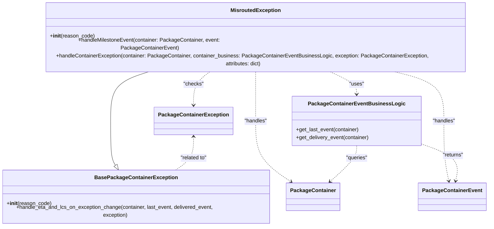

# Diagram: partview_core/partview_service/partview_service/core/business/package_container_exception_status/package_container_exceptions/PackageContainerMisroutedException.py

> Auto-generated by Obscura crawlers

## Mermaid

### SVG

<svg id="container" width="1486.326171875" xmlns="http://www.w3.org/2000/svg" class="classDiagram" height="638" viewBox="0 0 1486.326171875 638" role="graphics-document document" aria-roledescription="class"><g><defs><marker id="container_class-aggregationStart" class="marker aggregation class" refX="18" refY="7" markerWidth="190" markerHeight="240" orient="auto"><path d="M 18,7 L9,13 L1,7 L9,1 Z"></path></marker></defs><defs><marker id="container_class-aggregationEnd" class="marker aggregation class" refX="1" refY="7" markerWidth="20" markerHeight="28" orient="auto"><path d="M 18,7 L9,13 L1,7 L9,1 Z"></path></marker></defs><defs><marker id="container_class-extensionStart" class="marker extension class" refX="18" refY="7" markerWidth="190" markerHeight="240" orient="auto"><path d="M 1,7 L18,13 V 1 Z"></path></marker></defs><defs><marker id="container_class-extensionEnd" class="marker extension class" refX="1" refY="7" markerWidth="20" markerHeight="28" orient="auto"><path d="M 1,1 V 13 L18,7 Z"></path></marker></defs><defs><marker id="container_class-compositionStart" class="marker composition class" refX="18" refY="7" markerWidth="190" markerHeight="240" orient="auto"><path d="M 18,7 L9,13 L1,7 L9,1 Z"></path></marker></defs><defs><marker id="container_class-compositionEnd" class="marker composition class" refX="1" refY="7" markerWidth="20" markerHeight="28" orient="auto"><path d="M 18,7 L9,13 L1,7 L9,1 Z"></path></marker></defs><defs><marker id="container_class-dependencyStart" class="marker dependency class" refX="6" refY="7" markerWidth="190" markerHeight="240" orient="auto"><path d="M 5,7 L9,13 L1,7 L9,1 Z"></path></marker></defs><defs><marker id="container_class-dependencyEnd" class="marker dependency class" refX="13" refY="7" markerWidth="20" markerHeight="28" orient="auto"><path d="M 18,7 L9,13 L14,7 L9,1 Z"></path></marker></defs><defs><marker id="container_class-lollipopStart" class="marker lollipop class" refX="13" refY="7" markerWidth="190" markerHeight="240" orient="auto"><circle stroke="black" fill="transparent" cx="7" cy="7" r="6"></circle></marker></defs><defs><marker id="container_class-lollipopEnd" class="marker lollipop class" refX="1" refY="7" markerWidth="190" markerHeight="240" orient="auto"><circle stroke="black" fill="transparent" cx="7" cy="7" r="6"></circle></marker></defs><g class="root"><g class="clusters"></g><g class="edgePaths"><path d="M476.348,182L454.681,188.167C433.014,194.333,389.681,206.667,368.014,231.5C346.348,256.333,346.348,293.667,346.348,331C346.348,368.333,346.348,405.667,348.84,428.102C351.333,450.537,356.318,458.075,358.81,461.843L361.303,465.612" id="id_MisroutedException_BasePackageContainerException_1" class="edge-thickness-normal edge-pattern-solid relation" style=";;;" data-edge="true" data-et="edge" data-id="id_MisroutedException_BasePackageContainerException_1" data-points="W3sieCI6NDc2LjM0NzY4Nzc1MjAxNjE2LCJ5IjoxODJ9LHsieCI6MzQ2LjM0NzY1NjI1LCJ5IjoyMTl9LHsieCI6MzQ2LjM0NzY1NjI1LCJ5IjozMzF9LHsieCI6MzQ2LjM0NzY1NjI1LCJ5Ijo0NDN9LHsieCI6MzcwLjgxODYwMzUxNTYyNSwieSI6NDgwfV0=" marker-end="url(#container_class-extensionEnd)"></path><path d="M782.023,182L782.023,188.167C782.023,194.333,782.023,206.667,782.023,231.5C782.023,256.333,782.023,293.667,782.023,331C782.023,368.333,782.023,405.667,799.747,435.468C817.47,465.269,852.917,487.539,870.64,498.673L888.364,509.808" id="id_MisroutedException_PackageContainer_2" class="edge-thickness-normal edge-pattern-dashed relation" style=";;;" data-edge="true" data-et="edge" data-id="id_MisroutedException_PackageContainer_2" data-points="W3sieCI6NzgyLjAyMzQzNzUsInkiOjE4Mn0seyJ4Ijo3ODIuMDIzNDM3NSwieSI6MjE5fSx7IngiOjc4Mi4wMjM0Mzc1LCJ5IjozMzF9LHsieCI6NzgyLjAyMzQzNzUsInkiOjQ0M30seyJ4Ijo4OTMuNDQ0MzM1OTM3NSwieSI6NTEzfV0=" marker-end="url(#container_class-dependencyEnd)"></path><path d="M1183.613,182L1212.078,188.167C1240.544,194.333,1297.474,206.667,1325.939,231.5C1354.404,256.333,1354.404,293.667,1354.404,331C1354.404,368.333,1354.404,405.667,1356.912,435.026C1359.42,464.386,1364.435,485.772,1366.943,496.465L1369.45,507.158" id="id_MisroutedException_PackageContainerEvent_3" class="edge-thickness-normal edge-pattern-dashed relation" style=";;;" data-edge="true" data-et="edge" data-id="id_MisroutedException_PackageContainerEvent_3" data-points="W3sieCI6MTE4My42MTMyMzM5OTY5NzU5LCJ5IjoxODJ9LHsieCI6MTM1NC40MDQyOTY4NzUsInkiOjIxOX0seyJ4IjoxMzU0LjQwNDI5Njg3NSwieSI6MzMxfSx7IngiOjEzNTQuNDA0Mjk2ODc1LCJ5Ijo0NDN9LHsieCI6MTM3MC44MjAzMTI1LCJ5Ijo1MTN9XQ==" marker-end="url(#container_class-dependencyEnd)"></path><path d="M999.273,182L1014.672,188.167C1030.07,194.333,1060.868,206.667,1076.267,218C1091.666,229.333,1091.666,239.667,1091.666,244.833L1091.666,250" id="id_MisroutedException_PackageContainerEventBusinessLogic_4" class="edge-thickness-normal edge-pattern-dashed relation" style=";;;" data-edge="true" data-et="edge" data-id="id_MisroutedException_PackageContainerEventBusinessLogic_4" data-points="W3sieCI6OTk5LjI3MjY2NTcwMDYwNDksInkiOjE4Mn0seyJ4IjoxMDkxLjY2NjAxNTYyNSwieSI6MjE5fSx7IngiOjEwOTEuNjY2MDE1NjI1LCJ5IjoyNTZ9XQ==" marker-end="url(#container_class-dependencyEnd)"></path><path d="M653.398,182L644.281,188.167C635.164,194.333,616.93,206.667,607.812,223.5C598.695,240.333,598.695,261.667,598.695,272.333L598.695,283" id="id_MisroutedException_PackageContainerException_5" class="edge-thickness-normal edge-pattern-dashed relation" style=";;;" data-edge="true" data-et="edge" data-id="id_MisroutedException_PackageContainerException_5" data-points="W3sieCI6NjUzLjM5ODA1OTQ3NTgwNjUsInkiOjE4Mn0seyJ4Ijo1OTguNjk1MzEyNSwieSI6MjE5fSx7IngiOjU5OC42OTUzMTI1LCJ5IjoyODl9XQ==" marker-end="url(#container_class-dependencyEnd)"></path><path d="M1091.666,406L1091.666,412.167C1091.666,418.333,1091.666,430.667,1078.743,447.851C1065.819,465.036,1039.973,487.072,1027.049,498.089L1014.126,509.107" id="id_PackageContainerEventBusinessLogic_PackageContainer_6" class="edge-thickness-normal edge-pattern-dashed relation" style=";;;" data-edge="true" data-et="edge" data-id="id_PackageContainerEventBusinessLogic_PackageContainer_6" data-points="W3sieCI6MTA5MS42NjYwMTU2MjUsInkiOjQwNn0seyJ4IjoxMDkxLjY2NjAxNTYyNSwieSI6NDQzfSx7IngiOjEwMDkuNTYwMzAyNzM0Mzc1LCJ5Ijo1MTN9XQ==" marker-end="url(#container_class-dependencyEnd)"></path><path d="M1284.225,399.407L1304.676,406.672C1325.128,413.938,1366.032,428.469,1383.976,446.428C1401.92,464.386,1396.905,485.772,1394.397,496.465L1391.889,507.158" id="id_PackageContainerEventBusinessLogic_PackageContainerEvent_7" class="edge-thickness-normal edge-pattern-dashed relation" style=";;;" data-edge="true" data-et="edge" data-id="id_PackageContainerEventBusinessLogic_PackageContainerEvent_7" data-points="W3sieCI6MTI4NC4yMjQ2MDkzNzUsInkiOjM5OS40MDY3NDUyMjA0ODM0Nn0seyJ4IjoxNDA2LjkzNTU0Njg3NSwieSI6NDQzfSx7IngiOjEzOTAuNTE5NTMxMjUsInkiOjUxM31d" marker-end="url(#container_class-dependencyEnd)"></path><path d="M598.695,379L598.695,389.667C598.695,400.333,598.695,421.667,588.88,438.5C579.064,455.333,559.433,467.667,549.617,473.833L539.801,480" id="id_PackageContainerException_BasePackageContainerException_8" class="edge-thickness-normal edge-pattern-dashed relation" style=";;;" data-edge="true" data-et="edge" data-id="id_PackageContainerException_BasePackageContainerException_8" data-points="W3sieCI6NTk4LjY5NTMxMjUsInkiOjM3M30seyJ4Ijo1OTguNjk1MzEyNSwieSI6NDQzfSx7IngiOjUzOS44MDE0MDkwNDAxNzg2LCJ5Ijo0ODB9XQ==" marker-start="url(#container_class-dependencyStart)"></path></g><g class="edgeLabels"><g class="edgeLabel"><g class="label" data-id="id_MisroutedException_BasePackageContainerException_1" transform="translate(0, 0)"><foreignObject width="0" height="0">

</foreignObject></g></g><g class="edgeLabel" transform="translate(782.0234375, 331)"><g class="label" data-id="id_MisroutedException_PackageContainer_2" transform="translate(-35.1796875, -12)"><foreignObject width="70.359375" height="24">

"handles"

</foreignObject></g></g><g class="edgeLabel" transform="translate(1354.404296875, 331)"><g class="label" data-id="id_MisroutedException_PackageContainerEvent_3" transform="translate(-35.1796875, -12)"><foreignObject width="70.359375" height="24">

"handles"

</foreignObject></g></g><g class="edgeLabel" transform="translate(1091.666015625, 219)"><g class="label" data-id="id_MisroutedException_PackageContainerEventBusinessLogic_4" transform="translate(-22.7578125, -12)"><foreignObject width="45.515625" height="24">

"uses"

</foreignObject></g></g><g class="edgeLabel" transform="translate(598.6953125, 219)"><g class="label" data-id="id_MisroutedException_PackageContainerException_5" transform="translate(-30.6796875, -12)"><foreignObject width="61.359375" height="24">

"checks"

</foreignObject></g></g><g class="edgeLabel" transform="translate(1091.666015625, 443)"><g class="label" data-id="id_PackageContainerEventBusinessLogic_PackageContainer_6" transform="translate(-33.4296875, -12)"><foreignObject width="66.859375" height="24">

"queries"

</foreignObject></g></g><g class="edgeLabel" transform="translate(1379.45554, 433.23768)"><g class="label" data-id="id_PackageContainerEventBusinessLogic_PackageContainerEvent_7" transform="translate(-32.53125, -12)"><foreignObject width="65.0625" height="24">

"returns"

</foreignObject></g></g><g class="edgeLabel" transform="translate(598.6953125, 443)"><g class="label" data-id="id_PackageContainerException_BasePackageContainerException_8" transform="translate(-41.640625, -12)"><foreignObject width="83.28125" height="24">

"related to"

</foreignObject></g></g></g><g class="nodes"><g class="node default" id="classId-MisroutedException-0" transform="translate(782.0234375, 95)"><g class="basic label-container"><path d="M-669.2734375 -87 L669.2734375 -87 L669.2734375 87 L-669.2734375 87" stroke="none" stroke-width="0" fill="#ECECFF" style=""></path><path d="M-669.2734375 -87 C-216.51048978770694 -87, 236.2524579245861 -87, 669.2734375 -87 M-669.2734375 -87 C-265.78744041650157 -87, 137.69855666699686 -87, 669.2734375 -87 M669.2734375 -87 C669.2734375 -34.74554478991281, 669.2734375 17.508910420174374, 669.2734375 87 M669.2734375 -87 C669.2734375 -37.03721494585602, 669.2734375 12.925570108287957, 669.2734375 87 M669.2734375 87 C182.28518369170098 87, -304.70307011659804 87, -669.2734375 87 M669.2734375 87 C383.7186339923098 87, 98.16383048461955 87, -669.2734375 87 M-669.2734375 87 C-669.2734375 43.60832594074225, -669.2734375 0.21665188148449488, -669.2734375 -87 M-669.2734375 87 C-669.2734375 26.115449979921173, -669.2734375 -34.76910004015765, -669.2734375 -87" stroke="#9370DB" stroke-width="1.3" fill="none" stroke-dasharray="0 0" style=""></path></g><g class="annotation-group text" transform="translate(0, -63)"></g><g class="label-group text" transform="translate(-72.484375, -63)"><g class="label" style="font-weight: bolder" transform="translate(0,-12)"><foreignObject width="144.96875" height="24">

MisroutedException

</foreignObject></g></g><g class="members-group text" transform="translate(-657.2734375, -15)"></g><g class="methods-group text" transform="translate(-657.2734375, 15)"><g class="label" style="" transform="translate(0,-12)"><foreignObject width="134.75" height="24">

+<strong>init</strong>(reason_code)

</foreignObject></g><g class="label" style="" transform="translate(0,12)"><foreignObject width="609.125" height="24">

+handleMilestoneEvent(container: PackageContainer, event: PackageContainerEvent)

</foreignObject></g><g class="label" style="" transform="translate(0,36)"><foreignObject width="1242.0625" height="24">

+handleContainerException(container: PackageContainer, container_business: PackageContainerEventBusinessLogic, exception: PackageContainerException, attributes: dict)

</foreignObject></g></g><g class="divider" style=""><path d="M-669.2734375 -39 C-216.66713898982357 -39, 235.93915952035286 -39, 669.2734375 -39 M-669.2734375 -39 C-314.227783314671 -39, 40.817870870658 -39, 669.2734375 -39" stroke="#9370DB" stroke-width="1.3" fill="none" stroke-dasharray="0 0" style=""></path></g><g class="divider" style=""><path d="M-669.2734375 -15 C-158.3734666140395 -15, 352.526504271921 -15, 669.2734375 -15 M-669.2734375 -15 C-301.6033355218518 -15, 66.06676645629636 -15, 669.2734375 -15" stroke="#9370DB" stroke-width="1.3" fill="none" stroke-dasharray="0 0" style=""></path></g></g><g class="node default" id="classId-BasePackageContainerException-1" transform="translate(420.421875, 555)"><g class="basic label-container"><path d="M-412.421875 -75 L412.421875 -75 L412.421875 75 L-412.421875 75" stroke="none" stroke-width="0" fill="#ECECFF" style=""></path><path d="M-412.421875 -75 C-136.55631397141758 -75, 139.30924705716484 -75, 412.421875 -75 M-412.421875 -75 C-169.64278209731833 -75, 73.13631080536334 -75, 412.421875 -75 M412.421875 -75 C412.421875 -33.368982873246864, 412.421875 8.262034253506272, 412.421875 75 M412.421875 -75 C412.421875 -32.14737840071448, 412.421875 10.70524319857104, 412.421875 75 M412.421875 75 C86.08832877657795 75, -240.2452174468441 75, -412.421875 75 M412.421875 75 C156.5552149025976 75, -99.31144519480478 75, -412.421875 75 M-412.421875 75 C-412.421875 24.431945676145574, -412.421875 -26.136108647708852, -412.421875 -75 M-412.421875 75 C-412.421875 32.19360578555116, -412.421875 -10.612788428897673, -412.421875 -75" stroke="#9370DB" stroke-width="1.3" fill="none" stroke-dasharray="0 0" style=""></path></g><g class="annotation-group text" transform="translate(0, -51)"></g><g class="label-group text" transform="translate(-118.671875, -51)"><g class="label" style="font-weight: bolder" transform="translate(0,-12)"><foreignObject width="237.34375" height="24">

BasePackageContainerException

</foreignObject></g></g><g class="members-group text" transform="translate(-400.421875, -3)"></g><g class="methods-group text" transform="translate(-400.421875, 27)"><g class="label" style="" transform="translate(0,-12)"><foreignObject width="134.75" height="24">

+<strong>init</strong>(reason_code)

</foreignObject></g><g class="label" style="" transform="translate(0,12)"><foreignObject width="682.171875" height="24">

+handle_eta_and_lcs_on_exception_change(container, last_event, delivered_event, exception)

</foreignObject></g></g><g class="divider" style=""><path d="M-412.421875 -27 C-162.341056337215 -27, 87.73976232556998 -27, 412.421875 -27 M-412.421875 -27 C-90.48968120821723 -27, 231.44251258356553 -27, 412.421875 -27" stroke="#9370DB" stroke-width="1.3" fill="none" stroke-dasharray="0 0" style=""></path></g><g class="divider" style=""><path d="M-412.421875 -3 C-161.68208871857757 -3, 89.05769756284485 -3, 412.421875 -3 M-412.421875 -3 C-93.84352995238328 -3, 224.73481509523344 -3, 412.421875 -3" stroke="#9370DB" stroke-width="1.3" fill="none" stroke-dasharray="0 0" style=""></path></g></g><g class="node default" id="classId-PackageContainer-2" transform="translate(960.296875, 555)"><g class="basic label-container"><path d="M-77.453125 -42 L77.453125 -42 L77.453125 42 L-77.453125 42" stroke="none" stroke-width="0" fill="#ECECFF" style=""></path><path d="M-77.453125 -42 C-16.219425464218205 -42, 45.01427407156359 -42, 77.453125 -42 M-77.453125 -42 C-44.17999881546398 -42, -10.906872630927964 -42, 77.453125 -42 M77.453125 -42 C77.453125 -22.712820289380613, 77.453125 -3.425640578761225, 77.453125 42 M77.453125 -42 C77.453125 -20.270400089888945, 77.453125 1.4591998202221106, 77.453125 42 M77.453125 42 C41.778760900435266 42, 6.104396800870532 42, -77.453125 42 M77.453125 42 C23.112002254382865 42, -31.22912049123427 42, -77.453125 42 M-77.453125 42 C-77.453125 13.800836125471957, -77.453125 -14.398327749056087, -77.453125 -42 M-77.453125 42 C-77.453125 14.280182444690094, -77.453125 -13.439635110619811, -77.453125 -42" stroke="#9370DB" stroke-width="1.3" fill="none" stroke-dasharray="0 0" style=""></path></g><g class="annotation-group text" transform="translate(0, -18)"></g><g class="label-group text" transform="translate(-65.453125, -18)"><g class="label" style="font-weight: bolder" transform="translate(0,-12)"><foreignObject width="130.90625" height="24">

PackageContainer

</foreignObject></g></g><g class="members-group text" transform="translate(-65.453125, 30)"></g><g class="methods-group text" transform="translate(-65.453125, 60)"></g><g class="divider" style=""><path d="M-77.453125 6 C-19.526006613452985 6, 38.40111177309403 6, 77.453125 6 M-77.453125 6 C-46.43126520249203 6, -15.409405404984057 6, 77.453125 6" stroke="#9370DB" stroke-width="1.3" fill="none" stroke-dasharray="0 0" style=""></path></g><g class="divider" style=""><path d="M-77.453125 24 C-18.190065590790255 24, 41.07299381841949 24, 77.453125 24 M-77.453125 24 C-17.68810669257018 24, 42.07691161485964 24, 77.453125 24" stroke="#9370DB" stroke-width="1.3" fill="none" stroke-dasharray="0 0" style=""></path></g></g><g class="node default" id="classId-PackageContainerEvent-3" transform="translate(1380.669921875, 555)"><g class="basic label-container"><path d="M-97.65625 -42 L97.65625 -42 L97.65625 42 L-97.65625 42" stroke="none" stroke-width="0" fill="#ECECFF" style=""></path><path d="M-97.65625 -42 C-58.20649002057375 -42, -18.756730041147506 -42, 97.65625 -42 M-97.65625 -42 C-43.891042372185616 -42, 9.874165255628768 -42, 97.65625 -42 M97.65625 -42 C97.65625 -9.266241255195247, 97.65625 23.467517489609506, 97.65625 42 M97.65625 -42 C97.65625 -12.329435823307445, 97.65625 17.34112835338511, 97.65625 42 M97.65625 42 C37.57546919890106 42, -22.505311602197878 42, -97.65625 42 M97.65625 42 C30.69133803555127 42, -36.27357392889746 42, -97.65625 42 M-97.65625 42 C-97.65625 15.864073090529505, -97.65625 -10.27185381894099, -97.65625 -42 M-97.65625 42 C-97.65625 23.085721606316863, -97.65625 4.171443212633726, -97.65625 -42" stroke="#9370DB" stroke-width="1.3" fill="none" stroke-dasharray="0 0" style=""></path></g><g class="annotation-group text" transform="translate(0, -18)"></g><g class="label-group text" transform="translate(-85.65625, -18)"><g class="label" style="font-weight: bolder" transform="translate(0,-12)"><foreignObject width="171.3125" height="24">

PackageContainerEvent

</foreignObject></g></g><g class="members-group text" transform="translate(-85.65625, 30)"></g><g class="methods-group text" transform="translate(-85.65625, 60)"></g><g class="divider" style=""><path d="M-97.65625 6 C-46.66066115710602 6, 4.33492768578796 6, 97.65625 6 M-97.65625 6 C-55.39016641766155 6, -13.124082835323094 6, 97.65625 6" stroke="#9370DB" stroke-width="1.3" fill="none" stroke-dasharray="0 0" style=""></path></g><g class="divider" style=""><path d="M-97.65625 24 C-52.88222933063688 24, -8.108208661273764 24, 97.65625 24 M-97.65625 24 C-50.14124256209515 24, -2.626235124190302 24, 97.65625 24" stroke="#9370DB" stroke-width="1.3" fill="none" stroke-dasharray="0 0" style=""></path></g></g><g class="node default" id="classId-PackageContainerEventBusinessLogic-4" transform="translate(1091.666015625, 331)"><g class="basic label-container"><path d="M-192.55859375 -75 L192.55859375 -75 L192.55859375 75 L-192.55859375 75" stroke="none" stroke-width="0" fill="#ECECFF" style=""></path><path d="M-192.55859375 -75 C-107.3526140548102 -75, -22.146634359620407 -75, 192.55859375 -75 M-192.55859375 -75 C-66.80836772344843 -75, 58.941858303103146 -75, 192.55859375 -75 M192.55859375 -75 C192.55859375 -32.684431584545074, 192.55859375 9.631136830909853, 192.55859375 75 M192.55859375 -75 C192.55859375 -15.881112005760428, 192.55859375 43.23777598847914, 192.55859375 75 M192.55859375 75 C39.48225130025892 75, -113.59409114948215 75, -192.55859375 75 M192.55859375 75 C85.27432876538312 75, -22.009936219233765 75, -192.55859375 75 M-192.55859375 75 C-192.55859375 38.68407154346499, -192.55859375 2.368143086929976, -192.55859375 -75 M-192.55859375 75 C-192.55859375 29.05732916201069, -192.55859375 -16.885341675978623, -192.55859375 -75" stroke="#9370DB" stroke-width="1.3" fill="none" stroke-dasharray="0 0" style=""></path></g><g class="annotation-group text" transform="translate(0, -51)"></g><g class="label-group text" transform="translate(-137.0703125, -51)"><g class="label" style="font-weight: bolder" transform="translate(0,-12)"><foreignObject width="274.140625" height="24">

PackageContainerEventBusinessLogic

</foreignObject></g></g><g class="members-group text" transform="translate(-180.55859375, -3)"></g><g class="methods-group text" transform="translate(-180.55859375, 27)"><g class="label" style="" transform="translate(0,-12)"><foreignObject width="193.015625" height="24">

+get_last_event(container)

</foreignObject></g><g class="label" style="" transform="translate(0,12)"><foreignObject width="224.046875" height="24">

+get_delivery_event(container)

</foreignObject></g></g><g class="divider" style=""><path d="M-192.55859375 -27 C-70.21381433850169 -27, 52.13096507299662 -27, 192.55859375 -27 M-192.55859375 -27 C-43.67030154833546 -27, 105.21799065332908 -27, 192.55859375 -27" stroke="#9370DB" stroke-width="1.3" fill="none" stroke-dasharray="0 0" style=""></path></g><g class="divider" style=""><path d="M-192.55859375 -3 C-43.18705727243744 -3, 106.18447920512511 -3, 192.55859375 -3 M-192.55859375 -3 C-91.36748360382178 -3, 9.823626542356436 -3, 192.55859375 -3" stroke="#9370DB" stroke-width="1.3" fill="none" stroke-dasharray="0 0" style=""></path></g></g><g class="node default" id="classId-PackageContainerException-5" transform="translate(598.6953125, 331)"><g class="basic label-container"><path d="M-113.1484375 -42 L113.1484375 -42 L113.1484375 42 L-113.1484375 42" stroke="none" stroke-width="0" fill="#ECECFF" style=""></path><path d="M-113.1484375 -42 C-26.388026406373854 -42, 60.37238468725229 -42, 113.1484375 -42 M-113.1484375 -42 C-57.61226875025846 -42, -2.0761000005169166 -42, 113.1484375 -42 M113.1484375 -42 C113.1484375 -24.20025594226391, 113.1484375 -6.400511884527823, 113.1484375 42 M113.1484375 -42 C113.1484375 -18.10053726506545, 113.1484375 5.798925469869097, 113.1484375 42 M113.1484375 42 C58.75926878766312 42, 4.370100075326235 42, -113.1484375 42 M113.1484375 42 C61.44798768663614 42, 9.747537873272279 42, -113.1484375 42 M-113.1484375 42 C-113.1484375 9.739610393142073, -113.1484375 -22.520779213715855, -113.1484375 -42 M-113.1484375 42 C-113.1484375 18.803466601899267, -113.1484375 -4.393066796201467, -113.1484375 -42" stroke="#9370DB" stroke-width="1.3" fill="none" stroke-dasharray="0 0" style=""></path></g><g class="annotation-group text" transform="translate(0, -18)"></g><g class="label-group text" transform="translate(-101.1484375, -18)"><g class="label" style="font-weight: bolder" transform="translate(0,-12)"><foreignObject width="202.296875" height="24">

PackageContainerException

</foreignObject></g></g><g class="members-group text" transform="translate(-101.1484375, 30)"></g><g class="methods-group text" transform="translate(-101.1484375, 60)"></g><g class="divider" style=""><path d="M-113.1484375 6 C-50.29605745722894 6, 12.55632258554212 6, 113.1484375 6 M-113.1484375 6 C-50.64258078602443 6, 11.863275927951136 6, 113.1484375 6" stroke="#9370DB" stroke-width="1.3" fill="none" stroke-dasharray="0 0" style=""></path></g><g class="divider" style=""><path d="M-113.1484375 24 C-55.96932494815706 24, 1.2097876036858821 24, 113.1484375 24 M-113.1484375 24 C-32.66627913930111 24, 47.81587922139778 24, 113.1484375 24" stroke="#9370DB" stroke-width="1.3" fill="none" stroke-dasharray="0 0" style=""></path></g></g></g></g></g></svg>
