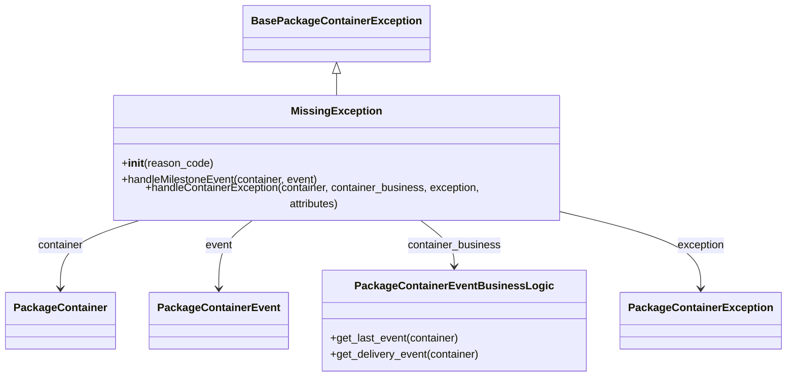

# Diagram: partview_core/partview_service/partview_service/core/business/package_container_exception_status/package_container_exceptions/PackageContainerMissingException.py

> Auto-generated by Obscura crawlers

## Mermaid

### SVG

<svg id="container" width="1127.6328125" xmlns="http://www.w3.org/2000/svg" class="classDiagram" height="548" viewBox="0 0 1127.6328125 548" role="graphics-document document" aria-roledescription="class"><g><defs><marker id="container_class-aggregationStart" class="marker aggregation class" refX="18" refY="7" markerWidth="190" markerHeight="240" orient="auto"><path d="M 18,7 L9,13 L1,7 L9,1 Z"></path></marker></defs><defs><marker id="container_class-aggregationEnd" class="marker aggregation class" refX="1" refY="7" markerWidth="20" markerHeight="28" orient="auto"><path d="M 18,7 L9,13 L1,7 L9,1 Z"></path></marker></defs><defs><marker id="container_class-extensionStart" class="marker extension class" refX="18" refY="7" markerWidth="190" markerHeight="240" orient="auto"><path d="M 1,7 L18,13 V 1 Z"></path></marker></defs><defs><marker id="container_class-extensionEnd" class="marker extension class" refX="1" refY="7" markerWidth="20" markerHeight="28" orient="auto"><path d="M 1,1 V 13 L18,7 Z"></path></marker></defs><defs><marker id="container_class-compositionStart" class="marker composition class" refX="18" refY="7" markerWidth="190" markerHeight="240" orient="auto"><path d="M 18,7 L9,13 L1,7 L9,1 Z"></path></marker></defs><defs><marker id="container_class-compositionEnd" class="marker composition class" refX="1" refY="7" markerWidth="20" markerHeight="28" orient="auto"><path d="M 18,7 L9,13 L1,7 L9,1 Z"></path></marker></defs><defs><marker id="container_class-dependencyStart" class="marker dependency class" refX="6" refY="7" markerWidth="190" markerHeight="240" orient="auto"><path d="M 5,7 L9,13 L1,7 L9,1 Z"></path></marker></defs><defs><marker id="container_class-dependencyEnd" class="marker dependency class" refX="13" refY="7" markerWidth="20" markerHeight="28" orient="auto"><path d="M 18,7 L9,13 L14,7 L9,1 Z"></path></marker></defs><defs><marker id="container_class-lollipopStart" class="marker lollipop class" refX="13" refY="7" markerWidth="190" markerHeight="240" orient="auto"><circle stroke="black" fill="transparent" cx="7" cy="7" r="6"></circle></marker></defs><defs><marker id="container_class-lollipopEnd" class="marker lollipop class" refX="1" refY="7" markerWidth="190" markerHeight="240" orient="auto"><circle stroke="black" fill="transparent" cx="7" cy="7" r="6"></circle></marker></defs><g class="root"><g class="clusters"></g><g class="edgePaths"><path d="M480.67,109.25L480.67,110.542C480.67,111.833,480.67,114.417,480.67,119.875C480.67,125.333,480.67,133.667,480.67,137.833L480.67,142" id="id_BasePackageContainerException_MissingException_1" class="edge-thickness-normal edge-pattern-solid relation" style=";;;" data-edge="true" data-et="edge" data-id="id_BasePackageContainerException_MissingException_1" data-points="W3sieCI6NDgwLjY2OTkyMTg3NSwieSI6OTJ9LHsieCI6NDgwLjY2OTkyMTg3NSwieSI6MTE3fSx7IngiOjQ4MC42Njk5MjE4NzUsInkiOjE0Mn1d" marker-start="url(#container_class-extensionStart)"></path><path d="M203.381,316L183.726,322.167C164.072,328.333,124.762,340.667,105.108,357.5C85.453,374.333,85.453,395.667,85.453,406.333L85.453,417" id="id_MissingException_PackageContainer_2" class="edge-thickness-normal edge-pattern-solid relation" style=";;;" data-edge="true" data-et="edge" data-id="id_MissingException_PackageContainer_2" data-points="W3sieCI6MjAzLjM4MDcxNzYxNTkyNzQ0LCJ5IjozMTZ9LHsieCI6ODUuNDUzMTI1LCJ5IjozNTN9LHsieCI6ODUuNDUzMTI1LCJ5Ijo0MjN9XQ==" marker-end="url(#container_class-dependencyEnd)"></path><path d="M361.32,316L352.861,322.167C344.401,328.333,327.482,340.667,319.022,357.5C310.563,374.333,310.563,395.667,310.563,406.333L310.563,417" id="id_MissingException_PackageContainerEvent_3" class="edge-thickness-normal edge-pattern-solid relation" style=";;;" data-edge="true" data-et="edge" data-id="id_MissingException_PackageContainerEvent_3" data-points="W3sieCI6MzYxLjMyMDM1OTc1MzAyNDIsInkiOjMxNn0seyJ4IjozMTAuNTYyNSwieSI6MzUzfSx7IngiOjMxMC41NjI1LCJ5Ijo0MjN9XQ==" marker-end="url(#container_class-dependencyEnd)"></path><path d="M600.019,316L608.479,322.167C616.939,328.333,633.858,340.667,642.318,352C650.777,363.333,650.777,373.667,650.777,378.833L650.777,384" id="id_MissingException_PackageContainerEventBusinessLogic_4" class="edge-thickness-normal edge-pattern-solid relation" style=";;;" data-edge="true" data-et="edge" data-id="id_MissingException_PackageContainerEventBusinessLogic_4" data-points="W3sieCI6NjAwLjAxOTQ4Mzk5Njk3NTksInkiOjMxNn0seyJ4Ijo2NTAuNzc3MzQzNzUsInkiOjM1M30seyJ4Ijo2NTAuNzc3MzQzNzUsInkiOjM5MH1d" marker-end="url(#container_class-dependencyEnd)"></path><path d="M816.408,308.175L848.088,315.646C879.767,323.117,943.126,338.058,974.805,356.196C1006.484,374.333,1006.484,395.667,1006.484,406.333L1006.484,417" id="id_MissingException_PackageContainerException_5" class="edge-thickness-normal edge-pattern-solid relation" style=";;;" data-edge="true" data-et="edge" data-id="id_MissingException_PackageContainerException_5" data-points="W3sieCI6ODE2LjQwODIwMzEyNSwieSI6MzA4LjE3NTM1NjY4MjUyNzV9LHsieCI6MTAwNi40ODQzNzUsInkiOjM1M30seyJ4IjoxMDA2LjQ4NDM3NSwieSI6NDIzfV0=" marker-end="url(#container_class-dependencyEnd)"></path></g><g class="edgeLabels"><g class="edgeLabel"><g class="label" data-id="id_BasePackageContainerException_MissingException_1" transform="translate(0, 0)"><foreignObject width="0" height="0">

</foreignObject></g></g><g class="edgeLabel" transform="translate(85.453125, 353)"><g class="label" data-id="id_MissingException_PackageContainer_2" transform="translate(-34.6015625, -12)"><foreignObject width="69.203125" height="24">

container

</foreignObject></g></g><g class="edgeLabel" transform="translate(310.5625, 353)"><g class="label" data-id="id_MissingException_PackageContainerEvent_3" transform="translate(-20.171875, -12)"><foreignObject width="40.34375" height="24">

event

</foreignObject></g></g><g class="edgeLabel" transform="translate(650.77734375, 353)"><g class="label" data-id="id_MissingException_PackageContainerEventBusinessLogic_4" transform="translate(-69.9609375, -12)"><foreignObject width="139.921875" height="24">

container_business

</foreignObject></g></g><g class="edgeLabel" transform="translate(1006.484375, 353)"><g class="label" data-id="id_MissingException_PackageContainerException_5" transform="translate(-35.3828125, -12)"><foreignObject width="70.765625" height="24">

exception

</foreignObject></g></g></g><g class="nodes"><g class="node default" id="classId-BasePackageContainerException-0" transform="translate(480.669921875, 50)"><g class="basic label-container"><path d="M-130.671875 -42 L130.671875 -42 L130.671875 42 L-130.671875 42" stroke="none" stroke-width="0" fill="#ECECFF" style=""></path><path d="M-130.671875 -42 C-38.953186741677655 -42, 52.76550151664469 -42, 130.671875 -42 M-130.671875 -42 C-75.06971763400952 -42, -19.467560268019028 -42, 130.671875 -42 M130.671875 -42 C130.671875 -14.534287142403922, 130.671875 12.931425715192155, 130.671875 42 M130.671875 -42 C130.671875 -21.465809445325224, 130.671875 -0.9316188906504479, 130.671875 42 M130.671875 42 C60.187588030353055 42, -10.29669893929389 42, -130.671875 42 M130.671875 42 C40.60766038036385 42, -49.45655423927229 42, -130.671875 42 M-130.671875 42 C-130.671875 21.658127447732323, -130.671875 1.3162548954646454, -130.671875 -42 M-130.671875 42 C-130.671875 11.054827977958357, -130.671875 -19.890344044083285, -130.671875 -42" stroke="#9370DB" stroke-width="1.3" fill="none" stroke-dasharray="0 0" style=""></path></g><g class="annotation-group text" transform="translate(0, -18)"></g><g class="label-group text" transform="translate(-118.671875, -18)"><g class="label" style="font-weight: bolder" transform="translate(0,-12)"><foreignObject width="237.34375" height="24">

BasePackageContainerException

</foreignObject></g></g><g class="members-group text" transform="translate(-118.671875, 30)"></g><g class="methods-group text" transform="translate(-118.671875, 60)"></g><g class="divider" style=""><path d="M-130.671875 6 C-31.99542819306157 6, 66.68101861387686 6, 130.671875 6 M-130.671875 6 C-56.236487575499694 6, 18.19889984900061 6, 130.671875 6" stroke="#9370DB" stroke-width="1.3" fill="none" stroke-dasharray="0 0" style=""></path></g><g class="divider" style=""><path d="M-130.671875 24 C-74.28208757788491 24, -17.892300155769803 24, 130.671875 24 M-130.671875 24 C-70.13642311682473 24, -9.60097123364946 24, 130.671875 24" stroke="#9370DB" stroke-width="1.3" fill="none" stroke-dasharray="0 0" style=""></path></g></g><g class="node default" id="classId-MissingException-1" transform="translate(480.669921875, 229)"><g class="basic label-container"><path d="M-335.73828125 -87 L335.73828125 -87 L335.73828125 87 L-335.73828125 87" stroke="none" stroke-width="0" fill="#ECECFF" style=""></path><path d="M-335.73828125 -87 C-103.2636032298067 -87, 129.2110747903866 -87, 335.73828125 -87 M-335.73828125 -87 C-194.2303549072784 -87, -52.72242856455682 -87, 335.73828125 -87 M335.73828125 -87 C335.73828125 -18.93254867450743, 335.73828125 49.13490265098514, 335.73828125 87 M335.73828125 -87 C335.73828125 -30.421910266466114, 335.73828125 26.156179467067773, 335.73828125 87 M335.73828125 87 C152.15686305614778 87, -31.42455513770443 87, -335.73828125 87 M335.73828125 87 C151.90573745338068 87, -31.92680634323864 87, -335.73828125 87 M-335.73828125 87 C-335.73828125 33.471591880859876, -335.73828125 -20.05681623828025, -335.73828125 -87 M-335.73828125 87 C-335.73828125 51.42214200240984, -335.73828125 15.844284004819684, -335.73828125 -87" stroke="#9370DB" stroke-width="1.3" fill="none" stroke-dasharray="0 0" style=""></path></g><g class="annotation-group text" transform="translate(0, -63)"></g><g class="label-group text" transform="translate(-63.1953125, -63)"><g class="label" style="font-weight: bolder" transform="translate(0,-12)"><foreignObject width="126.390625" height="24">

MissingException

</foreignObject></g></g><g class="members-group text" transform="translate(-323.73828125, -15)"></g><g class="methods-group text" transform="translate(-323.73828125, 15)"><g class="label" style="" transform="translate(0,-12)"><foreignObject width="134.75" height="24">

+<strong>init</strong>(reason_code)

</foreignObject></g><g class="label" style="" transform="translate(0,12)"><foreignObject width="295.703125" height="24">

+handleMilestoneEvent(container, event)

</foreignObject></g><g class="label" style="" transform="translate(0,36)"><foreignObject width="584.28125" height="24">

+handleContainerException(container, container_business, exception, attributes)

</foreignObject></g></g><g class="divider" style=""><path d="M-335.73828125 -39 C-174.27499858851573 -39, -12.811715927031457 -39, 335.73828125 -39 M-335.73828125 -39 C-165.4842937939679 -39, 4.769693662064185 -39, 335.73828125 -39" stroke="#9370DB" stroke-width="1.3" fill="none" stroke-dasharray="0 0" style=""></path></g><g class="divider" style=""><path d="M-335.73828125 -15 C-145.5807024067973 -15, 44.57687643640543 -15, 335.73828125 -15 M-335.73828125 -15 C-107.53008792503391 -15, 120.67810539993218 -15, 335.73828125 -15" stroke="#9370DB" stroke-width="1.3" fill="none" stroke-dasharray="0 0" style=""></path></g></g><g class="node default" id="classId-PackageContainerEventBusinessLogic-2" transform="translate(650.77734375, 465)"><g class="basic label-container"><path d="M-192.55859375 -75 L192.55859375 -75 L192.55859375 75 L-192.55859375 75" stroke="none" stroke-width="0" fill="#ECECFF" style=""></path><path d="M-192.55859375 -75 C-38.91819509223541 -75, 114.72220356552918 -75, 192.55859375 -75 M-192.55859375 -75 C-114.1636860290688 -75, -35.7687783081376 -75, 192.55859375 -75 M192.55859375 -75 C192.55859375 -33.4817617622479, 192.55859375 8.036476475504202, 192.55859375 75 M192.55859375 -75 C192.55859375 -20.934067255663017, 192.55859375 33.13186548867397, 192.55859375 75 M192.55859375 75 C111.75897842658006 75, 30.959363103160115 75, -192.55859375 75 M192.55859375 75 C59.18771496147858 75, -74.18316382704285 75, -192.55859375 75 M-192.55859375 75 C-192.55859375 17.51102372111677, -192.55859375 -39.97795255776646, -192.55859375 -75 M-192.55859375 75 C-192.55859375 15.80433364408109, -192.55859375 -43.39133271183782, -192.55859375 -75" stroke="#9370DB" stroke-width="1.3" fill="none" stroke-dasharray="0 0" style=""></path></g><g class="annotation-group text" transform="translate(0, -51)"></g><g class="label-group text" transform="translate(-137.0703125, -51)"><g class="label" style="font-weight: bolder" transform="translate(0,-12)"><foreignObject width="274.140625" height="24">

PackageContainerEventBusinessLogic

</foreignObject></g></g><g class="members-group text" transform="translate(-180.55859375, -3)"></g><g class="methods-group text" transform="translate(-180.55859375, 27)"><g class="label" style="" transform="translate(0,-12)"><foreignObject width="193.015625" height="24">

+get_last_event(container)

</foreignObject></g><g class="label" style="" transform="translate(0,12)"><foreignObject width="224.046875" height="24">

+get_delivery_event(container)

</foreignObject></g></g><g class="divider" style=""><path d="M-192.55859375 -27 C-85.04938765741866 -27, 22.459818435162674 -27, 192.55859375 -27 M-192.55859375 -27 C-82.94000893829808 -27, 26.678575873403844 -27, 192.55859375 -27" stroke="#9370DB" stroke-width="1.3" fill="none" stroke-dasharray="0 0" style=""></path></g><g class="divider" style=""><path d="M-192.55859375 -3 C-58.76888949740851 -3, 75.02081475518298 -3, 192.55859375 -3 M-192.55859375 -3 C-40.004822221975786 -3, 112.54894930604843 -3, 192.55859375 -3" stroke="#9370DB" stroke-width="1.3" fill="none" stroke-dasharray="0 0" style=""></path></g></g><g class="node default" id="classId-PackageContainer-3" transform="translate(85.453125, 465)"><g class="basic label-container"><path d="M-77.453125 -42 L77.453125 -42 L77.453125 42 L-77.453125 42" stroke="none" stroke-width="0" fill="#ECECFF" style=""></path><path d="M-77.453125 -42 C-25.751025023797453 -42, 25.951074952405094 -42, 77.453125 -42 M-77.453125 -42 C-37.0713683523676 -42, 3.3103882952648007 -42, 77.453125 -42 M77.453125 -42 C77.453125 -19.43557186566356, 77.453125 3.1288562686728767, 77.453125 42 M77.453125 -42 C77.453125 -10.724205287350483, 77.453125 20.551589425299035, 77.453125 42 M77.453125 42 C20.73534746306577 42, -35.98243007386846 42, -77.453125 42 M77.453125 42 C45.082810817900764 42, 12.712496635801529 42, -77.453125 42 M-77.453125 42 C-77.453125 17.201461930588167, -77.453125 -7.597076138823667, -77.453125 -42 M-77.453125 42 C-77.453125 11.455827499483433, -77.453125 -19.088345001033133, -77.453125 -42" stroke="#9370DB" stroke-width="1.3" fill="none" stroke-dasharray="0 0" style=""></path></g><g class="annotation-group text" transform="translate(0, -18)"></g><g class="label-group text" transform="translate(-65.453125, -18)"><g class="label" style="font-weight: bolder" transform="translate(0,-12)"><foreignObject width="130.90625" height="24">

PackageContainer

</foreignObject></g></g><g class="members-group text" transform="translate(-65.453125, 30)"></g><g class="methods-group text" transform="translate(-65.453125, 60)"></g><g class="divider" style=""><path d="M-77.453125 6 C-19.79494404267492 6, 37.86323691465016 6, 77.453125 6 M-77.453125 6 C-22.4705672433319 6, 32.5119905133362 6, 77.453125 6" stroke="#9370DB" stroke-width="1.3" fill="none" stroke-dasharray="0 0" style=""></path></g><g class="divider" style=""><path d="M-77.453125 24 C-43.398701948395434 24, -9.344278896790868 24, 77.453125 24 M-77.453125 24 C-30.933110785113193 24, 15.586903429773614 24, 77.453125 24" stroke="#9370DB" stroke-width="1.3" fill="none" stroke-dasharray="0 0" style=""></path></g></g><g class="node default" id="classId-PackageContainerEvent-4" transform="translate(310.5625, 465)"><g class="basic label-container"><path d="M-97.65625 -42 L97.65625 -42 L97.65625 42 L-97.65625 42" stroke="none" stroke-width="0" fill="#ECECFF" style=""></path><path d="M-97.65625 -42 C-31.924749568831544 -42, 33.80675086233691 -42, 97.65625 -42 M-97.65625 -42 C-51.77173138470931 -42, -5.887212769418625 -42, 97.65625 -42 M97.65625 -42 C97.65625 -22.397332459401632, 97.65625 -2.7946649188032637, 97.65625 42 M97.65625 -42 C97.65625 -18.583657869950727, 97.65625 4.832684260098546, 97.65625 42 M97.65625 42 C58.22348258782458 42, 18.790715175649154 42, -97.65625 42 M97.65625 42 C49.43849774004918 42, 1.2207454800983584 42, -97.65625 42 M-97.65625 42 C-97.65625 10.106258191487505, -97.65625 -21.78748361702499, -97.65625 -42 M-97.65625 42 C-97.65625 22.58169479847209, -97.65625 3.163389596944178, -97.65625 -42" stroke="#9370DB" stroke-width="1.3" fill="none" stroke-dasharray="0 0" style=""></path></g><g class="annotation-group text" transform="translate(0, -18)"></g><g class="label-group text" transform="translate(-85.65625, -18)"><g class="label" style="font-weight: bolder" transform="translate(0,-12)"><foreignObject width="171.3125" height="24">

PackageContainerEvent

</foreignObject></g></g><g class="members-group text" transform="translate(-85.65625, 30)"></g><g class="methods-group text" transform="translate(-85.65625, 60)"></g><g class="divider" style=""><path d="M-97.65625 6 C-37.152025049991025 6, 23.35219990001795 6, 97.65625 6 M-97.65625 6 C-23.699028240667957 6, 50.258193518664086 6, 97.65625 6" stroke="#9370DB" stroke-width="1.3" fill="none" stroke-dasharray="0 0" style=""></path></g><g class="divider" style=""><path d="M-97.65625 24 C-25.228977881085527 24, 47.19829423782895 24, 97.65625 24 M-97.65625 24 C-50.92760507842467 24, -4.198960156849338 24, 97.65625 24" stroke="#9370DB" stroke-width="1.3" fill="none" stroke-dasharray="0 0" style=""></path></g></g><g class="node default" id="classId-PackageContainerException-5" transform="translate(1006.484375, 465)"><g class="basic label-container"><path d="M-113.1484375 -42 L113.1484375 -42 L113.1484375 42 L-113.1484375 42" stroke="none" stroke-width="0" fill="#ECECFF" style=""></path><path d="M-113.1484375 -42 C-64.0352626356261 -42, -14.922087771252194 -42, 113.1484375 -42 M-113.1484375 -42 C-29.27607180426098 -42, 54.59629389147804 -42, 113.1484375 -42 M113.1484375 -42 C113.1484375 -12.676067437309435, 113.1484375 16.64786512538113, 113.1484375 42 M113.1484375 -42 C113.1484375 -19.570050735915324, 113.1484375 2.859898528169353, 113.1484375 42 M113.1484375 42 C43.76583564169481 42, -25.616766216610387 42, -113.1484375 42 M113.1484375 42 C60.22775985889943 42, 7.307082217798865 42, -113.1484375 42 M-113.1484375 42 C-113.1484375 10.841734708023516, -113.1484375 -20.316530583952968, -113.1484375 -42 M-113.1484375 42 C-113.1484375 19.32462343654743, -113.1484375 -3.35075312690514, -113.1484375 -42" stroke="#9370DB" stroke-width="1.3" fill="none" stroke-dasharray="0 0" style=""></path></g><g class="annotation-group text" transform="translate(0, -18)"></g><g class="label-group text" transform="translate(-101.1484375, -18)"><g class="label" style="font-weight: bolder" transform="translate(0,-12)"><foreignObject width="202.296875" height="24">

PackageContainerException

</foreignObject></g></g><g class="members-group text" transform="translate(-101.1484375, 30)"></g><g class="methods-group text" transform="translate(-101.1484375, 60)"></g><g class="divider" style=""><path d="M-113.1484375 6 C-61.008347914651395 6, -8.86825832930279 6, 113.1484375 6 M-113.1484375 6 C-62.29463059457293 6, -11.440823689145859 6, 113.1484375 6" stroke="#9370DB" stroke-width="1.3" fill="none" stroke-dasharray="0 0" style=""></path></g><g class="divider" style=""><path d="M-113.1484375 24 C-40.84101163897404 24, 31.466414222051924 24, 113.1484375 24 M-113.1484375 24 C-65.318811096476 24, -17.489184692951994 24, 113.1484375 24" stroke="#9370DB" stroke-width="1.3" fill="none" stroke-dasharray="0 0" style=""></path></g></g></g></g></g></svg>
