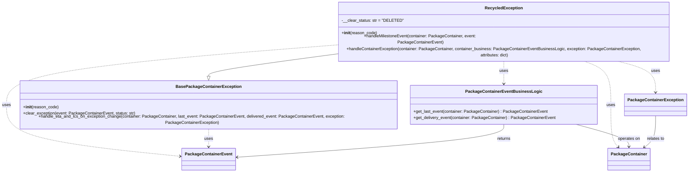

# Diagram: partview_core/partview_service/partview_service/core/business/package_container_exception_status/package_container_exceptions/PackageContainerRecycledException.py

> Auto-generated by Obscura crawlers

## Mermaid

### SVG

<svg id="container" width="2688.2421875" xmlns="http://www.w3.org/2000/svg" class="classDiagram" height="614" viewBox="0 0 2688.2421875 614" role="graphics-document document" aria-roledescription="class"><g><defs><marker id="container_class-aggregationStart" class="marker aggregation class" refX="18" refY="7" markerWidth="190" markerHeight="240" orient="auto"><path d="M 18,7 L9,13 L1,7 L9,1 Z"></path></marker></defs><defs><marker id="container_class-aggregationEnd" class="marker aggregation class" refX="1" refY="7" markerWidth="20" markerHeight="28" orient="auto"><path d="M 18,7 L9,13 L1,7 L9,1 Z"></path></marker></defs><defs><marker id="container_class-extensionStart" class="marker extension class" refX="18" refY="7" markerWidth="190" markerHeight="240" orient="auto"><path d="M 1,7 L18,13 V 1 Z"></path></marker></defs><defs><marker id="container_class-extensionEnd" class="marker extension class" refX="1" refY="7" markerWidth="20" markerHeight="28" orient="auto"><path d="M 1,1 V 13 L18,7 Z"></path></marker></defs><defs><marker id="container_class-compositionStart" class="marker composition class" refX="18" refY="7" markerWidth="190" markerHeight="240" orient="auto"><path d="M 18,7 L9,13 L1,7 L9,1 Z"></path></marker></defs><defs><marker id="container_class-compositionEnd" class="marker composition class" refX="1" refY="7" markerWidth="20" markerHeight="28" orient="auto"><path d="M 18,7 L9,13 L1,7 L9,1 Z"></path></marker></defs><defs><marker id="container_class-dependencyStart" class="marker dependency class" refX="6" refY="7" markerWidth="190" markerHeight="240" orient="auto"><path d="M 5,7 L9,13 L1,7 L9,1 Z"></path></marker></defs><defs><marker id="container_class-dependencyEnd" class="marker dependency class" refX="13" refY="7" markerWidth="20" markerHeight="28" orient="auto"><path d="M 18,7 L9,13 L14,7 L9,1 Z"></path></marker></defs><defs><marker id="container_class-lollipopStart" class="marker lollipop class" refX="13" refY="7" markerWidth="190" markerHeight="240" orient="auto"><circle stroke="black" fill="transparent" cx="7" cy="7" r="6"></circle></marker></defs><defs><marker id="container_class-lollipopEnd" class="marker lollipop class" refX="1" refY="7" markerWidth="190" markerHeight="240" orient="auto"><circle stroke="black" fill="transparent" cx="7" cy="7" r="6"></circle></marker></defs><g class="root"><g class="clusters"></g><g class="edgePaths"><path d="M1332.461,180.328L1249.904,189.773C1167.346,199.219,1002.232,218.109,919.674,230.846C837.117,243.583,837.117,250.167,837.117,253.458L837.117,256.75" id="id_RecycledException_BasePackageContainerException_1" class="edge-thickness-normal edge-pattern-solid relation" style=";;;" data-edge="true" data-et="edge" data-id="id_RecycledException_BasePackageContainerException_1" data-points="W3sieCI6MTMzMi40NjA5Mzc1LCJ5IjoxODAuMzI3ODQyNjg2NTg2MjJ9LHsieCI6ODM3LjExNzE4NzUsInkiOjIzN30seyJ4Ijo4MzcuMTE3MTg3NSwieSI6Mjc0fV0=" marker-end="url(#container_class-extensionEnd)"></path><path d="M2290.383,200L2309.061,206.167C2327.74,212.333,2365.096,224.667,2383.775,251.5C2402.453,278.333,2402.453,319.667,2402.453,361C2402.453,402.333,2402.453,443.667,2406.904,469.729C2411.355,495.791,2420.258,506.581,2424.709,511.976L2429.16,517.372" id="id_RecycledException_PackageContainer_2" class="edge-thickness-normal edge-pattern-dashed relation" style=";;;" data-edge="true" data-et="edge" data-id="id_RecycledException_PackageContainer_2" data-points="W3sieCI6MjI5MC4zODI3MjQzODkwOTgsInkiOjIwMH0seyJ4IjoyNDAyLjQ1MzEyNSwieSI6MjM3fSx7IngiOjI0MDIuNDUzMTI1LCJ5IjozNjF9LHsieCI6MjQwMi40NTMxMjUsInkiOjQ4NX0seyJ4IjoyNDMyLjk3ODQ5MDkwMTg5ODYsInkiOjUyMn1d" marker-end="url(#container_class-dependencyEnd)"></path><path d="M1332.461,148.924L1114.466,163.603C896.471,178.283,460.482,207.641,242.487,242.987C24.492,278.333,24.492,319.667,24.492,361C24.492,402.333,24.492,443.667,142.658,475.821C260.824,507.975,497.157,530.95,615.323,542.438L733.489,553.926" id="id_RecycledException_PackageContainerEvent_3" class="edge-thickness-normal edge-pattern-dashed relation" style=";;;" data-edge="true" data-et="edge" data-id="id_RecycledException_PackageContainerEvent_3" data-points="W3sieCI6MTMzMi40NjA5Mzc1LCJ5IjoxNDguOTI0MTE4Mjc2NDQzNzh9LHsieCI6MjQuNDkyMTg3NSwieSI6MjM3fSx7IngiOjI0LjQ5MjE4NzUsInkiOjM2MX0seyJ4IjoyNC40OTIxODc1LCJ5Ijo0ODV9LHsieCI6NzM5LjQ2MDkzNzUsInkiOjU1NC41MDYyNjgyNjY0MjA1fV0=" marker-end="url(#container_class-dependencyEnd)"></path><path d="M1999.605,200L1999.605,206.167C1999.605,212.333,1999.605,224.667,1999.605,238C1999.605,251.333,1999.605,265.667,1999.605,272.833L1999.605,280" id="id_RecycledException_PackageContainerEventBusinessLogic_4" class="edge-thickness-normal edge-pattern-dashed relation" style=";;;" data-edge="true" data-et="edge" data-id="id_RecycledException_PackageContainerEventBusinessLogic_4" data-points="W3sieCI6MTk5OS42MDU0Njg3NSwieSI6MjAwfSx7IngiOjE5OTkuNjA1NDY4NzUsInkiOjIzN30seyJ4IjoxOTk5LjYwNTQ2ODc1LCJ5IjoyODZ9XQ==" marker-end="url(#container_class-dependencyEnd)"></path><path d="M2409.221,200L2435.533,206.167C2461.845,212.333,2514.47,224.667,2540.782,243.5C2567.094,262.333,2567.094,287.667,2567.094,300.333L2567.094,313" id="id_RecycledException_PackageContainerException_5" class="edge-thickness-normal edge-pattern-dashed relation" style=";;;" data-edge="true" data-et="edge" data-id="id_RecycledException_PackageContainerException_5" data-points="W3sieCI6MjQwOS4yMjEwNzAyNTM3NTk1LCJ5IjoyMDB9LHsieCI6MjU2Ny4wOTM3NSwieSI6MjM3fSx7IngiOjI1NjcuMDkzNzUsInkiOjMxOX1d" marker-end="url(#container_class-dependencyEnd)"></path><path d="M837.117,448L837.117,454.167C837.117,460.333,837.117,472.667,837.117,484C837.117,495.333,837.117,505.667,837.117,510.833L837.117,516" id="id_BasePackageContainerException_PackageContainerEvent_6" class="edge-thickness-normal edge-pattern-dashed relation" style=";;;" data-edge="true" data-et="edge" data-id="id_BasePackageContainerException_PackageContainerEvent_6" data-points="W3sieCI6ODM3LjExNzE4NzUsInkiOjQ0OH0seyJ4Ijo4MzcuMTE3MTg3NSwieSI6NDg1fSx7IngiOjgzNy4xMTcxODc1LCJ5Ijo1MjJ9XQ==" marker-end="url(#container_class-dependencyEnd)"></path><path d="M2282.684,436L2313.508,444.167C2344.332,452.333,2405.981,468.667,2436.805,482C2467.629,495.333,2467.629,505.667,2467.629,510.833L2467.629,516" id="id_PackageContainerEventBusinessLogic_PackageContainer_7" class="edge-thickness-normal edge-pattern-solid relation" style=";;;" data-edge="true" data-et="edge" data-id="id_PackageContainerEventBusinessLogic_PackageContainer_7" data-points="W3sieCI6MjI4Mi42ODQxNjA3ODYyOTAyLCJ5Ijo0MzZ9LHsieCI6MjQ2Ny42Mjg5MDYyNSwieSI6NDg1fSx7IngiOjI0NjcuNjI4OTA2MjUsInkiOjUyMn1d" marker-end="url(#container_class-dependencyEnd)"></path><path d="M1999.605,436L1999.605,444.167C1999.605,452.333,1999.605,468.667,1823.131,488.826C1646.657,508.986,1293.708,532.971,1117.234,544.964L940.76,556.957" id="id_PackageContainerEventBusinessLogic_PackageContainerEvent_8" class="edge-thickness-normal edge-pattern-solid relation" style=";;;" data-edge="true" data-et="edge" data-id="id_PackageContainerEventBusinessLogic_PackageContainerEvent_8" data-points="W3sieCI6MTk5OS42MDU0Njg3NSwieSI6NDM2fSx7IngiOjE5OTkuNjA1NDY4NzUsInkiOjQ4NX0seyJ4Ijo5MzQuNzczNDM3NSwieSI6NTU3LjM2MzUwODM2ODd9XQ==" marker-end="url(#container_class-dependencyEnd)"></path><path d="M2567.094,403L2567.094,416.667C2567.094,430.333,2567.094,457.667,2560.113,476.878C2553.132,496.089,2539.169,507.179,2532.188,512.724L2525.207,518.268" id="id_PackageContainerException_PackageContainer_9" class="edge-thickness-normal edge-pattern-solid relation" style=";;;" data-edge="true" data-et="edge" data-id="id_PackageContainerException_PackageContainer_9" data-points="W3sieCI6MjU2Ny4wOTM3NSwieSI6NDAzfSx7IngiOjI1NjcuMDkzNzUsInkiOjQ4NX0seyJ4IjoyNTIwLjUwODk0OTc2MjY1OCwieSI6NTIyfV0=" marker-end="url(#container_class-dependencyEnd)"></path></g><g class="edgeLabels"><g class="edgeLabel"><g class="label" data-id="id_RecycledException_BasePackageContainerException_1" transform="translate(0, 0)"><foreignObject width="0" height="0">

</foreignObject></g></g><g class="edgeLabel" transform="translate(2402.453125, 361)"><g class="label" data-id="id_RecycledException_PackageContainer_2" transform="translate(-16.4921875, -12)"><foreignObject width="32.984375" height="24">

uses

</foreignObject></g></g><g class="edgeLabel" transform="translate(24.4921875, 361)"><g class="label" data-id="id_RecycledException_PackageContainerEvent_3" transform="translate(-16.4921875, -12)"><foreignObject width="32.984375" height="24">

uses

</foreignObject></g></g><g class="edgeLabel" transform="translate(1999.60546875, 237)"><g class="label" data-id="id_RecycledException_PackageContainerEventBusinessLogic_4" transform="translate(-16.4921875, -12)"><foreignObject width="32.984375" height="24">

uses

</foreignObject></g></g><g class="edgeLabel" transform="translate(2567.09375, 237)"><g class="label" data-id="id_RecycledException_PackageContainerException_5" transform="translate(-16.4921875, -12)"><foreignObject width="32.984375" height="24">

uses

</foreignObject></g></g><g class="edgeLabel" transform="translate(837.1171875, 485)"><g class="label" data-id="id_BasePackageContainerException_PackageContainerEvent_6" transform="translate(-16.4921875, -12)"><foreignObject width="32.984375" height="24">

uses

</foreignObject></g></g><g class="edgeLabel" transform="translate(2467.62890625, 485)"><g class="label" data-id="id_PackageContainerEventBusinessLogic_PackageContainer_7" transform="translate(-43.2890625, -12)"><foreignObject width="86.578125" height="24">

operates on

</foreignObject></g></g><g class="edgeLabel" transform="translate(1999.60546875, 485)"><g class="label" data-id="id_PackageContainerEventBusinessLogic_PackageContainerEvent_8" transform="translate(-26.265625, -12)"><foreignObject width="52.53125" height="24">

returns

</foreignObject></g></g><g class="edgeLabel" transform="translate(2567.09375, 485)"><g class="label" data-id="id_PackageContainerException_PackageContainer_9" transform="translate(-34.2890625, -12)"><foreignObject width="68.578125" height="24">

relates to

</foreignObject></g></g></g><g class="nodes"><g class="node default" id="classId-RecycledException-0" transform="translate(1999.60546875, 104)"><g class="basic label-container"><path d="M-667.14453125 -96 L667.14453125 -96 L667.14453125 96 L-667.14453125 96" stroke="none" stroke-width="0" fill="#ECECFF" style=""></path><path d="M-667.14453125 -96 C-194.93916166650308 -96, 277.26620791699384 -96, 667.14453125 -96 M-667.14453125 -96 C-345.11357407705424 -96, -23.082616904108477 -96, 667.14453125 -96 M667.14453125 -96 C667.14453125 -33.068488949697525, 667.14453125 29.86302210060495, 667.14453125 96 M667.14453125 -96 C667.14453125 -41.35631068263024, 667.14453125 13.287378634739525, 667.14453125 96 M667.14453125 96 C184.9680143913743 96, -297.2085024672514 96, -667.14453125 96 M667.14453125 96 C231.74649762184742 96, -203.65153600630515 96, -667.14453125 96 M-667.14453125 96 C-667.14453125 47.71435109503404, -667.14453125 -0.5712978099319201, -667.14453125 -96 M-667.14453125 96 C-667.14453125 55.535063365768856, -667.14453125 15.070126731537712, -667.14453125 -96" stroke="#9370DB" stroke-width="1.3" fill="none" stroke-dasharray="0 0" style=""></path></g><g class="annotation-group text" transform="translate(0, -72)"></g><g class="label-group text" transform="translate(-68.2265625, -72)"><g class="label" style="font-weight: bolder" transform="translate(0,-12)"><foreignObject width="136.453125" height="24">

RecycledException

</foreignObject></g></g><g class="members-group text" transform="translate(-655.14453125, -24)"><g class="label" style="" transform="translate(0,-12)"><foreignObject width="227.75" height="24">

-__clear_status: str = "DELETED"

</foreignObject></g></g><g class="methods-group text" transform="translate(-655.14453125, 24)"><g class="label" style="" transform="translate(0,-12)"><foreignObject width="134.75" height="24">

+<strong>init</strong>(reason_code)

</foreignObject></g><g class="label" style="" transform="translate(0,12)"><foreignObject width="609.125" height="24">

+handleMilestoneEvent(container: PackageContainer, event: PackageContainerEvent)

</foreignObject></g><g class="label" style="" transform="translate(0,36)"><foreignObject width="1242.0625" height="24">

+handleContainerException(container: PackageContainer, container_business: PackageContainerEventBusinessLogic, exception: PackageContainerException, attributes: dict)

</foreignObject></g></g><g class="divider" style=""><path d="M-667.14453125 -48 C-157.20408578516992 -48, 352.73635967966015 -48, 667.14453125 -48 M-667.14453125 -48 C-376.6540434739043 -48, -86.16355569780865 -48, 667.14453125 -48" stroke="#9370DB" stroke-width="1.3" fill="none" stroke-dasharray="0 0" style=""></path></g><g class="divider" style=""><path d="M-667.14453125 0 C-365.2440560824469 0, -63.34358091489378 0, 667.14453125 0 M-667.14453125 0 C-134.90249837316605 0, 397.3395345036679 0, 667.14453125 0" stroke="#9370DB" stroke-width="1.3" fill="none" stroke-dasharray="0 0" style=""></path></g></g><g class="node default" id="classId-BasePackageContainerException-1" transform="translate(837.1171875, 361)"><g class="basic label-container"><path d="M-761.1328125 -87 L761.1328125 -87 L761.1328125 87 L-761.1328125 87" stroke="none" stroke-width="0" fill="#ECECFF" style=""></path><path d="M-761.1328125 -87 C-228.0580879622761 -87, 305.0166365754478 -87, 761.1328125 -87 M-761.1328125 -87 C-369.15366042810695 -87, 22.82549164378611 -87, 761.1328125 -87 M761.1328125 -87 C761.1328125 -51.572212438211984, 761.1328125 -16.14442487642397, 761.1328125 87 M761.1328125 -87 C761.1328125 -39.3813434689255, 761.1328125 8.237313062149, 761.1328125 87 M761.1328125 87 C344.49195435596147 87, -72.14890378807706 87, -761.1328125 87 M761.1328125 87 C304.9305684151549 87, -151.27167566969024 87, -761.1328125 87 M-761.1328125 87 C-761.1328125 31.768291817494166, -761.1328125 -23.463416365011668, -761.1328125 -87 M-761.1328125 87 C-761.1328125 25.21286790119231, -761.1328125 -36.57426419761538, -761.1328125 -87" stroke="#9370DB" stroke-width="1.3" fill="none" stroke-dasharray="0 0" style=""></path></g><g class="annotation-group text" transform="translate(0, -63)"></g><g class="label-group text" transform="translate(-118.671875, -63)"><g class="label" style="font-weight: bolder" transform="translate(0,-12)"><foreignObject width="237.34375" height="24">

BasePackageContainerException

</foreignObject></g></g><g class="members-group text" transform="translate(-749.1328125, -15)"></g><g class="methods-group text" transform="translate(-749.1328125, 15)"><g class="label" style="" transform="translate(0,-12)"><foreignObject width="134.75" height="24">

+<strong>init</strong>(reason_code)

</foreignObject></g><g class="label" style="" transform="translate(0,12)"><foreignObject width="428.53125" height="24">

+clear_exception(event: PackageContainerEvent, status: str)

</foreignObject></g><g class="label" style="" transform="translate(0,36)"><foreignObject width="1379.59375" height="24">

+handle_eta_and_lcs_on_exception_change(container: PackageContainer, last_event: PackageContainerEvent, delivered_event: PackageContainerEvent, exception: PackageContainerException)

</foreignObject></g></g><g class="divider" style=""><path d="M-761.1328125 -39 C-271.9421431848864 -39, 217.24852613022722 -39, 761.1328125 -39 M-761.1328125 -39 C-325.88868883509787 -39, 109.35543482980427 -39, 761.1328125 -39" stroke="#9370DB" stroke-width="1.3" fill="none" stroke-dasharray="0 0" style=""></path></g><g class="divider" style=""><path d="M-761.1328125 -15 C-430.1739360806832 -15, -99.21505966136635 -15, 761.1328125 -15 M-761.1328125 -15 C-420.8791907932928 -15, -80.62556908658564 -15, 761.1328125 -15" stroke="#9370DB" stroke-width="1.3" fill="none" stroke-dasharray="0 0" style=""></path></g></g><g class="node default" id="classId-PackageContainer-2" transform="translate(2467.62890625, 564)"><g class="basic label-container"><path d="M-77.453125 -42 L77.453125 -42 L77.453125 42 L-77.453125 42" stroke="none" stroke-width="0" fill="#ECECFF" style=""></path><path d="M-77.453125 -42 C-30.438232825997005 -42, 16.57665934800599 -42, 77.453125 -42 M-77.453125 -42 C-18.715077653385393 -42, 40.022969693229214 -42, 77.453125 -42 M77.453125 -42 C77.453125 -20.152048713464737, 77.453125 1.6959025730705264, 77.453125 42 M77.453125 -42 C77.453125 -18.871296678809344, 77.453125 4.257406642381312, 77.453125 42 M77.453125 42 C35.88692033304809 42, -5.679284333903823 42, -77.453125 42 M77.453125 42 C32.44395686060648 42, -12.565211278787046 42, -77.453125 42 M-77.453125 42 C-77.453125 21.831637144161498, -77.453125 1.6632742883229952, -77.453125 -42 M-77.453125 42 C-77.453125 23.312571986967157, -77.453125 4.625143973934314, -77.453125 -42" stroke="#9370DB" stroke-width="1.3" fill="none" stroke-dasharray="0 0" style=""></path></g><g class="annotation-group text" transform="translate(0, -18)"></g><g class="label-group text" transform="translate(-65.453125, -18)"><g class="label" style="font-weight: bolder" transform="translate(0,-12)"><foreignObject width="130.90625" height="24">

PackageContainer

</foreignObject></g></g><g class="members-group text" transform="translate(-65.453125, 30)"></g><g class="methods-group text" transform="translate(-65.453125, 60)"></g><g class="divider" style=""><path d="M-77.453125 6 C-25.254537087499934 6, 26.944050825000133 6, 77.453125 6 M-77.453125 6 C-28.284821624695674 6, 20.883481750608652 6, 77.453125 6" stroke="#9370DB" stroke-width="1.3" fill="none" stroke-dasharray="0 0" style=""></path></g><g class="divider" style=""><path d="M-77.453125 24 C-45.82624470668611 24, -14.199364413372223 24, 77.453125 24 M-77.453125 24 C-18.142108864864753 24, 41.168907270270495 24, 77.453125 24" stroke="#9370DB" stroke-width="1.3" fill="none" stroke-dasharray="0 0" style=""></path></g></g><g class="node default" id="classId-PackageContainerEvent-3" transform="translate(837.1171875, 564)"><g class="basic label-container"><path d="M-97.65625 -42 L97.65625 -42 L97.65625 42 L-97.65625 42" stroke="none" stroke-width="0" fill="#ECECFF" style=""></path><path d="M-97.65625 -42 C-22.102585069046143 -42, 53.451079861907715 -42, 97.65625 -42 M-97.65625 -42 C-55.2810415744156 -42, -12.905833148831206 -42, 97.65625 -42 M97.65625 -42 C97.65625 -17.84800322871798, 97.65625 6.3039935425640365, 97.65625 42 M97.65625 -42 C97.65625 -23.2592218801963, 97.65625 -4.5184437603926, 97.65625 42 M97.65625 42 C20.436625497390168 42, -56.782999005219665 42, -97.65625 42 M97.65625 42 C30.651582095047303 42, -36.353085809905394 42, -97.65625 42 M-97.65625 42 C-97.65625 23.533552525795074, -97.65625 5.067105051590147, -97.65625 -42 M-97.65625 42 C-97.65625 18.14863631641017, -97.65625 -5.702727367179662, -97.65625 -42" stroke="#9370DB" stroke-width="1.3" fill="none" stroke-dasharray="0 0" style=""></path></g><g class="annotation-group text" transform="translate(0, -18)"></g><g class="label-group text" transform="translate(-85.65625, -18)"><g class="label" style="font-weight: bolder" transform="translate(0,-12)"><foreignObject width="171.3125" height="24">

PackageContainerEvent

</foreignObject></g></g><g class="members-group text" transform="translate(-85.65625, 30)"></g><g class="methods-group text" transform="translate(-85.65625, 60)"></g><g class="divider" style=""><path d="M-97.65625 6 C-47.874778366131 6, 1.9066932677380066 6, 97.65625 6 M-97.65625 6 C-36.40687854092891 6, 24.842492918142185 6, 97.65625 6" stroke="#9370DB" stroke-width="1.3" fill="none" stroke-dasharray="0 0" style=""></path></g><g class="divider" style=""><path d="M-97.65625 24 C-38.07535365351772 24, 21.505542692964553 24, 97.65625 24 M-97.65625 24 C-53.44873118141856 24, -9.241212362837118 24, 97.65625 24" stroke="#9370DB" stroke-width="1.3" fill="none" stroke-dasharray="0 0" style=""></path></g></g><g class="node default" id="classId-PackageContainerEventBusinessLogic-4" transform="translate(1999.60546875, 361)"><g class="basic label-container"><path d="M-351.35546875 -75 L351.35546875 -75 L351.35546875 75 L-351.35546875 75" stroke="none" stroke-width="0" fill="#ECECFF" style=""></path><path d="M-351.35546875 -75 C-209.18517724567002 -75, -67.01488574134004 -75, 351.35546875 -75 M-351.35546875 -75 C-127.66035365740098 -75, 96.03476143519805 -75, 351.35546875 -75 M351.35546875 -75 C351.35546875 -21.149306033981794, 351.35546875 32.70138793203641, 351.35546875 75 M351.35546875 -75 C351.35546875 -40.19890888393976, 351.35546875 -5.397817767879516, 351.35546875 75 M351.35546875 75 C196.3789126573348 75, 41.40235656466962 75, -351.35546875 75 M351.35546875 75 C85.85806975202865 75, -179.6393292459427 75, -351.35546875 75 M-351.35546875 75 C-351.35546875 20.91808249833801, -351.35546875 -33.16383500332398, -351.35546875 -75 M-351.35546875 75 C-351.35546875 26.22761040756376, -351.35546875 -22.544779184872482, -351.35546875 -75" stroke="#9370DB" stroke-width="1.3" fill="none" stroke-dasharray="0 0" style=""></path></g><g class="annotation-group text" transform="translate(0, -51)"></g><g class="label-group text" transform="translate(-137.0703125, -51)"><g class="label" style="font-weight: bolder" transform="translate(0,-12)"><foreignObject width="274.140625" height="24">

PackageContainerEventBusinessLogic

</foreignObject></g></g><g class="members-group text" transform="translate(-339.35546875, -3)"></g><g class="methods-group text" transform="translate(-339.35546875, 27)"><g class="label" style="" transform="translate(0,-12)"><foreignObject width="510.609375" height="24">

+get_last_event(container: PackageContainer) : PackageContainerEvent

</foreignObject></g><g class="label" style="" transform="translate(0,12)"><foreignObject width="541.640625" height="24">

+get_delivery_event(container: PackageContainer) : PackageContainerEvent

</foreignObject></g></g><g class="divider" style=""><path d="M-351.35546875 -27 C-139.24962671504608 -27, 72.85621531990785 -27, 351.35546875 -27 M-351.35546875 -27 C-175.35155626402963 -27, 0.6523562219407495 -27, 351.35546875 -27" stroke="#9370DB" stroke-width="1.3" fill="none" stroke-dasharray="0 0" style=""></path></g><g class="divider" style=""><path d="M-351.35546875 -3 C-131.38796297336063 -3, 88.57954280327874 -3, 351.35546875 -3 M-351.35546875 -3 C-75.60144797379797 -3, 200.15257280240405 -3, 351.35546875 -3" stroke="#9370DB" stroke-width="1.3" fill="none" stroke-dasharray="0 0" style=""></path></g></g><g class="node default" id="classId-PackageContainerException-5" transform="translate(2567.09375, 361)"><g class="basic label-container"><path d="M-113.1484375 -42 L113.1484375 -42 L113.1484375 42 L-113.1484375 42" stroke="none" stroke-width="0" fill="#ECECFF" style=""></path><path d="M-113.1484375 -42 C-34.0859358130826 -42, 44.9765658738348 -42, 113.1484375 -42 M-113.1484375 -42 C-26.961023067799474 -42, 59.22639136440105 -42, 113.1484375 -42 M113.1484375 -42 C113.1484375 -10.365261898845802, 113.1484375 21.269476202308397, 113.1484375 42 M113.1484375 -42 C113.1484375 -19.969261346551548, 113.1484375 2.0614773068969043, 113.1484375 42 M113.1484375 42 C58.600521205982396 42, 4.052604911964792 42, -113.1484375 42 M113.1484375 42 C38.294607489771124 42, -36.55922252045775 42, -113.1484375 42 M-113.1484375 42 C-113.1484375 12.750072375982953, -113.1484375 -16.499855248034095, -113.1484375 -42 M-113.1484375 42 C-113.1484375 9.85638635589877, -113.1484375 -22.28722728820246, -113.1484375 -42" stroke="#9370DB" stroke-width="1.3" fill="none" stroke-dasharray="0 0" style=""></path></g><g class="annotation-group text" transform="translate(0, -18)"></g><g class="label-group text" transform="translate(-101.1484375, -18)"><g class="label" style="font-weight: bolder" transform="translate(0,-12)"><foreignObject width="202.296875" height="24">

PackageContainerException

</foreignObject></g></g><g class="members-group text" transform="translate(-101.1484375, 30)"></g><g class="methods-group text" transform="translate(-101.1484375, 60)"></g><g class="divider" style=""><path d="M-113.1484375 6 C-35.92747566118541 6, 41.29348617762918 6, 113.1484375 6 M-113.1484375 6 C-39.50240304061066 6, 34.14363141877868 6, 113.1484375 6" stroke="#9370DB" stroke-width="1.3" fill="none" stroke-dasharray="0 0" style=""></path></g><g class="divider" style=""><path d="M-113.1484375 24 C-49.14046529649333 24, 14.867506907013336 24, 113.1484375 24 M-113.1484375 24 C-24.39818759557562 24, 64.35206230884876 24, 113.1484375 24" stroke="#9370DB" stroke-width="1.3" fill="none" stroke-dasharray="0 0" style=""></path></g></g></g></g></g></svg>
