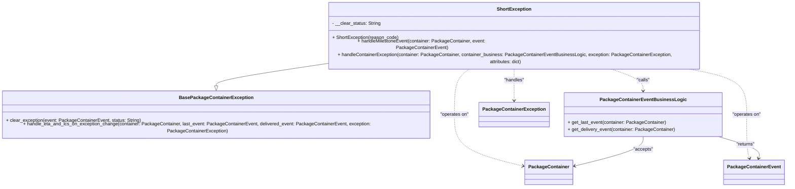

# Diagram: partview_core/partview_service/partview_service/core/business/package_container_exception_status/package_container_exceptions/PackageContainerShortException.py

> Auto-generated by Obscura crawlers

## Mermaid

### SVG

<svg id="container" width="2722.4140625" xmlns="http://www.w3.org/2000/svg" class="classDiagram" height="590" viewBox="0 0 2722.4140625 590" role="graphics-document document" aria-roledescription="class"><g><defs><marker id="container_class-aggregationStart" class="marker aggregation class" refX="18" refY="7" markerWidth="190" markerHeight="240" orient="auto"><path d="M 18,7 L9,13 L1,7 L9,1 Z"></path></marker></defs><defs><marker id="container_class-aggregationEnd" class="marker aggregation class" refX="1" refY="7" markerWidth="20" markerHeight="28" orient="auto"><path d="M 18,7 L9,13 L1,7 L9,1 Z"></path></marker></defs><defs><marker id="container_class-extensionStart" class="marker extension class" refX="18" refY="7" markerWidth="190" markerHeight="240" orient="auto"><path d="M 1,7 L18,13 V 1 Z"></path></marker></defs><defs><marker id="container_class-extensionEnd" class="marker extension class" refX="1" refY="7" markerWidth="20" markerHeight="28" orient="auto"><path d="M 1,1 V 13 L18,7 Z"></path></marker></defs><defs><marker id="container_class-compositionStart" class="marker composition class" refX="18" refY="7" markerWidth="190" markerHeight="240" orient="auto"><path d="M 18,7 L9,13 L1,7 L9,1 Z"></path></marker></defs><defs><marker id="container_class-compositionEnd" class="marker composition class" refX="1" refY="7" markerWidth="20" markerHeight="28" orient="auto"><path d="M 18,7 L9,13 L1,7 L9,1 Z"></path></marker></defs><defs><marker id="container_class-dependencyStart" class="marker dependency class" refX="6" refY="7" markerWidth="190" markerHeight="240" orient="auto"><path d="M 5,7 L9,13 L1,7 L9,1 Z"></path></marker></defs><defs><marker id="container_class-dependencyEnd" class="marker dependency class" refX="13" refY="7" markerWidth="20" markerHeight="28" orient="auto"><path d="M 18,7 L9,13 L14,7 L9,1 Z"></path></marker></defs><defs><marker id="container_class-lollipopStart" class="marker lollipop class" refX="13" refY="7" markerWidth="190" markerHeight="240" orient="auto"><circle stroke="black" fill="transparent" cx="7" cy="7" r="6"></circle></marker></defs><defs><marker id="container_class-lollipopEnd" class="marker lollipop class" refX="1" refY="7" markerWidth="190" markerHeight="240" orient="auto"><circle stroke="black" fill="transparent" cx="7" cy="7" r="6"></circle></marker></defs><g class="root"><g class="clusters"></g><g class="edgePaths"><path d="M1153.602,188.357L1089.876,196.464C1026.151,204.571,898.701,220.786,834.975,232.185C771.25,243.583,771.25,250.167,771.25,253.458L771.25,256.75" id="id_ShortException_BasePackageContainerException_1" class="edge-thickness-normal edge-pattern-solid relation" style=";;;" data-edge="true" data-et="edge" data-id="id_ShortException_BasePackageContainerException_1" data-points="W3sieCI6MTE1My42MDE1NjI1LCJ5IjoxODguMzU3MDc1MDY2MzIyOTJ9LHsieCI6NzcxLjI1LCJ5IjoyMzd9LHsieCI6NzcxLjI1LCJ5IjoyNzR9XQ==" marker-end="url(#container_class-extensionEnd)"></path><path d="M1674.005,200L1664.84,206.167C1655.675,212.333,1637.345,224.667,1628.181,249.5C1619.016,274.333,1619.016,311.667,1619.016,349C1619.016,386.333,1619.016,423.667,1657.128,451.985C1695.24,480.304,1771.465,499.608,1809.577,509.26L1847.689,518.912" id="id_ShortException_PackageContainer_2" class="edge-thickness-normal edge-pattern-dashed relation" style=";;;" data-edge="true" data-et="edge" data-id="id_ShortException_PackageContainer_2" data-points="W3sieCI6MTY3NC4wMDQ4NzU0Njk5MjQ5LCJ5IjoyMDB9LHsieCI6MTYxOS4wMTU2MjUsInkiOjIzN30seyJ4IjoxNjE5LjAxNTYyNSwieSI6MzQ5fSx7IngiOjE2MTkuMDE1NjI1LCJ5Ijo0NjF9LHsieCI6MTg1My41MDU4NTkzNzUsInkiOjUyMC4zODQ5MTA2MjIwNDU1fV0=" marker-end="url(#container_class-dependencyEnd)"></path><path d="M2375.221,200L2411.1,206.167C2446.978,212.333,2518.735,224.667,2554.614,249.5C2590.492,274.333,2590.492,311.667,2590.492,349C2590.492,386.333,2590.492,423.667,2592.227,447.551C2593.962,471.435,2597.431,481.871,2599.166,487.089L2600.901,492.306" id="id_ShortException_PackageContainerEvent_3" class="edge-thickness-normal edge-pattern-dashed relation" style=";;;" data-edge="true" data-et="edge" data-id="id_ShortException_PackageContainerEvent_3" data-points="W3sieCI6MjM3NS4yMjEwNDA4ODM0NTg1LCJ5IjoyMDB9LHsieCI6MjU5MC40OTIxODc1LCJ5IjoyMzd9LHsieCI6MjU5MC40OTIxODc1LCJ5IjozNDl9LHsieCI6MjU5MC40OTIxODc1LCJ5Ijo0NjF9LHsieCI6MjYwMi43OTM4MDkzMzU0NDMzLCJ5Ijo0OTh9XQ==" marker-end="url(#container_class-dependencyEnd)"></path><path d="M2124.329,200L2144.091,206.167C2163.854,212.333,2203.378,224.667,2223.14,236C2242.902,247.333,2242.902,257.667,2242.902,262.833L2242.902,268" id="id_ShortException_PackageContainerEventBusinessLogic_4" class="edge-thickness-normal edge-pattern-dashed relation" style=";;;" data-edge="true" data-et="edge" data-id="id_ShortException_PackageContainerEventBusinessLogic_4" data-points="W3sieCI6MjEyNC4zMjkxMjM1OTAyMjU3LCJ5IjoyMDB9LHsieCI6MjI0Mi45MDIzNDM3NSwieSI6MjM3fSx7IngiOjIyNDIuOTAyMzQzNzUsInkiOjI3NH1d" marker-end="url(#container_class-dependencyEnd)"></path><path d="M1816.68,200L1816.68,206.167C1816.68,212.333,1816.68,224.667,1816.68,241.5C1816.68,258.333,1816.68,279.667,1816.68,290.333L1816.68,301" id="id_ShortException_PackageContainerException_5" class="edge-thickness-normal edge-pattern-dashed relation" style=";;;" data-edge="true" data-et="edge" data-id="id_ShortException_PackageContainerException_5" data-points="W3sieCI6MTgxNi42Nzk2ODc1LCJ5IjoyMDB9LHsieCI6MTgxNi42Nzk2ODc1LCJ5IjoyMzd9LHsieCI6MTgxNi42Nzk2ODc1LCJ5IjozMDd9XQ==" marker-end="url(#container_class-dependencyEnd)"></path><path d="M2505.977,422.638L2528.818,429.032C2551.659,435.426,2597.341,448.213,2618.448,459.824C2639.554,471.435,2636.084,481.871,2634.35,487.089L2632.615,492.306" id="id_PackageContainerEventBusinessLogic_PackageContainerEvent_6" class="edge-thickness-normal edge-pattern-solid relation" style=";;;" data-edge="true" data-et="edge" data-id="id_PackageContainerEventBusinessLogic_PackageContainerEvent_6" data-points="W3sieCI6MjUwNS45NzY1NjI1LCJ5Ijo0MjIuNjM4NDg4MzQ4MjUzOTN9LHsieCI6MjY0My4wMjM0Mzc1LCJ5Ijo0NjF9LHsieCI6MjYzMC43MjE4MTU2NjQ1NTY3LCJ5Ijo0OTh9XQ==" marker-end="url(#container_class-dependencyEnd)"></path><path d="M2242.902,424L2242.902,430.167C2242.902,436.333,2242.902,448.667,2204.79,464.485C2166.678,480.304,2090.453,499.608,2052.341,509.26L2014.228,518.912" id="id_PackageContainerEventBusinessLogic_PackageContainer_7" class="edge-thickness-normal edge-pattern-solid relation" style=";;;" data-edge="true" data-et="edge" data-id="id_PackageContainerEventBusinessLogic_PackageContainer_7" data-points="W3sieCI6MjI0Mi45MDIzNDM3NSwieSI6NDI0fSx7IngiOjIyNDIuOTAyMzQzNzUsInkiOjQ2MX0seyJ4IjoyMDA4LjQxMjEwOTM3NSwieSI6NTIwLjM4NDkxMDYyMjA0NTV9XQ==" marker-end="url(#container_class-dependencyEnd)"></path></g><g class="edgeLabels"><g class="edgeLabel"><g class="label" data-id="id_ShortException_BasePackageContainerException_1" transform="translate(0, 0)"><foreignObject width="0" height="0">

</foreignObject></g></g><g class="edgeLabel" transform="translate(1619.015625, 349)"><g class="label" data-id="id_ShortException_PackageContainer_2" transform="translate(-49.515625, -12)"><foreignObject width="99.03125" height="24">

"operates on"

</foreignObject></g></g><g class="edgeLabel" transform="translate(2590.4921875, 349)"><g class="label" data-id="id_ShortException_PackageContainerEvent_3" transform="translate(-49.515625, -12)"><foreignObject width="99.03125" height="24">

"operates on"

</foreignObject></g></g><g class="edgeLabel" transform="translate(2242.90234375, 237)"><g class="label" data-id="id_ShortException_PackageContainerEventBusinessLogic_4" transform="translate(-22.625, -12)"><foreignObject width="45.25" height="24">

"calls"

</foreignObject></g></g><g class="edgeLabel" transform="translate(1816.6796875, 237)"><g class="label" data-id="id_ShortException_PackageContainerException_5" transform="translate(-35.1796875, -12)"><foreignObject width="70.359375" height="24">

"handles"

</foreignObject></g></g><g class="edgeLabel" transform="translate(2593.27407, 447.07439)"><g class="label" data-id="id_PackageContainerEventBusinessLogic_PackageContainerEvent_6" transform="translate(-32.53125, -12)"><foreignObject width="65.0625" height="24">

"returns"

</foreignObject></g></g><g class="edgeLabel" transform="translate(2242.90234375, 461)"><g class="label" data-id="id_PackageContainerEventBusinessLogic_PackageContainer_7" transform="translate(-33.5625, -12)"><foreignObject width="67.125" height="24">

"accepts"

</foreignObject></g></g></g><g class="nodes"><g class="node default" id="classId-ShortException-0" transform="translate(1816.6796875, 104)"><g class="basic label-container"><path d="M-663.078125 -96 L663.078125 -96 L663.078125 96 L-663.078125 96" stroke="none" stroke-width="0" fill="#ECECFF" style=""></path><path d="M-663.078125 -96 C-162.06469891732672 -96, 338.94872716534655 -96, 663.078125 -96 M-663.078125 -96 C-156.0284847649034 -96, 351.0211554701932 -96, 663.078125 -96 M663.078125 -96 C663.078125 -27.10472515064302, 663.078125 41.79054969871396, 663.078125 96 M663.078125 -96 C663.078125 -51.62185851259207, 663.078125 -7.243717025184139, 663.078125 96 M663.078125 96 C360.2677274221643 96, 57.45732984432857 96, -663.078125 96 M663.078125 96 C380.8145630932469 96, 98.55100118649375 96, -663.078125 96 M-663.078125 96 C-663.078125 38.212736160288785, -663.078125 -19.57452767942243, -663.078125 -96 M-663.078125 96 C-663.078125 32.764763367153165, -663.078125 -30.47047326569367, -663.078125 -96" stroke="#9370DB" stroke-width="1.3" fill="none" stroke-dasharray="0 0" style=""></path></g><g class="annotation-group text" transform="translate(0, -72)"></g><g class="label-group text" transform="translate(-55.859375, -72)"><g class="label" style="font-weight: bolder" transform="translate(0,-12)"><foreignObject width="111.71875" height="24">

ShortException

</foreignObject></g></g><g class="members-group text" transform="translate(-651.078125, -24)"><g class="label" style="" transform="translate(0,-12)"><foreignObject width="164.953125" height="24">

- __clear_status: String

</foreignObject></g></g><g class="methods-group text" transform="translate(-651.078125, 24)"><g class="label" style="" transform="translate(0,-12)"><foreignObject width="224.6875" height="24">

+ ShortException(reason_code)

</foreignObject></g><g class="label" style="" transform="translate(0,12)"><foreignObject width="613.375" height="24">

+ handleMilestoneEvent(container: PackageContainer, event: PackageContainerEvent)

</foreignObject></g><g class="label" style="" transform="translate(0,36)"><foreignObject width="1246.296875" height="24">

+ handleContainerException(container: PackageContainer, container_business: PackageContainerEventBusinessLogic, exception: PackageContainerException, attributes: dict)

</foreignObject></g></g><g class="divider" style=""><path d="M-663.078125 -48 C-180.3733533321501 -48, 302.3314183356998 -48, 663.078125 -48 M-663.078125 -48 C-391.76000385380974 -48, -120.44188270761947 -48, 663.078125 -48" stroke="#9370DB" stroke-width="1.3" fill="none" stroke-dasharray="0 0" style=""></path></g><g class="divider" style=""><path d="M-663.078125 0 C-314.7294353997969 0, 33.6192542004062 0, 663.078125 0 M-663.078125 0 C-362.7736035578361 0, -62.46908211567222 0, 663.078125 0" stroke="#9370DB" stroke-width="1.3" fill="none" stroke-dasharray="0 0" style=""></path></g></g><g class="node default" id="classId-BasePackageContainerException-1" transform="translate(771.25, 349)"><g class="basic label-container"><path d="M-763.25 -75 L763.25 -75 L763.25 75 L-763.25 75" stroke="none" stroke-width="0" fill="#ECECFF" style=""></path><path d="M-763.25 -75 C-456.83849162000377 -75, -150.42698324000753 -75, 763.25 -75 M-763.25 -75 C-154.98098242248386 -75, 453.2880351550323 -75, 763.25 -75 M763.25 -75 C763.25 -32.584477699818365, 763.25 9.83104460036327, 763.25 75 M763.25 -75 C763.25 -36.33320243425775, 763.25 2.3335951314845005, 763.25 75 M763.25 75 C248.1626822690472 75, -266.9246354619056 75, -763.25 75 M763.25 75 C282.0402349143841 75, -199.16953017123183 75, -763.25 75 M-763.25 75 C-763.25 31.422552503384352, -763.25 -12.154894993231295, -763.25 -75 M-763.25 75 C-763.25 30.67055184372915, -763.25 -13.6588963125417, -763.25 -75" stroke="#9370DB" stroke-width="1.3" fill="none" stroke-dasharray="0 0" style=""></path></g><g class="annotation-group text" transform="translate(0, -51)"></g><g class="label-group text" transform="translate(-118.671875, -51)"><g class="label" style="font-weight: bolder" transform="translate(0,-12)"><foreignObject width="237.34375" height="24">

BasePackageContainerException

</foreignObject></g></g><g class="members-group text" transform="translate(-751.25, -3)"></g><g class="methods-group text" transform="translate(-751.25, 27)"><g class="label" style="" transform="translate(0,-12)"><foreignObject width="456.234375" height="24">

+ clear_exception(event: PackageContainerEvent, status: String)

</foreignObject></g><g class="label" style="" transform="translate(0,12)"><foreignObject width="1383.828125" height="24">

+ handle_eta_and_lcs_on_exception_change(container: PackageContainer, last_event: PackageContainerEvent, delivered_event: PackageContainerEvent, exception: PackageContainerException)

</foreignObject></g></g><g class="divider" style=""><path d="M-763.25 -27 C-420.8542743805154 -27, -78.45854876103078 -27, 763.25 -27 M-763.25 -27 C-322.07483962231424 -27, 119.10032075537151 -27, 763.25 -27" stroke="#9370DB" stroke-width="1.3" fill="none" stroke-dasharray="0 0" style=""></path></g><g class="divider" style=""><path d="M-763.25 -3 C-358.06930262356155 -3, 47.11139475287689 -3, 763.25 -3 M-763.25 -3 C-360.087060050556 -3, 43.07587989888805 -3, 763.25 -3" stroke="#9370DB" stroke-width="1.3" fill="none" stroke-dasharray="0 0" style=""></path></g></g><g class="node default" id="classId-PackageContainer-2" transform="translate(1930.958984375, 540)"><g class="basic label-container"><path d="M-77.453125 -42 L77.453125 -42 L77.453125 42 L-77.453125 42" stroke="none" stroke-width="0" fill="#ECECFF" style=""></path><path d="M-77.453125 -42 C-29.953811167032512 -42, 17.545502665934976 -42, 77.453125 -42 M-77.453125 -42 C-20.025050894312272 -42, 37.403023211375455 -42, 77.453125 -42 M77.453125 -42 C77.453125 -22.396532267404144, 77.453125 -2.7930645348082876, 77.453125 42 M77.453125 -42 C77.453125 -14.45010375520647, 77.453125 13.09979248958706, 77.453125 42 M77.453125 42 C36.19353412358335 42, -5.066056752833305 42, -77.453125 42 M77.453125 42 C30.53396391261505 42, -16.3851971747699 42, -77.453125 42 M-77.453125 42 C-77.453125 19.4500599874309, -77.453125 -3.099880025138198, -77.453125 -42 M-77.453125 42 C-77.453125 23.336724773945896, -77.453125 4.673449547891792, -77.453125 -42" stroke="#9370DB" stroke-width="1.3" fill="none" stroke-dasharray="0 0" style=""></path></g><g class="annotation-group text" transform="translate(0, -18)"></g><g class="label-group text" transform="translate(-65.453125, -18)"><g class="label" style="font-weight: bolder" transform="translate(0,-12)"><foreignObject width="130.90625" height="24">

PackageContainer

</foreignObject></g></g><g class="members-group text" transform="translate(-65.453125, 30)"></g><g class="methods-group text" transform="translate(-65.453125, 60)"></g><g class="divider" style=""><path d="M-77.453125 6 C-26.76597167762511 6, 23.92118164474978 6, 77.453125 6 M-77.453125 6 C-25.54084338686838 6, 26.371438226263237 6, 77.453125 6" stroke="#9370DB" stroke-width="1.3" fill="none" stroke-dasharray="0 0" style=""></path></g><g class="divider" style=""><path d="M-77.453125 24 C-30.07110794528341 24, 17.310909109433183 24, 77.453125 24 M-77.453125 24 C-23.852175150479013 24, 29.748774699041974 24, 77.453125 24" stroke="#9370DB" stroke-width="1.3" fill="none" stroke-dasharray="0 0" style=""></path></g></g><g class="node default" id="classId-PackageContainerEvent-3" transform="translate(2616.7578125, 540)"><g class="basic label-container"><path d="M-97.65625 -42 L97.65625 -42 L97.65625 42 L-97.65625 42" stroke="none" stroke-width="0" fill="#ECECFF" style=""></path><path d="M-97.65625 -42 C-36.946576657243526 -42, 23.76309668551295 -42, 97.65625 -42 M-97.65625 -42 C-29.163127282080225 -42, 39.32999543583955 -42, 97.65625 -42 M97.65625 -42 C97.65625 -10.782845975828838, 97.65625 20.434308048342324, 97.65625 42 M97.65625 -42 C97.65625 -22.767868678499564, 97.65625 -3.535737356999128, 97.65625 42 M97.65625 42 C20.024733710084064 42, -57.60678257983187 42, -97.65625 42 M97.65625 42 C55.67877325190167 42, 13.701296503803334 42, -97.65625 42 M-97.65625 42 C-97.65625 10.30369281522151, -97.65625 -21.39261436955698, -97.65625 -42 M-97.65625 42 C-97.65625 11.504670635398572, -97.65625 -18.990658729202856, -97.65625 -42" stroke="#9370DB" stroke-width="1.3" fill="none" stroke-dasharray="0 0" style=""></path></g><g class="annotation-group text" transform="translate(0, -18)"></g><g class="label-group text" transform="translate(-85.65625, -18)"><g class="label" style="font-weight: bolder" transform="translate(0,-12)"><foreignObject width="171.3125" height="24">

PackageContainerEvent

</foreignObject></g></g><g class="members-group text" transform="translate(-85.65625, 30)"></g><g class="methods-group text" transform="translate(-85.65625, 60)"></g><g class="divider" style=""><path d="M-97.65625 6 C-25.300789117827605 6, 47.05467176434479 6, 97.65625 6 M-97.65625 6 C-33.3166082677712 6, 31.023033464457598 6, 97.65625 6" stroke="#9370DB" stroke-width="1.3" fill="none" stroke-dasharray="0 0" style=""></path></g><g class="divider" style=""><path d="M-97.65625 24 C-49.880403722666166 24, -2.1045574453323326 24, 97.65625 24 M-97.65625 24 C-20.14992844956987 24, 57.35639310086026 24, 97.65625 24" stroke="#9370DB" stroke-width="1.3" fill="none" stroke-dasharray="0 0" style=""></path></g></g><g class="node default" id="classId-PackageContainerEventBusinessLogic-4" transform="translate(2242.90234375, 349)"><g class="basic label-container"><path d="M-263.07421875 -75 L263.07421875 -75 L263.07421875 75 L-263.07421875 75" stroke="none" stroke-width="0" fill="#ECECFF" style=""></path><path d="M-263.07421875 -75 C-85.11844583234983 -75, 92.83732708530033 -75, 263.07421875 -75 M-263.07421875 -75 C-157.60799000280045 -75, -52.1417612556009 -75, 263.07421875 -75 M263.07421875 -75 C263.07421875 -35.681816961347394, 263.07421875 3.6363660773052118, 263.07421875 75 M263.07421875 -75 C263.07421875 -23.66718324196649, 263.07421875 27.665633516067018, 263.07421875 75 M263.07421875 75 C132.46383398263725 75, 1.8534492152745088 75, -263.07421875 75 M263.07421875 75 C107.25846129914376 75, -48.55729615171248 75, -263.07421875 75 M-263.07421875 75 C-263.07421875 29.5852752228446, -263.07421875 -15.829449554310798, -263.07421875 -75 M-263.07421875 75 C-263.07421875 39.12688473923375, -263.07421875 3.253769478467504, -263.07421875 -75" stroke="#9370DB" stroke-width="1.3" fill="none" stroke-dasharray="0 0" style=""></path></g><g class="annotation-group text" transform="translate(0, -51)"></g><g class="label-group text" transform="translate(-137.0703125, -51)"><g class="label" style="font-weight: bolder" transform="translate(0,-12)"><foreignObject width="274.140625" height="24">

PackageContainerEventBusinessLogic

</foreignObject></g></g><g class="members-group text" transform="translate(-251.07421875, -3)"></g><g class="methods-group text" transform="translate(-251.07421875, 27)"><g class="label" style="" transform="translate(0,-12)"><foreignObject width="334.0625" height="24">

+ get_last_event(container: PackageContainer)

</foreignObject></g><g class="label" style="" transform="translate(0,12)"><foreignObject width="365.078125" height="24">

+ get_delivery_event(container: PackageContainer)

</foreignObject></g></g><g class="divider" style=""><path d="M-263.07421875 -27 C-106.85839857382908 -27, 49.357421602341844 -27, 263.07421875 -27 M-263.07421875 -27 C-127.53781944264341 -27, 7.998579864713179 -27, 263.07421875 -27" stroke="#9370DB" stroke-width="1.3" fill="none" stroke-dasharray="0 0" style=""></path></g><g class="divider" style=""><path d="M-263.07421875 -3 C-92.1329338935754 -3, 78.8083509628492 -3, 263.07421875 -3 M-263.07421875 -3 C-134.08611077863173 -3, -5.0980028072634695 -3, 263.07421875 -3" stroke="#9370DB" stroke-width="1.3" fill="none" stroke-dasharray="0 0" style=""></path></g></g><g class="node default" id="classId-PackageContainerException-5" transform="translate(1816.6796875, 349)"><g class="basic label-container"><path d="M-113.1484375 -42 L113.1484375 -42 L113.1484375 42 L-113.1484375 42" stroke="none" stroke-width="0" fill="#ECECFF" style=""></path><path d="M-113.1484375 -42 C-55.43517808980823 -42, 2.278081320383535 -42, 113.1484375 -42 M-113.1484375 -42 C-51.58883185357005 -42, 9.970773792859902 -42, 113.1484375 -42 M113.1484375 -42 C113.1484375 -23.15878004070613, 113.1484375 -4.31756008141226, 113.1484375 42 M113.1484375 -42 C113.1484375 -11.340122571096696, 113.1484375 19.319754857806608, 113.1484375 42 M113.1484375 42 C34.32851414490334 42, -44.491409210193325 42, -113.1484375 42 M113.1484375 42 C46.04575267447616 42, -21.056932151047675 42, -113.1484375 42 M-113.1484375 42 C-113.1484375 24.828170643942553, -113.1484375 7.656341287885105, -113.1484375 -42 M-113.1484375 42 C-113.1484375 11.054670598618323, -113.1484375 -19.890658802763355, -113.1484375 -42" stroke="#9370DB" stroke-width="1.3" fill="none" stroke-dasharray="0 0" style=""></path></g><g class="annotation-group text" transform="translate(0, -18)"></g><g class="label-group text" transform="translate(-101.1484375, -18)"><g class="label" style="font-weight: bolder" transform="translate(0,-12)"><foreignObject width="202.296875" height="24">

PackageContainerException

</foreignObject></g></g><g class="members-group text" transform="translate(-101.1484375, 30)"></g><g class="methods-group text" transform="translate(-101.1484375, 60)"></g><g class="divider" style=""><path d="M-113.1484375 6 C-51.726141975838935 6, 9.69615354832213 6, 113.1484375 6 M-113.1484375 6 C-51.35466963565982 6, 10.439098228680365 6, 113.1484375 6" stroke="#9370DB" stroke-width="1.3" fill="none" stroke-dasharray="0 0" style=""></path></g><g class="divider" style=""><path d="M-113.1484375 24 C-51.08870926481137 24, 10.971018970377258 24, 113.1484375 24 M-113.1484375 24 C-43.52911491604209 24, 26.09020766791582 24, 113.1484375 24" stroke="#9370DB" stroke-width="1.3" fill="none" stroke-dasharray="0 0" style=""></path></g></g></g></g></g></svg>
