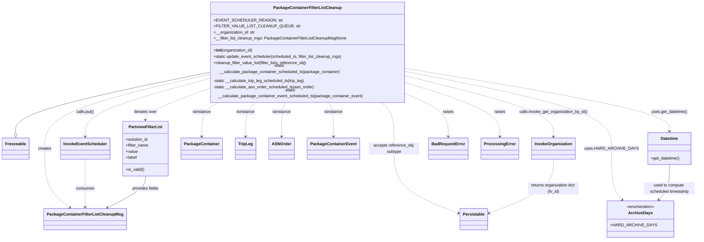

# Diagram: partview_core/partview_service/partview_service/core/business/package_container_filter_list/package_container_filter_list_cleanup.py

> Auto-generated by Obscura crawlers

## Mermaid

### SVG

<svg id="container" width="2647.73828125" xmlns="http://www.w3.org/2000/svg" class="classDiagram" height="908" viewBox="0 0 2647.73828125 908" role="graphics-document document" aria-roledescription="class"><g><defs><marker id="container_class-aggregationStart" class="marker aggregation class" refX="18" refY="7" markerWidth="190" markerHeight="240" orient="auto"><path d="M 18,7 L9,13 L1,7 L9,1 Z"></path></marker></defs><defs><marker id="container_class-aggregationEnd" class="marker aggregation class" refX="1" refY="7" markerWidth="20" markerHeight="28" orient="auto"><path d="M 18,7 L9,13 L1,7 L9,1 Z"></path></marker></defs><defs><marker id="container_class-extensionStart" class="marker extension class" refX="18" refY="7" markerWidth="190" markerHeight="240" orient="auto"><path d="M 1,7 L18,13 V 1 Z"></path></marker></defs><defs><marker id="container_class-extensionEnd" class="marker extension class" refX="1" refY="7" markerWidth="20" markerHeight="28" orient="auto"><path d="M 1,1 V 13 L18,7 Z"></path></marker></defs><defs><marker id="container_class-compositionStart" class="marker composition class" refX="18" refY="7" markerWidth="190" markerHeight="240" orient="auto"><path d="M 18,7 L9,13 L1,7 L9,1 Z"></path></marker></defs><defs><marker id="container_class-compositionEnd" class="marker composition class" refX="1" refY="7" markerWidth="20" markerHeight="28" orient="auto"><path d="M 18,7 L9,13 L1,7 L9,1 Z"></path></marker></defs><defs><marker id="container_class-dependencyStart" class="marker dependency class" refX="6" refY="7" markerWidth="190" markerHeight="240" orient="auto"><path d="M 5,7 L9,13 L1,7 L9,1 Z"></path></marker></defs><defs><marker id="container_class-dependencyEnd" class="marker dependency class" refX="13" refY="7" markerWidth="20" markerHeight="28" orient="auto"><path d="M 18,7 L9,13 L14,7 L9,1 Z"></path></marker></defs><defs><marker id="container_class-lollipopStart" class="marker lollipop class" refX="13" refY="7" markerWidth="190" markerHeight="240" orient="auto"><circle stroke="black" fill="transparent" cx="7" cy="7" r="6"></circle></marker></defs><defs><marker id="container_class-lollipopEnd" class="marker lollipop class" refX="1" refY="7" markerWidth="190" markerHeight="240" orient="auto"><circle stroke="black" fill="transparent" cx="7" cy="7" r="6"></circle></marker></defs><g class="root"><g class="clusters"></g><g class="edgePaths"><path d="M789.957,262.977L668.163,286.647C546.37,310.318,302.783,357.659,180.989,395.621C59.195,433.583,59.195,462.167,59.195,476.458L59.195,490.75" id="id_PackageContainerFilterListCleanup_Freezeable_1" class="edge-thickness-normal edge-pattern-solid relation" style=";;;" data-edge="true" data-et="edge" data-id="id_PackageContainerFilterListCleanup_Freezeable_1" data-points="W3sieCI6Nzg5Ljk1NzAzMTI1LCJ5IjoyNjIuOTc2NTQyNDEwODMxNH0seyJ4Ijo1OS4xOTUzMTI1LCJ5Ijo0MDV9LHsieCI6NTkuMTk1MzEyNSwieSI6NTA4fV0=" marker-end="url(#container_class-extensionEnd)"></path><path d="M789.957,271.366L686.891,293.639C583.826,315.911,377.694,360.455,274.628,406.894C171.563,453.333,171.563,501.667,171.563,552C171.563,602.333,171.563,654.667,187.589,693.383C203.615,732.1,235.668,757.2,251.694,769.751L267.721,782.301" id="id_PackageContainerFilterListCleanup_PackageContainerFilterListCleanupMsg_2" class="edge-thickness-normal edge-pattern-dashed relation" style=";;;" data-edge="true" data-et="edge" data-id="id_PackageContainerFilterListCleanup_PackageContainerFilterListCleanupMsg_2" data-points="W3sieCI6Nzg5Ljk1NzAzMTI1LCJ5IjoyNzEuMzY2NDExMzUyNTk0MDd9LHsieCI6MTcxLjU2MjUsInkiOjQwNX0seyJ4IjoxNzEuNTYyNSwieSI6NTUwfSx7IngiOjE3MS41NjI1LCJ5Ijo3MDd9LHsieCI6MjcyLjQ0NDYwMjI3MjcyNzI1LCJ5Ijo3ODZ9XQ==" marker-end="url(#container_class-dependencyEnd)"></path><path d="M789.957,286.527L712.644,306.273C635.331,326.018,480.704,365.509,403.391,401.421C326.078,437.333,326.078,469.667,326.078,485.833L326.078,502" id="id_PackageContainerFilterListCleanup_InvokeEventScheduler_3" class="edge-thickness-normal edge-pattern-dashed relation" style=";;;" data-edge="true" data-et="edge" data-id="id_PackageContainerFilterListCleanup_InvokeEventScheduler_3" data-points="W3sieCI6Nzg5Ljk1NzAzMTI1LCJ5IjoyODYuNTI3MDc2NTQyNTUxNDd9LHsieCI6MzI2LjA3ODEyNSwieSI6NDA1fSx7IngiOjMyNi4wNzgxMjUsInkiOjUwOH1d" marker-end="url(#container_class-dependencyEnd)"></path><path d="M1561.52,277.451L1653.201,298.709C1744.883,319.967,1928.246,362.484,2019.928,399.908C2111.609,437.333,2111.609,469.667,2111.609,485.833L2111.609,502" id="id_PackageContainerFilterListCleanup_InvokeOrganization_4" class="edge-thickness-normal edge-pattern-dashed relation" style=";;;" data-edge="true" data-et="edge" data-id="id_PackageContainerFilterListCleanup_InvokeOrganization_4" data-points="W3sieCI6MTU2MS41MTk1MzEyNSwieSI6Mjc3LjQ1MDkyMDk3NTE5NDQ0fSx7IngiOjIxMTEuNjA5Mzc1LCJ5Ijo0MDV9LHsieCI6MjExMS42MDkzNzUsInkiOjUwOH1d" marker-end="url(#container_class-dependencyEnd)"></path><path d="M789.957,323.631L751.383,337.193C712.81,350.754,635.663,377.877,597.089,396.605C558.516,415.333,558.516,425.667,558.516,430.833L558.516,436" id="id_PackageContainerFilterListCleanup_PartviewFilterList_5" class="edge-thickness-normal edge-pattern-dashed relation" style=";;;" data-edge="true" data-et="edge" data-id="id_PackageContainerFilterListCleanup_PartviewFilterList_5" data-points="W3sieCI6Nzg5Ljk1NzAzMTI1LCJ5IjozMjMuNjMxMDA4MzYwMjgzM30seyJ4Ijo1NTguNTE1NjI1LCJ5Ijo0MDV9LHsieCI6NTU4LjUxNTYyNSwieSI6NDQyfV0=" marker-end="url(#container_class-dependencyEnd)"></path><path d="M1449.675,368L1459.06,374.167C1468.445,380.333,1487.215,392.667,1496.6,423C1505.984,453.333,1505.984,501.667,1505.984,552C1505.984,602.333,1505.984,654.667,1546.695,697.101C1587.406,739.535,1668.827,772.07,1709.538,788.337L1750.249,804.605" id="id_PackageContainerFilterListCleanup_Persistable_6" class="edge-thickness-normal edge-pattern-dashed relation" style=";;;" data-edge="true" data-et="edge" data-id="id_PackageContainerFilterListCleanup_Persistable_6" data-points="W3sieCI6MTQ0OS42NzUxMzMyMDg1MjUzLCJ5IjozNjh9LHsieCI6MTUwNS45ODQzNzUsInkiOjQwNX0seyJ4IjoxNTA1Ljk4NDM3NSwieSI6NTUwfSx7IngiOjE1MDUuOTg0Mzc1LCJ5Ijo3MDd9LHsieCI6MTc1NS44MjAzMTI1LCJ5Ijo4MDYuODMxMjQzNTUwMDUxNn1d" marker-end="url(#container_class-dependencyEnd)"></path><path d="M843.38,368L831.994,374.167C820.608,380.333,797.835,392.667,786.449,415C775.063,437.333,775.063,469.667,775.063,485.833L775.063,502" id="id_PackageContainerFilterListCleanup_PackageContainer_7" class="edge-thickness-normal edge-pattern-dashed relation" style=";;;" data-edge="true" data-et="edge" data-id="id_PackageContainerFilterListCleanup_PackageContainer_7" data-points="W3sieCI6ODQzLjM4MDQ5MDM1MTM4MjUsInkiOjM2OH0seyJ4Ijo3NzUuMDYyNSwieSI6NDA1fSx7IngiOjc3NS4wNjI1LCJ5Ijo1MDh9XQ==" marker-end="url(#container_class-dependencyEnd)"></path><path d="M981.498,368L974.843,374.167C968.188,380.333,954.879,392.667,948.225,415C941.57,437.333,941.57,469.667,941.57,485.833L941.57,502" id="id_PackageContainerFilterListCleanup_TripLeg_8" class="edge-thickness-normal edge-pattern-dashed relation" style=";;;" data-edge="true" data-et="edge" data-id="id_PackageContainerFilterListCleanup_TripLeg_8" data-points="W3sieCI6OTgxLjQ5NzU2OTg0NDQ3LCJ5IjozNjh9LHsieCI6OTQxLjU3MDMxMjUsInkiOjQwNX0seyJ4Ijo5NDEuNTcwMzEyNSwieSI6NTA4fV0=" marker-end="url(#container_class-dependencyEnd)"></path><path d="M1094.788,368L1092.015,374.167C1089.242,380.333,1083.695,392.667,1080.922,415C1078.148,437.333,1078.148,469.667,1078.148,485.833L1078.148,502" id="id_PackageContainerFilterListCleanup_ASNOrder_9" class="edge-thickness-normal edge-pattern-dashed relation" style=";;;" data-edge="true" data-et="edge" data-id="id_PackageContainerFilterListCleanup_ASNOrder_9" data-points="W3sieCI6MTA5NC43ODgxODA0NDM1NDgzLCJ5IjozNjh9LHsieCI6MTA3OC4xNDg0Mzc1LCJ5Ijo0MDV9LHsieCI6MTA3OC4xNDg0Mzc1LCJ5Ijo1MDh9XQ==" marker-end="url(#container_class-dependencyEnd)"></path><path d="M1256.688,368L1259.462,374.167C1262.235,380.333,1267.782,392.667,1270.555,415C1273.328,437.333,1273.328,469.667,1273.328,485.833L1273.328,502" id="id_PackageContainerFilterListCleanup_PackageContainerEvent_10" class="edge-thickness-normal edge-pattern-dashed relation" style=";;;" data-edge="true" data-et="edge" data-id="id_PackageContainerFilterListCleanup_PackageContainerEvent_10" data-points="W3sieCI6MTI1Ni42ODgzODIwNTY0NTE3LCJ5IjozNjh9LHsieCI6MTI3My4zMjgxMjUsInkiOjQwNX0seyJ4IjoxMjczLjMyODEyNSwieSI6NTA4fV0=" marker-end="url(#container_class-dependencyEnd)"></path><path d="M1561.52,249.374L1724.556,275.312C1887.592,301.25,2213.665,353.125,2376.702,391.729C2539.738,430.333,2539.738,455.667,2539.738,468.333L2539.738,481" id="id_PackageContainerFilterListCleanup_Datetime_11" class="edge-thickness-normal edge-pattern-dashed relation" style=";;;" data-edge="true" data-et="edge" data-id="id_PackageContainerFilterListCleanup_Datetime_11" data-points="W3sieCI6MTU2MS41MTk1MzEyNSwieSI6MjQ5LjM3NDI4OTc3MjcyNzI4fSx7IngiOjI1MzkuNzM4MjgxMjUsInkiOjQwNX0seyJ4IjoyNTM5LjczODI4MTI1LCJ5Ijo0ODd9XQ==" marker-end="url(#container_class-dependencyEnd)"></path><path d="M1561.52,260.886L1688.65,284.905C1815.781,308.924,2070.043,356.962,2197.174,405.148C2324.305,453.333,2324.305,501.667,2324.305,552C2324.305,602.333,2324.305,654.667,2330.91,688.253C2337.515,721.84,2350.726,736.679,2357.331,744.099L2363.936,751.519" id="id_PackageContainerFilterListCleanup_ArchiveDays_12" class="edge-thickness-normal edge-pattern-dashed relation" style=";;;" data-edge="true" data-et="edge" data-id="id_PackageContainerFilterListCleanup_ArchiveDays_12" data-points="W3sieCI6MTU2MS41MTk1MzEyNSwieSI6MjYwLjg4NjEwNDYyMDkwOTl9LHsieCI6MjMyNC4zMDQ2ODc1LCJ5Ijo0MDV9LHsieCI6MjMyNC4zMDQ2ODc1LCJ5Ijo1NTB9LHsieCI6MjMyNC4zMDQ2ODc1LCJ5Ijo3MDd9LHsieCI6MjM2Ny45MjU1MzkxMjcwNjYzLCJ5Ijo3NTZ9XQ==" marker-end="url(#container_class-dependencyEnd)"></path><path d="M1561.52,343.163L1587.144,353.469C1612.768,363.775,1664.017,384.388,1689.641,410.86C1715.266,437.333,1715.266,469.667,1715.266,485.833L1715.266,502" id="id_PackageContainerFilterListCleanup_BadRequestError_13" class="edge-thickness-normal edge-pattern-dashed relation" style=";;;" data-edge="true" data-et="edge" data-id="id_PackageContainerFilterListCleanup_BadRequestError_13" data-points="W3sieCI6MTU2MS41MTk1MzEyNSwieSI6MzQzLjE2MjcyMjAwMDU5Mzd9LHsieCI6MTcxNS4yNjU2MjUsInkiOjQwNX0seyJ4IjoxNzE1LjI2NTYyNSwieSI6NTA4fV0=" marker-end="url(#container_class-dependencyEnd)"></path><path d="M1561.52,302.159L1619.442,319.299C1677.365,336.439,1793.21,370.72,1851.132,404.026C1909.055,437.333,1909.055,469.667,1909.055,485.833L1909.055,502" id="id_PackageContainerFilterListCleanup_ProcessingError_14" class="edge-thickness-normal edge-pattern-dashed relation" style=";;;" data-edge="true" data-et="edge" data-id="id_PackageContainerFilterListCleanup_ProcessingError_14" data-points="W3sieCI6MTU2MS41MTk1MzEyNSwieSI6MzAyLjE1ODgxNDAzNTEyNTF9LHsieCI6MTkwOS4wNTQ2ODc1LCJ5Ijo0MDV9LHsieCI6MTkwOS4wNTQ2ODc1LCJ5Ijo1MDh9XQ==" marker-end="url(#container_class-dependencyEnd)"></path><path d="M326.078,592L326.078,611.167C326.078,630.333,326.078,668.667,326.078,700C326.078,731.333,326.078,755.667,326.078,767.833L326.078,780" id="id_InvokeEventScheduler_PackageContainerFilterListCleanupMsg_15" class="edge-thickness-normal edge-pattern-dashed relation" style=";;;" data-edge="true" data-et="edge" data-id="id_InvokeEventScheduler_PackageContainerFilterListCleanupMsg_15" data-points="W3sieCI6MzI2LjA3ODEyNSwieSI6NTkyfSx7IngiOjMyNi4wNzgxMjUsInkiOjcwN30seyJ4IjozMjYuMDc4MTI1LCJ5Ijo3ODZ9XQ==" marker-end="url(#container_class-dependencyEnd)"></path><path d="M2111.609,592L2111.609,611.167C2111.609,630.333,2111.609,668.667,2070.899,704.101C2030.188,739.535,1948.767,772.07,1908.056,788.337L1867.345,804.605" id="id_InvokeOrganization_Persistable_16" class="edge-thickness-normal edge-pattern-dashed relation" style=";;;" data-edge="true" data-et="edge" data-id="id_InvokeOrganization_Persistable_16" data-points="W3sieCI6MjExMS42MDkzNzUsInkiOjU5Mn0seyJ4IjoyMTExLjYwOTM3NSwieSI6NzA3fSx7IngiOjE4NjEuNzczNDM3NSwieSI6ODA2LjgzMTI0MzU1MDA1MTZ9XQ==" marker-end="url(#container_class-dependencyEnd)"></path><path d="M558.516,658L558.516,666.167C558.516,674.333,558.516,690.667,534.11,711.538C509.704,732.41,460.893,757.82,436.487,770.525L412.081,783.229" id="id_PartviewFilterList_PackageContainerFilterListCleanupMsg_17" class="edge-thickness-normal edge-pattern-solid relation" style=";;;" data-edge="true" data-et="edge" data-id="id_PartviewFilterList_PackageContainerFilterListCleanupMsg_17" data-points="W3sieCI6NTU4LjUxNTYyNSwieSI6NjU4fSx7IngiOjU1OC41MTU2MjUsInkiOjcwN30seyJ4Ijo0MDYuNzU4OTEwMTIzOTY2OSwieSI6Nzg2fV0=" marker-end="url(#container_class-dependencyEnd)"></path><path d="M2539.738,613L2539.738,628.667C2539.738,644.333,2539.738,675.667,2533.133,698.753C2526.528,721.84,2513.317,736.679,2506.712,744.099L2500.107,751.519" id="id_Datetime_ArchiveDays_18" class="edge-thickness-normal edge-pattern-solid relation" style=";;;" data-edge="true" data-et="edge" data-id="id_Datetime_ArchiveDays_18" data-points="W3sieCI6MjUzOS43MzgyODEyNSwieSI6NjEzfSx7IngiOjI1MzkuNzM4MjgxMjUsInkiOjcwN30seyJ4IjoyNDk2LjExNzQyOTYyMjkzMzcsInkiOjc1Nn1d" marker-end="url(#container_class-dependencyEnd)"></path></g><g class="edgeLabels"><g class="edgeLabel"><g class="label" data-id="id_PackageContainerFilterListCleanup_Freezeable_1" transform="translate(0, 0)"><foreignObject width="0" height="0">

</foreignObject></g></g><g class="edgeLabel" transform="translate(171.5625, 550)"><g class="label" data-id="id_PackageContainerFilterListCleanup_PackageContainerFilterListCleanupMsg_2" transform="translate(-26.171875, -12)"><foreignObject width="52.34375" height="24">

creates

</foreignObject></g></g><g class="edgeLabel" transform="translate(326.078125, 405)"><g class="label" data-id="id_PackageContainerFilterListCleanup_InvokeEventScheduler_3" transform="translate(-35.84375, -12)"><foreignObject width="71.6875" height="24">

calls.put()

</foreignObject></g></g><g class="edgeLabel" transform="translate(2111.609375, 405)"><g class="label" data-id="id_PackageContainerFilterListCleanup_InvokeOrganization_4" transform="translate(-135.703125, -12)"><foreignObject width="271.40625" height="24">

calls.invoke_get_organization_by_id()

</foreignObject></g></g><g class="edgeLabel" transform="translate(558.515625, 405)"><g class="label" data-id="id_PackageContainerFilterListCleanup_PartviewFilterList_5" transform="translate(-45.5234375, -12)"><foreignObject width="91.046875" height="24">

iterates over

</foreignObject></g></g><g class="edgeLabel" transform="translate(1505.984375, 550)"><g class="label" data-id="id_PackageContainerFilterListCleanup_Persistable_6" transform="translate(-100, -24)"><foreignObject width="200" height="48">

accepts reference_obj subtype

</foreignObject></g></g><g class="edgeLabel" transform="translate(775.0625, 405)"><g class="label" data-id="id_PackageContainerFilterListCleanup_PackageContainer_7" transform="translate(-36.5703125, -12)"><foreignObject width="73.140625" height="24">

isinstance

</foreignObject></g></g><g class="edgeLabel" transform="translate(941.5703125, 405)"><g class="label" data-id="id_PackageContainerFilterListCleanup_TripLeg_8" transform="translate(-36.5703125, -12)"><foreignObject width="73.140625" height="24">

isinstance

</foreignObject></g></g><g class="edgeLabel" transform="translate(1078.1484375, 405)"><g class="label" data-id="id_PackageContainerFilterListCleanup_ASNOrder_9" transform="translate(-36.5703125, -12)"><foreignObject width="73.140625" height="24">

isinstance

</foreignObject></g></g><g class="edgeLabel" transform="translate(1273.328125, 405)"><g class="label" data-id="id_PackageContainerFilterListCleanup_PackageContainerEvent_10" transform="translate(-36.5703125, -12)"><foreignObject width="73.140625" height="24">

isinstance

</foreignObject></g></g><g class="edgeLabel" transform="translate(2539.73828125, 405)"><g class="label" data-id="id_PackageContainerFilterListCleanup_Datetime_11" transform="translate(-71.421875, -12)"><foreignObject width="142.84375" height="24">

uses.get_datetime()

</foreignObject></g></g><g class="edgeLabel" transform="translate(2324.3046875, 550)"><g class="label" data-id="id_PackageContainerFilterListCleanup_ArchiveDays_12" transform="translate(-94.6484375, -12)"><foreignObject width="189.296875" height="24">

uses.HARD_ARCHIVE_DAYS

</foreignObject></g></g><g class="edgeLabel" transform="translate(1715.265625, 405)"><g class="label" data-id="id_PackageContainerFilterListCleanup_BadRequestError_13" transform="translate(-21.25, -12)"><foreignObject width="42.5" height="24">

raises

</foreignObject></g></g><g class="edgeLabel" transform="translate(1909.0546875, 405)"><g class="label" data-id="id_PackageContainerFilterListCleanup_ProcessingError_14" transform="translate(-21.25, -12)"><foreignObject width="42.5" height="24">

raises

</foreignObject></g></g><g class="edgeLabel" transform="translate(326.078125, 707)"><g class="label" data-id="id_InvokeEventScheduler_PackageContainerFilterListCleanupMsg_15" transform="translate(-36.375, -12)"><foreignObject width="72.75" height="24">

consumes

</foreignObject></g></g><g class="edgeLabel" transform="translate(2111.609375, 707)"><g class="label" data-id="id_InvokeOrganization_Persistable_16" transform="translate(-100, -24)"><foreignObject width="200" height="48">

returns organization dict (fv_id)

</foreignObject></g></g><g class="edgeLabel" transform="translate(558.515625, 707)"><g class="label" data-id="id_PartviewFilterList_PackageContainerFilterListCleanupMsg_17" transform="translate(-53.21875, -12)"><foreignObject width="106.4375" height="24">

provides fields

</foreignObject></g></g><g class="edgeLabel" transform="translate(2539.73828125, 707)"><g class="label" data-id="id_Datetime_ArchiveDays_18" transform="translate(-100, -24)"><foreignObject width="200" height="48">

used to compute scheduled timestamp

</foreignObject></g></g></g><g class="nodes"><g class="node default" id="classId-PackageContainerFilterListCleanup-0" transform="translate(1175.73828125, 188)"><g class="basic label-container"><path d="M-385.78125 -180 L385.78125 -180 L385.78125 180 L-385.78125 180" stroke="none" stroke-width="0" fill="#ECECFF" style=""></path><path d="M-385.78125 -180 C-158.95750707611322 -180, 67.86623584777357 -180, 385.78125 -180 M-385.78125 -180 C-102.89761312087938 -180, 179.98602375824123 -180, 385.78125 -180 M385.78125 -180 C385.78125 -56.15144811662891, 385.78125 67.69710376674217, 385.78125 180 M385.78125 -180 C385.78125 -53.19553877992429, 385.78125 73.60892244015142, 385.78125 180 M385.78125 180 C230.6465241688039 180, 75.51179833760779 180, -385.78125 180 M385.78125 180 C85.58694265577424 180, -214.60736468845153 180, -385.78125 180 M-385.78125 180 C-385.78125 103.32561612597267, -385.78125 26.651232251945345, -385.78125 -180 M-385.78125 180 C-385.78125 56.44756065215532, -385.78125 -67.10487869568937, -385.78125 -180" stroke="#9370DB" stroke-width="1.3" fill="none" stroke-dasharray="0 0" style=""></path></g><g class="annotation-group text" transform="translate(0, -156)"></g><g class="label-group text" transform="translate(-127.171875, -156)"><g class="label" style="font-weight: bolder" transform="translate(0,-12)"><foreignObject width="254.34375" height="24">

PackageContainerFilterListCleanup

</foreignObject></g></g><g class="members-group text" transform="translate(-373.78125, -108)"><g class="label" style="" transform="translate(0,-12)"><foreignObject width="238.578125" height="24">

+EVENT_SCHEDULER_REASON: str

</foreignObject></g><g class="label" style="" transform="translate(0,12)"><foreignObject width="298.75" height="24">

+FILTER_VALUE_LIST_CLEANUP_QUEUE: str

</foreignObject></g><g class="label" style="" transform="translate(0,36)"><foreignObject width="163.125" height="24">

+__organization_id: str

</foreignObject></g><g class="label" style="" transform="translate(0,60)"><foreignObject width="520.84375" height="24">

+__filter_list_cleanup_mgs: PackageContainerFilterListCleanupMsg|None

</foreignObject></g></g><g class="methods-group text" transform="translate(-373.78125, 12)"><g class="label" style="" transform="translate(0,-12)"><foreignObject width="155.546875" height="24">

+<strong>init</strong>(organization_id)

</foreignObject></g><g class="label" style="" transform="translate(0,12)"><foreignObject width="512.734375" height="24">

+static update_event_scheduler(scheduled_ts, filter_list_cleanup_mgs)

</foreignObject></g><g class="label" style="" transform="translate(0,36)"><foreignObject width="372.1875" height="24">

+cleanup_filter_value_list(filter_lists, reference_obj)

</foreignObject></g><g class="label" style="" transform="translate(0,60)"><foreignObject width="525" height="24">

-static __calculate_package_container_scheduled_ts(package_container)

</foreignObject></g><g class="label" style="" transform="translate(0,84)"><foreignObject width="365.21875" height="24">

-static __calculate_trip_leg_scheduled_ts(trip_leg)

</foreignObject></g><g class="label" style="" transform="translate(0,108)"><foreignObject width="398.765625" height="24">

-static __calculate_asn_order_scheduled_ts(asn_order)

</foreignObject></g><g class="label" style="" transform="translate(0,132)"><foreignObject width="620.390625" height="24">

-static __calculate_package_container_event_scheduled_ts(package_container_event)

</foreignObject></g></g><g class="divider" style=""><path d="M-385.78125 -132 C-207.5387019939229 -132, -29.2961539878458 -132, 385.78125 -132 M-385.78125 -132 C-121.85397298633768 -132, 142.07330402732464 -132, 385.78125 -132" stroke="#9370DB" stroke-width="1.3" fill="none" stroke-dasharray="0 0" style=""></path></g><g class="divider" style=""><path d="M-385.78125 -12 C-161.80828096073535 -12, 62.16468807852931 -12, 385.78125 -12 M-385.78125 -12 C-198.80501328348342 -12, -11.828776566966837 -12, 385.78125 -12" stroke="#9370DB" stroke-width="1.3" fill="none" stroke-dasharray="0 0" style=""></path></g></g><g class="node default" id="classId-Freezeable-1" transform="translate(59.1953125, 550)"><g class="basic label-container"><path d="M-51.1953125 -42 L51.1953125 -42 L51.1953125 42 L-51.1953125 42" stroke="none" stroke-width="0" fill="#ECECFF" style=""></path><path d="M-51.1953125 -42 C-15.188393655137325 -42, 20.81852518972535 -42, 51.1953125 -42 M-51.1953125 -42 C-14.990604393135634 -42, 21.214103713728733 -42, 51.1953125 -42 M51.1953125 -42 C51.1953125 -23.565177376666895, 51.1953125 -5.1303547533337905, 51.1953125 42 M51.1953125 -42 C51.1953125 -24.709558993328656, 51.1953125 -7.419117986657312, 51.1953125 42 M51.1953125 42 C14.250493267150482 42, -22.694325965699036 42, -51.1953125 42 M51.1953125 42 C10.88399476937876 42, -29.42732296124248 42, -51.1953125 42 M-51.1953125 42 C-51.1953125 13.103090719291163, -51.1953125 -15.793818561417673, -51.1953125 -42 M-51.1953125 42 C-51.1953125 21.70504398757649, -51.1953125 1.4100879751529831, -51.1953125 -42" stroke="#9370DB" stroke-width="1.3" fill="none" stroke-dasharray="0 0" style=""></path></g><g class="annotation-group text" transform="translate(0, -18)"></g><g class="label-group text" transform="translate(-39.1953125, -18)"><g class="label" style="font-weight: bolder" transform="translate(0,-12)"><foreignObject width="78.390625" height="24">

Freezeable

</foreignObject></g></g><g class="members-group text" transform="translate(-39.1953125, 30)"></g><g class="methods-group text" transform="translate(-39.1953125, 60)"></g><g class="divider" style=""><path d="M-51.1953125 6 C-28.361536481395344 6, -5.527760462790688 6, 51.1953125 6 M-51.1953125 6 C-22.474257073958714 6, 6.246798352082571 6, 51.1953125 6" stroke="#9370DB" stroke-width="1.3" fill="none" stroke-dasharray="0 0" style=""></path></g><g class="divider" style=""><path d="M-51.1953125 24 C-30.089899752213466 24, -8.984487004426931 24, 51.1953125 24 M-51.1953125 24 C-28.5905231213081 24, -5.985733742616198 24, 51.1953125 24" stroke="#9370DB" stroke-width="1.3" fill="none" stroke-dasharray="0 0" style=""></path></g></g><g class="node default" id="classId-PackageContainerFilterListCleanupMsg-2" transform="translate(326.078125, 828)"><g class="basic label-container"><path d="M-153.734375 -42 L153.734375 -42 L153.734375 42 L-153.734375 42" stroke="none" stroke-width="0" fill="#ECECFF" style=""></path><path d="M-153.734375 -42 C-33.23547026871968 -42, 87.26343446256064 -42, 153.734375 -42 M-153.734375 -42 C-60.15267223110064 -42, 33.429030537798724 -42, 153.734375 -42 M153.734375 -42 C153.734375 -15.684427045745615, 153.734375 10.63114590850877, 153.734375 42 M153.734375 -42 C153.734375 -14.52469034235078, 153.734375 12.95061931529844, 153.734375 42 M153.734375 42 C90.59432751954486 42, 27.45428003908971 42, -153.734375 42 M153.734375 42 C82.76519001060461 42, 11.796005021209226 42, -153.734375 42 M-153.734375 42 C-153.734375 10.83802904601972, -153.734375 -20.32394190796056, -153.734375 -42 M-153.734375 42 C-153.734375 10.569607890967323, -153.734375 -20.860784218065355, -153.734375 -42" stroke="#9370DB" stroke-width="1.3" fill="none" stroke-dasharray="0 0" style=""></path></g><g class="annotation-group text" transform="translate(0, -18)"></g><g class="label-group text" transform="translate(-141.734375, -18)"><g class="label" style="font-weight: bolder" transform="translate(0,-12)"><foreignObject width="283.46875" height="24">

PackageContainerFilterListCleanupMsg

</foreignObject></g></g><g class="members-group text" transform="translate(-141.734375, 30)"></g><g class="methods-group text" transform="translate(-141.734375, 60)"></g><g class="divider" style=""><path d="M-153.734375 6 C-46.25050309703347 6, 61.233368805933054 6, 153.734375 6 M-153.734375 6 C-58.30211039378588 6, 37.13015421242824 6, 153.734375 6" stroke="#9370DB" stroke-width="1.3" fill="none" stroke-dasharray="0 0" style=""></path></g><g class="divider" style=""><path d="M-153.734375 24 C-78.4504139763275 24, -3.1664529526549927 24, 153.734375 24 M-153.734375 24 C-47.243508161072214 24, 59.24735867785557 24, 153.734375 24" stroke="#9370DB" stroke-width="1.3" fill="none" stroke-dasharray="0 0" style=""></path></g></g><g class="node default" id="classId-InvokeEventScheduler-3" transform="translate(326.078125, 550)"><g class="basic label-container"><path d="M-93.34375 -42 L93.34375 -42 L93.34375 42 L-93.34375 42" stroke="none" stroke-width="0" fill="#ECECFF" style=""></path><path d="M-93.34375 -42 C-51.26713041041034 -42, -9.190510820820677 -42, 93.34375 -42 M-93.34375 -42 C-23.153863403943276 -42, 47.03602319211345 -42, 93.34375 -42 M93.34375 -42 C93.34375 -9.743344295088598, 93.34375 22.513311409822805, 93.34375 42 M93.34375 -42 C93.34375 -15.240912637993567, 93.34375 11.518174724012866, 93.34375 42 M93.34375 42 C26.491328943241484 42, -40.36109211351703 42, -93.34375 42 M93.34375 42 C51.24078864810907 42, 9.137827296218134 42, -93.34375 42 M-93.34375 42 C-93.34375 24.87860250566119, -93.34375 7.757205011322377, -93.34375 -42 M-93.34375 42 C-93.34375 20.026754136918058, -93.34375 -1.9464917261638846, -93.34375 -42" stroke="#9370DB" stroke-width="1.3" fill="none" stroke-dasharray="0 0" style=""></path></g><g class="annotation-group text" transform="translate(0, -18)"></g><g class="label-group text" transform="translate(-81.34375, -18)"><g class="label" style="font-weight: bolder" transform="translate(0,-12)"><foreignObject width="162.6875" height="24">

InvokeEventScheduler

</foreignObject></g></g><g class="members-group text" transform="translate(-81.34375, 30)"></g><g class="methods-group text" transform="translate(-81.34375, 60)"></g><g class="divider" style=""><path d="M-93.34375 6 C-24.47603786223624 6, 44.39167427552752 6, 93.34375 6 M-93.34375 6 C-28.28811318593185 6, 36.7675236281363 6, 93.34375 6" stroke="#9370DB" stroke-width="1.3" fill="none" stroke-dasharray="0 0" style=""></path></g><g class="divider" style=""><path d="M-93.34375 24 C-37.27057541329117 24, 18.80259917341766 24, 93.34375 24 M-93.34375 24 C-55.7680857917275 24, -18.192421583455 24, 93.34375 24" stroke="#9370DB" stroke-width="1.3" fill="none" stroke-dasharray="0 0" style=""></path></g></g><g class="node default" id="classId-InvokeOrganization-4" transform="translate(2111.609375, 550)"><g class="basic label-container"><path d="M-83.046875 -42 L83.046875 -42 L83.046875 42 L-83.046875 42" stroke="none" stroke-width="0" fill="#ECECFF" style=""></path><path d="M-83.046875 -42 C-33.833272629924934 -42, 15.380329740150131 -42, 83.046875 -42 M-83.046875 -42 C-29.338253880198643 -42, 24.370367239602714 -42, 83.046875 -42 M83.046875 -42 C83.046875 -19.300841853474566, 83.046875 3.3983162930508684, 83.046875 42 M83.046875 -42 C83.046875 -8.595262018812925, 83.046875 24.80947596237415, 83.046875 42 M83.046875 42 C21.32779679597138 42, -40.39128140805724 42, -83.046875 42 M83.046875 42 C47.80942236870736 42, 12.571969737414719 42, -83.046875 42 M-83.046875 42 C-83.046875 19.135227974595363, -83.046875 -3.729544050809274, -83.046875 -42 M-83.046875 42 C-83.046875 14.879893873391836, -83.046875 -12.240212253216328, -83.046875 -42" stroke="#9370DB" stroke-width="1.3" fill="none" stroke-dasharray="0 0" style=""></path></g><g class="annotation-group text" transform="translate(0, -18)"></g><g class="label-group text" transform="translate(-71.046875, -18)"><g class="label" style="font-weight: bolder" transform="translate(0,-12)"><foreignObject width="142.09375" height="24">

InvokeOrganization

</foreignObject></g></g><g class="members-group text" transform="translate(-71.046875, 30)"></g><g class="methods-group text" transform="translate(-71.046875, 60)"></g><g class="divider" style=""><path d="M-83.046875 6 C-37.381755835286164 6, 8.283363329427672 6, 83.046875 6 M-83.046875 6 C-17.82654596339303 6, 47.39378307321394 6, 83.046875 6" stroke="#9370DB" stroke-width="1.3" fill="none" stroke-dasharray="0 0" style=""></path></g><g class="divider" style=""><path d="M-83.046875 24 C-45.05878664098904 24, -7.070698281978082 24, 83.046875 24 M-83.046875 24 C-40.48725749073762 24, 2.072360018524762 24, 83.046875 24" stroke="#9370DB" stroke-width="1.3" fill="none" stroke-dasharray="0 0" style=""></path></g></g><g class="node default" id="classId-PartviewFilterList-5" transform="translate(558.515625, 550)"><g class="basic label-container"><path d="M-89.09375 -108 L89.09375 -108 L89.09375 108 L-89.09375 108" stroke="none" stroke-width="0" fill="#ECECFF" style=""></path><path d="M-89.09375 -108 C-31.261171492751394 -108, 26.57140701449721 -108, 89.09375 -108 M-89.09375 -108 C-30.429213583190105 -108, 28.23532283361979 -108, 89.09375 -108 M89.09375 -108 C89.09375 -40.9106132524777, 89.09375 26.178773495044595, 89.09375 108 M89.09375 -108 C89.09375 -59.07634831596424, 89.09375 -10.152696631928478, 89.09375 108 M89.09375 108 C36.039286152560486 108, -17.01517769487903 108, -89.09375 108 M89.09375 108 C38.3497706777346 108, -12.394208644530806 108, -89.09375 108 M-89.09375 108 C-89.09375 31.121600230094714, -89.09375 -45.75679953981057, -89.09375 -108 M-89.09375 108 C-89.09375 48.48705613547065, -89.09375 -11.025887729058695, -89.09375 -108" stroke="#9370DB" stroke-width="1.3" fill="none" stroke-dasharray="0 0" style=""></path></g><g class="annotation-group text" transform="translate(0, -84)"></g><g class="label-group text" transform="translate(-63.96875, -84)"><g class="label" style="font-weight: bolder" transform="translate(0,-12)"><foreignObject width="127.9375" height="24">

PartviewFilterList

</foreignObject></g></g><g class="members-group text" transform="translate(-77.09375, -36)"><g class="label" style="" transform="translate(0,-12)"><foreignObject width="90.21875" height="24">

+solution_id

</foreignObject></g><g class="label" style="" transform="translate(0,12)"><foreignObject width="89.625" height="24">

+filter_name

</foreignObject></g><g class="label" style="" transform="translate(0,36)"><foreignObject width="46.71875" height="24">

+value

</foreignObject></g><g class="label" style="" transform="translate(0,60)"><foreignObject width="44.21875" height="24">

+label

</foreignObject></g></g><g class="methods-group text" transform="translate(-77.09375, 84)"><g class="label" style="" transform="translate(0,-12)"><foreignObject width="72.796875" height="24">

+is_valid()

</foreignObject></g></g><g class="divider" style=""><path d="M-89.09375 -60 C-27.22517429329198 -60, 34.64340141341604 -60, 89.09375 -60 M-89.09375 -60 C-48.92454111389563 -60, -8.755332227791257 -60, 89.09375 -60" stroke="#9370DB" stroke-width="1.3" fill="none" stroke-dasharray="0 0" style=""></path></g><g class="divider" style=""><path d="M-89.09375 60 C-48.14949026508259 60, -7.205230530165181 60, 89.09375 60 M-89.09375 60 C-18.199678453760356 60, 52.69439309247929 60, 89.09375 60" stroke="#9370DB" stroke-width="1.3" fill="none" stroke-dasharray="0 0" style=""></path></g></g><g class="node default" id="classId-Persistable-6" transform="translate(1808.796875, 828)"><g class="basic label-container"><path d="M-52.9765625 -42 L52.9765625 -42 L52.9765625 42 L-52.9765625 42" stroke="none" stroke-width="0" fill="#ECECFF" style=""></path><path d="M-52.9765625 -42 C-21.40032221659674 -42, 10.175918066806517 -42, 52.9765625 -42 M-52.9765625 -42 C-26.664616921361567 -42, -0.3526713427231343 -42, 52.9765625 -42 M52.9765625 -42 C52.9765625 -16.36050409981436, 52.9765625 9.27899180037128, 52.9765625 42 M52.9765625 -42 C52.9765625 -13.000013000795374, 52.9765625 15.999973998409253, 52.9765625 42 M52.9765625 42 C18.30181251558613 42, -16.372937468827743 42, -52.9765625 42 M52.9765625 42 C12.184516832511967 42, -28.607528834976065 42, -52.9765625 42 M-52.9765625 42 C-52.9765625 13.54521030623518, -52.9765625 -14.90957938752964, -52.9765625 -42 M-52.9765625 42 C-52.9765625 18.21972024520384, -52.9765625 -5.5605595095923235, -52.9765625 -42" stroke="#9370DB" stroke-width="1.3" fill="none" stroke-dasharray="0 0" style=""></path></g><g class="annotation-group text" transform="translate(0, -18)"></g><g class="label-group text" transform="translate(-40.9765625, -18)"><g class="label" style="font-weight: bolder" transform="translate(0,-12)"><foreignObject width="81.953125" height="24">

Persistable

</foreignObject></g></g><g class="members-group text" transform="translate(-40.9765625, 30)"></g><g class="methods-group text" transform="translate(-40.9765625, 60)"></g><g class="divider" style=""><path d="M-52.9765625 6 C-31.59464729587439 6, -10.212732091748776 6, 52.9765625 6 M-52.9765625 6 C-24.97482486515723 6, 3.026912769685538 6, 52.9765625 6" stroke="#9370DB" stroke-width="1.3" fill="none" stroke-dasharray="0 0" style=""></path></g><g class="divider" style=""><path d="M-52.9765625 24 C-16.000290363948423 24, 20.975981772103154 24, 52.9765625 24 M-52.9765625 24 C-21.98056100666804 24, 9.01544048666392 24, 52.9765625 24" stroke="#9370DB" stroke-width="1.3" fill="none" stroke-dasharray="0 0" style=""></path></g></g><g class="node default" id="classId-PackageContainer-7" transform="translate(775.0625, 550)"><g class="basic label-container"><path d="M-77.453125 -42 L77.453125 -42 L77.453125 42 L-77.453125 42" stroke="none" stroke-width="0" fill="#ECECFF" style=""></path><path d="M-77.453125 -42 C-20.82916417839995 -42, 35.7947966432001 -42, 77.453125 -42 M-77.453125 -42 C-38.39302526898401 -42, 0.6670744620319766 -42, 77.453125 -42 M77.453125 -42 C77.453125 -9.562272321929498, 77.453125 22.875455356141003, 77.453125 42 M77.453125 -42 C77.453125 -10.976386869617972, 77.453125 20.047226260764056, 77.453125 42 M77.453125 42 C45.59583851547079 42, 13.73855203094157 42, -77.453125 42 M77.453125 42 C19.21916527704297 42, -39.01479444591406 42, -77.453125 42 M-77.453125 42 C-77.453125 14.286884627844525, -77.453125 -13.42623074431095, -77.453125 -42 M-77.453125 42 C-77.453125 13.348780284938382, -77.453125 -15.302439430123236, -77.453125 -42" stroke="#9370DB" stroke-width="1.3" fill="none" stroke-dasharray="0 0" style=""></path></g><g class="annotation-group text" transform="translate(0, -18)"></g><g class="label-group text" transform="translate(-65.453125, -18)"><g class="label" style="font-weight: bolder" transform="translate(0,-12)"><foreignObject width="130.90625" height="24">

PackageContainer

</foreignObject></g></g><g class="members-group text" transform="translate(-65.453125, 30)"></g><g class="methods-group text" transform="translate(-65.453125, 60)"></g><g class="divider" style=""><path d="M-77.453125 6 C-37.35006736211081 6, 2.752990275778373 6, 77.453125 6 M-77.453125 6 C-44.644805605032126 6, -11.836486210064251 6, 77.453125 6" stroke="#9370DB" stroke-width="1.3" fill="none" stroke-dasharray="0 0" style=""></path></g><g class="divider" style=""><path d="M-77.453125 24 C-17.060014044316006 24, 43.33309691136799 24, 77.453125 24 M-77.453125 24 C-34.1648463073033 24, 9.1234323853934 24, 77.453125 24" stroke="#9370DB" stroke-width="1.3" fill="none" stroke-dasharray="0 0" style=""></path></g></g><g class="node default" id="classId-TripLeg-8" transform="translate(941.5703125, 550)"><g class="basic label-container"><path d="M-39.0546875 -42 L39.0546875 -42 L39.0546875 42 L-39.0546875 42" stroke="none" stroke-width="0" fill="#ECECFF" style=""></path><path d="M-39.0546875 -42 C-18.2850027639752 -42, 2.4846819720496 -42, 39.0546875 -42 M-39.0546875 -42 C-11.461506436965454 -42, 16.131674626069092 -42, 39.0546875 -42 M39.0546875 -42 C39.0546875 -10.572109926308482, 39.0546875 20.855780147383037, 39.0546875 42 M39.0546875 -42 C39.0546875 -24.297304837114506, 39.0546875 -6.594609674229012, 39.0546875 42 M39.0546875 42 C23.072824717289414 42, 7.090961934578832 42, -39.0546875 42 M39.0546875 42 C19.380543495742216 42, -0.29360050851556707 42, -39.0546875 42 M-39.0546875 42 C-39.0546875 24.465801877893355, -39.0546875 6.9316037557867105, -39.0546875 -42 M-39.0546875 42 C-39.0546875 23.784553554145866, -39.0546875 5.569107108291732, -39.0546875 -42" stroke="#9370DB" stroke-width="1.3" fill="none" stroke-dasharray="0 0" style=""></path></g><g class="annotation-group text" transform="translate(0, -18)"></g><g class="label-group text" transform="translate(-27.0546875, -18)"><g class="label" style="font-weight: bolder" transform="translate(0,-12)"><foreignObject width="54.109375" height="24">

TripLeg

</foreignObject></g></g><g class="members-group text" transform="translate(-27.0546875, 30)"></g><g class="methods-group text" transform="translate(-27.0546875, 60)"></g><g class="divider" style=""><path d="M-39.0546875 6 C-14.910712684793001 6, 9.233262130413998 6, 39.0546875 6 M-39.0546875 6 C-17.13918829304669 6, 4.77631091390662 6, 39.0546875 6" stroke="#9370DB" stroke-width="1.3" fill="none" stroke-dasharray="0 0" style=""></path></g><g class="divider" style=""><path d="M-39.0546875 24 C-15.466413123258516 24, 8.121861253482969 24, 39.0546875 24 M-39.0546875 24 C-16.15000123153781 24, 6.7546850369243785 24, 39.0546875 24" stroke="#9370DB" stroke-width="1.3" fill="none" stroke-dasharray="0 0" style=""></path></g></g><g class="node default" id="classId-ASNOrder-9" transform="translate(1078.1484375, 550)"><g class="basic label-container"><path d="M-47.5234375 -42 L47.5234375 -42 L47.5234375 42 L-47.5234375 42" stroke="none" stroke-width="0" fill="#ECECFF" style=""></path><path d="M-47.5234375 -42 C-21.539133448482122 -42, 4.445170603035756 -42, 47.5234375 -42 M-47.5234375 -42 C-11.801680166961425 -42, 23.92007716607715 -42, 47.5234375 -42 M47.5234375 -42 C47.5234375 -10.386601651150475, 47.5234375 21.22679669769905, 47.5234375 42 M47.5234375 -42 C47.5234375 -9.807059931836335, 47.5234375 22.38588013632733, 47.5234375 42 M47.5234375 42 C18.8059624379592 42, -9.911512624081602 42, -47.5234375 42 M47.5234375 42 C18.858130480377305 42, -9.80717653924539 42, -47.5234375 42 M-47.5234375 42 C-47.5234375 12.405227710046418, -47.5234375 -17.189544579907164, -47.5234375 -42 M-47.5234375 42 C-47.5234375 22.946026084967503, -47.5234375 3.892052169935006, -47.5234375 -42" stroke="#9370DB" stroke-width="1.3" fill="none" stroke-dasharray="0 0" style=""></path></g><g class="annotation-group text" transform="translate(0, -18)"></g><g class="label-group text" transform="translate(-35.5234375, -18)"><g class="label" style="font-weight: bolder" transform="translate(0,-12)"><foreignObject width="71.046875" height="24">

ASNOrder

</foreignObject></g></g><g class="members-group text" transform="translate(-35.5234375, 30)"></g><g class="methods-group text" transform="translate(-35.5234375, 60)"></g><g class="divider" style=""><path d="M-47.5234375 6 C-10.897172458946457 6, 25.729092582107086 6, 47.5234375 6 M-47.5234375 6 C-17.946586693336293 6, 11.630264113327414 6, 47.5234375 6" stroke="#9370DB" stroke-width="1.3" fill="none" stroke-dasharray="0 0" style=""></path></g><g class="divider" style=""><path d="M-47.5234375 24 C-20.762047524935387 24, 5.999342450129227 24, 47.5234375 24 M-47.5234375 24 C-12.25172204841595 24, 23.0199934031681 24, 47.5234375 24" stroke="#9370DB" stroke-width="1.3" fill="none" stroke-dasharray="0 0" style=""></path></g></g><g class="node default" id="classId-PackageContainerEvent-10" transform="translate(1273.328125, 550)"><g class="basic label-container"><path d="M-97.65625 -42 L97.65625 -42 L97.65625 42 L-97.65625 42" stroke="none" stroke-width="0" fill="#ECECFF" style=""></path><path d="M-97.65625 -42 C-23.662636555685154 -42, 50.33097688862969 -42, 97.65625 -42 M-97.65625 -42 C-45.515481189226286 -42, 6.625287621547429 -42, 97.65625 -42 M97.65625 -42 C97.65625 -14.896308279406178, 97.65625 12.207383441187645, 97.65625 42 M97.65625 -42 C97.65625 -23.00262414218223, 97.65625 -4.005248284364463, 97.65625 42 M97.65625 42 C54.76283939311944 42, 11.869428786238885 42, -97.65625 42 M97.65625 42 C24.890314724225576 42, -47.87562055154885 42, -97.65625 42 M-97.65625 42 C-97.65625 10.21908907188147, -97.65625 -21.56182185623706, -97.65625 -42 M-97.65625 42 C-97.65625 23.068407255264894, -97.65625 4.136814510529788, -97.65625 -42" stroke="#9370DB" stroke-width="1.3" fill="none" stroke-dasharray="0 0" style=""></path></g><g class="annotation-group text" transform="translate(0, -18)"></g><g class="label-group text" transform="translate(-85.65625, -18)"><g class="label" style="font-weight: bolder" transform="translate(0,-12)"><foreignObject width="171.3125" height="24">

PackageContainerEvent

</foreignObject></g></g><g class="members-group text" transform="translate(-85.65625, 30)"></g><g class="methods-group text" transform="translate(-85.65625, 60)"></g><g class="divider" style=""><path d="M-97.65625 6 C-53.51026169222909 6, -9.364273384458187 6, 97.65625 6 M-97.65625 6 C-52.91303846185009 6, -8.169826923700185 6, 97.65625 6" stroke="#9370DB" stroke-width="1.3" fill="none" stroke-dasharray="0 0" style=""></path></g><g class="divider" style=""><path d="M-97.65625 24 C-22.45628023741061 24, 52.74368952517878 24, 97.65625 24 M-97.65625 24 C-40.64136398225041 24, 16.373522035499178 24, 97.65625 24" stroke="#9370DB" stroke-width="1.3" fill="none" stroke-dasharray="0 0" style=""></path></g></g><g class="node default" id="classId-Datetime-11" transform="translate(2539.73828125, 550)"><g class="basic label-container"><path d="M-85.78515625 -63 L85.78515625 -63 L85.78515625 63 L-85.78515625 63" stroke="none" stroke-width="0" fill="#ECECFF" style=""></path><path d="M-85.78515625 -63 C-37.357987569052135 -63, 11.06918111189573 -63, 85.78515625 -63 M-85.78515625 -63 C-40.79456384840048 -63, 4.196028553199042 -63, 85.78515625 -63 M85.78515625 -63 C85.78515625 -28.2393541830211, 85.78515625 6.5212916339578015, 85.78515625 63 M85.78515625 -63 C85.78515625 -33.906543929007555, 85.78515625 -4.813087858015116, 85.78515625 63 M85.78515625 63 C45.92775419094644 63, 6.070352131892875 63, -85.78515625 63 M85.78515625 63 C27.083778623120544 63, -31.61759900375891 63, -85.78515625 63 M-85.78515625 63 C-85.78515625 29.14934113905064, -85.78515625 -4.701317721898718, -85.78515625 -63 M-85.78515625 63 C-85.78515625 35.56727931296861, -85.78515625 8.13455862593721, -85.78515625 -63" stroke="#9370DB" stroke-width="1.3" fill="none" stroke-dasharray="0 0" style=""></path></g><g class="annotation-group text" transform="translate(0, -39)"></g><g class="label-group text" transform="translate(-33.3984375, -39)"><g class="label" style="font-weight: bolder" transform="translate(0,-12)"><foreignObject width="66.796875" height="24">

Datetime

</foreignObject></g></g><g class="members-group text" transform="translate(-73.78515625, 9)"></g><g class="methods-group text" transform="translate(-73.78515625, 39)"><g class="label" style="" transform="translate(0,-12)"><foreignObject width="114.171875" height="24">

+get_datetime()

</foreignObject></g></g><g class="divider" style=""><path d="M-85.78515625 -15 C-19.542235572534466 -15, 46.70068510493107 -15, 85.78515625 -15 M-85.78515625 -15 C-34.925907586388796 -15, 15.933341077222408 -15, 85.78515625 -15" stroke="#9370DB" stroke-width="1.3" fill="none" stroke-dasharray="0 0" style=""></path></g><g class="divider" style=""><path d="M-85.78515625 9 C-25.646473960706764 9, 34.49220832858647 9, 85.78515625 9 M-85.78515625 9 C-20.400011105322932 9, 44.985134039354136 9, 85.78515625 9" stroke="#9370DB" stroke-width="1.3" fill="none" stroke-dasharray="0 0" style=""></path></g></g><g class="node default" id="classId-ArchiveDays-12" transform="translate(2432.021484375, 828)"><g class="basic label-container"><path d="M-120.01171875 -72 L120.01171875 -72 L120.01171875 72 L-120.01171875 72" stroke="none" stroke-width="0" fill="#ECECFF" style=""></path><path d="M-120.01171875 -72 C-65.66540031458776 -72, -11.319081879175513 -72, 120.01171875 -72 M-120.01171875 -72 C-54.38783276085417 -72, 11.236053228291667 -72, 120.01171875 -72 M120.01171875 -72 C120.01171875 -36.10060324026198, 120.01171875 -0.20120648052396461, 120.01171875 72 M120.01171875 -72 C120.01171875 -41.09880700016668, 120.01171875 -10.19761400033336, 120.01171875 72 M120.01171875 72 C34.3390057296305 72, -51.333707290739 72, -120.01171875 72 M120.01171875 72 C50.250259736093625 72, -19.51119927781275 72, -120.01171875 72 M-120.01171875 72 C-120.01171875 42.79290479998316, -120.01171875 13.585809599966325, -120.01171875 -72 M-120.01171875 72 C-120.01171875 19.890273172576734, -120.01171875 -32.21945365484653, -120.01171875 -72" stroke="#9370DB" stroke-width="1.3" fill="none" stroke-dasharray="0 0" style=""></path></g><g class="annotation-group text" transform="translate(-55.5546875, -48)"><g class="label" style="" transform="translate(0,-12)"><foreignObject width="111.109375" height="24">

«enumeration»

</foreignObject></g></g><g class="label-group text" transform="translate(-44.1796875, -24)"><g class="label" style="font-weight: bolder" transform="translate(0,-12)"><foreignObject width="88.359375" height="24">

ArchiveDays

</foreignObject></g></g><g class="members-group text" transform="translate(-108.01171875, 24)"><g class="label" style="" transform="translate(0,-12)"><foreignObject width="160.46875" height="24">

+HARD_ARCHIVE_DAYS

</foreignObject></g></g><g class="methods-group text" transform="translate(-108.01171875, 72)"></g><g class="divider" style=""><path d="M-120.01171875 0 C-63.430720080928175 0, -6.8497214118563505 0, 120.01171875 0 M-120.01171875 0 C-50.809226131959804 0, 18.393266486080392 0, 120.01171875 0" stroke="#9370DB" stroke-width="1.3" fill="none" stroke-dasharray="0 0" style=""></path></g><g class="divider" style=""><path d="M-120.01171875 48 C-24.53382747925724 48, 70.94406379148552 48, 120.01171875 48 M-120.01171875 48 C-45.92672807800645 48, 28.158262593987104 48, 120.01171875 48" stroke="#9370DB" stroke-width="1.3" fill="none" stroke-dasharray="0 0" style=""></path></g></g><g class="node default" id="classId-BadRequestError-13" transform="translate(1715.265625, 550)"><g class="basic label-container"><path d="M-74.28125 -42 L74.28125 -42 L74.28125 42 L-74.28125 42" stroke="none" stroke-width="0" fill="#ECECFF" style=""></path><path d="M-74.28125 -42 C-15.030132473740608 -42, 44.220985052518785 -42, 74.28125 -42 M-74.28125 -42 C-19.211906463308686 -42, 35.85743707338263 -42, 74.28125 -42 M74.28125 -42 C74.28125 -21.60845536377817, 74.28125 -1.2169107275563391, 74.28125 42 M74.28125 -42 C74.28125 -8.453065565186556, 74.28125 25.09386886962689, 74.28125 42 M74.28125 42 C18.706418841072384 42, -36.86841231785523 42, -74.28125 42 M74.28125 42 C43.65011462804293 42, 13.01897925608585 42, -74.28125 42 M-74.28125 42 C-74.28125 10.215610254759738, -74.28125 -21.568779490480523, -74.28125 -42 M-74.28125 42 C-74.28125 24.1498630299785, -74.28125 6.299726059957003, -74.28125 -42" stroke="#9370DB" stroke-width="1.3" fill="none" stroke-dasharray="0 0" style=""></path></g><g class="annotation-group text" transform="translate(0, -18)"></g><g class="label-group text" transform="translate(-62.28125, -18)"><g class="label" style="font-weight: bolder" transform="translate(0,-12)"><foreignObject width="124.5625" height="24">

BadRequestError

</foreignObject></g></g><g class="members-group text" transform="translate(-62.28125, 30)"></g><g class="methods-group text" transform="translate(-62.28125, 60)"></g><g class="divider" style=""><path d="M-74.28125 6 C-43.5908331745465 6, -12.900416349093 6, 74.28125 6 M-74.28125 6 C-34.61694695122268 6, 5.0473560975546405 6, 74.28125 6" stroke="#9370DB" stroke-width="1.3" fill="none" stroke-dasharray="0 0" style=""></path></g><g class="divider" style=""><path d="M-74.28125 24 C-36.557111065701484 24, 1.1670278685970317 24, 74.28125 24 M-74.28125 24 C-37.65687866693634 24, -1.0325073338726867 24, 74.28125 24" stroke="#9370DB" stroke-width="1.3" fill="none" stroke-dasharray="0 0" style=""></path></g></g><g class="node default" id="classId-ProcessingError-14" transform="translate(1909.0546875, 550)"><g class="basic label-container"><path d="M-69.5078125 -42 L69.5078125 -42 L69.5078125 42 L-69.5078125 42" stroke="none" stroke-width="0" fill="#ECECFF" style=""></path><path d="M-69.5078125 -42 C-31.526559691144328 -42, 6.454693117711344 -42, 69.5078125 -42 M-69.5078125 -42 C-25.602091535499333 -42, 18.303629429001333 -42, 69.5078125 -42 M69.5078125 -42 C69.5078125 -14.93653048345455, 69.5078125 12.126939033090899, 69.5078125 42 M69.5078125 -42 C69.5078125 -17.998094061643776, 69.5078125 6.003811876712447, 69.5078125 42 M69.5078125 42 C36.45953200161269 42, 3.4112515032253867 42, -69.5078125 42 M69.5078125 42 C20.347453923341533 42, -28.812904653316934 42, -69.5078125 42 M-69.5078125 42 C-69.5078125 17.616137249376763, -69.5078125 -6.767725501246474, -69.5078125 -42 M-69.5078125 42 C-69.5078125 16.57515465777753, -69.5078125 -8.849690684444937, -69.5078125 -42" stroke="#9370DB" stroke-width="1.3" fill="none" stroke-dasharray="0 0" style=""></path></g><g class="annotation-group text" transform="translate(0, -18)"></g><g class="label-group text" transform="translate(-57.5078125, -18)"><g class="label" style="font-weight: bolder" transform="translate(0,-12)"><foreignObject width="115.015625" height="24">

ProcessingError

</foreignObject></g></g><g class="members-group text" transform="translate(-57.5078125, 30)"></g><g class="methods-group text" transform="translate(-57.5078125, 60)"></g><g class="divider" style=""><path d="M-69.5078125 6 C-40.715235800831735 6, -11.922659101663463 6, 69.5078125 6 M-69.5078125 6 C-38.840959421034 6, -8.174106342067994 6, 69.5078125 6" stroke="#9370DB" stroke-width="1.3" fill="none" stroke-dasharray="0 0" style=""></path></g><g class="divider" style=""><path d="M-69.5078125 24 C-27.82837726035161 24, 13.851057979296783 24, 69.5078125 24 M-69.5078125 24 C-36.26603967011131 24, -3.024266840222623 24, 69.5078125 24" stroke="#9370DB" stroke-width="1.3" fill="none" stroke-dasharray="0 0" style=""></path></g></g></g></g></g></svg>
