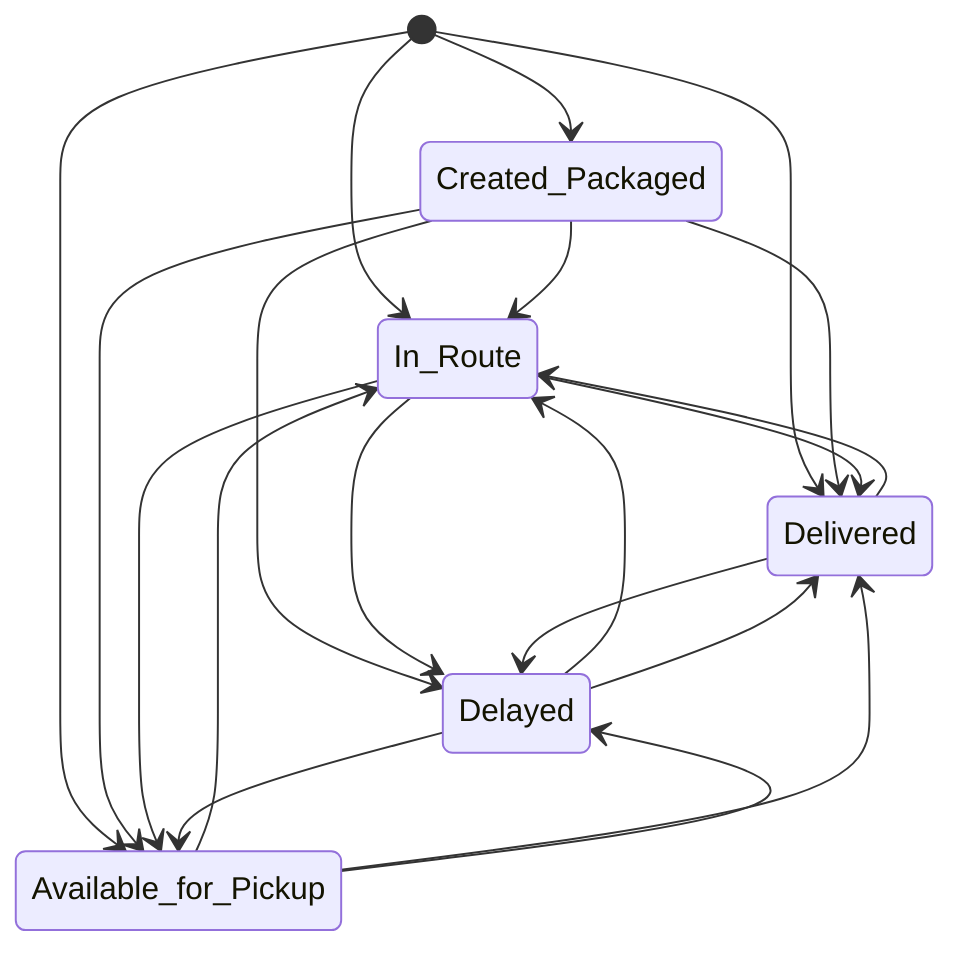
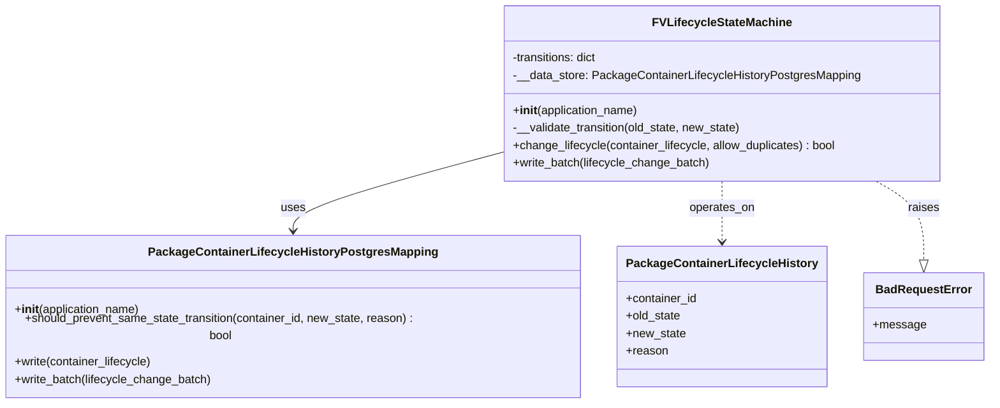

# Diagram: partview_core/partview_service/partview_service/core/business/package_container_lifecycle_state/FVLifecycleStateMachine.py

> Auto-generated by Obscura crawlers

## Diagram 1

### SVG

<svg id="container" width="476.4921875" xmlns="http://www.w3.org/2000/svg" class="statediagram" height="480" viewBox="0 0 476.4921875 480" role="graphics-document document" aria-roledescription="stateDiagram"><g><defs><marker id="container_stateDiagram-barbEnd" refX="19" refY="7" markerWidth="20" markerHeight="14" markerUnits="userSpaceOnUse" orient="auto"><path d="M 19,7 L9,13 L14,7 L9,1 Z"></path></marker></defs><g class="root"><g class="clusters"></g><g class="edgePaths"><path d="M219.457,17.767L230.78,22.639C242.102,27.511,264.746,37.256,276.152,46.378C287.557,55.5,287.724,64,287.807,68.25L287.891,72.5" id="edge0" class="edge-thickness-normal edge-pattern-solid transition" style="fill:none;;;fill:none" data-edge="true" data-et="edge" data-id="edge0" data-points="W3sieCI6MjE5LjQ1NzI4MTM1ODg0OTQ2LCJ5IjoxNy43NjY5MzAxMzAzNjE2NTh9LHsieCI6Mjg3LjM5MDYyNSwieSI6NDd9LHsieCI6Mjg3Ljg5MDYyNSwieSI6NzIuNX1d" marker-end="url(#container_stateDiagram-barbEnd)"></path><path d="M206.133,16.212L176.939,21.343C147.745,26.475,89.357,36.737,60.163,49.369C30.969,62,30.969,77,30.969,92C30.969,107,30.969,122,30.969,137C30.969,152,30.969,167,30.969,182C30.969,197,30.969,212,30.969,227C30.969,242,30.969,257,30.969,272C30.969,287,30.969,302,30.969,317C30.969,332,30.969,347,30.969,362C30.969,377,30.969,392,36.608,403.75C42.247,415.5,53.524,424,59.163,428.25L64.802,432.5" id="edge1" class="edge-thickness-normal edge-pattern-solid transition" style="fill:none;;;fill:none" data-edge="true" data-et="edge" data-id="edge1" data-points="W3sieCI6MjA2LjEzMzAzMDk3MjAwMDc0LCJ5IjoxNi4yMTE3OTY3MzE3NjQ5NjZ9LHsieCI6MzAuOTY4NzUsInkiOjQ3fSx7IngiOjMwLjk2ODc1LCJ5Ijo5Mn0seyJ4IjozMC45Njg3NSwieSI6MTM3fSx7IngiOjMwLjk2ODc1LCJ5IjoxODJ9LHsieCI6MzAuOTY4NzUsInkiOjIyN30seyJ4IjozMC45Njg3NSwieSI6MjcyfSx7IngiOjMwLjk2ODc1LCJ5IjozMTd9LHsieCI6MzAuOTY4NzUsInkiOjM2Mn0seyJ4IjozMC45Njg3NSwieSI6NDA3fSx7IngiOjY0LjgwMjA4MzMzMzMzMzMzLCJ5Ijo0MzIuNX1d" marker-end="url(#container_stateDiagram-barbEnd)"></path><path d="M207.905,19.77L203.031,24.309C198.158,28.847,188.411,37.923,183.537,49.962C178.664,62,178.664,77,178.664,92C178.664,107,178.664,122,183.724,133.75C188.784,145.5,198.903,154,203.963,158.25L209.023,162.5" id="edge2" class="edge-thickness-normal edge-pattern-solid transition" style="fill:none;;;fill:none" data-edge="true" data-et="edge" data-id="edge2" data-points="W3sieCI6MjA3LjkwNDU3NjY3MjA4MTksInkiOjE5Ljc3MDQ1NjczNTUxMjY5fSx7IngiOjE3OC42NjQwNjI1LCJ5Ijo0N30seyJ4IjoxNzguNjY0MDYyNSwieSI6OTJ9LHsieCI6MTc4LjY2NDA2MjUsInkiOjEzN30seyJ4IjoyMDkuMDIzMDAzNDcyMjIyMjMsInkiOjE2Mi41fV0=" marker-end="url(#container_stateDiagram-barbEnd)"></path><path d="M219.923,16.205L249.289,21.338C278.654,26.47,337.386,36.735,366.751,49.368C396.117,62,396.117,77,396.117,92C396.117,107,396.117,122,396.117,137C396.117,152,396.117,167,396.117,182C396.117,197,396.117,212,398.978,223.75C401.839,235.5,407.562,244,410.423,248.25L413.284,252.5" id="edge3" class="edge-thickness-normal edge-pattern-solid transition" style="fill:none;;;fill:none" data-edge="true" data-et="edge" data-id="edge3" data-points="W3sieCI6MjE5LjkyMjgxNzI3ODg5ODM4LCJ5IjoxNi4yMDUxNzQxODMzNzAwMX0seyJ4IjozOTYuMTE3MTg3NSwieSI6NDd9LHsieCI6Mzk2LjExNzE4NzUsInkiOjkyfSx7IngiOjM5Ni4xMTcxODc1LCJ5IjoxMzd9LHsieCI6Mzk2LjExNzE4NzUsInkiOjE4Mn0seyJ4IjozOTYuMTE3MTg3NSwieSI6MjI3fSx7IngiOjQxMy4yODM4NTQxNjY2NjY3LCJ5IjoyNTIuNX1d" marker-end="url(#container_stateDiagram-barbEnd)"></path><path d="M287.891,112.5L287.807,116.583C287.724,120.667,287.557,128.833,282.467,137.167C277.376,145.5,267.361,154,262.353,158.25L257.346,162.5" id="edge4" class="edge-thickness-normal edge-pattern-solid transition" style="fill:none;;;fill:none" data-edge="true" data-et="edge" data-id="edge4" data-points="W3sieCI6Mjg3Ljg5MDYyNSwieSI6MTEyLjV9LHsieCI6Mjg3LjM5MDYyNSwieSI6MTM3fSx7IngiOjI1Ny4zNDU5MjAxMzg4ODg5LCJ5IjoxNjIuNX1d" marker-end="url(#container_stateDiagram-barbEnd)"></path><path d="M214.164,106.533L186.965,111.611C159.766,116.689,105.367,126.844,78.168,139.422C50.969,152,50.969,167,50.969,182C50.969,197,50.969,212,50.969,227C50.969,242,50.969,257,50.969,272C50.969,287,50.969,302,50.969,317C50.969,332,50.969,347,50.969,362C50.969,377,50.969,392,54.756,403.75C58.543,415.5,66.117,424,69.904,428.25L73.691,432.5" id="edge5" class="edge-thickness-normal edge-pattern-solid transition" style="fill:none;;;fill:none" data-edge="true" data-et="edge" data-id="edge5" data-points="W3sieCI6MjE0LjE2NDA2MjUsInkiOjEwNi41MzI5NDU2MDgzNTM3MX0seyJ4Ijo1MC45Njg3NSwieSI6MTM3fSx7IngiOjUwLjk2ODc1LCJ5IjoxODJ9LHsieCI6NTAuOTY4NzUsInkiOjIyN30seyJ4Ijo1MC45Njg3NSwieSI6MjcyfSx7IngiOjUwLjk2ODc1LCJ5IjozMTd9LHsieCI6NTAuOTY4NzUsInkiOjM2Mn0seyJ4Ijo1MC45Njg3NSwieSI6NDA3fSx7IngiOjczLjY5MDk3MjIyMjIyMjIzLCJ5Ijo0MzIuNX1d" marker-end="url(#container_stateDiagram-barbEnd)"></path><path d="M345.102,112.5L356.938,116.583C368.774,120.667,392.446,128.833,404.281,140.417C416.117,152,416.117,167,416.117,182C416.117,197,416.117,212,417.126,223.75C418.136,235.5,420.154,244,421.163,248.25L422.173,252.5" id="edge6" class="edge-thickness-normal edge-pattern-solid transition" style="fill:none;;;fill:none" data-edge="true" data-et="edge" data-id="edge6" data-points="W3sieCI6MzQ1LjEwMjQzMDU1NTU1NTU0LCJ5IjoxMTIuNX0seyJ4Ijo0MTYuMTE3MTg3NSwieSI6MTM3fSx7IngiOjQxNi4xMTcxODc1LCJ5IjoxODJ9LHsieCI6NDE2LjExNzE4NzUsInkiOjIyN30seyJ4Ijo0MjIuMTcyNzQzMDU1NTU1NTQsInkiOjI1Mi41fV0=" marker-end="url(#container_stateDiagram-barbEnd)"></path><path d="M218.526,112.455L203.934,116.546C189.341,120.637,160.155,128.818,145.562,140.409C130.969,152,130.969,167,130.969,182C130.969,197,130.969,212,130.969,227C130.969,242,130.969,257,130.969,272C130.969,287,130.969,302,146.323,314.922C161.677,327.843,192.385,338.687,207.74,344.108L223.094,349.53" id="edge7" class="edge-thickness-normal edge-pattern-solid transition" style="fill:none;;;fill:none" data-edge="true" data-et="edge" data-id="edge7" data-points="W3sieCI6MjE4LjUyNjQ5OTIzNTk3NjQ0LCJ5IjoxMTIuNDU0OTE3ODEwNDQ3M30seyJ4IjoxMzAuOTY4NzUsInkiOjEzN30seyJ4IjoxMzAuOTY4NzUsInkiOjE4Mn0seyJ4IjoxMzAuOTY4NzUsInkiOjIyN30seyJ4IjoxMzAuOTY4NzUsInkiOjI3Mn0seyJ4IjoxMzAuOTY4NzUsInkiOjMxN30seyJ4IjoyMjMuMDkzNzUsInkiOjM0OS41MzAxMDI1NjcyMTQ5fV0=" marker-end="url(#container_stateDiagram-barbEnd)"></path><path d="M100.358,432.5L102.126,428.25C103.895,424,107.432,415.5,109.2,403.75C110.969,392,110.969,377,110.969,362C110.969,347,110.969,332,110.969,317C110.969,302,110.969,287,110.969,272C110.969,257,110.969,242,124.561,229.578C138.152,217.156,165.336,207.311,178.928,202.389L192.52,197.467" id="edge8" class="edge-thickness-normal edge-pattern-solid transition" style="fill:none;;;fill:none" data-edge="true" data-et="edge" data-id="edge8" data-points="W3sieCI6MTAwLjM1NzYzODg4ODg4ODg5LCJ5Ijo0MzIuNX0seyJ4IjoxMTAuOTY4NzUsInkiOjQwN30seyJ4IjoxMTAuOTY4NzUsInkiOjM2Mn0seyJ4IjoxMTAuOTY4NzUsInkiOjMxN30seyJ4IjoxMTAuOTY4NzUsInkiOjI3Mn0seyJ4IjoxMTAuOTY4NzUsInkiOjIyN30seyJ4IjoxOTIuNTE5NTMxMjUsInkiOjE5Ny40NjY3MDg0ODIwOTk4fV0=" marker-end="url(#container_stateDiagram-barbEnd)"></path><path d="M174.438,441.683L218.051,435.902C261.664,430.122,348.891,418.561,392.504,405.28C436.117,392,436.117,377,436.117,362C436.117,347,436.117,332,435.275,320.417C434.432,308.833,432.747,300.667,431.904,296.583L431.062,292.5" id="edge9" class="edge-thickness-normal edge-pattern-solid transition" style="fill:none;;;fill:none" data-edge="true" data-et="edge" data-id="edge9" data-points="W3sieCI6MTc0LjQzNzUsInkiOjQ0MS42ODI2NDMzMzczMzIyfSx7IngiOjQzNi4xMTcxODc1LCJ5Ijo0MDd9LHsieCI6NDM2LjExNzE4NzUsInkiOjM2Mn0seyJ4Ijo0MzYuMTE3MTg3NSwieSI6MzE3fSx7IngiOjQzMS4wNjE2MzE5NDQ0NDQ0NiwieSI6MjkyLjV9XQ==" marker-end="url(#container_stateDiagram-barbEnd)"></path><path d="M174.438,442.275L221.384,436.396C268.331,430.517,362.224,418.758,382.701,406.879C403.177,395,350.237,383,323.767,377L297.297,371" id="edge10" class="edge-thickness-normal edge-pattern-solid transition" style="fill:none;;;fill:none" data-edge="true" data-et="edge" data-id="edge10" data-points="W3sieCI6MTc0LjQzNzUsInkiOjQ0Mi4yNzUxMzQyNTYxODg2fSx7IngiOjQ1Ni4xMTcxODc1LCJ5Ijo0MDd9LHsieCI6Mjk3LjI5Njg3NSwieSI6MzcwLjk5OTkyMDQ1MTgzMzZ9XQ==" marker-end="url(#container_stateDiagram-barbEnd)"></path><path d="M273.301,191.423L300.437,197.352C327.573,203.282,381.845,215.141,408.139,225.32C434.432,235.5,432.747,244,431.904,248.25L431.062,252.5" id="edge11" class="edge-thickness-normal edge-pattern-solid transition" style="fill:none;;;fill:none" data-edge="true" data-et="edge" data-id="edge11" data-points="W3sieCI6MjczLjMwMDc4MTI1LCJ5IjoxOTEuNDIyNTEwNDk4NzYzMTZ9LHsieCI6NDM2LjExNzE4NzUsInkiOjIyN30seyJ4Ijo0MzEuMDYxNjMxOTQ0NDQ0NDYsInkiOjI1Mi41fV0=" marker-end="url(#container_stateDiagram-barbEnd)"></path><path d="M209.023,202.5L203.963,206.583C198.903,210.667,188.784,218.833,183.724,230.417C178.664,242,178.664,257,178.664,272C178.664,287,178.664,302,186.47,313.872C194.275,325.744,209.887,334.487,217.692,338.859L225.498,343.231" id="edge12" class="edge-thickness-normal edge-pattern-solid transition" style="fill:none;;;fill:none" data-edge="true" data-et="edge" data-id="edge12" data-points="W3sieCI6MjA5LjAyMzAwMzQ3MjIyMjIzLCJ5IjoyMDIuNX0seyJ4IjoxNzguNjY0MDYyNSwieSI6MjI3fSx7IngiOjE3OC42NjQwNjI1LCJ5IjoyNzJ9LHsieCI6MTc4LjY2NDA2MjUsInkiOjMxN30seyJ4IjoyMjUuNDk4MTcxODQxNjc5NTIsInkiOjM0My4yMzEyNDQ2Nzg3NTc2fV0=" marker-end="url(#container_stateDiagram-barbEnd)"></path><path d="M192.52,193.758L172.261,199.299C152.003,204.839,111.486,215.919,91.227,228.96C70.969,242,70.969,257,70.969,272C70.969,287,70.969,302,70.969,317C70.969,332,70.969,347,70.969,362C70.969,377,70.969,392,72.904,403.75C74.839,415.5,78.709,424,80.645,428.25L82.58,432.5" id="edge13" class="edge-thickness-normal edge-pattern-solid transition" style="fill:none;;;fill:none" data-edge="true" data-et="edge" data-id="edge13" data-points="W3sieCI6MTkyLjUxOTUzMTI1LCJ5IjoxOTMuNzU4NDM4Mzg0NjY5MzV9LHsieCI6NzAuOTY4NzUsInkiOjIyN30seyJ4Ijo3MC45Njg3NSwieSI6MjcyfSx7IngiOjcwLjk2ODc1LCJ5IjozMTd9LHsieCI6NzAuOTY4NzUsInkiOjM2Mn0seyJ4Ijo3MC45Njg3NSwieSI6NDA3fSx7IngiOjgyLjU3OTg2MTExMTExMTExLCJ5Ijo0MzIuNX1d" marker-end="url(#container_stateDiagram-barbEnd)"></path><path d="M283.916,342.5L288.774,338.25C293.633,334,303.35,325.5,308.208,313.75C313.066,302,313.066,287,313.066,272C313.066,257,313.066,242,305.676,230.414C298.286,218.827,283.505,210.654,276.115,206.568L268.724,202.482" id="edge14" class="edge-thickness-normal edge-pattern-solid transition" style="fill:none;;;fill:none" data-edge="true" data-et="edge" data-id="edge14" data-points="W3sieCI6MjgzLjkxNTc5ODYxMTExMTEsInkiOjM0Mi41fSx7IngiOjMxMy4wNjY0MDYyNSwieSI6MzE3fSx7IngiOjMxMy4wNjY0MDYyNSwieSI6MjcyfSx7IngiOjMxMy4wNjY0MDYyNSwieSI6MjI3fSx7IngiOjI2OC43MjQzNzg2NDUzNTAzLCJ5IjoyMDIuNDgxNTg4NjI4MTY5MDh9XQ==" marker-end="url(#container_stateDiagram-barbEnd)"></path><path d="M297.297,349.694L312.758,344.245C328.22,338.796,359.143,327.898,378.026,318.366C396.909,308.833,403.752,300.667,407.173,296.583L410.595,292.5" id="edge15" class="edge-thickness-normal edge-pattern-solid transition" style="fill:none;;;fill:none" data-edge="true" data-et="edge" data-id="edge15" data-points="W3sieCI6Mjk3LjI5Njg3NSwieSI6MzQ5LjY5MzcwNzg2NTE2ODU2fSx7IngiOjM5MC4wNjY0MDYyNSwieSI6MzE3fSx7IngiOjQxMC41OTQ2MTgwNTU1NTU1NCwieSI6MjkyLjV9XQ==" marker-end="url(#container_stateDiagram-barbEnd)"></path><path d="M223.094,372.395L201.073,378.163C179.052,383.93,135.01,395.465,113.073,405.483C91.135,415.5,91.302,424,91.385,428.25L91.469,432.5" id="edge16" class="edge-thickness-normal edge-pattern-solid transition" style="fill:none;;;fill:none" data-edge="true" data-et="edge" data-id="edge16" data-points="W3sieCI6MjIzLjA5Mzc1LCJ5IjozNzIuMzk1MTI0MzIyODIyNn0seyJ4Ijo5MC45Njg3NSwieSI6NDA3fSx7IngiOjkxLjQ2ODc1LCJ5Ijo0MzIuNX1d" marker-end="url(#container_stateDiagram-barbEnd)"></path><path d="M439.951,252.5L442.645,248.25C445.339,244,450.728,235.5,422.953,225.187C395.178,214.875,334.24,202.75,303.77,196.687L273.301,190.625" id="edge17" class="edge-thickness-normal edge-pattern-solid transition" style="fill:none;;;fill:none" data-edge="true" data-et="edge" data-id="edge17" data-points="W3sieCI6NDM5Ljk1MDUyMDgzMzMzMzMsInkiOjI1Mi41fSx7IngiOjQ1Ni4xMTcxODc1LCJ5IjoyMjd9LHsieCI6MjczLjMwMDc4MTI1LCJ5IjoxOTAuNjI0ODE0NDcyMDUyOTV9XQ==" marker-end="url(#container_stateDiagram-barbEnd)"></path><path d="M384.242,284.317L364.327,289.764C344.413,295.212,304.583,306.106,284.284,315.803C263.984,325.5,263.214,334,262.829,338.25L262.444,342.5" id="edge18" class="edge-thickness-normal edge-pattern-solid transition" style="fill:none;;;fill:none" data-edge="true" data-et="edge" data-id="edge18" data-points="W3sieCI6Mzg0LjI0MjE4NzUsInkiOjI4NC4zMTcyNzk1Mjc0NjM3N30seyJ4IjoyNjQuNzUzOTA2MjUsInkiOjMxN30seyJ4IjoyNjIuNDQzNTc2Mzg4ODg4OSwieSI6MzQyLjV9XQ==" marker-end="url(#container_stateDiagram-barbEnd)"></path></g><g class="edgeLabels"><g class="edgeLabel"><g class="label" data-id="edge0" transform="translate(0, 0)"><foreignObject width="0" height="0">

</foreignObject></g></g><g class="edgeLabel"><g class="label" data-id="edge1" transform="translate(0, 0)"><foreignObject width="0" height="0">

</foreignObject></g></g><g class="edgeLabel"><g class="label" data-id="edge2" transform="translate(0, 0)"><foreignObject width="0" height="0">

</foreignObject></g></g><g class="edgeLabel"><g class="label" data-id="edge3" transform="translate(0, 0)"><foreignObject width="0" height="0">

</foreignObject></g></g><g class="edgeLabel"><g class="label" data-id="edge4" transform="translate(0, 0)"><foreignObject width="0" height="0">

</foreignObject></g></g><g class="edgeLabel"><g class="label" data-id="edge5" transform="translate(0, 0)"><foreignObject width="0" height="0">

</foreignObject></g></g><g class="edgeLabel"><g class="label" data-id="edge6" transform="translate(0, 0)"><foreignObject width="0" height="0">

</foreignObject></g></g><g class="edgeLabel"><g class="label" data-id="edge7" transform="translate(0, 0)"><foreignObject width="0" height="0">

</foreignObject></g></g><g class="edgeLabel"><g class="label" data-id="edge8" transform="translate(0, 0)"><foreignObject width="0" height="0">

</foreignObject></g></g><g class="edgeLabel"><g class="label" data-id="edge9" transform="translate(0, 0)"><foreignObject width="0" height="0">

</foreignObject></g></g><g class="edgeLabel"><g class="label" data-id="edge10" transform="translate(0, 0)"><foreignObject width="0" height="0">

</foreignObject></g></g><g class="edgeLabel"><g class="label" data-id="edge11" transform="translate(0, 0)"><foreignObject width="0" height="0">

</foreignObject></g></g><g class="edgeLabel"><g class="label" data-id="edge12" transform="translate(0, 0)"><foreignObject width="0" height="0">

</foreignObject></g></g><g class="edgeLabel"><g class="label" data-id="edge13" transform="translate(0, 0)"><foreignObject width="0" height="0">

</foreignObject></g></g><g class="edgeLabel"><g class="label" data-id="edge14" transform="translate(0, 0)"><foreignObject width="0" height="0">

</foreignObject></g></g><g class="edgeLabel"><g class="label" data-id="edge15" transform="translate(0, 0)"><foreignObject width="0" height="0">

</foreignObject></g></g><g class="edgeLabel"><g class="label" data-id="edge16" transform="translate(0, 0)"><foreignObject width="0" height="0">

</foreignObject></g></g><g class="edgeLabel"><g class="label" data-id="edge17" transform="translate(0, 0)"><foreignObject width="0" height="0">

</foreignObject></g></g><g class="edgeLabel"><g class="label" data-id="edge18" transform="translate(0, 0)"><foreignObject width="0" height="0">

</foreignObject></g></g></g><g class="nodes"><g class="node default" id="state-root_start-3" transform="translate(213.02734375, 15)"><circle class="state-start" r="7" width="14" height="14"></circle></g><g class="node  statediagram-state" id="state-Created_Packaged-7" transform="translate(287.390625, 92)"><g class="basic label-container outer-path"><path d="M-68.7265625 -20 C-18.287287207447527 -20, 32.151988085104946 -20, 68.7265625 -20 C68.7265625 -20, 68.7265625 -20, 68.7265625 -20 C68.82701889015553 -19.995845092969212, 68.92747528031104 -19.991690185938424, 69.13945922736166 -19.982922465033347 C69.22887872142819 -19.971776336721877, 69.31829821549472 -19.960630208410404, 69.54953545140367 -19.931806517013612 C69.69088670941777 -19.90216827494019, 69.83223796743187 -19.872530032866774, 69.953989935704 -19.847001329696653 C70.09733441885462 -19.804325828067434, 70.24067890200523 -19.76165032643821, 70.35005984602341 -19.729086208503173 C70.43253560357394 -19.696904068042144, 70.51501136112448 -19.66472192758112, 70.73503962326485 -19.578866633275286 C70.81361119746688 -19.54045533121922, 70.8921827716689 -19.50204402916316, 71.10629946518537 -19.397368756032446 C71.19055311464744 -19.34716447809218, 71.27480676410951 -19.29696020015191, 71.46130329061214 -19.185832391312644 C71.5290264173412 -19.137479008216115, 71.59674954407025 -19.089125625119586, 71.79762606344833 -18.94570254698197 C71.86184265752435 -18.891313866181353, 71.92605925160036 -18.83692518538074, 72.1129703581287 -18.678619553365657 C72.1942566231215 -18.59733328837286, 72.2755428881143 -18.516047023380057, 72.40518205336566 -18.386407858128706 C72.4737773220266 -18.305417577461974, 72.54237259068755 -18.224427296795238, 72.67226504698196 -18.07106356344834 C72.72839936671186 -17.9924425569031, 72.78453368644173 -17.91382155035786, 72.91239489131264 -17.734740790612136 C72.98751270108762 -17.608676840032672, 73.0626305108626 -17.482612889453208, 73.12393125603245 -17.37973696518537 C73.16568588662243 -17.294326503158064, 73.2074405172124 -17.20891604113076, 73.30542913327528 -17.008477123264846 C73.34496732324303 -16.907149426503494, 73.38450551321077 -16.805821729742142, 73.45564870850318 -16.623497346023417 C73.4830008239316 -16.53162320982157, 73.51035293936005 -16.439749073619726, 73.57356382969665 -16.227427435703994 C73.60075222875938 -16.097760014762347, 73.62794062782208 -15.968092593820703, 73.65836901701361 -15.82297295140367 C73.66902597804982 -15.737477787745533, 73.67968293908602 -15.651982624087397, 73.70948496503335 -15.412896727361662 C73.7162364503876 -15.249660861468747, 73.72298793574184 -15.086424995575834, 73.7265625 -15 C73.7265625 -15, 73.7265625 -15, 73.7265625 -15 C73.7265625 -7.485624982833747, 73.7265625 0.028750034332505336, 73.7265625 15 C73.7265625 15, 73.7265625 15, 73.7265625 15 C73.72015227250503 15.154985011565662, 73.71374204501005 15.309970023131324, 73.70948496503335 15.412896727361662 C73.689553569251 15.572795777246425, 73.66962217346864 15.732694827131189, 73.65836901701361 15.822972951403669 C73.63971324701454 15.911946398346261, 73.62105747701546 16.000919845288855, 73.57356382969665 16.227427435703994 C73.54245156098783 16.3319317041355, 73.511339292279 16.436435972567004, 73.45564870850318 16.623497346023417 C73.3962820455313 16.775641063989678, 73.3369153825594 16.927784781955936, 73.30542913327528 17.008477123264846 C73.26416026848395 17.092893935469057, 73.2228914036926 17.17731074767327, 73.12393125603245 17.379736965185366 C73.04877449215678 17.505866289180787, 72.97361772828111 17.63199561317621, 72.91239489131264 17.734740790612133 C72.83518598147552 17.84287859712453, 72.7579770716384 17.951016403636928, 72.67226504698196 18.07106356344834 C72.5779689759367 18.182398724149806, 72.48367290489143 18.29373388485127, 72.40518205336566 18.386407858128706 C72.32214828669542 18.46944162479894, 72.2391145200252 18.552475391469173, 72.1129703581287 18.678619553365657 C72.04112305351073 18.739471116321894, 71.96927574889274 18.800322679278132, 71.79762606344833 18.94570254698197 C71.70599450903066 19.011126219344504, 71.61436295461297 19.07654989170704, 71.46130329061214 19.185832391312644 C71.37821167286326 19.235344248645884, 71.29512005511438 19.284856105979124, 71.10629946518537 19.397368756032446 C70.98279283047069 19.457747470601095, 70.85928619575601 19.518126185169745, 70.73503962326485 19.578866633275286 C70.64809916374328 19.612790905851444, 70.56115870422171 19.646715178427602, 70.35005984602341 19.729086208503173 C70.20353484071201 19.7727085926051, 70.05700983540062 19.816330976707025, 69.953989935704 19.847001329696653 C69.81069371476441 19.877047387609984, 69.66739749382484 19.907093445523312, 69.54953545140367 19.931806517013612 C69.45375968697626 19.943744953599296, 69.35798392254883 19.95568339018498, 69.13945922736166 19.982922465033347 C69.01223329545681 19.98818456850085, 68.88500736355196 19.99344667196835, 68.7265625 20 C68.7265625 20, 68.7265625 20, 68.7265625 20 C27.096812282786914 20, -14.532937934426172 20, -68.7265625 20 C-68.7265625 20, -68.7265625 20, -68.7265625 20 C-68.87385979861617 19.993907738664618, -69.02115709723235 19.987815477329235, -69.13945922736166 19.982922465033347 C-69.23755244184063 19.970695158599987, -69.33564565631963 19.958467852166628, -69.54953545140367 19.931806517013612 C-69.64148155168182 19.91252744715575, -69.73342765195997 19.893248377297887, -69.953989935704 19.847001329696653 C-70.09533691844064 19.804920509706356, -70.23668390117727 19.762839689716063, -70.35005984602341 19.729086208503173 C-70.49350832765992 19.673112437275684, -70.63695680929644 19.617138666048195, -70.73503962326485 19.578866633275286 C-70.81464052032489 19.539952125936477, -70.89424141738492 19.501037618597667, -71.10629946518537 19.397368756032446 C-71.20425569200667 19.338999514240374, -71.30221191882796 19.2806302724483, -71.46130329061214 19.185832391312644 C-71.56783413919102 19.109770827387205, -71.6743649877699 19.033709263461763, -71.79762606344833 18.94570254698197 C-71.87489109102263 18.88026240674633, -71.95215611859695 18.814822266510692, -72.1129703581287 18.67861955336566 C-72.20247720378369 18.589112707710676, -72.29198404943867 18.499605862055695, -72.40518205336566 18.386407858128706 C-72.47001204624482 18.309863230176912, -72.53484203912399 18.233318602225115, -72.67226504698196 18.07106356344834 C-72.74016265751703 17.975967043031403, -72.80806026805212 17.88087052261446, -72.91239489131264 17.734740790612133 C-72.96982126722061 17.638366896909613, -73.02724764312858 17.541993003207093, -73.12393125603245 17.37973696518537 C-73.17031411133117 17.28485931819787, -73.2166969666299 17.18998167121037, -73.30542913327528 17.00847712326485 C-73.36377723962465 16.85894374220739, -73.42212534597404 16.709410361149928, -73.45564870850318 16.623497346023417 C-73.485270409501 16.523999806276432, -73.51489211049883 16.424502266529448, -73.57356382969665 16.227427435703994 C-73.5944151990021 16.127982695515264, -73.61526656830756 16.02853795532653, -73.65836901701361 15.82297295140367 C-73.67582021320663 15.6829712314495, -73.69327140939966 15.542969511495327, -73.70948496503335 15.412896727361664 C-73.71585018201908 15.25899996957524, -73.7222153990048 15.105103211788817, -73.7265625 15 C-73.7265625 15, -73.7265625 15, -73.7265625 15 C-73.7265625 6.956823599405199, -73.7265625 -1.0863528011896015, -73.7265625 -15 C-73.7265625 -15, -73.7265625 -15, -73.7265625 -15 C-73.72123983523215 -15.128690169147875, -73.71591717046431 -15.257380338295752, -73.70948496503335 -15.41289672736166 C-73.6892069632397 -15.575576414011444, -73.66892896144604 -15.738256100661228, -73.65836901701361 -15.822972951403669 C-73.62690324557089 -15.973040096641048, -73.59543747412818 -16.12310724187843, -73.57356382969665 -16.227427435703994 C-73.53660909556783 -16.351556199548163, -73.499654361439 -16.475684963392332, -73.45564870850318 -16.623497346023417 C-73.41208562538083 -16.73513995991676, -73.36852254225849 -16.84678257381011, -73.30542913327528 -17.008477123264846 C-73.26076763908237 -17.09983366983101, -73.21610614488945 -17.191190216397175, -73.12393125603245 -17.379736965185366 C-73.07221818356501 -17.466522698573712, -73.02050511109756 -17.553308431962055, -72.91239489131264 -17.734740790612133 C-72.86218145794632 -17.80506907983608, -72.81196802457998 -17.875397369060032, -72.67226504698196 -18.07106356344834 C-72.60648400565296 -18.148731092183006, -72.54070296432396 -18.226398620917667, -72.40518205336566 -18.386407858128706 C-72.3066328514127 -18.48495706008167, -72.20808364945974 -18.583506262034632, -72.1129703581287 -18.678619553365657 C-71.98786189800849 -18.784581013963837, -71.86275343788827 -18.890542474562015, -71.79762606344833 -18.945702546981966 C-71.6716571437996 -19.03564262689587, -71.54568822415087 -19.125582706809777, -71.46130329061214 -19.185832391312644 C-71.38998582129254 -19.22832837901855, -71.31866835197293 -19.27082436672445, -71.10629946518537 -19.397368756032446 C-70.97519427881537 -19.461462176151873, -70.84408909244534 -19.5255555962713, -70.73503962326485 -19.578866633275286 C-70.59849433373755 -19.632146770583116, -70.46194904421023 -19.685426907890946, -70.35005984602341 -19.729086208503173 C-70.25462570515727 -19.757498183240543, -70.1591915642911 -19.785910157977916, -69.953989935704 -19.847001329696653 C-69.85052430107798 -19.868695791906674, -69.74705866645196 -19.890390254116696, -69.54953545140367 -19.931806517013612 C-69.43261306129169 -19.946380877741962, -69.3156906711797 -19.960955238470312, -69.13945922736167 -19.982922465033347 C-69.01459938970727 -19.98808670611876, -68.88973955205286 -19.993250947204174, -68.7265625 -20 C-68.7265625 -20, -68.7265625 -20, -68.7265625 -20" stroke="none" stroke-width="0" fill="#ECECFF" style=""></path><path d="M-68.7265625 -20 C-20.435303776530652 -20, 27.855954946938695 -20, 68.7265625 -20 M-68.7265625 -20 C-25.955790529600762 -20, 16.814981440798476 -20, 68.7265625 -20 M68.7265625 -20 C68.7265625 -20, 68.7265625 -20, 68.7265625 -20 M68.7265625 -20 C68.7265625 -20, 68.7265625 -20, 68.7265625 -20 M68.7265625 -20 C68.88088649491272 -19.993617112356024, 69.03521048982543 -19.987234224712044, 69.13945922736166 -19.982922465033347 M68.7265625 -20 C68.84465213798656 -19.995115776444145, 68.96274177597311 -19.990231552888293, 69.13945922736166 -19.982922465033347 M69.13945922736166 -19.982922465033347 C69.29572174408145 -19.963444362637283, 69.45198426080124 -19.94396626024122, 69.54953545140367 -19.931806517013612 M69.13945922736166 -19.982922465033347 C69.296714086288 -19.963320667310235, 69.45396894521436 -19.94371886958712, 69.54953545140367 -19.931806517013612 M69.54953545140367 -19.931806517013612 C69.6468016884257 -19.911411931787196, 69.74406792544774 -19.89101734656078, 69.953989935704 -19.847001329696653 M69.54953545140367 -19.931806517013612 C69.70404288068836 -19.899409715912455, 69.85855030997304 -19.867012914811294, 69.953989935704 -19.847001329696653 M69.953989935704 -19.847001329696653 C70.08155650137616 -19.809023117619553, 70.20912306704831 -19.771044905542453, 70.35005984602341 -19.729086208503173 M69.953989935704 -19.847001329696653 C70.07453558551495 -19.811113334833973, 70.1950812353259 -19.775225339971296, 70.35005984602341 -19.729086208503173 M70.35005984602341 -19.729086208503173 C70.4749591015305 -19.6803503677715, 70.59985835703759 -19.63161452703983, 70.73503962326485 -19.578866633275286 M70.35005984602341 -19.729086208503173 C70.45060717656446 -19.689852518379496, 70.5511545071055 -19.650618828255816, 70.73503962326485 -19.578866633275286 M70.73503962326485 -19.578866633275286 C70.861505223133 -19.517041368787822, 70.98797082300113 -19.45521610430036, 71.10629946518537 -19.397368756032446 M70.73503962326485 -19.578866633275286 C70.81173239919259 -19.54137381972793, 70.88842517512035 -19.503881006180578, 71.10629946518537 -19.397368756032446 M71.10629946518537 -19.397368756032446 C71.21544829712786 -19.33233016920941, 71.32459712907037 -19.267291582386374, 71.46130329061214 -19.185832391312644 M71.10629946518537 -19.397368756032446 C71.20539986506685 -19.338317735080754, 71.30450026494833 -19.27926671412906, 71.46130329061214 -19.185832391312644 M71.46130329061214 -19.185832391312644 C71.54912871449875 -19.12312624391644, 71.63695413838536 -19.060420096520232, 71.79762606344833 -18.94570254698197 M71.46130329061214 -19.185832391312644 C71.57343510855391 -19.105771812126154, 71.68556692649568 -19.02571123293966, 71.79762606344833 -18.94570254698197 M71.79762606344833 -18.94570254698197 C71.9210119495061 -18.84120003219346, 72.04439783556386 -18.736697517404945, 72.1129703581287 -18.678619553365657 M71.79762606344833 -18.94570254698197 C71.9034286743223 -18.85609230661506, 72.00923128519626 -18.76648206624815, 72.1129703581287 -18.678619553365657 M72.1129703581287 -18.678619553365657 C72.22064243665315 -18.57094747484122, 72.32831451517758 -18.463275396316785, 72.40518205336566 -18.386407858128706 M72.1129703581287 -18.678619553365657 C72.19056876348873 -18.60102114800564, 72.26816716884875 -18.52342274264562, 72.40518205336566 -18.386407858128706 M72.40518205336566 -18.386407858128706 C72.4848492523867 -18.29234497398813, 72.56451645140773 -18.198282089847556, 72.67226504698196 -18.07106356344834 M72.40518205336566 -18.386407858128706 C72.50940273513963 -18.263354731682416, 72.61362341691361 -18.14030160523612, 72.67226504698196 -18.07106356344834 M72.67226504698196 -18.07106356344834 C72.76254951087645 -17.944612304023842, 72.85283397477093 -17.818161044599343, 72.91239489131264 -17.734740790612136 M72.67226504698196 -18.07106356344834 C72.74699418599236 -17.96639889207568, 72.82172332500275 -17.86173422070302, 72.91239489131264 -17.734740790612136 M72.91239489131264 -17.734740790612136 C72.97443758898837 -17.63061970937935, 73.0364802866641 -17.526498628146562, 73.12393125603245 -17.37973696518537 M72.91239489131264 -17.734740790612136 C72.96837787870768 -17.640789215381176, 73.02436086610271 -17.54683764015022, 73.12393125603245 -17.37973696518537 M73.12393125603245 -17.37973696518537 C73.16098480673877 -17.30394271576052, 73.1980383574451 -17.22814846633567, 73.30542913327528 -17.008477123264846 M73.12393125603245 -17.37973696518537 C73.19505611174634 -17.23424874741614, 73.26618096746023 -17.088760529646905, 73.30542913327528 -17.008477123264846 M73.30542913327528 -17.008477123264846 C73.34114264045931 -16.916951248428912, 73.37685614764332 -16.82542537359298, 73.45564870850318 -16.623497346023417 M73.30542913327528 -17.008477123264846 C73.34538735146145 -16.9060729864342, 73.38534556964764 -16.803668849603554, 73.45564870850318 -16.623497346023417 M73.45564870850318 -16.623497346023417 C73.50008423481215 -16.47424104418479, 73.54451976112112 -16.32498474234616, 73.57356382969665 -16.227427435703994 M73.45564870850318 -16.623497346023417 C73.49236718300071 -16.50016216429179, 73.52908565749824 -16.376826982560164, 73.57356382969665 -16.227427435703994 M73.57356382969665 -16.227427435703994 C73.60393836248485 -16.082564646252205, 73.63431289527306 -15.937701856800414, 73.65836901701361 -15.82297295140367 M73.57356382969665 -16.227427435703994 C73.59417474927517 -16.129129452846822, 73.61478566885367 -16.030831469989646, 73.65836901701361 -15.82297295140367 M73.65836901701361 -15.82297295140367 C73.67601128874455 -15.68143833343762, 73.6936535604755 -15.539903715471569, 73.70948496503335 -15.412896727361662 M73.65836901701361 -15.82297295140367 C73.67102048874531 -15.72147688300827, 73.683671960477 -15.619980814612871, 73.70948496503335 -15.412896727361662 M73.70948496503335 -15.412896727361662 C73.71435257667557 -15.295208728416567, 73.71922018831779 -15.177520729471471, 73.7265625 -15 M73.70948496503335 -15.412896727361662 C73.71358523859557 -15.313761252690764, 73.71768551215779 -15.214625778019865, 73.7265625 -15 M73.7265625 -15 C73.7265625 -15, 73.7265625 -15, 73.7265625 -15 M73.7265625 -15 C73.7265625 -15, 73.7265625 -15, 73.7265625 -15 M73.7265625 -15 C73.7265625 -4.0648537058728405, 73.7265625 6.870292588254319, 73.7265625 15 M73.7265625 -15 C73.7265625 -7.663599310874526, 73.7265625 -0.32719862174905145, 73.7265625 15 M73.7265625 15 C73.7265625 15, 73.7265625 15, 73.7265625 15 M73.7265625 15 C73.7265625 15, 73.7265625 15, 73.7265625 15 M73.7265625 15 C73.72171746683703 15.11714210164726, 73.71687243367407 15.234284203294521, 73.70948496503335 15.412896727361662 M73.7265625 15 C73.72029314659564 15.151578990082102, 73.71402379319127 15.303157980164205, 73.70948496503335 15.412896727361662 M73.70948496503335 15.412896727361662 C73.68970237660385 15.571601974534541, 73.66991978817434 15.73030722170742, 73.65836901701361 15.822972951403669 M73.70948496503335 15.412896727361662 C73.69212109360303 15.55219788691654, 73.67475722217272 15.691499046471417, 73.65836901701361 15.822972951403669 M73.65836901701361 15.822972951403669 C73.62992887713489 15.95861019803915, 73.60148873725616 16.09424744467463, 73.57356382969665 16.227427435703994 M73.65836901701361 15.822972951403669 C73.63361203237832 15.941044425216623, 73.60885504774303 16.059115899029578, 73.57356382969665 16.227427435703994 M73.57356382969665 16.227427435703994 C73.53749827290838 16.34856950550955, 73.5014327161201 16.469711575315102, 73.45564870850318 16.623497346023417 M73.57356382969665 16.227427435703994 C73.53039684721783 16.372422773927774, 73.48722986473902 16.51741811215155, 73.45564870850318 16.623497346023417 M73.45564870850318 16.623497346023417 C73.42428640268527 16.70387204745124, 73.39292409686736 16.78424674887907, 73.30542913327528 17.008477123264846 M73.45564870850318 16.623497346023417 C73.40682955836084 16.748610105252034, 73.3580104082185 16.873722864480655, 73.30542913327528 17.008477123264846 M73.30542913327528 17.008477123264846 C73.24214836156143 17.137920010751944, 73.17886758984758 17.267362898239043, 73.12393125603245 17.379736965185366 M73.30542913327528 17.008477123264846 C73.24274958266027 17.136690193337547, 73.18007003204524 17.264903263410247, 73.12393125603245 17.379736965185366 M73.12393125603245 17.379736965185366 C73.0662847944991 17.476480210223947, 73.00863833296573 17.57322345526253, 72.91239489131264 17.734740790612133 M73.12393125603245 17.379736965185366 C73.05139008445735 17.501476758928202, 72.97884891288226 17.62321655267104, 72.91239489131264 17.734740790612133 M72.91239489131264 17.734740790612133 C72.86100762946805 17.80671312891188, 72.80962036762347 17.87868546721163, 72.67226504698196 18.07106356344834 M72.91239489131264 17.734740790612133 C72.83254269703616 17.846580747327963, 72.75269050275968 17.958420704043792, 72.67226504698196 18.07106356344834 M72.67226504698196 18.07106356344834 C72.61606631791219 18.137417277477404, 72.55986758884241 18.203770991506467, 72.40518205336566 18.386407858128706 M72.67226504698196 18.07106356344834 C72.5835938701283 18.175757424127347, 72.49492269327463 18.280451284806357, 72.40518205336566 18.386407858128706 M72.40518205336566 18.386407858128706 C72.32866153959938 18.462928371894993, 72.25214102583308 18.539448885661283, 72.1129703581287 18.678619553365657 M72.40518205336566 18.386407858128706 C72.33168720204628 18.45990270944809, 72.25819235072689 18.533397560767476, 72.1129703581287 18.678619553365657 M72.1129703581287 18.678619553365657 C72.03102189012486 18.748026365304085, 71.94907342212102 18.817433177242513, 71.79762606344833 18.94570254698197 M72.1129703581287 18.678619553365657 C72.00788792752012 18.7676198321621, 71.90280549691153 18.85662011095855, 71.79762606344833 18.94570254698197 M71.79762606344833 18.94570254698197 C71.71795995596226 19.002583054441327, 71.63829384847618 19.05946356190069, 71.46130329061214 19.185832391312644 M71.79762606344833 18.94570254698197 C71.70735352542368 19.010155900290137, 71.61708098739904 19.074609253598304, 71.46130329061214 19.185832391312644 M71.46130329061214 19.185832391312644 C71.37683316547329 19.23616566075789, 71.29236304033445 19.286498930203134, 71.10629946518537 19.397368756032446 M71.46130329061214 19.185832391312644 C71.36991106348609 19.240290338256315, 71.27851883636004 19.294748285199983, 71.10629946518537 19.397368756032446 M71.10629946518537 19.397368756032446 C71.00591250713875 19.446444949390923, 70.90552554909212 19.4955211427494, 70.73503962326485 19.578866633275286 M71.10629946518537 19.397368756032446 C70.96201627845208 19.467904507969582, 70.81773309171878 19.538440259906714, 70.73503962326485 19.578866633275286 M70.73503962326485 19.578866633275286 C70.633959987987 19.6183080293518, 70.53288035270914 19.657749425428317, 70.35005984602341 19.729086208503173 M70.73503962326485 19.578866633275286 C70.61973671587472 19.623857967352098, 70.50443380848458 19.668849301428914, 70.35005984602341 19.729086208503173 M70.35005984602341 19.729086208503173 C70.21074951775199 19.770560690188443, 70.07143918948056 19.81203517187371, 69.953989935704 19.847001329696653 M70.35005984602341 19.729086208503173 C70.2175522449698 19.76853543054757, 70.08504464391618 19.807984652591966, 69.953989935704 19.847001329696653 M69.953989935704 19.847001329696653 C69.85730032601826 19.867275008885024, 69.76061071633251 19.887548688073398, 69.54953545140367 19.931806517013612 M69.953989935704 19.847001329696653 C69.86074350842661 19.866553049454627, 69.76749708114923 19.8861047692126, 69.54953545140367 19.931806517013612 M69.54953545140367 19.931806517013612 C69.44155537353039 19.945266219683845, 69.3335752956571 19.95872592235408, 69.13945922736166 19.982922465033347 M69.54953545140367 19.931806517013612 C69.42465096668246 19.947373351799982, 69.29976648196126 19.962940186586355, 69.13945922736166 19.982922465033347 M69.13945922736166 19.982922465033347 C69.04895190428971 19.98666587560571, 68.95844458121778 19.99040928617807, 68.7265625 20 M69.13945922736166 19.982922465033347 C69.05687494490074 19.986338176222034, 68.97429066243983 19.989753887410725, 68.7265625 20 M68.7265625 20 C68.7265625 20, 68.7265625 20, 68.7265625 20 M68.7265625 20 C68.7265625 20, 68.7265625 20, 68.7265625 20 M68.7265625 20 C28.549183800567512 20, -11.628194898864976 20, -68.7265625 20 M68.7265625 20 C14.933175894136767 20, -38.86021071172647 20, -68.7265625 20 M-68.7265625 20 C-68.7265625 20, -68.7265625 20, -68.7265625 20 M-68.7265625 20 C-68.7265625 20, -68.7265625 20, -68.7265625 20 M-68.7265625 20 C-68.82716258336944 19.99583914977392, -68.92776266673889 19.991678299547843, -69.13945922736166 19.982922465033347 M-68.7265625 20 C-68.87380642295774 19.99390994629818, -69.02105034591547 19.987819892596363, -69.13945922736166 19.982922465033347 M-69.13945922736166 19.982922465033347 C-69.26838328946275 19.966852097451692, -69.39730735156382 19.950781729870037, -69.54953545140367 19.931806517013612 M-69.13945922736166 19.982922465033347 C-69.29778657220194 19.963186982080476, -69.45611391704222 19.943451499127608, -69.54953545140367 19.931806517013612 M-69.54953545140367 19.931806517013612 C-69.68051339481416 19.904343330285617, -69.81149133822463 19.876880143557617, -69.953989935704 19.847001329696653 M-69.54953545140367 19.931806517013612 C-69.6804824779719 19.904349812865732, -69.81142950454014 19.876893108717848, -69.953989935704 19.847001329696653 M-69.953989935704 19.847001329696653 C-70.0509538228121 19.818133929770912, -70.14791770992021 19.78926652984517, -70.35005984602341 19.729086208503173 M-69.953989935704 19.847001329696653 C-70.08452563564364 19.808139168049365, -70.21506133558329 19.76927700640208, -70.35005984602341 19.729086208503173 M-70.35005984602341 19.729086208503173 C-70.44508253103004 19.692008241756476, -70.54010521603666 19.654930275009782, -70.73503962326485 19.578866633275286 M-70.35005984602341 19.729086208503173 C-70.46984404456099 19.682346269194507, -70.58962824309857 19.635606329885846, -70.73503962326485 19.578866633275286 M-70.73503962326485 19.578866633275286 C-70.82572696272891 19.534532294499563, -70.91641430219296 19.490197955723836, -71.10629946518537 19.397368756032446 M-70.73503962326485 19.578866633275286 C-70.85501079040871 19.52021630348385, -70.97498195755256 19.461565973692412, -71.10629946518537 19.397368756032446 M-71.10629946518537 19.397368756032446 C-71.19289607335455 19.345768377734686, -71.27949268152373 19.294167999436926, -71.46130329061214 19.185832391312644 M-71.10629946518537 19.397368756032446 C-71.20498396646073 19.338565556858796, -71.3036684677361 19.27976235768515, -71.46130329061214 19.185832391312644 M-71.46130329061214 19.185832391312644 C-71.57964785160131 19.101335998849944, -71.69799241259047 19.016839606387244, -71.79762606344833 18.94570254698197 M-71.46130329061214 19.185832391312644 C-71.58925653845557 19.094475528299352, -71.717209786299 19.00311866528606, -71.79762606344833 18.94570254698197 M-71.79762606344833 18.94570254698197 C-71.92007855790847 18.84199057455087, -72.04253105236859 18.738278602119767, -72.1129703581287 18.67861955336566 M-71.79762606344833 18.94570254698197 C-71.89702884845636 18.861512682628632, -71.99643163346437 18.77732281827529, -72.1129703581287 18.67861955336566 M-72.1129703581287 18.67861955336566 C-72.22966610418158 18.561923807312784, -72.34636185023446 18.44522806125991, -72.40518205336566 18.386407858128706 M-72.1129703581287 18.67861955336566 C-72.17954503160905 18.612044879885318, -72.24611970508938 18.54547020640498, -72.40518205336566 18.386407858128706 M-72.40518205336566 18.386407858128706 C-72.45958772675685 18.32217120093891, -72.51399340014804 18.257934543749112, -72.67226504698196 18.07106356344834 M-72.40518205336566 18.386407858128706 C-72.46089024010669 18.320633326332757, -72.51659842684772 18.254858794536805, -72.67226504698196 18.07106356344834 M-72.67226504698196 18.07106356344834 C-72.74170287822575 17.97380982970801, -72.81114070946954 17.87655609596768, -72.91239489131264 17.734740790612133 M-72.67226504698196 18.07106356344834 C-72.76599813244954 17.939782208984393, -72.85973121791712 17.808500854520442, -72.91239489131264 17.734740790612133 M-72.91239489131264 17.734740790612133 C-72.96515339329682 17.646200600120643, -73.017911895281 17.55766040962915, -73.12393125603245 17.37973696518537 M-72.91239489131264 17.734740790612133 C-72.9823646692598 17.617316352178563, -73.05233444720696 17.499891913744996, -73.12393125603245 17.37973696518537 M-73.12393125603245 17.37973696518537 C-73.16604801768857 17.293585752222512, -73.20816477934468 17.20743453925965, -73.30542913327528 17.00847712326485 M-73.12393125603245 17.37973696518537 C-73.17165028850735 17.282126124098063, -73.21936932098225 17.18451528301076, -73.30542913327528 17.00847712326485 M-73.30542913327528 17.00847712326485 C-73.35606761029379 16.878701828847614, -73.4067060873123 16.74892653443038, -73.45564870850318 16.623497346023417 M-73.30542913327528 17.00847712326485 C-73.33640524213841 16.929092159808235, -73.36738135100154 16.849707196351616, -73.45564870850318 16.623497346023417 M-73.45564870850318 16.623497346023417 C-73.48810456765086 16.514480036861915, -73.52056042679855 16.405462727700417, -73.57356382969665 16.227427435703994 M-73.45564870850318 16.623497346023417 C-73.49534793745335 16.490149986576245, -73.53504716640352 16.356802627129074, -73.57356382969665 16.227427435703994 M-73.57356382969665 16.227427435703994 C-73.60265071141626 16.088705735793837, -73.63173759313587 15.949984035883679, -73.65836901701361 15.82297295140367 M-73.57356382969665 16.227427435703994 C-73.60519253022142 16.076583246043487, -73.6368212307462 15.92573905638298, -73.65836901701361 15.82297295140367 M-73.65836901701361 15.82297295140367 C-73.66876676289519 15.739557333874318, -73.67916450877676 15.656141716344964, -73.70948496503335 15.412896727361664 M-73.65836901701361 15.82297295140367 C-73.67479593591997 15.6911884665465, -73.69122285482635 15.55940398168933, -73.70948496503335 15.412896727361664 M-73.70948496503335 15.412896727361664 C-73.7149350246524 15.28112643469183, -73.72038508427147 15.149356142021993, -73.7265625 15 M-73.70948496503335 15.412896727361664 C-73.71478923144885 15.284651389361123, -73.72009349786435 15.156406051360582, -73.7265625 15 M-73.7265625 15 C-73.7265625 15, -73.7265625 15, -73.7265625 15 M-73.7265625 15 C-73.7265625 15, -73.7265625 15, -73.7265625 15 M-73.7265625 15 C-73.7265625 5.139997467504017, -73.7265625 -4.720005064991966, -73.7265625 -15 M-73.7265625 15 C-73.7265625 4.923141773112642, -73.7265625 -5.153716453774717, -73.7265625 -15 M-73.7265625 -15 C-73.7265625 -15, -73.7265625 -15, -73.7265625 -15 M-73.7265625 -15 C-73.7265625 -15, -73.7265625 -15, -73.7265625 -15 M-73.7265625 -15 C-73.72252309225664 -15.097663874848958, -73.71848368451329 -15.195327749697915, -73.70948496503335 -15.41289672736166 M-73.7265625 -15 C-73.72143417939222 -15.123991360576888, -73.71630585878444 -15.247982721153775, -73.70948496503335 -15.41289672736166 M-73.70948496503335 -15.41289672736166 C-73.69570295349112 -15.523462518898127, -73.6819209419489 -15.634028310434593, -73.65836901701361 -15.822972951403669 M-73.70948496503335 -15.41289672736166 C-73.69728082444264 -15.510804094533757, -73.68507668385192 -15.608711461705852, -73.65836901701361 -15.822972951403669 M-73.65836901701361 -15.822972951403669 C-73.6356561992716 -15.931295346265209, -73.61294338152958 -16.03961774112675, -73.57356382969665 -16.227427435703994 M-73.65836901701361 -15.822972951403669 C-73.63536816549296 -15.932669042345402, -73.61236731397231 -16.042365133287138, -73.57356382969665 -16.227427435703994 M-73.57356382969665 -16.227427435703994 C-73.54550774749217 -16.32166615462463, -73.51745166528768 -16.415904873545262, -73.45564870850318 -16.623497346023417 M-73.57356382969665 -16.227427435703994 C-73.53692784143927 -16.35048555103899, -73.50029185318188 -16.473543666373985, -73.45564870850318 -16.623497346023417 M-73.45564870850318 -16.623497346023417 C-73.40773557697214 -16.746288178548223, -73.35982244544111 -16.86907901107303, -73.30542913327528 -17.008477123264846 M-73.45564870850318 -16.623497346023417 C-73.39609274167823 -16.776126208186586, -73.33653677485327 -16.92875507034975, -73.30542913327528 -17.008477123264846 M-73.30542913327528 -17.008477123264846 C-73.25323966956996 -17.1152323775934, -73.20105020586466 -17.22198763192195, -73.12393125603245 -17.379736965185366 M-73.30542913327528 -17.008477123264846 C-73.26515199567885 -17.090865325067657, -73.2248748580824 -17.173253526870468, -73.12393125603245 -17.379736965185366 M-73.12393125603245 -17.379736965185366 C-73.07129354758948 -17.468074437958457, -73.0186558391465 -17.556411910731544, -72.91239489131264 -17.734740790612133 M-73.12393125603245 -17.379736965185366 C-73.06698984521665 -17.475296982450377, -73.01004843440087 -17.570856999715392, -72.91239489131264 -17.734740790612133 M-72.91239489131264 -17.734740790612133 C-72.84772292666663 -17.82531951286607, -72.78305096202062 -17.91589823512001, -72.67226504698196 -18.07106356344834 M-72.91239489131264 -17.734740790612133 C-72.82283687756701 -17.86017459329747, -72.73327886382137 -17.985608395982805, -72.67226504698196 -18.07106356344834 M-72.67226504698196 -18.07106356344834 C-72.59261240767358 -18.16510925696867, -72.5129597683652 -18.259154950489, -72.40518205336566 -18.386407858128706 M-72.67226504698196 -18.07106356344834 C-72.56595463989457 -18.196584023909843, -72.4596442328072 -18.322104484371348, -72.40518205336566 -18.386407858128706 M-72.40518205336566 -18.386407858128706 C-72.29202842377474 -18.499561487719635, -72.1788747941838 -18.612715117310564, -72.1129703581287 -18.678619553365657 M-72.40518205336566 -18.386407858128706 C-72.32976387840307 -18.461826033091292, -72.25434570344049 -18.53724420805388, -72.1129703581287 -18.678619553365657 M-72.1129703581287 -18.678619553365657 C-72.00081731720668 -18.773608333622448, -71.88866427628466 -18.86859711387924, -71.79762606344833 -18.945702546981966 M-72.1129703581287 -18.678619553365657 C-71.9884260004986 -18.784103243525905, -71.86388164286852 -18.88958693368615, -71.79762606344833 -18.945702546981966 M-71.79762606344833 -18.945702546981966 C-71.72166850330674 -18.99993520253105, -71.64571094316516 -19.05416785808013, -71.46130329061214 -19.185832391312644 M-71.79762606344833 -18.945702546981966 C-71.72124119401272 -19.000240295502866, -71.64485632457712 -19.054778044023763, -71.46130329061214 -19.185832391312644 M-71.46130329061214 -19.185832391312644 C-71.37498634740315 -19.23726612546524, -71.28866940419415 -19.28869985961784, -71.10629946518537 -19.397368756032446 M-71.46130329061214 -19.185832391312644 C-71.32584598715242 -19.2665474244934, -71.19038868369269 -19.34726245767416, -71.10629946518537 -19.397368756032446 M-71.10629946518537 -19.397368756032446 C-70.98155469021006 -19.45835276049152, -70.85680991523473 -19.51933676495059, -70.73503962326485 -19.578866633275286 M-71.10629946518537 -19.397368756032446 C-71.01100345561349 -19.44395613633606, -70.91570744604161 -19.490543516639672, -70.73503962326485 -19.578866633275286 M-70.73503962326485 -19.578866633275286 C-70.65446631254208 -19.610306436680567, -70.5738930018193 -19.641746240085848, -70.35005984602341 -19.729086208503173 M-70.73503962326485 -19.578866633275286 C-70.6424786240181 -19.614984047257774, -70.54991762477135 -19.651101461240266, -70.35005984602341 -19.729086208503173 M-70.35005984602341 -19.729086208503173 C-70.25349371010884 -19.75783519276802, -70.15692757419427 -19.786584177032868, -69.953989935704 -19.847001329696653 M-70.35005984602341 -19.729086208503173 C-70.26508355965422 -19.754384745061316, -70.18010727328502 -19.779683281619455, -69.953989935704 -19.847001329696653 M-69.953989935704 -19.847001329696653 C-69.83903481914987 -19.87110488292905, -69.72407970259576 -19.89520843616145, -69.54953545140367 -19.931806517013612 M-69.953989935704 -19.847001329696653 C-69.84325393959898 -19.870220226400598, -69.73251794349395 -19.893439123104542, -69.54953545140367 -19.931806517013612 M-69.54953545140367 -19.931806517013612 C-69.41283600058486 -19.948846085788183, -69.27613654976605 -19.965885654562758, -69.13945922736167 -19.982922465033347 M-69.54953545140367 -19.931806517013612 C-69.41307681349863 -19.948816068489787, -69.2766181755936 -19.965825619965962, -69.13945922736167 -19.982922465033347 M-69.13945922736167 -19.982922465033347 C-68.99232415137358 -19.9890080167912, -68.84518907538548 -19.995093568549056, -68.7265625 -20 M-69.13945922736167 -19.982922465033347 C-69.02677548264899 -19.987583099189496, -68.91409173793632 -19.992243733345646, -68.7265625 -20 M-68.7265625 -20 C-68.7265625 -20, -68.7265625 -20, -68.7265625 -20 M-68.7265625 -20 C-68.7265625 -20, -68.7265625 -20, -68.7265625 -20" stroke="#9370DB" stroke-width="1.3" fill="none" stroke-dasharray="0 0" style=""></path></g><g class="label" style="" transform="translate(-65.7265625, -12)"><rect></rect><foreignObject width="131.453125" height="24">

Created_Packaged

</foreignObject></g></g><g class="node  statediagram-state" id="state-Available_for_Pickup-16" transform="translate(90.96875, 452)"><g class="basic label-container outer-path"><path d="M-77.96875 -20 C-31.700952016041946 -20, 14.566845967916109 -20, 77.96875 -20 C77.96875 -20, 77.96875 -20, 77.96875 -20 C78.06558254920384 -19.995994976139663, 78.16241509840768 -19.991989952279326, 78.38164672736166 -19.982922465033347 C78.50737128157112 -19.967250915694468, 78.6330958357806 -19.95157936635559, 78.79172295140367 -19.931806517013612 C78.95311477214777 -19.89796621082117, 79.11450659289187 -19.864125904628732, 79.196177435704 -19.847001329696653 C79.31186443661154 -19.812559817284054, 79.42755143751907 -19.77811830487146, 79.59224734602341 -19.729086208503173 C79.68251089039889 -19.693865264193303, 79.77277443477435 -19.658644319883436, 79.97722712326485 -19.578866633275286 C80.09129471107035 -19.52310238756045, 80.20536229887584 -19.46733814184561, 80.34848696518537 -19.397368756032446 C80.48930317355156 -19.313460508633696, 80.63011938191777 -19.22955226123495, 80.70349079061214 -19.185832391312644 C80.82306500920735 -19.100458040194248, 80.94263922780256 -19.015083689075848, 81.03981356344833 -18.94570254698197 C81.11676502936733 -18.88052797992142, 81.19371649528631 -18.815353412860873, 81.3551578581287 -18.678619553365657 C81.42791035190545 -18.605867059588906, 81.50066284568221 -18.533114565812156, 81.64736955336566 -18.386407858128706 C81.73222306349672 -18.286221508031588, 81.81707657362776 -18.18603515793447, 81.91445254698196 -18.07106356344834 C82.0033891452954 -17.946500107228363, 82.09232574360884 -17.821936651008382, 82.15458239131264 -17.734740790612136 C82.20997002464671 -17.64178834841161, 82.26535765798077 -17.548835906211078, 82.36611875603245 -17.37973696518537 C82.41817049879388 -17.273263423550272, 82.4702222415553 -17.166789881915175, 82.54761663327528 -17.008477123264846 C82.58242030436016 -16.919282958515588, 82.61722397544504 -16.83008879376633, 82.69783620850318 -16.623497346023417 C82.74179214693821 -16.475851951456896, 82.78574808537324 -16.328206556890375, 82.81575132969665 -16.227427435703994 C82.83813896120576 -16.12065592510196, 82.86052659271486 -16.013884414499927, 82.90055651701361 -15.82297295140367 C82.92055039348071 -15.662572652021117, 82.94054426994781 -15.502172352638565, 82.95167246503335 -15.412896727361662 C82.9568982308151 -15.286549359696828, 82.96212399659684 -15.160201992031993, 82.96875 -15 C82.96875 -15, 82.96875 -15, 82.96875 -15 C82.96875 -8.918645355059141, 82.96875 -2.83729071011828, 82.96875 15 C82.96875 15, 82.96875 15, 82.96875 15 C82.96373782170355 15.121183298385805, 82.9587256434071 15.242366596771609, 82.95167246503335 15.412896727361662 C82.93874053548772 15.51664276050972, 82.9258086059421 15.620388793657778, 82.90055651701361 15.822972951403669 C82.87332537846267 15.952844206311317, 82.84609423991174 16.082715461218967, 82.81575132969665 16.227427435703994 C82.77796206424551 16.35435934084713, 82.74017279879436 16.481291245990263, 82.69783620850318 16.623497346023417 C82.66421011772529 16.709673631088336, 82.6305840269474 16.79584991615325, 82.54761663327528 17.008477123264846 C82.5076652951491 17.09019889159933, 82.46771395702292 17.17192065993381, 82.36611875603245 17.379736965185366 C82.29316280425553 17.50217284992209, 82.2202068524786 17.62460873465881, 82.15458239131264 17.734740790612133 C82.08386633686798 17.833784787334636, 82.01315028242333 17.932828784057143, 81.91445254698196 18.07106356344834 C81.8386035407536 18.160618315877286, 81.76275453452524 18.250173068306236, 81.64736955336566 18.386407858128706 C81.53526305170345 18.49851435979091, 81.42315655004126 18.61062086145311, 81.3551578581287 18.678619553365657 C81.2296621194825 18.784909022143562, 81.10416638083629 18.89119849092147, 81.03981356344833 18.94570254698197 C80.92018060451468 19.031118837895896, 80.80054764558103 19.116535128809826, 80.70349079061214 19.185832391312644 C80.56374745297398 19.269101346519676, 80.42400411533583 19.352370301726708, 80.34848696518537 19.397368756032446 C80.20442763412132 19.467795071601337, 80.06036830305725 19.53822138717023, 79.97722712326485 19.578866633275286 C79.89298783150495 19.611736906920164, 79.80874853974505 19.64460718056504, 79.59224734602341 19.729086208503173 C79.48618520926668 19.760662274707304, 79.38012307250993 19.792238340911435, 79.196177435704 19.847001329696653 C79.10424359930111 19.866277828090286, 79.01230976289824 19.88555432648392, 78.79172295140367 19.931806517013612 C78.64022529199704 19.95069068056499, 78.48872763259041 19.96957484411637, 78.38164672736166 19.982922465033347 C78.28449313647313 19.986940767275986, 78.1873395455846 19.99095906951862, 77.96875 20 C77.96875 20, 77.96875 20, 77.96875 20 C26.575554680243727 20, -24.817640639512547 20, -77.96875 20 C-77.96875 20, -77.96875 20, -77.96875 20 C-78.11007935927698 19.994154574461536, -78.25140871855398 19.988309148923076, -78.38164672736166 19.982922465033347 C-78.46974981600856 19.97194042648631, -78.55785290465546 19.96095838793927, -78.79172295140367 19.931806517013612 C-78.87883400009616 19.91354125086253, -78.96594504878867 19.89527598471145, -79.196177435704 19.847001329696653 C-79.31773504845977 19.81081206041203, -79.43929266121553 19.774622791127406, -79.59224734602341 19.729086208503173 C-79.71770076758267 19.680134131506936, -79.84315418914193 19.631182054510703, -79.97722712326485 19.578866633275286 C-80.06866551885754 19.53416512553151, -80.16010391445023 19.489463617787727, -80.34848696518537 19.397368756032446 C-80.44251305572047 19.341341367153756, -80.53653914625555 19.285313978275067, -80.70349079061214 19.185832391312644 C-80.80949680021916 19.11014555521056, -80.9155028098262 19.03445871910848, -81.03981356344833 18.94570254698197 C-81.12054144323656 18.877329520528477, -81.2012693230248 18.808956494074984, -81.3551578581287 18.67861955336566 C-81.43631743268737 18.59745997880699, -81.51747700724604 18.516300404248323, -81.64736955336566 18.386407858128706 C-81.70229890268251 18.321552897941835, -81.75722825199938 18.256697937754964, -81.91445254698196 18.07106356344834 C-81.97282524461133 17.989307513593907, -82.03119794224068 17.907551463739473, -82.15458239131264 17.734740790612133 C-82.2016491594136 17.65575256204704, -82.24871592751457 17.576764333481954, -82.36611875603245 17.37973696518537 C-82.43005502646815 17.248953233631365, -82.49399129690387 17.118169502077357, -82.54761663327528 17.00847712326485 C-82.60553251915103 16.860051428348857, -82.66344840502677 16.711625733432864, -82.69783620850318 16.623497346023417 C-82.73900444308894 16.485215683626258, -82.78017267767473 16.346934021229096, -82.81575132969665 16.227427435703994 C-82.84068304671666 16.10852262493623, -82.86561476373666 15.989617814168467, -82.90055651701361 15.82297295140367 C-82.91891614313981 15.675683378416696, -82.937275769266 15.528393805429724, -82.95167246503335 15.412896727361664 C-82.9580574193216 15.258522765597121, -82.96444237360986 15.10414880383258, -82.96875 15 C-82.96875 15, -82.96875 15, -82.96875 15 C-82.96875 8.431782814658696, -82.96875 1.8635656293173941, -82.96875 -15 C-82.96875 -15, -82.96875 -15, -82.96875 -15 C-82.96252833158161 -15.15042607341763, -82.9563066631632 -15.300852146835263, -82.95167246503335 -15.41289672736166 C-82.93769437230922 -15.52503557454505, -82.9237162795851 -15.637174421728439, -82.90055651701361 -15.822972951403669 C-82.88079953443919 -15.91719832194145, -82.86104255186478 -16.01142369247923, -82.81575132969665 -16.227427435703994 C-82.79136287960137 -16.309346795530814, -82.76697442950608 -16.391266155357634, -82.69783620850318 -16.623497346023417 C-82.65449888992303 -16.734561374981798, -82.61116157134288 -16.845625403940176, -82.54761663327528 -17.008477123264846 C-82.49964346387691 -17.10660780973804, -82.45167029447853 -17.204738496211238, -82.36611875603245 -17.379736965185366 C-82.3111284961045 -17.472022528764423, -82.25613823617655 -17.56430809234348, -82.15458239131264 -17.734740790612133 C-82.06970640110391 -17.853617011324236, -81.9848304108952 -17.972493232036342, -81.91445254698196 -18.07106356344834 C-81.84989120112044 -18.147291000465785, -81.78532985525892 -18.22351843748323, -81.64736955336566 -18.386407858128706 C-81.54175661076826 -18.492020800726113, -81.43614366817084 -18.59763374332352, -81.3551578581287 -18.678619553365657 C-81.2555817539454 -18.762956211572458, -81.15600564976212 -18.847292869779263, -81.03981356344833 -18.945702546981966 C-80.97250501613549 -18.993759926064737, -80.90519646882264 -19.04181730514751, -80.70349079061214 -19.185832391312644 C-80.57090198430086 -19.264838171196587, -80.43831317798958 -19.343843951080533, -80.34848696518537 -19.397368756032446 C-80.26482802197472 -19.438267121249016, -80.18116907876409 -19.479165486465586, -79.97722712326485 -19.578866633275286 C-79.86723146219092 -19.621787073413298, -79.75723580111699 -19.664707513551313, -79.59224734602341 -19.729086208503173 C-79.46369721117557 -19.767357241810895, -79.33514707632773 -19.805628275118618, -79.196177435704 -19.847001329696653 C-79.08913989766991 -19.869444741292472, -78.98210235963582 -19.891888152888292, -78.79172295140367 -19.931806517013612 C-78.66021432930408 -19.948199049663106, -78.5287057072045 -19.9645915823126, -78.38164672736167 -19.982922465033347 C-78.2290032881653 -19.98923584437874, -78.07635984896895 -19.995549223724137, -77.96875 -20 C-77.96875 -20, -77.96875 -20, -77.96875 -20" stroke="none" stroke-width="0" fill="#ECECFF" style=""></path><path d="M-77.96875 -20 C-43.80551452234978 -20, -9.642279044699563 -20, 77.96875 -20 M-77.96875 -20 C-23.435772481242545 -20, 31.09720503751491 -20, 77.96875 -20 M77.96875 -20 C77.96875 -20, 77.96875 -20, 77.96875 -20 M77.96875 -20 C77.96875 -20, 77.96875 -20, 77.96875 -20 M77.96875 -20 C78.12040206035873 -19.993727624386636, 78.27205412071746 -19.987455248773273, 78.38164672736166 -19.982922465033347 M77.96875 -20 C78.11936888305776 -19.9937703569159, 78.2699877661155 -19.987540713831795, 78.38164672736166 -19.982922465033347 M78.38164672736166 -19.982922465033347 C78.5429292415988 -19.96281862059931, 78.70421175583593 -19.942714776165275, 78.79172295140367 -19.931806517013612 M78.38164672736166 -19.982922465033347 C78.51198613862908 -19.966675674362094, 78.64232554989651 -19.95042888369084, 78.79172295140367 -19.931806517013612 M78.79172295140367 -19.931806517013612 C78.93456672884234 -19.901855326526245, 79.07741050628103 -19.87190413603888, 79.196177435704 -19.847001329696653 M78.79172295140367 -19.931806517013612 C78.91293634613585 -19.906390740839516, 79.03414974086803 -19.88097496466542, 79.196177435704 -19.847001329696653 M79.196177435704 -19.847001329696653 C79.32371626607333 -19.80903137477696, 79.45125509644268 -19.771061419857265, 79.59224734602341 -19.729086208503173 M79.196177435704 -19.847001329696653 C79.33719954334899 -19.805017229211696, 79.47822165099397 -19.76303312872674, 79.59224734602341 -19.729086208503173 M79.59224734602341 -19.729086208503173 C79.68895142560945 -19.69135215955569, 79.78565550519549 -19.653618110608214, 79.97722712326485 -19.578866633275286 M79.59224734602341 -19.729086208503173 C79.69492037850397 -19.689023066908817, 79.79759341098452 -19.64895992531446, 79.97722712326485 -19.578866633275286 M79.97722712326485 -19.578866633275286 C80.09267809797167 -19.52242609091415, 80.20812907267849 -19.465985548553014, 80.34848696518537 -19.397368756032446 M79.97722712326485 -19.578866633275286 C80.1102567819421 -19.513832395973022, 80.24328644061934 -19.44879815867076, 80.34848696518537 -19.397368756032446 M80.34848696518537 -19.397368756032446 C80.48931282821583 -19.313454755702505, 80.63013869124629 -19.229540755372565, 80.70349079061214 -19.185832391312644 M80.34848696518537 -19.397368756032446 C80.45311878678935 -19.335021723153268, 80.55775060839332 -19.27267469027409, 80.70349079061214 -19.185832391312644 M80.70349079061214 -19.185832391312644 C80.77892912253184 -19.131970457588444, 80.85436745445153 -19.078108523864245, 81.03981356344833 -18.94570254698197 M80.70349079061214 -19.185832391312644 C80.81799002775817 -19.10408150730322, 80.93248926490422 -19.0223306232938, 81.03981356344833 -18.94570254698197 M81.03981356344833 -18.94570254698197 C81.11340667636402 -18.88337235982261, 81.1869997892797 -18.821042172663248, 81.3551578581287 -18.678619553365657 M81.03981356344833 -18.94570254698197 C81.12374972601933 -18.87461224362053, 81.20768588859032 -18.803521940259092, 81.3551578581287 -18.678619553365657 M81.3551578581287 -18.678619553365657 C81.42076125630118 -18.613016155193193, 81.48636465447363 -18.547412757020734, 81.64736955336566 -18.386407858128706 M81.3551578581287 -18.678619553365657 C81.43201337128673 -18.60176404020763, 81.50886888444477 -18.524908527049604, 81.64736955336566 -18.386407858128706 M81.64736955336566 -18.386407858128706 C81.73459767914362 -18.28341780463523, 81.82182580492157 -18.18042775114176, 81.91445254698196 -18.07106356344834 M81.64736955336566 -18.386407858128706 C81.72452925795815 -18.2953055670655, 81.80168896255064 -18.204203276002293, 81.91445254698196 -18.07106356344834 M81.91445254698196 -18.07106356344834 C81.98909458657651 -17.966520882397763, 82.06373662617105 -17.86197820134718, 82.15458239131264 -17.734740790612136 M81.91445254698196 -18.07106356344834 C81.9896115579903 -17.965796818881838, 82.06477056899864 -17.860530074315335, 82.15458239131264 -17.734740790612136 M82.15458239131264 -17.734740790612136 C82.20941026637291 -17.64272774400334, 82.2642381414332 -17.550714697394543, 82.36611875603245 -17.37973696518537 M82.15458239131264 -17.734740790612136 C82.22683945872885 -17.613477785166946, 82.29909652614506 -17.492214779721756, 82.36611875603245 -17.37973696518537 M82.36611875603245 -17.37973696518537 C82.4261341508742 -17.256973512850674, 82.48614954571596 -17.134210060515976, 82.54761663327528 -17.008477123264846 M82.36611875603245 -17.37973696518537 C82.4291467047868 -17.250811235327884, 82.49217465354116 -17.121885505470402, 82.54761663327528 -17.008477123264846 M82.54761663327528 -17.008477123264846 C82.60285830480908 -16.866904852345694, 82.65809997634287 -16.725332581426542, 82.69783620850318 -16.623497346023417 M82.54761663327528 -17.008477123264846 C82.5883745780212 -16.904023462912665, 82.62913252276712 -16.799569802560487, 82.69783620850318 -16.623497346023417 M82.69783620850318 -16.623497346023417 C82.7238042680957 -16.53627217142427, 82.74977232768822 -16.449046996825118, 82.81575132969665 -16.227427435703994 M82.69783620850318 -16.623497346023417 C82.74212268077626 -16.47474170786585, 82.78640915304933 -16.325986069708282, 82.81575132969665 -16.227427435703994 M82.81575132969665 -16.227427435703994 C82.84675988530695 -16.079540852759628, 82.87776844091725 -15.93165426981526, 82.90055651701361 -15.82297295140367 M82.81575132969665 -16.227427435703994 C82.84694799700743 -16.07864370692206, 82.8781446643182 -15.929859978140119, 82.90055651701361 -15.82297295140367 M82.90055651701361 -15.82297295140367 C82.91116923862928 -15.73783269722537, 82.92178196024497 -15.652692443047068, 82.95167246503335 -15.412896727361662 M82.90055651701361 -15.82297295140367 C82.91553437141528 -15.702813544892997, 82.93051222581693 -15.582654138382324, 82.95167246503335 -15.412896727361662 M82.95167246503335 -15.412896727361662 C82.95797584628704 -15.260495019735446, 82.96427922754074 -15.108093312109231, 82.96875 -15 M82.95167246503335 -15.412896727361662 C82.95848889165592 -15.248090726363714, 82.96530531827847 -15.083284725365765, 82.96875 -15 M82.96875 -15 C82.96875 -15, 82.96875 -15, 82.96875 -15 M82.96875 -15 C82.96875 -15, 82.96875 -15, 82.96875 -15 M82.96875 -15 C82.96875 -4.253175467738544, 82.96875 6.493649064522913, 82.96875 15 M82.96875 -15 C82.96875 -6.063007915821652, 82.96875 2.873984168356696, 82.96875 15 M82.96875 15 C82.96875 15, 82.96875 15, 82.96875 15 M82.96875 15 C82.96875 15, 82.96875 15, 82.96875 15 M82.96875 15 C82.9635243345535 15.126344941782408, 82.958298669107 15.252689883564816, 82.95167246503335 15.412896727361662 M82.96875 15 C82.96394100700304 15.116270730771612, 82.95913201400609 15.232541461543224, 82.95167246503335 15.412896727361662 M82.95167246503335 15.412896727361662 C82.94139857645033 15.495318703272826, 82.93112468786728 15.57774067918399, 82.90055651701361 15.822972951403669 M82.95167246503335 15.412896727361662 C82.94047822562023 15.502702191358667, 82.92928398620708 15.59250765535567, 82.90055651701361 15.822972951403669 M82.90055651701361 15.822972951403669 C82.86737255769496 15.981234510370662, 82.8341885983763 16.139496069337653, 82.81575132969665 16.227427435703994 M82.90055651701361 15.822972951403669 C82.87844753705923 15.928415511803097, 82.85633855710486 16.033858072202527, 82.81575132969665 16.227427435703994 M82.81575132969665 16.227427435703994 C82.79097659094678 16.310644316249324, 82.76620185219693 16.393861196794653, 82.69783620850318 16.623497346023417 M82.81575132969665 16.227427435703994 C82.77177810956591 16.375130878463136, 82.72780488943518 16.522834321222277, 82.69783620850318 16.623497346023417 M82.69783620850318 16.623497346023417 C82.64874664292263 16.749303120626397, 82.59965707734209 16.875108895229374, 82.54761663327528 17.008477123264846 M82.69783620850318 16.623497346023417 C82.64524356800928 16.758280732217674, 82.5926509275154 16.893064118411928, 82.54761663327528 17.008477123264846 M82.54761663327528 17.008477123264846 C82.47985132990932 17.14709326686679, 82.41208602654338 17.285709410468733, 82.36611875603245 17.379736965185366 M82.54761663327528 17.008477123264846 C82.48384132883079 17.138931593621095, 82.42006602438629 17.26938606397734, 82.36611875603245 17.379736965185366 M82.36611875603245 17.379736965185366 C82.28294905199346 17.519313737872, 82.19977934795448 17.65889051055863, 82.15458239131264 17.734740790612133 M82.36611875603245 17.379736965185366 C82.32202163916222 17.453741475946252, 82.27792452229197 17.52774598670714, 82.15458239131264 17.734740790612133 M82.15458239131264 17.734740790612133 C82.09775933874477 17.814326427515844, 82.04093628617689 17.89391206441956, 81.91445254698196 18.07106356344834 M82.15458239131264 17.734740790612133 C82.10628581975615 17.80238434782859, 82.05798924819966 17.87002790504505, 81.91445254698196 18.07106356344834 M81.91445254698196 18.07106356344834 C81.81969221752885 18.18294687301615, 81.72493188807574 18.294830182583958, 81.64736955336566 18.386407858128706 M81.91445254698196 18.07106356344834 C81.84096156339751 18.15783420380255, 81.76747057981305 18.24460484415676, 81.64736955336566 18.386407858128706 M81.64736955336566 18.386407858128706 C81.56546438621851 18.468313025275865, 81.48355921907134 18.550218192423028, 81.3551578581287 18.678619553365657 M81.64736955336566 18.386407858128706 C81.56046187636268 18.473315535131693, 81.47355419935968 18.56022321213468, 81.3551578581287 18.678619553365657 M81.3551578581287 18.678619553365657 C81.24103624073771 18.775275632842263, 81.12691462334674 18.87193171231887, 81.03981356344833 18.94570254698197 M81.3551578581287 18.678619553365657 C81.23364637593633 18.781534529061002, 81.11213489374394 18.884449504756347, 81.03981356344833 18.94570254698197 M81.03981356344833 18.94570254698197 C80.95116383730267 19.008997234878947, 80.86251411115703 19.072291922775925, 80.70349079061214 19.185832391312644 M81.03981356344833 18.94570254698197 C80.90624911410298 19.041065730863167, 80.77268466475762 19.136428914744364, 80.70349079061214 19.185832391312644 M80.70349079061214 19.185832391312644 C80.59500605166241 19.25047526460398, 80.48652131271268 19.315118137895322, 80.34848696518537 19.397368756032446 M80.70349079061214 19.185832391312644 C80.57080281514246 19.26489726318873, 80.43811483967278 19.34396213506481, 80.34848696518537 19.397368756032446 M80.34848696518537 19.397368756032446 C80.24194102568025 19.44945589195587, 80.13539508617512 19.5015430278793, 79.97722712326485 19.578866633275286 M80.34848696518537 19.397368756032446 C80.2021421381266 19.46891238251043, 80.05579731106782 19.540456008988418, 79.97722712326485 19.578866633275286 M79.97722712326485 19.578866633275286 C79.84972972936147 19.628616270755117, 79.7222323354581 19.67836590823495, 79.59224734602341 19.729086208503173 M79.97722712326485 19.578866633275286 C79.85474166436859 19.6266606076467, 79.73225620547232 19.674454582018114, 79.59224734602341 19.729086208503173 M79.59224734602341 19.729086208503173 C79.4519099717121 19.770866455042345, 79.31157259740078 19.812646701581517, 79.196177435704 19.847001329696653 M79.59224734602341 19.729086208503173 C79.43743057753349 19.775177157458497, 79.28261380904357 19.821268106413825, 79.196177435704 19.847001329696653 M79.196177435704 19.847001329696653 C79.09971011572537 19.867228399634833, 79.00324279574674 19.887455469573013, 78.79172295140367 19.931806517013612 M79.196177435704 19.847001329696653 C79.04216037873366 19.879295310535987, 78.88814332176331 19.911589291375318, 78.79172295140367 19.931806517013612 M78.79172295140367 19.931806517013612 C78.62782147203524 19.95223681511082, 78.46391999266679 19.972667113208022, 78.38164672736166 19.982922465033347 M78.79172295140367 19.931806517013612 C78.65708127295015 19.948589584730346, 78.52243959449665 19.96537265244708, 78.38164672736166 19.982922465033347 M78.38164672736166 19.982922465033347 C78.28365504976672 19.98697543079857, 78.18566337217179 19.991028396563788, 77.96875 20 M78.38164672736166 19.982922465033347 C78.22272461573966 19.98949553219118, 78.06380250411767 19.99606859934902, 77.96875 20 M77.96875 20 C77.96875 20, 77.96875 20, 77.96875 20 M77.96875 20 C77.96875 20, 77.96875 20, 77.96875 20 M77.96875 20 C40.20817260834869 20, 2.44759521669738 20, -77.96875 20 M77.96875 20 C33.75606156041488 20, -10.456626879170244 20, -77.96875 20 M-77.96875 20 C-77.96875 20, -77.96875 20, -77.96875 20 M-77.96875 20 C-77.96875 20, -77.96875 20, -77.96875 20 M-77.96875 20 C-78.09057671355288 19.99496120985539, -78.21240342710577 19.98992241971078, -78.38164672736166 19.982922465033347 M-77.96875 20 C-78.08786726472471 19.99507327348786, -78.2069845294494 19.990146546975723, -78.38164672736166 19.982922465033347 M-78.38164672736166 19.982922465033347 C-78.51351180104548 19.966485500740216, -78.64537687472931 19.950048536447085, -78.79172295140367 19.931806517013612 M-78.38164672736166 19.982922465033347 C-78.50923926054857 19.967018072357753, -78.6368317937355 19.95111367968216, -78.79172295140367 19.931806517013612 M-78.79172295140367 19.931806517013612 C-78.92814963954744 19.903200848657434, -79.0645763276912 19.874595180301256, -79.196177435704 19.847001329696653 M-78.79172295140367 19.931806517013612 C-78.92937819293849 19.902943248100385, -79.06703343447329 19.874079979187158, -79.196177435704 19.847001329696653 M-79.196177435704 19.847001329696653 C-79.33732773307038 19.804979065478122, -79.47847803043675 19.762956801259595, -79.59224734602341 19.729086208503173 M-79.196177435704 19.847001329696653 C-79.32710945634427 19.808021178264664, -79.45804147698456 19.76904102683267, -79.59224734602341 19.729086208503173 M-79.59224734602341 19.729086208503173 C-79.74075111777078 19.671139856953285, -79.88925488951816 19.6131935054034, -79.97722712326485 19.578866633275286 M-79.59224734602341 19.729086208503173 C-79.71370762303317 19.6816922613452, -79.83516790004293 19.634298314187234, -79.97722712326485 19.578866633275286 M-79.97722712326485 19.578866633275286 C-80.12378503920031 19.5072188339932, -80.27034295513577 19.43557103471111, -80.34848696518537 19.397368756032446 M-79.97722712326485 19.578866633275286 C-80.05759799866465 19.53957570646308, -80.13796887406444 19.50028477965087, -80.34848696518537 19.397368756032446 M-80.34848696518537 19.397368756032446 C-80.48237665397714 19.317587818442746, -80.61626634276892 19.237806880853043, -80.70349079061214 19.185832391312644 M-80.34848696518537 19.397368756032446 C-80.47805031004579 19.32016575986821, -80.6076136549062 19.24296276370398, -80.70349079061214 19.185832391312644 M-80.70349079061214 19.185832391312644 C-80.812411656892 19.10806438754775, -80.92133252317186 19.030296383782858, -81.03981356344833 18.94570254698197 M-80.70349079061214 19.185832391312644 C-80.8287085385772 19.096428637672293, -80.95392628654226 19.00702488403194, -81.03981356344833 18.94570254698197 M-81.03981356344833 18.94570254698197 C-81.1603493860525 18.843613912805935, -81.28088520865666 18.741525278629897, -81.3551578581287 18.67861955336566 M-81.03981356344833 18.94570254698197 C-81.1299500455948 18.869360840815634, -81.22008652774126 18.793019134649295, -81.3551578581287 18.67861955336566 M-81.3551578581287 18.67861955336566 C-81.44776396371013 18.586013447784243, -81.54037006929154 18.493407342202822, -81.64736955336566 18.386407858128706 M-81.3551578581287 18.67861955336566 C-81.4671848037531 18.566592607741274, -81.57921174937748 18.454565662116888, -81.64736955336566 18.386407858128706 M-81.64736955336566 18.386407858128706 C-81.72367965870235 18.296308687011315, -81.79998976403903 18.20620951589392, -81.91445254698196 18.07106356344834 M-81.64736955336566 18.386407858128706 C-81.71642111214223 18.304878836740475, -81.7854726709188 18.223349815352247, -81.91445254698196 18.07106356344834 M-81.91445254698196 18.07106356344834 C-82.00320945819699 17.94675177466833, -82.091966369412 17.822439985888312, -82.15458239131264 17.734740790612133 M-81.91445254698196 18.07106356344834 C-82.00943199496835 17.938036569663897, -82.10441144295476 17.805009575879453, -82.15458239131264 17.734740790612133 M-82.15458239131264 17.734740790612133 C-82.23445662315484 17.600694533863013, -82.31433085499705 17.46664827711389, -82.36611875603245 17.37973696518537 M-82.15458239131264 17.734740790612133 C-82.22939124352398 17.60919533772518, -82.30420009573531 17.483649884838226, -82.36611875603245 17.37973696518537 M-82.36611875603245 17.37973696518537 C-82.41096808709322 17.28799619216473, -82.45581741815398 17.196255419144094, -82.54761663327528 17.00847712326485 M-82.36611875603245 17.37973696518537 C-82.40604810892869 17.298060168357523, -82.44597746182494 17.216383371529677, -82.54761663327528 17.00847712326485 M-82.54761663327528 17.00847712326485 C-82.58579874986728 16.910624744719016, -82.62398086645928 16.812772366173185, -82.69783620850318 16.623497346023417 M-82.54761663327528 17.00847712326485 C-82.59071775873812 16.898018405388942, -82.63381888420095 16.787559687513035, -82.69783620850318 16.623497346023417 M-82.69783620850318 16.623497346023417 C-82.72807938061949 16.521912321586807, -82.7583225527358 16.4203272971502, -82.81575132969665 16.227427435703994 M-82.69783620850318 16.623497346023417 C-82.73866903100209 16.486342312966226, -82.779501853501 16.34918727990904, -82.81575132969665 16.227427435703994 M-82.81575132969665 16.227427435703994 C-82.84149674907019 16.104641900464244, -82.86724216844372 15.981856365224495, -82.90055651701361 15.82297295140367 M-82.81575132969665 16.227427435703994 C-82.83864152560476 16.118259085577698, -82.86153172151285 16.0090907354514, -82.90055651701361 15.82297295140367 M-82.90055651701361 15.82297295140367 C-82.91803898695872 15.682720338672187, -82.93552145690381 15.542467725940705, -82.95167246503335 15.412896727361664 M-82.90055651701361 15.82297295140367 C-82.91981318094649 15.668486918391242, -82.93906984487937 15.514000885378813, -82.95167246503335 15.412896727361664 M-82.95167246503335 15.412896727361664 C-82.95593609084752 15.30981175937297, -82.96019971666168 15.206726791384275, -82.96875 15 M-82.95167246503335 15.412896727361664 C-82.95694820325572 15.285341137477744, -82.9622239414781 15.157785547593821, -82.96875 15 M-82.96875 15 C-82.96875 15, -82.96875 15, -82.96875 15 M-82.96875 15 C-82.96875 15, -82.96875 15, -82.96875 15 M-82.96875 15 C-82.96875 8.711486354899925, -82.96875 2.4229727097998524, -82.96875 -15 M-82.96875 15 C-82.96875 8.714686189450964, -82.96875 2.4293723789019275, -82.96875 -15 M-82.96875 -15 C-82.96875 -15, -82.96875 -15, -82.96875 -15 M-82.96875 -15 C-82.96875 -15, -82.96875 -15, -82.96875 -15 M-82.96875 -15 C-82.96521392465459 -15.085494419462313, -82.9616778493092 -15.170988838924625, -82.95167246503335 -15.41289672736166 M-82.96875 -15 C-82.96218765179978 -15.158662951120931, -82.95562530359956 -15.317325902241864, -82.95167246503335 -15.41289672736166 M-82.95167246503335 -15.41289672736166 C-82.93659988164325 -15.53381609445991, -82.92152729825314 -15.654735461558158, -82.90055651701361 -15.822972951403669 M-82.95167246503335 -15.41289672736166 C-82.93771064824553 -15.524905001313746, -82.92374883145771 -15.63691327526583, -82.90055651701361 -15.822972951403669 M-82.90055651701361 -15.822972951403669 C-82.86861242582688 -15.975321308103654, -82.83666833464014 -16.12766966480364, -82.81575132969665 -16.227427435703994 M-82.90055651701361 -15.822972951403669 C-82.87053257620443 -15.966163691036803, -82.84050863539524 -16.109354430669935, -82.81575132969665 -16.227427435703994 M-82.81575132969665 -16.227427435703994 C-82.78363594862289 -16.33530109917492, -82.75152056754914 -16.443174762645846, -82.69783620850318 -16.623497346023417 M-82.81575132969665 -16.227427435703994 C-82.79067240661242 -16.31166605341767, -82.76559348352819 -16.395904671131344, -82.69783620850318 -16.623497346023417 M-82.69783620850318 -16.623497346023417 C-82.65710537220274 -16.727881533383897, -82.6163745359023 -16.832265720744378, -82.54761663327528 -17.008477123264846 M-82.69783620850318 -16.623497346023417 C-82.64410160258394 -16.76120733878273, -82.59036699666473 -16.89891733154204, -82.54761663327528 -17.008477123264846 M-82.54761663327528 -17.008477123264846 C-82.49225085671503 -17.121729629386806, -82.43688508015478 -17.234982135508762, -82.36611875603245 -17.379736965185366 M-82.54761663327528 -17.008477123264846 C-82.49241768833105 -17.121388369861737, -82.43721874338681 -17.234299616458628, -82.36611875603245 -17.379736965185366 M-82.36611875603245 -17.379736965185366 C-82.31730327938675 -17.46165990534844, -82.26848780274105 -17.54358284551152, -82.15458239131264 -17.734740790612133 M-82.36611875603245 -17.379736965185366 C-82.30482055311629 -17.482608623001024, -82.24352235020012 -17.585480280816682, -82.15458239131264 -17.734740790612133 M-82.15458239131264 -17.734740790612133 C-82.09853201588076 -17.81324422585278, -82.04248164044888 -17.89174766109343, -81.91445254698196 -18.07106356344834 M-82.15458239131264 -17.734740790612133 C-82.08048092304642 -17.8385263544099, -82.0063794547802 -17.94231191820767, -81.91445254698196 -18.07106356344834 M-81.91445254698196 -18.07106356344834 C-81.81848941771838 -18.18436701606883, -81.72252628845482 -18.29767046868932, -81.64736955336566 -18.386407858128706 M-81.91445254698196 -18.07106356344834 C-81.83247155946678 -18.167858332501726, -81.75049057195159 -18.26465310155511, -81.64736955336566 -18.386407858128706 M-81.64736955336566 -18.386407858128706 C-81.58741677073986 -18.4463606407545, -81.52746398811408 -18.506313423380288, -81.3551578581287 -18.678619553365657 M-81.64736955336566 -18.386407858128706 C-81.55290193098143 -18.480875480512935, -81.4584343085972 -18.575343102897165, -81.3551578581287 -18.678619553365657 M-81.3551578581287 -18.678619553365657 C-81.26393075757905 -18.755884966200973, -81.17270365702937 -18.83315037903629, -81.03981356344833 -18.945702546981966 M-81.3551578581287 -18.678619553365657 C-81.27277532486481 -18.748393999826206, -81.19039279160093 -18.81816844628675, -81.03981356344833 -18.945702546981966 M-81.03981356344833 -18.945702546981966 C-80.94456721468433 -19.013707132900706, -80.8493208659203 -19.08171171881944, -80.70349079061214 -19.185832391312644 M-81.03981356344833 -18.945702546981966 C-80.94739395103566 -19.011688881938134, -80.85497433862298 -19.077675216894306, -80.70349079061214 -19.185832391312644 M-80.70349079061214 -19.185832391312644 C-80.61074653798619 -19.24109597058693, -80.51800228536025 -19.29635954986122, -80.34848696518537 -19.397368756032446 M-80.70349079061214 -19.185832391312644 C-80.59464549223664 -19.25069011138796, -80.48580019386114 -19.315547831463277, -80.34848696518537 -19.397368756032446 M-80.34848696518537 -19.397368756032446 C-80.25175641159294 -19.444657442174027, -80.1550258580005 -19.491946128315607, -79.97722712326485 -19.578866633275286 M-80.34848696518537 -19.397368756032446 C-80.22599071519087 -19.457253523609783, -80.10349446519638 -19.51713829118712, -79.97722712326485 -19.578866633275286 M-79.97722712326485 -19.578866633275286 C-79.82630842026818 -19.637755293922744, -79.67538971727149 -19.696643954570202, -79.59224734602341 -19.729086208503173 M-79.97722712326485 -19.578866633275286 C-79.83689548177408 -19.633624209703918, -79.69656384028332 -19.68838178613255, -79.59224734602341 -19.729086208503173 M-79.59224734602341 -19.729086208503173 C-79.50024705143201 -19.756475882911495, -79.4082467568406 -19.783865557319814, -79.196177435704 -19.847001329696653 M-79.59224734602341 -19.729086208503173 C-79.50078213415517 -19.756316581882796, -79.40931692228692 -19.78354695526242, -79.196177435704 -19.847001329696653 M-79.196177435704 -19.847001329696653 C-79.05462810456035 -19.876681103337916, -78.91307877341671 -19.90636087697918, -78.79172295140367 -19.931806517013612 M-79.196177435704 -19.847001329696653 C-79.10694185729058 -19.86571206288528, -79.01770627887716 -19.88442279607391, -78.79172295140367 -19.931806517013612 M-78.79172295140367 -19.931806517013612 C-78.64242047265243 -19.950417051581653, -78.49311799390121 -19.969027586149696, -78.38164672736167 -19.982922465033347 M-78.79172295140367 -19.931806517013612 C-78.66817338865081 -19.94720695395016, -78.54462382589794 -19.962607390886706, -78.38164672736167 -19.982922465033347 M-78.38164672736167 -19.982922465033347 C-78.25792430587566 -19.98803966223805, -78.13420188438967 -19.993156859442752, -77.96875 -20 M-78.38164672736167 -19.982922465033347 C-78.27486515306062 -19.987338983615544, -78.16808357875956 -19.991755502197737, -77.96875 -20 M-77.96875 -20 C-77.96875 -20, -77.96875 -20, -77.96875 -20 M-77.96875 -20 C-77.96875 -20, -77.96875 -20, -77.96875 -20" stroke="#9370DB" stroke-width="1.3" fill="none" stroke-dasharray="0 0" style=""></path></g><g class="label" style="" transform="translate(-74.96875, -12)"><rect></rect><foreignObject width="149.9375" height="24">

Available_for_Pickup

</foreignObject></g></g><g class="node  statediagram-state" id="state-In_Route-17" transform="translate(232.41015625, 182)"><g class="basic label-container outer-path"><path d="M-35.390625 -20 C-18.226632628321145 -20, -1.0626402566422897 -20, 35.390625 -20 C35.390625 -20, 35.390625 -20, 35.390625 -20 C35.474968982639275 -19.996511507073567, 35.55931296527855 -19.99302301414713, 35.80352172736166 -19.982922465033347 C35.90378745013651 -19.97042435572332, 36.00405317291136 -19.95792624641329, 36.21359795140367 -19.931806517013612 C36.36929571519624 -19.899160129012493, 36.524993478988804 -19.866513741011378, 36.618052435703994 -19.847001329696653 C36.72034410239438 -19.816547781066433, 36.82263576908477 -19.78609423243621, 37.01412234602342 -19.729086208503173 C37.14205361162693 -19.6791672737606, 37.269984877230435 -19.629248339018027, 37.399102123264846 -19.578866633275286 C37.52046987012141 -19.519533557265067, 37.641837616977966 -19.460200481254848, 37.770361965185366 -19.397368756032446 C37.89486323973004 -19.32318209906191, 38.01936451427472 -19.248995442091378, 38.125365790612136 -19.185832391312644 C38.23184630002916 -19.10980676885795, 38.33832680944618 -19.03378114640326, 38.46168856344834 -18.94570254698197 C38.55282001636074 -18.8685181435631, 38.64395146927314 -18.791333740144236, 38.777032858128706 -18.678619553365657 C38.855365128896636 -18.600287282597723, 38.933697399664574 -18.521955011829792, 39.06924455336566 -18.386407858128706 C39.134139937110696 -18.309786023327458, 39.199035320855735 -18.233164188526214, 39.33632754698197 -18.07106356344834 C39.38499849208638 -18.00289566345365, 39.43366943719079 -17.934727763458962, 39.576457391312644 -17.734740790612136 C39.62069439313282 -17.660501522614997, 39.664931394953 -17.58626225461786, 39.78799375603245 -17.37973696518537 C39.856894836120816 -17.238797553163845, 39.92579591620918 -17.097858141142325, 39.96949163327529 -17.008477123264846 C40.00543888405827 -16.91635221492397, 40.041386134841254 -16.82422730658309, 40.119711208503176 -16.623497346023417 C40.15181657161167 -16.515657332304663, 40.18392193472016 -16.407817318585913, 40.23762632969665 -16.227427435703994 C40.25995861997032 -16.12091985955631, 40.28229091024398 -16.01441228340862, 40.32243151701361 -15.82297295140367 C40.33481344000855 -15.723639330002676, 40.3471953630035 -15.624305708601682, 40.37354746503335 -15.412896727361662 C40.37992294662483 -15.25875179428918, 40.386298428216314 -15.104606861216697, 40.390625 -15 C40.390625 -15, 40.390625 -15, 40.390625 -15 C40.390625 -4.890579313538584, 40.390625 5.218841372922832, 40.390625 15 C40.390625 15, 40.390625 15, 40.390625 15 C40.386190376546544 15.1072193097299, 40.38175575309309 15.214438619459798, 40.37354746503335 15.412896727361662 C40.355761959450994 15.55558043478452, 40.33797645386864 15.698264142207377, 40.32243151701361 15.822972951403669 C40.299922519507874 15.930323282985086, 40.27741352200214 16.037673614566504, 40.23762632969665 16.227427435703994 C40.19711670242854 16.36349687511736, 40.15660707516042 16.49956631453072, 40.119711208503176 16.623497346023417 C40.082732655992515 16.718265254178316, 40.045754103481855 16.813033162333213, 39.96949163327529 17.008477123264846 C39.907461039269236 17.135362731376457, 39.845430445263176 17.262248339488067, 39.78799375603245 17.379736965185366 C39.73205765916446 17.47360984795841, 39.676121562296466 17.56748273073146, 39.576457391312644 17.734740790612133 C39.506251804957174 17.833069832291557, 39.436046218601696 17.931398873970984, 39.33632754698197 18.07106356344834 C39.27477715976946 18.143735968306576, 39.213226772556936 18.21640837316481, 39.06924455336566 18.386407858128706 C39.00297471582883 18.452677695665532, 38.936704878292005 18.51894753320236, 38.777032858128706 18.678619553365657 C38.68032953831611 18.760523087324827, 38.58362621850351 18.842426621283998, 38.46168856344834 18.94570254698197 C38.37014813462927 19.011061156917645, 38.2786077058102 19.07641976685332, 38.125365790612136 19.185832391312644 C38.00214751438403 19.259254547226035, 37.87892923815592 19.332676703139423, 37.770361965185366 19.397368756032446 C37.68000238664016 19.441542862258625, 37.58964280809496 19.48571696848481, 37.399102123264846 19.578866633275286 C37.30199014385454 19.6167598452281, 37.20487816444423 19.654653057180912, 37.01412234602342 19.729086208503173 C36.906846563731264 19.761023592637965, 36.799570781439115 19.79296097677276, 36.618052435703994 19.847001329696653 C36.477074065099565 19.876561385502267, 36.33609569449514 19.906121441307878, 36.21359795140367 19.931806517013612 C36.092548502758966 19.946895315051577, 35.971499054114254 19.96198411308954, 35.80352172736166 19.982922465033347 C35.70119143223257 19.98715487734715, 35.598861137103476 19.991387289660956, 35.390625 20 C35.390625 20, 35.390625 20, 35.390625 20 C11.726717524143183 20, -11.937189951713634 20, -35.390625 20 C-35.390625 20, -35.390625 20, -35.390625 20 C-35.50054269660507 19.995453770439834, -35.610460393210154 19.990907540879668, -35.80352172736166 19.982922465033347 C-35.88973485932751 19.97217600934092, -35.97594799129336 19.961429553648493, -36.21359795140367 19.931806517013612 C-36.3013749593825 19.91340161388429, -36.389151967361336 19.89499671075497, -36.618052435703994 19.847001329696653 C-36.751654668522114 19.80722622165635, -36.88525690134024 19.767451113616044, -37.01412234602342 19.729086208503173 C-37.11396758728975 19.690126474464602, -37.21381282855607 19.651166740426035, -37.399102123264846 19.578866633275286 C-37.49805803563408 19.53049003551902, -37.597013948003315 19.48211343776275, -37.770361965185366 19.397368756032446 C-37.855507328325764 19.346633132071734, -37.94065269146616 19.295897508111022, -38.125365790612136 19.185832391312644 C-38.19817560168468 19.133847185401205, -38.27098541275723 19.08186197948977, -38.46168856344834 18.94570254698197 C-38.52723274436815 18.89018945748106, -38.592776925287964 18.83467636798015, -38.777032858128706 18.67861955336566 C-38.85550586886922 18.600146542625144, -38.93397887960973 18.52167353188463, -39.06924455336566 18.386407858128706 C-39.12665551892387 18.318622859182344, -39.18406648448208 18.250837860235986, -39.33632754698197 18.07106356344834 C-39.392145007741895 17.992886345502853, -39.44796246850182 17.91470912755737, -39.576457391312644 17.734740790612133 C-39.640957095972226 17.626496319627776, -39.70545680063181 17.51825184864342, -39.78799375603244 17.37973696518537 C-39.831574941555004 17.29059022532478, -39.875156127077574 17.201443485464193, -39.96949163327528 17.00847712326485 C-40.02656325439108 16.862215093495198, -40.083634875506874 16.715953063725546, -40.119711208503176 16.623497346023417 C-40.1613396274723 16.48366995153015, -40.202968046441434 16.34384255703688, -40.23762632969665 16.227427435703994 C-40.25483115516624 16.145373860528565, -40.27203598063583 16.06332028535314, -40.32243151701361 15.82297295140367 C-40.33497762475114 15.722322162623573, -40.34752373248866 15.621671373843478, -40.37354746503335 15.412896727361664 C-40.37868271177048 15.288737908416362, -40.38381795850761 15.164579089471061, -40.390625 15 C-40.390625 15, -40.390625 15, -40.390625 15 C-40.390625 8.474132886389352, -40.390625 1.9482657727787025, -40.390625 -15 C-40.390625 -15, -40.390625 -15, -40.390625 -15 C-40.386072072426835 -15.11007963962866, -40.38151914485367 -15.220159279257318, -40.37354746503335 -15.41289672736166 C-40.362404657096995 -15.502289583814209, -40.35126184916064 -15.591682440266757, -40.32243151701361 -15.822972951403669 C-40.29533490354617 -15.9522026267689, -40.268238290078735 -16.08143230213413, -40.23762632969665 -16.227427435703994 C-40.20760494639407 -16.328267484647416, -40.17758356309148 -16.429107533590837, -40.119711208503176 -16.623497346023417 C-40.06756366797817 -16.757140038758696, -40.015416127453165 -16.890782731493974, -39.96949163327529 -17.008477123264846 C-39.918225323221925 -17.113344036616095, -39.86695901316856 -17.218210949967343, -39.78799375603245 -17.379736965185366 C-39.741617929425544 -17.45756564430911, -39.69524210281863 -17.535394323432854, -39.576457391312644 -17.734740790612133 C-39.520241469831305 -17.81347608752138, -39.464025548349966 -17.892211384430627, -39.33632754698197 -18.07106356344834 C-39.282653070587536 -18.13443689797542, -39.22897859419311 -18.197810232502494, -39.06924455336566 -18.386407858128706 C-38.97156432833803 -18.48408808315633, -38.87388410331041 -18.581768308183953, -38.777032858128706 -18.678619553365657 C-38.703922453205315 -18.740540907710223, -38.63081204828192 -18.802462262054792, -38.46168856344834 -18.945702546981966 C-38.36135452817785 -19.01733967124624, -38.26102049290735 -19.088976795510515, -38.125365790612136 -19.185832391312644 C-37.99123472487121 -19.265757158344993, -37.85710365913029 -19.34568192537734, -37.770361965185366 -19.397368756032446 C-37.66122645791558 -19.450721854495292, -37.5520909506458 -19.50407495295814, -37.399102123264846 -19.578866633275286 C-37.318160435411784 -19.610450177882853, -37.23721874755872 -19.642033722490417, -37.01412234602342 -19.729086208503173 C-36.895209162779125 -19.76448819701183, -36.77629597953483 -19.79989018552049, -36.618052435703994 -19.847001329696653 C-36.49012501773962 -19.873824888501325, -36.36219759977525 -19.900648447306, -36.21359795140367 -19.931806517013612 C-36.07482493446098 -19.94910455553598, -35.936051917518284 -19.96640259405834, -35.80352172736166 -19.982922465033347 C-35.65554477309574 -19.98904283713434, -35.50756781882983 -19.99516320923533, -35.390625 -20 C-35.390625 -20, -35.390625 -20, -35.390625 -20" stroke="none" stroke-width="0" fill="#ECECFF" style=""></path><path d="M-35.390625 -20 C-10.029622014325003 -20, 15.331380971349994 -20, 35.390625 -20 M-35.390625 -20 C-8.959788249427177 -20, 17.471048501145646 -20, 35.390625 -20 M35.390625 -20 C35.390625 -20, 35.390625 -20, 35.390625 -20 M35.390625 -20 C35.390625 -20, 35.390625 -20, 35.390625 -20 M35.390625 -20 C35.517069164152495 -19.994770230685912, 35.643513328304984 -19.989540461371824, 35.80352172736166 -19.982922465033347 M35.390625 -20 C35.50965440193677 -19.99507690751965, 35.628683803873535 -19.990153815039303, 35.80352172736166 -19.982922465033347 M35.80352172736166 -19.982922465033347 C35.94398520493141 -19.965413710813568, 36.08444868250115 -19.947904956593792, 36.21359795140367 -19.931806517013612 M35.80352172736166 -19.982922465033347 C35.93248556537723 -19.966847139389124, 36.06144940339279 -19.9507718137449, 36.21359795140367 -19.931806517013612 M36.21359795140367 -19.931806517013612 C36.331601003955555 -19.90706387880811, 36.44960405650745 -19.882321240602607, 36.618052435703994 -19.847001329696653 M36.21359795140367 -19.931806517013612 C36.3573040362787 -19.901674519670337, 36.501010121153726 -19.871542522327058, 36.618052435703994 -19.847001329696653 M36.618052435703994 -19.847001329696653 C36.76737308955966 -19.802546644962128, 36.91669374341534 -19.758091960227606, 37.01412234602342 -19.729086208503173 M36.618052435703994 -19.847001329696653 C36.74857716147756 -19.808142435200164, 36.87910188725113 -19.76928354070368, 37.01412234602342 -19.729086208503173 M37.01412234602342 -19.729086208503173 C37.09160488657014 -19.69885242736301, 37.16908742711686 -19.66861864622285, 37.399102123264846 -19.578866633275286 M37.01412234602342 -19.729086208503173 C37.116653228679596 -19.689078533942407, 37.21918411133578 -19.64907085938164, 37.399102123264846 -19.578866633275286 M37.399102123264846 -19.578866633275286 C37.51582070507106 -19.521806395564045, 37.63253928687727 -19.464746157852808, 37.770361965185366 -19.397368756032446 M37.399102123264846 -19.578866633275286 C37.48489415590581 -19.536925464178903, 37.57068618854679 -19.494984295082524, 37.770361965185366 -19.397368756032446 M37.770361965185366 -19.397368756032446 C37.87772125429568 -19.333396505282764, 37.98508054340599 -19.26942425453308, 38.125365790612136 -19.185832391312644 M37.770361965185366 -19.397368756032446 C37.86377656715064 -19.341705735253093, 37.9571911691159 -19.28604271447374, 38.125365790612136 -19.185832391312644 M38.125365790612136 -19.185832391312644 C38.228898726468046 -19.11191129593001, 38.332431662323955 -19.037990200547377, 38.46168856344834 -18.94570254698197 M38.125365790612136 -19.185832391312644 C38.25299952664328 -19.094703655348557, 38.380633262674415 -19.003574919384473, 38.46168856344834 -18.94570254698197 M38.46168856344834 -18.94570254698197 C38.55509258280598 -18.86659337796681, 38.648496602163625 -18.78748420895165, 38.777032858128706 -18.678619553365657 M38.46168856344834 -18.94570254698197 C38.56978196148581 -18.8541521088576, 38.67787535952328 -18.762601670733236, 38.777032858128706 -18.678619553365657 M38.777032858128706 -18.678619553365657 C38.89217784404765 -18.563474567446715, 39.00732282996659 -18.448329581527773, 39.06924455336566 -18.386407858128706 M38.777032858128706 -18.678619553365657 C38.88772260133213 -18.567929810162234, 38.99841234453555 -18.457240066958814, 39.06924455336566 -18.386407858128706 M39.06924455336566 -18.386407858128706 C39.1708160970262 -18.266482563142524, 39.27238764068674 -18.146557268156343, 39.33632754698197 -18.07106356344834 M39.06924455336566 -18.386407858128706 C39.12835881435679 -18.31661178206488, 39.18747307534792 -18.24681570600105, 39.33632754698197 -18.07106356344834 M39.33632754698197 -18.07106356344834 C39.42227305889827 -17.950689384382482, 39.50821857081457 -17.830315205316623, 39.576457391312644 -17.734740790612136 M39.33632754698197 -18.07106356344834 C39.38451770190023 -18.003569052007283, 39.432707856818496 -17.936074540566224, 39.576457391312644 -17.734740790612136 M39.576457391312644 -17.734740790612136 C39.62205158927009 -17.65822385361362, 39.66764578722755 -17.581706916615104, 39.78799375603245 -17.37973696518537 M39.576457391312644 -17.734740790612136 C39.64426815351409 -17.62093964810643, 39.71207891571554 -17.50713850560072, 39.78799375603245 -17.37973696518537 M39.78799375603245 -17.37973696518537 C39.83279089915553 -17.288102944297545, 39.87758804227861 -17.196468923409725, 39.96949163327529 -17.008477123264846 M39.78799375603245 -17.37973696518537 C39.8289447502121 -17.295970367710048, 39.869895744391755 -17.212203770234726, 39.96949163327529 -17.008477123264846 M39.96949163327529 -17.008477123264846 C40.01620159306226 -16.88876975565669, 40.06291155284924 -16.769062388048532, 40.119711208503176 -16.623497346023417 M39.96949163327529 -17.008477123264846 C40.026637704899095 -16.86202429319539, 40.0837837765229 -16.715571463125933, 40.119711208503176 -16.623497346023417 M40.119711208503176 -16.623497346023417 C40.14391654210007 -16.542193063672343, 40.168121875696976 -16.46088878132127, 40.23762632969665 -16.227427435703994 M40.119711208503176 -16.623497346023417 C40.16351470413117 -16.476363997819604, 40.20731819975915 -16.329230649615788, 40.23762632969665 -16.227427435703994 M40.23762632969665 -16.227427435703994 C40.263657272156365 -16.103280178425447, 40.28968821461608 -15.9791329211469, 40.32243151701361 -15.82297295140367 M40.23762632969665 -16.227427435703994 C40.267322790138586 -16.08579852155871, 40.297019250580526 -15.944169607413428, 40.32243151701361 -15.82297295140367 M40.32243151701361 -15.82297295140367 C40.33551012536633 -15.718050191740943, 40.34858873371905 -15.613127432078215, 40.37354746503335 -15.412896727361662 M40.32243151701361 -15.82297295140367 C40.342339037137165 -15.663265443305528, 40.36224655726071 -15.503557935207386, 40.37354746503335 -15.412896727361662 M40.37354746503335 -15.412896727361662 C40.37995961019911 -15.25786535079112, 40.38637175536488 -15.102833974220577, 40.390625 -15 M40.37354746503335 -15.412896727361662 C40.37975528699635 -15.262805430369788, 40.38596310895936 -15.112714133377914, 40.390625 -15 M40.390625 -15 C40.390625 -15, 40.390625 -15, 40.390625 -15 M40.390625 -15 C40.390625 -15, 40.390625 -15, 40.390625 -15 M40.390625 -15 C40.390625 -3.446189608067691, 40.390625 8.107620783864618, 40.390625 15 M40.390625 -15 C40.390625 -7.331351775447835, 40.390625 0.3372964491043309, 40.390625 15 M40.390625 15 C40.390625 15, 40.390625 15, 40.390625 15 M40.390625 15 C40.390625 15, 40.390625 15, 40.390625 15 M40.390625 15 C40.387078239053956 15.085752773466195, 40.38353147810791 15.17150554693239, 40.37354746503335 15.412896727361662 M40.390625 15 C40.38677682240544 15.093040356128862, 40.38292864481088 15.186080712257723, 40.37354746503335 15.412896727361662 M40.37354746503335 15.412896727361662 C40.35445690490541 15.566050197372418, 40.33536634477747 15.719203667383173, 40.32243151701361 15.822972951403669 M40.37354746503335 15.412896727361662 C40.356883617078125 15.546581968704508, 40.34021976912291 15.680267210047356, 40.32243151701361 15.822972951403669 M40.32243151701361 15.822972951403669 C40.293684542921426 15.96007355750451, 40.26493756882924 16.097174163605352, 40.23762632969665 16.227427435703994 M40.32243151701361 15.822972951403669 C40.28994696597913 15.977898879310349, 40.25746241494465 16.132824807217027, 40.23762632969665 16.227427435703994 M40.23762632969665 16.227427435703994 C40.19964710800307 16.354997392618156, 40.16166788630948 16.482567349532317, 40.119711208503176 16.623497346023417 M40.23762632969665 16.227427435703994 C40.19106582624507 16.38382140994446, 40.1445053227935 16.540215384184922, 40.119711208503176 16.623497346023417 M40.119711208503176 16.623497346023417 C40.08832185511311 16.70394136443799, 40.05693250172304 16.784385382852566, 39.96949163327529 17.008477123264846 M40.119711208503176 16.623497346023417 C40.06415409441579 16.765878026923968, 40.008596980328406 16.908258707824523, 39.96949163327529 17.008477123264846 M39.96949163327529 17.008477123264846 C39.91675961217351 17.116342196486624, 39.86402759107173 17.2242072697084, 39.78799375603245 17.379736965185366 M39.96949163327529 17.008477123264846 C39.91219745753711 17.12567423295369, 39.85490328179894 17.242871342642534, 39.78799375603245 17.379736965185366 M39.78799375603245 17.379736965185366 C39.71014836939491 17.510378380361228, 39.632302982757366 17.641019795537094, 39.576457391312644 17.734740790612133 M39.78799375603245 17.379736965185366 C39.73003699858205 17.47700095396326, 39.672080241131646 17.574264942741156, 39.576457391312644 17.734740790612133 M39.576457391312644 17.734740790612133 C39.49774890403466 17.844978886009482, 39.41904041675667 17.955216981406828, 39.33632754698197 18.07106356344834 M39.576457391312644 17.734740790612133 C39.48323083054199 17.865312713097502, 39.39000426977134 17.995884635582875, 39.33632754698197 18.07106356344834 M39.33632754698197 18.07106356344834 C39.251065976971375 18.171731708934818, 39.16580440696079 18.27239985442129, 39.06924455336566 18.386407858128706 M39.33632754698197 18.07106356344834 C39.281285058743435 18.13605210650761, 39.22624257050491 18.201040649566878, 39.06924455336566 18.386407858128706 M39.06924455336566 18.386407858128706 C38.957533557824824 18.498118853669542, 38.845822562283985 18.609829849210378, 38.777032858128706 18.678619553365657 M39.06924455336566 18.386407858128706 C38.9738710374228 18.481781374071563, 38.87849752147994 18.577154890014416, 38.777032858128706 18.678619553365657 M38.777032858128706 18.678619553365657 C38.66911257597748 18.77002336981359, 38.56119229382625 18.861427186261523, 38.46168856344834 18.94570254698197 M38.777032858128706 18.678619553365657 C38.70955071236245 18.735774015364637, 38.642068566596194 18.792928477363613, 38.46168856344834 18.94570254698197 M38.46168856344834 18.94570254698197 C38.37735851329916 19.00591304549788, 38.29302846314997 19.066123544013795, 38.125365790612136 19.185832391312644 M38.46168856344834 18.94570254698197 C38.379569374082266 19.00433452123915, 38.29745018471619 19.062966495496333, 38.125365790612136 19.185832391312644 M38.125365790612136 19.185832391312644 C37.99036716899363 19.2662741094407, 37.85536854737513 19.34671582756876, 37.770361965185366 19.397368756032446 M38.125365790612136 19.185832391312644 C38.046695341862474 19.23270980374439, 37.96802489311281 19.27958721617614, 37.770361965185366 19.397368756032446 M37.770361965185366 19.397368756032446 C37.62838825341671 19.466775474456398, 37.486414541648045 19.53618219288035, 37.399102123264846 19.578866633275286 M37.770361965185366 19.397368756032446 C37.6573518496675 19.45261603504694, 37.54434173414964 19.507863314061435, 37.399102123264846 19.578866633275286 M37.399102123264846 19.578866633275286 C37.29141922177308 19.62088463182396, 37.18373632028132 19.662902630372635, 37.01412234602342 19.729086208503173 M37.399102123264846 19.578866633275286 C37.2514965552109 19.63646250465642, 37.10389098715695 19.694058376037553, 37.01412234602342 19.729086208503173 M37.01412234602342 19.729086208503173 C36.87160020150156 19.771516889315297, 36.729078056979695 19.81394757012742, 36.618052435703994 19.847001329696653 M37.01412234602342 19.729086208503173 C36.90729923156518 19.760888827584864, 36.800476117106946 19.792691446666556, 36.618052435703994 19.847001329696653 M36.618052435703994 19.847001329696653 C36.48309056974692 19.87529985713896, 36.34812870378985 19.90359838458126, 36.21359795140367 19.931806517013612 M36.618052435703994 19.847001329696653 C36.49522439311898 19.872755661923225, 36.372396350533975 19.898509994149798, 36.21359795140367 19.931806517013612 M36.21359795140367 19.931806517013612 C36.088376972207584 19.947415295792535, 35.9631559930115 19.963024074571457, 35.80352172736166 19.982922465033347 M36.21359795140367 19.931806517013612 C36.1058521869091 19.94523701255165, 35.998106422414516 19.958667508089686, 35.80352172736166 19.982922465033347 M35.80352172736166 19.982922465033347 C35.705921341688125 19.986959246844986, 35.60832095601459 19.990996028656625, 35.390625 20 M35.80352172736166 19.982922465033347 C35.63940551515214 19.989710361780585, 35.47528930294262 19.99649825852782, 35.390625 20 M35.390625 20 C35.390625 20, 35.390625 20, 35.390625 20 M35.390625 20 C35.390625 20, 35.390625 20, 35.390625 20 M35.390625 20 C12.368982940516638 20, -10.652659118966724 20, -35.390625 20 M35.390625 20 C20.835664626794244 20, 6.280704253588489 20, -35.390625 20 M-35.390625 20 C-35.390625 20, -35.390625 20, -35.390625 20 M-35.390625 20 C-35.390625 20, -35.390625 20, -35.390625 20 M-35.390625 20 C-35.49237431362018 19.99579161725915, -35.594123627240364 19.991583234518302, -35.80352172736166 19.982922465033347 M-35.390625 20 C-35.52640631890201 19.994384043108834, -35.66218763780402 19.988768086217664, -35.80352172736166 19.982922465033347 M-35.80352172736166 19.982922465033347 C-35.93444147227322 19.96660333584879, -36.06536121718478 19.950284206664236, -36.21359795140367 19.931806517013612 M-35.80352172736166 19.982922465033347 C-35.92605007111587 19.96764932291223, -36.04857841487007 19.952376180791116, -36.21359795140367 19.931806517013612 M-36.21359795140367 19.931806517013612 C-36.346934860787464 19.903848707135158, -36.48027177017125 19.875890897256703, -36.618052435703994 19.847001329696653 M-36.21359795140367 19.931806517013612 C-36.35064616724197 19.9030705280043, -36.48769438308027 19.874334538994983, -36.618052435703994 19.847001329696653 M-36.618052435703994 19.847001329696653 C-36.71331978547689 19.818639010819176, -36.80858713524979 19.7902766919417, -37.01412234602342 19.729086208503173 M-36.618052435703994 19.847001329696653 C-36.7579835018685 19.805342046333738, -36.897914568033 19.763682762970827, -37.01412234602342 19.729086208503173 M-37.01412234602342 19.729086208503173 C-37.15275442258001 19.674991804369753, -37.29138649913661 19.620897400236334, -37.399102123264846 19.578866633275286 M-37.01412234602342 19.729086208503173 C-37.107345533683066 19.692710407800167, -37.20056872134272 19.65633460709716, -37.399102123264846 19.578866633275286 M-37.399102123264846 19.578866633275286 C-37.481559001482694 19.538555921825342, -37.564015879700534 19.498245210375398, -37.770361965185366 19.397368756032446 M-37.399102123264846 19.578866633275286 C-37.54477076852154 19.507653571937535, -37.69043941377823 19.436440510599784, -37.770361965185366 19.397368756032446 M-37.770361965185366 19.397368756032446 C-37.90733321109716 19.31575160895948, -38.04430445700895 19.234134461886512, -38.125365790612136 19.185832391312644 M-37.770361965185366 19.397368756032446 C-37.90177053116699 19.319066246735883, -38.03317909714862 19.24076373743932, -38.125365790612136 19.185832391312644 M-38.125365790612136 19.185832391312644 C-38.19924944891452 19.13308047321588, -38.27313310721691 19.080328555119113, -38.46168856344834 18.94570254698197 M-38.125365790612136 19.185832391312644 C-38.216752888556854 19.12058325751704, -38.30813998650158 19.055334123721437, -38.46168856344834 18.94570254698197 M-38.46168856344834 18.94570254698197 C-38.53765097930179 18.881365662596508, -38.613613395155234 18.817028778211046, -38.777032858128706 18.67861955336566 M-38.46168856344834 18.94570254698197 C-38.58667546232927 18.8398440435016, -38.71166236121019 18.73398554002123, -38.777032858128706 18.67861955336566 M-38.777032858128706 18.67861955336566 C-38.842722403595985 18.612930007898377, -38.908411949063265 18.5472404624311, -39.06924455336566 18.386407858128706 M-38.777032858128706 18.67861955336566 C-38.86424318432957 18.591409227164796, -38.95145351053043 18.504198900963935, -39.06924455336566 18.386407858128706 M-39.06924455336566 18.386407858128706 C-39.14241771704228 18.300012467030598, -39.2155908807189 18.21361707593249, -39.33632754698197 18.07106356344834 M-39.06924455336566 18.386407858128706 C-39.1675335923448 18.270358209096326, -39.26582263132395 18.154308560063946, -39.33632754698197 18.07106356344834 M-39.33632754698197 18.07106356344834 C-39.40478394470304 17.975184412882516, -39.47324034242411 17.87930526231669, -39.576457391312644 17.734740790612133 M-39.33632754698197 18.07106356344834 C-39.405211977206235 17.974584916061367, -39.47409640743051 17.878106268674394, -39.576457391312644 17.734740790612133 M-39.576457391312644 17.734740790612133 C-39.657160863268516 17.5993028893912, -39.73786433522438 17.46386498817027, -39.78799375603244 17.37973696518537 M-39.576457391312644 17.734740790612133 C-39.621729831699895 17.658763832488795, -39.667002272087146 17.58278687436546, -39.78799375603244 17.37973696518537 M-39.78799375603244 17.37973696518537 C-39.83900964482217 17.27538229671634, -39.8900255336119 17.171027628247316, -39.96949163327528 17.00847712326485 M-39.78799375603244 17.37973696518537 C-39.832935340264584 17.2878074852865, -39.87787692449673 17.19587800538763, -39.96949163327528 17.00847712326485 M-39.96949163327528 17.00847712326485 C-40.00962881007709 16.905614354808616, -40.0497659868789 16.802751586352386, -40.119711208503176 16.623497346023417 M-39.96949163327528 17.00847712326485 C-40.003499268874194 16.921323022625742, -40.0375069044731 16.834168921986638, -40.119711208503176 16.623497346023417 M-40.119711208503176 16.623497346023417 C-40.15373428872623 16.50921583406513, -40.187757368949285 16.39493432210684, -40.23762632969665 16.227427435703994 M-40.119711208503176 16.623497346023417 C-40.15592753404092 16.50184885291543, -40.19214385957866 16.380200359807443, -40.23762632969665 16.227427435703994 M-40.23762632969665 16.227427435703994 C-40.25900743030527 16.125456291083914, -40.28038853091388 16.023485146463834, -40.32243151701361 15.82297295140367 M-40.23762632969665 16.227427435703994 C-40.25753820616652 16.13246334230515, -40.2774500826364 16.037499248906308, -40.32243151701361 15.82297295140367 M-40.32243151701361 15.82297295140367 C-40.34260648038213 15.661119887558439, -40.36278144375065 15.499266823713207, -40.37354746503335 15.412896727361664 M-40.32243151701361 15.82297295140367 C-40.33809904575009 15.697280652361387, -40.35376657448658 15.571588353319104, -40.37354746503335 15.412896727361664 M-40.37354746503335 15.412896727361664 C-40.37776195390101 15.31099978120662, -40.38197644276866 15.209102835051578, -40.390625 15 M-40.37354746503335 15.412896727361664 C-40.378482141718735 15.293587245169782, -40.38341681840413 15.1742777629779, -40.390625 15 M-40.390625 15 C-40.390625 15, -40.390625 15, -40.390625 15 M-40.390625 15 C-40.390625 15, -40.390625 15, -40.390625 15 M-40.390625 15 C-40.390625 3.215331422707294, -40.390625 -8.569337154585412, -40.390625 -15 M-40.390625 15 C-40.390625 3.727365439923581, -40.390625 -7.545269120152838, -40.390625 -15 M-40.390625 -15 C-40.390625 -15, -40.390625 -15, -40.390625 -15 M-40.390625 -15 C-40.390625 -15, -40.390625 -15, -40.390625 -15 M-40.390625 -15 C-40.38471258838946 -15.142948933178706, -40.37880017677893 -15.285897866357413, -40.37354746503335 -15.41289672736166 M-40.390625 -15 C-40.38525525466782 -15.129828472244554, -40.37988550933564 -15.259656944489109, -40.37354746503335 -15.41289672736166 M-40.37354746503335 -15.41289672736166 C-40.35426273636114 -15.567607908938838, -40.334978007688946 -15.722319090516015, -40.32243151701361 -15.822972951403669 M-40.37354746503335 -15.41289672736166 C-40.354254978859906 -15.567670143269604, -40.334962492686465 -15.722443559177545, -40.32243151701361 -15.822972951403669 M-40.32243151701361 -15.822972951403669 C-40.29304966533846 -15.963101427538607, -40.263667813663304 -16.103229903673547, -40.23762632969665 -16.227427435703994 M-40.32243151701361 -15.822972951403669 C-40.30189500844147 -15.920916051898587, -40.28135849986933 -16.018859152393503, -40.23762632969665 -16.227427435703994 M-40.23762632969665 -16.227427435703994 C-40.19921158918907 -16.356460274527258, -40.16079684868148 -16.485493113350522, -40.119711208503176 -16.623497346023417 M-40.23762632969665 -16.227427435703994 C-40.2062481734761 -16.33282480454417, -40.17487001725555 -16.43822217338435, -40.119711208503176 -16.623497346023417 M-40.119711208503176 -16.623497346023417 C-40.08773436470796 -16.7054469733106, -40.055757520912756 -16.78739660059778, -39.96949163327529 -17.008477123264846 M-40.119711208503176 -16.623497346023417 C-40.075321082820274 -16.73725948834872, -40.03093095713738 -16.851021630674026, -39.96949163327529 -17.008477123264846 M-39.96949163327529 -17.008477123264846 C-39.89778793686334 -17.155149378606982, -39.82608424045139 -17.30182163394912, -39.78799375603245 -17.379736965185366 M-39.96949163327529 -17.008477123264846 C-39.9328215191957 -17.083487040533363, -39.8961514051161 -17.158496957801884, -39.78799375603245 -17.379736965185366 M-39.78799375603245 -17.379736965185366 C-39.706604749920956 -17.516325341162872, -39.625215743809456 -17.65291371714038, -39.576457391312644 -17.734740790612133 M-39.78799375603245 -17.379736965185366 C-39.710611650398455 -17.509600894519846, -39.63322954476446 -17.639464823854325, -39.576457391312644 -17.734740790612133 M-39.576457391312644 -17.734740790612133 C-39.48522298655525 -17.862522524996695, -39.39398858179785 -17.990304259381258, -39.33632754698197 -18.07106356344834 M-39.576457391312644 -17.734740790612133 C-39.51593858475384 -17.81950265304256, -39.45541977819503 -17.904264515472985, -39.33632754698197 -18.07106356344834 M-39.33632754698197 -18.07106356344834 C-39.246173356560945 -18.177508414937606, -39.15601916613993 -18.28395326642687, -39.06924455336566 -18.386407858128706 M-39.33632754698197 -18.07106356344834 C-39.25994651806979 -18.16124647387308, -39.183565489157616 -18.251429384297822, -39.06924455336566 -18.386407858128706 M-39.06924455336566 -18.386407858128706 C-38.972233136255205 -18.48341927523916, -38.87522171914475 -18.580430692349612, -38.777032858128706 -18.678619553365657 M-39.06924455336566 -18.386407858128706 C-39.00796354909601 -18.447688862398348, -38.94668254482637 -18.508969866667993, -38.777032858128706 -18.678619553365657 M-38.777032858128706 -18.678619553365657 C-38.713103049124236 -18.732765339600796, -38.64917324011976 -18.786911125835935, -38.46168856344834 -18.945702546981966 M-38.777032858128706 -18.678619553365657 C-38.673015160181166 -18.766718049598374, -38.568997462233625 -18.85481654583109, -38.46168856344834 -18.945702546981966 M-38.46168856344834 -18.945702546981966 C-38.37697599472451 -19.00618615851074, -38.29226342600068 -19.066669770039518, -38.125365790612136 -19.185832391312644 M-38.46168856344834 -18.945702546981966 C-38.37683539094777 -19.00628654767778, -38.291982218447195 -19.066870548373593, -38.125365790612136 -19.185832391312644 M-38.125365790612136 -19.185832391312644 C-37.98418050308149 -19.269960562157703, -37.84299521555084 -19.35408873300276, -37.770361965185366 -19.397368756032446 M-38.125365790612136 -19.185832391312644 C-38.01400207690596 -19.252190761200016, -37.90263836319978 -19.318549131087387, -37.770361965185366 -19.397368756032446 M-37.770361965185366 -19.397368756032446 C-37.67460626324852 -19.444180866239495, -37.57885056131168 -19.49099297644654, -37.399102123264846 -19.578866633275286 M-37.770361965185366 -19.397368756032446 C-37.670123345707005 -19.446372431083763, -37.569884726228636 -19.495376106135076, -37.399102123264846 -19.578866633275286 M-37.399102123264846 -19.578866633275286 C-37.28800556567158 -19.62221664456815, -37.17690900807831 -19.665566655861017, -37.01412234602342 -19.729086208503173 M-37.399102123264846 -19.578866633275286 C-37.31602022026853 -19.611285292423204, -37.2329383172722 -19.643703951571126, -37.01412234602342 -19.729086208503173 M-37.01412234602342 -19.729086208503173 C-36.88514540381984 -19.76748430786607, -36.75616846161626 -19.805882407228967, -36.618052435703994 -19.847001329696653 M-37.01412234602342 -19.729086208503173 C-36.860800871675416 -19.7747319891047, -36.707479397327404 -19.820377769706234, -36.618052435703994 -19.847001329696653 M-36.618052435703994 -19.847001329696653 C-36.52019746421023 -19.86751935956046, -36.42234249271646 -19.888037389424266, -36.21359795140367 -19.931806517013612 M-36.618052435703994 -19.847001329696653 C-36.53159599149762 -19.86512933972073, -36.44513954729125 -19.88325734974481, -36.21359795140367 -19.931806517013612 M-36.21359795140367 -19.931806517013612 C-36.12981683792485 -19.942249821917777, -36.046035724446035 -19.95269312682194, -35.80352172736166 -19.982922465033347 M-36.21359795140367 -19.931806517013612 C-36.08753900984721 -19.947519747691825, -35.96148006829075 -19.96323297837004, -35.80352172736166 -19.982922465033347 M-35.80352172736166 -19.982922465033347 C-35.690337250331574 -19.98760380963134, -35.577152773301485 -19.992285154229332, -35.390625 -20 M-35.80352172736166 -19.982922465033347 C-35.67256269366888 -19.988338970732915, -35.5416036599761 -19.993755476432483, -35.390625 -20 M-35.390625 -20 C-35.390625 -20, -35.390625 -20, -35.390625 -20 M-35.390625 -20 C-35.390625 -20, -35.390625 -20, -35.390625 -20" stroke="#9370DB" stroke-width="1.3" fill="none" stroke-dasharray="0 0" style=""></path></g><g class="label" style="" transform="translate(-32.390625, -12)"><rect></rect><foreignObject width="64.78125" height="24">

In_Route

</foreignObject></g></g><g class="node  statediagram-state" id="state-Delivered-18" transform="translate(426.1171875, 272)"><g class="basic label-container outer-path"><path d="M-37.375 -20 C-13.897059682704533 -20, 9.580880634590933 -20, 37.375 -20 C37.375 -20, 37.375 -20, 37.375 -20 C37.51036574665469 -19.994401231304124, 37.645731493309384 -19.988802462608245, 37.78789672736166 -19.982922465033347 C37.91513295937444 -19.967062485252793, 38.042369191387216 -19.95120250547224, 38.19797295140367 -19.931806517013612 C38.303812625291165 -19.909614271116965, 38.40965229917865 -19.887422025220317, 38.602427435703994 -19.847001329696653 C38.694375629756465 -19.819627166290815, 38.78632382380894 -19.79225300288498, 38.99849734602342 -19.729086208503173 C39.09017715615104 -19.693312635581943, 39.18185696627867 -19.65753906266071, 39.383477123264846 -19.578866633275286 C39.49809627775515 -19.522832743038883, 39.61271543224545 -19.466798852802476, 39.754736965185366 -19.397368756032446 C39.83130956827709 -19.351741388283145, 39.90788217136882 -19.306114020533844, 40.109740790612136 -19.185832391312644 C40.18060644706076 -19.135235285122373, 40.251472103509386 -19.084638178932103, 40.44606356344834 -18.94570254698197 C40.54582900966146 -18.86120552425614, 40.64559445587458 -18.776708501530308, 40.761407858128706 -18.678619553365657 C40.85561366628448 -18.584413745209876, 40.94981947444027 -18.490207937054095, 41.05361955336566 -18.386407858128706 C41.14437551540221 -18.27925249623558, 41.23513147743877 -18.172097134342454, 41.32070254698197 -18.07106356344834 C41.407185284707886 -17.94993695282016, 41.49366802243381 -17.82881034219198, 41.560832391312644 -17.734740790612136 C41.613879775225584 -17.64571579369059, 41.666927159138524 -17.556690796769043, 41.77236875603245 -17.37973696518537 C41.81169972572559 -17.299284180763447, 41.85103069541872 -17.218831396341525, 41.95386663327529 -17.008477123264846 C41.99849289919775 -16.89410980537114, 42.04311916512021 -16.779742487477435, 42.104086208503176 -16.623497346023417 C42.145502836128095 -16.484381346115164, 42.18691946375301 -16.34526534620691, 42.22200132969665 -16.227427435703994 C42.24666910869633 -16.109781403075576, 42.271336887696016 -15.99213537044716, 42.30680651701361 -15.82297295140367 C42.32290565768904 -15.69381805798467, 42.33900479836446 -15.564663164565669, 42.35792246503335 -15.412896727361662 C42.36141274395711 -15.328509563288165, 42.364903022880874 -15.244122399214666, 42.375 -15 C42.375 -15, 42.375 -15, 42.375 -15 C42.375 -7.764598529112806, 42.375 -0.5291970582256127, 42.375 15 C42.375 15, 42.375 15, 42.375 15 C42.369097629555334 15.142706160171159, 42.36319525911066 15.285412320342315, 42.35792246503335 15.412896727361662 C42.34521805256712 15.514817511278473, 42.33251364010089 15.616738295195281, 42.30680651701361 15.822972951403669 C42.27389467340082 15.979936731060606, 42.24098282978803 16.136900510717542, 42.22200132969665 16.227427435703994 C42.189468707285315 16.336702588122936, 42.15693608487397 16.445977740541878, 42.104086208503176 16.623497346023417 C42.057023613315266 16.7441084407117, 42.00996101812736 16.864719535399985, 41.95386663327529 17.008477123264846 C41.89856518889292 17.12159803581362, 41.84326374451055 17.234718948362392, 41.77236875603245 17.379736965185366 C41.72140621479306 17.46526314465533, 41.670443673553685 17.550789324125297, 41.560832391312644 17.734740790612133 C41.475818091362804 17.853810726169517, 41.39080379141297 17.972880661726904, 41.32070254698197 18.07106356344834 C41.239910835979146 18.16645415637694, 41.15911912497632 18.261844749305542, 41.05361955336566 18.386407858128706 C40.98456450321451 18.455462908279856, 40.91550945306336 18.524517958431005, 40.761407858128706 18.678619553365657 C40.66735974071849 18.758274245604056, 40.57331162330827 18.837928937842452, 40.44606356344834 18.94570254698197 C40.3746705213017 18.996676199323126, 40.303277479155064 19.04764985166428, 40.109740790612136 19.185832391312644 C40.022217888428564 19.23798472103862, 39.934694986244985 19.2901370507646, 39.754736965185366 19.397368756032446 C39.61535322389182 19.465509315043832, 39.47596948259829 19.533649874055218, 39.383477123264846 19.578866633275286 C39.262892913985084 19.625918737744236, 39.14230870470532 19.672970842213186, 38.99849734602342 19.729086208503173 C38.88507018431803 19.762854937635705, 38.77164302261264 19.796623666768237, 38.602427435703994 19.847001329696653 C38.50648891497878 19.867117522091178, 38.41055039425357 19.887233714485703, 38.19797295140367 19.931806517013612 C38.066323357299304 19.948216621805177, 37.93467376319494 19.964626726596737, 37.78789672736166 19.982922465033347 C37.676522219974075 19.98752894873318, 37.56514771258648 19.99213543243301, 37.375 20 C37.375 20, 37.375 20, 37.375 20 C11.307672144926986 20, -14.759655710146028 20, -37.375 20 C-37.375 20, -37.375 20, -37.375 20 C-37.47618597438334 19.995814917142336, -37.577371948766675 19.991629834284677, -37.78789672736166 19.982922465033347 C-37.9392457974828 19.96405682311709, -38.09059486760393 19.945191181200833, -38.19797295140367 19.931806517013612 C-38.349991680387134 19.89993154149089, -38.5020104093706 19.868056565968164, -38.602427435703994 19.847001329696653 C-38.68165435828782 19.82341445289825, -38.76088128087165 19.799827576099847, -38.99849734602342 19.729086208503173 C-39.120823778317224 19.681354286504593, -39.24315021061103 19.633622364506017, -39.383477123264846 19.578866633275286 C-39.518115491451226 19.51304594581591, -39.652753859637606 19.447225258356532, -39.754736965185366 19.397368756032446 C-39.89280235842301 19.315099638667327, -40.03086775166065 19.23283052130221, -40.109740790612136 19.185832391312644 C-40.18042070453455 19.135367902737084, -40.25110061845695 19.084903414161523, -40.44606356344834 18.94570254698197 C-40.569364763674294 18.841271757434274, -40.69266596390025 18.73684096788658, -40.761407858128706 18.67861955336566 C-40.87469961578335 18.565327795711017, -40.987991373437985 18.452036038056377, -41.05361955336566 18.386407858128706 C-41.11827599133069 18.310068146076805, -41.18293242929573 18.233728434024904, -41.32070254698197 18.07106356344834 C-41.40361645402006 17.95493541120028, -41.48653036105816 17.838807258952222, -41.560832391312644 17.734740790612133 C-41.61367022997641 17.646067455992977, -41.66650806864017 17.55739412137382, -41.77236875603244 17.37973696518537 C-41.82378412061226 17.27456515592697, -41.87519948519207 17.169393346668574, -41.95386663327528 17.00847712326485 C-41.99857116578984 16.893909225285988, -42.0432756983044 16.779341327307122, -42.104086208503176 16.623497346023417 C-42.130463155845774 16.534898741682067, -42.15684010318837 16.446300137340717, -42.22200132969665 16.227427435703994 C-42.24164507106492 16.133742137242955, -42.2612888124332 16.04005683878192, -42.30680651701361 15.82297295140367 C-42.32336279174655 15.690150713145194, -42.33991906647949 15.557328474886715, -42.35792246503335 15.412896727361664 C-42.361533621320426 15.325587018095263, -42.3651447776075 15.23827730882886, -42.375 15 C-42.375 15, -42.375 15, -42.375 15 C-42.375 4.49081067448615, -42.375 -6.0183786510276995, -42.375 -15 C-42.375 -15, -42.375 -15, -42.375 -15 C-42.36949149603511 -15.133183346671725, -42.36398299207022 -15.26636669334345, -42.35792246503335 -15.41289672736166 C-42.33776389680188 -15.574618261691034, -42.317605328570416 -15.736339796020408, -42.30680651701361 -15.822972951403669 C-42.287099756352646 -15.91695880265322, -42.26739299569167 -16.010944653902772, -42.22200132969665 -16.227427435703994 C-42.18888475883439 -16.338664036393915, -42.15576818797213 -16.44990063708384, -42.104086208503176 -16.623497346023417 C-42.05909940251688 -16.73878864891211, -42.01411259653058 -16.8540799518008, -41.95386663327529 -17.008477123264846 C-41.916200872175594 -17.08552366906537, -41.8785351110759 -17.162570214865895, -41.77236875603245 -17.379736965185366 C-41.703658090920015 -17.495048339637886, -41.63494742580759 -17.61035971409041, -41.560832391312644 -17.734740790612133 C-41.51157823530021 -17.803725528306785, -41.462324079287775 -17.872710266001434, -41.32070254698197 -18.07106356344834 C-41.230613096766895 -18.177431976320886, -41.14052364655182 -18.28380038919343, -41.05361955336566 -18.386407858128706 C-40.994615870263154 -18.445411541231213, -40.93561218716064 -18.50441522433372, -40.761407858128706 -18.678619553365657 C-40.693653937629925 -18.736004196821465, -40.62590001713114 -18.793388840277277, -40.44606356344834 -18.945702546981966 C-40.37261328016703 -18.99814504126104, -40.29916299688572 -19.050587535540117, -40.109740790612136 -19.185832391312644 C-40.018269028872055 -19.240337730599485, -39.926797267131974 -19.294843069886323, -39.754736965185366 -19.397368756032446 C-39.60671114188935 -19.469734171495567, -39.45868531859334 -19.542099586958685, -39.383477123264846 -19.578866633275286 C-39.30099571522941 -19.611050978562364, -39.218514307193985 -19.643235323849442, -38.99849734602342 -19.729086208503173 C-38.864292077017865 -19.76904084819502, -38.73008680801231 -19.80899548788686, -38.602427435703994 -19.847001329696653 C-38.515815737412645 -19.86516189307907, -38.429204039121295 -19.88332245646148, -38.19797295140367 -19.931806517013612 C-38.075860454551446 -19.947027823872453, -37.953747957699214 -19.962249130731294, -37.78789672736166 -19.982922465033347 C-37.63707366548081 -19.98916055301604, -37.486250603599956 -19.995398640998733, -37.375 -20 C-37.375 -20, -37.375 -20, -37.375 -20" stroke="none" stroke-width="0" fill="#ECECFF" style=""></path><path d="M-37.375 -20 C-18.703918970446235 -20, -0.032837940892470385 -20, 37.375 -20 M-37.375 -20 C-15.589530205323033 -20, 6.195939589353934 -20, 37.375 -20 M37.375 -20 C37.375 -20, 37.375 -20, 37.375 -20 M37.375 -20 C37.375 -20, 37.375 -20, 37.375 -20 M37.375 -20 C37.52918638982448 -19.99362280374457, 37.68337277964897 -19.987245607489143, 37.78789672736166 -19.982922465033347 M37.375 -20 C37.46749386722389 -19.996174425353743, 37.55998773444777 -19.992348850707486, 37.78789672736166 -19.982922465033347 M37.78789672736166 -19.982922465033347 C37.950242028389475 -19.962686144364007, 38.11258732941728 -19.94244982369467, 38.19797295140367 -19.931806517013612 M37.78789672736166 -19.982922465033347 C37.87488520804854 -19.972079362223635, 37.96187368873542 -19.961236259413923, 38.19797295140367 -19.931806517013612 M38.19797295140367 -19.931806517013612 C38.31964485977233 -19.906294600639967, 38.441316768140986 -19.880782684266322, 38.602427435703994 -19.847001329696653 M38.19797295140367 -19.931806517013612 C38.30484348787573 -19.90939812196304, 38.41171402434779 -19.886989726912468, 38.602427435703994 -19.847001329696653 M38.602427435703994 -19.847001329696653 C38.690529411106375 -19.820772235195182, 38.778631386508756 -19.794543140693715, 38.99849734602342 -19.729086208503173 M38.602427435703994 -19.847001329696653 C38.73436985044594 -19.80772037090756, 38.86631226518788 -19.76843941211847, 38.99849734602342 -19.729086208503173 M38.99849734602342 -19.729086208503173 C39.13813483378592 -19.67459949169982, 39.277772321548426 -19.620112774896462, 39.383477123264846 -19.578866633275286 M38.99849734602342 -19.729086208503173 C39.11068888600909 -19.685308933754943, 39.22288042599476 -19.641531659006713, 39.383477123264846 -19.578866633275286 M39.383477123264846 -19.578866633275286 C39.46431685006976 -19.539346498977746, 39.54515657687467 -19.499826364680207, 39.754736965185366 -19.397368756032446 M39.383477123264846 -19.578866633275286 C39.50712886118197 -19.518416982073447, 39.6307805990991 -19.457967330871604, 39.754736965185366 -19.397368756032446 M39.754736965185366 -19.397368756032446 C39.83551068468339 -19.349238066266025, 39.91628440418141 -19.3011073764996, 40.109740790612136 -19.185832391312644 M39.754736965185366 -19.397368756032446 C39.837845828629106 -19.347846622495577, 39.920954692072854 -19.29832448895871, 40.109740790612136 -19.185832391312644 M40.109740790612136 -19.185832391312644 C40.22992751669148 -19.10002071825623, 40.35011424277083 -19.014209045199816, 40.44606356344834 -18.94570254698197 M40.109740790612136 -19.185832391312644 C40.200460477133134 -19.121059780114457, 40.29118016365413 -19.056287168916274, 40.44606356344834 -18.94570254698197 M40.44606356344834 -18.94570254698197 C40.54725271447803 -18.85999970778554, 40.64844186550771 -18.774296868589115, 40.761407858128706 -18.678619553365657 M40.44606356344834 -18.94570254698197 C40.543925424264465 -18.86281777884584, 40.64178728508059 -18.77993301070971, 40.761407858128706 -18.678619553365657 M40.761407858128706 -18.678619553365657 C40.826549625346956 -18.613477786147406, 40.89169139256521 -18.54833601892916, 41.05361955336566 -18.386407858128706 M40.761407858128706 -18.678619553365657 C40.83584855880646 -18.6041788526879, 40.910289259484216 -18.529738152010147, 41.05361955336566 -18.386407858128706 M41.05361955336566 -18.386407858128706 C41.146810854802524 -18.276377096439056, 41.24000215623939 -18.166346334749406, 41.32070254698197 -18.07106356344834 M41.05361955336566 -18.386407858128706 C41.14884246621783 -18.273978377373687, 41.24406537907 -18.16154889661867, 41.32070254698197 -18.07106356344834 M41.32070254698197 -18.07106356344834 C41.372160383554245 -17.998992379092314, 41.42361822012652 -17.926921194736288, 41.560832391312644 -17.734740790612136 M41.32070254698197 -18.07106356344834 C41.393453145255265 -17.969170010795747, 41.46620374352855 -17.867276458143152, 41.560832391312644 -17.734740790612136 M41.560832391312644 -17.734740790612136 C41.637647802835794 -17.605827896705833, 41.71446321435894 -17.476915002799533, 41.77236875603245 -17.37973696518537 M41.560832391312644 -17.734740790612136 C41.60447889886673 -17.661492499857296, 41.64812540642081 -17.58824420910246, 41.77236875603245 -17.37973696518537 M41.77236875603245 -17.37973696518537 C41.80954762143014 -17.303686380462203, 41.84672648682783 -17.227635795739037, 41.95386663327529 -17.008477123264846 M41.77236875603245 -17.37973696518537 C41.82739606146089 -17.267176812829753, 41.882423366889334 -17.154616660474133, 41.95386663327529 -17.008477123264846 M41.95386663327529 -17.008477123264846 C41.98409772932307 -16.931001464020163, 42.01432882537084 -16.853525804775476, 42.104086208503176 -16.623497346023417 M41.95386663327529 -17.008477123264846 C42.00367580968455 -16.880827144162417, 42.05348498609381 -16.753177165059988, 42.104086208503176 -16.623497346023417 M42.104086208503176 -16.623497346023417 C42.127762501159374 -16.54397008086758, 42.15143879381557 -16.464442815711745, 42.22200132969665 -16.227427435703994 M42.104086208503176 -16.623497346023417 C42.14071947498897 -16.500448372958036, 42.17735274147477 -16.37739939989266, 42.22200132969665 -16.227427435703994 M42.22200132969665 -16.227427435703994 C42.25425576715579 -16.073598969761523, 42.28651020461492 -15.919770503819054, 42.30680651701361 -15.82297295140367 M42.22200132969665 -16.227427435703994 C42.249740487143676 -16.095133327582648, 42.2774796445907 -15.962839219461303, 42.30680651701361 -15.82297295140367 M42.30680651701361 -15.82297295140367 C42.324170614501796 -15.68366997830607, 42.34153471198998 -15.544367005208468, 42.35792246503335 -15.412896727361662 M42.30680651701361 -15.82297295140367 C42.32585120974103 -15.670187451295462, 42.34489590246845 -15.517401951187255, 42.35792246503335 -15.412896727361662 M42.35792246503335 -15.412896727361662 C42.36246353724994 -15.303103723827808, 42.36700460946653 -15.193310720293953, 42.375 -15 M42.35792246503335 -15.412896727361662 C42.36326278785348 -15.283779625871754, 42.36860311067361 -15.154662524381845, 42.375 -15 M42.375 -15 C42.375 -15, 42.375 -15, 42.375 -15 M42.375 -15 C42.375 -15, 42.375 -15, 42.375 -15 M42.375 -15 C42.375 -5.149721005211816, 42.375 4.700557989576367, 42.375 15 M42.375 -15 C42.375 -6.824550515524196, 42.375 1.3508989689516078, 42.375 15 M42.375 15 C42.375 15, 42.375 15, 42.375 15 M42.375 15 C42.375 15, 42.375 15, 42.375 15 M42.375 15 C42.37022841435447 15.11536630439996, 42.36545682870895 15.230732608799919, 42.35792246503335 15.412896727361662 M42.375 15 C42.37060054394861 15.106369040340878, 42.36620108789722 15.212738080681754, 42.35792246503335 15.412896727361662 M42.35792246503335 15.412896727361662 C42.34389261273972 15.52545081420388, 42.329862760446105 15.6380049010461, 42.30680651701361 15.822972951403669 M42.35792246503335 15.412896727361662 C42.344217123847585 15.522847433166737, 42.33051178266182 15.632798138971811, 42.30680651701361 15.822972951403669 M42.30680651701361 15.822972951403669 C42.28071301643158 15.947418562048382, 42.254619515849534 16.071864172693093, 42.22200132969665 16.227427435703994 M42.30680651701361 15.822972951403669 C42.28956324545263 15.90520988439672, 42.27231997389165 15.987446817389772, 42.22200132969665 16.227427435703994 M42.22200132969665 16.227427435703994 C42.17989727995103 16.368852445813364, 42.137793230205396 16.510277455922733, 42.104086208503176 16.623497346023417 M42.22200132969665 16.227427435703994 C42.183014747576266 16.358381056645833, 42.144028165455886 16.489334677587674, 42.104086208503176 16.623497346023417 M42.104086208503176 16.623497346023417 C42.061831888713954 16.731785886949353, 42.01957756892474 16.84007442787529, 41.95386663327529 17.008477123264846 M42.104086208503176 16.623497346023417 C42.072790158410065 16.703702248580925, 42.041494108316954 16.783907151138433, 41.95386663327529 17.008477123264846 M41.95386663327529 17.008477123264846 C41.90077094183619 17.1170860960517, 41.847675250397096 17.225695068838558, 41.77236875603245 17.379736965185366 M41.95386663327529 17.008477123264846 C41.90903965296728 17.100172177089966, 41.864212672659264 17.191867230915083, 41.77236875603245 17.379736965185366 M41.77236875603245 17.379736965185366 C41.693691764392334 17.51177399362871, 41.61501477275222 17.64381102207206, 41.560832391312644 17.734740790612133 M41.77236875603245 17.379736965185366 C41.72051625623555 17.4667566878237, 41.668663756438654 17.55377641046204, 41.560832391312644 17.734740790612133 M41.560832391312644 17.734740790612133 C41.486070491934555 17.839451345734613, 41.411308592556466 17.944161900857097, 41.32070254698197 18.07106356344834 M41.560832391312644 17.734740790612133 C41.486159509814094 17.83932666843696, 41.41148662831554 17.94391254626179, 41.32070254698197 18.07106356344834 M41.32070254698197 18.07106356344834 C41.260137893594326 18.142572114578794, 41.19957324020668 18.21408066570925, 41.05361955336566 18.386407858128706 M41.32070254698197 18.07106356344834 C41.25501606532995 18.148619445783364, 41.189329583677925 18.226175328118384, 41.05361955336566 18.386407858128706 M41.05361955336566 18.386407858128706 C40.93803120053909 18.501996210955273, 40.82244284771252 18.61758456378184, 40.761407858128706 18.678619553365657 M41.05361955336566 18.386407858128706 C40.9648281236637 18.47519928783066, 40.87603669396175 18.563990717532615, 40.761407858128706 18.678619553365657 M40.761407858128706 18.678619553365657 C40.66429280046258 18.760871811498248, 40.56717774279645 18.843124069630843, 40.44606356344834 18.94570254698197 M40.761407858128706 18.678619553365657 C40.66774121608857 18.757951152446665, 40.57407457404844 18.837282751527674, 40.44606356344834 18.94570254698197 M40.44606356344834 18.94570254698197 C40.336642315340974 19.023827816504788, 40.22722106723361 19.101953086027606, 40.109740790612136 19.185832391312644 M40.44606356344834 18.94570254698197 C40.365822377871936 19.002993652305825, 40.28558119229554 19.06028475762968, 40.109740790612136 19.185832391312644 M40.109740790612136 19.185832391312644 C40.001955067774 19.250058741410324, 39.89416934493586 19.314285091508005, 39.754736965185366 19.397368756032446 M40.109740790612136 19.185832391312644 C39.96828385806007 19.270122427456638, 39.826826925508 19.35441246360063, 39.754736965185366 19.397368756032446 M39.754736965185366 19.397368756032446 C39.64096612224118 19.45298793202433, 39.527195279297004 19.50860710801622, 39.383477123264846 19.578866633275286 M39.754736965185366 19.397368756032446 C39.61703530361378 19.464686996375296, 39.4793336420422 19.53200523671815, 39.383477123264846 19.578866633275286 M39.383477123264846 19.578866633275286 C39.28318092646671 19.6180023307084, 39.18288472966857 19.657138028141517, 38.99849734602342 19.729086208503173 M39.383477123264846 19.578866633275286 C39.28420900333613 19.61760117386912, 39.184940883407414 19.65633571446295, 38.99849734602342 19.729086208503173 M38.99849734602342 19.729086208503173 C38.85332762334687 19.77230510748296, 38.70815790067032 19.81552400646275, 38.602427435703994 19.847001329696653 M38.99849734602342 19.729086208503173 C38.87508421289771 19.76582789013622, 38.751671079771995 19.802569571769265, 38.602427435703994 19.847001329696653 M38.602427435703994 19.847001329696653 C38.507878717083486 19.86682611123434, 38.41332999846298 19.88665089277202, 38.19797295140367 19.931806517013612 M38.602427435703994 19.847001329696653 C38.50492999298695 19.86744439365933, 38.40743255026991 19.887887457622007, 38.19797295140367 19.931806517013612 M38.19797295140367 19.931806517013612 C38.08332151104413 19.946097804150526, 37.9686700706846 19.96038909128744, 37.78789672736166 19.982922465033347 M38.19797295140367 19.931806517013612 C38.042593911391286 19.951174494152944, 37.88721487137891 19.970542471292276, 37.78789672736166 19.982922465033347 M37.78789672736166 19.982922465033347 C37.64315568407974 19.988908998866037, 37.498414640797805 19.994895532698724, 37.375 20 M37.78789672736166 19.982922465033347 C37.64405888897017 19.988871642035438, 37.50022105057869 19.99482081903753, 37.375 20 M37.375 20 C37.375 20, 37.375 20, 37.375 20 M37.375 20 C37.375 20, 37.375 20, 37.375 20 M37.375 20 C9.77439316107018 20, -17.82621367785964 20, -37.375 20 M37.375 20 C11.527219164025603 20, -14.320561671948795 20, -37.375 20 M-37.375 20 C-37.375 20, -37.375 20, -37.375 20 M-37.375 20 C-37.375 20, -37.375 20, -37.375 20 M-37.375 20 C-37.49059461769557 19.995218971246715, -37.60618923539114 19.990437942493433, -37.78789672736166 19.982922465033347 M-37.375 20 C-37.46579447762794 19.996244712627348, -37.55658895525587 19.9924894252547, -37.78789672736166 19.982922465033347 M-37.78789672736166 19.982922465033347 C-37.87227306150855 19.972404965950282, -37.95664939565544 19.961887466867218, -38.19797295140367 19.931806517013612 M-37.78789672736166 19.982922465033347 C-37.908929580310634 19.9678357356467, -38.029962433259605 19.952749006260053, -38.19797295140367 19.931806517013612 M-38.19797295140367 19.931806517013612 C-38.28925435939674 19.91266681847176, -38.380535767389816 19.89352711992991, -38.602427435703994 19.847001329696653 M-38.19797295140367 19.931806517013612 C-38.28218001994993 19.91415015146773, -38.36638708849618 19.89649378592185, -38.602427435703994 19.847001329696653 M-38.602427435703994 19.847001329696653 C-38.69327211008233 19.819955698332066, -38.78411678446068 19.79291006696748, -38.99849734602342 19.729086208503173 M-38.602427435703994 19.847001329696653 C-38.71372557970323 19.813866436597365, -38.82502372370246 19.780731543498074, -38.99849734602342 19.729086208503173 M-38.99849734602342 19.729086208503173 C-39.14249188734456 19.67289936412555, -39.286486428665704 19.616712519747924, -39.383477123264846 19.578866633275286 M-38.99849734602342 19.729086208503173 C-39.104123041714324 19.687870934148936, -39.20974873740523 19.646655659794703, -39.383477123264846 19.578866633275286 M-39.383477123264846 19.578866633275286 C-39.52712998865181 19.508639026667712, -39.67078285403877 19.438411420060135, -39.754736965185366 19.397368756032446 M-39.383477123264846 19.578866633275286 C-39.47592261925081 19.533672784149786, -39.568368115236765 19.488478935024283, -39.754736965185366 19.397368756032446 M-39.754736965185366 19.397368756032446 C-39.83817911925657 19.347648024388516, -39.92162127332779 19.297927292744586, -40.109740790612136 19.185832391312644 M-39.754736965185366 19.397368756032446 C-39.878864307240605 19.323404914462202, -40.00299164929584 19.24944107289196, -40.109740790612136 19.185832391312644 M-40.109740790612136 19.185832391312644 C-40.22689305577272 19.102187281709266, -40.3440453209333 19.01854217210589, -40.44606356344834 18.94570254698197 M-40.109740790612136 19.185832391312644 C-40.23403598072611 19.097087331317383, -40.358331170840096 19.00834227132212, -40.44606356344834 18.94570254698197 M-40.44606356344834 18.94570254698197 C-40.5659819926723 18.84413681832541, -40.68590042189626 18.742571089668846, -40.761407858128706 18.67861955336566 M-40.44606356344834 18.94570254698197 C-40.56786109845496 18.842545296911442, -40.68965863346158 18.73938804684092, -40.761407858128706 18.67861955336566 M-40.761407858128706 18.67861955336566 C-40.85443668735316 18.58559072414121, -40.94746551657761 18.492561894916754, -41.05361955336566 18.386407858128706 M-40.761407858128706 18.67861955336566 C-40.861827315928416 18.578200095565947, -40.96224677372813 18.477780637766234, -41.05361955336566 18.386407858128706 M-41.05361955336566 18.386407858128706 C-41.12818444629329 18.298369255408982, -41.20274933922092 18.210330652689258, -41.32070254698197 18.07106356344834 M-41.05361955336566 18.386407858128706 C-41.11367350876052 18.31550228697892, -41.173727464155384 18.244596715829132, -41.32070254698197 18.07106356344834 M-41.32070254698197 18.07106356344834 C-41.374773360122525 17.995332677703473, -41.42884417326307 17.919601791958605, -41.560832391312644 17.734740790612133 M-41.32070254698197 18.07106356344834 C-41.39386927863524 17.9685871797336, -41.46703601028851 17.866110796018862, -41.560832391312644 17.734740790612133 M-41.560832391312644 17.734740790612133 C-41.6228381277893 17.63068173827485, -41.68484386426596 17.52662268593756, -41.77236875603244 17.37973696518537 M-41.560832391312644 17.734740790612133 C-41.608044310440675 17.655508967193065, -41.65525622956871 17.576277143773996, -41.77236875603244 17.37973696518537 M-41.77236875603244 17.37973696518537 C-41.835901116599736 17.24977944447292, -41.89943347716704 17.11982192376047, -41.95386663327528 17.00847712326485 M-41.77236875603244 17.37973696518537 C-41.8117909757465 17.29909752586226, -41.85121319546056 17.218458086539147, -41.95386663327528 17.00847712326485 M-41.95386663327528 17.00847712326485 C-41.990669180970364 16.914160276794764, -42.027471728665454 16.819843430324674, -42.104086208503176 16.623497346023417 M-41.95386663327528 17.00847712326485 C-41.99278560568743 16.9087363450942, -42.03170457809958 16.808995566923553, -42.104086208503176 16.623497346023417 M-42.104086208503176 16.623497346023417 C-42.14656817574811 16.48080293341042, -42.18905014299305 16.33810852079742, -42.22200132969665 16.227427435703994 M-42.104086208503176 16.623497346023417 C-42.14087645821358 16.499921075601577, -42.17766670792398 16.376344805179738, -42.22200132969665 16.227427435703994 M-42.22200132969665 16.227427435703994 C-42.24303020512412 16.12713613000068, -42.26405908055159 16.026844824297363, -42.30680651701361 15.82297295140367 M-42.22200132969665 16.227427435703994 C-42.24653530670702 16.110419534023702, -42.271069283717374 15.99341163234341, -42.30680651701361 15.82297295140367 M-42.30680651701361 15.82297295140367 C-42.3204749000368 15.713318741395776, -42.33414328305999 15.603664531387883, -42.35792246503335 15.412896727361664 M-42.30680651701361 15.82297295140367 C-42.32270282696459 15.695445261642744, -42.338599136915555 15.56791757188182, -42.35792246503335 15.412896727361664 M-42.35792246503335 15.412896727361664 C-42.36390840953774 15.268169932724101, -42.369894354042145 15.123443138086538, -42.375 15 M-42.35792246503335 15.412896727361664 C-42.36260112811805 15.299777083345456, -42.367279791202755 15.186657439329245, -42.375 15 M-42.375 15 C-42.375 15, -42.375 15, -42.375 15 M-42.375 15 C-42.375 15, -42.375 15, -42.375 15 M-42.375 15 C-42.375 8.591820347147156, -42.375 2.1836406942943114, -42.375 -15 M-42.375 15 C-42.375 5.139749243135753, -42.375 -4.720501513728493, -42.375 -15 M-42.375 -15 C-42.375 -15, -42.375 -15, -42.375 -15 M-42.375 -15 C-42.375 -15, -42.375 -15, -42.375 -15 M-42.375 -15 C-42.36954971190095 -15.131775816806615, -42.36409942380191 -15.263551633613227, -42.35792246503335 -15.41289672736166 M-42.375 -15 C-42.37141647688485 -15.086641600767226, -42.36783295376971 -15.173283201534453, -42.35792246503335 -15.41289672736166 M-42.35792246503335 -15.41289672736166 C-42.343557093329 -15.528142509034444, -42.329191721624646 -15.643388290707227, -42.30680651701361 -15.822972951403669 M-42.35792246503335 -15.41289672736166 C-42.34103670636075 -15.548362241057545, -42.32415094768814 -15.683827754753429, -42.30680651701361 -15.822972951403669 M-42.30680651701361 -15.822972951403669 C-42.275337397335505 -15.973056065107828, -42.2438682776574 -16.12313917881199, -42.22200132969665 -16.227427435703994 M-42.30680651701361 -15.822972951403669 C-42.27821368726784 -15.959338409406751, -42.24962085752206 -16.09570386740983, -42.22200132969665 -16.227427435703994 M-42.22200132969665 -16.227427435703994 C-42.19468661727457 -16.319175937422145, -42.16737190485249 -16.410924439140295, -42.104086208503176 -16.623497346023417 M-42.22200132969665 -16.227427435703994 C-42.17635083276572 -16.380764751923216, -42.13070033583478 -16.53410206814244, -42.104086208503176 -16.623497346023417 M-42.104086208503176 -16.623497346023417 C-42.05027244322255 -16.76141020683952, -41.996458677941924 -16.89932306765563, -41.95386663327529 -17.008477123264846 M-42.104086208503176 -16.623497346023417 C-42.05448648491032 -16.750610543561404, -42.00488676131746 -16.87772374109939, -41.95386663327529 -17.008477123264846 M-41.95386663327529 -17.008477123264846 C-41.889096373875766 -17.14096680651135, -41.82432611447625 -17.27345648975786, -41.77236875603245 -17.379736965185366 M-41.95386663327529 -17.008477123264846 C-41.906907254546475 -17.10453406777787, -41.85994787581765 -17.20059101229089, -41.77236875603245 -17.379736965185366 M-41.77236875603245 -17.379736965185366 C-41.70283257574241 -17.4964337328604, -41.633296395452376 -17.613130500535437, -41.560832391312644 -17.734740790612133 M-41.77236875603245 -17.379736965185366 C-41.711067392166846 -17.482613927758646, -41.649766028301244 -17.585490890331922, -41.560832391312644 -17.734740790612133 M-41.560832391312644 -17.734740790612133 C-41.5100421889935 -17.805876895016393, -41.45925198667436 -17.877012999420657, -41.32070254698197 -18.07106356344834 M-41.560832391312644 -17.734740790612133 C-41.489371471468104 -17.83482803623765, -41.41791055162357 -17.934915281863166, -41.32070254698197 -18.07106356344834 M-41.32070254698197 -18.07106356344834 C-41.23419490810656 -18.173202939663437, -41.14768726923114 -18.275342315878532, -41.05361955336566 -18.386407858128706 M-41.32070254698197 -18.07106356344834 C-41.228826768050425 -18.17954109065099, -41.13695098911887 -18.288018617853634, -41.05361955336566 -18.386407858128706 M-41.05361955336566 -18.386407858128706 C-40.98642847443475 -18.45359893705961, -40.91923739550385 -18.520790015990517, -40.761407858128706 -18.678619553365657 M-41.05361955336566 -18.386407858128706 C-40.941280647169435 -18.498746764324927, -40.828941740973214 -18.61108567052115, -40.761407858128706 -18.678619553365657 M-40.761407858128706 -18.678619553365657 C-40.6356764884882 -18.785108591415646, -40.509945118847696 -18.891597629465636, -40.44606356344834 -18.945702546981966 M-40.761407858128706 -18.678619553365657 C-40.66047681877655 -18.76410378312254, -40.5595457794244 -18.849588012879423, -40.44606356344834 -18.945702546981966 M-40.44606356344834 -18.945702546981966 C-40.35848506206665 -19.008232395098265, -40.270906560684956 -19.070762243214563, -40.109740790612136 -19.185832391312644 M-40.44606356344834 -18.945702546981966 C-40.342771521484 -19.01945164743189, -40.239479479519666 -19.093200747881816, -40.109740790612136 -19.185832391312644 M-40.109740790612136 -19.185832391312644 C-39.99800963010463 -19.25240971196903, -39.88627846959713 -19.31898703262542, -39.754736965185366 -19.397368756032446 M-40.109740790612136 -19.185832391312644 C-39.97681097898614 -19.265041366259457, -39.84388116736014 -19.34425034120627, -39.754736965185366 -19.397368756032446 M-39.754736965185366 -19.397368756032446 C-39.68023521799702 -19.433790440897734, -39.60573347080869 -19.470212125763027, -39.383477123264846 -19.578866633275286 M-39.754736965185366 -19.397368756032446 C-39.62082193977763 -19.462835822755025, -39.4869069143699 -19.528302889477605, -39.383477123264846 -19.578866633275286 M-39.383477123264846 -19.578866633275286 C-39.24627554346421 -19.632402855842432, -39.10907396366356 -19.68593907840958, -38.99849734602342 -19.729086208503173 M-39.383477123264846 -19.578866633275286 C-39.233572029985375 -19.637359782183772, -39.08366693670591 -19.695852931092258, -38.99849734602342 -19.729086208503173 M-38.99849734602342 -19.729086208503173 C-38.865128448590625 -19.76879184958948, -38.731759551157836 -19.808497490675784, -38.602427435703994 -19.847001329696653 M-38.99849734602342 -19.729086208503173 C-38.89712686814335 -19.75926550734218, -38.795756390263286 -19.78944480618119, -38.602427435703994 -19.847001329696653 M-38.602427435703994 -19.847001329696653 C-38.482734696972855 -19.87209825783712, -38.36304195824171 -19.897195185977584, -38.19797295140367 -19.931806517013612 M-38.602427435703994 -19.847001329696653 C-38.478904438908074 -19.872901378497822, -38.355381442112154 -19.89880142729899, -38.19797295140367 -19.931806517013612 M-38.19797295140367 -19.931806517013612 C-38.05970598257566 -19.949041476704267, -37.921439013747644 -19.966276436394917, -37.78789672736166 -19.982922465033347 M-38.19797295140367 -19.931806517013612 C-38.08749562145779 -19.94557750183007, -37.97701829151191 -19.959348486646526, -37.78789672736166 -19.982922465033347 M-37.78789672736166 -19.982922465033347 C-37.65264345717315 -19.988516581668172, -37.51739018698464 -19.994110698302997, -37.375 -20 M-37.78789672736166 -19.982922465033347 C-37.70111617285619 -19.98651173531762, -37.614335618350715 -19.990101005601893, -37.375 -20 M-37.375 -20 C-37.375 -20, -37.375 -20, -37.375 -20 M-37.375 -20 C-37.375 -20, -37.375 -20, -37.375 -20" stroke="#9370DB" stroke-width="1.3" fill="none" stroke-dasharray="0 0" style=""></path></g><g class="label" style="" transform="translate(-34.375, -12)"><rect></rect><foreignObject width="68.75" height="24">

Delivered

</foreignObject></g></g><g class="node  statediagram-state" id="state-Delayed-18" transform="translate(259.6953125, 362)"><g class="basic label-container outer-path"><path d="M-32.1015625 -20 C-7.486531357982166 -20, 17.128499784035668 -20, 32.1015625 -20 C32.1015625 -20, 32.1015625 -20, 32.1015625 -20 C32.212726652885856 -19.995402216626715, 32.32389080577171 -19.990804433253434, 32.51445922736166 -19.982922465033347 C32.633810638789605 -19.96804532711372, 32.75316205021754 -19.953168189194095, 32.92453545140367 -19.931806517013612 C33.0509766346275 -19.905294588863217, 33.177417817851335 -19.878782660712822, 33.328989935703994 -19.847001329696653 C33.450126338003564 -19.810937460198016, 33.57126274030314 -19.77487359069938, 33.72505984602342 -19.729086208503173 C33.878275209295296 -19.669301388235446, 34.03149057256717 -19.60951656796772, 34.110039623264846 -19.578866633275286 C34.236011769338006 -19.517282603648678, 34.361983915411166 -19.45569857402207, 34.481299465185366 -19.397368756032446 C34.6060502370134 -19.32303343095034, 34.730801008841425 -19.24869810586823, 34.836303290612136 -19.185832391312644 C34.962127252989575 -19.095995808901147, 35.087951215367006 -19.006159226489654, 35.17262606344834 -18.94570254698197 C35.24187429915303 -18.887052283106406, 35.311122534857724 -18.828402019230843, 35.487970358128706 -18.678619553365657 C35.55502520001655 -18.61156471147781, 35.6220800419044 -18.54450986958997, 35.78018205336566 -18.386407858128706 C35.88411342784299 -18.263696316162097, 35.988044802320324 -18.14098477419549, 36.04726504698197 -18.07106356344834 C36.140864599486136 -17.939969233536228, 36.2344641519903 -17.808874903624115, 36.287394891312644 -17.734740790612136 C36.35699867909572 -17.617930562924276, 36.426602466878784 -17.50112033523641, 36.49893125603245 -17.37973696518537 C36.56268460801137 -17.249327399315195, 36.626437959990284 -17.11891783344502, 36.68042913327529 -17.008477123264846 C36.733256033683 -16.873093380364082, 36.7860829340907 -16.737709637463322, 36.830648708503176 -16.623497346023417 C36.87365371367611 -16.4790460799794, 36.91665871884905 -16.334594813935382, 36.94856382969665 -16.227427435703994 C36.971557574277625 -16.11776523931177, 36.994551318858605 -16.008103042919544, 37.03336901701361 -15.82297295140367 C37.05247169427095 -15.669722272070551, 37.07157437152828 -15.516471592737432, 37.08448496503335 -15.412896727361662 C37.08938782900935 -15.294356405567921, 37.09429069298535 -15.17581608377418, 37.1015625 -15 C37.1015625 -15, 37.1015625 -15, 37.1015625 -15 C37.1015625 -4.677143629970258, 37.1015625 5.6457127400594835, 37.1015625 15 C37.1015625 15, 37.1015625 15, 37.1015625 15 C37.09516682420755 15.154633183836136, 37.08877114841511 15.30926636767227, 37.08448496503335 15.412896727361662 C37.068714294783845 15.53941647622809, 37.05294362453435 15.66593622509452, 37.03336901701361 15.822972951403669 C37.00847310698281 15.941706990809301, 36.98357719695201 16.060441030214935, 36.94856382969665 16.227427435703994 C36.92265670091192 16.31444794732749, 36.896749572127185 16.401468458950987, 36.830648708503176 16.623497346023417 C36.78483326290426 16.740912270237725, 36.73901781730534 16.858327194452034, 36.68042913327529 17.008477123264846 C36.62698369908477 17.11780150628448, 36.573538264894246 17.22712588930411, 36.49893125603245 17.379736965185366 C36.43589437401504 17.485526503021074, 36.37285749199764 17.591316040856785, 36.287394891312644 17.734740790612133 C36.19790194859311 17.86008345565487, 36.10840900587359 17.985426120697603, 36.04726504698197 18.07106356344834 C35.99351881583709 18.134521618649178, 35.93977258469222 18.197979673850014, 35.78018205336566 18.386407858128706 C35.67546455574536 18.491125355749006, 35.57074705812506 18.59584285336931, 35.487970358128706 18.678619553365657 C35.38394667270354 18.766723120733246, 35.27992298727836 18.854826688100836, 35.17262606344834 18.94570254698197 C35.06663610402218 19.02137792347518, 34.96064614459601 19.097053299968383, 34.836303290612136 19.185832391312644 C34.69598293996401 19.269445171644318, 34.55566258931589 19.35305795197599, 34.481299465185366 19.397368756032446 C34.4067783070345 19.43379993033908, 34.332257148883635 19.470231104645713, 34.110039623264846 19.578866633275286 C34.02395639044961 19.61245641495267, 33.93787315763437 19.646046196630056, 33.72505984602342 19.729086208503173 C33.60075174765935 19.766094332831802, 33.47644364929529 19.803102457160428, 33.328989935703994 19.847001329696653 C33.19110491303539 19.875912778647066, 33.05321989036679 19.904824227597476, 32.92453545140367 19.931806517013612 C32.80791046103431 19.946343806902703, 32.69128547066495 19.960881096791795, 32.51445922736166 19.982922465033347 C32.41504420724032 19.98703430068092, 32.31562918711899 19.991146136328496, 32.1015625 20 C32.1015625 20, 32.1015625 20, 32.1015625 20 C7.373721825405983 20, -17.354118849188033 20, -32.1015625 20 C-32.1015625 20, -32.1015625 20, -32.1015625 20 C-32.20417783098776 19.995755798515876, -32.30679316197552 19.991511597031753, -32.51445922736166 19.982922465033347 C-32.6634439423167 19.964351539681196, -32.81242865727173 19.945780614329042, -32.92453545140367 19.931806517013612 C-33.04011794665503 19.907571416301824, -33.1557004419064 19.883336315590032, -33.328989935703994 19.847001329696653 C-33.47292979602802 19.80414857660316, -33.61686965635204 19.76129582350967, -33.72505984602342 19.729086208503173 C-33.8624860311694 19.675462344658317, -33.999912216315366 19.621838480813462, -34.110039623264846 19.578866633275286 C-34.25701830408253 19.50701313457646, -34.40399698490021 19.435159635877632, -34.481299465185366 19.397368756032446 C-34.617897511129 19.31597398787183, -34.75449555707263 19.234579219711208, -34.836303290612136 19.185832391312644 C-34.934453903629226 19.115754200573438, -35.03260451664632 19.045676009834228, -35.17262606344834 18.94570254698197 C-35.29018954081139 18.84613136080943, -35.40775301817444 18.74656017463689, -35.487970358128706 18.67861955336566 C-35.58576726619852 18.58082264529584, -35.68356417426835 18.48302573722602, -35.78018205336566 18.386407858128706 C-35.86708119344991 18.283806237309797, -35.95398033353417 18.181204616490884, -36.04726504698197 18.07106356344834 C-36.12331335650696 17.96455127881232, -36.199361666031955 17.858038994176297, -36.287394891312644 17.734740790612133 C-36.351462174121934 17.627222017127856, -36.41552945693122 17.51970324364358, -36.49893125603244 17.37973696518537 C-36.55862573362867 17.2576299595687, -36.618320211224905 17.135522953952034, -36.68042913327528 17.00847712326485 C-36.73738925419489 16.862500844008252, -36.79434937511449 16.71652456475166, -36.830648708503176 16.623497346023417 C-36.8690100520351 16.494643864479762, -36.907371395567026 16.365790382936108, -36.94856382969665 16.227427435703994 C-36.98045781749732 16.075318033009264, -37.012351805297975 15.923208630314535, -37.03336901701361 15.82297295140367 C-37.045814790302785 15.723127092852097, -37.058260563591965 15.623281234300524, -37.08448496503335 15.412896727361664 C-37.09100076845302 15.25535912527975, -37.0975165718727 15.097821523197835, -37.1015625 15 C-37.1015625 15, -37.1015625 15, -37.1015625 15 C-37.1015625 4.9262140571258115, -37.1015625 -5.147571885748377, -37.1015625 -15 C-37.1015625 -15, -37.1015625 -15, -37.1015625 -15 C-37.09560949872115 -15.143930300878615, -37.089656497442306 -15.287860601757233, -37.08448496503335 -15.41289672736166 C-37.06662513052906 -15.556176736424693, -37.048765296024776 -15.699456745487723, -37.03336901701361 -15.822972951403669 C-37.01063020722432 -15.931419308022859, -36.98789139743502 -16.03986566464205, -36.94856382969665 -16.227427435703994 C-36.90337418924283 -16.379216762303955, -36.85818454878902 -16.53100608890391, -36.830648708503176 -16.623497346023417 C-36.79350602857075 -16.718685876711533, -36.756363348638324 -16.813874407399645, -36.68042913327529 -17.008477123264846 C-36.64125044497961 -17.08861841110947, -36.602071756683934 -17.16875969895409, -36.49893125603245 -17.379736965185366 C-36.415010509736256 -17.52057414940794, -36.33108976344007 -17.661411333630515, -36.287394891312644 -17.734740790612133 C-36.19631862518412 -17.862301038066146, -36.10524235905559 -17.989861285520163, -36.04726504698197 -18.07106356344834 C-35.965759507602044 -18.16729697194918, -35.88425396822211 -18.26353038045002, -35.78018205336566 -18.386407858128706 C-35.69950877987706 -18.467081131617302, -35.618835506388464 -18.547754405105902, -35.487970358128706 -18.678619553365657 C-35.38514751192633 -18.765706061792, -35.282324665723955 -18.852792570218337, -35.17262606344834 -18.945702546981966 C-35.04119273976466 -19.039544136386905, -34.90975941608099 -19.13338572579184, -34.836303290612136 -19.185832391312644 C-34.71099698734541 -19.26049874128128, -34.58569068407869 -19.335165091249912, -34.481299465185366 -19.397368756032446 C-34.3897738625674 -19.442112896693068, -34.29824825994943 -19.486857037353694, -34.110039623264846 -19.578866633275286 C-33.991992082395285 -19.624928926659077, -33.87394454152573 -19.670991220042872, -33.72505984602342 -19.729086208503173 C-33.58866596961613 -19.76969242484928, -33.45227209320884 -19.810298641195388, -33.328989935703994 -19.847001329696653 C-33.17390206004597 -19.879519837603716, -33.01881418438795 -19.912038345510783, -32.92453545140367 -19.931806517013612 C-32.81220338556202 -19.945808694418375, -32.69987131972037 -19.959810871823137, -32.51445922736166 -19.982922465033347 C-32.39590708322642 -19.987825817985012, -32.277354939091175 -19.992729170936677, -32.1015625 -20 C-32.1015625 -20, -32.1015625 -20, -32.1015625 -20" stroke="none" stroke-width="0" fill="#ECECFF" style=""></path><path d="M-32.1015625 -20 C-12.235593416238775 -20, 7.6303756675224506 -20, 32.1015625 -20 M-32.1015625 -20 C-8.558229275456004 -20, 14.985103949087993 -20, 32.1015625 -20 M32.1015625 -20 C32.1015625 -20, 32.1015625 -20, 32.1015625 -20 M32.1015625 -20 C32.1015625 -20, 32.1015625 -20, 32.1015625 -20 M32.1015625 -20 C32.18565980822975 -19.99652170960261, 32.2697571164595 -19.993043419205225, 32.51445922736166 -19.982922465033347 M32.1015625 -20 C32.24233468667666 -19.99417761929075, 32.38310687335331 -19.9883552385815, 32.51445922736166 -19.982922465033347 M32.51445922736166 -19.982922465033347 C32.64712716692443 -19.96638542361277, 32.7797951064872 -19.949848382192197, 32.92453545140367 -19.931806517013612 M32.51445922736166 -19.982922465033347 C32.59774745382165 -19.97254059843201, 32.681035680281624 -19.962158731830673, 32.92453545140367 -19.931806517013612 M32.92453545140367 -19.931806517013612 C33.05125271773384 -19.90523670032333, 33.177969984064 -19.878666883633045, 33.328989935703994 -19.847001329696653 M32.92453545140367 -19.931806517013612 C33.062205664038984 -19.902940108990716, 33.19987587667429 -19.87407370096782, 33.328989935703994 -19.847001329696653 M33.328989935703994 -19.847001329696653 C33.4368852973924 -19.814879488783664, 33.544780659080814 -19.78275764787067, 33.72505984602342 -19.729086208503173 M33.328989935703994 -19.847001329696653 C33.46912359411547 -19.805281732008588, 33.60925725252695 -19.76356213432052, 33.72505984602342 -19.729086208503173 M33.72505984602342 -19.729086208503173 C33.81421570721033 -19.694297483514703, 33.90337156839725 -19.659508758526233, 34.110039623264846 -19.578866633275286 M33.72505984602342 -19.729086208503173 C33.86267346683226 -19.67538920703571, 34.000287087641105 -19.621692205568248, 34.110039623264846 -19.578866633275286 M34.110039623264846 -19.578866633275286 C34.18539601109048 -19.54202714006134, 34.26075239891612 -19.505187646847396, 34.481299465185366 -19.397368756032446 M34.110039623264846 -19.578866633275286 C34.23846779865342 -19.516081924079113, 34.36689597404199 -19.45329721488294, 34.481299465185366 -19.397368756032446 M34.481299465185366 -19.397368756032446 C34.58764252839335 -19.33400204448464, 34.69398559160134 -19.270635332936838, 34.836303290612136 -19.185832391312644 M34.481299465185366 -19.397368756032446 C34.58137485074938 -19.337736769715974, 34.68145023631339 -19.278104783399506, 34.836303290612136 -19.185832391312644 M34.836303290612136 -19.185832391312644 C34.93318809785677 -19.116657968523878, 35.030072905101406 -19.047483545735115, 35.17262606344834 -18.94570254698197 M34.836303290612136 -19.185832391312644 C34.953567519446366 -19.1021073411828, 35.07083174828059 -19.018382291052955, 35.17262606344834 -18.94570254698197 M35.17262606344834 -18.94570254698197 C35.25380601271762 -18.876946637209016, 35.334985961986895 -18.80819072743606, 35.487970358128706 -18.678619553365657 M35.17262606344834 -18.94570254698197 C35.28866891414736 -18.847419265897464, 35.40471176484638 -18.749135984812963, 35.487970358128706 -18.678619553365657 M35.487970358128706 -18.678619553365657 C35.58902412548682 -18.577565786007543, 35.69007789284493 -18.47651201864943, 35.78018205336566 -18.386407858128706 M35.487970358128706 -18.678619553365657 C35.56485798506457 -18.601731926429792, 35.641745612000435 -18.524844299493928, 35.78018205336566 -18.386407858128706 M35.78018205336566 -18.386407858128706 C35.87720630880908 -18.271851536195125, 35.97423056425251 -18.15729521426155, 36.04726504698197 -18.07106356344834 M35.78018205336566 -18.386407858128706 C35.87589420769615 -18.27340073105177, 35.97160636202664 -18.160393603974835, 36.04726504698197 -18.07106356344834 M36.04726504698197 -18.07106356344834 C36.113064583440796 -17.978905578609538, 36.17886411989963 -17.886747593770735, 36.287394891312644 -17.734740790612136 M36.04726504698197 -18.07106356344834 C36.11980087066259 -17.969470821329086, 36.192336694343204 -17.86787807920983, 36.287394891312644 -17.734740790612136 M36.287394891312644 -17.734740790612136 C36.33899653989313 -17.648142050633478, 36.39059818847362 -17.56154331065482, 36.49893125603245 -17.37973696518537 M36.287394891312644 -17.734740790612136 C36.36047545374926 -17.61209578220565, 36.433556016185875 -17.489450773799167, 36.49893125603245 -17.37973696518537 M36.49893125603245 -17.37973696518537 C36.55858236539931 -17.257718670699788, 36.61823347476617 -17.135700376214206, 36.68042913327529 -17.008477123264846 M36.49893125603245 -17.37973696518537 C36.55147805901852 -17.272250761674915, 36.6040248620046 -17.164764558164464, 36.68042913327529 -17.008477123264846 M36.68042913327529 -17.008477123264846 C36.727577004694226 -16.887647484326415, 36.77472487611316 -16.766817845387983, 36.830648708503176 -16.623497346023417 M36.68042913327529 -17.008477123264846 C36.7351817475912 -16.86815819857912, 36.7899343619071 -16.727839273893395, 36.830648708503176 -16.623497346023417 M36.830648708503176 -16.623497346023417 C36.85544399798049 -16.540211436801414, 36.88023928745779 -16.45692552757941, 36.94856382969665 -16.227427435703994 M36.830648708503176 -16.623497346023417 C36.8557617117017 -16.539144255223707, 36.88087471490023 -16.454791164423995, 36.94856382969665 -16.227427435703994 M36.94856382969665 -16.227427435703994 C36.96739783067494 -16.137603966244345, 36.98623183165323 -16.047780496784696, 37.03336901701361 -15.82297295140367 M36.94856382969665 -16.227427435703994 C36.965876114627115 -16.1448613628594, 36.983188399557584 -16.062295290014806, 37.03336901701361 -15.82297295140367 M37.03336901701361 -15.82297295140367 C37.04583760931077 -15.72294402801629, 37.058306201607934 -15.62291510462891, 37.08448496503335 -15.412896727361662 M37.03336901701361 -15.82297295140367 C37.045148336354444 -15.728473700500466, 37.05692765569527 -15.633974449597261, 37.08448496503335 -15.412896727361662 M37.08448496503335 -15.412896727361662 C37.09102887770694 -15.254679506179333, 37.09757279038054 -15.096462284997001, 37.1015625 -15 M37.08448496503335 -15.412896727361662 C37.0906620312743 -15.263549035170378, 37.09683909751525 -15.114201342979092, 37.1015625 -15 M37.1015625 -15 C37.1015625 -15, 37.1015625 -15, 37.1015625 -15 M37.1015625 -15 C37.1015625 -15, 37.1015625 -15, 37.1015625 -15 M37.1015625 -15 C37.1015625 -5.416433464261997, 37.1015625 4.167133071476005, 37.1015625 15 M37.1015625 -15 C37.1015625 -4.011946395427923, 37.1015625 6.976107209144153, 37.1015625 15 M37.1015625 15 C37.1015625 15, 37.1015625 15, 37.1015625 15 M37.1015625 15 C37.1015625 15, 37.1015625 15, 37.1015625 15 M37.1015625 15 C37.097298041609974 15.103105097817114, 37.09303358321995 15.206210195634227, 37.08448496503335 15.412896727361662 M37.1015625 15 C37.09533882647832 15.150474552345441, 37.08911515295663 15.300949104690883, 37.08448496503335 15.412896727361662 M37.08448496503335 15.412896727361662 C37.06473410221831 15.571347456704213, 37.044983239403265 15.729798186046766, 37.03336901701361 15.822972951403669 M37.08448496503335 15.412896727361662 C37.073051330544764 15.504622731471827, 37.06161769605619 15.59634873558199, 37.03336901701361 15.822972951403669 M37.03336901701361 15.822972951403669 C37.01079224159582 15.930646530669971, 36.98821546617803 16.038320109936276, 36.94856382969665 16.227427435703994 M37.03336901701361 15.822972951403669 C37.01405613382036 15.915080314872903, 36.9947432506271 16.007187678342138, 36.94856382969665 16.227427435703994 M36.94856382969665 16.227427435703994 C36.92424837964252 16.30910159271491, 36.89993292958839 16.390775749725826, 36.830648708503176 16.623497346023417 M36.94856382969665 16.227427435703994 C36.90588485241235 16.370783593374234, 36.86320587512805 16.51413975104448, 36.830648708503176 16.623497346023417 M36.830648708503176 16.623497346023417 C36.77740184178325 16.759957370341443, 36.72415497506333 16.89641739465947, 36.68042913327529 17.008477123264846 M36.830648708503176 16.623497346023417 C36.77869451772465 16.75664452582559, 36.726740326946135 16.889791705627765, 36.68042913327529 17.008477123264846 M36.68042913327529 17.008477123264846 C36.63325300367524 17.104977438771577, 36.5860768740752 17.201477754278304, 36.49893125603245 17.379736965185366 M36.68042913327529 17.008477123264846 C36.61605811279704 17.140150150244892, 36.551687092318794 17.271823177224938, 36.49893125603245 17.379736965185366 M36.49893125603245 17.379736965185366 C36.4457675175643 17.46895723024561, 36.39260377909615 17.558177495305856, 36.287394891312644 17.734740790612133 M36.49893125603245 17.379736965185366 C36.42514897196072 17.503559614444193, 36.35136668788899 17.62738226370302, 36.287394891312644 17.734740790612133 M36.287394891312644 17.734740790612133 C36.22184062224977 17.826555257089343, 36.1562863531869 17.918369723566553, 36.04726504698197 18.07106356344834 M36.287394891312644 17.734740790612133 C36.194347984370395 17.865061092255093, 36.10130107742814 17.995381393898054, 36.04726504698197 18.07106356344834 M36.04726504698197 18.07106356344834 C35.95867098316501 18.175666376936952, 35.870076919348044 18.280269190425564, 35.78018205336566 18.386407858128706 M36.04726504698197 18.07106356344834 C35.948047439857156 18.188209570818604, 35.848829832732335 18.305355578188866, 35.78018205336566 18.386407858128706 M35.78018205336566 18.386407858128706 C35.70125782976226 18.4653320817321, 35.62233360615887 18.544256305335495, 35.487970358128706 18.678619553365657 M35.78018205336566 18.386407858128706 C35.71069146605772 18.455898445436645, 35.64120087874978 18.525389032744584, 35.487970358128706 18.678619553365657 M35.487970358128706 18.678619553365657 C35.39438367628623 18.75788342961381, 35.30079699444376 18.837147305861965, 35.17262606344834 18.94570254698197 M35.487970358128706 18.678619553365657 C35.378732116864825 18.77113962424156, 35.269493875600936 18.863659695117466, 35.17262606344834 18.94570254698197 M35.17262606344834 18.94570254698197 C35.06595755657085 19.021862397043485, 34.95928904969335 19.098022247104996, 34.836303290612136 19.185832391312644 M35.17262606344834 18.94570254698197 C35.04715744584423 19.035285418101832, 34.921688828240114 19.1248682892217, 34.836303290612136 19.185832391312644 M34.836303290612136 19.185832391312644 C34.72730338905254 19.250782234889723, 34.618303487492945 19.3157320784668, 34.481299465185366 19.397368756032446 M34.836303290612136 19.185832391312644 C34.755757435239026 19.233827303531946, 34.67521157986592 19.281822215751248, 34.481299465185366 19.397368756032446 M34.481299465185366 19.397368756032446 C34.36664109639998 19.45342181696956, 34.2519827276146 19.50947487790667, 34.110039623264846 19.578866633275286 M34.481299465185366 19.397368756032446 C34.351471430456 19.460837814759874, 34.22164339572664 19.5243068734873, 34.110039623264846 19.578866633275286 M34.110039623264846 19.578866633275286 C33.97697747949506 19.630787642891004, 33.843915335725285 19.68270865250672, 33.72505984602342 19.729086208503173 M34.110039623264846 19.578866633275286 C34.010380183473735 19.61775386735325, 33.91072074368262 19.656641101431216, 33.72505984602342 19.729086208503173 M33.72505984602342 19.729086208503173 C33.59965447765293 19.766421004266356, 33.474249109282454 19.803755800029542, 33.328989935703994 19.847001329696653 M33.72505984602342 19.729086208503173 C33.60240614431608 19.765601797607093, 33.479752442608735 19.80211738671101, 33.328989935703994 19.847001329696653 M33.328989935703994 19.847001329696653 C33.234092770338805 19.8668991728336, 33.13919560497361 19.88679701597055, 32.92453545140367 19.931806517013612 M33.328989935703994 19.847001329696653 C33.219354530537494 19.86998945674833, 33.109719125371 19.892977583800004, 32.92453545140367 19.931806517013612 M32.92453545140367 19.931806517013612 C32.82003307604046 19.944832724518044, 32.715530700677256 19.957858932022475, 32.51445922736166 19.982922465033347 M32.92453545140367 19.931806517013612 C32.76160809004426 19.952115391427622, 32.59868072868486 19.972424265841628, 32.51445922736166 19.982922465033347 M32.51445922736166 19.982922465033347 C32.36897334854949 19.988939805491444, 32.223487469737314 19.99495714594954, 32.1015625 20 M32.51445922736166 19.982922465033347 C32.369856059313086 19.9889032963042, 32.22525289126452 19.994884127575055, 32.1015625 20 M32.1015625 20 C32.1015625 20, 32.1015625 20, 32.1015625 20 M32.1015625 20 C32.1015625 20, 32.1015625 20, 32.1015625 20 M32.1015625 20 C17.547278326844932 20, 2.9929941536898603 20, -32.1015625 20 M32.1015625 20 C17.42037496234096 20, 2.7391874246819228 20, -32.1015625 20 M-32.1015625 20 C-32.1015625 20, -32.1015625 20, -32.1015625 20 M-32.1015625 20 C-32.1015625 20, -32.1015625 20, -32.1015625 20 M-32.1015625 20 C-32.21962464965165 19.995116913370087, -32.337686799303306 19.990233826740177, -32.51445922736166 19.982922465033347 M-32.1015625 20 C-32.195387650954835 19.996119363051335, -32.28921280190967 19.99223872610267, -32.51445922736166 19.982922465033347 M-32.51445922736166 19.982922465033347 C-32.66602407794934 19.964029926109987, -32.81758892853701 19.945137387186627, -32.92453545140367 19.931806517013612 M-32.51445922736166 19.982922465033347 C-32.60160323645604 19.972059975627857, -32.68874724555042 19.961197486222368, -32.92453545140367 19.931806517013612 M-32.92453545140367 19.931806517013612 C-33.05918015977644 19.903574490523553, -33.19382486814921 19.875342464033494, -33.328989935703994 19.847001329696653 M-32.92453545140367 19.931806517013612 C-33.0775245744836 19.899728071245615, -33.23051369756353 19.86764962547762, -33.328989935703994 19.847001329696653 M-33.328989935703994 19.847001329696653 C-33.41331208070357 19.821897539461993, -33.49763422570314 19.796793749227337, -33.72505984602342 19.729086208503173 M-33.328989935703994 19.847001329696653 C-33.446826843588575 19.811919762245417, -33.56466375147316 19.776838194794184, -33.72505984602342 19.729086208503173 M-33.72505984602342 19.729086208503173 C-33.84312770178941 19.68301598822219, -33.961195557555406 19.636945767941214, -34.110039623264846 19.578866633275286 M-33.72505984602342 19.729086208503173 C-33.84867700130419 19.680850644832223, -33.97229415658496 19.632615081161273, -34.110039623264846 19.578866633275286 M-34.110039623264846 19.578866633275286 C-34.23425494204634 19.518141464177383, -34.358470260827836 19.45741629507948, -34.481299465185366 19.397368756032446 M-34.110039623264846 19.578866633275286 C-34.213967156433704 19.52805955820986, -34.31789468960257 19.47725248314444, -34.481299465185366 19.397368756032446 M-34.481299465185366 19.397368756032446 C-34.56613817213791 19.34681585949761, -34.65097687909046 19.296262962962775, -34.836303290612136 19.185832391312644 M-34.481299465185366 19.397368756032446 C-34.57426371878766 19.341974084630586, -34.66722797238996 19.286579413228726, -34.836303290612136 19.185832391312644 M-34.836303290612136 19.185832391312644 C-34.96207669413751 19.096031907227683, -35.08785009766289 19.006231423142722, -35.17262606344834 18.94570254698197 M-34.836303290612136 19.185832391312644 C-34.923576889757435 19.12352023920885, -35.01085048890273 19.06120808710506, -35.17262606344834 18.94570254698197 M-35.17262606344834 18.94570254698197 C-35.26256011131137 18.869532293907824, -35.35249415917441 18.793362040833678, -35.487970358128706 18.67861955336566 M-35.17262606344834 18.94570254698197 C-35.29285332738982 18.84387524866241, -35.4130805913313 18.74204795034285, -35.487970358128706 18.67861955336566 M-35.487970358128706 18.67861955336566 C-35.59064244693487 18.575947464559494, -35.69331453574104 18.473275375753328, -35.78018205336566 18.386407858128706 M-35.487970358128706 18.67861955336566 C-35.55361266251671 18.612977248977653, -35.61925496690472 18.547334944589647, -35.78018205336566 18.386407858128706 M-35.78018205336566 18.386407858128706 C-35.835773694505924 18.320770931463557, -35.8913653356462 18.255134004798407, -36.04726504698197 18.07106356344834 M-35.78018205336566 18.386407858128706 C-35.85122917585671 18.302522679115043, -35.922276298347754 18.21863750010138, -36.04726504698197 18.07106356344834 M-36.04726504698197 18.07106356344834 C-36.13688950483236 17.945536700004094, -36.226513962682745 17.82000983655985, -36.287394891312644 17.734740790612133 M-36.04726504698197 18.07106356344834 C-36.1144412341943 17.97697745926254, -36.181617421406635 17.882891355076737, -36.287394891312644 17.734740790612133 M-36.287394891312644 17.734740790612133 C-36.34077267315838 17.64516131441602, -36.39415045500411 17.555581838219904, -36.49893125603244 17.37973696518537 M-36.287394891312644 17.734740790612133 C-36.35776401986895 17.616646155382266, -36.42813314842526 17.4985515201524, -36.49893125603244 17.37973696518537 M-36.49893125603244 17.37973696518537 C-36.570100730497465 17.2341574783019, -36.64127020496249 17.088577991418433, -36.68042913327528 17.00847712326485 M-36.49893125603244 17.37973696518537 C-36.543602594414054 17.28836028200937, -36.588273932795666 17.196983598833373, -36.68042913327528 17.00847712326485 M-36.68042913327528 17.00847712326485 C-36.72202996679964 16.90186332410474, -36.763630800323995 16.795249524944627, -36.830648708503176 16.623497346023417 M-36.68042913327528 17.00847712326485 C-36.73517116405071 16.868185321868808, -36.78991319482615 16.727893520472765, -36.830648708503176 16.623497346023417 M-36.830648708503176 16.623497346023417 C-36.873875160022266 16.47830225481454, -36.917101611541355 16.33310716360566, -36.94856382969665 16.227427435703994 M-36.830648708503176 16.623497346023417 C-36.875435759881256 16.4730602922915, -36.92022281125934 16.322623238559583, -36.94856382969665 16.227427435703994 M-36.94856382969665 16.227427435703994 C-36.97311235684108 16.110350141252383, -36.99766088398551 15.993272846800767, -37.03336901701361 15.82297295140367 M-36.94856382969665 16.227427435703994 C-36.9665691167762 16.14155628405827, -36.98457440385575 16.055685132412545, -37.03336901701361 15.82297295140367 M-37.03336901701361 15.82297295140367 C-37.051682691676284 15.67605202271226, -37.06999636633895 15.529131094020851, -37.08448496503335 15.412896727361664 M-37.03336901701361 15.82297295140367 C-37.04888305629545 15.698512017100327, -37.0643970955773 15.574051082796984, -37.08448496503335 15.412896727361664 M-37.08448496503335 15.412896727361664 C-37.088523369326076 15.315257113712056, -37.092561773618804 15.217617500062445, -37.1015625 15 M-37.08448496503335 15.412896727361664 C-37.08938993243025 15.294305549539393, -37.09429489982715 15.17571437171712, -37.1015625 15 M-37.1015625 15 C-37.1015625 15, -37.1015625 15, -37.1015625 15 M-37.1015625 15 C-37.1015625 15, -37.1015625 15, -37.1015625 15 M-37.1015625 15 C-37.1015625 5.98014306885978, -37.1015625 -3.03971386228044, -37.1015625 -15 M-37.1015625 15 C-37.1015625 3.7201313992078973, -37.1015625 -7.5597372015842055, -37.1015625 -15 M-37.1015625 -15 C-37.1015625 -15, -37.1015625 -15, -37.1015625 -15 M-37.1015625 -15 C-37.1015625 -15, -37.1015625 -15, -37.1015625 -15 M-37.1015625 -15 C-37.095814572583215 -15.13897207203127, -37.09006664516643 -15.277944144062541, -37.08448496503335 -15.41289672736166 M-37.1015625 -15 C-37.095774211064374 -15.139947923585643, -37.08998592212875 -15.279895847171286, -37.08448496503335 -15.41289672736166 M-37.08448496503335 -15.41289672736166 C-37.06804672960404 -15.544771998698918, -37.05160849417474 -15.676647270036174, -37.03336901701361 -15.822972951403669 M-37.08448496503335 -15.41289672736166 C-37.07113470422617 -15.519998811033691, -37.05778444341899 -15.62710089470572, -37.03336901701361 -15.822972951403669 M-37.03336901701361 -15.822972951403669 C-37.00605268237936 -15.953250525064082, -36.97873634774511 -16.083528098724493, -36.94856382969665 -16.227427435703994 M-37.03336901701361 -15.822972951403669 C-37.01618499241829 -15.904927322660821, -36.99900096782296 -15.986881693917974, -36.94856382969665 -16.227427435703994 M-36.94856382969665 -16.227427435703994 C-36.916138722363996 -16.336341451339628, -36.88371361503133 -16.44525546697526, -36.830648708503176 -16.623497346023417 M-36.94856382969665 -16.227427435703994 C-36.9172603093386 -16.332574107101223, -36.88595678898055 -16.437720778498456, -36.830648708503176 -16.623497346023417 M-36.830648708503176 -16.623497346023417 C-36.787132820914856 -16.735019008129036, -36.743616933326535 -16.846540670234656, -36.68042913327529 -17.008477123264846 M-36.830648708503176 -16.623497346023417 C-36.777549702422306 -16.7595784359995, -36.724450696341435 -16.895659525975585, -36.68042913327529 -17.008477123264846 M-36.68042913327529 -17.008477123264846 C-36.61027879081389 -17.151971942314688, -36.540128448352476 -17.295466761364533, -36.49893125603245 -17.379736965185366 M-36.68042913327529 -17.008477123264846 C-36.637607568420734 -17.096070034213444, -36.59478600356618 -17.18366294516204, -36.49893125603245 -17.379736965185366 M-36.49893125603245 -17.379736965185366 C-36.41442854401731 -17.521550813901374, -36.32992583200218 -17.663364662617386, -36.287394891312644 -17.734740790612133 M-36.49893125603245 -17.379736965185366 C-36.418403291261114 -17.51488032734687, -36.33787532648977 -17.650023689508377, -36.287394891312644 -17.734740790612133 M-36.287394891312644 -17.734740790612133 C-36.22686241520943 -17.819521798430717, -36.16632993910622 -17.9043028062493, -36.04726504698197 -18.07106356344834 M-36.287394891312644 -17.734740790612133 C-36.23591917913839 -17.806837011306477, -36.18444346696414 -17.87893323200082, -36.04726504698197 -18.07106356344834 M-36.04726504698197 -18.07106356344834 C-35.97060648770791 -18.161574153352166, -35.893947928433846 -18.25208474325599, -35.78018205336566 -18.386407858128706 M-36.04726504698197 -18.07106356344834 C-35.98884343927058 -18.14004182533014, -35.93042183155919 -18.209020087211943, -35.78018205336566 -18.386407858128706 M-35.78018205336566 -18.386407858128706 C-35.67599779223772 -18.49059211925664, -35.57181353110979 -18.594776380384577, -35.487970358128706 -18.678619553365657 M-35.78018205336566 -18.386407858128706 C-35.71938191884803 -18.447207992646337, -35.658581784330394 -18.508008127163965, -35.487970358128706 -18.678619553365657 M-35.487970358128706 -18.678619553365657 C-35.37530898358521 -18.774038870238044, -35.262647609041714 -18.869458187110432, -35.17262606344834 -18.945702546981966 M-35.487970358128706 -18.678619553365657 C-35.36450864019362 -18.78318629447806, -35.24104692225853 -18.887753035590464, -35.17262606344834 -18.945702546981966 M-35.17262606344834 -18.945702546981966 C-35.10066321278239 -18.997083034786225, -35.02870036211645 -19.048463522590485, -34.836303290612136 -19.185832391312644 M-35.17262606344834 -18.945702546981966 C-35.06011302083893 -19.026035315349475, -34.94759997822952 -19.10636808371698, -34.836303290612136 -19.185832391312644 M-34.836303290612136 -19.185832391312644 C-34.70199326447208 -19.265863795596626, -34.567683238332016 -19.345895199880605, -34.481299465185366 -19.397368756032446 M-34.836303290612136 -19.185832391312644 C-34.69526441916299 -19.26987331711019, -34.55422554771385 -19.353914242907734, -34.481299465185366 -19.397368756032446 M-34.481299465185366 -19.397368756032446 C-34.362628629416555 -19.455383392550242, -34.243957793647745 -19.513398029068036, -34.110039623264846 -19.578866633275286 M-34.481299465185366 -19.397368756032446 C-34.362575188646005 -19.45540951815101, -34.243850912106645 -19.51345028026958, -34.110039623264846 -19.578866633275286 M-34.110039623264846 -19.578866633275286 C-34.030098388766454 -19.610059799772472, -33.95015715426806 -19.641252966269658, -33.72505984602342 -19.729086208503173 M-34.110039623264846 -19.578866633275286 C-34.03167592253022 -19.609444244187713, -33.95331222179559 -19.640021855100137, -33.72505984602342 -19.729086208503173 M-33.72505984602342 -19.729086208503173 C-33.592813760434446 -19.768457574020463, -33.46056767484548 -19.807828939537757, -33.328989935703994 -19.847001329696653 M-33.72505984602342 -19.729086208503173 C-33.64040218822931 -19.754289885224534, -33.5557445304352 -19.77949356194589, -33.328989935703994 -19.847001329696653 M-33.328989935703994 -19.847001329696653 C-33.24591617758445 -19.86442006503504, -33.1628424194649 -19.88183880037343, -32.92453545140367 -19.931806517013612 M-33.328989935703994 -19.847001329696653 C-33.17156214607045 -19.880010465970326, -33.014134356436905 -19.913019602244, -32.92453545140367 -19.931806517013612 M-32.92453545140367 -19.931806517013612 C-32.83061951489194 -19.94351312629137, -32.736703578380215 -19.955219735569127, -32.51445922736166 -19.982922465033347 M-32.92453545140367 -19.931806517013612 C-32.766855917786785 -19.951461250381698, -32.609176384169906 -19.971115983749783, -32.51445922736166 -19.982922465033347 M-32.51445922736166 -19.982922465033347 C-32.418228907005236 -19.98690258052431, -32.32199858664881 -19.99088269601527, -32.1015625 -20 M-32.51445922736166 -19.982922465033347 C-32.428032741069266 -19.986497090948003, -32.34160625477686 -19.99007171686266, -32.1015625 -20 M-32.1015625 -20 C-32.1015625 -20, -32.1015625 -20, -32.1015625 -20 M-32.1015625 -20 C-32.1015625 -20, -32.1015625 -20, -32.1015625 -20" stroke="#9370DB" stroke-width="1.3" fill="none" stroke-dasharray="0 0" style=""></path></g><g class="label" style="" transform="translate(-29.1015625, -12)"><rect></rect><foreignObject width="58.203125" height="24">

Delayed

</foreignObject></g></g></g></g></g></svg>

## Diagram 2

### SVG

<svg id="container" width="1330.6796875" xmlns="http://www.w3.org/2000/svg" class="classDiagram" height="528" viewBox="0 0 1330.6796875 528" role="graphics-document document" aria-roledescription="class"><g><defs><marker id="container_class-aggregationStart" class="marker aggregation class" refX="18" refY="7" markerWidth="190" markerHeight="240" orient="auto"><path d="M 18,7 L9,13 L1,7 L9,1 Z"></path></marker></defs><defs><marker id="container_class-aggregationEnd" class="marker aggregation class" refX="1" refY="7" markerWidth="20" markerHeight="28" orient="auto"><path d="M 18,7 L9,13 L1,7 L9,1 Z"></path></marker></defs><defs><marker id="container_class-extensionStart" class="marker extension class" refX="18" refY="7" markerWidth="190" markerHeight="240" orient="auto"><path d="M 1,7 L18,13 V 1 Z"></path></marker></defs><defs><marker id="container_class-extensionEnd" class="marker extension class" refX="1" refY="7" markerWidth="20" markerHeight="28" orient="auto"><path d="M 1,1 V 13 L18,7 Z"></path></marker></defs><defs><marker id="container_class-compositionStart" class="marker composition class" refX="18" refY="7" markerWidth="190" markerHeight="240" orient="auto"><path d="M 18,7 L9,13 L1,7 L9,1 Z"></path></marker></defs><defs><marker id="container_class-compositionEnd" class="marker composition class" refX="1" refY="7" markerWidth="20" markerHeight="28" orient="auto"><path d="M 18,7 L9,13 L1,7 L9,1 Z"></path></marker></defs><defs><marker id="container_class-dependencyStart" class="marker dependency class" refX="6" refY="7" markerWidth="190" markerHeight="240" orient="auto"><path d="M 5,7 L9,13 L1,7 L9,1 Z"></path></marker></defs><defs><marker id="container_class-dependencyEnd" class="marker dependency class" refX="13" refY="7" markerWidth="20" markerHeight="28" orient="auto"><path d="M 18,7 L9,13 L14,7 L9,1 Z"></path></marker></defs><defs><marker id="container_class-lollipopStart" class="marker lollipop class" refX="13" refY="7" markerWidth="190" markerHeight="240" orient="auto"><circle stroke="black" fill="transparent" cx="7" cy="7" r="6"></circle></marker></defs><defs><marker id="container_class-lollipopEnd" class="marker lollipop class" refX="1" refY="7" markerWidth="190" markerHeight="240" orient="auto"><circle stroke="black" fill="transparent" cx="7" cy="7" r="6"></circle></marker></defs><g class="root"><g class="clusters"></g><g class="edgePaths"><path d="M685.969,207.759L638.492,220.632C591.014,233.506,496.06,259.253,448.583,277.293C401.105,295.333,401.105,305.667,401.105,310.833L401.105,316" id="id_FVLifecycleStateMachine_PackageContainerLifecycleHistoryPostgresMapping_1" class="edge-thickness-normal edge-pattern-solid relation" style=";;;" data-edge="true" data-et="edge" data-id="id_FVLifecycleStateMachine_PackageContainerLifecycleHistoryPostgresMapping_1" data-points="W3sieCI6Njg1Ljk2ODc1LCJ5IjoyMDcuNzU4ODQyODU1ODg5OTV9LHsieCI6NDAxLjEwNTQ2ODc1LCJ5IjoyODV9LHsieCI6NDAxLjEwNTQ2ODc1LCJ5IjozMjJ9XQ==" marker-end="url(#container_class-dependencyEnd)"></path><path d="M980.117,248L980.117,254.167C980.117,260.333,980.117,272.667,980.117,284.5C980.117,296.333,980.117,307.667,980.117,313.333L980.117,319" id="id_FVLifecycleStateMachine_PackageContainerLifecycleHistory_2" class="edge-thickness-normal edge-pattern-dashed relation" style=";;;" data-edge="true" data-et="edge" data-id="id_FVLifecycleStateMachine_PackageContainerLifecycleHistory_2" data-points="W3sieCI6OTgwLjExNzE4NzUsInkiOjI0OH0seyJ4Ijo5ODAuMTE3MTg3NSwieSI6Mjg1fSx7IngiOjk4MC4xMTcxODc1LCJ5IjozMjV9XQ==" marker-end="url(#container_class-dependencyEnd)"></path><path d="M1182.08,248L1192.458,254.167C1202.837,260.333,1223.594,272.667,1233.973,288.625C1244.352,304.583,1244.352,324.167,1244.352,333.958L1244.352,343.75" id="id_FVLifecycleStateMachine_BadRequestError_3" class="edge-thickness-normal edge-pattern-dashed relation" style=";;;" data-edge="true" data-et="edge" data-id="id_FVLifecycleStateMachine_BadRequestError_3" data-points="W3sieCI6MTE4Mi4wNzk3NjcxMTc4MzQzLCJ5IjoyNDh9LHsieCI6MTI0NC4zNTE1NjI1LCJ5IjoyODV9LHsieCI6MTI0NC4zNTE1NjI1LCJ5IjozNjF9XQ==" marker-end="url(#container_class-extensionEnd)"></path></g><g class="edgeLabels"><g class="edgeLabel" transform="translate(401.10546875, 285)"><g class="label" data-id="id_FVLifecycleStateMachine_PackageContainerLifecycleHistoryPostgresMapping_1" transform="translate(-16.4921875, -12)"><foreignObject width="32.984375" height="24">

uses

</foreignObject></g></g><g class="edgeLabel" transform="translate(980.1171875, 285)"><g class="label" data-id="id_FVLifecycleStateMachine_PackageContainerLifecycleHistory_2" transform="translate(-45.015625, -12)"><foreignObject width="90.03125" height="24">

operates_on

</foreignObject></g></g><g class="edgeLabel" transform="translate(1244.3515625, 285)"><g class="label" data-id="id_FVLifecycleStateMachine_BadRequestError_3" transform="translate(-21.25, -12)"><foreignObject width="42.5" height="24">

raises

</foreignObject></g></g></g><g class="nodes"><g class="node default" id="classId-FVLifecycleStateMachine-0" transform="translate(980.1171875, 128)"><g class="basic label-container"><path d="M-294.1484375 -120 L294.1484375 -120 L294.1484375 120 L-294.1484375 120" stroke="none" stroke-width="0" fill="#ECECFF" style=""></path><path d="M-294.1484375 -120 C-160.96205664937455 -120, -27.77567579874909 -120, 294.1484375 -120 M-294.1484375 -120 C-113.05018480339851 -120, 68.04806789320298 -120, 294.1484375 -120 M294.1484375 -120 C294.1484375 -33.68975262532365, 294.1484375 52.6204947493527, 294.1484375 120 M294.1484375 -120 C294.1484375 -69.29212738928152, 294.1484375 -18.584254778563036, 294.1484375 120 M294.1484375 120 C70.33912784922632 120, -153.47018180154737 120, -294.1484375 120 M294.1484375 120 C141.05215845094222 120, -12.044120598115569 120, -294.1484375 120 M-294.1484375 120 C-294.1484375 59.269392540123945, -294.1484375 -1.4612149197521092, -294.1484375 -120 M-294.1484375 120 C-294.1484375 62.796349245284084, -294.1484375 5.592698490568168, -294.1484375 -120" stroke="#9370DB" stroke-width="1.3" fill="none" stroke-dasharray="0 0" style=""></path></g><g class="annotation-group text" transform="translate(0, -96)"></g><g class="label-group text" transform="translate(-90.21875, -96)"><g class="label" style="font-weight: bolder" transform="translate(0,-12)"><foreignObject width="180.4375" height="24">

FVLifecycleStateMachine

</foreignObject></g></g><g class="members-group text" transform="translate(-282.1484375, -48)"><g class="label" style="" transform="translate(0,-12)"><foreignObject width="119.890625" height="24">

-transitions: dict

</foreignObject></g><g class="label" style="" transform="translate(0,12)"><foreignObject width="474.078125" height="24">

-__data_store: PackageContainerLifecycleHistoryPostgresMapping

</foreignObject></g></g><g class="methods-group text" transform="translate(-282.1484375, 24)"><g class="label" style="" transform="translate(0,-12)"><foreignObject width="173.734375" height="24">

+<strong>init</strong>(application_name)

</foreignObject></g><g class="label" style="" transform="translate(0,12)"><foreignObject width="317.09375" height="24">

-__validate_transition(old_state, new_state)

</foreignObject></g><g class="label" style="" transform="translate(0,36)"><foreignObject width="448.234375" height="24">

+change_lifecycle(container_lifecycle, allow_duplicates) : bool

</foreignObject></g><g class="label" style="" transform="translate(0,60)"><foreignObject width="271.109375" height="24">

+write_batch(lifecycle_change_batch)

</foreignObject></g></g><g class="divider" style=""><path d="M-294.1484375 -72 C-74.27739785939212 -72, 145.59364178121575 -72, 294.1484375 -72 M-294.1484375 -72 C-80.07483601073764 -72, 133.99876547852472 -72, 294.1484375 -72" stroke="#9370DB" stroke-width="1.3" fill="none" stroke-dasharray="0 0" style=""></path></g><g class="divider" style=""><path d="M-294.1484375 0 C-90.98477513395966 0, 112.17888723208068 0, 294.1484375 0 M-294.1484375 0 C-89.86206902868952 0, 114.42429944262096 0, 294.1484375 0" stroke="#9370DB" stroke-width="1.3" fill="none" stroke-dasharray="0 0" style=""></path></g></g><g class="node default" id="classId-PackageContainerLifecycleHistoryPostgresMapping-1" transform="translate(401.10546875, 421)"><g class="basic label-container"><path d="M-393.10546875 -99 L393.10546875 -99 L393.10546875 99 L-393.10546875 99" stroke="none" stroke-width="0" fill="#ECECFF" style=""></path><path d="M-393.10546875 -99 C-199.70293322188672 -99, -6.300397693773448 -99, 393.10546875 -99 M-393.10546875 -99 C-115.38042675515021 -99, 162.34461523969958 -99, 393.10546875 -99 M393.10546875 -99 C393.10546875 -23.97582699261497, 393.10546875 51.04834601477006, 393.10546875 99 M393.10546875 -99 C393.10546875 -24.534805288094617, 393.10546875 49.930389423810766, 393.10546875 99 M393.10546875 99 C182.78501428210302 99, -27.53544018579396 99, -393.10546875 99 M393.10546875 99 C228.7814294708149 99, 64.45739019162983 99, -393.10546875 99 M-393.10546875 99 C-393.10546875 29.962199971145083, -393.10546875 -39.075600057709835, -393.10546875 -99 M-393.10546875 99 C-393.10546875 38.69145829729268, -393.10546875 -21.617083405414647, -393.10546875 -99" stroke="#9370DB" stroke-width="1.3" fill="none" stroke-dasharray="0 0" style=""></path></g><g class="annotation-group text" transform="translate(0, -75)"></g><g class="label-group text" transform="translate(-187.1328125, -75)"><g class="label" style="font-weight: bolder" transform="translate(0,-12)"><foreignObject width="374.265625" height="24">

PackageContainerLifecycleHistoryPostgresMapping

</foreignObject></g></g><g class="members-group text" transform="translate(-381.10546875, -27)"></g><g class="methods-group text" transform="translate(-381.10546875, 3)"><g class="label" style="" transform="translate(0,-12)"><foreignObject width="173.734375" height="24">

+<strong>init</strong>(application_name)

</foreignObject></g><g class="label" style="" transform="translate(0,12)"><foreignObject width="575.078125" height="24">

+should_prevent_same_state_transition(container_id, new_state, reason) : bool

</foreignObject></g><g class="label" style="" transform="translate(0,36)"><foreignObject width="190.40625" height="24">

+write(container_lifecycle)

</foreignObject></g><g class="label" style="" transform="translate(0,60)"><foreignObject width="271.109375" height="24">

+write_batch(lifecycle_change_batch)

</foreignObject></g></g><g class="divider" style=""><path d="M-393.10546875 -51 C-200.86072953406367 -51, -8.61599031812733 -51, 393.10546875 -51 M-393.10546875 -51 C-119.73936586270662 -51, 153.62673702458676 -51, 393.10546875 -51" stroke="#9370DB" stroke-width="1.3" fill="none" stroke-dasharray="0 0" style=""></path></g><g class="divider" style=""><path d="M-393.10546875 -27 C-177.18334970073602 -27, 38.73876934852797 -27, 393.10546875 -27 M-393.10546875 -27 C-104.17043375515243 -27, 184.76460123969514 -27, 393.10546875 -27" stroke="#9370DB" stroke-width="1.3" fill="none" stroke-dasharray="0 0" style=""></path></g></g><g class="node default" id="classId-PackageContainerLifecycleHistory-2" transform="translate(980.1171875, 421)"><g class="basic label-container"><path d="M-135.90625 -96 L135.90625 -96 L135.90625 96 L-135.90625 96" stroke="none" stroke-width="0" fill="#ECECFF" style=""></path><path d="M-135.90625 -96 C-54.56145517992837 -96, 26.783339640143254 -96, 135.90625 -96 M-135.90625 -96 C-73.55732416126003 -96, -11.20839832252004 -96, 135.90625 -96 M135.90625 -96 C135.90625 -25.0185754324109, 135.90625 45.9628491351782, 135.90625 96 M135.90625 -96 C135.90625 -35.31694265109856, 135.90625 25.366114697802885, 135.90625 96 M135.90625 96 C58.56030312938937 96, -18.785643741221264 96, -135.90625 96 M135.90625 96 C45.89606104394278 96, -44.11412791211444 96, -135.90625 96 M-135.90625 96 C-135.90625 55.054843588345335, -135.90625 14.10968717669067, -135.90625 -96 M-135.90625 96 C-135.90625 22.246002922659187, -135.90625 -51.507994154681626, -135.90625 -96" stroke="#9370DB" stroke-width="1.3" fill="none" stroke-dasharray="0 0" style=""></path></g><g class="annotation-group text" transform="translate(0, -72)"></g><g class="label-group text" transform="translate(-123.90625, -72)"><g class="label" style="font-weight: bolder" transform="translate(0,-12)"><foreignObject width="247.8125" height="24">

PackageContainerLifecycleHistory

</foreignObject></g></g><g class="members-group text" transform="translate(-123.90625, -24)"><g class="label" style="" transform="translate(0,-12)"><foreignObject width="98.3125" height="24">

+container_id

</foreignObject></g><g class="label" style="" transform="translate(0,12)"><foreignObject width="75.921875" height="24">

+old_state

</foreignObject></g><g class="label" style="" transform="translate(0,36)"><foreignObject width="81.65625" height="24">

+new_state

</foreignObject></g><g class="label" style="" transform="translate(0,60)"><foreignObject width="56.984375" height="24">

+reason

</foreignObject></g></g><g class="methods-group text" transform="translate(-123.90625, 96)"></g><g class="divider" style=""><path d="M-135.90625 -48 C-39.71792218922374 -48, 56.470405621552516 -48, 135.90625 -48 M-135.90625 -48 C-35.457086242175464 -48, 64.99207751564907 -48, 135.90625 -48" stroke="#9370DB" stroke-width="1.3" fill="none" stroke-dasharray="0 0" style=""></path></g><g class="divider" style=""><path d="M-135.90625 72 C-58.03598994300394 72, 19.83427011399212 72, 135.90625 72 M-135.90625 72 C-38.01648338942471 72, 59.87328322115059 72, 135.90625 72" stroke="#9370DB" stroke-width="1.3" fill="none" stroke-dasharray="0 0" style=""></path></g></g><g class="node default" id="classId-BadRequestError-3" transform="translate(1244.3515625, 421)"><g class="basic label-container"><path d="M-78.328125 -60 L78.328125 -60 L78.328125 60 L-78.328125 60" stroke="none" stroke-width="0" fill="#ECECFF" style=""></path><path d="M-78.328125 -60 C-17.47198224219141 -60, 43.38416051561718 -60, 78.328125 -60 M-78.328125 -60 C-29.81977437461574 -60, 18.68857625076852 -60, 78.328125 -60 M78.328125 -60 C78.328125 -18.810127045520083, 78.328125 22.379745908959833, 78.328125 60 M78.328125 -60 C78.328125 -12.540725709086708, 78.328125 34.918548581826585, 78.328125 60 M78.328125 60 C32.093851562897754 60, -14.140421874204492 60, -78.328125 60 M78.328125 60 C19.743258935692488 60, -38.841607128615024 60, -78.328125 60 M-78.328125 60 C-78.328125 18.598518508912584, -78.328125 -22.802962982174833, -78.328125 -60 M-78.328125 60 C-78.328125 31.859165972959993, -78.328125 3.718331945919985, -78.328125 -60" stroke="#9370DB" stroke-width="1.3" fill="none" stroke-dasharray="0 0" style=""></path></g><g class="annotation-group text" transform="translate(0, -36)"></g><g class="label-group text" transform="translate(-62.28125, -36)"><g class="label" style="font-weight: bolder" transform="translate(0,-12)"><foreignObject width="124.5625" height="24">

BadRequestError

</foreignObject></g></g><g class="members-group text" transform="translate(-66.328125, 12)"><g class="label" style="" transform="translate(0,-12)"><foreignObject width="70.375" height="24">

+message

</foreignObject></g></g><g class="methods-group text" transform="translate(-66.328125, 60)"></g><g class="divider" style=""><path d="M-78.328125 -12 C-24.765236126476147 -12, 28.797652747047707 -12, 78.328125 -12 M-78.328125 -12 C-24.86853119498226 -12, 28.59106261003548 -12, 78.328125 -12" stroke="#9370DB" stroke-width="1.3" fill="none" stroke-dasharray="0 0" style=""></path></g><g class="divider" style=""><path d="M-78.328125 36 C-20.60998428385568 36, 37.10815643228864 36, 78.328125 36 M-78.328125 36 C-36.935840715063705 36, 4.45644356987259 36, 78.328125 36" stroke="#9370DB" stroke-width="1.3" fill="none" stroke-dasharray="0 0" style=""></path></g></g></g></g></g></svg>
