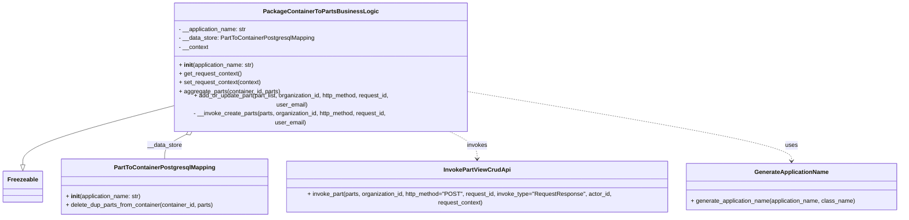

# Diagram: partview_core/partview_service/partview_service/core/business/part/PackageContainerToPartsBusinessLogic.py

> Auto-generated by Obscura crawlers

## Mermaid

### SVG

<svg id="container" width="2450.484375" xmlns="http://www.w3.org/2000/svg" class="classDiagram" height="552" viewBox="0 0 2450.484375 552" role="graphics-document document" aria-roledescription="class"><g><defs><marker id="container_class-aggregationStart" class="marker aggregation class" refX="18" refY="7" markerWidth="190" markerHeight="240" orient="auto"><path d="M 18,7 L9,13 L1,7 L9,1 Z"></path></marker></defs><defs><marker id="container_class-aggregationEnd" class="marker aggregation class" refX="1" refY="7" markerWidth="20" markerHeight="28" orient="auto"><path d="M 18,7 L9,13 L1,7 L9,1 Z"></path></marker></defs><defs><marker id="container_class-extensionStart" class="marker extension class" refX="18" refY="7" markerWidth="190" markerHeight="240" orient="auto"><path d="M 1,7 L18,13 V 1 Z"></path></marker></defs><defs><marker id="container_class-extensionEnd" class="marker extension class" refX="1" refY="7" markerWidth="20" markerHeight="28" orient="auto"><path d="M 1,1 V 13 L18,7 Z"></path></marker></defs><defs><marker id="container_class-compositionStart" class="marker composition class" refX="18" refY="7" markerWidth="190" markerHeight="240" orient="auto"><path d="M 18,7 L9,13 L1,7 L9,1 Z"></path></marker></defs><defs><marker id="container_class-compositionEnd" class="marker composition class" refX="1" refY="7" markerWidth="20" markerHeight="28" orient="auto"><path d="M 18,7 L9,13 L1,7 L9,1 Z"></path></marker></defs><defs><marker id="container_class-dependencyStart" class="marker dependency class" refX="6" refY="7" markerWidth="190" markerHeight="240" orient="auto"><path d="M 5,7 L9,13 L1,7 L9,1 Z"></path></marker></defs><defs><marker id="container_class-dependencyEnd" class="marker dependency class" refX="13" refY="7" markerWidth="20" markerHeight="28" orient="auto"><path d="M 18,7 L9,13 L14,7 L9,1 Z"></path></marker></defs><defs><marker id="container_class-lollipopStart" class="marker lollipop class" refX="13" refY="7" markerWidth="190" markerHeight="240" orient="auto"><circle stroke="black" fill="transparent" cx="7" cy="7" r="6"></circle></marker></defs><defs><marker id="container_class-lollipopEnd" class="marker lollipop class" refX="1" refY="7" markerWidth="190" markerHeight="240" orient="auto"><circle stroke="black" fill="transparent" cx="7" cy="7" r="6"></circle></marker></defs><g class="root"><g class="clusters"></g><g class="edgePaths"><path d="M470.576,258.871L402.013,275.225C333.449,291.58,196.322,324.29,127.759,349.437C59.195,374.583,59.195,392.167,59.195,400.958L59.195,409.75" id="id_PackageContainerToPartsBusinessLogic_Freezeable_1" class="edge-thickness-normal edge-pattern-solid relation" style=";;;" data-edge="true" data-et="edge" data-id="id_PackageContainerToPartsBusinessLogic_Freezeable_1" data-points="W3sieCI6NDcwLjU3NjE3MTg3NSwieSI6MjU4Ljg3MDU0MjM0MTg2ODI2fSx7IngiOjU5LjE5NTMxMjUsInkiOjM1N30seyJ4Ijo1OS4xOTUzMTI1LCJ5Ijo0Mjd9XQ==" marker-end="url(#container_class-extensionEnd)"></path><path d="M506.085,327.082L495.011,332.068C483.936,337.055,461.786,347.027,450.712,358.18C439.637,369.333,439.637,381.667,439.637,387.833L439.637,394" id="id_PackageContainerToPartsBusinessLogic_PartToContainerPostgresqlMapping_2" class="edge-thickness-normal edge-pattern-solid relation" style=";;;" data-edge="true" data-et="edge" data-id="id_PackageContainerToPartsBusinessLogic_PartToContainerPostgresqlMapping_2" data-points="W3sieCI6NTIxLjgxNDcxNjI0MDI4NSwieSI6MzIwfSx7IngiOjQzOS42MzY3MTg3NSwieSI6MzU3fSx7IngiOjQzOS42MzY3MTg3NSwieSI6Mzk0fV0=" marker-start="url(#container_class-aggregationStart)"></path><path d="M1214.775,320L1228.471,326.167C1242.168,332.333,1269.56,344.667,1283.257,358C1296.953,371.333,1296.953,385.667,1296.953,392.833L1296.953,400" id="id_PackageContainerToPartsBusinessLogic_InvokePartViewCrudApi_3" class="edge-thickness-normal edge-pattern-dashed relation" style=";;;" data-edge="true" data-et="edge" data-id="id_PackageContainerToPartsBusinessLogic_InvokePartViewCrudApi_3" data-points="W3sieCI6MTIxNC43NzUxMjc1MDk3MTUsInkiOjMyMH0seyJ4IjoxMjk2Ljk1MzEyNSwieSI6MzU3fSx7IngiOjEyOTYuOTUzMTI1LCJ5Ijo0MDZ9XQ==" marker-end="url(#container_class-dependencyEnd)"></path><path d="M1266.014,223.482L1414.804,245.735C1563.594,267.988,1861.174,312.494,2009.964,341.914C2158.754,371.333,2158.754,385.667,2158.754,392.833L2158.754,400" id="id_PackageContainerToPartsBusinessLogic_GenerateApplicationName_4" class="edge-thickness-normal edge-pattern-dashed relation" style=";;;" data-edge="true" data-et="edge" data-id="id_PackageContainerToPartsBusinessLogic_GenerateApplicationName_4" data-points="W3sieCI6MTI2Ni4wMTM2NzE4NzUsInkiOjIyMy40ODI0OTM5NjQ4NzE0fSx7IngiOjIxNTguNzUzOTA2MjUsInkiOjM1N30seyJ4IjoyMTU4Ljc1MzkwNjI1LCJ5Ijo0MDZ9XQ==" marker-end="url(#container_class-dependencyEnd)"></path></g><g class="edgeLabels"><g class="edgeLabel"><g class="label" data-id="id_PackageContainerToPartsBusinessLogic_Freezeable_1" transform="translate(0, 0)"><foreignObject width="0" height="0">

</foreignObject></g></g><g class="edgeLabel" transform="translate(439.63671875, 357)"><g class="label" data-id="id_PackageContainerToPartsBusinessLogic_PartToContainerPostgresqlMapping_2" transform="translate(-46.9453125, -12)"><foreignObject width="93.890625" height="24">

__data_store

</foreignObject></g></g><g class="edgeLabel" transform="translate(1296.953125, 357)"><g class="label" data-id="id_PackageContainerToPartsBusinessLogic_InvokePartViewCrudApi_3" transform="translate(-27.5859375, -12)"><foreignObject width="55.171875" height="24">

invokes

</foreignObject></g></g><g class="edgeLabel" transform="translate(2158.75390625, 357)"><g class="label" data-id="id_PackageContainerToPartsBusinessLogic_GenerateApplicationName_4" transform="translate(-16.4921875, -12)"><foreignObject width="32.984375" height="24">

uses

</foreignObject></g></g></g><g class="nodes"><g class="node default" id="classId-Freezeable-0" transform="translate(59.1953125, 469)"><g class="basic label-container"><path d="M-51.1953125 -42 L51.1953125 -42 L51.1953125 42 L-51.1953125 42" stroke="none" stroke-width="0" fill="#ECECFF" style=""></path><path d="M-51.1953125 -42 C-21.345267366749166 -42, 8.504777766501668 -42, 51.1953125 -42 M-51.1953125 -42 C-25.128000159705152 -42, 0.9393121805896953 -42, 51.1953125 -42 M51.1953125 -42 C51.1953125 -17.59472596789752, 51.1953125 6.8105480642049585, 51.1953125 42 M51.1953125 -42 C51.1953125 -18.634824555390086, 51.1953125 4.730350889219828, 51.1953125 42 M51.1953125 42 C12.242082990830141 42, -26.711146518339717 42, -51.1953125 42 M51.1953125 42 C26.655663244258612 42, 2.116013988517224 42, -51.1953125 42 M-51.1953125 42 C-51.1953125 20.39408367119938, -51.1953125 -1.2118326576012421, -51.1953125 -42 M-51.1953125 42 C-51.1953125 18.032323505726158, -51.1953125 -5.935352988547685, -51.1953125 -42" stroke="#9370DB" stroke-width="1.3" fill="none" stroke-dasharray="0 0" style=""></path></g><g class="annotation-group text" transform="translate(0, -18)"></g><g class="label-group text" transform="translate(-39.1953125, -18)"><g class="label" style="font-weight: bolder" transform="translate(0,-12)"><foreignObject width="78.390625" height="24">

Freezeable

</foreignObject></g></g><g class="members-group text" transform="translate(-39.1953125, 30)"></g><g class="methods-group text" transform="translate(-39.1953125, 60)"></g><g class="divider" style=""><path d="M-51.1953125 6 C-29.9426904679084 6, -8.690068435816798 6, 51.1953125 6 M-51.1953125 6 C-10.913229249857906 6, 29.368854000284188 6, 51.1953125 6" stroke="#9370DB" stroke-width="1.3" fill="none" stroke-dasharray="0 0" style=""></path></g><g class="divider" style=""><path d="M-51.1953125 24 C-24.567420034255935 24, 2.0604724314881295 24, 51.1953125 24 M-51.1953125 24 C-17.33531300061621 24, 16.52468649876758 24, 51.1953125 24" stroke="#9370DB" stroke-width="1.3" fill="none" stroke-dasharray="0 0" style=""></path></g></g><g class="node default" id="classId-PackageContainerToPartsBusinessLogic-1" transform="translate(868.294921875, 164)"><g class="basic label-container"><path d="M-397.71875 -156 L397.71875 -156 L397.71875 156 L-397.71875 156" stroke="none" stroke-width="0" fill="#ECECFF" style=""></path><path d="M-397.71875 -156 C-175.00155019880222 -156, 47.71564960239556 -156, 397.71875 -156 M-397.71875 -156 C-224.85603996377185 -156, -51.9933299275437 -156, 397.71875 -156 M397.71875 -156 C397.71875 -45.19453460984158, 397.71875 65.61093078031683, 397.71875 156 M397.71875 -156 C397.71875 -80.96221428718746, 397.71875 -5.924428574374929, 397.71875 156 M397.71875 156 C138.95995059279295 156, -119.7988488144141 156, -397.71875 156 M397.71875 156 C175.6669975262023 156, -46.38475494759541 156, -397.71875 156 M-397.71875 156 C-397.71875 58.08376935950335, -397.71875 -39.8324612809933, -397.71875 -156 M-397.71875 156 C-397.71875 36.54401294723, -397.71875 -82.91197410554, -397.71875 -156" stroke="#9370DB" stroke-width="1.3" fill="none" stroke-dasharray="0 0" style=""></path></g><g class="annotation-group text" transform="translate(0, -132)"></g><g class="label-group text" transform="translate(-144.34375, -132)"><g class="label" style="font-weight: bolder" transform="translate(0,-12)"><foreignObject width="288.6875" height="24">

PackageContainerToPartsBusinessLogic

</foreignObject></g></g><g class="members-group text" transform="translate(-385.71875, -84)"><g class="label" style="" transform="translate(0,-12)"><foreignObject width="185.296875" height="24">

- __application_name: str

</foreignObject></g><g class="label" style="" transform="translate(0,12)"><foreignObject width="366.984375" height="24">

- __data_store: PartToContainerPostgresqlMapping

</foreignObject></g><g class="label" style="" transform="translate(0,36)"><foreignObject width="80.546875" height="24">

- __context

</foreignObject></g></g><g class="methods-group text" transform="translate(-385.71875, 12)"><g class="label" style="" transform="translate(0,-12)"><foreignObject width="205.5" height="24">

+ <strong>init</strong>(application_name: str)

</foreignObject></g><g class="label" style="" transform="translate(0,12)"><foreignObject width="170.4375" height="24">

+ get_request_context()

</foreignObject></g><g class="label" style="" transform="translate(0,36)"><foreignObject width="223.546875" height="24">

+ set_request_context(context)

</foreignObject></g><g class="label" style="" transform="translate(0,60)"><foreignObject width="274.515625" height="24">

+ aggregate_parts(container_id, parts)

</foreignObject></g><g class="label" style="" transform="translate(0,84)"><foreignObject width="627.09375" height="24">

+ add_or_update_part(part_list, organization_id, http_method, request_id, user_email)

</foreignObject></g><g class="label" style="" transform="translate(0,108)"><foreignObject width="617.125" height="24">

- __invoke_create_parts(parts, organization_id, http_method, request_id, user_email)

</foreignObject></g></g><g class="divider" style=""><path d="M-397.71875 -108 C-123.56469122199474 -108, 150.58936755601053 -108, 397.71875 -108 M-397.71875 -108 C-146.4726853166691 -108, 104.7733793666618 -108, 397.71875 -108" stroke="#9370DB" stroke-width="1.3" fill="none" stroke-dasharray="0 0" style=""></path></g><g class="divider" style=""><path d="M-397.71875 -12 C-134.88923067520204 -12, 127.94028864959591 -12, 397.71875 -12 M-397.71875 -12 C-156.09074135633122 -12, 85.53726728733756 -12, 397.71875 -12" stroke="#9370DB" stroke-width="1.3" fill="none" stroke-dasharray="0 0" style=""></path></g></g><g class="node default" id="classId-PartToContainerPostgresqlMapping-2" transform="translate(439.63671875, 469)"><g class="basic label-container"><path d="M-279.24609375 -75 L279.24609375 -75 L279.24609375 75 L-279.24609375 75" stroke="none" stroke-width="0" fill="#ECECFF" style=""></path><path d="M-279.24609375 -75 C-158.14287695905057 -75, -37.039660168101165 -75, 279.24609375 -75 M-279.24609375 -75 C-160.39482141134255 -75, -41.54354907268507 -75, 279.24609375 -75 M279.24609375 -75 C279.24609375 -17.076502584407685, 279.24609375 40.84699483118463, 279.24609375 75 M279.24609375 -75 C279.24609375 -38.47263252068788, 279.24609375 -1.9452650413757624, 279.24609375 75 M279.24609375 75 C83.53899652218064 75, -112.16810070563872 75, -279.24609375 75 M279.24609375 75 C126.83605166919367 75, -25.57399041161267 75, -279.24609375 75 M-279.24609375 75 C-279.24609375 31.602745567050313, -279.24609375 -11.794508865899374, -279.24609375 -75 M-279.24609375 75 C-279.24609375 24.64989609293898, -279.24609375 -25.700207814122038, -279.24609375 -75" stroke="#9370DB" stroke-width="1.3" fill="none" stroke-dasharray="0 0" style=""></path></g><g class="annotation-group text" transform="translate(0, -51)"></g><g class="label-group text" transform="translate(-129.6171875, -51)"><g class="label" style="font-weight: bolder" transform="translate(0,-12)"><foreignObject width="259.234375" height="24">

PartToContainerPostgresqlMapping

</foreignObject></g></g><g class="members-group text" transform="translate(-267.24609375, -3)"></g><g class="methods-group text" transform="translate(-267.24609375, 27)"><g class="label" style="" transform="translate(0,-12)"><foreignObject width="205.5" height="24">

+ <strong>init</strong>(application_name: str)

</foreignObject></g><g class="label" style="" transform="translate(0,12)"><foreignObject width="404.875" height="24">

+ delete_dup_parts_from_container(container_id, parts)

</foreignObject></g></g><g class="divider" style=""><path d="M-279.24609375 -27 C-127.61156060432208 -27, 24.02297254135584 -27, 279.24609375 -27 M-279.24609375 -27 C-124.71854494604167 -27, 29.80900385791665 -27, 279.24609375 -27" stroke="#9370DB" stroke-width="1.3" fill="none" stroke-dasharray="0 0" style=""></path></g><g class="divider" style=""><path d="M-279.24609375 -3 C-124.65535636540207 -3, 29.93538101919586 -3, 279.24609375 -3 M-279.24609375 -3 C-103.3680065284494 -3, 72.5100806931012 -3, 279.24609375 -3" stroke="#9370DB" stroke-width="1.3" fill="none" stroke-dasharray="0 0" style=""></path></g></g><g class="node default" id="classId-InvokePartViewCrudApi-3" transform="translate(1296.953125, 469)"><g class="basic label-container"><path d="M-528.0703125 -63 L528.0703125 -63 L528.0703125 63 L-528.0703125 63" stroke="none" stroke-width="0" fill="#ECECFF" style=""></path><path d="M-528.0703125 -63 C-232.55940707344996 -63, 62.95149835310008 -63, 528.0703125 -63 M-528.0703125 -63 C-215.11130981820446 -63, 97.84769286359108 -63, 528.0703125 -63 M528.0703125 -63 C528.0703125 -26.617503357658514, 528.0703125 9.764993284682973, 528.0703125 63 M528.0703125 -63 C528.0703125 -12.972222213997433, 528.0703125 37.05555557200513, 528.0703125 63 M528.0703125 63 C221.846712859842 63, -84.376886780316 63, -528.0703125 63 M528.0703125 63 C242.81588087169763 63, -42.43855075660474 63, -528.0703125 63 M-528.0703125 63 C-528.0703125 22.00769526083343, -528.0703125 -18.98460947833314, -528.0703125 -63 M-528.0703125 63 C-528.0703125 25.851676548088975, -528.0703125 -11.296646903822051, -528.0703125 -63" stroke="#9370DB" stroke-width="1.3" fill="none" stroke-dasharray="0 0" style=""></path></g><g class="annotation-group text" transform="translate(0, -39)"></g><g class="label-group text" transform="translate(-85.484375, -39)"><g class="label" style="font-weight: bolder" transform="translate(0,-12)"><foreignObject width="170.96875" height="24">

InvokePartViewCrudApi

</foreignObject></g></g><g class="members-group text" transform="translate(-516.0703125, 9)"></g><g class="methods-group text" transform="translate(-516.0703125, 39)"><g class="label" style="" transform="translate(0,-12)"><foreignObject width="946.65625" height="24">

+ invoke_part(parts, organization_id, http_method="POST", request_id, invoke_type="RequestResponse", actor_id, request_context)

</foreignObject></g></g><g class="divider" style=""><path d="M-528.0703125 -15 C-155.61829530015916 -15, 216.83372189968168 -15, 528.0703125 -15 M-528.0703125 -15 C-165.44029451443402 -15, 197.18972347113197 -15, 528.0703125 -15" stroke="#9370DB" stroke-width="1.3" fill="none" stroke-dasharray="0 0" style=""></path></g><g class="divider" style=""><path d="M-528.0703125 9 C-310.10950996078736 9, -92.14870742157473 9, 528.0703125 9 M-528.0703125 9 C-249.87535325898682 9, 28.31960598202636 9, 528.0703125 9" stroke="#9370DB" stroke-width="1.3" fill="none" stroke-dasharray="0 0" style=""></path></g></g><g class="node default" id="classId-GenerateApplicationName-4" transform="translate(2158.75390625, 469)"><g class="basic label-container"><path d="M-283.73046875 -63 L283.73046875 -63 L283.73046875 63 L-283.73046875 63" stroke="none" stroke-width="0" fill="#ECECFF" style=""></path><path d="M-283.73046875 -63 C-87.65233811766029 -63, 108.42579251467942 -63, 283.73046875 -63 M-283.73046875 -63 C-138.043949389669 -63, 7.642569970662009 -63, 283.73046875 -63 M283.73046875 -63 C283.73046875 -15.84199600474534, 283.73046875 31.31600799050932, 283.73046875 63 M283.73046875 -63 C283.73046875 -35.965644847991534, 283.73046875 -8.931289695983068, 283.73046875 63 M283.73046875 63 C60.925169389434984 63, -161.88012997113003 63, -283.73046875 63 M283.73046875 63 C153.9703791405305 63, 24.210289531060994 63, -283.73046875 63 M-283.73046875 63 C-283.73046875 34.069068222813, -283.73046875 5.138136445625996, -283.73046875 -63 M-283.73046875 63 C-283.73046875 25.766600269308512, -283.73046875 -11.466799461382976, -283.73046875 -63" stroke="#9370DB" stroke-width="1.3" fill="none" stroke-dasharray="0 0" style=""></path></g><g class="annotation-group text" transform="translate(0, -39)"></g><g class="label-group text" transform="translate(-95.8203125, -39)"><g class="label" style="font-weight: bolder" transform="translate(0,-12)"><foreignObject width="191.640625" height="24">

GenerateApplicationName

</foreignObject></g></g><g class="members-group text" transform="translate(-271.73046875, 9)"></g><g class="methods-group text" transform="translate(-271.73046875, 39)"><g class="label" style="" transform="translate(0,-12)"><foreignObject width="447.640625" height="24">

+ generate_application_name(application_name, class_name)

</foreignObject></g></g><g class="divider" style=""><path d="M-283.73046875 -15 C-153.77378328473117 -15, -23.817097819462333 -15, 283.73046875 -15 M-283.73046875 -15 C-77.61813578728214 -15, 128.49419717543572 -15, 283.73046875 -15" stroke="#9370DB" stroke-width="1.3" fill="none" stroke-dasharray="0 0" style=""></path></g><g class="divider" style=""><path d="M-283.73046875 9 C-92.24511702962221 9, 99.24023469075559 9, 283.73046875 9 M-283.73046875 9 C-95.6720540375895 9, 92.38636067482099 9, 283.73046875 9" stroke="#9370DB" stroke-width="1.3" fill="none" stroke-dasharray="0 0" style=""></path></g></g></g></g></g></svg>
