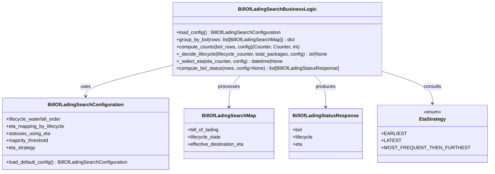

# Diagram: partview_core/partview_service/partview_service/core/business/trip_leg/BillOfLadingSearchBusinessLogic.py


> Auto-generated by Obscura crawlers

## Diagram 1



### SVG

<svg id="container" width="1573" xmlns="http://www.w3.org/2000/svg" class="classDiagram" height="576" viewBox="0 0 1573 576" role="graphics-document document" aria-roledescription="class"><style>#container{font-family:"trebuchet ms",verdana,arial,sans-serif;font-size:16px;fill:#333;}@keyframes edge-animation-frame{from{stroke-dashoffset:0;}}@keyframes dash{to{stroke-dashoffset:0;}}#container .edge-animation-slow{stroke-dasharray:9,5!important;stroke-dashoffset:900;animation:dash 50s linear infinite;stroke-linecap:round;}#container .edge-animation-fast{stroke-dasharray:9,5!important;stroke-dashoffset:900;animation:dash 20s linear infinite;stroke-linecap:round;}#container .error-icon{fill:#552222;}#container .error-text{fill:#552222;stroke:#552222;}#container .edge-thickness-normal{stroke-width:1px;}#container .edge-thickness-thick{stroke-width:3.5px;}#container .edge-pattern-solid{stroke-dasharray:0;}#container .edge-thickness-invisible{stroke-width:0;fill:none;}#container .edge-pattern-dashed{stroke-dasharray:3;}#container .edge-pattern-dotted{stroke-dasharray:2;}#container .marker{fill:#333333;stroke:#333333;}#container .marker.cross{stroke:#333333;}#container svg{font-family:"trebuchet ms",verdana,arial,sans-serif;font-size:16px;}#container p{margin:0;}#container g.classGroup text{fill:#9370DB;stroke:none;font-family:"trebuchet ms",verdana,arial,sans-serif;font-size:10px;}#container g.classGroup text .title{font-weight:bolder;}#container .nodeLabel,#container .edgeLabel{color:#131300;}#container .edgeLabel .label rect{fill:#ECECFF;}#container .label text{fill:#131300;}#container .labelBkg{background:#ECECFF;}#container .edgeLabel .label span{background:#ECECFF;}#container .classTitle{font-weight:bolder;}#container .node rect,#container .node circle,#container .node ellipse,#container .node polygon,#container .node path{fill:#ECECFF;stroke:#9370DB;stroke-width:1px;}#container .divider{stroke:#9370DB;stroke-width:1;}#container g.clickable{cursor:pointer;}#container g.classGroup rect{fill:#ECECFF;stroke:#9370DB;}#container g.classGroup line{stroke:#9370DB;stroke-width:1;}#container .classLabel .box{stroke:none;stroke-width:0;fill:#ECECFF;opacity:0.5;}#container .classLabel .label{fill:#9370DB;font-size:10px;}#container .relation{stroke:#333333;stroke-width:1;fill:none;}#container .dashed-line{stroke-dasharray:3;}#container .dotted-line{stroke-dasharray:1 2;}#container #compositionStart,#container .composition{fill:#333333!important;stroke:#333333!important;stroke-width:1;}#container #compositionEnd,#container .composition{fill:#333333!important;stroke:#333333!important;stroke-width:1;}#container #dependencyStart,#container .dependency{fill:#333333!important;stroke:#333333!important;stroke-width:1;}#container #dependencyStart,#container .dependency{fill:#333333!important;stroke:#333333!important;stroke-width:1;}#container #extensionStart,#container .extension{fill:transparent!important;stroke:#333333!important;stroke-width:1;}#container #extensionEnd,#container .extension{fill:transparent!important;stroke:#333333!important;stroke-width:1;}#container #aggregationStart,#container .aggregation{fill:transparent!important;stroke:#333333!important;stroke-width:1;}#container #aggregationEnd,#container .aggregation{fill:transparent!important;stroke:#333333!important;stroke-width:1;}#container #lollipopStart,#container .lollipop{fill:#ECECFF!important;stroke:#333333!important;stroke-width:1;}#container #lollipopEnd,#container .lollipop{fill:#ECECFF!important;stroke:#333333!important;stroke-width:1;}#container .edgeTerminals{font-size:11px;line-height:initial;}#container .classTitleText{text-anchor:middle;font-size:18px;fill:#333;}#container .label-icon{display:inline-block;height:1em;overflow:visible;vertical-align:-0.125em;}#container .node .label-icon path{fill:currentColor;stroke:revert;stroke-width:revert;}#container :root{--mermaid-font-family:"trebuchet ms",verdana,arial,sans-serif;}</style><g><defs><marker id="container_class-aggregationStart" class="marker aggregation class" refX="18" refY="7" markerWidth="190" markerHeight="240" orient="auto"><path d="M 18,7 L9,13 L1,7 L9,1 Z"></path></marker></defs><defs><marker id="container_class-aggregationEnd" class="marker aggregation class" refX="1" refY="7" markerWidth="20" markerHeight="28" orient="auto"><path d="M 18,7 L9,13 L1,7 L9,1 Z"></path></marker></defs><defs><marker id="container_class-extensionStart" class="marker extension class" refX="18" refY="7" markerWidth="190" markerHeight="240" orient="auto"><path d="M 1,7 L18,13 V 1 Z"></path></marker></defs><defs><marker id="container_class-extensionEnd" class="marker extension class" refX="1" refY="7" markerWidth="20" markerHeight="28" orient="auto"><path d="M 1,1 V 13 L18,7 Z"></path></marker></defs><defs><marker id="container_class-compositionStart" class="marker composition class" refX="18" refY="7" markerWidth="190" markerHeight="240" orient="auto"><path d="M 18,7 L9,13 L1,7 L9,1 Z"></path></marker></defs><defs><marker id="container_class-compositionEnd" class="marker composition class" refX="1" refY="7" markerWidth="20" markerHeight="28" orient="auto"><path d="M 18,7 L9,13 L1,7 L9,1 Z"></path></marker></defs><defs><marker id="container_class-dependencyStart" class="marker dependency class" refX="6" refY="7" markerWidth="190" markerHeight="240" orient="auto"><path d="M 5,7 L9,13 L1,7 L9,1 Z"></path></marker></defs><defs><marker id="container_class-dependencyEnd" class="marker dependency class" refX="13" refY="7" markerWidth="20" markerHeight="28" orient="auto"><path d="M 18,7 L9,13 L14,7 L9,1 Z"></path></marker></defs><defs><marker id="container_class-lollipopStart" class="marker lollipop class" refX="13" refY="7" markerWidth="190" markerHeight="240" orient="auto"><circle stroke="black" fill="transparent" cx="7" cy="7" r="6"></circle></marker></defs><defs><marker id="container_class-lollipopEnd" class="marker lollipop class" refX="1" refY="7" markerWidth="190" markerHeight="240" orient="auto"><circle stroke="black" fill="transparent" cx="7" cy="7" r="6"></circle></marker></defs><g class="root"><g class="clusters"></g><g class="edgePaths"><path d="M572.188,218.256L524.104,230.38C476.021,242.504,379.854,266.752,331.771,284.043C283.688,301.333,283.688,311.667,283.688,316.833L283.688,322" id="id_BillOfLadingSearchBusinessLogic_BillOfLadingSearchConfiguration_1" class="edge-thickness-normal edge-pattern-solid relation" style=";;;" data-edge="true" data-et="edge" data-id="id_BillOfLadingSearchBusinessLogic_BillOfLadingSearchConfiguration_1" data-points="W3sieCI6NTcyLjE4NzUsInkiOjIxOC4yNTU2MjQ5ODA3NjI3Mn0seyJ4IjoyODMuNjg3NSwieSI6MjkxfSx7IngiOjI4My42ODc1LCJ5IjozMjh9XQ==" marker-end="url(#container_class-dependencyEnd)"></path><path d="M796.623,254L790.525,260.167C784.428,266.333,772.234,278.667,766.136,296C760.039,313.333,760.039,335.667,760.039,346.833L760.039,358" id="id_BillOfLadingSearchBusinessLogic_BillOfLadingSearchMap_2" class="edge-thickness-normal edge-pattern-solid relation" style=";;;" data-edge="true" data-et="edge" data-id="id_BillOfLadingSearchBusinessLogic_BillOfLadingSearchMap_2" data-points="W3sieCI6Nzk2LjYyMjYzMTgzNTkzNzUsInkiOjI1NH0seyJ4Ijo3NjAuMDM5MDYyNSwieSI6MjkxfSx7IngiOjc2MC4wMzkwNjI1LCJ5IjozNjR9XQ==" marker-end="url(#container_class-dependencyEnd)"></path><path d="M1039.854,254L1045.951,260.167C1052.048,266.333,1064.243,278.667,1070.34,296C1076.438,313.333,1076.438,335.667,1076.438,346.833L1076.438,358" id="id_BillOfLadingSearchBusinessLogic_BillOfLadingStatusResponse_3" class="edge-thickness-normal edge-pattern-solid relation" style=";;;" data-edge="true" data-et="edge" data-id="id_BillOfLadingSearchBusinessLogic_BillOfLadingStatusResponse_3" data-points="W3sieCI6MTAzOS44NTM5MzA2NjQwNjI1LCJ5IjoyNTR9LHsieCI6MTA3Ni40Mzc1LCJ5IjoyOTF9LHsieCI6MTA3Ni40Mzc1LCJ5IjozNjR9XQ==" marker-end="url(#container_class-dependencyEnd)"></path><path d="M1264.289,245.079L1287.505,252.733C1310.721,260.386,1357.154,275.693,1380.37,292.513C1403.586,309.333,1403.586,327.667,1403.586,336.833L1403.586,346" id="id_BillOfLadingSearchBusinessLogic_EtaStrategy_4" class="edge-thickness-normal edge-pattern-solid relation" style=";;;" data-edge="true" data-et="edge" data-id="id_BillOfLadingSearchBusinessLogic_EtaStrategy_4" data-points="W3sieCI6MTI2NC4yODkwNjI1LCJ5IjoyNDUuMDc5MzA4NDg1MzgwMTh9LHsieCI6MTQwMy41ODU5Mzc1LCJ5IjoyOTF9LHsieCI6MTQwMy41ODU5Mzc1LCJ5IjozNTJ9XQ==" marker-end="url(#container_class-dependencyEnd)"></path></g><g class="edgeLabels"><g class="edgeLabel" transform="translate(283.6875, 291)"><g class="label" data-id="id_BillOfLadingSearchBusinessLogic_BillOfLadingSearchConfiguration_1" transform="translate(-16.4921875, -12)"><foreignObject width="32.984375" height="24"><div xmlns="http://www.w3.org/1999/xhtml" class="labelBkg" style="display: table-cell; white-space: nowrap; line-height: 1.5; max-width: 200px; text-align: center;"><span class="edgeLabel"><p>uses</p></span></div></foreignObject></g></g><g class="edgeLabel" transform="translate(760.0390625, 291)"><g class="label" data-id="id_BillOfLadingSearchBusinessLogic_BillOfLadingSearchMap_2" transform="translate(-35.7890625, -12)"><foreignObject width="71.578125" height="24"><div xmlns="http://www.w3.org/1999/xhtml" class="labelBkg" style="display: table-cell; white-space: nowrap; line-height: 1.5; max-width: 200px; text-align: center;"><span class="edgeLabel"><p>processes</p></span></div></foreignObject></g></g><g class="edgeLabel" transform="translate(1076.4375, 291)"><g class="label" data-id="id_BillOfLadingSearchBusinessLogic_BillOfLadingStatusResponse_3" transform="translate(-33.4765625, -12)"><foreignObject width="66.953125" height="24"><div xmlns="http://www.w3.org/1999/xhtml" class="labelBkg" style="display: table-cell; white-space: nowrap; line-height: 1.5; max-width: 200px; text-align: center;"><span class="edgeLabel"><p>produces</p></span></div></foreignObject></g></g><g class="edgeLabel" transform="translate(1403.5859375, 291)"><g class="label" data-id="id_BillOfLadingSearchBusinessLogic_EtaStrategy_4" transform="translate(-30.390625, -12)"><foreignObject width="60.78125" height="24"><div xmlns="http://www.w3.org/1999/xhtml" class="labelBkg" style="display: table-cell; white-space: nowrap; line-height: 1.5; max-width: 200px; text-align: center;"><span class="edgeLabel"><p>consults</p></span></div></foreignObject></g></g></g><g class="nodes"><g class="node default" id="classId-BillOfLadingSearchBusinessLogic-0" transform="translate(918.23828125, 131)"><g class="basic label-container"><path d="M-346.05078125 -123 L346.05078125 -123 L346.05078125 123 L-346.05078125 123" stroke="none" stroke-width="0" fill="#ECECFF" style=""></path><path d="M-346.05078125 -123 C-71.21646158384402 -123, 203.61785808231195 -123, 346.05078125 -123 M-346.05078125 -123 C-205.30920188056118 -123, -64.56762251112235 -123, 346.05078125 -123 M346.05078125 -123 C346.05078125 -63.763429082879675, 346.05078125 -4.52685816575935, 346.05078125 123 M346.05078125 -123 C346.05078125 -55.12053243084391, 346.05078125 12.758935138312182, 346.05078125 123 M346.05078125 123 C176.71461532644548 123, 7.378449402890965 123, -346.05078125 123 M346.05078125 123 C136.55199666046448 123, -72.94678792907104 123, -346.05078125 123 M-346.05078125 123 C-346.05078125 46.93270906942227, -346.05078125 -29.134581861155453, -346.05078125 -123 M-346.05078125 123 C-346.05078125 43.96431233335208, -346.05078125 -35.07137533329583, -346.05078125 -123" stroke="#9370DB" stroke-width="1.3" fill="none" stroke-dasharray="0 0" style=""></path></g><g class="annotation-group text" transform="translate(0, -99)"></g><g class="label-group text" transform="translate(-120.9296875, -99)"><g class="label" style="font-weight: bolder" transform="translate(0,-12)"><foreignObject width="241.859375" height="24"><div xmlns="http://www.w3.org/1999/xhtml" style="display: table-cell; white-space: nowrap; line-height: 1.5; max-width: 289px; text-align: center;"><span class="nodeLabel markdown-node-label" style=""><p>BillOfLadingSearchBusinessLogic</p></span></div></foreignObject></g></g><g class="members-group text" transform="translate(-334.05078125, -51)"></g><g class="methods-group text" transform="translate(-334.05078125, -21)"><g class="label" style="" transform="translate(0,-12)"><foreignObject width="348.71875" height="24"><div xmlns="http://www.w3.org/1999/xhtml" style="display: table-cell; white-space: nowrap; line-height: 1.5; max-width: 406px; text-align: center;"><span class="nodeLabel markdown-node-label" style=""><p>+load_config() : BillOfLadingSearchConfiguration</p></span></div></foreignObject></g><g class="label" style="" transform="translate(0,12)"><foreignObject width="399.5625" height="24"><div xmlns="http://www.w3.org/1999/xhtml" style="display: table-cell; white-space: nowrap; line-height: 1.5; max-width: 457px; text-align: center;"><span class="nodeLabel markdown-node-label" style=""><p>+group_by_bol(rows: list[BillOfLadingSearchMap]) : dict</p></span></div></foreignObject></g><g class="label" style="" transform="translate(0,36)"><foreignObject width="413.4375" height="24"><div xmlns="http://www.w3.org/1999/xhtml" style="display: table-cell; white-space: nowrap; line-height: 1.5; max-width: 471px; text-align: center;"><span class="nodeLabel markdown-node-label" style=""><p>+compute_counts(bol_rows, config)(Counter, Counter, int)</p></span></div></foreignObject></g><g class="label" style="" transform="translate(0,60)"><foreignObject width="507.78125" height="24"><div xmlns="http://www.w3.org/1999/xhtml" style="display: table-cell; white-space: nowrap; line-height: 1.5; max-width: 565px; text-align: center;"><span class="nodeLabel markdown-node-label" style=""><p>+_decide_lifecycle(lifecycle_counter, total_packages, config) : str|None</p></span></div></foreignObject></g><g class="label" style="" transform="translate(0,84)"><foreignObject width="359.0625" height="24"><div xmlns="http://www.w3.org/1999/xhtml" style="display: table-cell; white-space: nowrap; line-height: 1.5; max-width: 416px; text-align: center;"><span class="nodeLabel markdown-node-label" style=""><p>+_select_eta(eta_counter, config) : datetime|None</p></span></div></foreignObject></g><g class="label" style="" transform="translate(0,108)"><foreignObject width="547.171875" height="24"><div xmlns="http://www.w3.org/1999/xhtml" style="display: table-cell; white-space: nowrap; line-height: 1.5; max-width: 605px; text-align: center;"><span class="nodeLabel markdown-node-label" style=""><p>+compute_bol_status(rows, config=None) : list[BillOfLadingStatusResponse]</p></span></div></foreignObject></g></g><g class="divider" style=""><path d="M-346.05078125 -75 C-82.07836401094676 -75, 181.8940532281065 -75, 346.05078125 -75 M-346.05078125 -75 C-97.48504544691599 -75, 151.08069035616802 -75, 346.05078125 -75" stroke="#9370DB" stroke-width="1.3" fill="none" stroke-dasharray="0 0" style=""></path></g><g class="divider" style=""><path d="M-346.05078125 -51 C-207.07841850715485 -51, -68.1060557643097 -51, 346.05078125 -51 M-346.05078125 -51 C-104.3549998656616 -51, 137.3407815186768 -51, 346.05078125 -51" stroke="#9370DB" stroke-width="1.3" fill="none" stroke-dasharray="0 0" style=""></path></g></g><g class="node default" id="classId-BillOfLadingSearchConfiguration-1" transform="translate(283.6875, 448)"><g class="basic label-container"><path d="M-275.6875 -120 L275.6875 -120 L275.6875 120 L-275.6875 120" stroke="none" stroke-width="0" fill="#ECECFF" style=""></path><path d="M-275.6875 -120 C-133.22985777640574 -120, 9.227784447188526 -120, 275.6875 -120 M-275.6875 -120 C-147.6145566697707 -120, -19.541613339541414 -120, 275.6875 -120 M275.6875 -120 C275.6875 -48.65413256188819, 275.6875 22.69173487622362, 275.6875 120 M275.6875 -120 C275.6875 -37.773616080081396, 275.6875 44.45276783983721, 275.6875 120 M275.6875 120 C149.06629322833896 120, 22.445086456677956 120, -275.6875 120 M275.6875 120 C121.22527655065934 120, -33.23694689868131 120, -275.6875 120 M-275.6875 120 C-275.6875 63.74741993074003, -275.6875 7.4948398614800595, -275.6875 -120 M-275.6875 120 C-275.6875 49.320568001369836, -275.6875 -21.35886399726033, -275.6875 -120" stroke="#9370DB" stroke-width="1.3" fill="none" stroke-dasharray="0 0" style=""></path></g><g class="annotation-group text" transform="translate(0, -96)"></g><g class="label-group text" transform="translate(-118.890625, -96)"><g class="label" style="font-weight: bolder" transform="translate(0,-12)"><foreignObject width="237.78125" height="24"><div xmlns="http://www.w3.org/1999/xhtml" style="display: table-cell; white-space: nowrap; line-height: 1.5; max-width: 284px; text-align: center;"><span class="nodeLabel markdown-node-label" style=""><p>BillOfLadingSearchConfiguration</p></span></div></foreignObject></g></g><g class="members-group text" transform="translate(-263.6875, -48)"><g class="label" style="" transform="translate(0,-12)"><foreignObject width="186.078125" height="24"><div xmlns="http://www.w3.org/1999/xhtml" style="display: table-cell; white-space: nowrap; line-height: 1.5; max-width: 244px; text-align: center;"><span class="nodeLabel markdown-node-label" style=""><p>+lifecycle_waterfall_order</p></span></div></foreignObject></g><g class="label" style="" transform="translate(0,12)"><foreignObject width="195.953125" height="24"><div xmlns="http://www.w3.org/1999/xhtml" style="display: table-cell; white-space: nowrap; line-height: 1.5; max-width: 253px; text-align: center;"><span class="nodeLabel markdown-node-label" style=""><p>+eta_mapping_by_lifecycle</p></span></div></foreignObject></g><g class="label" style="" transform="translate(0,36)"><foreignObject width="146.40625" height="24"><div xmlns="http://www.w3.org/1999/xhtml" style="display: table-cell; white-space: nowrap; line-height: 1.5; max-width: 204px; text-align: center;"><span class="nodeLabel markdown-node-label" style=""><p>+statuses_using_eta</p></span></div></foreignObject></g><g class="label" style="" transform="translate(0,60)"><foreignObject width="145.78125" height="24"><div xmlns="http://www.w3.org/1999/xhtml" style="display: table-cell; white-space: nowrap; line-height: 1.5; max-width: 203px; text-align: center;"><span class="nodeLabel markdown-node-label" style=""><p>+majority_threshold</p></span></div></foreignObject></g><g class="label" style="" transform="translate(0,84)"><foreignObject width="97.421875" height="24"><div xmlns="http://www.w3.org/1999/xhtml" style="display: table-cell; white-space: nowrap; line-height: 1.5; max-width: 155px; text-align: center;"><span class="nodeLabel markdown-node-label" style=""><p>+eta_strategy</p></span></div></foreignObject></g></g><g class="methods-group text" transform="translate(-263.6875, 96)"><g class="label" style="" transform="translate(0,-12)"><foreignObject width="408.484375" height="24"><div xmlns="http://www.w3.org/1999/xhtml" style="display: table-cell; white-space: nowrap; line-height: 1.5; max-width: 466px; text-align: center;"><span class="nodeLabel markdown-node-label" style=""><p>+load_default_config() : BillOfLadingSearchConfiguration</p></span></div></foreignObject></g></g><g class="divider" style=""><path d="M-275.6875 -72 C-85.32605977734514 -72, 105.03538044530973 -72, 275.6875 -72 M-275.6875 -72 C-135.7699053980512 -72, 4.147689203897585 -72, 275.6875 -72" stroke="#9370DB" stroke-width="1.3" fill="none" stroke-dasharray="0 0" style=""></path></g><g class="divider" style=""><path d="M-275.6875 72 C-99.11620335667433 72, 77.45509328665133 72, 275.6875 72 M-275.6875 72 C-160.7085625803823 72, -45.72962516076461 72, 275.6875 72" stroke="#9370DB" stroke-width="1.3" fill="none" stroke-dasharray="0 0" style=""></path></g></g><g class="node default" id="classId-BillOfLadingSearchMap-2" transform="translate(760.0390625, 448)"><g class="basic label-container"><path d="M-150.6640625 -84 L150.6640625 -84 L150.6640625 84 L-150.6640625 84" stroke="none" stroke-width="0" fill="#ECECFF" style=""></path><path d="M-150.6640625 -84 C-51.478263102628844 -84, 47.70753629474231 -84, 150.6640625 -84 M-150.6640625 -84 C-49.88784774696933 -84, 50.888367006061344 -84, 150.6640625 -84 M150.6640625 -84 C150.6640625 -50.10165111973855, 150.6640625 -16.203302239477097, 150.6640625 84 M150.6640625 -84 C150.6640625 -44.65454968500987, 150.6640625 -5.309099370019737, 150.6640625 84 M150.6640625 84 C61.72697755593117 84, -27.210107388137658 84, -150.6640625 84 M150.6640625 84 C73.31392173483138 84, -4.036219030337236 84, -150.6640625 84 M-150.6640625 84 C-150.6640625 26.759769172399714, -150.6640625 -30.48046165520057, -150.6640625 -84 M-150.6640625 84 C-150.6640625 42.93078021884524, -150.6640625 1.8615604376904855, -150.6640625 -84" stroke="#9370DB" stroke-width="1.3" fill="none" stroke-dasharray="0 0" style=""></path></g><g class="annotation-group text" transform="translate(0, -60)"></g><g class="label-group text" transform="translate(-84.96875, -60)"><g class="label" style="font-weight: bolder" transform="translate(0,-12)"><foreignObject width="169.9375" height="24"><div xmlns="http://www.w3.org/1999/xhtml" style="display: table-cell; white-space: nowrap; line-height: 1.5; max-width: 218px; text-align: center;"><span class="nodeLabel markdown-node-label" style=""><p>BillOfLadingSearchMap</p></span></div></foreignObject></g></g><g class="members-group text" transform="translate(-138.6640625, -12)"><g class="label" style="" transform="translate(0,-12)"><foreignObject width="106.859375" height="24"><div xmlns="http://www.w3.org/1999/xhtml" style="display: table-cell; white-space: nowrap; line-height: 1.5; max-width: 165px; text-align: center;"><span class="nodeLabel markdown-node-label" style=""><p>+bill_of_lading</p></span></div></foreignObject></g><g class="label" style="" transform="translate(0,12)"><foreignObject width="111.640625" height="24"><div xmlns="http://www.w3.org/1999/xhtml" style="display: table-cell; white-space: nowrap; line-height: 1.5; max-width: 169px; text-align: center;"><span class="nodeLabel markdown-node-label" style=""><p>+lifecycle_state</p></span></div></foreignObject></g><g class="label" style="" transform="translate(0,36)"><foreignObject width="192.359375" height="24"><div xmlns="http://www.w3.org/1999/xhtml" style="display: table-cell; white-space: nowrap; line-height: 1.5; max-width: 250px; text-align: center;"><span class="nodeLabel markdown-node-label" style=""><p>+effective_destination_eta</p></span></div></foreignObject></g></g><g class="methods-group text" transform="translate(-138.6640625, 84)"></g><g class="divider" style=""><path d="M-150.6640625 -36 C-32.22225420897769 -36, 86.21955408204462 -36, 150.6640625 -36 M-150.6640625 -36 C-73.13045444291035 -36, 4.403153614179303 -36, 150.6640625 -36" stroke="#9370DB" stroke-width="1.3" fill="none" stroke-dasharray="0 0" style=""></path></g><g class="divider" style=""><path d="M-150.6640625 60 C-35.41911901604087 60, 79.82582446791827 60, 150.6640625 60 M-150.6640625 60 C-38.04471964613836 60, 74.57462320772328 60, 150.6640625 60" stroke="#9370DB" stroke-width="1.3" fill="none" stroke-dasharray="0 0" style=""></path></g></g><g class="node default" id="classId-BillOfLadingStatusResponse-3" transform="translate(1076.4375, 448)"><g class="basic label-container"><path d="M-115.734375 -84 L115.734375 -84 L115.734375 84 L-115.734375 84" stroke="none" stroke-width="0" fill="#ECECFF" style=""></path><path d="M-115.734375 -84 C-64.35696523955698 -84, -12.97955547911397 -84, 115.734375 -84 M-115.734375 -84 C-56.35281793793824 -84, 3.0287391241235184 -84, 115.734375 -84 M115.734375 -84 C115.734375 -31.600004869189277, 115.734375 20.799990261621446, 115.734375 84 M115.734375 -84 C115.734375 -23.201177399684283, 115.734375 37.59764520063143, 115.734375 84 M115.734375 84 C30.352355218761318 84, -55.029664562477365 84, -115.734375 84 M115.734375 84 C60.16197297523734 84, 4.5895709504746804 84, -115.734375 84 M-115.734375 84 C-115.734375 19.97029518503767, -115.734375 -44.05940962992466, -115.734375 -84 M-115.734375 84 C-115.734375 48.39087127244073, -115.734375 12.781742544881453, -115.734375 -84" stroke="#9370DB" stroke-width="1.3" fill="none" stroke-dasharray="0 0" style=""></path></g><g class="annotation-group text" transform="translate(0, -60)"></g><g class="label-group text" transform="translate(-103.734375, -60)"><g class="label" style="font-weight: bolder" transform="translate(0,-12)"><foreignObject width="207.46875" height="24"><div xmlns="http://www.w3.org/1999/xhtml" style="display: table-cell; white-space: nowrap; line-height: 1.5; max-width: 254px; text-align: center;"><span class="nodeLabel markdown-node-label" style=""><p>BillOfLadingStatusResponse</p></span></div></foreignObject></g></g><g class="members-group text" transform="translate(-103.734375, -12)"><g class="label" style="" transform="translate(0,-12)"><foreignObject width="31.53125" height="24"><div xmlns="http://www.w3.org/1999/xhtml" style="display: table-cell; white-space: nowrap; line-height: 1.5; max-width: 89px; text-align: center;"><span class="nodeLabel markdown-node-label" style=""><p>+bol</p></span></div></foreignObject></g><g class="label" style="" transform="translate(0,12)"><foreignObject width="67.546875" height="24"><div xmlns="http://www.w3.org/1999/xhtml" style="display: table-cell; white-space: nowrap; line-height: 1.5; max-width: 125px; text-align: center;"><span class="nodeLabel markdown-node-label" style=""><p>+lifecycle</p></span></div></foreignObject></g><g class="label" style="" transform="translate(0,36)"><foreignObject width="31.078125" height="24"><div xmlns="http://www.w3.org/1999/xhtml" style="display: table-cell; white-space: nowrap; line-height: 1.5; max-width: 88px; text-align: center;"><span class="nodeLabel markdown-node-label" style=""><p>+eta</p></span></div></foreignObject></g></g><g class="methods-group text" transform="translate(-103.734375, 84)"></g><g class="divider" style=""><path d="M-115.734375 -36 C-43.26223259093153 -36, 29.209909818136936 -36, 115.734375 -36 M-115.734375 -36 C-34.712876263656014 -36, 46.30862247268797 -36, 115.734375 -36" stroke="#9370DB" stroke-width="1.3" fill="none" stroke-dasharray="0 0" style=""></path></g><g class="divider" style=""><path d="M-115.734375 60 C-40.27898093615302 60, 35.17641312769396 60, 115.734375 60 M-115.734375 60 C-52.711704517703005 60, 10.31096596459399 60, 115.734375 60" stroke="#9370DB" stroke-width="1.3" fill="none" stroke-dasharray="0 0" style=""></path></g></g><g class="node default" id="classId-EtaStrategy-4" transform="translate(1403.5859375, 448)"><g class="basic label-container"><path d="M-161.4140625 -96 L161.4140625 -96 L161.4140625 96 L-161.4140625 96" stroke="none" stroke-width="0" fill="#ECECFF" style=""></path><path d="M-161.4140625 -96 C-41.529811099362846 -96, 78.35444030127431 -96, 161.4140625 -96 M-161.4140625 -96 C-55.89473157577315 -96, 49.6245993484537 -96, 161.4140625 -96 M161.4140625 -96 C161.4140625 -19.649247777562067, 161.4140625 56.701504444875866, 161.4140625 96 M161.4140625 -96 C161.4140625 -45.166475255102846, 161.4140625 5.667049489794309, 161.4140625 96 M161.4140625 96 C94.80609348296389 96, 28.198124465927776 96, -161.4140625 96 M161.4140625 96 C45.76736608181973 96, -69.87933033636054 96, -161.4140625 96 M-161.4140625 96 C-161.4140625 41.88047655879518, -161.4140625 -12.239046882409639, -161.4140625 -96 M-161.4140625 96 C-161.4140625 36.64380653526685, -161.4140625 -22.712386929466305, -161.4140625 -96" stroke="#9370DB" stroke-width="1.3" fill="none" stroke-dasharray="0 0" style=""></path></g><g class="annotation-group text" transform="translate(-29.53125, -72)"><g class="label" style="" transform="translate(0,-12)"><foreignObject width="59.0625" height="24"><div xmlns="http://www.w3.org/1999/xhtml" style="display: table-cell; white-space: nowrap; line-height: 1.5; max-width: 109px; text-align: center;"><span class="nodeLabel markdown-node-label" style=""><p>«enum»</p></span></div></foreignObject></g></g><g class="label-group text" transform="translate(-42.328125, -48)"><g class="label" style="font-weight: bolder" transform="translate(0,-12)"><foreignObject width="84.65625" height="24"><div xmlns="http://www.w3.org/1999/xhtml" style="display: table-cell; white-space: nowrap; line-height: 1.5; max-width: 132px; text-align: center;"><span class="nodeLabel markdown-node-label" style=""><p>EtaStrategy</p></span></div></foreignObject></g></g><g class="members-group text" transform="translate(-149.4140625, 0)"><g class="label" style="" transform="translate(0,-12)"><foreignObject width="73.125" height="24"><div xmlns="http://www.w3.org/1999/xhtml" style="display: table-cell; white-space: nowrap; line-height: 1.5; max-width: 131px; text-align: center;"><span class="nodeLabel markdown-node-label" style=""><p>+EARLIEST</p></span></div></foreignObject></g><g class="label" style="" transform="translate(0,12)"><foreignObject width="57.640625" height="24"><div xmlns="http://www.w3.org/1999/xhtml" style="display: table-cell; white-space: nowrap; line-height: 1.5; max-width: 116px; text-align: center;"><span class="nodeLabel markdown-node-label" style=""><p>+LATEST</p></span></div></foreignObject></g><g class="label" style="" transform="translate(0,36)"><foreignObject width="256.5" height="24"><div xmlns="http://www.w3.org/1999/xhtml" style="display: table-cell; white-space: nowrap; line-height: 1.5; max-width: 315px; text-align: center;"><span class="nodeLabel markdown-node-label" style=""><p>+MOST_FREQUENT_THEN_FURTHEST</p></span></div></foreignObject></g></g><g class="methods-group text" transform="translate(-149.4140625, 96)"></g><g class="divider" style=""><path d="M-161.4140625 -24 C-64.7069950909617 -24, 32.000072318076604 -24, 161.4140625 -24 M-161.4140625 -24 C-86.86387982019065 -24, -12.313697140381294 -24, 161.4140625 -24" stroke="#9370DB" stroke-width="1.3" fill="none" stroke-dasharray="0 0" style=""></path></g><g class="divider" style=""><path d="M-161.4140625 72 C-69.68339830581746 72, 22.047265888365075 72, 161.4140625 72 M-161.4140625 72 C-40.5799201609029 72, 80.2542221781942 72, 161.4140625 72" stroke="#9370DB" stroke-width="1.3" fill="none" stroke-dasharray="0 0" style=""></path></g></g></g></g></g></svg>

## Diagram 2

```mermaid
flowchart TD
    A[Start: compute_bol_status(rows, config?)] --> B{config provided?}
    B -- no --> C[load_config()]
    B -- yes --> D[use provided config]
    C --> E[group_by_bol(rows) -> grouped_by_bol]
    D --> E
    E --> F[for each bol_number, bol_rows]
    F --> G[compute_counts(bol_rows, final_config)]
    G --> H[_decide_lifecycle(lifecycle_counter, total, final_config)]
    H --> I{lifecycle in statuses_using_eta?}
    I -- yes --> J[_select_eta(eta_counter, final_config)]
    I -- no --> K[use eta_mapping_by_lifecycle.get(lifecycle)]
    J --> L[create BillOfLadingStatusResponse(bol, lifecycle, eta)]
    K --> L
    L --> M[append to results]
    M --> N{more BOLs?}
    N -- yes --> F
    N -- no --> O[return results]
    O --> P[End]
```

> SVG rendering failed for this diagram.
