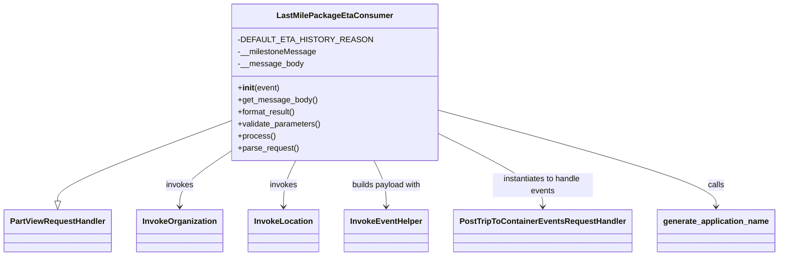

# Diagram: partview_core/partview_service/partview_service/core/business/trip_leg/LastMilePackageEtaConsumer.py


> Auto-generated by Obscura crawlers

## Diagram 1



### SVG

<svg id="container" width="1503.71875" xmlns="http://www.w3.org/2000/svg" class="classDiagram" height="510" viewBox="0 0 1503.71875 510" role="graphics-document document" aria-roledescription="class"><style>#container{font-family:"trebuchet ms",verdana,arial,sans-serif;font-size:16px;fill:#333;}@keyframes edge-animation-frame{from{stroke-dashoffset:0;}}@keyframes dash{to{stroke-dashoffset:0;}}#container .edge-animation-slow{stroke-dasharray:9,5!important;stroke-dashoffset:900;animation:dash 50s linear infinite;stroke-linecap:round;}#container .edge-animation-fast{stroke-dasharray:9,5!important;stroke-dashoffset:900;animation:dash 20s linear infinite;stroke-linecap:round;}#container .error-icon{fill:#552222;}#container .error-text{fill:#552222;stroke:#552222;}#container .edge-thickness-normal{stroke-width:1px;}#container .edge-thickness-thick{stroke-width:3.5px;}#container .edge-pattern-solid{stroke-dasharray:0;}#container .edge-thickness-invisible{stroke-width:0;fill:none;}#container .edge-pattern-dashed{stroke-dasharray:3;}#container .edge-pattern-dotted{stroke-dasharray:2;}#container .marker{fill:#333333;stroke:#333333;}#container .marker.cross{stroke:#333333;}#container svg{font-family:"trebuchet ms",verdana,arial,sans-serif;font-size:16px;}#container p{margin:0;}#container g.classGroup text{fill:#9370DB;stroke:none;font-family:"trebuchet ms",verdana,arial,sans-serif;font-size:10px;}#container g.classGroup text .title{font-weight:bolder;}#container .nodeLabel,#container .edgeLabel{color:#131300;}#container .edgeLabel .label rect{fill:#ECECFF;}#container .label text{fill:#131300;}#container .labelBkg{background:#ECECFF;}#container .edgeLabel .label span{background:#ECECFF;}#container .classTitle{font-weight:bolder;}#container .node rect,#container .node circle,#container .node ellipse,#container .node polygon,#container .node path{fill:#ECECFF;stroke:#9370DB;stroke-width:1px;}#container .divider{stroke:#9370DB;stroke-width:1;}#container g.clickable{cursor:pointer;}#container g.classGroup rect{fill:#ECECFF;stroke:#9370DB;}#container g.classGroup line{stroke:#9370DB;stroke-width:1;}#container .classLabel .box{stroke:none;stroke-width:0;fill:#ECECFF;opacity:0.5;}#container .classLabel .label{fill:#9370DB;font-size:10px;}#container .relation{stroke:#333333;stroke-width:1;fill:none;}#container .dashed-line{stroke-dasharray:3;}#container .dotted-line{stroke-dasharray:1 2;}#container #compositionStart,#container .composition{fill:#333333!important;stroke:#333333!important;stroke-width:1;}#container #compositionEnd,#container .composition{fill:#333333!important;stroke:#333333!important;stroke-width:1;}#container #dependencyStart,#container .dependency{fill:#333333!important;stroke:#333333!important;stroke-width:1;}#container #dependencyStart,#container .dependency{fill:#333333!important;stroke:#333333!important;stroke-width:1;}#container #extensionStart,#container .extension{fill:transparent!important;stroke:#333333!important;stroke-width:1;}#container #extensionEnd,#container .extension{fill:transparent!important;stroke:#333333!important;stroke-width:1;}#container #aggregationStart,#container .aggregation{fill:transparent!important;stroke:#333333!important;stroke-width:1;}#container #aggregationEnd,#container .aggregation{fill:transparent!important;stroke:#333333!important;stroke-width:1;}#container #lollipopStart,#container .lollipop{fill:#ECECFF!important;stroke:#333333!important;stroke-width:1;}#container #lollipopEnd,#container .lollipop{fill:#ECECFF!important;stroke:#333333!important;stroke-width:1;}#container .edgeTerminals{font-size:11px;line-height:initial;}#container .classTitleText{text-anchor:middle;font-size:18px;fill:#333;}#container .label-icon{display:inline-block;height:1em;overflow:visible;vertical-align:-0.125em;}#container .node .label-icon path{fill:currentColor;stroke:revert;stroke-width:revert;}#container :root{--mermaid-font-family:"trebuchet ms",verdana,arial,sans-serif;}</style><g><defs><marker id="container_class-aggregationStart" class="marker aggregation class" refX="18" refY="7" markerWidth="190" markerHeight="240" orient="auto"><path d="M 18,7 L9,13 L1,7 L9,1 Z"></path></marker></defs><defs><marker id="container_class-aggregationEnd" class="marker aggregation class" refX="1" refY="7" markerWidth="20" markerHeight="28" orient="auto"><path d="M 18,7 L9,13 L1,7 L9,1 Z"></path></marker></defs><defs><marker id="container_class-extensionStart" class="marker extension class" refX="18" refY="7" markerWidth="190" markerHeight="240" orient="auto"><path d="M 1,7 L18,13 V 1 Z"></path></marker></defs><defs><marker id="container_class-extensionEnd" class="marker extension class" refX="1" refY="7" markerWidth="20" markerHeight="28" orient="auto"><path d="M 1,1 V 13 L18,7 Z"></path></marker></defs><defs><marker id="container_class-compositionStart" class="marker composition class" refX="18" refY="7" markerWidth="190" markerHeight="240" orient="auto"><path d="M 18,7 L9,13 L1,7 L9,1 Z"></path></marker></defs><defs><marker id="container_class-compositionEnd" class="marker composition class" refX="1" refY="7" markerWidth="20" markerHeight="28" orient="auto"><path d="M 18,7 L9,13 L1,7 L9,1 Z"></path></marker></defs><defs><marker id="container_class-dependencyStart" class="marker dependency class" refX="6" refY="7" markerWidth="190" markerHeight="240" orient="auto"><path d="M 5,7 L9,13 L1,7 L9,1 Z"></path></marker></defs><defs><marker id="container_class-dependencyEnd" class="marker dependency class" refX="13" refY="7" markerWidth="20" markerHeight="28" orient="auto"><path d="M 18,7 L9,13 L14,7 L9,1 Z"></path></marker></defs><defs><marker id="container_class-lollipopStart" class="marker lollipop class" refX="13" refY="7" markerWidth="190" markerHeight="240" orient="auto"><circle stroke="black" fill="transparent" cx="7" cy="7" r="6"></circle></marker></defs><defs><marker id="container_class-lollipopEnd" class="marker lollipop class" refX="1" refY="7" markerWidth="190" markerHeight="240" orient="auto"><circle stroke="black" fill="transparent" cx="7" cy="7" r="6"></circle></marker></defs><g class="root"><g class="clusters"></g><g class="edgePaths"><path d="M464.746,233.982L405.848,256.485C346.951,278.988,229.155,323.994,170.257,351.789C111.359,379.583,111.359,390.167,111.359,395.458L111.359,400.75" id="id_LastMilePackageEtaConsumer_PartViewRequestHandler_1" class="edge-thickness-normal edge-pattern-solid relation" style=";;;" data-edge="true" data-et="edge" data-id="id_LastMilePackageEtaConsumer_PartViewRequestHandler_1" data-points="W3sieCI6NDY0Ljc0NjA5Mzc1LCJ5IjoyMzMuOTgxNTA4MDQxMDkwMDJ9LHsieCI6MTExLjM1OTM3NSwieSI6MzY5fSx7IngiOjExMS4zNTkzNzUsInkiOjQxOH1d" marker-end="url(#container_class-extensionEnd)"></path><path d="M464.746,289.102L445.249,302.418C425.753,315.735,386.759,342.367,367.262,362.85C347.766,383.333,347.766,397.667,347.766,404.833L347.766,412" id="id_LastMilePackageEtaConsumer_InvokeOrganization_2" class="edge-thickness-normal edge-pattern-solid relation" style=";;;" data-edge="true" data-et="edge" data-id="id_LastMilePackageEtaConsumer_InvokeOrganization_2" data-points="W3sieCI6NDY0Ljc0NjA5Mzc1LCJ5IjoyODkuMTAxODM4OTU3NzkzOH0seyJ4IjozNDcuNzY1NjI1LCJ5IjozNjl9LHsieCI6MzQ3Ljc2NTYyNSwieSI6NDE4fV0=" marker-end="url(#container_class-dependencyEnd)"></path><path d="M572.273,320L568.314,328.167C564.354,336.333,556.435,352.667,552.475,368C548.516,383.333,548.516,397.667,548.516,404.833L548.516,412" id="id_LastMilePackageEtaConsumer_InvokeLocation_3" class="edge-thickness-normal edge-pattern-solid relation" style=";;;" data-edge="true" data-et="edge" data-id="id_LastMilePackageEtaConsumer_InvokeLocation_3" data-points="W3sieCI6NTcyLjI3MzM0MjIyNTYwOTgsInkiOjMyMH0seyJ4Ijo1NDguNTE1NjI1LCJ5IjozNjl9LHsieCI6NTQ4LjUxNTYyNSwieSI6NDE4fV0=" marker-end="url(#container_class-dependencyEnd)"></path><path d="M723.547,320L727.507,328.167C731.466,336.333,739.385,352.667,743.345,368C747.305,383.333,747.305,397.667,747.305,404.833L747.305,412" id="id_LastMilePackageEtaConsumer_InvokeEventHelper_4" class="edge-thickness-normal edge-pattern-solid relation" style=";;;" data-edge="true" data-et="edge" data-id="id_LastMilePackageEtaConsumer_InvokeEventHelper_4" data-points="W3sieCI6NzIzLjU0Njk3MDI3NDM5MDIsInkiOjMyMH0seyJ4Ijo3NDcuMzA0Njg3NSwieSI6MzY5fSx7IngiOjc0Ny4zMDQ2ODc1LCJ5Ijo0MTh9XQ==" marker-end="url(#container_class-dependencyEnd)"></path><path d="M831.074,257.807L867.26,276.339C903.445,294.871,975.816,331.936,1012.002,357.634C1048.188,383.333,1048.188,397.667,1048.188,404.833L1048.188,412" id="id_LastMilePackageEtaConsumer_PostTripToContainerEventsRequestHandler_5" class="edge-thickness-normal edge-pattern-solid relation" style=";;;" data-edge="true" data-et="edge" data-id="id_LastMilePackageEtaConsumer_PostTripToContainerEventsRequestHandler_5" data-points="W3sieCI6ODMxLjA3NDIxODc1LCJ5IjoyNTcuODA2NTQwMzg3MDM2M30seyJ4IjoxMDQ4LjE4NzUsInkiOjM2OX0seyJ4IjoxMDQ4LjE4NzUsInkiOjQxOH1d" marker-end="url(#container_class-dependencyEnd)"></path><path d="M831.074,215.16L922.87,240.8C1014.667,266.44,1198.259,317.72,1290.055,350.527C1381.852,383.333,1381.852,397.667,1381.852,404.833L1381.852,412" id="id_LastMilePackageEtaConsumer_generate_application_name_6" class="edge-thickness-normal edge-pattern-solid relation" style=";;;" data-edge="true" data-et="edge" data-id="id_LastMilePackageEtaConsumer_generate_application_name_6" data-points="W3sieCI6ODMxLjA3NDIxODc1LCJ5IjoyMTUuMTYwMjU5NTE0OTI2Mzd9LHsieCI6MTM4MS44NTE1NjI1LCJ5IjozNjl9LHsieCI6MTM4MS44NTE1NjI1LCJ5Ijo0MTh9XQ==" marker-end="url(#container_class-dependencyEnd)"></path></g><g class="edgeLabels"><g class="edgeLabel"><g class="label" data-id="id_LastMilePackageEtaConsumer_PartViewRequestHandler_1" transform="translate(0, 0)"><foreignObject width="0" height="0"><div xmlns="http://www.w3.org/1999/xhtml" class="labelBkg" style="display: table-cell; white-space: nowrap; line-height: 1.5; max-width: 200px; text-align: center;"><span class="edgeLabel"></span></div></foreignObject></g></g><g class="edgeLabel" transform="translate(347.765625, 369)"><g class="label" data-id="id_LastMilePackageEtaConsumer_InvokeOrganization_2" transform="translate(-27.5859375, -12)"><foreignObject width="55.171875" height="24"><div xmlns="http://www.w3.org/1999/xhtml" class="labelBkg" style="display: table-cell; white-space: nowrap; line-height: 1.5; max-width: 200px; text-align: center;"><span class="edgeLabel"><p>invokes</p></span></div></foreignObject></g></g><g class="edgeLabel" transform="translate(548.515625, 369)"><g class="label" data-id="id_LastMilePackageEtaConsumer_InvokeLocation_3" transform="translate(-27.5859375, -12)"><foreignObject width="55.171875" height="24"><div xmlns="http://www.w3.org/1999/xhtml" class="labelBkg" style="display: table-cell; white-space: nowrap; line-height: 1.5; max-width: 200px; text-align: center;"><span class="edgeLabel"><p>invokes</p></span></div></foreignObject></g></g><g class="edgeLabel" transform="translate(747.3046875, 369)"><g class="label" data-id="id_LastMilePackageEtaConsumer_InvokeEventHelper_4" transform="translate(-71.171875, -12)"><foreignObject width="142.34375" height="24"><div xmlns="http://www.w3.org/1999/xhtml" class="labelBkg" style="display: table-cell; white-space: nowrap; line-height: 1.5; max-width: 200px; text-align: center;"><span class="edgeLabel"><p>builds payload with</p></span></div></foreignObject></g></g><g class="edgeLabel" transform="translate(1048.1875, 369)"><g class="label" data-id="id_LastMilePackageEtaConsumer_PostTripToContainerEventsRequestHandler_5" transform="translate(-100, -24)"><foreignObject width="200" height="48"><div xmlns="http://www.w3.org/1999/xhtml" class="labelBkg" style="display: table; white-space: break-spaces; line-height: 1.5; max-width: 200px; text-align: center; width: 200px;"><span class="edgeLabel"><p>instantiates to handle events</p></span></div></foreignObject></g></g><g class="edgeLabel" transform="translate(1381.8515625, 369)"><g class="label" data-id="id_LastMilePackageEtaConsumer_generate_application_name_6" transform="translate(-16.4453125, -12)"><foreignObject width="32.890625" height="24"><div xmlns="http://www.w3.org/1999/xhtml" class="labelBkg" style="display: table-cell; white-space: nowrap; line-height: 1.5; max-width: 200px; text-align: center;"><span class="edgeLabel"><p>calls</p></span></div></foreignObject></g></g></g><g class="nodes"><g class="node default" id="classId-LastMilePackageEtaConsumer-0" transform="translate(647.91015625, 164)"><g class="basic label-container"><path d="M-183.1640625 -156 L183.1640625 -156 L183.1640625 156 L-183.1640625 156" stroke="none" stroke-width="0" fill="#ECECFF" style=""></path><path d="M-183.1640625 -156 C-64.28054975659259 -156, 54.602962986814816 -156, 183.1640625 -156 M-183.1640625 -156 C-104.65817567899067 -156, -26.152288857981347 -156, 183.1640625 -156 M183.1640625 -156 C183.1640625 -89.9701856725696, 183.1640625 -23.940371345139198, 183.1640625 156 M183.1640625 -156 C183.1640625 -56.4274974548665, 183.1640625 43.145005090267006, 183.1640625 156 M183.1640625 156 C97.54150283197409 156, 11.918943163948171 156, -183.1640625 156 M183.1640625 156 C70.93229938216446 156, -41.29946373567108 156, -183.1640625 156 M-183.1640625 156 C-183.1640625 64.82301014813646, -183.1640625 -26.353979703727077, -183.1640625 -156 M-183.1640625 156 C-183.1640625 48.96290795793436, -183.1640625 -58.074184084131275, -183.1640625 -156" stroke="#9370DB" stroke-width="1.3" fill="none" stroke-dasharray="0 0" style=""></path></g><g class="annotation-group text" transform="translate(0, -132)"></g><g class="label-group text" transform="translate(-108.421875, -132)"><g class="label" style="font-weight: bolder" transform="translate(0,-12)"><foreignObject width="216.84375" height="24"><div xmlns="http://www.w3.org/1999/xhtml" style="display: table-cell; white-space: nowrap; line-height: 1.5; max-width: 264px; text-align: center;"><span class="nodeLabel markdown-node-label" style=""><p>LastMilePackageEtaConsumer</p></span></div></foreignObject></g></g><g class="members-group text" transform="translate(-171.1640625, -84)"><g class="label" style="" transform="translate(0,-12)"><foreignObject width="233.90625" height="24"><div xmlns="http://www.w3.org/1999/xhtml" style="display: table-cell; white-space: nowrap; line-height: 1.5; max-width: 291px; text-align: center;"><span class="nodeLabel markdown-node-label" style=""><p>-DEFAULT_ETA_HISTORY_REASON</p></span></div></foreignObject></g><g class="label" style="" transform="translate(0,12)"><foreignObject width="154.78125" height="24"><div xmlns="http://www.w3.org/1999/xhtml" style="display: table-cell; white-space: nowrap; line-height: 1.5; max-width: 212px; text-align: center;"><span class="nodeLabel markdown-node-label" style=""><p>-__milestoneMessage</p></span></div></foreignObject></g><g class="label" style="" transform="translate(0,36)"><foreignObject width="128.328125" height="24"><div xmlns="http://www.w3.org/1999/xhtml" style="display: table-cell; white-space: nowrap; line-height: 1.5; max-width: 186px; text-align: center;"><span class="nodeLabel markdown-node-label" style=""><p>-__message_body</p></span></div></foreignObject></g></g><g class="methods-group text" transform="translate(-171.1640625, 12)"><g class="label" style="" transform="translate(0,-12)"><foreignObject width="83.140625" height="24"><div xmlns="http://www.w3.org/1999/xhtml" style="display: table-cell; white-space: nowrap; line-height: 1.5; max-width: 172px; text-align: center;"><span class="nodeLabel markdown-node-label" style=""><p>+<strong>init</strong>(event)</p></span></div></foreignObject></g><g class="label" style="" transform="translate(0,12)"><foreignObject width="155.90625" height="24"><div xmlns="http://www.w3.org/1999/xhtml" style="display: table-cell; white-space: nowrap; line-height: 1.5; max-width: 213px; text-align: center;"><span class="nodeLabel markdown-node-label" style=""><p>+get_message_body()</p></span></div></foreignObject></g><g class="label" style="" transform="translate(0,36)"><foreignObject width="117.015625" height="24"><div xmlns="http://www.w3.org/1999/xhtml" style="display: table-cell; white-space: nowrap; line-height: 1.5; max-width: 174px; text-align: center;"><span class="nodeLabel markdown-node-label" style=""><p>+format_result()</p></span></div></foreignObject></g><g class="label" style="" transform="translate(0,60)"><foreignObject width="166.546875" height="24"><div xmlns="http://www.w3.org/1999/xhtml" style="display: table-cell; white-space: nowrap; line-height: 1.5; max-width: 224px; text-align: center;"><span class="nodeLabel markdown-node-label" style=""><p>+validate_parameters()</p></span></div></foreignObject></g><g class="label" style="" transform="translate(0,84)"><foreignObject width="73.734375" height="24"><div xmlns="http://www.w3.org/1999/xhtml" style="display: table-cell; white-space: nowrap; line-height: 1.5; max-width: 131px; text-align: center;"><span class="nodeLabel markdown-node-label" style=""><p>+process()</p></span></div></foreignObject></g><g class="label" style="" transform="translate(0,108)"><foreignObject width="121.796875" height="24"><div xmlns="http://www.w3.org/1999/xhtml" style="display: table-cell; white-space: nowrap; line-height: 1.5; max-width: 179px; text-align: center;"><span class="nodeLabel markdown-node-label" style=""><p>+parse_request()</p></span></div></foreignObject></g></g><g class="divider" style=""><path d="M-183.1640625 -108 C-82.0335133584132 -108, 19.097035783173595 -108, 183.1640625 -108 M-183.1640625 -108 C-96.83325825338513 -108, -10.50245400677025 -108, 183.1640625 -108" stroke="#9370DB" stroke-width="1.3" fill="none" stroke-dasharray="0 0" style=""></path></g><g class="divider" style=""><path d="M-183.1640625 -12 C-55.0716213813717 -12, 73.0208197372566 -12, 183.1640625 -12 M-183.1640625 -12 C-59.81295341733285 -12, 63.5381556653343 -12, 183.1640625 -12" stroke="#9370DB" stroke-width="1.3" fill="none" stroke-dasharray="0 0" style=""></path></g></g><g class="node default" id="classId-PartViewRequestHandler-1" transform="translate(111.359375, 460)"><g class="basic label-container"><path d="M-103.359375 -42 L103.359375 -42 L103.359375 42 L-103.359375 42" stroke="none" stroke-width="0" fill="#ECECFF" style=""></path><path d="M-103.359375 -42 C-42.59661016558261 -42, 18.16615466883478 -42, 103.359375 -42 M-103.359375 -42 C-34.842763179307155 -42, 33.67384864138569 -42, 103.359375 -42 M103.359375 -42 C103.359375 -14.390092521859078, 103.359375 13.219814956281844, 103.359375 42 M103.359375 -42 C103.359375 -17.994557267677845, 103.359375 6.010885464644311, 103.359375 42 M103.359375 42 C54.48184907066126 42, 5.604323141322524 42, -103.359375 42 M103.359375 42 C44.75945307244818 42, -13.840468855103637 42, -103.359375 42 M-103.359375 42 C-103.359375 24.258980427899388, -103.359375 6.517960855798776, -103.359375 -42 M-103.359375 42 C-103.359375 17.688805920558988, -103.359375 -6.622388158882025, -103.359375 -42" stroke="#9370DB" stroke-width="1.3" fill="none" stroke-dasharray="0 0" style=""></path></g><g class="annotation-group text" transform="translate(0, -18)"></g><g class="label-group text" transform="translate(-91.359375, -18)"><g class="label" style="font-weight: bolder" transform="translate(0,-12)"><foreignObject width="182.71875" height="24"><div xmlns="http://www.w3.org/1999/xhtml" style="display: table-cell; white-space: nowrap; line-height: 1.5; max-width: 231px; text-align: center;"><span class="nodeLabel markdown-node-label" style=""><p>PartViewRequestHandler</p></span></div></foreignObject></g></g><g class="members-group text" transform="translate(-91.359375, 30)"></g><g class="methods-group text" transform="translate(-91.359375, 60)"></g><g class="divider" style=""><path d="M-103.359375 6 C-46.42865848290157 6, 10.502058034196864 6, 103.359375 6 M-103.359375 6 C-30.323023501079888 6, 42.713327997840224 6, 103.359375 6" stroke="#9370DB" stroke-width="1.3" fill="none" stroke-dasharray="0 0" style=""></path></g><g class="divider" style=""><path d="M-103.359375 24 C-61.069818305896604 24, -18.780261611793208 24, 103.359375 24 M-103.359375 24 C-53.88876538993438 24, -4.418155779868755 24, 103.359375 24" stroke="#9370DB" stroke-width="1.3" fill="none" stroke-dasharray="0 0" style=""></path></g></g><g class="node default" id="classId-InvokeOrganization-2" transform="translate(347.765625, 460)"><g class="basic label-container"><path d="M-83.046875 -42 L83.046875 -42 L83.046875 42 L-83.046875 42" stroke="none" stroke-width="0" fill="#ECECFF" style=""></path><path d="M-83.046875 -42 C-47.4120961058203 -42, -11.777317211640593 -42, 83.046875 -42 M-83.046875 -42 C-23.360736762587585 -42, 36.32540147482483 -42, 83.046875 -42 M83.046875 -42 C83.046875 -21.36337454956814, 83.046875 -0.7267490991362777, 83.046875 42 M83.046875 -42 C83.046875 -23.95959458018977, 83.046875 -5.919189160379538, 83.046875 42 M83.046875 42 C24.1379460287553 42, -34.7709829424894 42, -83.046875 42 M83.046875 42 C41.61415808501691 42, 0.1814411700338212 42, -83.046875 42 M-83.046875 42 C-83.046875 9.665685448528855, -83.046875 -22.66862910294229, -83.046875 -42 M-83.046875 42 C-83.046875 17.882781980716405, -83.046875 -6.234436038567189, -83.046875 -42" stroke="#9370DB" stroke-width="1.3" fill="none" stroke-dasharray="0 0" style=""></path></g><g class="annotation-group text" transform="translate(0, -18)"></g><g class="label-group text" transform="translate(-71.046875, -18)"><g class="label" style="font-weight: bolder" transform="translate(0,-12)"><foreignObject width="142.09375" height="24"><div xmlns="http://www.w3.org/1999/xhtml" style="display: table-cell; white-space: nowrap; line-height: 1.5; max-width: 190px; text-align: center;"><span class="nodeLabel markdown-node-label" style=""><p>InvokeOrganization</p></span></div></foreignObject></g></g><g class="members-group text" transform="translate(-71.046875, 30)"></g><g class="methods-group text" transform="translate(-71.046875, 60)"></g><g class="divider" style=""><path d="M-83.046875 6 C-34.74258048429553 6, 13.56171403140894 6, 83.046875 6 M-83.046875 6 C-48.24166531218512 6, -13.43645562437024 6, 83.046875 6" stroke="#9370DB" stroke-width="1.3" fill="none" stroke-dasharray="0 0" style=""></path></g><g class="divider" style=""><path d="M-83.046875 24 C-33.26040359739132 24, 16.526067805217366 24, 83.046875 24 M-83.046875 24 C-37.55012137484855 24, 7.946632250302898 24, 83.046875 24" stroke="#9370DB" stroke-width="1.3" fill="none" stroke-dasharray="0 0" style=""></path></g></g><g class="node default" id="classId-InvokeLocation-3" transform="translate(548.515625, 460)"><g class="basic label-container"><path d="M-67.703125 -42 L67.703125 -42 L67.703125 42 L-67.703125 42" stroke="none" stroke-width="0" fill="#ECECFF" style=""></path><path d="M-67.703125 -42 C-33.678657784929364 -42, 0.34580943014127286 -42, 67.703125 -42 M-67.703125 -42 C-18.793939674761553 -42, 30.115245650476894 -42, 67.703125 -42 M67.703125 -42 C67.703125 -20.767457279354936, 67.703125 0.4650854412901282, 67.703125 42 M67.703125 -42 C67.703125 -18.861507134260307, 67.703125 4.276985731479385, 67.703125 42 M67.703125 42 C39.87783805209076 42, 12.052551104181518 42, -67.703125 42 M67.703125 42 C15.853013476491682 42, -35.997098047016635 42, -67.703125 42 M-67.703125 42 C-67.703125 21.524971275210973, -67.703125 1.049942550421946, -67.703125 -42 M-67.703125 42 C-67.703125 12.881722721023447, -67.703125 -16.236554557953106, -67.703125 -42" stroke="#9370DB" stroke-width="1.3" fill="none" stroke-dasharray="0 0" style=""></path></g><g class="annotation-group text" transform="translate(0, -18)"></g><g class="label-group text" transform="translate(-55.703125, -18)"><g class="label" style="font-weight: bolder" transform="translate(0,-12)"><foreignObject width="111.40625" height="24"><div xmlns="http://www.w3.org/1999/xhtml" style="display: table-cell; white-space: nowrap; line-height: 1.5; max-width: 160px; text-align: center;"><span class="nodeLabel markdown-node-label" style=""><p>InvokeLocation</p></span></div></foreignObject></g></g><g class="members-group text" transform="translate(-55.703125, 30)"></g><g class="methods-group text" transform="translate(-55.703125, 60)"></g><g class="divider" style=""><path d="M-67.703125 6 C-33.494714364889674 6, 0.7136962702206517 6, 67.703125 6 M-67.703125 6 C-29.542845253341184 6, 8.617434493317631 6, 67.703125 6" stroke="#9370DB" stroke-width="1.3" fill="none" stroke-dasharray="0 0" style=""></path></g><g class="divider" style=""><path d="M-67.703125 24 C-27.909552746553203 24, 11.884019506893594 24, 67.703125 24 M-67.703125 24 C-27.331104877633003 24, 13.040915244733995 24, 67.703125 24" stroke="#9370DB" stroke-width="1.3" fill="none" stroke-dasharray="0 0" style=""></path></g></g><g class="node default" id="classId-InvokeEventHelper-4" transform="translate(747.3046875, 460)"><g class="basic label-container"><path d="M-81.0859375 -42 L81.0859375 -42 L81.0859375 42 L-81.0859375 42" stroke="none" stroke-width="0" fill="#ECECFF" style=""></path><path d="M-81.0859375 -42 C-32.85853106200346 -42, 15.368875375993085 -42, 81.0859375 -42 M-81.0859375 -42 C-31.627161162687273 -42, 17.831615174625455 -42, 81.0859375 -42 M81.0859375 -42 C81.0859375 -14.408479869195833, 81.0859375 13.183040261608333, 81.0859375 42 M81.0859375 -42 C81.0859375 -11.140667406021318, 81.0859375 19.718665187957363, 81.0859375 42 M81.0859375 42 C17.786798812943047 42, -45.512339874113906 42, -81.0859375 42 M81.0859375 42 C48.43139659651049 42, 15.776855693020977 42, -81.0859375 42 M-81.0859375 42 C-81.0859375 21.304228038563, -81.0859375 0.6084560771260001, -81.0859375 -42 M-81.0859375 42 C-81.0859375 11.14697364296094, -81.0859375 -19.70605271407812, -81.0859375 -42" stroke="#9370DB" stroke-width="1.3" fill="none" stroke-dasharray="0 0" style=""></path></g><g class="annotation-group text" transform="translate(0, -18)"></g><g class="label-group text" transform="translate(-69.0859375, -18)"><g class="label" style="font-weight: bolder" transform="translate(0,-12)"><foreignObject width="138.171875" height="24"><div xmlns="http://www.w3.org/1999/xhtml" style="display: table-cell; white-space: nowrap; line-height: 1.5; max-width: 187px; text-align: center;"><span class="nodeLabel markdown-node-label" style=""><p>InvokeEventHelper</p></span></div></foreignObject></g></g><g class="members-group text" transform="translate(-69.0859375, 30)"></g><g class="methods-group text" transform="translate(-69.0859375, 60)"></g><g class="divider" style=""><path d="M-81.0859375 6 C-36.270223720251956 6, 8.545490059496089 6, 81.0859375 6 M-81.0859375 6 C-38.4986650865945 6, 4.088607326811001 6, 81.0859375 6" stroke="#9370DB" stroke-width="1.3" fill="none" stroke-dasharray="0 0" style=""></path></g><g class="divider" style=""><path d="M-81.0859375 24 C-32.983959401822 24, 15.118018696356003 24, 81.0859375 24 M-81.0859375 24 C-35.18856604557048 24, 10.708805408859035 24, 81.0859375 24" stroke="#9370DB" stroke-width="1.3" fill="none" stroke-dasharray="0 0" style=""></path></g></g><g class="node default" id="classId-PostTripToContainerEventsRequestHandler-5" transform="translate(1048.1875, 460)"><g class="basic label-container"><path d="M-169.796875 -42 L169.796875 -42 L169.796875 42 L-169.796875 42" stroke="none" stroke-width="0" fill="#ECECFF" style=""></path><path d="M-169.796875 -42 C-44.64727089056851 -42, 80.50233321886299 -42, 169.796875 -42 M-169.796875 -42 C-43.82862669046334 -42, 82.13962161907332 -42, 169.796875 -42 M169.796875 -42 C169.796875 -14.208909517925346, 169.796875 13.582180964149309, 169.796875 42 M169.796875 -42 C169.796875 -11.016743065988951, 169.796875 19.966513868022098, 169.796875 42 M169.796875 42 C42.23019004941793 42, -85.33649490116414 42, -169.796875 42 M169.796875 42 C93.05401027712196 42, 16.31114555424392 42, -169.796875 42 M-169.796875 42 C-169.796875 14.072661147934895, -169.796875 -13.85467770413021, -169.796875 -42 M-169.796875 42 C-169.796875 23.354542423063016, -169.796875 4.709084846126032, -169.796875 -42" stroke="#9370DB" stroke-width="1.3" fill="none" stroke-dasharray="0 0" style=""></path></g><g class="annotation-group text" transform="translate(0, -18)"></g><g class="label-group text" transform="translate(-157.796875, -18)"><g class="label" style="font-weight: bolder" transform="translate(0,-12)"><foreignObject width="315.59375" height="24"><div xmlns="http://www.w3.org/1999/xhtml" style="display: table-cell; white-space: nowrap; line-height: 1.5; max-width: 362px; text-align: center;"><span class="nodeLabel markdown-node-label" style=""><p>PostTripToContainerEventsRequestHandler</p></span></div></foreignObject></g></g><g class="members-group text" transform="translate(-157.796875, 30)"></g><g class="methods-group text" transform="translate(-157.796875, 60)"></g><g class="divider" style=""><path d="M-169.796875 6 C-79.78878678771719 6, 10.219301424565629 6, 169.796875 6 M-169.796875 6 C-87.63484379105296 6, -5.472812582105917 6, 169.796875 6" stroke="#9370DB" stroke-width="1.3" fill="none" stroke-dasharray="0 0" style=""></path></g><g class="divider" style=""><path d="M-169.796875 24 C-48.222065890495216 24, 73.35274321900957 24, 169.796875 24 M-169.796875 24 C-37.63784074181021 24, 94.52119351637958 24, 169.796875 24" stroke="#9370DB" stroke-width="1.3" fill="none" stroke-dasharray="0 0" style=""></path></g></g><g class="node default" id="classId-generate_application_name-6" transform="translate(1381.8515625, 460)"><g class="basic label-container"><path d="M-113.8671875 -42 L113.8671875 -42 L113.8671875 42 L-113.8671875 42" stroke="none" stroke-width="0" fill="#ECECFF" style=""></path><path d="M-113.8671875 -42 C-31.032165855265788 -42, 51.802855789468424 -42, 113.8671875 -42 M-113.8671875 -42 C-59.21691383986854 -42, -4.566640179737078 -42, 113.8671875 -42 M113.8671875 -42 C113.8671875 -17.47785389688571, 113.8671875 7.044292206228583, 113.8671875 42 M113.8671875 -42 C113.8671875 -12.675595868617911, 113.8671875 16.648808262764177, 113.8671875 42 M113.8671875 42 C60.79445264639541 42, 7.721717792790827 42, -113.8671875 42 M113.8671875 42 C35.099865542521144 42, -43.66745641495771 42, -113.8671875 42 M-113.8671875 42 C-113.8671875 22.027174210788786, -113.8671875 2.054348421577572, -113.8671875 -42 M-113.8671875 42 C-113.8671875 18.00384974256062, -113.8671875 -5.992300514878757, -113.8671875 -42" stroke="#9370DB" stroke-width="1.3" fill="none" stroke-dasharray="0 0" style=""></path></g><g class="annotation-group text" transform="translate(0, -18)"></g><g class="label-group text" transform="translate(-101.8671875, -18)"><g class="label" style="font-weight: bolder" transform="translate(0,-12)"><foreignObject width="203.734375" height="24"><div xmlns="http://www.w3.org/1999/xhtml" style="display: table-cell; white-space: nowrap; line-height: 1.5; max-width: 252px; text-align: center;"><span class="nodeLabel markdown-node-label" style=""><p>generate_application_name</p></span></div></foreignObject></g></g><g class="members-group text" transform="translate(-101.8671875, 30)"></g><g class="methods-group text" transform="translate(-101.8671875, 60)"></g><g class="divider" style=""><path d="M-113.8671875 6 C-48.12759455050724 6, 17.61199839898552 6, 113.8671875 6 M-113.8671875 6 C-38.47582342432567 6, 36.915540651348664 6, 113.8671875 6" stroke="#9370DB" stroke-width="1.3" fill="none" stroke-dasharray="0 0" style=""></path></g><g class="divider" style=""><path d="M-113.8671875 24 C-23.11666294272446 24, 67.63386161455108 24, 113.8671875 24 M-113.8671875 24 C-34.10743812836779 24, 45.65231124326442 24, 113.8671875 24" stroke="#9370DB" stroke-width="1.3" fill="none" stroke-dasharray="0 0" style=""></path></g></g></g></g></g></svg>

## Diagram 2

```mermaid
flowchart TD
    Start([Event received]) --> Parse[parse_request()]
    Parse --> Org[InvokeOrganization.invoke_get_organization_by_id]
    Parse --> Loc[InvokeLocation.invoke_get_location_by_id]
    Parse --> BuildPayload[InvokeEventHelper(...).get_full_payload()]
    BuildPayload --> SetMilestone[set __milestoneMessage]
    SetMilestone --> Validate[validate_parameters()]
    Validate -->|ok| Process[process()]
    Process -->|milestone exists| InstantiateHandler[PostTripToContainerEventsRequestHandler(self.__milestoneMessage)]
    InstantiateHandler --> HandlerHandle[handler.handle_request()]
    HandlerHandle --> Format[format_result()]
    Validate -->|error| BadRequest[BadRequestError]
    Format --> End([Done])
```

> SVG rendering failed for this diagram.
