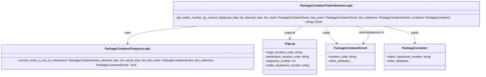

# Diagram: partview_core/partview_service/partview_service/core/business/trip_leg/PackageContainerTrailerNumberLogic.py


> Auto-generated by Obscura crawlers

## Diagram 1

```mermaid
flowchart TD
    Start([Start]) --> CheckActualTrips{actual_trips empty?}
    CheckActualTrips -- Yes --> ReturnNone1[Return None]
    CheckActualTrips -- No --> ComputeLocations[Compute actual_trip_locations from actual_trips]
    ComputeLocations --> CheckOutOfOrder{PackageContainerProgressLogic.current_event_is_out_of_order(event, planned_trips, actual_trips, last_event, last_milestone)?}
    CheckOutOfOrder -- Yes --> ReturnContainerTrailer[Return container.trailer_equipment_number]
    CheckOutOfOrder -- No --> CheckLocationInActual{event.location_code in actual_trip_locations?}
    CheckLocationInActual -- No --> ReturnNone2[Return None]
    CheckLocationInActual -- Yes --> BuildMatches[Build origin_matches and destination_matches by comparing leg origin/destination to event.location_code]
    BuildMatches --> HasOrigin{origin_matches non-empty?}
    HasOrigin -- Yes --> SortOrigin[Sort origin_matches by sequence_number and select last]
    SortOrigin --> ReturnOriginTrailer[Return last.origin_matches.trailer_equipment_number]
    HasOrigin -- No --> HasDestination{destination_matches non-empty?}
    HasDestination -- Yes --> SortDestination[Sort destination_matches by sequence_number and select last]
    SortDestination --> ReturnDestinationTrailer[Return last.destination_matches.trailer_equipment_number]
    HasDestination -- No --> ReturnNone3[Return None]
    ReturnContainerTrailer --> End([End])
    ReturnOriginTrailer --> End
    ReturnDestinationTrailer --> End
    ReturnNone1 --> End
    ReturnNone2 --> End
    ReturnNone3 --> End
```

> SVG rendering failed for this diagram.

## Diagram 2



### SVG

<svg id="container" width="2776.205078125" xmlns="http://www.w3.org/2000/svg" class="classDiagram" height="408" viewBox="0 0 2776.205078125 408" role="graphics-document document" aria-roledescription="class"><style>#container{font-family:"trebuchet ms",verdana,arial,sans-serif;font-size:16px;fill:#333;}@keyframes edge-animation-frame{from{stroke-dashoffset:0;}}@keyframes dash{to{stroke-dashoffset:0;}}#container .edge-animation-slow{stroke-dasharray:9,5!important;stroke-dashoffset:900;animation:dash 50s linear infinite;stroke-linecap:round;}#container .edge-animation-fast{stroke-dasharray:9,5!important;stroke-dashoffset:900;animation:dash 20s linear infinite;stroke-linecap:round;}#container .error-icon{fill:#552222;}#container .error-text{fill:#552222;stroke:#552222;}#container .edge-thickness-normal{stroke-width:1px;}#container .edge-thickness-thick{stroke-width:3.5px;}#container .edge-pattern-solid{stroke-dasharray:0;}#container .edge-thickness-invisible{stroke-width:0;fill:none;}#container .edge-pattern-dashed{stroke-dasharray:3;}#container .edge-pattern-dotted{stroke-dasharray:2;}#container .marker{fill:#333333;stroke:#333333;}#container .marker.cross{stroke:#333333;}#container svg{font-family:"trebuchet ms",verdana,arial,sans-serif;font-size:16px;}#container p{margin:0;}#container g.classGroup text{fill:#9370DB;stroke:none;font-family:"trebuchet ms",verdana,arial,sans-serif;font-size:10px;}#container g.classGroup text .title{font-weight:bolder;}#container .nodeLabel,#container .edgeLabel{color:#131300;}#container .edgeLabel .label rect{fill:#ECECFF;}#container .label text{fill:#131300;}#container .labelBkg{background:#ECECFF;}#container .edgeLabel .label span{background:#ECECFF;}#container .classTitle{font-weight:bolder;}#container .node rect,#container .node circle,#container .node ellipse,#container .node polygon,#container .node path{fill:#ECECFF;stroke:#9370DB;stroke-width:1px;}#container .divider{stroke:#9370DB;stroke-width:1;}#container g.clickable{cursor:pointer;}#container g.classGroup rect{fill:#ECECFF;stroke:#9370DB;}#container g.classGroup line{stroke:#9370DB;stroke-width:1;}#container .classLabel .box{stroke:none;stroke-width:0;fill:#ECECFF;opacity:0.5;}#container .classLabel .label{fill:#9370DB;font-size:10px;}#container .relation{stroke:#333333;stroke-width:1;fill:none;}#container .dashed-line{stroke-dasharray:3;}#container .dotted-line{stroke-dasharray:1 2;}#container #compositionStart,#container .composition{fill:#333333!important;stroke:#333333!important;stroke-width:1;}#container #compositionEnd,#container .composition{fill:#333333!important;stroke:#333333!important;stroke-width:1;}#container #dependencyStart,#container .dependency{fill:#333333!important;stroke:#333333!important;stroke-width:1;}#container #dependencyStart,#container .dependency{fill:#333333!important;stroke:#333333!important;stroke-width:1;}#container #extensionStart,#container .extension{fill:transparent!important;stroke:#333333!important;stroke-width:1;}#container #extensionEnd,#container .extension{fill:transparent!important;stroke:#333333!important;stroke-width:1;}#container #aggregationStart,#container .aggregation{fill:transparent!important;stroke:#333333!important;stroke-width:1;}#container #aggregationEnd,#container .aggregation{fill:transparent!important;stroke:#333333!important;stroke-width:1;}#container #lollipopStart,#container .lollipop{fill:#ECECFF!important;stroke:#333333!important;stroke-width:1;}#container #lollipopEnd,#container .lollipop{fill:#ECECFF!important;stroke:#333333!important;stroke-width:1;}#container .edgeTerminals{font-size:11px;line-height:initial;}#container .classTitleText{text-anchor:middle;font-size:18px;fill:#333;}#container .label-icon{display:inline-block;height:1em;overflow:visible;vertical-align:-0.125em;}#container .node .label-icon path{fill:currentColor;stroke:revert;stroke-width:revert;}#container :root{--mermaid-font-family:"trebuchet ms",verdana,arial,sans-serif;}</style><g><defs><marker id="container_class-aggregationStart" class="marker aggregation class" refX="18" refY="7" markerWidth="190" markerHeight="240" orient="auto"><path d="M 18,7 L9,13 L1,7 L9,1 Z"></path></marker></defs><defs><marker id="container_class-aggregationEnd" class="marker aggregation class" refX="1" refY="7" markerWidth="20" markerHeight="28" orient="auto"><path d="M 18,7 L9,13 L1,7 L9,1 Z"></path></marker></defs><defs><marker id="container_class-extensionStart" class="marker extension class" refX="18" refY="7" markerWidth="190" markerHeight="240" orient="auto"><path d="M 1,7 L18,13 V 1 Z"></path></marker></defs><defs><marker id="container_class-extensionEnd" class="marker extension class" refX="1" refY="7" markerWidth="20" markerHeight="28" orient="auto"><path d="M 1,1 V 13 L18,7 Z"></path></marker></defs><defs><marker id="container_class-compositionStart" class="marker composition class" refX="18" refY="7" markerWidth="190" markerHeight="240" orient="auto"><path d="M 18,7 L9,13 L1,7 L9,1 Z"></path></marker></defs><defs><marker id="container_class-compositionEnd" class="marker composition class" refX="1" refY="7" markerWidth="20" markerHeight="28" orient="auto"><path d="M 18,7 L9,13 L1,7 L9,1 Z"></path></marker></defs><defs><marker id="container_class-dependencyStart" class="marker dependency class" refX="6" refY="7" markerWidth="190" markerHeight="240" orient="auto"><path d="M 5,7 L9,13 L1,7 L9,1 Z"></path></marker></defs><defs><marker id="container_class-dependencyEnd" class="marker dependency class" refX="13" refY="7" markerWidth="20" markerHeight="28" orient="auto"><path d="M 18,7 L9,13 L14,7 L9,1 Z"></path></marker></defs><defs><marker id="container_class-lollipopStart" class="marker lollipop class" refX="13" refY="7" markerWidth="190" markerHeight="240" orient="auto"><circle stroke="black" fill="transparent" cx="7" cy="7" r="6"></circle></marker></defs><defs><marker id="container_class-lollipopEnd" class="marker lollipop class" refX="1" refY="7" markerWidth="190" markerHeight="240" orient="auto"><circle stroke="black" fill="transparent" cx="7" cy="7" r="6"></circle></marker></defs><g class="root"><g class="clusters"></g><g class="edgePaths"><path d="M1157.777,134L1087.771,140.167C1017.765,146.333,877.754,158.667,807.748,175.5C737.742,192.333,737.742,213.667,737.742,224.333L737.742,235" id="id_PackageContainerTrailerNumberLogic_PackageContainerProgressLogic_1" class="edge-thickness-normal edge-pattern-solid relation" style=";;;" data-edge="true" data-et="edge" data-id="id_PackageContainerTrailerNumberLogic_PackageContainerProgressLogic_1" data-points="W3sieCI6MTE1Ny43NzY3MzgyODEyNSwieSI6MTM0fSx7IngiOjczNy43NDIxODc1LCJ5IjoxNzF9LHsieCI6NzM3Ljc0MjE4NzUsInkiOjI0MX1d" marker-end="url(#container_class-dependencyEnd)"></path><path d="M1744.772,134L1732.223,140.167C1719.675,146.333,1694.578,158.667,1682.029,170C1669.48,181.333,1669.48,191.667,1669.48,196.833L1669.48,202" id="id_PackageContainerTrailerNumberLogic_TripLeg_2" class="edge-thickness-normal edge-pattern-solid relation" style=";;;" data-edge="true" data-et="edge" data-id="id_PackageContainerTrailerNumberLogic_TripLeg_2" data-points="W3sieCI6MTc0NC43NzE4NTU0Njg3NSwieSI6MTM0fSx7IngiOjE2NjkuNDgwNDY4NzUsInkiOjE3MX0seyJ4IjoxNjY5LjQ4MDQ2ODc1LCJ5IjoyMDh9XQ==" marker-end="url(#container_class-dependencyEnd)"></path><path d="M1872.971,134L1872.971,140.167C1872.971,146.333,1872.971,158.667,1882.448,174.294C1891.925,189.92,1910.88,208.841,1920.357,218.301L1929.834,227.761" id="id_PackageContainerTrailerNumberLogic_PackageContainerEvent_3" class="edge-thickness-normal edge-pattern-solid relation" style=";;;" data-edge="true" data-et="edge" data-id="id_PackageContainerTrailerNumberLogic_PackageContainerEvent_3" data-points="W3sieCI6MTg3Mi45NzA3MDMxMjUsInkiOjEzNH0seyJ4IjoxODcyLjk3MDcwMzEyNSwieSI6MTcxfSx7IngiOjE5MzQuMDgwODg1ODA4MjcwOCwieSI6MjMyfV0=" marker-end="url(#container_class-dependencyEnd)"></path><path d="M2181.148,134L2211.313,140.167C2241.479,146.333,2301.81,158.667,2331.975,174C2362.141,189.333,2362.141,207.667,2362.141,216.833L2362.141,226" id="id_PackageContainerTrailerNumberLogic_PackageContainer_4" class="edge-thickness-normal edge-pattern-solid relation" style=";;;" data-edge="true" data-et="edge" data-id="id_PackageContainerTrailerNumberLogic_PackageContainer_4" data-points="W3sieCI6MjE4MS4xNDc3NTM5MDYyNSwieSI6MTM0fSx7IngiOjIzNjIuMTQwNjI1LCJ5IjoxNzF9LHsieCI6MjM2Mi4xNDA2MjUsInkiOjIzMn1d" marker-end="url(#container_class-dependencyEnd)"></path><path d="M2033.442,134L2049.15,140.167C2064.857,146.333,2096.272,158.667,2103.369,174.262C2110.465,189.857,2093.242,208.713,2084.63,218.141L2076.019,227.57" id="id_PackageContainerTrailerNumberLogic_PackageContainerEvent_5" class="edge-thickness-normal edge-pattern-solid relation" style=";;;" data-edge="true" data-et="edge" data-id="id_PackageContainerTrailerNumberLogic_PackageContainerEvent_5" data-points="W3sieCI6MjAzMy40NDIyODUxNTYyNSwieSI6MTM0fSx7IngiOjIxMjcuNjg3NSwieSI6MTcxfSx7IngiOjIwNzEuOTcyNjg1NjIwMzAwNiwieSI6MjMyfV0=" marker-end="url(#container_class-dependencyEnd)"></path></g><g class="edgeLabels"><g class="edgeLabel" transform="translate(737.7421875, 171)"><g class="label" data-id="id_PackageContainerTrailerNumberLogic_PackageContainerProgressLogic_1" transform="translate(-16.4921875, -12)"><foreignObject width="32.984375" height="24"><div xmlns="http://www.w3.org/1999/xhtml" class="labelBkg" style="display: table-cell; white-space: nowrap; line-height: 1.5; max-width: 200px; text-align: center;"><span class="edgeLabel"><p>uses</p></span></div></foreignObject></g></g><g class="edgeLabel" transform="translate(1669.48046875, 171)"><g class="label" data-id="id_PackageContainerTrailerNumberLogic_TripLeg_2" transform="translate(-30.2421875, -12)"><foreignObject width="60.484375" height="24"><div xmlns="http://www.w3.org/1999/xhtml" class="labelBkg" style="display: table-cell; white-space: nowrap; line-height: 1.5; max-width: 200px; text-align: center;"><span class="edgeLabel"><p>inspects</p></span></div></foreignObject></g></g><g class="edgeLabel" transform="translate(1872.970703125, 171)"><g class="label" data-id="id_PackageContainerTrailerNumberLogic_PackageContainerEvent_3" transform="translate(-20.0078125, -12)"><foreignObject width="40.015625" height="24"><div xmlns="http://www.w3.org/1999/xhtml" class="labelBkg" style="display: table-cell; white-space: nowrap; line-height: 1.5; max-width: 200px; text-align: center;"><span class="edgeLabel"><p>reads</p></span></div></foreignObject></g></g><g class="edgeLabel" transform="translate(2362.140625, 171)"><g class="label" data-id="id_PackageContainerTrailerNumberLogic_PackageContainer_4" transform="translate(-20.0078125, -12)"><foreignObject width="40.015625" height="24"><div xmlns="http://www.w3.org/1999/xhtml" class="labelBkg" style="display: table-cell; white-space: nowrap; line-height: 1.5; max-width: 200px; text-align: center;"><span class="edgeLabel"><p>reads</p></span></div></foreignObject></g></g><g class="edgeLabel" transform="translate(2119.01509, 167.59527)"><g class="label" data-id="id_PackageContainerTrailerNumberLogic_PackageContainerEvent_5" transform="translate(-72.96875, -12)"><foreignObject width="145.9375" height="24"><div xmlns="http://www.w3.org/1999/xhtml" class="labelBkg" style="display: table-cell; white-space: nowrap; line-height: 1.5; max-width: 200px; text-align: center;"><span class="edgeLabel"><p>returns/depends on</p></span></div></foreignObject></g></g></g><g class="nodes"><g class="node default" id="classId-PackageContainerTrailerNumberLogic-0" transform="translate(1872.970703125, 71)"><g class="basic label-container"><path d="M-895.234375 -63 L895.234375 -63 L895.234375 63 L-895.234375 63" stroke="none" stroke-width="0" fill="#ECECFF" style=""></path><path d="M-895.234375 -63 C-422.17360157025877 -63, 50.887171859482464 -63, 895.234375 -63 M-895.234375 -63 C-187.8116951514404 -63, 519.6109846971192 -63, 895.234375 -63 M895.234375 -63 C895.234375 -23.108777287435572, 895.234375 16.782445425128856, 895.234375 63 M895.234375 -63 C895.234375 -32.340522096537, 895.234375 -1.6810441930740083, 895.234375 63 M895.234375 63 C405.0156961062174 63, -85.20298278756525 63, -895.234375 63 M895.234375 63 C453.11187437650904 63, 10.989373753018072 63, -895.234375 63 M-895.234375 63 C-895.234375 26.884915975252305, -895.234375 -9.23016804949539, -895.234375 -63 M-895.234375 63 C-895.234375 20.65375636113471, -895.234375 -21.692487277730578, -895.234375 -63" stroke="#9370DB" stroke-width="1.3" fill="none" stroke-dasharray="0 0" style=""></path></g><g class="annotation-group text" transform="translate(0, -39)"></g><g class="label-group text" transform="translate(-137.171875, -39)"><g class="label" style="font-weight: bolder" transform="translate(0,-12)"><foreignObject width="274.34375" height="24"><div xmlns="http://www.w3.org/1999/xhtml" style="display: table-cell; white-space: nowrap; line-height: 1.5; max-width: 321px; text-align: center;"><span class="nodeLabel markdown-node-label" style=""><p>PackageContainerTrailerNumberLogic</p></span></div></foreignObject></g></g><g class="members-group text" transform="translate(-883.234375, 9)"></g><g class="methods-group text" transform="translate(-883.234375, 39)"><g class="label" style="" transform="translate(0,-12)"><foreignObject width="1629.296875" height="24"><div xmlns="http://www.w3.org/1999/xhtml" style="display: table-cell; white-space: nowrap; line-height: 1.5; max-width: 1687px; text-align: center;"><span class="nodeLabel markdown-node-label" style=""><p>+get_trailer_number_by_current_trip(actual_trips: list, planned_trips: list, event: PackageContainerEvent, last_event: PackageContainerEvent, last_milestone: PackageContainerEvent, container: PackageContainer) : string | None</p></span></div></foreignObject></g></g><g class="divider" style=""><path d="M-895.234375 -15 C-246.92812484615206 -15, 401.3781253076959 -15, 895.234375 -15 M-895.234375 -15 C-204.50980653409783 -15, 486.21476193180433 -15, 895.234375 -15" stroke="#9370DB" stroke-width="1.3" fill="none" stroke-dasharray="0 0" style=""></path></g><g class="divider" style=""><path d="M-895.234375 9 C-238.71932585311765 9, 417.7957232937647 9, 895.234375 9 M-895.234375 9 C-500.64633779666156 9, -106.05830059332311 9, 895.234375 9" stroke="#9370DB" stroke-width="1.3" fill="none" stroke-dasharray="0 0" style=""></path></g></g><g class="node default" id="classId-PackageContainerProgressLogic-1" transform="translate(737.7421875, 304)"><g class="basic label-container"><path d="M-729.7421875 -63 L729.7421875 -63 L729.7421875 63 L-729.7421875 63" stroke="none" stroke-width="0" fill="#ECECFF" style=""></path><path d="M-729.7421875 -63 C-325.3910005208512 -63, 78.96018645829758 -63, 729.7421875 -63 M-729.7421875 -63 C-338.47528219110086 -63, 52.79162311779828 -63, 729.7421875 -63 M729.7421875 -63 C729.7421875 -36.71872881446625, 729.7421875 -10.437457628932506, 729.7421875 63 M729.7421875 -63 C729.7421875 -24.264700994257794, 729.7421875 14.470598011484412, 729.7421875 63 M729.7421875 63 C342.0709248369497 63, -45.6003378261006 63, -729.7421875 63 M729.7421875 63 C342.59632184302745 63, -44.54954381394509 63, -729.7421875 63 M-729.7421875 63 C-729.7421875 32.93677081714222, -729.7421875 2.873541634284443, -729.7421875 -63 M-729.7421875 63 C-729.7421875 15.566123471856862, -729.7421875 -31.867753056286276, -729.7421875 -63" stroke="#9370DB" stroke-width="1.3" fill="none" stroke-dasharray="0 0" style=""></path></g><g class="annotation-group text" transform="translate(0, -39)"></g><g class="label-group text" transform="translate(-116.265625, -39)"><g class="label" style="font-weight: bolder" transform="translate(0,-12)"><foreignObject width="232.53125" height="24"><div xmlns="http://www.w3.org/1999/xhtml" style="display: table-cell; white-space: nowrap; line-height: 1.5; max-width: 278px; text-align: center;"><span class="nodeLabel markdown-node-label" style=""><p>PackageContainerProgressLogic</p></span></div></foreignObject></g></g><g class="members-group text" transform="translate(-717.7421875, 9)"></g><g class="methods-group text" transform="translate(-717.7421875, 39)"><g class="label" style="" transform="translate(0,-12)"><foreignObject width="1319.21875" height="24"><div xmlns="http://www.w3.org/1999/xhtml" style="display: table-cell; white-space: nowrap; line-height: 1.5; max-width: 1377px; text-align: center;"><span class="nodeLabel markdown-node-label" style=""><p>+current_event_is_out_of_order(event: PackageContainerEvent, planned_trips: list, actual_trips: list, last_event: PackageContainerEvent, last_milestone: PackageContainerEvent) : bool</p></span></div></foreignObject></g></g><g class="divider" style=""><path d="M-729.7421875 -15 C-349.03836966267164 -15, 31.665448174656717 -15, 729.7421875 -15 M-729.7421875 -15 C-199.0379495464964 -15, 331.6662884070072 -15, 729.7421875 -15" stroke="#9370DB" stroke-width="1.3" fill="none" stroke-dasharray="0 0" style=""></path></g><g class="divider" style=""><path d="M-729.7421875 9 C-258.51403391667355 9, 212.7141196666529 9, 729.7421875 9 M-729.7421875 9 C-325.42581610958337 9, 78.89055528083327 9, 729.7421875 9" stroke="#9370DB" stroke-width="1.3" fill="none" stroke-dasharray="0 0" style=""></path></g></g><g class="node default" id="classId-TripLeg-2" transform="translate(1669.48046875, 304)"><g class="basic label-container"><path d="M-151.99609375 -96 L151.99609375 -96 L151.99609375 96 L-151.99609375 96" stroke="none" stroke-width="0" fill="#ECECFF" style=""></path><path d="M-151.99609375 -96 C-43.86627047365357 -96, 64.26355280269286 -96, 151.99609375 -96 M-151.99609375 -96 C-75.51816759512717 -96, 0.9597585597456657 -96, 151.99609375 -96 M151.99609375 -96 C151.99609375 -41.47394973091885, 151.99609375 13.052100538162307, 151.99609375 96 M151.99609375 -96 C151.99609375 -41.21779833657981, 151.99609375 13.564403326840377, 151.99609375 96 M151.99609375 96 C64.57762391255079 96, -22.840845924898417 96, -151.99609375 96 M151.99609375 96 C55.77742073121139 96, -40.441252287577214 96, -151.99609375 96 M-151.99609375 96 C-151.99609375 34.94212507729148, -151.99609375 -26.115749845417042, -151.99609375 -96 M-151.99609375 96 C-151.99609375 38.36608529398366, -151.99609375 -19.267829412032683, -151.99609375 -96" stroke="#9370DB" stroke-width="1.3" fill="none" stroke-dasharray="0 0" style=""></path></g><g class="annotation-group text" transform="translate(0, -72)"></g><g class="label-group text" transform="translate(-27.0546875, -72)"><g class="label" style="font-weight: bolder" transform="translate(0,-12)"><foreignObject width="54.109375" height="24"><div xmlns="http://www.w3.org/1999/xhtml" style="display: table-cell; white-space: nowrap; line-height: 1.5; max-width: 103px; text-align: center;"><span class="nodeLabel markdown-node-label" style=""><p>TripLeg</p></span></div></foreignObject></g></g><g class="members-group text" transform="translate(-139.99609375, -24)"><g class="label" style="" transform="translate(0,-12)"><foreignObject width="210.21875" height="24"><div xmlns="http://www.w3.org/1999/xhtml" style="display: table-cell; white-space: nowrap; line-height: 1.5; max-width: 268px; text-align: center;"><span class="nodeLabel markdown-node-label" style=""><p>+origin_location_code: string</p></span></div></foreignObject></g><g class="label" style="" transform="translate(0,12)"><foreignObject width="251.109375" height="24"><div xmlns="http://www.w3.org/1999/xhtml" style="display: table-cell; white-space: nowrap; line-height: 1.5; max-width: 309px; text-align: center;"><span class="nodeLabel markdown-node-label" style=""><p>+destination_location_code: string</p></span></div></foreignObject></g><g class="label" style="" transform="translate(0,36)"><foreignObject width="169.90625" height="24"><div xmlns="http://www.w3.org/1999/xhtml" style="display: table-cell; white-space: nowrap; line-height: 1.5; max-width: 227px; text-align: center;"><span class="nodeLabel markdown-node-label" style=""><p>+sequence_number: int</p></span></div></foreignObject></g><g class="label" style="" transform="translate(0,60)"><foreignObject width="252.9375" height="24"><div xmlns="http://www.w3.org/1999/xhtml" style="display: table-cell; white-space: nowrap; line-height: 1.5; max-width: 311px; text-align: center;"><span class="nodeLabel markdown-node-label" style=""><p>+trailer_equipment_number: string</p></span></div></foreignObject></g></g><g class="methods-group text" transform="translate(-139.99609375, 96)"></g><g class="divider" style=""><path d="M-151.99609375 -48 C-33.27321882108204 -48, 85.44965610783592 -48, 151.99609375 -48 M-151.99609375 -48 C-37.90553227883362 -48, 76.18502919233276 -48, 151.99609375 -48" stroke="#9370DB" stroke-width="1.3" fill="none" stroke-dasharray="0 0" style=""></path></g><g class="divider" style=""><path d="M-151.99609375 72 C-90.57502240957592 72, -29.15395106915186 72, 151.99609375 72 M-151.99609375 72 C-70.44796146508145 72, 11.100170819837103 72, 151.99609375 72" stroke="#9370DB" stroke-width="1.3" fill="none" stroke-dasharray="0 0" style=""></path></g></g><g class="node default" id="classId-PackageContainerEvent-3" transform="translate(2006.2109375, 304)"><g class="basic label-container"><path d="M-134.734375 -72 L134.734375 -72 L134.734375 72 L-134.734375 72" stroke="none" stroke-width="0" fill="#ECECFF" style=""></path><path d="M-134.734375 -72 C-54.62080892472983 -72, 25.492757150540342 -72, 134.734375 -72 M-134.734375 -72 C-31.84813708437089 -72, 71.03810083125822 -72, 134.734375 -72 M134.734375 -72 C134.734375 -18.90741511250426, 134.734375 34.18516977499148, 134.734375 72 M134.734375 -72 C134.734375 -29.803945002616118, 134.734375 12.392109994767765, 134.734375 72 M134.734375 72 C27.359639375967703 72, -80.0150962480646 72, -134.734375 72 M134.734375 72 C37.25281943314292 72, -60.228736133714165 72, -134.734375 72 M-134.734375 72 C-134.734375 27.65663720012097, -134.734375 -16.686725599758063, -134.734375 -72 M-134.734375 72 C-134.734375 22.497169408282694, -134.734375 -27.00566118343461, -134.734375 -72" stroke="#9370DB" stroke-width="1.3" fill="none" stroke-dasharray="0 0" style=""></path></g><g class="annotation-group text" transform="translate(0, -48)"></g><g class="label-group text" transform="translate(-85.65625, -48)"><g class="label" style="font-weight: bolder" transform="translate(0,-12)"><foreignObject width="171.3125" height="24"><div xmlns="http://www.w3.org/1999/xhtml" style="display: table-cell; white-space: nowrap; line-height: 1.5; max-width: 219px; text-align: center;"><span class="nodeLabel markdown-node-label" style=""><p>PackageContainerEvent</p></span></div></foreignObject></g></g><g class="members-group text" transform="translate(-122.734375, 0)"><g class="label" style="" transform="translate(0,-12)"><foreignObject width="159.8125" height="24"><div xmlns="http://www.w3.org/1999/xhtml" style="display: table-cell; white-space: nowrap; line-height: 1.5; max-width: 218px; text-align: center;"><span class="nodeLabel markdown-node-label" style=""><p>+location_code: string</p></span></div></foreignObject></g><g class="label" style="" transform="translate(0,12)"><foreignObject width="137.109375" height="24"><div xmlns="http://www.w3.org/1999/xhtml" style="display: table-cell; white-space: nowrap; line-height: 1.5; max-width: 195px; text-align: center;"><span class="nodeLabel markdown-node-label" style=""><p>+other_attributes...</p></span></div></foreignObject></g></g><g class="methods-group text" transform="translate(-122.734375, 72)"></g><g class="divider" style=""><path d="M-134.734375 -24 C-78.22737951690894 -24, -21.72038403381788 -24, 134.734375 -24 M-134.734375 -24 C-57.74166387511143 -24, 19.251047249777145 -24, 134.734375 -24" stroke="#9370DB" stroke-width="1.3" fill="none" stroke-dasharray="0 0" style=""></path></g><g class="divider" style=""><path d="M-134.734375 48 C-64.31042405142536 48, 6.113526897149285 48, 134.734375 48 M-134.734375 48 C-46.36253206521947 48, 42.00931086956106 48, 134.734375 48" stroke="#9370DB" stroke-width="1.3" fill="none" stroke-dasharray="0 0" style=""></path></g></g><g class="node default" id="classId-PackageContainer-4" transform="translate(2362.140625, 304)"><g class="basic label-container"><path d="M-171.1953125 -72 L171.1953125 -72 L171.1953125 72 L-171.1953125 72" stroke="none" stroke-width="0" fill="#ECECFF" style=""></path><path d="M-171.1953125 -72 C-88.11565343385443 -72, -5.0359943677088665 -72, 171.1953125 -72 M-171.1953125 -72 C-67.5401204397331 -72, 36.1150716205338 -72, 171.1953125 -72 M171.1953125 -72 C171.1953125 -24.52442985205161, 171.1953125 22.951140295896778, 171.1953125 72 M171.1953125 -72 C171.1953125 -27.921126145776775, 171.1953125 16.15774770844645, 171.1953125 72 M171.1953125 72 C58.00097644968713 72, -55.19335960062574 72, -171.1953125 72 M171.1953125 72 C82.28486757642283 72, -6.625577347154348 72, -171.1953125 72 M-171.1953125 72 C-171.1953125 34.66733806462978, -171.1953125 -2.665323870740437, -171.1953125 -72 M-171.1953125 72 C-171.1953125 33.960004950009676, -171.1953125 -4.079990099980648, -171.1953125 -72" stroke="#9370DB" stroke-width="1.3" fill="none" stroke-dasharray="0 0" style=""></path></g><g class="annotation-group text" transform="translate(0, -48)"></g><g class="label-group text" transform="translate(-65.453125, -48)"><g class="label" style="font-weight: bolder" transform="translate(0,-12)"><foreignObject width="130.90625" height="24"><div xmlns="http://www.w3.org/1999/xhtml" style="display: table-cell; white-space: nowrap; line-height: 1.5; max-width: 179px; text-align: center;"><span class="nodeLabel markdown-node-label" style=""><p>PackageContainer</p></span></div></foreignObject></g></g><g class="members-group text" transform="translate(-159.1953125, 0)"><g class="label" style="" transform="translate(0,-12)"><foreignObject width="252.9375" height="24"><div xmlns="http://www.w3.org/1999/xhtml" style="display: table-cell; white-space: nowrap; line-height: 1.5; max-width: 311px; text-align: center;"><span class="nodeLabel markdown-node-label" style=""><p>+trailer_equipment_number: string</p></span></div></foreignObject></g><g class="label" style="" transform="translate(0,12)"><foreignObject width="137.109375" height="24"><div xmlns="http://www.w3.org/1999/xhtml" style="display: table-cell; white-space: nowrap; line-height: 1.5; max-width: 195px; text-align: center;"><span class="nodeLabel markdown-node-label" style=""><p>+other_attributes...</p></span></div></foreignObject></g></g><g class="methods-group text" transform="translate(-159.1953125, 72)"></g><g class="divider" style=""><path d="M-171.1953125 -24 C-82.26061063241394 -24, 6.674091235172114 -24, 171.1953125 -24 M-171.1953125 -24 C-97.78758474156638 -24, -24.379856983132754 -24, 171.1953125 -24" stroke="#9370DB" stroke-width="1.3" fill="none" stroke-dasharray="0 0" style=""></path></g><g class="divider" style=""><path d="M-171.1953125 48 C-51.690479062405686 48, 67.81435437518863 48, 171.1953125 48 M-171.1953125 48 C-74.6012966470789 48, 21.992719205842207 48, 171.1953125 48" stroke="#9370DB" stroke-width="1.3" fill="none" stroke-dasharray="0 0" style=""></path></g></g></g></g></g></svg>
