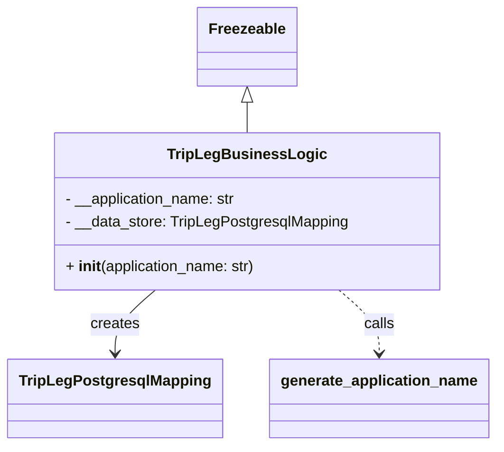

# Diagram: partview_core/partview_service/partview_service/core/business/trip_leg/TripLegBuisnessLogic.py

> Auto-generated by Obscura crawlers

## Mermaid

### SVG

<svg id="container" width="512.640625" xmlns="http://www.w3.org/2000/svg" class="classDiagram" height="476" viewBox="0 0 512.640625 476" role="graphics-document document" aria-roledescription="class"><g><defs><marker id="container_class-aggregationStart" class="marker aggregation class" refX="18" refY="7" markerWidth="190" markerHeight="240" orient="auto"><path d="M 18,7 L9,13 L1,7 L9,1 Z"></path></marker></defs><defs><marker id="container_class-aggregationEnd" class="marker aggregation class" refX="1" refY="7" markerWidth="20" markerHeight="28" orient="auto"><path d="M 18,7 L9,13 L1,7 L9,1 Z"></path></marker></defs><defs><marker id="container_class-extensionStart" class="marker extension class" refX="18" refY="7" markerWidth="190" markerHeight="240" orient="auto"><path d="M 1,7 L18,13 V 1 Z"></path></marker></defs><defs><marker id="container_class-extensionEnd" class="marker extension class" refX="1" refY="7" markerWidth="20" markerHeight="28" orient="auto"><path d="M 1,1 V 13 L18,7 Z"></path></marker></defs><defs><marker id="container_class-compositionStart" class="marker composition class" refX="18" refY="7" markerWidth="190" markerHeight="240" orient="auto"><path d="M 18,7 L9,13 L1,7 L9,1 Z"></path></marker></defs><defs><marker id="container_class-compositionEnd" class="marker composition class" refX="1" refY="7" markerWidth="20" markerHeight="28" orient="auto"><path d="M 18,7 L9,13 L1,7 L9,1 Z"></path></marker></defs><defs><marker id="container_class-dependencyStart" class="marker dependency class" refX="6" refY="7" markerWidth="190" markerHeight="240" orient="auto"><path d="M 5,7 L9,13 L1,7 L9,1 Z"></path></marker></defs><defs><marker id="container_class-dependencyEnd" class="marker dependency class" refX="13" refY="7" markerWidth="20" markerHeight="28" orient="auto"><path d="M 18,7 L9,13 L14,7 L9,1 Z"></path></marker></defs><defs><marker id="container_class-lollipopStart" class="marker lollipop class" refX="13" refY="7" markerWidth="190" markerHeight="240" orient="auto"><circle stroke="black" fill="transparent" cx="7" cy="7" r="6"></circle></marker></defs><defs><marker id="container_class-lollipopEnd" class="marker lollipop class" refX="1" refY="7" markerWidth="190" markerHeight="240" orient="auto"><circle stroke="black" fill="transparent" cx="7" cy="7" r="6"></circle></marker></defs><g class="root"><g class="clusters"></g><g class="edgePaths"><path d="M254.113,109.25L254.113,110.542C254.113,111.833,254.113,114.417,254.113,119.875C254.113,125.333,254.113,133.667,254.113,137.833L254.113,142" id="id_Freezeable_TripLegBusinessLogic_1" class="edge-thickness-normal edge-pattern-solid relation" style=";;;" data-edge="true" data-et="edge" data-id="id_Freezeable_TripLegBusinessLogic_1" data-points="W3sieCI6MjU0LjExMzI4MTI1LCJ5Ijo5Mn0seyJ4IjoyNTQuMTEzMjgxMjUsInkiOjExN30seyJ4IjoyNTQuMTEzMjgxMjUsInkiOjE0Mn1d" marker-start="url(#container_class-extensionStart)"></path><path d="M159.242,310L152.277,316.167C145.312,322.333,131.383,334.667,124.418,346C117.453,357.333,117.453,367.667,117.453,372.833L117.453,378" id="id_TripLegBusinessLogic_TripLegPostgresqlMapping_2" class="edge-thickness-normal edge-pattern-solid relation" style=";;;" data-edge="true" data-et="edge" data-id="id_TripLegBusinessLogic_TripLegPostgresqlMapping_2" data-points="W3sieCI6MTU5LjI0MTc2NzgyMDI0NzkzLCJ5IjozMTB9LHsieCI6MTE3LjQ1MzEyNSwieSI6MzQ3fSx7IngiOjExNy40NTMxMjUsInkiOjM4NH1d" marker-end="url(#container_class-dependencyEnd)"></path><path d="M348.985,310L355.95,316.167C362.914,322.333,376.844,334.667,383.809,346C390.773,357.333,390.773,367.667,390.773,372.833L390.773,378" id="id_TripLegBusinessLogic_generate_application_name_3" class="edge-thickness-normal edge-pattern-dashed relation" style=";;;" data-edge="true" data-et="edge" data-id="id_TripLegBusinessLogic_generate_application_name_3" data-points="W3sieCI6MzQ4Ljk4NDc5NDY3OTc1MjEsInkiOjMxMH0seyJ4IjozOTAuNzczNDM3NSwieSI6MzQ3fSx7IngiOjM5MC43NzM0Mzc1LCJ5IjozODR9XQ==" marker-end="url(#container_class-dependencyEnd)"></path></g><g class="edgeLabels"><g class="edgeLabel"><g class="label" data-id="id_Freezeable_TripLegBusinessLogic_1" transform="translate(0, 0)"><foreignObject width="0" height="0">

</foreignObject></g></g><g class="edgeLabel" transform="translate(117.453125, 347)"><g class="label" data-id="id_TripLegBusinessLogic_TripLegPostgresqlMapping_2" transform="translate(-26.171875, -12)"><foreignObject width="52.34375" height="24">

creates

</foreignObject></g></g><g class="edgeLabel" transform="translate(390.7734375, 347)"><g class="label" data-id="id_TripLegBusinessLogic_generate_application_name_3" transform="translate(-16.4453125, -12)"><foreignObject width="32.890625" height="24">

calls

</foreignObject></g></g></g><g class="nodes"><g class="node default" id="classId-Freezeable-0" transform="translate(254.11328125, 50)"><g class="basic label-container"><path d="M-51.1953125 -42 L51.1953125 -42 L51.1953125 42 L-51.1953125 42" stroke="none" stroke-width="0" fill="#ECECFF" style=""></path><path d="M-51.1953125 -42 C-15.653498722337346 -42, 19.888315055325307 -42, 51.1953125 -42 M-51.1953125 -42 C-14.79662643337069 -42, 21.60205963325862 -42, 51.1953125 -42 M51.1953125 -42 C51.1953125 -21.41259250065708, 51.1953125 -0.8251850013141606, 51.1953125 42 M51.1953125 -42 C51.1953125 -21.535128964989255, 51.1953125 -1.07025792997851, 51.1953125 42 M51.1953125 42 C29.749918008320495 42, 8.304523516640991 42, -51.1953125 42 M51.1953125 42 C26.36899138885285 42, 1.542670277705703 42, -51.1953125 42 M-51.1953125 42 C-51.1953125 8.89779093090322, -51.1953125 -24.20441813819356, -51.1953125 -42 M-51.1953125 42 C-51.1953125 16.67725831253298, -51.1953125 -8.645483374934038, -51.1953125 -42" stroke="#9370DB" stroke-width="1.3" fill="none" stroke-dasharray="0 0" style=""></path></g><g class="annotation-group text" transform="translate(0, -18)"></g><g class="label-group text" transform="translate(-39.1953125, -18)"><g class="label" style="font-weight: bolder" transform="translate(0,-12)"><foreignObject width="78.390625" height="24">

Freezeable

</foreignObject></g></g><g class="members-group text" transform="translate(-39.1953125, 30)"></g><g class="methods-group text" transform="translate(-39.1953125, 60)"></g><g class="divider" style=""><path d="M-51.1953125 6 C-25.650689430796756 6, -0.10606636159351268 6, 51.1953125 6 M-51.1953125 6 C-15.108183644587982 6, 20.978945210824037 6, 51.1953125 6" stroke="#9370DB" stroke-width="1.3" fill="none" stroke-dasharray="0 0" style=""></path></g><g class="divider" style=""><path d="M-51.1953125 24 C-19.771839352577228 24, 11.651633794845544 24, 51.1953125 24 M-51.1953125 24 C-23.485824321425113 24, 4.2236638571497735 24, 51.1953125 24" stroke="#9370DB" stroke-width="1.3" fill="none" stroke-dasharray="0 0" style=""></path></g></g><g class="node default" id="classId-TripLegBusinessLogic-1" transform="translate(254.11328125, 226)"><g class="basic label-container"><path d="M-202.85546875 -84 L202.85546875 -84 L202.85546875 84 L-202.85546875 84" stroke="none" stroke-width="0" fill="#ECECFF" style=""></path><path d="M-202.85546875 -84 C-114.46310687537928 -84, -26.070745000758563 -84, 202.85546875 -84 M-202.85546875 -84 C-105.56272991829648 -84, -8.269991086592967 -84, 202.85546875 -84 M202.85546875 -84 C202.85546875 -36.13074646239424, 202.85546875 11.738507075211515, 202.85546875 84 M202.85546875 -84 C202.85546875 -27.516128108235606, 202.85546875 28.96774378352879, 202.85546875 84 M202.85546875 84 C69.95625543097631 84, -62.942957888047374 84, -202.85546875 84 M202.85546875 84 C100.7652505721438 84, -1.324967605712402 84, -202.85546875 84 M-202.85546875 84 C-202.85546875 22.42684513938717, -202.85546875 -39.14630972122566, -202.85546875 -84 M-202.85546875 84 C-202.85546875 22.267677609823224, -202.85546875 -39.46464478035355, -202.85546875 -84" stroke="#9370DB" stroke-width="1.3" fill="none" stroke-dasharray="0 0" style=""></path></g><g class="annotation-group text" transform="translate(0, -60)"></g><g class="label-group text" transform="translate(-78.4609375, -60)"><g class="label" style="font-weight: bolder" transform="translate(0,-12)"><foreignObject width="156.921875" height="24">

TripLegBusinessLogic

</foreignObject></g></g><g class="members-group text" transform="translate(-190.85546875, -12)"><g class="label" style="" transform="translate(0,-12)"><foreignObject width="185.296875" height="24">

- __application_name: str

</foreignObject></g><g class="label" style="" transform="translate(0,12)"><foreignObject width="303.25" height="24">

- __data_store: TripLegPostgresqlMapping

</foreignObject></g></g><g class="methods-group text" transform="translate(-190.85546875, 60)"><g class="label" style="" transform="translate(0,-12)"><foreignObject width="205.5" height="24">

+ <strong>init</strong>(application_name: str)

</foreignObject></g></g><g class="divider" style=""><path d="M-202.85546875 -36 C-81.53728167447656 -36, 39.78090540104688 -36, 202.85546875 -36 M-202.85546875 -36 C-118.9460288520055 -36, -35.036588954010995 -36, 202.85546875 -36" stroke="#9370DB" stroke-width="1.3" fill="none" stroke-dasharray="0 0" style=""></path></g><g class="divider" style=""><path d="M-202.85546875 36 C-44.12582740238406 36, 114.60381394523188 36, 202.85546875 36 M-202.85546875 36 C-54.03664220479351 36, 94.78218434041298 36, 202.85546875 36" stroke="#9370DB" stroke-width="1.3" fill="none" stroke-dasharray="0 0" style=""></path></g></g><g class="node default" id="classId-TripLegPostgresqlMapping-2" transform="translate(117.453125, 426)"><g class="basic label-container"><path d="M-109.453125 -42 L109.453125 -42 L109.453125 42 L-109.453125 42" stroke="none" stroke-width="0" fill="#ECECFF" style=""></path><path d="M-109.453125 -42 C-29.345331497988397 -42, 50.762462004023206 -42, 109.453125 -42 M-109.453125 -42 C-32.33129079246197 -42, 44.79054341507606 -42, 109.453125 -42 M109.453125 -42 C109.453125 -10.864878294333355, 109.453125 20.27024341133329, 109.453125 42 M109.453125 -42 C109.453125 -20.426035605793373, 109.453125 1.1479287884132532, 109.453125 42 M109.453125 42 C53.90531248102301 42, -1.6425000379539796 42, -109.453125 42 M109.453125 42 C31.17410192707426 42, -47.10492114585148 42, -109.453125 42 M-109.453125 42 C-109.453125 11.990331214689231, -109.453125 -18.019337570621538, -109.453125 -42 M-109.453125 42 C-109.453125 16.19654759189607, -109.453125 -9.606904816207859, -109.453125 -42" stroke="#9370DB" stroke-width="1.3" fill="none" stroke-dasharray="0 0" style=""></path></g><g class="annotation-group text" transform="translate(0, -18)"></g><g class="label-group text" transform="translate(-97.453125, -18)"><g class="label" style="font-weight: bolder" transform="translate(0,-12)"><foreignObject width="194.90625" height="24">

TripLegPostgresqlMapping

</foreignObject></g></g><g class="members-group text" transform="translate(-97.453125, 30)"></g><g class="methods-group text" transform="translate(-97.453125, 60)"></g><g class="divider" style=""><path d="M-109.453125 6 C-31.532398007032853 6, 46.388328985934294 6, 109.453125 6 M-109.453125 6 C-31.308343709469042 6, 46.836437581061915 6, 109.453125 6" stroke="#9370DB" stroke-width="1.3" fill="none" stroke-dasharray="0 0" style=""></path></g><g class="divider" style=""><path d="M-109.453125 24 C-65.14686258678226 24, -20.840600173564525 24, 109.453125 24 M-109.453125 24 C-48.991960246038545 24, 11.46920450792291 24, 109.453125 24" stroke="#9370DB" stroke-width="1.3" fill="none" stroke-dasharray="0 0" style=""></path></g></g><g class="node default" id="classId-generate_application_name-3" transform="translate(390.7734375, 426)"><g class="basic label-container"><path d="M-113.8671875 -42 L113.8671875 -42 L113.8671875 42 L-113.8671875 42" stroke="none" stroke-width="0" fill="#ECECFF" style=""></path><path d="M-113.8671875 -42 C-52.845940025317006 -42, 8.175307449365988 -42, 113.8671875 -42 M-113.8671875 -42 C-41.60153912459765 -42, 30.6641092508047 -42, 113.8671875 -42 M113.8671875 -42 C113.8671875 -17.910623868212497, 113.8671875 6.1787522635750065, 113.8671875 42 M113.8671875 -42 C113.8671875 -22.525502305439893, 113.8671875 -3.0510046108797866, 113.8671875 42 M113.8671875 42 C61.139422032504314 42, 8.411656565008627 42, -113.8671875 42 M113.8671875 42 C32.71454453877837 42, -48.43809842244326 42, -113.8671875 42 M-113.8671875 42 C-113.8671875 15.714486252425932, -113.8671875 -10.571027495148137, -113.8671875 -42 M-113.8671875 42 C-113.8671875 24.655217111033664, -113.8671875 7.310434222067329, -113.8671875 -42" stroke="#9370DB" stroke-width="1.3" fill="none" stroke-dasharray="0 0" style=""></path></g><g class="annotation-group text" transform="translate(0, -18)"></g><g class="label-group text" transform="translate(-101.8671875, -18)"><g class="label" style="font-weight: bolder" transform="translate(0,-12)"><foreignObject width="203.734375" height="24">

generate_application_name

</foreignObject></g></g><g class="members-group text" transform="translate(-101.8671875, 30)"></g><g class="methods-group text" transform="translate(-101.8671875, 60)"></g><g class="divider" style=""><path d="M-113.8671875 6 C-51.746835898389236 6, 10.373515703221528 6, 113.8671875 6 M-113.8671875 6 C-66.65545856974305 6, -19.44372963948608 6, 113.8671875 6" stroke="#9370DB" stroke-width="1.3" fill="none" stroke-dasharray="0 0" style=""></path></g><g class="divider" style=""><path d="M-113.8671875 24 C-32.53181356303293 24, 48.80356037393415 24, 113.8671875 24 M-113.8671875 24 C-37.29516377223602 24, 39.276859955527954 24, 113.8671875 24" stroke="#9370DB" stroke-width="1.3" fill="none" stroke-dasharray="0 0" style=""></path></g></g></g></g></g></svg>
