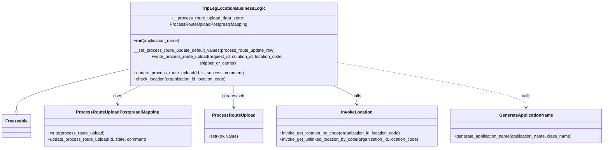

# Diagram: partview_core/partview_service/partview_service/core/business/trip_leg/TripLegLocationBusinessLogic.py


> Auto-generated by Obscura crawlers

## Diagram 1



### SVG

<svg id="container" width="2241.1875" xmlns="http://www.w3.org/2000/svg" class="classDiagram" height="480" viewBox="0 0 2241.1875 480" role="graphics-document document" aria-roledescription="class"><style>#container{font-family:"trebuchet ms",verdana,arial,sans-serif;font-size:16px;fill:#333;}@keyframes edge-animation-frame{from{stroke-dashoffset:0;}}@keyframes dash{to{stroke-dashoffset:0;}}#container .edge-animation-slow{stroke-dasharray:9,5!important;stroke-dashoffset:900;animation:dash 50s linear infinite;stroke-linecap:round;}#container .edge-animation-fast{stroke-dasharray:9,5!important;stroke-dashoffset:900;animation:dash 20s linear infinite;stroke-linecap:round;}#container .error-icon{fill:#552222;}#container .error-text{fill:#552222;stroke:#552222;}#container .edge-thickness-normal{stroke-width:1px;}#container .edge-thickness-thick{stroke-width:3.5px;}#container .edge-pattern-solid{stroke-dasharray:0;}#container .edge-thickness-invisible{stroke-width:0;fill:none;}#container .edge-pattern-dashed{stroke-dasharray:3;}#container .edge-pattern-dotted{stroke-dasharray:2;}#container .marker{fill:#333333;stroke:#333333;}#container .marker.cross{stroke:#333333;}#container svg{font-family:"trebuchet ms",verdana,arial,sans-serif;font-size:16px;}#container p{margin:0;}#container g.classGroup text{fill:#9370DB;stroke:none;font-family:"trebuchet ms",verdana,arial,sans-serif;font-size:10px;}#container g.classGroup text .title{font-weight:bolder;}#container .nodeLabel,#container .edgeLabel{color:#131300;}#container .edgeLabel .label rect{fill:#ECECFF;}#container .label text{fill:#131300;}#container .labelBkg{background:#ECECFF;}#container .edgeLabel .label span{background:#ECECFF;}#container .classTitle{font-weight:bolder;}#container .node rect,#container .node circle,#container .node ellipse,#container .node polygon,#container .node path{fill:#ECECFF;stroke:#9370DB;stroke-width:1px;}#container .divider{stroke:#9370DB;stroke-width:1;}#container g.clickable{cursor:pointer;}#container g.classGroup rect{fill:#ECECFF;stroke:#9370DB;}#container g.classGroup line{stroke:#9370DB;stroke-width:1;}#container .classLabel .box{stroke:none;stroke-width:0;fill:#ECECFF;opacity:0.5;}#container .classLabel .label{fill:#9370DB;font-size:10px;}#container .relation{stroke:#333333;stroke-width:1;fill:none;}#container .dashed-line{stroke-dasharray:3;}#container .dotted-line{stroke-dasharray:1 2;}#container #compositionStart,#container .composition{fill:#333333!important;stroke:#333333!important;stroke-width:1;}#container #compositionEnd,#container .composition{fill:#333333!important;stroke:#333333!important;stroke-width:1;}#container #dependencyStart,#container .dependency{fill:#333333!important;stroke:#333333!important;stroke-width:1;}#container #dependencyStart,#container .dependency{fill:#333333!important;stroke:#333333!important;stroke-width:1;}#container #extensionStart,#container .extension{fill:transparent!important;stroke:#333333!important;stroke-width:1;}#container #extensionEnd,#container .extension{fill:transparent!important;stroke:#333333!important;stroke-width:1;}#container #aggregationStart,#container .aggregation{fill:transparent!important;stroke:#333333!important;stroke-width:1;}#container #aggregationEnd,#container .aggregation{fill:transparent!important;stroke:#333333!important;stroke-width:1;}#container #lollipopStart,#container .lollipop{fill:#ECECFF!important;stroke:#333333!important;stroke-width:1;}#container #lollipopEnd,#container .lollipop{fill:#ECECFF!important;stroke:#333333!important;stroke-width:1;}#container .edgeTerminals{font-size:11px;line-height:initial;}#container .classTitleText{text-anchor:middle;font-size:18px;fill:#333;}#container .label-icon{display:inline-block;height:1em;overflow:visible;vertical-align:-0.125em;}#container .node .label-icon path{fill:currentColor;stroke:revert;stroke-width:revert;}#container :root{--mermaid-font-family:"trebuchet ms",verdana,arial,sans-serif;}</style><g><defs><marker id="container_class-aggregationStart" class="marker aggregation class" refX="18" refY="7" markerWidth="190" markerHeight="240" orient="auto"><path d="M 18,7 L9,13 L1,7 L9,1 Z"></path></marker></defs><defs><marker id="container_class-aggregationEnd" class="marker aggregation class" refX="1" refY="7" markerWidth="20" markerHeight="28" orient="auto"><path d="M 18,7 L9,13 L1,7 L9,1 Z"></path></marker></defs><defs><marker id="container_class-extensionStart" class="marker extension class" refX="18" refY="7" markerWidth="190" markerHeight="240" orient="auto"><path d="M 1,7 L18,13 V 1 Z"></path></marker></defs><defs><marker id="container_class-extensionEnd" class="marker extension class" refX="1" refY="7" markerWidth="20" markerHeight="28" orient="auto"><path d="M 1,1 V 13 L18,7 Z"></path></marker></defs><defs><marker id="container_class-compositionStart" class="marker composition class" refX="18" refY="7" markerWidth="190" markerHeight="240" orient="auto"><path d="M 18,7 L9,13 L1,7 L9,1 Z"></path></marker></defs><defs><marker id="container_class-compositionEnd" class="marker composition class" refX="1" refY="7" markerWidth="20" markerHeight="28" orient="auto"><path d="M 18,7 L9,13 L1,7 L9,1 Z"></path></marker></defs><defs><marker id="container_class-dependencyStart" class="marker dependency class" refX="6" refY="7" markerWidth="190" markerHeight="240" orient="auto"><path d="M 5,7 L9,13 L1,7 L9,1 Z"></path></marker></defs><defs><marker id="container_class-dependencyEnd" class="marker dependency class" refX="13" refY="7" markerWidth="20" markerHeight="28" orient="auto"><path d="M 18,7 L9,13 L14,7 L9,1 Z"></path></marker></defs><defs><marker id="container_class-lollipopStart" class="marker lollipop class" refX="13" refY="7" markerWidth="190" markerHeight="240" orient="auto"><circle stroke="black" fill="transparent" cx="7" cy="7" r="6"></circle></marker></defs><defs><marker id="container_class-lollipopEnd" class="marker lollipop class" refX="1" refY="7" markerWidth="190" markerHeight="240" orient="auto"><circle stroke="black" fill="transparent" cx="7" cy="7" r="6"></circle></marker></defs><g class="root"><g class="clusters"></g><g class="edgePaths"><path d="M470.441,204.186L401.9,217.655C333.359,231.124,196.277,258.062,127.736,280.323C59.195,302.583,59.195,320.167,59.195,328.958L59.195,337.75" id="id_TripLegLocationBusinessLogic_Freezeable_1" class="edge-thickness-normal edge-pattern-solid relation" style=";;;" data-edge="true" data-et="edge" data-id="id_TripLegLocationBusinessLogic_Freezeable_1" data-points="W3sieCI6NDcwLjQ0MTQwNjI1LCJ5IjoyMDQuMTg1NjIyNTA2NDUzODh9LHsieCI6NTkuMTk1MzEyNSwieSI6Mjg1fSx7IngiOjU5LjE5NTMxMjUsInkiOjM1NX1d" marker-end="url(#container_class-extensionEnd)"></path><path d="M532.095,248L515.34,254.167C498.585,260.333,465.076,272.667,448.321,284C431.566,295.333,431.566,305.667,431.566,310.833L431.566,316" id="id_TripLegLocationBusinessLogic_ProcessRouteUploadPostgresqlMapping_2" class="edge-thickness-normal edge-pattern-solid relation" style=";;;" data-edge="true" data-et="edge" data-id="id_TripLegLocationBusinessLogic_ProcessRouteUploadPostgresqlMapping_2" data-points="W3sieCI6NTMyLjA5NDc5NDk4NDA3NjQsInkiOjI0OH0seyJ4Ijo0MzEuNTY2NDA2MjUsInkiOjI4NX0seyJ4Ijo0MzEuNTY2NDA2MjUsInkiOjMyMn1d" marker-end="url(#container_class-dependencyEnd)"></path><path d="M858.133,248L858.133,254.167C858.133,260.333,858.133,272.667,858.133,286C858.133,299.333,858.133,313.667,858.133,320.833L858.133,328" id="id_TripLegLocationBusinessLogic_ProcessRouteUpload_3" class="edge-thickness-normal edge-pattern-solid relation" style=";;;" data-edge="true" data-et="edge" data-id="id_TripLegLocationBusinessLogic_ProcessRouteUpload_3" data-points="W3sieCI6ODU4LjEzMjgxMjUsInkiOjI0OH0seyJ4Ijo4NTguMTMyODEyNSwieSI6Mjg1fSx7IngiOjg1OC4xMzI4MTI1LCJ5IjozMzR9XQ==" marker-end="url(#container_class-dependencyEnd)"></path><path d="M1208.662,248L1226.676,254.167C1244.689,260.333,1280.716,272.667,1298.729,284C1316.742,295.333,1316.742,305.667,1316.742,310.833L1316.742,316" id="id_TripLegLocationBusinessLogic_InvokeLocation_4" class="edge-thickness-normal edge-pattern-solid relation" style=";;;" data-edge="true" data-et="edge" data-id="id_TripLegLocationBusinessLogic_InvokeLocation_4" data-points="W3sieCI6MTIwOC42NjIyNzEwOTg3MjYzLCJ5IjoyNDh9LHsieCI6MTMxNi43NDIxODc1LCJ5IjoyODV9LHsieCI6MTMxNi43NDIxODc1LCJ5IjozMjJ9XQ==" marker-end="url(#container_class-dependencyEnd)"></path><path d="M1245.824,183.666L1363.449,200.555C1481.074,217.444,1716.324,251.222,1833.949,275.278C1951.574,299.333,1951.574,313.667,1951.574,320.833L1951.574,328" id="id_TripLegLocationBusinessLogic_GenerateApplicationName_5" class="edge-thickness-normal edge-pattern-dashed relation" style=";;;" data-edge="true" data-et="edge" data-id="id_TripLegLocationBusinessLogic_GenerateApplicationName_5" data-points="W3sieCI6MTI0NS44MjQyMTg3NSwieSI6MTgzLjY2NjAzNzkxNzg0MTF9LHsieCI6MTk1MS41NzQyMTg3NSwieSI6Mjg1fSx7IngiOjE5NTEuNTc0MjE4NzUsInkiOjMzNH1d" marker-end="url(#container_class-dependencyEnd)"></path></g><g class="edgeLabels"><g class="edgeLabel"><g class="label" data-id="id_TripLegLocationBusinessLogic_Freezeable_1" transform="translate(0, 0)"><foreignObject width="0" height="0"><div xmlns="http://www.w3.org/1999/xhtml" class="labelBkg" style="display: table-cell; white-space: nowrap; line-height: 1.5; max-width: 200px; text-align: center;"><span class="edgeLabel"></span></div></foreignObject></g></g><g class="edgeLabel" transform="translate(431.56640625, 285)"><g class="label" data-id="id_TripLegLocationBusinessLogic_ProcessRouteUploadPostgresqlMapping_2" transform="translate(-16.4921875, -12)"><foreignObject width="32.984375" height="24"><div xmlns="http://www.w3.org/1999/xhtml" class="labelBkg" style="display: table-cell; white-space: nowrap; line-height: 1.5; max-width: 200px; text-align: center;"><span class="edgeLabel"><p>uses</p></span></div></foreignObject></g></g><g class="edgeLabel" transform="translate(858.1328125, 285)"><g class="label" data-id="id_TripLegLocationBusinessLogic_ProcessRouteUpload_3" transform="translate(-44.8125, -12)"><foreignObject width="89.625" height="24"><div xmlns="http://www.w3.org/1999/xhtml" class="labelBkg" style="display: table-cell; white-space: nowrap; line-height: 1.5; max-width: 200px; text-align: center;"><span class="edgeLabel"><p>creates/sets</p></span></div></foreignObject></g></g><g class="edgeLabel" transform="translate(1316.7421875, 285)"><g class="label" data-id="id_TripLegLocationBusinessLogic_InvokeLocation_4" transform="translate(-16.4453125, -12)"><foreignObject width="32.890625" height="24"><div xmlns="http://www.w3.org/1999/xhtml" class="labelBkg" style="display: table-cell; white-space: nowrap; line-height: 1.5; max-width: 200px; text-align: center;"><span class="edgeLabel"><p>calls</p></span></div></foreignObject></g></g><g class="edgeLabel" transform="translate(1951.57421875, 285)"><g class="label" data-id="id_TripLegLocationBusinessLogic_GenerateApplicationName_5" transform="translate(-16.4453125, -12)"><foreignObject width="32.890625" height="24"><div xmlns="http://www.w3.org/1999/xhtml" class="labelBkg" style="display: table-cell; white-space: nowrap; line-height: 1.5; max-width: 200px; text-align: center;"><span class="edgeLabel"><p>calls</p></span></div></foreignObject></g></g></g><g class="nodes"><g class="node default" id="classId-TripLegLocationBusinessLogic-0" transform="translate(858.1328125, 128)"><g class="basic label-container"><path d="M-387.69140625 -120 L387.69140625 -120 L387.69140625 120 L-387.69140625 120" stroke="none" stroke-width="0" fill="#ECECFF" style=""></path><path d="M-387.69140625 -120 C-78.2697575459685 -120, 231.151891158063 -120, 387.69140625 -120 M-387.69140625 -120 C-220.282254193247 -120, -52.873102136494026 -120, 387.69140625 -120 M387.69140625 -120 C387.69140625 -61.71414162371413, 387.69140625 -3.4282832474282543, 387.69140625 120 M387.69140625 -120 C387.69140625 -51.6178785724579, 387.69140625 16.764242855084206, 387.69140625 120 M387.69140625 120 C130.3602456653905 120, -126.97091491921901 120, -387.69140625 120 M387.69140625 120 C162.69413741749824 120, -62.30313141500352 120, -387.69140625 120 M-387.69140625 120 C-387.69140625 68.35716960045252, -387.69140625 16.714339200905044, -387.69140625 -120 M-387.69140625 120 C-387.69140625 66.98344790510545, -387.69140625 13.9668958102109, -387.69140625 -120" stroke="#9370DB" stroke-width="1.3" fill="none" stroke-dasharray="0 0" style=""></path></g><g class="annotation-group text" transform="translate(0, -96)"></g><g class="label-group text" transform="translate(-109.8046875, -96)"><g class="label" style="font-weight: bolder" transform="translate(0,-12)"><foreignObject width="219.609375" height="24"><div xmlns="http://www.w3.org/1999/xhtml" style="display: table-cell; white-space: nowrap; line-height: 1.5; max-width: 266px; text-align: center;"><span class="nodeLabel markdown-node-label" style=""><p>TripLegLocationBusinessLogic</p></span></div></foreignObject></g></g><g class="members-group text" transform="translate(-375.69140625, -48)"><g class="label" style="" transform="translate(0,-12)"><foreignObject width="563.375" height="24"><div xmlns="http://www.w3.org/1999/xhtml" style="display: table-cell; white-space: nowrap; line-height: 1.5; max-width: 621px; text-align: center;"><span class="nodeLabel markdown-node-label" style=""><p>-__process_route_upload_data_store: ProcessRouteUploadPostgresqlMapping</p></span></div></foreignObject></g></g><g class="methods-group text" transform="translate(-375.69140625, 0)"><g class="label" style="" transform="translate(0,-12)"><foreignObject width="173.734375" height="24"><div xmlns="http://www.w3.org/1999/xhtml" style="display: table-cell; white-space: nowrap; line-height: 1.5; max-width: 263px; text-align: center;"><span class="nodeLabel markdown-node-label" style=""><p>+<strong>init</strong>(application_name)</p></span></div></foreignObject></g><g class="label" style="" transform="translate(0,12)"><foreignObject width="532.484375" height="24"><div xmlns="http://www.w3.org/1999/xhtml" style="display: table-cell; white-space: nowrap; line-height: 1.5; max-width: 590px; text-align: center;"><span class="nodeLabel markdown-node-label" style=""><p>-__set_process_route_update_default_values(process_route_update_row)</p></span></div></foreignObject></g><g class="label" style="" transform="translate(0,36)"><foreignObject width="641.578125" height="24"><div xmlns="http://www.w3.org/1999/xhtml" style="display: table-cell; white-space: nowrap; line-height: 1.5; max-width: 699px; text-align: center;"><span class="nodeLabel markdown-node-label" style=""><p>+write_process_route_upload(request_id, solution_id, location_code, shipper_or_carrier)</p></span></div></foreignObject></g><g class="label" style="" transform="translate(0,60)"><foreignObject width="411.390625" height="24"><div xmlns="http://www.w3.org/1999/xhtml" style="display: table-cell; white-space: nowrap; line-height: 1.5; max-width: 469px; text-align: center;"><span class="nodeLabel markdown-node-label" style=""><p>+update_process_route_upload(id, is_success, comment)</p></span></div></foreignObject></g><g class="label" style="" transform="translate(0,84)"><foreignObject width="350.203125" height="24"><div xmlns="http://www.w3.org/1999/xhtml" style="display: table-cell; white-space: nowrap; line-height: 1.5; max-width: 408px; text-align: center;"><span class="nodeLabel markdown-node-label" style=""><p>+check_location(organization_id, location_code)</p></span></div></foreignObject></g></g><g class="divider" style=""><path d="M-387.69140625 -72 C-95.33482619737498 -72, 197.02175385525004 -72, 387.69140625 -72 M-387.69140625 -72 C-94.71949701697685 -72, 198.2524122160463 -72, 387.69140625 -72" stroke="#9370DB" stroke-width="1.3" fill="none" stroke-dasharray="0 0" style=""></path></g><g class="divider" style=""><path d="M-387.69140625 -24 C-185.02290518453572 -24, 17.645595880928568 -24, 387.69140625 -24 M-387.69140625 -24 C-224.15118928317827 -24, -60.61097231635654 -24, 387.69140625 -24" stroke="#9370DB" stroke-width="1.3" fill="none" stroke-dasharray="0 0" style=""></path></g></g><g class="node default" id="classId-Freezeable-1" transform="translate(59.1953125, 397)"><g class="basic label-container"><path d="M-51.1953125 -42 L51.1953125 -42 L51.1953125 42 L-51.1953125 42" stroke="none" stroke-width="0" fill="#ECECFF" style=""></path><path d="M-51.1953125 -42 C-14.603488160794022 -42, 21.988336178411956 -42, 51.1953125 -42 M-51.1953125 -42 C-21.439656532313666 -42, 8.315999435372667 -42, 51.1953125 -42 M51.1953125 -42 C51.1953125 -23.137606768615363, 51.1953125 -4.2752135372307265, 51.1953125 42 M51.1953125 -42 C51.1953125 -22.04832319527595, 51.1953125 -2.0966463905519035, 51.1953125 42 M51.1953125 42 C12.59190211187466 42, -26.01150827625068 42, -51.1953125 42 M51.1953125 42 C15.87272730179697 42, -19.44985789640606 42, -51.1953125 42 M-51.1953125 42 C-51.1953125 15.261752790682813, -51.1953125 -11.476494418634374, -51.1953125 -42 M-51.1953125 42 C-51.1953125 19.761153830056273, -51.1953125 -2.4776923398874544, -51.1953125 -42" stroke="#9370DB" stroke-width="1.3" fill="none" stroke-dasharray="0 0" style=""></path></g><g class="annotation-group text" transform="translate(0, -18)"></g><g class="label-group text" transform="translate(-39.1953125, -18)"><g class="label" style="font-weight: bolder" transform="translate(0,-12)"><foreignObject width="78.390625" height="24"><div xmlns="http://www.w3.org/1999/xhtml" style="display: table-cell; white-space: nowrap; line-height: 1.5; max-width: 127px; text-align: center;"><span class="nodeLabel markdown-node-label" style=""><p>Freezeable</p></span></div></foreignObject></g></g><g class="members-group text" transform="translate(-39.1953125, 30)"></g><g class="methods-group text" transform="translate(-39.1953125, 60)"></g><g class="divider" style=""><path d="M-51.1953125 6 C-11.39067015373243 6, 28.41397219253514 6, 51.1953125 6 M-51.1953125 6 C-19.3538129225272 6, 12.487686654945598 6, 51.1953125 6" stroke="#9370DB" stroke-width="1.3" fill="none" stroke-dasharray="0 0" style=""></path></g><g class="divider" style=""><path d="M-51.1953125 24 C-26.12843149118132 24, -1.061550482362641 24, 51.1953125 24 M-51.1953125 24 C-17.586530650351342 24, 16.022251199297315 24, 51.1953125 24" stroke="#9370DB" stroke-width="1.3" fill="none" stroke-dasharray="0 0" style=""></path></g></g><g class="node default" id="classId-ProcessRouteUploadPostgresqlMapping-2" transform="translate(431.56640625, 397)"><g class="basic label-container"><path d="M-271.17578125 -75 L271.17578125 -75 L271.17578125 75 L-271.17578125 75" stroke="none" stroke-width="0" fill="#ECECFF" style=""></path><path d="M-271.17578125 -75 C-152.6446262987858 -75, -34.11347134757156 -75, 271.17578125 -75 M-271.17578125 -75 C-157.78564543953354 -75, -44.39550962906711 -75, 271.17578125 -75 M271.17578125 -75 C271.17578125 -32.753874777102354, 271.17578125 9.492250445795293, 271.17578125 75 M271.17578125 -75 C271.17578125 -16.881995210696488, 271.17578125 41.236009578607025, 271.17578125 75 M271.17578125 75 C123.93145367615995 75, -23.312873897680106 75, -271.17578125 75 M271.17578125 75 C56.92747319667055 75, -157.3208348566589 75, -271.17578125 75 M-271.17578125 75 C-271.17578125 27.409354642702766, -271.17578125 -20.181290714594468, -271.17578125 -75 M-271.17578125 75 C-271.17578125 25.846628613588777, -271.17578125 -23.306742772822446, -271.17578125 -75" stroke="#9370DB" stroke-width="1.3" fill="none" stroke-dasharray="0 0" style=""></path></g><g class="annotation-group text" transform="translate(0, -51)"></g><g class="label-group text" transform="translate(-145.9609375, -51)"><g class="label" style="font-weight: bolder" transform="translate(0,-12)"><foreignObject width="291.921875" height="24"><div xmlns="http://www.w3.org/1999/xhtml" style="display: table-cell; white-space: nowrap; line-height: 1.5; max-width: 338px; text-align: center;"><span class="nodeLabel markdown-node-label" style=""><p>ProcessRouteUploadPostgresqlMapping</p></span></div></foreignObject></g></g><g class="members-group text" transform="translate(-259.17578125, -3)"></g><g class="methods-group text" transform="translate(-259.17578125, 27)"><g class="label" style="" transform="translate(0,-12)"><foreignObject width="215.3125" height="24"><div xmlns="http://www.w3.org/1999/xhtml" style="display: table-cell; white-space: nowrap; line-height: 1.5; max-width: 273px; text-align: center;"><span class="nodeLabel markdown-node-label" style=""><p>+write(process_route_upload)</p></span></div></foreignObject></g><g class="label" style="" transform="translate(0,12)"><foreignObject width="372.390625" height="24"><div xmlns="http://www.w3.org/1999/xhtml" style="display: table-cell; white-space: nowrap; line-height: 1.5; max-width: 430px; text-align: center;"><span class="nodeLabel markdown-node-label" style=""><p>+update_process_route_upload(id, state, comment)</p></span></div></foreignObject></g></g><g class="divider" style=""><path d="M-271.17578125 -27 C-98.03922249153197 -27, 75.09733626693605 -27, 271.17578125 -27 M-271.17578125 -27 C-107.65299896055063 -27, 55.869783328898734 -27, 271.17578125 -27" stroke="#9370DB" stroke-width="1.3" fill="none" stroke-dasharray="0 0" style=""></path></g><g class="divider" style=""><path d="M-271.17578125 -3 C-141.65303813405782 -3, -12.130295018115646 -3, 271.17578125 -3 M-271.17578125 -3 C-78.50395039883009 -3, 114.16788045233983 -3, 271.17578125 -3" stroke="#9370DB" stroke-width="1.3" fill="none" stroke-dasharray="0 0" style=""></path></g></g><g class="node default" id="classId-ProcessRouteUpload-3" transform="translate(858.1328125, 397)"><g class="basic label-container"><path d="M-105.390625 -63 L105.390625 -63 L105.390625 63 L-105.390625 63" stroke="none" stroke-width="0" fill="#ECECFF" style=""></path><path d="M-105.390625 -63 C-33.18429121576749 -63, 39.022042568465025 -63, 105.390625 -63 M-105.390625 -63 C-22.288126203650833 -63, 60.814372592698334 -63, 105.390625 -63 M105.390625 -63 C105.390625 -19.77813720929577, 105.390625 23.443725581408458, 105.390625 63 M105.390625 -63 C105.390625 -37.520348487163474, 105.390625 -12.040696974326949, 105.390625 63 M105.390625 63 C38.220149200749844 63, -28.95032659850031 63, -105.390625 63 M105.390625 63 C56.59136028890622 63, 7.7920955778124465 63, -105.390625 63 M-105.390625 63 C-105.390625 25.62006341976881, -105.390625 -11.759873160462377, -105.390625 -63 M-105.390625 63 C-105.390625 31.252042720414266, -105.390625 -0.4959145591714673, -105.390625 -63" stroke="#9370DB" stroke-width="1.3" fill="none" stroke-dasharray="0 0" style=""></path></g><g class="annotation-group text" transform="translate(0, -39)"></g><g class="label-group text" transform="translate(-75.5625, -39)"><g class="label" style="font-weight: bolder" transform="translate(0,-12)"><foreignObject width="151.125" height="24"><div xmlns="http://www.w3.org/1999/xhtml" style="display: table-cell; white-space: nowrap; line-height: 1.5; max-width: 199px; text-align: center;"><span class="nodeLabel markdown-node-label" style=""><p>ProcessRouteUpload</p></span></div></foreignObject></g></g><g class="members-group text" transform="translate(-93.390625, 9)"></g><g class="methods-group text" transform="translate(-93.390625, 39)"><g class="label" style="" transform="translate(0,-12)"><foreignObject width="111.21875" height="24"><div xmlns="http://www.w3.org/1999/xhtml" style="display: table-cell; white-space: nowrap; line-height: 1.5; max-width: 169px; text-align: center;"><span class="nodeLabel markdown-node-label" style=""><p>+set(key, value)</p></span></div></foreignObject></g></g><g class="divider" style=""><path d="M-105.390625 -15 C-32.565974426725276 -15, 40.25867614654945 -15, 105.390625 -15 M-105.390625 -15 C-29.997009434944417 -15, 45.39660613011117 -15, 105.390625 -15" stroke="#9370DB" stroke-width="1.3" fill="none" stroke-dasharray="0 0" style=""></path></g><g class="divider" style=""><path d="M-105.390625 9 C-39.914833584980286 9, 25.560957830039428 9, 105.390625 9 M-105.390625 9 C-34.27785749986509 9, 36.834910000269815 9, 105.390625 9" stroke="#9370DB" stroke-width="1.3" fill="none" stroke-dasharray="0 0" style=""></path></g></g><g class="node default" id="classId-InvokeLocation-4" transform="translate(1316.7421875, 397)"><g class="basic label-container"><path d="M-303.21875 -75 L303.21875 -75 L303.21875 75 L-303.21875 75" stroke="none" stroke-width="0" fill="#ECECFF" style=""></path><path d="M-303.21875 -75 C-86.72449085144646 -75, 129.76976829710708 -75, 303.21875 -75 M-303.21875 -75 C-148.57554522202244 -75, 6.067659555955117 -75, 303.21875 -75 M303.21875 -75 C303.21875 -39.87654435253638, 303.21875 -4.753088705072756, 303.21875 75 M303.21875 -75 C303.21875 -33.24591599603439, 303.21875 8.508168007931218, 303.21875 75 M303.21875 75 C70.77947710169204 75, -161.65979579661592 75, -303.21875 75 M303.21875 75 C126.39562875108888 75, -50.42749249782224 75, -303.21875 75 M-303.21875 75 C-303.21875 32.107742044420256, -303.21875 -10.784515911159488, -303.21875 -75 M-303.21875 75 C-303.21875 40.374540501213566, -303.21875 5.749081002427133, -303.21875 -75" stroke="#9370DB" stroke-width="1.3" fill="none" stroke-dasharray="0 0" style=""></path></g><g class="annotation-group text" transform="translate(0, -51)"></g><g class="label-group text" transform="translate(-55.703125, -51)"><g class="label" style="font-weight: bolder" transform="translate(0,-12)"><foreignObject width="111.40625" height="24"><div xmlns="http://www.w3.org/1999/xhtml" style="display: table-cell; white-space: nowrap; line-height: 1.5; max-width: 160px; text-align: center;"><span class="nodeLabel markdown-node-label" style=""><p>InvokeLocation</p></span></div></foreignObject></g></g><g class="members-group text" transform="translate(-291.21875, -3)"></g><g class="methods-group text" transform="translate(-291.21875, 27)"><g class="label" style="" transform="translate(0,-12)"><foreignObject width="455.125" height="24"><div xmlns="http://www.w3.org/1999/xhtml" style="display: table-cell; white-space: nowrap; line-height: 1.5; max-width: 512px; text-align: center;"><span class="nodeLabel markdown-node-label" style=""><p>+invoke_get_location_by_code(organization_id, location_code)</p></span></div></foreignObject></g><g class="label" style="" transform="translate(0,12)"><foreignObject width="526.734375" height="24"><div xmlns="http://www.w3.org/1999/xhtml" style="display: table-cell; white-space: nowrap; line-height: 1.5; max-width: 584px; text-align: center;"><span class="nodeLabel markdown-node-label" style=""><p>+invoke_get_unlinked_location_by_code(organization_id, location_code)</p></span></div></foreignObject></g></g><g class="divider" style=""><path d="M-303.21875 -27 C-98.12077212846404 -27, 106.97720574307192 -27, 303.21875 -27 M-303.21875 -27 C-136.88808340865614 -27, 29.442583182687713 -27, 303.21875 -27" stroke="#9370DB" stroke-width="1.3" fill="none" stroke-dasharray="0 0" style=""></path></g><g class="divider" style=""><path d="M-303.21875 -3 C-69.55849578825317 -3, 164.10175842349366 -3, 303.21875 -3 M-303.21875 -3 C-68.99853554332506 -3, 165.22167891334988 -3, 303.21875 -3" stroke="#9370DB" stroke-width="1.3" fill="none" stroke-dasharray="0 0" style=""></path></g></g><g class="node default" id="classId-GenerateApplicationName-5" transform="translate(1951.57421875, 397)"><g class="basic label-container"><path d="M-281.61328125 -63 L281.61328125 -63 L281.61328125 63 L-281.61328125 63" stroke="none" stroke-width="0" fill="#ECECFF" style=""></path><path d="M-281.61328125 -63 C-71.05290925887067 -63, 139.50746273225866 -63, 281.61328125 -63 M-281.61328125 -63 C-98.25387184452322 -63, 85.10553756095356 -63, 281.61328125 -63 M281.61328125 -63 C281.61328125 -19.44056820747403, 281.61328125 24.11886358505194, 281.61328125 63 M281.61328125 -63 C281.61328125 -32.26185700513917, 281.61328125 -1.52371401027834, 281.61328125 63 M281.61328125 63 C67.90901234931167 63, -145.79525655137667 63, -281.61328125 63 M281.61328125 63 C125.00629748383312 63, -31.600686282333754 63, -281.61328125 63 M-281.61328125 63 C-281.61328125 30.128786827322322, -281.61328125 -2.742426345355355, -281.61328125 -63 M-281.61328125 63 C-281.61328125 13.257025708170453, -281.61328125 -36.485948583659095, -281.61328125 -63" stroke="#9370DB" stroke-width="1.3" fill="none" stroke-dasharray="0 0" style=""></path></g><g class="annotation-group text" transform="translate(0, -39)"></g><g class="label-group text" transform="translate(-95.8203125, -39)"><g class="label" style="font-weight: bolder" transform="translate(0,-12)"><foreignObject width="191.640625" height="24"><div xmlns="http://www.w3.org/1999/xhtml" style="display: table-cell; white-space: nowrap; line-height: 1.5; max-width: 240px; text-align: center;"><span class="nodeLabel markdown-node-label" style=""><p>GenerateApplicationName</p></span></div></foreignObject></g></g><g class="members-group text" transform="translate(-269.61328125, 9)"></g><g class="methods-group text" transform="translate(-269.61328125, 39)"><g class="label" style="" transform="translate(0,-12)"><foreignObject width="443.40625" height="24"><div xmlns="http://www.w3.org/1999/xhtml" style="display: table-cell; white-space: nowrap; line-height: 1.5; max-width: 501px; text-align: center;"><span class="nodeLabel markdown-node-label" style=""><p>+generate_application_name(application_name, class_name)</p></span></div></foreignObject></g></g><g class="divider" style=""><path d="M-281.61328125 -15 C-73.28378453421033 -15, 135.04571218157935 -15, 281.61328125 -15 M-281.61328125 -15 C-114.38003607560833 -15, 52.85320909878334 -15, 281.61328125 -15" stroke="#9370DB" stroke-width="1.3" fill="none" stroke-dasharray="0 0" style=""></path></g><g class="divider" style=""><path d="M-281.61328125 9 C-58.898597823949956 9, 163.8160856021001 9, 281.61328125 9 M-281.61328125 9 C-65.26543466737391 9, 151.08241191525218 9, 281.61328125 9" stroke="#9370DB" stroke-width="1.3" fill="none" stroke-dasharray="0 0" style=""></path></g></g></g></g></g></svg>

## Diagram 2

```mermaid
flowchart TD
    A[write_process_route_upload(request_id, solution_id, location_code, shipper_or_carrier)] --> B[create ProcessRouteUpload instance]
    B --> C[set default values (row_id,file_name,action,state,comment)]
    C --> D[set group_id, solution_id, identifier]
    D --> E{shipper_or_carrier}
    E -->|SHIPPER| F[set identifier_key = shipper_location_code]
    E -->|CARRIER| G[set identifier_key = carrier_location_code]
    F --> H[call ProcessRouteUploadPostgresqlMapping.write(process_route_upload)]
    G --> H
    H --> I[return write result]

    subgraph UpdateFlow
        J[update_process_route_upload(id, is_success, comment)] --> K{is_success}
        K -->|true| L[set state = SUCCESS]
        K -->|false| M[set state = FAILURE]
        L --> N[call data_store.update_process_route_upload(id, state, comment)]
        M --> N
        N --> O[return update result]
    end

    subgraph CheckLocationFlow
        P[check_location(organization_id, location_code)] --> Q[InvokeLocation.invoke_get_location_by_code]
        Q --> R{location found?}
        R -->|yes| S[return {success: True, comment: "Resolved location is created"}]
        R -->|no| T[InvokeLocation.invoke_get_unlinked_location_by_code]
        T --> U{unresolved_location found?}
        U -->|yes| V[return {success: False, comment: "Unresolved location is created"}]
        U -->|no| W[return {success: False, comment: "Location is not valid"}]
    end
```

> SVG rendering failed for this diagram.
