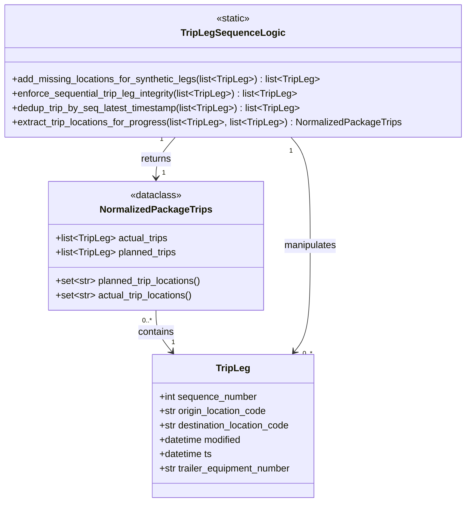

# Diagram: partview_core/partview_service/partview_service/core/business/trip_leg/TripLegSequenceLogic.py

> Auto-generated by Obscura crawlers

## Mermaid

### SVG

<svg id="container" width="774.8125" xmlns="http://www.w3.org/2000/svg" class="classDiagram" height="842" viewBox="0 0 774.8125 842" role="graphics-document document" aria-roledescription="class"><g><defs><marker id="container_class-aggregationStart" class="marker aggregation class" refX="18" refY="7" markerWidth="190" markerHeight="240" orient="auto"><path d="M 18,7 L9,13 L1,7 L9,1 Z"></path></marker></defs><defs><marker id="container_class-aggregationEnd" class="marker aggregation class" refX="1" refY="7" markerWidth="20" markerHeight="28" orient="auto"><path d="M 18,7 L9,13 L1,7 L9,1 Z"></path></marker></defs><defs><marker id="container_class-extensionStart" class="marker extension class" refX="18" refY="7" markerWidth="190" markerHeight="240" orient="auto"><path d="M 1,7 L18,13 V 1 Z"></path></marker></defs><defs><marker id="container_class-extensionEnd" class="marker extension class" refX="1" refY="7" markerWidth="20" markerHeight="28" orient="auto"><path d="M 1,1 V 13 L18,7 Z"></path></marker></defs><defs><marker id="container_class-compositionStart" class="marker composition class" refX="18" refY="7" markerWidth="190" markerHeight="240" orient="auto"><path d="M 18,7 L9,13 L1,7 L9,1 Z"></path></marker></defs><defs><marker id="container_class-compositionEnd" class="marker composition class" refX="1" refY="7" markerWidth="20" markerHeight="28" orient="auto"><path d="M 18,7 L9,13 L1,7 L9,1 Z"></path></marker></defs><defs><marker id="container_class-dependencyStart" class="marker dependency class" refX="6" refY="7" markerWidth="190" markerHeight="240" orient="auto"><path d="M 5,7 L9,13 L1,7 L9,1 Z"></path></marker></defs><defs><marker id="container_class-dependencyEnd" class="marker dependency class" refX="13" refY="7" markerWidth="20" markerHeight="28" orient="auto"><path d="M 18,7 L9,13 L14,7 L9,1 Z"></path></marker></defs><defs><marker id="container_class-lollipopStart" class="marker lollipop class" refX="13" refY="7" markerWidth="190" markerHeight="240" orient="auto"><circle stroke="black" fill="transparent" cx="7" cy="7" r="6"></circle></marker></defs><defs><marker id="container_class-lollipopEnd" class="marker lollipop class" refX="1" refY="7" markerWidth="190" markerHeight="240" orient="auto"><circle stroke="black" fill="transparent" cx="7" cy="7" r="6"></circle></marker></defs><g class="root"><g class="clusters"></g><g class="edgePaths"><path d="M256.859,520L256.859,526.167C256.859,532.333,256.859,544.667,261.348,556.231C265.836,567.796,274.813,578.591,279.301,583.989L283.789,589.387" id="id_NormalizedPackageTrips_TripLeg_1" class="edge-thickness-normal edge-pattern-solid relation" style=";;;" data-edge="true" data-et="edge" data-id="id_NormalizedPackageTrips_TripLeg_1" data-points="W3sieCI6MjU2Ljg1OTM3NSwieSI6NTIwfSx7IngiOjI1Ni44NTkzNzUsInkiOjU1N30seyJ4IjoyODcuNjI1MTk5MDQ0NTg2LCJ5Ijo1OTR9XQ==" marker-end="url(#container_class-dependencyEnd)"></path><path d="M485.316,230L490.756,236.167C496.195,242.333,507.074,254.667,512.514,285C517.953,315.333,517.953,363.667,517.953,412C517.953,460.333,517.953,508.667,513.465,538.231C508.977,567.796,500,578.591,495.512,583.989L491.023,589.387" id="id_TripLegSequenceLogic_TripLeg_2" class="edge-thickness-normal edge-pattern-solid relation" style=";;;" data-edge="true" data-et="edge" data-id="id_TripLegSequenceLogic_TripLeg_2" data-points="W3sieCI6NDg1LjMxNjQwNjI1LCJ5IjoyMzB9LHsieCI6NTE3Ljk1MzEyNSwieSI6MjY3fSx7IngiOjUxNy45NTMxMjUsInkiOjQxMn0seyJ4Ijo1MTcuOTUzMTI1LCJ5Ijo1NTd9LHsieCI6NDg3LjE4NzMwMDk1NTQxNCwieSI6NTk0fV0=" marker-end="url(#container_class-dependencyEnd)"></path><path d="M289.496,230L284.057,236.167C278.617,242.333,267.738,254.667,262.299,266C256.859,277.333,256.859,287.667,256.859,292.833L256.859,298" id="id_TripLegSequenceLogic_NormalizedPackageTrips_3" class="edge-thickness-normal edge-pattern-solid relation" style=";;;" data-edge="true" data-et="edge" data-id="id_TripLegSequenceLogic_NormalizedPackageTrips_3" data-points="W3sieCI6Mjg5LjQ5NjA5Mzc1LCJ5IjoyMzB9LHsieCI6MjU2Ljg1OTM3NSwieSI6MjY3fSx7IngiOjI1Ni44NTkzNzUsInkiOjMwNH1d" marker-end="url(#container_class-dependencyEnd)"></path></g><g class="edgeLabels"><g class="edgeLabel" transform="translate(256.859375, 557)"><g class="label" data-id="id_NormalizedPackageTrips_TripLeg_1" transform="translate(-30.890625, -12)"><foreignObject width="61.78125" height="24">

contains

</foreignObject></g></g><g class="edgeLabel" transform="translate(517.953125, 412)"><g class="label" data-id="id_TripLegSequenceLogic_TripLeg_2" transform="translate(-45.0859375, -12)"><foreignObject width="90.171875" height="24">

manipulates

</foreignObject></g></g><g class="edgeLabel" transform="translate(256.859375, 267)"><g class="label" data-id="id_TripLegSequenceLogic_NormalizedPackageTrips_3" transform="translate(-26.265625, -12)"><foreignObject width="52.53125" height="24">

returns

</foreignObject></g></g><g class="edgeTerminals" transform="translate(241.85937750000014, 537.5000021428572)"><g class="inner" transform="translate(0, 0)"><foreignObject style="width: 36px; height: 12px;">
0..*
</foreignObject></g></g><g class="edgeTerminals" transform="translate(485.6435967390874, 253.04653791385292)"><g class="inner" transform="translate(0, 0)"><foreignObject style="width: 9px; height: 12px;">
1
</foreignObject></g></g><g class="edgeTerminals" transform="translate(266.67065048908745, 233.20142208614706)"><g class="inner" transform="translate(0, 0)"><foreignObject style="width: 9px; height: 12px;">
1
</foreignObject></g></g><g class="edgeTerminals" transform="translate(282.9701325751479, 565.9537202467269)"><g class="inner" transform="translate(0, 0)"></g><foreignObject style="width: 9px; height: 12px;">
1
</foreignObject></g><g class="edgeTerminals" transform="translate(504.90969353056187, 585.134399753273)"><g class="inner" transform="translate(0, 0)"></g><foreignObject style="width: 36px; height: 12px;">
0..*
</foreignObject></g><g class="edgeTerminals" transform="translate(266.8593774999998, 281.5000021428571)"><g class="inner" transform="translate(0, 0)"></g><foreignObject style="width: 9px; height: 12px;">
1
</foreignObject></g></g><g class="nodes"><g class="node default" id="classId-TripLeg-0" transform="translate(387.40625, 714)"><g class="basic label-container"><path d="M-138.93359375 -120 L138.93359375 -120 L138.93359375 120 L-138.93359375 120" stroke="none" stroke-width="0" fill="#ECECFF" style=""></path><path d="M-138.93359375 -120 C-82.64044821006587 -120, -26.347302670131754 -120, 138.93359375 -120 M-138.93359375 -120 C-74.5905976049752 -120, -10.247601459950403 -120, 138.93359375 -120 M138.93359375 -120 C138.93359375 -49.81583675919849, 138.93359375 20.36832648160302, 138.93359375 120 M138.93359375 -120 C138.93359375 -68.91502078986284, 138.93359375 -17.830041579725687, 138.93359375 120 M138.93359375 120 C61.59735410878109 120, -15.73888553243782 120, -138.93359375 120 M138.93359375 120 C64.24125788981118 120, -10.45107797037764 120, -138.93359375 120 M-138.93359375 120 C-138.93359375 43.31296440452179, -138.93359375 -33.374071190956414, -138.93359375 -120 M-138.93359375 120 C-138.93359375 54.31430108886772, -138.93359375 -11.371397822264555, -138.93359375 -120" stroke="#9370DB" stroke-width="1.3" fill="none" stroke-dasharray="0 0" style=""></path></g><g class="annotation-group text" transform="translate(0, -96)"></g><g class="label-group text" transform="translate(-27.0546875, -96)"><g class="label" style="font-weight: bolder" transform="translate(0,-12)"><foreignObject width="54.109375" height="24">

TripLeg

</foreignObject></g></g><g class="members-group text" transform="translate(-126.93359375, -48)"><g class="label" style="" transform="translate(0,-12)"><foreignObject width="165.90625" height="24">

+int sequence_number

</foreignObject></g><g class="label" style="" transform="translate(0,12)"><foreignObject width="184.171875" height="24">

+str origin_location_code

</foreignObject></g><g class="label" style="" transform="translate(0,36)"><foreignObject width="225.0625" height="24">

+str destination_location_code

</foreignObject></g><g class="label" style="" transform="translate(0,60)"><foreignObject width="142.109375" height="24">

+datetime modified

</foreignObject></g><g class="label" style="" transform="translate(0,84)"><foreignObject width="90.734375" height="24">

+datetime ts

</foreignObject></g><g class="label" style="" transform="translate(0,108)"><foreignObject width="226.8125" height="24">

+str trailer_equipment_number

</foreignObject></g></g><g class="methods-group text" transform="translate(-126.93359375, 120)"></g><g class="divider" style=""><path d="M-138.93359375 -72 C-32.864868846853426 -72, 73.20385605629315 -72, 138.93359375 -72 M-138.93359375 -72 C-31.315243569773088 -72, 76.30310661045382 -72, 138.93359375 -72" stroke="#9370DB" stroke-width="1.3" fill="none" stroke-dasharray="0 0" style=""></path></g><g class="divider" style=""><path d="M-138.93359375 96 C-42.90669635166749 96, 53.12020104666502 96, 138.93359375 96 M-138.93359375 96 C-78.0067819533981 96, -17.079970156796207 96, 138.93359375 96" stroke="#9370DB" stroke-width="1.3" fill="none" stroke-dasharray="0 0" style=""></path></g></g><g class="node default" id="classId-NormalizedPackageTrips-1" transform="translate(256.859375, 412)"><g class="basic label-container"><path d="M-181.0078125 -108 L181.0078125 -108 L181.0078125 108 L-181.0078125 108" stroke="none" stroke-width="0" fill="#ECECFF" style=""></path><path d="M-181.0078125 -108 C-73.99955138304652 -108, 33.008709733906954 -108, 181.0078125 -108 M-181.0078125 -108 C-68.33397054105724 -108, 44.33987141788552 -108, 181.0078125 -108 M181.0078125 -108 C181.0078125 -30.527056140803694, 181.0078125 46.94588771839261, 181.0078125 108 M181.0078125 -108 C181.0078125 -47.63765560101959, 181.0078125 12.724688797960823, 181.0078125 108 M181.0078125 108 C54.35737597865635 108, -72.2930605426873 108, -181.0078125 108 M181.0078125 108 C65.74193317920162 108, -49.52394614159675 108, -181.0078125 108 M-181.0078125 108 C-181.0078125 29.449237816318174, -181.0078125 -49.10152436736365, -181.0078125 -108 M-181.0078125 108 C-181.0078125 64.5610942455365, -181.0078125 21.12218849107299, -181.0078125 -108" stroke="#9370DB" stroke-width="1.3" fill="none" stroke-dasharray="0 0" style=""></path></g><g class="annotation-group text" transform="translate(-43.0859375, -84)"><g class="label" style="" transform="translate(0,-12)"><foreignObject width="86.171875" height="24">

«dataclass»

</foreignObject></g></g><g class="label-group text" transform="translate(-89.734375, -60)"><g class="label" style="font-weight: bolder" transform="translate(0,-12)"><foreignObject width="179.46875" height="24">

NormalizedPackageTrips

</foreignObject></g></g><g class="members-group text" transform="translate(-169.0078125, -12)"><g class="label" style="" transform="translate(0,-12)"><foreignObject width="189.390625" height="24">

+list&lt;TripLeg&gt; actual_trips

</foreignObject></g><g class="label" style="" transform="translate(0,12)"><foreignObject width="204.5625" height="24">

+list&lt;TripLeg&gt; planned_trips

</foreignObject></g></g><g class="methods-group text" transform="translate(-169.0078125, 60)"><g class="label" style="" transform="translate(0,-12)"><foreignObject width="248.28125" height="24">

+set&lt;str&gt; planned_trip_locations()

</foreignObject></g><g class="label" style="" transform="translate(0,12)"><foreignObject width="233.09375" height="24">

+set&lt;str&gt; actual_trip_locations()

</foreignObject></g></g><g class="divider" style=""><path d="M-181.0078125 -36 C-61.32881756897514 -36, 58.35017736204972 -36, 181.0078125 -36 M-181.0078125 -36 C-96.04160778711747 -36, -11.075403074234941 -36, 181.0078125 -36" stroke="#9370DB" stroke-width="1.3" fill="none" stroke-dasharray="0 0" style=""></path></g><g class="divider" style=""><path d="M-181.0078125 36 C-66.86478333523355 36, 47.27824582953289 36, 181.0078125 36 M-181.0078125 36 C-104.74383779034184 36, -28.479863080683685 36, 181.0078125 36" stroke="#9370DB" stroke-width="1.3" fill="none" stroke-dasharray="0 0" style=""></path></g></g><g class="node default" id="classId-TripLegSequenceLogic-2" transform="translate(387.40625, 119)"><g class="basic label-container"><path d="M-379.40625 -111 L379.40625 -111 L379.40625 111 L-379.40625 111" stroke="none" stroke-width="0" fill="#ECECFF" style=""></path><path d="M-379.40625 -111 C-160.35862557553085 -111, 58.6889988489383 -111, 379.40625 -111 M-379.40625 -111 C-126.22664571541893 -111, 126.95295856916215 -111, 379.40625 -111 M379.40625 -111 C379.40625 -45.95580648806019, 379.40625 19.08838702387962, 379.40625 111 M379.40625 -111 C379.40625 -35.31949842953058, 379.40625 40.361003140938834, 379.40625 111 M379.40625 111 C101.96224937826742 111, -175.48175124346517 111, -379.40625 111 M379.40625 111 C196.4866665910314 111, 13.567083182062788 111, -379.40625 111 M-379.40625 111 C-379.40625 41.98315833137568, -379.40625 -27.033683337248647, -379.40625 -111 M-379.40625 111 C-379.40625 40.580168198009716, -379.40625 -29.83966360398057, -379.40625 -111" stroke="#9370DB" stroke-width="1.3" fill="none" stroke-dasharray="0 0" style=""></path></g><g class="annotation-group text" transform="translate(-29.0234375, -87)"><g class="label" style="" transform="translate(0,-12)"><foreignObject width="58.046875" height="24">

«static»

</foreignObject></g></g><g class="label-group text" transform="translate(-81.609375, -63)"><g class="label" style="font-weight: bolder" transform="translate(0,-12)"><foreignObject width="163.21875" height="24">

TripLegSequenceLogic

</foreignObject></g></g><g class="members-group text" transform="translate(-367.40625, -15)"></g><g class="methods-group text" transform="translate(-367.40625, 15)"><g class="label" style="" transform="translate(0,-12)"><foreignObject width="517.609375" height="24">

+add_missing_locations_for_synthetic_legs(list&lt;TripLeg&gt;) : list&lt;TripLeg&gt;

</foreignObject></g><g class="label" style="" transform="translate(0,12)"><foreignObject width="484.390625" height="24">

+enforce_sequential_trip_leg_integrity(list&lt;TripLeg&gt;) : list&lt;TripLeg&gt;

</foreignObject></g><g class="label" style="" transform="translate(0,36)"><foreignObject width="486.75" height="24">

+dedup_trip_by_seq_latest_timestamp(list&lt;TripLeg&gt;) : list&lt;TripLeg&gt;

</foreignObject></g><g class="label" style="" transform="translate(0,60)"><foreignObject width="653.203125" height="24">

+extract_trip_locations_for_progress(list&lt;TripLeg&gt;, list&lt;TripLeg&gt;) : NormalizedPackageTrips

</foreignObject></g></g><g class="divider" style=""><path d="M-379.40625 -39 C-184.64638924429713 -39, 10.113471511405749 -39, 379.40625 -39 M-379.40625 -39 C-204.99050832232555 -39, -30.574766644651106 -39, 379.40625 -39" stroke="#9370DB" stroke-width="1.3" fill="none" stroke-dasharray="0 0" style=""></path></g><g class="divider" style=""><path d="M-379.40625 -15 C-136.6513737448963 -15, 106.10350251020742 -15, 379.40625 -15 M-379.40625 -15 C-105.67321133904568 -15, 168.05982732190864 -15, 379.40625 -15" stroke="#9370DB" stroke-width="1.3" fill="none" stroke-dasharray="0 0" style=""></path></g></g></g></g></g></svg>
