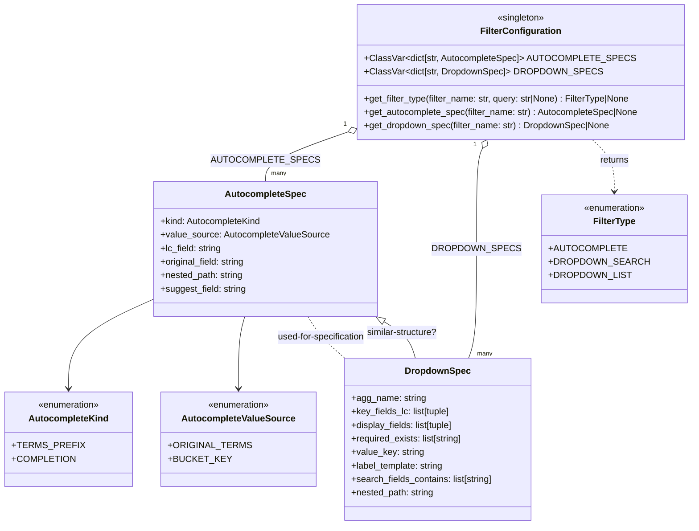

# Diagram: partview_core/partview_service/partview_service/core/configuration/filter_configuration.py

> Auto-generated by Obscura crawlers

## Mermaid

### SVG

<svg id="container" width="1182.34375" xmlns="http://www.w3.org/2000/svg" class="classDiagram" height="932" viewBox="0 0 1182.34375 932" role="graphics-document document" aria-roledescription="class"><g><defs><marker id="container_class-aggregationStart" class="marker aggregation class" refX="18" refY="7" markerWidth="190" markerHeight="240" orient="auto"><path d="M 18,7 L9,13 L1,7 L9,1 Z"></path></marker></defs><defs><marker id="container_class-aggregationEnd" class="marker aggregation class" refX="1" refY="7" markerWidth="20" markerHeight="28" orient="auto"><path d="M 18,7 L9,13 L1,7 L9,1 Z"></path></marker></defs><defs><marker id="container_class-extensionStart" class="marker extension class" refX="18" refY="7" markerWidth="190" markerHeight="240" orient="auto"><path d="M 1,7 L18,13 V 1 Z"></path></marker></defs><defs><marker id="container_class-extensionEnd" class="marker extension class" refX="1" refY="7" markerWidth="20" markerHeight="28" orient="auto"><path d="M 1,1 V 13 L18,7 Z"></path></marker></defs><defs><marker id="container_class-compositionStart" class="marker composition class" refX="18" refY="7" markerWidth="190" markerHeight="240" orient="auto"><path d="M 18,7 L9,13 L1,7 L9,1 Z"></path></marker></defs><defs><marker id="container_class-compositionEnd" class="marker composition class" refX="1" refY="7" markerWidth="20" markerHeight="28" orient="auto"><path d="M 18,7 L9,13 L1,7 L9,1 Z"></path></marker></defs><defs><marker id="container_class-dependencyStart" class="marker dependency class" refX="6" refY="7" markerWidth="190" markerHeight="240" orient="auto"><path d="M 5,7 L9,13 L1,7 L9,1 Z"></path></marker></defs><defs><marker id="container_class-dependencyEnd" class="marker dependency class" refX="13" refY="7" markerWidth="20" markerHeight="28" orient="auto"><path d="M 18,7 L9,13 L14,7 L9,1 Z"></path></marker></defs><defs><marker id="container_class-lollipopStart" class="marker lollipop class" refX="13" refY="7" markerWidth="190" markerHeight="240" orient="auto"><circle stroke="black" fill="transparent" cx="7" cy="7" r="6"></circle></marker></defs><defs><marker id="container_class-lollipopEnd" class="marker lollipop class" refX="1" refY="7" markerWidth="190" markerHeight="240" orient="auto"><circle stroke="black" fill="transparent" cx="7" cy="7" r="6"></circle></marker></defs><g class="root"><g class="clusters"></g><g class="edgePaths"><path d="M573.277,236.769L550.466,244.808C527.654,252.846,482.03,268.923,459.218,283.128C436.406,297.333,436.406,309.667,436.406,315.833L436.406,322" id="id_FilterConfiguration_AutocompleteSpec_1" class="edge-thickness-normal edge-pattern-solid relation" style=";;;" data-edge="true" data-et="edge" data-id="id_FilterConfiguration_AutocompleteSpec_1" data-points="W3sieCI6NTg5LjU0Njg3NSwieSI6MjMxLjAzNTk4MTY5MzUyNDM1fSx7IngiOjQzNi40MDYyNSwieSI6Mjg1fSx7IngiOjQzNi40MDYyNSwieSI6MzIyfV0=" marker-start="url(#container_class-aggregationStart)"></path><path d="M811.199,263.286L809.306,266.905C807.414,270.524,803.629,277.762,801.736,307.548C799.844,337.333,799.844,389.667,799.844,442C799.844,494.333,799.844,546.667,797.429,579C795.015,611.333,790.187,623.667,787.772,629.833L785.358,636" id="id_FilterConfiguration_DropdownSpec_2" class="edge-thickness-normal edge-pattern-solid relation" style=";;;" data-edge="true" data-et="edge" data-id="id_FilterConfiguration_DropdownSpec_2" data-points="W3sieCI6ODE5LjE5MjUyNTg3NTc5NjIsInkiOjI0OH0seyJ4Ijo3OTkuODQzNzUsInkiOjI4NX0seyJ4Ijo3OTkuODQzNzUsInkiOjQ0Mn0seyJ4Ijo3OTkuODQzNzUsInkiOjU5OX0seyJ4Ijo3ODUuMzU3ODg1ODc3MDcxOCwieSI6NjM2fV0=" marker-start="url(#container_class-aggregationStart)"></path><path d="M240.082,536.266L218.307,546.722C196.531,557.178,152.98,578.089,131.205,603.711C109.43,629.333,109.43,659.667,109.43,674.833L109.43,690" id="id_AutocompleteSpec_AutocompleteKind_3" class="edge-thickness-normal edge-pattern-solid relation" style=";;;" data-edge="true" data-et="edge" data-id="id_AutocompleteSpec_AutocompleteKind_3" data-points="W3sieCI6MjQwLjA4MjAzMTI1LCJ5Ijo1MzYuMjY2Mzk2Njc0MDczNn0seyJ4IjoxMDkuNDI5Njg3NSwieSI6NTk5fSx7IngiOjEwOS40Mjk2ODc1LCJ5Ijo2OTZ9XQ==" marker-end="url(#container_class-dependencyEnd)"></path><path d="M398.154,562L396.188,568.167C394.222,574.333,390.291,586.667,388.325,608C386.359,629.333,386.359,659.667,386.359,674.833L386.359,690" id="id_AutocompleteSpec_AutocompleteValueSource_4" class="edge-thickness-normal edge-pattern-solid relation" style=";;;" data-edge="true" data-et="edge" data-id="id_AutocompleteSpec_AutocompleteValueSource_4" data-points="W3sieCI6Mzk4LjE1Mzg2MTQ2NDk2ODE0LCJ5Ijo1NjJ9LHsieCI6Mzg2LjM1OTM3NSwieSI6NTk5fSx7IngiOjM4Ni4zNTkzNzUsInkiOjY5Nn1d" marker-end="url(#container_class-dependencyEnd)"></path><path d="M989.158,248L994.667,254.167C1000.177,260.333,1011.196,272.667,1016.705,288C1022.215,303.333,1022.215,321.667,1022.215,330.833L1022.215,340" id="id_FilterConfiguration_FilterType_5" class="edge-thickness-normal edge-pattern-dashed relation" style=";;;" data-edge="true" data-et="edge" data-id="id_FilterConfiguration_FilterType_5" data-points="W3sieCI6OTg5LjE1NzY5MzA3MzI0ODQsInkiOjI0OH0seyJ4IjoxMDIyLjIxNDg0Mzc1LCJ5IjoyODV9LHsieCI6MTAyMi4yMTQ4NDM3NSwieSI6MzQ2fV0=" marker-end="url(#container_class-dependencyEnd)"></path><path d="M697.824,636L696.49,629.833C695.155,623.667,692.487,611.333,683.643,600.514C674.799,589.695,659.78,580.39,652.27,575.737L644.761,571.085" id="id_DropdownSpec_AutocompleteSpec_6" class="edge-thickness-normal edge-pattern-solid relation" style=";;;" data-edge="true" data-et="edge" data-id="id_DropdownSpec_AutocompleteSpec_6" data-points="W3sieCI6Njk3LjgyMzg3MzQ0NjEzMjYsInkiOjYzNn0seyJ4Ijo2ODkuODE4MzU5Mzc1LCJ5Ijo1OTl9LHsieCI6NjMwLjA5NzAzNDIzNTY2ODgsInkiOjU2Mn1d" marker-end="url(#container_class-extensionEnd)"></path><path d="M504.591,562L508.095,568.167C511.599,574.333,518.607,586.667,529.04,599C539.473,611.333,553.33,623.667,560.258,629.833L567.187,636" id="id_AutocompleteSpec_DropdownSpec_7" class="edge-thickness-normal edge-pattern-dashed relation" style=";;;" data-edge="true" data-et="edge" data-id="id_AutocompleteSpec_DropdownSpec_7" data-points="W3sieCI6NTA0LjU5MTQ2MDk4NzI2MTE0LCJ5Ijo1NjJ9LHsieCI6NTI1LjYxNTIzNDM3NSwieSI6NTk5fSx7IngiOjU2Ny4xODcxMzMxMTQ2NDA5LCJ5Ijo2MzZ9XQ=="></path></g><g class="edgeLabels"><g class="edgeLabel" transform="translate(436.40625, 285)"><g class="label" data-id="id_FilterConfiguration_AutocompleteSpec_1" transform="translate(-82.5, -12)"><foreignObject width="165" height="24">

AUTOCOMPLETE_SPECS

</foreignObject></g></g><g class="edgeLabel" transform="translate(799.84375, 442)"><g class="label" data-id="id_FilterConfiguration_DropdownSpec_2" transform="translate(-68.8203125, -12)"><foreignObject width="137.640625" height="24">

DROPDOWN_SPECS

</foreignObject></g></g><g class="edgeLabel"><g class="label" data-id="id_AutocompleteSpec_AutocompleteKind_3" transform="translate(0, 0)"><foreignObject width="0" height="0">

</foreignObject></g></g><g class="edgeLabel"><g class="label" data-id="id_AutocompleteSpec_AutocompleteValueSource_4" transform="translate(0, 0)"><foreignObject width="0" height="0">

</foreignObject></g></g><g class="edgeLabel" transform="translate(1022.21484375, 285)"><g class="label" data-id="id_FilterConfiguration_FilterType_5" transform="translate(-26.265625, -12)"><foreignObject width="52.53125" height="24">

returns

</foreignObject></g></g><g class="edgeLabel" transform="translate(676.048, 590.46866)"><g class="label" data-id="id_DropdownSpec_AutocompleteSpec_6" transform="translate(-64.109375, -12)"><foreignObject width="128.21875" height="24">

similar-structure?

</foreignObject></g></g><g class="edgeLabel" transform="translate(525.615234375, 599)"><g class="label" data-id="id_AutocompleteSpec_DropdownSpec_7" transform="translate(-80.09375, -12)"><foreignObject width="160.1875" height="24">

used-for-specification

</foreignObject></g></g><g class="edgeTerminals" transform="translate(568.0563852900638, 222.70479002528916)"><g class="inner" transform="translate(0, 0)"><foreignObject style="width: 9px; height: 12px;">
1
</foreignObject></g></g><g class="edgeTerminals" transform="translate(797.7907669217062, 256.5565569503944)"><g class="inner" transform="translate(0, 0)"><foreignObject style="width: 9px; height: 12px;">
1
</foreignObject></g></g><g class="edgeTerminals" transform="translate(446.40625, 299.5)"><g class="inner" transform="translate(0, 0)"></g><foreignObject style="width: 36px; height: 12px;">
many
</foreignObject></g><g class="edgeTerminals" transform="translate(800.7054452950081, 620.1728695527586)"><g class="inner" transform="translate(0, 0)"></g><foreignObject style="width: 36px; height: 12px;">
many
</foreignObject></g></g><g class="nodes"><g class="node default" id="classId-FilterConfiguration-0" transform="translate(881.9453125, 128)"><g class="basic label-container"><path d="M-292.3984375 -120 L292.3984375 -120 L292.3984375 120 L-292.3984375 120" stroke="none" stroke-width="0" fill="#ECECFF" style=""></path><path d="M-292.3984375 -120 C-172.28294803402133 -120, -52.16745856804269 -120, 292.3984375 -120 M-292.3984375 -120 C-88.21293819554424 -120, 115.97256110891152 -120, 292.3984375 -120 M292.3984375 -120 C292.3984375 -64.9458877307338, 292.3984375 -9.891775461467589, 292.3984375 120 M292.3984375 -120 C292.3984375 -33.14832118657603, 292.3984375 53.70335762684795, 292.3984375 120 M292.3984375 120 C165.49870310497533 120, 38.59896870995067 120, -292.3984375 120 M292.3984375 120 C135.05771214282004 120, -22.283013214359926 120, -292.3984375 120 M-292.3984375 120 C-292.3984375 66.80348422883807, -292.3984375 13.606968457676132, -292.3984375 -120 M-292.3984375 120 C-292.3984375 56.46937306220539, -292.3984375 -7.061253875589216, -292.3984375 -120" stroke="#9370DB" stroke-width="1.3" fill="none" stroke-dasharray="0 0" style=""></path></g><g class="annotation-group text" transform="translate(-42.765625, -96)"><g class="label" style="" transform="translate(0,-12)"><foreignObject width="85.53125" height="24">

«singleton»

</foreignObject></g></g><g class="label-group text" transform="translate(-68.234375, -72)"><g class="label" style="font-weight: bolder" transform="translate(0,-12)"><foreignObject width="136.46875" height="24">

FilterConfiguration

</foreignObject></g></g><g class="members-group text" transform="translate(-280.3984375, -24)"><g class="label" style="" transform="translate(0,-12)"><foreignObject width="452.546875" height="24">

+ClassVar&lt;dict[str, AutocompleteSpec]&gt; AUTOCOMPLETE_SPECS

</foreignObject></g><g class="label" style="" transform="translate(0,12)"><foreignObject width="398.96875" height="24">

+ClassVar&lt;dict[str, DropdownSpec]&gt; DROPDOWN_SPECS

</foreignObject></g></g><g class="methods-group text" transform="translate(-280.3984375, 48)"><g class="label" style="" transform="translate(0,-12)"><foreignObject width="479.75" height="24">

+get_filter_type(filter_name: str, query: str|None) : FilterType|None

</foreignObject></g><g class="label" style="" transform="translate(0,12)"><foreignObject width="492.5625" height="24">

+get_autocomplete_spec(filter_name: str) : AutocompleteSpec|None

</foreignObject></g><g class="label" style="" transform="translate(0,36)"><foreignObject width="440.171875" height="24">

+get_dropdown_spec(filter_name: str) : DropdownSpec|None

</foreignObject></g></g><g class="divider" style=""><path d="M-292.3984375 -48 C-158.14689825317805 -48, -23.895359006356102 -48, 292.3984375 -48 M-292.3984375 -48 C-126.27470017805018 -48, 39.849037143899636 -48, 292.3984375 -48" stroke="#9370DB" stroke-width="1.3" fill="none" stroke-dasharray="0 0" style=""></path></g><g class="divider" style=""><path d="M-292.3984375 24 C-83.97103766810747 24, 124.45636216378506 24, 292.3984375 24 M-292.3984375 24 C-104.79533045827466 24, 82.80777658345067 24, 292.3984375 24" stroke="#9370DB" stroke-width="1.3" fill="none" stroke-dasharray="0 0" style=""></path></g></g><g class="node default" id="classId-AutocompleteSpec-1" transform="translate(436.40625, 442)"><g class="basic label-container"><path d="M-196.32421875 -120 L196.32421875 -120 L196.32421875 120 L-196.32421875 120" stroke="none" stroke-width="0" fill="#ECECFF" style=""></path><path d="M-196.32421875 -120 C-86.30261861332626 -120, 23.71898152334748 -120, 196.32421875 -120 M-196.32421875 -120 C-66.1685563087847 -120, 63.9871061324306 -120, 196.32421875 -120 M196.32421875 -120 C196.32421875 -43.395218073835736, 196.32421875 33.20956385232853, 196.32421875 120 M196.32421875 -120 C196.32421875 -63.25378610017075, 196.32421875 -6.5075722003414995, 196.32421875 120 M196.32421875 120 C75.44086967657996 120, -45.44247939684007 120, -196.32421875 120 M196.32421875 120 C107.84001717904806 120, 19.355815608096123 120, -196.32421875 120 M-196.32421875 120 C-196.32421875 40.38954985532877, -196.32421875 -39.22090028934247, -196.32421875 -120 M-196.32421875 120 C-196.32421875 45.62325575196505, -196.32421875 -28.753488496069906, -196.32421875 -120" stroke="#9370DB" stroke-width="1.3" fill="none" stroke-dasharray="0 0" style=""></path></g><g class="annotation-group text" transform="translate(0, -96)"></g><g class="label-group text" transform="translate(-68.5078125, -96)"><g class="label" style="font-weight: bolder" transform="translate(0,-12)"><foreignObject width="137.015625" height="24">

AutocompleteSpec

</foreignObject></g></g><g class="members-group text" transform="translate(-184.32421875, -48)"><g class="label" style="" transform="translate(0,-12)"><foreignObject width="181.4375" height="24">

+kind: AutocompleteKind

</foreignObject></g><g class="label" style="" transform="translate(0,12)"><foreignObject width="300.140625" height="24">

+value_source: AutocompleteValueSource

</foreignObject></g><g class="label" style="" transform="translate(0,36)"><foreignObject width="110.0625" height="24">

+lc_field: string

</foreignObject></g><g class="label" style="" transform="translate(0,60)"><foreignObject width="153.265625" height="24">

+original_field: string

</foreignObject></g><g class="label" style="" transform="translate(0,84)"><foreignObject width="148.609375" height="24">

+nested_path: string

</foreignObject></g><g class="label" style="" transform="translate(0,108)"><foreignObject width="152.9375" height="24">

+suggest_field: string

</foreignObject></g></g><g class="methods-group text" transform="translate(-184.32421875, 120)"></g><g class="divider" style=""><path d="M-196.32421875 -72 C-111.32849771667236 -72, -26.33277668334472 -72, 196.32421875 -72 M-196.32421875 -72 C-51.806988451911764 -72, 92.71024184617647 -72, 196.32421875 -72" stroke="#9370DB" stroke-width="1.3" fill="none" stroke-dasharray="0 0" style=""></path></g><g class="divider" style=""><path d="M-196.32421875 96 C-54.87180680889017 96, 86.58060513221966 96, 196.32421875 96 M-196.32421875 96 C-112.19707278621088 96, -28.069926822421763 96, 196.32421875 96" stroke="#9370DB" stroke-width="1.3" fill="none" stroke-dasharray="0 0" style=""></path></g></g><g class="node default" id="classId-DropdownSpec-2" transform="translate(728.98046875, 780)"><g class="basic label-container"><path d="M-167.12109375 -144 L167.12109375 -144 L167.12109375 144 L-167.12109375 144" stroke="none" stroke-width="0" fill="#ECECFF" style=""></path><path d="M-167.12109375 -144 C-48.92862256940427 -144, 69.26384861119146 -144, 167.12109375 -144 M-167.12109375 -144 C-74.49426170116364 -144, 18.132570347672726 -144, 167.12109375 -144 M167.12109375 -144 C167.12109375 -53.92440075281428, 167.12109375 36.15119849437144, 167.12109375 144 M167.12109375 -144 C167.12109375 -60.15710638501423, 167.12109375 23.685787229971538, 167.12109375 144 M167.12109375 144 C87.84103419783916 144, 8.560974645678328 144, -167.12109375 144 M167.12109375 144 C70.50355755683695 144, -26.113978636326095 144, -167.12109375 144 M-167.12109375 144 C-167.12109375 29.405192065725686, -167.12109375 -85.18961586854863, -167.12109375 -144 M-167.12109375 144 C-167.12109375 76.04650615559873, -167.12109375 8.09301231119747, -167.12109375 -144" stroke="#9370DB" stroke-width="1.3" fill="none" stroke-dasharray="0 0" style=""></path></g><g class="annotation-group text" transform="translate(0, -120)"></g><g class="label-group text" transform="translate(-55.3046875, -120)"><g class="label" style="font-weight: bolder" transform="translate(0,-12)"><foreignObject width="110.609375" height="24">

DropdownSpec

</foreignObject></g></g><g class="members-group text" transform="translate(-155.12109375, -72)"><g class="label" style="" transform="translate(0,-12)"><foreignObject width="131.546875" height="24">

+agg_name: string

</foreignObject></g><g class="label" style="" transform="translate(0,12)"><foreignObject width="178.5625" height="24">

+key_fields_lc: list[tuple]

</foreignObject></g><g class="label" style="" transform="translate(0,36)"><foreignObject width="185.828125" height="24">

+display_fields: list[tuple]

</foreignObject></g><g class="label" style="" transform="translate(0,60)"><foreignObject width="201.8125" height="24">

+required_exists: list[string]

</foreignObject></g><g class="label" style="" transform="translate(0,84)"><foreignObject width="129.0625" height="24">

+value_key: string

</foreignObject></g><g class="label" style="" transform="translate(0,108)"><foreignObject width="166.96875" height="24">

+label_template: string

</foreignObject></g><g class="label" style="" transform="translate(0,132)"><foreignObject width="254.9375" height="24">

+search_fields_contains: list[string]

</foreignObject></g><g class="label" style="" transform="translate(0,156)"><foreignObject width="148.609375" height="24">

+nested_path: string

</foreignObject></g></g><g class="methods-group text" transform="translate(-155.12109375, 144)"></g><g class="divider" style=""><path d="M-167.12109375 -96 C-84.16287932791563 -96, -1.2046649058312653 -96, 167.12109375 -96 M-167.12109375 -96 C-52.479212380331944 -96, 62.16266898933611 -96, 167.12109375 -96" stroke="#9370DB" stroke-width="1.3" fill="none" stroke-dasharray="0 0" style=""></path></g><g class="divider" style=""><path d="M-167.12109375 120 C-88.09068316636835 120, -9.060272582736701 120, 167.12109375 120 M-167.12109375 120 C-55.7718751957195 120, 55.577343358560995 120, 167.12109375 120" stroke="#9370DB" stroke-width="1.3" fill="none" stroke-dasharray="0 0" style=""></path></g></g><g class="node default" id="classId-FilterType-3" transform="translate(1022.21484375, 442)"><g class="basic label-container"><path d="M-118.55078125 -96 L118.55078125 -96 L118.55078125 96 L-118.55078125 96" stroke="none" stroke-width="0" fill="#ECECFF" style=""></path><path d="M-118.55078125 -96 C-43.45242327555819 -96, 31.64593469888362 -96, 118.55078125 -96 M-118.55078125 -96 C-65.84013624892928 -96, -13.129491247858567 -96, 118.55078125 -96 M118.55078125 -96 C118.55078125 -28.505388397440328, 118.55078125 38.989223205119345, 118.55078125 96 M118.55078125 -96 C118.55078125 -42.49364014583308, 118.55078125 11.012719708333833, 118.55078125 96 M118.55078125 96 C35.741304951291724 96, -47.06817134741655 96, -118.55078125 96 M118.55078125 96 C48.32287250547232 96, -21.905036239055363 96, -118.55078125 96 M-118.55078125 96 C-118.55078125 40.77223405570181, -118.55078125 -14.455531888596383, -118.55078125 -96 M-118.55078125 96 C-118.55078125 25.774968173794008, -118.55078125 -44.450063652411984, -118.55078125 -96" stroke="#9370DB" stroke-width="1.3" fill="none" stroke-dasharray="0 0" style=""></path></g><g class="annotation-group text" transform="translate(-55.5546875, -72)"><g class="label" style="" transform="translate(0,-12)"><foreignObject width="111.109375" height="24">

«enumeration»

</foreignObject></g></g><g class="label-group text" transform="translate(-36.203125, -48)"><g class="label" style="font-weight: bolder" transform="translate(0,-12)"><foreignObject width="72.40625" height="24">

FilterType

</foreignObject></g></g><g class="members-group text" transform="translate(-106.55078125, 0)"><g class="label" style="" transform="translate(0,-12)"><foreignObject width="120.921875" height="24">

+AUTOCOMPLETE

</foreignObject></g><g class="label" style="" transform="translate(0,12)"><foreignObject width="157.546875" height="24">

+DROPDOWN_SEARCH

</foreignObject></g><g class="label" style="" transform="translate(0,36)"><foreignObject width="131.375" height="24">

+DROPDOWN_LIST

</foreignObject></g></g><g class="methods-group text" transform="translate(-106.55078125, 96)"></g><g class="divider" style=""><path d="M-118.55078125 -24 C-51.26139499542286 -24, 16.027991259154277 -24, 118.55078125 -24 M-118.55078125 -24 C-37.97628298827699 -24, 42.598215273446016 -24, 118.55078125 -24" stroke="#9370DB" stroke-width="1.3" fill="none" stroke-dasharray="0 0" style=""></path></g><g class="divider" style=""><path d="M-118.55078125 72 C-55.938985316952554 72, 6.672810616094893 72, 118.55078125 72 M-118.55078125 72 C-41.67317046824763 72, 35.20444031350473 72, 118.55078125 72" stroke="#9370DB" stroke-width="1.3" fill="none" stroke-dasharray="0 0" style=""></path></g></g><g class="node default" id="classId-AutocompleteKind-4" transform="translate(109.4296875, 780)"><g class="basic label-container"><path d="M-101.4296875 -84 L101.4296875 -84 L101.4296875 84 L-101.4296875 84" stroke="none" stroke-width="0" fill="#ECECFF" style=""></path><path d="M-101.4296875 -84 C-57.98590378279776 -84, -14.542120065595526 -84, 101.4296875 -84 M-101.4296875 -84 C-47.579038768659515 -84, 6.271609962680969 -84, 101.4296875 -84 M101.4296875 -84 C101.4296875 -35.212475232572956, 101.4296875 13.575049534854088, 101.4296875 84 M101.4296875 -84 C101.4296875 -27.30514768333863, 101.4296875 29.389704633322737, 101.4296875 84 M101.4296875 84 C20.375266064674236 84, -60.67915537065153 84, -101.4296875 84 M101.4296875 84 C45.40080858498777 84, -10.628070330024457 84, -101.4296875 84 M-101.4296875 84 C-101.4296875 28.10654016188049, -101.4296875 -27.786919676239023, -101.4296875 -84 M-101.4296875 84 C-101.4296875 30.470510788651538, -101.4296875 -23.058978422696924, -101.4296875 -84" stroke="#9370DB" stroke-width="1.3" fill="none" stroke-dasharray="0 0" style=""></path></g><g class="annotation-group text" transform="translate(-55.5546875, -60)"><g class="label" style="" transform="translate(0,-12)"><foreignObject width="111.109375" height="24">

«enumeration»

</foreignObject></g></g><g class="label-group text" transform="translate(-67.640625, -36)"><g class="label" style="font-weight: bolder" transform="translate(0,-12)"><foreignObject width="135.28125" height="24">

AutocompleteKind

</foreignObject></g></g><g class="members-group text" transform="translate(-89.4296875, 12)"><g class="label" style="" transform="translate(0,-12)"><foreignObject width="111.21875" height="24">

+TERMS_PREFIX

</foreignObject></g><g class="label" style="" transform="translate(0,12)"><foreignObject width="100.859375" height="24">

+COMPLETION

</foreignObject></g></g><g class="methods-group text" transform="translate(-89.4296875, 84)"></g><g class="divider" style=""><path d="M-101.4296875 -12 C-36.03626797516084 -12, 29.35715154967832 -12, 101.4296875 -12 M-101.4296875 -12 C-27.245872294993376 -12, 46.93794291001325 -12, 101.4296875 -12" stroke="#9370DB" stroke-width="1.3" fill="none" stroke-dasharray="0 0" style=""></path></g><g class="divider" style=""><path d="M-101.4296875 60 C-40.585445390613785 60, 20.25879671877243 60, 101.4296875 60 M-101.4296875 60 C-54.3406048888166 60, -7.2515222776332 60, 101.4296875 60" stroke="#9370DB" stroke-width="1.3" fill="none" stroke-dasharray="0 0" style=""></path></g></g><g class="node default" id="classId-AutocompleteValueSource-5" transform="translate(386.359375, 780)"><g class="basic label-container"><path d="M-125.5 -84 L125.5 -84 L125.5 84 L-125.5 84" stroke="none" stroke-width="0" fill="#ECECFF" style=""></path><path d="M-125.5 -84 C-41.98231671489876 -84, 41.535366570202484 -84, 125.5 -84 M-125.5 -84 C-71.07153744790045 -84, -16.643074895800908 -84, 125.5 -84 M125.5 -84 C125.5 -50.366937225845, 125.5 -16.73387445169, 125.5 84 M125.5 -84 C125.5 -45.53843993977104, 125.5 -7.076879879542076, 125.5 84 M125.5 84 C59.61658372046739 84, -6.266832559065222 84, -125.5 84 M125.5 84 C27.65170056264236 84, -70.19659887471528 84, -125.5 84 M-125.5 84 C-125.5 47.306875617009645, -125.5 10.61375123401929, -125.5 -84 M-125.5 84 C-125.5 32.19087641511037, -125.5 -19.618247169779266, -125.5 -84" stroke="#9370DB" stroke-width="1.3" fill="none" stroke-dasharray="0 0" style=""></path></g><g class="annotation-group text" transform="translate(-55.5546875, -60)"><g class="label" style="" transform="translate(0,-12)"><foreignObject width="111.109375" height="24">

«enumeration»

</foreignObject></g></g><g class="label-group text" transform="translate(-95.703125, -36)"><g class="label" style="font-weight: bolder" transform="translate(0,-12)"><foreignObject width="191.40625" height="24">

AutocompleteValueSource

</foreignObject></g></g><g class="members-group text" transform="translate(-113.5, 12)"><g class="label" style="" transform="translate(0,-12)"><foreignObject width="131.296875" height="24">

+ORIGINAL_TERMS

</foreignObject></g><g class="label" style="" transform="translate(0,12)"><foreignObject width="97.75" height="24">

+BUCKET_KEY

</foreignObject></g></g><g class="methods-group text" transform="translate(-113.5, 84)"></g><g class="divider" style=""><path d="M-125.5 -12 C-35.94150170644028 -12, 53.616996587119445 -12, 125.5 -12 M-125.5 -12 C-30.462662981320975 -12, 64.57467403735805 -12, 125.5 -12" stroke="#9370DB" stroke-width="1.3" fill="none" stroke-dasharray="0 0" style=""></path></g><g class="divider" style=""><path d="M-125.5 60 C-60.01438618536436 60, 5.471227629271283 60, 125.5 60 M-125.5 60 C-52.63699902761135 60, 20.226001944777295 60, 125.5 60" stroke="#9370DB" stroke-width="1.3" fill="none" stroke-dasharray="0 0" style=""></path></g></g></g></g></g></svg>
