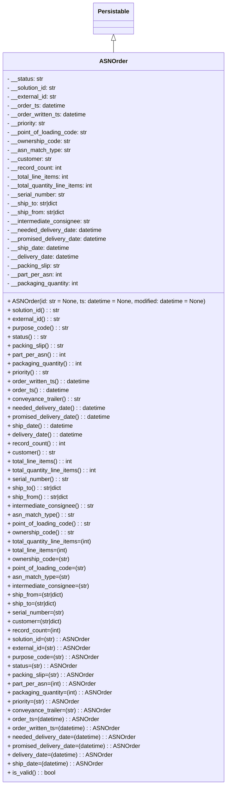

# Diagram: partview_core/partview_service/partview_service/core/datamodel/ASNOrder.py

> Auto-generated by Obscura crawlers

## Mermaid

### SVG

<svg id="container" width="614.6640625" xmlns="http://www.w3.org/2000/svg" class="classDiagram" height="2118" viewBox="0 0 614.6640625 2118" role="graphics-document document" aria-roledescription="class"><g><defs><marker id="container_class-aggregationStart" class="marker aggregation class" refX="18" refY="7" markerWidth="190" markerHeight="240" orient="auto"><path d="M 18,7 L9,13 L1,7 L9,1 Z"></path></marker></defs><defs><marker id="container_class-aggregationEnd" class="marker aggregation class" refX="1" refY="7" markerWidth="20" markerHeight="28" orient="auto"><path d="M 18,7 L9,13 L1,7 L9,1 Z"></path></marker></defs><defs><marker id="container_class-extensionStart" class="marker extension class" refX="18" refY="7" markerWidth="190" markerHeight="240" orient="auto"><path d="M 1,7 L18,13 V 1 Z"></path></marker></defs><defs><marker id="container_class-extensionEnd" class="marker extension class" refX="1" refY="7" markerWidth="20" markerHeight="28" orient="auto"><path d="M 1,1 V 13 L18,7 Z"></path></marker></defs><defs><marker id="container_class-compositionStart" class="marker composition class" refX="18" refY="7" markerWidth="190" markerHeight="240" orient="auto"><path d="M 18,7 L9,13 L1,7 L9,1 Z"></path></marker></defs><defs><marker id="container_class-compositionEnd" class="marker composition class" refX="1" refY="7" markerWidth="20" markerHeight="28" orient="auto"><path d="M 18,7 L9,13 L1,7 L9,1 Z"></path></marker></defs><defs><marker id="container_class-dependencyStart" class="marker dependency class" refX="6" refY="7" markerWidth="190" markerHeight="240" orient="auto"><path d="M 5,7 L9,13 L1,7 L9,1 Z"></path></marker></defs><defs><marker id="container_class-dependencyEnd" class="marker dependency class" refX="13" refY="7" markerWidth="20" markerHeight="28" orient="auto"><path d="M 18,7 L9,13 L14,7 L9,1 Z"></path></marker></defs><defs><marker id="container_class-lollipopStart" class="marker lollipop class" refX="13" refY="7" markerWidth="190" markerHeight="240" orient="auto"><circle stroke="black" fill="transparent" cx="7" cy="7" r="6"></circle></marker></defs><defs><marker id="container_class-lollipopEnd" class="marker lollipop class" refX="1" refY="7" markerWidth="190" markerHeight="240" orient="auto"><circle stroke="black" fill="transparent" cx="7" cy="7" r="6"></circle></marker></defs><g class="root"><g class="clusters"></g><g class="edgePaths"><path d="M307.332,109.25L307.332,110.542C307.332,111.833,307.332,114.417,307.332,119.875C307.332,125.333,307.332,133.667,307.332,137.833L307.332,142" id="id_Persistable_ASNOrder_1" class="edge-thickness-normal edge-pattern-solid relation" style=";;;" data-edge="true" data-et="edge" data-id="id_Persistable_ASNOrder_1" data-points="W3sieCI6MzA3LjMzMjAzMTI1LCJ5Ijo5Mn0seyJ4IjozMDcuMzMyMDMxMjUsInkiOjExN30seyJ4IjozMDcuMzMyMDMxMjUsInkiOjE0Mn1d" marker-start="url(#container_class-extensionStart)"></path></g><g class="edgeLabels"><g class="edgeLabel"><g class="label" data-id="id_Persistable_ASNOrder_1" transform="translate(0, 0)"><foreignObject width="0" height="0">

</foreignObject></g></g></g><g class="nodes"><g class="node default" id="classId-Persistable-0" transform="translate(307.33203125, 50)"><g class="basic label-container"><path d="M-52.9765625 -42 L52.9765625 -42 L52.9765625 42 L-52.9765625 42" stroke="none" stroke-width="0" fill="#ECECFF" style=""></path><path d="M-52.9765625 -42 C-12.157681025481743 -42, 28.661200449036514 -42, 52.9765625 -42 M-52.9765625 -42 C-16.347774374284953 -42, 20.281013751430095 -42, 52.9765625 -42 M52.9765625 -42 C52.9765625 -8.986138670188637, 52.9765625 24.027722659622725, 52.9765625 42 M52.9765625 -42 C52.9765625 -21.524069715046206, 52.9765625 -1.0481394300924123, 52.9765625 42 M52.9765625 42 C21.70511553388667 42, -9.566331432226661 42, -52.9765625 42 M52.9765625 42 C14.661224391765309 42, -23.654113716469382 42, -52.9765625 42 M-52.9765625 42 C-52.9765625 18.514546167171712, -52.9765625 -4.970907665656576, -52.9765625 -42 M-52.9765625 42 C-52.9765625 13.393492984398584, -52.9765625 -15.213014031202832, -52.9765625 -42" stroke="#9370DB" stroke-width="1.3" fill="none" stroke-dasharray="0 0" style=""></path></g><g class="annotation-group text" transform="translate(0, -18)"></g><g class="label-group text" transform="translate(-40.9765625, -18)"><g class="label" style="font-weight: bolder" transform="translate(0,-12)"><foreignObject width="81.953125" height="24">

Persistable

</foreignObject></g></g><g class="members-group text" transform="translate(-40.9765625, 30)"></g><g class="methods-group text" transform="translate(-40.9765625, 60)"></g><g class="divider" style=""><path d="M-52.9765625 6 C-28.57702338806669 6, -4.177484276133377 6, 52.9765625 6 M-52.9765625 6 C-10.85807765344844 6, 31.26040719310312 6, 52.9765625 6" stroke="#9370DB" stroke-width="1.3" fill="none" stroke-dasharray="0 0" style=""></path></g><g class="divider" style=""><path d="M-52.9765625 24 C-27.53971291620525 24, -2.1028633324105 24, 52.9765625 24 M-52.9765625 24 C-22.4438598268294 24, 8.088842846341201 24, 52.9765625 24" stroke="#9370DB" stroke-width="1.3" fill="none" stroke-dasharray="0 0" style=""></path></g></g><g class="node default" id="classId-ASNOrder-1" transform="translate(307.33203125, 1126)"><g class="basic label-container"><path d="M-299.33203125 -984 L299.33203125 -984 L299.33203125 984 L-299.33203125 984" stroke="none" stroke-width="0" fill="#ECECFF" style=""></path><path d="M-299.33203125 -984 C-120.77680266887836 -984, 57.77842591224328 -984, 299.33203125 -984 M-299.33203125 -984 C-105.99822655786681 -984, 87.33557813426637 -984, 299.33203125 -984 M299.33203125 -984 C299.33203125 -246.00597048419093, 299.33203125 491.98805903161815, 299.33203125 984 M299.33203125 -984 C299.33203125 -220.84335551762422, 299.33203125 542.3132889647516, 299.33203125 984 M299.33203125 984 C88.36142524225923 984, -122.60918076548154 984, -299.33203125 984 M299.33203125 984 C100.05516177277349 984, -99.22170770445302 984, -299.33203125 984 M-299.33203125 984 C-299.33203125 452.34562583239824, -299.33203125 -79.30874833520352, -299.33203125 -984 M-299.33203125 984 C-299.33203125 470.01950138929647, -299.33203125 -43.96099722140707, -299.33203125 -984" stroke="#9370DB" stroke-width="1.3" fill="none" stroke-dasharray="0 0" style=""></path></g><g class="annotation-group text" transform="translate(0, -960)"></g><g class="label-group text" transform="translate(-35.5234375, -960)"><g class="label" style="font-weight: bolder" transform="translate(0,-12)"><foreignObject width="71.046875" height="24">

ASNOrder

</foreignObject></g></g><g class="members-group text" transform="translate(-287.33203125, -912)"><g class="label" style="" transform="translate(0,-12)"><foreignObject width="99.078125" height="24">

- __status: str

</foreignObject></g><g class="label" style="" transform="translate(0,12)"><foreignObject width="136.90625" height="24">

- __solution_id: str

</foreignObject></g><g class="label" style="" transform="translate(0,36)"><foreignObject width="136.140625" height="24">

- __external_id: str

</foreignObject></g><g class="label" style="" transform="translate(0,60)"><foreignObject width="159.65625" height="24">

- __order_ts: datetime

</foreignObject></g><g class="label" style="" transform="translate(0,84)"><foreignObject width="219.21875" height="24">

- __order_written_ts: datetime

</foreignObject></g><g class="label" style="" transform="translate(0,108)"><foreignObject width="108.53125" height="24">

- __priority: str

</foreignObject></g><g class="label" style="" transform="translate(0,132)"><foreignObject width="220.875" height="24">

- __point_of_loading_code: str

</foreignObject></g><g class="label" style="" transform="translate(0,156)"><foreignObject width="172.71875" height="24">

- __ownership_code: str

</foreignObject></g><g class="label" style="" transform="translate(0,180)"><foreignObject width="172.84375" height="24">

- __asn_match_type: str

</foreignObject></g><g class="label" style="" transform="translate(0,204)"><foreignObject width="122.28125" height="24">

- __customer: str

</foreignObject></g><g class="label" style="" transform="translate(0,228)"><foreignObject width="150.46875" height="24">

- __record_count: int

</foreignObject></g><g class="label" style="" transform="translate(0,252)"><foreignObject width="171.78125" height="24">

- __total_line_items: int

</foreignObject></g><g class="label" style="" transform="translate(0,276)"><foreignObject width="240.125" height="24">

- __total_quantity_line_items: int

</foreignObject></g><g class="label" style="" transform="translate(0,300)"><foreignObject width="160.078125" height="24">

- __serial_number: str

</foreignObject></g><g class="label" style="" transform="translate(0,324)"><foreignObject width="142.0625" height="24">

- __ship_to: str|dict

</foreignObject></g><g class="label" style="" transform="translate(0,348)"><foreignObject width="161.28125" height="24">

- __ship_from: str|dict

</foreignObject></g><g class="label" style="" transform="translate(0,372)"><foreignObject width="229.3125" height="24">

- __intermediate_consignee: str

</foreignObject></g><g class="label" style="" transform="translate(0,396)"><foreignObject width="261.28125" height="24">

- __needed_delivery_date: datetime

</foreignObject></g><g class="label" style="" transform="translate(0,420)"><foreignObject width="275.140625" height="24">

- __promised_delivery_date: datetime

</foreignObject></g><g class="label" style="" transform="translate(0,444)"><foreignObject width="171.578125" height="24">

- __ship_date: datetime

</foreignObject></g><g class="label" style="" transform="translate(0,468)"><foreignObject width="198.296875" height="24">

- __delivery_date: datetime

</foreignObject></g><g class="label" style="" transform="translate(0,492)"><foreignObject width="145.34375" height="24">

- __packing_slip: str

</foreignObject></g><g class="label" style="" transform="translate(0,516)"><foreignObject width="149.75" height="24">

- __part_per_asn: int

</foreignObject></g><g class="label" style="" transform="translate(0,540)"><foreignObject width="196.578125" height="24">

- __packaging_quantity: int

</foreignObject></g></g><g class="methods-group text" transform="translate(-287.33203125, -312)"><g class="label" style="" transform="translate(0,-12)"><foreignObject width="539.140625" height="24">

+ ASNOrder(id: str = None, ts: datetime = None, modified: datetime = None)

</foreignObject></g><g class="label" style="" transform="translate(0,12)"><foreignObject width="144.640625" height="24">

+ solution_id() : : str

</foreignObject></g><g class="label" style="" transform="translate(0,36)"><foreignObject width="144.203125" height="24">

+ external_id() : : str

</foreignObject></g><g class="label" style="" transform="translate(0,60)"><foreignObject width="165.09375" height="24">

+ purpose_code() : : str

</foreignObject></g><g class="label" style="" transform="translate(0,84)"><foreignObject width="106.828125" height="24">

+ status() : : str

</foreignObject></g><g class="label" style="" transform="translate(0,108)"><foreignObject width="153.078125" height="24">

+ packing_slip() : : str

</foreignObject></g><g class="label" style="" transform="translate(0,132)"><foreignObject width="157.5" height="24">

+ part_per_asn() : : int

</foreignObject></g><g class="label" style="" transform="translate(0,156)"><foreignObject width="204.265625" height="24">

+ packaging_quantity() : : int

</foreignObject></g><g class="label" style="" transform="translate(0,180)"><foreignObject width="116.21875" height="24">

+ priority() : : str

</foreignObject></g><g class="label" style="" transform="translate(0,204)"><foreignObject width="227.28125" height="24">

+ order_written_ts() : : datetime

</foreignObject></g><g class="label" style="" transform="translate(0,228)"><foreignObject width="167.71875" height="24">

+ order_ts() : : datetime

</foreignObject></g><g class="label" style="" transform="translate(0,252)"><foreignObject width="198.359375" height="24">

+ conveyance_trailer() : : str

</foreignObject></g><g class="label" style="" transform="translate(0,276)"><foreignObject width="269.03125" height="24">

+ needed_delivery_date() : : datetime

</foreignObject></g><g class="label" style="" transform="translate(0,300)"><foreignObject width="282.890625" height="24">

+ promised_delivery_date() : : datetime

</foreignObject></g><g class="label" style="" transform="translate(0,324)"><foreignObject width="179.3125" height="24">

+ ship_date() : : datetime

</foreignObject></g><g class="label" style="" transform="translate(0,348)"><foreignObject width="206.359375" height="24">

+ delivery_date() : : datetime

</foreignObject></g><g class="label" style="" transform="translate(0,372)"><foreignObject width="158.15625" height="24">

+ record_count() : : int

</foreignObject></g><g class="label" style="" transform="translate(0,396)"><foreignObject width="130.1875" height="24">

+ customer() : : str

</foreignObject></g><g class="label" style="" transform="translate(0,420)"><foreignObject width="179.84375" height="24">

+ total_line_items() : : int

</foreignObject></g><g class="label" style="" transform="translate(0,444)"><foreignObject width="248.1875" height="24">

+ total_quantity_line_items() : : int

</foreignObject></g><g class="label" style="" transform="translate(0,468)"><foreignObject width="167.65625" height="24">

+ serial_number() : : str

</foreignObject></g><g class="label" style="" transform="translate(0,492)"><foreignObject width="149.796875" height="24">

+ ship_to() : : str|dict

</foreignObject></g><g class="label" style="" transform="translate(0,516)"><foreignObject width="169.03125" height="24">

+ ship_from() : : str|dict

</foreignObject></g><g class="label" style="" transform="translate(0,540)"><foreignObject width="237.0625" height="24">

+ intermediate_consignee() : : str

</foreignObject></g><g class="label" style="" transform="translate(0,564)"><foreignObject width="180.90625" height="24">

+ asn_match_type() : : str

</foreignObject></g><g class="label" style="" transform="translate(0,588)"><foreignObject width="228.609375" height="24">

+ point_of_loading_code() : : str

</foreignObject></g><g class="label" style="" transform="translate(0,612)"><foreignObject width="180.78125" height="24">

+ ownership_code() : : str

</foreignObject></g><g class="label" style="" transform="translate(0,636)"><foreignObject width="235.78125" height="24">

+ total_quantity_line_items=(int)

</foreignObject></g><g class="label" style="" transform="translate(0,660)"><foreignObject width="167.453125" height="24">

+ total_line_items=(int)

</foreignObject></g><g class="label" style="" transform="translate(0,684)"><foreignObject width="168.375" height="24">

+ ownership_code=(str)

</foreignObject></g><g class="label" style="" transform="translate(0,708)"><foreignObject width="216.21875" height="24">

+ point_of_loading_code=(str)

</foreignObject></g><g class="label" style="" transform="translate(0,732)"><foreignObject width="168.5" height="24">

+ asn_match_type=(str)

</foreignObject></g><g class="label" style="" transform="translate(0,756)"><foreignObject width="224.671875" height="24">

+ intermediate_consignee=(str)

</foreignObject></g><g class="label" style="" transform="translate(0,780)"><foreignObject width="156.625" height="24">

+ ship_from=(str|dict)

</foreignObject></g><g class="label" style="" transform="translate(0,804)"><foreignObject width="137.40625" height="24">

+ ship_to=(str|dict)

</foreignObject></g><g class="label" style="" transform="translate(0,828)"><foreignObject width="155.25" height="24">

+ serial_number=(str)

</foreignObject></g><g class="label" style="" transform="translate(0,852)"><foreignObject width="151.734375" height="24">

+ customer=(str|dict)

</foreignObject></g><g class="label" style="" transform="translate(0,876)"><foreignObject width="145.75" height="24">

+ record_count=(int)

</foreignObject></g><g class="label" style="" transform="translate(0,900)"><foreignObject width="222.703125" height="24">

+ solution_id=(str) : : ASNOrder

</foreignObject></g><g class="label" style="" transform="translate(0,924)"><foreignObject width="222.25" height="24">

+ external_id=(str) : : ASNOrder

</foreignObject></g><g class="label" style="" transform="translate(0,948)"><foreignObject width="243.140625" height="24">

+ purpose_code=(str) : : ASNOrder

</foreignObject></g><g class="label" style="" transform="translate(0,972)"><foreignObject width="184.875" height="24">

+ status=(str) : : ASNOrder

</foreignObject></g><g class="label" style="" transform="translate(0,996)"><foreignObject width="231.125" height="24">

+ packing_slip=(str) : : ASNOrder

</foreignObject></g><g class="label" style="" transform="translate(0,1020)"><foreignObject width="235.546875" height="24">

+ part_per_asn=(int) : : ASNOrder

</foreignObject></g><g class="label" style="" transform="translate(0,1044)"><foreignObject width="282.3125" height="24">

+ packaging_quantity=(int) : : ASNOrder

</foreignObject></g><g class="label" style="" transform="translate(0,1068)"><foreignObject width="194.265625" height="24">

+ priority=(str) : : ASNOrder

</foreignObject></g><g class="label" style="" transform="translate(0,1092)"><foreignObject width="276.40625" height="24">

+ conveyance_trailer=(str) : : ASNOrder

</foreignObject></g><g class="label" style="" transform="translate(0,1116)"><foreignObject width="245.765625" height="24">

+ order_ts=(datetime) : : ASNOrder

</foreignObject></g><g class="label" style="" transform="translate(0,1140)"><foreignObject width="305.34375" height="24">

+ order_written_ts=(datetime) : : ASNOrder

</foreignObject></g><g class="label" style="" transform="translate(0,1164)"><foreignObject width="347.078125" height="24">

+ needed_delivery_date=(datetime) : : ASNOrder

</foreignObject></g><g class="label" style="" transform="translate(0,1188)"><foreignObject width="360.9375" height="24">

+ promised_delivery_date=(datetime) : : ASNOrder

</foreignObject></g><g class="label" style="" transform="translate(0,1212)"><foreignObject width="284.40625" height="24">

+ delivery_date=(datetime) : : ASNOrder

</foreignObject></g><g class="label" style="" transform="translate(0,1236)"><foreignObject width="257.375" height="24">

+ ship_date=(datetime) : : ASNOrder

</foreignObject></g><g class="label" style="" transform="translate(0,1260)"><foreignObject width="130.3125" height="24">

+ is_valid() : : bool

</foreignObject></g></g><g class="divider" style=""><path d="M-299.33203125 -936 C-129.19395642557166 -936, 40.94411839885669 -936, 299.33203125 -936 M-299.33203125 -936 C-67.52737875925587 -936, 164.27727373148826 -936, 299.33203125 -936" stroke="#9370DB" stroke-width="1.3" fill="none" stroke-dasharray="0 0" style=""></path></g><g class="divider" style=""><path d="M-299.33203125 -336 C-116.93417262790965 -336, 65.46368599418071 -336, 299.33203125 -336 M-299.33203125 -336 C-108.177752430005 -336, 82.97652638999 -336, 299.33203125 -336" stroke="#9370DB" stroke-width="1.3" fill="none" stroke-dasharray="0 0" style=""></path></g></g></g></g></g></svg>
