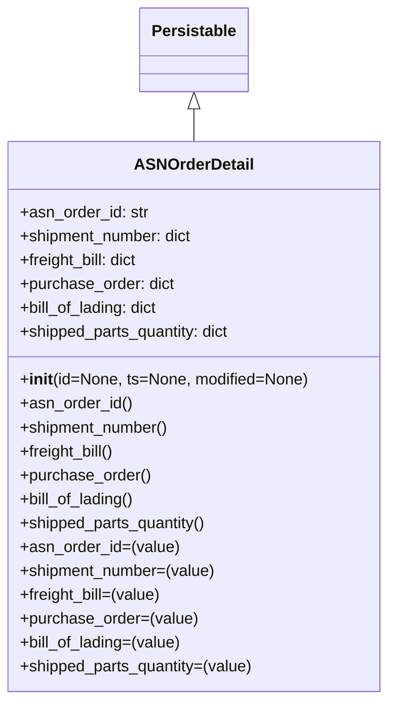

# Diagram: partview_core/partview_service/partview_service/core/datamodel/ASNOrderDetail.py

> Auto-generated by Obscura crawlers

## Mermaid

### SVG

<svg id="container" width="386.84375" xmlns="http://www.w3.org/2000/svg" class="classDiagram" height="702" viewBox="0 0 386.84375 702" role="graphics-document document" aria-roledescription="class"><g><defs><marker id="container_class-aggregationStart" class="marker aggregation class" refX="18" refY="7" markerWidth="190" markerHeight="240" orient="auto"><path d="M 18,7 L9,13 L1,7 L9,1 Z"></path></marker></defs><defs><marker id="container_class-aggregationEnd" class="marker aggregation class" refX="1" refY="7" markerWidth="20" markerHeight="28" orient="auto"><path d="M 18,7 L9,13 L1,7 L9,1 Z"></path></marker></defs><defs><marker id="container_class-extensionStart" class="marker extension class" refX="18" refY="7" markerWidth="190" markerHeight="240" orient="auto"><path d="M 1,7 L18,13 V 1 Z"></path></marker></defs><defs><marker id="container_class-extensionEnd" class="marker extension class" refX="1" refY="7" markerWidth="20" markerHeight="28" orient="auto"><path d="M 1,1 V 13 L18,7 Z"></path></marker></defs><defs><marker id="container_class-compositionStart" class="marker composition class" refX="18" refY="7" markerWidth="190" markerHeight="240" orient="auto"><path d="M 18,7 L9,13 L1,7 L9,1 Z"></path></marker></defs><defs><marker id="container_class-compositionEnd" class="marker composition class" refX="1" refY="7" markerWidth="20" markerHeight="28" orient="auto"><path d="M 18,7 L9,13 L1,7 L9,1 Z"></path></marker></defs><defs><marker id="container_class-dependencyStart" class="marker dependency class" refX="6" refY="7" markerWidth="190" markerHeight="240" orient="auto"><path d="M 5,7 L9,13 L1,7 L9,1 Z"></path></marker></defs><defs><marker id="container_class-dependencyEnd" class="marker dependency class" refX="13" refY="7" markerWidth="20" markerHeight="28" orient="auto"><path d="M 18,7 L9,13 L14,7 L9,1 Z"></path></marker></defs><defs><marker id="container_class-lollipopStart" class="marker lollipop class" refX="13" refY="7" markerWidth="190" markerHeight="240" orient="auto"><circle stroke="black" fill="transparent" cx="7" cy="7" r="6"></circle></marker></defs><defs><marker id="container_class-lollipopEnd" class="marker lollipop class" refX="1" refY="7" markerWidth="190" markerHeight="240" orient="auto"><circle stroke="black" fill="transparent" cx="7" cy="7" r="6"></circle></marker></defs><g class="root"><g class="clusters"></g><g class="edgePaths"><path d="M193.422,109.25L193.422,110.542C193.422,111.833,193.422,114.417,193.422,119.875C193.422,125.333,193.422,133.667,193.422,137.833L193.422,142" id="id_Persistable_ASNOrderDetail_1" class="edge-thickness-normal edge-pattern-solid relation" style=";;;" data-edge="true" data-et="edge" data-id="id_Persistable_ASNOrderDetail_1" data-points="W3sieCI6MTkzLjQyMTg3NSwieSI6OTJ9LHsieCI6MTkzLjQyMTg3NSwieSI6MTE3fSx7IngiOjE5My40MjE4NzUsInkiOjE0Mn1d" marker-start="url(#container_class-extensionStart)"></path></g><g class="edgeLabels"><g class="edgeLabel"><g class="label" data-id="id_Persistable_ASNOrderDetail_1" transform="translate(0, 0)"><foreignObject width="0" height="0">

</foreignObject></g></g></g><g class="nodes"><g class="node default" id="classId-Persistable-0" transform="translate(193.421875, 50)"><g class="basic label-container"><path d="M-52.9765625 -42 L52.9765625 -42 L52.9765625 42 L-52.9765625 42" stroke="none" stroke-width="0" fill="#ECECFF" style=""></path><path d="M-52.9765625 -42 C-12.028831142193049 -42, 28.918900215613903 -42, 52.9765625 -42 M-52.9765625 -42 C-24.051182888342158 -42, 4.874196723315684 -42, 52.9765625 -42 M52.9765625 -42 C52.9765625 -12.968374377120451, 52.9765625 16.063251245759098, 52.9765625 42 M52.9765625 -42 C52.9765625 -16.510070509598954, 52.9765625 8.979858980802092, 52.9765625 42 M52.9765625 42 C15.866210383635575 42, -21.24414173272885 42, -52.9765625 42 M52.9765625 42 C23.717947293700554 42, -5.540667912598892 42, -52.9765625 42 M-52.9765625 42 C-52.9765625 11.069504174003338, -52.9765625 -19.860991651993324, -52.9765625 -42 M-52.9765625 42 C-52.9765625 13.860313326377774, -52.9765625 -14.279373347244452, -52.9765625 -42" stroke="#9370DB" stroke-width="1.3" fill="none" stroke-dasharray="0 0" style=""></path></g><g class="annotation-group text" transform="translate(0, -18)"></g><g class="label-group text" transform="translate(-40.9765625, -18)"><g class="label" style="font-weight: bolder" transform="translate(0,-12)"><foreignObject width="81.953125" height="24">

Persistable

</foreignObject></g></g><g class="members-group text" transform="translate(-40.9765625, 30)"></g><g class="methods-group text" transform="translate(-40.9765625, 60)"></g><g class="divider" style=""><path d="M-52.9765625 6 C-14.632330431328349 6, 23.711901637343303 6, 52.9765625 6 M-52.9765625 6 C-16.20566045071655 6, 20.5652415985669 6, 52.9765625 6" stroke="#9370DB" stroke-width="1.3" fill="none" stroke-dasharray="0 0" style=""></path></g><g class="divider" style=""><path d="M-52.9765625 24 C-31.16683874751488 24, -9.357114995029761 24, 52.9765625 24 M-52.9765625 24 C-12.014508593274456 24, 28.947545313451087 24, 52.9765625 24" stroke="#9370DB" stroke-width="1.3" fill="none" stroke-dasharray="0 0" style=""></path></g></g><g class="node default" id="classId-ASNOrderDetail-1" transform="translate(193.421875, 418)"><g class="basic label-container"><path d="M-185.421875 -276 L185.421875 -276 L185.421875 276 L-185.421875 276" stroke="none" stroke-width="0" fill="#ECECFF" style=""></path><path d="M-185.421875 -276 C-50.51028825892038 -276, 84.40129848215923 -276, 185.421875 -276 M-185.421875 -276 C-87.8239362473637 -276, 9.774002505272591 -276, 185.421875 -276 M185.421875 -276 C185.421875 -161.65978185510085, 185.421875 -47.31956371020166, 185.421875 276 M185.421875 -276 C185.421875 -67.24587009680528, 185.421875 141.50825980638945, 185.421875 276 M185.421875 276 C109.71051487032433 276, 33.99915474064866 276, -185.421875 276 M185.421875 276 C108.59706873297745 276, 31.772262465954896 276, -185.421875 276 M-185.421875 276 C-185.421875 96.66560894636038, -185.421875 -82.66878210727924, -185.421875 -276 M-185.421875 276 C-185.421875 126.9430998871751, -185.421875 -22.11380022564981, -185.421875 -276" stroke="#9370DB" stroke-width="1.3" fill="none" stroke-dasharray="0 0" style=""></path></g><g class="annotation-group text" transform="translate(0, -252)"></g><g class="label-group text" transform="translate(-57.15625, -252)"><g class="label" style="font-weight: bolder" transform="translate(0,-12)"><foreignObject width="114.3125" height="24">

ASNOrderDetail

</foreignObject></g></g><g class="members-group text" transform="translate(-173.421875, -204)"><g class="label" style="" transform="translate(0,-12)"><foreignObject width="129.265625" height="24">

+asn_order_id: str

</foreignObject></g><g class="label" style="" transform="translate(0,12)"><foreignObject width="177.296875" height="24">

+shipment_number: dict

</foreignObject></g><g class="label" style="" transform="translate(0,36)"><foreignObject width="122.96875" height="24">

+freight_bill: dict

</foreignObject></g><g class="label" style="" transform="translate(0,60)"><foreignObject width="157.1875" height="24">

+purchase_order: dict

</foreignObject></g><g class="label" style="" transform="translate(0,84)"><foreignObject width="142.4375" height="24">

+bill_of_lading: dict

</foreignObject></g><g class="label" style="" transform="translate(0,108)"><foreignObject width="216.578125" height="24">

+shipped_parts_quantity: dict

</foreignObject></g></g><g class="methods-group text" transform="translate(-173.421875, -36)"><g class="label" style="" transform="translate(0,-12)"><foreignObject width="289.6875" height="24">

+<strong>init</strong>(id=None, ts=None, modified=None)

</foreignObject></g><g class="label" style="" transform="translate(0,12)"><foreignObject width="112.140625" height="24">

+asn_order_id()

</foreignObject></g><g class="label" style="" transform="translate(0,36)"><foreignObject width="151.921875" height="24">

+shipment_number()

</foreignObject></g><g class="label" style="" transform="translate(0,60)"><foreignObject width="97.59375" height="24">

+freight_bill()

</foreignObject></g><g class="label" style="" transform="translate(0,84)"><foreignObject width="131.8125" height="24">

+purchase_order()

</foreignObject></g><g class="label" style="" transform="translate(0,108)"><foreignObject width="117.21875" height="24">

+bill_of_lading()

</foreignObject></g><g class="label" style="" transform="translate(0,132)"><foreignObject width="191.296875" height="24">

+shipped_parts_quantity()

</foreignObject></g><g class="label" style="" transform="translate(0,156)"><foreignObject width="159.015625" height="24">

+asn_order_id=(value)

</foreignObject></g><g class="label" style="" transform="translate(0,180)"><foreignObject width="198.8125" height="24">

+shipment_number=(value)

</foreignObject></g><g class="label" style="" transform="translate(0,204)"><foreignObject width="144.46875" height="24">

+freight_bill=(value)

</foreignObject></g><g class="label" style="" transform="translate(0,228)"><foreignObject width="178.703125" height="24">

+purchase_order=(value)

</foreignObject></g><g class="label" style="" transform="translate(0,252)"><foreignObject width="164.109375" height="24">

+bill_of_lading=(value)

</foreignObject></g><g class="label" style="" transform="translate(0,276)"><foreignObject width="238.1875" height="24">

+shipped_parts_quantity=(value)

</foreignObject></g></g><g class="divider" style=""><path d="M-185.421875 -228 C-39.04660659335573 -228, 107.32866181328853 -228, 185.421875 -228 M-185.421875 -228 C-40.344572207014636 -228, 104.73273058597073 -228, 185.421875 -228" stroke="#9370DB" stroke-width="1.3" fill="none" stroke-dasharray="0 0" style=""></path></g><g class="divider" style=""><path d="M-185.421875 -60 C-77.70645427530323 -60, 30.00896644939354 -60, 185.421875 -60 M-185.421875 -60 C-92.54031640279705 -60, 0.34124219440590764 -60, 185.421875 -60" stroke="#9370DB" stroke-width="1.3" fill="none" stroke-dasharray="0 0" style=""></path></g></g></g></g></g></svg>
