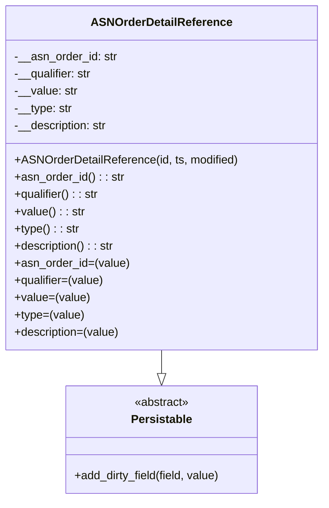

# Diagram: partview_core/partview_service/partview_service/core/datamodel/ASNOrderDetailReference.py

> Auto-generated by Obscura crawlers

## Mermaid

### SVG

<svg id="container" width="444.53125" xmlns="http://www.w3.org/2000/svg" class="classDiagram" height="696" viewBox="0 0 444.53125 696" role="graphics-document document" aria-roledescription="class"><g><defs><marker id="container_class-aggregationStart" class="marker aggregation class" refX="18" refY="7" markerWidth="190" markerHeight="240" orient="auto"><path d="M 18,7 L9,13 L1,7 L9,1 Z"></path></marker></defs><defs><marker id="container_class-aggregationEnd" class="marker aggregation class" refX="1" refY="7" markerWidth="20" markerHeight="28" orient="auto"><path d="M 18,7 L9,13 L1,7 L9,1 Z"></path></marker></defs><defs><marker id="container_class-extensionStart" class="marker extension class" refX="18" refY="7" markerWidth="190" markerHeight="240" orient="auto"><path d="M 1,7 L18,13 V 1 Z"></path></marker></defs><defs><marker id="container_class-extensionEnd" class="marker extension class" refX="1" refY="7" markerWidth="20" markerHeight="28" orient="auto"><path d="M 1,1 V 13 L18,7 Z"></path></marker></defs><defs><marker id="container_class-compositionStart" class="marker composition class" refX="18" refY="7" markerWidth="190" markerHeight="240" orient="auto"><path d="M 18,7 L9,13 L1,7 L9,1 Z"></path></marker></defs><defs><marker id="container_class-compositionEnd" class="marker composition class" refX="1" refY="7" markerWidth="20" markerHeight="28" orient="auto"><path d="M 18,7 L9,13 L1,7 L9,1 Z"></path></marker></defs><defs><marker id="container_class-dependencyStart" class="marker dependency class" refX="6" refY="7" markerWidth="190" markerHeight="240" orient="auto"><path d="M 5,7 L9,13 L1,7 L9,1 Z"></path></marker></defs><defs><marker id="container_class-dependencyEnd" class="marker dependency class" refX="13" refY="7" markerWidth="20" markerHeight="28" orient="auto"><path d="M 18,7 L9,13 L14,7 L9,1 Z"></path></marker></defs><defs><marker id="container_class-lollipopStart" class="marker lollipop class" refX="13" refY="7" markerWidth="190" markerHeight="240" orient="auto"><circle stroke="black" fill="transparent" cx="7" cy="7" r="6"></circle></marker></defs><defs><marker id="container_class-lollipopEnd" class="marker lollipop class" refX="1" refY="7" markerWidth="190" markerHeight="240" orient="auto"><circle stroke="black" fill="transparent" cx="7" cy="7" r="6"></circle></marker></defs><g class="root"><g class="clusters"></g><g class="edgePaths"><path d="M222.266,488L222.266,492.167C222.266,496.333,222.266,504.667,222.266,510.125C222.266,515.583,222.266,518.167,222.266,519.458L222.266,520.75" id="id_ASNOrderDetailReference_Persistable_1" class="edge-thickness-normal edge-pattern-solid relation" style=";;;" data-edge="true" data-et="edge" data-id="id_ASNOrderDetailReference_Persistable_1" data-points="W3sieCI6MjIyLjI2NTYyNSwieSI6NDg4fSx7IngiOjIyMi4yNjU2MjUsInkiOjUxM30seyJ4IjoyMjIuMjY1NjI1LCJ5Ijo1Mzh9XQ==" marker-end="url(#container_class-extensionEnd)"></path></g><g class="edgeLabels"><g class="edgeLabel"><g class="label" data-id="id_ASNOrderDetailReference_Persistable_1" transform="translate(0, 0)"><foreignObject width="0" height="0">

</foreignObject></g></g></g><g class="nodes"><g class="node default" id="classId-Persistable-0" transform="translate(222.265625, 613)"><g class="basic label-container"><path d="M-135.71484375 -75 L135.71484375 -75 L135.71484375 75 L-135.71484375 75" stroke="none" stroke-width="0" fill="#ECECFF" style=""></path><path d="M-135.71484375 -75 C-65.15372958837831 -75, 5.407384573243377 -75, 135.71484375 -75 M-135.71484375 -75 C-57.020369279492314 -75, 21.67410519101537 -75, 135.71484375 -75 M135.71484375 -75 C135.71484375 -42.85678280091892, 135.71484375 -10.713565601837843, 135.71484375 75 M135.71484375 -75 C135.71484375 -22.906125563975813, 135.71484375 29.187748872048374, 135.71484375 75 M135.71484375 75 C70.91263432208713 75, 6.110424894174258 75, -135.71484375 75 M135.71484375 75 C29.200752483642987 75, -77.31333878271403 75, -135.71484375 75 M-135.71484375 75 C-135.71484375 29.38791288382525, -135.71484375 -16.224174232349498, -135.71484375 -75 M-135.71484375 75 C-135.71484375 35.737141332501984, -135.71484375 -3.525717334996031, -135.71484375 -75" stroke="#9370DB" stroke-width="1.3" fill="none" stroke-dasharray="0 0" style=""></path></g><g class="annotation-group text" transform="translate(-38.609375, -51)"><g class="label" style="" transform="translate(0,-12)"><foreignObject width="77.21875" height="24">

«abstract»

</foreignObject></g></g><g class="label-group text" transform="translate(-40.9765625, -27)"><g class="label" style="font-weight: bolder" transform="translate(0,-12)"><foreignObject width="81.953125" height="24">

Persistable

</foreignObject></g></g><g class="members-group text" transform="translate(-123.71484375, 21)"></g><g class="methods-group text" transform="translate(-123.71484375, 51)"><g class="label" style="" transform="translate(0,-12)"><foreignObject width="206.453125" height="24">

+add_dirty_field(field, value)

</foreignObject></g></g><g class="divider" style=""><path d="M-135.71484375 -3 C-56.296311503419176 -3, 23.122220743161648 -3, 135.71484375 -3 M-135.71484375 -3 C-73.76074856205659 -3, -11.806653374113182 -3, 135.71484375 -3" stroke="#9370DB" stroke-width="1.3" fill="none" stroke-dasharray="0 0" style=""></path></g><g class="divider" style=""><path d="M-135.71484375 21 C-73.99488450458385 21, -12.274925259167702 21, 135.71484375 21 M-135.71484375 21 C-54.88234846587956 21, 25.95014681824088 21, 135.71484375 21" stroke="#9370DB" stroke-width="1.3" fill="none" stroke-dasharray="0 0" style=""></path></g></g><g class="node default" id="classId-ASNOrderDetailReference-1" transform="translate(222.265625, 248)"><g class="basic label-container"><path d="M-214.265625 -240 L214.265625 -240 L214.265625 240 L-214.265625 240" stroke="none" stroke-width="0" fill="#ECECFF" style=""></path><path d="M-214.265625 -240 C-78.80205389871645 -240, 56.6615172025671 -240, 214.265625 -240 M-214.265625 -240 C-58.90850200478471 -240, 96.44862099043058 -240, 214.265625 -240 M214.265625 -240 C214.265625 -94.28885637462903, 214.265625 51.42228725074193, 214.265625 240 M214.265625 -240 C214.265625 -131.73213307996537, 214.265625 -23.464266159930702, 214.265625 240 M214.265625 240 C76.94651512058257 240, -60.37259475883485 240, -214.265625 240 M214.265625 240 C44.294198392091744 240, -125.67722821581651 240, -214.265625 240 M-214.265625 240 C-214.265625 53.390364197885305, -214.265625 -133.2192716042294, -214.265625 -240 M-214.265625 240 C-214.265625 104.7524524714346, -214.265625 -30.49509505713081, -214.265625 -240" stroke="#9370DB" stroke-width="1.3" fill="none" stroke-dasharray="0 0" style=""></path></g><g class="annotation-group text" transform="translate(0, -216)"></g><g class="label-group text" transform="translate(-93.65625, -216)"><g class="label" style="font-weight: bolder" transform="translate(0,-12)"><foreignObject width="187.3125" height="24">

ASNOrderDetailReference

</foreignObject></g></g><g class="members-group text" transform="translate(-202.265625, -168)"><g class="label" style="" transform="translate(0,-12)"><foreignObject width="142.859375" height="24">

-__asn_order_id: str

</foreignObject></g><g class="label" style="" transform="translate(0,12)"><foreignObject width="109.71875" height="24">

-__qualifier: str

</foreignObject></g><g class="label" style="" transform="translate(0,36)"><foreignObject width="87.5625" height="24">

-__value: str

</foreignObject></g><g class="label" style="" transform="translate(0,60)"><foreignObject width="80.625" height="24">

-__type: str

</foreignObject></g><g class="label" style="" transform="translate(0,84)"><foreignObject width="131.453125" height="24">

-__description: str

</foreignObject></g></g><g class="methods-group text" transform="translate(-202.265625, -24)"><g class="label" style="" transform="translate(0,-12)"><foreignObject width="310.875" height="24">

+ASNOrderDetailReference(id, ts, modified)

</foreignObject></g><g class="label" style="" transform="translate(0,12)"><foreignObject width="151.953125" height="24">

+asn_order_id() : : str

</foreignObject></g><g class="label" style="" transform="translate(0,36)"><foreignObject width="118.90625" height="24">

+qualifier() : : str

</foreignObject></g><g class="label" style="" transform="translate(0,60)"><foreignObject width="96.90625" height="24">

+value() : : str

</foreignObject></g><g class="label" style="" transform="translate(0,84)"><foreignObject width="89.890625" height="24">

+type() : : str

</foreignObject></g><g class="label" style="" transform="translate(0,108)"><foreignObject width="140.796875" height="24">

+description() : : str

</foreignObject></g><g class="label" style="" transform="translate(0,132)"><foreignObject width="159.015625" height="24">

+asn_order_id=(value)

</foreignObject></g><g class="label" style="" transform="translate(0,156)"><foreignObject width="125.953125" height="24">

+qualifier=(value)

</foreignObject></g><g class="label" style="" transform="translate(0,180)"><foreignObject width="103.953125" height="24">

+value=(value)

</foreignObject></g><g class="label" style="" transform="translate(0,204)"><foreignObject width="96.953125" height="24">

+type=(value)

</foreignObject></g><g class="label" style="" transform="translate(0,228)"><foreignObject width="147.84375" height="24">

+description=(value)

</foreignObject></g></g><g class="divider" style=""><path d="M-214.265625 -192 C-128.00471430724616 -192, -41.74380361449235 -192, 214.265625 -192 M-214.265625 -192 C-44.59787116079184 -192, 125.06988267841632 -192, 214.265625 -192" stroke="#9370DB" stroke-width="1.3" fill="none" stroke-dasharray="0 0" style=""></path></g><g class="divider" style=""><path d="M-214.265625 -48 C-59.361352535187734 -48, 95.54291992962453 -48, 214.265625 -48 M-214.265625 -48 C-58.95261410447054 -48, 96.36039679105892 -48, 214.265625 -48" stroke="#9370DB" stroke-width="1.3" fill="none" stroke-dasharray="0 0" style=""></path></g></g></g></g></g></svg>
