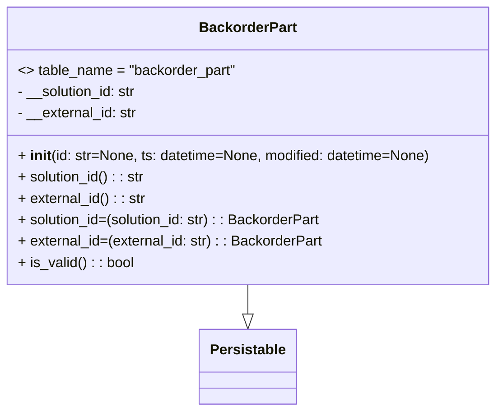

# Diagram: partview_core/partview_service/partview_service/core/datamodel/BackorderPart.py

> Auto-generated by Obscura crawlers

## Mermaid

### SVG

<svg id="container" width="560.703125" xmlns="http://www.w3.org/2000/svg" class="classDiagram" height="462" viewBox="0 0 560.703125 462" role="graphics-document document" aria-roledescription="class"><g><defs><marker id="container_class-aggregationStart" class="marker aggregation class" refX="18" refY="7" markerWidth="190" markerHeight="240" orient="auto"><path d="M 18,7 L9,13 L1,7 L9,1 Z"></path></marker></defs><defs><marker id="container_class-aggregationEnd" class="marker aggregation class" refX="1" refY="7" markerWidth="20" markerHeight="28" orient="auto"><path d="M 18,7 L9,13 L1,7 L9,1 Z"></path></marker></defs><defs><marker id="container_class-extensionStart" class="marker extension class" refX="18" refY="7" markerWidth="190" markerHeight="240" orient="auto"><path d="M 1,7 L18,13 V 1 Z"></path></marker></defs><defs><marker id="container_class-extensionEnd" class="marker extension class" refX="1" refY="7" markerWidth="20" markerHeight="28" orient="auto"><path d="M 1,1 V 13 L18,7 Z"></path></marker></defs><defs><marker id="container_class-compositionStart" class="marker composition class" refX="18" refY="7" markerWidth="190" markerHeight="240" orient="auto"><path d="M 18,7 L9,13 L1,7 L9,1 Z"></path></marker></defs><defs><marker id="container_class-compositionEnd" class="marker composition class" refX="1" refY="7" markerWidth="20" markerHeight="28" orient="auto"><path d="M 18,7 L9,13 L1,7 L9,1 Z"></path></marker></defs><defs><marker id="container_class-dependencyStart" class="marker dependency class" refX="6" refY="7" markerWidth="190" markerHeight="240" orient="auto"><path d="M 5,7 L9,13 L1,7 L9,1 Z"></path></marker></defs><defs><marker id="container_class-dependencyEnd" class="marker dependency class" refX="13" refY="7" markerWidth="20" markerHeight="28" orient="auto"><path d="M 18,7 L9,13 L14,7 L9,1 Z"></path></marker></defs><defs><marker id="container_class-lollipopStart" class="marker lollipop class" refX="13" refY="7" markerWidth="190" markerHeight="240" orient="auto"><circle stroke="black" fill="transparent" cx="7" cy="7" r="6"></circle></marker></defs><defs><marker id="container_class-lollipopEnd" class="marker lollipop class" refX="1" refY="7" markerWidth="190" markerHeight="240" orient="auto"><circle stroke="black" fill="transparent" cx="7" cy="7" r="6"></circle></marker></defs><g class="root"><g class="clusters"></g><g class="edgePaths"><path d="M280.352,320L280.352,324.167C280.352,328.333,280.352,336.667,280.352,342.125C280.352,347.583,280.352,350.167,280.352,351.458L280.352,352.75" id="id_BackorderPart_Persistable_1" class="edge-thickness-normal edge-pattern-solid relation" style=";;;" data-edge="true" data-et="edge" data-id="id_BackorderPart_Persistable_1" data-points="W3sieCI6MjgwLjM1MTU2MjUsInkiOjMyMH0seyJ4IjoyODAuMzUxNTYyNSwieSI6MzQ1fSx7IngiOjI4MC4zNTE1NjI1LCJ5IjozNzB9XQ==" marker-end="url(#container_class-extensionEnd)"></path></g><g class="edgeLabels"><g class="edgeLabel"><g class="label" data-id="id_BackorderPart_Persistable_1" transform="translate(0, 0)"><foreignObject width="0" height="0">

</foreignObject></g></g></g><g class="nodes"><g class="node default" id="classId-Persistable-0" transform="translate(280.3515625, 412)"><g class="basic label-container"><path d="M-52.9765625 -42 L52.9765625 -42 L52.9765625 42 L-52.9765625 42" stroke="none" stroke-width="0" fill="#ECECFF" style=""></path><path d="M-52.9765625 -42 C-20.846914368819277 -42, 11.282733762361445 -42, 52.9765625 -42 M-52.9765625 -42 C-20.205664779881282 -42, 12.565232940237436 -42, 52.9765625 -42 M52.9765625 -42 C52.9765625 -15.867710006308382, 52.9765625 10.264579987383236, 52.9765625 42 M52.9765625 -42 C52.9765625 -8.689289490651682, 52.9765625 24.621421018696637, 52.9765625 42 M52.9765625 42 C14.921368502284132 42, -23.133825495431736 42, -52.9765625 42 M52.9765625 42 C12.708230168320924 42, -27.560102163358152 42, -52.9765625 42 M-52.9765625 42 C-52.9765625 12.547258383081989, -52.9765625 -16.905483233836023, -52.9765625 -42 M-52.9765625 42 C-52.9765625 17.554231675340585, -52.9765625 -6.89153664931883, -52.9765625 -42" stroke="#9370DB" stroke-width="1.3" fill="none" stroke-dasharray="0 0" style=""></path></g><g class="annotation-group text" transform="translate(0, -18)"></g><g class="label-group text" transform="translate(-40.9765625, -18)"><g class="label" style="font-weight: bolder" transform="translate(0,-12)"><foreignObject width="81.953125" height="24">

Persistable

</foreignObject></g></g><g class="members-group text" transform="translate(-40.9765625, 30)"></g><g class="methods-group text" transform="translate(-40.9765625, 60)"></g><g class="divider" style=""><path d="M-52.9765625 6 C-14.124403288545238 6, 24.727755922909523 6, 52.9765625 6 M-52.9765625 6 C-22.584190923399106 6, 7.808180653201788 6, 52.9765625 6" stroke="#9370DB" stroke-width="1.3" fill="none" stroke-dasharray="0 0" style=""></path></g><g class="divider" style=""><path d="M-52.9765625 24 C-28.501767434860565 24, -4.026972369721129 24, 52.9765625 24 M-52.9765625 24 C-11.841727302019812 24, 29.293107895960375 24, 52.9765625 24" stroke="#9370DB" stroke-width="1.3" fill="none" stroke-dasharray="0 0" style=""></path></g></g><g class="node default" id="classId-BackorderPart-1" transform="translate(280.3515625, 164)"><g class="basic label-container"><path d="M-272.3515625 -156 L272.3515625 -156 L272.3515625 156 L-272.3515625 156" stroke="none" stroke-width="0" fill="#ECECFF" style=""></path><path d="M-272.3515625 -156 C-84.21336365764938 -156, 103.92483518470124 -156, 272.3515625 -156 M-272.3515625 -156 C-86.77120271593984 -156, 98.80915706812033 -156, 272.3515625 -156 M272.3515625 -156 C272.3515625 -33.097563685069346, 272.3515625 89.80487262986131, 272.3515625 156 M272.3515625 -156 C272.3515625 -66.61618190456699, 272.3515625 22.76763619086603, 272.3515625 156 M272.3515625 156 C68.56757466271443 156, -135.21641317457113 156, -272.3515625 156 M272.3515625 156 C158.3789925218984 156, 44.40642254379679 156, -272.3515625 156 M-272.3515625 156 C-272.3515625 87.78847081704383, -272.3515625 19.57694163408766, -272.3515625 -156 M-272.3515625 156 C-272.3515625 73.45527350798612, -272.3515625 -9.089452984027758, -272.3515625 -156" stroke="#9370DB" stroke-width="1.3" fill="none" stroke-dasharray="0 0" style=""></path></g><g class="annotation-group text" transform="translate(0, -132)"></g><g class="label-group text" transform="translate(-52.59375, -132)"><g class="label" style="font-weight: bolder" transform="translate(0,-12)"><foreignObject width="105.1875" height="24">

BackorderPart

</foreignObject></g></g><g class="members-group text" transform="translate(-260.3515625, -84)"><g class="label" style="" transform="translate(0,-12)"><foreignObject width="245.25" height="24">

&lt;&gt; table_name = "backorder_part"

</foreignObject></g><g class="label" style="" transform="translate(0,12)"><foreignObject width="136.90625" height="24">

- __solution_id: str

</foreignObject></g><g class="label" style="" transform="translate(0,36)"><foreignObject width="136.140625" height="24">

- __external_id: str

</foreignObject></g></g><g class="methods-group text" transform="translate(-260.3515625, 12)"><g class="label" style="" transform="translate(0,-12)"><foreignObject width="468.109375" height="24">

+ <strong>init</strong>(id: str=None, ts: datetime=None, modified: datetime=None)

</foreignObject></g><g class="label" style="" transform="translate(0,12)"><foreignObject width="144.640625" height="24">

+ solution_id() : : str

</foreignObject></g><g class="label" style="" transform="translate(0,36)"><foreignObject width="144.203125" height="24">

+ external_id() : : str

</foreignObject></g><g class="label" style="" transform="translate(0,60)"><foreignObject width="345.65625" height="24">

+ solution_id=(solution_id: str) : : BackorderPart

</foreignObject></g><g class="label" style="" transform="translate(0,84)"><foreignObject width="344.765625" height="24">

+ external_id=(external_id: str) : : BackorderPart

</foreignObject></g><g class="label" style="" transform="translate(0,108)"><foreignObject width="130.3125" height="24">

+ is_valid() : : bool

</foreignObject></g></g><g class="divider" style=""><path d="M-272.3515625 -108 C-157.04007851730665 -108, -41.72859453461331 -108, 272.3515625 -108 M-272.3515625 -108 C-119.33541602313946 -108, 33.68073045372108 -108, 272.3515625 -108" stroke="#9370DB" stroke-width="1.3" fill="none" stroke-dasharray="0 0" style=""></path></g><g class="divider" style=""><path d="M-272.3515625 -12 C-153.72332281087643 -12, -35.09508312175282 -12, 272.3515625 -12 M-272.3515625 -12 C-133.8030182734466 -12, 4.745525953106778 -12, 272.3515625 -12" stroke="#9370DB" stroke-width="1.3" fill="none" stroke-dasharray="0 0" style=""></path></g></g></g></g></g></svg>
