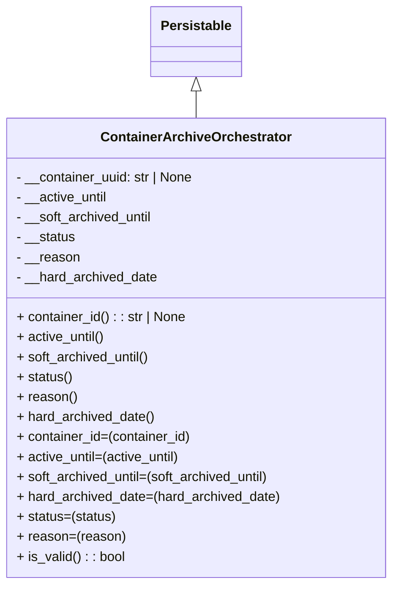

# Diagram: partview_core/partview_service/partview_service/core/datamodel/ContainerArchiveOrchestrator.py

> Auto-generated by Obscura crawlers

## Mermaid

### SVG

<svg id="container" width="467.3046875" xmlns="http://www.w3.org/2000/svg" class="classDiagram" height="702" viewBox="0 0 467.3046875 702" role="graphics-document document" aria-roledescription="class"><g><defs><marker id="container_class-aggregationStart" class="marker aggregation class" refX="18" refY="7" markerWidth="190" markerHeight="240" orient="auto"><path d="M 18,7 L9,13 L1,7 L9,1 Z"></path></marker></defs><defs><marker id="container_class-aggregationEnd" class="marker aggregation class" refX="1" refY="7" markerWidth="20" markerHeight="28" orient="auto"><path d="M 18,7 L9,13 L1,7 L9,1 Z"></path></marker></defs><defs><marker id="container_class-extensionStart" class="marker extension class" refX="18" refY="7" markerWidth="190" markerHeight="240" orient="auto"><path d="M 1,7 L18,13 V 1 Z"></path></marker></defs><defs><marker id="container_class-extensionEnd" class="marker extension class" refX="1" refY="7" markerWidth="20" markerHeight="28" orient="auto"><path d="M 1,1 V 13 L18,7 Z"></path></marker></defs><defs><marker id="container_class-compositionStart" class="marker composition class" refX="18" refY="7" markerWidth="190" markerHeight="240" orient="auto"><path d="M 18,7 L9,13 L1,7 L9,1 Z"></path></marker></defs><defs><marker id="container_class-compositionEnd" class="marker composition class" refX="1" refY="7" markerWidth="20" markerHeight="28" orient="auto"><path d="M 18,7 L9,13 L1,7 L9,1 Z"></path></marker></defs><defs><marker id="container_class-dependencyStart" class="marker dependency class" refX="6" refY="7" markerWidth="190" markerHeight="240" orient="auto"><path d="M 5,7 L9,13 L1,7 L9,1 Z"></path></marker></defs><defs><marker id="container_class-dependencyEnd" class="marker dependency class" refX="13" refY="7" markerWidth="20" markerHeight="28" orient="auto"><path d="M 18,7 L9,13 L14,7 L9,1 Z"></path></marker></defs><defs><marker id="container_class-lollipopStart" class="marker lollipop class" refX="13" refY="7" markerWidth="190" markerHeight="240" orient="auto"><circle stroke="black" fill="transparent" cx="7" cy="7" r="6"></circle></marker></defs><defs><marker id="container_class-lollipopEnd" class="marker lollipop class" refX="1" refY="7" markerWidth="190" markerHeight="240" orient="auto"><circle stroke="black" fill="transparent" cx="7" cy="7" r="6"></circle></marker></defs><g class="root"><g class="clusters"></g><g class="edgePaths"><path d="M233.652,109.25L233.652,110.542C233.652,111.833,233.652,114.417,233.652,119.875C233.652,125.333,233.652,133.667,233.652,137.833L233.652,142" id="id_Persistable_ContainerArchiveOrchestrator_1" class="edge-thickness-normal edge-pattern-solid relation" style=";;;" data-edge="true" data-et="edge" data-id="id_Persistable_ContainerArchiveOrchestrator_1" data-points="W3sieCI6MjMzLjY1MjM0Mzc1LCJ5Ijo5Mn0seyJ4IjoyMzMuNjUyMzQzNzUsInkiOjExN30seyJ4IjoyMzMuNjUyMzQzNzUsInkiOjE0Mn1d" marker-start="url(#container_class-extensionStart)"></path></g><g class="edgeLabels"><g class="edgeLabel"><g class="label" data-id="id_Persistable_ContainerArchiveOrchestrator_1" transform="translate(0, 0)"><foreignObject width="0" height="0">

</foreignObject></g></g></g><g class="nodes"><g class="node default" id="classId-Persistable-0" transform="translate(233.65234375, 50)"><g class="basic label-container"><path d="M-52.9765625 -42 L52.9765625 -42 L52.9765625 42 L-52.9765625 42" stroke="none" stroke-width="0" fill="#ECECFF" style=""></path><path d="M-52.9765625 -42 C-23.715088511976866 -42, 5.546385476046268 -42, 52.9765625 -42 M-52.9765625 -42 C-20.89496828741428 -42, 11.186625925171441 -42, 52.9765625 -42 M52.9765625 -42 C52.9765625 -25.054086561947546, 52.9765625 -8.108173123895092, 52.9765625 42 M52.9765625 -42 C52.9765625 -24.197295742638993, 52.9765625 -6.394591485277985, 52.9765625 42 M52.9765625 42 C21.938759594983054 42, -9.099043310033892 42, -52.9765625 42 M52.9765625 42 C19.150274120751547 42, -14.676014258496906 42, -52.9765625 42 M-52.9765625 42 C-52.9765625 18.221702502853116, -52.9765625 -5.556594994293768, -52.9765625 -42 M-52.9765625 42 C-52.9765625 9.08470259905279, -52.9765625 -23.83059480189442, -52.9765625 -42" stroke="#9370DB" stroke-width="1.3" fill="none" stroke-dasharray="0 0" style=""></path></g><g class="annotation-group text" transform="translate(0, -18)"></g><g class="label-group text" transform="translate(-40.9765625, -18)"><g class="label" style="font-weight: bolder" transform="translate(0,-12)"><foreignObject width="81.953125" height="24">

Persistable

</foreignObject></g></g><g class="members-group text" transform="translate(-40.9765625, 30)"></g><g class="methods-group text" transform="translate(-40.9765625, 60)"></g><g class="divider" style=""><path d="M-52.9765625 6 C-28.04998534642844 6, -3.1234081928568784 6, 52.9765625 6 M-52.9765625 6 C-18.284179998983 6, 16.408202502034 6, 52.9765625 6" stroke="#9370DB" stroke-width="1.3" fill="none" stroke-dasharray="0 0" style=""></path></g><g class="divider" style=""><path d="M-52.9765625 24 C-18.193268089934968 24, 16.590026320130065 24, 52.9765625 24 M-52.9765625 24 C-25.648846876474444 24, 1.678868747051112 24, 52.9765625 24" stroke="#9370DB" stroke-width="1.3" fill="none" stroke-dasharray="0 0" style=""></path></g></g><g class="node default" id="classId-ContainerArchiveOrchestrator-1" transform="translate(233.65234375, 418)"><g class="basic label-container"><path d="M-225.65234375 -276 L225.65234375 -276 L225.65234375 276 L-225.65234375 276" stroke="none" stroke-width="0" fill="#ECECFF" style=""></path><path d="M-225.65234375 -276 C-135.06413809552384 -276, -44.47593244104766 -276, 225.65234375 -276 M-225.65234375 -276 C-95.66080265174787 -276, 34.330738446504256 -276, 225.65234375 -276 M225.65234375 -276 C225.65234375 -90.13317523830358, 225.65234375 95.73364952339284, 225.65234375 276 M225.65234375 -276 C225.65234375 -100.65001830662689, 225.65234375 74.69996338674622, 225.65234375 276 M225.65234375 276 C129.33700616006158 276, 33.021668570123154 276, -225.65234375 276 M225.65234375 276 C112.12476569054998 276, -1.4028123689000438 276, -225.65234375 276 M-225.65234375 276 C-225.65234375 123.78828084892695, -225.65234375 -28.42343830214611, -225.65234375 -276 M-225.65234375 276 C-225.65234375 143.65513275711794, -225.65234375 11.31026551423588, -225.65234375 -276" stroke="#9370DB" stroke-width="1.3" fill="none" stroke-dasharray="0 0" style=""></path></g><g class="annotation-group text" transform="translate(0, -252)"></g><g class="label-group text" transform="translate(-108.8984375, -252)"><g class="label" style="font-weight: bolder" transform="translate(0,-12)"><foreignObject width="217.796875" height="24">

ContainerArchiveOrchestrator

</foreignObject></g></g><g class="members-group text" transform="translate(-213.65234375, -204)"><g class="label" style="" transform="translate(0,-12)"><foreignObject width="216.28125" height="24">

- __container_uuid: str | None

</foreignObject></g><g class="label" style="" transform="translate(0,12)"><foreignObject width="111.375" height="24">

- __active_until

</foreignObject></g><g class="label" style="" transform="translate(0,36)"><foreignObject width="166.828125" height="24">

- __soft_archived_until

</foreignObject></g><g class="label" style="" transform="translate(0,60)"><foreignObject width="71.578125" height="24">

- __status

</foreignObject></g><g class="label" style="" transform="translate(0,84)"><foreignObject width="76.171875" height="24">

- __reason

</foreignObject></g><g class="label" style="" transform="translate(0,108)"><foreignObject width="171.078125" height="24">

- __hard_archived_date

</foreignObject></g></g><g class="methods-group text" transform="translate(-213.65234375, -36)"><g class="label" style="" transform="translate(0,-12)"><foreignObject width="206.046875" height="24">

+ container_id() : : str | None

</foreignObject></g><g class="label" style="" transform="translate(0,12)"><foreignObject width="107.109375" height="24">

+ active_until()

</foreignObject></g><g class="label" style="" transform="translate(0,36)"><foreignObject width="162.25" height="24">

+ soft_archived_until()

</foreignObject></g><g class="label" style="" transform="translate(0,60)"><foreignObject width="67" height="24">

+ status()

</foreignObject></g><g class="label" style="" transform="translate(0,84)"><foreignObject width="71.59375" height="24">

+ reason()

</foreignObject></g><g class="label" style="" transform="translate(0,108)"><foreignObject width="166.5" height="24">

+ hard_archived_date()

</foreignObject></g><g class="label" style="" transform="translate(0,132)"><foreignObject width="211.234375" height="24">

+ container_id=(container_id)

</foreignObject></g><g class="label" style="" transform="translate(0,156)"><foreignObject width="199.625" height="24">

+ active_until=(active_until)

</foreignObject></g><g class="label" style="" transform="translate(0,180)"><foreignObject width="309.890625" height="24">

+ soft_archived_until=(soft_archived_until)

</foreignObject></g><g class="label" style="" transform="translate(0,204)"><foreignObject width="318.40625" height="24">

+ hard_archived_date=(hard_archived_date)

</foreignObject></g><g class="label" style="" transform="translate(0,228)"><foreignObject width="119.40625" height="24">

+ status=(status)

</foreignObject></g><g class="label" style="" transform="translate(0,252)"><foreignObject width="128.578125" height="24">

+ reason=(reason)

</foreignObject></g><g class="label" style="" transform="translate(0,276)"><foreignObject width="130.3125" height="24">

+ is_valid() : : bool

</foreignObject></g></g><g class="divider" style=""><path d="M-225.65234375 -228 C-101.18167018664117 -228, 23.28900337671766 -228, 225.65234375 -228 M-225.65234375 -228 C-52.97982235853988 -228, 119.69269903292025 -228, 225.65234375 -228" stroke="#9370DB" stroke-width="1.3" fill="none" stroke-dasharray="0 0" style=""></path></g><g class="divider" style=""><path d="M-225.65234375 -60 C-47.644469925665646 -60, 130.3634038986687 -60, 225.65234375 -60 M-225.65234375 -60 C-133.6135897131776 -60, -41.57483567635518 -60, 225.65234375 -60" stroke="#9370DB" stroke-width="1.3" fill="none" stroke-dasharray="0 0" style=""></path></g></g></g></g></g></svg>
