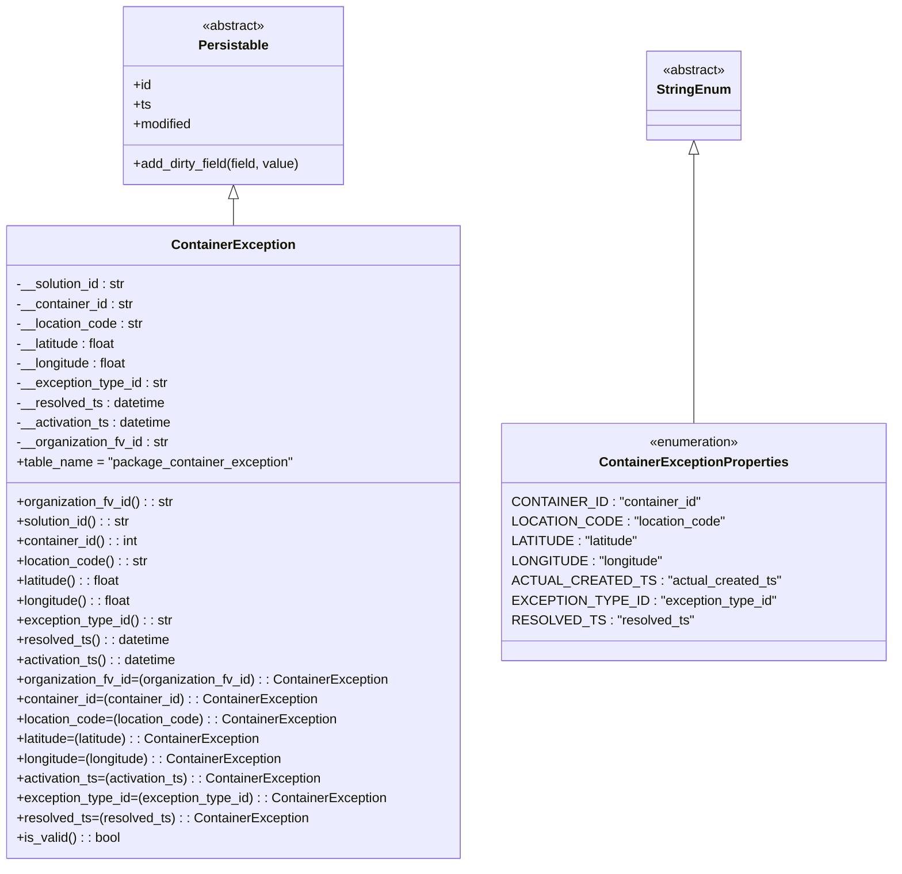

# Diagram: partview_core/partview_service/partview_service/core/datamodel/ContainerException.py

> Auto-generated by Obscura crawlers

## Mermaid

### SVG

<svg id="container" width="1051.6484375" xmlns="http://www.w3.org/2000/svg" class="classDiagram" height="1050" viewBox="0 0 1051.6484375 1050" role="graphics-document document" aria-roledescription="class"><g><defs><marker id="container_class-aggregationStart" class="marker aggregation class" refX="18" refY="7" markerWidth="190" markerHeight="240" orient="auto"><path d="M 18,7 L9,13 L1,7 L9,1 Z"></path></marker></defs><defs><marker id="container_class-aggregationEnd" class="marker aggregation class" refX="1" refY="7" markerWidth="20" markerHeight="28" orient="auto"><path d="M 18,7 L9,13 L1,7 L9,1 Z"></path></marker></defs><defs><marker id="container_class-extensionStart" class="marker extension class" refX="18" refY="7" markerWidth="190" markerHeight="240" orient="auto"><path d="M 1,7 L18,13 V 1 Z"></path></marker></defs><defs><marker id="container_class-extensionEnd" class="marker extension class" refX="1" refY="7" markerWidth="20" markerHeight="28" orient="auto"><path d="M 1,1 V 13 L18,7 Z"></path></marker></defs><defs><marker id="container_class-compositionStart" class="marker composition class" refX="18" refY="7" markerWidth="190" markerHeight="240" orient="auto"><path d="M 18,7 L9,13 L1,7 L9,1 Z"></path></marker></defs><defs><marker id="container_class-compositionEnd" class="marker composition class" refX="1" refY="7" markerWidth="20" markerHeight="28" orient="auto"><path d="M 18,7 L9,13 L1,7 L9,1 Z"></path></marker></defs><defs><marker id="container_class-dependencyStart" class="marker dependency class" refX="6" refY="7" markerWidth="190" markerHeight="240" orient="auto"><path d="M 5,7 L9,13 L1,7 L9,1 Z"></path></marker></defs><defs><marker id="container_class-dependencyEnd" class="marker dependency class" refX="13" refY="7" markerWidth="20" markerHeight="28" orient="auto"><path d="M 18,7 L9,13 L14,7 L9,1 Z"></path></marker></defs><defs><marker id="container_class-lollipopStart" class="marker lollipop class" refX="13" refY="7" markerWidth="190" markerHeight="240" orient="auto"><circle stroke="black" fill="transparent" cx="7" cy="7" r="6"></circle></marker></defs><defs><marker id="container_class-lollipopEnd" class="marker lollipop class" refX="1" refY="7" markerWidth="190" markerHeight="240" orient="auto"><circle stroke="black" fill="transparent" cx="7" cy="7" r="6"></circle></marker></defs><g class="root"><g class="clusters"></g><g class="edgePaths"><path d="M283.156,241.25L283.156,242.542C283.156,243.833,283.156,246.417,283.156,251.875C283.156,257.333,283.156,265.667,283.156,269.833L283.156,274" id="id_Persistable_ContainerException_1" class="edge-thickness-normal edge-pattern-solid relation" style=";;;" data-edge="true" data-et="edge" data-id="id_Persistable_ContainerException_1" data-points="W3sieCI6MjgzLjE1NjI1LCJ5IjoyMjR9LHsieCI6MjgzLjE1NjI1LCJ5IjoyNDl9LHsieCI6MjgzLjE1NjI1LCJ5IjoyNzR9XQ==" marker-start="url(#container_class-extensionStart)"></path><path d="M825.98,187.25L825.98,197.542C825.98,207.833,825.98,228.417,825.98,282.875C825.98,337.333,825.98,425.667,825.98,469.833L825.98,514" id="id_StringEnum_ContainerExceptionProperties_2" class="edge-thickness-normal edge-pattern-solid relation" style=";;;" data-edge="true" data-et="edge" data-id="id_StringEnum_ContainerExceptionProperties_2" data-points="W3sieCI6ODI1Ljk4MDQ2ODc1LCJ5IjoxNzB9LHsieCI6ODI1Ljk4MDQ2ODc1LCJ5IjoyNDl9LHsieCI6ODI1Ljk4MDQ2ODc1LCJ5Ijo1MTR9XQ==" marker-start="url(#container_class-extensionStart)"></path></g><g class="edgeLabels"><g class="edgeLabel"><g class="label" data-id="id_Persistable_ContainerException_1" transform="translate(0, 0)"><foreignObject width="0" height="0">

</foreignObject></g></g><g class="edgeLabel"><g class="label" data-id="id_StringEnum_ContainerExceptionProperties_2" transform="translate(0, 0)"><foreignObject width="0" height="0">

</foreignObject></g></g></g><g class="nodes"><g class="node default" id="classId-Persistable-0" transform="translate(283.15625, 116)"><g class="basic label-container"><path d="M-135.71484375 -108 L135.71484375 -108 L135.71484375 108 L-135.71484375 108" stroke="none" stroke-width="0" fill="#ECECFF" style=""></path><path d="M-135.71484375 -108 C-64.14200623172309 -108, 7.4308312865538255 -108, 135.71484375 -108 M-135.71484375 -108 C-70.72205807844216 -108, -5.72927240688432 -108, 135.71484375 -108 M135.71484375 -108 C135.71484375 -35.69599815190875, 135.71484375 36.60800369618249, 135.71484375 108 M135.71484375 -108 C135.71484375 -61.55209669645095, 135.71484375 -15.104193392901905, 135.71484375 108 M135.71484375 108 C43.82313931629284 108, -48.06856511741432 108, -135.71484375 108 M135.71484375 108 C31.688277427874326 108, -72.33828889425135 108, -135.71484375 108 M-135.71484375 108 C-135.71484375 53.74251146941911, -135.71484375 -0.5149770611617868, -135.71484375 -108 M-135.71484375 108 C-135.71484375 25.840813172997116, -135.71484375 -56.31837365400577, -135.71484375 -108" stroke="#9370DB" stroke-width="1.3" fill="none" stroke-dasharray="0 0" style=""></path></g><g class="annotation-group text" transform="translate(-38.609375, -84)"><g class="label" style="" transform="translate(0,-12)"><foreignObject width="77.21875" height="24">

«abstract»

</foreignObject></g></g><g class="label-group text" transform="translate(-40.9765625, -60)"><g class="label" style="font-weight: bolder" transform="translate(0,-12)"><foreignObject width="81.953125" height="24">

Persistable

</foreignObject></g></g><g class="members-group text" transform="translate(-123.71484375, -12)"><g class="label" style="" transform="translate(0,-12)"><foreignObject width="22.078125" height="24">

+id

</foreignObject></g><g class="label" style="" transform="translate(0,12)"><foreignObject width="21.15625" height="24">

+ts

</foreignObject></g><g class="label" style="" transform="translate(0,36)"><foreignObject width="72.609375" height="24">

+modified

</foreignObject></g></g><g class="methods-group text" transform="translate(-123.71484375, 84)"><g class="label" style="" transform="translate(0,-12)"><foreignObject width="206.453125" height="24">

+add_dirty_field(field, value)

</foreignObject></g></g><g class="divider" style=""><path d="M-135.71484375 -36 C-76.79148167213125 -36, -17.868119594262524 -36, 135.71484375 -36 M-135.71484375 -36 C-34.94275339468676 -36, 65.82933696062648 -36, 135.71484375 -36" stroke="#9370DB" stroke-width="1.3" fill="none" stroke-dasharray="0 0" style=""></path></g><g class="divider" style=""><path d="M-135.71484375 60 C-39.062781220406606 60, 57.58928130918679 60, 135.71484375 60 M-135.71484375 60 C-61.08769377997103 60, 13.539456190057933 60, 135.71484375 60" stroke="#9370DB" stroke-width="1.3" fill="none" stroke-dasharray="0 0" style=""></path></g></g><g class="node default" id="classId-StringEnum-1" transform="translate(825.98046875, 116)"><g class="basic label-container"><path d="M-54.234375 -54 L54.234375 -54 L54.234375 54 L-54.234375 54" stroke="none" stroke-width="0" fill="#ECECFF" style=""></path><path d="M-54.234375 -54 C-16.342572086888957 -54, 21.549230826222086 -54, 54.234375 -54 M-54.234375 -54 C-31.197162175031572 -54, -8.159949350063144 -54, 54.234375 -54 M54.234375 -54 C54.234375 -26.941960613206337, 54.234375 0.11607877358732566, 54.234375 54 M54.234375 -54 C54.234375 -25.361000937137938, 54.234375 3.2779981257241246, 54.234375 54 M54.234375 54 C22.549830226956363 54, -9.134714546087274 54, -54.234375 54 M54.234375 54 C26.620749569749062 54, -0.9928758605018757 54, -54.234375 54 M-54.234375 54 C-54.234375 24.919333602831518, -54.234375 -4.161332794336964, -54.234375 -54 M-54.234375 54 C-54.234375 16.386938917889772, -54.234375 -21.226122164220456, -54.234375 -54" stroke="#9370DB" stroke-width="1.3" fill="none" stroke-dasharray="0 0" style=""></path></g><g class="annotation-group text" transform="translate(-38.609375, -30)"><g class="label" style="" transform="translate(0,-12)"><foreignObject width="77.21875" height="24">

«abstract»

</foreignObject></g></g><g class="label-group text" transform="translate(-42.234375, -6)"><g class="label" style="font-weight: bolder" transform="translate(0,-12)"><foreignObject width="84.46875" height="24">

StringEnum

</foreignObject></g></g><g class="members-group text" transform="translate(-42.234375, 42)"></g><g class="methods-group text" transform="translate(-42.234375, 72)"></g><g class="divider" style=""><path d="M-54.234375 18 C-15.421561232981723 18, 23.391252534036553 18, 54.234375 18 M-54.234375 18 C-19.875420782321733 18, 14.483533435356534 18, 54.234375 18" stroke="#9370DB" stroke-width="1.3" fill="none" stroke-dasharray="0 0" style=""></path></g><g class="divider" style=""><path d="M-54.234375 36 C-21.309926452919846 36, 11.614522094160307 36, 54.234375 36 M-54.234375 36 C-12.57622890138169 36, 29.08191719723662 36, 54.234375 36" stroke="#9370DB" stroke-width="1.3" fill="none" stroke-dasharray="0 0" style=""></path></g></g><g class="node default" id="classId-ContainerExceptionProperties-2" transform="translate(825.98046875, 658)"><g class="basic label-container"><path d="M-217.66796875 -144 L217.66796875 -144 L217.66796875 144 L-217.66796875 144" stroke="none" stroke-width="0" fill="#ECECFF" style=""></path><path d="M-217.66796875 -144 C-84.40129209122611 -144, 48.86538456754778 -144, 217.66796875 -144 M-217.66796875 -144 C-126.6970143034817 -144, -35.72605985696339 -144, 217.66796875 -144 M217.66796875 -144 C217.66796875 -36.36955071486014, 217.66796875 71.26089857027972, 217.66796875 144 M217.66796875 -144 C217.66796875 -63.64212320663182, 217.66796875 16.715753586736355, 217.66796875 144 M217.66796875 144 C122.6574186615742 144, 27.646868573148396 144, -217.66796875 144 M217.66796875 144 C105.95850220087036 144, -5.750964348259288 144, -217.66796875 144 M-217.66796875 144 C-217.66796875 74.41467307158321, -217.66796875 4.829346143166418, -217.66796875 -144 M-217.66796875 144 C-217.66796875 55.57790601411841, -217.66796875 -32.844187971763176, -217.66796875 -144" stroke="#9370DB" stroke-width="1.3" fill="none" stroke-dasharray="0 0" style=""></path></g><g class="annotation-group text" transform="translate(-55.5546875, -120)"><g class="label" style="" transform="translate(0,-12)"><foreignObject width="111.109375" height="24">

«enumeration»

</foreignObject></g></g><g class="label-group text" transform="translate(-109.6015625, -96)"><g class="label" style="font-weight: bolder" transform="translate(0,-12)"><foreignObject width="219.203125" height="24">

ContainerExceptionProperties

</foreignObject></g></g><g class="members-group text" transform="translate(-205.66796875, -48)"><g class="label" style="" transform="translate(0,-12)"><foreignObject width="219.765625" height="24">

CONTAINER_ID : "container_id"

</foreignObject></g><g class="label" style="" transform="translate(0,12)"><foreignObject width="243.9375" height="24">

LOCATION_CODE : "location_code"

</foreignObject></g><g class="label" style="" transform="translate(0,36)"><foreignObject width="148.96875" height="24">

LATITUDE : "latitude"

</foreignObject></g><g class="label" style="" transform="translate(0,60)"><foreignObject width="176.265625" height="24">

LONGITUDE : "longitude"

</foreignObject></g><g class="label" style="" transform="translate(0,84)"><foreignObject width="300.546875" height="24">

ACTUAL_CREATED_TS : "actual_created_ts"

</foreignObject></g><g class="label" style="" transform="translate(0,108)"><foreignObject width="301.734375" height="24">

EXCEPTION_TYPE_ID : "exception_type_id"

</foreignObject></g><g class="label" style="" transform="translate(0,132)"><foreignObject width="203.859375" height="24">

RESOLVED_TS : "resolved_ts"

</foreignObject></g></g><g class="methods-group text" transform="translate(-205.66796875, 144)"></g><g class="divider" style=""><path d="M-217.66796875 -72 C-99.78622260985036 -72, 18.09552353029929 -72, 217.66796875 -72 M-217.66796875 -72 C-88.02005297629074 -72, 41.627862797418516 -72, 217.66796875 -72" stroke="#9370DB" stroke-width="1.3" fill="none" stroke-dasharray="0 0" style=""></path></g><g class="divider" style=""><path d="M-217.66796875 120 C-66.86993858807622 120, 83.92809157384755 120, 217.66796875 120 M-217.66796875 120 C-56.01112065468416 120, 105.64572744063167 120, 217.66796875 120" stroke="#9370DB" stroke-width="1.3" fill="none" stroke-dasharray="0 0" style=""></path></g></g><g class="node default" id="classId-ContainerException-3" transform="translate(283.15625, 658)"><g class="basic label-container"><path d="M-275.15625 -384 L275.15625 -384 L275.15625 384 L-275.15625 384" stroke="none" stroke-width="0" fill="#ECECFF" style=""></path><path d="M-275.15625 -384 C-163.96194275937242 -384, -52.76763551874484 -384, 275.15625 -384 M-275.15625 -384 C-72.59294732549711 -384, 129.97035534900579 -384, 275.15625 -384 M275.15625 -384 C275.15625 -153.40489095239406, 275.15625 77.19021809521189, 275.15625 384 M275.15625 -384 C275.15625 -159.24573973103367, 275.15625 65.50852053793267, 275.15625 384 M275.15625 384 C138.16253848262025 384, 1.1688269652404983 384, -275.15625 384 M275.15625 384 C119.42106362132441 384, -36.314122757351186 384, -275.15625 384 M-275.15625 384 C-275.15625 130.14933387650902, -275.15625 -123.70133224698196, -275.15625 -384 M-275.15625 384 C-275.15625 206.15904153983092, -275.15625 28.318083079661847, -275.15625 -384" stroke="#9370DB" stroke-width="1.3" fill="none" stroke-dasharray="0 0" style=""></path></g><g class="annotation-group text" transform="translate(0, -360)"></g><g class="label-group text" transform="translate(-71.296875, -360)"><g class="label" style="font-weight: bolder" transform="translate(0,-12)"><foreignObject width="142.59375" height="24">

ContainerException

</foreignObject></g></g><g class="members-group text" transform="translate(-263.15625, -312)"><g class="label" style="" transform="translate(0,-12)"><foreignObject width="135.625" height="24">

-__solution_id : str

</foreignObject></g><g class="label" style="" transform="translate(0,12)"><foreignObject width="143.40625" height="24">

-__container_id : str

</foreignObject></g><g class="label" style="" transform="translate(0,36)"><foreignObject width="155.359375" height="24">

-__location_code : str

</foreignObject></g><g class="label" style="" transform="translate(0,60)"><foreignObject width="123.84375" height="24">

-__latitude : float

</foreignObject></g><g class="label" style="" transform="translate(0,84)"><foreignObject width="136.40625" height="24">

-__longitude : float

</foreignObject></g><g class="label" style="" transform="translate(0,108)"><foreignObject width="185.703125" height="24">

-__exception_type_id : str

</foreignObject></g><g class="label" style="" transform="translate(0,132)"><foreignObject width="182.328125" height="24">

-__resolved_ts : datetime

</foreignObject></g><g class="label" style="" transform="translate(0,156)"><foreignObject width="192.125" height="24">

-__activation_ts : datetime

</foreignObject></g><g class="label" style="" transform="translate(0,180)"><foreignObject width="186.578125" height="24">

-__organization_fv_id : str

</foreignObject></g><g class="label" style="" transform="translate(0,204)"><foreignObject width="336.046875" height="24">

+table_name = "package_container_exception"

</foreignObject></g></g><g class="methods-group text" transform="translate(-263.15625, -48)"><g class="label" style="" transform="translate(0,-12)"><foreignObject width="191.6875" height="24">

+organization_fv_id() : : str

</foreignObject></g><g class="label" style="" transform="translate(0,12)"><foreignObject width="140.40625" height="24">

+solution_id() : : str

</foreignObject></g><g class="label" style="" transform="translate(0,36)"><foreignObject width="148.75" height="24">

+container_id() : : int

</foreignObject></g><g class="label" style="" transform="translate(0,60)"><foreignObject width="160.296875" height="24">

+location_code() : : str

</foreignObject></g><g class="label" style="" transform="translate(0,84)"><foreignObject width="128.796875" height="24">

+latitude() : : float

</foreignObject></g><g class="label" style="" transform="translate(0,108)"><foreignObject width="141.359375" height="24">

+longitude() : : float

</foreignObject></g><g class="label" style="" transform="translate(0,132)"><foreignObject width="190.8125" height="24">

+exception_type_id() : : str

</foreignObject></g><g class="label" style="" transform="translate(0,156)"><foreignObject width="187.109375" height="24">

+resolved_ts() : : datetime

</foreignObject></g><g class="label" style="" transform="translate(0,180)"><foreignObject width="196.984375" height="24">

+activation_ts() : : datetime

</foreignObject></g><g class="label" style="" transform="translate(0,204)"><foreignObject width="455.015625" height="24">

+organization_fv_id=(organization_fv_id) : : ContainerException

</foreignObject></g><g class="label" style="" transform="translate(0,228)"><foreignObject width="368.65625" height="24">

+container_id=(container_id) : : ContainerException

</foreignObject></g><g class="label" style="" transform="translate(0,252)"><foreignObject width="392.234375" height="24">

+location_code=(location_code) : : ContainerException

</foreignObject></g><g class="label" style="" transform="translate(0,276)"><foreignObject width="301.953125" height="24">

+latitude=(latitude) : : ContainerException

</foreignObject></g><g class="label" style="" transform="translate(0,300)"><foreignObject width="327.078125" height="24">

+longitude=(longitude) : : ContainerException

</foreignObject></g><g class="label" style="" transform="translate(0,324)"><foreignObject width="374.203125" height="24">

+activation_ts=(activation_ts) : : ContainerException

</foreignObject></g><g class="label" style="" transform="translate(0,348)"><foreignObject width="453.25" height="24">

+exception_type_id=(exception_type_id) : : ContainerException

</foreignObject></g><g class="label" style="" transform="translate(0,372)"><foreignObject width="354.21875" height="24">

+resolved_ts=(resolved_ts) : : ContainerException

</foreignObject></g><g class="label" style="" transform="translate(0,396)"><foreignObject width="126.078125" height="24">

+is_valid() : : bool

</foreignObject></g></g><g class="divider" style=""><path d="M-275.15625 -336 C-77.8922962440704 -336, 119.37165751185921 -336, 275.15625 -336 M-275.15625 -336 C-161.69997332992915 -336, -48.2436966598583 -336, 275.15625 -336" stroke="#9370DB" stroke-width="1.3" fill="none" stroke-dasharray="0 0" style=""></path></g><g class="divider" style=""><path d="M-275.15625 -72 C-143.88348659327556 -72, -12.610723186551127 -72, 275.15625 -72 M-275.15625 -72 C-153.32695836523146 -72, -31.497666730462896 -72, 275.15625 -72" stroke="#9370DB" stroke-width="1.3" fill="none" stroke-dasharray="0 0" style=""></path></g></g></g></g></g></svg>
