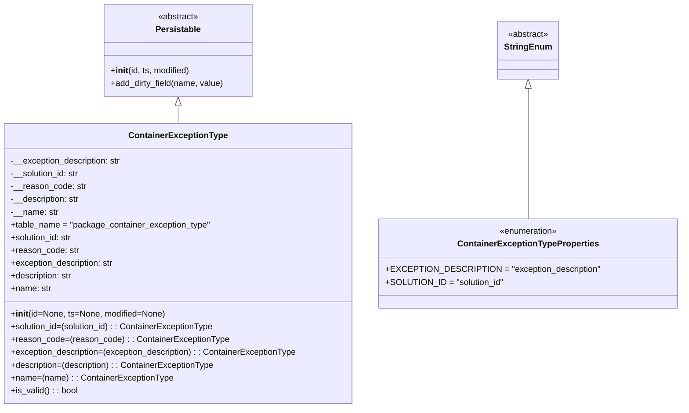

# Diagram: partview_core/partview_service/partview_service/core/datamodel/ContainerExceptionType.py

> Auto-generated by Obscura crawlers

## Mermaid

### SVG

<svg id="container" width="1253.6796875" xmlns="http://www.w3.org/2000/svg" class="classDiagram" height="768" viewBox="0 0 1253.6796875 768" role="graphics-document document" aria-roledescription="class"><g><defs><marker id="container_class-aggregationStart" class="marker aggregation class" refX="18" refY="7" markerWidth="190" markerHeight="240" orient="auto"><path d="M 18,7 L9,13 L1,7 L9,1 Z"></path></marker></defs><defs><marker id="container_class-aggregationEnd" class="marker aggregation class" refX="1" refY="7" markerWidth="20" markerHeight="28" orient="auto"><path d="M 18,7 L9,13 L1,7 L9,1 Z"></path></marker></defs><defs><marker id="container_class-extensionStart" class="marker extension class" refX="18" refY="7" markerWidth="190" markerHeight="240" orient="auto"><path d="M 1,7 L18,13 V 1 Z"></path></marker></defs><defs><marker id="container_class-extensionEnd" class="marker extension class" refX="1" refY="7" markerWidth="20" markerHeight="28" orient="auto"><path d="M 1,1 V 13 L18,7 Z"></path></marker></defs><defs><marker id="container_class-compositionStart" class="marker composition class" refX="18" refY="7" markerWidth="190" markerHeight="240" orient="auto"><path d="M 18,7 L9,13 L1,7 L9,1 Z"></path></marker></defs><defs><marker id="container_class-compositionEnd" class="marker composition class" refX="1" refY="7" markerWidth="20" markerHeight="28" orient="auto"><path d="M 18,7 L9,13 L1,7 L9,1 Z"></path></marker></defs><defs><marker id="container_class-dependencyStart" class="marker dependency class" refX="6" refY="7" markerWidth="190" markerHeight="240" orient="auto"><path d="M 5,7 L9,13 L1,7 L9,1 Z"></path></marker></defs><defs><marker id="container_class-dependencyEnd" class="marker dependency class" refX="13" refY="7" markerWidth="20" markerHeight="28" orient="auto"><path d="M 18,7 L9,13 L14,7 L9,1 Z"></path></marker></defs><defs><marker id="container_class-lollipopStart" class="marker lollipop class" refX="13" refY="7" markerWidth="190" markerHeight="240" orient="auto"><circle stroke="black" fill="transparent" cx="7" cy="7" r="6"></circle></marker></defs><defs><marker id="container_class-lollipopEnd" class="marker lollipop class" refX="1" refY="7" markerWidth="190" markerHeight="240" orient="auto"><circle stroke="black" fill="transparent" cx="7" cy="7" r="6"></circle></marker></defs><g class="root"><g class="clusters"></g><g class="edgePaths"><path d="M980.383,166.25L980.383,173.042C980.383,179.833,980.383,193.417,980.383,234.375C980.383,275.333,980.383,343.667,980.383,377.833L980.383,412" id="id_StringEnum_ContainerExceptionTypeProperties_1" class="edge-thickness-normal edge-pattern-solid relation" style=";;;" data-edge="true" data-et="edge" data-id="id_StringEnum_ContainerExceptionTypeProperties_1" data-points="W3sieCI6OTgwLjM4MjgxMjUsInkiOjE0OX0seyJ4Ijo5ODAuMzgyODEyNSwieSI6MjA3fSx7IngiOjk4MC4zODI4MTI1LCJ5Ijo0MTJ9XQ==" marker-start="url(#container_class-extensionStart)"></path><path d="M336.543,199.25L336.543,200.542C336.543,201.833,336.543,204.417,336.543,209.875C336.543,215.333,336.543,223.667,336.543,227.833L336.543,232" id="id_Persistable_ContainerExceptionType_2" class="edge-thickness-normal edge-pattern-solid relation" style=";;;" data-edge="true" data-et="edge" data-id="id_Persistable_ContainerExceptionType_2" data-points="W3sieCI6MzM2LjU0Mjk2ODc1LCJ5IjoxODJ9LHsieCI6MzM2LjU0Mjk2ODc1LCJ5IjoyMDd9LHsieCI6MzM2LjU0Mjk2ODc1LCJ5IjoyMzJ9XQ==" marker-start="url(#container_class-extensionStart)"></path></g><g class="edgeLabels"><g class="edgeLabel"><g class="label" data-id="id_StringEnum_ContainerExceptionTypeProperties_1" transform="translate(0, 0)"><foreignObject width="0" height="0">

</foreignObject></g></g><g class="edgeLabel"><g class="label" data-id="id_Persistable_ContainerExceptionType_2" transform="translate(0, 0)"><foreignObject width="0" height="0">

</foreignObject></g></g></g><g class="nodes"><g class="node default" id="classId-Persistable-0" transform="translate(336.54296875, 95)"><g class="basic label-container"><path d="M-139.84765625 -87 L139.84765625 -87 L139.84765625 87 L-139.84765625 87" stroke="none" stroke-width="0" fill="#ECECFF" style=""></path><path d="M-139.84765625 -87 C-78.08494391465712 -87, -16.32223157931425 -87, 139.84765625 -87 M-139.84765625 -87 C-78.34821523370303 -87, -16.848774217406046 -87, 139.84765625 -87 M139.84765625 -87 C139.84765625 -18.087520531980545, 139.84765625 50.82495893603891, 139.84765625 87 M139.84765625 -87 C139.84765625 -32.67827083665587, 139.84765625 21.64345832668826, 139.84765625 87 M139.84765625 87 C45.15605872755259 87, -49.53553879489482 87, -139.84765625 87 M139.84765625 87 C55.046068606770945 87, -29.75551903645811 87, -139.84765625 87 M-139.84765625 87 C-139.84765625 27.032934659454334, -139.84765625 -32.93413068109133, -139.84765625 -87 M-139.84765625 87 C-139.84765625 30.95073275999883, -139.84765625 -25.098534480002343, -139.84765625 -87" stroke="#9370DB" stroke-width="1.3" fill="none" stroke-dasharray="0 0" style=""></path></g><g class="annotation-group text" transform="translate(-38.609375, -63)"><g class="label" style="" transform="translate(0,-12)"><foreignObject width="77.21875" height="24">

«abstract»

</foreignObject></g></g><g class="label-group text" transform="translate(-40.9765625, -39)"><g class="label" style="font-weight: bolder" transform="translate(0,-12)"><foreignObject width="81.953125" height="24">

Persistable

</foreignObject></g></g><g class="members-group text" transform="translate(-127.84765625, 9)"></g><g class="methods-group text" transform="translate(-127.84765625, 39)"><g class="label" style="" transform="translate(0,-12)"><foreignObject width="150.90625" height="24">

+<strong>init</strong>(id, ts, modified)

</foreignObject></g><g class="label" style="" transform="translate(0,12)"><foreignObject width="214.71875" height="24">

+add_dirty_field(name, value)

</foreignObject></g></g><g class="divider" style=""><path d="M-139.84765625 -15 C-70.07124748780585 -15, -0.2948387256116973 -15, 139.84765625 -15 M-139.84765625 -15 C-48.82539594633366 -15, 42.196864357332686 -15, 139.84765625 -15" stroke="#9370DB" stroke-width="1.3" fill="none" stroke-dasharray="0 0" style=""></path></g><g class="divider" style=""><path d="M-139.84765625 9 C-74.81819317417745 9, -9.788730098354904 9, 139.84765625 9 M-139.84765625 9 C-31.29265245324585 9, 77.2623513435083 9, 139.84765625 9" stroke="#9370DB" stroke-width="1.3" fill="none" stroke-dasharray="0 0" style=""></path></g></g><g class="node default" id="classId-StringEnum-1" transform="translate(980.3828125, 95)"><g class="basic label-container"><path d="M-54.234375 -54 L54.234375 -54 L54.234375 54 L-54.234375 54" stroke="none" stroke-width="0" fill="#ECECFF" style=""></path><path d="M-54.234375 -54 C-31.930672204114373 -54, -9.626969408228746 -54, 54.234375 -54 M-54.234375 -54 C-24.85659489747548 -54, 4.5211852050490435 -54, 54.234375 -54 M54.234375 -54 C54.234375 -29.26663087822974, 54.234375 -4.533261756459481, 54.234375 54 M54.234375 -54 C54.234375 -12.40049632734047, 54.234375 29.19900734531906, 54.234375 54 M54.234375 54 C10.873766637599076 54, -32.48684172480185 54, -54.234375 54 M54.234375 54 C22.922080921596727 54, -8.390213156806546 54, -54.234375 54 M-54.234375 54 C-54.234375 20.252089776026722, -54.234375 -13.495820447946556, -54.234375 -54 M-54.234375 54 C-54.234375 18.851689811334957, -54.234375 -16.296620377330086, -54.234375 -54" stroke="#9370DB" stroke-width="1.3" fill="none" stroke-dasharray="0 0" style=""></path></g><g class="annotation-group text" transform="translate(-38.609375, -30)"><g class="label" style="" transform="translate(0,-12)"><foreignObject width="77.21875" height="24">

«abstract»

</foreignObject></g></g><g class="label-group text" transform="translate(-42.234375, -6)"><g class="label" style="font-weight: bolder" transform="translate(0,-12)"><foreignObject width="84.46875" height="24">

StringEnum

</foreignObject></g></g><g class="members-group text" transform="translate(-42.234375, 42)"></g><g class="methods-group text" transform="translate(-42.234375, 72)"></g><g class="divider" style=""><path d="M-54.234375 18 C-28.48389574893501 18, -2.7334164978700173 18, 54.234375 18 M-54.234375 18 C-16.36009196194349 18, 21.514191076113022 18, 54.234375 18" stroke="#9370DB" stroke-width="1.3" fill="none" stroke-dasharray="0 0" style=""></path></g><g class="divider" style=""><path d="M-54.234375 36 C-20.990946878988723 36, 12.252481242022554 36, 54.234375 36 M-54.234375 36 C-25.925131272562258 36, 2.384112454875485 36, 54.234375 36" stroke="#9370DB" stroke-width="1.3" fill="none" stroke-dasharray="0 0" style=""></path></g></g><g class="node default" id="classId-ContainerExceptionTypeProperties-2" transform="translate(980.3828125, 496)"><g class="basic label-container"><path d="M-265.296875 -84 L265.296875 -84 L265.296875 84 L-265.296875 84" stroke="none" stroke-width="0" fill="#ECECFF" style=""></path><path d="M-265.296875 -84 C-67.0194158261422 -84, 131.2580433477156 -84, 265.296875 -84 M-265.296875 -84 C-157.98980167248334 -84, -50.68272834496665 -84, 265.296875 -84 M265.296875 -84 C265.296875 -32.72689672470175, 265.296875 18.546206550596494, 265.296875 84 M265.296875 -84 C265.296875 -18.769717849941685, 265.296875 46.46056430011663, 265.296875 84 M265.296875 84 C143.01736940942624 84, 20.737863818852446 84, -265.296875 84 M265.296875 84 C61.66851323490803 84, -141.95984853018393 84, -265.296875 84 M-265.296875 84 C-265.296875 28.96523010412144, -265.296875 -26.069539791757123, -265.296875 -84 M-265.296875 84 C-265.296875 34.53993799764112, -265.296875 -14.920124004717763, -265.296875 -84" stroke="#9370DB" stroke-width="1.3" fill="none" stroke-dasharray="0 0" style=""></path></g><g class="annotation-group text" transform="translate(-55.5546875, -60)"><g class="label" style="" transform="translate(0,-12)"><foreignObject width="111.109375" height="24">

«enumeration»

</foreignObject></g></g><g class="label-group text" transform="translate(-126.9375, -36)"><g class="label" style="font-weight: bolder" transform="translate(0,-12)"><foreignObject width="253.875" height="24">

ContainerExceptionTypeProperties

</foreignObject></g></g><g class="members-group text" transform="translate(-253.296875, 12)"><g class="label" style="" transform="translate(0,-12)"><foreignObject width="379.65625" height="24">

+EXCEPTION_DESCRIPTION = "exception_description"

</foreignObject></g><g class="label" style="" transform="translate(0,12)"><foreignObject width="214.953125" height="24">

+SOLUTION_ID = "solution_id"

</foreignObject></g></g><g class="methods-group text" transform="translate(-253.296875, 84)"></g><g class="divider" style=""><path d="M-265.296875 -12 C-78.34328687395455 -12, 108.61030125209089 -12, 265.296875 -12 M-265.296875 -12 C-86.95386544396459 -12, 91.38914411207082 -12, 265.296875 -12" stroke="#9370DB" stroke-width="1.3" fill="none" stroke-dasharray="0 0" style=""></path></g><g class="divider" style=""><path d="M-265.296875 60 C-77.261303847079 60, 110.77426730584199 60, 265.296875 60 M-265.296875 60 C-129.08351080413493 60, 7.129853391730137 60, 265.296875 60" stroke="#9370DB" stroke-width="1.3" fill="none" stroke-dasharray="0 0" style=""></path></g></g><g class="node default" id="classId-ContainerExceptionType-3" transform="translate(336.54296875, 496)"><g class="basic label-container"><path d="M-328.54296875 -264 L328.54296875 -264 L328.54296875 264 L-328.54296875 264" stroke="none" stroke-width="0" fill="#ECECFF" style=""></path><path d="M-328.54296875 -264 C-66.94101411297737 -264, 194.66094052404526 -264, 328.54296875 -264 M-328.54296875 -264 C-145.13927759236228 -264, 38.26441356527545 -264, 328.54296875 -264 M328.54296875 -264 C328.54296875 -73.30512861861402, 328.54296875 117.38974276277196, 328.54296875 264 M328.54296875 -264 C328.54296875 -122.96674156686672, 328.54296875 18.066516866266568, 328.54296875 264 M328.54296875 264 C117.43964345551979 264, -93.66368183896043 264, -328.54296875 264 M328.54296875 264 C134.02134862113903 264, -60.50027150772195 264, -328.54296875 264 M-328.54296875 264 C-328.54296875 100.38642154662233, -328.54296875 -63.22715690675534, -328.54296875 -264 M-328.54296875 264 C-328.54296875 115.00345801556111, -328.54296875 -33.993083968877784, -328.54296875 -264" stroke="#9370DB" stroke-width="1.3" fill="none" stroke-dasharray="0 0" style=""></path></g><g class="annotation-group text" transform="translate(0, -240)"></g><g class="label-group text" transform="translate(-88.6328125, -240)"><g class="label" style="font-weight: bolder" transform="translate(0,-12)"><foreignObject width="177.265625" height="24">

ContainerExceptionType

</foreignObject></g></g><g class="members-group text" transform="translate(-316.54296875, -192)"><g class="label" style="" transform="translate(0,-12)"><foreignObject width="210.203125" height="24">

-__exception_description: str

</foreignObject></g><g class="label" style="" transform="translate(0,12)"><foreignObject width="131.390625" height="24">

-__solution_id: str

</foreignObject></g><g class="label" style="" transform="translate(0,36)"><foreignObject width="141.109375" height="24">

-__reason_code: str

</foreignObject></g><g class="label" style="" transform="translate(0,60)"><foreignObject width="131.453125" height="24">

-__description: str

</foreignObject></g><g class="label" style="" transform="translate(0,84)"><foreignObject width="89.671875" height="24">

-__name: str

</foreignObject></g><g class="label" style="" transform="translate(0,108)"><foreignObject width="375.828125" height="24">

+table_name = "package_container_exception_type"

</foreignObject></g><g class="label" style="" transform="translate(0,132)"><foreignObject width="117.71875" height="24">

+solution_id: str

</foreignObject></g><g class="label" style="" transform="translate(0,156)"><foreignObject width="127.453125" height="24">

+reason_code: str

</foreignObject></g><g class="label" style="" transform="translate(0,180)"><foreignObject width="196.859375" height="24">

+exception_description: str

</foreignObject></g><g class="label" style="" transform="translate(0,204)"><foreignObject width="118.109375" height="24">

+description: str

</foreignObject></g><g class="label" style="" transform="translate(0,228)"><foreignObject width="76.015625" height="24">

+name: str

</foreignObject></g></g><g class="methods-group text" transform="translate(-316.54296875, 96)"><g class="label" style="" transform="translate(0,-12)"><foreignObject width="289.6875" height="24">

+<strong>init</strong>(id=None, ts=None, modified=None)

</foreignObject></g><g class="label" style="" transform="translate(0,12)"><foreignObject width="386.1875" height="24">

+solution_id=(solution_id) : : ContainerExceptionType

</foreignObject></g><g class="label" style="" transform="translate(0,36)"><foreignObject width="405.640625" height="24">

+reason_code=(reason_code) : : ContainerExceptionType

</foreignObject></g><g class="label" style="" transform="translate(0,60)"><foreignObject width="544.453125" height="24">

+exception_description=(exception_description) : : ContainerExceptionType

</foreignObject></g><g class="label" style="" transform="translate(0,84)"><foreignObject width="386.953125" height="24">

+description=(description) : : ContainerExceptionType

</foreignObject></g><g class="label" style="" transform="translate(0,108)"><foreignObject width="302.765625" height="24">

+name=(name) : : ContainerExceptionType

</foreignObject></g><g class="label" style="" transform="translate(0,132)"><foreignObject width="126.078125" height="24">

+is_valid() : : bool

</foreignObject></g></g><g class="divider" style=""><path d="M-328.54296875 -216 C-79.14370429848393 -216, 170.25556015303215 -216, 328.54296875 -216 M-328.54296875 -216 C-120.69060043399176 -216, 87.16176788201648 -216, 328.54296875 -216" stroke="#9370DB" stroke-width="1.3" fill="none" stroke-dasharray="0 0" style=""></path></g><g class="divider" style=""><path d="M-328.54296875 72 C-102.56284696434139 72, 123.41727482131722 72, 328.54296875 72 M-328.54296875 72 C-142.64420734165816 72, 43.25455406668368 72, 328.54296875 72" stroke="#9370DB" stroke-width="1.3" fill="none" stroke-dasharray="0 0" style=""></path></g></g></g></g></g></svg>
