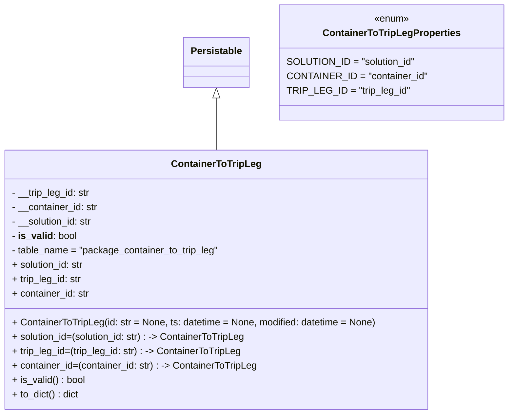

# Diagram: partview_core/partview_service/partview_service/core/datamodel/ContainerToTripLeg.py

> Auto-generated by Obscura crawlers

## Mermaid

### SVG

<svg id="container" width="828.4765625" xmlns="http://www.w3.org/2000/svg" class="classDiagram" height="690" viewBox="0 0 828.4765625 690" role="graphics-document document" aria-roledescription="class"><g><defs><marker id="container_class-aggregationStart" class="marker aggregation class" refX="18" refY="7" markerWidth="190" markerHeight="240" orient="auto"><path d="M 18,7 L9,13 L1,7 L9,1 Z"></path></marker></defs><defs><marker id="container_class-aggregationEnd" class="marker aggregation class" refX="1" refY="7" markerWidth="20" markerHeight="28" orient="auto"><path d="M 18,7 L9,13 L1,7 L9,1 Z"></path></marker></defs><defs><marker id="container_class-extensionStart" class="marker extension class" refX="18" refY="7" markerWidth="190" markerHeight="240" orient="auto"><path d="M 1,7 L18,13 V 1 Z"></path></marker></defs><defs><marker id="container_class-extensionEnd" class="marker extension class" refX="1" refY="7" markerWidth="20" markerHeight="28" orient="auto"><path d="M 1,1 V 13 L18,7 Z"></path></marker></defs><defs><marker id="container_class-compositionStart" class="marker composition class" refX="18" refY="7" markerWidth="190" markerHeight="240" orient="auto"><path d="M 18,7 L9,13 L1,7 L9,1 Z"></path></marker></defs><defs><marker id="container_class-compositionEnd" class="marker composition class" refX="1" refY="7" markerWidth="20" markerHeight="28" orient="auto"><path d="M 18,7 L9,13 L1,7 L9,1 Z"></path></marker></defs><defs><marker id="container_class-dependencyStart" class="marker dependency class" refX="6" refY="7" markerWidth="190" markerHeight="240" orient="auto"><path d="M 5,7 L9,13 L1,7 L9,1 Z"></path></marker></defs><defs><marker id="container_class-dependencyEnd" class="marker dependency class" refX="13" refY="7" markerWidth="20" markerHeight="28" orient="auto"><path d="M 18,7 L9,13 L14,7 L9,1 Z"></path></marker></defs><defs><marker id="container_class-lollipopStart" class="marker lollipop class" refX="13" refY="7" markerWidth="190" markerHeight="240" orient="auto"><circle stroke="black" fill="transparent" cx="7" cy="7" r="6"></circle></marker></defs><defs><marker id="container_class-lollipopEnd" class="marker lollipop class" refX="1" refY="7" markerWidth="190" markerHeight="240" orient="auto"><circle stroke="black" fill="transparent" cx="7" cy="7" r="6"></circle></marker></defs><g class="root"><g class="clusters"></g><g class="edgePaths"><path d="M360.07,163.25L360.07,173.542C360.07,183.833,360.07,204.417,360.07,218.875C360.07,233.333,360.07,241.667,360.07,245.833L360.07,250" id="id_Persistable_ContainerToTripLeg_1" class="edge-thickness-normal edge-pattern-solid relation" style=";;;" data-edge="true" data-et="edge" data-id="id_Persistable_ContainerToTripLeg_1" data-points="W3sieCI6MzYwLjA3MDMxMjUsInkiOjE0Nn0seyJ4IjozNjAuMDcwMzEyNSwieSI6MjI1fSx7IngiOjM2MC4wNzAzMTI1LCJ5IjoyNTB9XQ==" marker-start="url(#container_class-extensionStart)"></path></g><g class="edgeLabels"><g class="edgeLabel"><g class="label" data-id="id_Persistable_ContainerToTripLeg_1" transform="translate(0, 0)"><foreignObject width="0" height="0">

</foreignObject></g></g></g><g class="nodes"><g class="node default" id="classId-Persistable-0" transform="translate(360.0703125, 104)"><g class="basic label-container"><path d="M-52.9765625 -42 L52.9765625 -42 L52.9765625 42 L-52.9765625 42" stroke="none" stroke-width="0" fill="#ECECFF" style=""></path><path d="M-52.9765625 -42 C-17.771304337286196 -42, 17.433953825427608 -42, 52.9765625 -42 M-52.9765625 -42 C-29.491163772309566 -42, -6.005765044619132 -42, 52.9765625 -42 M52.9765625 -42 C52.9765625 -16.506560664525306, 52.9765625 8.986878670949388, 52.9765625 42 M52.9765625 -42 C52.9765625 -12.83357872273574, 52.9765625 16.33284255452852, 52.9765625 42 M52.9765625 42 C20.58905445797322 42, -11.798453584053561 42, -52.9765625 42 M52.9765625 42 C10.900740320925145 42, -31.17508185814971 42, -52.9765625 42 M-52.9765625 42 C-52.9765625 12.872913911633049, -52.9765625 -16.254172176733903, -52.9765625 -42 M-52.9765625 42 C-52.9765625 9.707026087142317, -52.9765625 -22.585947825715365, -52.9765625 -42" stroke="#9370DB" stroke-width="1.3" fill="none" stroke-dasharray="0 0" style=""></path></g><g class="annotation-group text" transform="translate(0, -18)"></g><g class="label-group text" transform="translate(-40.9765625, -18)"><g class="label" style="font-weight: bolder" transform="translate(0,-12)"><foreignObject width="81.953125" height="24">

Persistable

</foreignObject></g></g><g class="members-group text" transform="translate(-40.9765625, 30)"></g><g class="methods-group text" transform="translate(-40.9765625, 60)"></g><g class="divider" style=""><path d="M-52.9765625 6 C-11.550198890275723 6, 29.876164719448553 6, 52.9765625 6 M-52.9765625 6 C-11.64425857025676 6, 29.68804535948648 6, 52.9765625 6" stroke="#9370DB" stroke-width="1.3" fill="none" stroke-dasharray="0 0" style=""></path></g><g class="divider" style=""><path d="M-52.9765625 24 C-27.17662956440681 24, -1.3766966288136189 24, 52.9765625 24 M-52.9765625 24 C-28.266188720753707 24, -3.555814941507414 24, 52.9765625 24" stroke="#9370DB" stroke-width="1.3" fill="none" stroke-dasharray="0 0" style=""></path></g></g><g class="node default" id="classId-ContainerToTripLegProperties-1" transform="translate(641.76171875, 104)"><g class="basic label-container"><path d="M-178.71484375 -96 L178.71484375 -96 L178.71484375 96 L-178.71484375 96" stroke="none" stroke-width="0" fill="#ECECFF" style=""></path><path d="M-178.71484375 -96 C-86.51769252870592 -96, 5.679458692588156 -96, 178.71484375 -96 M-178.71484375 -96 C-88.06409826668732 -96, 2.5866472166253516 -96, 178.71484375 -96 M178.71484375 -96 C178.71484375 -25.830357418774057, 178.71484375 44.33928516245189, 178.71484375 96 M178.71484375 -96 C178.71484375 -54.75961681865904, 178.71484375 -13.51923363731808, 178.71484375 96 M178.71484375 96 C105.8524010529814 96, 32.98995835596281 96, -178.71484375 96 M178.71484375 96 C87.51973277286963 96, -3.6753782042607384 96, -178.71484375 96 M-178.71484375 96 C-178.71484375 56.89253086798476, -178.71484375 17.78506173596952, -178.71484375 -96 M-178.71484375 96 C-178.71484375 55.156485958777566, -178.71484375 14.312971917555132, -178.71484375 -96" stroke="#9370DB" stroke-width="1.3" fill="none" stroke-dasharray="0 0" style=""></path></g><g class="annotation-group text" transform="translate(-29.53125, -72)"><g class="label" style="" transform="translate(0,-12)"><foreignObject width="59.0625" height="24">

«enum»

</foreignObject></g></g><g class="label-group text" transform="translate(-109.5078125, -48)"><g class="label" style="font-weight: bolder" transform="translate(0,-12)"><foreignObject width="219.015625" height="24">

ContainerToTripLegProperties

</foreignObject></g></g><g class="members-group text" transform="translate(-166.71484375, 0)"><g class="label" style="" transform="translate(0,-12)"><foreignObject width="207.609375" height="24">

SOLUTION_ID = "solution_id"

</foreignObject></g><g class="label" style="" transform="translate(0,12)"><foreignObject width="223.921875" height="24">

CONTAINER_ID = "container_id"

</foreignObject></g><g class="label" style="" transform="translate(0,36)"><foreignObject width="195.796875" height="24">

TRIP_LEG_ID = "trip_leg_id"

</foreignObject></g></g><g class="methods-group text" transform="translate(-166.71484375, 96)"></g><g class="divider" style=""><path d="M-178.71484375 -24 C-78.6020466878171 -24, 21.510750374365813 -24, 178.71484375 -24 M-178.71484375 -24 C-43.5425850015352 -24, 91.6296737469296 -24, 178.71484375 -24" stroke="#9370DB" stroke-width="1.3" fill="none" stroke-dasharray="0 0" style=""></path></g><g class="divider" style=""><path d="M-178.71484375 72 C-51.445657394248 72, 75.823528961504 72, 178.71484375 72 M-178.71484375 72 C-37.760307033696506 72, 103.19422968260699 72, 178.71484375 72" stroke="#9370DB" stroke-width="1.3" fill="none" stroke-dasharray="0 0" style=""></path></g></g><g class="node default" id="classId-ContainerToTripLeg-2" transform="translate(360.0703125, 466)"><g class="basic label-container"><path d="M-352.0703125 -216 L352.0703125 -216 L352.0703125 216 L-352.0703125 216" stroke="none" stroke-width="0" fill="#ECECFF" style=""></path><path d="M-352.0703125 -216 C-107.94990571547763 -216, 136.17050106904475 -216, 352.0703125 -216 M-352.0703125 -216 C-85.4502705080289 -216, 181.1697714839422 -216, 352.0703125 -216 M352.0703125 -216 C352.0703125 -122.03437682679655, 352.0703125 -28.06875365359309, 352.0703125 216 M352.0703125 -216 C352.0703125 -100.08177625337467, 352.0703125 15.83644749325066, 352.0703125 216 M352.0703125 216 C109.04679548149036 216, -133.97672153701927 216, -352.0703125 216 M352.0703125 216 C191.26636628840316 216, 30.462420076806325 216, -352.0703125 216 M-352.0703125 216 C-352.0703125 52.02028724169679, -352.0703125 -111.95942551660642, -352.0703125 -216 M-352.0703125 216 C-352.0703125 108.75160929653684, -352.0703125 1.503218593073683, -352.0703125 -216" stroke="#9370DB" stroke-width="1.3" fill="none" stroke-dasharray="0 0" style=""></path></g><g class="annotation-group text" transform="translate(0, -192)"></g><g class="label-group text" transform="translate(-71.203125, -192)"><g class="label" style="font-weight: bolder" transform="translate(0,-12)"><foreignObject width="142.40625" height="24">

ContainerToTripLeg

</foreignObject></g></g><g class="members-group text" transform="translate(-340.0703125, -144)"><g class="label" style="" transform="translate(0,-12)"><foreignObject width="132.28125" height="24">

- __trip_leg_id: str

</foreignObject></g><g class="label" style="" transform="translate(0,12)"><foreignObject width="144.6875" height="24">

- __container_id: str

</foreignObject></g><g class="label" style="" transform="translate(0,36)"><foreignObject width="136.90625" height="24">

- __solution_id: str

</foreignObject></g><g class="label" style="" transform="translate(0,60)"><foreignObject width="106.765625" height="24">

- <strong>is_valid</strong>: bool

</foreignObject></g><g class="label" style="" transform="translate(0,84)"><foreignObject width="346.25" height="24">

- table_name = "package_container_to_trip_leg"

</foreignObject></g><g class="label" style="" transform="translate(0,108)"><foreignObject width="121.953125" height="24">

+ solution_id: str

</foreignObject></g><g class="label" style="" transform="translate(0,132)"><foreignObject width="117.65625" height="24">

+ trip_leg_id: str

</foreignObject></g><g class="label" style="" transform="translate(0,156)"><foreignObject width="130.0625" height="24">

+ container_id: str

</foreignObject></g></g><g class="methods-group text" transform="translate(-340.0703125, 72)"><g class="label" style="" transform="translate(0,-12)"><foreignObject width="608.9375" height="24">

+ ContainerToTripLeg(id: str = None, ts: datetime = None, modified: datetime = None)

</foreignObject></g><g class="label" style="" transform="translate(0,12)"><foreignObject width="393.40625" height="24">

+ solution_id=(solution_id: str) : -&gt; ContainerToTripLeg

</foreignObject></g><g class="label" style="" transform="translate(0,36)"><foreignObject width="384.796875" height="24">

+ trip_leg_id=(trip_leg_id: str) : -&gt; ContainerToTripLeg

</foreignObject></g><g class="label" style="" transform="translate(0,60)"><foreignObject width="409.59375" height="24">

+ container_id=(container_id: str) : -&gt; ContainerToTripLeg

</foreignObject></g><g class="label" style="" transform="translate(0,84)"><foreignObject width="122.234375" height="24">

+ is_valid() : bool

</foreignObject></g><g class="label" style="" transform="translate(0,108)"><foreignObject width="112.484375" height="24">

+ to_dict() : dict

</foreignObject></g></g><g class="divider" style=""><path d="M-352.0703125 -168 C-196.9742556836371 -168, -41.87819886727419 -168, 352.0703125 -168 M-352.0703125 -168 C-149.91742436008437 -168, 52.235463779831264 -168, 352.0703125 -168" stroke="#9370DB" stroke-width="1.3" fill="none" stroke-dasharray="0 0" style=""></path></g><g class="divider" style=""><path d="M-352.0703125 48 C-108.56377965566696 48, 134.94275318866607 48, 352.0703125 48 M-352.0703125 48 C-174.39122905573194 48, 3.287854388536118 48, 352.0703125 48" stroke="#9370DB" stroke-width="1.3" fill="none" stroke-dasharray="0 0" style=""></path></g></g></g></g></g></svg>
