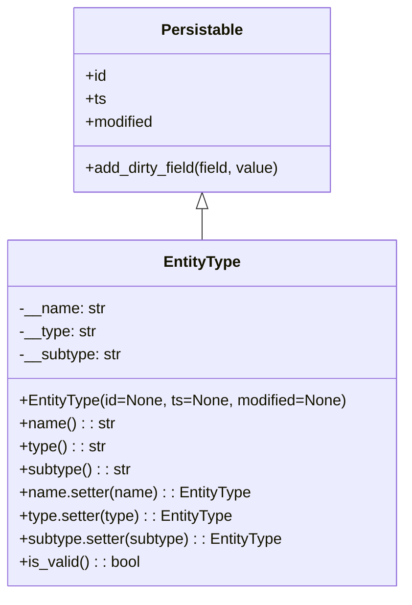

# Diagram: partview_core/partview_service/partview_service/core/datamodel/EntityType.py

> Auto-generated by Obscura crawlers

## Mermaid

### SVG

<svg id="container" width="419.2265625" xmlns="http://www.w3.org/2000/svg" class="classDiagram" height="618" viewBox="0 0 419.2265625 618" role="graphics-document document" aria-roledescription="class"><g><defs><marker id="container_class-aggregationStart" class="marker aggregation class" refX="18" refY="7" markerWidth="190" markerHeight="240" orient="auto"><path d="M 18,7 L9,13 L1,7 L9,1 Z"></path></marker></defs><defs><marker id="container_class-aggregationEnd" class="marker aggregation class" refX="1" refY="7" markerWidth="20" markerHeight="28" orient="auto"><path d="M 18,7 L9,13 L1,7 L9,1 Z"></path></marker></defs><defs><marker id="container_class-extensionStart" class="marker extension class" refX="18" refY="7" markerWidth="190" markerHeight="240" orient="auto"><path d="M 1,7 L18,13 V 1 Z"></path></marker></defs><defs><marker id="container_class-extensionEnd" class="marker extension class" refX="1" refY="7" markerWidth="20" markerHeight="28" orient="auto"><path d="M 1,1 V 13 L18,7 Z"></path></marker></defs><defs><marker id="container_class-compositionStart" class="marker composition class" refX="18" refY="7" markerWidth="190" markerHeight="240" orient="auto"><path d="M 18,7 L9,13 L1,7 L9,1 Z"></path></marker></defs><defs><marker id="container_class-compositionEnd" class="marker composition class" refX="1" refY="7" markerWidth="20" markerHeight="28" orient="auto"><path d="M 18,7 L9,13 L1,7 L9,1 Z"></path></marker></defs><defs><marker id="container_class-dependencyStart" class="marker dependency class" refX="6" refY="7" markerWidth="190" markerHeight="240" orient="auto"><path d="M 5,7 L9,13 L1,7 L9,1 Z"></path></marker></defs><defs><marker id="container_class-dependencyEnd" class="marker dependency class" refX="13" refY="7" markerWidth="20" markerHeight="28" orient="auto"><path d="M 18,7 L9,13 L14,7 L9,1 Z"></path></marker></defs><defs><marker id="container_class-lollipopStart" class="marker lollipop class" refX="13" refY="7" markerWidth="190" markerHeight="240" orient="auto"><circle stroke="black" fill="transparent" cx="7" cy="7" r="6"></circle></marker></defs><defs><marker id="container_class-lollipopEnd" class="marker lollipop class" refX="1" refY="7" markerWidth="190" markerHeight="240" orient="auto"><circle stroke="black" fill="transparent" cx="7" cy="7" r="6"></circle></marker></defs><g class="root"><g class="clusters"></g><g class="edgePaths"><path d="M209.613,217.25L209.613,218.542C209.613,219.833,209.613,222.417,209.613,227.875C209.613,233.333,209.613,241.667,209.613,245.833L209.613,250" id="id_Persistable_EntityType_1" class="edge-thickness-normal edge-pattern-solid relation" style=";;;" data-edge="true" data-et="edge" data-id="id_Persistable_EntityType_1" data-points="W3sieCI6MjA5LjYxMzI4MTI1LCJ5IjoyMDB9LHsieCI6MjA5LjYxMzI4MTI1LCJ5IjoyMjV9LHsieCI6MjA5LjYxMzI4MTI1LCJ5IjoyNTB9XQ==" marker-start="url(#container_class-extensionStart)"></path></g><g class="edgeLabels"><g class="edgeLabel"><g class="label" data-id="id_Persistable_EntityType_1" transform="translate(0, 0)"><foreignObject width="0" height="0">

</foreignObject></g></g></g><g class="nodes"><g class="node default" id="classId-Persistable-0" transform="translate(209.61328125, 104)"><g class="basic label-container"><path d="M-135.71484375 -96 L135.71484375 -96 L135.71484375 96 L-135.71484375 96" stroke="none" stroke-width="0" fill="#ECECFF" style=""></path><path d="M-135.71484375 -96 C-52.37392816322824 -96, 30.966987423543515 -96, 135.71484375 -96 M-135.71484375 -96 C-57.895623683845116 -96, 19.923596382309768 -96, 135.71484375 -96 M135.71484375 -96 C135.71484375 -49.79481284201432, 135.71484375 -3.589625684028647, 135.71484375 96 M135.71484375 -96 C135.71484375 -53.11873606124074, 135.71484375 -10.237472122481478, 135.71484375 96 M135.71484375 96 C29.134367728798722 96, -77.44610829240256 96, -135.71484375 96 M135.71484375 96 C38.53676274388165 96, -58.641318262236695 96, -135.71484375 96 M-135.71484375 96 C-135.71484375 35.15343554633363, -135.71484375 -25.693128907332735, -135.71484375 -96 M-135.71484375 96 C-135.71484375 42.182354648813075, -135.71484375 -11.635290702373851, -135.71484375 -96" stroke="#9370DB" stroke-width="1.3" fill="none" stroke-dasharray="0 0" style=""></path></g><g class="annotation-group text" transform="translate(0, -72)"></g><g class="label-group text" transform="translate(-40.9765625, -72)"><g class="label" style="font-weight: bolder" transform="translate(0,-12)"><foreignObject width="81.953125" height="24">

Persistable

</foreignObject></g></g><g class="members-group text" transform="translate(-123.71484375, -24)"><g class="label" style="" transform="translate(0,-12)"><foreignObject width="22.078125" height="24">

+id

</foreignObject></g><g class="label" style="" transform="translate(0,12)"><foreignObject width="21.15625" height="24">

+ts

</foreignObject></g><g class="label" style="" transform="translate(0,36)"><foreignObject width="72.609375" height="24">

+modified

</foreignObject></g></g><g class="methods-group text" transform="translate(-123.71484375, 72)"><g class="label" style="" transform="translate(0,-12)"><foreignObject width="206.453125" height="24">

+add_dirty_field(field, value)

</foreignObject></g></g><g class="divider" style=""><path d="M-135.71484375 -48 C-77.258080113385 -48, -18.801316476769998 -48, 135.71484375 -48 M-135.71484375 -48 C-71.85253958625825 -48, -7.990235422516491 -48, 135.71484375 -48" stroke="#9370DB" stroke-width="1.3" fill="none" stroke-dasharray="0 0" style=""></path></g><g class="divider" style=""><path d="M-135.71484375 48 C-74.01852064811075 48, -12.322197546221517 48, 135.71484375 48 M-135.71484375 48 C-56.30963875854307 48, 23.095566232913853 48, 135.71484375 48" stroke="#9370DB" stroke-width="1.3" fill="none" stroke-dasharray="0 0" style=""></path></g></g><g class="node default" id="classId-EntityType-1" transform="translate(209.61328125, 430)"><g class="basic label-container"><path d="M-201.61328125 -180 L201.61328125 -180 L201.61328125 180 L-201.61328125 180" stroke="none" stroke-width="0" fill="#ECECFF" style=""></path><path d="M-201.61328125 -180 C-53.41360987907112 -180, 94.78606149185777 -180, 201.61328125 -180 M-201.61328125 -180 C-116.84279848945181 -180, -32.07231572890362 -180, 201.61328125 -180 M201.61328125 -180 C201.61328125 -46.960074285503254, 201.61328125 86.07985142899349, 201.61328125 180 M201.61328125 -180 C201.61328125 -97.43844885995095, 201.61328125 -14.876897719901905, 201.61328125 180 M201.61328125 180 C80.64538802665375 180, -40.322505196692504 180, -201.61328125 180 M201.61328125 180 C98.4804782040075 180, -4.652324841985006 180, -201.61328125 180 M-201.61328125 180 C-201.61328125 99.79756372520811, -201.61328125 19.595127450416214, -201.61328125 -180 M-201.61328125 180 C-201.61328125 90.85562950011222, -201.61328125 1.7112590002244303, -201.61328125 -180" stroke="#9370DB" stroke-width="1.3" fill="none" stroke-dasharray="0 0" style=""></path></g><g class="annotation-group text" transform="translate(0, -156)"></g><g class="label-group text" transform="translate(-38.6171875, -156)"><g class="label" style="font-weight: bolder" transform="translate(0,-12)"><foreignObject width="77.234375" height="24">

EntityType

</foreignObject></g></g><g class="members-group text" transform="translate(-189.61328125, -108)"><g class="label" style="" transform="translate(0,-12)"><foreignObject width="89.671875" height="24">

-__name: str

</foreignObject></g><g class="label" style="" transform="translate(0,12)"><foreignObject width="80.625" height="24">

-__type: str

</foreignObject></g><g class="label" style="" transform="translate(0,36)"><foreignObject width="107.234375" height="24">

-__subtype: str

</foreignObject></g></g><g class="methods-group text" transform="translate(-189.61328125, -12)"><g class="label" style="" transform="translate(0,-12)"><foreignObject width="340.609375" height="24">

+EntityType(id=None, ts=None, modified=None)

</foreignObject></g><g class="label" style="" transform="translate(0,12)"><foreignObject width="98.703125" height="24">

+name() : : str

</foreignObject></g><g class="label" style="" transform="translate(0,36)"><foreignObject width="89.890625" height="24">

+type() : : str

</foreignObject></g><g class="label" style="" transform="translate(0,60)"><foreignObject width="116.265625" height="24">

+subtype() : : str

</foreignObject></g><g class="label" style="" transform="translate(0,84)"><foreignObject width="241.28125" height="24">

+name.setter(name) : : EntityType

</foreignObject></g><g class="label" style="" transform="translate(0,108)"><foreignObject width="223.765625" height="24">

+type.setter(type) : : EntityType

</foreignObject></g><g class="label" style="" transform="translate(0,132)"><foreignObject width="276.421875" height="24">

+subtype.setter(subtype) : : EntityType

</foreignObject></g><g class="label" style="" transform="translate(0,156)"><foreignObject width="126.078125" height="24">

+is_valid() : : bool

</foreignObject></g></g><g class="divider" style=""><path d="M-201.61328125 -132 C-108.349390133599 -132, -15.085499017198003 -132, 201.61328125 -132 M-201.61328125 -132 C-113.71194260299396 -132, -25.810603955987915 -132, 201.61328125 -132" stroke="#9370DB" stroke-width="1.3" fill="none" stroke-dasharray="0 0" style=""></path></g><g class="divider" style=""><path d="M-201.61328125 -36 C-67.82259893019929 -36, 65.96808338960142 -36, 201.61328125 -36 M-201.61328125 -36 C-92.5236727415913 -36, 16.565935766817404 -36, 201.61328125 -36" stroke="#9370DB" stroke-width="1.3" fill="none" stroke-dasharray="0 0" style=""></path></g></g></g></g></g></svg>
