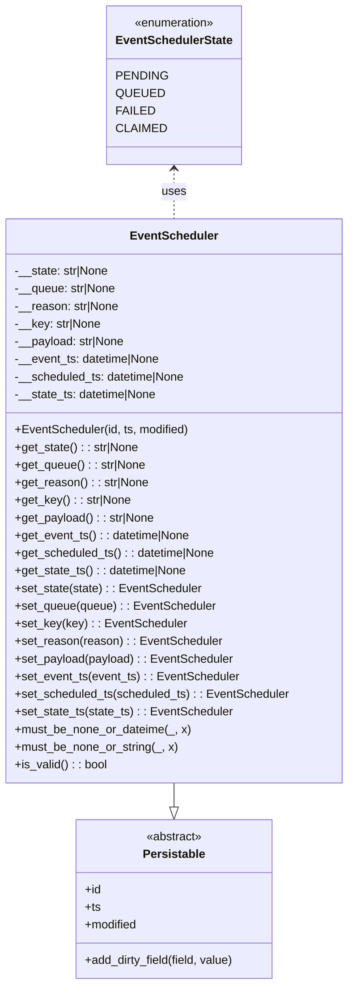

# Diagram: partview_core/partview_service/partview_service/core/datamodel/EventScheduler.py

> Auto-generated by Obscura crawlers

## Mermaid

```mermaid
classDiagram
class EventSchedulerState <<enumeration>> {
  PENDING
  QUEUED
  FAILED
  CLAIMED
}
class Persistable {
  <<abstract>>
  +id
  +ts
  +modified
  +add_dirty_field(field, value)
}
class EventScheduler {
  -__state: str|None
  -__queue: str|None
  -__reason: str|None
  -__key: str|None
  -__payload: str|None
  -__event_ts: datetime|None
  -__scheduled_ts: datetime|None
  -__state_ts: datetime|None
  +EventScheduler(id, ts, modified)
  +get_state(): str|None
  +get_queue(): str|None
  +get_reason(): str|None
  +get_key(): str|None
  +get_payload(): str|None
  +get_event_ts(): datetime|None
  +get_scheduled_ts(): datetime|None
  +get_state_ts(): datetime|None
  +set_state(state): EventScheduler
  +set_queue(queue): EventScheduler
  +set_key(key): EventScheduler
  +set_reason(reason): EventScheduler
  +set_payload(payload): EventScheduler
  +set_event_ts(event_ts): EventScheduler
  +set_scheduled_ts(scheduled_ts): EventScheduler
  +set_state_ts(state_ts): EventScheduler
  +must_be_none_or_dateime(_, x)
  +must_be_none_or_string(_, x)
  +is_valid(): bool
}
EventScheduler --|> Persistable
EventSchedulerState <.. EventScheduler : uses
```

> SVG rendering failed for this diagram.
