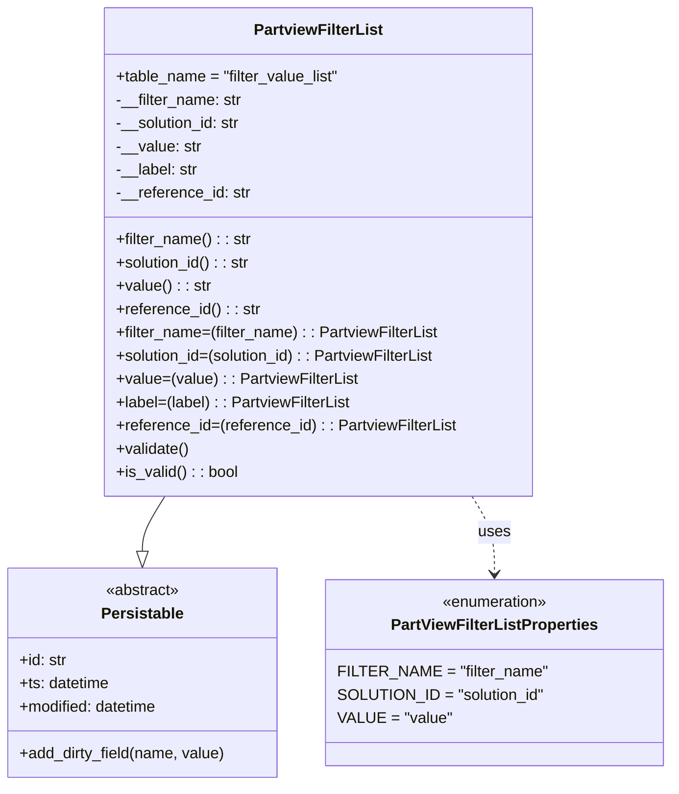

# Diagram: partview_core/partview_service/partview_service/core/datamodel/FilterList.py

> Auto-generated by Obscura crawlers

## Mermaid

### SVG

<svg id="container" width="680.078125" xmlns="http://www.w3.org/2000/svg" class="classDiagram" height="810" viewBox="0 0 680.078125 810" role="graphics-document document" aria-roledescription="class"><g><defs><marker id="container_class-aggregationStart" class="marker aggregation class" refX="18" refY="7" markerWidth="190" markerHeight="240" orient="auto"><path d="M 18,7 L9,13 L1,7 L9,1 Z"></path></marker></defs><defs><marker id="container_class-aggregationEnd" class="marker aggregation class" refX="1" refY="7" markerWidth="20" markerHeight="28" orient="auto"><path d="M 18,7 L9,13 L1,7 L9,1 Z"></path></marker></defs><defs><marker id="container_class-extensionStart" class="marker extension class" refX="18" refY="7" markerWidth="190" markerHeight="240" orient="auto"><path d="M 1,7 L18,13 V 1 Z"></path></marker></defs><defs><marker id="container_class-extensionEnd" class="marker extension class" refX="1" refY="7" markerWidth="20" markerHeight="28" orient="auto"><path d="M 1,1 V 13 L18,7 Z"></path></marker></defs><defs><marker id="container_class-compositionStart" class="marker composition class" refX="18" refY="7" markerWidth="190" markerHeight="240" orient="auto"><path d="M 18,7 L9,13 L1,7 L9,1 Z"></path></marker></defs><defs><marker id="container_class-compositionEnd" class="marker composition class" refX="1" refY="7" markerWidth="20" markerHeight="28" orient="auto"><path d="M 18,7 L9,13 L1,7 L9,1 Z"></path></marker></defs><defs><marker id="container_class-dependencyStart" class="marker dependency class" refX="6" refY="7" markerWidth="190" markerHeight="240" orient="auto"><path d="M 5,7 L9,13 L1,7 L9,1 Z"></path></marker></defs><defs><marker id="container_class-dependencyEnd" class="marker dependency class" refX="13" refY="7" markerWidth="20" markerHeight="28" orient="auto"><path d="M 18,7 L9,13 L14,7 L9,1 Z"></path></marker></defs><defs><marker id="container_class-lollipopStart" class="marker lollipop class" refX="13" refY="7" markerWidth="190" markerHeight="240" orient="auto"><circle stroke="black" fill="transparent" cx="7" cy="7" r="6"></circle></marker></defs><defs><marker id="container_class-lollipopEnd" class="marker lollipop class" refX="1" refY="7" markerWidth="190" markerHeight="240" orient="auto"><circle stroke="black" fill="transparent" cx="7" cy="7" r="6"></circle></marker></defs><g class="root"><g class="clusters"></g><g class="edgePaths"><path d="M170.703,512L166.894,518.167C163.085,524.333,155.466,536.667,151.657,546.125C147.848,555.583,147.848,562.167,147.848,565.458L147.848,568.75" id="id_PartviewFilterList_Persistable_1" class="edge-thickness-normal edge-pattern-solid relation" style=";;;" data-edge="true" data-et="edge" data-id="id_PartviewFilterList_Persistable_1" data-points="W3sieCI6MTcwLjcwMzA5Nzk2NzEyODAzLCJ5Ijo1MTJ9LHsieCI6MTQ3Ljg0NzY1NjI1LCJ5Ijo1NDl9LHsieCI6MTQ3Ljg0NzY1NjI1LCJ5Ijo1ODZ9XQ==" marker-end="url(#container_class-extensionEnd)"></path><path d="M482.031,512L485.841,518.167C489.65,524.333,497.268,536.667,501.077,550C504.887,563.333,504.887,577.667,504.887,584.833L504.887,592" id="id_PartviewFilterList_PartViewFilterListProperties_2" class="edge-thickness-normal edge-pattern-dashed relation" style=";;;" data-edge="true" data-et="edge" data-id="id_PartviewFilterList_PartViewFilterListProperties_2" data-points="W3sieCI6NDgyLjAzMTI3NzAzMjg3MTk3LCJ5Ijo1MTJ9LHsieCI6NTA0Ljg4NjcxODc1LCJ5Ijo1NDl9LHsieCI6NTA0Ljg4NjcxODc1LCJ5Ijo1OTh9XQ==" marker-end="url(#container_class-dependencyEnd)"></path></g><g class="edgeLabels"><g class="edgeLabel"><g class="label" data-id="id_PartviewFilterList_Persistable_1" transform="translate(0, 0)"><foreignObject width="0" height="0">

</foreignObject></g></g><g class="edgeLabel" transform="translate(504.88671875, 549)"><g class="label" data-id="id_PartviewFilterList_PartViewFilterListProperties_2" transform="translate(-16.4921875, -12)"><foreignObject width="32.984375" height="24">

uses

</foreignObject></g></g></g><g class="nodes"><g class="node default" id="classId-Persistable-0" transform="translate(147.84765625, 694)"><g class="basic label-container"><path d="M-139.84765625 -108 L139.84765625 -108 L139.84765625 108 L-139.84765625 108" stroke="none" stroke-width="0" fill="#ECECFF" style=""></path><path d="M-139.84765625 -108 C-54.8924854213561 -108, 30.062685407287802 -108, 139.84765625 -108 M-139.84765625 -108 C-32.19248684996673 -108, 75.46268255006655 -108, 139.84765625 -108 M139.84765625 -108 C139.84765625 -28.44289489184702, 139.84765625 51.11421021630596, 139.84765625 108 M139.84765625 -108 C139.84765625 -38.98374820727717, 139.84765625 30.032503585445653, 139.84765625 108 M139.84765625 108 C45.4759880433093 108, -48.8956801633814 108, -139.84765625 108 M139.84765625 108 C42.04672603868272 108, -55.75420417263456 108, -139.84765625 108 M-139.84765625 108 C-139.84765625 29.66341761855334, -139.84765625 -48.67316476289332, -139.84765625 -108 M-139.84765625 108 C-139.84765625 51.53452597971842, -139.84765625 -4.930948040563166, -139.84765625 -108" stroke="#9370DB" stroke-width="1.3" fill="none" stroke-dasharray="0 0" style=""></path></g><g class="annotation-group text" transform="translate(-38.609375, -84)"><g class="label" style="" transform="translate(0,-12)"><foreignObject width="77.21875" height="24">

«abstract»

</foreignObject></g></g><g class="label-group text" transform="translate(-40.9765625, -60)"><g class="label" style="font-weight: bolder" transform="translate(0,-12)"><foreignObject width="81.953125" height="24">

Persistable

</foreignObject></g></g><g class="members-group text" transform="translate(-127.84765625, -12)"><g class="label" style="" transform="translate(0,-12)"><foreignObject width="49.578125" height="24">

+id: str

</foreignObject></g><g class="label" style="" transform="translate(0,12)"><foreignObject width="94.484375" height="24">

+ts: datetime

</foreignObject></g><g class="label" style="" transform="translate(0,36)"><foreignObject width="145.9375" height="24">

+modified: datetime

</foreignObject></g></g><g class="methods-group text" transform="translate(-127.84765625, 84)"><g class="label" style="" transform="translate(0,-12)"><foreignObject width="214.71875" height="24">

+add_dirty_field(name, value)

</foreignObject></g></g><g class="divider" style=""><path d="M-139.84765625 -36 C-56.25712863413429 -36, 27.33339898173142 -36, 139.84765625 -36 M-139.84765625 -36 C-48.60395712873505 -36, 42.639741992529906 -36, 139.84765625 -36" stroke="#9370DB" stroke-width="1.3" fill="none" stroke-dasharray="0 0" style=""></path></g><g class="divider" style=""><path d="M-139.84765625 60 C-41.5461208511814 60, 56.7554145476372 60, 139.84765625 60 M-139.84765625 60 C-79.52582423483034 60, -19.20399221966069 60, 139.84765625 60" stroke="#9370DB" stroke-width="1.3" fill="none" stroke-dasharray="0 0" style=""></path></g></g><g class="node default" id="classId-PartviewFilterList-1" transform="translate(326.3671875, 260)"><g class="basic label-container"><path d="M-219.734375 -252 L219.734375 -252 L219.734375 252 L-219.734375 252" stroke="none" stroke-width="0" fill="#ECECFF" style=""></path><path d="M-219.734375 -252 C-78.76578092589716 -252, 62.20281314820568 -252, 219.734375 -252 M-219.734375 -252 C-89.78059491878025 -252, 40.173185162439495 -252, 219.734375 -252 M219.734375 -252 C219.734375 -56.346787958713236, 219.734375 139.30642408257353, 219.734375 252 M219.734375 -252 C219.734375 -111.55754207511922, 219.734375 28.88491584976157, 219.734375 252 M219.734375 252 C55.01638467289476 252, -109.70160565421048 252, -219.734375 252 M219.734375 252 C118.47679595821391 252, 17.219216916427825 252, -219.734375 252 M-219.734375 252 C-219.734375 139.4883290091442, -219.734375 26.97665801828836, -219.734375 -252 M-219.734375 252 C-219.734375 61.22756449350035, -219.734375 -129.5448710129993, -219.734375 -252" stroke="#9370DB" stroke-width="1.3" fill="none" stroke-dasharray="0 0" style=""></path></g><g class="annotation-group text" transform="translate(0, -228)"></g><g class="label-group text" transform="translate(-63.96875, -228)"><g class="label" style="font-weight: bolder" transform="translate(0,-12)"><foreignObject width="127.9375" height="24">

PartviewFilterList

</foreignObject></g></g><g class="members-group text" transform="translate(-207.734375, -180)"><g class="label" style="" transform="translate(0,-12)"><foreignObject width="232.6875" height="24">

+table_name = "filter_value_list"

</foreignObject></g><g class="label" style="" transform="translate(0,12)"><foreignObject width="130.71875" height="24">

-__filter_name: str

</foreignObject></g><g class="label" style="" transform="translate(0,36)"><foreignObject width="131.390625" height="24">

-__solution_id: str

</foreignObject></g><g class="label" style="" transform="translate(0,60)"><foreignObject width="87.5625" height="24">

-__value: str

</foreignObject></g><g class="label" style="" transform="translate(0,84)"><foreignObject width="85.390625" height="24">

-__label: str

</foreignObject></g><g class="label" style="" transform="translate(0,108)"><foreignObject width="139.421875" height="24">

-__reference_id: str

</foreignObject></g></g><g class="methods-group text" transform="translate(-207.734375, -12)"><g class="label" style="" transform="translate(0,-12)"><foreignObject width="139.8125" height="24">

+filter_name() : : str

</foreignObject></g><g class="label" style="" transform="translate(0,12)"><foreignObject width="140.40625" height="24">

+solution_id() : : str

</foreignObject></g><g class="label" style="" transform="translate(0,36)"><foreignObject width="96.90625" height="24">

+value() : : str

</foreignObject></g><g class="label" style="" transform="translate(0,60)"><foreignObject width="148.4375" height="24">

+reference_id() : : str

</foreignObject></g><g class="label" style="" transform="translate(0,84)"><foreignObject width="334.484375" height="24">

+filter_name=(filter_name) : : PartviewFilterList

</foreignObject></g><g class="label" style="" transform="translate(0,108)"><foreignObject width="335.4375" height="24">

+solution_id=(solution_id) : : PartviewFilterList

</foreignObject></g><g class="label" style="" transform="translate(0,132)"><foreignObject width="248.578125" height="24">

+value=(value) : : PartviewFilterList

</foreignObject></g><g class="label" style="" transform="translate(0,156)"><foreignObject width="243.4375" height="24">

+label=(label) : : PartviewFilterList

</foreignObject></g><g class="label" style="" transform="translate(0,180)"><foreignObject width="351.5" height="24">

+reference_id=(reference_id) : : PartviewFilterList

</foreignObject></g><g class="label" style="" transform="translate(0,204)"><foreignObject width="76.09375" height="24">

+validate()

</foreignObject></g><g class="label" style="" transform="translate(0,228)"><foreignObject width="126.078125" height="24">

+is_valid() : : bool

</foreignObject></g></g><g class="divider" style=""><path d="M-219.734375 -204 C-73.74533888601925 -204, 72.24369722796149 -204, 219.734375 -204 M-219.734375 -204 C-66.02277602484793 -204, 87.68882295030414 -204, 219.734375 -204" stroke="#9370DB" stroke-width="1.3" fill="none" stroke-dasharray="0 0" style=""></path></g><g class="divider" style=""><path d="M-219.734375 -36 C-109.07049924813172 -36, 1.5933765037365504 -36, 219.734375 -36 M-219.734375 -36 C-62.159465397710846 -36, 95.41544420457831 -36, 219.734375 -36" stroke="#9370DB" stroke-width="1.3" fill="none" stroke-dasharray="0 0" style=""></path></g></g><g class="node default" id="classId-PartViewFilterListProperties-2" transform="translate(504.88671875, 694)"><g class="basic label-container"><path d="M-167.19140625 -96 L167.19140625 -96 L167.19140625 96 L-167.19140625 96" stroke="none" stroke-width="0" fill="#ECECFF" style=""></path><path d="M-167.19140625 -96 C-59.719309964419566 -96, 47.75278632116087 -96, 167.19140625 -96 M-167.19140625 -96 C-71.42400662233828 -96, 24.343393005323435 -96, 167.19140625 -96 M167.19140625 -96 C167.19140625 -26.526467365706466, 167.19140625 42.94706526858707, 167.19140625 96 M167.19140625 -96 C167.19140625 -41.93137069196283, 167.19140625 12.137258616074334, 167.19140625 96 M167.19140625 96 C78.18845216310028 96, -10.81450192379944 96, -167.19140625 96 M167.19140625 96 C34.28700617955437 96, -98.61739389089126 96, -167.19140625 96 M-167.19140625 96 C-167.19140625 46.364573920784935, -167.19140625 -3.270852158430131, -167.19140625 -96 M-167.19140625 96 C-167.19140625 54.14117557439664, -167.19140625 12.282351148793282, -167.19140625 -96" stroke="#9370DB" stroke-width="1.3" fill="none" stroke-dasharray="0 0" style=""></path></g><g class="annotation-group text" transform="translate(-55.5546875, -72)"><g class="label" style="" transform="translate(0,-12)"><foreignObject width="111.109375" height="24">

«enumeration»

</foreignObject></g></g><g class="label-group text" transform="translate(-102.7734375, -48)"><g class="label" style="font-weight: bolder" transform="translate(0,-12)"><foreignObject width="205.546875" height="24">

PartViewFilterListProperties

</foreignObject></g></g><g class="members-group text" transform="translate(-155.19140625, 0)"><g class="label" style="" transform="translate(0,-12)"><foreignObject width="206.125" height="24">

FILTER_NAME = "filter_name"

</foreignObject></g><g class="label" style="" transform="translate(0,12)"><foreignObject width="207.609375" height="24">

SOLUTION_ID = "solution_id"

</foreignObject></g><g class="label" style="" transform="translate(0,36)"><foreignObject width="112.53125" height="24">

VALUE = "value"

</foreignObject></g></g><g class="methods-group text" transform="translate(-155.19140625, 96)"></g><g class="divider" style=""><path d="M-167.19140625 -24 C-83.30360118024446 -24, 0.5842038895110875 -24, 167.19140625 -24 M-167.19140625 -24 C-82.37011019168554 -24, 2.4511858666289186 -24, 167.19140625 -24" stroke="#9370DB" stroke-width="1.3" fill="none" stroke-dasharray="0 0" style=""></path></g><g class="divider" style=""><path d="M-167.19140625 72 C-99.54997717583157 72, -31.908548101663143 72, 167.19140625 72 M-167.19140625 72 C-42.01329429935714 72, 83.16481765128572 72, 167.19140625 72" stroke="#9370DB" stroke-width="1.3" fill="none" stroke-dasharray="0 0" style=""></path></g></g></g></g></g></svg>
